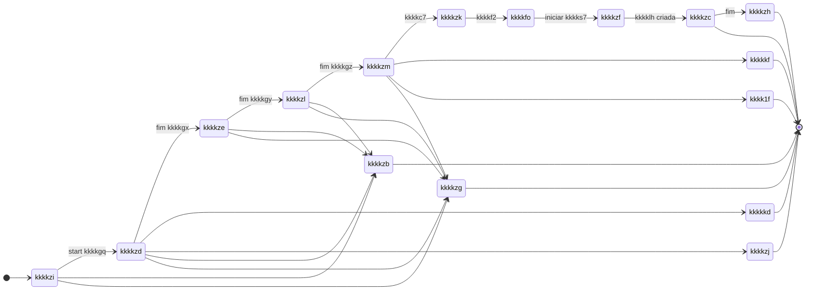

# kkkkx0 de estados da kkkk3l — kkkkho

Estados da **kkkk3l** ao longo da kkkksn de kkkklh. Este kkkkta descreve o **modelo de domínio do estado da kkkk3l**, distinto do kkkkvr kkkkhk: **kkkkhk = kkkk53 (kkkkvr)**; **kkkkal = estado de kkkkag da kkkk3l**. Essa separação evita kkkkyk entre kkkk55 e domínio.

Alinhado a [kkkk1y](kkkk1y) e [kkkk29](../kkkk7p/kkkk29).

**Relação com outros documentos:**

| Documento | Relação |
| ----------- | --------- |
| [kkkk1y](kkkk1y) | Eventos que podem mudar o estado (kkkkgu, retomar, etc.) |
| [kkkkva](kkkkva) | Estado persistido nas kkkkvo do kkkkh0 |
| [kkkku8](kkkku8) | Onde ocorre cada transição (kkkkgx–4, kkkk7y) |
| [kkkku9](kkkku9) | Quem dispara as transições (kkkkiq que atualizam kkkk3l) |

---

## 1. Tipos de estado

### Estados ativos

- kkkkzi
- kkkkzd
- kkkkze
- kkkkzl
- kkkkzm
- kkkkzk
- kkkkfo
- kkkkzf

### Estados finais

- kkkkzc
- kkkkzh

### Estados de exceção

- kkkkkd
- kkkkzj
- kkkk1f
- kkkkkf
- kkkkza
- kkkkzb
- kkkkzg
- kkkkkg

---

## 2. kkkk5v da máquina de estados

---

## 3. Tabela formal de transições

### kkkkvq principal

| De | kkkkyc | Para |
| ---- | -------- | ------ |
| kkkkzi | start kkkkgq | kkkkzd |
| kkkkzd | fim kkkkgx | kkkkze |
| kkkkze | fim kkkkgy | kkkkzl |
| kkkkzl | fim kkkkgz | kkkkzm |
| kkkkzm | kkkkc7 | kkkkzk |
| kkkkzk | kkkkf2 | kkkkfo |
| kkkkfo | iniciar kkkks7 | kkkkzf |
| kkkkzf | kkkklh criada | kkkkzc |
| kkkkzc | fim | kkkkzh |

### Fluxos de exceção

| De | kkkkyc | Para |
| ---- | -------- | ------ |
| kkkkzd | kkkklv | kkkkkd |
| kkkkzd | não elegível | kkkkzj |
| kkkkzm | kkkkdu | kkkk1f |
| kkkkzm | kkkkjv | kkkkkf |
| (vários ativos) | cancelamento | kkkkzb |
| (vários ativos) | timer / kkkkyo | kkkkzg |

---

## 4. Uso na retomada e kkkk3w

kkkklg deve estar **ativa** (não kkkkzh, kkkkzb nem kkkkzg) para retomar. Se expirada ou encerrada, a retomada deve ser **negada**. Ver [kkkk1y](kkkk1y) e kkkk7p [JORNADA-DEC-001](../kkkk7p/kkkk29).

---

## 5. Referências

- [kkkk1y](kkkk1y)
- [kkkk29](../kkkk7p/kkkk29)
- [kkkk3b](../kkkk5e%20da%20decomposição/kkkk3b)
