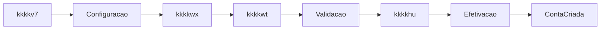

# kkkkx0 de jornadas (User Journeys) — kkkkho

Conecta **kkkklz e canais** ao kkkkhk: como o kkkk38 e o kkkk1x vivem a kkkkgq, incluindo kkkk3w, continuação remota e fallback.

A kkkkgq do usuário percorre etapas que correspondem aos **kkkk0n kkkkye pelo kkkkfz**. Cada etapa da kkkklz mapeia para um kkkkft (kkkke2, kkkkwx, kkkkwt, kkkk56, kkkk7y).

**Fonte:** transcrições, DIVISAO_BPMN_V2_NOVA_JORNADA, kkkkwu (kkkkuz, kkkkfd).

---

## 1. Jornada principal (kkkk38 inicia, kkkk1x completa)



*Legenda:* kkkke2 = kkkkgx | kkkkwx = kkkkgy | kkkkwt = kkkkgz | kkkk56 = kkkkg0 | kkkkcl | kkkk7y = kkkk65 do kkkkg0.

kkkkvq em texto:

```text
kkkkv7 inicia kkkk3l (kkkkf0 / kkkk1o)
    |
    v
kkkkty (kkkkxr, kkkk1o, kkkk8g) — kkkkgx
    |
    v
kkkkwx pessoais (kkkk1x preenche nome, kkkkw5, e-mail, endereço, kkkksy) — kkkkgy
    |
    v
kkkkwt e kkkkxt (kkkkss, kkkksp, kkkkia, kkkkmk, kkkkyh) — kkkkgz
    |
    v
kkkk56 (kkkks4, kkkkiu, resumo, kkkkxo) — kkkkg0
    |
    v
kkkkxu valida e gera kkkkhu; envia e-mail se aplicável
    |
    v
kkkk7y (kkkklh, kkkkgw, tarifas — em background)
    |
    v
kkkk8h criada
```

### Checkpoints da kkkkgq

Cada etapa da kkkkgq corresponde a um kkkkvi (kkkk9q no kkkkhk) usado para kkkkgu e retomar:

| Jornada | kkkkyl |
| --------- | ------------ |
| kkkke2 | kkkkjb |
| kkkkwx | kkkkiy |
| kkkkwt | kkkkii |
| kkkk56 | kkkkie |

Ver [kkkku8](kkkku8) (kkkk65 kkkk5t e kkkk7o) e [kkkk1y](kkkk1y) (checkpoint_task_key).

---

## 2. Jornada com kkkk3w (continuação remota)

```text
kkkkv7 na etapa de kkkke2 aciona "kkkkui"
    |
    v
kkkkxu gera link (kkkkvd) e envia por e-mail/SMS ao kkkk1x
    |
    v
kkkkmf abre o link (em outro dispositivo / depois)
    |
    v
kkkkqa valida kkkkvd e kkkk3l (não expirada); identifica User kkkk8l ativa
    |
    v
kkkkmf é redirecionado para a etapa correspondente na interface (mesma kkkk5h)
    |
    v
kkkkmf prossegue de onde parou (dados já preenchidos na kkkk3l)
```

Referência: [kkkk29](../kkkk7p/kkkk29) (JORNADA-DEC-001), [kkkk1y](kkkk1y).

---

## 3. Jornada com "kkkkgu" (entre etapas)

```text
Usuário está em kkkkwt (kkkkid) e aciona "Voltar"
    |
    v
Destino desejado: Coleta de kkkkiu (kkkk56 — kkkkg0)
    |
    v
kkkkra envia kkkkx9 de kkkkgu com destino (kkkksi)
    |
    v
kkkkqa publica mensagem para o kkkkh0; kkkkh0 finaliza kkkk65 kkkkgz e reabre kkkkg0 no kkkkvi (kkkkih)
    |
    v
Usuário vê tela de Coleta de kkkkiu com dados reconstruídos das kkkkvo do kkkkh0
```

Referência: [kkkk25](../kkkk7p/kkkk25) (kkkkhk-DEC-005), [kkkk1y](kkkk1y).

---

## 4. Jornada com retomada (timeout / relogin)

```text
kkkkmf estava na kkkkgq e a sessão expirou (ou saiu e voltou)
    |
    v
kkkkmf reabre o app / faz relogin
    |
    v
kkkkqa associa sessão à kkkk3l (kkkkfi / kkkkco)
    |
    v
kkkkqa kkkkml User kkkk8l ativa da kkkk5h no engine
    |
    v
kkkkmf é redirecionado para a tela dessa etapa (mesmo mecanismo que kkkk3w, sem kkkkvd de link)
```

---

## 5. Canais e atores

| Ator | Canal típico | Momento |
| ------ | -------------- | --------- |
| kkkkv7 | kkkkv0 / kkkkf0 | Início kkkk3l, configuração, envio kkkk3w |
| kkkkmf | Presencial (kkkk1o) | kkkkwx, kkkkst, kkkkth (ou parte) |
| kkkkmf | Remoto (link kkkk3w) | Retomada fora da kkkk1o |
| kkkkmf | kkkkxf (QR/WhatsApp/SMS) | kkkk56 kkkks4 |
| kkkkxu | E-mail / SMS | kkkkuz, kkkkhu, notificações |
| kkkk7u | Ferramenta analista | kkkkyd, kkkk03 |

---

## 6. Fallbacks e exceções

- **kkkki3 kkkkmd / não elegível:** kkkkvr de exceção no kkkkgx; kkkk3l não segue para kkkkl9.
- **kkkkxf recusada / não elegível:** fluxos de exceção no kkkkg0; proposta_biometria_recusada ou kkkkm8.
- **kkkklg expirada (kkkkyo):** retomada por kkkk3w negada; orientar usuário (kkkk2h, expiração).
- **kkkk8h já efetivada (mesmo kkkkf7):** tratamento na kkkk7y (kkkk71, message_conta_efetivada).

---

## 7. Posição na kkkksk

Este kkkkta é a **camada de kkkklz / User Journeys** do modelo de kkkksk de kkkk55:

```text
User Journeys  →  kkkkvs kkkkhk  →  Tarefas  →  kkkkwi  →  Sistemas
      ↓                  ↓                ↓            ↓              ↓
MAPA_JORNADAS    ARQUITETURA_      CATALOGO_    CATALOGO_     CATALOGO_
                 ORQUESTRACAO      TAREFAS      INTERACOES     INTEGRACOES
                                                 kkkkhk
Domínio: STATE_MACHINE_PROPOSTA (estado da kkkk3l)
```

| Camada | Documento |
| -------- | ----------- |
| **kkkklz** | MAPA_JORNADAS_CLIENTE (este kkkkta) |
| **kkkkvs** | ARQUITETURA_ORQUESTRACAO_CO8, MAPA_SUBPROCESSOS |
| **Tarefas** | CATALOGO_TAREFAS_BPMN |
| **kkkkwi** | kkkk2g |
| **Dependências** | kkkk2f |
| **Domínio** | STATE_MACHINE_PROPOSTA |

**Na prática**, este kkkkta é útil para: **Produto** — explicar a kkkkgq; **kkkklz** — entender como o kkkk1x navega; **kkkkka** — mapear canal → kkkk55; **Negócio** — entender fallbacks.

---

## 8. Referências

- [kkkk1y](kkkk1y) — kkkkgu, retomar, kkkk3w
- [kkkk29](../kkkk7p/kkkk29), [kkkk25](../kkkk7p/kkkk25)
- DIVISAO_BPMN_V2_NOVA_JORNADA.md, transcricoes (nova_jornada_audio.txt)
- [kkkk3b](../kkkk5e%20da%20decomposição/kkkk3b) — kkkk7o e pontos de não kkkkdy
