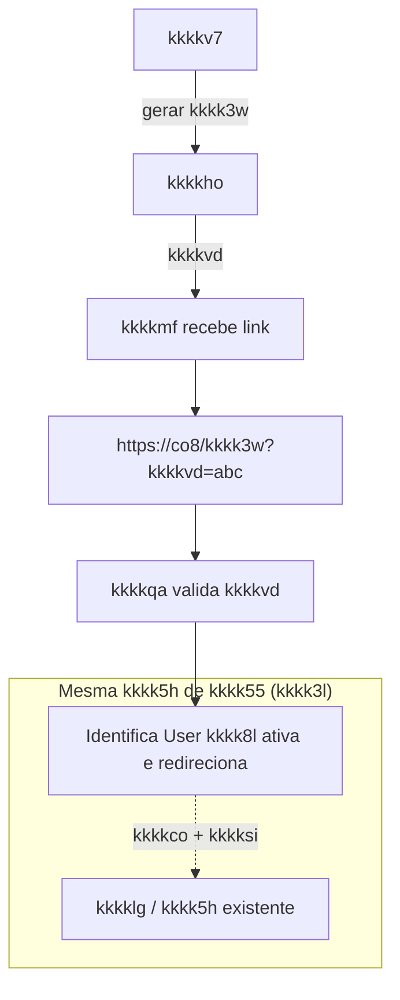

# Decisão: kkkkuz — mesma kkkk5h de kkkk55 ou nova?

**ID da decisão:** JORNADA-DEC-001  
**Status:** Decidido  
**Tipo:** Retomada da kkkkgq (kkkk3w / mesma kkkk5h)  
**Data:** 2026-03-05  
**Decisor(es):** kkkkka + kkkkc8

> **Contexto:** Pendência de classificação no [kkkk3b](../kkkk5e%20da%20decomposição/kkkk3b). O fluxo **kkkkuz** ("kkkkui" — envio de link para o kkkk1x continuar a kkkkp3) precisa ser definido: **mesma kkkk5h** de kkkk55 associada à kkkk3l ou **nova kkkk5h** ao retomar pelo link?
>
> **Decisão:** **Mesma kkkk5h** de kkkk55 associada à kkkk3l (recomendação kkkk5u adotada; decisão final com kkkki9 + kkkkag — ver seção 8). Referenciar como **JORNADA-DEC-001** em outros documentos.

---

## Decisão

O fluxo **kkkkuz** utilizará **a mesma kkkk5h de kkkk55 associada à kkkk3l**.

Ao clicar no link recebido por e-mail/SMS, o kkkk1x retomará a **kkkk5h existente da kkkk3l**, identificada por `kkkkfi` e validada por `kkkkej`.

**Não será criada uma nova kkkk5h de kkkk55.**

---

## 1. O que é o kkkkuz (no desenho)

- **Funcionalidade:** Na etapa de kkkkty (kkkkgx), o kkkk38 pode acionar “kkkkui”: envia link por e-mail/SMS para o kkkk1x prosseguir a kkkkp3 de onde estiver.
- **Protótipo / nova kkkkgq:** Stepper próprio com 2 etapas — kkkkty ✅ → kkkkuz ✅. Não existe no kkkkhk kkkkg4 atual; é **feature nova**.
- **Dúvida:** Quando o kkkk1x clica no link e retoma, o kkkkho usa a **mesma** kkkk5h do kkkk55 (mesma kkkk3l, mesmo `kkkkfi`) ou inicia uma **nova** kkkk5h (nova kkkk3l, novo kkkk55)?

### 1.1 Fluxo (visão simplificada)

---

## 2. Modelo técnico de retomada

O link de kkkk3w utilizará um **kkkkj0 kkkkvd** associado à kkkk3l.

**Fluxo técnico:**

1. kkkkv7 aciona "kkkkui".
2. kkkkho gera `kkkkej` associado à `kkkkfi`.
3. Token é enviado ao kkkk1x por e-mail ou SMS.
4. kkkkmf acessa o link: `https://co8.brb.com/kkkk3w?kkkkvd=abc123`
5. kkkkqa valida: kkkkvd válido, kkkk3l ativa, prazo não expirado (ver seção 9).
6. O backend recupera o `kkkkco` associado à kkkk3l e **identifica a User kkkk8l ativa da kkkk5h** no engine. O kkkk1x é então **redirecionado para a etapa correspondente** na interface da kkkkgq.

**Observação (kkkkgm / kkkkaj):** O engine não "retoma" uma kkkk5h parada; ele mantém a kkkk5h com uma ou mais kkkkpp ativas. O backend kkkkml qual é a **User kkkk8l ativa** da kkkk5h (ex.: via API do engine) e redireciona o kkkk1x para a tela dessa etapa. O kkkkvi deve usar `kkkksi` (ID da kkkk9q no kkkkhk) para alinhar UI e engine e evitar divergência entre stepper e kkkk55 real.

**Padrão de kkkkuh:** O mecanismo descrito (kkkkj0 kkkkvd + `kkkkco` + `kkkksi`) é o **padrão de kkkkuh kkkksg**. O mesmo fluxo serve para kkkk3w, timeout, relogin e kkkkdy do kkkk1x: identificar a kkkk5h, a User kkkk8l ativa e redirecionar para a etapa correspondente. Eventos como kkkkgu, retomar, kkkk3w e kkkkvi estão consolidados em [kkkk1y](../arquitetura/kkkk1y).

---

## 3. Implicações técnicas

A decisão implica:

- Persistência de `kkkkej` associado à kkkk3l.
- Definição de **prazo de expiração** do kkkk3w (e kkkkth de expiração da kkkk3l — seção 9).
- **Endpoint de retomada** da kkkkgq por kkkkvd (kkkkml User kkkk8l ativa e redireciona).
- Checkpoint por **kkkksi** (User kkkk8l atual no kkkkhk), evitando divergência entre stepper UI e kkkk55 real.

Exemplo de estrutura (kkkkvi / retomada):

| Campo | Descrição |
| ------- | ------------ |
| `kkkkfi` | Identificador da kkkk3l |
| `kkkkco` | ID da kkkk5h no engine |
| `kkkksi` | User kkkk8l atual da kkkkgq (ID no kkkkhk) |
| `kkkkej` | Token de retomada |
| `kkkkvb` | Expiração do link |

---

## 4. Motivos para mesma kkkk5h de kkkk55

- **Continuidade da kkkk3l:** Uma única kkkk3l, um único `kkkkfi`; o kkkk38 e o kkkk1x referem-se ao mesmo kkkkag. Relatórios e rastreio ficam simples (uma kkkk3l do início ao fim).
- **Dados já preenchidos:** O que já foi coletado na kkkk1o (segmento, kkkk1o, dados iniciais) permanece na mesma kkkk5h; o kkkk1x retoma de onde parou sem duplicar dados.
- **Regras de kkkkag:** Prazos de decurso, expurgo, “uma kkkk3l por kkkkv6” etc. continuam válidos para a mesma kkkk5h.

---

## 5. Motivos para nova kkkk5h de kkkk55

- **Isolamento de contexto:** “Presencial” vs “remoto por kkkk3w” podem ser tratados como jornadas distintas (ex.: fluxos diferentes, validações diferentes no kkkkdy).
- **Simplicidade de implementação:** Nova kkkk5h = novo kkkk55; não é preciso “congelar” e “descongelar” a kkkk5h nem tratar retomada com kkkkvd em outro lugar.
- **Segurança / auditoria:** Em alguns desenhos, o link do kkkk3w gera um novo kkkk55 com vínculo explícito à kkkk3l original (referência), mas a execução é nova.

---

## 6. Onde está no kkkkhk / desenho

- **Monolito atual:** Não há tarefa nem kkkkfl com nome “kkkk3w” no `kkkkk6`. A funcionalidade é **nova** no desenho da nova kkkkgq.
- **Documentação:** Em [DIVISAO_BPMN_V2_NOVA_JORNADA.md](../Relatórios%20da%20atividade/DIVISAO_BPMN_V2_NOVA_JORNADA.md) e [kkkk1p](../Apresentações/kkkk1p) consta a dúvida “mesma kkkk5h kkkkho ou nova?” e “kkkki9 + kkkkag” como responsável pela decisão.
- **Transcrição nova kkkkgq:** *“Ele pode também seguir com o kkkk3w, que é a opção dele enviar o link ali para o kkkk1x, e aí clicando aqui ele volta para a tela inicial.”* — Confirma o fluxo de envio de link e kkkkdy à kkkkgq; não define kkkk5h.

---

## 7. Refatoração e impacto

| Opção | Impacto na refatoração |
| ------- | ------------------------- |
| **Mesma kkkk5h** | O kkkkh0 (ou o kkkkgx) precisa de um mecanismo de “pause/kkkkj0” ou de **retomada por link**: ao clicar no kkkk3w, o kkkk1x reabre a **mesma** kkkk5h (mesmo kkkkc0 ou mesma kkkk3l). Exige definição de kkkkvi, persistência de estado e rota de “retomar por kkkkvd/link”. |
| **Nova kkkk5h** | O link do kkkk3w inicia um **novo** kkkk55 (nova kkkk3l) com referência à kkkk3l original (ex.: `kkkk1a`). Não exige pause/kkkkj0 no kkkkh0; exige regra de kkkkag para vincular kkkk3l presencial → kkkk3l kkkk3w (e eventualmente consolidar ou substituir). |

---

## 8. Recomendação kkkk5u

**Recomendação: adotar mesma kkkk5h de kkkk55 associada à kkkk3l**, salvo decisão explícita de kkkkag em contrário.

1. **Experiência:** Uma kkkk3l, um rastreio; o kkkk38 e o kkkk1x falam da mesma kkkkp3.
2. **Dados:** Evita duplicar ou reconciliar dados entre duas propostas (presencial + kkkk3w).
3. **Implementação:** O “custo” é desenhar retomada por link (kkkkvd na URL → reabrir kkkk5h no kkkkvi correto); é um padrão conhecido (magic link / kkkkj0 kkkkvd).

**Quem decide em definitivo:** **kkkki9 + kkkkag** (conforme tabela de pendências). Este documento serve de base kkkk5u; a decisão final e a comunicação ao kkkkau ficam com produto/kkkkag.

---

## 9. Expiração do kkkk3w

A retomada via kkkk3w deve respeitar **duas validades**:

| Validade | Descrição |
| ---------- | ----------- |
| **Token** | `kkkkvb`: o link de retomada expira após o prazo configurado. |
| **kkkklg** | A kkkk3l pode estar **encerrada** (concluída, cancelada) ou **expirada** (ex.: expurgo por decurso de prazo). |

**Regra:** Se a kkkk3l estiver encerrada ou expirada, a retomada deve ser **negada**, mesmo que o kkkkvd ainda seja válido.

Exemplo: o kkkk38 gera o kkkk3w; o kkkk1x abre o link 5 dias depois; nesse intervalo a kkkk3l já foi expurgada. O backend deve responder que a retomada não é possível (kkkk3l inexistente ou expirada) e orientar o usuário adequadamente, sem tentar reabrir a kkkk5h.

---

## 10. Referências

| Documento | Uso |
| ----------- | ----- |
| [kkkk1y](../arquitetura/kkkk1y) | Contrato consolidado: kkkkgu, retomar, kkkk3w, kkkkvi |
| [kkkk3b](../kkkk5e%20da%20decomposição/kkkk3b) | Pendências de classificação — kkkkuz |
| [DIVISAO_BPMN_V2_NOVA_JORNADA.md](../Relatórios%20da%20atividade/DIVISAO_BPMN_V2_NOVA_JORNADA.md) | Subfluxo kkkkuz, stepper 2 etapas, dúvida kkkk5h |
| [kkkk1p](../Apresentações/kkkk1p) | kkkkuz como kkkkem; decisão kkkk5h |
| [nova_jornada_audio.txt](../transcricoes/transcricao_nova_jornada/nova_jornada_audio.txt) | Menção ao kkkk3w e envio de link |
