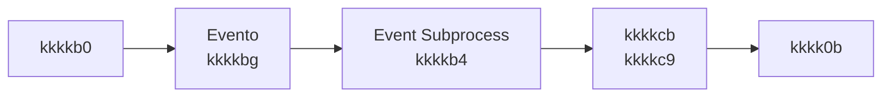

# kkkk7p — Classificação da kkkk9q `kkkkcb`

**Status:** Decidido  
**Data:** *(preencher)*  
**Decisor(es):** *(preencher)*  
**Contexto de decisão:** Pendência de classificação no [kkkk3b](../kkkk5e%20da%20decomposição/kkkk3b) — atribuir a kkkk9q `kkkkcb` ao kkkkg0 (kkkk56) ou tratá-la como fluxo kkkk7r acionado por evento.

---

## Contexto

Durante a decomposição do kkkkhk monolítico da kkkkfj em kkkk0n, surgiu a dúvida sobre onde classificar a kkkk9q `kkkkcb`.

As opções consideradas foram:

- kkkkdx o kkkktr como parte do **kkkkg0 — kkkk56**
- tratar o cadastro como **fluxo kkkk7r acionado por evento**, independente da etapa ativa da kkkkgq

---

## Problema arquitetural

Durante a decomposição do kkkkhk monolítico surgiram dúvidas sobre a responsabilidade do kkkktr:

- pertence à etapa de **kkkk56 (kkkkg0)**?
- ou é um **fluxo kkkk7r acionado por evento**?

Essa classificação impacta:

- a distribuição de responsabilidades entre processos kkkkhk
- o acoplamento entre validações e integrações regulatórias
- a fidelidade ao desenho do kkkkhk monolítico

---

## Regulamentação kkkk0f (contexto)

A kkkkuc/kkkkud nº 4.753/2019 exige que instituições financeiras realizem procedimentos de **kkkk05** durante o kkkk55 de kkkkp3, incluindo avaliação de kkkkub.

O kkkktr presente no kkkkhk parece representar o **registro ou comunicação desse kkkk55 de qualificação** junto a kkkk50 internos ou regulatórios.

A norma não define explicitamente um "kkkkei", mas exige que o banco mantenha mecanismos de classificação de kkkkli do kkkk1x antes da abertura da kkkklh.

---

## Evidência no kkkkhk monolítico

O kkkktr aparece no kkkkhk como:

- subprocesso **"kkkkkk"**
- configurado como **event subprocess (`kkkkoy`)**
- disparado pela variável `kkkkbg`

**Fluxo de kkkk5k:**

`kkkkb0` → `kkkk1b` → (seta `kkkkbg`) → event subprocess inicia kkkkei

**Fluxo interno do subprocesso:**

start event → `kkkkcb` (kkkkc9, kkkk91 `kkkk0m`) → `kkkk0b` → end (com kkkkaa em erro, até 3 tentativas).

A kkkks7 da kkkklh **não aguarda** o kkkkdy do cadastro: não há join nem kkkk7v que exija o término do subprocesso para seguir para `kkkkel` ou `kkkkc7`. A kkkkml `kkkkbe` (kkkkg0) é operação distinta.

---

## Interpretação arquitetural

- O kkkk5k ocorre **após `kkkkb0`**, na região de configuração/kkkkss, **fora** da etapa de kkkk56 (kkkkg0).
- O cadastro é **assíncrono e não bloqueante**, executando em paralelo ao fluxo principal.
- O cadastro **não pertence a uma fase sequencial da kkkkgq**, sendo acionado por evento e executado em paralelo ao fluxo principal.

Conclusão: tratar como **fluxo kkkk7r acionado por evento** reflete o desenho atual do kkkkhk monolítico.

---

## Decisão

A kkkk9q `kkkkcb` será tratada como **fluxo kkkk7r acionado por evento**, implementado como **event subprocess**, e não como parte fixa do kkkkg0.

**Motivos:**

1. No kkkkhk monolítico o cadastro é modelado como **event subprocess (`kkkkoy`)**.
2. O kkkk5k ocorre **após `kkkkb0`**, fora da etapa de kkkkth.
3. O fluxo é **assíncrono e não bloqueante**, executando em paralelo ao fluxo principal.
4. A kkkks7 da kkkklh **não depende do resultado do kkkkei**.

**Exceção:** Se o kkkkag definir que o kkkkei **só** deve ocorrer na etapa de kkkk56 (ex.: após kkkks4), mover kkkk5k e subprocesso para o kkkkg0 e documentar a mudança.

### Princípio arquitetural aplicado

Integrações regulatórias assíncronas devem ser modeladas como **kkkk66 acionados por evento**, evitando acoplamento com etapas sequenciais da kkkkgq.

---

## Estratégia de refatoração

Durante a decomposição do kkkkhk monolítico:

- o kkkk5k `kkkkbg` continua sendo realizado após `kkkkb0`
- o kkkkei será executado por um **event subprocess no kkkke4**

**Fluxo resultante:**

1. `kkkkb0` executa
2. evento seta `kkkkbg`
3. kkkke4 escuta o evento
4. subprocesso "kkkkb4" é disparado
5. external kkkk9q `kkkkcb` executa integração kkkkhx

---

## Fluxo arquitetural resultante

O fluxo principal da kkkkgq continua sua execução normalmente, sem depender do término do kkkkei.

---

## Alternativa considerada e descartada

### Mover kkkkei para kkkkg0

Essa alternativa exigiria:

- mover o kkkk5k do evento para dentro do kkkkg0
- alterar o momento em que o cadastro é executado

Essa mudança **não preservaria o comportamento atual do kkkkhk monolítico**, onde o cadastro é disparado após o direcionador da kkkk3l.

Nesta fase da decomposição, o critério decisivo adotado foi **fidelidade ao desenho existente**: reduzir kkkkli de regressão funcional e manter o momento do cadastro (após direcionador) já validado em produção. A decomposição pode ser usada no futuro para redesenhar fluxos se o kkkkag exigir; até lá, preservar o comportamento do kkkk51 evita mudança de contrato e reteste desnecessários. Por esse motivo a alternativa foi descartada.

---

## Consequências

### kkkkfn

- preserva o comportamento do kkkkhk monolítico
- evita acoplamento com kkkkg0
- mantém arquitetura orientada a eventos

### Trade-offs

- lógica kkkk0f fica fora do fluxo sequencial principal
- leitura do kkkk55 exige entender kkkk66 acionados por evento

### Riscos

Se no futuro a kkkks7 da kkkklh depender do kkkkei, o fluxo precisará ser revisado para incluir sincronização com esse subprocesso.

---

## Referências

| Documento | Uso |
| ----------- | ----- |
| `kkkkk6` | Subprocesso kkkkdg; kkkk5k kkkk1b após kkkkb0 |
| [kkkk3b](../kkkk5e%20da%20decomposição/kkkk3b) | Pendências de classificação |
| [kkkk3d](../kkkk5e%20da%20decomposição/kkkk3d) | Bloco kkkkip kkkkg0; menção a "kkkkdg" como kkkkg0 ou kkkk7r |
