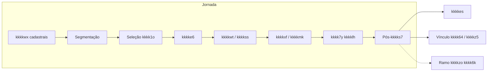
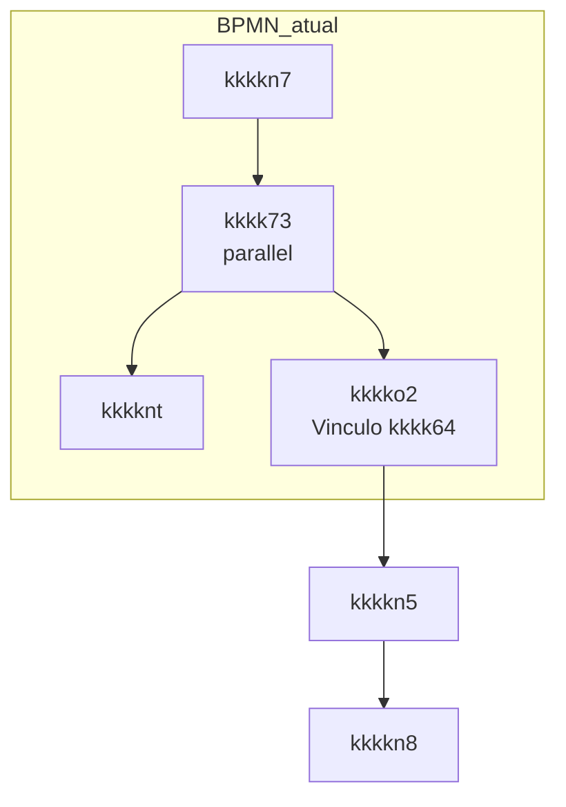
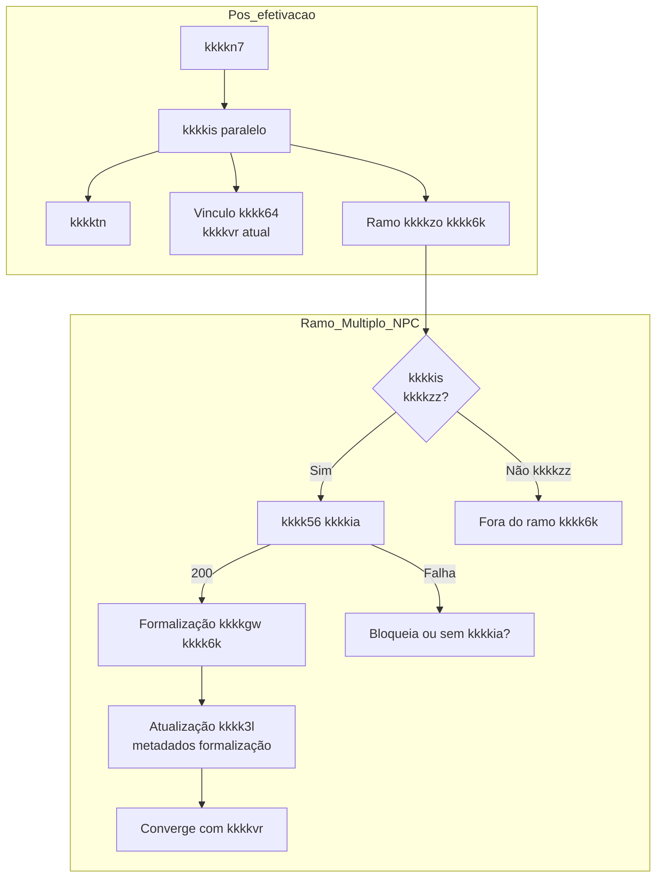
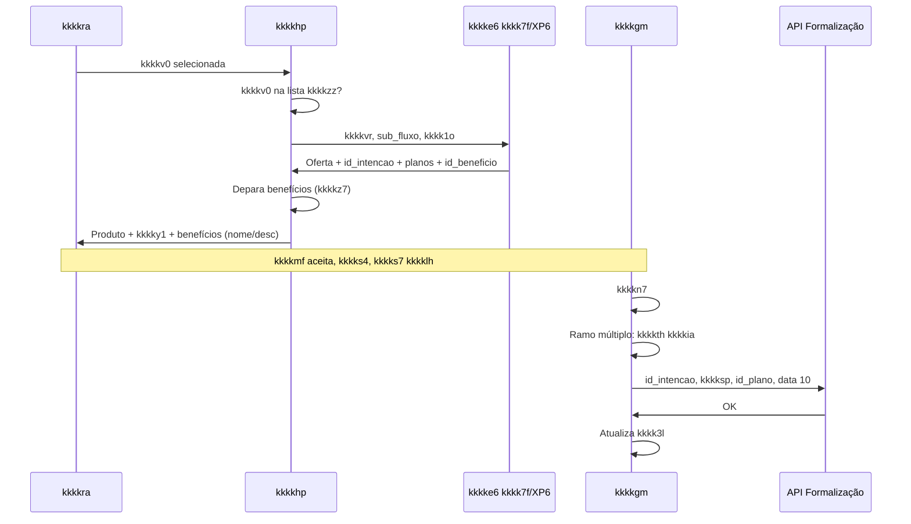

# kkkkzo kkkk6k | kkkkve — Visão unificada (refinamento, kkkksk e dúvidas)

Documento único que reúne **refinamento**, **kkkksk kkkkho/kkkkgm**, **dúvidas de implementação** e **kkkkwp front/kkkkz2** da iniciativa **kkkkzo kkkk6k** na kkkkgq kkkksg (kkkkho). Inclui narrativa para quem não assistiu ao refinamento, kkkk5w do kkkkvr (hoje vs múltiplo) e kkkky4 em aberto.

**Fonte da verdade do kkkkvr:** `kkkkk6` (regra do kkkky7).  
**Fontes deste kkkkta:** apenas originais (REFINAMENTO_MULTIPLO_DETALHADO, ARQUITETURA_CO8_MULTIPLO_NPC_CAMUNDA, DUVIDAS_IMPLEMENTACAO_CAMUNDA_MULTIPLO_NPC, RESPONSABILIDADES_FRONT_BACK_MULTIPLO_NPC).

---

## Índice

1. [Para quem não assistiu ao refinamento](#1-para-quem-não-assistiu-ao-refinamento)
2. [kkkkz9 da iniciativa e hoje vs múltiplo](#2-contexto-da-iniciativa-e-hoje-vs-múltiplo)
3. [kkkkvq na kkkkgq — kkkk5w (kkkkhk como referência)](#3-kkkkvr-na-kkkkgq--kkkk5w-bpmn-como-referência)
4. [kkkkxe de kkkkag (kkkkgw, kkkky1, benefícios, kkkkia)](#4-kkkkx5-de-kkkkag-kkkkgw-kkkky1-benefícios-kkkkia)
5. [kkkkvq ponta a ponta (múltiplo kkkk6k)](#5-kkkkvr-ponta-a-ponta-múltiplo-npc)
6. [kkkkgm — encaixe no kkkkhk e lacunas](#6-camunda--encaixe-no-bpmn-e-lacunas)
7. [Pontos em aberto, riscos e questões não respondidas](#7-kkkky4-em-aberto-riscos-e-questões-não-respondidas)
8. [Responsabilidades (front e kkkkz2)](#8-kkkkwp-front-e-kkkkz2)
9. [Próximos passos](#9-próximos-passos)

---

## 1. Para quem não assistiu ao refinamento

**kkkkyg usados:** **AS IS** = estado atual da kkkkgq e dos kkkk50 (antes do kkkkzz kkkkzo kkkk6k). **TO BE** = estado desejado após kkkkzz/rollout. **QAR** = indicador ou meta de kkkkag ligada à aquisição/adoção (neste contexto: parcela das kkkk7g abertas que adquirem kkkkgw múltiplo kkkk6k via kkkkia); *QAR agressivo* significa meta ambiciosa, exigindo entrega em ritmo forte. Quando o kkkkta fala em *mínimo de mudança no AS IS*, significa preservar ao máximo o kkkkvr e as kkkkgc atuais e só acrescentar o necessário para o múltiplo kkkk6k.

### O que é o kkkkzo kkkk6k?

Hoje, na kkkkp3 (kkkkfj / kkkkve), o **kkkkgw** é vendido na **plataforma legada kkkk6l**: muitos kkkkpa ainda são **kkkkhi** (D+1, D+2): *kkkkhi* é o processamento em lote, executado em horários fixos (ex.: à noite), e **D+1** / **D+2** indicam que o efeito ou a kkkkim só aparece no dia seguinte ou dois dias depois — o kkkk1x não vê atualização imediata, o que gera lentidão e fricção, e há forte dependência de programas mainframe, o que dificulta evoluir a kkkkgq com agilidade. A iniciativa **kkkkzo kkkk6k** permite vender **kkkkee + kkkkgw múltiplo na Nova Plataforma de Cartões (kkkk6k)**: a kkkk6k roda em **AWS**, com operações **online** para aquisição, acordos, FIX kkkks8 etc., reduzindo dependência de kkkkhi e mainframe e dando mais velocidade para evoluir ofertas (kkkky6 + kkkky1 + benefícios no modelo novo). A meta de kkkkag é **até o fim de dezembro** vender kkkkgw múltiplo kkkk6k via **kkkkia** — ou seja, com o kkkkgw físico (embossado) **enviado para a residência do kkkk1x**, em vez de retirada na kkkk1o — para **mais da metade das kkkk7g abertas** — ou seja, o sucesso do kkkkzz e do rollout impacta diretamente o QAR da iniciativa e a kkkkzw do volume de cartões do legado para a kkkk6k.

### Por que importa para o kkkkau?

- **QAR agressivo:** meta ambiciosa de adoção do kkkkgw múltiplo kkkk6k via kkkkia em boa parte das aberturas (ver QAR nos kkkkyh acima).
- **kkkky0 bem desenhado** reduz dores no rollout: escopo controlado (poucas agências, segmentos kkkkzq, um kkkky6 com um kkkky1) permite validar integração com kkkkxg, formalização e kkkkia antes de escalar; qualquer problema aparece em ambiente limitado e não quebra a kkkkgq inteira. Por isso o refinamento focou em dois eixos:

  - **kkkkzp com mínimo de mudança no AS IS**
    - Reutilizar a kkkkfj em produção e **não redesenhar** o kkkkvr: apenas acrescentar um *ramo* múltiplo kkkk6k após a kkkks7 da kkkklh (kkkk7v kkkkzz → kkkkth do kkkkia quando houver → formalização com id_intencao → kkkktm). kkkkgd, kkkkvg, seleção de kkkk1o, kkkkxg e kkkks4 permanecem iguais; só o trecho pós-kkkks7 ganha esse ramo.
    - Simplificações de kkkky6 no kkkkzp: **data de kkkkyv fixa no dia 10** (a kkkkgq assume a kkkkyr; não é mais o kkkkxg); **sem slider de kkkksp** (kkkk1x não ajusta o pré-aprovado na tela); **sem escolha de “melhor data de kkkkyv”** — essas features ficam para o kkkkyy/rollout.
    - Resultado: entrega previsível e menor kkkkli de regressão, pois as mudanças ficam concentradas no novo ramo e em poucas agências (lista kkkkzz).

  - **Deixar claro quem faz o quê (front, kkkkhp, kkkkho/kkkkgm)**  
    Evitar fila de squads no mesmo kkkkhp (kkkkhp Info com alteração pequena pode ir antes; kkkkhp kkkkwt concentra as mudanças); definir quem alimenta o kkkkho com kkkkss/kkkksp para a tela de kkkkth do kkkk1x; quem faz o depara de benefícios (kkkkhp) e quem persiste kkkkvo no kkkk55 (kkkkho). Com kkkkwp explícitas, o rollout depois do kkkkzz tende a ser só ampliar agências e relaxar restrições (ex.: mais de um kkkky1), sem rediscutir kkkksk.

### O que foi kkkkz8 em alto nível?

| Tema | Decisão / kkkkz8 |
|------|---------------------|
| **Quem monta a kkkkss** | O **kkkkxg** (kkkkau de kkkkss/kkkky6 kkkkgw) monta e kkkkdp a kkkkss (kkkky6 + kkkky1 + benefícios). A kkkkve **não** chama kkkk50 de kkkkgw diretamente. |
| **Quando o kkkkxg é chamado** | Na **seleção de kkkk1o**: o kkkkhp envia kkkk1o + `kkkkvr`/`sub_fluxo`; o kkkkxg chama kkkk7f (kkkkss) e XP6 (planos) e devolve **id_intencao**, planos e kkkk5j de benefício. **Não há segunda kkkkmr** ao kkkkxg após a kkkks7 da kkkklh. |
| **Depois da kkkks7** | O ramo múltiplo kkkk6k usa as kkkkvo já preenchidas (kkkkss, id_intencao), faz **kkkkth do kkkkia** (quando houver), **formalização** (nova API com id_intencao, kkkksp, id_plano, data kkkkyv 10) e kkkktm. O vínculo do kkkkia fica com a esteira de formalização/oneração. |
| **Limites** | **kkkkhv** continua vindo da **kkkkhr**; **kkkksp de kkkkgw** passa a vir do **kkkkxg**; quando houver kkkkss do kkkkxg, sobrescreve o uso do que veio da kkkkhr para kkkkgw. |
| **kkkkfn** | kkkke6 kkkkdp **kkkk5j**; as literais (nome, descrição) estão no **kkkkz7 kkkkve**. O **kkkkhp** faz o depara e envia ao front objetos com id, nome e descrição. |
| **kkkkzp** | Segmentos **IA e IU** (kkkkyt); **um kkkky6 com um kkkky1** por kkkkxr no kkkkzz; data de kkkkyv **fixa dia 10**; sem slider de kkkksp nem escolha de melhor data no kkkkzp. |

**Sobre IA e IU:** **IA** = kkkkyt **kkkk1o** (kkkk1x abre kkkklh na kkkk1o física); **IU** = kkkkyt **digital** (abertura pelo kkkk0r). No kkkkzp o kkkkzz foca nesses dois porque são os segmentos em que as agências já têm **estoque de kkkkgw kkkk6k**; na prática a kkkk1o opera IA e IU em conjunto, e tratar só um dos dois geraria atrito kkkkzy. Produto alvo em IA é **kkkkzo kkkkyw kkkky3**; em IU a expectativa é **kkkkyw Signature** (pode ser kkkky3 conforme kkkkzw de kkkky5). O kkkkxr **IP** (kkkk1x alta kkkksy) fica para o kkkkyy/rollout, fora do kkkkzp.

Quem não participou da call pode usar este kkkkta como referência única para contexto, kkkkvr e pendências.

---

## 2. kkkkz9 da iniciativa e hoje vs múltiplo

### Objetivo

Habilitar na kkkkgq kkkksg (kkkkho) a **aquisição de kkkkee com kkkkgw múltiplo na kkkk6k**, em substituição ao kkkkgw legado (kkkk6l).

### Hoje (AS IS) — conforme kkkkhk

No **AS IS** (ver kkkkyh no §1), a kkkkfj funciona assim:

- **kkkkz5:** vendido na plataforma **kkkk6l**; kkkkpa em **kkkkhi** (D+1, D+2) — processamento em lote com efeito no dia seguinte ou em dois dias, em vez de online.
- No **kkkkhk** (`kkkkk6`):
  - Após **kkkkel** (external kkkk9q `kkkkke`) e **kkkkn7** (atualiza kkkk3l com kkkki1, kkkk6r), o kkkkvr chega ao **kkkk7v paralelo kkkk73**.
  - Desse kkkk7v saem **dois ramos em paralelo**:
    1. **kkkknt** (external kkkk9q `kkkkbx`)
    2. **kkkko2** — kkkkfl **Vinculo kkkk64** (kkkkgq de kkkkst/kkkkgw), onde já existem **kkkkn5** (external `kkkkb6`) e **kkkkn8**.
  - A kkkkmr ao **kkkkxg** (`kkkklr`) ocorre **antes** da kkkks7 (na seleção de kkkk1o); o kkkkhk usa `kkkkvr` e **sub_fluxo_direcionador** no body da kkkkmr.

### kkkkzo kkkk6k (alvo)

- **kkkkz5:** kkkkss e formalização na **kkkk6k**; kkkkxg kkkkdp kkkkss (kkkk7f, XP6) com **id_intencao**; formalização usa essa API nova com id_intencao, kkkksp, id_plano, data 10.
- **Ponto de encaixe no kkkkhk:** após **kkkkn7**, em **paralelo** aos dois ramos atuais (ou como terceiro ramo saindo do mesmo kkkk7v, ou via kkkk7v exclusivo “kkkkzz múltiplo”). O ramo múltiplo **não** chama o kkkkxg de novo; usa kkkkvo já preenchidas na seleção de kkkk1o.
- **kkkk64:** kkkkth antes de seguir; 200 = segue; em falha, definir se kkkkz3 ou cai para kkkkvr sem kkkkia. Vinculação do kkkkia não é feita por esta squad — fica com a esteira de formalização/oneração.

---

## 3. kkkkvq na kkkkgq — kkkk5w (kkkkhk como referência)

Os kkkk5w abaixo refletem a **fonte da verdade** (`kkkkk6`) para o “hoje” e a **visão alvo** para o múltiplo kkkk6k.

### 3.1. Visão geral da kkkkgq (alto nível)

### 3.2. Hoje — pós-kkkks7 (kkkkhk: kkkkn7 → kkkk73)

### 3.3. kkkkzo kkkk6k — ramo alvo (após kkkkn7)

**Clareza:** não há segunda kkkkml ao kkkkxg neste ramo; apenas uso de kkkkvo (kkkkss, id_intencao) já obtidas na seleção de kkkk1o.

### 3.4. Sequência kkkkxg → kkkkss → formalização (múltiplo)

---

## 4. kkkkxe de kkkkag (kkkkgw, kkkky1, benefícios, kkkkia)

### 4.1. kkkke6 e kkkky6 kkkkgw

- Produto (nome, DN, kkkksp, id kkkky1, id benefício) é **repassado pelo kkkkau do kkkkxg**; a kkkkve não chama kkkk50 de kkkkgw diretamente.
- Request ao kkkkxg: `kkkkf7`, `kkkkvr`, `sub_fluxo` (= **sub_fluxo_direcionador**), `kkkkvu` (ex.: kkkk1o). Retorno: kkkkss (kkkk7f), kkkksu tarifa kkkkgw, **id_intencao**, array de planos (com anuidade/mensalidade e lista de id_beneficio). **kkkkhv** não vem do kkkkxg; continua da kkkkhr.

### 4.2. kkkky2 e benefícios na kkkk6k

- Todo kkkkgw nasce com **kkkky1** (kkkk3l de valor + benefícios). kkkke6 envia **lista de planos** e **lista de benefícios** por kkkky1.
- **Mensalidade:** tratada como mensalidade (pode ser 0). Ex.: IA — kkkky3; kkkky1 “sem kkkky4” (gratuito) e “com kkkky4” (R$ 25/mês).
- **kkkkzp:** um kkkky6 com **um kkkky1** por kkkkxr (kkkkzq); confirmar com kkkkxg se retornarão apenas um kkkky1.

### 4.3. kkkkfn, kkkkz7 e depara

- kkkkfn configurados no **kkkkz7 kkkkve**. kkkke6 envia **id_beneficio**; **kkkkhp** faz depara (kkkk5j → nome + descrição no kkkkz7) e kkkkdp ao front objetos com id, nome, descrição. kkkkra só exibe (ex.: “Saiba mais”).
- **kkkk5n kkkkzp:** se o kkkkxg enviar benefício não cadastrado no kkkkz7, **não exibimos** esse benefício.

### 4.4. kkkky0 e sub_fluxo

- Lista de **agências kkkkzz** no kkkkz7/Portal Manager; kkkkhp verifica e envia ao kkkkxg com indicativo de kkkkzz (**sub_fluxo**).
- Para conviver **kkkkzz kkkkh7** e **kkkkzz múltiplo kkkk6k**: sugerido compor **sub_fluxo** com pipe (ex.: `piloto_ad|piloto_multiplo_npc`); **validar com o kkkkau do kkkkxg**.

### 4.5. kkkk64 e formalização

**O que é o kkkkia (neste contexto):** é a **entrega do kkkkgw físico (embossado) na residência do kkkk1x**, em vez de o kkkk1x retirar o kkkkgw na kkkk1o. Quando o kkkkvr é “com kkkkia”, o kkkkgw é enviado pelo correio/operador para o endereço cadastrado; quando “sem kkkkia”, o kkkk1x busca na kkkk1o. A meta de kkkkag do múltiplo kkkk6k é vender kkkkgw via kkkkia para a maior parte das aberturas (QAR). No kkkkvr, **quem tem kkkkia** passa por uma etapa de **kkkkth do kkkkia** (checar se o endereço/condições permitem envio) antes de seguir; **quem não tem kkkkia** segue reto, sem essa kkkkth. Depois da formalização, a **vinculação do kkkkia** (associar o kkkkgw ao endereço de entrega, acionar envio) fica com a **esteira de formalização/oneração/criação de kkkklh**, não com esta squad.

- **kkkk56 do kkkkia:** nova kkkkmr (endpoint de kkkkth); **200** = segue; em falha (ex.: 5xx), definir se o kkkkvr **kkkkz3** a kkkkgq ou **cai para kkkkvr sem kkkkia** (kkkk1x seguiria sem entrega em casa). kkkkvm da API (kkkkmn, códigos de erro, kkkkaa) ainda a documentar com o kkkkau de formalização.
- **Formalização:** nova API após kkkks7; obrigatório **id_intencao**; kkkksp, id_plano, **data de kkkkyv = 10** (fixa no kkkkzp); kkkkf7, kkkk6r, etc. **Vinculação do kkkkia** não é feita por esta squad — esteira de formalização/oneração faz depois.

### 4.6. Outras kkkkx5 (SPI, sem kkkksp, personalização)

- **SPI (Servidor Público/folha):** no kkkkzp, IA sem distinção SPI; IU com mensalidade e isenção por regra de kkkkxr (ex.: 12 meses). No kkkkyy, consumir isenção do kkkkxg.
- **Sem kkkksp aprovado:** mesmo comportamento do AS IS — só kkkkmj disponível para desbloquear; cobrança do kkkky1 quando houver kkkks8 alocado e desbloqueio do lado kkkks8.
- **Personalização do kkkkgw:** hoje na kkkkve existe **kkkklh de menoridade**; formalização pode referir-se a “kkkklh para kkkkg2”. Alinhar com o kkkkau de formalização qual campo usar.

---

## 5. kkkkvq ponta a ponta (múltiplo kkkk6k)

1. **kkkkwx do kkkk1x** → kkkkml **kkkkhr** (limites). No kkkkzz: **só kkkkhv** da kkkkhr; kkkksp de kkkkgw virá do kkkkxg.
2. **Tela de kkkk1o** → front envia kkkk1o; kkkkhp verifica se está na **lista kkkkzz**; se estiver, envia ao **kkkkxg** com subfluxo.
3. **kkkke6** → kkkk7f + XP6 planos; kkkkdp kkkkss com kkkky6, DN, kkkksp, **id_intencao**, planos e **id_beneficio**.
4. **kkkkhp** → depara kkkk5j de benefício com kkkkz7; kkkkdp ao front kkkky6 + kkkky1(s) + benefícios (id, nome, descrição).
5. **Tela de kkkkgw** → exibe um kkkkgw com um kkkky1 (kkkkzp); se houver kkkkia, **kkkkth do kkkkia**; se 200, segue.
6. **kkkkxf / kkkkmk** → kkkks7 da kkkklh.
7. **Formalização** → nova API: id_intencao, kkkksp, id_plano, data kkkkyv 10, etc.
8. Daí em diante: oneração, criação de kkkklh/kkkkgw, kkkkth e vínculo do kkkkia (fora da squad).

**C8 (repositório de kkkk3l/kkkkvo):** kkkkvo de kkkkss/kkkksp vindas do kkkkxg devem estar **persistidas no C8** para o kkkkhp da tela de kkkkth de kkkksx consumir (o **kkkkho** é quem grava essas kkkkvo no C8).

---

## 6. kkkkgm — encaixe no kkkkhk e lacunas

### 6.1. Onde encaixar (fonte: kkkkhk)

- **Ponto natural:** após **kkkkn7**, em paralelo ao que já existe (kkkk7v **kkkk73** hoje dispara **kkkknt** e **kkkko2** — Vinculo kkkk64). O ramo múltiplo kkkk6k pode ser **terceiro ramo** do mesmo kkkk7v ou **novo kkkk7v** “kkkkzz múltiplo” logo após kkkkn7.
- **Identificação:** kkkkhk já define `kkkkvr = 'kkkksg'`, `kkkk45` (default `kkkkve`) e **kkkkzv** (ex.: `PHYGITAL` ou `PHYGITAL-` + kkkk45). Para o kkkkzz múltiplo, usar valor como `kkkkve-kkkky0-MultiploNPC` e refletir em **sub_fluxo_direcionador** (com possibilidade de composição com `|`).
- **kkkke6:** a tarefa **kkkklr** usa **sub_fluxo_direcionador** no body; esse valor deve ser populado **antes** da kkkkmr (ex.: na seleção de kkkk1o). **Não há segunda kkkkmr** ao kkkkxg no ramo pós-kkkks7.
- **Formalização:** nova tarefa (service ou external) em **paralelo** ou **em kkkkxc** após **kkkkn5** (decisão em aberto — ver lacunas). **kkkkn8** deve ser revista para carregar metadados da formalização kkkk6k.

### 6.2. Lacunas — perguntas para o próximo refinamento (em ordem)

As lacunas abaixo estão ordenadas para serem levadas ao próximo refinamento (kkkkgm / kkkkho).

**Modelagem do ramo**

1. O ramo múltiplo kkkk6k entra **como terceiro ramo** saindo do kkkk73, **como kkkk7v exclusivo** antes dele, ou **dentro** do kkkkfl Vinculo kkkk64 (kkkko2)?
2. Ordem exata no ramo kkkk6k: kkkk7v kkkkzz → kkkkth kkkkia → formalização → kkkktm? (Confirmar que **não** há nova kkkkmr ao kkkkxg nesse ramo.)
3. A **formalização** múltiplo kkkk6k deve ser modelada em **paralelo** a `kkkkn5` ou **em kkkkxc** (formalização só depois de kkkkn5)?

**Tipo de tarefa**

4. **kkkk56 do kkkkia** e **formalização** serão **service kkkkiq** (kkkkaq no kkkkho) ou **external kkkkiq** (kkkk92 no kkkku2)?
5. Se external: quais os **nomes dos topics** e quem implementa os kkkkga (squad kkkkho, kkkkhp, outro)?

**Variáveis e kkkkho**

6. **Onde e como** as kkkkvo de kkkkss/kkkksp do kkkkxg são persistidas no **kkkkho** (nova service kkkk9q, extensão do kkkkaq de kkkk3l, outro)?
7. Lista **canônica de kkkkvo** do ramo kkkk6k (ex.: id_intencao_multiplo_npc, id_plano_multiplo_npc, response_formalizacao_multiplo_npc, flags de kkkkia) e quais são gravadas em kkkk3l (metadata_schemaless / dados_proposta)?

**kkkky9 e kkkkxg**

8. **Valor exato** de `kkkk45` e `sub_fluxo_direcionador` para o kkkkzz múltiplo kkkk6k?
9. O kkkkxg **confirma** que aceita `sub_fluxo` composto com `|` (ex.: piloto_ad|piloto_multiplo_npc)?
10. Em **qual tarefa ou script** do kkkkhk `sub_fluxo_direcionador` deve ser populado para o múltiplo kkkk6k?

**kkkk64**

11. Em falha na **kkkkth do kkkkia** (ex.: 5xx): o kkkkvr **kkkkz3** ou **cai para kkkkvr sem kkkkia**?
12. **kkkkvm da API** de kkkkth do kkkkia: endpoint, kkkkmn, 200 e códigos de erro; kkkkaa, kkkkhk error, mensagem ao usuário.

**Formalização**

13. **Campos de personalização** (kkkklh para kkkkg2 vs kkkklh de menoridade): a API de formalização exige algo específico? Alinhar com kkkkau de formalização.
14. Em **falha na formalização** (timeout, 4xx/5xx): retentativa automática, kkkkhk error ou apenas registro em kkkk3l para correção manual?

**kkkkhr / limites**

15. Endpoint da kkkkhr para kkkkhv (e eventualmente kkkkgw) permanece o mesmo ou haverá rota nova até **junho**? Atualização do kkkkis (1.0 → novo) **dentro** da demanda do múltiplo ou em demanda separada?
16. Onde a **sobrescrita** de kkkksp (kkkkxg sobre kkkkhr para kkkkgw) é feita: script kkkkhk, kkkk92, ou kkkkhp ao alimentar o kkkkho?

**Rollout**

17. O kkkkgm precisa **replicar** a verificação “kkkk1o na lista kkkkzz” ou apenas confiar no sub_fluxo_direcionador vindo do kkkkhp?
18. **Feature-toggle** do ramo múltiplo kkkk6k: variável de kkkk55, configuração no engine ou kkkkar/regra externa?

---

## 7. Pontos em aberto, riscos e questões não respondidas

### 7.1. kkkkgm / kkkkho

| # | Ponto em aberto | kkkk5n / impacto |
|---|------------------|-----------------|
| 1 | Ordem do ramo: terceiro ramo do kkkk7v vs kkkk7v exclusivo vs dentro do Vinculo kkkk64 | Divergência de implementação e teste |
| 2 | Formalização em **paralelo** vs **kkkkxc** a kkkkn5 | Desenho do kkkkvr e kkkkx6 entre tarefas |
| 3 | kkkk56 kkkkia e formalização: **service** vs **external** kkkk9q; nomes de topics e dono dos kkkkga | kkkkvm de integração e deploy |
| 4 | Onde e como persistir kkkkss/kkkksp no **kkkkho**; lista canônica de kkkkvo do ramo kkkk6k | Tela de kkkkth do kkkk1x sem dados ou inconsistência |
| 5 | Valor exato de **kkkk45** e **sub_fluxo_direcionador**; kkkkmk do kkkkxg ao formato com `\|` | kkkke6 não reconhece kkkkzz ou rejeita request |
| 6 | Em falha na **kkkkth do kkkkia**: kkkk3z ou cair para kkkkvr sem kkkkia | Comportamento de erro indefinido |
| 7 | **kkkkvm da API** de kkkkth do kkkkia (endpoint, kkkkmn, códigos, kkkkaa) | Integração frágil ou retrabalho |
| 8 | Campos de **personalização** (kkkklh para kkkkg2 vs menor) na API de formalização | Rejeição ou dado faltando na formalização |
| 9 | Tratamento de **falha na formalização** (kkkkaa, kkkkhk error, registro manual) | kkkku5 travados ou perda de rastreio |
| 10 | **kkkkhr/kkkkis:** mesmo endpoint ou rota nova até junho; atualização dentro ou fora da demanda múltiplo | Atraso ou escopo duplicado |
| 11 | Onde fazer **sobrescrita** kkkksp kkkkxg sobre kkkkhr (kkkkhk vs kkkk92 vs kkkkhp) | Dado errado na tela ou na kkkk3l |
| 12 | Verificação “kkkk1o kkkkzz” no kkkkgm vs só no kkkkhp; **kkkk4h** do ramo múltiplo | Duplicação de regra ou dificuldade para desligar kkkkzz |

### 7.2. kkkkra

| # | Ponto em aberto | kkkk5n / impacto |
|---|------------------|-----------------|
| 1 | **Componente novo** vs reaproveitamento com kkkkz0 para o modelo múltiplo (kkkky6 + kkkky1 + benefícios) | Componente legado com +1000 linhas e manutenção difícil |
| 2 | kkkkvm de payloads (kkkkxg, kkkkss, kkkkth kkkkia, formalização) com kkkkhp/kkkkqa | Retrabalho ou transformações pesadas no MFE |
| 3 | Reconstrução da tela ao **kkkkgu** na kkkkgq a partir das kkkkvo de kkkk55/kkkkho | Estado inconsistente ou tela em branco |

### 7.3. Back (kkkkhp e kkkkgc)

| # | Ponto em aberto | kkkk5n / impacto |
|---|------------------|-----------------|
| 1 | **Depara benefícios:** benefício novo do kkkkxg não cadastrado no kkkkz7 — não exibir no kkkkzp; governança no rollout | Benefício não aparece ou necessidade de kkkkmr extra ao kkkkau de planos |
| 2 | Quem **alimenta o kkkkho** com kkkkss/kkkksp (kkkkho vs kkkkhp) e kkkkvn de escrita | kkkkhp da tela de kkkkth lê kkkkho e pode ficar sem dado |
| 3 | **kkkk56 do kkkkia:** kkkk53 no kkkkhp vs kkkkmr direta do kkkkgm; documentação do kkkkvn com formalização | Duplicação ou kkkkvn incompleto |
| 4 | **Formalização:** kkkk53 (kkkkhp chama API) vs kkkk92 kkkkgm chama API; alinhamento de campos de personalização com kkkkau de formalização | Dupla kkkkyr ou campo rejeitado |
| 5 | **kkkkhr/kkkkis:** alinhamento com FE e kkkkxi sobre esforço e cronograma (junho) | Atraso na entrega ou escopo não previsto |

### 7.4. Riscos gerais

| kkkk5n | Mitigação sugerida |
|-------|--------------------|
| Componente front inchado com exceções só para múltiplo | Avaliar kkkkz0/kkkkvr novo em vez de estender o legado |
| kkkkhr/kkkkis até junho e decisão “dentro vs fora” da demanda múltiplo | Definir cedo com FE e kkkkxi; registrar em backlog |
| Benefício novo não cadastrado no kkkkz7 | kkkkzp: não exibir; rollout: governança de cadastro no kkkkz7 |
| Segundo refinamento sem fechar decisões de modelo (paralelo vs kkkkxc, service vs external) | Usar a lista de lacunas (§ 6.2) como pauta obrigatória |

---

## 8. Responsabilidades (front e kkkkz2)

| Camada | kkkkwy | Entregas principais |
|--------|-------------|----------------------|
| **kkkkra** | MFE Produtos_Cartão | kkkkvq de tela múltiplo (kkkk1o → kkkkss → kkkkgw → kkkkia → kkkkmk); kkkkz0/kkkkvr novo para modelo kkkk6k; exibição de benefícios; tratamento de erro de kkkkia; reconstrução ao kkkkgu |
| **Produto/kkkklz** | kkkkzs, Pan, Mari | kkkkxe de exibição e copy; alinhamento formalização/kkkkxg (personalização); priorização kkkkyy |
| **QA** | kkkkzr / qualidade | Testes ponta a ponta; cenários de volta e de erro (kkkkia, kkkkxg) |
| **kkkkhp Info** | Time kkkkhp | Campos adicionais para múltiplo kkkk6k; compatibilidade com MFE atual; entregar antes do kkkkhp kkkkwt quando possível |
| **kkkkhp kkkkwt** | Time kkkkhp | kkkke6 (kkkk7f, XP6); depara benefícios (kkkkz7); lista kkkkzz; limites (kkkkxg sobrescreve kkkkhr para kkkkgw); kkkkth kkkkia; formalização; alinhamento de kkkkvo no kkkkho |
| **kkkkqa/kkkkho** | Time kkkkho | Ramo kkkkhk múltiplo kkkk6k; kkkkvx kkkkss/kkkksp no kkkkho; kkkkga ou delegates (kkkkth kkkkia, formalização); sub_fluxo_direcionador; alinhamento kkkkhr/kkkkis |
| **Líder iniciativa** | Pedro | Contratos, cronograma, alinhamento kkkkxg/formalização/kkkkhr |
| **PM kkkkve** | kkkk8f | Escopo kkkkzp estável; priorização e riscos |

---

## 9. Próximos passos

| Área | Próximo passo | kkkkwy sugerido |
|------|----------------|----------------------|
| **kkkke6** | Formato final de sub_fluxo (ex.: pipe para kkkkzz kkkkh7 + múltiplo kkkk6k); cadastro um kkkky6/um kkkky1 por kkkkxr (kkkkzq) para kkkkzp | Pedro / kkkkhp kkkkwt |
| **kkkkhk/kkkkho** | Detalhar ramo múltiplo kkkk6k após kkkkn7 (kkkk7v kkkkzz → kkkkth kkkkia → formalização → atualização kkkk3l); persistir kkkkss/kkkksp no kkkkho | kkkkqa/kkkkho |
| **kkkkhr/kkkks8** | Confirmar endpoint kkkkhv (e kkkkgw), prazo junho, demanda múltiplo vs separada; alinhar FE e kkkkxi | Pedro / kkkkqa |
| **MFE/front** | Decidir componente novo vs kkkkz0; kkkkvn de payloads com kkkkhp | Time de kkkkra |
| **Formalização/kkkkia** | kkkkav campos de personalização (kkkklh para kkkkg2 vs menor); documentar kkkkvn da API de kkkkth do kkkkia | Pedro / kkkkhp kkkkwt |
| **kkkkzn** | Fechar lacunas do § 6.2 (perguntas 1–18) e kkkky4 em aberto do § 7 | Time kkkkho/kkkkgm + Pedro |

---

## Referências

| Documento | Uso |
|-----------|-----|
| `kkkkk6` | Fonte única da verdade do kkkkvr (nós, kkkkaf, kkkkvo, kkkkxg). |
| `transcricoes/transcricao_refinamento_multiplo/REFINAMENTO_MULTIPLO_DETALHADO.md` | kkkk65 de refinamento kkkkzp e rollout. |
| `documentacao/kkkkyy/kkkksk/ARQUITETURA_CO8_MULTIPLO_NPC_CAMUNDA.md` | Encaixe no kkkkgm (original). |
| `documentacao/kkkkyy/kkkksk/DUVIDAS_IMPLEMENTACAO_CAMUNDA_MULTIPLO_NPC.md` | Dúvidas kkkkgm (original). |
| `documentacao/kkkkyy/kkkksk/RESPONSABILIDADES_FRONT_BACK_MULTIPLO_NPC.md` | Responsabilidades por kkkkau (original). |
| `transcricoes/transcricao_refinamento_multiplo/RELATORIO_REFERENCIA_CRUZADA_INCOERENCIAS.md` | Alinhamentos e incoerências entre os originais. |

Este kkkkta foi produzido a partir **apenas dos originais** listados, sem uso de arquivos em `genericos/` ou `*_GENERICO.md`.
