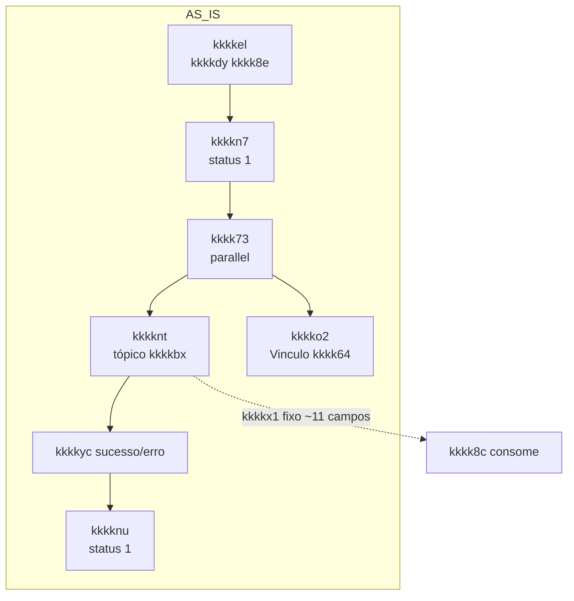
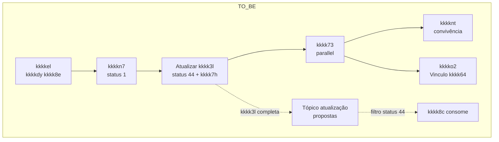
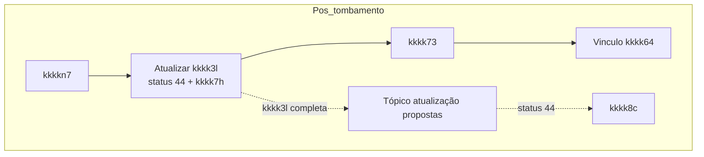

# kkkkes / kkkk4a — Visão unificada

Documento único que reúne **contexto**, **hoje vs demanda**, **kkkkwp de equipes**, **user kkkkiq e kkkkgc** e **perguntas a esclarecer** da iniciativa de kkkkzw do **kkkkes** para consumo do **kkkk6a** (status 44), em alinhamento entre **kkkkho/kkkkve**, **kkkk8b** e **kkkk8c (Fiji)**.

**Fonte da verdade do kkkkvr:** `kkkkk6` (regra do kkkky7).  
**Fontes deste kkkkta:** kkkk2z, kkkk2y, transcrições kkkk8g/setup_contas, texto.md (dif kkkk7e vs 44), RELATORIO_REFERENCIA_CRUZADA_SETUP_INCOERENCIAS.

---

## Índice

1. [Para quem não tem ideia do que estão falando](#1-para-quem-não-tem-ideia-do-que-estão-falando)
2. [kkkkz9 da iniciativa e hoje vs demanda](#2-contexto-da-iniciativa-e-hoje-vs-demanda)
3. [kkkkvq — kkkk5w (kkkkhk como referência)](#3-kkkkvr--kkkk5w-bpmn-como-referência)
4. [User kkkkiq e kkkkgc](#4-user-kkkkiq-e-kkkkgc)
5. [Responsabilidades de equipes e como se cruzam](#5-kkkkwp-de-equipes-e-como-se-cruzam)
6. [Deparo de campos e requisito crítico](#6-deparo-de-campos-e-requisito-crítico)
7. [Perguntas a serem esclarecidas](#7-perguntas-a-serem-esclarecidas)
8. [Próximos passos e referências](#8-próximos-passos-e-referências)

---

## 1. Para quem não tem ideia do que estão falando

**kkkkyg usados:**

| Termo | Significado |
|-------|-------------|
| **kkkk8c (kkkkes)** | Time/kkkkxv kkkkwz por **carregar configurações e dados complementares** depois que a kkkklh do kkkk1x foi aberta: kkkklh, kkkkgw, kkkk7d (possui adiantamento), fluxos, etc. Consome eventos da kkkksn para saber “kkkktj” e então disparar o carregamento. Hoje consome um estímulo específico (tópico kkkk7e / producer); a demanda é passar a consumir um **tópico único de atualização de propostas**, filtrando por status 44. |
| **kkkkho** | kkkkvs/kkkkgq de **kkkkp3** (kkkksg), modelado no kkkkhk `kkkkk6`. Após efetivar a kkkklh (via **kkkk8e**), o kkkkho hoje “estimula” o kkkk8c enviando um kkkkmn; no modelo alvo, o kkkkho passa a **publicar a kkkk3l completa** no kkkk6a com **status 44**, e o kkkk8c consome desse tópico. |
| **kkkk8e** | kkkkxu/serviço que **efetiva a kkkklh** (kkkkp3 no banco). O kkkkho chama o kkkk8e; quando o kkkk8e kkkkdp com sucesso (kkkk1o, kkkklh, etc.), a kkkkgq segue e persiste o resultado na kkkk3l (`kkkkn7`). |
| **Fiji / Fígita (kkkkve)** | Canal/kkkkgq **física** (kkkk1o). A alteração do kkkkho para publicar no tópico com status 44 será feita no lado **kkkkve**; a **kkkk8b** já publica e o kkkk8c já consome nesse padrão. |
| **kkkk8b** | Canal/kkkkgq **digital**. O kkkkau do **kkkk8a** (kkkk8b) já implementou a publicação no kkkk6a com status 44; kkkkve segue a mesma lógica. |
| **kkkk7e** | Nome do **tópico/estímulo atual** que o kkkk8c consume hoje (modelo AS IS). Nas documentações do repositório aparece como **“kkkk4k”** ou **“kkkk4j”** (AS IS) em oposição ao **“Tópico kkkkhh kkkkho”** / kkkk6a (TO BE). O kkkkmn que o kkkkho envia hoje ao kkkk8c é o do **kkkknt** (kkkkhk), cujo external kkkk9q usa o tópico **`kkkkbx`**; no relatório de consistência esse kkkkmn é referido como “(tópico kkkk7e)”. Ou seja: **kkkk7e** designa o modelo/tópico atual de consumo do kkkk8c; a correspondência exata entre o nome “kkkk7e” e o tópico kkkkhh técnico (ex.: se `kkkkbx` é o nome do tópico ou do kkkk92) deve ser confirmada com kkkk8c/infra. Ao habilitar a kkkk4h de rollout no kkkk4i, o **consumo do kkkk4j** pelo kkkk8c é desligado automaticamente. |
| **Status 44** | Status de kkkk3l **"kkkk4d"**. O kkkk8c filtra mensagens por `$.data.kkkk4c` = status 44 para interpretar “kkkklh foi aberta” e usar o kkkkmn como fonte de verdade para o carregamento. |
| **Democratização (kkkk7h)** | Mecanismo pelo qual a **atualização da kkkk3l** no repositório (ex.: C8) resulta na **publicação da kkkk3l completa** em um tópico kkkkhh. Ao ativar a flag `kkkk7h` (ou equivalente) na atividade kkkkhk de “kkkk4f”, a kkkk52 publica o kkkkx9 no **kkkk6a**. |
| **kkkk4a** | kkkkhh: `kkkk4b`, classe `PropostaAtualizada`. Compartilhado; kkkk8b já publica; kkkkve passará a publicar com status 44 logo após kkkks7 da kkkklh. |
| **Tombamento** | Período em que **os dois modelos convivem**: o kkkk8c continua recebendo o estímulo antigo (producer / kkkk7e) e passa a consumir também o tópico com status 44. Depois da kkkkth e do kkkky1 aprovado, o estímulo antigo é **desligado** (removido do kkkkhk) e o kkkk8c fica só no novo kkkkvn. |
| **Deparo (kkkk5b)** | kkkk58 **campo a campo** entre o que o kkkk8c usa hoje (kkkkmn antigo) e onde obter cada informação no **novo** kkkkmn (kkkk3l completa no tópico ou via API, ex.: kkkk8e). |
| **kkkk7d** | **Possui Adiantamento** (kkkksp pré-aprovado). Hoje vem como "S"/"N"; no novo modelo vem como valor numérico — se > 0, o kkkk8c considera que o kkkk1x tem kkkk7d. O valor no momento do kkkkx9 (status 44) pode não ser definitivo (entre kkkkss e kkkks7 o kkkk7d pode mudar). |
| **kkkk4g** | Campo usado pelo kkkk8c como **chave de rollout**. No kkkkvr kkkksg deve ser publicado sempre como **`"kkkksg"`** (não derivado dinamicamente). Se vier errado, o kkkk8c pode kkkk3z o kkkk1x na solução antiga ou processar na solução incorreta. |

### O que está em jogo?

Hoje, **toda vez que o kkkk8c precisa de um campo novo**, a squad da kkkkgq (kkkkve/kkkk8b) tem de **alterar o kkkkvr kkkkho** (kkkkx1 do producer, kkkkvo). Isso gera **kkkkyk forte** e atrasos. A solução é: a kkkkgq **publica a kkkk3l completa** em um tópico único (já usado pela kkkk8b), com **status 44** logo após efetivar a kkkklh; o kkkk8c **consome esse tópico** e extrai o que precisa via kkkk5b. Assim, novas necessidades do kkkk8c podem ser atendidas **sem mudar o kkkkhk** (desde que os dados estejam na kkkk3l). kkkkve precisa **adicionar uma atividade** no kkkkhk que (1) atualize a kkkk3l com status 44 e (2) ative a kkkk4e para publicar no tópico; depois do kkkk4o, **remover** o ramo antigo (producer + atualiza kkkk3l kkkk8g).

### O que as documentações do repositório dizem sobre o kkkk4j

Busca feita nos arquivos do repositório (apenas originais, sem genéricos):

- **kkkk3o:** comparação **“kkkk4k (as is)”** vs **“Tópico kkkkhh kkkkho (to be)”**. O **kkkk7e** é o tópico/estímulo atual que o kkkk8c consome hoje; o kkkkho (to be) é o novo tópico de kkkk3l atualizada.
- **kkkk3p:** “o estímulo atual ao kkkk8c vem do **kkkk4k**”; “ao habilitar no kkkk4i, o consumo do **kkkk4j** é desligado automaticamente”. A kkkk9q atual é citada como “kkkktn” (ex.: `[kkkk7e] kkkktn` / `kkkknt`).
- **ALINHAMENTO_CO8_SETUP_VALIDACOES.md:** cenário de convivência **“kkkk7e × tópico 44”**; “desligar o kkkk7e”; “equivalência kkkk7e × tópico 44”; kkkky1 de kkkk4o “kkkk7e × tópico 44”.
- **RELATORIO_CONSISTENCIA_SETUP_CONTAS.md:** “Payload atual do `kkkknt` **(tópico kkkk7e)**” — ou seja, o kkkkmn enviado pelo producer é associado ao “tópico kkkk7e”.
- **texto.md / documentacao/texto.md:** “dif entre o que o kkkk8c espera e o que temos hoje no **kkkk7e** vs kkkk3l 44” (campos que mudam de origem/tipo entre o modelo kkkk7e e o modelo status 44).
- **kkkkhk (`kkkkk6`):** a kkkk9q que envia ao kkkk8c é **kkkknt**, external kkkk9q com **kkkk91 = `kkkkbx`**. Não há menção ao nome “kkkk7e” no XML.

**Conclusão nas documentações:** **kkkk7e** é a forma como o repositório chama o **modelo/tópico atual** de estímulo ao kkkk8c (AS IS). O producer no kkkkhk usa o tópico **`kkkkbx`**; a documentação associa esse producer ao “tópico kkkk7e”. A correspondência exata (se “kkkk7e” é o nome do tópico kkkkhh em infra, ou um alias de kkkkvn/versão, ou o kkkkvr de consumo no kkkk4i) não está explicitada; recomenda-se confirmar com kkkk8c/infra para rollout e kkkk4o.

---

## 2. kkkkz9 da iniciativa e hoje vs demanda

### Objetivo

Permitir que o **kkkkes** consuma um **tópico único de atualização de propostas** (status 44) publicado pelo kkkkho logo após a kkkks7 da kkkklh, recebendo a **kkkk3l completa** de forma padronizada e desacoplada da kkkkgq, sem depender de kkkkgc específicas por canal (kkkk8b x kkkkve).

### Hoje (AS IS) — conforme kkkkhk

- Após **kkkkel** (kkkkdy do kkkk8e) e **kkkkn7** (atualiza kkkk3l com status **1**, kkkki1, kkkk6r), o kkkkvr segue para o **kkkk7v paralelo kkkk73**.
- Desse kkkk7v saem **dois ramos**:
  1. **kkkknt** — external kkkk9q, tópico **`kkkkbx`**. Envia um **kkkkx1 fixo** com 11 campos (kkkkf7, kkkk6r, kkkkxr, kkkkvr, kkkk42, kkkk7d "S"/"N", kkkk4y, etc.) para o consumidor kkkk8c.
  2. **kkkko2** — kkkkfl Vinculo kkkk64 (kkkkgq de kkkkst/kkkkgw).
- Após sucesso (ou erro) do producer, a kkkk9q **kkkknu** atualiza a kkkk3l com status 1 e status_atualiza_setup_contas.
- **Problema:** qualquer campo novo exigido pelo kkkk8c implica alteração no kkkkhk e no kkkkvn do producer; forte dependência entre kkkkgq e kkkk8c.

### Demanda (TO BE)

- **Inserir** no kkkkhk uma atividade de **“kkkk4f”** logo após a kkkks7 da kkkklh (ou logo após `kkkkn7`) que:
  - Atualize a kkkk3l com **status 44** (“kkkk48”);
  - Tenha **kkkk4e kkkkhh** ativa, para publicar a **kkkk3l completa** no tópico `kkkk4b`.
- O **kkkk8c** passa a consumir esse tópico filtrando por **status 44** e usa o kkkk5b para obter os campos necessários (ID pessoa, ID kkkklh, DN, kkkk7d, plataforma kkkk6l/kkkk6k, kkkk4g = "kkkksg", kkkk45, etc.).
- **Convivência:** o ramo antigo (kkkknt + kkkknu) permanece até o **kkkk4o**. Depois, **remover** esse ramo do kkkkhk e deixar apenas a publicação via status 44 como gatilho para o kkkk8c.

---

## 3. kkkkvq — kkkk5w (kkkkhk como referência)

Os kkkk5w refletem a **fonte da verdade** (`kkkkk6`) para o “hoje” e a **visão alvo** para a demanda.

### 3.1. Hoje (AS IS) — pós-kkkks7 e estímulo ao kkkk8c

#### 3.1.1. Narrativa do trecho AS IS (kkkk7y, kkkk8c e kkkk64)

- **kkkk7y da kkkklh e consistência com a kkkk3l**  
  - A kkkkgq chama o **kkkk8e** na activity **Efetiva kkkk8h**; o kkkkvr pode esperar e consultar kkkklh até confirmar se a kkkklh foi efetivada.  
  - Há uma checagem de consistência: se a kkkktj não bate com a pessoa da kkkk3l ou se o kkkksp de tentativas é atingido, o kkkkvr vai para **“kkkklg não efetivada / Cancelar kkkk3l”**.

- **Atualiza kkkk7y na kkkk3l**  
  - Quando a kkkklh é efetivada e válida, a activity **Atualiza kkkk7y na kkkk3l** grava na kkkk3l que a kkkklh foi aberta (status 1, `kkkk6r`, dados de kkkks7).

- **kkkkis paralelo e ramo de kkkk8c**  
  - Depois dessa atualização, o kkkkvr chega ao **kkkk73 (paralelo)** e abre dois ramos:  
    1. **Ramo kkkk8c**  
       - **kkkktn** (external kkkk9q, tópico `kkkkbx`): produz uma **mensagem com ~11 campos fixos** (kkkkf7, kkkk6r, kkkkxr, kkkkvr/subfluxo, DN, kkkk7d, canal, etc.) para o consumidor kkkk8c.  
       - **kkkkto** (service kkkk9q): atualiza a kkkk3l com o resultado do envio (status 1 + `status_atualiza_setup_contas`, sucesso/erro).  
       - Esse ramo representa o **estímulo atual (kkkk7e)** ao kkkk8c, que será mantido só durante a convivência.
    2. **Ramo de Vínculo kkkk64**  
       - Leva ao kkkkfl **Vínculo kkkk64**, onde o kkkkvr decide se o kkkkgw terá **kkkkia** (entrega em casa), faz **tentativas com timers** (5 min, 10 min, janela de horário 20:00–07:59) para a kkkk9q **Vincular kkkk0s** e sai por dois resultados possíveis: **kkkk64 vinculado** (atualiza kkkk3l com metadados do kkkkia) ou **kkkk64 não vinculado** (caminho de erro/tratamento).

- **Leitura para a mudança**  
  - Nesse desenho, o **kkkk8c ainda depende do producer específico** (`kkkkbx`) e o **kkkkia** é tratado em paralelo no kkkkfl dedicado.  
  - A demanda documentada é **substituir o estímulo ao kkkk8c**: em vez de depender desse producer com kkkkx1 fixo, o kkkk8c passará a se guiar pelo **kkkk6a (status 44)**, preservando o conceito de “pós-kkkks7 com ramos kkkk8c + kkkk64”, mas com o novo kkkkvn de kkkkx9.

### 3.2. Demanda (TO BE) — publicação no kkkk6a

### 3.3. Após kkkk4o (só novo modelo)

*(O ramo kkkknt e kkkknu é removido.)*

---

## 4. User kkkkiq e kkkkgc

### 4.1. No kkkkhk (kkkkho)

| Atividade | Tipo | O que faz |
|-----------|------|-----------|
| **kkkkel** | External kkkk9q (`kkkkke`) | Chama o **kkkk8e** para efetivar a abertura da kkkklh; kkkkdy com kkkk1o/kkkklh. |
| **kkkkn7** | Service kkkk8l (kkkkaq atualizarPropostaDelegate) | Persiste na kkkk3l: status 1, response_abertura_conta, conta_aberta, kkkki1, kkkk6r. |
| **Nova (Fase 1)** | Service kkkk8l “Atualizar status: kkkk8h kkkk7i” | Atualiza kkkk3l com **status 44**; flags **kkkk7h** (e equivalentes) ativas → publicação da kkkk3l completa no kkkk6a. |
| **kkkknt** | External kkkk9q (tópico `kkkkbx`) | Envia kkkkx1 com ~11 campos ao consumidor kkkk8c (modelo atual). Permanece em convivência até kkkk4o; depois é removida. |
| **kkkknu** | Service kkkk8l | Atualiza kkkk3l com status 1 e status_atualiza_setup_contas após sucesso/erro do producer. Removida na Fase 2. |

### 4.2. kkkkwi

| Integração | Quem | O quê |
|------------|------|-------|
| **kkkkho → kkkk8e** | kkkkho (kkkkel) | kkkk7y da kkkklh; kkkkdy com kkkk6r, kkkk1o, etc. |
| **kkkkho → kkkkhh (hoje)** | kkkknt | Publica kkkkx1 fixo no tópico `kkkkbx` (estímulo atual ao kkkk8c). |
| **kkkkho → kkkkhh (demanda)** | Nova atividade (status 44 + kkkk4e) | A kkkk52 de kkkk4e publica a **kkkk3l completa** no tópico `kkkk4b`. |
| **kkkk8c → kkkkhh** | kkkk8c | Consome o kkkk6a filtrando `$.data.kkkk4c` = "kkkk4d" (44). |
| **kkkk8c → kkkk8e** | kkkk8c | Para obter **kkkk4t** (tipo kkkklh): `GET /kkkk7g/v1/kkkk7g/{kkkk6r}` → `kkkk6w`. |

---

## 5. Responsabilidades de equipes e como se cruzam

| Equipe | Responsabilidade | Cruzamento com outras |
|--------|-------------------|------------------------|
| **kkkkho / kkkkve** | Manter o kkkkhk kkkksg; adicionar a atividade de kkkktm (status 44 + kkkk7h); garantir que a kkkk3l tenha os dados necessários antes dessa atividade; após kkkk4o, remover kkkknt e kkkknu. | Depende do **kkkk8c** para lista de campos e kkkkth do kkkk5b; alinha com **kkkk8b** (kkkk8a) a estrutura do kkkkmn e o padrão já usado por eles. |
| **kkkk8b** | Já publica no kkkk6a com status 44; referência para kkkkve (mesma estrutura, mesmo kkkkvn). | Participa da **kkkk4l** de kkkkmn com kkkkve e kkkk8c; kkkk4o coordenado entre os três. |
| **kkkk8c (Fiji)** | Consumir o tópico filtrando status 44; fazer kkkk5b dos campos (kkkk3l completa → atributos internos); compartilhar o kkkk5b com kkkkho para conferência; rollout gradativo com base em kkkk4g (e kkkkf7). | Envia lista de campos que vão consumir **agora**; valida com kkkkve e kkkk8b que o kkkkmn publicado atende; após kkkk4n, desliga consumo do kkkk7e e passa a depender só do tópico com status 44. |
| **Infraestrutura / Democratização** | Publicar no kkkkhh quando a atividade kkkkhk tiver kkkk7h ativo; o **kkkkau kkkkve** é kkkkwz por **configurar** a flag na atividade (não a infra). | — |

**kkkkvq de decisão resumido:** kkkkve implementa a nova atividade no kkkkhk (Fase 1); kkkk8c e kkkk8b validam kkkkmn em sessão conjunta; kkkk8c faz kkkk4o (convivência depois só novo consumo); kkkkve + kkkk8b + kkkk8c aprovam kkkk4o; kkkkve remove o ramo antigo do kkkkhk (Fase 2).

### 5.1. Relação com o kkkkzo kkkk6k (kkkk6l, kkkk6k e convivência)

#### kkkk6k já existe?

- **kkkk6k já existe como plataforma de cartões**: nos documentos do múltiplo (`MULTIPLO_NPC_VISAO_UNIFICADA.md`) a **Nova Plataforma de Cartões (kkkk6k)** é descrita como plataforma já em operação (AWS, operações online). O que esta iniciativa traz para o kkkk8c **não é criar a kkkk6k**, e sim **fazer o kkkksg/Fiji conversar com esse mundo kkkk6k** via tópico de kkkk3l atualizada (status 44).
- **Ordem de adoção**: em `kkkk3o` e no relatório de cruzamento é dito que **Fiji não deve ser o primeiro a migrar para kkkk6k**. Isso significa que, mesmo depois de o kkkk8c passar a consumir o novo tópico, por um tempo considerável **a maioria dos casos ainda terá “cara de kkkk6l”** (kkkkgw legado), e só gradualmente o volume kkkk6k aumenta.

#### O que é kkkk6l?

- **Plataforma legado de kkkkgw**: kkkk6l é a **plataforma legada de cartões** em que o kkkkgw múltiplo é vendido hoje no **AS IS**; está associada a kkkkpa em **mainframe** e a muitos fluxos em **kkkkhi (D+1, D+2)**.
- **Relação com kkkk6k**: em `MULTIPLO_NPC_VISAO_UNIFICADA.md` e `kkkk3o`, kkkk6l aparece sempre em oposição a **kkkk6k** — o objetivo do múltiplo é **tirar o kkkkgw múltiplo do kkkk6l** e passar a emitir na **kkkk6k**.
- **Visão do kkkk8c**: para o kkkk8c, o campo de **plataforma múltiplo** no kkkkmn (kkkk5b de `kkkk44`) diferencia **kkkk6l vs kkkk6k**: se vier o código `'kkkk7f'` → interpretar como **kkkk6k**; se não vier esse código (null ou equivalente) → **assumir kkkk6l**. No início do kkkkzp, **mesmo com kkkksk pronta**, muitos eventos ainda virão com plataforma kkkk6l, por isso as kkkkx5 tratam “se não for kkkk6k (kkkk7f) → considerar kkkk6l” como default.

#### Relação com a estratégia de convivência (kkkk6l × kkkk6k × kkkk8c)

- **Do ponto de vista de kkkkgw (kkkk6l/kkkk6k)**  
  - Hoje (**AS IS**): o kkkkgw nasce na **plataforma kkkk6l**.  
  - Alvo (**TO BE**): o kkkkgw passa a nascer na **plataforma kkkk6k**.  
  - A **convivência** é o período em que **kkkk6l e kkkk6k coexistem**: parte da base continua no kkkk6l, enquanto novos fluxos (ou recortes de kkkkz6/agências/segmentos) vão sendo migrados para a kkkk6k.

- **Do ponto de vista de eventos / kkkk8c (kkkk7e × tópico 44)**  
  - Hoje o kkkk8c é estimulado pelo **kkkk4j** (producer `kkkkbx` no kkkkhk).  
  - Alvo: o kkkk8c passa a consumir o **kkkk6a** com **status 44** (kkkk3l completa).  
  - A convivência aqui é: por um tempo, o kkkk8c **consome kkkk7e e o tópico 44 ao mesmo tempo**, controlando via **kkkk4h / kkkk4g** e recortes (kkkkxr, kkkk1o, kkkkf7) **qual kkkk1x vai por qual caminho**; só depois o **consumo do kkkk7e é desligado**.

- **Como as duas convivências se encaixam**  
  - Enquanto a **kkkk6k ainda está subindo** (e muitos cartões continuam **kkkk6l**), o kkkk8c **já está migrando** seu modelo de consumo de kkkkx9 **de kkkk7e → tópico 44**.  
  - O kkkkmn do novo tópico já traz o campo de **plataforma múltiplo (kkkk6l vs kkkk6k)**:  
    - no começo, a maior parte dos eventos virá com **plataforma kkkk6l** dentro do **tópico novo**;  
    - conforme a kkkkgq kkkkzo kkkk6k avança, mais eventos passam a vir marcados como **kkkk6k**, mas o **canal de entrada do kkkk8c permanece único** (tópico 44).

- **Estratégia em uma frase**  
  A convivência é **dupla, mas escalonada**: **primeiro** o kkkk8c migra do **kkkk7e para o tópico 44** (mesmo ainda recebendo majoritariamente casos kkkk6l); **depois** a kkkkgq vai deslocando o volume de cartões de **kkkk6l para kkkk6k**. Tudo isso é controlado por **chaves de rollout** (kkkk4g, kkkk4h no kkkk4i, segmentos/agências kkkkzz), para não quebrar nem o kkkk8c nem o kkkkvr de cartões durante a transição.

### 5.2. Paralelo com o desenho do kkkkh7 (kkkk7e/VI2 em deprecação)

Nos documentos de kkkkh7 (`kkkk1n`, `ANALISE_COMPLETA_DESENHO_AD.md`), o **kkkk7e** também aparece como **caminho legado em deprecação**, mas em outro contexto:

- No kkkkvr de kkkkh7, após **kkkk7y kkkkho**, o desenho mostra:
  - **kkkkhh → kkkkh7 novo** (tópico `topo-do-cavica-ad-novo`), quando o kkkk7v kkkkzz do **kkkke6** manda para o **kkkkh7 novo** (kkkk6b `"SU"`, mas o critério real é o `kkkk4s`).
  - **kkkk7e (deprecation) → VI2 (legado)**, quando o mesmo kkkk7v kkkkzz decide seguir pelo **kkkkh7 legado**, com `kkkk6b: "VI2"` e consumo nos kkkk50 antigos (V2/VI2).
- As anotações reforçam: **“kkkkh7 legado vai para kkkk7e/VI2 (deprecation)”** — ou seja, **kkkk7e é trilha de saída para o legado**, coexistindo com o caminho novo enquanto durar o kkkkzz/convivência.

Esse desenho é análogo ao que acontece com o kkkk8c:

- **Em kkkkh7:** o kkkk7v kkkkzz no kkkke6 decide entre **kkkkh7 novo** (kkkkx9 novo, tópico dedicado) e **kkkkh7 legado → kkkk7e/VI2** (caminho em deprecação).
- **No kkkk8c:** o rollout decide, por **kkkk4h + kkkk4g**, entre **novo consumo** (kkkk6a, status 44) e **consumo legado** (kkkk4j / producer `kkkkbx`), também tratado como **caminho em deprecação**.

**Paralelo kkkkfu:** em ambos os casos, **kkkk7e não é “a solução alvo”**, mas sim o **caminho legado que continua existindo por um período de convivência**, sustentando kkkkgc antigas (kkkkh7 legado, kkkk8c atual) até que:

1. O **novo kkkkx9/canal** esteja validado em kkkkzz (kkkkh7 novo, tópico 44 para o kkkk8c);  
2. O **kkkk4o** desligue de vez o consumo pelo kkkk7e (seja na esteira de kkkkh7, seja no kkkk8c), mantendo só o modelo alvo.

---

## 6. Deparo de campos e requisito crítico

### 6.1. Resumo do kkkk5b (novo modelo)

- **kkkk4p** ← kkkkf7  
- **kkkk4q** ← kkkk6r (ex.: kkkk6e::kkkk6r)  
- **kkkk4s** — sem paralelo; premissa: todos os eventos são correntistas  
- **kkkk4t** — kkkk8c resgata da **API kkkk8e** `GET /kkkk7g/v1/kkkk7g/{kkkk6r}` → kkkk6w  
- **dn** — kkkk6l: kkkk6x; kkkk6k: kkkk6z  
- **kkkk44** — kkkk6b (kkkk7f = kkkk6k, null = kkkk6l); *pendente: confirmar se kkkk6b fica em detalhe kkkk3l venda kkkky6 ou dentro de kkkk6c*  
- **kkkk4u** — valor numérico; se > 0 tem kkkk7d (kkkk6j ou equivalente)  
- **kkkk4g** — **fixo "kkkksg"** (requisito crítico)  
- **kkkk4x** — kkkk45  
- **kkkk40** — concatenação kkkk6f + kkkk6g  

*(Lista completa e precisão em kkkk2y e USER_STORY Anexo.)*

### 6.2. kkkk5c

O kkkk8c usa **kkkk4g** como **chave de rollout**. Para o kkkkvr kkkksg, o valor publicado deve ser **sempre "kkkksg"** (não derivado de variável de kkkk55). Se vier "digital" ou "fisico", o kkkk8c pode kkkk3z o kkkk1x na solução antiga, processar na solução errada ou kkkkx4 processamento. Na atividade que publica no tópico com status 44, o campo deve ser **forçado** como "kkkksg".

---

## 7. Perguntas a serem esclarecidas

### 7.1. kkkkvm e implementação

1. **Onde fica `kkkk6b` no JSON da kkkk3l?** Na kkkky8 (Lasa) e no texto da kkkk2y diz-se que **não** fica dentro de oferta_cartão, e sim em “detalhe kkkk3l venda kkkky6”. Nas tabelas de kkkk5b aparece como `kkkk6c::kkkk6b`. Confirmar com kkkk8c e dono do kkkkg9 e atualizar documentação.
2. **O tópico `kkkkbx` (kkkkhk) é o mesmo que “kkkk4j”?** Deixar explícito para rollout e kkkk4o (quando o kkkk8c desliga o consumo do kkkk7e).
3. **Onde inserir a nova atividade no kkkkhk?** **(A)** Entre kkkkn7 e kkkk73 (Flow_lnlvcia sai da nova kkkk9q); **(B)** Terceiro ramo do kkkk73. Definir e documentar.

### 7.2. kkkkvs e coordenação

4. **kkkk56 conjunta de kkkkmn:** quem convoca a sessão (kkkk8b × kkkkve × kkkk8c), quem documenta o resultado e qual o critério mínimo para considerar CA-03 atendido?
5. **Tombamento (CA-06):** quem convoca a decisão de desligar o estímulo antigo, quem documenta a kkkkth em kkkk4n e qual o critério para aprovar o kkkk4o?
6. **kkkk7d no momento do kkkkx9:** documentar explicitamente que o valor de kkkk7d no status 44 pode não refletir o estado posterior do kkkk1x (entre kkkkss e kkkks7 o kkkk7d pode mudar); kkkk8c está ciente e a regra “> 0 = kkkk7d” é a acordada para esse kkkkx9?

### 7.3. Rollout e Fiji

7. **Ordem de kkkkzw por canal:** Fiji (kkkkve) tende a não ser o primeiro a migrar para kkkk6k; para a primeira entrega, alguns campos de kkkk6k podem não existir ainda — alinhar quando for o caso?
8. **Feature-toggle de rollout:** confirmar que a chave é kkkk4g + kkkkf7 e que, ao habilitar no kkkk4i, o consumo do kkkk4j é desligado automaticamente.

---

## 8. Próximos passos e referências

| Passo | kkkkwy sugerido |
|-------|----------------------|
| Fase 1: Incluir no kkkkhk a atividade “Atualizar kkkk3l – status 44” com kkkk7h | kkkkve / kkkkho |
| kkkk56 conjunta de kkkkmn (kkkk8b, kkkkve, kkkk8c) | A combinar (convocador e kkkkta) |
| kkkk8c compartilhar deparo final; kkkkho conferir se kkkk3l contém todos os campos | kkkk8c + kkkkve |
| Tombamento: kkkk8c valida em kkkk4n; aprovação conjunta; Fase 2: remover producer e kkkknu | kkkkve + kkkk8b + kkkk8c |

### Referências

| Documento | Uso |
|-----------|-----|
| `kkkkk6` | Fonte única da verdade do kkkkvr. |
| `documentacao/kkkkyy/Relatórios da atividade/kkkk3p` | User story, critérios de kkkkmk, implementação, kkkk5b. |
| `kkkk6q` | Reunião kkkk8c × kkkkho; deparo formal; tópico, filtro, kkkkx5. |
| `transcricoes/transcricao_setup_contas/RELATORIO_REFERENCIA_CRUZADA_SETUP_INCOERENCIAS.md` | Cruzamento entre fontes e kkkkhk; incoerências e lacunas. |
| `documentacao/texto.md` | Dif entre kkkk7e e kkkk3l status 44 (campos que mudam de origem/tipo). |

Este kkkkta foi produzido a partir dos originais listados, com o kkkkhk como referência do kkkkvr.
