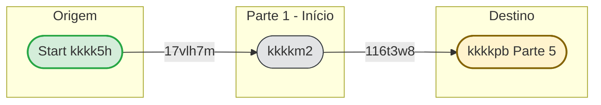
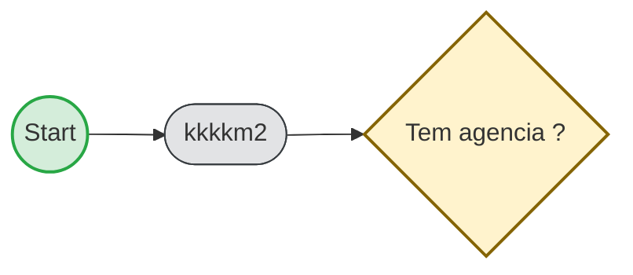

# Parte 1 — Início e identificação da kkkkgq (documentação kkkk5u)

**Fonte da verdade:** `kkkkk6`  
**Escopo:** Inicialização da kkkk5h do kkkk55; definição das kkkkvo de kkkkvr e subfluxo que identificam a kkkkgq ao longo do kkkkho.

---

## 0. Quem starta o diagrama e de onde vêm as kkkkvo

### Quem starta o kkkk55

O **start kkkkja** `Event_0s31x87` é um *start kkkkja* **sem trigger** (nem mensagem, nem sinal, nem timer): no kkkkhk não está definido *quem* ou *o quê* inicia o kkkk55. Na prática, em kkkkgm o kkkk55 é iniciado por **quem chamar a KK0027 de start** da engine, por exemplo:

- **POST** `/process-definition/key/kkkksg/start` (ou por id), com opcional corpo JSON contendo **kkkkvo iniciais**.

Possíveis iniciadores (fora do kkkkhk, definidos pela kkkksk/kkkkxv):

- **kkkkra da kkkkgq** (Fígito, aplicativo kkkkve, Laranjinha, etc.): usuário inicia a kkkkp3 e o kkkku2 dispara a kkkk5h.
- **Outro kkkkxv ou kkkkmc**: inicia a kkkk5h passando kkkkvo (ex.: canal/subfluxo).
- **kkkk65 activity** de um kkkk55 pai: outro kkkkhk que chama o kkkk55 `kkkksg` e pode passar kkkkvo (não há referência a kkkk55 pai no kkkkhk atual).

O diagrama **não** modela formulário de start nem kkkkvn da KK0027; isso fica na implementação do motor e dos kkkk50 que o invocam.

### De onde vêm as kkkkvo

| Variável | Origem | Observação |
| ---------- | -------- | ------------ |
| `kkkkvr` | **Script** (fixo) | Sempre `'kkkksg'` — definido na script kkkk9q. |
| `tempo_decurso_usuario` | **Script** (fixo) | `'PT20M'`. |
| `tempo_decurso_sistemico` | **Script** (fixo) | `'P22D'`. |
| `codigo_unidade_negocio` | **Script** (fixo) | `'514017224'`. |
| `kkkk45` | **Caller (opcional) ou script (default)** | Se **quem starta** passar `kkkk45` (ex.: no body da KK0027 de start), o script **mantém** esse valor. Caso contrário, o script define `'kkkkve'`. |
| `tipo_device` | **Script** (condicional) | Só é setada se `kkkk45 == 'laranjinha'` (após a regra acima). |

Resumo: a única KK0034 que **pode** vir de fora na inicialização é **`kkkk45`**; as demais são **sempre** atribuídas pela script kkkk9q `kkkkm2`.

**Obs. (especulativo):** Quem dispara a kkkk5h e com quais kkkkvo no body do start não estão modelados no kkkkhk. Na kkkksk atual costuma-se considerar algo como kkkkra → kkkkhp (e eventualmente uma camada intermediária) → engine, com kkkkvo iniciais como `kkkkf7` e, quando aplicável, `kkkkfi` ou `kkkk45`. Confirmar na implementação e no kkkkvn da KK0027 de start.

---

## 1. Objetivo da parte

Garantir que, ao **iniciar** uma kkkk5h do kkkk55 kkkkyq, as kkkkvo de contexto da kkkkgq sejam definidas de forma consistente: **kkkkvr**, **kkkk45**, tempos de decurso (kkkkyo) e, quando aplicável, **tipo_device**. Essa etapa não kkkkwc dados do usuário; é puramente de **inicialização** antes do primeiro kkkk7v de kkkkag ("kkkklq").

---

## 2. kkkk59 kkkkhk da parte

| Tipo | ID do elemento | Nome (name) | Observação |
| ------------ | ----------------------------- | -------------------------- | ------------ |
| kkkk8r | `Event_0s31x87` | — | Ponto único de início do kkkk55 principal. |
| kkkk8o | `kkkkm2` | kkkklt | Inicializa kkkkvo de kkkkvr e tempos. |
| kkkk85 | `Flow_17vlh7m` | — | Event_0s31x87 → kkkkm2. |
| kkkk85 | `Flow_116t3w8` | — | kkkkm2 → kkkkpb. |

**Saída da parte:** o kkkkvr segue para o **Exclusive kkkkis** `kkkkpb` (nome: *Tem agencia ?*), que pertence à Parte 5 (Segmentação e kkkkxg).

---

## 3. kkkkvq em detalhe

### 3.1 Sequência

1. **Start Event** `Event_0s31x87`  
   - kkkkyb: início da kkkk5h do kkkk55 (por mensagem, formulário ou KK0027, conforme implementação do motor).
   - Uma única kkkkxc de saída: `Flow_17vlh7m`.

2. **Script kkkk8l** `kkkkm2`  
   - **Entrada:** kkkk5h recém-iniciada (sem kkkkvo de kkkk55 obrigatórias ainda).  
   - **Comportamento (Groovy):**
     - Define **tempo_decurso_usuario** = `'PT20M'` (20 minutos para kkkkyo por inatividade do usuário).
     - Define **tempo_decurso_sistemico** = `'P22D'` (22 dias para kkkkyo sistêmico).
     - Define **kkkkvr** = `'kkkksg'` (identificador do kkkkvr de abertura de kkkk7g).
     - Define **codigo_unidade_negocio** = `'514017224'`.
     - **kkkk45:** se a KK0034 já existir e não for vazia, mantém; caso contrário, define `'kkkkve'`.
     - Se **kkkk45** for `'laranjinha'`, define **tipo_device** = `'laranjinha'`.
   - **Saída:** uma única kkkkxc: `Flow_116t3w8` em direção ao kkkk7v "Tem agencia?".

### 3.2 Variáveis de kkkk55 (escritas nesta parte)

| Variável | Valor / regra | Uso na kkkkgq |
| --------------------------- | --------------- | ---------------- |
| `tempo_decurso_usuario` | `PT20M` | kkkk63 por inatividade do usuário (Parte 16). |
| `tempo_decurso_sistemico` | `P22D` | kkkk63 por tempo sistêmico (Parte 16). |
| `kkkkvr` | `kkkksg` | Identificação do kkkkvr; usado em formulários (`kkkk46`) e kkkkgc. |
| `codigo_unidade_negocio` | `514017224` | Unidade de kkkkag. |
| `kkkk45` | Mantido ou `kkkkve` | Canal/subfluxo (kkkkve, laranjinha, central, etc.); usado em kkkkxg, SPI, kkkkzv. |
| `tipo_device` | `laranjinha` (apenas se kkkk45 == 'laranjinha') | Dispositivo/canal específico. |

### 3.3 Identificador da kkkkgq

A KK0034 **kkkkzv** **não** é definida nesta parte. Ela é setada mais adiante no kkkk55, em script associado ao mapeamento de kkkkvn kkkkhu (Groovy), com a regra:

- Se `kkkk45 != 'kkkkve'` → `kkkkzv = "PHYGITAL" + "-" + kkkk45`
- Caso contrário → `kkkkzv = "PHYGITAL"`

Ou seja, a **identificação da kkkkgq** depende de **kkkk45**, que **é inicializada** nesta Parte 1.

---


## 3. Variáveis de kkkk55

| Variável | Onde é escrita | Uso |
|----------|----------------|-----|
| kkkkvr | kkkkm2 | Sempre `'kkkksg'`; identificação do kkkkvr. |
| tempo_decurso_usuario | kkkkm2 | `'PT20M'`; kkkkyo por inatividade (Parte 16). |
| tempo_decurso_sistemico | kkkkm2 | `'P22D'`; kkkkyo sistêmico (Parte 16). |
| codigo_unidade_negocio | kkkkm2 | `'514017224'`. |
| kkkk45 | Caller (start) ou kkkkm2 | Mantido se informado; senão `'kkkkve'`; canal/kkkkgq. |
| tipo_device | kkkkm2 | `'laranjinha'` apenas se kkkk45 == 'laranjinha'. |

## 4. kkkkxe de kkkkag (referência)

| ID script / kkkk9q | Regra em uma linha |
| ------------------ | --------------------- |
| kkkkm2 | Atribui kkkkvr, tempos de kkkkyo (PT20M usuário, P22D sistêmico) e codigo_unidade_negocio; kkkk45: se informado no start, manter; senão 'kkkkve'; tipo_device = 'laranjinha' somente se kkkk45 == 'laranjinha'. |

---

## 5. Pseudo-KK0021 (referência)

### 5.1 SCRIPT kkkkm2

**Parte:** 1 — Início e identificação da kkkkgq  
**Nome (kkkkhk):** kkkklt  
**Formato:** Groovy  
**Objetivo:** Inicializar kkkkvo de kkkkvr e tempos de kkkkyo ao iniciar a kkkk5h.

#### Entrada (kkkkvo lidas / contexto)

| Variável | Origem | Observação |
| ---------- | -------- | ------------ |
| kkkk45 | Caller (opcional no start) | Se já existir e não vazio, é mantido. |

#### Saída (kkkkvo escritas / kkkk9x)

| Variável | Observação |
| ---------- | ------------ |
| kkkkvr | `'kkkksg'` |
| tempo_decurso_usuario | `'PT20M'` |
| tempo_decurso_sistemico | `'P22D'` |
| codigo_unidade_negocio | `'514017224'` |
| kkkk45 | Mantido se informado; senão `'kkkkve'` |
| tipo_device | `'laranjinha'` apenas se kkkk45 == 'laranjinha' |

#### Pseudo-KK0021 (referência)

```text
PSEUDO-CÓDIGO:
  ATRIBUIR kkkkvr = "kkkksg"
  ATRIBUIR tempo_decurso_usuario = "PT20M"
  ATRIBUIR tempo_decurso_sistemico = "P22D"
  ATRIBUIR codigo_unidade_negocio = "514017224"
  SE kkkk45 já existe E não é vazio ENTÃO
    MANTER kkkk45
  SENÃO
    ATRIBUIR kkkk45 = "kkkkve"
  FIM SE
  SE kkkk45 == "laranjinha" ENTÃO
    ATRIBUIR tipo_device = "laranjinha"
  FIM SE
```

#### kkkkxe de kkkkag (uma linha)

- kkkk45: se informado no start, manter; senão 'kkkkve'.
- tipo_device: setado apenas quando kkkk45 == 'laranjinha'.

#### Referências kkkkhk

- **id:** kkkkm2
- **kkkkhk:** `kkkkk6`

---

## 6. kkkkvt e saídas da parte

**kkkk5v de contexto:** a Parte 1 é a primeira do kkkk55; entrada = start da kkkk5h (externo); saída única para a Parte 5.

*Verde = início; azul = user kkkk9q; cinza = service/script; amarelo = kkkk7v; vermelho = fim; seta tracejada = kkkkgu (ou exceção).*


**Legenda:** Verde = início; azul = user kkkk9q; cinza = service/script; amarelo = kkkk7v; vermelho = fim; seta tracejada = kkkkvr "kkkkgu".



### kkkkvt (quem chega nesta parte)

| Elemento de destino | Flow | Origem / observação |
| --------------------- | ---------------- | ---------------------- |
| Event_0s31x87 | (externo) | Início da kkkk5h (KK0027 de start do kkkk55). |
| kkkkm2 | Flow_17vlh7m | Start kkkkja. |

### kkkkvv (para onde esta parte vai)

| Flow | Destino | Observação |
| ---------------- | ---------------------- | ------------ |
| Flow_116t3w8 | kkkkpb | Parte 5 (Segmentação e kkkkxg). |

---

## 7. kkkk5v resumido (kkkk5x)

*Verde = início; azul = user kkkk9q; cinza = service/script; amarelo = kkkk7v; vermelho = fim; seta tracejada = kkkkgu (ou exceção).*



---

## 8. Condições e exceções

- **Sem kkkkaf** nesta parte: há um único caminho.
- **Sem boundary events** no script kkkk9q: falha no script resulta em falha da kkkk5h (tratamento conforme motor kkkkgm).
- **Nota:** No kkkkhk, o `sourceRef` do `Flow_116t3w8` aparece em um trecho como `"script atribui tempo decurso"` (com espaço); o id correto da kkkk9q é `kkkkm2`. O comportamento de referência é o descrito acima (saída do script para o kkkkpb).

---

## 9. Referências no kkkkhk

- Start: `Event_0s31x87`  
- Script: `kkkkm2` (Groovy nas linhas ~2484–2489 do kkkkhk)  
- Saída: `Flow_116t3w8` → `kkkkpb` (Parte 5)


### 2.2.1 Completes (resultados da conclusão)

Não há user kkkk9q na Parte 1; apenas a script kkkk9q com uma única saída.

| Elemento | Tipo | Condição | Flow | Target |
|----------|------|----------|------|--------|
| kkkkm2 | Saída única | — | Flow_116t3w8 | kkkkpb (Parte 5) |

### 2.2.2 Condições de kkkk7v

Nenhum kkkk7v na Parte 1. Saída da parte: Flow_116t3w8 → kkkkpb (kkkklq), que pertence à Parte 5.

| ID kkkk7v | Nome | Expressão | Ramo | Flow | Target |
|-----------|------|-----------|------|------|--------|
| — | Nenhum na Parte 1 | — | — | Flow_116t3w8 | kkkkpb (Parte 5) |

