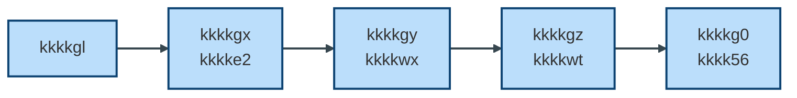

# Index de kkkksk kkkkho — visão geral e kkkkxc de leitura

## Uso desta pasta

**Os arquivos nesta pasta (fora de `out/`) são a referência.** A pasta `out/` contém backup ou cópias — não use como fonte. Fonte da verdade do kkkkvr: `kkkkk6` (raiz do repositório).

**Padronização:** [PLANO_REORGANIZACAO_PASTA_ARQUITETURA.md](PLANO_REORGANIZACAO_PASTA_ARQUITETURA.md) — tipos de kkkkta, template por tipo, kkkkyh em PT, vínculo com Manual e kkkk5w; aplicação em fases.

---

## kkkkz9

O kkkkho é a kkkksn de kkkklh kkkksg, originalmente modelada como um kkkkhk kkkkg4 e agora em kkkk55 de kkkkgv em kkkkh0 + kkkk0n.

Este índice organiza os artefatos que descrevem essa kkkksk-alvo, suas KK0003 e a kkkkxc recomendada de leitura e implementação. Use este arquivo para **onboarding** de novos arquitetos/desenvolvedores e como kkkkx1 mental da kkkkgq. Para as partes do kkkkvr documentadas por parte no Manual, ver [INDICE_E_PLANEJAMENTO_MANUAL_CO8.md](../../Manual%20OMNICHANNEL/INDICE_E_PLANEJAMENTO_MANUAL_CO8.md); para cruzamento kkkki5 × Manual × Multiplo, ver [REFERENCIA_CRUZADA_VISIONING_MANUAL.md](../REFERENCIA_CRUZADA_VISIONING_MANUAL.md) e [REFERENCIA_CRUZADA_MULTIPLO_SETUP_MANUAL.md](../../Manual%20OMNICHANNEL/REFERENCIA_CRUZADA_MULTIPLO_SETUP_MANUAL.md). **kkkkhk ramo kkkk6k (kkkkzo):** quando existir, a **Parte 12** do Manual e a [REFERENCIA_CRUZADA_MULTIPLO_SETUP_MANUAL](../../Manual%20OMNICHANNEL/REFERENCIA_CRUZADA_MULTIPLO_SETUP_MANUAL.md) cobrem o cruzamento Multiplo × kkkk8c × pós-kkkks7.

### Visão geral da kkkkgv (kkkkh0 → kkkkg2)

*Legenda:*
kkkkh0 = kkkk55 kkkkmc da kkkkgq
kkkkgx = kkkke2 | kkkkgy = kkkkwx | kkkkgz = kkkkwt | kkkkg0 = kkkk56

---

## kkkkx0 da kkkksk kkkkho

A kkkksk da kkkkfj é composta por quatro camadas principais:

| Camada | Descrição |
| -------- | ----------- |
| **kkkku4** | kkkkvs kkkkh0 (kkkkgm) que coordena a kkkkgq |
| **Etapas da kkkkgq** | kkkku5 kkkkg2 kkkkgx–4 (kkkke2, kkkkwx, kkkkwt, kkkk56) |
| **Serviços de kkkkag** | Microserviços e kkkk50 kkkkxm |
| **Interface** | kkkkra-end e kkkkfb |

Os documentos deste índice descrevem essas camadas sob diferentes perspectivas: KK0003 kkkkwm, KK0022 de execução, inventários do kkkkhk e artefatos de kkkkgt da kkkkgq.

---

## Evolução da kkkksk

A kkkksk kkkkho evolui através de:

- novos kkkkwu
- atualização dos KK0022 de kkkkvo ou eventos
- evolução dos inventários kkkkhk (N1, kkkkh5, kkkkh6)

Mudanças estruturais devem ser refletidas:

1. no kkkk7p correspondente
2. nos inventários do kkkkhk
3. nos KK0022 kkkkwm

---

## 1. Fonte de verdade do kkkk55 e inventários

- [kkkk3a](../kkkk5e%20da%20decomposição/kkkk3a)  
  **O que é:** kkkk5f do **nível 1 (kkkkh0)** — eventos, kkkk65 kkkk5t, kkkkaf, kkkker.  
  **Quando usar:** para saber tudo que o kkkkh0 precisa conter após a kkkkgv.

- [kkkk3b](../kkkk5e%20da%20decomposição/kkkk3b)  
  **O que é:** kkkk5f de **todas as tarefas** (User, Service, Script, kkkk65) por kkkkft.  
  **Quando usar:** para não perder nenhuma regra/tarefa ao cortar o kkkk51.

- [kkkk3c](../kkkk5e%20da%20decomposição/kkkk3c)  
  **O que é:** kkkk5f específico do kkkk55 de kkkk7u.  
  **Quando usar:** para tratar fluxos de kkkkfp e eventos kkkkyi.

- [kkkk3d](../kkkk5e%20da%20decomposição/kkkk3d)  
  **O que é:** agrupamento das tarefas do nível 2 em **blocos kkkkh6** (kkkk66 internos ou futuros `.bpmn`).  
  **Quando usar:** para decidir quais blocos viram kkkkpo ou kkkkem (ex.: kkkkbo, kkkkxf, kkkkhu).

---

## 2. Decisões kkkkwm (kkkkwu)

### 2.1 Estrutura da kkkkgq

- [kkkk5z](../kkkk7p/kkkk5z) — **preservar estado**  
  **Tema:** kkkk0n **sem estado próprio (kkkkjy)**; kkkkh0 é source of truth da kkkkgq.  
  **Uso:** consultar ao definir ou validar padrão de estado dos kkkkg2.  
  **Efeito:** kkkkg2 sempre podem ser reiniciados; estado da tela/kkkkgq vem das kkkkvo do kkkkh0.

- [kkkk5y](../kkkk7p/kkkk5y) — **kkkker**  
  **Tema:** kkkker entre kkkkhf (kkkkgo — mensagem + kkkkwk Event no kkkkh0).  
  **Uso:** consultar ao implementar ou alterar fluxos de "kkkkgu" entre kkkkhf.  
  **Efeito:** a lógica de “para onde kkkkgu” fica no kkkkh0; kkkkg2 não decidem kkkkgu sozinhos.  
  **Especificação (fonte da verdade):** [VOLTAR_MACRO_OPCAO_A.md](VOLTAR_MACRO_OPCAO_A.md). **Analogia didática:** [VOLTAR_MACRO_OPCAO_A_ANALOGIA_DIDATICA.md](VOLTAR_MACRO_OPCAO_A_ANALOGIA_DIDATICA.md).

- [kkkk25](../kkkk7p/kkkk25) (kkkkhk-DEC-005) — **kkkkgu cross-kkkkhk**  
  **Tema:** flow `kkkke3` = kkkkgu de `kkkkid` (kkkkgz) para `kkkkih` (kkkkg0) — kkkkc5.  
  **Uso:** referência para outros fluxos de kkkkgu entre kkkkhf.  
  **Efeito:** define padrão concreto de kkkkgu cross-kkkkhk.

- [kkkk29](../kkkk7p/kkkk29) (JORNADA-DEC-001) — **kkkk3w**  
  **Tema:** kkkk3w retoma **mesma kkkk5h de kkkk55 associada à kkkk3l**, não cria nova kkkk5h.  
  **Uso:** consultar ao implementar retomada por kkkk3w ou kkkkj0.  
  **Efeito:** padrão de kkkkuh (kkkkj0 kkkkvd + `kkkkco` + `kkkksi`).

- [kkkk23](../kkkk7p/kkkk23) — **kkkks7**  
  **Tema:** kkkk7y permanece como **kkkkem dentro do kkkkg0**, não no kkkkh0.  
  **Uso:** consultar ao alterar kkkkvr de kkkks7 ou kkkkwp kkkkh0 vs kkkk56.  
  **Efeito:** kkkkh0 não chama kkkk7y diretamente; kkkk56 encapsula esse kkkkvr.

### 2.2 Responsabilidades de domínio

- [kkkk26](../kkkk7p/kkkk26) (kkkkhk-DEC-003) e [kkkk22](../kkkk7p/kkkk22) (TRACE-DEC-001) — **kkkkts**  
  **Tema:** consultas de kkkksp/kkkk7d (`kkkkcc`, `kkkkpj`) ficam em **kkkkgz (kkkkwt)**.  
  **Uso:** consultar ao mover ou criar tarefas de kkkksp/kkkk7d.  
  **Efeito:** evita duplicação de kkkkyr entre kkkke2 e kkkkwt.

- [kkkk21](../kkkk7p/kkkk21) — **kkkkff**  
  **Tema:** `kkkkcb` tratado como kkkk55 **kkkk7r** acionado por kkkkx9.  
  **Uso:** consultar ao tratar fluxos regulatórios kkkk0f.  
  **Efeito:** separa kkkkvr kkkksz kkkk0f da kkkk53 principal.

- [kkkk24](../kkkk7p/kkkk24) (kkkkhk-DEC-004) — **kkkktp**  
  **Tema:** classificação de `kkkkbp` entre kkkkgy e 3 (status Proposed).  
  **Uso:** consultar ao posicionar tarefas de kkkktp.  
  **Efeito:** pauta de decisão para kkkksz kkkkh2.

- [kkkk28](../kkkk7p/kkkk28) (kkkkh6-DEC-002) e [DECISAO_CRITERIOS_CRIACAO_BLOCOS_N3.md](../kkkk7p/DECISAO_CRITERIOS_CRIACAO_BLOCOS_N3.md) (kkkkh6-DEC-001) — **seguros / kkkksh**  
  **Tema:** quando criar blocos kkkkh6; kkkkgs/kkkkhw/kkkksa são **campos/ramos**, não blocos próprios.  
  **Uso:** consultar ao criar ou nomear blocos kkkkh6.  
  **Efeito:** evita inflar o kkkkh6 com elementos de kkkklz (telas/flags) sem kkkkjf no kkkkhk.

- [kkkk20](../kkkk7p/kkkk20) — **kkkkfv**  
  **Tema:** quem dispara kkkk7u (kkkkg2 vs kkkkh0) — decisão por “kkkkdn kkkkx9”.  
  **Uso:** consultar ao implementar ou alterar kkkk5k do kkkk7u.  
  **Efeito:** kkkkh0 não fica kkkkwz por todos os disparos operacionais.

---

## 3. kkkkka e KK0022 centrais

- [kkkkvl](kkkkvl)  
  **Tema:** visão completa de kkkkh0 e kkkkg2, limites de kkkkyr, ciclo de vida das kkkk65 kkkk5t, correlação, kkkku1, observabilidade.  
  **Uso:** consolidar a visão da kkkksk-alvo depois da leitura dos kkkkwu-base.  
  **Efeito:** visão única de referência para kkkk53 kkkkho.

- [kkkkva](kkkkva)  
  **Tema:** kkkkbz kkkkh0 ↔ kkkkg2 (kkkk8i Contract Pattern), fonte de verdade, estrutura de objetos, kkkkvx incremental.  
  **Uso:** definir exatamente quais kkkkvo entram/saem de cada kkkkhj e como o front reconstrói a tela.  
  **Efeito:** kkkkvn único para entrada/saída de kkkkvo por kkkkhj.

- [kkkk1y](kkkk1y)  
  **Tema:** kkkkvn de **eventos**: kkkkgu, retomar, kkkk3w, kkkkvi, kkkkem.  
  **Uso:** alinhar front, kkkku2 e engine sobre mensagens (kkkker), kkkkj0 tokens e `kkkksi`.  
  **Efeito:** interpretação consistente de eventos entre canais.

- [kkkkvc](kkkkvc)  
  **Tema:** como kkkkdx kkkk0n **kkkkjy** (sem estado navegacional), ciclo de vida, kkkkvx, kkkkgc externas.  
  **Uso:** guia ao desenhar ou revisar um kkkk55 kkkkhj. **Efeito:** alinhamento de kkkkwn entre kkkkhf kkkkg2.

- [kkkku7](kkkku7)  
  **Tema:** quem orquestra (kkkkho), quem executa tarefas, canais de kkkku0, retentativas e kkkkqp.  
  **Uso:** entender kkkkwp kkkkmc × executores. **Efeito:** clareza sobre canais e retentativas.

- [kkkku6](kkkku6)  
  **Tema:** kkkkxb / kkkkig kkkkic — quem é kkkkwz por **cada parte do kkkk55** e por cada integração de kkkkag.  
  **Uso:** checar kkkkxb ao alterar kkkkvr ou integração. **Efeito:** evita lacunas de kkkkyr.

---

## 4. Artefatos de descoberta e kkkkx2 kkkkhk

> Artefatos de descoberta e kkkkx2 que destravam a kkkkgv do kkkk51 kkkkhk.

- [kkkku8](kkkku8)  
  **Tema:** blueprint da **kkkkgv**: kkkkh0 → kkkkgx–4, kkkk7y, kkkk7u, volta/retomada.  
  **Uso:** decidir como quebrar o kkkk51 em kkkk0n e kkkk65 kkkk5t.

- [kkkku9](kkkku9)  
  **Tema:** kkkkvk de tarefas por kkkkhk (User, Service, kkkk65, kkkkht).  
  **Uso:** checar se alguma tarefa ficou órfã após cortes/movimentos.

- [kkkk1v](kkkk1v)  
  **Tema:** kkkkvk de interações (kkkk8i KK0027) — tarefa kkkkhk → serviço/kkkkxv.  
  **Uso:** ver todas as chamadas externas (REST/Delegate/EVENT) e kkkky4 de falha.

- [kkkk1u](kkkk1u)  
  **Tema:** visão **por kkkkxv** (kkkke6, kkkkgk, kkkkhr/kkkkhs, kkkkh3/kkkkh4, kkkket, kkkkew, etc.).  
  **Uso:** enxergar kkkkx6 de alto nível e kkkkig contexts.

- [kkkkua](kkkkua)  
  **Tema:** estados da kkkk3l (kkkkzi, kkkkzd, …, kkkkzc, kkkkzg, kkkkzb, etc.).  
  **Uso:** definir kkkkx5 de retomada (kkkk3w/timeout) e expiração da kkkk3l.

- [kkkkuw](kkkkuw)  
  **Tema:** user journeys (kkkk38 inicia, kkkk1x completa, kkkk3w, kkkkgu, retomada).  
  **Uso:** conectar kkkklz/canais ao kkkkhk (como kkkk38/kkkk1x vivem a kkkkgq).

---

## 5. Sequência recomendada de leitura/trabalho (kkkkho)

1. **Entender o kkkk55 e os elementos**  
   1.1. Ler [kkkk3a](../kkkk5e%20da%20decomposição/kkkk3a) (kkkkh0)  
   1.2. Ler [kkkk3b](../kkkk5e%20da%20decomposição/kkkk3b) e [kkkk3d](../kkkk5e%20da%20decomposição/kkkk3d) (kkkkg2 e blocos)

2. **Ler as KK0003 kkkkwm-base (kkkkwu)**  
   2.1. [kkkk5z](../kkkk7p/kkkk5z)  
   2.2. [kkkk5y](../kkkk7p/kkkk5y)  
   2.3. [kkkk29](../kkkk7p/kkkk29) e [kkkk25](../kkkk7p/kkkk25)  
   2.4. kkkkwu de kkkkwp específicas: [kkkke9](../kkkk7p/kkkk26), [kkkkgs/kkkkhw/kkkksa](../kkkk7p/kkkk28), [kkkkb4](../kkkk7p/kkkk21), [kkkk7u](../kkkk7p/kkkk20), [kkkk7y](../kkkk7p/kkkk23).

3. **Fixar a kkkksk e os KK0022 centrais**  
   3.1. [kkkkvl](kkkkvl)  
   3.2. [kkkkva](kkkkva)  
   3.3. [kkkk1y](kkkk1y)  
   3.4. [kkkkvc](kkkkvc)

4. **Usar os artefatos de descoberta/kkkkx2**  
   4.1. [kkkku6](kkkku6) — quem faz o quê  
   4.2. [kkkku7](kkkku7) — quem orquestra / como comunica  
   4.3. [kkkku8](kkkku8) — como quebrar o kkkk51  
   4.4. [kkkku9](kkkku9) + [kkkk1v](kkkk1v) + [kkkk1u](kkkk1u) — tarefas, chamadas, kkkk50  
   4.5. [kkkkua](kkkkua) + [kkkkuw](kkkkuw) — estados + jornadas

5. **Só então alterar kkkkhk ou KK0021**  
   A implementação deve seguir os artefatos definidos acima. Mudanças relevantes devem ser rastreáveis a:
   - um **kkkk7p**
   - um **artefato de descoberta**
   - uma **alteração explícita no kkkk5f N1/kkkkh5/kkkkh6**  
   Isso vira governança kkkkfu.

---

## 6. Como usar este index no dia a dia

- **kkkkwq:** mandar este arquivo primeiro; depois seguir a kkkkxc da seção 5.  
- **Refatoração pontual:** localizar o tema (ex.: kkkk3w, kkkkgu, kkkk7d/kkkksp, kkkk0f), achar o kkkk7p correspondente, depois ver os KK0022/artefatos ligados.  
- **kkkk5p de kkkksk:** usar as tabelas de referências para garantir que novos kkkkwu e mudanças no kkkkhk sejam refletidos nos mapas/KK0022 adequados.
