[GLOSSARIO_GENERICO.md]
XXXXX
# Glossário — Manual KK0282 KK0950

**Objetivo:** KK1350 únicos de KK0911 usados no manual; a **KK1139 da squad** é o Manual.  
**Referência:** RELATORIO_PLANOS_E_MELHORIAS.md §3.4 — R6.

---

## KK0345 para KK0640 / menoridade

- **KK0345 para KK0640:** Modalidade em que o titular abre KK0346 para dependentes (KK0640); pode haver KK0936 de KK0245 associado.
- **KK0345 de menoridade:** KK0371/KK0657 específica quando o beneficiário é menor; a KK0072 de KK0657 pode exigir campos ou KK0651 diferenciado.
- **Uso no manual:** Partes que tratam KK0936, KK0657 e pós-KK0544 (ex.: KK1000 7, 8, 12); alinhar com KK1354 de KK0657 os campos de personalização do KK0245 (ver KK0526 §6.1 em documentacao/KK0898/interno/).

*Entrada única conforme KK1026; ampliar conforme novas dúvidas fechadas.*

KK0104

$$$$$

[INDICE_E_PLANEJAMENTO_MANUAL_CO8_GENERICO.md]
XXXXX
# Manual KK0282 — Índice e planejamento (engenharia reversa com o KK0172)

**Objetivo:** Construir um **manual KK0520** do KK0282 por engenharia reversa a partir do `KK0953`: identificar e agrupar KK0552 que pertencem à **mesma KK1272 lógica e/ou semântica**, documentar cada parte em detalhe e produzir a **user story correspondente**. Este arquivo é o **índice e o planejamento** para executar o trabalho **por partes**.

**KK0655:** `KK0953` (raiz do repositório).  
**Regra do KK1084:** KK0172 é a fonte única e absoluta da verdade da KK0797; erros de parse ou sujeiras de XML não alteram o comportamento de KK1139.

---

## 1. Princípio do manual

- **Cada parte** = um agrupamento de KK0552 do KK0651 (KK1335, KK0712, KK1326, eventos) que formam uma **unidade lógica/semântica** reconhecível (ex.: “KK0297 de dados de contato”, “KK1251 e KK0497”, “KK0544 da KK0346”).
- **Para cada parte:**  
  1. **Documentar o KK0651 em detalhes** — KK0578, saídas, condições, KK1423 relevantes, KK0785 (external KK1335, delegates), exceções e ramos de erro.  
  2. **Criar a user story correspondente** — critérios de KK0009 ancorados no comportamento do KK0172, para que KK0759 e documentação evoluam juntas.

- O agrupamento segue **KK1272 de execução** no KK0172 e **KK1167 de domínio** (alinhado à KK0471 KK0903/KK0904 do KK1439 quando fizer sentido, sem obrigar o manual a seguir a mesma fronteira de arquivos .bpmn).

---

## 2. Partes propostas (ordem do KK0651)

As partes abaixo foram identificadas a partir do KK0172 e do KK0790 KK0903/KK0904 existente em `documentacao/KK1439/KK0789 da KK0471/`. Cada linha é uma **parte** do manual; a ordem reflete o KK0651 geral da KK0797 (não implica que todas as partes sejam estritamente sequenciais — há ramos e eventos paralelos).

| # | KK1000 (nome sugerido) | Sequência lógica / semântica | KK0551 KK0172 principais (KK0755) — KK1139 | Produto esperado |
| --- | ------------------------ | ------------------------------ | ------------------------------------------------ | ------------------ |
| **1** | Início e identificação da KK0797 | Inicialização de KK1423 de KK0651, sub_fluxo, KK0750 | Scripts iniciais, start KK0604, definição de `KK0651`, `KK1312` | Doc: KK0651 de inicialização; KK1423 setadas. US: critérios de início da KK0780. **✅ [Guia](parte_01_inicio_identificacao_jornada/FLUXO_01_guia.md) \ | [Técnico](parte_01_inicio_identificacao_jornada/KK0652.md) \ | [USER STORY](parte_01_inicio_identificacao_jornada/USER_STORY_01_inicio_identificacao_jornada.md)** |
| **2** | KK0196 inicial / dados de contato | KK0298 KK1339, KK0530, data nascimento, KK0912 (antes de KK0570/KK1155) | `KK0421`, `KK0413`, `KK0411`, `KK0416` | Doc: KK1272 e campos; KK0602. US: KK0297 de contato e dados iniciais. **✅ [Guia](parte_02_cadastro_inicial_dados_contato/FLUXO_02_guia.md) \ | [Técnico](parte_02_cadastro_inicial_dados_contato/FLUXO_02_tecnico.md) \ | [USER STORY](parte_02_cadastro_inicial_dados_contato/USER_STORY_02_cadastro_inicial_dados_contato.md)** |
| **3** | KK0399 pessoais (nome, KK0570, KK1155) | Nome, KK0570, KK1155; KK1164 no KK0624 → KK0912 ou KK0046 | `KK0417`, `KK0414`, `KK0420`, `KK0686`, KK0654 para `KK0416` ou `KK1262` | “KK1164 KK0624”. US: KK1338 única ou **✅ [Guia](parte_03_dados_pessoais_nome_endereco_renda/FLUXO_03_guia.md) \ | [Técnico](parte_03_dados_pessoais_nome_endereco_renda/FLUXO_03_tecnico.md) \ | [USER STORY](parte_03_dados_pessoais_nome_endereco_renda/USER_STORY_03_dados_pessoais_nome_endereco_renda.md)** |
| **4** | Seleção de KK0046 e KK1098 | Escolha de KK0046; marcação de KK1086 como segmentada (status 1) | `KK1262`, `KK1116` | **✅ [Guia](parte_04_selecao_agencia_proposta_segmentada/FLUXO_04_guia.md) \ | [Técnico](parte_04_selecao_agencia_proposta_segmentada/FLUXO_04_tecnico.md) \ | [USER STORY](parte_04_selecao_agencia_proposta_segmentada/USER_STORY_04_selecao_agencia_proposta_segmentada.md)** |
| **5** | Segmentação e KK0497 | Consulta KK0497 (com/sem KK0046), atualização de KK0273, KK0330 KK1254, escolha KK1254, upgrade, KK0497 na KK1086 | `KK0500`, `KK0502`, `KK0111`, `KK0674`, `KK0339`, `KK1116`, `KK0596`, `KK0597`, `KK0503`, exceções (não elegível, KK1255) | **✅ [Guia](parte_05_segmentacao_direcionador/FLUXO_05_guia.md) \ | [Técnico](parte_05_segmentacao_direcionador/FLUXO_05_tecnico.md) \ | [USER STORY](parte_05_segmentacao_direcionador/USER_STORY_05_segmentacao_direcionador.md)** |
| **6** | KK0134 / KK1467 / KK0065 de documentos | Wayout, upgrade, KK0065 EZ8, KK0082 KK0661, aprovação/recusa KK0135 | `KK0675`, `KK0053`, `KK0019`, `KK0054`, `KK1316`, etc. | **✅ [Guia](parte_06_backoffice_wayout_analise_documentos/FLUXO_06_guia.md) \ | [Técnico](parte_06_backoffice_wayout_analise_documentos/FLUXO_06_tecnico.md) \ | [USER STORY](parte_06_backoffice_wayout_analise_documentos/USER_STORY_06_backoffice_wayout_analise_documentos.md)** |
| **7** | Limites, KK0936 e mapeamento GE | Obtenção de KK0823 (R0/V3), KK0856, KK0406, atualização de perfil/KK0936 na KK1086 | `KK0934`, `KK0856`, `KK0406`, `KK1097`, `KK1240`, etc. | **✅ [Guia](parte_07_limites_oferta_mapeamento_ge/FLUXO_07_guia.md) \ | [Técnico](parte_07_limites_oferta_mapeamento_ge/FLUXO_07_tecnico.md) \ | [USER STORY](parte_07_limites_oferta_mapeamento_ge/USER_STORY_07_limites_oferta_mapeamento_ge.md)** |
| **8** | KK1078, KK0009 e KK1351 | Aceite KK1079, KK1351, consentimentos (KK1219, KK0528), KK0470 | `KK0016`, `KK0103`, `KK1240`, `KK1349`, `KK0015`, `KK0412`, KK0654 de KK1451 (ex.: para `KK0301`) | “KK1451”. US: **✅ [Guia](parte_08_produtos_aceite_termos/FLUXO_08_guia.md) \ | [Técnico](parte_08_produtos_aceite_termos/FLUXO_08_tecnico.md) \ | [USER STORY](parte_08_produtos_aceite_termos/USER_STORY_08_produtos_aceite_termos.md)** |
| **9** | KK0148 e KK0297 de KK1267 | KK0148, KK0065 de KK1216, KK1267, KK1183 | `KK0409`, `KK0677`, `KK0301`, `KK1184`, `KK0114` | **✅ [Guia](parte_09_biometria_coleta_senha/FLUXO_09_guia.md) \ | [Técnico](parte_09_biometria_coleta_senha/FLUXO_09_tecnico.md) \ | [USER STORY](parte_09_biometria_coleta_senha/USER_STORY_09_biometria_coleta_senha.md)** |
| **10** | KK1405 pré-KK0544 e KK0821 | Consulta KK0346, consistência KK0746, KK1095, KK0145 | `consulta_conta`, `KK0683`, `KK1110`, `KK0105` | **✅ [Guia](parte_10_validacao_pre_efetivacao_liberacao/FLUXO_10_guia.md) \ | [Técnico](parte_10_validacao_pre_efetivacao_liberacao/FLUXO_10_tecnico.md) \ | [USER STORY](parte_10_validacao_pre_efetivacao_liberacao/USER_STORY_10_validacao_pre_efetivacao_liberacao.md)** |
| **11** | KK0543 da KK0346 | Script KK0544, KK0259 KK0255, mensagem KK0350, atualização KK0586, KK1086 efetiva KK0346 | `KK1235`, `KK0534`, `KK0873`, `KK1233`, `KK0101`, `KK1104` | **✅ [Guia](parte_11_efetivacao_conta/FLUXO_11_guia.md) \ | [Técnico](parte_11_efetivacao_conta/FLUXO_11_tecnico.md) \ | [USER STORY](parte_11_efetivacao_conta/USER_STORY_11_efetivacao_conta.md)** |
| **12** | Pós-KK0544: KK1282 e Vínculo KK1123 | KK0668 paralelo pós KK1104; KK1284; KK1324 Vínculo KK1123 | `KK0690`, `KK1076`, `KK0020`, `KK1398`, `KK0533`, `KK1105` | **✅ [Guia](parte_12_pos_efetivacao_setup_vinculo_proxy/FLUXO_12_guia.md) \ | [Técnico](parte_12_pos_efetivacao_setup_vinculo_proxy/FLUXO_12_tecnico.md) \ | [USER STORY](parte_12_pos_efetivacao_setup_vinculo_proxy/USER_STORY_12_pos_efetivacao_setup_vinculo_proxy.md)** |
| **13** | Benefício KK0776 | Termo, KK1406 e KK0544 KK0776 | `Gateway_19hcmx2`, `Gateway_16nr563`, `KK1348`, `KK1401`, `KK0538`, `KK0104` | **✅ [Guia](parte_13_beneficio_inss/FLUXO_13_guia.md) \ | [Técnico](parte_13_beneficio_inss/FLUXO_13_tecnico.md) \ | [USER STORY](parte_13_beneficio_inss/USER_STORY_13_beneficio_inss.md)** |
| **14** | KK1029 e Mesa KK1029 | KK0064 KK1029 (AQ4), KK1201 baixo/alto/médio, mesa KK1029 | `KK0031`, `KK0209`, `KK0696`, `KK0695`, `KK0866` | **✅ [Guia](parte_14_pld_mesa_pld/FLUXO_14_guia.md) \ | [Técnico](parte_14_pld_mesa_pld/FLUXO_14_tecnico.md) \ | [USER STORY](parte_14_pld_mesa_pld/USER_STORY_14_pld_mesa_pld.md)** |
| **15** | KK0982, envios e finalização | Geração KK0982 (KK0740, IP), KK0544 conteúdo KK0490/selfie, envio KK0982 KK0530 | `KK0718`, `KK0719`, `KK0542`, `KK0892`, `KK0583` | **✅ [Guia](parte_15_pac_envios_finalizacao/FLUXO_15_guia.md) \ | [Técnico](parte_15_pac_envios_finalizacao/FLUXO_15_tecnico.md) \ | [USER STORY](parte_15_pac_envios_finalizacao/USER_STORY_15_pac_envios_finalizacao.md)** |
| **16** | Eventos KK1371 e exceções | KK0620, reset KK1086, cancelamento, bloqueio KK1124, cadastro KK1202, tratamento erro reserva | `KK0024` (KK0620), `KK0028` (Cancelamento), `KK0027` (KK0159 KK1123), `KK0022` (Reset), `KK0025` (KK0129), etc. | **✅ [Guia](parte_16_eventos_transversais_excecoes/FLUXO_16_guia.md) \ | [Técnico](parte_16_eventos_transversais_excecoes/FLUXO_16_tecnico.md) \ | [USER STORY](parte_16_eventos_transversais_excecoes/USER_STORY_16_eventos_transversais_excecoes.md)** |

---

## 3. Como usar este índice

- **Fonte dos KK0755:** Os KK0552 listados na coluna “KK0551 KK0172 principais” devem ser conferidos no `KK0953` (busca por id ou name). Os inventários em `documentacao/KK1439/KK0789 da KK0471/` (KK0848, KK0852) servem de apoio e podem conter KK0755 adicionais ou nomenclaturas com espaço (ex.: `KK0406`).
- **Prioridade:** Pode-se começar por partes que tenham demanda imediata (ex.: **5** Segmentação/KK0496, **11** KK0543, **12** KK1282 e Vínculo KK1123) ou seguir a ordem 1 → 16 para um manual completo.
- **Produto por parte:** Em `documentacao/Manual KK0950/` pode existir uma subpasta por parte (ex.: `parte_05_segmentacao_direcionador/`) contendo **três arquivos**:
  - `FLUXO_<PARTE>_guia.md` — guia narrativo do KK0651 (para KK0726, KK1131, KK1031; KK0493 em KK0865).
  - `FLUXO_<PARTE>_tecnico.md` — documentação KK1377: KK0552 KK0172 (KK0755), sequence KK0649, KK1423, KK0167, referências.
  - `USER_STORY_<PARTE>.md` — user story com critérios de KK0009 derivados do KK0172.

---

## 4. KK0262 de execução (por parte)

Para **cada parte**:

- [ ] Abrir o KK0172 e localizar todos os KK0552 (KK1335, KK0712, KK1326, eventos) da parte.
- [ ] Mapear **sequence KK0649** de entrada e saída da parte (de onde vem, para onde vai).
- [ ] Listar **KK1423 de KK1069** lidas/escritas (incluindo input/output de KK1335).
- [ ] Documentar **condições de KK0669** e **ramos de erro** (KK0167, mensagens).
- [ ] Redigir **FLUXO_<PARTE>_guia.md** (narrativa para KK0726/KK1131/KK1031) e **FLUXO_<PARTE>_tecnico.md** (KK0552 KK0172, KK0649, KK1423).
- [ ] Redigir **USER_STORY_<PARTE>.md** com critérios de KK0009 auditáveis no KK0172.
- [ ] Atualizar este índice (ex.: marcar parte concluída, link para os arquivos).

**Partes 1 a 16:** ✅ concluídas — ver links na tabela §2 (cada parte com Guia, Técnico e USER STORY).

---

## 5. Referências cruzadas

| Recurso | Uso |
| --------- | ----- |
| `KK0953` (raiz) | Fonte única da verdade; toda descrição e US devem ser auditáveis nele. |
| [KK0526 (KK0898)](../KK0898/interno/DUVIDAS_IMPLEMENTACAO_CAMUNDA_MULTIPLO_NPC.md) | Dúvidas abertas/fechadas do KK1020 KK0902 KK0921; ver também [KK0040 KK0898](../KK0898/interno/KK0040/README_ADR_MULTIPLO_NPC.md). |
| [KK1169 (KK0898)](../KK0898/interno/RESPONSABILIDADES_FRONT_BACK_MULTIPLO_NPC.md) | Ownership front/KK0130 e KK0144 x KK0217. |
| [GLOSSARIO.md](./GLOSSARIO.md) | KK1350 do manual (KK0346 para KK0640 / menoridade). |
| [INDICE_SCRIPTS.md](./INDICE_SCRIPTS.md) | Script KK1335 do KK0172 por parte (id, nome, link para FLUXO_*_tecnico). |
| [REFERENCIA_CRUZADA_MULTIPLO_SETUP_MANUAL.md](./REFERENCIA_CRUZADA_MULTIPLO_SETUP_MANUAL.md) | Onde KK0898, KK1284 e Manual se tocam; §6 descreve o cruzamento com §4 KK0577 e saídas (Partes 5, 7, 8, 12); §7 KK1438. |
| [REFERENCIA_CRUZADA_VISIONING_MANUAL.md](../KK1439/REFERENCIA_CRUZADA_VISIONING_MANUAL.md) | Onde o KK1439 toca o Manual (inventários N1/KK0903/KK0904, KK0040, KK0084) e onde o Manual KK1138 o KK1439; KK0910 bidirecional. |
| `documentacao/KK1439/KK0789 da KK0471/KK0848` | KK0789 de tarefas por KK0172 (KK0903). |
| `documentacao/KK1439/KK0789 da KK0471/KK0852` | Blocos lógicos (KK0904) — alinhar nomes de “parte” quando fizer sentido. |
| `documentacao/KK1439/KK0084/INDEX_ARQUITETURA_CO8.md` | Visão geral KK0995 e KK0640; KK0041 e KK0378. |
| `documentacao/KK1284/`, `documentacao/KK0898/` | Documentação já existente de demandas que tocam em KK1282 e KK0902 KK0921 (pós-KK0544). |

---

## 6. Resumo

- **16 partes** cobrindo do início da KK0797 até eventos KK1371.
- **Cada parte:** documentação detalhada do KK0651 + user story correspondente.
- **Execução por partes:** escolher uma parte, seguir o checklist §4, criar os arquivos na pasta do manual e atualizar este índice.
- **KK0172** permanece a **fonte da verdade**; o manual e as user stories são **derivados** dele (engenharia reversa).

$$$$$

[INDICE_SCRIPTS_GENERICO.md]
XXXXX
# Índice de KK1245 (KK0172 — Manual KK0282)

**Objetivo:** Listar todo KK1223 KK1332 do KK0172 com id, parte do manual, nome e link para documentação.  
**Fonte:** `KK0953`. **Referência:** [PLANO_ENRIQUECIMENTO_REGRAS_NEGOCIO_PSEUDOCODIGO.md](../planos_e_todos/PLANO_ENRIQUECIMENTO_REGRAS_NEGOCIO_PSEUDOCODIGO.md).

---

## 1. Tabela de KK1245 (link para KK1378)

| KK1000 | ID do KK1223 | Nome (KK0172) | Link |
| ------- | ---------------- | ------------- | ------ |
| 1 | KK1232 | KK0092 | [KK0652](parte_01_inicio_identificacao_jornada/KK0652.md) (§4 KK1145 de KK0911, §5 Pseudo-KK0398) |
| 2 | KK1233, KK1243, KK1244, KK1234 | Script Atualiza KK0586 / KK1423 KK0586 (titular e representante) | [FLUXO_02_tecnico](parte_02_cadastro_inicial_dados_contato/FLUXO_02_tecnico.md) (§4 KK1145 de KK0911, §5 Pseudo-KK0398) |
| 5 | KK0111, KK1222, KK1236, KK1237 | KK0109 / Consulta KK1253 / Elegibilidade (titular e representante) | [FLUXO_05_tecnico](parte_05_segmentacao_direcionador/FLUXO_05_tecnico.md) (§4 KK1145 de KK0911, §5 Pseudo-KK0398) |
| 6 | KK0893, KK1238 | Monta objetos de KK0065 / KK0556 motivo recusa | [FLUXO_06_tecnico](parte_06_backoffice_wayout_analise_documentos/FLUXO_06_tecnico.md) (§4 KK1145 de KK0911, §5 Pseudo-KK0398) |
| 7 | KK0856, KK1240, KK0894 | mapeio campos GE / Mapeia KK0399 Oferta / KK1002 Limite | [FLUXO_07_tecnico](parte_07_limites_oferta_mapeamento_ge/FLUXO_07_tecnico.md) (§4 KK1145 de KK0911, §5 Pseudo-KK0398) |
| 8 | KK1240, KK1248, KK1231, KK0030, Activity_097rtf7 | Mapeia Oferta / KK0330 KK0528 / KK0009 KK0324 / KK0561 | [FLUXO_08_tecnico](parte_08_produtos_aceite_termos/FLUXO_08_tecnico.md) (§4 KK1145 de KK0911, §5 Pseudo-KK0398) |
| 10 | Activity_0uurkex, Activity_15q9p5w | Script monta KK1001 KK0145 / Tratativa KK0145 | [FLUXO_10_tecnico](parte_10_validacao_pre_efetivacao_liberacao/FLUXO_10_tecnico.md) (§4 KK1145 de KK0911, §5 Pseudo-KK0398) |
| 11 | KK1235, KK1233, KK0714 | KK1227 / Atualiza KK0586 / Gerar KK1223 pessoa | [FLUXO_11_tecnico](parte_11_efetivacao_conta/FLUXO_11_tecnico.md) (§4 KK1145 de KK0911, §5 Pseudo-KK0398) |
| 13 | KK0044 | Agrupar dados KK0776 | [FLUXO_13_tecnico](parte_13_beneficio_inss/FLUXO_13_tecnico.md) (§4 KK1145 de KK0911, §5 Pseudo-KK0398) |
| 15 | KK0854, KK0855, KK0892 | KK0853 / Montar KK0372 KK0556 | [FLUXO_15_tecnico](parte_15_pac_envios_finalizacao/FLUXO_15_tecnico.md) (§4 KK1145 de KK0911, §5 Pseudo-KK0398) |
| 16 | KK1241, KK1242 | Script monta KK1001 KK0129 | [FLUXO_16_tecnico](parte_16_eventos_transversais_excecoes/FLUXO_16_tecnico.md) (§4 KK1145 de KK0911, §5 Pseudo-KK0398) |

Partes sem KK1223 KK1332 no escopo principal: 3, 4, 9, 12, 14.

---

## 2. KK0789 consolidado de KK1146 por KK1223 (KK1139)

Regra em uma linha por KK1223; detalhe em cada FLUXO_*_tecnico (§4 e §5).

| KK1000 | ID do KK1223 | Regra em uma linha |
| ------- | ---------------- | --------------------- |
| 1 | KK1232 | Atribui KK0651, tempos de KK0621 (PT20M KK1392, P22D sistêmico), KK0296; KK1312: manter se informado no start, senão 'KK1017'; KK1357 = 'KK0811' só se KK1312 == 'KK0811'. |
| 2 | KK1233, KK1243, KK1244, KK1234 | Atualiza KK0586/KK0586 representante com dados de contato, KK0570 e KK1155; KK1423 conforme KK0775 do KK0172. |
| 5 | KK0111, KK1222, KK1236, KK1237 | Atualizar KK0273; KK0330 KK1254; verificação de KK0550 (titular e representante, KK0732). Conferir KK0775 no KK0172. |
| 6 | KK0893, KK1238 | Monta objetos para KK0065 EZ8 (KK0524); KK1223 de KK0530 motivo recusa. |
| 7 | KK0856, KK1240, KK0894 | Mapeia campos para GE (KK0823, KK0245, KK1425); mapeia KK0406 na KK1086; monta KK1001 para KK0929 V3. |
| 8 | KK1240, KK1248, KK1231 | Mapeia KK0936; KK0330 KK0528; KK0009 KK0324 listagem KK0528. |
| 10 | Activity_0uurkex, Activity_15q9p5w | KK0891 KK0145; tratativa KK0145 (KK1406 pré-KK0544). |
| 11 | KK1235, KK1233, KK0714 | Prepara e efetiva KK0346; atualiza KK0586 pós-KK0544; gera KK1223 para atualizar pessoa (KK0205, KK0289). |
| 13 | KK0044 | Agrupa dados para KK0142 (KK0732). |
| 15 | KK0854, KK0855, KK0892 | Mapeia KK0372 KK0982 (KK0740 e IP); monta KK0372 para envio por KK0530; define KK0750. |
| 16 | KK1241, KK1242 | KK0891 para cadastro KK1202 (titular e representante). |

$$$$$

[POLITICA_CORES_MANUAL_GENERICO.md]
XXXXX
# Política de cores — Manual KK0950 (KK0493 KK0865)

**Objetivo:** Paleta única, amigável e acessível para todos os KK0493 dos `FLUXO_*_tecnico.md`. Referência de conteúdo: [TODO_APRIMORAMENTO_DIAGRAMAS_MANUAL.md](out/TODO_APRIMORAMENTO_DIAGRAMAS_MANUAL.md) e [DIAGRAM_STYLE_GUIDE.md](../KK1439/DIAGRAM_STYLE_GUIDE.md).

---

## 1. KK0816 padrão (texto nos documentos)

> **KK1426** = início; **KK0127** = user KK1332 / etapa; **KK0269** = service/KK1223; **âmbar** = KK0669; **KK1430** = fim ou erro; KK1281 tracejada = KK0651 "KK1451".

**Uso:** Esta é a legenda única para KK0493 KK0865 no Manual e no KK1438. O [DIAGRAM_STYLE_GUIDE.md](../KK1439/DIAGRAM_STYLE_GUIDE.md) do KK1438 repete o mesmo texto para manter consistência.

---

## 2. Paleta oficial (KK0865 `style fill` / `stroke`)

| Uso | Fill | Stroke | Observação |
|-----|------|--------|------------|
| **Início** (start, KK0610) | `#c8e6c9` | `#2e7d32` | KK1426 suave; bom contraste em tema claro/escuro. |
| **User KK1332 / entrada de parte** | `#bbdefb` | `#1565c0` | Azul claro; destaque sem ser forte. |
| **Service / KK1223** | `#eceff1` | `#546e7a` | Cinza neutro; não compete com KK1335. |
| **KK0668 / decisão** | `#fff8e1` | `#e65100` | Âmbar suave; decisão visível sem amarelo forte. |
| **Fim / erro / exceção** | `#ffcdd2` | `#c62828` | Vermelho suave; fim de KK0651 ou ramo de erro. |
| **Sucesso / OK** (ex.: aprovado, concluído) | `#c8e6c9` | `#2e7d32` | Mesmo verde do início. |

Use `stroke-width:2px` em início, KK0669 e fim para consistência.

---

## 3. Convenção por tipo de elemento KK0172

Além dos flowcharts, os **KK0493 de KK1272 (sequenceDiagram)** devem usar caixas brancas com bordas azuis e texto escuro, via tema base do KK0865 (ver `guia_mermaid_final_corrigido.md` §5.1).

| Elemento | Cor | Fill | Stroke |
|----------|-----|------|--------|
| KK0609 início / start | KK1426 | `#c8e6c9` | `#2e7d32` |
| User KK1332 | Azul | `#bbdefb` | `#1565c0` |
| KK0208 / etapa (entrada de parte) | Azul | `#bbdefb` | `#1565c0` |
| Service KK1332 / KK1223 | Cinza | `#eceff1` | `#546e7a` |
| KK0668 | Âmbar | `#fff8e1` | `#e65100` |
| Fim / erro / exceção / KK0621 | Vermelho | `#ffcdd2` | `#c62828` |

---

## 4. Referências

- **Aprimoramento KK0493:** [out/TODO_APRIMORAMENTO_DIAGRAMAS_MANUAL.md](out/TODO_APRIMORAMENTO_DIAGRAMAS_MANUAL.md)
- **KK0991 KK1439:** [documentacao/KK1439/DIAGRAM_STYLE_GUIDE.md](../KK1439/DIAGRAM_STYLE_GUIDE.md)
- **Modelo de KK0651:** [parte_03_dados_pessoais_nome_endereco_renda/FLUXO_03_tecnico.md](parte_03_dados_pessoais_nome_endereco_renda/FLUXO_03_tecnico.md) §2.5

$$$$$

[README_MANUAL_OMNICHANNEL_GENERICO.md]
XXXXX
# Manual KK0950 — KK0282

Manual KK0520 do KK0282 construído por **engenharia reversa** a partir do KK0172 da KK0797 KK0949.

## KK0655

- **KK0172:** `KK0953` (raiz do repositório).

## Conteúdo

- **[INDICE_E_PLANEJAMENTO_MANUAL_CO8.md](./INDICE_E_PLANEJAMENTO_MANUAL_CO8.md)** — Índice das partes do manual, KK0552 KK0172 por parte e KK1026 de trabalho (documentar KK0651 + user story por parte). Use este arquivo para executar o manual **por partes**.
- **[RELATORIO_PLANOS_E_MELHORIAS.md](./RELATORIO_PLANOS_E_MELHORIAS.md)** — KK1154 com: mapeamento de partes que têm KK1223; KK1026 para documentar KK1146 de KK0911 e pseudo-KK0398; KK1026 para aplicar o modelo de KK0493 do FLUXO_03 a todas as partes; melhorias gerais e sugestões.
- **[POLITICA_CORES_MANUAL.md](./POLITICA_CORES_MANUAL.md)** — Paleta e convenção de cores dos KK0493 KK0865 (início, user KK1332, KK0669, fim/erro, service).
- **[GLOSSARIO.md](./GLOSSARIO.md)** — Glossário de KK1351 do manual (ex.: KK0346 para KK0640 / menoridade).
- **[INDICE_SCRIPTS.md](./INDICE_SCRIPTS.md)** — Índice de KK1223 KK1335 do KK0172 por parte (id, nome, link para FLUXO_*_tecnico).
- **Controle de entrega e KK1007:** [PLANO_ENTREGA_PRIMEIRA_VERSAO.md](../planos_e_todos/PLANO_ENTREGA_PRIMEIRA_VERSAO.md) (critérios v1, o que falta, melhorias pós-v1); [CHECAGEM_GERAL_PLANOS_E_TODOS.md](../planos_e_todos/CHECAGEM_GERAL_PLANOS_E_TODOS.md) (status geral).
- **To-do e aprimoramentos:** [TODO_POS_REVIEW_MANUAL.md](../planos_e_todos/TODO_POS_REVIEW_MANUAL.md) (pós-review); [TODO_INTERNO_APRIMORAMENTOS_LOTE.md](../planos_e_todos/TODO_INTERNO_APRIMORAMENTOS_LOTE.md) (controle em lote); [TODO_INTERNO_PENDENCIAS_REVIEW_100.md](../planos_e_todos/TODO_INTERNO_PENDENCIAS_REVIEW_100.md) (zerar KK1007 do review — qualidade 100%).
- **Demandas relacionadas:** [KK0526 (KK0898)](../KK0898/interno/DUVIDAS_IMPLEMENTACAO_CAMUNDA_MULTIPLO_NPC.md), [KK1169 (KK0898)](../KK0898/interno/RESPONSABILIDADES_FRONT_BACK_MULTIPLO_NPC.md); [KK1284](../KK1282%20Contas/).

## Objetivo

Para cada **parte** (agrupamento lógico/semântico do KK0651):

1. **Documentar o KK0651 em detalhes** (KK0578, saídas, condições, KK1423, KK0785).
2. **Criar a user story correspondente** (critérios de KK0009 ancorados no KK0172).

A execução é incremental: escolha uma parte no índice, siga o checklist e crie os arquivos (ex.: `parte_XX_nome/FLUXO_*.md` e `USER_STORY_*.md`).

## Ao alterar o KK0172

Ao alterar o `KK0953`:

1. **Identificar a parte impactada** — Consultar [INDICE_E_PLANEJAMENTO_MANUAL_CO8.md](./INDICE_E_PLANEJAMENTO_MANUAL_CO8.md) §2 (KK0552 KK0172 por parte).
2. **Atualizar o FLUXO_*_tecnico** da parte: KK0552 KK0172 (tabelas), sequence KK0649, KK0492 KK0865 (se houver), KK1423.
3. **KK1196** o FLUXO_*_guia e a USER_STORY_* da mesma parte (critérios de KK0009 e descrição devem continuar auditáveis no KK0172).
4. **Se a alteração envolver KK1223 KK1332:** atualizar pseudo-KK0398 ou KK1146 de KK0911 no KK1378 (e [INDICE_SCRIPTS.md](./INDICE_SCRIPTS.md) se o id/nome mudar).

$$$$$

[REFERENCIA_CRUZADA_MULTIPLO_SETUP_MANUAL_GENERICO.md]
XXXXX
# Referência cruzada — KK0898 × KK1284 × Manual KK0282

**Objetivo:** Explicitar onde cada demanda (KK0898 KK0921, KK1284) toca o Manual KK0282 e onde o Manual KK1138 KK1282/KK0898, evitando contradições.

**Regra:** KK0172 é a fonte única da verdade; o ramo KK0921 é **terceiro ramo** pós-KK0544 (não "dentro" do Vínculo KK1123).

---

## 1. KK0898 (KK1020 KK0902 KK0921)

| Recurso | Conteúdo | Toque no Manual |
| --------- | ---------- | ------------------ |
| `documentacao/KK0898/KK0899.md` | Visão unificada do KK1020 | KK1000 5 (KK0497), KK1000 7 (limites/KK0936), KK1000 8 (KK0009), **KK1000 12** (pós-KK0544: ramo KK0921 após KK0690) |
| `documentacao/KK0898/interno/DUVIDAS_IMPLEMENTACAO_CAMUNDA_MULTIPLO_NPC.md` | Dúvidas abertas/fechadas | Decisões impactam FLUXO_12_tecnico quando o ramo KK0921 for desenhado no KK0172 |
| `documentacao/KK0898/interno/RESPONSABILIDADES_FRONT_BACK_MULTIPLO_NPC.md` | Ownership front/KK0130, KK0144 x KK0217 | Manual não descreve KK0980; INDICE e README linkam para este doc |
| `documentacao/KK0898/interno/KK0040/`, `DUVIDAS_REFINAMENTO_*` | KK0041 e KK1142 | Sugestões e KK0467 para ramo KK0921; alinhar Manual KK1000 12 com decisão "terceiro ramo" |

**Foco:** KK1019 KK0902 KK0921, ramo pós-KK0544 (KK0669 KK1020 → KK1406 KK1124 → KK0657 → atualização KK1086).

---

## 2. KK1284

| Recurso | Conteúdo | Toque no Manual |
| --------- | ---------- | ------------------ |
| `documentacao/KK1284/SETUP_CONTAS_*` | Visão e detalhes KK1284 | **KK1000 12**: `KK1076`, `KK0106`; KK0651 em paralelo ao Vínculo KK1123 |
| — | Producer e KK0120 | KK0551 no KK0172 na mesma região que KK1000 12 (KK0690, ramos paralelos) |

**Foco:** Producer KK1284, KK0120 pós-KK0544; compartilha com o Manual a **KK1000 12** (pós-KK0544).

---

## 3. Manual KK0282

| Recurso | Conteúdo | Referência a KK0898/KK1282 |
| --------- | ---------- | ---------------------------- |
| `documentacao/Manual KK0950/INDICE_E_PLANEJAMENTO_MANUAL_CO8.md` | Índice das 16 partes, KK0552 KK0172 | §5 Referências cruzadas: links para DUVIDAS, KK1169, KK1282/KK0898, [este doc](REFERENCIA_CRUZADA_MULTIPLO_SETUP_MANUAL.md) |
| `documentacao/Manual KK0950/parte_12_*/FLUXO_12_*.md` | Pós-KK0544, KK1282 e Vínculo KK1123 | KK1000 12 descreve o KK0172 atual; ramo KK0921 será **novo ramo** do KK0690 (não dentro de KK0020) |
| `documentacao/Manual KK0950/GLOSSARIO.md` | KK1350 (KK0346 para KK0640 / menoridade) | Alinhado com DUVIDAS §6.1 e KK0657 |

---

## 4. Tabela resumo: onde cada um toca o Manual

| Demanda | Partes do Manual impactadas | Observação |
| --------- | ----------------------------- | ------------ |
| **KK0898 KK0921** | 5 (KK0497), 7 (limites/KK0936), 8 (KK0009), **12** (ramo pós-KK0544) | Ramo KK0921 = terceiro ramo; não confundir com "dentro do Vínculo KK1123" |
| **KK1284** | **12** (KK1076, KK0106) | Um dos ramos paralelos pós KK0690 |
| **Manual** | 1–16 | Referencia KK0898/KK1282 no INDICE §5 e no README |

---

## 5. Consistência

- **Ramo KK0921:** Documentação KK0898 e Manual devem descrever o ramo KK0921 como **terceiro ramo** saindo do KK0690 (em paralelo a KK1282 e Vínculo KK1123), não como KK1315 dentro do Vínculo KK1123.
- **KK1000 12:** Ao expandir FLUXO_12_tecnico para o ramo KK0921, usar os KK0755 e nomes definidos no KK0172 após a KK0883 e as KK0467 em DUVIDAS/KK0040.

---

## 6. Manual aprimorado (§4 KK0577 e saídas) × KK0898

Todos os `FLUXO_*_tecnico.md` possuem **§4 KK0577 e saídas da parte** com KK0492 de contexto (KK0865) e tabelas KK0577/KK1213. As **partes impactadas pelo KK0898** incluem KK1139 explícita ao KK1020 KK0902 KK0921 nessa seção:

| KK1000 | Onde está a KK1139 ao KK0898 |
| ------- | ----------------------------------- |
| **5** (Segmentação e KK0497) | §4 — bloco "Relação com KK0902 KK0921": KK0497 KK1186 KK0936 com KK0745; KK1423 reutilizadas no ramo pós-KK0544 (KK1000 12). Links para REFERENCIA_CRUZADA e KK0899. |
| **7** (Limites e KK0936 GE) | §4 — bloco "Relação com KK0902 KK0921": KK0823 de KK0245 do KK0497; KK0936/mapeamento GE alimentam ramo pós-KK0544. Link para REFERENCIA_CRUZADA. |
| **8** (KK1078, KK0009 e KK1351) | §4 — bloco "Relação com KK0902 KK0921": KK0009 consome KK0936 do KK0497; KK1423 persistem para KK0657 no ramo KK0902 KK0921 (KK1000 12). Link para REFERENCIA_CRUZADA. |
| **12** (KK1282 e Vínculo KK1123) | §4 — KK0492 com **terceiro ramo "Ramo KK0902 KK0921"** (KK1281 tracejada "a KK0884"); tabela KK1213 com linha dedicada ao ramo KK0902 KK0921; nota com links para KK0898/ e REFERENCIA_CRUZADA. |

**Benefício:** Quem lê o manual KK1378 nas partes 5, 7, 8 e 12 encontra, na mesma seção de KK0578/saídas, o vínculo com o KK1020 KK0902 KK0921 e os documentos de KK1139 (REFERENCIA_CRUZADA, KK0899, pasta KK0898/).

---

## 7. KK1438 (KK0471 KK0172) × Manual

Os **inventários KK0903/KK0904** e **KK0041** do KK1439 (`documentacao/KK1439/KK0789 da KK0471/`, `documentacao/KK1439/KK0040/`) referem-se ao mesmo KK0172 que o Manual documenta por partes. O **ramo KK0902 KK0921** (KK1000 12) será o terceiro ramo saindo do KK0690; a documentação de KK0471 (KK0995 + KK0173–4, blocos KK0904) está em `documentacao/KK1439/`.

**Cruzamento explícito KK1438 ↔ Manual:** [REFERENCIA_CRUZADA_VISIONING_MANUAL.md](../KK1439/REFERENCIA_CRUZADA_VISIONING_MANUAL.md) — tabelas “Onde o KK1439 toca o Manual” e “Onde o Manual KK1138 KK1439”; uso para KK0910 bidirecional.

$$$$$

[RELATORIO_PLANOS_E_MELHORIAS_GENERICO.md]
XXXXX
# KK1154 — Planos e melhorias do Manual KK0950

**Data:** 2025-03-14  
**KK0598:** KK0844 de KK1245, KK1026 de documentação de KK1146/pseudo-KK0398, KK1026 de KK0493 (modelo FLUXO_03), melhorias gerais e **KK1026 de melhoria como remédio às dores da equipe** (KK0217, KK0282, KK1423, KK0980, botão KK1451, capacidade).

**KK0655:** `KK0953` e documentação em `documentacao/Manual KK0950/`.

---

## 1. KK0844 de partes com KK1223 e KK1026 de documentação

### 1.1 Partes que possuem KK1223 KK1335 (KK0172)

Script KK1335 identificados no `KK0953` e sua associação às partes do manual:

| KK1000 | Nome da parte | Scripts / lógica automatizada | Observação |
| ------- | ---------------- | -------------------------------- | ------------ |
| **1** | Início e identificação | `KK1232` (KK0732) | Única KK1223 da parte; define KK0651, tempos, KK1312, KK1357. |
| **2** | KK0196 inicial / dados de contato | `KK1233` (a jusante); `script_atualiza_eq3_titular_representante`, `KK1243`, `KK1244`, `KK1234` (KK0578 em KK0414) | Vários KK1245 de atualização KK0586 tocados pelo KK0651 de contato/nome/KK0570. |
| **5** | Segmentação e KK0497 | `KK0111`, `KK0112`, `atualizar_representante` (KK0732); `KK1222`; `KK1236`, `KK1237` | Delegates/KK1245 de atualização de KK0273 e KK0550. |
| **6** | KK0134 / KK1467 / KK0065 | `KK0893` (KK0732); `KK1238` | Montagem de objeto para KK0065 e tratamento de recusa. |
| **7** | Limites, KK0936 e mapeamento GE | `KK0856` (JavaScript); `KK1240` (KK0732); `KK0894` | KK0844 para GE e KK1001 de KK0823. |
| **8** | KK1078, KK0009 e KK1351 | `KK1240`, `KK1248`, `KK1231`; `KK0030` (KK0844 KK0561), `Activity_097rtf7` (Mapeia KK0399 KK1013 Ofertas) | Scripts de KK0936, KK0528 e KK0324. |
| **10** | KK1405 pré-KK0544 | `Activity_0uurkex` (Script monta KK1001 KK0145), `Activity_15q9p5w` (Tratativa responde biocatch) | KK0782 KK0145. |
| **11** | KK0543 da KK0346 | `KK1235`, `KK1233`, `KK0714` (KK0732) | Preparação KK0544, atualização KK0586 e geração de KK1223. |
| **13** | Benefício KK0776 | `KK0044` (KK0732) | Agrupamento de dados para KK0544 KK0776. |
| **15** | KK0982, envios e finalização | `KK0854`, `KK0855`, `KK0892` (KK0732) | KK0844 de KK0372 KK0982 e montagem de KK0530. |
| **16** | Eventos KK1371 e exceções | `KK1241`, `KK1242` (KK0732) | KK1002 cadastro KK1202. |

**Partes sem KK1223 KK1332 no escopo principal:** 3 (KK0408), 4 (seleção KK0046), 9 (KK0149/KK1267), 12 (KK1283/vínculo KK1124), 14 (KK1029/Mesa KK1029). Podem ter service KK1335 ou call activities com lógica relevante.

---

### 1.2 KK1025: documentar KK1146 de KK0911

| Fase | Ação | KK1174 sugerido | Entregável |
| ------ | ------ | ---------------------- | ------------ |
| 1 | **KK0789 de KK1146 por KK1223** | Dev/BA | Por cada KK1223 listado em §1.1: tabela (parte, id KK1223, nome, KK1423 lidas/escritas, regra em uma linha). |
| 2 | **Documento de KK1146 de KK0911 (RN)** | BA/KK1031 | Um arquivo por parte com KK1245 (ex.: `parte_01_REGRAS_NEGOCIO.md`) com: pré-condições, pós-condições, KK1146 explícitas (ex.: “KK1312: se informado no start, manter; senão 'KK1017'”), exceções. |
| 3 | **KK1197 com KK0172** | KK1131/Dev | Garantir que cada RN é KK0123 no KK0172 (KK0775, condições de KK0669, nome da KK1332). |
| 4 | **Manutenção** | Time | Atualizar RN quando o KK0172 ou o KK0398 do KK1223 mudar. |

**Prioridade sugerida:** Partes 1, 7, 11 (alto impacto em KK1423 e integração); depois 2, 5, 8; por fim 6, 10, 13, 15, 16.

---

### 1.3 KK1025: documentar com pseudo-KK0398

| Fase | Ação | Entregável |
| ------ | ------ | ------------ |
| 1 | **Template de pseudo-KK0398** | Criar `documentacao/Manual KK0950/_template_PSEUDOCODIGO_SCRIPT.md` com: nome do KK1223, objetivo, KK1423 de entrada/saída, pseudo-KK0398 em português/estilo estruturado (KK1249/KK0579, ENQUANTO, atribuições). |
| 2 | **Pseudo-KK0398 por KK1223 (por parte)** | Para cada parte com KK1223 (§1.1): adicionar em `FLUXO_<N>_tecnico.md` uma seção “Pseudo-KK0398 (KK1139)” ou criar `parte_<N>_pseudocodigo.md` com um bloco por KK1223: objetivo, KK0578/saídas, passos em pseudo-KK0398. |
| 3 | **Ordem de preenchimento** | KK1000 1 (`KK1232`) → KK1000 11 (KK0544 e KK0586) → KK1000 7 (KK0856, KK1240) → demais conforme prioridade de KK0911. |

**Exemplo de estrutura de pseudo-KK0398 (KK1000 1):**

```text
KK1224 KK1232
Objetivo: Inicializar KK1423 de KK0651 e tempos de KK0621 ao iniciar a KK0780.

Entrada (opcional): KK1312 (se enviado no start).
Saída: KK0651, KK1344, KK1343, KK0296, KK1312, KK1357 (condicional).

KK1129:
  ATRIBUIR KK0651 = "KK0949"
  ATRIBUIR KK1344 = "PT20M"
  ATRIBUIR KK1343 = "P22D"
  ATRIBUIR KK0296 = "514017224"
  KK1249 KK1312 já existe E não é vazio KK0579
    MANTER KK1312
  KK1269
    ATRIBUIR KK1312 = "KK1017"
  KK1249 KK1312 == "KK0811" KK0579
    ATRIBUIR KK1357 = "KK0811"
```

---

## 2. KK1025: aplicar o modelo de KK0493 do FLUXO_03 a todas as partes

### 2.1 Modelo de KK1139 (FLUXO_03_tecnico)

O **FLUXO_03_tecnico.md** contém:

1. **§2.5 KK0491 KK0172 (visão da parte)**  
   - **KK0650 principal (continuar) e saídas:** um KK0492 KK0865 (flowchart LR) com: KK0610 de início (círculo verde), user KK1335 em retângulos arredondados (KK0127), KK0669 em losango (amarelo), saídas para tarefas/eventos de fim (círculos vermelhos). Estilo “modeler”.  
   - **KK0165 events (timer → KK0621):** segundo KK0492 com user KK1335, eventos de timer (⏱) e KK0651 para “KK0620”.  
   - **Fluxos “KK1451”:** terceiro KK0492 com subgrafos por parte (KK1000 2, 3, 4), setas tracejadas com rótulo “KK1451” e tabela De/Para/Flow.

2. **Estrutura de seções:** §1 Objetivo, §2 KK0551 KK0172 (2.1 User KK1335, 2.2 KK0668, 2.3 Sequence KK0649, 2.4 KK0165 events, 2.5 Diagramas), §3 Variáveis, §4 KK0577 e saídas, §5 Referências.

### 2.2 Estado atual dos FLUXO_*_tecnico

| KK1000 | Tem KK0492 KK0865? | Tipo | Observação |
| ------- | ------------------------ | ------ | ------------ |
| 1 | Sim | 1 KK0492 resumido | Não segue o padrão 03 (sem KK0166, sem KK1451). |
| 2 | Sim | 1 KK0492 resumido | KK0650 principal + KK1139 a KK1233; sem KK0492 de KK1451 dedicado. |
| 3 | Sim | 3 KK0493 (principal, KK0166, KK1451) | **Modelo de KK1139.** |
| 4–16 | Não (ou não verificado) | — | FLUXO_04 a FLUXO_16 sem seção “KK0491 KK0172” no padrão do 03. |

### 2.3 KK1025 de aplicação do modelo (por parte)

| # | KK1000 | Ação | Conteúdo do KK0492 principal | KK0165 / KK1452 |
| --- | ------- | ------ | ------------------------------- | ------------------- |
| 1 | Início e identificação | Atualizar §4 existente para padrão 2.5; cores KK0172 | Start → KK1232 → KK0668 “KK1341” | N/A (sem KK0166); sem KK1451. |
| 2 | KK0196 inicial / dados de contato | Adicionar §2.5 (ou equivalente) com 3 KK0493 | KK0531 → KK1340 → Data nascimento; ramo KK0912 e KK0669 KK1164 KK0624 | KK0165: timer nas 4 user KK1335 → KK0620. KK1452: tabela + KK0492 (KK0556↔nome, KK1339↔KK0556, data nasc↔KK1339, KK0912→KK0570). |
| 4 | Seleção de KK0046 e KK1098 | Adicionar seção KK0491 KK0172 | KK1262 → KK1116 → convergência | Timer em KK1262; KK1451: KK1262 → KK0414. |
| 5 | Segmentação e KK0497 | Adicionar seção KK0491 KK0172 | KK0668 “KK1341” → KK0497 (com/sem KK0046) → KK0111 → KK0339 → KK0596/upgrade → KK0503 | Sem KK0166 no escopo; ramos de exceção (não elegível, KK1255) em um KK0492 opcional. |
| 6 | KK0134 / KK1467 / KK0065 | Adicionar seção KK0491 KK0172 | KK0668 KK1467/upgrade → KK1121 ou KK0651 normal; KK0065 EZ8/KK0082; KK0669 aprovar/recusar | Sem KK1451 de KK1392; ramos de erro/recusa podem ser segundo KK0492. |
| 7 | Limites, KK0936 e mapeamento GE | Adicionar seção KK0491 KK0172 | KK0932 → KK0856 → KK0406 → KK1097 / atualizar | Sem KK0166/KK1451 típico. |
| 8 | KK1078, KK0009 e KK1351 | Adicionar seção KK0491 KK0172 | KK0016 → KK1349 → KK0015 → KK0412 | KK1452 (ex.: para KK0301): KK0492 ou tabela. |
| 9 | KK0148 e KK0297 de KK1267 | Adicionar seção KK0491 KK0172 | KK0409 → KK0668 (aprovado/recusado/não elegível) → KK0301 → KK1184 | Ramos de recusa/não elegível como segundo KK0492. |
| 10 | KK1405 pré-KK0544 e KK0821 | Adicionar seção KK0491 KK0172 | consulta_conta → KK0668 → KK1110 ou não efetivada | Erros (tentativa excedida) em ramo. |
| 11 | KK0543 da KK0346 | Adicionar seção KK0491 KK0172 | KK1235 → KK0534 → KK0873 / KK1233 → KK1104 | Sem KK0166/KK1451. |
| 12 | Pós-KK0544, KK1283 e vínculo KK1124 | Adicionar seção KK0491 KK0172 | Ramos paralelos: KK1283 KK0360, vínculo KK1124, KK0533, KK1105 | Sem KK0166/KK1451. |
| 13 | Benefício KK0776 | Adicionar seção KK0491 KK0172 | KK1348 → KK1401 → KK0538 → KK0104 | Sem KK0166/KK1451. |
| 14 | KK1029 e Mesa KK1029 | Adicionar seção KK0491 KK0172 | KK0209 → KK0712 KK1201 → KK0866 | Ramos de KK1201. |
| 15 | KK0982, envios e finalização | Adicionar seção KK0491 KK0172 | KK0718 / KK0719 → KK0542 → KK0892 → KK0583 | Sem KK0166/KK1451. |
| 16 | Eventos KK1371 e exceções | Adicionar seção KK0491 KK0172 | KK0620, Cancelamento, Bloq KK1123, Reset, KK0129 (atividades/eventos) | Um KK0492 por tipo de KK0610 ou um consolidado. |

### 2.4 KK0262 por parte (KK0493)

- [ ] Inserir seção **“2.x KK0491 KK0172 (visão da parte)”** (ou “KK0491 resumido” alinhado ao §2.5 do 03).  
- [ ] **KK0491 1 – KK0650 principal:** KK0865 flowchart LR, cores (verde início, KK0127 KK1335, amarelo KK0669, KK1430 fim), KK1335 em forma estádio `([...])` quando fizer sentido.  
- [ ] **KK0491 2 – KK0165 events:** somente se a parte tiver KK0167 de timer (Partes 2, 3, 4).  
- [ ] **KK0491 3 – KK1452:** somente se a parte tiver KK0654 “KK1451” (Partes 2, 3, 4, 8).  
- [ ] **Tabela De/Para/Flow** para KK1451 quando aplicável.  
- [ ] Referência ao KK0172 na legenda (KK0755 dos KK0552).

---

## 3. Melhorias gerais e sugestões

### 3.1 Estrutura e padrão

| Melhoria | Descrição | Prioridade |
| ---------- | ----------- | ------------ |
| **Padronizar estrutura dos FLUXO_*_tecnico** | Estrutura mínima: 1. Objetivo, 2. KK0551 KK0172 (tabelas por tipo), 3. Variáveis de KK1069, 4. KK0577 e saídas, 5. Diagramas (quando aplicável), 6. Referências. **Quando a parte tiver KK1223 KK1335:** incluir §4 KK1145 de KK0911 (KK1139) e §5 Pseudo-KK0398 (KK1139) (renumerar seguintes). Partes 1 e 2 já possuem; demais partes com KK1223 conforme PLANO_ENRIQUECIMENTO_REGRAS_NEGOCIO_PSEUDOCODIGO. | Alta |
| **Índice de KK1245 no manual** | Criar `documentacao/Manual KK0950/INDICE_SCRIPTS.md` listando todo KK1223 KK1332 do KK0172, id, parte, nome e link para FLUXO_*_tecnico ou pseudo-KK0398. | Média |
| **Convenção de nomes** | Usar sempre “KK1000 N” e nomes de arquivo consistentes (FLUXO_NN_guia.md, FLUXO_NN_tecnico.md, USER_STORY_NN_*.md). | Baixa |

### 3.2 Conteúdo

| Melhoria | Descrição | Prioridade |
| ---------- | ----------- | ------------ |
| **Condições de KK0669 em tabela** | Em cada FLUXO_*_tecnico, tabela “Condições de KK0669” com: id do KK0669, nome, expressão (ex.: `${KK0468 == false}`) e ramo (SIM/Não/KK0472). Partes 2, 3, 4, 5, 6, 9, 10 têm KK0712 relevantes. | Alta |
| **Variáveis: leitura/escrita** | Para cada parte, tabela “Variáveis: onde são lidas/escritas” (KK1332 id, KK1424, leitura/escrita). Ajuda KK1131 e suporte. | Média |
| **KK0598 fora da parte** | Manter em cada USER_STORY e, quando útil, no KK1378, a seção “KK0598 fora desta US / desta parte” para evitar dúvida de fronteira. | Média |
| **Links cruzados** | No índice (INDICE_E_PLANEJAMENTO_MANUAL_CO8.md) ou no README do manual: links para “KK1000 anterior / próxima” em cada parte. | Baixa |

### 3.3 Guias e User Stories

| Melhoria | Descrição | Prioridade |
| ---------- | ----------- | ------------ |
| **Guias sem KK0755** | Já aplicado nas guias (linguagem natural). KK1196 partes 10–16 para garantir que não restem KK0755 KK1379 no texto. | Média |
| **Critérios de KK0009 rastreáveis** | Em cada USER_STORY, manter na seção “Referência KK0172” os KK0755 (KK1335, KK0649, KK0712) para KK1133, mesmo que os critérios estejam em linguagem natural. | Já feito |
| **KK0491 na guia** | Cada FLUXO_*_guia já tem KK0492 KK0865 de visão geral; garantir que o KK0492 da guia não use KK0755 (apenas nomes amigáveis). | Já feito |

### 3.4 KK1068 e manutenção

| Melhoria | Descrição | Prioridade |
| ---------- | ----------- | ------------ |
| **Atualização quando o KK0172 mudar** | KK0262 no índice ou no README: “Ao alterar o KK0172: atualizar FLUXO_*_tecnico da parte impactada; revisar USER_STORY e guia; atualizar pseudo-KK0398/KK1146 se houver KK1223.” | Alta |
| **Versão do KK0172** | No KK0190 do manual ou do índice: indicar versão/commit ou data do KK0172 usado como KK1139 (ex.: “Referência: KK0953 @ commit xxx”). | Média |
| **Glossário** | Criar `documentacao/Manual KK0950/GLOSSARIO.md` com: KK0602, KK1344, KK0468, KK1451, KK1309, etc. | Baixa |

---

## 4. Documentação de completes e KK1423

Sugestão de **onde** e **como** documentar os outcomes de KK0314 das KK1335 (**completes**) e as **KK1423 de KK1069**, para facilitar KK0759, testes e suporte.

### 4.1 Por que documentar

- **KK0309:** Deixar explícito, por KK1332, qual é o "KK0308" padrão (ex.: continuar) e quais são os alternativos (ex.: KK1451 para X). Evita dúvida sobre qual flow é tomado em cada ação do KK1392 e facilita KK1131 e front (botões/links).
- **Variáveis:** Uma única fonte de verdade por parte (e, se desejado, consolidada) sobre quem escreve e quem lê cada KK1424, e em quais condições (KK0712). Ajuda debug, KK1146 de KK0911 e impacto de mudanças no KK0172.

### 4.2 KK0309 — KK1086 de documentação

**O que é:** Para cada **user KK1332** (e, se útil, service/KK1223 KK1332), registrar: o **KK0308 padrão** (atributo `KK0472` no KK0172): flow ID e target; os **completes condicionais**: condição (ex.: `KK1451 == "KK0420"`), flow ID e target.

**Onde:** Em cada `FLUXO_<N>_tecnico.md`, numa seção **"2.x KK0309 (KK1181 da KK0314)"** ou dentro de "Sequence KK0649", em tabela.

**Formato sugerido (por parte):**

| KK1331 ID | Tipo de KK0308 | Condição (se houver) | Flow | Target |
| --------- | ------------------- | ---------------------- | ------ | -------- |
| KK0414 | KK0991 (continuar) | — | Flow_0yp7fzn | KK0420 |
| KK0414 | KK1452 | KK1451 == "KK0420" | Flow_0kl8vnv | KK0420 |
| KK0420 | KK0991 (continuar) | — | Flow_0qen913 | KK0686 |
| KK0420 | KK1452 | KK1451 == "KK0411" | Flow_0v81015 | KK0411 |

Em uma tabela se vê todos os "completes" da parte; fácil cruzar com o KK0172 (KK0472 + outgoing KK0649 com condition).

### 4.3 Variáveis — KK1086 de documentação

**O que é:** Para cada **KK1424 de KK1069** usada na parte: **Escrita** em qual(is) elemento(s) (KK1332/KK1223) e via quê (outputParameter, formData submit). **Leitura** em qual(is) elemento(s) (KK0669, KK1223, inputParameter). **Condição** em que a KK1424 aparece (ex.: `${KK0468 == false}`). **Valor/origem** (KK0472, fixo no KK1223 ou start/caller), quando relevante.

**Onde:** Em cada `FLUXO_<N>_tecnico.md`, na seção **"3. Variáveis de KK1069"** (expandir a existente) ou **"2.y Variáveis (leitura/escrita/condição)"**.

**Formato sugerido (por parte):**

| Variável | Escrita por (elemento) | Lida por (elemento) | Usada em condição | Observação |
| ---------- | ------------------------ | --------------------- | ------------------- | ------------ |
| KK0602 | KK0417, KK0414, KK0420 (outputParameter) | — | — | Valor = id da KK1332 concluída. |
| KK0468 | KK0414 (formData) | KK0686 | KK0468 == false → KK1262 | Preenchida na KK1338 de KK0570. |
| KK1451 | Todas as user KK1335 (formData) | — | Vários KK0649 (KK1451 == "KK0420", etc.) | Define o target do KK0308 "KK1451". |
| KK1344 | KK1000 1 (KK1223) | KK0165 events (timer) | — | Só leitura nesta parte. |

KK0758 e KK1131 passam a saber de onde vem e para onde vai cada KK1424; mudanças no KK0172 têm impacto claro.

### 4.4 Onde encaixar no FLUXO_*_tecnico

- Após §2.3 Sequence KK0649: **2.4 KK0309** (tabela por KK1332: padrão + condicionais). Manter KK0165 events e Diagramas (renumeração 2.5, 2.6 se necessário).
- §3 Variáveis de KK1069: ampliar para a **tabela KK1424 × escrita × leitura × condição** (formato acima).

Partes sem user KK1332 com "KK1451": tabela de completes só com "KK1331 | Default flow | Target". Partes sem KK1423 relevantes: uma linha "Nenhuma KK1424 específica desta parte".

### 4.5 Visão consolidada (opcional)

- **Arquivo:** `VARIAVEIS_E_COMPLETES_REFERENCIA.md` no manual (ou em `out/` se for só backup).
- **Conteúdo:** Tabelas consolidadas (todas as partes): KK1423 (nome, parte, escrita por, lida por, condição) e completes (parte, KK1332, tipo, condição, flow, target). Útil para KK0330 sem abrir parte por parte.
- **Manutenção:** KK1196 quando o KK0172 mudar; FLUXO_*_tecnico continua fonte por parte.

**Resumo:** Documentar **completes** (tabela por KK1332: padrão + condicionais) e **KK1423** (tabela: escrita/leitura/condição) em cada FLUXO_*_tecnico deixa o comportamento explícito e KK0123; visão consolidada é opcional.

---

## 5. Resumo executivo

| Item | Resumo |
| ------ | -------- |
| **Scripts** | 10 partes possuem KK1223 KK1335 (1, 2, 5, 6, 7, 8, 10, 11, 13, 15, 16). Partes 1, 7 e 11 são prioritárias para KK1146 e pseudo-KK0398. |
| **KK1145 de KK0911** | KK1025 em 4 fases: KK0790 → KK0521 de RN por parte → revisão com KK0172 → manutenção. |
| **Pseudo-KK0398** | Template + seção (ou arquivo) por parte com KK1223; ordem sugerida: 1 → 11 → 7 → demais. |
| **Diagramas (modelo FLUXO_03)** | Aplicar a todas as partes: (1) KK0492 principal KK0172-style, (2) KK0167 se houver timer, (3) KK0492 “KK1451” e tabela De/Para/Flow se houver KK1451. Partes 1 e 2 precisam de ajuste; partes 4–16 precisam de nova seção de KK0493. |
| **KK0309 e KK1423** | Documentar em cada FLUXO_*_tecnico: tabela de completes (por KK1332: padrão + condicionais) e tabela de KK1423 (escrita/leitura/condição). Opcional: arquivo consolidado de KK1139. |
| **Melhorias gerais** | Padronizar estrutura dos KK1379; tabelas de condições de KK0669 e KK1423; índice de KK1245; procedimento de atualização quando o KK0172 mudar; opcional: versão do KK0172 e glossário. |
| **KK1025 como remédio às dores (§8)** | KK0844 dor → remédio (KK0883, KK1423/KK0282, KK0980, KK1124/KK0657, botão KK1451, capacidade KK0282, etc.); 6 itens novos (KK0040, tabela de integração, lista KK1423 ramo KK0921, onboarding, KK0372/erro, glossário). Usar lacunas §7.2 no KK1142 e atualizar docs ao fechar KK0467. |

---

## 6. Referências

- **KK0655:** `KK0953` (raiz do repositório).  
- **Índice do manual:** `documentacao/Manual KK0950/INDICE_E_PLANEJAMENTO_MANUAL_CO8.md`.  
- **Modelo de KK0493:** `documentacao/Manual KK0950/parte_03_dados_pessoais_nome_endereco_renda/FLUXO_03_tecnico.md` (§2.5).  
- **Regra do KK1084:** KK0172 é a fonte única e absoluta da verdade da KK0797 (`.cursor/rules/OMNICHANNEL_FONTE_VERDADE.mdc`).

---

## 7. Dores da equipe nos refinamentos — KK0217 e KK0651

KK1197 das **transcrições de refinamentos** e documentos derivados (dúvidas, KK1139 cruzada, conversas) para mapear **KK0992 de dúvidas, perguntas e questionamentos sobre o KK0217** e documentar no relatório. **Nota:** O **KK1439** é um **KK1084 à parte**, focado apenas na **KK0471 do KK0172**; **não** está totalmente integrado à equipe da daily. A documentação de KK1139 da squad e os remédios (R1–R6) ficam em **Manual KK0950**, **KK0898** e **camunda** — não confundir com o KK1439.

**Fontes consultadas:**

- `documentacao/KK0898/interno/DUVIDAS_IMPLEMENTACAO_CAMUNDA_MULTIPLO_NPC.md`
- `transcricoes/transcricao_refinamento_multiplo/RELATORIO_REFERENCIA_CRUZADA_INCOERENCIAS.md`
- `transcricoes/transcricao_refinamento_multiplo/REFINAMENTO_MULTIPLO_DETALHADO.md` (e brutos)
- `transcricoes/transcricao_conversa_marcela/TRANSCRICAO_DETALHADA_CONVERSA_MARCELA.md` (KK1223 e KK1423 no KK0217)
- `transcricoes/transcricao_visioning_quebra_bpmn/` (5 vs 6 KK0172, KK0880 KK0217, dúvidas de desenho)
- `transcricoes/transcricao_visioning8/` (Cockpit, KK1423, reprocessamento em lote)
- `transcricoes/transcricao_planning_12-03/` (KK0980 KK0657 KK0144 x KK0217)
- `transcricoes/transcricao_daily_13-03/`, `transcricao_daily_04-02-2025` (dúvidas de KK0759 e KK0034)
- **Transcrições .txt (originais):** `transcricoes/transcricao_refinamento_multiplo/refinamento_multiplo_bruto.txt`, `refinamento_multiplo_parte_2_bruto.txt`; `transcricoes/transcricao_2026-03-13_15-03-15/2026-03-13 15-03-15.txt`; `transcricoes/transcricao_visioning_quebra_bpmn/visioning_quebra_bpmn_bruto.txt`; `transcricoes/transcricao_planning_12-03/plannig.txt` e `transcricoes/2026-03-12 16-10-17.txt`; `transcricoes/transcricao_daily_12-03/daily 12-03.txt`; `transcricoes/visioning_camunda_audio.txt`; `transcricoes/transcricao_camunda/camunda.txt`

---

### 7.1 Padrões de dores identificados

| KK0991 | Descrição | Onde aparece |
| -------- | ----------- | -------------- |
| **Modelagem do ramo no KK0172** | Dúvida recorrente sobre **onde** o novo ramo (ex.: múltiplo KK0921) entra: antes/depois de determinado KK0669, como terceiro ramo do paralelo ou dentro de um KK1324. Ordem exata das tarefas (KK0330 KK0497 já feita ou nova KK0259?). | DUVIDAS §1; RELATORIO_REFERENCIA_CRUZADA (incoerência “KK0330 KK0497” pós-KK0544). |
| **Paralelo vs KK1272** | KK0656 (e outras atividades) em **paralelo** a `KK0533` ou **em KK1272**? KK0466 de desenho em aberto; KK1201 de implementações divergentes. | DUVIDAS 1.3 (fechado em 13/03 para ramo KK0921); RELATORIO_REFERENCIA_CRUZADA §2.2. |
| **Service KK1332 vs external KK1332** | KK1405 do KK1124, KK0657 do KK0245 etc. como **service KK1332 (KK0473)** ou **external KK1332 (KK1468)**? Impacta onde roda a lógica, topics e KK0372. Nomes dos topics e dono dos KK1472. | DUVIDAS §2. |
| **Variáveis e KK1012 (KK0282)** | Onde e como KK1423 de KK0936/KK0823 (KK0497) são **persistidas no KK0282** para outro KK0144 consumir? Lista canônica de KK1423 do ramo; quais vão para KK1086 (metadata_schemaless). Variável criada só no KK1223 **sem KK1288** não existe no KK0217. | DUVIDAS §3; transcrição conversa Marcela (§4 KK1223 e KK1423). |
| **Ownership KK0144 x KK0217** | “A história de KK0657 fica no KK0144 ou no KK0217?” — dúvida explícita na planning 12/03; resposta registrada: KK0978 da KK0657 é KK0282/KK0217; KK0144 mantém pré-KK0544 (KK0497, adaptação de payloads). | DUVIDAS 6.3; PLANNING_12-03. |
| **KK1314 e KK0497** | Valor exato de `KK1312` / `KK1313` para o KK1020; suporte a valor composto (ex.: pipe); em **qual tarefa/KK1223** do KK0172 o valor é populado. | DUVIDAS §4. |
| **KK1123 e KK0657** | Em falha na KK1406 do KK1124: **KK0158** KK0797 ou **cai para KK0651 sem KK1124**? KK0371 da KK0072 (endpoint, KK1001, 200 e erros). Falha na KK0657: KK1190, KK0172 error ou registro para Cockpit. Campos de personalização do KK0245 (KK0346 para KK0640 vs menoridade). | DUVIDAS §5, §6. |
| **KK1130 / limites e integração** | KK0831 e KK0823: KK1130 vs KK0497; **sobrescrita** no KK0172 (KK1223, KK1468 ou KK0144)? Endpoint KK1130 atualizado até junho; demanda múltiplo vs demanda separada. | DUVIDAS §7; RELATORIO_REFERENCIA_CRUZADA. |
| **Rollout e KK0633** | Lista de agências KK1020: KK0217 replica verificação (KK0669 com condição) ou confia em `KK1313` vindo do front/KK0144? Feature-toggle do ramo: KK1424 de KK1069, configuração do engine ou regra externa. | DUVIDAS §8. |
| **5 vs 6 KK0172 e KK0880** | Dúvida de desenho: “5 ou 6 KK0172”; pós-KK0797 em nível 2; **primeiro no KK0217 e depois migrar** ou já desenhar para Step Function. KK0217 8 e Java 11 (não prioridade imediata). | KK1438 quebra KK0172. |
| **Cockpit e reprocessamento** | Ver todas as KK1423 no KK0217; alterar KK1423 e reprocessar (KK0736); em produção desativado. Reprocessamento em lote: KK1223 análogo ao que se faz no KK0217. | KK1438 8. |
| **External KK1332: dono e alternativa** | KK1405 do KK1124 é **external KK1332**; dúvida: "fazer KK0259 direto por caixinha sem criar external KK1332?"; **quem é dono** (NC2 ou KK0282); questionamento se a equipe tem **autorização para mexer** nessas external KK1335; "menos custoso criar external KK1332 nova ou mexer na existente". | Transcrição 2026-03-13 15-03-15 (.txt). |
| **Botão KK1451 no KK0282** | Funcionamento: Condicional Flow "KK1452" com chave tarefa da KK1338 anterior. **Casos que quebram:** ex. KK0406 com várias "telhinhas" — não dá para construir KK1451 para "selecionar KK0046". Alinhamento **KK0144 e front** necessário: qual KK1338 e qual chave tarefa KK1451; KK1201 de KK0308 já preenchido ao KK1451. | visioning_camunda_audio.txt. |
| **Capacidade e difusão KK0282** | "KK0282 oficialmente só tem eu [e agora você]"; conhecimento aprendido "no dia a dia"; "todo mundo vai aprender camunda e todo mundo vai mexer no KK0282" — KK1201 de gargalo e necessidade de documentação/clareza. | camunda.txt; 2026-03-13 15-03-15.txt. |

---

### 7.2 Lacunas e perguntas para o próximo KK1142 (KK0217)

Ordem sugerida para levar ao próximo KK1142 (base: DUVIDAS + RELATORIO_REFERENCIA_CRUZADA):

1. **Modelagem:** O ramo múltiplo KK0921 entra como terceiro ramo do KK0669 paralelo ou por KK0669 exclusivo antes do atual? Ordem exata das tarefas no ramo (KK0669 KK1020 → KK1406 KK1124 → KK0657 → atualização KK1086) está fechada?
2. **Consulta KK0497:** Confirmar em voz alta que **não há segunda KK0259** ao KK0497 no ramo pós-KK0544; o ramo só usa KK1423 já preenchidas na seleção de KK0046. Unificar redação nos docs.
3. **Tipo de tarefa:** KK1405 do KK1124 e KK0657 serão **service KK1335** (KK0473) ou **external KK1335**? Se external: nomes dos topics e quem implementa os KK1472.
4. **Variáveis e KK0282:** Onde e como as KK1423 de KK0936/KK0823 do KK0497 são persistidas no **KK0282** (nova service KK1332, extensão do KK0473, outro)? Lista canônica de KK1423 do ramo KK0921 e KK1146 de escrita em KK1086.
5. **KK1314:** Valor exato de `KK1312` / `KK1313` para o KK1020 múltiplo KK0921; KK0497 aceita valor composto com `|`? Em qual tarefa/KK1223 do KK0172 esses valores são setados?
6. **KK1123:** Em falha na KK1406 do KK1124: KK0158 a KK0797 ou cai para KK0651 sem KK1124? Documentar KK0372 da KK0072 (endpoint, KK1001, 200 e códigos de erro).
7. **KK0656:** Em falha na KK0259 (timeout, 4xx/5xx): retentativa automática, KK0172 error ou registro em KK1086 para Cockpit? Campos de personalização do KK0245 (KK0346 para KK0640 vs menoridade) alinhados com o KK1354 de KK0657?
8. **KK1130/limites:** Onde a sobrescrita (KK0823 KK0497 sobre KK1130 para KK0245) é feita: KK1223 no KK0172, KK1468 ou KK0144 ao alimentar KK0282? Prazo e demanda (múltiplo vs separada) para atualização do endpoint KK1130.
9. **Rollout:** Lista de agências KK1020 — KK0217 replica a verificação (KK0669 com condição) ou confia no valor vindo do KK0144? Feature-toggle do ramo: KK1424 de KK1069, engine ou externa?
10. **Lacunas de KK0911:** SPI/mensalidade no KK0900 e comportamento quando **não há KK0823 aprovado** — impactam KK0217/KK0144? Incluir em DUVIDAS ou KK1169.

---

### 7.3 Pontos em aberto, KK1206 e questões não respondidas

| Área | Ponto em aberto / KK1201 | Fonte |
| ------ | ------------------------- | -------- |
| **KK0217** | KK0466 paralelo vs KK1272 (KK0657 e outras atividades) em outros ramos ainda pode reaparecer; documentar em KK0040 quando fechado. | RELATORIO_REFERENCIA_CRUZADA |
| **KK0217** | KK0755/nomes de tarefas KK0172 (ex.: KK0690, KK0020) não estão em DUVIDAS/KK1169; KK1201 de KK0759 sem KK1139 explícita ao KK0172. | RELATORIO_REFERENCIA_CRUZADA §3 |
| **KK0217** | Variável criada só no KK1223 sem `KK1288` não existe no contexto do KK0217 — padrão de dúvida de KK0759 (onde setar, onde ler). | Conversa Marcela |
| **KK0666** | Componente novo vs reaproveitamento com KK0037; consumo do KK0280 para benefícios (KK0144 faz depara). | DUVIDAS §9; REFINAMENTO |
| **Back/KK0144** | Depara benefícios (KK0755 → nome/descrição no KK0280); garantir que KK1423 de KK0823/KK0936 sejam persistidas no KK0282 para o outro KK0144 consumir. | DUVIDAS §3, §9 |
| **Geral** | Nomenclatura “KK0346 para KK0640” vs “KK0346 de menoridade” — tratar como mesmo contexto e documentar em um único lugar. | RELATORIO_REFERENCIA_CRUZADA §2.3 |

---

### 7.4 Resumo

- **Padrões de dor:** 14 categorias mapeadas (KK0883 do ramo, paralelo vs KK1272, service vs external, KK1423/KK0282, KK0980 KK0144 x KK0217, KK1315/KK0497, KK1124, KK0657, KK1130/limites, rollout/KK0633, 5 vs 6 KK0172/KK0880, Cockpit/reprocessamento, external KK1332 dono/alternativa, botão KK1451 KK0282, capacidade e difusão KK0282).
- **Lacunas para próximo KK1142:** 10 blocos de perguntas sugeridos em ordem (KK0883, KK0330 KK0497, tipo de tarefa, KK1423/KK0282, KK1315, KK1124, KK0657, KK1130, rollout, KK0911).
- **Pontos em aberto:** 6 itens (KK0217: decisão paralelo/KK1272, KK0755 KK0172 nos docs, KK1288; KK0666: KK0037/KK0280; Back: KK0282 e depara; Geral: nomenclatura KK0346 KK0640/menor).

KK0522 de KK1139 para evoluir as dúvidas: `documentacao/KK0898/interno/DUVIDAS_IMPLEMENTACAO_CAMUNDA_MULTIPLO_NPC.md` e `documentacao/KK0898/KK0899.md`.

---

### 7.5 Evidências nos .txt de transcrições

Varredura nos **arquivos .txt originais** das transcrições (não só nos .md derivados) trouxe as seguintes evidências de dores e dúvidas sobre KK0217 e KK0651:

| Arquivo .txt | Evidências relevantes |
| -------------- | ------------------------ |
| **2026-03-13 15-03-15.txt** | Dúvida onde KK0282 salva "cidade nova"; KK1424 ao chamar external KK1332; inserir KK1424 "ideia e intenção" no KK0282; "atualizaria a KK1424 do KK0826"; KK1406 do KK1124 — "essa caixinha é external KK1332"; "não sei se essa KK1406 do KK1124 onde ela fica"; "quem está KK1175 dessa external KK1332, NC2 ou KK0282"; "questionamento se a gente tem autorização pode mexer nessas external"; "fazer KK0259 direto por caixinha sem precisar criar external KK1332?"; external KK1332 também faz KK0544 da KK0346 com KK1124; "sopa de KK1423"; KK0172 vai entender; utilizar KK1424 global ou criar KK1424 nova; "Não ficou claro para mim"; KK0473/onde fica a lógica que salva; "todo mundo vai aprender camunda e todo mundo vai mexer no KK0282". |
| **visioning_camunda_audio.txt** | Botão KK1451: Condicional Flow "KK1452" com chave tarefa da KK1338 anterior; "tem casos que funcionam e tem casos que não funcionam"; KK0406 com várias "telhinhas" — não dá para construir KK1451 para selecionar KK0046; alinhamento KK0144 e front para qual KK1338 e qual chave tarefa KK1451; KK0308 já manda informações — ao KK1451 pode dar conflito (já preenchido); "eu teria que dar uma aprofundada". |
| **refinamento_multiplo_parte_2_bruto.txt** | Dúvida "como a gente vai passar o KK0651 do múltiplo junto com a DNA"; repasse do KK0651 (KK1130, KK0497 KK1475, ID intenção, KK1406 KK1124, KK0657 nova endpoint, data KK1425 10); sugestão KK1315 como lista/string para o KK0497. |
| **refinamento_multiplo_bruto.txt** | KK0362 KK0900, mínimo de esforço, KK0651 ASIS; KK1146 por KK1254; reforça necessidade de KK1146 bem setadas. |
| **plannig.txt / 2026-03-12 16-10-17.txt** | "Como funciona o KK0282 e o que precisa ser mexido"; KK1424 menor no sub KK0651; "ficou um pouco na dúvida de como é"; KK0144 KK0544 ou se ela é no KK0217; "no KK0217 tá". |
| **daily 12-03.txt** | "Com o que a gente tava aqui em dúvida"; KK0172; "dessa external KK1332". |
| **visioning_quebra_bpmn_bruto.txt** | 5 vs 6 KK0172; "KK1451, KK1424, comportamento do botão no KK0217"; "deixar primeiro no KK0217, depois migrar?"; KK0217 8, Java 11. |
| **camunda.txt** | KK0963 KK0282: "KK0282 oficialmente só tem eu [e agora você]"; conhecimento "zero" aprendido "no dia a dia"; "coisa mais nichada a partir do camunda aqui, KK0282". |

**Conclusão:** Os .txt confirmam e detalham os KK0992 já listados em 7.1 (KK1423/sopa, external KK1332, dono NC2 vs KK0282, botão KK1451, KK0144 x KK0217, KK1315) e acrescentam frases literais de dúvida ("Não ficou claro", "Eu não entendi", "não sei onde fica", "quem está KK1175") e o tema de capacidade/difusão (poucos donos do KK0282, "todo mundo vai aprender camunda"). Usar estes trechos em refinamentos ou em DUVIDAS quando for formalizar perguntas.

---

### 7.6 C8 → KK0282: substituição e ambiguidades

**Regra aplicada:** C8 nas transcrições e documentos é **erro de transcrição**; o correto é **KK0282** (KK1354/KK1292 da KK0797 KK0949). Foi feita substituição **C8 → KK0282** em todos os arquivos de documentação e transcrições (.md, .txt, .tsv, .srt, .vtt, .json), exceto onde indicado abaixo.

**Onde NÃO foi substituído (C8 = KK0217 8, KK1077):**

| Local | Texto | Motivo |
| ------- | -------- | -------- |
| `documentacao/camunda/README_CAMUNDA.md` | "KK0880 **C7/C8**", "ANALISE_MIGRACAO_**C7_C8**_VS_MELHORIAS.md" | C7 = KK0217 7, C8 = KK0217 8 (versões do KK1077). Mantido de propósito. |
| Demais menções a "**KK0217 8**" (por extenso) | Ex.: "KK0217 8 e Java 11", "não migrar para KK0217 8" | Referem-se ao KK1077; não foram alteradas. |

**Onde pode ter havido interpretação ambígua:**

| KK0362 | KK1200 de ambiguidade | KK0466 |
| ---------- | ---------------------- | -------- |
| Frases do tipo "no C8" / "do C8" / "no KK0282" em transcrições de áudio | Transcrição pode ter ouvido "C8" quando o falante disse "KK0282" (céu-oito); em contexto de KK1354/KK1292, sempre tratado como KK0282. | Substituído por KK0282. |
| "KK1354 do C8", "pessoal do C8", "KK0172 do C8" | Mesmo caso: sigla do KK1354/KK1292 = KK0282. | Substituído por KK0282. |
| KK0522 que definiam "**C8**" como repositório de KK1086/KK1423 (ex.: KK0899) | C8 ali era usado como abreviatura do KK1292 que persiste KK1086 (KK0282); padronizar evita confusão com KK0217 8. | Substituído por KK0282. |
| KK1286: "caixinha no KK0217 (C8)" | Parêntese explicava "no KK0217, no C8" — C8 era transcrição de KK0282 (onde fica a caixinha). | Substituído para "(KK0282)". |
| Pasta `_x7k2/` (documentos genéricos/anonimizados) | Contêm "C8" em textos genéricos; não foram alterados nesta passagem (podem ser tratados em pipeline próprio). | Não alterado. |

**Resumo:** Todas as ocorrências de C8 que se referem ao **KK1354/KK1292/KK0798** foram corrigidas para KK0282. Permaneceram apenas "C7/C8" e nomes de arquivo de KK0065 de KK0880 KK0217 7 → KK0217 8.

---

## 8. KK1025 de melhoria como remédio às dores da equipe

Os planos das seções 1–4 (KK1146, pseudo-KK0398, KK0493, completes e KK1423) e as melhorias da seção 3 **reduzem** várias dores mapeadas na seção 7. Esta seção explicita **dor → remédio** e acrescenta **itens de KK1026** onde uma dor ainda não está coberta.

### 8.1 KK0844 dor → remédio

| Dor (§7.1 / §7.3) | Remédio no KK1026 | Onde está / ação |
| ------------------- | ------------------- | ------------------- |
| **Modelagem do ramo no KK0172** — onde entra o ramo, ordem das tarefas | Diagramas por parte + tabela de KK1272; decisão registrada em doc | **§2** Aplicar modelo FLUXO_03 (KK0492 principal com KK0712 e KK1335). **Novo:** Registrar em KK0040 ou em DUVIDAS §1 a decisão “ramo KK0921: KK0669 X, ordem das KK1335” após KK1142. |
| **Paralelo vs KK1272** (KK0657, etc.) | KK0466 explícita e documentada | **Novo:** Manter em DUVIDAS 1.3 a decisão fechada (13/03); para outros ramos, documentar em KK0040 quando fechado (§7.3). |
| **Service KK1332 vs external KK1332** — tipo, topics, dono | Tabela de KK0785 + KK0980 | **§3** Melhorias (estrutura, KK1423). **Novo:** Criar **tabela “Tasks de integração”** (KK1332/tópico, tipo KK0473 vs external, dono NC2/KK0282) em DUVIDAS ou em `documentacao/KK0898/interno/KK1169`; preencher após KK1142. |
| **Variáveis e KK1012 no KK0282** — onde setar, lista canônica, KK1288 | Tabela KK1423 por parte + regra explícita | **§4** Variáveis (escrita/leitura/condição) em cada FLUXO_*_tecnico. **§1.2** KK1145 de KK0911. **Novo:** Incluir no manual (ou em DUVIDAS §3) **lista canônica de KK1423 do ramo KK0921** e regra: “KK1424 usada no KK1069 deve ser setada com KK1288 (não só no KK1223)”. |
| **Ownership KK0144 x KK0217** | KK0466 única e visível | Já fechado na planning 12/03. **Novo:** Garantir uma linha em KK1169 e no índice do manual: “KK0656: KK0978 KK0282/KK0217; KK0144 pré-KK0544”. |
| **KK1314 e KK0497** — valor exato, onde é setado | Variáveis e KK1245 documentados | **§4** Tabela KK1423. **§1** Pseudo-KK0398 e RN (KK1000 1 e KK1000 5). **Novo:** Em FLUXO_05_tecnico (e onde aplicável) documentar `KK1312` / `KK1313`: valor do KK1020, tarefa/KK1223 que popula. |
| **KK1123 e KK0657** — falha KK0158 ou cai? KK0372 KK0072 | KK0371 e decisão de erro | **Novo:** Em DUVIDAS §5 e §6 (ou doc de integração): (1) KK0372 da KK0072 (endpoint, KK1001, 200 e erros); (2) decisão “falha KK1406 KK1124: KK0158 vs KK0651 sem KK1124”; (3) falha KK0657: KK1190/KK0172 error/Cockpit. |
| **KK1130 / limites** — onde sobrescrita, prazo endpoint | KK1145 e KK1423 na parte 7 | **§1** KK1145 KK1000 7 (KK0856, KK1240). **§4** Variáveis. **Novo:** Em FLUXO_07_tecnico ou doc de limites: onde a sobrescrita (KK0823 KK0497 sobre KK1130) é feita; prazo KK1130 em DUVIDAS §7. |
| **Rollout e KK0633** | KK0466 documentada | **Novo:** Em DUVIDAS §8 (ou KK0040): como a lista de agências KK1020 é usada (KK0669 no KK0217 vs valor do KK0144); onde fica o KK0633 do ramo. |
| **KK0755/nomes KK0172** não nos docs — KK1201 de KK0759 sem KK1139 | KK1132 nos KK1379 e USER_STORY | **§2** Diagramas com KK1139 ao KK0172. **§3** Critérios de KK0009 com KK1139 KK0172. **Novo:** Ao fechar ramo KK0921, incluir em FLUXO_*_tecnico e USER_STORY os KK0755 das KK1335/KK0712 do ramo (evitar só “Gateway_xxx” sem nome lógico). |
| **Botão KK1451 no KK0282** — casos que quebram, alinhamento KK0144/front | KK0309 e KK0492 “KK1451” + KK1167 | **§2** KK0491 “KK1451” e tabela De/Para/Flow (Partes 2, 3, 4, 8). **§4** KK0309 por KK1332. **Novo:** Em KK1169: “Reconstruir KK1338 ao KK1451: estado vem do KK1069/KK0282; KK0144 e front alinhados em qual KK1338 e chave tarefa KK1451”. Opcional: doc “Casos em que o KK1451 quebra” (ex.: KK0406 várias telas). |
| **Capacidade e difusão KK0282** — poucos donos, conhecimento no dia a dia | KK0963 e documentação como fonte única | **§1** KK1145, pseudo-KK0398, índice de KK1245. **§4** Variáveis e completes. **Novo:** Manter **ponto de entrada único** para KK0282 (ex.: README do manual + INDICE + DUVIDAS + KK1169); **índice de KK1245** (§3.1); opcional: **guia de onboarding KK0282** (KK0084 em 1 página, onde está o quê, links para KK0172, KK1423, completes). |
| **Cockpit e reprocessamento** | Visão de KK1423 e procedimento | **Novo:** Em documentação KK0217 (ou KK1439): como ver KK1423 no Cockpit; procedimento de reprocessamento em KK0736 (e que em produção fica desativado). |
| **External KK1332: dono (NC2 vs KK0282) e autorização para mexer** | Tabela de KK0980 e decisão de desenho | **Novo:** Na mesma **tabela “Tasks de integração”** (acima): indicar dono (NC2/KK0282), se a squad pode alterar; registrar decisão “nova caixinha KK0282 para validar KK1124 KK0921” (já em DUVIDAS §10). |
| **Nomenclatura KK0346 para KK0640 vs menoridade** | Glossário e doc único | **§3.4** Glossário do manual. **Novo:** Uma única entrada no glossário e em um doc (ex.: DUVIDAS ou KK1169): “KK0346 para KK0640 / KK0346 de menoridade: mesmo contexto, tratar igual”. |

### 8.2 Novos itens do KK1026 (remédios adicionais)

| # | Item | KK1174 sugerido | Entregável |
| --- | ------ | ---------------------- | ------------ |
| R1 | **KK0040 (ou bloco em DUVIDAS) para KK0467 KK0217** | Tech lead / KK1031 | Decisões “ramo KK0921: KK0669 e ordem”, “paralelo vs KK1272”, “falha KK1124/KK0657”, “rollout/KK0633” em um único lugar, com data e contexto. |
| R2 | **Tabela “Tasks de integração” (KK0473 vs external, dono)** | KK0282 / Back | Por KK1332 de integração (KK1406 KK1124, KK0657, etc.): nome, tipo (service/external), KK1363 se external, dono (NC2/KK0282), “squad pode alterar?”. Atualizar quando houver KK1142. |
| R3 | **Lista canônica de KK1423 do ramo KK0921** | KK0282 / BA | Nome, quem escreve, quem lê, vai para KK1086? Incluir em DUVIDAS §3 ou em FLUXO_*_tecnico das partes impactadas. Regra explícita: “KK1288 no KK1223 quando KK1424 for usada no KK1069”. |
| R4 | **Ponto de entrada e onboarding KK0282** | Time | README ou índice único (manual + DUVIDAS + KK1169 + KK0172); opcional: “KK0282 em 1 página” (KK0084, onde está o quê, links). Reduz dependência de “só uma pessoa sabe”. |
| R5 | **KK0371 e KK0467 de erro (KK1124, KK0657)** | Back / KK1031 | Documentar em DUVIDAS ou doc de integração: endpoint, KK1001, 200 e erros; “falha KK1124: KK0158 ou cai?”; “falha KK0657: KK1190, KK0172 error ou Cockpit?”. |
| R6 | **Glossário e nomenclatura única** | BA / Time | Glossário do manual (§3.4) com KK1351 do KK0651; entrada única para “KK0346 para KK0640 / menoridade”. |

### 8.3 Resumo: KK1026 como remédio

- **Já cobertos pelos planos 1–4:** KK1423 e completes documentados (§4) atacam “KK1423/KK0282”, “KK1288” e ajudam no botão KK1451; KK0493 (§2) e KK1146/pseudo-KK0398 (§1) atacam “onde está o quê” e “como funciona o KK0282”; melhorias §3 (estrutura, condições de KK0669, índice de KK1245) atacam clareza e capacidade.
- **Remédios novos (R1–R6):** KK0040/KK0467 em um lugar; tabela de KK0980 de KK1335 de integração; lista canônica de KK1423 do ramo KK0921; ponto de entrada/onboarding KK0282; KK0372 e KK0467 de erro (KK1124, KK0657); glossário e nomenclatura única.
- **Uso no KK1142:** Levar as **lacunas §7.2** ao próximo KK1142; assim que uma decisão for fechada, **atualizar DUVIDAS, KK1169 ou KK0040** e, quando couber, **FLUXO_*_tecnico** e tabela de KK1423, para o KK1026 funcionar de fato como remédio contínuo.

### 8.4 Estrutura dos arquivos remédio

KK0844 de **onde cada remédio vive** (caminho, tipo, existente ou a criar). Regra do KK1084: **não usar `out/` como KK1139** — só arquivos fora de `out/`. **KK1438** é KK1084 **à parte** (KK0471 KK0172), não integrado à equipe da daily; os remédios da squad ficam em **Manual KK0950**, **KK0898** e **camunda**.

| Remédio | Caminho (raiz: repositório) | Tipo | Estado |
| --------- | ----------------------------- | ------ | -------- |
| **R1 — KK0040 / KK0467 KK0217** | `documentacao/KK0898/interno/DUVIDAS_IMPLEMENTACAO_CAMUNDA_MULTIPLO_NPC.md` (seções §1, §5, §6, §8 ou bloco "Decisões fechadas") | Doc da equipe | **Existente.** Manter KK0467 fechadas (ex.: 1.3) e preencher §5, §6, §8 com decisão quando fechada. Não depender de KK1439/KK0040 para a daily. |
| **R2 — Tabela Tasks de integração** | `documentacao/KK0898/interno/RESPONSABILIDADES_FRONT_BACK_MULTIPLO_NPC.md` ou novo `documentacao/KK0898/interno/TAREFAS_INTEGRACAO_OWNERSHIP.md` | Tabela (seção ou arquivo) | **A criar.** Colunas: KK1332/tópico, tipo (KK0473/external), dono (NC2/KK0282), squad pode alterar? |
| **R3 — Lista canônica KK1423 ramo KK0921** | `documentacao/KK0898/interno/DUVIDAS_IMPLEMENTACAO_CAMUNDA_MULTIPLO_NPC.md` §3 ou `documentacao/Manual KK0950/parte_*/FLUXO_*_tecnico.md` (partes impactadas) | Tabela em doc existente ou § KK1423 nos KK1379 | **A criar/preencher.** Em DUVIDAS §3 ou em VARIAVEIS_E_COMPLETES_REFERENCIA (Manual §4.5). Regra KK1288 em DUVIDAS ou no template de pseudo-KK0398. |
| **R4 — Ponto de entrada / onboarding KK0282** | `documentacao/Manual KK0950/README_MANUAL_OMNICHANNEL.md` + `INDICE_E_PLANEJAMENTO_MANUAL_CO8.md` | README + índice | **Existente.** Garantir links para DUVIDAS, KK1169, KK0172. Opcional: `documentacao/Manual KK0950/ONBOARDING_CO8_UMA_PAGINA.md`. Ponto de entrada da equipe é o Manual; KK1439 é KK1084 à parte. |
| **R5 — KK0371 e KK0467 de erro (KK1124, KK0657)** | `documentacao/KK0898/interno/DUVIDAS_IMPLEMENTACAO_CAMUNDA_MULTIPLO_NPC.md` §5 e §6 | Seções em doc existente | **Existente.** Preencher com: endpoint, KK1001, 200 e erros; “falha KK1124: KK0158 ou cai?”; “falha KK0657: KK1190, KK0172 error ou Cockpit?”. |
| **R6 — Glossário** | `documentacao/Manual KK0950/GLOSSARIO.md` (a criar) | Arquivo glossário | **A criar** no Manual (§3.4). Entrada única “KK0346 para KK0640 / menoridade” em DUVIDAS ou KK1169. Referência da squad é o Manual, não KK1439. |
| **Ownership KK0144 x KK0217** | `documentacao/KK0898/interno/RESPONSABILIDADES_FRONT_BACK_MULTIPLO_NPC.md` + `documentacao/Manual KK0950/INDICE_E_PLANEJAMENTO_MANUAL_CO8.md` | Uma linha em cada | **Existente.** Incluir no texto: “KK0656: KK0978 KK0282/KK0217; KK0144 pré-KK0544”. |
| **KK1314 / KK0497** | `documentacao/Manual KK0950/parte_05_segmentacao_direcionador/FLUXO_05_tecnico.md` (§ KK1423 / KK1315) | Seção no KK1378 | **Existente.** Adicionar subseção: valor de `KK1312`/`KK1313` no KK1020; tarefa/KK1223 que popula. |
| **KK1130 / limites e sobrescrita** | `documentacao/Manual KK0950/parte_07_limites_oferta_mapeamento_ge/FLUXO_07_tecnico.md` + DUVIDAS §7 | Seção no KK1378 + DUVIDAS | **Existente.** Documentar onde a sobrescrita (KK0823 KK0497 sobre KK1130) é feita; prazo em DUVIDAS §7. |
| **KK0755 KK0172 no ramo KK0921** | `documentacao/Manual KK0950/parte_12_*/FLUXO_12_tecnico.md` e USER_STORY da parte 12; partes com ramo KK0921 | Tabela/seção em KK1378 e USER_STORY | **A preencher.** Ao fechar ramo KK0921: incluir KK0755 das KK1335/KK0712 com nome lógico. |
| **Botão KK1451 (KK1167)** | `documentacao/KK0898/interno/RESPONSABILIDADES_FRONT_BACK_MULTIPLO_NPC.md` | Parágrafo existente | **Existente.** Reforçar: “Reconstruir KK1338 ao KK1451: estado vem do KK1069/KK0282; KK0144 e front alinhados em qual KK1338 e chave tarefa KK1451”. Opcional: doc em `documentacao/camunda/` para casos em que o KK1451 quebra. |
| **KK0309 e KK0492 KK1451** | `documentacao/Manual KK0950/parte_*/FLUXO_*_tecnico.md` (Partes 2, 3, 4, 8) — §2.5 e §2.4 (§4) | KK0491 + tabela De/Para/Flow | **KK1025 §2 e §4.** Aplicar modelo FLUXO_03 (KK0492 KK1451 + tabela completes). |
| **Cockpit e reprocessamento** | `documentacao/camunda/` (ex.: novo guia ou seção em GUIA_COMPLETO_CAMUNDA.md / README_CAMUNDA.md) | Doc ou seção | **A criar.** Como ver KK1423 no Cockpit; procedimento reprocessamento em KK0736. |
| **Índice de KK1245** | `documentacao/Manual KK0950/INDICE_SCRIPTS.md` | Arquivo novo | **A criar** (§3.1). Lista KK1223 KK1332, id, parte, link para FLUXO_*_tecnico. |
| **Variáveis e completes por parte** | `documentacao/Manual KK0950/parte_<N>_*/FLUXO_<N>_tecnico.md` — §3 Variáveis, §2.4 KK0309 | Seções nos KK1379 | **KK1025 §4.** Expandir cada FLUXO_*_tecnico com tabelas. |
| **KK1145 de KK0911 / pseudo-KK0398** | `documentacao/Manual KK0950/parte_<N>_*/FLUXO_<N>_tecnico.md` ou `parte_<N>_REGRAS_NEGOCIO.md`, `_template_PSEUDOCODIGO_SCRIPT.md` | Seção ou arquivo por parte | **KK1025 §1.** Template e arquivos por parte. |

#### Árvore resumida (arquivos e pastas remédio — equipe daily)

*KK1438 é KK1084 à parte (KK0471 KK0172); não integrado à daily. Remédios da squad abaixo.*

```text
documentacao/
├── Manual KK0950/
│   ├── README_MANUAL_OMNICHANNEL.md          # R4 — ponto de entrada (existente)
│   ├── INDICE_E_PLANEJAMENTO_MANUAL_CO8.md   # R4 + link KK0980 (existente)
│   ├── INDICE_SCRIPTS.md                      # §3.1 / capacidade — a criar
│   ├── GLOSSARIO.md                           # R6 — a criar
│   ├── ONBOARDING_CO8_UMA_PAGINA.md           # R4 opcional — a criar
│   ├── RELATORIO_PLANOS_E_MELHORIAS.md       # este relatório (contém §8)
│   └── parte_<N>_<nome>/
│       └── FLUXO_<N>_tecnico.md               # KK1423, completes, KK0493, KK1315 (5,7), KK0755
├── KK0898/
│   ├── KK0899.md       # KK1139 (existente)
│   └── interno/
│       ├── DUVIDAS_IMPLEMENTACAO_CAMUNDA_MULTIPLO_NPC.md   # R1, R3, R5, §5 §6 §7 §8 (existente)
│       ├── RESPONSABILIDADES_FRONT_BACK_MULTIPLO_NPC.md    # R2 (tabela ou link), KK0980, botão KK1451 (existente)
│       └── TAREFAS_INTEGRACAO_OWNERSHIP.md    # R2 — a criar (se não for seção em KK1169)
└── camunda/
    ├── README_CAMUNDA.md                     # Cockpit — link ou seção (existente)
    └── (guia ou doc Cockpit/reprocessamento) # Cockpit — a criar
```

**KK0816:** “Existente” = arquivo/pasta já existe, falta preencher ou vincular conteúdo. “A criar” = arquivo ou seção ainda não existente. “KK1025 §N” = entregável dos planos das seções 1–4 do relatório. A pasta `documentacao/KK1439/` pertence a outro KK1084 (KK0471 KK0172), não à documentação do dia a dia da squad.

---

## 9. KK1154 final consolidado (pós to-do e re-review 2026-03-14)

- **Review de KK1133:** [RELATORIO_REVIEW_RASTREABILIDADE_MANUAL.md](RELATORIO_REVIEW_RASTREABILIDADE_MANUAL.md) — 16 partes verificadas; KK0172 Flow_116t3w8 corrigido; §10 descreve re-review e artefatos criados.
- **Status remédios R1–R6:** R1 (KK0040 + DUVIDAS), R2 (TAREFAS_INTEGRACAO_OWNERSHIP), R3 (placeholder), R4 (links README/INDICE), R5 (estrutura DUVIDAS §5/§6), R6 (GLOSSARIO) — ver relatório §10.3.
- **Referência cruzada:** [REFERENCIA_CRUZADA_MULTIPLO_SETUP_MANUAL.md](REFERENCIA_CRUZADA_MULTIPLO_SETUP_MANUAL.md) — KK0898, KK1284 e Manual; KK1000 12 e consistência ramo KK0921.
- **To-do restante:** [TODO_POS_REVIEW_MANUAL.md](TODO_POS_REVIEW_MANUAL.md) — R3 (KK1423 ramo KK0921 quando KK0172 definido); varredura opcional KK0172 (outros sourceRef/targetRef); completar FLUXO_*_tecnico partes 9, 11–16.
- **Aprimoramentos do manual:** [TODO_POS_REVIEW_MANUAL.md](TODO_POS_REVIEW_MANUAL.md) §6 — completar estrutura KK1379 (9, 11–16), KK0493 padrão FLUXO_03, KK1146/pseudo-KK0398, completes/KK1423, INDICE_SCRIPTS, condições de KK0669. Execução incremental conforme §1–§4 deste relatório.

$$$$$

[RELATORIO_REVIEW_RASTREABILIDADE_MANUAL_GENERICO.md]
XXXXX
# KK1154 — Review de KK1133 Manual KK0282 vs KK0172 (todo o manual)

**Data:** 2026-03-14 (última atualização: rodada de review conforme regra MANUAL_CO8_BPMN_TRACEABILITY_REVIEW)  
**Regra de KK1139:** `.cursor/rules/MANUAL_CO8_BPMN_TRACEABILITY_REVIEW.mdc`  
**KK0655:** `KK0953`  
**KK0598:** 16 partes — todos os `FLUXO_*_tecnico`, `FLUXO_*_guia` e `USER_STORY_*` do manual.

---

## 1. Resumo executivo

Foi realizada revisão de KK1133 da **documentação completa do Manual KK0282** (16 partes) em relação ao KK0172 e ao índice. **Consistência geral:** o índice e os KK0552 KK0172 citados estão alinhados ao KK0172; todos os KK0755 de KK1139 do índice existem no KK0492. A inconsistência do KK0172 (Flow_116t3w8) foi **corrigida**. As **partes 9 e 11–16**, que tinham documentação KK1377 mínima, foram **completadas em lote** (Objetivo, KK0551 KK0172 em tabela, Sequence KK0649, KK0491 KK0865, Variáveis, Referências). **Estado atual:** as 16 partes possuem FLUXO_*_tecnico com estrutura adequada; sem divergência crítica entre guia, KK1378 e user story; lacuna MÉDIO (KK1378 mínimo) **resolvida**. Permanecem recomendações BAIXO (completes/KK1423 em mais partes, condições de KK0669).

---

## 2. KK0598 analisado

| Item | Cobertura |
| ------ | ------------ |
| **KK0172** | `KK0953` — verificação dos KK0755 citados no índice para as 16 partes. |
| **Índice** | `INDICE_E_PLANEJAMENTO_MANUAL_CO8.md` — 16 partes, links para guia/KK1378/US. |
| **KK0522 KK1379** | Todas as 16 partes — estrutura (seções) e conteúdo mínimo verificados. |
| **Guias** | 16 partes — existência e alinhamento ao índice. |
| **User stories** | 16 partes — existência e KK1139 KK0172. |

---

## 3. Consistência KK0172 vs documentação

### 3.1 Verificação por parte — KK0552 do índice existem no KK0172

Todos os KK0552 KK0172 listados na coluna "KK0551 KK0172 principais" do índice foram conferidos no `KK0953`. **Resultado:** os KK0755 existem no KK0172 (como `id` em KK0552 ou `bpmnElement` em BPMNDI).

| KK1000 | KK0551 índice verificados no KK0172 | Status |
| ------- | -------------------------------------- | -------- |
| 1 | Event_0s31x87, KK1232, KK0674 | OK |
| 2 | KK0421, KK0413, KK0411, KK0416 | OK |
| 3 | KK0417, KK0414, KK0420, KK0686 | OK |
| 4 | KK1262, KK1116 | OK |
| 5 | KK0500, KK0502, KK0111, KK0674, KK0339, KK0596, KK0597, KK0503 | OK |
| 6 | KK0675, KK0053, KK0019 | OK |
| 7 | KK0934, KK0856, KK0406, KK1097, KK1240 | OK |
| 8 | KK0016, KK1349, KK0015, KK0301 | OK |
| 9 | KK0409, KK0677, KK0301, KK1184 | OK |
| 10 | consulta_conta, KK0683, KK1110, KK0105 | OK |
| 11 | KK1235, KK0534, KK0873, KK1233, KK0101, KK1104 | OK |
| 12 | KK0690, KK1076, KK0020, KK1398, KK0533, KK1105 | OK |
| 13 | Gateway_19hcmx2, Gateway_16nr563, KK1348, KK1401, KK0538 | OK |
| 14 | KK0031, KK0209, KK0696, KK0695, KK0866 | OK |
| 15 | KK0718, KK0719, KK0542, KK0892, KK0583 | OK |
| 16 | KK0024, KK0028, KK0027, KK0022, KK0025 | OK |

### 3.2 Inconsistência no KK0172 (não na documentação)

| Severidade | Descrição | Status |
| ------------ | ----------- | -------- |
| **BAIXO** | O `sequenceFlow` `Flow_116t3w8` tinha `sourceRef="KK1223 atribui KK1342 decurso"` (com espaço); o id da KK1223 KK1332 é `KK1232`. | **Corrigido em 2026-03-14:** `sourceRef` alterado para `KK1232` no KK0172. |

### 3.3 Documentação que reflete corretamente o KK0172

- **Partes 1–4:** Técnico com Objetivo, KK0551 KK0172 (tabela), Variáveis, KK0650/KK0491, Referências; guia e USER_STORY alinhados; KK0552 citados existem no KK0172.
- **Partes 5–8, 10:** Técnico com Objetivo, KK0551 KK0172 principais, Referências (e em alguns Variáveis); conteúdo coerente com o índice e com o KK0172.
- **Partes 9, 11–16:** Técnicos **completos** (pós aprimoramentos em lote): Objetivo, KK0551 KK0172 (tabelas), Sequence KK0649, KK0491 KK0172 (KK0865), Variáveis, Referências; KK0552 citados existem no KK0172; guia e USER_STORY alinhados.

---

## 4. Estrutura dos documentos KK1379 (padrão esperado)

Conforme a regra de review, espera-se: Objetivo, KK0551 KK0172, KK0650 em detalhe, Variáveis de KK1069, KK0309/sequence KK0649, KK0491 KK0172 (KK0865), Referências KK0172.

| KK1000 | Nome | Seções presentes no KK1378 | Linhas | Adequação |
| ------- | ------ | ----------------------------- | -------- | ------------ |
| 1 | Início e identificação | Objetivo, KK0551 KK0172, KK0650, Variáveis, KK0491, Referências | 126 | Completo |
| 2 | KK0196 inicial / dados de contato | Objetivo, KK0551 KK0172, Variáveis, KK0577/saídas, KK0491, Referências | 107 | Completo |
| 3 | KK0399 pessoais | Objetivo, KK0551 KK0172, Variáveis, KK0577/saídas, Referências | 180 | Completo |
| 4 | Seleção de KK0046 | Objetivo, KK0551 KK0172, Variáveis, Referências | 52 | Completo |
| 5 | Segmentação e KK0497 | Objetivo, KK0551 KK0172, Sequence KK0649, Condições KK0669, Variáveis, KK0491 KK0865, Referências | ~110 | Completo |
| 6 | KK0134 / KK1467 | Objetivo, KK0551 KK0172, Sequence KK0649, Condições KK0669, Variáveis, KK0491 KK0865, Referências | ~115 | Completo |
| 7 | Limites e KK0936 GE | Objetivo, KK0551 KK0172, Sequence KK0649, Variáveis, KK0491 KK0865, Referências | ~85 | Completo |
| 8 | KK1078, KK0009 e KK1351 | Objetivo, KK0551 KK0172, KK0309, Variáveis, KK0491 KK0865, Referências | ~105 | Completo |
| 9 | KK0148 e KK0297 de KK1267 | Objetivo, KK0551 KK0172 (2.1–2.5), Condições KK0669, Variáveis, KK0491 KK0865, Referências | ~120 | Completo |
| 10 | KK1405 pré-KK0544 | Objetivo, KK0551 KK0172, Sequence KK0649, Condições KK0669, Variáveis, KK0491 KK0865, Referências | ~95 | Completo |
| 11 | KK0543 da KK0346 | Objetivo, KK0551 KK0172 (2.1–2.3), Variáveis, KK0491 KK0865, Referências | ~80 | Completo |
| 12 | KK1282 e Vínculo KK1123 | Objetivo, KK0551 KK0172 (2.1–2.3), Variáveis, KK0491 KK0865, Referências | ~95 | Completo |
| 13 | Benefício KK0776 | Objetivo, KK0551 KK0172 (2.1–2.3), Variáveis, KK0491 KK0865, Referências | ~75 | Completo |
| 14 | KK1029 e Mesa KK1029 | Objetivo, KK0551 KK0172 (2.1–2.3), Variáveis, KK0491 KK0865, Referências | ~85 | Completo |
| 15 | KK0982, envios e finalização | Objetivo, KK0551 KK0172 (2.1–2.3), Variáveis, KK0491 KK0865, Referências | ~75 | Completo |
| 16 | Eventos KK1371 | Objetivo, KK0551 KK0172 (2.1–2.3), Variáveis, KK0491 KK0865, Referências | ~75 | Completo |

---

## 5. Divergências entre guia, KK1378 e user story

- **Partes 1–4:** Guia, KK1378 e USER_STORY descrevem o mesmo comportamento; critérios de KK0009 auditáveis no KK0172. Sem divergência.
- **Partes 5–8, 10:** Técnicos completos (pós TODO 100%); guia, KK1378 e USER_STORY compatíveis; sem contradição.
- **Partes 9, 11–16:** Técnicos completos (pós lote); guia, KK1378 e USER_STORY descrevem o mesmo comportamento; KK0552 e KK0654 citados existem no KK0172. **Sem divergência** identificada.

---

## 6. Variáveis e KK1245 não rastreáveis

- **Partes 1–4:** Variáveis documentadas nos KK1379 são setadas por KK1335/KK1245 existentes no KK0172. **Rastreável.**
- **Partes 5–8, 10:** Técnicos com tabelas de KK1423 (e completes/KK0669 onde aplicável); KK0552 citados existem no KK0172. **Rastreável** (pós TODO 100%).
- **Partes 9, 11–16:** Técnicos passam a listar KK1423 (e, quando aplicável, KK1245); KK0552 citados existem no KK0172. **Rastreável** (pós aprimoramentos em lote).

---

## 7. Lacunas de documentação

| Severidade | Partes | Lacuna | Status |
| ------------ | -------- | -------- | -------- |
| ~~**MÉDIO**~~ | ~~9, 11, 12, 13, 14, 15, 16~~ | ~~FLUXO_*_tecnico mínimo~~ | **Resolvido** — Completados em lote (Objetivo, KK0551 KK0172, KK0491 KK0865, Variáveis, Referências). |
| ~~**BAIXO**~~ | ~~5–8, 10~~ | ~~Técnicos Parcial~~ | **Resolvido** — Completados em 2026-03-14 (TODO_INTERNO_PENDENCIAS_REVIEW_100): KK0491 KK0865, Variáveis, KK0309, Condições de KK0669, Sequence KK0649. |
| **BAIXO** | Geral | Tabela consolidada VARIAVEIS_E_COMPLETES_REFERENCIA.md opcional. | Opcional |

**Nota:** Partes 5, 6, 7, 8 e 10 — KK0552 KK0172 referenciados existem no KK0492. Estrutura completa aplicada (2026-03-14). Índice e regra de review contemplam referências cruzadas; este relatório em `MANUAL_CO8_BPMN_TRACEABILITY_REVIEW.mdc` (documentation.overview).

---

## 8. Riscos KK0086

- **Ramo KK0902 KK0921 (KK1000 12):** O KK0172 tem dois arcos saindo de `KK0690`. O ramo múltiplo KK0921 exigirá terceiro arco ou KK0669 exclusivo; documentação KK0898 e FLUXO_12_tecnico já refletem essa decisão. Manter FLUXO_12_tecnico alinhado quando o KK0172 for alterado.
- ~~**SourceRef com espaço (Flow_116t3w8):**~~ **Resolvido** — sourceRef corrigido no KK0172.
- **Varredura KK0172 (sourceRef/targetRef com espaço):** Varredura pontual identificou outros KK0552 com espaço no id em sequenceFlow/association: ex. `KK0668 1a27abu`, `Event 0cv5cgy`, `Event 1qqqoc6`, `KK0668 Orzool0`, `monta_payload obter_limie_v3`, `KK1086 KK0906`, `KK0497 KK0273`, `Event 095mcuv`, `altera situacao cadastro`, `restricao bacen`, `janela funcionamento_r0`, `trava r0`. **KK1200 BAIXO** (engine pode resolver por name); correção recomendada quando houver alteração no KK0172 (usar id sem espaço).

---

## 9. Recomendações

1. **KK0172:** ~~Corrigir `sourceRef` do `Flow_116t3w8`~~ **Concluído (2026-03-14).**
2. **Partes 9, 11–16:** ~~Completar cada FLUXO_*_tecnico~~ **Concluído** — Completados em lote (TODO_INTERNO_APRIMORAMENTOS_LOTE, 2026-03-14).
3. ~~**Partes 5–8, 10:** KK1196 KK1423 e completes~~ **Concluído** — TODO_INTERNO_PENDENCIAS_REVIEW_100 executado (2026-03-14).
4. **Índice:** Referências cruzadas (§5) ampliadas com links para DUVIDAS, KK1169, GLOSSARIO, REFERENCIA_CRUZADA, INDICE_SCRIPTS (2026-03-14).
5. **Regra de review:** Este relatório e o TODO_POS_REVIEW_MANUAL já constam em `MANUAL_CO8_BPMN_TRACEABILITY_REVIEW.mdc` (documentation.overview).
6. **Varredura KK0172:** Corrigir sourceRef/targetRef com espaço (lista em §8) quando houver alteração no KK0172 (opcional).

---

## 10. Atualização pós to-do (re-review 2026-03-14)

**Reaplicação do review** após execução do TODO_POS_REVIEW_MANUAL.

### 10.1 Verificação KK0172 (pós-correção)

- **Flow_116t3w8:** Conferido no KK0172; `sourceRef="KK1232"` — **consistente** com o id da KK1223 KK1332.
- **KK0551 do índice (16 partes):** Reconfirmado que todos os KK0755 citados existem no KK0172; sem novas divergências.

### 10.2 Artefatos criados/alterados (remédios e to-do)

| Artefato | Descrição |
| ---------- | ----------- |
| `documentacao/KK0898/interno/KK0040/` | Pasta e README_ADR_MULTIPLO_NPC.md + ADR_MULTIPLO_NPC_DUVIDAS.md (dúvidas em formato KK0040 com sugestão quando aberto). |
| `documentacao/KK0898/interno/TAREFAS_INTEGRACAO_OWNERSHIP.md` | Tabela de KK1335 de integração (R2). |
| `documentacao/Manual KK0950/GLOSSARIO.md` | Glossário (R6): KK0346 para KK0640 / menoridade. |
| `documentacao/Manual KK0950/REFERENCIA_CRUZADA_MULTIPLO_SETUP_MANUAL.md` | Onde KK0898, KK1284 e Manual se tocam; KK1000 12 e consistência ramo KK0921. |
| `documentacao/Manual KK0950/README_MANUAL_OMNICHANNEL.md` | Links para GLOSSARIO, DUVIDAS, KK1169, KK1284 (R4). |
| `documentacao/Manual KK0950/INDICE_E_PLANEJAMENTO_MANUAL_CO8.md` | §5 ampliado: DUVIDAS, KK1169, GLOSSARIO, REFERENCIA_CRUZADA (R4). |
| `documentacao/KK0898/interno/RESPONSABILIDADES_FRONT_BACK_MULTIPLO_NPC.md` | Linha de KK0980 KK0144 x KK0217 e botão KK1451. |
| `documentacao/KK0898/interno/DUVIDAS_IMPLEMENTACAO_CAMUNDA_MULTIPLO_NPC.md` | Bloco "KK0371 e KK0467 de erro" em §6; KK1139 em §5 (R5). |

### 10.3 Status dos remédios R1–R6

| Remédio | Status |
| --------- | -------- |
| R1 — Decisões em DUVIDAS/KK0040 | KK0040 criado; decisão 1.3 em DUVIDAS e KK0040. |
| R2 — Tabela KK1335 integração | TAREFAS_INTEGRACAO_OWNERSHIP.md criado. |
| R3 — Variáveis ramo KK0921 | Placeholder em DUVIDAS §3 / KK0040; preencher quando KK0172 ramo KK0921 estiver definido. |
| R4 — Ponto de entrada / links | README e INDICE com links para DUVIDAS, KK1169, KK0172, GLOSSARIO, REFERENCIA_CRUZADA. |
| R5 — KK0371 KK1124/KK0657 | Estrutura "a preencher" em DUVIDAS §5 e §6. |
| R6 — Glossário | GLOSSARIO.md criado (KK0346 para KK0640 / menoridade). |

### 10.4 Conclusão do re-review

- **KK1132:** Índice e 16 partes permanecem alinhados ao KK0172; inconsistência do Flow_116t3w8 resolvida.
- **Novos artefatos:** Não alteram a KK1133 dos FLUXO_* ou USER_STORY_*; reforçam KK1139 cruzada e documentação de KK0467.
- **Lacunas de documentação (§7):** Na época, partes 9, 11–16 tinham KK1378 mínimo; após aprimoramentos em lote essa lacuna foi resolvida (ver §11).

---

## 11. Re-review pós aprimoramentos em lote (2026-03-14)

**Motivo:** Execução do [TODO_INTERNO_APRIMORAMENTOS_LOTE.md](TODO_INTERNO_APRIMORAMENTOS_LOTE.md) — Lote 1 (completar FLUXO_*_tecnico partes 11–16; KK1000 9 já estava completa).

### 11.1 Verificação realizada

- **Índice:** 16 partes; KK0552 KK0172 da coluna "KK0551 KK0172 principais" conferidos no KK0172 — **todos existem**.
- **FLUXO_*_tecnico partes 9, 11–16:** Todos possuem §1 Objetivo, §2 KK0551 KK0172 (tabelas), §2.x KK0491 KK0172 (KK0865), §3 Variáveis (ou "nenhuma específica"), §4 Referências KK0172. KK0551 citados (KK0755) existem no KK0172.
- **Consistência guia / KK1378 / USER_STORY:** Sem contradição; KK1379 refletem o KK0651 descrito nos guias e KK0123 no KK0172.
- **Diagramas KK0865:** Representam o KK0651 principal de cada parte; cores e KK0552 alinhados ao padrão (início verde, KK1335 KK0127/KK0269, KK0669 amarelo, fim KK1430).

### 11.2 Resultado

| Item | Status |
| ------ | -------- |
| Consistência KK0172 vs documentação | **OK** — 16 partes alinhadas. |
| Estrutura dos KK1379 (9, 11–16) | **Completo** — padrão aplicado. |
| Lacuna MÉDIO (KK1378 mínimo) | **Resolvida.** |
| Divergências guia/KK1378/US | **Nenhuma** crítica. |
| Variáveis e KK1245 rastreáveis | **Sim** nas partes 9, 11–16. |

### 11.3 Pendências (BAIXO) — resolvidas em 2026-03-14

- ~~Partes 5–8, 10: completar tabelas e KK0492 KK0865~~ **Concluído** (TODO_INTERNO_PENDENCIAS_REVIEW_100).
- ~~Condições de KK0669 em tabela (Partes 2, 3, 4, 5, 6, 9, 10)~~ **Concluído** (tabelas adicionadas).
- KK0262 "Ao alterar o KK0172" e template pseudo-KK0398 já criados (README e _template_PSEUDOCODIGO_SCRIPT.md).
- Opcional: VARIAVEIS_E_COMPLETES_REFERENCIA.md consolidado; correção de sourceRef/targetRef com espaço no KK0172 (§8).

**To-do 100%:** [TODO_INTERNO_PENDENCIAS_REVIEW_100.md](TODO_INTERNO_PENDENCIAS_REVIEW_100.md) — blocos 1–6 e 8–10 executados (2026-03-14); bloco 7 (visão consolidada) e correções KK0172 opcionais.

---

## 12. Aplicação do review (2026-03-14)

**Regra:** `.cursor/rules/MANUAL_CO8_BPMN_TRACEABILITY_REVIEW.mdc`. **Artefatos de overview** atualizados na regra: README, RELATORIO_PLANOS, RELATORIO_REVIEW, TODO_POS_REVIEW, TODO_INTERNO_APRIMORAMENTOS_LOTE, INDICE_SCRIPTS, GLOSSARIO, REFERENCIA_CRUZADA, _template_PSEUDOCODIGO_SCRIPT, TODO_INTERNO_PENDENCIAS_REVIEW_100, VARIAVEIS_E_COMPLETES_REFERENCIA (opcional).

### 12.1 Verificação realizada

- **KK0172:** `Flow_116t3w8` com `sourceRef="KK1232"` — consistente. KK0551 do índice (16 partes) existem no KK0172.
- **Índice:** 16 partes com links para guia, KK1378 e USER_STORY.
- **FLUXO_*_tecnico:** Partes 1–16 com estrutura completa (Objetivo, KK0551 KK0172, Variáveis, KK0491 KK0865 quando aplicável, Referências; partes 5–10 Completo pós §13).
- **Consistência:** Sem divergência crítica entre guia, KK1378 e user story; KK0552 citados rastreáveis no KK0172.

### 12.2 Resultado

Estado do relatório **mantido**. Nenhuma nova inconsistência; KK1007 BAIXO e to-do 100% conforme §7, §9 e §11.3.

---

## 13. Pós TODO_INTERNO_PENDENCIAS_REVIEW_100 (2026-03-14)

**Execução:** Blocos 1–6, 8–10 do [TODO_INTERNO_PENDENCIAS_REVIEW_100.md](TODO_INTERNO_PENDENCIAS_REVIEW_100.md).

| Bloco | Ação | Status |
| ------- | ------ | -------- |
| 1 | Partes 5, 6, 7, 8, 10 — estrutura Completo (KK0491 KK0865, Variáveis, Sequence KK0649, KK0309, Condições KK0669) | Concluído |
| 2 | Tabelas de KK1423 completas (5, 6, 7, 8, 10) | Concluído |
| 3 | Tabelas de KK0309 (2, 3, 4, 8, 9) | Concluído |
| 4 | Condições de KK0669 em tabela (2, 3, 4, 5, 6, 9, 10) | Concluído |
| 5 | Diagramas KK0865 padrão FLUXO_03 (5, 6, 7, 8, 10) | Concluído |
| 6 | Varredura KK0172 sourceRef/targetRef — registrado em §8 | Concluído |
| 7 | VARIAVEIS_E_COMPLETES_REFERENCIA.md (opcional) | Pendente opcional |
| 8–9 | Guias/US e índice — verificação rápida; índice §5 já contém links | Considerado ok |
| 10 | Re-executar review e atualizar relatório (§4, §6, §7, §9, §11.3) | Concluído |

**Resultado:** §4 tabela com partes 5–10 **Completo**; §7 lacunas 5–8, 10 resolvidas; §6 KK1423 rastreáveis em todas as partes; §8 adendo varredura KK0172. Qualidade máxima atingida exceto itens opcionais (bloco 7, correções KK0172).

---

## 14. Execução do review (rodada atual)

**Data da rodada:** 2026-03-14  
**Regra:** `.cursor/rules/MANUAL_CO8_BPMN_TRACEABILITY_REVIEW.mdc`

### 14.1 Verificação realizada

| Item | Resultado |
| ------ | ----------- |
| **KK0172** | `Flow_116t3w8` com `sourceRef="KK1232"` — **OK**. KK0551 do índice (16 partes) existem no KK0172. |
| **Índice** | 16 partes com links Guia \ | Técnico \ | USER STORY — **OK**. §5 referências cruzadas (DUVIDAS, KK1169, GLOSSARIO, INDICE_SCRIPTS, REFERENCIA_CRUZADA). |
| **FLUXO_*_tecnico** | 16 arquivos presentes; partes 1–16 com estrutura adequada (§4); 5–10 Completo (pós TODO 100%). |
| **Consistência guia / KK1378 / USER_STORY** | Sem divergência crítica identificada. |
| **Variáveis e KK1245** | Rastreáveis em todas as partes (§6). |
| **Lacunas §7** | Lacunas 5–8, 10 resolvidas; pendente opcional: tabela consolidada, sourceRef/targetRef com espaço no KK0172 (§8). |

### 14.2 Conclusão

Review **concluído**. Estado do relatório **mantido**; nenhuma inconsistência crítica; 16 partes alinhadas ao KK0172 e ao índice.

---

---

## 15. Execução do review — rodada atual (regra MANUAL_CO8_BPMN_TRACEABILITY_REVIEW)

**Data:** 2026-03-14  
**Objetivo:** Reaplicar a KK0065 de KK1133 conforme `.cursor/rules/MANUAL_CO8_BPMN_TRACEABILITY_REVIEW.mdc` (consistência KK0172 vs documentação, divergências guia/KK1378/US, KK1423/KK1245 rastreáveis, lacunas, KK0493 KK0865).

### 15.1 Verificação KK0172 (amostra de KK0755)

| Elemento citado na documentação | Presente no KK0172 (`id` ou `sourceRef`/`targetRef`) | Status |
| ---------------------------------- | ---------------------------------------------------- | -------- |
| KK1232 | `id="KK1232"` (scriptTask) | OK |
| Flow_116t3w8 | sequenceFlow `sourceRef="KK1232"` `targetRef="KK0674"` | OK |
| KK0674 | `id="KK0674"` (exclusiveGateway) | OK |
| KK0690 | `id="KK0690"` (parallelGateway) | OK |
| KK0686 | `id="KK0686"` (exclusiveGateway) | OK |
| KK0417, KK1104 | userTask / serviceTask com mesmo id | OK |
| KK1000 9: KK0057, KK0677, KK1089, KK0154, KK0114 | Todos presentes no KK0172 (id com espaço em "KK1089" conforme KK0172) | OK |

### 15.2 Consistência guia × KK1378 × USER_STORY (amostra: Partes 2, 9, 12)

| KK1000 | Guia | Técnico | USER_STORY | Conclusão |
| ------- | ------ | --------- | ------------ | ----------- |
| 2 | KK0196 inicial (KK0530 → KK1339 → data nasc. → KK0912/KK0046) | KK0551 KK0172, KK0649, completes, KK1423, §4 KK0578/saídas alinhados ao índice | Critérios de KK0009 ancorados em KK0413, KK0421, KK0411, KK0416 | Sem divergência |
| 9 | KK0148 → KK0297 KK1267 → resumo | KK0409, KK0677, KK0301, KK1184; KK0649 e KK0166 documentados | CA1–CA4 referenciam KK0409, KK0677, KK0301, KK1184 e KK0172 | Sem divergência |
| 12 | KK1282 + Vínculo KK1123 + ramo KK0902 KK0921 | KK0690, KK1076, KK0020, ramo KK0921 (a KK0884) | Alinhado ao escopo pós-KK0544 | Sem divergência |

### 15.3 Diagramas KK0865

- Diagramas nos FLUXO_*_tecnico e FLUXO_*_guia seguem o **padrão visual** do KK1026 KK1439 (verde início, KK0127 user KK1332, KK0269 service/KK1223, amarelo KK0669, KK1430 fim; legenda explícita).
- Representam o KK0651 principal e, quando aplicável, KK0578/saídas da parte; KK0552 dos KK0493 são rastreáveis aos KK0755 do KK0172 ou a rótulos de contexto (ex.: "KK1000 7", "KK1000 11").

### 15.4 Variáveis e KK1245

- Variáveis citadas nos KK1379 (ex.: KK0602, KK1451, KK1180) estão associadas a KK1335/KK0712 existentes no KK0172.
- Scripts listados (ex.: KK1232, KK1233) existem no KK0172. **Rastreável.**

### 15.5 Lacunas e severidade

| Severidade | Descrição | Status |
| ------------ | ----------- | -------- |
| **CRÍTICO** | Documentação contradiz KK0172 | Nenhum identificado |
| **MÉDIO** | Documentação incompleta (parte sem KK1378/guia/US) | Nenhum — 16 partes completas |
| **BAIXO** | sourceRef/targetRef com espaço no KK0172 (§8); tabela consolidada VARIAVEIS_E_COMPLETES opcional | Pendente opcional |

### 15.6 Conclusão da rodada

- **KK1132:** Índice e 16 partes permanecem alinhados ao KK0172; KK0552 amostrados existem no KK0492.
- **Consistência:** Guia, KK1378 e USER_STORY coerentes entre si e com o KK0172 na amostra verificada.
- **Estrutura:** FLUXO_*_tecnico com seções esperadas (Objetivo, KK0551 KK0172, Variáveis, KK0577/saídas quando aplicável, KK0491, Referências).
- **Recomendação:** Manter o relatório como KK1139 para próximas alterações no KK0172 ou no manual; executar nova rodada após mudanças estruturais.

---

## 16. Melhorias incorporadas (2026-03-15) — KK0598 fora desta US, KK1146 de KK0911 e pseudo-KK0398

**Objetivo:** Registrar no review as melhorias aplicadas ao manual para que a próxima rodada e a regra de KK1139 as considerem.

### 16.1 O que foi feito

| Melhoria | KK0598 | Referência |
| ---------- | -------- | ------------ |
| **KK0598 fora desta US em tabelas** | As 16 USER_STORY_* possuem a seção "KK0598 fora desta US" enriquecida com subseções em **tabelas** (Entrada no bloco; Scripts e KK1146 de KK0911; KK1002 e KK1423; KK1145 de KK1406; Comportamentos fora do núcleo; Partes adjacentes), KK1423/KK0755 em backticks, links para FLUXO_*_tecnico e INDICE_SCRIPTS. | PLANO_ENRIQUECIMENTO_ESCOPO_FORA_US, PLANO_MELHORIA_ESTILO_ESCOPO_FORA_US, TODO_ENRIQUECIMENTO_ESCOPO_FORA_US (concluído). |
| **Linha de esclarecimento "KK0598 fora desta US"** | Abaixo do título da seção, em cada USER_STORY_*, foi adicionada (ou será) uma linha em itálico explicando que a seção é *complemento KK1378 e fronteiras* (entrada, KK1245, KK1423, comportamentos na borda e partes adjacentes) e que *não altera o escopo da US*. | KK0466 de nomenclatura (evitar leitura "fora do escopo" = fora da KK1167). |
| **KK1145 de KK0911 e pseudo-KK0398** | Nos FLUXO_*_tecnico das **Partes 1 e 2** foram adicionadas as seções **§4 KK1145 de KK0911 (KK1139)** (tabela id KK1223 \ | regra em uma linha) e **§5 Pseudo-KK0398 (KK1139)** (bloco por KK1223: objetivo, entrada/saída, pseudo-KK0398 em português). Partes 1 e 2 renumeraram as seções seguintes (KK0577 e saídas, KK0491, Condições, Referências). INDICE_SCRIPTS atualizado com links para §4 e §5. | PLANO_ENRIQUECIMENTO_REGRAS_NEGOCIO_PSEUDOCODIGO, TODO_INTERNO_APRIMORAMENTOS_LOTE (Lote 3), _template_PSEUDOCODIGO_SCRIPT. |
| **Estrutura mínima dos KK1379** | Passa a incluir, quando a parte tiver KK1223 KK1335: **§4 KK1145 de KK0911 (KK1139)** e **§5 Pseudo-KK0398 (KK1139)** (antes de KK0577 e saídas / KK0491 / Referências). | RELATORIO_PLANOS_E_MELHORIAS §3.1 (atualizado). |

### 16.2 Impacto no review

- **KK1132:** Não alterada; KK0172 continua fonte da verdade; KK0552 citados nas novas tabelas e pseudo-KK0398 são rastreáveis ao KK0172.
- **Consistência:** USER_STORY e FLUXO_*_tecnico permanecem alinhados; a seção "KK0598 fora desta US" e as seções KK1145/Pseudo-KK0398 apenas detalham o que já estava referenciado.
- **Estrutura (§4 do relatório):** Para as Partes 1 e 2, a tabela "Seções presentes no KK1378" passa a incluir "KK1145 de KK0911 (KK1139)" e "Pseudo-KK0398 (KK1139)"; para as demais partes com KK1223 (5–8, 10, 11, 13, 15, 16), essas seções são **recomendadas** pelo KK1026 e preenchidas incrementalmente.

### 16.3 Pendências (baixa prioridade)

- Preencher KK1145 de KK0911 e Pseudo-KK0398 nas Partes 5, 6, 7, 8, 10, 11, 13, 15, 16 conforme PLANO_ENRIQUECIMENTO_REGRAS_NEGOCIO_PSEUDOCODIGO.
- Manter checklist "Ao alterar o KK0172" no README incluindo atualização de pseudo-KK0398/KK1146 quando houver KK1223 (já previsto).

---

## 17. Aplicação do review — rodada 2026-03-15

**Objetivo:** Reaplicar o review após atualização da documentação de estrutura mínima, inclusão das melhorias no relatório (§16) e aplicação da linha de esclarecimento em todas as USER_STORY_*.

### 17.1 Ações realizadas

| Ação | Resultado |
| ------ | ----------- |
| **Review atualizado com nossas melhorias** | §16 adicionado ao RELATORIO_REVIEW: KK0598 fora desta US em tabelas (16 partes), linha de esclarecimento, KK1145 de KK0911 e Pseudo-KK0398 (Partes 1 e 2), estrutura mínima dos KK1379. |
| **Documentação de estrutura mínima** | RELATORIO_PLANOS_E_MELHORIAS §3.1 atualizado: estrutura dos FLUXO_*_tecnico passa a incluir §4 KK1145 de KK0911 e §5 Pseudo-KK0398 quando a parte tiver KK1223 KK1335 (Partes 1 e 2 já possuem). |
| **Linha de esclarecimento "KK0598 fora desta US"** | Inserida em **todas as 16** USER_STORY_* (KK1000 1 já tinha): *Complemento KK1378 e fronteiras: entrada no bloco, KK1245, KK1423, comportamentos na borda e partes adjacentes (não altera o escopo da US; detalha contexto e limites).* |
| **Verificação de consistência** | KK0172, índice e 16 partes mantidos alinhados; nenhuma alteração que quebre KK1133. |

### 17.2 Conclusão da rodada

- **KK1132:** Mantida; KK0552 citados nas USER_STORY e FLUXO_*_tecnico continuam rastreáveis ao KK0172.
- **Estrutura:** 16 USER_STORY_* com seção "KK0598 fora desta US" enriquecida em tabelas + linha de esclarecimento; FLUXO_01 e FLUXO_02 com §4 KK1145 de KK0911 e §5 Pseudo-KK0398.
- **KK1154 e planos:** RELATORIO_REVIEW com §16 e §17; RELATORIO_PLANOS com estrutura mínima atualizada. Review **aplicado e documentado**.

---

*KK1154 gerado conforme `.cursor/rules/MANUAL_CO8_BPMN_TRACEABILITY_REVIEW.mdc` para **todo o manual** (16 partes). Atualizado em 2026-03-14: TODO 100% executado, partes 5–10 Completo, varredura KK0172, §13–§15. Atualizado em 2026-03-15: §16 melhorias (KK0598 fora desta US em tabelas, KK1146/pseudo-KK0398 Partes 1 e 2, estrutura mínima); §17 aplicação do review (linha de esclarecimento em 16 partes, doc estrutura mínima).*

$$$$$

[_template_PSEUDOCODIGO_SCRIPT_GENERICO.md]
XXXXX
# Template — Pseudo-KK0398 de KK1223 (KK0172)

**Uso:** Preencher para cada KK1223 KK1332 documentado no manual. Pode ser uma seção dentro do `FLUXO_<N>_tecnico.md` ou um arquivo `parte_<N>_pseudocodigo.md`.  
**Referência:** RELATORIO_PLANOS_E_MELHORIAS.md §1.3.

---

## KK1224 \<id_do_script\>

**KK1000:** \<N — nome da parte\>  
**Nome (KK0172):** \<name do KK1223 KK1332\>  
**Formato:** KK0732 | JavaScript  
**Objetivo:** \<uma linha\>

### Entrada (KK1423 lidas / formData / contexto)

| Variável | Origem | Observação |
| ---------- | -------- | ------------ |
| _nome_ | _start / formData / execution_ | _opcional / obrigatório_ |

### Saída (KK1423 escritas / KK1288 / outputParameter)

| Variável | Observação |
| ---------- | ------------ |
| _nome_ | _valor ou expressão_ |

### Pseudo-KK0398 (KK1139)

```text
KK1129:
  ATRIBUIR variavel1 = valor1
  KK1249 condição KK0579
    ...
  KK1269
    ...
  KK0642 KK1249
```

### KK1145 de KK0911 (uma linha)

- _Ex.: "KK1312: se informado no start, manter; senão 'KK1017'."_

### Referências KK0172

- **id:** \<id do KK1223 KK1332\>
- **KK0172:** `KK0953`

$$$$$

[guia_mermaid_final_corrigido_GENERICO.md]
XXXXX
# Política de cores — Manual KK0950 (KK0493 KK0865) — versão final (render-safe)

**Objetivo:** Definir uma paleta única, acessível e consistente para todos os KK0493 dos `FLUXO_*_tecnico.md`, garantindo legibilidade, padronização visual e compatibilidade com renderizadores (GitHub, Cursor, etc).

---

## ⚠️ KK1145 de renderização (obrigatórias)

1. Blocos `mermaid` devem conter **KK0398 válido e renderizável**.
2. `classDef` sozinho **não é suficiente** — é necessário ao menos 1 nó.
3. **Tudo no mesmo bloco**: `flowchart TD` + `classDef` + nós + conexões (+ `linkStyle` se houver).
4. Exemplos **inválidos ou incompletos** devem usar ```text (não `mermaid`).
5. `linkStyle` usa **índice numérico** (0, 1, 2...).

---

## 1. KK0816 padrão

> **KK1426** = início / sucesso  
> **Azul** = user KK1332  
> **Cinza tracejado** = service (automação)  
> **Âmbar** = KK0669  
> **Vermelho** = erro  
> **Roxo tracejado** = KK1451  

---

## 2. Paleta oficial

| Uso | Fill | Stroke |
|-----|------|--------|
| Início | #c8e6c9 | #2e7d32 |
| Sucesso | #a5d6a7 | #2e7d32 |
| KK1331 | #bbdefb | #1565c0 |
| Service | #eceff1 | #546e7a |
| KK0668 | #fff8e1 | #e65100 |
| Erro | #ffcdd2 | #c62828 |

---

## 3. O que NÃO fazer

### ❌ classDef sozinho
```text
classDef start fill:#c8e6c9
```

### ❌ blocos separados
```text
flowchart TD
classDef start fill:#c8e6c9
```

```text
flowchart TD
A:::start
```

### ❌ linkStyle inválido
```text
flowchart TD
A --> B
linkStyle X stroke:#6a1b9a
```

---

## 4. Template correto (render-safe)

> Observação: inclui um nó dummy para evitar erro de renderização.


---

## 5. Exemplo funcional

### 5.1 Tema padrão para sequenceDiagram (caixas brancas, borda KK0127, texto preto)

Para KK0493 de KK1272, usar sempre o tema base com caixas brancas, bordas azuis e texto escuro, via `init` no início do bloco:

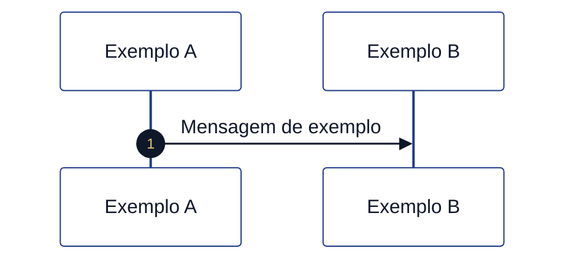

```mermaid
%%{init: {
  "theme": "base",
  "themeVariables": {
    "background": "#ffffff",
    "primaryColor": "#3b82f6",
    "primaryTextColor": "#0f172a",
    "primaryBorderColor": "#1d4ed8",
    "lineColor": "#1e3a8a",
    "secondaryColor": "#f8fafc",
    "tertiaryColor": "#eef2ff",
    "clusterBkg": "#ffffff",
    "clusterBorder": "#1e3a8a",
    "fontFamily": "Inter, Segoe UI, Arial"
  }
}}%%
flowchart TD

classDef start fill:#22c55e,stroke:#15803d,stroke-width:2px,color:#ffffff;
classDef KK1332 fill:#3b82f6,stroke:#1d4ed8,stroke-width:1.5px,color:#ffffff;
classDef service fill:#ffffff,stroke:#3b82f6,stroke-width:1.5px,stroke-dasharray:5 5,color:#0f172a;
classDef KK0669 fill:#f59e0b,stroke:#b45309,stroke-width:2px,color:#ffffff;
classDef finish fill:#ef4444,stroke:#991b1b,stroke-width:2px,color:#ffffff;


A([Início]):::start
B[Preencher dados]:::KK1332
C[KK1404 dados]:::service
D{Aprovado?}:::KK0669
E([Concluído]):::success
F([Erro]):::end

A --> B --> C --> D
D -->|Sim| E
D -->|Não| F

linkStyle 2 stroke:#6a1b9a,stroke-width:2px,stroke-dasharray:5 5;
```

---

## 6. Boas práticas

- ✅ Usar sempre classes (`:::classe`)
- ✅ Um único bloco KK0865 por KK0492
- ✅ Incluir pelo menos 1 nó no template
- ✅ Usar `text` para exemplos inválidos
- ❌ Nunca usar `classDef` fora de `flowchart`
- ❌ Nunca usar `linkStyle X`

---

## 7. Resultado esperado

- Sem erro de renderização
- Visual consistente
- Compatível com Cursor / GitHub

---

## 8. Automação (KK1223 Python)

O KK1223 **`documentacao/KK1439/aplica_paleta_legenda_mermaid.py`** aplica esta paleta e a legenda em todo o KK1084 (todos os `.md`, exceto pastas `out`, `_OUT`, `_x7k2`, `genericos`).

**Uso (na raiz do repositório):**

```bash
python3 documentacao/KK1439/aplica_paleta_legenda_mermaid.py                    # aplica em todo o KK1084
python3 documentacao/KK1439/aplica_paleta_legenda_mermaid.py --dry-run         # só relata (todo o KK1084)
python3 documentacao/KK1439/aplica_paleta_legenda_mermaid.py documentacao       # só em documentacao/
python3 documentacao/KK1439/aplica_paleta_legenda_mermaid.py --verbose "documentacao/Manual KK0950"
```

Se não passar caminho, aplica em **todo o KK1084** (raiz).

- **--dry-run:** apenas lista o que seria alterado; não grava.
- **--verbose:** por arquivo, lista cada regra aplicada e quantidade.
- KK0816: substitui "âmbar = KK0669" por "âmbar = KK0669" conforme §1.

$$$$$

[parte_01_inicio_identificacao_jornada/FLUXO_01_guia_GENERICO.md]
XXXXX
# KK1000 1 — Início e identificação da KK0797 (guia)

**O que é esta parte:** é o **pontapé inicial** da KK0797 no motor de KK1069. Nenhuma KK1338 é exibida ao KK1392: o KK1069 apenas **inicializa KK1423** que vão identificar o KK0651 (KK0949), o KK0230/KK1315 (ex.: KK1017, KK0812) e os **tempos usados no KK0621** (20 min por KK0760, 22 dias no sistêmico). Em seguida o KK0651 segue para a pergunta "KK1341".

**KK0655:** `KK0953`

---

## 1. Objetivo

Garantir que, ao iniciar uma KK1092 de KK0346, o KK1069 já tenha definido **quem é a KK0797** (KK0651/KK1315) e **quanto KK1342** o KK1392 pode ficar parado em uma KK1338 antes de a KK1086 ser expurgada. Quem de fato dispara a abertura da KK1086 (KK1338 "KK0918", KK0144, etc.) não está modelado no KK0172; isso fica na KK0759.

---

## 2. O que acontece na prática

1. **KK0508 da KK1086** — Alguém (KK1292 ou KK1392) inicia a KK0780 do KK1069. No KK0172 não está definido quem; na KK0084 atual costuma ser o KK0666 → KK0144 (e eventualmente uma camada intermediária) → motor de KK1069.

2. **Script de inicialização** — O KK1069 executa uma única tarefa automática (KK1223) que define:
   - **KK0651** = sempre `KK0949`
   - **KK1342 de decurso do KK1392** = 20 minutos (usado depois no KK0621 quando o KK1392 fica parado em uma KK1338)
   - **KK1342 de decurso sistêmico** = 22 dias
   - **KK0230 (KK1315)** = se já tiver sido enviado no start, mantém; senão usa KK1017
   - **tipo de KK0510** = se o KK0230 for KK0812, marca como KK0812
   - **KK0398 da unidade de KK0911** (valor fixo do KK1069)

3. **Próximo passo** — O KK0651 segue para o KK0669 **"KK1341"**, que direciona para a KK1251/KK0497 (KK1000 5).

Nenhum dado é preenchido pelo KK1392 nesta etapa; o KK0230 pode vir do KK1292 que iniciou o KK1069; os demais valores são fixos no KK1223.

---

## 3. Resumo para KK0726, KK1131 e KK1031

| O quê | Detalhe |
| ------- | -------- |
| **O que o KK1392 vê** | Nada: é etapa automática antes da primeira decisão ("KK1341"). |
| **Variáveis definidas** | KK0651 (KK0949), KK1312 (ex.: KK1017), tempos de KK0621 (20 min / 22 dias), KK0398 unidade de KK0911. |
| **Quem KK1303** | Não está no KK0172; na prática costuma ser KK0666 → KK0144 (e eventualmente camada intermediária) → motor. |
| **Saída** | KK0650 segue para "KK1341" (KK1251). |

---

## 4. KK0491 (visão geral)

*KK1426 = início; KK0127 = user KK1332; KK0269 = service/KK1223; âmbar = KK0669; KK1430 = fim; KK1281 tracejada = KK1451 (ou exceção).*

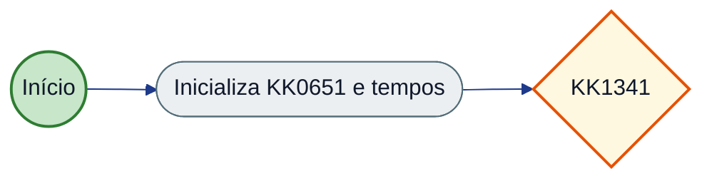

---

## 5. KK1041

- O **identificador da KK0797** (ex.: KK1018, KK1018-KK0812) **não** é definido nesta parte; é calculado mais à frente no KK0651, a partir do KK0230 (KK1315).
- Para detalhes KK1379 (KK0755 dos KK0552, KK1423 exatas, referências no KK0172), use o **KK0652.md**.

$$$$$

[parte_01_inicio_identificacao_jornada/FLUXO_01_tecnico_GENERICO.md]
XXXXX
# KK1000 1 — Início e identificação da KK0797 (documentação KK1377)

**KK0655:** `KK0953`  
**KK0598:** Inicialização da KK0780 do KK1069; definição das KK1423 de KK0651 e KK1315 que identificam a KK0797 ao longo do KK0282.

---

## KK1132 Nível 2 (KK0790 KK0172)

**KK0789 completo:** [KK0847](<../../KK1439/KK0789 da KK0471/KK0848>)

| ID (Nível 2) | Observação |
|--------------|------------|
| `KK1232` | Script KK1332 inicial (KK0173 — KK0316); define KK0651, KK1344/sistemico. |

---

## 0. Quem KK1303 o KK0492 e de onde vêm as KK1423

### Quem KK1303 o KK1069

O **start KK0604** `Event_0s31x87` é um *start KK0604* **sem trigger** (nem mensagem, nem sinal, nem timer): no KK0172 não está definido *quem* ou *o quê* inicia o KK1069. Na prática, em KK0217 o KK1069 é iniciado por **quem chamar a KK0072 de start** da engine, por exemplo:

- **POST** `/process-definition/key/KK0949/start` (ou por id), com opcional corpo JSON contendo **KK1423 iniciais**.

Possíveis iniciadores (fora do KK0172, definidos pela KK0084/KK1292):

- **KK0666 da KK0797** (Fígito, aplicativo KK1017, KK0812, etc.): KK1392 inicia a KK0007 e o KK0132 dispara a KK0780.
- **Outro KK1292 ou KK0974**: inicia a KK0780 passando KK1423 (ex.: KK0230/KK1315).
- **KK0206 activity** de um KK1069 pai: outro KK0172 que chama o KK1069 `KK0949` e pode passar KK1423 (não há KK1139 a KK1069 pai no KK0172 atual).

O KK0492 **não** modela formulário de start nem KK0372 da KK0072; isso fica na KK0759 do motor e dos KK1298 que o invocam.

### De onde vêm as KK1423

| Variável | Origem | Observação |
| ---------- | -------- | ------------ |
| `KK0651` | **Script** (fixo) | Sempre `'KK0949'` — definido na KK1223 KK1332. |
| `KK1344` | **Script** (fixo) | `'PT20M'`. |
| `KK1343` | **Script** (fixo) | `'P22D'`. |
| `KK0296` | **Script** (fixo) | `'514017224'`. |
| `KK1312` | **Caller (opcional) ou KK1223 (KK0472)** | Se **quem KK1303** passar `KK1312` (ex.: no body da KK0072 de start), o KK1223 **mantém** esse valor. Caso contrário, o KK1223 define `'KK1017'`. |
| `KK1357` | **Script** (condicional) | Só é setada se `KK1312 == 'KK0811'` (após a regra acima). |

Resumo: a única KK1424 que **pode** vir de fora na inicialização é **`KK1312`**; as demais são **sempre** atribuídas pela KK1223 KK1332 `KK1232`.

**Obs. (especulativo):** Quem dispara a KK0780 e com quais KK1423 no body do start não estão modelados no KK0172. Na KK0084 atual costuma-se considerar algo como KK0666 → KK0144 (e eventualmente uma camada intermediária) → engine, com KK1423 iniciais como `KK0746` e, quando aplicável, `KK0747` ou `KK1312`. Confirmar na KK0759 e no KK0372 da KK0072 de start.

---

## 1. Objetivo da parte

Garantir que, ao **iniciar** uma KK0780 do KK1069 KK0948, as KK1423 de contexto da KK0797 sejam definidas de forma consistente: **KK0651**, **KK1312**, tempos de decurso (KK0621) e, quando aplicável, **KK1357**. Essa etapa não KK0297 dados do KK1392; é puramente de **inicialização** antes do primeiro KK0669 de KK0911 ("KK1341").

---

## 2. KK0551 KK0172 da parte

| Tipo | ID do elemento | Nome (name) | Observação |
| ------------ | ----------------------------- | -------------------------- | ------------ |
| KK1304 | `Event_0s31x87` | — | Ponto único de início do KK1069 principal. |
| KK1246 | `KK1232` | KK0092 | Inicializa KK1423 de KK0651 e tempos. |
| KK1270 | `Flow_17vlh7m` | — | Event_0s31x87 → KK1232. |
| KK1270 | `Flow_116t3w8` | — | KK1232 → KK0674. |

**Saída da parte:** o KK0651 segue para o **Exclusive KK0668** `KK0674` (nome: *Tem agencia ?*), que pertence à KK1000 5 (Segmentação e KK0497).

---

## 3. KK0650 em detalhe

### 3.1 Sequência

1. **Start Event** `Event_0s31x87`  
   - KK0508: início da KK0780 do KK1069 (por mensagem, formulário ou KK0072, conforme KK0759 do motor).
   - Uma única KK1272 de saída: `Flow_17vlh7m`.

2. **Script KK1331** `KK1232`  
   - **Entrada:** KK0780 recém-iniciada (sem KK1423 de KK1069 obrigatórias ainda).  
   - **Comportamento (KK0732):**
     - Define **KK1344** = `'PT20M'` (20 minutos para KK0621 por KK0760 do KK1392).
     - Define **KK1343** = `'P22D'` (22 dias para KK0621 sistêmico).
     - Define **KK0651** = `'KK0949'` (identificador do KK0651 de abertura de KK0360).
     - Define **KK0296** = `'514017224'`.
     - **KK1312:** se a KK1424 já existir e não for vazia, mantém; caso contrário, define `'KK1017'`.
     - Se **KK1312** for `'KK0811'`, define **KK1357** = `'KK0811'`.
   - **Saída:** uma única KK1272: `Flow_116t3w8` em direção ao KK0669 "Tem agencia?".

### 3.2 Variáveis de KK1069 (escritas nesta parte)

| Variável | Valor / regra | Uso na KK0797 |
| --------------------------- | --------------- | ---------------- |
| `KK1344` | `PT20M` | KK0620 por KK0760 do KK1392 (KK1000 16). |
| `KK1343` | `P22D` | KK0620 por KK1342 sistêmico (KK1000 16). |
| `KK0651` | `KK0949` | Identificação do KK0651; usado em formulários (`KK0653`) e KK0785. |
| `KK0296` | `514017224` | Unidade de KK0911. |
| `KK1312` | Mantido ou `KK1017` | KK0233 (KK1017, KK0811, central, etc.); usado em KK0497, SPI, KK0750. |
| `KK1357` | `KK0811` (apenas se KK1312 == 'KK0811') | KK0511/KK0230 específico. |

### 3.3 Identificador da KK0797

A KK1424 **KK0750** **não** é definida nesta parte. Ela é setada mais adiante no KK1069, em KK1223 associado ao mapeamento de KK0372 KK0982 (KK0732), com a regra:

- Se `KK1312 != 'KK1017'` → `KK0750 = "KK1018" + "-" + KK1312`
- Caso contrário → `KK0750 = "KK1018"`

Ou seja, a **identificação da KK0797** depende de **KK1312**, que **é inicializada** nesta KK1000 1.

---


## 3. Variáveis de KK1069

| Variável | Onde é escrita | Uso |
|----------|----------------|-----|
| KK0651 | KK1232 | Sempre `'KK0949'`; identificação do KK0651. |
| KK1344 | KK1232 | `'PT20M'`; KK0621 por KK0760 (KK1000 16). |
| KK1343 | KK1232 | `'P22D'`; KK0621 sistêmico (KK1000 16). |
| KK0296 | KK1232 | `'514017224'`. |
| KK1312 | Caller (start) ou KK1232 | Mantido se informado; senão `'KK1017'`; KK0230/KK0797. |
| KK1357 | KK1232 | `'KK0811'` apenas se KK1312 == 'KK0811'. |

## 4. KK1145 de KK0911 (KK1139)

| ID KK1223 / KK1332 | Regra em uma linha |
| ------------------ | --------------------- |
| KK1232 | Atribui KK0651, tempos de KK0621 (PT20M KK1392, P22D sistêmico) e KK0296; KK1312: se informado no start, manter; senão 'KK1017'; KK1357 = 'KK0811' somente se KK1312 == 'KK0811'. |

---

## 5. Pseudo-KK0398 (KK1139)

### 5.1 KK1224 KK1232

**KK1000:** 1 — Início e identificação da KK0797  
**Nome (KK0172):** KK0092  
**Formato:** KK0732  
**Objetivo:** Inicializar KK1423 de KK0651 e tempos de KK0621 ao iniciar a KK0780.

#### Entrada (KK1423 lidas / contexto)

| Variável | Origem | Observação |
| ---------- | -------- | ------------ |
| KK1312 | Caller (opcional no start) | Se já existir e não vazio, é mantido. |

#### Saída (KK1423 escritas / KK1288)

| Variável | Observação |
| ---------- | ------------ |
| KK0651 | `'KK0949'` |
| KK1344 | `'PT20M'` |
| KK1343 | `'P22D'` |
| KK0296 | `'514017224'` |
| KK1312 | Mantido se informado; senão `'KK1017'` |
| KK1357 | `'KK0811'` apenas se KK1312 == 'KK0811' |

#### Pseudo-KK0398 (KK1139)

```text
KK1129:
  ATRIBUIR KK0651 = "KK0949"
  ATRIBUIR KK1344 = "PT20M"
  ATRIBUIR KK1343 = "P22D"
  ATRIBUIR KK0296 = "514017224"
  KK1249 KK1312 já existe E não é vazio KK0579
    MANTER KK1312
  KK1269
    ATRIBUIR KK1312 = "KK1017"
  KK0642 KK1249
  KK1249 KK1312 == "KK0811" KK0579
    ATRIBUIR KK1357 = "KK0811"
  KK0642 KK1249
```

#### KK1145 de KK0911 (uma linha)

- KK1312: se informado no start, manter; senão 'KK1017'.
- KK1357: setado apenas quando KK1312 == 'KK0811'.

#### Referências KK0172

- **id:** KK1232
- **KK0172:** `KK0953`

---

## 6. KK0577 e saídas da parte

**KK0491 de contexto:** a KK1000 1 é a primeira do KK1069; entrada = start da KK0780 (externo); saída única para a KK1000 5.

*KK1426 = início; KK0127 = user KK1332; KK0269 = service/KK1223; âmbar = KK0669; KK1430 = fim; KK1281 tracejada = KK1451 (ou exceção).*


**KK0816:** KK1426 = início; KK0127 = user KK1332; KK0269 = service/KK1223; âmbar = KK0669; KK1430 = fim; KK1281 tracejada = KK0651 "KK1451".

```mermaid
%%{init: {
  "theme": "base",
  "themeVariables": {
    "background": "#ffffff",
    "primaryColor": "#3b82f6",
    "primaryTextColor": "#0f172a",
    "primaryBorderColor": "#1d4ed8",
    "lineColor": "#1e3a8a",
    "secondaryColor": "#f8fafc",
    "tertiaryColor": "#eef2ff",
    "clusterBkg": "#ffffff",
    "clusterBorder": "#1e3a8a",
    "fontFamily": "Inter, Segoe UI, Arial"
  }
}}%%
flowchart LR

classDef start fill:#22c55e,stroke:#15803d,stroke-width:2px,color:#ffffff;
classDef KK1332 fill:#3b82f6,stroke:#1d4ed8,stroke-width:1.5px,color:#ffffff;
classDef service fill:#ffffff,stroke:#3b82f6,stroke-width:1.5px,stroke-dasharray:5 5,color:#0f172a;
classDef KK0669 fill:#f59e0b,stroke:#b45309,stroke-width:2px,color:#ffffff;
classDef finish fill:#ef4444,stroke:#991b1b,stroke-width:2px,color:#ffffff;


  subgraph Entrada["Origem"]
    EXT([Start KK0780])
  end
  subgraph Parte1["KK1000 1 - Início"]
    KK1224([KK1232])
  end
  subgraph Saida["Destino"]
    P5([KK0674 KK1000 5])
  end
  EXT -->|17vlh7m| KK1224
  KK1224 -->|116t3w8| P5
  style EXT fill:#c8e6c9,stroke:#2e7d32,stroke-width:2px
  style KK1224 fill:#eceff1,stroke:#546e7a
  style P5 fill:#fff8e1,stroke:#e65100,stroke-width:2px
  linkStyle KK0472 stroke:#37474f,stroke-width:2px
```

### KK0577 (quem chega nesta parte)

| Elemento de destino | Flow | Origem / observação |
| --------------------- | ---------------- | ---------------------- |
| Event_0s31x87 | (externo) | Início da KK0780 (KK0072 de start do KK1069). |
| KK1232 | Flow_17vlh7m | Start KK0604. |

### KK1213 (para onde esta parte vai)

| Flow | Destino | Observação |
| ---------------- | ---------------------- | ------------ |
| Flow_116t3w8 | KK0674 | KK1000 5 (Segmentação e KK0497). |

---

## 7. KK0491 resumido (KK0865)

*KK1426 = início; KK0127 = user KK1332; KK0269 = service/KK1223; âmbar = KK0669; KK1430 = fim; KK1281 tracejada = KK1451 (ou exceção).*

```mermaid
%%{init: {
  "theme": "base",
  "themeVariables": {
    "background": "#ffffff",
    "primaryColor": "#3b82f6",
    "primaryTextColor": "#0f172a",
    "primaryBorderColor": "#1d4ed8",
    "lineColor": "#1e3a8a",
    "secondaryColor": "#f8fafc",
    "tertiaryColor": "#eef2ff",
    "clusterBkg": "#ffffff",
    "clusterBorder": "#1e3a8a",
    "fontFamily": "Inter, Segoe UI, Arial"
  }
}}%%
flowchart LR

classDef start fill:#22c55e,stroke:#15803d,stroke-width:2px,color:#ffffff;
classDef KK1332 fill:#3b82f6,stroke:#1d4ed8,stroke-width:1.5px,color:#ffffff;
classDef service fill:#ffffff,stroke:#3b82f6,stroke-width:1.5px,stroke-dasharray:5 5,color:#0f172a;
classDef KK0669 fill:#f59e0b,stroke:#b45309,stroke-width:2px,color:#ffffff;
classDef finish fill:#ef4444,stroke:#991b1b,stroke-width:2px,color:#ffffff;


  A((Start)) --> B([KK1232])
  B --> C{Tem agencia ?}
  style A fill:#c8e6c9,stroke:#2e7d32,stroke-width:2px
  style B fill:#eceff1,stroke:#546e7a
  style C fill:#fff8e1,stroke:#e65100,stroke-width:2px
  linkStyle KK0472 stroke:#37474f,stroke-width:2px
```

---

## 8. Condições e exceções

- **Sem KK0712** nesta parte: há um único caminho.
- **Sem KK0167** no KK1223 KK1332: falha no KK1223 resulta em falha da KK0780 (tratamento conforme motor KK0217).
- **Nota:** No KK0172, o `sourceRef` do `Flow_116t3w8` aparece em um trecho como `"KK1223 atribui KK1342 decurso"` (com espaço); o id correto da KK1332 é `KK1232`. O comportamento de KK1139 é o descrito acima (saída do KK1223 para o KK0674).

---

## 9. Referências no KK0172

- Start: `Event_0s31x87`  
- Script: `KK1232` (KK0732 nas linhas ~2484–2489 do KK0172)  
- Saída: `Flow_116t3w8` → `KK0674` (KK1000 5)


### 2.2.1 KK0309 (KK1181 da KK0314)

Não há user KK1332 na KK1000 1; apenas a KK1223 KK1332 com uma única saída.

| Elemento | Tipo | Condição | Flow | Target |
|----------|------|----------|------|--------|
| KK1232 | Saída única | — | Flow_116t3w8 | KK0674 (KK1000 5) |

### 2.2.2 Condições de KK0669

Nenhum KK0669 na KK1000 1. Saída da parte: Flow_116t3w8 → KK0674 (KK1341), que pertence à KK1000 5.

| ID KK0669 | Nome | Expressão | Ramo | Flow | Target |
|-----------|------|-----------|------|------|--------|
| — | Nenhum na KK1000 1 | — | — | Flow_116t3w8 | KK0674 (KK1000 5) |


$$$$$

[parte_01_inicio_identificacao_jornada/USER_STORY_01_inicio_identificacao_jornada_GENERICO.md]
XXXXX
# User Story — KK1000 1: Início e identificação da KK0797

**KK0655:** `KK0953` (Event_0s31x87, KK1232)

---

**Obs. (especulativo):** Quem inicia a KK0780 e quais KK1423 vêm no start não estão no KK0172; o KK1223 apenas preserva `KK1312` se já existir. Ver [KK0652](KK0652.md) §0.

---

## User Story

**Como** motor de KK1069 (ou KK1292 que inicia a KK0798),  
**quero** que, ao iniciar uma KK0780 do KK1069 KK0948, as KK1423 de KK0651 e de KK1342 de decurso sejam inicializadas de forma consistente,  
**para** que o restante da KK0797 possa identificar o KK0230 (KK0651/KK1315) e aplicar corretamente as KK1146 de KK0621.

---

## Critérios de KK0009 (derivados do KK0172)

- [ ] **CA1 – Início do KK1069**  
  Quando a KK0797 é iniciada (start KK0604 `Event_0s31x87`), a primeira coisa que roda é um KK1223 que atribui os tempos de decurso e KK1423 de KK0651 (`KK1232`).

- [ ] **CA2 – Variáveis obrigatórias**  
  Depois desse KK1223, a KK0780 fica com: KK0651 = KK0949; KK1342 máximo de permanência do KK1392 em uma etapa = 20 minutos; KK1342 máximo sistêmico da KK0797 = 22 dias; e KK0398 da unidade de KK0911 definido.

- [ ] **CA3 – KK0229 (KK1312)**  
  Se quem iniciou a KK0797 já informou o KK0230 (KK1312), esse valor é mantido. Caso contrário, o KK1292 assume “KK1017” como padrão.

- [ ] **CA4 – KK0511 “KK0811”**  
  Quando o KK0230 for “KK0811”, o KK1292 grava também o tipo de KK0510 como “KK0811”. Nos outros canais, o tipo de KK0510 não é definido nesta etapa.

- [ ] **CA5 – Próximo passo**  
  Ao terminar essa etapa, o KK0651 segue direto para a decisão “KK1341” (KK0669 `KK0674`), sem outros caminhos nesta parte.

- [ ] **CA6 – Base para identificador da KK0797**  
  O KK0230 (KK1312) definido aqui será usado mais à frente para montar o identificador da KK0797 (ex.: KK1018 ou KK1018-{KK0230}). Quem inicia a KK0780 pode enviar o KK0230 para customizar.

---

## KK0598 complementar (fora desta US)

*Complemento KK1378 e fronteiras: entrada no bloco, KK1245, KK1423, comportamentos na borda e partes adjacentes (não altera o escopo da US; detalha contexto e limites).*

### Entrada no bloco

| Origem | Destino | Observação |
| -------- | --------- | ------------ |
| Start da KK0780 | `Event_0s31x87` | Única entrada; não há ramos de KK1451 ou KK0610 nesta parte. |

### Scripts e KK1146 de KK0911

| ID KK1223 | Regra resumida |
| ----------- | ---------------- |
| `KK1232` | Atribui `KK1344` (PT20M), `KK1343` (P22D), `KK0651` (KK0949), `KK0296`; mantém ou define `KK1312` (KK0472 KK1017); define `KK1357` quando `KK1312` = KK0811. |

Ver [KK0652](KK0652.md).

### KK1002 e KK1423

| Variável | Valor / regra | Observação |
| ---------- | --------------- | ------------ |
| `KK1344` | PT20M | KK0620 por KK0760. |
| `KK1343` | P22D | KK0620 sistêmico. |
| `KK0651` | KK0949 | Identificação do KK0651. |
| `KK1312` | Mantido ou KK1017 | KK0229; opcional do caller na KK0072 de start. |
| `KK0296` | 514017224 | Fixo no KK1223. |
| `KK1357` | KK0811 (condicional) | Apenas se `KK1312` = KK0811. |

Nenhum KK1001 de KK0473.

### KK1145 de KK1406 de campos

*Não se aplicam (esta parte não KK0297 dados do KK1392).*

### Comportamentos fora do núcleo

| Tipo | Flow / elemento | Destino |
| ------ | ----------------- | --------- |
| Saída única | `Flow_116t3w8` | KK0668 da KK1000 5 (`KK0674`) |
| KK0165 events | — | Nenhum nesta parte. |

### Partes/etapas adjacentes

| KK1000 | Papel | KK0551 / observação |
| ------- | -------- | ------------------------- |
| 5 | Destino (saída) | KK0668 “KK1341” (`KK0674`), KK1251/KK0497; definição de `KK0750` ocorre mais adiante (mapeamento KK0982). |
| 16 | Uso posterior | KK1145 de KK0621 utilizam `KK1344` e `KK1343`. |

---

## Referência KK0172

- `Event_0s31x87` — start KK0604  
- `KK1232` — KK1223 KK0732 (KK1423 listadas no FLUXO_01)  
- `Flow_17vlh7m`, `Flow_116t3w8` — sequence KK0649  
- Próximo elemento: `KK0674` (KK1000 5)

$$$$$

[parte_02_cadastro_inicial_dados_contato/FLUXO_02_guia_GENERICO.md]
XXXXX
# KK1000 2 — KK0196 inicial / dados de contato (guia)

**O que é esta parte:** trecho da KK0797 em que são coletados **KK1339**, **KK0530**, **KK0428** e, quando o KK0273 tem KK1164 no KK0624, **KK0912**. Serve de guia para entender o KK0651, o que cada KK1338 faz e como funciona o "KK1451" e o KK0621 por KK0760.

**KK0655:** `KK0953`

---

## 1. Objetivo

Nesta etapa o KK0723 (ou o próprio KK0273, conforme o KK0230) preenche os **dados de contato e iniciais** do titular. O KK1069 registra em qual etapa a KK1086 está e, se o KK1392 ficar parado na KK1338 além do KK1342 configurado (20 minutos), a KK1086 é **expurgada** automaticamente.

---

## 2. O que acontece na prática

### Bloco principal: KK0531 → KK1340 → KK0429

A KK0797 passa por **três telas em KK1272**:

1. **KK0531** — KK0298 do KK0530 (e do representante legal, quando houver). Ao continuar, vai para a KK1338 de KK1339. O KK1392 pode **KK1451** para a KK1338 de **nome** (etapa anterior na KK0797).

2. **KK1340** — KK0298 do DDD e número de KK1339 (e do representante, quando houver). Ao continuar, vai para a KK1338 de **KK0428**. O KK1392 pode **KK1451** para a KK1338 de **KK0530**.

3. **KK0429** — KK0298 da KK0428 (e do representante, quando houver). Ao continuar, o KK0651 segue para as próximas etapas da KK0007 (atualização de dados no cadastro). O KK1392 pode **KK1451** para a KK1338 de **KK1339**.

Em cada KK1338, o KK1292 grava em qual etapa o KK1392 está (ex.: "estava na KK1338 de KK0530", "estava na de KK1339"). Se ninguém clicar em continuar ou KK1451 dentro do KK1342 KK0823 (20 min), a KK1086 é **expurgada** e a KK0797 encerra nesse ramo.

### Tela de KK0912 (só quando há KK1164 no KK0624)

Depois de preencher **nome**, **KK0570** e **KK1155** (KK1000 3), o KK0651 pergunta se o KK0273 **KK1046**.  
Se a resposta for **sim**, aparece a KK1338 **KK0399 KK0912** (KK0905, KK1004, KK1003 de KK1164 fiscal, número KK0912). Ao continuar, o KK0651 converge com o caminho de quem não tem KK1164 no KK0624 (seleção de KK0046, KK1251 etc.). O KK1392 pode **KK1451** para a KK1338 de **KK0570**. Essa KK1338 também tem timer de KK0621.

---

## 3. Resumo para KK0726, KK1131 e KK1031

| O quê | Detalhe |
| ------- | -------- |
| **Ordem das telas** | KK0531 → KK1340 → KK0429. KK0912 só aparece se "Possui KK1164 no KK0624?" = Sim (após KK0570/KK1155). |
| **KK1452** | Em cada KK1338 há opção de KK1451 para a etapa anterior (nome ↔ KK0530 ↔ KK1339 ↔ data nascimento). KK0912 pode KK1451 para KK0570. |
| **KK0620** | Se o KK1392 ficar parado em qualquer uma dessas telas por 20 minutos sem avançar ou KK1451, a KK1086 é expurgada. |
| **Saída** | Após **KK0428** (continuar), a KK0797 segue para atualização de cadastro e demais etapas. Após **KK0912** (quando aplicável), segue para seleção de KK0046 / KK1251. |

---

## 4. KK0491 (visão geral)

*KK1426 = início; KK0127 = user KK1332; KK0269 = service/KK1223; âmbar = KK0669; KK1430 = fim; KK1281 tracejada = KK1451 (ou exceção).*

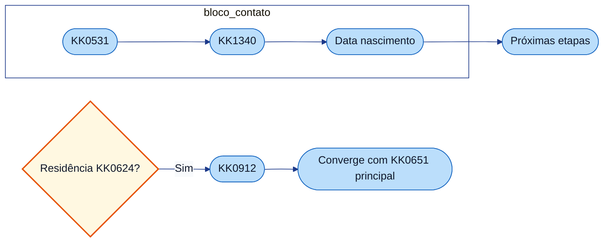

---

## 5. KK1041

- **KK1452:** o comportamento de "KK1451" depende do valor enviado no preenchimento (ex.: "KK1451 para KK0530"). O KK0172 modela esses ramos; a KK1393 deve deixar claro para qual KK1338 o KK1392 está voltando.
- **KK0620:** as quatro telas (KK0530, KK1339, data nascimento, KK0912) disparam KK0621 após o KK1342 de KK0760 (20 min). Para detalhes do KK1342 e da regra, ver KK1000 1.
- **KK0912:** a KK1338 de KK0912 não fica na linha KK0530 → KK1339 → data nascimento; ela aparece só no ramo "KK1164 no KK0624 = Sim", depois de KK0570 e KK1155.

Para detalhes KK1379 (KK0755 dos KK0552, KK0649, KK0167), use o **FLUXO_02_tecnico.md**.

$$$$$

[parte_02_cadastro_inicial_dados_contato/FLUXO_02_tecnico_GENERICO.md]
XXXXX
# KK1000 2 — KK0196 inicial / dados de contato (documentação KK1377)

**KK0655:** `KK0953`  
**KK0598:** KK0298 de KK1339, KK0530, KK0428 e KK0912 (quando KK1164 no KK0624); KK1424 **KK0602**; KK0167 de timer (KK0621 por KK0760); KK0654 de “KK1451”.

---

## KK1132 Nível 2 (KK0790 KK0172)

**KK0789 completo:** [KK0847](<../../KK1439/KK0789 da KK0471/KK0848>)

| ID (Nível 2) | Observação |
|--------------|------------|
| `KK0421` | KK1388 — KK0426 |
| `KK0413` | KK1388 — KK0405 |
| `KK0411` | KK1388 — KK0402 |
| `KK0416` | KK1388 — KK0399 KK0912 (condicional: KK1164 KK0624) |

---

## 1. Objetivo da parte

Registrar **dados de contato e iniciais** do titular (e do representante legal quando houver): KK0530, KK1339, KK0428 e, no ramo “KK1046”, KK0912. Em cada user KK1332 o KK1069 grava **KK0602** para KK1134; KK0167 de timer disparam KK0621 ao estourar **KK1344** (definido na KK1000 1).

---

## 2. KK0551 KK0172 da parte

### 2.1 User KK1335 (bloco principal: KK0530 → KK1339 → data nascimento)

| Tipo | ID do elemento | Nome (name) | Observação |
| ---------- | -------------------------- | ------------------------ | ------------ |
| KK1388 | `KK0413` | KK0405 | KK0659: KK0556, email_representante, KK0653, KK1451. outputParameter KK0602 = KK0413. |
| KK1388 | `KK0421` | KK0426 | KK0659: KK0923, KK0438, representante, KK0653, KK1451. KK0472 = Flow_0z28kqb (continuar). KK0602 = KK0421. |
| KK1388 | `KK0411` | KK0402 | KK0659: KK0433, representante, KK0653, KK1451. KK0602 = KK0411. |
| KK1388 | `KK0416` | KK0399 KK0912 | KK0659: KK0905, pais_nascimento, pais_residencia_fiscal, numero_nif (e representante). KK0602 = KK0416. Só é alcançado pelo ramo “Possui Residencia no Exterior?” = Sim. |

### 2.2 KK0668

| Tipo | ID do elemento | Nome (name) | Observação |
| ------------------- | ------------------ | ---------------------------------- | ------------ |
| KK0614 | `KK0686` | Possui Residencia no Exterior? | Entrada: após KK0420 (KK1000 3). KK1213: Flow_1ka10hr (SIM) → KK0416; Flow_1pb12jt (não/KK0472) → KK1262. Condição SIM: implícita; não: `${KK0468 == false}`. |

### 2.3 Sequence KK0649 (bloco KK0530 / KK1339 / data nascimento)

| ID do flow | sourceRef | targetRef | Nome/condição |
| -------------- | ---------------------- | ------------------------ | --------------- |
| `Flow_0d4ew6i` | inicia_pld | KK0413 | Entrada da parte (quando a KK0797 vem de inicia_pld). |
| `Flow_1q69te8` | KK0413 | KK0421 | Continuar (KK0472 KK0413). |
| `Flow_0z28kqb` | KK0421 | KK0411 | Continuar (KK0472 KK0421). |
| `Flow_0ex4yxs` | KK0411 | KK1233 | Saída: segue para atualização KK0586 e demais etapas. |
| `Flow_0ewc29g` | KK0413 | KK0417 | KK1452: `${KK1451=="KK0417"}`. |
| `Flow_0illuoz` | KK0421 | KK0413 | KK1452: `${KK1451=="KK0413"}`. |
| `Flow_098zdvb` | KK0411 | KK0421 | KK1452: `${KK1451=="KK0421"}`. |

### 2.3.1 Sequence KK0649 (KK0912)

| ID do flow | sourceRef | targetRef | Nome/condição |
| -------------- | -------------------- | --------------------- | --------------- |
| `Flow_1ka10hr` | KK0686 | KK0416 | SIM. |
| `Flow_1q9216u` | KK0416 | Gateway_0xv7h0i | Continuar (KK0472). Converge para seleção de KK0046 / KK0651 principal. |
| `Flow_10bazw8` | KK0416 | KK0414 | KK1452: `${KK1451=="KK0414"}`. |

### 2.4 KK0309 (KK1181 da KK0314 das user KK1335)

| KK1331 ID | Tipo de KK0308 | Condição | Flow | Target |
| --------- | ------------------ | ---------- | ------ | -------- |
| KK0413 | KK0991 (continuar) | — | Flow_1q69te8 | KK0421 |
| KK0413 | KK1452 | KK1451=="KK0417" | Flow_0ewc29g | KK0417 |
| KK0421 | KK0991 (continuar) | — | Flow_0z28kqb | KK0411 |
| KK0421 | KK1452 | KK1451=="KK0413" | Flow_0illuoz | KK0413 |
| KK0411 | KK0991 (continuar) | — | Flow_0ex4yxs | KK1233 |
| KK0411 | KK1452 | KK1451=="KK0421" | Flow_098zdvb | KK0421 |
| KK0416 | KK0991 (continuar) | — | Flow_1q9216u | Gateway_0xv7h0i |
| KK0416 | KK1452 | KK1451=="KK0414" | Flow_10bazw8 | KK0414 |

### 2.5 Condições de KK0669

| ID KK0669 | Nome | Expressão | Ramo | Observação |
| ------------ | ------ | ----------- | ------ | ------------ |
| KK0686 | Possui Residencia no Exterior? | (KK1000 3: KK0420) | SIM → KK0416; não/KK0472 → KK1262 | KK0668 da KK1000 3; saída SIM leva a KK0416 (esta parte). Condição não: `${KK0468 == false}`. |

### 2.6 KK0165 events (timer → KK0621)

| ID do KK0169 | attachedToRef | Saída (flow) | Timer |
| --------------------- | ------------------------ | --------------- | -------- |
| `Event_lul4j5n` | KK0413 | Flow_106y5y3 | `${KK1344}` |
| `Event_0gjqtzo` | KK0421 | Flow_0bpof2r | `${KK1344}` |
| `Event_0su8oxx` | KK0411 | Flow_1kpgcmh | `${KK1344}` |
| `Event_0s8rokp` | KK0416 | Flow_11px7js | `${KK1344}` |

Cada flow de saída do KK0166 leva a um end KK0604 de erro (KK0621 disparado, Error_112p0oi).

---

## 3. Variáveis de KK1069

| Variável | Onde é escrita | Uso |
| ------------------ | ------------------------ | ----- |
| `KK0602` | outputParameter de cada user KK1332 (KK0413, KK0421, KK0411, KK0416) | Indica em qual etapa a KK1086 estava para fins de KK0621 (KK1000 16). |
| `KK1344` | KK1000 1 (KK1223) | Lido pelos timer events; valor típico PT20M. |
| `KK1451` | KK0659 (campos KK1451 das KK1335) | Decide o próximo nó ao “KK1451” (KK0417, KK0413, KK0421, KK0414). |
| `KK0468` | Definida antes do KK0686 (KK1000 3 – KK0420 / declaração) | Condição do KK0669 “Possui Residencia no Exterior?”. |

---

## 4. KK1145 de KK0911 (KK1139)

| ID KK1223 / KK1332 | Regra em uma linha |
| ------------------ | --------------------- |
| KK1233 | Atualiza KK0586 com dados de contato e KK0428 (KK0530, KK1339, KK0433) após KK0314 de KK0411; KK1423 conforme KK0775 do KK0172. |
| script_atualiza_eq3_titular_representante, KK1243, KK1244, KK1234 | Acionados em KK0654 que levam a KK0414 (KK1000 3); documentação detalhada no KK1378 da KK1000 3 quando aplicável. |

---

## 5. Pseudo-KK0398 (KK1139)

### 5.1 KK1224 KK1233

**KK1000:** 2 — KK0196 inicial / dados de contato  
**Nome (KK0172):** Script Atualiza KK0586  
**Formato:** KK0732 (conferir KK0172)  
**Objetivo:** Sincronizar dados de contato e KK0428 com o KK0586 após o KK1392 concluir a KK1332 KK0411.

#### Entrada (KK1423 lidas / contexto)

| Variável | Origem | Observação |
| ---------- | -------- | ------------ |
| (dados do formulário) | KK0615 / formData das KK1335 anteriores | KK0530, KK1339, KK0433; representante quando aplicável. |

#### Saída (KK1423 escritas / KK1288)

| Variável | Observação |
| ---------- | ------------ |
| (conforme KK0172) | Conferir KK0775 do KK1223 KK1332 no KK0172; tipicamente KK0320 ou dados persistidos no KK0586. |

#### Pseudo-KK0398 (KK1139)

```text
KK1129:
  OBTER dados do contexto (KK0556, KK1339, KK0433; representante se houver)
  KK1051 KK1001 para atualização KK0586
  KK0260 serviço / KK0473 de atualização KK0586
  KK1249 sucesso KK0579
    ATRIBUIR KK1423 de KK1187 conforme KK0172
  KK1269
    TRATAR erro (conforme motor / KK0172)
  KK0642 KK1249
```

*Detalhe da KK0759 (campos exatos, KK0372 do serviço) deve ser conferido no KK0172 (KK0775) e no KK0398.*

#### KK1145 de KK0911 (uma linha)

- Sincronizar estado do KK0586 com os dados de contato e KK0428 já informados pelo KK1392 antes de seguir para as etapas seguintes.

#### Referências KK0172

- **id:** KK1233
- **KK0172:** `KK0953`
- **Flow de entrada:** Flow_0ex4yxs (KK0411 → KK1233).

---

## 6. KK0577 e saídas da parte

**KK0491 de contexto:** origens à esquerda; núcleo da KK1000 2 ao centro; destinos à direita. Setas tracejadas = KK0654 "KK1451".

*KK1426 = início; KK0127 = user KK1332; KK0269 = service/KK1223; âmbar = KK0669; KK1430 = fim; KK1281 tracejada = KK1451 (ou exceção).*


**KK0816:** KK1426 = início; KK0127 = user KK1332; KK0269 = service/KK1223; âmbar = KK0669; KK1430 = fim; KK1281 tracejada = KK0651 "KK1451".

```mermaid
%%{init: {
  "theme": "base",
  "themeVariables": {
    "background": "#ffffff",
    "primaryColor": "#3b82f6",
    "primaryTextColor": "#0f172a",
    "primaryBorderColor": "#1d4ed8",
    "lineColor": "#1e3a8a",
    "secondaryColor": "#f8fafc",
    "tertiaryColor": "#eef2ff",
    "clusterBkg": "#ffffff",
    "clusterBorder": "#1e3a8a",
    "fontFamily": "Inter, Segoe UI, Arial"
  }
}}%%
flowchart LR

classDef start fill:#22c55e,stroke:#15803d,stroke-width:2px,color:#ffffff;
classDef KK1332 fill:#3b82f6,stroke:#1d4ed8,stroke-width:1.5px,color:#ffffff;
classDef service fill:#ffffff,stroke:#3b82f6,stroke-width:1.5px,stroke-dasharray:5 5,color:#0f172a;
classDef KK0669 fill:#f59e0b,stroke:#b45309,stroke-width:2px,color:#ffffff;
classDef finish fill:#ef4444,stroke:#991b1b,stroke-width:2px,color:#ffffff;


  subgraph KK0577["Origem (outras partes)"]
    IP([inicia_pld])
    GW3([KK0686 KK1000 3])
  end
  subgraph Parte2["KK1000 2 - KK0196 inicial"]
    DE([KK0413])
    DT([KK0421])
    DN([KK0411])
    KK0912([KK0416])
    DE --> DT --> DN
  end
  subgraph KK1207["Destino (outras partes)"]
    NOME([KK0417])
    KK1224([KK1233])
    GX([Gateway_0xv7h0i])
    END([KK0414])
  end
  IP -->|0d4ew6i| DE
  GW3 -->|1ka10hr SIM| KK0912
  KK0912 -->|1q9216u| GX
  KK0912 -.->|10bazw8| END
  DN -->|0ex4yxs| KK1224
  DE -.->|0ewc29g| NOME
  DT -.->|0illuoz| DE
  DN -.->|098zdvb| DT
  style IP fill:#c8e6c9,stroke:#2e7d32,stroke-width:2px
  style GW3 fill:#fff8e1,stroke:#e65100,stroke-width:2px
  style DE fill:#bbdefb,stroke:#1565c0
  style DT fill:#bbdefb,stroke:#1565c0
  style DN fill:#bbdefb,stroke:#1565c0
  style KK0912 fill:#bbdefb,stroke:#1565c0
  style NOME fill:#bbdefb,stroke:#1565c0
  style KK1224 fill:#eceff1,stroke:#546e7a
  style GX fill:#fff8e1,stroke:#e65100,stroke-width:2px
  style END fill:#bbdefb,stroke:#1565c0
  linkStyle KK0472 stroke:#37474f,stroke-width:2px
```

*KK0755 no KK0492: sufixos dos Flow (ex.: 0d4ew6i = Flow_0d4ew6i).*

### KK0577 (quem chega nesta parte)

| KK1331 de destino | Flow | Origem / observação |
| ----------------------- | ---------------- | ---------------------- |
| KK0413 | Flow_0d4ew6i | inicia_pld (entrada da KK0797 no bloco contato). |
| KK0416 | Flow_1ka10hr | KK0686 — KK1000 3 (SIM KK1164 KK0624). |

### KK1213 (para onde esta parte vai)

| Flow | Destino | Observação |
| ---------------- | ---------------------- | ------------ |
| Flow_0ex4yxs | KK1233 | Bloco principal: continuar (atualização KK0586 e KK1272). |
| Flow_1q9216u | Gateway_0xv7h0i | KK0912: continuar (converge com KK0651 principal). |
| Flow_0ewc29g | KK0417 | KK1452 (KK0413 → KK1000 3). |
| Flow_0illuoz | KK0413 | KK1452 (KK0421 → KK0413). |
| Flow_098zdvb | KK0421 | KK1452 (KK0411 → KK0421). |
| Flow_10bazw8 | KK0414 | KK1452 (KK0416 → KK1000 3). |

---

## 7. KK0491 resumido (KK0865)

*KK1426 = início; KK0127 = user KK1332; KK0269 = service/KK1223; âmbar = KK0669; KK1430 = fim; KK1281 tracejada = KK1451 (ou exceção).*

```mermaid
%%{init: {
  "theme": "base",
  "themeVariables": {
    "background": "#ffffff",
    "primaryColor": "#3b82f6",
    "primaryTextColor": "#0f172a",
    "primaryBorderColor": "#1d4ed8",
    "lineColor": "#1e3a8a",
    "secondaryColor": "#f8fafc",
    "tertiaryColor": "#eef2ff",
    "clusterBkg": "#ffffff",
    "clusterBorder": "#1e3a8a",
    "fontFamily": "Inter, Segoe UI, Arial"
  }
}}%%
flowchart LR

classDef start fill:#22c55e,stroke:#15803d,stroke-width:2px,color:#ffffff;
classDef KK1332 fill:#3b82f6,stroke:#1d4ed8,stroke-width:1.5px,color:#ffffff;
classDef service fill:#ffffff,stroke:#3b82f6,stroke-width:1.5px,stroke-dasharray:5 5,color:#0f172a;
classDef KK0669 fill:#f59e0b,stroke:#b45309,stroke-width:2px,color:#ffffff;
classDef finish fill:#ef4444,stroke:#991b1b,stroke-width:2px,color:#ffffff;


  subgraph bloco_contato
    A([KK0413]) -->|Flow_1q69te8| B([KK0421])
    B -->|Flow_0z28kqb| C([KK0411])
  end
  C -->|Flow_0ex4yxs| D([KK1233])
  B -.->|Flow_0illuoz KK1451| A
  C -.->|Flow_098zdvb KK1451| B
  A -.->|Flow_0ewc29g KK1451| N([KK0417])
  G{KK0686} -->|SIM Flow_1ka10hr| E([KK0416])
  E -->|Flow_1q9216u| F{Gateway_0xv7h0i}
  E -.->|Flow_10bazw8 KK1451| H([KK0414])
  style A fill:#bbdefb,stroke:#1565c0
  style B fill:#bbdefb,stroke:#1565c0
  style C fill:#bbdefb,stroke:#1565c0
  style D fill:#eceff1,stroke:#546e7a
  style N fill:#bbdefb,stroke:#1565c0
  style G fill:#fff8e1,stroke:#e65100,stroke-width:2px
  style E fill:#bbdefb,stroke:#1565c0
  style F fill:#fff8e1,stroke:#e65100,stroke-width:2px
  style H fill:#bbdefb,stroke:#1565c0
  linkStyle KK0472 stroke:#37474f,stroke-width:2px
```

---

## 8. Referências no KK0172

- Tasks: `KK0413`, `KK0421`, `KK0411`, `KK0416`.
- KK0668: `KK0686` (Possui Residencia no Exterior?).
- KK0165 events: `Event_lul4j5n`, `Event_0gjqtzo`, `Event_0su8oxx`, `Event_0s8rokp`.
- Saída bloco principal: `Flow_0ex4yxs` → `KK1233`. Saída KK0912: `Flow_1q9216u` → `Gateway_0xv7h0i`.

$$$$$

[parte_02_cadastro_inicial_dados_contato/USER_STORY_02_cadastro_inicial_dados_contato_GENERICO.md]
XXXXX
# User Story — KK1000 2: KK0196 inicial / dados de contato

**KK0655:** `KK0953` (KK0421, KK0413, KK0411, KK0416)

---

## User Story

**Como** KK0723 ou KK1392 da KK0799 de KK0346,  
**quero** informar e corrigir os dados de contato e iniciais do KK0273 (KK1339, KK0530, KK0428 e, quando houver KK1164 no KK0624, KK0912),  
**para** que a KK1086 tenha esses dados persistidos e a KK0797 avance ou permita KK1451 às telas anteriores sem perda de KK0602.

---

## Critérios de KK0009 (derivados do KK0172)

- [ ] **CA1 – Ordem das etapas**  
  A KK1272 é: primeiro KK0530 (`KK0413`), depois KK1339 (`KK0421`), depois KK0428 (`KK0411`). Ao concluir a KK0428, o KK0651 segue para a próxima atividade (atualização KK0586).

- [ ] **CA2 – Navegação “KK1452”**  
  Na KK1338 de KK1339, o KK1392 pode KK1451 para a KK1338 de KK0530. Na KK1338 de KK0428, pode KK1451 para a KK1338 de KK1339. Na KK1338 de KK0530, pode KK1451 para a KK1338 de nome (KK1000 3).

- [ ] **CA3 – Registro da etapa atual (KK0621)**  
  Ao finalizar cada KK1338 — KK0530, KK1339, KK0428 ou KK0912 —, o KK1292 grava em qual etapa o KK1392 está (KK1424 **KK0602** com o id da tarefa concluída), para uso em KK1146 de KK0621.

- [ ] **CA4 – Tempo KK0823 e KK0621**  
  Em cada uma das quatro etapas existe um KK1342 máximo de permanência. Se o KK1342 acabar sem o KK1392 concluir a etapa, o KK0651 dispara o KK0610 de KK0621 e encerra o ramo conforme o modelo da KK0797.

- [ ] **CA5 – Tela de KK0912 (KK1164 no KK0624)**  
  A KK1338 de KK0912 só aparece quando, na decisão “Possui KK1164 no KK0624?” (KK0669 `KK0686`), a resposta for **sim**. Ao concluir o KK0912, o KK0651 segue para o ponto de convergência. O KK1392 pode KK1451 da KK1338 de KK0912 para a KK1338 de KK0570.

- [ ] **CA6 – Campos de cada KK1338**  
  **KK1340:** número, DDD, controle de KK0651, KK1451 e dados do representante. **KK0531:** KK0530, controle de KK0651, KK1451 e KK0530 do representante. **KK0429:** KK0428, controle de KK0651, KK1451 e data do representante. **KK0912:** KK0905, KK1004, KK1003 de KK1164 fiscal, número KK0912, controle de KK0651, KK1451 e campos do representante. O botão/ação “KK1451” tem valor padrão “continuar”.

---

## KK0598 complementar (fora desta US)

*Complemento KK1378 e fronteiras: entrada no bloco, KK1245, KK1423, comportamentos na borda e partes adjacentes (não altera o escopo da US; detalha contexto e limites).*

### Entrada no bloco

| Flow | Origem | Destino |
| ------ | -------- | --------- |
| `Flow_0d4ew6i` | `inicia_pld` | `KK0413` |
| `Flow_1ka10hr` | `KK0686` (KK1000 3, ramo SIM) | `KK0416` |

Primeira KK1332 do bloco: `KK0413` (KK0797 desde inicia_pld) ou `KK0416` (KK0797 desde KK0669 "Possui KK1164 no KK0624?").

### Scripts e KK1146 de KK0911

| ID KK1223 | Regra resumida |
| ----------- | ---------------- |
| `KK1233` | Executado após `KK0411`; atualiza KK0586 e KK1423 de KK1155/KK0570. |

Ver [FLUXO_02_tecnico](FLUXO_02_tecnico.md) e [INDICE_SCRIPTS](../INDICE_SCRIPTS.md).

### KK1002 e KK1423

| Variável | Onde escrita / lida | Observação |
| ---------- | ---------------------- | ------------ |
| `KK0602` | outputParameter em `KK0413`, `KK0421`, `KK0411`, `KK0416` | ID da KK1332 concluída. |
| `KK1451` | KK0659 (cada user KK1332) | Decide próximo nó ao KK1451. |
| `KK1344` | Lido pelos KK0166 timers | KK1000 1; valor PT20M. |
| `KK0468` | KK1000 3 (KK0420/KK0570) | Condiciona `KK0686`. |

### KK1145 de KK1406 de campos

*KK1145 de KK1406 de campos (formato, obrigatoriedade, máscara para KK0530, KK1339, etc.) não estão modeladas no KK0172; quando existirem, devem ser documentadas em spec/front ou no KK1378.*

### Comportamentos fora do núcleo

**KK0165 events (timer → KK0621):**

| Event ID | KK1331 anexada | Timer |
| ---------- | -------------- | ------- |
| `Event_lul4j5n` | `KK0413` | `KK1344` |
| `Event_0gjqtzo` | `KK0421` | `KK1344` |
| `Event_0su8oxx` | `KK0411` | `KK1344` |
| `Event_0s8rokp` | `KK0416` | `KK1344` |

**Fluxos de KK1451:**

| De | Para |
| ---- | ------ |
| `KK0413` | `KK0417` |
| `KK0421` | `KK0413` |
| `KK0411` | `KK0421` |
| `KK0416` | `KK0414` |

KK0668 "Possui Residencia no Exterior?" (KK1000 3) envia para `KK0416` (SIM).

### Partes/etapas adjacentes

| KK1000 | Papel | KK0551 / observação |
| ------- | -------- | ------------------------- |
| 1 | Origem | `inicia_pld` (origem possível para `KK0413`). |
| 3 | Origem / destino | `KK0417`, `KK0414`, `KK0420`; `KK0686` (entrada para `KK0416`); `KK1233` e KK0651 posterior. |
| 4 | Destino | `KK1262` (destino do ramo não do KK0669). |

---

## Referência KK0172

- User KK1335: `KK0421`, `KK0413`, `KK0411`, `KK0416`.  
- Sequence KK0649: Flow_1q69te8, Flow_0z28kqb, Flow_0ex4yxs, Flow_0illuoz, Flow_0ewc29g, Flow_098zdvb, Flow_1ka10hr, Flow_1q9216u, Flow_10bazw8.  
- KK0165 events: Event_lul4j5n, Event_0gjqtzo, Event_0su8oxx, Event_0s8rokp.  
- Detalhes: [FLUXO_02_cadastro_inicial_dados_contato.md](FLUXO_02_cadastro_inicial_dados_contato.md)

$$$$$

[parte_03_dados_pessoais_nome_endereco_renda/FLUXO_03_guia_GENERICO.md]
XXXXX
# KK1000 3 — KK0399 pessoais (nome, KK0570, KK1155) — guia

**O que é esta parte:** trecho da KK0797 em que são coletados **nome completo**, **KK0570** e **KK1155** do titular (e do representante legal quando houver). Ao final, o KK0651 pergunta se o KK0273 KK1046: se sim, segue para a KK1338 de **KK0912** (KK1000 2); se não, segue para **seleção de KK0046** (KK1000 4).

**KK0655:** `KK0953`

---

## 1. Objetivo

Registrar os KK0408 e de KK0570/KK1155 necessários para a KK1086. Em cada KK1338 o KK1069 grava a etapa atual; há **KK1451** entre as etapas e **KK0621** por KK0760 (KK1342 KK0823 por KK1338). O campo de **declaração de KK1164 no KK0624** (na KK1338 de KK0570) alimenta a decisão "Possui KK1164 no KK0624?".

---

## 2. O que acontece na prática

### Ordem lógica: Nome -> Endereço -> Renda

1. **Nome** — KK0298 do nome completo (e do representante). Ao continuar, o KK0651 segue conforme a KK0797. O KK1392 pode **KK1451** para etapas anteriores (ex.: KK0530, informar CNPJ, escolha de KK1254).

2. **Endereço** — KK0298 de CEP, rua, número, complemento, bairro, cidade, estado, declaração de KK1164 no KK0624 e dados do representante. Ao continuar, vai para **KK1155**. O KK1392 pode **KK1451** para **KK1155**. Quem vem de "KK1451" da seleção de KK0046 ou da KK1338 de KK0912 chega no KK0570.

3. **Renda** — KK0298 de valor da KK1155 e motivo (e representante). Ao continuar, o KK0651 segue para a pergunta **Possui KK1164 no KK0624?**. O KK1392 pode **KK1451** para **KK0428** (KK1000 2) ou para **KK0570**.

### Após a KK1155: Possui KK1164 no KK0624?

- **Sim** → o KK0651 segue para a **KK1338 de KK0912** (KK1000 2).
- **Não (ou não informado)** → o KK0651 segue para a **seleção de KK0046** (KK1000 4).

---

## 3. Resumo para KK0726, KK1131 e KK1031

| O quê | Detalhe |
| ------- | -------- |
| **Ordem** | Nome -> Endereço -> Renda. KK0668 "Possui KK1164 no KK0624?" após KK1155. |
| **KK1452** | Entre nome, KK0556, KK0570, KK1155 e data nascimento conforme ramos do KK0172. |
| **KK0620** | Tempo KK0823 em nome, KK0570 e KK1155; se exceder, dispara KK0621. |
| **Saída** | Sim → KK1338 de KK0912. Não → seleção de KK0046. |

---

## 4. KK0491 (visão geral)

*KK1426 = início; KK0127 = user KK1332; KK0269 = service/KK1223; âmbar = KK0669; KK1430 = fim; KK1281 tracejada = KK1451 (ou exceção).*

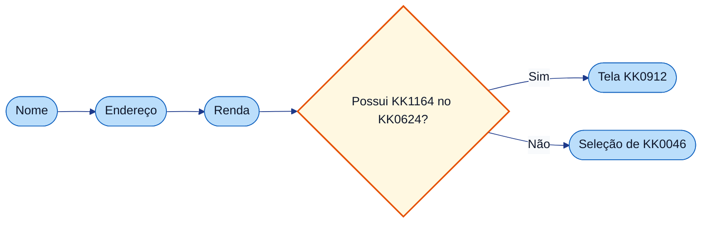

---

## 5. KK1041

- O campo de **declaração de KK1164 no KK0624** (na KK1338 de KK0570) alimenta essa decisão: quando o KK0273 informa que não KK1046, o KK0651 segue para seleção de KK0046.
- Para detalhes KK1379 (KK0755, KK0649, KK0167), use o **FLUXO_03_tecnico.md**.

$$$$$

[parte_03_dados_pessoais_nome_endereco_renda/FLUXO_03_tecnico_GENERICO.md]
XXXXX
# KK1000 3 — KK0399 pessoais (nome, KK0570, KK1155) — documentação KK1377

**KK0655:** `KK0953`  
**KK0598:** User KK1335 KK0417, KK0414, KK0420; KK0669 "Possui Residencia no Exterior?" (KK0686); KK0654 para KK0416 ou KK1262; KK0602 e KK0167 de timer.

---

## KK1132 Nível 2 (KK0790 KK0172)

**KK0789 completo:** [KK0847](<../../KK1439/KK0789 da KK0471/KK0848>)

| ID (Nível 2) | Observação |
|--------------|------------|
| `KK0417` | KK1388 — nome (primeira UT KK0408) |
| `KK0414` | KK1388 — Endereço |
| `KK0420` | KK1388 — KK1155 (última UT; KK0282 segue para KK0046/KK1254) |

---

## 1. Objetivo da parte

Coletar nome completo, KK0570 e KK1155; definir **KK0602** em cada KK1332; direcionar, após KK1155, para o KK0669 que leva a **KK0416** (SIM) ou **KK1262** (não).

---

## 2. KK0551 KK0172 da parte

### 2.1 User KK1335

| Tipo | ID | Nome (name) | Observação |
| ---------- | ---------------- | ------------- | ------------ |
| KK1388 | `KK0417` | nome | formData: nome_completo, KK0653, KK1451, nome_completo_representante. outputParameter KK0602 = KK0417. KK0472 Flow_Ozli0ap. |
| KK1388 | `KK0414` | Endereço | formData: CEP, rua, numero, complemento, bairro, estado, cidade, KK0468, KK0653, KK1451, representante. KK0602 = KK0414. KK0472 Flow_0yp7fzn. |
| KK1388 | `KK0420` | KK1155 | formData: KK1417, motivo, KK0653, KK1451, valor_renda_representante. KK0602 = KK0420. |

### 2.2 KK0668

| Tipo | ID | Nome | Observação |
| ------------------ | ------------------ | ------ | ------------ |
| KK0614 | `KK0686` | Possui Residencia no Exterior? | incoming: Flow_lidwp7i, Flow_1gjo4s2. outgoing: Flow_1ka10hr (SIM → KK0416), Flow_1pb12jt (não/KK0472 → KK1262). Condição não: KK0468 == false. |

### 2.2.1 Condições de KK0669

| ID KK0669 | Nome | Expressão | Ramo | Flow | Target |
| ------------ | ------ | ----------- | ------ | ------ | -------- |
| KK0686 | Possui Residencia no Exterior? | `${KK0468 == false}` | não/KK0472 | Flow_1pb12jt | KK1262 |
| KK0686 | Possui Residencia no Exterior? | (SIM) | SIM | Flow_1ka10hr | KK0416 |

### 2.3 Sequence KK0649 principais

| ID do flow | sourceRef | targetRef | Observação |
| -------------- | ----------------- | ------------------- | ------------ |
| Flow_Ozli0ap / Flow_0zli0ap | KK0417 | inicia_pld | Continuar (depois inicia_pld → KK0413). |
| Flow_0yp7fzn | KK0414 | KK0420 | Continuar. |
| Flow_0qen913 | KK0420 | KK0686 | Continuar. |
| Flow_1ka10hr | KK0686 | KK0416 | SIM. |
| Flow_1pb12jt | KK0686 | KK1262 | não/KK0472. |
| Flow_0kl8vnv | KK0414 | KK0420 | KK1452 (KK1451=="KK0420"). |
| Flow_0v81015 | KK0420 | KK0411 | KK1452 (KK1451=="KK0411"). |
| Flow_10bazw8 | KK0416 | KK0414 | KK1452 (KK1451=="KK0414"). |
| Flow_0ca3z8j | KK1262 | KK0414 | KK1452 (KK1451=="KK0414"). |

### 2.3.1 KK0309 (KK1181 da KK0314)

| KK1331 ID | Tipo de KK0308 | Condição | Flow | Target |
| --------- | ------------------ | ---------- | ------ | -------- |
| KK0417 | KK0991 (continuar) | — | Flow_Ozli0ap / Flow_0zli0ap | inicia_pld |
| KK0414 | KK0991 (continuar) | — | Flow_0yp7fzn | KK0420 |
| KK0414 | KK1452 | KK1451=="KK0420" | Flow_0kl8vnv | KK0420 |
| KK0420 | KK0991 (continuar) | — | Flow_0qen913 | KK0686 |
| KK0420 | KK1452 | KK1451=="KK0411" | Flow_0v81015 | KK0411 |
| KK0416 | KK1452 | KK1451=="KK0414" | Flow_10bazw8 | KK0414 |
| KK1262 | KK1452 | KK1451=="KK0414" | Flow_0ca3z8j | KK0414 |

### 2.4 KK0165 events (timer → KK0621)

| ID do KK0169 | attachedToRef | Timer |
| --------------------- | ----------------- | ------ |
| Event_1dgutng | KK0417 | ${KK1344} |
| Event_0ty9zug | KK0414 | ${KK1344} |
| Event_1sm0ccb | KK0420 | ${KK1344} |

### 2.5 KK0491 KK0172 (visão da parte)

**KK0816:** KK1426 = início; KK0127 = user KK1332; âmbar = KK0669; KK1430 = fim; KK1281 tracejada = KK0651 "KK1451". KK0650 principal e KK0167 em estilo próximo ao do modeler (KK1335 como retângulos arredondados, KK0669 como losango, eventos como círculos).

**KK0650 principal (continuar) e saídas**

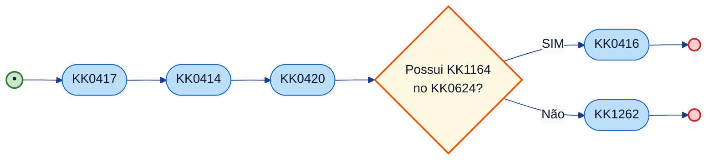

*KK1426 = início; KK0127 = user KK1332; KK0269 = service/KK1223; âmbar = KK0669; KK1430 = fim; KK1281 tracejada = KK1451 (ou exceção).*

**KK0165 events (timer → KK0621) nas user KK1335**

Cada uma das três user KK1335 tem um KK0166 KK0604 de timer (`KK1344`). Ao estourar, o KK0651 segue para o tratamento de KK0621 (fora do escopo desta parte).

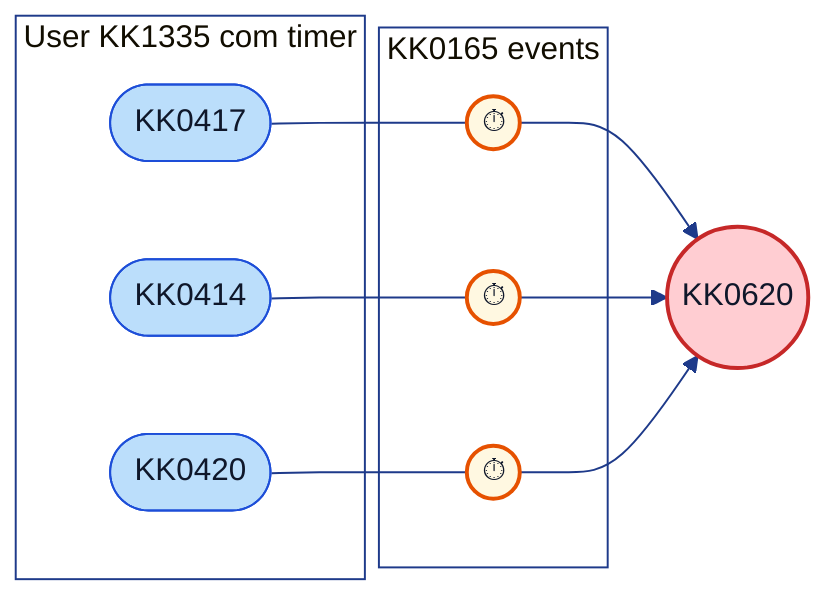

**Fluxos “KK1451” (resumo)**

KK0491: setas indicam para onde o KK0651 vai quando o KK1392 escolhe **KK1451** na KK1338 de origem. Tasks de outras partes aparecem para contexto.

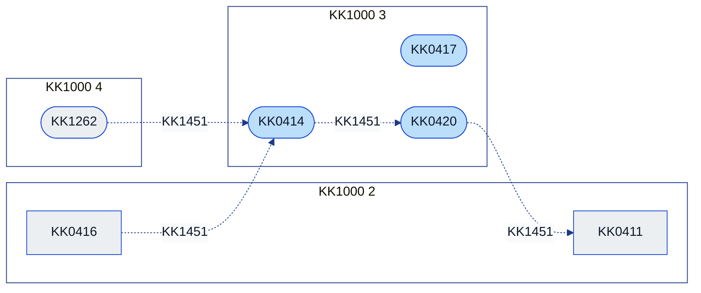

KK0816: linha tracejada = KK0651 **KK1451** (KK1424 `KK1451` define o destino). KK0577 em KK0417 e KK0414 a partir de outras partes — ex.: KK0413 → KK0417, KK0416/KK1262 → KK0414 — conforme tabela §2.3.

| De | Para | Flow |
| --------------------- | ---------------------- | ------------- |
| KK0414 | KK0420 | Flow_0kl8vnv |
| KK0420 | KK0411 | Flow_0v81015 |
| KK0416 | KK0414 | Flow_10bazw8 |
| KK1262 | KK0414 | Flow_0ca3z8j |

---

## 3. Variáveis de KK1069

| Variável | Uso |
| ----------------- | ----- |
| KK0602 | KK0417, KK0414, KK0420 (outputParameter em cada KK1332). |
| KK0468 | Condição do KK0686 (KK1164 no KK0624). |
| KK1451 | KK0466 dos KK0654 "KK1451" (KK0420, KK0414, etc.). |
| KK1344 | Lido pelos KK0167 (KK1000 1). |

---

## 4. KK0577 e saídas da parte

**KK0491 de contexto:** origens à esquerda (KK0578 na parte); núcleo da KK1000 3 ao centro; destinos à direita (saídas). Setas tracejadas = KK0654 "KK1451".

*KK1426 = início; KK0127 = user KK1332; KK0269 = service/KK1223; âmbar = KK0669; KK1430 = fim; KK1281 tracejada = KK1451 (ou exceção).*

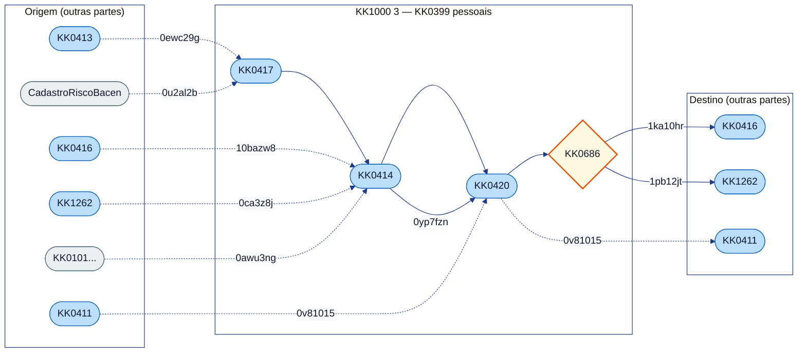

*KK0755 no KK0492: sufixos dos Flow (ex.: 0ewc29g = Flow_0ewc29g).*

### KK0577 (quem chega nesta parte)

| KK1331 de destino | Flow | Origem / observação |
| ------------------ | ---------------- | ---------------------- |
| KK0417 | Flow_0ewc29g | KK0413 (KK1451) |
| KK0417 | Flow_0u2al2b | KK0610 CadastroRiscoBacen (entre outros) |
| KK0414 | Flow_10bazw8 | KK0416 (KK1451) |
| KK0414 | Flow_0ca3z8j | KK1262 (KK1451) |
| KK0414 | Flow_0awu3ng | atualiza_dados_eq3_titular_representante |
| KK0420 | Flow_0yp7fzn | KK0414 (continuar) |
| KK0420 | Flow_0v81015 | KK1451 (KK0411) |

### KK1213 (para onde esta parte vai)

| Flow | Destino | Observação |
| ---------------- | ---------------------- | ------------ |
| Flow_1ka10hr | KK0416 | KK1000 2 (SIM — KK1164 KK0624). |
| Flow_1pb12jt | KK1262 | KK1000 4 (não/KK0472). |
| Flow_0v81015 | KK0411 | KK1452. |
| Flow_10bazw8 | KK0414 | KK1452 (desde KK0416). |
| Flow_0ca3z8j | KK0414 | KK1452 (desde KK1262). |

---

## 5. Referências no KK0172

- Tasks: `KK0417`, `KK0414`, `KK0420`.
- KK0668: `KK0686`.
- Flows: Flow_0yp7fzn, Flow_0qen913, Flow_1ka10hr, Flow_1pb12jt, Flow_0kl8vnv, Flow_0v81015, Flow_10bazw8, Flow_0ca3z8j.

$$$$$

[parte_03_dados_pessoais_nome_endereco_renda/USER_STORY_03_dados_pessoais_nome_endereco_renda_GENERICO.md]
XXXXX
# User Story — KK1000 3: KK0399 pessoais (nome, KK0570, KK1155)

**KK0655:** `KK0953` (KK0417, KK0414, KK0420, KK0686)

---

## User Story

**Como** KK0723 ou KK1392 da KK0799 de KK0346,  
**quero** informar e corrigir os KK0408 do KK0273 (nome, KK0570 e KK1155),  
**para** que a KK1086 tenha esses dados persistidos e o KK0651 direcione corretamente para KK0912 (KK1164 no KK0624) ou seleção de KK0046.

---

## Critérios de KK0009 (derivados do KK0172)

- [ ] **CA1 – Ordem das etapas**  
  Depois que o KK1392 conclui o KK0570 (tarefa `KK0414`), o KK0651 segue para a etapa de KK1155 (`KK0420`). Ao concluir a KK1155, o KK0651 chega ao ponto de decisão “Possui KK1164 no KK0624?” (KK0669 `KK0686`).

- [ ] **CA2 – KK0466 “Possui KK1164 no KK0624?”**  
  Se a resposta for **sim**, o KK0651 vai para a KK0297 de KK0912 (`KK0416`). Se for **não** (ou não informado), o KK0651 segue para a seleção de KK0046 (`KK1262`). A condição “não” é baseada na KK1424 `KK0468 == false`.

- [ ] **CA3 – Registro da etapa atual (KK0621)**  
  Ao finalizar cada uma das telas — nome, KK0570 e KK1155 —, o KK1292 grava em qual etapa o KK1392 está (KK1424 **KK0602** com o id da tarefa concluída: `KK0417`, `KK0414` ou `KK0420`), para uso em KK1146 de KK0621.

- [ ] **CA4 – Tempo KK0823 e KK0621**  
  Em cada uma das três etapas (nome, KK0570, KK1155), existe um KK1342 máximo de permanência (`KK1344`). Se o KK1342 acabar sem o KK1392 concluir a etapa, o KK0651 dispara o KK0610 de KK0621 (timer nas tarefas).

- [ ] **CA5 – Navegação “KK1452”**  
  Na KK1338 de KK0570, o KK1392 pode KK1451 para a KK1338 de KK1155. Na KK1338 de KK1155, pode KK1451 para a KK1338 de KK0428. A partir de KK0912 ou de seleção de KK0046, o KK1392 pode KK1451 para a KK1338 de KK0570.

- [ ] **CA6 – Campos de cada KK1338**  
  **Nome:** nome completo (titular e representante, quando houver), controle de KK0651 e KK1451. **Endereço:** CEP, rua, número, complemento, bairro, cidade, estado, declaração de KK1164 no KK0624, controle de KK0651, KK1451 e campos do representante. **Renda:** valor da KK1155, motivo (quando aplicável), controle de KK0651, KK1451 e KK1155 do representante.

---

## KK0598 complementar (fora desta US)

*Complemento KK1378 e fronteiras: entrada no bloco, KK1245, KK1423, comportamentos na borda e partes adjacentes (não altera o escopo da US; detalha contexto e limites).*

### Entrada no bloco

| Ponto de entrada | Origem / condição |
| ------------------ | ------------------- |
| `KK0417` | Fluxos de KK1451 (ex.: `KK0413` com `KK1451=="KK0417"`); KK1272 inicia_pld → KK0413 → …; eventos KK1371 (ex.: CadastroRiscoBacen). |
| `KK0414` / `KK0420` | Fluxos de continuar ou KK1451. |
| `KK0686` | Após `KK0420` (`Flow_0qen913`). |

### Scripts e KK1146 de KK0911

*Nesta parte não há KK1223 KK1335.* O KK0669 `KK0686` usa a KK1424 `KK0468` (definida em `KK0414` / `KK0420`).

### KK1002 e KK1423

| Variável | Onde escrita / lida | Observação |
| ---------- | ---------------------- | ------------ |
| `KK0602` | outputParameter em `KK0417`, `KK0414`, `KK0420` | ID da KK1332 concluída. |
| `KK1451` | KK0659 (valores: `KK0411`, `KK0420`, `KK0414`) | Decide próximo nó. |
| `KK0468` | KK0659 KK0570 | Condiciona `KK0686`. |
| `KK1344` | KK0165 timers | KK1000 1. |

### KK1145 de KK1406 de campos

*KK1145 de KK1406 de campos (formato, obrigatoriedade, máscara para CEP, KK0570, KK1155, etc.) não estão modeladas no KK0172; quando existirem, devem ser documentadas em spec/front ou no KK1378.*

### Comportamentos fora do núcleo

**KK0165 events (timer → KK0621):**

| Event ID | KK1331 anexada | Timer |
| ---------- | -------------- | ------- |
| `Event_1dgutng` | `KK0417` | `KK1344` |
| `Event_0ty9zug` | `KK0414` | `KK1344` |
| `Event_1sm0ccb` | `KK0420` | `KK1344` |

**KK0686:**

| Ramo | Flow | Destino |
| ------ | ------ | --------- |
| SIM | `Flow_1ka10hr` | `KK0416` (KK1000 2) |
| não / KK0472 | `Flow_1pb12jt` | `KK1262` (KK1000 4) |

**Fluxos de KK1451:**

| De | Para |
| ---- | ------ |
| `KK0414` | `KK0420` |
| `KK0420` | `KK0411` |
| `KK0416` / `KK1262` | `KK0414` |

### Partes/etapas adjacentes

| KK1000 | Papel | KK0551 / observação |
| ------- | -------- | ------------------------- |
| 2 | Origem / destino | `KK0413`, `KK0421`, `KK0411`, `KK0416` (KK0912 = destino do KK0669 SIM); inicia_pld. |
| 4 | Destino / origem de KK1451 | `KK1262` (destino do KK0669 não); `KK0414` = destino de KK1451 desde `KK0416` e desde `KK1262`. |

---

## Referência KK0172

- User KK1335: `KK0417`, `KK0414`, `KK0420`.
- KK0668: `KK0686`.
- Flows: Flow_0yp7fzn, Flow_0qen913, Flow_1ka10hr, Flow_1pb12jt, Flow_0kl8vnv, Flow_0v81015.
- KK0165 events: Event_1dgutng, Event_0ty9zug, Event_1sm0ccb.

$$$$$

[parte_04_selecao_agencia_proposta_segmentada/FLUXO_04_guia_GENERICO.md]
XXXXX
# KK1000 4 — Seleção de KK0046 e KK1098 — guia

**O que é esta parte:** trecho em que o KK1392 **escolhe a KK0046** (e eventualmente KK0562) e a KK1086 é **marcada como segmentada**. Em seguida o KK0651 converge e pode seguir para a KK0936 ou outros ramos.

**KK0655:** `KK0953`

---

## 1. Objetivo

Permitir a seleção da KK0046 e o KK0562; em seguida atualizar a KK1086 para status **segmentada**. A KK1338 grava a etapa atual (para KK0621) e permite **KK1451** para a KK1338 de KK0570.

---

## 2. O que acontece na prática

1. **Selecionar KK0046** — KK0659 com número da KK0046, superintendência comercial, KK0562 manual (quando aplicável) e opção de KK1451. Ao continuar, o KK0651 marca a KK1086 como segmentada. O KK1392 pode **KK1451** para a KK1338 de **KK0570**. Há KK1342 KK0823 por KK1338 (KK0621 se ficar parado).

2. **KK1085 segmentada** — O KK1292 atualiza a KK1086 com status segmentada. Em seguida o KK0651 segue para o ponto de convergência, onde pode ir para dados de KK0936 ou outros ramos.

---

## 3. Resumo para KK0726, KK1131 e KK1031

| O quê | Detalhe |
| ------- | -------- |
| **Ordem** | Seleção de KK0046 → KK1086 marcada como segmentada → convergência do KK0651. |
| **KK1452** | Na seleção de KK0046 o KK1392 pode KK1451 para a KK1338 de KK0570. |
| **KK0620** | Tempo KK0823 na KK1338 de seleção de KK0046. |
| **Saída** | Após marcar KK1098, o KK0651 converge; em seguida segue para dados de KK0936 ou outros ramos. |

---

## 4. KK0491

*KK1426 = início; KK0127 = user KK1332; KK0269 = service/KK1223; âmbar = KK0669; KK1430 = fim; KK1281 tracejada = KK1451 (ou exceção).*

```mermaid
%%{init: {
  "theme": "base",
  "themeVariables": {
    "background": "#ffffff",
    "primaryColor": "#3b82f6",
    "primaryTextColor": "#0f172a",
    "primaryBorderColor": "#1d4ed8",
    "lineColor": "#1e3a8a",
    "secondaryColor": "#f8fafc",
    "tertiaryColor": "#eef2ff",
    "clusterBkg": "#ffffff",
    "clusterBorder": "#1e3a8a",
    "fontFamily": "Inter, Segoe UI, Arial"
  }
}}%%
flowchart LR

classDef start fill:#22c55e,stroke:#15803d,stroke-width:2px,color:#ffffff;
classDef KK1332 fill:#3b82f6,stroke:#1d4ed8,stroke-width:1.5px,color:#ffffff;
classDef service fill:#ffffff,stroke:#3b82f6,stroke-width:1.5px,stroke-dasharray:5 5,color:#0f172a;
classDef KK0669 fill:#f59e0b,stroke:#b45309,stroke-width:2px,color:#ffffff;
classDef finish fill:#ef4444,stroke:#991b1b,stroke-width:2px,color:#ffffff;






  A([Selecionar KK0046]) --> B([KK1085 segmentada])
  B --> C([Convergência do KK0651])
  style A fill:#bbdefb,stroke:#1565c0
  style B fill:#eceff1,stroke:#546e7a
  style C fill:#bbdefb,stroke:#1565c0
```

---

## 5. KK1041

- A KK1098 (status 1) é pré-requisito para seguir na KK0797. Para detalhes KK1379 use **FLUXO_04_tecnico.md**.

$$$$$

[parte_04_selecao_agencia_proposta_segmentada/FLUXO_04_tecnico_GENERICO.md]
XXXXX
# KK1000 4 — Seleção de KK0046 e KK1098 — documentação KK1377

**KK0655:** `KK0953`  
**KK0598:** User KK1332 KK1262; service KK1332 KK1116; KK0654 de entrada/saída e KK1451; KK0166 KK0604 de timer.

---

## KK1132 Nível 2 (KK0790 KK0172)

**KK0789 completo:** [KK0847](<../../KK1439/KK0789 da KK0471/KK0848>)

| ID (Nível 2) | Observação |
|--------------|------------|
| `KK1262` | KK1388 — KK1261 (ponto de corte para KK0175) |

---

## 1. Objetivo da parte

Escolha de KK0046 e KK0562; atualização da KK1086 para status 1 (segmentada) via KK0473.

---

## 2. KK0551 KK0172

| Tipo | ID do elemento | Nome (name) | Observação |
| ------------- | ---------------------- | ----------------------- | ------------ |
| KK1388 | KK1262 | KK1261 | formData: KK0922, KK0653, KK1451, KK0294, KK0565. outputParameter KK0602 = KK1262. KK0472 Flow_0ca3z8j. |
| KK1276 | KK1116 | KK1098 | KK0474 KK0117. inputParameter: KK0747, KK1309 = 1. |

### Sequence KK0649

| ID do flow | sourceRef | targetRef |
| -------------- | ---------------------- | ------------------------ |
| Flow_0ca3z8j | KK1262 | KK1116 |
| Flow_0d93ejv | KK1116 | Gateway_0xv7h0i |
| Flow_0dyydgg | KK1262 | KK1222 |
| Flow_0ca3z8j (KK1451) | KK1262 | KK0414 (KK1451) |
| Flow_03fc21n | KK0418 | KK1262 (KK1451) |
| Flow_0is6pyj | KK0564 | KK1262 (KK1451) |

### 2.4 KK0309 (KK1181 da KK0314)

| KK1331 ID | Tipo de KK0308 | Condição | Flow | Target |
| --------- | ------------------ | ---------- | ------ | -------- |
| KK1262 | KK0991 (continuar) | — | Flow_0ca3z8j | KK1116 |
| KK1262 | KK1452 | KK1451=="KK0414" | Flow_0ca3z8j (KK1451) | KK0414 |

Outros KK0654 de entrada em KK1262 (KK1451 desde KK0418, KK0564): Flow_03fc21n, Flow_0is6pyj. Conferir no KK0172.

### 2.5 Condições de KK0669

Nenhum KK0669 exclusivo desta parte; convergência em Gateway_0xv7h0i (entrada/saída da parte).

### 2.6 KK0165 KK0604

| ID do KK0169 | attachedToRef | Timer |
| --------------------- | ------------------- | ------- |
| Event_0f1shpq | KK1262 | KK1344 |

### 2.7 KK0491 KK0172 (visão da parte)

**KK0816:** KK1426 = início; KK0127 = user KK1332; KK0269 = service KK1332; KK1430 = fim; KK1281 tracejada = KK0651 "KK1451".

**KK0650 principal**

```mermaid
%%{init: {
  "theme": "base",
  "themeVariables": {
    "background": "#ffffff",
    "primaryColor": "#3b82f6",
    "primaryTextColor": "#0f172a",
    "primaryBorderColor": "#1d4ed8",
    "lineColor": "#1e3a8a",
    "secondaryColor": "#f8fafc",
    "tertiaryColor": "#eef2ff",
    "clusterBkg": "#ffffff",
    "clusterBorder": "#1e3a8a",
    "fontFamily": "Inter, Segoe UI, Arial"
  }
}}%%
flowchart LR

classDef start fill:#22c55e,stroke:#15803d,stroke-width:2px,color:#ffffff;
classDef KK1332 fill:#3b82f6,stroke:#1d4ed8,stroke-width:1.5px,color:#ffffff;
classDef service fill:#ffffff,stroke:#3b82f6,stroke-width:1.5px,stroke-dasharray:5 5,color:#0f172a;
classDef KK0669 fill:#f59e0b,stroke:#b45309,stroke-width:2px,color:#ffffff;
classDef finish fill:#ef4444,stroke:#991b1b,stroke-width:2px,color:#ffffff;






  direction LR
  IN((•))
  IN --> SA([Selecionar KK0046<br/>KK1262])
  SA --> PS([KK1085 segmentada<br/>KK1116])
  PS --> G(Gateway_0xv7h0i)
  G --> OUT(( ))

  style IN fill:#c8e6c9,stroke:#2e7d32,stroke-width:2px
  style OUT fill:#ffcdd2,stroke:#c62828,stroke-width:2px
  style SA fill:#bbdefb,stroke:#1565c0
  style PS fill:#eceff1,stroke:#546e7a
  style G fill:#fff8e1,stroke:#e65100,stroke-width:2px
```

**KK1452**

| De | Para | Condição | Flow / observação |
| ---- | ------ | ---------- | ------------------- |
| KK1262 | KK1116 | KK0472 | Flow_0ca3z8j |
| KK1262 | KK0414 (KK1000 3) | KK1451=="KK0414" | Flow (KK1451) — conferir ID no KK0172 |
| KK0418 | KK1262 | KK1451=="KK1262" | Flow_03fc21n |
| KK0564 | KK1262 | KK1451=="KK1262" | Flow_0is6pyj |

**KK0165 (timer):** `KK1262` possui KK0166 KK0604 de timer (Event_0f1shpq, `KK1344`); ao estourar, KK0651 segue para KK0621 (Flow_16lgajk → Event_1mucgp5).

---

## 3. Variáveis de KK1069

| Variável | Escrita por | Lida por | Usada em condição | Observação |
| ---------- | ------------- | ---------- | ------------------- | ------------ |
| KK0602 | KK1262 (outputParameter) | — | — | Valor = \"KK1262\" para KK0621 (KK1000 16). |
| KK0747, KK1309 | KK1116 / upstream | KK1262, KK0785 | KK1309 == 1 (KK1098 ativa) | Conferir KK0172. |
| KK1451 | KK1262 (formData) | KK0711 / KK1272 de KK1451 | KK1451==\"KK1262\" / outros ramos | Define target do KK0308 \"KK1451\". |
| KK1344 | KK1000 1 (KK1232) | KK0165 timer Event_0f1shpq | — | Controle de KK0621 por KK1342 na user KK1332 KK1262. |

---

## 4. KK0577 e saídas da parte

**KK0491 de contexto:** origens à esquerda; núcleo da KK1000 4 ao centro; destinos à direita. Setas tracejadas = KK0654 "KK1451".

*KK1426 = início; KK0127 = user KK1332; KK0269 = service/KK1223; âmbar = KK0669; KK1430 = fim; KK1281 tracejada = KK1451 (ou exceção).*

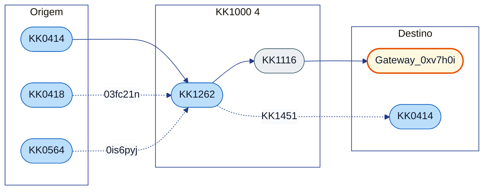

### KK0577 (quem chega nesta parte)

| KK1331 de destino | Flow | Origem / observação |
| ------------------- | ---------------- | ---------------------- |
| KK1262 | (KK1000 3) | KK0414 → KK0420 → KK0686 (não) → KK1000 4. |
| KK1262 | Flow_03fc21n | KK0418 (KK1451). |
| KK1262 | Flow_0is6pyj | KK0564 (KK1451). |

### KK1213 (para onde esta parte vai)

| Flow | Destino | Observação |
| ---------------- | ---------------------- | ------------ |
| Flow_0ca3z8j | KK1116 | Continuar. |
| Flow_0d93ejv | Gateway_0xv7h0i | Convergência (ex.: KK0418). |
| (KK1451) | KK0414 | KK1451=="KK0414" (KK1000 3). |

---

## 5. Referências no KK0172

- KK1262, KK1116.
- Flow_0ca3z8j, Flow_0d93ejv, Flow_0dyydgg.
- Gateway_0xv7h0i. Flow_lvstxhf: KK1116 para KK0418.

$$$$$

[parte_04_selecao_agencia_proposta_segmentada/USER_STORY_04_selecao_agencia_proposta_segmentada_GENERICO.md]
XXXXX
# User Story — KK1000 4: Seleção de KK0046 e KK1098

**KK0655:** `KK0953` (KK1262, KK1116)

---

## User Story

**Como** KK0723 ou KK1392 da KK0799 de KK0346,  
**quero** selecionar a KK0046 (e KK0562 quando aplicável) e ter a KK1086 marcada como segmentada,  
**para** que a KK0797 avance para KK0936 e demais etapas com KK1086 no status correto.

---

## Critérios de KK0009 (derivados do KK0172)

- [ ] **CA1 – Ordem das etapas**  
  Depois que o KK1392 conclui a seleção de KK0046 (`KK1262`), o KK0651 executa a atualização da KK1086 como segmentada (`KK1116`), marcando status da KK1086 = 1 (KK0117).

- [ ] **CA2 – Registro da etapa atual (KK0621)**  
  Ao finalizar a KK1338 de seleção de KK0046, o KK1292 grava que o KK1392 está nessa etapa (KK1424 **KK0602** = KK1262), para uso em KK1146 de KK0621.

- [ ] **CA3 – Tempo KK0823 e KK0621**  
  Na KK1338 de seleção de KK0046 existe um KK1342 máximo de permanência. Se o KK1342 acabar sem KK0314, o KK0651 dispara o KK0610 de KK0621 (timer `Event_0f1shpq`).

- [ ] **CA4 – Navegação “KK1452”**  
  Na KK1338 de seleção de KK0046, o KK1392 pode KK1451 para a KK1338 de KK0570. Em outros caminhos da KK0797, o KK1392 pode KK1451 de dados de KK0936 ou de KK0562 manual para a KK1338 de seleção de KK0046.

- [ ] **CA5 – Próximo passo**  
  Após marcar a KK1086 como segmentada, o KK0651 segue para o ponto de convergência (KK0669 `Gateway_0xv7h0i`). Em um dos caminhos, a próxima etapa é a KK1338 de dados de KK0936 (KK1000 7).

- [ ] **CA6 – Campos da KK1338**  
  A KK1338 de seleção de KK0046 exibe: número da KK0046, superintendência comercial, opção de KK0562 manual (quando aplicável), controle de KK0651 e KK1451.

---

## KK0598 complementar (fora desta US)

*Complemento KK1378 e fronteiras: entrada no bloco, KK1245, KK1423, comportamentos na borda e partes adjacentes (não altera o escopo da US; detalha contexto e limites).*

### Entrada no bloco

| Flow | Origem | Destino |
| ------ | -------- | --------- |
| `Flow_1pb12jt` | `KK0686` (KK1000 3, ramo não) | `KK1262` |
| `Flow_1q9216u` | Após `KK0416` / `Gateway_0xv7h0i` | `KK1262` |
| `Flow_03fc21n` | `KK0418` (KK1451) | `KK1262` |
| `Flow_0is6pyj` | `KK0564` (KK1451) | `KK1262` |

### Scripts e KK1146 de KK0911

| ID KK1332 / KK0473 | Regra resumida |
| -------------------- | ---------------- |
| `KK1116` (KK0117) | Atualiza KK1086 com `KK1309` = 1; inputParameter: `KK0747`, `KK1309`. |

Ver [FLUXO_04_tecnico](FLUXO_04_tecnico.md).

### KK1002 e KK1423

| Variável | Onde escrita / lida | Observação |
| ---------- | ---------------------- | ------------ |
| `KK0602` | outputParameter `KK1262` | ID da KK1332. |
| `KK0747`, `KK1309` | `KK1116` (inputParameter; status = 1) | Delegate. |
| `KK1451` | KK0659 | `KK1451=="KK0414"` leva à KK1000 3. |

### KK1145 de KK1406 de campos

*KK1145 de KK1406 de KK0046/KK0562 não estão modeladas no KK0172; quando existirem, devem ser documentadas em spec/front ou no KK1378.*

### Comportamentos fora do núcleo

**KK0165 KK0604 (timer → KK0621):**

| Event ID | KK1331 anexada | Timer |
| ---------- | -------------- | ------- |
| `Event_0f1shpq` | `KK1262` | `KK1344` |

**Fluxos de KK1451 e saída:**

| Tipo | De | Para |
| ------ | ----- | ------ |
| KK1452 | `KK1262` | `KK0414` (KK1000 3) |
| Saída (continuar) | `KK1116` | `Gateway_0xv7h0i` |
| Erros / GQ | KK0562 manual | Conforme KK0172 |

### Partes/etapas adjacentes

| KK1000 | Papel | KK0551 / observação |
| ------- | -------- | ------------------------- |
| 3 | Origem / destino de KK1451 | `KK0414` (KK1451); `KK0686` e `KK0416` (origens de entrada). |
| 5 | Destino | KK0496/KK1251 (após `Gateway_0xv7h0i`). |
| 7 | Origem de KK1451 | `KK0418` (KK1451 para `KK1262`). |

---

## Referência KK0172

- KK1262, KK1116.
- Flow_0ca3z8j, Flow_0d93ejv, Event_0f1shpq.

$$$$$

[parte_05_segmentacao_direcionador/FLUXO_05_guia_GENERICO.md]
XXXXX
# KK1000 5 — Segmentação e KK0497 — guia

**O que é esta parte:** trecho em que o KK1069 **KK0330 o KK0497** (com ou sem KK0046), **atualiza o KK0273**, **KK0330 KK1254**, **escolha de KK1254/upgrade** e **KK0497 na KK1086**. Inclui o KK0669 "KK1341" e exceções (não elegível, KK1255).

**KK0655:** `KK0953`

---

## 1. Objetivo

Definir o KK1254 e a KK0936 inicial do KK0273 com base no KK0497; atualizar KK0404 e da KK1086. KK1002 e KK1423 KK1171 são usados nas KK0785.

---

## 2. O que acontece na prática

- **"KK1341"** — O KK0651 pergunta se o KK0273 tem KK0046 e direciona para a KK0330 ao KK0497 **com KK0046** ou **sem KK0046**.
- **KK0496 do KK0273** — Consulta ao KK0497 (com ou sem KK0046, conforme o ramo).
- **Atualizar KK0273** — Atualização dos KK0404 no KK1292.
- **Consulta de KK1254**, **escolha de KK1254** e **escolha de upgrade** — Definição do KK1254 e da KK0936 inicial.
- **KK0496 na KK1086** — Aplicação do resultado do KK0497 na KK1086.
- **Exceções:** não elegível e KK1255 são tratados em ramos específicos.

---

## 3. Resumo para KK0726, KK1131 e KK1031

| O quê | Detalhe |
| ------- | -------- |
| **O que ocorre** | KK0466 "KK1341"; KK0497 (com/sem KK0046); atualização do KK0273; KK0330 e escolha de KK1254/upgrade; aplicação do KK0497 na KK1086. |
| **Saída** | KK1253 e KK0936 definidos; respostas do KK0497 disponíveis para as etapas seguintes. |
| **Exceções** | Não elegível, KK1255. |

---

## 4. KK0491

*KK1426 = início; KK0127 = user KK1332; KK0269 = service/KK1223; âmbar = KK0669; KK1430 = fim; KK1281 tracejada = KK1451 (ou exceção).*

```mermaid
%%{init: {
  "theme": "base",
  "themeVariables": {
    "background": "#ffffff",
    "primaryColor": "#3b82f6",
    "primaryTextColor": "#0f172a",
    "primaryBorderColor": "#1d4ed8",
    "lineColor": "#1e3a8a",
    "secondaryColor": "#f8fafc",
    "tertiaryColor": "#eef2ff",
    "clusterBkg": "#ffffff",
    "clusterBorder": "#1e3a8a",
    "fontFamily": "Inter, Segoe UI, Arial"
  }
}}%%
flowchart LR

classDef start fill:#22c55e,stroke:#15803d,stroke-width:2px,color:#ffffff;
classDef KK1332 fill:#3b82f6,stroke:#1d4ed8,stroke-width:1.5px,color:#ffffff;
classDef service fill:#ffffff,stroke:#3b82f6,stroke-width:1.5px,stroke-dasharray:5 5,color:#0f172a;
classDef KK0669 fill:#f59e0b,stroke:#b45309,stroke-width:2px,color:#ffffff;
classDef finish fill:#ef4444,stroke:#991b1b,stroke-width:2px,color:#ffffff;






  A{KK1341} --> B([KK0497 com KK0046])
  A --> C([KK0497 sem KK0046])
  B --> D([Atualizar KK0273])
  C --> D
  D --> E([Consulta KK1254])
  E --> F([Escolha KK1254 / upgrade])
  F --> G([KK0496 na KK1086])
  style A fill:#fff8e1,stroke:#e65100,stroke-width:2px
  style B fill:#bbdefb,stroke:#1565c0
  style C fill:#bbdefb,stroke:#1565c0
  style D fill:#eceff1,stroke:#546e7a
  style E fill:#eceff1,stroke:#546e7a
  style F fill:#bbdefb,stroke:#1565c0
  style G fill:#eceff1,stroke:#546e7a
```

---

## 5. KK1041

Para detalhes de KK1001 KK0497 e KK1423 use **FLUXO_05_tecnico.md**.

$$$$$

[parte_05_segmentacao_direcionador/FLUXO_05_tecnico_GENERICO.md]
XXXXX
# KK1000 5 — Segmentação e KK0497 — documentação KK1377

**KK0655:** `KK0953`  
**KK0598:** KK0674 (Tem agencia?), KK0500, KK0502, KK0111, KK0339, KK1116, KK0596, KK0597, KK0503; exceções (não elegível, KK1255).

---

## KK1132 Nível 2 (KK0790 KK0172)

**KK0789 completo:** [KK0847](<../../KK1439/KK0789 da KK0471/KK0848>)

| ID (Nível 2) | Observação |
|--------------|------------|
| `KK0596` | KK1388 — KK0595 (primeira UT etapa KK0316) |
| `KK0597` | KK1388 — Envio KK0522 (condicional KK1384/situação especial) |
| `KK1258` | Estado de exceção |
| `KK0906` | Estado de exceção |
| `KK0500`, `KK0502` | KK1276 — [KK0255] KK0498 |
| `KK0111`, `KK0339`, `KK1116`, `KK0503` | Service/Script KK1335 da parte |

---

## 1. Objetivo da parte

Consulta ao KK0497 (com ou sem KK0046), atualização de KK0273, KK0330 e escolha de KK1254, upgrade e aplicação do KK0497 na KK1086. KK0466 pelo KK0669 "KK1341" (agencia_logada); KK1423 KK1171, KK1254, KK0288, KK0550.

---

## 2. KK0551 KK0172 da parte

### 2.1 KK0668

| Tipo | ID | Nome (name) | Observação |
| ------------------ | ------------------ | --------------- | ------------ |
| KK0614 | `KK0674` | Tem agencia ? | Entrada após KK1232 (KK1000 1). KK1213: sim → KK0500; Não → KK0502. |

### 2.2 Tasks e delegates

| Tipo / Papel | ID do elemento |
| -------------- | ---------------- |
| KK1388 / KK1276 | KK0500, KK0502 |
| KK1276 / Delegate | KK0111, KK0339, KK1116, KK0596, KK0597, KK0503 |

Exceções no KK0172: não elegível, KK1255 (ramos e eventos específicos; conferir situacao_consulta_segmento, KK1189, KK1188).

### 2.3 Sequence KK0649 principais

| ID do flow | sourceRef | targetRef | Nome/condição |
| ------------ | ----------- | ----------- | --------------- |
| Flow_116t3w8 | KK1232 | KK0674 | Entrada da parte. |
| Flow_1g9i6od | KK0674 | KK0497 KK0273 | sim: agencia_logada preenchida. |
| Flow_1y0atzf | KK0674 | KK0502 | Não (KK0472). |

Demais KK0649 (KK0497 → KK0111 → KK0339 → KK0596 / KK0597 → KK0503, etc.) conferir no KK0172.

### 2.4 Condições de KK0669
### 2.4.1 KK0309 (KK1181 da KK0314)

| KK1331 ID | Tipo de KK0308 | Condição | Flow | Target |
|---------|------------------|----------|------|--------|
| KK0500 | KK0991 | — | Flow_1h18suh | KK0111 |
| KK0502 | KK0991 | — | Flow_049gmlz | KK0111 |
| KK0596 | KK0991 | — | Flow_0dcefc1 | KK0697 |
| KK0597 | KK0991 | — | Flow_1lsqeit | Gateway_1rc003q |
| KK0503 | KK0991 | — | Flow_02c7u0n | KK0744 |


| ID KK0669 | Nome | Expressão (ex.: `${...}`) | Ramo | Flow | Target |
| ------------ | ------ | --------------------------- | ------ | ------ | -------- |
| KK0674 | Tem agencia ? | `${KK0615.hasVariable('agencia_logada') && agencia_logada != null && agencia_logada != ""}` | sim | Flow_1g9i6od | KK0497 KK0273 |
| KK0674 | Tem agencia ? | (KK0472) | Não | Flow_1y0atzf | KK0502 |

### 2.5 KK0491 KK0172 (visão da parte)

**KK0816:** KK1426 = início; KK0127 = user KK1332; KK0269 = service/KK1223; âmbar = KK0669; KK1430 = fim; KK1281 tracejada = KK0651 "KK1451".

KK0650 principal: KK0668 "KK1341" → KK0497 (com KK0046) ou KK0497 sem KK0046 → KK0111 → KK0339 → KK0596 / KK0597 → KK0503. Ramos de exceção (erro KK0330, não elegível, KK1255) no KK0172.

```mermaid
%%{init: {
  "theme": "base",
  "themeVariables": {
    "background": "#ffffff",
    "primaryColor": "#3b82f6",
    "primaryTextColor": "#0f172a",
    "primaryBorderColor": "#1d4ed8",
    "lineColor": "#1e3a8a",
    "secondaryColor": "#f8fafc",
    "tertiaryColor": "#eef2ff",
    "clusterBkg": "#ffffff",
    "clusterBorder": "#1e3a8a",
    "fontFamily": "Inter, Segoe UI, Arial"
  }
}}%%
flowchart LR

classDef start fill:#22c55e,stroke:#15803d,stroke-width:2px,color:#ffffff;
classDef KK1332 fill:#3b82f6,stroke:#1d4ed8,stroke-width:1.5px,color:#ffffff;
classDef service fill:#ffffff,stroke:#3b82f6,stroke-width:1.5px,stroke-dasharray:5 5,color:#0f172a;
classDef KK0669 fill:#f59e0b,stroke:#b45309,stroke-width:2px,color:#ffffff;
classDef finish fill:#ef4444,stroke:#991b1b,stroke-width:2px,color:#ffffff;






  direction LR
  IN((•))
  IN --> GW{KK1341<br/>KK0674}
  GW -->|sim| DC([KK0496 com KK0046<br/>KK0500])
  GW -->|Não| DSA([KK0496 sem KK0046<br/>KK0502])
  DC --> AC([Atualizar KK0273<br/>KK0111])
  DSA --> AC
  AC --> CS([Consulta KK1254<br/>KK0339])
  CS --> ES([Escolha KK1254<br/>KK0596])
  ES --> EU([Escolha upgrade<br/>KK0597])
  EU --> DP([KK0496 KK1086<br/>KK0503])
  DP --> OUT(( ))

  style IN fill:#c8e6c9,stroke:#2e7d32,stroke-width:2px
  style OUT fill:#ffcdd2,stroke:#c62828,stroke-width:2px
  style GW fill:#fff8e1,stroke:#e65100,stroke-width:2px
  style DC fill:#bbdefb,stroke:#1565c0
  style DSA fill:#bbdefb,stroke:#1565c0
  style AC fill:#eceff1,stroke:#546e7a
  style CS fill:#eceff1,stroke:#546e7a
  style ES fill:#bbdefb,stroke:#1565c0
  style EU fill:#bbdefb,stroke:#1565c0
  style DP fill:#eceff1,stroke:#546e7a
```

---

## 3. Variáveis de KK1069

| Variável | Escrita por | Lida por | Usada em condição | Observação |
| ---------- | ------------- | ---------- | ------------------- | ------------ |
| agencia_logada | KK1000 anterior / start | KK0674 | sim: agencia_logada != null && != "" | Define ramo KK0497 com/sem KK0046. |
| KK1171 | KK0500 / KK0502 | etapas seguintes | — | Resposta do KK0497. |
| KK1254, KK0288, KK1256 | KK0339, KK0596 | KK0675 (KK1000 6), etc. | — | Segmentação e KK1467. |
| KK0550 | KK1236, KK1237 | KK0674 (em ramos a montante) | — | Elegibilidade do KK0273. |
| situacao_consulta_segmento, KK1189, KK1188 | KK0339 / KK1245 | KK0711 de exceção | erros (erro KK0330, GQ NOT_FOUND, numeroFuncional 000000000) | Ramos de erro documentados no KK0172. |

---

## 4. KK1145 de KK0911 (KK1139)

| ID KK1223 / KK1332 | Regra em uma linha |
| ------------------ | --------------------- |
| KK0111, KK0112, atualizar_representante | Atualizam KK0404 no KK1292; KK1423 conforme KK0473/KK0775 do KK0172. |
| KK1222 | Consulta KK1254; preenche KK1254, KK0288, situacao_consulta_segmento; ramos de erro (não elegível, KK1255) no KK0172. |
| KK1236, KK1237 | Verificação de KK0550 (KK0732); resultado usado em KK0712 a montante. Conferir conditionExpression no KK0172. |

---

## 5. Pseudo-KK0398 (KK1139)

### 5.1 Scripts de atualização de KK0273 e KK0330 KK1254

**KK1000:** 5 — Segmentação e KK0497  
**Objetivo:** Atualizar KK0273 e consultar KK1254/KK0936; definir KK0550. Comportamento dos delegates e KK1245 deve ser conferido no KK0172 (KK0775, KK1423 de resposta).

#### Pseudo-KK0398 (KK1139)

```text
KK1129 (KK1139 — conferir KK0172):
  KK0260 KK0111 (KK0473) com dados do contexto
  OBTER KK1171 (KK0500 ou KK0502)
  KK0260 KK0339
  KK1249 sucesso KK0579
    ATRIBUIR KK1254, KK0288 conforme resposta
  KK1269
    ATRIBUIR situacao_consulta_segmento, KK1189 (ramos de exceção no KK0172)
  KK0642 KK1249
  EXECUTAR KK1236 / KK1237 (KK0550)
  KK0260 KK0503
```

#### Referências KK0172

- **ids:** KK0111, KK1222, KK1236, KK1237, KK0503.
- **KK0172:** `KK0953`.

---

## 6. KK0577 e saídas da parte

**KK0491 de contexto:** entrada única da KK1000 1; núcleo da KK1000 5; saídas para KK1000 6 (e exceções).

*KK1426 = início; KK0127 = user KK1332; KK0269 = service/KK1223; âmbar = KK0669; KK1430 = fim; KK1281 tracejada = KK1451 (ou exceção).*

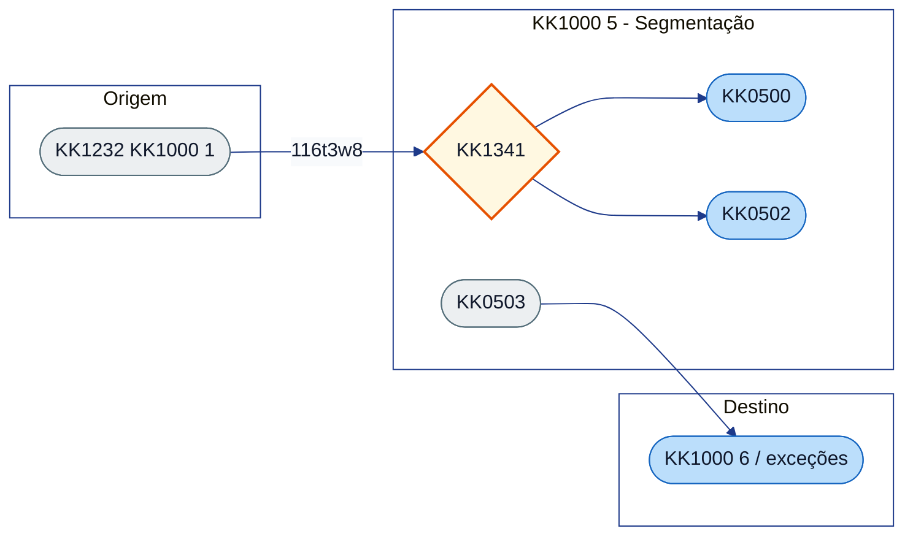

### KK0577 (quem chega nesta parte)

| KK1331 / elemento de destino | Flow | Origem / observação |
| ---------------------------- | ---------------- | ---------------------- |
| KK0674 | Flow_116t3w8 | KK1232 (KK1000 1). |

### KK1213 (para onde esta parte vai)

| Flow / ramo | Destino | Observação |
| ------------- | ---------------- | ------------ |
| (KK0651 principal) | KK1000 6 (KK0675, KK0418, etc.) | KK0503 e KK1272. |
| (exceções) | não elegível, KK1255 | Ramos documentados no KK0172. |

**Relação com KK0902 KK0921:** O KK0497 (KK1000 5) KK1186 KK0936 com **KK0745**, planos e benefícios; no KK1020 KK0902 KK0921 essas KK1423 são reutilizadas no **ramo pós-KK0544** (KK1000 12), sem segunda KK0259 ao KK0497. Ver [REFERENCIA_CRUZADA_MULTIPLO_SETUP_MANUAL.md](../REFERENCIA_CRUZADA_MULTIPLO_SETUP_MANUAL.md) e [KK0899.md](../../KK0898/KK0899.md).

---

## 7. Referências no KK0172

- KK0668: `KK0674`.
- Tasks: `KK0500`, `KK0502`, `KK0111`, `KK0339`, `KK0596`, `KK0597`, `KK0503`.
- Flows: Flow_116t3w8, Flow_1g9i6od, Flow_1y0atzf (e demais da cadeia no KK0172).
- **Índice do manual:** [INDICE_E_PLANEJAMENTO_MANUAL_CO8.md](../INDICE_E_PLANEJAMENTO_MANUAL_CO8.md) §2 (KK1000 5). **Guia:** [FLUXO_05_guia.md](FLUXO_05_guia.md). **User story:** [USER_STORY_05_segmentacao_direcionador.md](USER_STORY_05_segmentacao_direcionador.md).

$$$$$

[parte_05_segmentacao_direcionador/USER_STORY_05_segmentacao_direcionador_GENERICO.md]
XXXXX
# User Story — KK1000 5: Segmentação e KK0497

**KK0655:** `KK0953` (KK0674, KK0500, KK0339, KK0596, KK0503, etc.)

---

## User Story

**Como** motor de KK1069 da KK0798,  
**quero** consultar o KK0497 (com ou sem KK0046), atualizar o KK0273 e definir KK1254 e KK0936 inicial,  
**para** que a KK1086 siga com KK1251 e KK0936 corretas para as etapas seguintes.

---

## Critérios de KK0009 (derivados do KK0172)

- [ ] **CA1 – KK0466 “KK1341”**  
  O KK0651 pergunta se o KK0273 tem KK0046 (KK0669 `KK0674`). Se sim, segue pelo ramo com KK0046 (KK0497 do KK0273); se não, pelo ramo sem KK0046 (KK0497 sem KK0046).

- [ ] **CA2 – Consulta e aplicação do KK0497**  
  O KK1292 executa na ordem: KK0497 do KK0273 (com ou sem KK0046), atualização do KK0273, KK0330 de KK1254, escolha de KK1254, escolha de upgrade (quando aplicável) e KK0497 da KK1086. Tudo conforme a ordem definida no KK0172.

- [ ] **CA3 – KK0399 do KK0497**  
  As respostas do KK0497 (ex.: KK1171) são gravadas e ficam disponíveis para as etapas seguintes (KK0936, KK0135, etc.).

- [ ] **CA4 – Casos de exceção**  
  Os caminhos em que o KK0273 não é elegível ou o KK1254 não é atendido estão modelados e tratados conforme o KK0172.

- [ ] **CA5 – Próximo passo**  
  Ao final desta parte, a KK1086 tem KK1254 e KK0936 definidos e o KK0651 segue para as próximas etapas (ex.: dados de KK0936, KK0135/KK1467).

---

## KK0598 complementar (fora desta US)

*Complemento KK1378 e fronteiras: entrada no bloco, KK1245, KK1423, comportamentos na borda e partes adjacentes (não altera o escopo da US; detalha contexto e limites).*

### Entrada no bloco

| Flow | Origem | Destino |
| ------ | -------- | --------- |
| `Flow_116t3w8` | `KK1232` (KK1000 1) | `KK0674` |

### Scripts e KK1146 de KK0911

| ID KK1332 / KK1223 | Regra resumida |
| ------------------ | ---------------- |
| `KK0111` | Delegate; atualização de KK0273. |
| `KK0339` | Delegate; KK0330 KK1254. |
| `KK1236` / `KK1237` | Elegibilidade do KK0273. |
| `KK0596`, `KK0597` | User/service; escolha de KK1254 e upgrade. |
| `KK0503` | Delegate; aplica KK0497 na KK1086. |

Exceções: não elegível, KK1255 (`situacao_consulta_segmento`, `KK1189`, `KK1188`). Ver [FLUXO_05_tecnico](FLUXO_05_tecnico.md) e [INDICE_SCRIPTS](../INDICE_SCRIPTS.md).

### KK1002 e KK1423

| Variável | Onde escrita / lida | Observação |
| ---------- | ---------------------- | ------------ |
| `agencia_logada` | KK1000 anterior / start; lida por `KK0674` | Condiciona ramo com/sem KK0046. |
| `KK1171` | `KK0500` / `KK0502` | Resposta do KK0497. |
| `KK1254`, `KK0288`, `KK1256` | `KK0339`, `KK0596`; KK1000 6 | Segmentação e KK1467. |
| `KK0550` | KK1236* | Elegibilidade. |
| `situacao_consulta_segmento`, `KK1189`, `KK1188` | KK0339 / KK1245 | KK0711 de exceção (erro, GQ NOT_FOUND, etc.). |

### KK1145 de KK1406 de campos

*KK1145 de KK1406 de campos não estão modeladas no KK0172; quando existirem, devem ser documentadas em spec/front ou no KK1378.*

### Comportamentos fora do núcleo

**KK0674 (KK1341):**

| Ramo | Flow | Destino |
| ------ | ------ | --------- |
| sim | `Flow_1g9i6od` | `KK0500` |
| Não (KK0472) | `Flow_1y0atzf` | `KK0502` |

Ramos de exceção (não elegível, KK1255) conforme KK0172. Saída da parte para KK1000 6 (`KK0675`).

### Partes/etapas adjacentes

| KK1000 | Papel | KK0551 / observação |
| ------- | -------- | ------------------------- |
| 4 | Origem | Seleção KK0046 (`agencia_logada` quando aplicável). |
| 6 | Destino | KK0134/KK1467 (`KK0675`; `KK1256`, `KK0288`). |
| 7 | Destino | Limites/KK0936 (KK0651 normal após KK1000 6). |

---

## Referência KK0172

- KK0674, KK0500, KK0502, KK0111, KK0339, KK0596, KK0597, KK0503.

$$$$$

[parte_06_backoffice_wayout_analise_documentos/FLUXO_06_guia_GENERICO.md]
XXXXX
# KK1000 6 — KK0134 / KK1467 / KK0065 de documentos — guia

**O que é esta parte:** trecho em que o KK1069 trata **KK1467**, **upgrade**, **KK0065 EZ8**, **KK0065 de fraudes KK0082** e **aprovação/recusa KK0135**. Inclui KK0669 "Tem KK1467, upgrade, situação especial?", KK0065 de documentos (KK0135 e EZ8), KK1315 de fraudes KK0082 e atualização de status da KK1086.

**KK0655:** `KK0953`

---

## 1. Objetivo

Direcionar propostas em situações especiais (KK1467, upgrade) para KK0135; executar KK0065 de documentos (EZ8) e KK0065 de fraudes (KK0082); atualizar KK1086 como aprovada, recusada ou com falha conforme resultado.

---

## 2. O que acontece na prática

- **"Tem KK1467, upgrade ou situação especial?"** — O KK0651 verifica e direciona: se sim, envia a KK1086 para o KK0135 (KK1467, status 86); se não, segue o KK0651 normal de KK0544.
- **KK1085 KK1467** — KK1085 enviada para o KK0135 para KK0065.
- **KK0064 de documentos no KK0135** — Inclui montagem do objeto de KK0065 e KK0065 EZ8 (tópico de KK0135).
- **KK0064 de fraudes (KK0082)** — KK1314 de KK0065 de fraudes executado quando aplicável.
- **Resultado:** KK1086 **aprovada** (status 1), **falha na KK0065** (status 4), **recusa EZ8** ou **KK0665** — cada um atualiza o status da KK1086.
- **Resposta do KK0135** — KK0466 entre aprovar ou recusar; aprovada KK1186 ao ponto de convergência.

---

## 3. Resumo para KK0726, KK1131 e KK1031

| O quê | Detalhe |
| ------- | -------- |
| **Ramos** | Wayout/upgrade -> KK0135; KK0651 normal -> KK0544. KK0064 EZ8 e KK0082 no KK1324. |
| **Status** | 86 (KK1467), 1 (aprovada), 4 (falha KK0065), recusa EZ8, KK0665. |
| **Saída** | Aprovada → KK1186 ao ponto de convergência; recusa → manutenção da KK0797 ou KK0567. |

---

## 4. KK0491

*KK1426 = início; KK0127 = user KK1332; KK0269 = service/KK1223; âmbar = KK0669; KK1430 = fim; KK1281 tracejada = KK1451 (ou exceção).*

```mermaid
%%{init: {
  "theme": "base",
  "themeVariables": {
    "background": "#ffffff",
    "primaryColor": "#3b82f6",
    "primaryTextColor": "#0f172a",
    "primaryBorderColor": "#1d4ed8",
    "lineColor": "#1e3a8a",
    "secondaryColor": "#f8fafc",
    "tertiaryColor": "#eef2ff",
    "clusterBkg": "#ffffff",
    "clusterBorder": "#1e3a8a",
    "fontFamily": "Inter, Segoe UI, Arial"
  }
}}%%
flowchart LR

classDef start fill:#22c55e,stroke:#15803d,stroke-width:2px,color:#ffffff;
classDef KK1332 fill:#3b82f6,stroke:#1d4ed8,stroke-width:1.5px,color:#ffffff;
classDef service fill:#ffffff,stroke:#3b82f6,stroke-width:1.5px,stroke-dasharray:5 5,color:#0f172a;
classDef KK0669 fill:#f59e0b,stroke:#b45309,stroke-width:2px,color:#ffffff;
classDef finish fill:#ef4444,stroke:#991b1b,stroke-width:2px,color:#ffffff;


  A{Tem KK1467/upgrade?} -->|Sim| B([KK1085 KK1467])
  A -->|Não| C([KK0650 normal KK0544])
  B --> D([Manutenção KK0797])
  E([KK0064 EZ8/KK0082]) --> F{Aprovado?}
  F -->|Sim| G([KK1085 aprovada])
  F -->|Não| H([Falha / recusa])
  style A fill:#fff8e1,stroke:#e65100,stroke-width:2px
  style B fill:#eceff1,stroke:#546e7a
  style C fill:#bbdefb,stroke:#1565c0
  style D fill:#bbdefb,stroke:#1565c0
  style E fill:#eceff1,stroke:#546e7a
  style F fill:#fff8e1,stroke:#e65100,stroke-width:2px
  style G fill:#c8e6c9,stroke:#2e7d32
  style H fill:#ffcdd2,stroke:#c62828,stroke-width:2px
```

---

## 5. KK1041

Para KK0755 de KK1335, KK0649 e delegates use **FLUXO_06_tecnico.md**.

$$$$$

[parte_06_backoffice_wayout_analise_documentos/FLUXO_06_tecnico_GENERICO.md]
XXXXX
# KK1000 6 — KK0134 KK1467 KK0065 de documentos — documentação KK1377

**KK0655:** `KK0953`  
**KK0598:** KK0675 (Tem KK1467, upgrade, situação especial?), KK0053, KK0019, KK0054, KK1316, KK1121, KK1099, KK1107, KK0680.

---

## KK1132 Nível 2 (KK0790 KK0172)

**KK0789 completo:** [KK0847](<../../KK1439/KK0789 da KK0471/KK0848>)

| ID (Nível 2) | Observação |
|--------------|------------|
| `KK0564` | KK1388 — KK0563 (exceção KK0967) |
| `KK0769` | KK1388 — KK0768 (KK1315 KK1375) |
| `KK0319` | KK1388 — Confirmação dados empresa (KK1375) |
| `KK0053`, `KK0523` | KK0134 — KK0065 documentos/KK0661 |

---

## 1. Objetivo da parte

Ramos **KK1467** e **upgrade/situação especial**; KK0065 de documentos (KK0135, EZ8, fraudes KK0082); aprovação ou recusa da KK1086. KK0675 direciona para KK1121 (sim) ou KK0651 normal (Não → KK0021). User KK1332 KK0053; KK1324 e external/call para EZ8 e KK0082; KK0712 de resultado (aprovada, falha, KK1190).

---

## 2. KK0551 KK0172 da parte

### 2.1 KK0668 principal

| Tipo | ID | Nome (name) | Observação |
| ------------------ | ------------------ | ------------------------------------------ | ------------ |
| KK0614 | `KK0675` | Tem KK1467, upgrade, situação especial? | Entrada após convergência (ex.: KK1099). KK1213: sim → Flow_100gyb6 (KK1467/ramo KK1467); Não → Flow_1a72e8p → KK0021. |

### 2.2 Tasks e KK1326

| Tipo | ID do elemento |
| ----------------- | ---------------- |
| KK1388 | KK0053 |
| KK1320 | KK0019 |
| KK1276 (external) | KK0054 (KK1363 jvcc-analise-KK0135) |
| KK0215 | KK1316 (KK1469) |
| KK1276 | KK1121, KK1099, KK1107 |
| KK0614 | KK0680 (após KK0065) |

### 2.3 Sequence KK0649 principais

| ID do flow | sourceRef | targetRef | Nome/condição |
| ------------ | ----------- | ----------- | --------------- |
| Flow_025xqbq | (convergência) | KK0675 | Entrada na parte. |
| Flow_100gyb6 | KK0675 | KK1121 / KK0676 | sim: KK1467/upgrade/situação especial. |
| Flow_1a72e8p | KK0675 | KK0021 | Não (KK0651 normal). |
| Flow_lj6lcuj | KK0019 | (saídas) | Saída do KK1324. |
| Flow_0q6wcaq | (KK0065) | Event_0q6wcaq | Ramos de erro/recusa. |

Condição sim do KK0675: KK1256/KK0288, KK1180 == 'KK1467', KK1301 != "Nenhuma". Conferir conditionExpression no KK0172.

### 2.4 Condições de KK0669
### 2.4.1 KK0309 (KK1181 da KK0314)

KK1000 6 é dominada por KK0712 e KK1326 (KK1467, KK0065 documentos, KK0082). KK0309 relevantes estão nos KK1319; KK0651 principal: KK1099 → Flow_025xqbq → KK0675; KK1121 e KK1106 mantidas no KK0172.

| KK1331 ID / elemento | Tipo | Condição | Flow | Target |
|--------------------|------|----------|------|--------|
| KK1099 | Saída (convergência) | — | Flow_025xqbq | KK0675 |


| ID KK0669 | Nome | Expressão (resumo) | Ramo | Observação |
| ------------ | ------ | -------------------- | ------ | ------------ |
| KK0675 | Tem KK1467, upgrade, situação especial? | `${(KK1256 == "3" && KK0288 == "L") \ | \ | ... \ | \ | KK1180 == 'KK1467' \ | \ | (KK1301 != "Nenhuma" && != "nenhuma")}` | sim | Flow_100gyb6. |
| KK0675 | Tem KK1467, upgrade, situação especial? | (KK0472) | Não | Flow_1a72e8p → KK0021. |
| KK0680 | (resultado KK0065) | (aprovada) | aprovada | Flow_1j61cuj → KK1099. |
| KK0680 | (resultado KK0065) | (KK0472) | falha / KK1190 | Flow_08ceoql → Event_05idg99 ou KK1238 (conforme ramo). |

### 2.5 KK0491 KK0172 (visão da parte)

**KK0816:** KK1426 = início; KK0127 = user KK1332; KK0269 = service/KK1223; âmbar = KK0669; KK1430 = fim; KK1281 tracejada = KK0651 "KK1451".

```mermaid
%%{init: {
  "theme": "base",
  "themeVariables": {
    "background": "#ffffff",
    "primaryColor": "#3b82f6",
    "primaryTextColor": "#0f172a",
    "primaryBorderColor": "#1d4ed8",
    "lineColor": "#1e3a8a",
    "secondaryColor": "#f8fafc",
    "tertiaryColor": "#eef2ff",
    "clusterBkg": "#ffffff",
    "clusterBorder": "#1e3a8a",
    "fontFamily": "Inter, Segoe UI, Arial"
  }
}}%%
flowchart LR

classDef start fill:#22c55e,stroke:#15803d,stroke-width:2px,color:#ffffff;
classDef KK1332 fill:#3b82f6,stroke:#1d4ed8,stroke-width:1.5px,color:#ffffff;
classDef service fill:#ffffff,stroke:#3b82f6,stroke-width:1.5px,stroke-dasharray:5 5,color:#0f172a;
classDef KK0669 fill:#f59e0b,stroke:#b45309,stroke-width:2px,color:#ffffff;
classDef finish fill:#ef4444,stroke:#991b1b,stroke-width:2px,color:#ffffff;


  direction LR
  IN((•))
  IN --> GW{Tem KK1467, upgrade,<br/>situação especial?}
  GW -->|sim| W([KK1085 KK1467<br/>KK1121])
  GW -->|Não| CX([Continuar KK0651<br/>KK0021])
  W --> SUB[KK0064 KK0135<br/>KK0019]
  SUB --> EZ8([KK0064 documentos EZ8<br/>KK0054])
  EZ8 --> KK0082([KK1314 KK0082<br/>KK1315 KK0082])
  KK0082 --> GW2{Resultado KK0065}
  GW2 -->|aprovada| OK([KK1085 aprovada KK0135<br/>KK1099])
  GW2 -->|falha| FK([KK1085 falha KK0065 BKO<br/>KK1107])
  OK --> OUT(( ))
  FK --> OUT2(( ))

  style IN fill:#c8e6c9,stroke:#2e7d32,stroke-width:2px
  style OUT fill:#ffcdd2,stroke:#c62828,stroke-width:2px
  style OUT2 fill:#ffcdd2,stroke:#c62828,stroke-width:2px
  style GW fill:#fff8e1,stroke:#e65100,stroke-width:2px
  style GW2 fill:#fff8e1,stroke:#e65100,stroke-width:2px
  style W fill:#eceff1,stroke:#546e7a
  style SUB fill:#eceff1,stroke:#546e7a
  style EZ8 fill:#eceff1,stroke:#546e7a
  style KK0082 fill:#eceff1,stroke:#546e7a
  style OK fill:#c8e6c9
  style FK fill:#ffcdd2
  style CX fill:#bbdefb,stroke:#1565c0
```

---

## 3. Variáveis de KK1069

| Variável | Escrita por | Lida por | Usada em condição | Observação |
| ---------- | ------------- | ---------- | ------------------- | ------------ |
| KK1256, KK0288 | KK1000 5 | KK0675 | Condição KK1467/upgrade | Define se segue para KK1467. |
| KK1180 | KK1000 9 (a montante) | KK0675 | == 'KK1467' | Wayout por KK0149. |
| KK1301 | (formulários / upstream) | KK0675 | != "Nenhuma" | Situação especial. |
| resultado_analise_backoffice | KK0053 | KK0711 de KK1190/erro | ERRO_INTERNO, ERRO_PAYLOAD | Conferir KK0172. |
| backoffice_retry | (KK1223/KK1332) | Condição KK1190 | backoffice_retry > 3 | Conferir KK0172. |
| conclusao_analise_fraude | KK1315 KK0082 | KK0668 (KK1000 12/16) | Confirmação de KK0660 | Conferir KK0172. |

---

## 4. KK1145 de KK0911 (KK1139)

| ID KK1223 / KK1332 | Regra em uma linha |
| ------------------ | --------------------- |
| KK0893 | Monta objetos para KK0065 EZ8 a partir de KK0524; inclui selfie, DI frente, situações especiais (menor emancipado, formulário não alfabetização); prepara KK0524 para KK0054. |
| KK1238 | Envio de KK0530 com motivo de recusa do KK0135; conferir KK0775 no KK0172. |

---

## 5. Pseudo-KK0398 (KK1139)

### 5.1 KK1224 KK0893

**KK1000:** 6 — KK0134 / KK1467 / KK0065 de documentos  
**Nome (KK0172):** Monta objetos de KK0065  
**Formato:** KK0732  
**Objetivo:** Preparar lista de documentos (KK0524) para a KK0065 EZ8; incluir selfie, DI, situações especiais e comprovantes conforme KK0172.

#### Pseudo-KK0398 (KK1139)

```text
KK1129 (KK1139 — conferir KK0172):
  OBTER KK0524 do contexto
  PARA CADA KK0521 EM KK0524 FAZER
    KK1249 tipo_documento == "selfie" KK0579 adicionar id_conteudo_di4, tipo_documento; setar id_conteudo_selfie_di4
    KK1249 tipo_documento == "di frente" KK0579 adicionar id_conteudo_di4, tipo_documento
  KK0642 PARA
  KK1249 KK1301 (menor emancipado, etc.) KK0579 adicionar KK0578 conforme KK0172
  ATRIBUIR KK0524 = nova lista
```

#### Referências KK0172

- **id:** KK0893 (dentro de KK0019).
- **KK0172:** `KK0953`.

---

## 6. KK0577 e saídas da parte

**KK0491 de contexto:** entrada por convergência (ex.: KK1099); núcleo KK1467/KK0065; saídas aprovada/falha ou KK0651 normal.

*KK1426 = início; KK0127 = user KK1332; KK0269 = service/KK1223; âmbar = KK0669; KK1430 = fim; KK1281 tracejada = KK1451 (ou exceção).*

```mermaid
%%{init: {
  "theme": "base",
  "themeVariables": {
    "background": "#ffffff",
    "primaryColor": "#3b82f6",
    "primaryTextColor": "#0f172a",
    "primaryBorderColor": "#1d4ed8",
    "lineColor": "#1e3a8a",
    "secondaryColor": "#f8fafc",
    "tertiaryColor": "#eef2ff",
    "clusterBkg": "#ffffff",
    "clusterBorder": "#1e3a8a",
    "fontFamily": "Inter, Segoe UI, Arial"
  }
}}%%
flowchart LR

classDef start fill:#22c55e,stroke:#15803d,stroke-width:2px,color:#ffffff;
classDef KK1332 fill:#3b82f6,stroke:#1d4ed8,stroke-width:1.5px,color:#ffffff;
classDef service fill:#ffffff,stroke:#3b82f6,stroke-width:1.5px,stroke-dasharray:5 5,color:#0f172a;
classDef KK0669 fill:#f59e0b,stroke:#b45309,stroke-width:2px,color:#ffffff;
classDef finish fill:#ef4444,stroke:#991b1b,stroke-width:2px,color:#ffffff;


  subgraph Entrada["Origem"]
    CONV([convergência KK1000 5/6])
  end
  subgraph Parte6["KK1000 6 - Wayout"]
    GW{Tem KK1467?}
    W([KK1121])
    SUB([KK0019])
    GW2{Resultado}
  end
  subgraph KK1207["Destino"]
    OK([KK1099])
    FK([KK1107])
    CX([KK0021])
  end
  CONV -->|025xqbq| GW
  GW -->|100gyb6| W
  GW -->|1a72e8p| CX
  W --> SUB
  SUB --> GW2
  GW2 --> OK
  GW2 --> FK
  style CONV fill:#bbdefb,stroke:#1565c0
  style GW fill:#fff8e1,stroke:#e65100,stroke-width:2px
  style W fill:#eceff1,stroke:#546e7a
  style SUB fill:#eceff1,stroke:#546e7a
  style GW2 fill:#fff8e1,stroke:#e65100,stroke-width:2px
  style OK fill:#c8e6c9,stroke:#2e7d32
  style FK fill:#ffcdd2,stroke:#c62828,stroke-width:2px
  style CX fill:#bbdefb,stroke:#1565c0
```

### KK0577 (quem chega nesta parte)

| Elemento de destino | Flow | Origem / observação |
| --------------------- | ---------------- | ---------------------- |
| KK0675 | Flow_025xqbq | Convergência (ex.: KK1099, KK0651 principal). |

### KK1213 (para onde esta parte vai)

| Flow / ramo | Destino | Observação |
| ------------- | ---------------------- | ------------ |
| Flow_100gyb6 | KK1121 / ramo KK1467 | Sim: KK1467, upgrade ou situação especial. |
| Flow_1a72e8p | KK0021 | Não: KK0651 normal (KK1000 7). |
| (após KK0065) | KK1099, KK1107 | Ramos 86 KK1467, aprovada, falha. |

---

## 7. Referências no KK0172

- KK0668: `KK0675`, `KK0680`.
- Tasks: `KK0053`, `KK0019`, `KK0054`, `KK1316`, `KK1121`, `KK1099`, `KK1107`.
- Flows: Flow_100gyb6, Flow_la72e8p, Flow_025xqbq, Flow_lj6lcuj, Event_0q6wcaq.
- **Índice do manual:** [INDICE_E_PLANEJAMENTO_MANUAL_CO8.md](../INDICE_E_PLANEJAMENTO_MANUAL_CO8.md) §2 (KK1000 6). **Guia:** [FLUXO_06_guia.md](FLUXO_06_guia.md). **User story:** [USER_STORY_06_backoffice_wayout_analise_documentos.md](USER_STORY_06_backoffice_wayout_analise_documentos.md).

$$$$$

[parte_06_backoffice_wayout_analise_documentos/USER_STORY_06_backoffice_wayout_analise_documentos_GENERICO.md]
XXXXX
# User Story — KK1000 6: KK0134 / KK1467 / KK0065 de documentos

**KK0655:** `KK0953` (KK0675, KK0054, KK1316, KK1121, KK1099, etc.)

---

## User Story

**Como** motor de KK1069 da KK0798,  
**quero** direcionar propostas KK1467/upgrade para KK0135 e executar KK0065 de documentos (EZ8) e de fraudes (KK0082),  
**para** que a KK1086 seja aprovada, recusada ou marcada com falha conforme o resultado da KK0065.

---

## Critérios de KK0009 (derivados do KK0172)

- [ ] **CA1 – KK0466 KK1467 / upgrade / KK0651 normal**  
  O KK0651 verifica se a KK1086 é KK1467, upgrade ou situação especial (KK0669 `KK0675`). Quando for KK1467, a KK1086 é enviada para o KK0135 e o status da KK1086 é atualizado para 86 (`KK1121`). Caso contrário, segue o KK0651 normal.

- [ ] **CA2 – KK0064 de documentos (EZ8)**  
  O KK0135 monta o objeto de KK0065 e executa a KK0065 de documentos (EZ8, tópico jvcc-analise-KK0135). Ao concluir, o KK0651 segue para o tratamento da resposta do KK0135 (`Event_0q6wcaq`).

- [ ] **CA3 – KK0064 de fraudes (KK0082)**  
  Quando aplicável, é executado o KK1315 de KK0065 de fraudes (KK1469). O resultado pode levar à marcação de falha na KK0065 (status 4) ou à continuidade do KK0651.

- [ ] **CA4 – Aprovação ou recusa pelo KK0135**  
  Após a KK0065, o KK0651 decide: KK1086 aprovada (status 1) ou recusa do KK0135 (`KK0680`). A KK1086 aprovada KK1186 ao ponto de convergência KK1467/upgrade.

- [ ] **CA5 – Exceções e recusas**  
  Falha na KK0065, recusa EZ8 e KK1086 KK0665 atualizam status e metadados conforme o KK0172. O KK0651 de recusa pode levar à manutenção da KK0797 ou ao KK0567 da KK0780.

---

## KK0598 complementar (fora desta US)

*Complemento KK1378 e fronteiras: entrada no bloco, KK1245, KK1423, comportamentos na borda e partes adjacentes (não altera o escopo da US; detalha contexto e limites).*

### Entrada no bloco

| Flow | Origem | Destino |
| ------ | -------- | --------- |
| `Flow_025xqbq` | Convergência (ex.: KK1099, KK0651 principal) | `KK0675` |

### Scripts e KK1472

| ID KK1332 / elemento | Regra resumida |
| -------------------- | ---------------- |
| `KK0053` | User KK1332; KK0135 monta objeto e dispara KK0065. |
| `KK0054` | KK1276 (KK1363 jvcc-analise-KK0135); KK0065 EZ8. |
| `KK1316` | KK0215 (KK1469); KK0065 de fraudes. |
| `KK1121`, `KK1099`, `KK1107` | KK1277; atualização de status (86 KK1467, 1 aprovada, 4 falha). |

KK0758 dos KK1472 EZ8 e KK0082 fora desta US. Ver [FLUXO_06_tecnico](FLUXO_06_tecnico.md) e [INDICE_SCRIPTS](../INDICE_SCRIPTS.md).

### KK1002 e KK1423

| Variável | Onde escrita / lida | Observação |
| ---------- | ---------------------- | ------------ |
| `KK1256`, `KK0288` | KK1000 5; lida por `KK0675` | Condição KK1467/upgrade. |
| `KK1180` | KK1000 9 (a montante); lida por `KK0675` | == 'KK1467'. |
| `KK1301` | Formulários/upstream; lida por `KK0675` | != "Nenhuma". |
| `resultado_analise_backoffice`, `backoffice_retry` | KK0053 / KK1245 | ERRO_INTERNO, ERRO_PAYLOAD; KK1190 > 3. |
| `conclusao_analise_fraude` | KK1315 KK0082 | Confirmação de KK0661 (KK1000 12/16). |

### KK1145 de KK1406 de campos

*KK1145 de KK1406 de campos não estão modeladas no KK0172; quando existirem, devem ser documentadas em spec/front ou no KK1378.*

### Comportamentos fora do núcleo

**KK0675 (Tem KK1467, upgrade, situação especial?):**

| Ramo | Flow | Destino |
| ------ | ------ | --------- |
| sim | `Flow_100gyb6` | KK1121 / ramo KK1467 |
| Não (KK0472) | `Flow_1a72e8p` | KK0021 (KK1000 7) |

**KK0680 (resultado KK0065):** ramos aprovada / falha / KK1190 conforme KK0172.

### Partes/etapas adjacentes

| KK1000 | Papel | KK0551 / observação |
| ------- | -------- | ------------------------- |
| 5 | Origem | Segmentação (`KK1256`, `KK0288`). |
| 7 | Destino | Limites/KK0936 (KK0651 normal via `KK0021`). |
| 11 | Destino | KK0543 (após aprovação KK0135). |

---

## Referência KK0172

- KK0675, KK1121, KK1099, KK1107, KK0019, KK0054, KK1316, KK0680, Event_0q6wcaq, Event_05idg99.

$$$$$

[parte_07_limites_oferta_mapeamento_ge/FLUXO_07_guia_GENERICO.md]
XXXXX
# KK1000 7 — Limites, KK0936 e mapeamento GE — guia

**O que é esta parte:** trecho em que o KK1069 **obtém o KK0823** do KK0273 (R0/V3), **mapeia os campos para o GE**, KK0297 **dados de KK0936** e atualiza a KK0936 na KK1086.

**KK0655:** `KK0953`

---

## 1. Objetivo

Obter KK0823 KK1130/GE, definir KK0946 e KK1423 de KK0245; mapear campos para GE e atualizar solicitação/KK0369 na KK1086.

---

## 2. O que acontece na prática

- **Obtenção de KK0823** — O KK1292 obtém o KK0823 do KK0273 (R0/V3) no legado.
- **KK0844 para o GE** — Os campos necessários ao GE (identificação da pessoa, KK1077 KK0245, KK0823 máximo, etc.) são mapeados e preenchidos.
- **KK0399 de KK0936** — KK0298 dos dados de KK0936 e atualização da KK1086 com KK0936 e dados de KK0245.
- **Persistência** — A KK1086 é atualizada com KK0936 e solicitação de KK0369.
- **Consulta ao KK1009** — Quando aplicável no KK0651.

---

## 3. Resumo para KK0726, KK1131 e KK1031

| O quê | Detalhe |
| ------- | -------- |
| **O que ocorre** | Obtenção de KK0823; mapeamento de campos para o GE; KK0297 e atualização de dados de KK0936 na KK1086. |
| **Resultado** | Oferta de KK1077, dados de KK0245 e KK0823 definidos; KK1086 pronta para KK0009 e KK0544. |

---

## 4. KK0491

*KK1426 = início; KK0127 = user KK1332; KK0269 = service/KK1223; âmbar = KK0669; KK1430 = fim; KK1281 tracejada = KK1451 (ou exceção).*

```mermaid
%%{init: {
  "theme": "base",
  "themeVariables": {
    "background": "#ffffff",
    "primaryColor": "#3b82f6",
    "primaryTextColor": "#0f172a",
    "primaryBorderColor": "#1d4ed8",
    "lineColor": "#1e3a8a",
    "secondaryColor": "#f8fafc",
    "tertiaryColor": "#eef2ff",
    "clusterBkg": "#ffffff",
    "clusterBorder": "#1e3a8a",
    "fontFamily": "Inter, Segoe UI, Arial"
  }
}}%%
flowchart LR

classDef start fill:#22c55e,stroke:#15803d,stroke-width:2px,color:#ffffff;
classDef KK1332 fill:#3b82f6,stroke:#1d4ed8,stroke-width:1.5px,color:#ffffff;
classDef service fill:#ffffff,stroke:#3b82f6,stroke-width:1.5px,stroke-dasharray:5 5,color:#0f172a;
classDef KK0669 fill:#f59e0b,stroke:#b45309,stroke-width:2px,color:#ffffff;
classDef finish fill:#ef4444,stroke:#991b1b,stroke-width:2px,color:#ffffff;


  A([Obter KK0823]) --> B([Mapear campos GE])
  B --> C([KK0399 de KK0936])
  C --> D([KK1085 KK0936 / atualizar])
  style A fill:#eceff1,stroke:#546e7a
  style B fill:#eceff1,stroke:#546e7a
  style C fill:#bbdefb,stroke:#1565c0
  style D fill:#eceff1,stroke:#546e7a
```

---

## 5. KK1041

Para detalhes KK1379 use **FLUXO_07_tecnico.md**.

$$$$$

[parte_07_limites_oferta_mapeamento_ge/FLUXO_07_tecnico_GENERICO.md]
XXXXX
# KK1000 7 — Limites KK0936 mapeamento GE — documentação KK1377

**KK0655:** `KK0953`  
**KK0598:** KK0934, KK0856, KK0406, KK1097, KK1240, KK0116, KK0343.

---

## KK1132 Nível 2 (KK0790 KK0172)

**KK0789 completo:** [KK0847](<../../KK1439/KK0789 da KK0471/KK0848>)

| ID (Nível 2) | Observação |
|--------------|------------|
| `KK0406` | KK1388 — KK0399 Oferta (primeira UT etapa KK1078; recebe KK0946 + KK0939) |
| `KK0934`, `KK0935`, `KK0343` | Consultas KK0823 (KK0176) |
| `KK1240`, `KK0116` | Script/Service KK1335 da parte |

---

## 1. Objetivo da parte

Obtenção de **KK0823** (R0/V3); **mapeamento de campos para GE**; KK0297 de **dados de KK0936** e atualização na **KK1097**. Variáveis de KK0245 (KK0290, KK1415, dia_vencimento_fatura_cartao, etc.) e KK0946.

---

## 2. KK0551 KK0172 da parte

### 2.1 Tasks e KK1245

| Tipo | ID do elemento | Observação |
| ------------- | ---------------- | ------------ |
| KK1276 / KK0206 | KK0934 | Obtenção de KK0823 (KK1001 KK0894). |
| KK1246 | KK0856 | JavaScript; mapeia campos para GE. |
| KK1388 | KK0406 | Nome com espaço no KK0172. |
| KK1276 | KK1097 | Atualização KK1086. |
| KK1246 | KK1240 | KK0732; mapeia KK0406. |
| KK1276 | KK0116 | Atualização solicitação. |
| (KK0206/Service) | KK0343 | Consulta KK0981. |

### 2.2 Sequence KK0649 principais

### 2.2.1 KK0309 (KK1181 da KK0314)

| KK1331 ID | Tipo de KK0308 | Condição | Flow | Target |
|---------|------------------|----------|------|--------|
| KK0406 | KK0991 (continuar) | — | Flow_1mmm6f0 | Gateway_1ly0xsv |

### 2.2.2 Condições de KK0669

Nenhum KK0669 no KK0651 principal desta parte (KK0934 → KK0856 → KK0406 → KK1097 → …). A saída da user KK1332 *KK0406* segue pelo Flow_1mmm6f0 para o Gateway_1ly0xsv (fronteira com KK1000 8).


| ID do flow | sourceRef | targetRef | Observação |
| ------------ | ----------- | ----------- | ------------ |
| Flow_likioqu / Flow_0hzwmli | (entrada) | KK0934 | Entrada (timer_rajada_r0 ou janela_funcionamento_r0). |
| Flow_1diayuk | janela_funcionamento_r0 | KK0856 | Limite obtido → mapeamento GE. |
| (conferir KK0172) | KK0856 | KK0406 | User KK1332 KK0406 (KK0651 pode estar em call activity). |
| Flow_1qklifx | KK0418 | KK1113 | Atualização KK1086. |
| Flow_1mmm6f0 | KK0406 | Gateway_1ly0xsv | Saída da parte (fronteira KK1000 8). |
| Flow_17nfuhl | KK1113 | Gateway_19hcmx2 | Sequência (KK1000 13). |

KK0755 com espaço no KK0172: `KK0406`, `KK1097`; em sourceRef/targetRef também aparecem `KK0418`, `KK1113`. Ver [PONTAS_SOLTAS_CONSULTA_BPMN.md](../../planos_e_todos/PONTAS_SOLTAS_CONSULTA_BPMN.md).

### 2.3 KK0491 KK0172 (visão da parte)

**KK0816:** KK1426 = início; KK0127 = user KK1332; KK0269 = service/KK1223; âmbar = KK0669; KK1430 = fim; KK1281 tracejada = KK0651 "KK1451".

```mermaid
%%{init: {
  "theme": "base",
  "themeVariables": {
    "background": "#ffffff",
    "primaryColor": "#3b82f6",
    "primaryTextColor": "#0f172a",
    "primaryBorderColor": "#1d4ed8",
    "lineColor": "#1e3a8a",
    "secondaryColor": "#f8fafc",
    "tertiaryColor": "#eef2ff",
    "clusterBkg": "#ffffff",
    "clusterBorder": "#1e3a8a",
    "fontFamily": "Inter, Segoe UI, Arial"
  }
}}%%
flowchart LR

classDef start fill:#22c55e,stroke:#15803d,stroke-width:2px,color:#ffffff;
classDef KK1332 fill:#3b82f6,stroke:#1d4ed8,stroke-width:1.5px,color:#ffffff;
classDef service fill:#ffffff,stroke:#3b82f6,stroke-width:1.5px,stroke-dasharray:5 5,color:#0f172a;
classDef KK0669 fill:#f59e0b,stroke:#b45309,stroke-width:2px,color:#ffffff;
classDef finish fill:#ef4444,stroke:#991b1b,stroke-width:2px,color:#ffffff;


  direction LR
  IN((•))
  IN --> OL([Obter KK0823 legado<br/>KK0934])
  OL --> MC([Mapeia campos GE<br/>KK0856])
  MC --> DO([KK0399 KK0936<br/>KK0406])
  DO --> KK1031([KK1085 KK0936<br/>KK1097])
  KK1031 --> SM([Script mapeia KK0406<br/>KK1240])
  SM --> ASC([Atualizar solicitação KK0369<br/>KK0116])
  ASC --> OUT(( ))

  style IN fill:#c8e6c9,stroke:#2e7d32,stroke-width:2px
  style OUT fill:#ffcdd2,stroke:#c62828,stroke-width:2px
  style OL fill:#eceff1,stroke:#546e7a
  style MC fill:#eceff1,stroke:#546e7a
  style DO fill:#bbdefb,stroke:#1565c0
  style KK1031 fill:#eceff1,stroke:#546e7a
  style SM fill:#eceff1,stroke:#546e7a
  style ASC fill:#eceff1,stroke:#546e7a
```

---

## 3. Variáveis de KK1069

| Variável | Escrita por | Lida por | Usada em condição | Observação |
| ---------- | ------------- | ---------- | ------------------- | ------------ |
| KK0290, codigo_produto_cartao_credito, KK1415, dia_vencimento_fatura_cartao | KK0856 (outputParameter) | etapas seguintes | — | Conferir KK0172. |
| KK0946 | KK1240, KK0406 | Partes 8, 10 | optante_produto, etc. | Oferta e KK1079. |
| (KK1423 de KK0823 R0/V3) | KK0934 / monta_payload | KK0856 | — | KK1002 e resposta. |

---

## 4. KK1145 de KK0911 (KK1139)

| ID KK1223 / KK1332 | Regra em uma linha |
| ------------------ | --------------------- |
| KK0856 | Mapeia KK1423 para GE: KK0290, codigo_produto_cartao_credito, KK1415, dia_vencimento_fatura_cartao, indicadores (overlimit, programa recompensa, KK0529, etc.); lê KK1170 e KK0946; regra person DN KK0245 conforme KK1254. |
| KK1240 | Mapeia dados de KK0936 na KK1086; persiste KK0946 e campos de KK0245/KK0936. |
| KK0894 | KK0891 para KK0259 de KK0929 V3; conferir KK0172. |

---

## 5. Pseudo-KK0398 (KK1139)

### 5.1 KK1224 KK0856

**KK1000:** 7 — Limites, KK0936 e mapeamento GE  
**Nome (KK0172):** mapeio campos GE  
**Formato:** JavaScript  
**Objetivo:** Preencher KK1423 exigidas pelo GE a partir de KK1170, KK0946 e KK0823 (R0/V3).

#### Pseudo-KK0398 (KK1139)

```text
KK1129 (KK1139 — conferir KK0172):
  OBTER KK1170, KK0946 do contexto
  OBTER valor_maximo_cartao_credito (limiterotativo V3 ou response_obter_limiteR0)
  APLICAR regra person DN KK0245 (KK1254, valor pre-aprovado) se aplicável
  ATRIBUIR KK0290, codigo_produto_cartao_credito, KK1415
  ATRIBUIR dia_vencimento_fatura_cartao, indicador_overlimit, indicador_programa_recompensa, etc.
  ATRIBUIR KK0922, numero_conta_corrente, numero_dac_conta_corrente, codigo_segmento_cliente
```

#### Referências KK0172

- **id:** KK0856.
- **KK0172:** `KK0953`.

---

## 6. KK0577 e saídas da parte

**KK0491 de contexto:** entrada pelo KK0651 normal (KK1000 6); núcleo limites/KK0936 GE; saída para KK1000 8.

*KK1426 = início; KK0127 = user KK1332; KK0269 = service/KK1223; âmbar = KK0669; KK1430 = fim; KK1281 tracejada = KK1451 (ou exceção).*

```mermaid
%%{init: {
  "theme": "base",
  "themeVariables": {
    "background": "#ffffff",
    "primaryColor": "#3b82f6",
    "primaryTextColor": "#0f172a",
    "primaryBorderColor": "#1d4ed8",
    "lineColor": "#1e3a8a",
    "secondaryColor": "#f8fafc",
    "tertiaryColor": "#eef2ff",
    "clusterBkg": "#ffffff",
    "clusterBorder": "#1e3a8a",
    "fontFamily": "Inter, Segoe UI, Arial"
  }
}}%%
flowchart LR

classDef start fill:#22c55e,stroke:#15803d,stroke-width:2px,color:#ffffff;
classDef KK1332 fill:#3b82f6,stroke:#1d4ed8,stroke-width:1.5px,color:#ffffff;
classDef service fill:#ffffff,stroke:#3b82f6,stroke-width:1.5px,stroke-dasharray:5 5,color:#0f172a;
classDef KK0669 fill:#f59e0b,stroke:#b45309,stroke-width:2px,color:#ffffff;
classDef finish fill:#ef4444,stroke:#991b1b,stroke-width:2px,color:#ffffff;


  subgraph Entrada["Origem"]
    P6([KK1000 6 KK0651 normal])
  end
  subgraph Parte7["KK1000 7 - Limites e KK0936 GE"]
    OL([KK0934])
    DO([KK0406])
    SM([KK1240])
  end
  subgraph KK1207["Destino"]
    P8([KK1000 8])
  end
  P6 --> OL
  OL --> DO
  DO --> SM
  SM --> P8
  style P6 fill:#bbdefb,stroke:#1565c0
  style OL fill:#eceff1,stroke:#546e7a
  style DO fill:#bbdefb,stroke:#1565c0
  style SM fill:#eceff1,stroke:#546e7a
  style P8 fill:#bbdefb,stroke:#1565c0
```

### KK0577 (quem chega nesta parte)

| KK1331 de destino | Origem / observação |
| ------------------- | ---------------------- |
| KK0934 | KK0650 normal após KK1000 6 (KK0021, etc.). Conferir flow de entrada no KK0172. |

### KK1213 (para onde esta parte vai)

| Destino | Observação |
| ----------- | ------------ |
| KK1000 8 | KK1240 → KK0412 / KK0016 (conforme ramo). Conferir KK0649 no KK0172. |

**Relação com KK0902 KK0921:** No KK1020, o **KK0823 de KK0245** passa a vir do KK0497 (KK1000 5); quando houver KK0936 do KK0497, sobrescreve o uso da KK1130 para KK0245. Variáveis de KK0936/mapeamento GE alimentam a KK1338 de KK0009 e o ramo pós-KK0544. Ver [REFERENCIA_CRUZADA_MULTIPLO_SETUP_MANUAL.md](../REFERENCIA_CRUZADA_MULTIPLO_SETUP_MANUAL.md).

---

## 7. Referências no KK0172

- Tasks: `KK0934`, `KK0856`, `KK0406`, `KK1097`, `KK1240`, `KK0116`, `KK0343`.
- **Índice do manual:** [INDICE_E_PLANEJAMENTO_MANUAL_CO8.md](../INDICE_E_PLANEJAMENTO_MANUAL_CO8.md) §2 (KK1000 7). **Guia:** [FLUXO_07_guia.md](FLUXO_07_guia.md). **User story:** [USER_STORY_07_limites_oferta_mapeamento_ge.md](USER_STORY_07_limites_oferta_mapeamento_ge.md).

$$$$$

[parte_07_limites_oferta_mapeamento_ge/USER_STORY_07_limites_oferta_mapeamento_ge_GENERICO.md]
XXXXX
# User Story — KK1000 7: Limites, KK0936 e mapeamento GE

**KK0655:** `KK0953` (KK0934, KK0856, KK0406, KK1097, etc.)

---

## User Story

**Como** motor de KK1069 da KK0798,  
**quero** obter o KK0823 do KK0273 (R0/V3), mapear campos para GE e registrar dados de KK0936 na KK1086,  
**para** que a KK0938 e KK0245 esteja definida para as etapas de KK0009 e KK0544.

---

## Critérios de KK0009 (derivados do KK0172)

- [ ] **CA1 – Obtenção de KK0823**  
  O KK1292 obtém o KK0823 do KK0273 (R0/V3) no legado (`KK0934` ou equivalente). As KK1423 de KK0823 ficam disponíveis para as etapas seguintes.

- [ ] **CA2 – KK0844 para o GE**  
  Um KK1223 mapeia os campos exigidos pelo GE (identificação da pessoa, KK1077 KK0245, KK0823 máximo do KK0245, etc.) e preenche as KK1423 do KK1069 conforme o KK0172 (`KK0856`).

- [ ] **CA3 – KK0399 de KK0936**  
  As etapas de dados de KK0936 e de KK1086 de KK0936 (e, quando aplicável, mapeamento de dados de KK0936 e atualização da solicitação de KK0369) são executadas na ordem definida. Oferta de KK1077 e dados de KK0245 são gravados na KK1086.

- [ ] **CA4 – Próximo passo**  
  Ao final desta parte, a KK1086 tem KK0936 e limites definidos e o KK0651 segue para o KK0012 e KK1351 (KK1000 8) ou etapa equivalente.

---

## KK0598 complementar (fora desta US)

*Complemento KK1378 e fronteiras: entrada no bloco, KK1245, KK1423, comportamentos na borda e partes adjacentes (não altera o escopo da US; detalha contexto e limites).*

### Entrada no bloco

| Ponto de entrada | Origem / observação |
| ------------------ | --------------------- |
| `KK0934` | KK0650 normal após KK1000 6 (KK0021). |

### Scripts e KK1335

| ID KK1332 / KK1223 | Regra resumida |
| ------------------ | ---------------- |
| `KK0934` | KK1276/KK0206; obtém KK0823 R0/V3 (KK1001 KK0894). |
| `KK0856` | KK1246 (JavaScript); mapeia campos para GE. |
| `KK0406` | KK1388; KK0297 dados de KK0936. |
| `KK1097` | KK1276; atualização KK1086. |
| `KK1240` | KK0732; mapeia KK0406. |
| `KK0116` | KK1276; atualização solicitação. |
| `KK0343` | KK0206/Service; KK0330 KK0981. |

KK1145 de KK0911 de KK0823 e KK0936 e integração com GE fora desta US. Ver [FLUXO_07_tecnico](FLUXO_07_tecnico.md) e [INDICE_SCRIPTS](../INDICE_SCRIPTS.md).

### KK1002 e KK1423

| Variável | Onde escrita / lida | Observação |
| ---------- | ---------------------- | ------------ |
| `KK0290`, `codigo_produto_cartao_credito`, `KK1415`, `dia_vencimento_fatura_cartao` | KK0856 (outputParameter) | Partes seguintes. |
| `KK0946` | KK1240, KK0406 | Partes 8, 10 (optante_produto). |
| Variáveis de KK0823 R0/V3 | KK0934 / monta_payload | KK0856. |

### KK1145 de KK1406 de campos

*KK1145 de KK1406 de campos não estão modeladas no KK0172; quando existirem, devem ser documentadas em spec/front ou no KK1378.*

### Partes/etapas adjacentes

| KK1000 | Papel | KK0551 / observação |
| ------- | -------- | ------------------------- |
| 6 | Origem | KK0650 normal (KK0021). |
| 8 | Destino | Aceite KK1079/KK1351 (KK0412, KK0016). |

---

## Referência KK0172

KK0934, KK0856, KK0406, KK1097, KK1240, KK0116.

$$$$$

[parte_08_produtos_aceite_termos/FLUXO_08_guia_GENERICO.md]
XXXXX
# KK1000 8 - KK1078, KK0009 e KK1351 (guia)

**O que é esta parte:** trecho em que o KK0273 **aceita KK1079**, **KK1351**, **consentimentos** (KK1219, KK0528) e **KK0470**. Há opção de KK1451 para etapas anteriores quando aplicável.

**KK0655:** `KK0953`

---

## 1. Objetivo

Registrar KK0012, KK1351, consentimentos e KK0470; permitir KK1451 entre etapas conforme KK0172.

---

## 2. O que acontece na prática

- **Aceite de KK1079** — O KK0273 aceita os KK1079; a KK1086 é atualizada com o KK0009.
- **KK1350 e consentimentos** — Aceite dos KK1351 de KK0378 e do KK0324 de KK0528 (KK1219, KK0528).
- **Declarações** — Preenchimento das KK0470 exigidas.
- **KK1452** — O KK1392 pode KK1451 para etapas anteriores (ex.: KK0297 de KK1267) conforme os ramos do KK0651.

---

## 3. Resumo

| O que | Detalhe |
| ------- | -------- |
| **O que ocorre** | Aceite de KK1079; KK1351 e KK0378; KK0324 de KK0528; KK0470. |
| **KK1452** | Opção de KK1451 para etapas anteriores quando aplicável. |

---

## 4. KK0491

*KK1426 = início; KK0127 = user KK1332; KK0269 = service/KK1223; âmbar = KK0669; KK1430 = fim; KK1281 tracejada = KK1451 (ou exceção).*

```mermaid
%%{init: {
  "theme": "base",
  "themeVariables": {
    "background": "#ffffff",
    "primaryColor": "#3b82f6",
    "primaryTextColor": "#0f172a",
    "primaryBorderColor": "#1d4ed8",
    "lineColor": "#1e3a8a",
    "secondaryColor": "#f8fafc",
    "tertiaryColor": "#eef2ff",
    "clusterBkg": "#ffffff",
    "clusterBorder": "#1e3a8a",
    "fontFamily": "Inter, Segoe UI, Arial"
  }
}}%%
flowchart LR

classDef start fill:#22c55e,stroke:#15803d,stroke-width:2px,color:#ffffff;
classDef KK1332 fill:#3b82f6,stroke:#1d4ed8,stroke-width:1.5px,color:#ffffff;
classDef service fill:#ffffff,stroke:#3b82f6,stroke-width:1.5px,stroke-dasharray:5 5,color:#0f172a;
classDef KK0669 fill:#f59e0b,stroke:#b45309,stroke-width:2px,color:#ffffff;
classDef finish fill:#ef4444,stroke:#991b1b,stroke-width:2px,color:#ffffff;


  A([Aceite de KK1079]) --> B([KK1350 e KK0378])
  B --> C([Declarações])
  style A fill:#bbdefb,stroke:#1565c0
  style B fill:#bbdefb,stroke:#1565c0
  style C fill:#bbdefb,stroke:#1565c0
```

---

Para detalhes KK1379 use FLUXO_08_tecnico.md.

$$$$$

[parte_08_produtos_aceite_termos/FLUXO_08_tecnico_GENERICO.md]
XXXXX
# KK1000 8 — KK1078, KK0009 e KK1351 (documentação KK1377)

**KK0655:** `KK0953`  
**KK0598:** KK0016, KK0103, KK1349, KK0015, KK0412; KK0654 de KK1451 (ex.: para KK0301, KK0016, KK1349).

---

## KK1132 Nível 2 (KK0790 KK0172)

**KK0789 completo:** [KK0847](<../../KK1439/KK0789 da KK0471/KK0848>)

| ID (Nível 2) | Observação |
|--------------|------------|
| `KK0016` | KK1388 — Aceite KK1078 (KK1038; KK0985 após aqui) |
| `KK0412` | KK1388 — Declarações |
| `KK1349` | KK1388 — Termo Autorização KK0332 |
| `KK0329` | KK1388 — Consentimento Débito (condicional) |

---

## 1. Objetivo da parte

Aceite de **KK1079**, **KK1351**, **consentimentos** (KK0528) e **KK0470**. KK0650 "KK1451" entre KK1335 (KK1451 para KK0301, KK0016, KK1349). User KK1335 com KK0472 e completes condicionais; KK1245 de mapeamento e KK0330 KK0528.

---

## 2. KK0551 KK0172 da parte

### 2.1 User KK1335 e service KK1335

| Tipo | ID do elemento | Observação |
| ------------- | ---------------- | ------------ |
| KK1388 | KK0016 | KK0472 continuar; KK1451 (condicional). |
| KK1276 | KK0103 | Após KK0014. |
| KK1388 | KK1349 | KK0472 continuar; KK1451. |
| KK1388 | KK0329 | Termo/KK0326; KK0308 condicional (KK1451/continuar). |
| KK1276 | KK0015 | Consentimento listagem KK0528 (KK1231). |
| KK1388 | KK0412 | Declarações. |

Scripts: KK1240, KK1248 (typo no KK0172), KK1231. KK0030 (KK0844 KK0561), Activity_097rtf7 (Mapeia KK0399 KK1013 Ofertas).

### 2.2 Sequence KK0649 principais

| ID do flow | sourceRef | targetRef | Nome/condição |
| ------------ | ----------- | ----------- | --------------- |
| Flow_0vf0xfk | KK0016 | KK0336 | KK0472 (continuar). |
| Flow_0r9adi2 | KK1349 | KK0329 | KK0472 (continuar). |
| Flow_0n4eqi2 | KK0015 | Gateway_1p92mla | KK0472. |
| Flow_0a0za12 | KK0412 | KK1110 | KK0472 (continuar). |
| Flow_07q23pc | KK1349 | KK0016 | KK1451=="KK0016". |
| Flow_1a4fst5 | KK0329 | KK1349 | KK1451=="KK1349". |
| KK0648 | KK0016 | KK0301 | KK1451=="KK0301". |
| Flow_0jtfalw | KK0412 | KK0016 | KK1451=="KK0016". |

### 2.3 KK0309 (KK1181 da KK0314)

| KK1331 ID | Tipo de KK0308 | Condição | Flow | Target |
| --------- | ------------------- | ---------- | ------ | -------- |
| KK0016 | KK0991 (continuar) | — | (KK0472) | atualiza_proposta / KK1349 |
| KK0016 | KK1452 | KK1451=="KK0301" | KK0648 | KK0301 (KK1000 9) |
| KK1349 | KK0991 (continuar) | — | Flow_0r9adi2 | KK0329 |
| KK1349 | KK1452 | KK1451=="KK0016" | Flow_07q23pc | KK0016 |
| KK0329 | KK1452 | KK1451=="KK1349" | Flow_1a4fst5 | KK1349 |
| KK0412 | KK0991 (continuar) | — | Flow_0a0za12 | KK1110 (KK1000 10) |
| KK0412 | KK1452 | KK1451=="KK0016" | Flow_0jtfalw | KK0016 |

### 2.4 Condições de KK0669 (se houver)

KK1000 8 pode ter KK0712 condicionais (ex.: optante_produto, fluxo_spi, response_consulta_debito_json). Conferir no KK0172 e documentar em manutenção.

| ID KK0669 | Nome | Expressão | Ramo | Flow | Target |
|-----------|------|-----------|------|------|--------|
| Gateway_0hneh12 | Possui debito? | (Sim: tem KK0528) | Sim | Flow_07s3ahf | KK1349 |
| Gateway_0hneh12 | Possui debito? | (KK0472) | Não | Flow_0oewewz | Gateway_13b43jo |

### 2.5 KK0491 KK0172 (visão da parte)

**KK0816:** KK1426 = início; KK0127 = user KK1332; KK0269 = service/KK1223; KK1430 = fim; KK1281 tracejada = KK0651 "KK1451".

**KK0650 principal**

```mermaid
%%{init: {
  "theme": "base",
  "themeVariables": {
    "background": "#ffffff",
    "primaryColor": "#3b82f6",
    "primaryTextColor": "#0f172a",
    "primaryBorderColor": "#1d4ed8",
    "lineColor": "#1e3a8a",
    "secondaryColor": "#f8fafc",
    "tertiaryColor": "#eef2ff",
    "clusterBkg": "#ffffff",
    "clusterBorder": "#1e3a8a",
    "fontFamily": "Inter, Segoe UI, Arial"
  }
}}%%
flowchart LR

classDef start fill:#22c55e,stroke:#15803d,stroke-width:2px,color:#ffffff;
classDef KK1332 fill:#3b82f6,stroke:#1d4ed8,stroke-width:1.5px,color:#ffffff;
classDef service fill:#ffffff,stroke:#3b82f6,stroke-width:1.5px,stroke-dasharray:5 5,color:#0f172a;
classDef KK0669 fill:#f59e0b,stroke:#b45309,stroke-width:2px,color:#ffffff;
classDef finish fill:#ef4444,stroke:#991b1b,stroke-width:2px,color:#ffffff;


  direction LR
  IN((•))
  IN --> AP([Aceite de KK1079<br/>KK0016])
  AP --> AU([Atualiza KK1086<br/>KK0103])
  AU --> TC([Termo KK0378<br/>KK1349])
  TC --> ACD([Consentimento KK0528<br/>KK0015])
  ACD --> DD([Declarações<br/>KK0412])
  DD --> OUT(( ))

  style IN fill:#c8e6c9,stroke:#2e7d32,stroke-width:2px
  style OUT fill:#ffcdd2,stroke:#c62828,stroke-width:2px
  style AP fill:#bbdefb,stroke:#1565c0
  style TC fill:#bbdefb,stroke:#1565c0
  style ACD fill:#eceff1,stroke:#546e7a
  style DD fill:#bbdefb,stroke:#1565c0
  style AU fill:#eceff1,stroke:#546e7a
```

**KK1452 (KK0492)**

Setas tracejadas: para onde o KK0651 vai quando o KK1392 escolhe "KK1451". KK1000 9 (KK0301) para contexto.

```mermaid
%%{init: {
  "theme": "base",
  "themeVariables": {
    "background": "#ffffff",
    "primaryColor": "#3b82f6",
    "primaryTextColor": "#0f172a",
    "primaryBorderColor": "#1d4ed8",
    "lineColor": "#1e3a8a",
    "secondaryColor": "#f8fafc",
    "tertiaryColor": "#eef2ff",
    "clusterBkg": "#ffffff",
    "clusterBorder": "#1e3a8a",
    "fontFamily": "Inter, Segoe UI, Arial"
  }
}}%%
flowchart LR

classDef start fill:#22c55e,stroke:#15803d,stroke-width:2px,color:#ffffff;
classDef KK1332 fill:#3b82f6,stroke:#1d4ed8,stroke-width:1.5px,color:#ffffff;
classDef service fill:#ffffff,stroke:#3b82f6,stroke-width:1.5px,stroke-dasharray:5 5,color:#0f172a;
classDef KK0669 fill:#f59e0b,stroke:#b45309,stroke-width:2px,color:#ffffff;
classDef finish fill:#ef4444,stroke:#991b1b,stroke-width:2px,color:#ffffff;


  subgraph Parte_8
    AP([KK0016])
    TC([KK1349])
    DD([KK0412])
  end
  subgraph Parte_9
    CS([KK0301])
  end
  TC -.->|KK1451| AP
  DD -.->|KK1451| AP
  AP -.->|KK1451| CS

  style AP fill:#bbdefb,stroke:#1565c0
  style TC fill:#bbdefb,stroke:#1565c0
  style DD fill:#bbdefb,stroke:#1565c0
  style CS fill:#bbdefb,stroke:#1565c0
```

**KK1452 (tabela De/Para/Flow)**

| De | Para | Condição | Flow |
| ---- | ------ | ---------- | ------ |
| KK1349 | KK0016 | KK1451=="KK0016" | Flow_07q23pc |
| KK0329 | KK1349 | KK1451=="KK1349" | Flow_1a4fst5 |
| KK0016 | KK0301 (KK1000 9) | KK1451=="KK0301" | KK0648 |
| KK0412 | KK0016 | KK1451=="KK0016" | Flow_0jtfalw |

**KK0165 (timer):** `KK0412` possui KK0166 KK0604 de timer (Event_0d91jbw, `KK1344`); ao estourar, KK0651 segue para KK0621.

---

## 3. Variáveis de KK1069

| Variável | Escrita por | Lida por | Usada em condição | Observação |
| ---------- | ------------- | ---------- | ------------------- | ------------ |
| KK1451 | User KK1335 (formData) | — | KK1451=="KK0016", KK1451=="KK1349", KK1451=="KK0301" | Define target do KK0308 "KK1451". |
| KK0946 | KK1000 7, KK1240 | KK0711 (KK1000 8/10) | optante_produto == false | Oferta e KK0009. |
| response_consulta_debito_json, fluxo_spi | KK0330 KK0528 / upstream | KK0711 | Ex.: exibir KK1338 KK0528 | Conferir KK0172. |
| KK0602 | User KK1335 (outputParameter) | — | — | Valor = id da KK1332 concluída. |

---

## 4. KK1145 de KK0911 (KK1139)

| ID KK1223 / KK1332 | Regra em uma linha |
| ------------------ | --------------------- |
| KK1240 | Mapeia dados de KK0936 para KK0016; persiste KK0946 e campos de KK0245/KK0936 (reutilizado da KK1000 7). |
| KK1248 | KK0332; preenche response_consulta_debito_json, fluxo_spi; usado em KK0712 para exibir KK1338 KK0528. |
| KK1231 | Persiste KK0009 de KK0324 listagem KK0528; conferir KK0775 no KK0172. |
| KK0030 (KK0844 KK0561), Activity_097rtf7 (Mapeia KK0399 KK1013 Ofertas) | KK0844 KK0562 e dados pessoa ofertas; conferir KK0172. |

---

## 5. Pseudo-KK0398 (KK1139)

### 5.1 KK1224 KK1248

**KK1000:** 8 — KK1078, KK0009 e KK1351  
**Formato:** KK0732 / KK0473  
**Objetivo:** Consultar KK0528; preencher response_consulta_debito_json e fluxo_spi para KK0712.

#### Pseudo-KK0398 (KK1139)

```text
KK1129 (KK1139 — conferir KK0172):
  KK0260 serviço de KK0330 KK0528
  ATRIBUIR response_consulta_debito_json, fluxo_spi conforme resposta
```

### 5.2 KK1224 KK1231

**Objetivo:** Persistir KK0009 do KK0324 de listagem KK0528 após user KK1332 KK0329.

#### Pseudo-KK0398 (KK1139)

```text
KK1129 (KK1139 — conferir KK0172):
  OBTER resultado do KK0009 (formData / outputParameter)
  PERSISTIR KK0324 listagem KK0528
```

#### Referências KK0172

- **ids:** KK1240, KK1248, KK1231, KK0030, Activity_097rtf7.
- **KK0172:** `KK0953`.

---

## 6. KK0577 e saídas da parte

**KK0491 de contexto:** KK0578 a partir de KK1000 7 e KK1000 9 (KK1451); núcleo da KK1000 8; saídas para KK1000 9 (KK0301), KK1000 10 (KK1110) e KK0654 KK1451.

*KK1426 = início; KK0127 = user KK1332; KK0269 = service/KK1223; âmbar = KK0669; KK1430 = fim; KK1281 tracejada = KK1451 (ou exceção).*

```mermaid
%%{init: {
  "theme": "base",
  "themeVariables": {
    "background": "#ffffff",
    "primaryColor": "#3b82f6",
    "primaryTextColor": "#0f172a",
    "primaryBorderColor": "#1d4ed8",
    "lineColor": "#1e3a8a",
    "secondaryColor": "#f8fafc",
    "tertiaryColor": "#eef2ff",
    "clusterBkg": "#ffffff",
    "clusterBorder": "#1e3a8a",
    "fontFamily": "Inter, Segoe UI, Arial"
  }
}}%%
flowchart LR

classDef start fill:#22c55e,stroke:#15803d,stroke-width:2px,color:#ffffff;
classDef KK1332 fill:#3b82f6,stroke:#1d4ed8,stroke-width:1.5px,color:#ffffff;
classDef service fill:#ffffff,stroke:#3b82f6,stroke-width:1.5px,stroke-dasharray:5 5,color:#0f172a;
classDef KK0669 fill:#f59e0b,stroke:#b45309,stroke-width:2px,color:#ffffff;
classDef finish fill:#ef4444,stroke:#991b1b,stroke-width:2px,color:#ffffff;


  subgraph KK0577["Origem"]
    P7([KK1000 7])
    CS([KK0301 KK1000 9])
  end
  subgraph Parte8["KK1000 8 - KK1078 e KK1351"]
    AP([KK0016])
    TC([KK1349])
    DD([KK0412])
  end
  subgraph KK1207["Destino"]
    CS2([KK0301])
    PL([KK1110 KK1000 10])
  end
  P7 --> AP
  AP -.->|0m9vbwt| CS2
  TC -.->|07q23pc| AP
  DD -.->|0jtfalw| AP
  style P7 fill:#bbdefb,stroke:#1565c0
  style CS fill:#bbdefb,stroke:#1565c0
  style AP fill:#bbdefb,stroke:#1565c0
  style TC fill:#bbdefb,stroke:#1565c0
  style DD fill:#bbdefb,stroke:#1565c0
  style CS2 fill:#bbdefb,stroke:#1565c0
  style PL fill:#bbdefb,stroke:#1565c0
  DD -->|0a0za12| PL
  CS -.-> AP
```

### KK0577 (quem chega nesta parte)

| KK1331 de destino | Flow / origem | Observação |
| ------------------- | --------------- | ------------ |
| KK0016 | (KK1000 7) | KK0650 principal (KK0336, atualiza_proposta, etc.). |
| KK0016 | Flow_07q23pc, Flow_0jtfalw | KK1452 (KK1349 ou KK0412). |
| KK1349 | Flow_1a4fst5 | KK1452 (KK0329). |

### KK1213 (para onde esta parte vai)

| Flow | Destino | Observação |
| ---------------- | ---------------------- | ------------ |
| Flow_0a0za12 | KK1110 | KK1000 10 (continuar). |
| KK0648 | KK0301 | KK1000 9 (KK1451). |
| Flow_07q23pc, Flow_0jtfalw | KK0016 | KK1452 interno. |

**Relação com KK0902 KK0921:** O KK0012 (KK1000 8) consome a KK0936 retornada pelo KK0497 (KK1000 5); KK1423 (KK0946, KK0745 quando aplicável) persistem no KK0282 para uso no **ramo pós-KK0544** (KK0657 no ramo KK0902 KK0921, KK1000 12). Ver [REFERENCIA_CRUZADA_MULTIPLO_SETUP_MANUAL.md](../REFERENCIA_CRUZADA_MULTIPLO_SETUP_MANUAL.md).

---

## 7. Referências no KK0172

- Tasks: `KK0016`, `KK0103`, `KK1349`, `KK0015`, `KK0412`.
- Flows de KK1451: buscar por conditionExpression KK1451=="KK0016", KK1451=="KK1349", KK1451=="KK0301".
- **Índice do manual:** [INDICE_E_PLANEJAMENTO_MANUAL_CO8.md](../INDICE_E_PLANEJAMENTO_MANUAL_CO8.md) §2 (KK1000 8). **Guia:** [FLUXO_08_guia.md](FLUXO_08_guia.md). **User story:** [USER_STORY_08_produtos_aceite_termos.md](USER_STORY_08_produtos_aceite_termos.md).


$$$$$

[parte_08_produtos_aceite_termos/USER_STORY_08_produtos_aceite_termos_GENERICO.md]
XXXXX
# User Story — KK1000 8: KK1078, KK0009 e KK1351

**KK0655:** `KK0953` (KK0016, KK1349, KK0015, KK0412)

---

## User Story

**Como** KK0273 ou KK1392 da KK0799 de KK0346,  
**quero** aceitar KK1079, KK1351, consentimentos (KK1219, KK0528) e preencher KK0470,  
**para** que a KK1086 registre os aceites e a KK0797 avance para KK0149/KK1267 ou KK1406 pré-KK0544.

---

## Critérios de KK0009 (derivados do KK0172)

- [ ] **CA1 – Aceite de KK1079**  
  O KK0273 realiza o KK0009 dos KK1079 na KK1338 correspondente (`KK0016`). O KK1292 atualiza a KK1086 com esse KK0009 e persiste na KK1086.

- [ ] **CA2 – KK1350 e consentimentos**  
  As etapas de KK0009 de KK1351 de KK0378 e de KK0324 de KK0528 (KK1219, KK0528) são executadas na ordem definida no KK0651.

- [ ] **CA3 – Declarações**  
  A KK1338 de KK0470 é exibida e as informações declaradas pelo KK0273 são registradas na KK1086 (`KK0412`).

- [ ] **CA4 – Navegação “KK1452”**  
  Quando o KK1392 escolhe KK1451 (por exemplo, para a KK1338 de KK0297 de KK1267), o KK0651 KK1186 para a etapa correspondente, conforme modelado no KK0172.

- [ ] **CA5 – Próximo passo**  
  Ao final desta parte, o KK0651 segue para KK0149 e KK0297 de KK1267 (KK1000 9) ou para KK1406 pré-KK0544 (KK1000 10), conforme o caminho da KK0797.

---

## KK0598 complementar (fora desta US)

*Complemento KK1378 e fronteiras: entrada no bloco, KK1245, KK1423, comportamentos na borda e partes adjacentes (não altera o escopo da US; detalha contexto e limites).*

### Entrada no bloco

| KK1331 de destino | Flow / origem | Observação |
| ----------------- | --------------- | ------------ |
| `KK0016` | KK1000 7 | KK0650 principal (KK0336, atualiza_proposta, etc.). |
| `KK0016` | Flow_07q23pc, Flow_0jtfalw | KK1452 (KK1349 ou KK0412). |
| `KK1349` | Flow_1a4fst5 | KK1452 (KK0329). |

### Scripts e KK1335

| ID KK1332 / KK1223 | Regra resumida |
| ------------------ | ---------------- |
| `KK0016` | KK1388; KK0472 continuar; KK1451 condicional. |
| `KK0103` | KK1276; após KK0014. |
| `KK1349` | KK1388; KK0472 continuar; KK1451. |
| `KK0329` | KK1388; KK0308 condicional (KK1451/continuar). |
| `KK0015` | KK1276; KK1231. |
| `KK0412` | KK1388; KK0470. |
| KK1240, KK1248 | Scripts | KK0844 e KK0330 KK0528. |

Conteúdo jurídico dos KK1351 fora desta US. Ver [FLUXO_08_tecnico](FLUXO_08_tecnico.md) e [INDICE_SCRIPTS](../INDICE_SCRIPTS.md).

### KK1002 e KK1423

| Variável | Onde escrita / lida | Observação |
| ---------- | ---------------------- | ------------ |
| `KK1451` | User KK1335 (formData) | KK1451=="KK0016", "KK1349", "KK0301". |
| `KK0946` | KK1000 7, KK1240 | optante_produto == false (KK1000 8/10). |
| `response_consulta_debito_json`, `fluxo_spi` | KK0330 KK0528 / upstream | Ex.: exibir KK1338 KK0528. |
| `KK0602` | User KK1335 (outputParameter) | id da KK1332 concluída. |

### KK0165 events

| Event ID | KK1331 anexada | Observação |
| ---------- | -------------- | ------------ |
| Event_0d91jbw | KK0412 | Timer `KK1344`; ao estourar → KK0621. |

### Fluxos de KK1451

| De | Para | Condição | Flow |
| ---- | ------ | ---------- | ------ |
| KK1349 | KK0016 | KK1451=="KK0016" | Flow_07q23pc |
| KK0329 | KK1349 | KK1451=="KK1349" | Flow_1a4fst5 |
| KK0016 | KK0301 (KK1000 9) | KK1451=="KK0301" | KK0648 |
| KK0412 | KK0016 | KK1451=="KK0016" | Flow_0jtfalw |

### Partes/etapas adjacentes

| KK1000 | Papel | KK0551 / observação |
| ------- | -------- | ------------------------- |
| 7 | Origem | Limites/KK0936 (KK0946). |
| 9 | Adjacente | KK0301 (KK1451 via KK0648). |
| 10 | Destino | KK1110 (Flow_0a0za12). |

---

## Referência KK0172

KK0016, KK0103, KK1349, KK0015, KK0412.

$$$$$

[parte_09_biometria_coleta_senha/FLUXO_09_guia_GENERICO.md]
XXXXX
# KK1000 9 — KK0148 e KK0297 de KK1267 (guia)

**O que é esta parte:** trecho em que o KK0273 realiza **KK0149**, **KK0065 de KK1216** (aprovado / recusado / não elegível), **KK0297 de KK1267** e **resumo da KK0346**. A KK1086 é atualizada com o resultado.

**KK0655:** `KK0953`

---

## 1. Objetivo

Coletar KK0149, validar KK1216, KK0300 e exibir resumo da KK0346; atualizar KK1086. Ramos: aprovado, KK0151, não elegível.

---

## 2. O que acontece na prática

- **KK0148** — O KK0273 realiza a KK0297 de KK0149; em seguida o KK1292 avalia o KK1216 (aprovado, recusado ou não elegível).
- **Ramos recusado / não elegível** — Quando a KK0149 é recusada ou o KK0273 não é elegível, o KK0651 segue para os ramos específicos de tratamento.
- **KK0298 de KK1267** — O KK0273 define a KK1267.
- **Resumo da KK0346** — O KK0273 visualiza o resumo da KK0346 antes de seguir.
- **Atualização da KK1086** — A KK1086 é atualizada com os dados desta etapa.

---

## 3. Resumo

| O quê | Detalhe |
| ------- | -------- |
| **O que ocorre** | KK0148; decisão por KK1216; KK0297 de KK1267; resumo da KK0346. |
| **Saída** | Aprovado → KK1406 e KK0544; recusado ou não elegível → ramos específicos. |

Para detalhes use **FLUXO_09_tecnico.md**.

$$$$$

[parte_09_biometria_coleta_senha/FLUXO_09_tecnico_GENERICO.md]
XXXXX
# KK1000 9 — KK0148 e KK0297 de KK1267 — documentação KK1377

**KK0655:** `KK0953`  
**KK0598:** User KK1335 KK0409, KK0057 (service), KK0677 (KK0148 aprovada?), ramos recusado/não elegível, KK0301, KK1184, KK0114.

---

## KK1132 Nível 2 (KK0790 KK0172)

**KK0789 completo:** [KK0847](<../../KK1439/KK0789 da KK0471/KK0848>)

| ID (Nível 2) | Observação |
|--------------|------------|
| `KK0409` | KK1388 — KK0399 KK0148 (wait state) |
| `KK0301` | KK1388 — KK0298 de KK1266 |
| `KK1184` | KK1388 — Resumo KK0345 |
| `KK0151`, `KK0154` | Estados de exceção |

---

## 1. Objetivo da parte

Coletar **KK0149**, avaliar **KK1216** (aprovado / recusado / não elegível), **KK0300** e exibir **resumo da KK0346**; atualizar KK1086. Ramos de exceção: KK1089, KK0150. KK0650 "KK1451" de KK0301 para KK0409.

---

## 2. KK0551 KK0172 da parte

### 2.1 User KK1335

| Tipo | ID | Nome (name) | Observação |
| ---------- | -------------------- | ------------- | ------------ |
| KK1388 | `KK0409` | KK0399 KK0148 | KK0472 Flow_lwia93s → KK0057. outputParameter KK0602 = KK0409. KK0165 KK0604 (timer). Completos condicionais: KK1451; não elegível (Flow_1lb52fv → KK0154). |
| KK1388 | `KK0154` | KK0149 não elegivel | Rama quando não elegível; KK0166 KK0604 (não cancela). |
| KK1388 | `KK0301` | KK0298 de KK1266 | KK0472 Flow_0napr8v. KK0602 = KK0301. KK1452: Flow_lbs08gl (KK1451=="KK0409"). KK0165 KK0604 (timer). |
| KK1388 | `KK1184` | Resumo KK0345 | KK0650 para Event_0tqat13 (fim da parte / próxima etapa). |

### 2.2 Service KK1335 e KK0669

| Tipo | ID | Nome | Observação |
| --------- | ----- | ------ | ------------ |
| KK1276 | `KK0057` | (KK0065 de KK1216) | Após KK0409; saída para KK0677. |
| KK1276 | `KK1089` | KK1085 recusada por KK0149 | KK0474 KK0117. |
| KK1276 | `KK1100` | KK1085 KK0150 | KK0474 KK0117. |
| KK1276 | `KK0114` | Atualiza KK1085 | KK0474 KK0117 (outros ramos). |
| KK0614 | `KK0677` | KK0148 aprovada? | KK0472 Flow_0vupom6 (Aprovado). Outgoing: Aprovado → KK0685; Não → ramo KK1089; condicional não elegível. |

### 2.2.1 Condições de KK0669
### 2.2.2 KK0309 (KK1181 da KK0314)

| KK1331 ID | Tipo de KK0308 | Condição | Flow | Target |
|---------|------------------|----------|------|--------|
| KK0409 | KK0991 (continuar) | — | Flow_lwia93s | KK0057 |
| KK0409 | Não elegível | — | Flow_1lb52fv | KK0154 |
| KK0301 | KK0991 (continuar) | — | Flow_0napr8v | Gateway_0985gr4 |
| KK0301 | KK1452 | KK1451=="KK0409" | Flow_lbs08gl | KK0409 |
| KK1184 | KK0991 | — | Flow_14p237e | Event_0tqat13 |


| ID KK0669 | Nome | Expressão | Ramo | Flow | Target |
| ------------ | ------ | ----------- | ------ | ------ | -------- |
| KK0677 | KK0148 aprovada? | (KK0472) | Aprovado | Flow_0vupom6 | KK0685 |
| KK0677 | KK0148 aprovada? | `${KK1180 != 'KK0152'}` | Não (recusado) | Flow_1bop8df | KK0700 |

### 2.3 Sequence KK0649 principais

| ID do flow | sourceRef | targetRef | Observação |
| ------------ | ----------- | ----------- | ------------ |
| Flow_lwia93s | KK0409 | KK0057 | Continuar (KK0472). |
| Flow_16gjrtz | KK0057 | KK0677 | Entrada no KK0669. |
| Flow_0vupom6 | KK0677 | KK0685 | Aprovado (KK0472). |
| Flow_1bop8df | KK0677 | KK0700 | Não (recusado). |
| Flow_0napr8v | KK0301 | Gateway_0985gr4 | Continuar. |
| Flow_1v2yesr | Gateway_1lr1d27 | KK1184 | Entrada em resumo. |
| Flow_14p237e | KK1184 | Event_0tqat13 | Saída. |
| Flow_lbs08gl | KK0301 | KK0409 | KK1452 (KK1451=="KK0409"). |
| Flow_1lb52fv | KK0409 | KK0154 | Não elegível. |
| Flow_1p6bw67 | KK0154 | KK1100 | Segue para atualização KK1086. |

### 2.4 KK0165 events

| ID do KK0169 | attachedToRef | Tipo | Observação |
| --------------------- | --------------- | ------ | ------------ |
| Event_0c2fazl | KK0409 | Timer | KK0620 (KK1344). |
| Event_0ojvc63 | KK0301 | Timer | KK0620. |
| Event_19wij0k | KK0154 | (não cancela atividade) | KK0650 para KK1100. |

### 2.5 KK0491 KK0172 (visão da parte)

**KK0816:** KK1426 = início; KK0127 = user KK1332; KK0269 = service/KK1223; âmbar = KK0669; KK1430 = fim; KK1281 tracejada = KK0651 "KK1451".

KK0650 principal: KK0149 → KK0065 KK1216 → KK0669 (aprovado / recusado / não elegível) → aprovado segue para KK0301 → KK1184. Ramos recusado e não elegível atualizam KK1086 e seguem para eventos de fim.

**KK0650 principal (aprovado) e ramos**

```mermaid
%%{init: {
  "theme": "base",
  "themeVariables": {
    "background": "#ffffff",
    "primaryColor": "#3b82f6",
    "primaryTextColor": "#0f172a",
    "primaryBorderColor": "#1d4ed8",
    "lineColor": "#1e3a8a",
    "secondaryColor": "#f8fafc",
    "tertiaryColor": "#eef2ff",
    "clusterBkg": "#ffffff",
    "clusterBorder": "#1e3a8a",
    "fontFamily": "Inter, Segoe UI, Arial"
  }
}}%%
flowchart LR

classDef start fill:#22c55e,stroke:#15803d,stroke-width:2px,color:#ffffff;
classDef KK1332 fill:#3b82f6,stroke:#1d4ed8,stroke-width:1.5px,color:#ffffff;
classDef service fill:#ffffff,stroke:#3b82f6,stroke-width:1.5px,stroke-dasharray:5 5,color:#0f172a;
classDef KK0669 fill:#f59e0b,stroke:#b45309,stroke-width:2px,color:#ffffff;
classDef finish fill:#ef4444,stroke:#991b1b,stroke-width:2px,color:#ffffff;


  direction LR
  subgraph Entrada
    IN((•))
  end
  IN --> B([KK0148<br/>KK0409])
  B --> A([KK0064 KK1217<br/>KK0057])
  A --> GW{KK0148<br/>aprovada?}
  GW -->|Aprovado| C([Coletar KK1267<br/>KK0301])
  GW -->|Não| REC([KK1085 KK0151<br/>KK1089])
  GW -->|Não elegível| NE([KK0148 não elegível<br/>KK0154])
  NE --> NEP([KK1085 KK0150<br/>KK1100])
  C --> R([Resumo KK0346<br/>KK1184])
  R --> OUT(( ))

  style IN fill:#c8e6c9,stroke:#2e7d32,stroke-width:2px
  style OUT fill:#ffcdd2,stroke:#c62828,stroke-width:2px
  style B fill:#bbdefb,stroke:#1565c0
  style A fill:#eceff1,stroke:#546e7a
  style C fill:#bbdefb,stroke:#1565c0
  style R fill:#bbdefb,stroke:#1565c0
  style GW fill:#fff8e1,stroke:#e65100,stroke-width:2px
  style REC fill:#eceff1,stroke:#546e7a
  style NE fill:#bbdefb,stroke:#1565c0
  style NEP fill:#eceff1,stroke:#546e7a
```

**KK1452 (KK0301 → KK0409)**

| De | Para | Condição | Flow |
| ---- | ------ | ---------- | ------ |
| KK0301 | KK0409 | KK1451 == "KK0409" | Flow_lbs08gl |

---

## 3. Variáveis de KK1069

| Variável | Escrita por | Lida por | Usada em condição | Observação |
| ---------- | ------------- | ---------- | ------------------- | ------------ |
| KK0602 | KK0409, KK0301 (outputParameter) | — | — | Valor = id da KK1332 concluída (KK0409, KK0301). |
| KK1451 | User KK1335 (formData) | — | Flow_lbs08gl: KK1451=="KK0409" | Define target do KK0308 "KK1451". |
| KK1344 | KK1000 1 (KK1223) | KK0165 events (timer) | — | Só leitura nesta parte. |

---

## 4. KK0577 e saídas da parte

**KK0491 de contexto:** entrada a partir da KK1000 8 (após KK0009/KK1351); núcleo KK0149/KK0297 KK1267; saídas para KK1184, KK1451 (KK0409) e ramos recusado/não elegível.

*KK1426 = início; KK0127 = user KK1332; KK0269 = service/KK1223; âmbar = KK0669; KK1430 = fim; KK1281 tracejada = KK1451 (ou exceção).*

```mermaid
%%{init: {
  "theme": "base",
  "themeVariables": {
    "background": "#ffffff",
    "primaryColor": "#3b82f6",
    "primaryTextColor": "#0f172a",
    "primaryBorderColor": "#1d4ed8",
    "lineColor": "#1e3a8a",
    "secondaryColor": "#f8fafc",
    "tertiaryColor": "#eef2ff",
    "clusterBkg": "#ffffff",
    "clusterBorder": "#1e3a8a",
    "fontFamily": "Inter, Segoe UI, Arial"
  }
}}%%
flowchart LR

classDef start fill:#22c55e,stroke:#15803d,stroke-width:2px,color:#ffffff;
classDef KK1332 fill:#3b82f6,stroke:#1d4ed8,stroke-width:1.5px,color:#ffffff;
classDef service fill:#ffffff,stroke:#3b82f6,stroke-width:1.5px,stroke-dasharray:5 5,color:#0f172a;
classDef KK0669 fill:#f59e0b,stroke:#b45309,stroke-width:2px,color:#ffffff;
classDef finish fill:#ef4444,stroke:#991b1b,stroke-width:2px,color:#ffffff;


  subgraph Entrada["Origem"]
    P8([KK1000 8])
  end
  subgraph Parte9["KK1000 9 - KK0148 e KK1267"]
    B([KK0409])
    GW{KK0148 aprovada?}
    C([KK0301])
    R([KK1184])
  end
  subgraph KK1207["Destino"]
    R2([KK1184 / Event])
    B2([KK0409])
  end
  P8 --> B
  B --> GW
  GW --> C
  C --> R
  R --> R2
  C -.->|lbs08gl| B2
  style P8 fill:#bbdefb,stroke:#1565c0
  style B fill:#bbdefb,stroke:#1565c0
  style GW fill:#fff8e1,stroke:#e65100,stroke-width:2px
  style C fill:#bbdefb,stroke:#1565c0
  style R fill:#bbdefb,stroke:#1565c0
  style R2 fill:#ffcdd2,stroke:#c62828,stroke-width:2px
  style B2 fill:#bbdefb,stroke:#1565c0
```

### KK0577 (quem chega nesta parte)

| KK1331 de destino | Origem / observação |
| ------------------- | ---------------------- |
| KK0409 | KK0650 principal após KK1000 8 (KK0009, KK1351, KK0470). |
| KK0301 | KK0677 (KK0148 aprovada? = Sim). |

### KK1213 (para onde esta parte vai)

| Flow | Destino | Observação |
| ---------------- | ---------------------- | ------------ |
| Flow_14p237e | Event_0tqat13 | KK1184 → próxima etapa. |
| Flow_lbs08gl | KK0409 | KK1452 (KK0301). |
| (ramos recusado / não elegível) | KK1089, KK0154 | Atualização KK1086 e fim. |

---

## 5. Referências KK0172

- **KK0172:** `KK0953` (raiz do repositório).
- **Índice do manual:** [INDICE_E_PLANEJAMENTO_MANUAL_CO8.md](../INDICE_E_PLANEJAMENTO_MANUAL_CO8.md) §2 (KK1000 9).
- **Guia:** [FLUXO_09_guia.md](FLUXO_09_guia.md). **User story:** [USER_STORY_09_biometria_coleta_senha.md](USER_STORY_09_biometria_coleta_senha.md).

$$$$$

[parte_09_biometria_coleta_senha/USER_STORY_09_biometria_coleta_senha_GENERICO.md]
XXXXX
# User Story — KK1000 9: KK0148 e KK0297 de KK1267

**KK0655:** `KK0953` (KK0409, KK0677, KK0301, KK1184)

---

## User Story

**Como** KK0273,  
**quero** realizar a KK0149, coletar a KK1267 e ver o resumo da KK0346,  
**para** avançar para KK1406 e KK0544.

---

## Critérios de KK0009 (derivados do KK0172)

- [ ] **CA1 – KK0148 e decisão**  
  O KK0273 realiza a KK0297 de KK0149 (`KK0409`). Em seguida o KK0651 passa por uma decisão (KK0669 `KK0677`), que direciona conforme o resultado da KK0149.

- [ ] **CA2 – KK0298 de KK1267 e resumo**  
  O KK0273 informa a KK1267 na KK1338 de KK0297 (`KK0301`) e visualiza o resumo da KK0346 (`KK1184`), na ordem definida no KK0172.

- [ ] **CA3 – Atualização da KK1086**  
  Ao concluir as etapas desta parte, a KK1086 é atualizada com os dados de KK0149 e KK1267, conforme KK0775 do KK0172.

- [ ] **CA4 – Próximo passo**  
  Ao final, o KK0651 segue para a KK1406 pré-KK0544 e KK0821 (KK1000 10).

---

## KK0598 complementar (fora desta US)

*Complemento KK1378 e fronteiras: entrada no bloco, KK1245, KK1423, comportamentos na borda e partes adjacentes (não altera o escopo da US; detalha contexto e limites).*

### Entrada no bloco

| KK1331 de destino | Origem / observação |
| ----------------- | --------------------- |
| `KK0409` | KK0650 principal após KK1000 8 (KK0009, KK1351, KK0470). |
| `KK0301` | KK0677 (KK0148 aprovada? = Sim). |

### Scripts e KK1335

| ID KK1332 / elemento | Regra resumida |
| -------------------- | ---------------- |
| `KK0409` | KK1388; KK0472 Flow_lwia93s → KK0057; KK1451; não elegível (Flow_1lb52fv). |
| `KK0057` | KK1276; KK0065 de KK1216; saída para KK0677. |
| `KK1089`, `KK1100` | KK1277; KK0117. |
| `KK0301` | KK1388; KK1451 Flow_lbs08gl (KK1451=="KK0409"). |
| `KK1184` | KK1388; saída Event_0tqat13. |
| `KK0114` | KK1276; KK0117. |

Ver [FLUXO_09_tecnico](FLUXO_09_tecnico.md) e [INDICE_SCRIPTS](../INDICE_SCRIPTS.md).

### KK1002 e KK1423

| Variável | Onde escrita / lida | Observação |
| ---------- | ---------------------- | ------------ |
| `KK0602` | KK0409, KK0301 (outputParameter) | Valor = id da KK1332 concluída. |
| `KK1451` | User KK1335 (formData) | KK1451=="KK0409" (Flow_lbs08gl). |
| `KK1344` | KK1000 1 (KK1223) | KK0165 events (timer); só leitura. |
| `KK1180` | KK0057 | KK0677 (KK0152 / KK1467 / recusado). |

### KK0165 events

| Event ID | KK1331 anexada | Observação |
| ---------- | -------------- | ------------ |
| Event_0c2fazl | KK0409 | Timer; KK0621. |
| Event_0ojvc63 | KK0301 | Timer; KK0621. |
| Event_19wij0k | KK0154 | Não cancela atividade. |

### KK0677 (KK0148 aprovada?)

| Ramo | Flow | Destino |
| ------ | ------ | --------- |
| Aprovado (KK0472) | Flow_0vupom6 | KK0685 → KK0301 |
| Não (recusado) | Flow_1bop8df | KK0700 (KK1089) |
| Não elegível | Flow_1lb52fv | KK0154 |

### Fluxos de KK1451

| De | Para | Condição | Flow |
| ---- | ------ | ---------- | ------ |
| KK0301 | KK0409 | KK1451=="KK0409" | Flow_lbs08gl |

### Partes/etapas adjacentes

| KK1000 | Papel | KK0551 / observação |
| ------- | -------- | ------------------------- |
| 8 | Origem | Aceite/KK1351/KK0470. |
| 10 | Destino | KK1405 pré-KK0544 (Event_0tqat13 após KK1184). |
| 6 | Uso | `KK1180 == 'KK1467'` (KK0675). |

---

## Referência KK0172

- User KK1335 / atividades: KK0409, KK0301, KK1184.
- KK0668: KK0677.

$$$$$

[parte_10_validacao_pre_efetivacao_liberacao/FLUXO_10_guia_GENERICO.md]
XXXXX
# KK1000 10 — KK1405 pré-KK0544 e KK0821 (guia)

**O que é esta parte:** trecho em que o KK1069 **valida a KK0346** e o **id da pessoa**, **libera a KK1086** para KK0544 ou direciona para ramos de não efetivada / erro (ex.: tentativa excedida). Só propostas liberadas seguem para a KK0544 da KK0346 (KK1000 11).

**KK0655:** `KK0953`

---

## 1. Objetivo

KK1404 KK0346 e id da pessoa antes de efetivar; liberar a KK1086 para KK0544 quando estiver tudo certo; tratar erros (ex.: tentativa excedida) nos ramos definidos no KK0651.

---

## 2. O que acontece na prática

- **Consulta de KK0346** — O KK1292 KK0330 a KK0346 e o id da pessoa.
- **KK0466** — O KK0651 verifica se a KK1086 pode ser KK0820: **KK0820** (segue para KK0544) ou **não efetivada** (ramo específico).
- **KK1085 KK0820** — Quando aprovada, a KK1086 é marcada como KK0820 e as KK0470 de KK1095 são atualizadas.
- **Erros** — Eventos como tentativa excedida disparam os ramos de tratamento, sem seguir para KK0544.

---

## 3. Resumo

| O quê | Detalhe |
| ------- | -------- |
| **O que ocorre** | Consulta de KK0346; decisão KK0820 / não efetivada; atualização da KK1086 quando KK0820. |
| **Saída** | KK1085 KK0820 → KK1000 11 (KK0544 da KK0346). |

Para detalhes KK1379 use **FLUXO_10_tecnico.md**.

$$$$$

[parte_10_validacao_pre_efetivacao_liberacao/FLUXO_10_tecnico_GENERICO.md]
XXXXX
# KK1000 10 — KK1405 pré-KK0544 e KK0821 (documentação KK1377)

**KK0655:** `KK0953`  
**KK0598:** consulta_conta, KK0683 (A KK0350 com mesmo KK0746 da KK1086?), proposta_nao_efetivada, KK1110, KK0105; eventos de erro (tentativa excedida).

---

## KK1132 Nível 2 (KK0790 KK0172)

**KK0789 completo:** [KK0847](<../../KK1439/KK0789 da KK0471/KK0848>)

| ID (Nível 2) | Observação |
|--------------|------------|
| `KK1110` | KK1388/Service — KK1085 Liberada (última UT; loop até KK0820==true) |

---

## 1. Objetivo da parte

**KK1412** antes de efetivar: KK0330 à KK0346; verificação se a KK0346 já efetivada tem mesmo KK0746 da KK1086 (KK0683). Se **Sim** → segue para KK0821 (KK0703); se **Não** → definir_motico_cancelamento. Tratamento de **tentativas** (tentativas_consulta_conta, KK1172); KK1110 e KK0105; integração KK0145 (Activity_0uurkex, Activity_15q9p5w).

---

## 2. KK0551 KK0172 da parte

### 2.1 KK0668 e KK1335

| Tipo | ID do elemento | Nome (name) | Observação |
| ------------------ | ---------------- | ------------- | ------------ |
| KK0614 | KK0683 | A KK0350 com mesmo KK0746 da KK1086? | Entrada após Gateway_08c0frl. KK1213: Sim → Flow_1vvghj5 → KK0703; Não → Flow_1d1y607 → definir_motico_cancelamento. |
| KK1276 / KK1388 | consulta_conta | Consulta KK0346 | Variáveis KK1172, tentativas_consulta_conta. |
| KK1276 | proposta_nao_efetivada | KK1085 não efetivada | Ramos de erro. |
| KK1276 | KK1110 | KK1085 KK0820 | Liberação. |
| KK1276 | KK0105 | Atualiza KK1095 KK0470 | Após KK0821. |

Condição Não: `${KK1172[0].KK0924 != KK0746}`. Condições de tentativa: KK1172 == null && tentativas_consulta_conta < 3 (KK1190) ou >= 3 (tentativa excedida).

### 2.2 Sequence KK0649 principais

| ID do flow | sourceRef | targetRef | Nome/condição |
| ------------ | ----------- | ----------- | --------------- |
| Flow_08d8u9w | Gateway_08c0frl | KK0683 | Entrada (Sim). |
| Flow_1vvghj5 | KK0683 | KK0703 | Sim (KK0346 mesmo KK0746). |
| Flow_1d1y607 | KK0683 | definir_motico_cancelamento | Não: KK1172[0].KK0924 != KK0746. |

### 2.3 Condições de KK0669
### 2.3.1 KK0309 (KK1181 da KK0314)

Não há user KK1332 no KK0651 principal da KK1000 10 (consulta_conta e KK1110 são service/KK1223). Completions são determinadas pelos sequence KK0649 e pelo KK0669 KK0683 (KK0346 mesmo KK0746 → Flow_1vvghj5; não → Flow_1d1y607 definir_motico_cancelamento).


| ID KK0669 | Nome | Expressão | Ramo | Flow | Target |
| ------------ | ------ | ----------- | ------ | ------ | -------- |
| KK0683 | A KK0350 com mesmo KK0746 da KK1086? | `${KK1172[0].KK0924 == KK0746}` (implícito Sim) | Sim | Flow_1vvghj5 | KK0703 |
| KK0683 | A KK0350 com mesmo KK0746 da KK1086? | `${KK1172[0].KK0924 != KK0746}` | Não | Flow_1d1y607 | definir_motico_cancelamento |

Outros KK0712 (tentativas_consulta_conta, KK1172 == null): conferir conditionExpression no KK0172.

### 2.4 KK0491 KK0172 (visão da parte)

**KK0816:** KK1426 = início; KK0127 = user KK1332; KK0269 = service/KK1223; âmbar = KK0669; KK1430 = fim; KK1281 tracejada = KK0651 "KK1451".

```mermaid
%%{init: {
  "theme": "base",
  "themeVariables": {
    "background": "#ffffff",
    "primaryColor": "#3b82f6",
    "primaryTextColor": "#0f172a",
    "primaryBorderColor": "#1d4ed8",
    "lineColor": "#1e3a8a",
    "secondaryColor": "#f8fafc",
    "tertiaryColor": "#eef2ff",
    "clusterBkg": "#ffffff",
    "clusterBorder": "#1e3a8a",
    "fontFamily": "Inter, Segoe UI, Arial"
  }
}}%%
flowchart LR

classDef start fill:#22c55e,stroke:#15803d,stroke-width:2px,color:#ffffff;
classDef KK1332 fill:#3b82f6,stroke:#1d4ed8,stroke-width:1.5px,color:#ffffff;
classDef service fill:#ffffff,stroke:#3b82f6,stroke-width:1.5px,stroke-dasharray:5 5,color:#0f172a;
classDef KK0669 fill:#f59e0b,stroke:#b45309,stroke-width:2px,color:#ffffff;
classDef finish fill:#ef4444,stroke:#991b1b,stroke-width:2px,color:#ffffff;


  direction LR
  IN((•))
  IN --> KK0255([Consulta KK0346<br/>consulta_conta])
  KK0255 --> GW{KK0345 efetivada<br/>mesmo KK0746?}
  GW -->|Sim| G2([KK1405 KK0821<br/>KK0703])
  GW -->|Não| DMC([Definir motivo cancelamento<br/>definir_motico_cancelamento])
  G2 --> PL([KK1085 KK0820<br/>KK1110])
  PL --> AU([Atualiza KK1095 KK0470<br/>KK0105])
  AU --> OUT(( ))
  DMC --> OUT2(( ))

  style IN fill:#c8e6c9,stroke:#2e7d32,stroke-width:2px
  style OUT fill:#ffcdd2,stroke:#c62828,stroke-width:2px
  style OUT2 fill:#ffcdd2,stroke:#c62828,stroke-width:2px
  style GW fill:#fff8e1,stroke:#e65100,stroke-width:2px
  style KK0255 fill:#eceff1,stroke:#546e7a
  style PL fill:#eceff1,stroke:#546e7a
  style AU fill:#eceff1,stroke:#546e7a
  style G2 fill:#fff8e1,stroke:#e65100,stroke-width:2px
  style DMC fill:#bbdefb,stroke:#1565c0
```

---

## 3. Variáveis de KK1069

| Variável | Escrita por | Lida por | Usada em condição | Observação |
| ---------- | ------------- | ---------- | ------------------- | ------------ |
| KK1172 | consulta_conta | KK0683 | KK0924 == KK0746 | Resposta da KK0330 KK0346. |
| KK0746 | (upstream) | KK0683 | Comparação com KK1172[0].KK0924 | Identificador da KK1086. |
| tentativas_consulta_conta | consulta_conta / KK1223 | KK0711 de KK1190/erro | < 3 (KK1190), >= 3 (tentativa excedida) | Conferir KK0172. |
| KK1110 | KK1110 (KK1332) / KK1245 | Partes 11, KK0712 | KK1110 != true (bloqueio) | Liberação para efetivar. |

---

## 4. KK1145 de KK0911 (KK1139)

| ID KK1223 / KK1332 | Regra em uma linha |
| ------------------ | --------------------- |
| Activity_0uurkex, Activity_15q9p5w | Scripts/KK1335 de KK1406 pré-KK0544 e KK0821; conferir KK0775 e conditionExpression no KK0172 (consulta_conta, KK1110). |

---

## 5. Pseudo-KK0398 (KK1139)

### 5.1 Activity_0uurkex / Activity_15q9p5w

**KK1000:** 10 — KK1405 pré-KK0544 e KK0821  
**Objetivo:** Suportar consulta_conta, comparação KK0746 e KK0821 (KK1110); comportamento conforme KK0172.

#### Pseudo-KK0398 (KK1139)

```text
KK1129 (KK1139 — conferir KK0172):
  APÓS consulta_conta OBTER KK1172
  KK1249 KK1172[0].KK0924 == KK0746 KK0579
    ATRIBUIR KK1110 (ou seguir para KK1110)
  KK1269
    SEGUIR para definir_motico_cancelamento
  KK0642 KK1249
  (Retry: tentativas_consulta_conta < 3 conforme KK0172)
```

#### Referências KK0172

- **ids:** Activity_0uurkex, Activity_15q9p5w, consulta_conta, KK1110, KK0683.
- **KK0172:** `KK0953`.

---

## 6. KK0577 e saídas da parte

**KK0491 de contexto:** entrada a partir da KK1000 8 (KK1110); núcleo KK1406/KK0346; saídas para KK0821 (KK1000 11) ou definir_motico_cancelamento.

*KK1426 = início; KK0127 = user KK1332; KK0269 = service/KK1223; âmbar = KK0669; KK1430 = fim; KK1281 tracejada = KK1451 (ou exceção).*

```mermaid
%%{init: {
  "theme": "base",
  "themeVariables": {
    "background": "#ffffff",
    "primaryColor": "#3b82f6",
    "primaryTextColor": "#0f172a",
    "primaryBorderColor": "#1d4ed8",
    "lineColor": "#1e3a8a",
    "secondaryColor": "#f8fafc",
    "tertiaryColor": "#eef2ff",
    "clusterBkg": "#ffffff",
    "clusterBorder": "#1e3a8a",
    "fontFamily": "Inter, Segoe UI, Arial"
  }
}}%%
flowchart LR

classDef start fill:#22c55e,stroke:#15803d,stroke-width:2px,color:#ffffff;
classDef KK1332 fill:#3b82f6,stroke:#1d4ed8,stroke-width:1.5px,color:#ffffff;
classDef service fill:#ffffff,stroke:#3b82f6,stroke-width:1.5px,stroke-dasharray:5 5,color:#0f172a;
classDef KK0669 fill:#f59e0b,stroke:#b45309,stroke-width:2px,color:#ffffff;
classDef finish fill:#ef4444,stroke:#991b1b,stroke-width:2px,color:#ffffff;


  subgraph Entrada["Origem"]
    P8([KK1110 KK1000 8])
  end
  subgraph Parte10["KK1000 10 - KK1405 pré-KK0544"]
    KK0255([consulta_conta])
    GW{KK0345 mesmo KK0746?}
    PL([KK1110])
  end
  subgraph KK1207["Destino"]
    G2([KK0703])
    DMC([definir_motico_cancelamento])
  end
  P8 --> KK0255
  KK0255 --> GW
  GW -->|Sim| G2
  GW -->|Não| DMC
  G2 --> PL
  style P8 fill:#bbdefb,stroke:#1565c0
  style KK0255 fill:#eceff1,stroke:#546e7a
  style GW fill:#fff8e1,stroke:#e65100,stroke-width:2px
  style PL fill:#bbdefb,stroke:#1565c0
  style G2 fill:#fff8e1,stroke:#e65100,stroke-width:2px
  style DMC fill:#bbdefb,stroke:#1565c0
```

### KK0577 (quem chega nesta parte)

| KK1331 / elemento de destino | Flow / origem | Observação |
| ----------------------------- | --------------- | ------------ |
| consulta_conta / Gateway_08c0frl | KK1000 8 | KK0412 → KK1110 (Flow_0a0za12) e KK1272. |
| KK0683 | Flow_08d8u9w | Gateway_08c0frl (após consulta_conta). |

### KK1213 (para onde esta parte vai)

| Flow | Destino | Observação |
| ---------------- | ---------------------- | ------------ |
| Flow_1vvghj5 | KK0703 | Sim: KK0346 mesmo KK0746 (KK0821 → KK1000 11). |
| Flow_1d1y607 | definir_motico_cancelamento | Não: KK0346 com KK0746 diferente. |

---

## 7. Referências no KK0172

- KK0668: `KK0683`.
- Tasks: `consulta_conta`, `proposta_nao_efetivada`, `KK1110`, `KK0105`.
- Flows: Flow_08d8u9w, Flow_1vvghj5, Flow_1d1y607.
- **Índice do manual:** [INDICE_E_PLANEJAMENTO_MANUAL_CO8.md](../INDICE_E_PLANEJAMENTO_MANUAL_CO8.md) §2 (KK1000 10). **Guia:** [FLUXO_10_guia.md](FLUXO_10_guia.md). **User story:** [USER_STORY_10_validacao_pre_efetivacao_liberacao.md](USER_STORY_10_validacao_pre_efetivacao_liberacao.md).

$$$$$

[parte_10_validacao_pre_efetivacao_liberacao/USER_STORY_10_validacao_pre_efetivacao_liberacao_GENERICO.md]
XXXXX
# User Story — KK1000 10: KK1405 pré-KK0544 e KK0821

**KK0655:** `KK0953` (consulta_conta, KK0683, KK1110)

---

## User Story

**Como** motor de KK1069 da KK0798, **quero** validar KK0346 e KK0746 e liberar a KK1086 para KK0544, **para** que apenas propostas válidas sigam para KK0544 da KK0346.

---

## Critérios de KK0009 (derivados do KK0172)

- [ ] **CA1 – Consulta de KK0346 e decisão**  
  O KK1292 KK0330 a KK0346 e o id da pessoa (`consulta_conta`) e, em seguida, passa por uma decisão (KK0669 `KK0683`). Conforme o resultado, o KK0651 segue pelo ramo “KK1095” ou “não efetivada”.

- [ ] **CA2 – KK1085 KK0820**  
  Quando a KK1086 é KK0820, o KK0651 executa a marcação de KK1095 e a atualização das KK0470 de KK1095. A KK1086 fica pronta para KK0544.

- [ ] **CA3 – Tratamento de erros**  
  Eventos de erro (ex.: tentativa excedida) disparam os ramos de tratamento definidos no KK0172, sem seguir para KK0544.

- [ ] **CA4 – Próximo passo**  
  Com a KK1095, o KK0651 segue para a KK0544 da KK0346 (KK1000 11).

---

## KK0598 complementar (fora desta US)

*Complemento KK1378 e fronteiras: entrada no bloco, KK1245, KK1423, comportamentos na borda e partes adjacentes (não altera o escopo da US; detalha contexto e limites).*

### Entrada no bloco

| KK1331 / elemento de destino | Flow / origem | Observação |
| ---------------------------- | --------------- | ------------ |
| consulta_conta / Gateway_08c0frl | KK1000 8 | KK0412 → KK1110 (Flow_0a0za12). |
| KK0683 | Flow_08d8u9w | Gateway_08c0frl (após consulta_conta). |

### Scripts e KK1335

| ID KK1332 / elemento | Regra resumida |
| -------------------- | ---------------- |
| `consulta_conta` | KK1276/KK1388; KK1172, tentativas_consulta_conta. |
| `KK0683` | A KK0350 com mesmo KK0746 da KK1086? |
| `proposta_nao_efetivada` | KK1276; ramos de erro (tentativa excedida). |
| `KK1110` | KK1276; KK0821. |
| `KK0105` | KK1276; após KK0821. |
| Activity_0uurkex, Activity_15q9p5w | KK0782 KK0145. |

Ver [FLUXO_10_tecnico](FLUXO_10_tecnico.md) e [INDICE_SCRIPTS](../INDICE_SCRIPTS.md).

### KK1002 e KK1423

| Variável | Onde escrita / lida | Observação |
| ---------- | ---------------------- | ------------ |
| `KK1172` | consulta_conta | KK0683 (KK0924 == KK0746). |
| `KK0746` | upstream | Comparação com KK1172[0].KK0924. |
| `tentativas_consulta_conta` | consulta_conta / KK1223 | < 3 (KK1190), >= 3 (tentativa excedida). |
| `KK1110` | KK1110 (KK1332) | Partes 11; KK1110 != true (bloqueio). |

### KK0683 (KK0345 efetivada mesmo KK0746?)

| Ramo | Flow | Destino |
| ------ | ------ | --------- |
| Sim | Flow_1vvghj5 | KK0703 → KK1110 (KK1000 11) |
| Não | Flow_1d1y607 | definir_motico_cancelamento |

### Partes/etapas adjacentes

| KK1000 | Papel | KK0551 / observação |
| ------- | -------- | ------------------------- |
| 8 | Origem | KK1110 (Flow_0a0za12). |
| 11 | Destino | KK0543 (KK0703). |

---

## Referência KK0172

consulta_conta, KK0683, proposta_nao_efetivada, KK1110, KK0105.

$$$$$

[parte_11_efetivacao_conta/FLUXO_11_guia_GENERICO.md]
XXXXX
# KK1000 11 — KK0543 da KK0346 (guia)

**O que é esta parte:** trecho em que a **KK0346 é efetivada** (abertura via KK0230 correspondente), os dados são **atualizados no KK0586** e a **KK1086** recebe o id da KK0346 e a resposta de abertura. Em seguida o KK0651 segue para o pós-KK0544 (KK1000 12).

**KK0655:** `KK0953`

---

## 1. Objetivo

Efetivar a KK0346 no KK1292; atualizar a KK1086 com id da KK0346 e resposta de abertura; manter o KK0586 alinhado com a KK0346 aberta.

---

## 2. O que acontece na prática

- **Preparação e KK0544** — O KK1069 prepara e chama o serviço de KK0544 da KK0346 (KK0007 corrente).
- **Mensagem e decisão** — Após a KK0544, o KK0651 trata o resultado (KK0350 ou erro) e direciona conforme o KK0669.
- **Atualização KK0586** — Os dados são atualizados no KK0586 para refletir a KK0346 aberta.
- **KK1085** — A KK1086 é atualizada com o id da KK0346 e a resposta de KK0007.

---

## 3. Resumo

| O quê | Detalhe |
| ------- | -------- |
| **O que ocorre** | KK0543 da KK0346; atualização KK0586; registro na KK1086 (KK0742, resposta de abertura). |
| **Saída** | KK0650 segue para KK1000 12 (KK1283 e vínculo KK1124). |

Para detalhes KK1379 use **FLUXO_11_tecnico.md**.

$$$$$

[parte_11_efetivacao_conta/FLUXO_11_tecnico_GENERICO.md]
XXXXX
# KK1000 11 — KK0543 da KK0346 — documentação KK1377

**KK0655:** `KK0953`  
**KK0598:** Script e service KK1335 de preparação e KK0544 da KK0346; atualização KK0586; KK1086 efetiva KK0346. KK0551: KK1235, KK0534, KK0873, KK1233, KK0101, KK0714, KK0113, KK1104.

---

## KK1132 Nível 2 (KK0790 KK0172)

**KK0789 completo:** [KK0847](<../../KK1439/KK0789 da KK0471/KK0848>)

| ID (Nível 2) | Observação |
|--------------|------------|
| `KK1235`, `KK0534` | Preparação e KK0544 da KK0346 |
| `KK1104`, `KK1105` | Atualização KK1086 |
| `KK1233`, `KK0101`, `KK0113` | KK0586 e pessoa |
| `KK0533`, `KK0367`, `KK0601` | KK0244, tarifas, KK0831 |
| `KK1401`, `KK0538`, `KK0104` | KK0776 (KK0543) |

---

## 1. Objetivo da parte

**Efetivar a KK0346** no KK1292 (abertura via KK0230 correspondente); atualizar **KK0586** com os dados da KK0346; atualizar a **KK1086** com id da KK0346 e resposta de abertura. Saída para KK1000 12 (pós-KK0544: KK1283 e vínculo KK1124).

---

## 2. KK0551 KK0172 da parte

### 2.1 Script KK1335 e service KK1335

| Tipo | ID | Nome (name) | Observação |
| ------ | ----- | ------------- | ------------ |
| KK1246 | `KK1235` | KK1227 | KK0732; preparação para KK0544. |
| KK1276 | `KK0534` | (KK0544 KK0346) | KK0258 ao KK0230/serviço de KK0007. |
| KK1276 | `KK0873` | (mensagem KK0350) | Tratamento do resultado. |
| KK1246 | `KK1233` | Script Atualiza KK0586 | KK0732; atualização KK0586. |
| KK1276 | `KK0101` | (atualiza dados KK0586) | Delegate. |
| KK1246 | `KK0714` | KK0717 | KK0732. |
| KK1276 | `KK0113` | (atualizar pessoa) | Delegate. |
| KK1276 | `KK1104` | (KK1086 efetiva KK0346) | Atualiza KK1086 com KK0742 e KK1170. |

### 2.2 Sequence KK0649 principais

### 2.2.1 KK0309 (KK1181 da KK0314)

KK1000 11 não possui user KK1335; apenas KK1223 e external KK1335 em KK1272. Saída: KK1104 → KK0690 (KK1000 12).

### 2.2.2 Condições de KK0669

Nenhum KK0669 no KK0651 da KK1000 11. A decisão (KK0345 aberta? etc.) está em KK0712 a montante ou na KK1000 12 (KK0690).


| ID do flow | sourceRef | targetRef | Observação |
| ------------ | ----------- | ----------- | ------------ |
| (timer_trava_XO) | timer | KK1235 | Entrada após KK1406 pré-KK0544. |
| Flow_lgjpt48 | KK1235 | KK0534 | Continuar. |
| (KK0534 → KK0873) | KK0534 | KK0873 | Resultado. |
| Flow_0xkhsw8 | KK1233 | KK0101 | Atualização KK0586. |
| (→ KK1104) | KK0101 / KK0651 | KK1104 | Registro na KK1086. |
| Flow_lnlvcia | KK1104 | KK0690 | Saída para KK1000 12. |

### 2.3 KK0491 KK0172 (visão da parte)

**KK0816:** KK1426 = início; KK0127 = user KK1332; KK0269 = service/KK1223; âmbar = KK0669; KK1430 = fim; KK1281 tracejada = KK0651 "KK1451".

```mermaid
%%{init: {
  "theme": "base",
  "themeVariables": {
    "background": "#ffffff",
    "primaryColor": "#3b82f6",
    "primaryTextColor": "#0f172a",
    "primaryBorderColor": "#1d4ed8",
    "lineColor": "#1e3a8a",
    "secondaryColor": "#f8fafc",
    "tertiaryColor": "#eef2ff",
    "clusterBkg": "#ffffff",
    "clusterBorder": "#1e3a8a",
    "fontFamily": "Inter, Segoe UI, Arial"
  }
}}%%
flowchart LR

classDef start fill:#22c55e,stroke:#15803d,stroke-width:2px,color:#ffffff;
classDef KK1332 fill:#3b82f6,stroke:#1d4ed8,stroke-width:1.5px,color:#ffffff;
classDef service fill:#ffffff,stroke:#3b82f6,stroke-width:1.5px,stroke-dasharray:5 5,color:#0f172a;
classDef KK0669 fill:#f59e0b,stroke:#b45309,stroke-width:2px,color:#ffffff;
classDef finish fill:#ef4444,stroke:#991b1b,stroke-width:2px,color:#ffffff;


  direction LR
  IN((•)) --> S1([Script KK0543 KK0345<br/>KK1235])
  S1 --> EF([Efetiva KK0346<br/>KK0534])
  EF --> MSG([Mensagem KK0350<br/>KK0873])
  MSG --> S2([Script Atualiza KK0586<br/>KK1233])
  S2 --> EQ([Atualiza dados KK0586<br/>KK0101])
  EQ --> P([KK1085 efetiva KK0346<br/>KK1104])
  P --> OUT((KK1000 12))

  style IN fill:#c8e6c9,stroke:#2e7d32,stroke-width:2px
  style OUT fill:#ffcdd2,stroke:#c62828,stroke-width:2px
  style S1 fill:#eceff1,stroke:#546e7a
  style S2 fill:#eceff1,stroke:#546e7a
  style EF fill:#c8e6c9,stroke:#2e7d32
  style MSG fill:#c8e6c9,stroke:#2e7d32
  style EQ fill:#c8e6c9,stroke:#2e7d32
  style P fill:#c8e6c9,stroke:#2e7d32
```

---

## 3. Variáveis de KK1069

| Variável | Escrita por | Lida por | Observação |
| ---------- | ------------- | ---------- | ------------ |
| KK0742 | KK0534 / resposta | KK1104, KK1000 12 | Id da KK0346 aberta. |
| KK1170 | KK0534 / resposta | KK1104 | Resposta do serviço de abertura. |

---

## 4. KK1145 de KK0911 (KK1139)

| ID KK1223 / KK1332 | Regra em uma linha |
| ------------------ | --------------------- |
| KK1235 | Prepara KK1423 para KK0544 (data_inicio_relacionamento, codigo_tipo_atuacao_titularidade_conta, codigo_empresa, codigo_banco, etc.); KK0732; conferir KK0172. |
| KK1233 | Atualiza KK0586 com telefones, emails, data_nascimento_fundacao, nome_completo (dados_pessoa_temp); KK0473 KK0101. |
| KK0714 | Define KK0205, KK0289, dados_pessoa_temp a partir de agencia, KK0346, dac; prepara para KK0113. |

---

## 5. Pseudo-KK0398 (KK1139)

### 5.1 KK1224 KK1235

**KK1000:** 11 — KK0543 da KK0346  
**Nome (KK0172):** KK1227  
**Formato:** KK0732  
**Objetivo:** Preparar KK1423 e KK1001 para a KK0259 de KK0544 (KK0534).

#### Pseudo-KK0398 (KK1139)

```text
KK1129 (KK1139 — conferir KK0172):
  ATRIBUIR data_inicio_relacionamento (data atual)
  ATRIBUIR codigo_tipo_atuacao_titularidade_conta, numero_unico_organizacao, codigo_empresa, codigo_banco
  OBTER consultaSegmento e demais KK1423 do contexto
  KK1051 dados para KK0534 (conforme KK0172)
```

### 5.2 KK1224 KK0714

**Objetivo:** Gerar KK0289 e dados_pessoa_temp para KK0113 (KK0205, KK0289).

#### Pseudo-KK0398 (KK1139)

```text
KK1129 (KK1139 — conferir KK0172):
  ATRIBUIR KK0205 = "S", tipo_empresa, codigo_compensacao_banco
  OBTER agencia, KK0346, dac do contexto
  CALCULAR KK0289 (tipo_empresa + codigo_compensacao_banco + agencia + KK0346 + dac + ...)
  ATRIBUIR dados_pessoa_temp com KK0205 e KK0289
```

#### Referências KK0172

- **ids:** KK1235, KK1233, KK0714.
- **KK0172:** `KK0953`.

---

## 6. KK0577 e saídas da parte

**KK0491 de contexto:** entrada após KK1000 10 (KK1406/KK0819); núcleo KK0544; saída para KK1000 12.

*KK1426 = início; KK0127 = user KK1332; KK0269 = service/KK1223; âmbar = KK0669; KK1430 = fim; KK1281 tracejada = KK1451 (ou exceção).*

```mermaid
%%{init: {
  "theme": "base",
  "themeVariables": {
    "background": "#ffffff",
    "primaryColor": "#3b82f6",
    "primaryTextColor": "#0f172a",
    "primaryBorderColor": "#1d4ed8",
    "lineColor": "#1e3a8a",
    "secondaryColor": "#f8fafc",
    "tertiaryColor": "#eef2ff",
    "clusterBkg": "#ffffff",
    "clusterBorder": "#1e3a8a",
    "fontFamily": "Inter, Segoe UI, Arial"
  }
}}%%
flowchart LR

classDef start fill:#22c55e,stroke:#15803d,stroke-width:2px,color:#ffffff;
classDef KK1332 fill:#3b82f6,stroke:#1d4ed8,stroke-width:1.5px,color:#ffffff;
classDef service fill:#ffffff,stroke:#3b82f6,stroke-width:1.5px,stroke-dasharray:5 5,color:#0f172a;
classDef KK0669 fill:#f59e0b,stroke:#b45309,stroke-width:2px,color:#ffffff;
classDef finish fill:#ef4444,stroke:#991b1b,stroke-width:2px,color:#ffffff;


  subgraph Entrada["Origem"]
    P10([KK1000 10 KK0821])
  end
  subgraph Parte11["KK1000 11 - KK0543"]
    S1([KK1235])
    EF([KK0534])
    P([KK1104])
  end
  subgraph Saida["Destino"]
    P12([KK0690 KK1000 12])
  end
  P10 --> S1
  S1 --> EF
  EF --> P
  P --> P12
  style P10 fill:#bbdefb,stroke:#1565c0
  style S1 fill:#eceff1,stroke:#546e7a
  style EF fill:#bbdefb,stroke:#1565c0
  style P fill:#eceff1,stroke:#546e7a
  style P12 fill:#fff8e1,stroke:#e65100,stroke-width:2px
```

### KK0577 (quem chega nesta parte)

| KK1331 de destino | Origem / observação |
| ------------------- | ---------------------- |
| KK1235 | Após KK1406 pré-KK0544 (KK1000 10): KK0703, KK1110, timer_trava_XO. Conferir flow no KK0172. |

### KK1213 (para onde esta parte vai)

| Destino | Observação |
| ----------- | ------------ |
| KK0690 (KK1000 12) | KK1104 → KK0668 paralelo (KK1282, Vínculo KK1123, KK0902 KK0921). |

---

## 7. Referências KK0172

- **KK0172:** `KK0953` (raiz do repositório).
- **Índice:** [INDICE_E_PLANEJAMENTO_MANUAL_CO8.md](../INDICE_E_PLANEJAMENTO_MANUAL_CO8.md) §2 (KK1000 11).
- **Guia:** [FLUXO_11_guia.md](FLUXO_11_guia.md). **User story:** [USER_STORY_11_efetivacao_conta.md](USER_STORY_11_efetivacao_conta.md).

$$$$$

[parte_11_efetivacao_conta/USER_STORY_11_efetivacao_conta_GENERICO.md]
XXXXX
# User Story — KK1000 11: KK0543 da KK0346

**KK0655:** `KK0953` (KK1235, KK0534, KK1104)

---

## User Story

**Como** motor de KK1069,  
**quero** efetivar a KK0346 via KK0255 e atualizar KK1086 e KK0586,  
**para** que a KK0346 seja aberta e a KK1086 registre KK0742 e resposta de KK0007.

---

## Critérios de KK0009 (derivados do KK0172)

- [ ] **CA1 – Preparação e KK0544**  
  O KK1223 de preparação para KK0544 (`KK1235`) e a atividade de efetivar a KK0346 (`KK0534`) são executados, efetivando a KK0346 no KK0230 correspondente.

- [ ] **CA2 – Mensagem e decisão pós-KK0544**  
  Após a KK0544, o KK0651 trata a mensagem de KK0350 e passa por um KK0669 que direciona conforme o resultado (sucesso/erro).

- [ ] **CA3 – Atualização KK0586**  
  O KK1223 de atualização KK0586 e a atividade de atualizar dados no KK0586 são executados, mantendo o KK0586 alinhado com a KK0346 aberta.

- [ ] **CA4 – Registro na KK1086**  
  A KK1086 é atualizada com a KK0544 (`KK1104`): id da KK0346 e resposta de KK0007 ficam gravados na KK1086.

- [ ] **CA5 – Próximo passo**  
  Ao final, o KK0651 segue para o pós-KK0544: KK1283 e vínculo KK1124 (KK1000 12).

---

## KK0598 complementar (fora desta US)

*Complemento KK1378 e fronteiras: entrada no bloco, KK1245, KK1423, comportamentos na borda e partes adjacentes (não altera o escopo da US; detalha contexto e limites).*

### Entrada no bloco

| KK1331 de destino | Origem / observação |
| ----------------- | --------------------- |
| KK1235 | Após KK1000 10 (KK0703, KK1110, timer_trava_XO). |

### Scripts e KK1335

| ID KK1332 / KK1223 | Regra resumida |
| ------------------ | ---------------- |
| `KK1235` | KK1246 (KK0732); preparação para KK0544. |
| `KK0534` | KK1276; KK0259 ao KK0230/serviço de KK0007. |
| `KK0873` | KK1276; tratamento do resultado. |
| `KK1233` | KK1246 (KK0732); atualização KK0586. |
| `KK0101` | KK1276; KK0473. |
| `KK0714` | KK1246 (KK0732). |
| `KK0113` | KK1276; KK0473. |
| `KK1104` | KK1276; atualiza KK1086 com KK0742 e KK1170. |

Ver [FLUXO_11_tecnico](FLUXO_11_tecnico.md) e [INDICE_SCRIPTS](../INDICE_SCRIPTS.md).

### KK1002 e KK1423

| Variável | Onde escrita / lida | Observação |
| ---------- | ---------------------- | ------------ |
| `KK0742` | KK0534 / resposta | KK1104, KK1000 12. |
| `KK1170` | KK0534 / resposta | KK1104. |

### Partes/etapas adjacentes

| KK1000 | Papel | KK0551 / observação |
| ------- | -------- | ------------------------- |
| 10 | Origem | KK1405/KK0821 (KK0703). |
| 12 | Destino | KK0690 (KK1282, Vínculo KK1123, KK0902 KK0921). |

$$$$$

[parte_12_pos_efetivacao_setup_vinculo_proxy/FLUXO_12_guia_GENERICO.md]
XXXXX
# KK1000 12 — Pós-KK0544: KK1283 e vínculo KK1124 (guia)

**O que é esta parte:** trecho em que, **após a KK0346 ser efetivada**, o KK1069 executa em paralelo (ou na ordem do KK0651) o **KK1283 de KK0360**, o **vínculo KK1124** e a **KK0544 de KK0245/KK1079**. A KK1086 é atualizada com a KK0544 dos KK1079.

**KK0655:** `KK0953`

---

## 1. Objetivo

Configurar o KK1283 da KK0346; executar o vínculo KK1124; efetivar KK0245 e KK1079 na KK1086.

---

## 2. O que acontece na prática

- **Ramos paralelos** — Após a KK0544 da KK0346, o KK0651 pode seguir por mais de um ramo (ex.: KK1283 de KK0360 e KK0544 de KK0245).
- **KK1282 de KK0360** — O KK1292 atualiza o KK1283 de KK0360 (tópico KK0098) e a KK1086 com o KK1283.
- **Vínculo KK1124** — KK1323 de KK1406 e vínculo KK1124 é executado quando aplicável.
- **KK0543 de KK0245 e KK1079** — O KK0245 e os KK1079 são efetivados; a KK1086 é atualizada com a KK0544 dos KK1079.

---

## 3. Resumo

| O quê | Detalhe |
| ------- | -------- |
| **O que ocorre** | KK1282 de KK0360; vínculo KK1124; KK0544 de KK0245 e KK1079. |
| **Saída** | KK0345 e KK1079 configurados; KK1086 com KK0544 registrada. |

Para detalhes KK1379 use **FLUXO_12_tecnico.md**.

$$$$$

[parte_12_pos_efetivacao_setup_vinculo_proxy/FLUXO_12_tecnico_GENERICO.md]
XXXXX
# KK1000 12 — Pós-KK0544: KK1282 e Vínculo KK1123 — documentação KK1377

**KK0655:** `KK0953`  
**KK0598:** KK0668 paralelo pós KK1104; ramos: KK1284, KK1324 Vínculo KK1123, KK0544 de KK0245 e KK1079. KK0551: KK0690, KK1076, KK0106, KK0020 (Vínculo KK1123), KK1398, KK0533, KK1105.

---

## KK1132 Nível 2 (KK0790 KK0172)

**KK0789 completo:** [KK0847](<../../KK1439/KK0789 da KK0471/KK0848>)

| ID (Nível 2) | Observação |
|--------------|------------|
| `KK1398`, `KK1433` | KK1405 e vínculo KK1124 BC |
| `KK1120` | Atualização KK1086 com KK1124 |
| `KK0592` | Estado de erro (KK1126) |

---

## 1. Objetivo da parte

Após a **KK0544 da KK0346**, executar em **paralelo** (ou na ordem do KK0172): **KK1282 de KK0360** (KK0120 com KK1283); **Vínculo KK1123** (KK1324: KK1406 KK1124 e KK0544 de KK0245 quando aplicável); **KK0544 de KK1079** na KK1086. O ramo **KK0902 KK0921** (KK1020) será um **terceiro ramo** do KK0690 — ver [REFERENCIA_CRUZADA_MULTIPLO_SETUP_MANUAL.md](../REFERENCIA_CRUZADA_MULTIPLO_SETUP_MANUAL.md).

---

## 2. KK0551 KK0172 da parte

### 2.1 KK0668 e tarefas

| Tipo | ID | Nome (name) | Observação |
| ------ | ----- | ------------- | ------------ |
| KK0998 | `KK0690` | (paralelo pós-KK0544) | Ramos: KK1284; Vínculo KK1123 (KK0020); eventual ramo KK0902 KK0921. |
| KK1276 / KK0215 | `KK1076` | (atualiza KK1283 KK0360) | Producer; atualização de KK1283. |
| KK1276 | `KK0106` | (atualiza KK1086 KK1283) | Atualiza KK1086 com dados do KK1283. |
| KK1320 | `KK0020` | Vínculo KK1123 | KK1323: KK1398, KK0533, KK1105. |
| KK1276 | `KK1398` | (valida KK1124) | KK1405 do KK1124. |
| KK1276 | `KK0533` | (efetiva KK0245) | KK0543 do KK0245. |
| KK1276 | `KK1105` | (KK1086 KK0544 KK1079) | Registro da KK0544 dos KK1079 na KK1086. |

### 2.2 Sequence KK0649 principais

### 2.2.1 KK0309 (KK1181 da KK0314)

KK1000 12 não possui user KK1335 no KK0651 principal; apenas service KK1335 e KK1324. KK1213: KK1076 → KK0106; KK0020 (Vínculo KK1123) → KK1398 → KK0533 → KK1105. Ramos paralelos saem do KK0690.

### 2.2.2 Condições de KK0669

| ID KK0669 | Nome | Expressão | Ramo | Flow | Target |
|-----------|------|-----------|------|------|--------|
| KK0690 | (KK0669 paralelo pós KK1104) | (paralelo) | KK1282 | Flow_02tfitj | KK1076 |
| KK0690 | (paralelo) | (paralelo) | Vínculo KK1123 | KK0647 | KK0020 |


| sourceRef | targetRef | Observação |
| ----------- | ----------- | ------------ |
| KK1104 | KK0690 | Entrada na parte. |
| KK0690 | KK1076 | Rama KK1284. |
| KK0690 | KK0020 | Rama Vínculo KK1123. |
| KK1076 | KK0106 | Sequência KK1282. |
| (dentro KK0020) | KK1398 → KK0533 → KK1105 | KK0650 do KK1324. |

### 2.3 KK0491 KK0172 (visão da parte)

**KK0816:** KK1426 = início; KK0127 = user KK1332; KK0269 = service/KK1223; âmbar = KK0669; KK1430 = fim; KK1281 tracejada = KK0651 "KK1451".

```mermaid
%%{init: {
  "theme": "base",
  "themeVariables": {
    "background": "#ffffff",
    "primaryColor": "#3b82f6",
    "primaryTextColor": "#0f172a",
    "primaryBorderColor": "#1d4ed8",
    "lineColor": "#1e3a8a",
    "secondaryColor": "#f8fafc",
    "tertiaryColor": "#eef2ff",
    "clusterBkg": "#ffffff",
    "clusterBorder": "#1e3a8a",
    "fontFamily": "Inter, Segoe UI, Arial"
  }
}}%%
flowchart LR

classDef start fill:#22c55e,stroke:#15803d,stroke-width:2px,color:#ffffff;
classDef KK1332 fill:#3b82f6,stroke:#1d4ed8,stroke-width:1.5px,color:#ffffff;
classDef service fill:#ffffff,stroke:#3b82f6,stroke-width:1.5px,stroke-dasharray:5 5,color:#0f172a;
classDef KK0669 fill:#f59e0b,stroke:#b45309,stroke-width:2px,color:#ffffff;
classDef finish fill:#ef4444,stroke:#991b1b,stroke-width:2px,color:#ffffff;


  direction LR
  IN((KK1000 11)) --> GW((KK0668 paralelo<br/>KK0690))
  GW --> SETUP([Atualiza KK1283 KK0360<br/>KK1076])
  GW --> VPROXY[Vínculo KK1123<br/>KK0020]
  SETUP --> SETUP2([Atualiza KK1086 KK1283<br/>KK0106])
  VPROXY --> OUT1(( ))
  SETUP2 --> OUT2(( ))

  style IN fill:#c8e6c9,stroke:#2e7d32,stroke-width:2px
  style GW fill:#fff8e1,stroke:#e65100,stroke-width:2px
  style SETUP fill:#eceff1,stroke:#546e7a
  style SETUP2 fill:#c8e6c9,stroke:#2e7d32
  style VPROXY fill:#bbdefb,stroke:#1565c0
  style OUT1 fill:#ffcdd2,stroke:#c62828,stroke-width:2px
  style OUT2 fill:#ffcdd2,stroke:#c62828,stroke-width:2px
```

*Ramo KK0902 KK0921 (KK1406 KK1124 KK0921, KK0657): terceiro ramo do KK0690 — a ser modelado no KK0172; documentação em KK0898/ e REFERENCIA_CRUZADA.*

---

## 3. Variáveis de KK1069

| Variável | Uso na parte |
| ---------- | -------------- |
| KK0742 | Disponível (KK1000 11); usada no KK1283 e no vínculo KK1124. |
| (KK1423 de KK1086/KK1283) | Escritas por producer e KK0106. |

---

## 4. KK0577 e saídas da parte

**KK0491 de contexto:** entrada da KK1000 11; núcleo paralelo (KK1282 + Vínculo KK1123 + **terceiro ramo KK0902 KK0921**); saídas para Partes 13–16.

*KK1426 = início; KK0127 = user KK1332; KK0269 = service/KK1223; âmbar = KK0669; KK1430 = fim; KK1281 tracejada = KK1451 (ou exceção). KK0208 = KK0127 forte.*

```mermaid
%%{init: {
  "theme": "base",
  "themeVariables": {
    "background": "#ffffff",
    "primaryColor": "#3b82f6",
    "primaryTextColor": "#0f172a",
    "primaryBorderColor": "#1d4ed8",
    "lineColor": "#1e3a8a",
    "secondaryColor": "#f8fafc",
    "tertiaryColor": "#eef2ff",
    "clusterBkg": "#ffffff",
    "clusterBorder": "#1e3a8a",
    "fontFamily": "Inter, Segoe UI, Arial"
  }
}}%%
flowchart LR

classDef start fill:#22c55e,stroke:#15803d,stroke-width:2px,color:#ffffff;
classDef KK1332 fill:#3b82f6,stroke:#1d4ed8,stroke-width:1.5px,color:#ffffff;
classDef service fill:#ffffff,stroke:#3b82f6,stroke-width:1.5px,stroke-dasharray:5 5,color:#0f172a;
classDef KK0669 fill:#f59e0b,stroke:#b45309,stroke-width:2px,color:#ffffff;
classDef finish fill:#ef4444,stroke:#991b1b,stroke-width:2px,color:#ffffff;


  subgraph Entrada["Origem"]
    P11([KK1104 KK1000 11])
  end
  subgraph Parte12["KK1000 12 - KK1282 e Vínculo KK1123"]
    GW{KK0690}
    SETUP([KK1284])
    VPROXY([Vínculo KK1123])
    KK0921([Ramo KK0902 KK0921])
  end
  subgraph KK1207["Destino"]
    P13([KK1000 13 KK0776 / 14 KK1029 / 15 KK0982])
  end
  P11 --> GW
  GW --> SETUP
  GW --> VPROXY
  GW -.->|terceiro ramo| KK0921
  SETUP --> P13
  VPROXY --> P13
  KK0921 -.->|a KK0884| P13
  style P11 fill:#bbdefb,stroke:#1565c0
  style GW fill:#fff8e1,stroke:#e65100,stroke-width:2px
  style SETUP fill:#eceff1,stroke:#546e7a
  style VPROXY fill:#bbdefb,stroke:#1565c0
  style KK0921 fill:#bbdefb,stroke:#1565c0
  style P13 fill:#bbdefb,stroke:#1565c0
```

*Ramo KK0902 KK0921:* terceiro ramo do KK0690 (KK1020; KK0669 KK1020 → KK1406 KK1124 → KK0657 → atualização KK1086). A ser modelado no KK0172; documentação em [KK0898](../../KK0898/) e [REFERENCIA_CRUZADA_MULTIPLO_SETUP_MANUAL.md](../REFERENCIA_CRUZADA_MULTIPLO_SETUP_MANUAL.md).

### KK0577 (quem chega nesta parte)

| Elemento de destino | Origem / observação |
| --------------------- | ---------------------- |
| KK0690 | KK1104 (KK1000 11). |

### KK1213 (para onde esta parte vai)

| Ramo / flow | Destino | Observação |
| ------------- | ---------------- | ------------ |
| KK1284 | Partes 13–16 | KK1076, KK0106. |
| Vínculo KK1123 (KK0020) | Partes 13–16 | KK1398, KK0533, KK1105. |
| **Ramo KK0902 KK0921** | Convergência (Partes 13–16) | Terceiro ramo; KK0669 KK1020 → KK1406 KK1124 → KK0657 → atualização KK1086. Ver [REFERENCIA_CRUZADA](../REFERENCIA_CRUZADA_MULTIPLO_SETUP_MANUAL.md). |

---

## 5. Referências KK0172

- **KK0172:** `KK0953` (raiz do repositório).
- **Índice:** [INDICE_E_PLANEJAMENTO_MANUAL_CO8.md](../INDICE_E_PLANEJAMENTO_MANUAL_CO8.md) §2 (KK1000 12).
- **Guia:** [FLUXO_12_guia.md](FLUXO_12_guia.md). **User story:** [USER_STORY_12_pos_efetivacao_setup_vinculo_proxy.md](USER_STORY_12_pos_efetivacao_setup_vinculo_proxy.md).
- **Referência cruzada:** [REFERENCIA_CRUZADA_MULTIPLO_SETUP_MANUAL.md](../REFERENCIA_CRUZADA_MULTIPLO_SETUP_MANUAL.md).

$$$$$

[parte_12_pos_efetivacao_setup_vinculo_proxy/USER_STORY_12_pos_efetivacao_setup_vinculo_proxy_GENERICO.md]
XXXXX
# User Story — KK1000 12: Pós-KK0544, KK1283 e vínculo KK1124

**KK0655:** `KK0953`

---

## User Story

**Como** motor de KK1069,  
**quero** executar o KK1283 de KK0360 e o vínculo KK1124 após a KK0544 da KK0346,  
**para** que a KK0346 e os KK1079 (ex.: KK0245) fiquem configurados e a KK1086 registre a KK0544 dos KK1079.

---

## Critérios de KK0009 (derivados do KK0172)

- [ ] **CA1 – Ramos em paralelo**  
  Após a KK0544, o KK0651 pode seguir por mais de um ramo em paralelo (ex.: KK1283 de KK0360 e KK0544 de KK0245/KK1079), conforme modelado no KK0172.

- [ ] **CA2 – KK1282 de KK0360**  
  O producer de atualização de KK1283 de KK0360 (`KK1076`) é executado, configurando o KK1283 da KK0346 conforme as KK1146 do KK1069.

- [ ] **CA3 – Atividade de pós-KK0544**  
  A atividade de pós-KK0544 (`KK0020`) é executada na ordem definida, integrando KK1283 e vínculo KK1124 ao KK0651.

- [ ] **CA4 – KK0543 de KK0245 e KK1079**  
  A KK0544 do KK0245 (`KK0533`) e o registro de KK0544 dos KK1079 na KK1086 (`KK1105`) são executados quando aplicável.

---

## KK0598 complementar (fora desta US)

*Complemento KK1378 e fronteiras: entrada no bloco, KK1245, KK1423, comportamentos na borda e partes adjacentes (não altera o escopo da US; detalha contexto e limites).*

### Entrada no bloco

| Elemento de destino | Origem / observação |
| --------------------- | --------------------- |
| KK0690 | KK1104 (KK1000 11). |

### Scripts e KK1335

| ID KK1332 / elemento | Regra resumida |
| -------------------- | ---------------- |
| KK0690 | KK0998; ramos: KK1284, Vínculo KK1123, KK0902 KK0921. |
| `KK1076` | KK1276/KK0215; atualização de KK1283. |
| `KK0106` | KK1276; atualiza KK1086 com KK1283. |
| KK0020 | KK1320 Vínculo KK1123: KK1398, KK0533, KK1105. |
| `KK1398` | KK1276; KK1406 do KK1124. |
| `KK0533` | KK1276; KK0544 do KK0245. |
| `KK1105` | KK1276; registro KK0544 KK1079 na KK1086. |

Ver [FLUXO_12_tecnico](FLUXO_12_tecnico.md) e [REFERENCIA_CRUZADA_MULTIPLO_SETUP_MANUAL.md](../REFERENCIA_CRUZADA_MULTIPLO_SETUP_MANUAL.md).

### KK1002 e KK1423

| Variável | Uso na parte |
| ---------- | -------------- |
| KK0742 | KK1000 11; usada no KK1283 e no vínculo KK1124. |
| (KK1423 de KK1086/KK1283) | Escritas por producer e KK0106. |

### Partes/etapas adjacentes

| KK1000 | Papel | KK0551 / observação |
| ------- | -------- | ------------------------- |
| 11 | Origem | KK1104. |
| 13–16 | Destino | KK0776, KK1029, KK0982, eventos KK1371 (convergência dos ramos). |
| KK0902 KK0921 | Terceiro ramo | KK0668 KK1020 → KK1406 KK1124 → KK0657; ver REFERENCIA_CRUZADA. |

$$$$$

[parte_13_beneficio_inss/FLUXO_13_guia_GENERICO.md]
XXXXX
# KK1000 13 — Benefício KK0776 (guia)

**O que é esta parte:** trecho em que o KK0273 **aceita o termo de autorização** de KK0142, o KK1292 **valida o benefício** e **efetiva o KK0142** na KK0346. A KK1086 é atualizada com a KK0544 KK0776.

**KK0655:** `KK0953`

---

## 1. Objetivo

Permitir o KK0009 do termo, a KK1406 e a KK0544 do KK0142; registrar na KK1086 que o benefício foi efetivado.

---

## 2. O que acontece na prática

- **Termo de autorização** — O KK0273 aceita o termo de autorização de KK0142 (quando esse ramo for acionado).
- **KK1405** — O KK1292 valida o KK0142 conforme as KK1146 do KK0651.
- **KK0543** — O KK0142 é efetivado e vinculado à KK0346.
- **KK1085** — A KK1086 é atualizada com a KK0544 KK0776.

---

## 3. Resumo

| O quê | Detalhe |
| ------- | -------- |
| **O que ocorre** | Termo de autorização; KK1406 do benefício; KK0544 KK0776; atualização da KK1086. |
| **Saída** | Benefício KK0776 efetivado na KK0346. |

Para detalhes KK1379 use **FLUXO_13_tecnico.md**.

$$$$$

[parte_13_beneficio_inss/FLUXO_13_tecnico_GENERICO.md]
XXXXX
# KK1000 13 — Benefício KK0776 — documentação KK1377

**KK0655:** `KK0953`  
**KK0598:** KK0711 e tarefas do KK0651 de KK0142. KK0551: Gateway_19hcmx2, Gateway_16nr563, KK1348, KK1401, KK0538 (KK1223 KK0044), KK0104.

---

## KK1132 Nível 2 (KK0790 KK0172)

**KK0789 completo:** [KK0847](<../../KK1439/KK0789 da KK0471/KK0848>)

| ID (Nível 2) | Observação |
|--------------|------------|
| `KK0415` | KK1388 — Benefício KK0776 (condicional; KK0173) |
| `KK1348` | KK1388 — KK1345 (KK0176) |
| `KK1401`, `KK0538`, `KK0104` | KK1405 e KK0544 KK0776 |

---

## 1. Objetivo da parte

Registrar **termo de autorização** do KK0142; **validar** e **efetivar** o KK0142; **atualizar a KK1086** com a KK0544 KK0776. KK0650 condicionado por KK0712 (KK0550 / decisão).

---

## 2. KK0551 KK0172 da parte

### 2.1 User KK1335, service KK1335 e KK0669

| Tipo | ID | Nome (name) | Observação |
| ------ | ----- | ------------- | ------------ |
| KK1388 | `KK1348` | (termo autorização KK0776) | Aceite/termo do KK0273. |
| KK1276 | `KK1401` | (KK1406 KK0142) | KK1405 do benefício. |
| KK1246 | (em KK0538) | `KK0044` | KK0732; agrupa dados para KK0544 KK0776. |
| KK1276 | `KK0538` | (KK0544 KK0142) | KK0543 do benefício; resultVariable efetivacao_inss. |
| KK1276 | `KK0104` | (atualiza KK1086 KK0544 KK0776) | Registro na KK1086. |
| KK0614 | `Gateway_19hcmx2` | (condição KK0776) | Direciona para termo ou outro ramo. |
| KK0614 | `Gateway_16nr563` | (condição KK0776) | Direciona após KK1406/KK0544. |

### 2.2 Sequence KK0649 principais

### 2.2.1 KK0309 (KK1181 da KK0314)

| KK1331 ID | Tipo de KK0308 | Condição | Flow | Target |
|---------|------------------|----------|------|--------|
| KK1348 | KK0991 | — | Flow_10kanqf | Gateway_16nr563 |
| KK1401 | KK0991 | — | Flow_0vorcm4 | KK0693 |
| KK0538 | KK0991 | — | Flow_1sszpgf | KK0044 |

### 2.2.2 Condições de KK0669

| ID KK0669 | Nome | Expressão | Ramo | Flow | Target |
|-----------|------|-----------|------|------|--------|
| Gateway_19hcmx2 | Possui Benefício KK0776? | (Sim: aceita termo) | Sim | Flow_0lbbesj | KK1348 |
| Gateway_19hcmx2 | Possui Benefício KK0776? | (KK0472) | Não | Flow_1q4i2k8 | Gateway_16nr563 |
| Gateway_16nr563 | (convergência pós termo) | (KK0472) | — | Flow_16skkt4 | KK0016 |
| KK0693 | O beneficio KK0776 foi validado? | (Não → agrupa) | Não | Flow_07nxn5i | KK0044 |


| sourceRef | targetRef | Observação |
| ----------- | ----------- | ------------ |
| Gateway_19hcmx2 | KK1348 | Rama KK0776. |
| KK1348 | KK1401 | Sequência. |
| KK1401 | Gateway_16nr563 | KK0466. |
| Gateway_16nr563 | KK0538 | Efetivar. |
| KK0538 | KK0104 | Atualizar KK1086. |

### 2.3 KK0491 KK0172 (visão da parte)

**KK0816:** KK1426 = início; KK0127 = user KK1332; KK0269 = service/KK1223; âmbar = KK0669; KK1430 = fim; KK1281 tracejada = KK0651 "KK1451".

```mermaid
%%{init: {
  "theme": "base",
  "themeVariables": {
    "background": "#ffffff",
    "primaryColor": "#3b82f6",
    "primaryTextColor": "#0f172a",
    "primaryBorderColor": "#1d4ed8",
    "lineColor": "#1e3a8a",
    "secondaryColor": "#f8fafc",
    "tertiaryColor": "#eef2ff",
    "clusterBkg": "#ffffff",
    "clusterBorder": "#1e3a8a",
    "fontFamily": "Inter, Segoe UI, Arial"
  }
}}%%
flowchart LR

classDef start fill:#22c55e,stroke:#15803d,stroke-width:2px,color:#ffffff;
classDef KK1332 fill:#3b82f6,stroke:#1d4ed8,stroke-width:1.5px,color:#ffffff;
classDef service fill:#ffffff,stroke:#3b82f6,stroke-width:1.5px,stroke-dasharray:5 5,color:#0f172a;
classDef KK0669 fill:#f59e0b,stroke:#b45309,stroke-width:2px,color:#ffffff;
classDef finish fill:#ef4444,stroke:#991b1b,stroke-width:2px,color:#ffffff;


  direction LR
  GW1{Possui Benefício<br/>KK0776?} --> TERMO([Termo autorização KK0142<br/>KK1348])
  TERMO --> VAL([KK1405 KK0142<br/>KK1401])
  VAL --> GW2{Benefício<br/>validado?}
  GW2 --> EF([KK0543 KK0142<br/>KK0538])
  EF --> AT([Atualiza KK1086 KK0544 KK0776<br/>KK0104])
  AT --> OUT(( ))

  style GW1 fill:#fff8e1,stroke:#e65100,stroke-width:2px
  style GW2 fill:#fff8e1,stroke:#e65100,stroke-width:2px
  style TERMO fill:#bbdefb,stroke:#1565c0
  style VAL fill:#c8e6c9,stroke:#2e7d32
  style EF fill:#c8e6c9,stroke:#2e7d32
  style AT fill:#c8e6c9,stroke:#2e7d32
  style OUT fill:#ffcdd2,stroke:#c62828,stroke-width:2px
```

---

## 3. Variáveis de KK1069

| Variável | Escrita por | Observação |
| ---------- | ------------- | ------------ |
| efetivacao_inss | KK0538 (KK0044) | resultVariable do KK1223; resultado da KK0544 KK0776. |

---

## 4. KK1145 de KK0911 (KK1139)

| ID KK1223 / KK1332 | Regra em uma linha |
| ------------------ | --------------------- |
| KK0044 | Agrupa dados para KK0544 do KK0142; preenche resultVariable efetivacao_inss; conferir KK0172 (KK0538). |

---

## 5. Pseudo-KK0398 (KK1139)

### 5.1 KK1224 KK0044

**KK1000:** 13 — Benefício KK0776  
**Nome (KK0172):** KK0538 (KK1223 KK0044)  
**Formato:** KK0732  
**Objetivo:** Agrupar dados do contexto (KK1086, benefício, termo) e retornar resultado da KK0544 KK0776 em efetivacao_inss.

#### Pseudo-KK0398 (KK1139)

```text
KK1129 (KK1139 — conferir KK0172):
  OBTER dados da KK1086, KK0142 e termo do contexto
  MONTAR KK1001/objeto para KK0544 KK0776
  KK0260 serviço de KK0544 (ou delegar)
  ATRIBUIR efetivacao_inss = resultado (resultVariable no KK0172)
```

#### Referências KK0172

- **id:** KK0044 (em KK0538).
- **KK0172:** `KK0953`.

---

## 6. KK0577 e saídas da parte

**KK0491 de contexto:** entrada pelo ramo KK0776 (KK1000 12); núcleo termo/KK1406/KK0544 KK0776; saída para convergência (KK1000 15/16).

*KK1426 = início; KK0127 = user KK1332; KK0269 = service/KK1223; âmbar = KK0669; KK1430 = fim; KK1281 tracejada = KK1451 (ou exceção).*

```mermaid
%%{init: {
  "theme": "base",
  "themeVariables": {
    "background": "#ffffff",
    "primaryColor": "#3b82f6",
    "primaryTextColor": "#0f172a",
    "primaryBorderColor": "#1d4ed8",
    "lineColor": "#1e3a8a",
    "secondaryColor": "#f8fafc",
    "tertiaryColor": "#eef2ff",
    "clusterBkg": "#ffffff",
    "clusterBorder": "#1e3a8a",
    "fontFamily": "Inter, Segoe UI, Arial"
  }
}}%%
flowchart LR

classDef start fill:#22c55e,stroke:#15803d,stroke-width:2px,color:#ffffff;
classDef KK1332 fill:#3b82f6,stroke:#1d4ed8,stroke-width:1.5px,color:#ffffff;
classDef service fill:#ffffff,stroke:#3b82f6,stroke-width:1.5px,stroke-dasharray:5 5,color:#0f172a;
classDef KK0669 fill:#f59e0b,stroke:#b45309,stroke-width:2px,color:#ffffff;
classDef finish fill:#ef4444,stroke:#991b1b,stroke-width:2px,color:#ffffff;


  subgraph Entrada["Origem"]
    P12([Gateway_19hcmx2 KK1000 12])
  end
  subgraph Parte13["KK1000 13 - Benefício KK0776"]
    TERMO([KK1348])
    VAL([KK1401])
    EF([KK0538])
  end
  subgraph Saida["Destino"]
    CONV([convergência])
  end
  P12 --> TERMO
  TERMO --> VAL
  VAL --> EF
  EF --> CONV
  style P12 fill:#fff8e1,stroke:#e65100,stroke-width:2px
  style TERMO fill:#bbdefb,stroke:#1565c0
  style VAL fill:#eceff1,stroke:#546e7a
  style EF fill:#eceff1,stroke:#546e7a
  style CONV fill:#bbdefb,stroke:#1565c0
```

### KK0577 (quem chega nesta parte)

| Elemento de destino | Origem / observação |
| --------------------- | ---------------------- |
| Gateway_19hcmx2 / KK1348 | Ramo KK0776 (KK1000 12 / convergência pós KK1282 e Vínculo KK1123). |

### KK1213 (para onde esta parte vai)

| Destino | Observação |
| ----------- | ------------ |
| Convergência (KK1000 15 KK0982 / 16 eventos) | KK0104 → KK0651 principal. |

---

## 7. Referências KK0172

- **KK0172:** `KK0953` (raiz do repositório).
- **Índice:** [INDICE_E_PLANEJAMENTO_MANUAL_CO8.md](../INDICE_E_PLANEJAMENTO_MANUAL_CO8.md) §2 (KK1000 13).
- **Guia:** [FLUXO_13_guia.md](FLUXO_13_guia.md). **User story:** [USER_STORY_13_beneficio_inss.md](USER_STORY_13_beneficio_inss.md).
- **Scripts:** [INDICE_SCRIPTS.md](../INDICE_SCRIPTS.md) — KK0044 (KK1000 13).

$$$$$

[parte_13_beneficio_inss/USER_STORY_13_beneficio_inss_GENERICO.md]
XXXXX
# User Story — KK1000 13: Benefício KK0776

**KK0655:** `KK0953`

---

## User Story

**Como** KK0273 ou motor de KK1069,  
**quero** aceitar o termo de autorização e efetivar o KK0142 na KK0797,  
**para** que o benefício fique vinculado à KK0346 e a KK1086 registre a KK0544 KK0776.

---

## Critérios de KK0009 (derivados do KK0172)

- [ ] **CA1 – Termo de autorização**  
  O KK0273 aceita o termo de autorização de KK0142 (`KK1348`), quando esse ramo for acionado no KK0651.

- [ ] **CA2 – KK1405 do benefício**  
  O KK1292 executa a KK1406 do KK0142 (`KK1401`) conforme as KK1146 do KK0172.

- [ ] **CA3 – KK0543 do benefício**  
  A KK0544 do KK0142 (`KK0538`) é executada, vinculando o benefício à KK0346.

- [ ] **CA4 – Registro na KK1086**  
  A KK1086 é atualizada com a KK0544 KK0776 (`KK0104`), registrando que o benefício foi efetivado.

---

## KK0598 complementar (fora desta US)

*Complemento KK1378 e fronteiras: entrada no bloco, KK1245, KK1423, comportamentos na borda e partes adjacentes (não altera o escopo da US; detalha contexto e limites).*

### Entrada no bloco

| Elemento de destino | Origem / observação |
| --------------------- | --------------------- |
| Gateway_19hcmx2 | KK1000 12 (ramo KK0776). |

### Scripts e KK1335

| ID KK1332 / KK1223 | Regra resumida |
| ------------------ | ---------------- |
| `KK1348` | KK1388; KK0009/termo do KK0273. |
| `KK1401` | KK1276; KK1406 do benefício. |
| `KK0044` | Script (em KK0538); KK0732; agrupa dados para KK0544 KK0776. |
| `KK0538` | KK1276; resultVariable efetivacao_inss. |
| `KK0104` | KK1276; registro na KK1086. |
| Gateway_19hcmx2, Gateway_16nr563 | ExclusiveGateways; condição KK0776. |

Ver [FLUXO_13_tecnico](FLUXO_13_tecnico.md) e [INDICE_SCRIPTS](../INDICE_SCRIPTS.md).

### KK1002 e KK1423

| Variável | Onde escrita / lida | Observação |
| ---------- | ---------------------- | ------------ |
| efetivacao_inss | KK0538 (KK0044) | resultVariable; resultado da KK0544 KK0776. |

### Partes/etapas adjacentes

| KK1000 | Papel | KK0551 / observação |
| ------- | -------- | ------------------------- |
| 12 | Origem | Gateway_19hcmx2 (ramo KK0776). |
| 15–16 | Destino | Convergência (KK1000 15 KK0982; KK1000 16 eventos). |

$$$$$

[parte_14_pld_mesa_pld/FLUXO_14_guia_GENERICO.md]
XXXXX
# KK1000 14 — KK1029 e Mesa KK1029 (guia)

**O que é esta parte:** trecho em que o KK1069 executa a **KK0065 KK1029** (Prevenção à Lavagem de Dinheiro), **classifica o KK1201** (baixo, médio, alto) e, quando necessário, encaminha para a **Mesa KK1029**.

**KK0655:** `KK0953`

---

## 1. Objetivo

Analisar o KK0273 no âmbito KK1029; classificar o KK1201; direcionar para a Mesa KK1029 quando o KK0651 exigir.

---

## 2. O que acontece na prática

- **KK0064 KK1029** — O KK1292 executa a KK0065 KK1029 (ex.: integração AQ4) e obtém o resultado.
- **KK0466 por KK1201** — Os KK0712 avaliam o resultado e direcionam: KK1201 aceitável segue o KK0651; quando necessário, encaminha para a Mesa KK1029.
- **Mesa KK1029** — Quando o KK0651 exige KK0065 humana, a KK1086 segue para a Mesa KK1029; o resultado define os próximos passos.

---

## 3. Resumo

| O quê | Detalhe |
| ------- | -------- |
| **O que ocorre** | KK0064 KK1029; classificação de KK1201 (baixo/médio/alto); Mesa KK1029 quando aplicável. |
| **Saída** | KK1085 com classificação de KK1201; quando necessário, KK0065 pela Mesa KK1029. |

Para detalhes KK1379 use **FLUXO_14_tecnico.md**.

$$$$$

[parte_14_pld_mesa_pld/FLUXO_14_tecnico_GENERICO.md]
XXXXX
# KK1000 14 — KK1029 e Mesa KK1029 — documentação KK1377

**KK0655:** `KK0953`  
**KK0598:** KK0064 KK1029 (AQ4), KK0712 de KK1201 (baixo/alto/médio), mesa KK1029. KK0551: KK0031, KK0209, KK0696, KK0695, KK1274, KK0055, KK0866.

---

## KK1132 Nível 2 (KK0790 KK0172)

**KK0789 completo:** [KK0847](<../../KK1439/KK0789 da KK0471/KK0848>)

| ID (Nível 2) | Observação |
|--------------|------------|
| `KK0209` | KK0215 — KK0064 KK1029 (AQ4) |
| `KK0055`, `KK0056` | KK1389 — KK1200 KK1029 alto / em andamento |
| `KK0866` | KK0215 — Mesa KK1029 |

---

## 1. Objetivo da parte

**Analisar** o perfil KK1029 (KK1052); classificar **KK1201** (baixo, alto, médio); encaminhar para **mesa KK1029** quando aplicável; **atualizar KK1086** com o KK1201 quando necessário.

---

## 2. KK0551 KK0172 da parte

### 2.1 Tasks e KK0712

| Tipo | ID | Nome (name) | Observação |
| ------ | ----- | ------------- | ------------ |
| KK1331 / KK0215 | `KK0031` | (início/entrada KK1029) | Entrada na parte. |
| KK0215 | `KK0209` | (analisa KK1029) | KK0258 à KK0065 KK1029 (AQ4). |
| KK0614 | `KK0696` | (KK1201?) | Direciona por nível de KK1201. |
| KK0614 | `KK0695` | (KK1201?) | Segundo nível de decisão. |
| KK1276 | `KK1274` | (atualiza KK1086 KK1201) | Registra KK1201 na KK1086. |
| KK1331 | `KK0055` | (KK0065 KK1029 alto) | Tratamento KK1201 alto. |
| KK1331 | `KK0866` | (mesa KK1029) | Mesa de KK0065 KK1029. |

### 2.2 Sequence KK0649 principais

### 2.2.1 KK0309 (KK1181 da KK0314)

KK1000 14 é dominada por call activity (analisa_pld) e KK0712 de KK1201. Completions dos KK1279 e da mesa KK1029 seguem os sequence KK0649; conferir KK0755 no KK0172 (KK0696, KK0695, KK0055, KK0866).

### 2.2.2 Condições de KK0669

| ID KK0669 | Nome | Expressão | Ramo | Flow | Target |
|-----------|------|-----------|------|------|--------|
| KK0696 | O KK1187 do aq4 foi sucesso? | (KK0472) | Não | Flow_0y4kgq2 | KK0056 |
| KK0696 | O KK1187 do aq4 foi sucesso? | Sim | Sim | Flow_16vejkp | Gateway_0nrojv3 |
| KK0695 | KK1203 | Sim | Sim | Flow_0gufj56 | service_atualiza_proposta_risco_baixo |
| KK0695 | KK1203 | (KK0472) | — | Flow_1wnzhb8 | (outro) |
| KK0695 | KK1203 | Não | Não | Flow_lwnzhb8 | KK0682 |
| KK0682 | KK1200 médio? | Sim | Sim | Flow_0758as1 | KK0866 |
| KK0682 | KK1200 médio? | (KK0472) | Não | Flow_1e4bszb | KK0055 |


| sourceRef | targetRef | Observação |
| ----------- | ----------- | ------------ |
| KK0031 | KK0209 | KK0064. |
| KK0209 | KK0696 | KK0466 por KK1201. |
| KK0696 | (ramos) | KK1200 baixo / médio / alto. |
| KK0695 | KK0866 ou KK0651 normal | Mesa KK1029 ou continuação. |
| (ramos) | KK1274 | Atualização de KK1086. |

### 2.3 KK0491 KK0172 (visão da parte)

**KK0816:** KK1426 = início; KK0127 = user KK1332; KK0269 = service/KK1223; âmbar = KK0669; KK1430 = fim; KK1281 tracejada = KK0651 "KK1451".

```mermaid
%%{init: {
  "theme": "base",
  "themeVariables": {
    "background": "#ffffff",
    "primaryColor": "#3b82f6",
    "primaryTextColor": "#0f172a",
    "primaryBorderColor": "#1d4ed8",
    "lineColor": "#1e3a8a",
    "secondaryColor": "#f8fafc",
    "tertiaryColor": "#eef2ff",
    "clusterBkg": "#ffffff",
    "clusterBorder": "#1e3a8a",
    "fontFamily": "Inter, Segoe UI, Arial"
  }
}}%%
flowchart LR

classDef start fill:#22c55e,stroke:#15803d,stroke-width:2px,color:#ffffff;
classDef KK1332 fill:#3b82f6,stroke:#1d4ed8,stroke-width:1.5px,color:#ffffff;
classDef service fill:#ffffff,stroke:#3b82f6,stroke-width:1.5px,stroke-dasharray:5 5,color:#0f172a;
classDef KK0669 fill:#f59e0b,stroke:#b45309,stroke-width:2px,color:#ffffff;
classDef finish fill:#ef4444,stroke:#991b1b,stroke-width:2px,color:#ffffff;


  direction LR
  IN((•)) --> L([Pré-KK0065 KK1029<br/>KK0031])
  L --> CAL([KK0258 analisa KK1029<br/>KK0209])
  CAL --> GW1{KK1200?}
  GW1 -->|Baixo| OUT1(( ))
  GW1 -->|Médio| UPD([Atualiza KK1086 KK1201<br/>service_atualiza_proposta_risco_baixo])
  GW1 -->|Alto| GW2{KK1200 médio?}
  GW2 --> MESA([Mesa KK1029<br/>KK0866])
  GW2 --> ALTO([KK0064 KK1029 alto<br/>KK0055])
  UPD --> OUT2(( ))
  MESA --> OUT3(( ))
  ALTO --> OUT4(( ))

  style IN fill:#c8e6c9,stroke:#2e7d32,stroke-width:2px
  style GW1 fill:#fff8e1,stroke:#e65100,stroke-width:2px
  style GW2 fill:#fff8e1,stroke:#e65100,stroke-width:2px
  style CAL fill:#eceff1,stroke:#546e7a
  style UPD fill:#c8e6c9,stroke:#2e7d32
  style MESA fill:#bbdefb,stroke:#1565c0
  style ALTO fill:#bbdefb,stroke:#1565c0
  style OUT1 fill:#ffcdd2,stroke:#c62828,stroke-width:2px
  style OUT2 fill:#ffcdd2,stroke:#c62828,stroke-width:2px
  style OUT3 fill:#ffcdd2,stroke:#c62828,stroke-width:2px
  style OUT4 fill:#ffcdd2,stroke:#c62828,stroke-width:2px
```

---

## 3. Variáveis de KK1069

| Variável | Uso na parte |
| ---------- | -------------- |
| (resultado KK0065 KK1029) | Saída de KK0209; lida pelos KK0712. |
| (KK1201 na KK1086) | Escrita por KK1274. |

---

## 4. KK0577 e saídas da parte

**KK0491 de contexto:** entrada pelo ramo KK1029 (KK1000 12); núcleo KK0065 KK1029/KK1201/mesa; saídas por nível de KK1201.

*KK1426 = início; KK0127 = user KK1332; KK0269 = service/KK1223; âmbar = KK0669; KK1430 = fim; KK1281 tracejada = KK1451 (ou exceção).*

```mermaid
%%{init: {
  "theme": "base",
  "themeVariables": {
    "background": "#ffffff",
    "primaryColor": "#3b82f6",
    "primaryTextColor": "#0f172a",
    "primaryBorderColor": "#1d4ed8",
    "lineColor": "#1e3a8a",
    "secondaryColor": "#f8fafc",
    "tertiaryColor": "#eef2ff",
    "clusterBkg": "#ffffff",
    "clusterBorder": "#1e3a8a",
    "fontFamily": "Inter, Segoe UI, Arial"
  }
}}%%
flowchart LR

classDef start fill:#22c55e,stroke:#15803d,stroke-width:2px,color:#ffffff;
classDef KK1332 fill:#3b82f6,stroke:#1d4ed8,stroke-width:1.5px,color:#ffffff;
classDef service fill:#ffffff,stroke:#3b82f6,stroke-width:1.5px,stroke-dasharray:5 5,color:#0f172a;
classDef KK0669 fill:#f59e0b,stroke:#b45309,stroke-width:2px,color:#ffffff;
classDef finish fill:#ef4444,stroke:#991b1b,stroke-width:2px,color:#ffffff;


  subgraph Entrada["Origem"]
    P12([KK0031 KK1000 12])
  end
  subgraph Parte14["KK1000 14 - KK1029 e Mesa KK1029"]
    CAL([KK0209])
    GW{KK1200?}
    MESA([KK0866])
  end
  subgraph KK1207["Destino"]
    OUT([convergência / fim])
  end
  P12 --> CAL
  CAL --> GW
  GW --> MESA
  GW --> OUT
  style P12 fill:#bbdefb,stroke:#1565c0
  style CAL fill:#bbdefb,stroke:#1565c0
  style GW fill:#fff8e1,stroke:#e65100,stroke-width:2px
  style MESA fill:#bbdefb,stroke:#1565c0
  style OUT fill:#ffcdd2,stroke:#c62828,stroke-width:2px
```

### KK0577 (quem chega nesta parte)

| Elemento de destino | Origem / observação |
| --------------------- | ---------------------- |
| KK0031 | Ramo KK1029 (KK1000 12 / convergência pós KK1282 e Vínculo KK1123). |

### KK1213 (para onde esta parte vai)

| Ramo / flow | Destino | Observação |
| ------------- | ---------------- | ------------ |
| KK1200 baixo / médio / alto | KK1274, KK0866, KK0055 | Conforme KK0669; depois convergência (KK1000 15/16). |

---

## 5. Referências KK0172

- **KK0172:** `KK0953` (raiz do repositório).
- **Índice:** [INDICE_E_PLANEJAMENTO_MANUAL_CO8.md](../INDICE_E_PLANEJAMENTO_MANUAL_CO8.md) §2 (KK1000 14).
- **Guia:** [FLUXO_14_guia.md](FLUXO_14_guia.md). **User story:** [USER_STORY_14_pld_mesa_pld.md](USER_STORY_14_pld_mesa_pld.md).

$$$$$

[parte_14_pld_mesa_pld/USER_STORY_14_pld_mesa_pld_GENERICO.md]
XXXXX
# User Story — KK1000 14: KK1029 e Mesa KK1029

**KK0655:** `KK0953`

---

## User Story

**Como** motor de KK1069 da KK0798,  
**quero** executar a KK0065 KK1029 (Prevenção à Lavagem de Dinheiro) e classificar o KK1201,  
**para** que a KK1086 siga com a classificação de KK1201 correta e, quando necessário, para a mesa KK1029.

---

## Critérios de KK0009 (derivados do KK0172)

- [ ] **CA1 – KK0064 KK1029**  
  A call activity de KK0065 KK1029 (`KK0209`) é executada quando o KK0651 direciona para esse ramo, gerando o resultado da KK0065.

- [ ] **CA2 – KK0466 por KK1201**  
  Os KK0712 de KK1201 avaliam o resultado da KK0065 e direcionam o KK0651 conforme a classificação (ex.: KK1201 aceitável, encaminhar para mesa).

- [ ] **CA3 – Mesa KK1029**  
  Quando o KK0651 exige KK0065 pela mesa KK1029 (`KK0866`), essa etapa é executada e o resultado direciona os próximos passos da KK0797.

---

## KK0598 complementar (fora desta US)

*Complemento KK1378 e fronteiras: entrada no bloco, KK1245, KK1423, comportamentos na borda e partes adjacentes (não altera o escopo da US; detalha contexto e limites).*

### Entrada no bloco

| Elemento de destino | Origem / observação |
| --------------------- | --------------------- |
| KK0031 | KK1000 12 (ramo KK1029). |

### Scripts e KK1335

| ID KK1332 / elemento | Regra resumida |
| -------------------- | ---------------- |
| KK0031 | Entrada na parte. |
| KK0209 | KK0215; KK0065 KK1029 (AQ4). |
| KK0696, KK0695 | ExclusiveGateways; direcionam por nível de KK1201. |
| KK1274 | KK1276; registra KK1201 na KK1086. |
| KK0055 | KK1331; tratamento KK1201 alto. |
| KK0866 | KK1331; mesa de KK0065 KK1029. |

Ver [FLUXO_14_tecnico](FLUXO_14_tecnico.md) e [INDICE_SCRIPTS](../INDICE_SCRIPTS.md).

### KK1002 e KK1423

| Variável | Uso na parte |
| ---------- | -------------- |
| (resultado KK0065 KK1029) | Saída de KK0209; lida pelos KK0712. |
| (KK1201 na KK1086) | Escrita por KK1274. |

### Partes/etapas adjacentes

| KK1000 | Papel | KK0551 / observação |
| ------- | -------- | ------------------------- |
| 12 | Origem | KK0031 (ramo KK1029). |
| 15–16 | Destino | Convergência (KK1000 15 KK0982; KK1000 16 eventos). |

$$$$$

[parte_15_pac_envios_finalizacao/FLUXO_15_guia_GENERICO.md]
XXXXX
# KK1000 15 — KK0982, envios e finalização (guia)

**O que é esta parte:** trecho em que o KK1069 **gera o KK0982** (Protocolo de KK0005 de KK0345), **efetiva o conteúdo**, **monta o KK0372 para KK0530** e **envia o KK0982 ao KK0273 por KK0530**. Finalização da KK0797 com o comprovante enviado.

**KK0655:** `KK0953`

---

## 1. Objetivo

Gerar o KK0982 nas versões previstas no KK0651; efetivar o conteúdo; enviar o KK0982 por KK0530 ao KK0273.

---

## 2. O que acontece na prática

- **Geração do KK0982** — O KK1292 gera o KK0982 (versões KK0740/IP conforme o mapeamento e o KK0651).
- **KK0543** — O conteúdo do KK0982 é efetivado.
- **Montagem e envio** — O KK0372 é montado para KK0530 e o KK0982 é enviado ao KK0273.

---

## 3. Resumo

| O quê | Detalhe |
| ------- | -------- |
| **O que ocorre** | Geração do KK0982; KK0544 do conteúdo; envio do KK0982 por KK0530. |
| **Saída** | KK0272 recebe o KK0982 por KK0530; KK0797 finalizada com comprovante. |

Para detalhes KK1379 use **FLUXO_15_tecnico.md**.

$$$$$

[parte_15_pac_envios_finalizacao/FLUXO_15_tecnico_GENERICO.md]
XXXXX
# KK1000 15 — KK0982, envios e finalização — documentação KK1377

**KK0655:** `KK0953`  
**KK0598:** Geração de KK0982 (KK0740, IP), KK0544 de conteúdo (KK0490/selfie), montagem e envio de KK0982 por KK0530. KK0551: KK0718, KK0719, mapear_contrato_pac_*, KK0542, KK0892, KK0583.

---

## KK1132 Nível 2 (KK0790 KK0172)

**KK0789 completo:** [KK0847](<../../KK1439/KK0789 da KK0471/KK0848>)

| ID (Nível 2) | Observação |
|--------------|------------|
| `KK0718`, `KK0719` | Geração KK0982 por KK1254 |
| `KK0854`, `KK0855` | KK0844 KK0372 KK0982 |
| `KK0542`, `KK1114` | KK0543 e atualização KK1086 |
| `KK0892`, `KK0583` | Envio KK0982 por KK0530 |

---

## 1. Objetivo da parte

**Gerar** o KK0982 (Produto de KK0005 de KK0345) por KK1254 (KK0740 ou IP); **mapear KK0372** e **efetivar** o conteúdo (KK0490/selfie); **montar** o KK0372 para KK0530 e **enviar** a KK0982 por KK0530 ao KK0273.

---

## 2. KK0551 KK0172 da parte

### 2.1 Script KK1335 e service KK1335

| Tipo | ID | Nome (name) | Observação |
| ------ | ----- | ------------- | ------------ |
| KK1246 | `KK0854` | Mapear KK0372 gerar pac | KK0732; mapeamento para KK0982 KK0740. |
| KK1246 | `KK0855` | Mapear KK0372 gerar pac person | KK0732; mapeamento para KK0982 IP. |
| KK1276 / KK0215 | `KK0718` | (KK0716 KK0740) | Geração do KK0982. |
| KK1276 / KK0215 | `KK0719` | (KK0716 IP) | Geração do KK0982 IP. |
| KK1276 | `KK0542` | (KK0541) | KK0543 do conteúdo (KK0490/selfie). |
| KK1246 | `KK0892` | Montar KK0372 para envio da KK0982 KK0530 | KK0732; montagem do KK0372 para KK0530. |
| KK1276 | `KK0583` | (envia KK0982 KK0530) | Envio da KK0982 por KK0530. |

### 2.2 Sequence KK0649 principais

### 2.2.1 KK0309 (KK1181 da KK0314)

KK1000 15 não possui user KK1335; apenas KK1223/service KK1335 (gerar_pac_*, mapear_contrato_pac_*, KK0542, KK0892, KK0583). Completions determinadas pelos sequence KK0649; conferir KK0172.

### 2.2.2 Condições de KK0669

| ID KK0669 | Nome | Expressão | Ramo | Flow | Target |
|-----------|------|-----------|------|------|--------|
| Gateway_lwbuzfc | Qual KK1253? | KK0740 | KK0740 | Flow_0cf8zs5 | KK0854 |
| Gateway_lwbuzfc | Qual KK1253? | IP | IP | Flow_06iqu2a | KK0855 |


| sourceRef | targetRef | Observação |
| ----------- | ----------- | ------------ |
| (KK0669 KK1254) | KK0718 ou KK0719 | Por KK1254. |
| KK0718 / KK0719 | mapear_contrato_pac_* | KK0844. |
| (mapear) | KK0542 | KK0543. |
| KK0542 | KK0892 | Montagem. |
| KK0892 | KK0583 | Envio. |

### 2.3 KK0491 KK0172 (visão da parte)

**KK0816:** KK1426 = início; KK0127 = user KK1332; KK0269 = service/KK1223; âmbar = KK0669; KK1430 = fim; KK1281 tracejada = KK0651 "KK1451".

```mermaid
%%{init: {
  "theme": "base",
  "themeVariables": {
    "background": "#ffffff",
    "primaryColor": "#3b82f6",
    "primaryTextColor": "#0f172a",
    "primaryBorderColor": "#1d4ed8",
    "lineColor": "#1e3a8a",
    "secondaryColor": "#f8fafc",
    "tertiaryColor": "#eef2ff",
    "clusterBkg": "#ffffff",
    "clusterBorder": "#1e3a8a",
    "fontFamily": "Inter, Segoe UI, Arial"
  }
}}%%
flowchart LR

classDef start fill:#22c55e,stroke:#15803d,stroke-width:2px,color:#ffffff;
classDef KK1332 fill:#3b82f6,stroke:#1d4ed8,stroke-width:1.5px,color:#ffffff;
classDef service fill:#ffffff,stroke:#3b82f6,stroke-width:1.5px,stroke-dasharray:5 5,color:#0f172a;
classDef KK0669 fill:#f59e0b,stroke:#b45309,stroke-width:2px,color:#ffffff;
classDef finish fill:#ef4444,stroke:#991b1b,stroke-width:2px,color:#ffffff;


  direction LR
  GW{Qual KK1253?<br/>Gateway_lwbuzfc} --> MAP1([KK0853 KK0740<br/>KK0854])
  GW --> MAP2([KK0853 IP<br/>KK0855])
  MAP1 --> PAC_IU([Gerar KK0982 KK0740<br/>KK0718])
  MAP2 --> PAC_IP([Gerar KK0982 IP<br/>KK0719])
  PAC_IU --> EF([Efetivar KK0982<br/>KK0542])
  PAC_IP --> EF
  EF --> MONTA([Monta KK0372 KK0530<br/>KK0892])
  MONTA --> ENV([KK0581<br/>KK0583])
  ENV --> OUT(( ))

  style GW fill:#fff8e1,stroke:#e65100,stroke-width:2px
  style PAC_IU fill:#c8e6c9,stroke:#2e7d32
  style PAC_IP fill:#c8e6c9,stroke:#2e7d32
  style MAP1 fill:#eceff1,stroke:#546e7a
  style MAP2 fill:#eceff1,stroke:#546e7a
  style EF fill:#c8e6c9,stroke:#2e7d32
  style MONTA fill:#eceff1,stroke:#546e7a
  style ENV fill:#c8e6c9,stroke:#2e7d32
  style OUT fill:#ffcdd2,stroke:#c62828,stroke-width:2px
```

---

## 3. Variáveis de KK1069

| Variável | Escrita por | Observação |
| ---------- | ------------- | ------------ |
| (KK0372 KK0982) | mapear_contrato_pac_*, KK0892 | KK0399 para geração e envio do KK0982. |

---

## 4. KK1145 de KK0911 (KK1139)

| ID KK1223 / KK1332 | Regra em uma linha |
| ------------------ | --------------------- |
| KK0854, KK0855 | Mapeiam dados do KK0372 para geração do KK0982 (KK1254 KK0740 vs IP); conferir KK0172 (KK0718, KK0719). |
| KK0892 | Monta dados do KK0372 para envio por KK0530 (KK0583); conferir KK0172. |

---

## 5. Pseudo-KK0398 (KK1139)

### 5.1 KK1224 KK0854 / KK0855

**KK1000:** 15 — KK0982 e finalização  
**Objetivo:** Mapear KK1423 do contexto para o KK0372 KK0982 conforme KK1254 (KK0740 ou IP).

#### Pseudo-KK0398 (KK1139)

```text
KK1129 (KK1139 — conferir KK0172):
  OBTER KK1254 e dados da KK1086 do contexto
  KK1249 KK1254 IA ou IU KK0579 usar KK0854
  KK1249 KK1254 IP KK0579 usar KK0855
  ATRIBUIR campos do KK0372 KK0982 (conforme KK0775 no KK0172)
```

### 5.2 KK1224 KK0892

**Objetivo:** Montar KK1001/objeto para envio do KK0982 por KK0530.

#### Pseudo-KK0398 (KK1139)

```text
KK1129 (KK1139 — conferir KK0172):
  OBTER KK0372 KK0982 e KK0404
  MONTAR dados para KK0530 (destinatário, anexo, corpo)
  PASSAR para KK0583
```

#### Referências KK0172

- **ids:** KK0854, KK0855, KK0892, KK0718, KK0719, KK0583.
- **KK0172:** `KK0953`.

---

## 6. KK0577 e saídas da parte

**KK0491 de contexto:** entrada pela convergência (Partes 12–14); núcleo KK0982 (gerar/mapear/efetivar/envio); saída para fim e eventos (KK1000 16).

*KK1426 = início; KK0127 = user KK1332; KK0269 = service/KK1223; âmbar = KK0669; KK1430 = fim; KK1281 tracejada = KK1451 (ou exceção).*

```mermaid
%%{init: {
  "theme": "base",
  "themeVariables": {
    "background": "#ffffff",
    "primaryColor": "#3b82f6",
    "primaryTextColor": "#0f172a",
    "primaryBorderColor": "#1d4ed8",
    "lineColor": "#1e3a8a",
    "secondaryColor": "#f8fafc",
    "tertiaryColor": "#eef2ff",
    "clusterBkg": "#ffffff",
    "clusterBorder": "#1e3a8a",
    "fontFamily": "Inter, Segoe UI, Arial"
  }
}}%%
flowchart LR

classDef start fill:#22c55e,stroke:#15803d,stroke-width:2px,color:#ffffff;
classDef KK1332 fill:#3b82f6,stroke:#1d4ed8,stroke-width:1.5px,color:#ffffff;
classDef service fill:#ffffff,stroke:#3b82f6,stroke-width:1.5px,stroke-dasharray:5 5,color:#0f172a;
classDef KK0669 fill:#f59e0b,stroke:#b45309,stroke-width:2px,color:#ffffff;
classDef finish fill:#ef4444,stroke:#991b1b,stroke-width:2px,color:#ffffff;


  subgraph Entrada["Origem"]
    CONV([convergência Partes 12-14])
  end
  subgraph Parte15["KK1000 15 - KK0982 e finalização"]
    GW{KK1253?}
    KK0982([gerar_pac_*])
    ENV([KK0583])
  end
  subgraph Saida["Destino"]
    KK0642((fim))
  end
  CONV --> GW
  GW --> KK0982
  KK0982 --> ENV
  ENV --> KK0642
  style CONV fill:#bbdefb,stroke:#1565c0
  style GW fill:#fff8e1,stroke:#e65100,stroke-width:2px
  style KK0982 fill:#eceff1,stroke:#546e7a
  style ENV fill:#eceff1,stroke:#546e7a
  style KK0642 fill:#ffcdd2,stroke:#c62828,stroke-width:2px
```

### KK0577 (quem chega nesta parte)

| Elemento de destino | Origem / observação |
| --------------------- | ---------------------- |
| KK0718 / KK0719 | Convergência dos ramos (KK1000 12 KK1282/Vínculo, KK1000 13 KK0776, KK1000 14 KK1029). KK0668 de KK1254. |

### KK1213 (para onde esta parte vai)

| Destino | Observação |
| ----------- | ------------ |
| End events / KK1000 16 | KK0583 → fim da KK0797; eventos KK1371 (KK0621, cancelamento, etc.) em paralelo. |

---

## 7. Referências KK0172

- **KK0172:** `KK0953` (raiz do repositório).
- **Índice:** [INDICE_E_PLANEJAMENTO_MANUAL_CO8.md](../INDICE_E_PLANEJAMENTO_MANUAL_CO8.md) §2 (KK1000 15).
- **Guia:** [FLUXO_15_guia.md](FLUXO_15_guia.md). **User story:** [USER_STORY_15_pac_envios_finalizacao.md](USER_STORY_15_pac_envios_finalizacao.md).
- **Scripts:** [INDICE_SCRIPTS.md](../INDICE_SCRIPTS.md) — KK0854, KK0855, KK0892 (KK1000 15).

$$$$$

[parte_15_pac_envios_finalizacao/USER_STORY_15_pac_envios_finalizacao_GENERICO.md]
XXXXX
# User Story — KK1000 15: KK0982, envios e finalização

**KK0655:** `KK0953`

---

## User Story

**Como** motor de KK1069 da KK0798,  
**quero** gerar o KK0982 (Protocolo de KK0005 de KK0345) e enviá-lo por KK0530,  
**para** que o KK0273 receba o comprovante e a KK0797 seja finalizada com o KK0982 efetivado.

---

## Critérios de KK0009 (derivados do KK0172)

- [ ] **CA1 – Geração do KK0982**  
  O KK1292 gera o KK0982 nas versões previstas no KK0651 (`KK0718`, `KK0719` ou equivalentes), conforme o mapeamento e a fonte da verdade (KK0172).

- [ ] **CA2 – KK0543 do KK0982**  
  O KK0982 é efetivado (`KK0542`), registrando-o como concluído no KK1069.

- [ ] **CA3 – Envio por KK0530**  
  O KK0982 é enviado ao KK0273 por KK0530 (`KK0583`), conforme configurado no KK0172.

- [ ] **CA4 – Finalização**  
  Com o KK0985, efetivado e enviado, a parte de finalização da KK0797 é concluída conforme o KK0651.

---

## KK0598 complementar (fora desta US)

*Complemento KK1378 e fronteiras: entrada no bloco, KK1245, KK1423, comportamentos na borda e partes adjacentes (não altera o escopo da US; detalha contexto e limites).*

### Entrada no bloco

| Ponto de entrada | Origem / observação |
| ------------------ | --------------------- |
| (KK0669 KK1254) | Convergência Partes 12–14. |

### Scripts e KK1335

| ID KK1332 / KK1223 | Regra resumida |
| ------------------ | ---------------- |
| KK0854 | KK1246 (KK0732); mapeamento para KK0982 KK0740. |
| KK0855 | KK1246 (KK0732); mapeamento para KK0982 IP. |
| KK0718, KK0719 | KK1276/KK0215; geração do KK0982 por KK1254. |
| KK0542 | KK1276; KK0544 do conteúdo (KK0490/selfie). |
| KK0892 | KK1246 (KK0732); montagem do KK0372 para KK0530. |
| KK0583 | KK1276; envio da KK0982 por KK0530. |

Ver [FLUXO_15_tecnico](FLUXO_15_tecnico.md) e [INDICE_SCRIPTS](../INDICE_SCRIPTS.md).

### KK1002 e KK1423

| Variável | Onde escrita / lida | Observação |
| ---------- | ---------------------- | ------------ |
| (KK0372 KK0982) | mapear_contrato_pac_*, KK0892 | KK0399 para geração e envio do KK0982. |

### Partes/etapas adjacentes

| KK1000 | Papel | KK0551 / observação |
| ------- | -------- | ------------------------- |
| 12–14 | Origem | Convergência (KK0776, KK1029, KK1282, Vínculo KK1123). |
| 16 | Destino | Eventos KK1371 e exceções (fim da KK0797). |

$$$$$

[parte_16_eventos_transversais_excecoes/FLUXO_16_guia_GENERICO.md]
XXXXX
# KK1000 16 — Eventos KK1371 e exceções (guia)

**O que é esta parte:** trecho que trata **eventos que podem ocorrer em qualquer momento** ou em ramos específicos da KK0797: **KK0621** (KK1342 de KK1392 ou sistêmico excedido), **cancelamento**, **bloqueio KK1124**, **reset de KK1086** e **KK0199**. Inclui também tratamento de **erro de reserva** e demais eventos modelados no KK0172.

**KK0655:** `KK0953`

---

## 1. Objetivo

Garantir que, quando ocorrer KK0621, cancelamento, bloqueio KK1124, reset, KK0129 ou outros eventos KK1371, a KK0797 seja encerrada ou atualizada de forma consistente, conforme as KK1146 do KK0172.

---

## 2. O que acontece na prática

- **KK0620** — Quando o KK1392 fica parado além do KK1342 permitido em uma KK1338 (ou quando o KK1342 sistêmico da KK0797 é excedido), o KK0651 dispara o KK0621 e encerra ou redireciona a KK0780.
- **Cancelamento** — O KK0610 de cancelamento é tratado e a KK0797 é encerrada ou atualizada conforme o KK0651.
- **KK0159 KK1124** — O bloqueio KK1124 é tratado e o estado da KK1086/KK0797 é atualizado.
- **Reset de KK1086** — A KK1086 pode ser resetada conforme o KK0651, permitindo reiniciar ou ajustar.
- **KK0204** — O KK0610 de KK0199 é tratado e direciona para os ramos definidos.
- **Erro de reserva e outros** — Erros e demais eventos KK1371 seguem os ramos de tratamento para evitar estado inconsistente.

---

## 3. Resumo

| O quê | Detalhe |
| ------- | -------- |
| **Eventos** | KK0620; cancelamento; bloqueio KK1124; reset KK1086; cadastro KK1202; erro reserva. |
| **Efeito** | Jornada encerrada ou KK1086/KK0797 atualizada conforme o modelo. |

Para detalhes KK1379 use **FLUXO_16_tecnico.md**.

$$$$$

[parte_16_eventos_transversais_excecoes/FLUXO_16_tecnico_GENERICO.md]
XXXXX
# KK1000 16 — Eventos KK1371 e exceções — documentação KK1377

**KK0655:** `KK0953`  
**KK0598:** Eventos que podem ocorrer em vários KK1039 da KK0797: KK0620, Cancelamento, KK0159 KK1123, Reset KK1086, KK0204; KK0167 de timer; KK1423 KK1344 e KK1343.

---

## Visionning KK0471 KK0172

**KK0789 completo:** [KK0847](<../../KK1439/KK0789 da KK0471/KK0848>)

| ID (Nível 2) | Observação |
|--------------|------------|
| `KK1177` | Estado de exceção — Restrição KK0129 |
| `KK0043`, `KK0589`, `KK0590` | Estados de erro GQ |
| Eventos KK1371: KK0620, Cancelamento, KK0159 KK1123, Reset KK1086, KK0204 | KK0165 events / atividades de tratamento |

---

## 1. Objetivo da parte

Documentar os **eventos KK1371** e **exceções** do KK0651: **KK0620** (timer nas user KK1335), **Cancelamento**, **KK0159 KK1123**, **Reset da KK1086**, **KK0204**, e outros tratamentos de erro. Estes KK0552 estão ligados a **KK0167** ou **eventos de mensagem** em várias partes do KK0172.

---

## 2. KK0551 KK0172 da parte

### 2.1 Atividades e eventos (KK1139)

| ID | Nome / tipo | Observação |
| ---- | ------------- | ------------ |
| `KK0024` | KK0620 | Tratamento de KK0621 (timer); KK1424 KK1344. |
| `KK0028` | Cancelamento | Tratamento de cancelamento. |
| `KK0027` | KK0159 KK1123 | Tratamento de bloqueio de KK1124. |
| `KK0022` | Reset KK1086 | Reset da KK1086. |
| `KK0025` | (KK0129) | KK0204. |
| `KK0029` | (outro KK0610) | Outros eventos KK1371. |

### 2.2 KK0165 events (timer → KK0621)

### 2.2.1 KK0309 (KK1181 da KK0314)

KK1000 16 reúne **eventos KK1371** (KK0621, cancelamento, bloqueio KK1124, reset, KK0129). Não há “completes” no sentido de user KK1332; os KK0167 (timer) e mensagens disparam para as atividades de tratamento (KK0024 KK0620, KK0028 Cancelamento, etc.). Conferir KK0172 para flow KK0755 de cada KK0610.

| KK0609 / atividade | Tipo | Flow / target |
|--------------------|------|----------------|
| Timer (KK0166) | KK0620 | KK0024 |
| Mensagem / erro | Cancelamento, bloqueio, reset, KK0129 | KK0028, KK0027, KK0022, KK0025 |

### 2.2.2 Condições de KK0669

Não há KK0669 no sentido de decisão de KK0911 na KK1000 16; o KK0651 é disparado por eventos (timer, mensagem). KK0711 eventualmente usados para rotear mensagens/erros estão no KK0172; conferir sourceRef/targetRef dos eventos.

| ID KK0669 | Nome | Expressão | Ramo | Flow | Target |
|-----------|------|-----------|------|------|--------|
| — | Nenhum (eventos KK1371) | — | — | — | — |


Várias **user KK1335** possuem KK0166 KK0604 de **timer** (ciclo de vida `${KK1344}` ou `${KK1343}`); ao disparar, o KK0651 segue para a atividade de **KK0620** (KK0024 ou equivalente). Definido na KK1000 1 (KK1232).

### 2.3 KK0491 KK0172 (visão consolidada dos eventos)

**KK0816:** KK1426 = início; KK0127 = user KK1332; KK0269 = service/KK1223; âmbar = KK0669; KK1430 = fim; KK1281 tracejada = KK0651 "KK1451".

```mermaid
%%{init: {
  "theme": "base",
  "themeVariables": {
    "background": "#ffffff",
    "primaryColor": "#3b82f6",
    "primaryTextColor": "#0f172a",
    "primaryBorderColor": "#1d4ed8",
    "lineColor": "#1e3a8a",
    "secondaryColor": "#f8fafc",
    "tertiaryColor": "#eef2ff",
    "clusterBkg": "#ffffff",
    "clusterBorder": "#1e3a8a",
    "fontFamily": "Inter, Segoe UI, Arial"
  }
}}%%
flowchart TB

classDef start fill:#22c55e,stroke:#15803d,stroke-width:2px,color:#ffffff;
classDef KK1332 fill:#3b82f6,stroke:#1d4ed8,stroke-width:1.5px,color:#ffffff;
classDef service fill:#ffffff,stroke:#3b82f6,stroke-width:1.5px,stroke-dasharray:5 5,color:#0f172a;
classDef KK0669 fill:#f59e0b,stroke:#b45309,stroke-width:2px,color:#ffffff;
classDef finish fill:#ef4444,stroke:#991b1b,stroke-width:2px,color:#ffffff;


  subgraph Eventos
    EXP[KK0620<br/>KK0024]
    CAN[Cancelamento<br/>KK0028]
    BLOQ[KK0159 KK1123<br/>KK0027]
    RESET[Reset KK1086<br/>KK0022]
    KK0128[KK0129<br/>KK0025]
  end

  TIMER(⏱ Timer nas user KK1335) --> EXP
  MSG( Mensagem / erro) --> CAN
  MSG --> BLOQ
  MSG --> RESET
  MSG --> KK0128

  style EXP fill:#ffcdd2,stroke:#c62828,stroke-width:2px
  style CAN fill:#ffcdd2,stroke:#c62828,stroke-width:2px
  style BLOQ fill:#ffcdd2,stroke:#c62828,stroke-width:2px
  style RESET fill:#fff8e1,stroke:#e65100,stroke-width:2px
  style KK0128 fill:#ffcdd2,stroke:#c62828,stroke-width:2px
  style TIMER fill:#fff8e1,stroke:#e65100,stroke-width:2px
  style MSG fill:#eceff1,stroke:#546e7a
```

---

## 3. Variáveis de KK1069

| Variável | Escrita por | Lida por | Observação |
| ---------- | ------------- | ---------- | ------------ |
| KK1344 | KK1000 1 (KK1232) | KK0165 events (timer) em user KK1335 | Ex.: PT20M. |
| KK1343 | KK1000 1 (KK1232) | KK0165 events (timer) | Ex.: P22D. |
| KK0602 | Cada user KK1332 (outputParameter) | — | Id da última KK1332 concluída (para KK0621). |

---

## 4. KK1145 de KK0911 (KK1139)

| ID KK1223 / KK1332 | Regra em uma linha |
| ------------------ | --------------------- |
| KK1241 | KK0891/dados para KK0311 KK0129 (titular); conferir KK0172. |
| KK1242 | KK0891/dados para KK0311 KK0129 (representante); conferir KK0172. |

---

## 5. Pseudo-KK0398 (KK1139)

### 5.1 KK1224 KK1241 / KK1242

**KK1000:** 16 — Eventos KK1371 e exceções  
**Objetivo:** Montar dados para envio ao KK0129 (titular e representante) em eventos de KK0311 obrigatória.

#### Pseudo-KK0398 (KK1139)

```text
KK1129 (KK1139 — conferir KK0172):
  OBTER dados da KK1086 e do KK0273 (ou representante) do contexto
  MONTAR KK1001 KK0129 conforme layout obrigatório
  (KK1241: titular; KK1242: representante)
```

#### Referências KK0172

- **ids:** KK1241, KK1242.
- **KK0172:** `KK0953`.

---

## 6. KK0577 e saídas da parte

**KK0491 de contexto:** a KK1000 16 não é um trecho sequencial único — são **eventos KK1371** que podem ser disparados de várias partes (timer, mensagem, erro).

*KK1426 = início; KK0127 = user KK1332; KK0269 = service/KK1223; âmbar = KK0669; KK1430 = fim; KK1281 tracejada = KK1451 (ou exceção).*

```mermaid
%%{init: {
  "theme": "base",
  "themeVariables": {
    "background": "#ffffff",
    "primaryColor": "#3b82f6",
    "primaryTextColor": "#0f172a",
    "primaryBorderColor": "#1d4ed8",
    "lineColor": "#1e3a8a",
    "secondaryColor": "#f8fafc",
    "tertiaryColor": "#eef2ff",
    "clusterBkg": "#ffffff",
    "clusterBorder": "#1e3a8a",
    "fontFamily": "Inter, Segoe UI, Arial"
  }
}}%%
flowchart LR

classDef start fill:#22c55e,stroke:#15803d,stroke-width:2px,color:#ffffff;
classDef KK1332 fill:#3b82f6,stroke:#1d4ed8,stroke-width:1.5px,color:#ffffff;
classDef service fill:#ffffff,stroke:#3b82f6,stroke-width:1.5px,stroke-dasharray:5 5,color:#0f172a;
classDef KK0669 fill:#f59e0b,stroke:#b45309,stroke-width:2px,color:#ffffff;
classDef finish fill:#ef4444,stroke:#991b1b,stroke-width:2px,color:#ffffff;


  subgraph Origens["KK0508 (várias partes)"]
    TIMER((⏱ Timer user KK1335))
    MSG(( Mensagem / erro))
  end
  subgraph Parte16["KK1000 16 - Eventos KK1371"]
    EXP([KK0620])
    CAN([Cancelamento])
    BLOQ([KK0159 KK1123])
    RESET([Reset KK1086])
    KK0128([KK0129])
  end
  TIMER --> EXP
  MSG --> CAN
  MSG --> BLOQ
  MSG --> RESET
  MSG --> KK0128
  style TIMER fill:#fff8e1,stroke:#e65100,stroke-width:2px
  style MSG fill:#eceff1,stroke:#546e7a
  style EXP fill:#eceff1,stroke:#546e7a
  style CAN fill:#eceff1,stroke:#546e7a
  style BLOQ fill:#eceff1,stroke:#546e7a
  style RESET fill:#eceff1,stroke:#546e7a
  style KK0128 fill:#eceff1,stroke:#546e7a
```

### KK0577 (quem dispara estes eventos)

| KK0609 / atividade | Origem / observação |
| -------------------- | ---------------------- |
| KK0620 (KK0024) | KK0165 events de timer em user KK1335 (Partes 2, 3, 4, 8, 9, etc.); KK1424 KK1344 (KK1000 1). |
| Cancelamento, KK0159 KK1123, Reset, KK0129 | Eventos de mensagem ou erro; podem ser disparados em vários KK1039 do KK0172. |

### KK1213 (para onde estes eventos levam)

| Atividade | Destino | Observação |
| ------------- | ---------------- | ------------ |
| KK0620, Cancelamento, KK0159, Reset, KK0129 | End events / KK1373 | Conforme KK0883 no KK0172 (fim do KK0651 ou recuperação). |

---

## 7. Referências KK0172

- **KK0172:** `KK0953` (raiz do repositório).
- **Índice:** [INDICE_E_PLANEJAMENTO_MANUAL_CO8.md](../INDICE_E_PLANEJAMENTO_MANUAL_CO8.md) §2 (KK1000 16).
- **Guia:** [FLUXO_16_guia.md](FLUXO_16_guia.md). **User story:** [USER_STORY_16_eventos_transversais_excecoes.md](USER_STORY_16_eventos_transversais_excecoes.md).
- **Scripts:** [INDICE_SCRIPTS.md](../INDICE_SCRIPTS.md) — KK1241, KK1242 (KK1000 16).

$$$$$

[parte_16_eventos_transversais_excecoes/USER_STORY_16_eventos_transversais_excecoes_GENERICO.md]
XXXXX
# User Story — KK1000 16: Eventos KK1371 e exceções

**KK0655:** `KK0953` (KK0620, Cancelamento, Bloq KK1123, Reset, KK0129)

---

## User Story

**Como** motor de KK1069,  
**quero** tratar KK0621, cancelamento, bloqueio KK1124, reset de KK1086 e KK0199 conforme os eventos e timers do KK0172,  
**para** que a KK0797 encerre ou seja atualizada corretamente nesses casos.

---

## Critérios de KK0009 (derivados do KK0172)

- [ ] **CA1 – KK0620**  
  O KK0621 é disparado quando o KK1342 de permanência do KK1392 em uma etapa ou o KK1342 sistêmico da KK0797 é excedido. A atividade de KK0621 (`KK0024`) utiliza as KK1423 KK1344 e KK1343 e encerra ou redireciona a KK0780 conforme o modelo.

- [ ] **CA2 – Cancelamento**  
  O KK0610 de cancelamento é tratado pela atividade correspondente (`KK0028`). A KK0797 é encerrada ou atualizada conforme o KK0172.

- [ ] **CA3 – KK0159 KK1124**  
  O bloqueio KK1124 é tratado pela atividade definida no KK0172 (`KK0027`), atualizando o estado da KK1086/KK0797 conforme as KK1146.

- [ ] **CA4 – Reset de KK1086**  
  O reset da KK1086 é executado pela atividade de reset (`KK0022`), permitindo reiniciar ou ajustar a KK1086 conforme o KK0651.

- [ ] **CA5 – KK0204**  
  O KK0610 de KK0199 é tratado pela atividade correspondente (`KK0025`), seguindo os ramos definidos no KK0172.

- [ ] **CA6 – Erro de reserva e demais eventos**  
  O tratamento de erro de reserva e de outros eventos KK1371 segue os ramos e atividades modelados no KK0172, garantindo que a KK0797 não fique em estado inconsistente.

---

## KK0598 complementar (fora desta US)

*Complemento KK1378 e fronteiras: entrada no bloco, KK1245, KK1423, comportamentos na borda e partes adjacentes (não altera o escopo da US; detalha contexto e limites).*

### Entrada no bloco (KK0509 KK1372)

| KK0508 | Origem / observação |
| --------- | --------------------- |
| Timer (KK0167) | User KK1335 em várias partes; KK1423 `KK1344`, `KK1343` (KK1000 1). |
| Mensagem / erro | Eventos de mensagem, erro de reserva, etc. |

### Atividades e eventos

| ID atividade | Nome / tipo | Observação |
| -------------- | ------------- | ------------ |
| KK0024 | KK0620 | Timer → KK1424 KK1344. |
| KK0028 | Cancelamento | Tratamento de cancelamento. |
| KK0027 | KK0159 KK1123 | Atualização estado KK1086/KK0797. |
| KK0022 | Reset KK1086 | Reset da KK1086. |
| KK0025 | KK0204 | KK1241, KK1242. |
| KK0029 | Outros eventos | Erro de reserva e demais KK1371. |

Ver [FLUXO_16_tecnico](FLUXO_16_tecnico.md) e [INDICE_SCRIPTS](../INDICE_SCRIPTS.md).

### KK1002 e KK1423

| Variável | Escrita por | Lida por | Observação |
| ---------- | -------------- | ---------- | ------------ |
| KK1344 | KK1000 1 (KK1232) | KK0165 events (timer) | Ex.: PT20M. |
| KK1343 | KK1000 1 (KK1232) | KK0165 events (timer) | Ex.: P22D. |
| KK0602 | Cada user KK1332 (outputParameter) | — | Id da última KK1332 concluída. |

### Partes/etapas adjacentes

| KK1000 | Papel | KK0551 / observação |
| ------- | -------- | ------------------------- |
| 1 | Origem | KK1232 (KK1423 de timer). |
| Várias | KK0508 | KK0165 events em user KK1335 (Partes 2, 8, 9, etc.). |
| 15 | Destino | Após KK0982/finalização; KK0567 da KK0797. |

$$$$$
