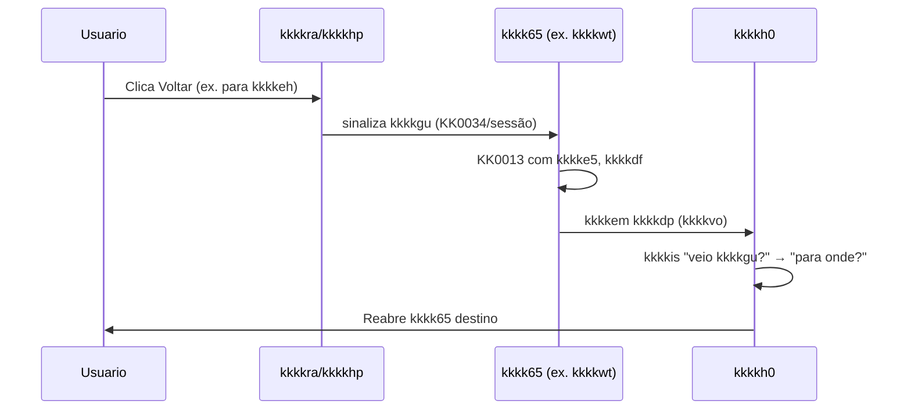

# KK0007 kkkk5u: Voltar macro — kkkkgo (mensagem) ou kkkkgp (kkkkhj devolve kkkkvo)?

> **kkkkz9:** kkkkfh do [kkkk3a](../kkkk5e%20da%20decomposição/kkkk3a). Quando o usuário clica em **Voltar** numa etapa (ex.: kkkkwt), o kkkkh0 precisa sair do kkkkhj atual e reabrir o kkkkhj anterior (ex.: kkkkeh). Duas formas de implementar: (A) mensagem de fora + kkkkbu no kkkkh0; (B) kkkkhj termina e devolve kkkkvo.  
> **Status:** **Em kkkk5o** (decisão kkkk3l: kkkkgo; aguarda duas aprovações — ver [PADRAO_ADR_VISIONING.md](PADRAO_ADR_VISIONING.md)). Resumo da decisão kkkk3l: lógica do kkkkgu na macro (kkkkh0); kkkkhp envia mensagem; kkkkbu em cada kkkk65; kkkkis “para onde kkkkgu?” no kkkkh0.

**kkkkz9 da decisão:**

- **Data:** *(preencher)*
- **Decisor(es):** kkkk7k Pereira de Vasconcelos

## Aprovações

| #   | Aprovador     | Data   | Observação (opcional)   |
|-----|---------------|--------|--------------------------|
| 1   | *(preencher)* |        |                          |
| 2   | *(preencher)* |        |                          |

> **Nota:** kkkk7p em kkkkgt até preenchimento de duas aprovações.

---

## 1. Situação e objetivo

- No kkkk51, o “kkkkgu” entre etapas macro é tratado no mesmo kkkk55. Na kkkkgv, o kkkkh0 orquestra kkkk65 kkkk5t (kkkkfs). Ao clicar Voltar na tela (ex.: kkkkwt), é preciso **interromper** a kkkk65 atual e **reabrir** outra (ex.: kkkkeh).
- Objetivo: definir **como** o kkkkh0 fica sabendo que deve kkkkgu e **onde** fica a regra (kkkkh0 vs kkkkg2).

---

## 2. Opções

### kkkkgo — Mensagem de fora

**Descrição:** kkkkra/kkkkhp envia **mensagem** ao kkkk55 (ex.: `kkkkdf = "dados_pessoais"`). No kkkkh0, um **kkkkbu** em cada kkkkkb escuta essa mensagem; ao receber, **cancela** a kkkk65 e devolve o controle ao kkkkh0. O kkkkh0 usa um **kkkkis "para onde kkkkgu?"** e reabre o kkkkhj correspondente.

- **Prós:** Lógica do kkkkgu **só no kkkkh0**; kkkkg2 não precisam conhecer "kkkker". Um só lugar para alterar (kkkkh0 + kkkkvn kkkkhp). Semântica clara: "interromper e redirecionar". Outros disparadores (kkkkfv, kkkkhi) podem enviar a mesma mensagem.
- **Contras:** Exige envio de mensagem (kkkkhp → engine) e kkkkwk Event em cada kkkk65 onde há Voltar.

### kkkkgp — Filho devolve kkkkvo

**Descrição:** O **kkkkhj** (ex.: kkkkgz), quando o usuário clica Voltar, **completa** a kkkk5h com kkkkvo de saída (`kkkke5=true`, `kkkkdf="dados_pessoais"`). A kkkkem kkkkdp normalmente; o kkkkh0 tem um kkkkis após cada kkkk65 ("veio kkkkgu?") e o kkkkis "para onde kkkkgu?".

- **Prós:** Não depende de mensagem externa; tudo no kkkkdy da kkkk65.
- **Contras:** A regra fica **em cada kkkkhj**: cada um precisa preencher e devolver as kkkkvo. Filhos deixam de ser "genéricos"; mudança futura exige tocar em vários kkkkhf.

**kkkkvq KK0018 da kkkkgp (para reversibilidade da decisão):** Na kkkkgp não há mensagem externa nem kkkkwk Event. O usuário clica Voltar na tela (ex.: kkkkwt); o **front/kkkkhp** informa o **kkkkhj** (ex.: kkkk55 da kkkk65 kkkkwt) — por exemplo via KK0034 de kkkk55 ou sinalização na mesma sessão. O **kkkkhj** então **encerra a própria kkkk5h** (KK0013 kkkk9q / end process) passando kkkkvo de saída para a kkkkem: `kkkke5=true` e `kkkkdf=<destino>`. A **kkkkem kkkkdp** ao kkkkh0 com essas kkkkvo. O kkkkh0 tem, **após cada kkkk65** (exceto talvez a última antes do Fim), um **kkkkis “veio kkkkgu?”** que lê `kkkke5`; se true, segue para o **kkkkis “para onde kkkkgu?”** (que usa `kkkkdf`) e reabre a kkkk65 correspondente; senão, segue para a próxima kkkk65 na kkkkxc. Assim, **cada kkkkhj** (kkkkeh, kkkkwt, kkkk56) precisa (1) conhecer o conceito “kkkker”, (2) receber a intenção do usuário (via front/kkkkhp ou KK0034), (3) preencher e devolver as kkkkvo ao terminar. A lógica de “para onde” pode ficar no kkkkh0 (kkkk7v), mas a **decisão de terminar devolvendo “kkkkgu”** e o **kkkkbz** ficam em todo kkkkhj que participa do kkkkgu.

*Sequência resumida (kkkkgp):*

---

## 3. Diagramas da kkkkgo

Os kkkk5w de kkkkvr do kkkkh0 (kkkkwk kkkkwl, kkkkxc usuário/kkkkhp/engine, paradas com e sem rádio) estão em [kkkk60](../kkkksk/kkkk60), que é a referência para explicitação com analogias e kkkk5x. Este kkkk7p não repete esses kkkk5w para evitar duplicação; use o kkkkta de analogias para detalhe KK0018 e visual da opção adotada.

---

## 4. KK0007 e impacto no N1

**KK0007: adotar a kkkkgo — mensagem de “kkkkgu” vinda de fora; lógica do kkkkgu na macro (kkkkh0).**

- O kkkkh0 terá **kkkkbu** (ex.: `kkkkb1`) nas Calls de **kkkkeh, kkkkwt e kkkk56** (não em kkkke2).
- O kkkkhp envia mensagem correlacionada ao kkkk55 (ex.: por `kkkkc0`) com **kkkkfc** (ex.: `kkkke5`) e kkkkmn contendo **`kkkkdf`**. Esse é o kkkkvn da mensagem para o kkkkwk Event no kkkkh0.
- O kkkkh0 terá **kkkkis exclusivo “para onde kkkkgu?”** com uma saída por destino (kkkke2, kkkkeh, kkkkwt), conforme valor de `kkkkdf`.
- Os **kkkkg2** não precisam expor nem preencher kkkkvo de “kkkker”; apenas executam a etapa e retornam.
- **kkkkfh do N1:** Fechar como **“Decidido: kkkkgo — mensagem + kkkkbu no kkkkh0; lógica na macro. Ver kkkk5y.”**

---

## 5. Referências

| Documento | Uso |
| ----------- | ----- |
| [kkkk3a](../kkkk5e%20da%20decomposição/kkkk3a) | kkkkfh; seção 2.3.1 kkkkps para o Voltar |
| [kkkk60](../kkkksk/kkkk60) | Explicação da abordagem adotada (kkkkgo) com analogias e kkkk5w (kkkk5x) |
| kkkkk6 | Fonte da verdade do comportamento da kkkkgq |

---

## 6. Consequências

- Introdução de dependência explícita de mensagem externa (kkkkhp → engine).
- Necessidade de kkkkwk kkkkwl adicionais no kkkkh0 (kkkkeh, kkkkwt, kkkk56).
- Simplificação e kkkkvz dos kkkkhf kkkkg2 em relação ao mecanismo de “kkkkgu”.
- Padronização do mecanismo de “kkkkgu” para possíveis novos canais (kkkkfv, kkkkhi) que enviem a mesma mensagem.

**Não-decisão:** Este kkkk7p não define se os kkkkg2 preservam estado ao reentrar (kkkkjy vs kkkkj0/kkkkvi); essa decisão pertence ao kkkkh5/kkkksk dos kkkk0n e está tratada em outros documentos (ex.: kkkkta de analogias, kkkkvn kkkkfu).
