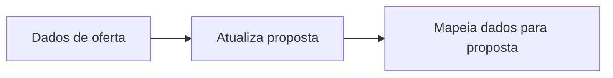
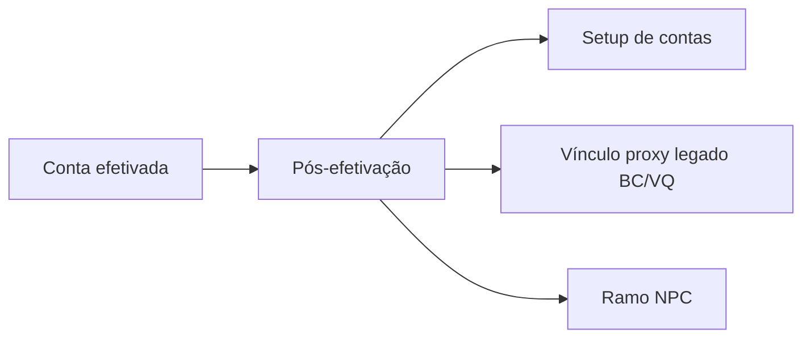

## CO8 / Camunda — Múltiplo NPC — guia objetivo (negócio)

Objetivo: explicar de forma objetiva o que muda no CO8 para habilitar o cartão Múltiplo na plataforma NPC.

---

## Resumo (1 minuto)

- A oferta do cartão NPC vem do Direcionador. O CO8 precisa salvar isso na proposta no momento do "Dados de oferta".
- Depois que a conta foi efetivada, quando for NPC, o CO8 NÃO pode seguir o fluxo legado de vínculo de proxy (BC/VQ).
- Para NPC, o CO8 deve executar um fluxo próprio: validar proxy NPC e chamar a formalização.

---

## O que muda (3 mudanças)

1) Dados de oferta (oferta do cartão)
   - Salvar dados do cartão NPC na proposta.
   - Salvar `id_intencao`.
   - Usar o limite do Direcionador como limite final do cartão (PUC fica para LIS).

2) Pós-efetivação (proxy e formalização)
   - Se for NPC, executar: validar proxy NPC -> formalização.

3) Desvio do legado
   - Se for NPC, não executar o fluxo legado de "Vínculo Proxy" (BC/VQ).

## Complete de Dados de oferta (campos para esta demanda)

Contrato BFF para CO8 no fechamento da tela Dados de oferta: os nomes abaixo são os combinados no refinamento; ajuste fino de nomenclatura fica com BFF e Setup.

O que precisa constar no complete (negócio):

1) Identificação da jornada NPC  
   - Indicar que a oferta de cartão é na plataforma NPC (flag ou equivalente), para o processo decidir ramo pós-efetivação e não mandar para vínculo proxy legado.

2) Identificador da intenção de cartão  
   - O id da intenção devolvido pelo Direcionador, para reutilizar na formalização sem nova consulta ao Direcionador.

3) Limite final do cartão  
   - O limite de cartão definido na resposta do Direcionador (no BFF entra como limite do Direcionador; no CO8 o motor passa a tratar esse valor como limite máximo de cartão da proposta, em substituição ao pré-aprovado de cartão que veio da PUC).

4) Pacote de produto e plano  
   - O que já existe para montar oferta de produtos no processo (produto, plano, identificadores que a efetivação e o setup esperam). Incluir o bloco específico da oferta NPC no mesmo padrão do bloco já usado para AD (objeto dedicado no payload), propagado nos três pontos: Dados de oferta, atualização de perfil na proposta e mapeamento de dados de pessoa e ofertas.

5) Dados de proxy para NPC (quando aplicável)  
   - Informações necessárias para a validação de proxy NPC depois da efetivação; devem estar disponíveis nas variáveis do processo após o complete (detalhe de contrato da API de validação a fechar com dono do serviço).

Fora do escopo imediato do complete (MVP / refinamentos citados):

- Gratuidade, descontos e condições comerciais extras: não foram tratados como obrigatórios no CO8 nesta demanda; se o BFF retirar do payload, o processo não depende delas para a regra acima.
- Limite mínimo e regras finas de PUC para cartão: limite operacional do cartão no piloto vem do Direcionador no complete; LIS de conta segue fonte PUC.

## Onde mexer (pontos do fluxo)

- Ponto 1: "Dados de oferta" (onde salva a oferta e o que será usado depois)
- Ponto 2: "Pós-efetivação" (onde hoje roda setup + vínculo proxy legado)

Na pós-efetivação, para NPC, criar um ramo novo e desviar do vínculo proxy legado.

---

## Passo a passo (objetivo)

1) Definir como o processo identifica "é NPC" (flag ou objeto na proposta).
2) Em "Dados de oferta", salvar na proposta: dados do cartão NPC, `id_intencao` e limite final do cartão (do Direcionador).
3) Garantir que o que foi salvo em "Dados de oferta" fica disponível para o resto do fluxo (proposta e variáveis).
4) Na pós-efetivação, quando for NPC, desviar do "Vínculo proxy legado (BC/VQ)".
5) No ramo NPC, chamar a validação de proxy NPC.
6) Se OK, chamar a formalização.
7) Garantir que, ao final, o setup/consumidores downstream leem da proposta os dados do cartão NPC.

## Checklist (para validar com negócio/QA)

- A oferta de cartão no NPC aparece igual ao que veio do Direcionador.
- O limite final do cartão é o do Direcionador (sem divergência com PUC).
- No complete de Dados de oferta chegam: indicador NPC, id da intenção, limite do Direcionador, pacote produto/plano com bloco NPC e dados de proxy NPC quando houver.
- O processo, quando NPC, não executa o vínculo proxy legado (BC/VQ).
- O processo, quando NPC, executa validar proxy NPC e formalizar.

## Apêndice técnico (só para quem implementa)

- "Dados de oferta": `dados_oferta` -> `proposta_oferta` -> `script_mapeia_dados_oferta`
- "Pós-efetivação": `proposta_efetiva_conta` e gateway `Gateway_11349uj`
- "Vínculo proxy legado": subprocesso `Activity_0bj2jjf`
- Complete / variáveis citadas no refinamento (alinhar com BFF antes de codar):
  - `id_intencao`
  - `limite_cartao_direcionador` (entrada do complete usada para sobrescrever `valor_limite_maximo_cartao`)
  - flags ou objeto que identifique oferta NPC (ex.: `is_npc`, `oferta_npc` conforme contrato final)
  - `oferta_produto`, `oferta_ad` já existentes; adicionar `oferta_npc` nos mesmos três pontos que o AD
  - proxy NPC: `proxy_npc` ou equivalente nas tasks novas de pós-efetivação; confirmar inputOutput no BPMN quando as tasks existirem
