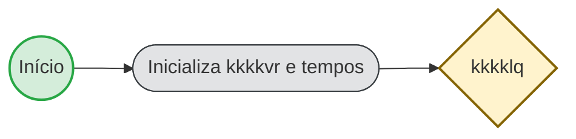

# Parte 1 — Início e identificação da kkkkgq (guia)

**O que é esta parte:** é o **pontapé inicial** da kkkkgq no motor de kkkk55. Nenhuma tela é exibida ao usuário: o kkkk55 apenas **inicializa kkkkvo** que vão identificar o kkkkvr (kkkksg), o canal/subfluxo (ex.: kkkkve, Laranjinha) e os **tempos usados no kkkkyo** (20 min por inatividade, 22 dias no sistêmico). Em seguida o kkkkvr segue para a pergunta "kkkklq".

**Fonte da verdade:** `kkkkk6`

---

## 1. Objetivo

Garantir que, ao iniciar uma kkkkuy de kkkklh, o kkkk55 já tenha definido **quem é a kkkkgq** (kkkkvr/subfluxo) e **quanto tempo** o usuário pode ficar parado em uma tela antes de a kkkk3l ser expurgada. Quem de fato dispara a abertura da kkkk3l (tela "kkkkdi", kkkkhp, etc.) não está modelado no kkkkhk; isso fica na implementação.

---

## 2. O que acontece na prática

1. **kkkkyb da kkkk3l** — Alguém (kkkkxv ou usuário) inicia a kkkk5h do kkkk55. No kkkkhk não está definido quem; na kkkksk atual costuma ser o kkkkra → kkkkhp (e eventualmente uma camada intermediária) → motor de kkkk55.

2. **Script de inicialização** — O kkkk55 executa uma única tarefa automática (script) que define:
   - **kkkkvr** = sempre `kkkksg`
   - **tempo de decurso do usuário** = 20 minutos (usado depois no kkkkyo quando o usuário fica parado em uma tela)
   - **tempo de decurso sistêmico** = 22 dias
   - **canal (subfluxo)** = se já tiver sido enviado no start, mantém; senão usa kkkkve
   - **tipo de dispositivo** = se o canal for Laranjinha, marca como Laranjinha
   - **KK0021 da unidade de kkkkag** (valor fixo do kkkk55)

3. **Próximo passo** — O kkkkvr segue para o kkkk7v **"kkkklq"**, que direciona para a kkkkvg/kkkkxg (Parte 5).

Nenhum dado é preenchido pelo usuário nesta etapa; o canal pode vir do kkkkxv que iniciou o kkkk55; os demais valores são fixos no script.

---

## 3. Resumo para gestores, QA e PO

| O quê | Detalhe |
| ------- | -------- |
| **O que o usuário vê** | Nada: é etapa automática antes da primeira decisão ("kkkklq"). |
| **Variáveis definidas** | kkkkvr (kkkksg), kkkk45 (ex.: kkkkve), tempos de kkkkyo (20 min / 22 dias), KK0021 unidade de kkkkag. |
| **Quem starta** | Não está no kkkkhk; na prática costuma ser kkkkra → kkkkhp (e eventualmente camada intermediária) → motor. |
| **Saída** | kkkkvq segue para "kkkklq" (kkkkvg). |

---

## 4. kkkk5v (visão geral)

*Verde = início; azul = user kkkk9q; cinza = service/script; amarelo = kkkk7v; vermelho = fim; seta tracejada = kkkkgu (ou exceção).*

---

## 5. Pontos de atenção

- O **identificador da kkkkgq** (ex.: XXX, XXX-XXX) **não** é definido nesta parte; é calculado mais à frente no kkkkvr, a partir do canal (subfluxo).
- Para detalhes técnicos (kkkk5j dos elementos, kkkkvo exatas, referências no kkkkhk), use o **FLUXO_01_tecnico.md**.
