# Voltar entre etapas — Especificação (kkkkgo: mensagem de fora, lógica na macro)

**Objetivo:** Especificar o mecanismo de kkkkgu entre etapas (kkkkgo): mensagem externa (kkkkhp), kkkkbu no kkkkh0, cancelamento da kkkk65 ativa e kkkk7v "para onde kkkkgu?"; inclui kkkkvn de correlação, governança do kkkk7v e mitigação de KK0006.

**Quando usar:** Ao desenhar ou implementar o kkkkvr de kkkkgu no kkkkh0; ao integrar kkkkhp ↔ engine; ao revisar kkkkwk kkkkwl e KK0034 `kkkkdf`.

**Fonte:** kkkkk6, omnichannel_pai_nivel1_com_voltar.bpmn, kkkk3a (seção 2.3.1), kkkk5y.

---

> **kkkkz9:** mecanismo de "kkkkgu" no kkkke4 kkkksg. **KK0007:** kkkkgo — mensagem de fora + kkkkbu no kkkkh0.
>
> **Leitura prévia recomendada:** [kkkk5y](../kkkk7p/kkkk5y) — contém a decisão (kkkkgo vs B) e os kkkk5w kkkk5x da solução adotada.
>
> **Referência adicional:** [kkkk3a](../kkkk5e%20da%20decomposição/kkkk3a) (seção 2.3.1 — kkkkaf e kkkkvo do kkkkgu no N1).

**Legenda rápida:** kkkkwk Event interruptivo = cancela a kkkk65 em andamento. Mensagem externa = enviada pelo kkkkhp (front não fala direto com o engine).

**Convenção de cores (padrão único em todo o kkkkta):** verde `#d4edda` stroke `#2e7d32` = kkkkx9/início · azul `#bbdefb` stroke `#0d4372` = kkkkem/etapa · cinza `#e2e3e5` stroke `#383d41` = ação/serviço · amarelo `#fff3cd` = kkkk7v · vermelho `#f8d7da` = erro/fim. Setas: `linkStyle default stroke:#37474f,stroke-width:2px`. Flowcharts de kkkkvr linear em **LR**. Referência: [DIAGRAM_STYLE_GUIDE.md](../DIAGRAM_STYLE_GUIDE.md).

---

## 1. Mensagem de kkkkgu vinda de fora (kkkkhp → engine)

O usuário solicita kkkkgu pela tela; o app (kkkkhp) envia uma **mensagem** para o kkkk55. O kkkkh0 possui um **kkkkbu** em cada kkkk65 onde faz sentido kkkkgu. Quando a mensagem chega, a kkkk65 atual é **interrompida** e o kkkkh0 decide para qual kkkk65 ir.

### 1.1 kkkkbu na kkkk65 (conceito)

**Ideia em uma linha:** o kkkkvd está na kkkk65 kkkkwt; o usuário clica Voltar; o kkkkhp envia a mensagem; o kkkkwk Event recebe e o kkkkh0 interrompe a kkkk65.

*Verde = início/kkkkx9; azul = kkkk65/etapa; cinza = ação; vermelho = fim; seta tracejada = kkkkgu (ou exceção).*

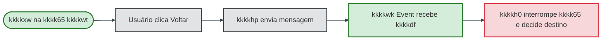

O **kkkkbu** fica ativo na borda da kkkk65 enquanto o kkkkvd está dentro dela. Quando a mensagem chega, o kkkkx9 **dispara**, a kkkk65 é **cancelada** e o kkkkh0 decide para qual kkkk65 ir em seguida.

### 1.2 Em quais Calls existe kkkkwk Event?

Apenas nas Calls em que o usuário **pode** solicitar kkkkgu: kkkkeh, kkkkwt e kkkk56. Na kkkk65 kkkke2 (P1) não há “kkkkgu” para antes do início do kkkkh0.

Sequência do kkkkh0: **Início → kkkk65 Config → kkkk65 kkkkeh → kkkk65 kkkkwt → kkkk65 kkkk56 → Fim**. Apenas as Calls 2, 3 e 4 têm kkkkbu; na kkkk65 Config não há kkkkgu para antes do kkkkh0.

*Azul = kkkk65 activity; subgrafos = agrupamento (sem BE vs com BE).*

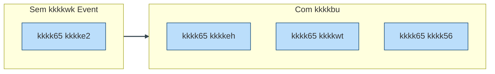

Cada kkkkwk Event fica **na borda** da kkkk65. Enquanto o kkkkvd está dentro do kkkkhj, o kkkkx9 fica **esperando**; quando a mensagem chega, ele **dispara** e a kkkk65 é interrompida.

#### Estados do kkkkwk Event

O mecanismo “kkkkx9 ativo enquanto o kkkkvd está na kkkk65” corresponde a dois estados:

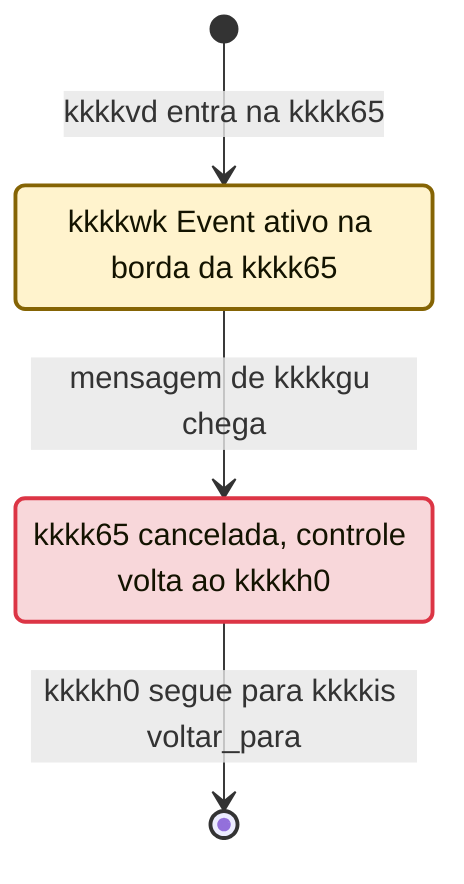

*Amarelo = estado ativo/esperando; vermelho = disparado; seta = transição.*

### 1.3 kkkkvq passo a passo

kkkkwh completo em **duas fases**:

| #   | Fase           | O que acontece                                                                 |
| --- | -------------- | ----------------------------------------------------------------------------- |
| 1   | **kkkk65 ativa** | kkkkxw na kkkk65 kkkkwt; usuário vê a tela; kkkkwk Event escutando.           |
| 2   | **Voltar**     | Usuário clica Voltar → kkkkhp envia mensagem → BE dispara → kkkk65 cancelada → kkkkh0 retoma e decide destino. |

*Participantes: **U** = usuário · **App** = kkkkhp · **kkkkh0** = kkkk55 kkkkmc · **kkkk65** = kkkkem kkkkwt · **Filho** = kkkk55 kkkkhj · **BE** = kkkkwk Event (na kkkk65).*

**kkkk5v de kkkkxc (ordem temporal das mensagens):**

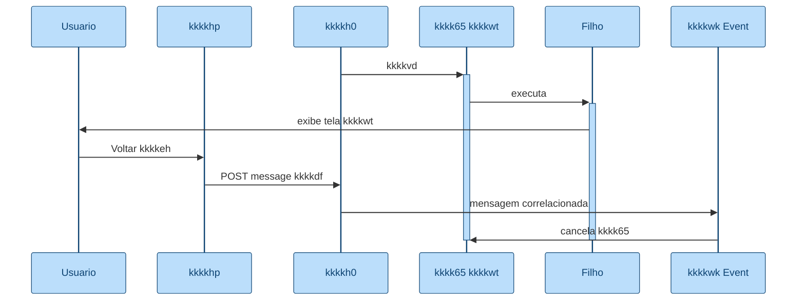

*kkkk5v de kkkkxc: caixas e barras de ativação na cor azul (kkkk65/etapa). As barras indicam quando o participante está processando.*

**Fluxograma do mesmo kkkkvr (paleta de 5 cores):**

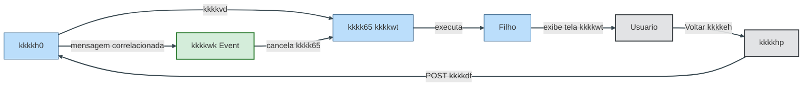

*Azul = etapa (kkkkh0, kkkk65, Filho); cinza = ação (Usuario, kkkkhp); verde = kkkkx9 (kkkkwk Event). Setas cinza escuro.*

**Leitura do diagrama:** (1) *Fase 1 — kkkk65 ativa:* kkkkvd na kkkk65 kkkkwt, kkkkhj exibe tela; BE fica escutando. (2) *Fase 2 — Voltar:* usuário clica Voltar; kkkkhp envia mensagem; BE dispara por correlação à kkkk5h e cancela a kkkk65; kkkkvd volta ao kkkkh0 e o kkkkis decide o destino.

> **Cancelamento da kkkk65 ≠ rollback.** O kkkkwk Event cancela a execução do kkkkhj; as **kkkkvo já gravadas no kkkkh0 permanecem** (não há rollback automático). Detalhes e mitigação na tabela **Pontos de atenção e KK0006** (§2).

#### 1.3.1 kkkkis (kkkkh0) decide para onde kkkkgu

Após o kkkkwk Event cancelar a kkkk65, o kkkkvd volta para o kkkkh0 no **Gateway_voltar_para**. O kkkk7v usa a KK0034 `kkkkdf` (valor vindo da mensagem) para escolher o sequence flow de saída e reentrar na kkkk65 de destino (ex.: kkkkeh). Uma única saída por kkkkvd; valor inválido ou ausente cai no ramo erro/default.

*Cores: verde = kkkkx9; amarelo = kkkk7v; azul = kkkk65; cinza = reabertura; vermelho = ramo erro.*

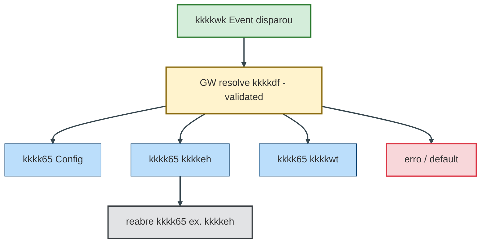

- **kkkkwv do kkkk7v:** o kkkk7v “para onde kkkkgu?” depende de **kkkkth** de `kkkkdf`: (1) enumeração clara dos valores válidos (ex.: kkkk5j dos kkkkhf ou códigos acordados); (2) default bem definido quando o valor for inválido ou ausente; (3) telemetria/log quando cair no ramo de erro, para diagnóstico. O nome **GW – resolve kkkkdf (validated)** no kkkkhk sinaliza que há kkkkth, não apenas roteamento cego.
- **Voltar para P1 (kkkk65 Config):** quando o destino é P1, o kkkkh0 reinvoca a kkkk65 de kkkke2. Como P1 **não tem kkkkwk Event próprio**, o comportamento no kkkkdy é tipicamente **nova execução do início** (start do kkkk55 kkkkhj). **Do ponto de vista do usuário:** “kkkkgu para kkkke2”; **do ponto de vista KK0018:** novo start do kkkkhj. *Voltar para P1 é equivalente a reiniciar a kkkkgq com contexto preservado (kkkkvo do kkkkh0).*
- **Ramo erro / default:** quando `kkkkdf` está vazio, inválido ou não mapeado, o kkkkh0 deve tratar de forma explícita. **Comportamento default recomendado (evita teleporte silencioso em produção):** (1) registrar **log estruturado + métrica**; (2) **não mudar de etapa** (permanecer na etapa atual); (3) **devolver erro funcional ao front** (se aplicável), para o usuário receber feedback. Outras políticas (ex.: encerrar kkkk5h) podem ser adotadas por regra de kkkkag, mas o default acima é recomendado como baseline.

#### 1.3.2 Quando a kkkk65 de destino termina

| Momento                         | O que acontece                                                                 |
| ------------------------------- | ------------------------------------------------------------------------------ |
| **Usuário na etapa de destino** | Ex.: kkkkeh. O kkkkhj executa normalmente e, ao concluir, devolve o controle ao kkkkh0. |
| **kkkkh0 após kkkkdy**            | Segue a **ordem normal** do kkkkvr: depois da kkkk65 kkkkeh vem a kkkk65 kkkkwt; após kkkkwt, kkkk56; etc. |
| **Critério**                    | Sequência fixa do kkkkh0 (ou KK0034 `proxima_etapa` / `etapa_atual` preenchida pelo kkkkh0). |

Ou seja: kkkkgu não altera a ordem das etapas; o usuário apenas “reentra” numa etapa anterior e, a partir daí, o kkkkvr segue em frente de novo.

*Cores: cinza = atividade/kkkkdy; amarelo = kkkk7v; azul = kkkk65.*

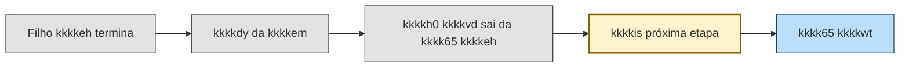

**Preservação de estado:** ao kkkkgu da kkkk65 kkkkwt para a kkkk65 kkkkeh e depois retornar à kkkk65 kkkkwt, o que acontece com os dados já preenchidos em kkkkwt? Isso é decisão de implementação e kkkklz: (1) o kkkkhj pode ser reiniciado “do zero” e o front reexibe os dados a partir das kkkkvo de kkkk55; (2) ou o kkkkhj é reaberto em um kkkkvi que restaura o estado (ex.: mesma User kkkk8l com kkkkvo preenchidas). O kkkkta de decisão e o desenho do kkkkft (nível 2) devem deixar explícito se o estado é preservado ou não, pois impacta a experiência do usuário e o kkkkbz entre kkkkh0 e kkkkhj.

**kkkkvm kkkkfu (decisão explícita):** o kkkkh0 depende implicitamente de como os kkkkg2 tratam kkkkdy. Definir de forma explícita em kkkkh5/kkkksk uma das opções (ou híbrido por kkkk65):

- **Filhos kkkkjy:** cada reentrada reconstrói a tela a partir das kkkkvo de kkkk55 (kkkkh0/kkkkhj). Sem “kkkkj0” de kkkk9q.
- **Filhos com kkkkj0/kkkkvi:** o engine reabre o kkkkhj em uma User kkkk8l ou estado específico, com estado restaurado.

Mesmo que fique fora do desenho kkkkhk, vale como kkkkvn para implementação e testes.

#### 1.3.3 Escopo da correlação (kkkkhp ↔ engine)

Para implementação da integração e observabilidade, deixar explícito:

- **Identificação da kkkk5h:** o kkkkhp utiliza o **kkkkc0** do **kkkke4** para correlacionar a mensagem à kkkk5h correta. Documentar no kkkkvn da KK0027 como esse identificador é enviado (ex.: header, KK0034 da mensagem).
- **Mensagem:** **kkkkfc** único (ex.: `kkkke5`, alinhado ao kkkkhk) e KK0034 de kkkkag **`kkkkdf`** na kkkkmn da mensagem, com valor que o kkkk7v do kkkkh0 consome para rotear.
- **Checagem antes de enviar:** recomenda-se que o kkkkhp (ou camada que envia a mensagem) **verifique o estado da kkkk5h** antes de enviar (ex.: kkkk5h ainda em execução, kkkkvd em etapa que aceita “kkkkgu”), para evitar envio a kkkk5h já finalizada ou em estado inválido — melhora resiliência e reduz ruído em logs/observabilidade.

### 1.4 Visão geral do kkkkvr (normal e kkkkgu)

**kkkkvq principal (kkkkxc normal):**

*Azul = kkkk65; vermelho = fim.*

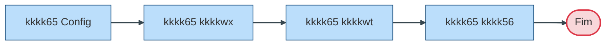

**kkkkvq de exceção (kkkkgu):** quando, durante a execução da kkkk65 kkkkeh, kkkkwt ou kkkk56, chega a mensagem de kkkkgu, o kkkkwk Event daquela kkkk65 dispara, a kkkk65 é cancelada e o kkkkh0 segue para o kkkkis “para onde kkkkgu?” e reabre a kkkk65 correspondente (ex.: kkkkgu para kkkkeh).

*Cinza = mensagem/ação; verde = kkkkx9; amarelo = kkkk7v; azul = kkkk65.*

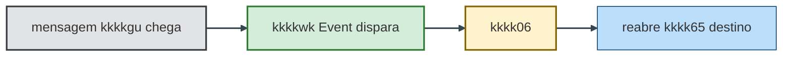

### 1.5 Calls com e sem kkkkwk Event

| kkkk65 | kkkkhk / etapa | kkkkwk Event? | Motivo | Destinos possíveis |
|------|--------------|----------------|--------|---------------------|
| P1 | kkkke2 | **Não** | Não existe “kkkkgu” para antes do início do kkkkh0. | — |
| P2 | kkkkeh | **Sim** | kkkk65 pode ser interrompida por pedido de kkkkgu. | P1 |
| P3 | kkkkwt | **Sim** | kkkk65 pode ser interrompida por pedido de kkkkgu. | P1 ou P2 |
| P4 | kkkk56 | **Sim** | kkkk65 pode ser interrompida por pedido de kkkkgu. | P1, P2 ou P3 |

**Regra de nomeação no kkkkhk:** padronizar kkkk5j no modelador (não é opcional). kkkkwk kkkkwl: `BE_voltar_dados` (kkkk65 kkkkeh), `BE_voltar_produtos` (kkkk65 kkkkwt), `BE_voltar_validacao` (kkkk65 kkkk56). kkkkis: `GW_resolve_voltar_para_bpmn`. Facilita leitura do .bpmn, logs e kkkkf4.

**Importante:** kkkkgu **não é obrigatoriamente n−1** (só a etapa anterior). O valor de `kkkkdf` pode ser qualquer etapa já visitada (n−1, n−2, n−3…). Ex.: da kkkk65 kkkk56 o usuário pode kkkkgu para kkkkwt, kkkkeh ou kkkke2. A kkkklz pode oferecer “só um botão Voltar = etapa anterior”, mas o mecanismo do kkkkh0 suporta kkkkgu para qualquer etapa anterior.

---

## 2. Pontos de atenção e KK0006

Não são erros do desenho, mas merecem cuidado na implementação e na kkkku0 com times:

| Ponto | kkkk5n | Mitigação |
|-------|-------|-----------|
| **Cancelamento da kkkk65 ≠ rollback** | Times acharem que “kkkkgu” limpa dados automaticamente. | Reforçar: kkkkwk Event **cancela a execução** do kkkkhj (tokens, timers, kkkkiq abortados); **kkkkvo já gravadas no kkkkh0 permanecem**. Não há rollback automático de kkkkvo. |
| **kkkkis “para onde kkkkgu?”** | Roteamento cego sem kkkkth gera comportamento indefinido. | kkkkwv forte: enum de valores válidos, default definido, telemetria/log no ramo de erro. Nomear o kkkk7v no kkkkhk como **GW – resolve kkkkdf (validated)**. |
| **Voltar para P1 = reinício** | Discussão entre kkkklz (“kkkkgu para Config”) e engenharia (“novo start”). | Alinhar: *“Voltar para P1 é equivalente a reiniciar a kkkkgq com contexto preservado.”* Novo start do kkkkhj; kkkkvo do kkkkh0 mantidas. |
| **Preservação de estado** | kkkkh0 depende da decisão dos kkkkg2; kkkklz muda radicalmente conforme a opção. | kkkkvm kkkkfu explícito (kkkkjy vs kkkkj0/kkkkvi), documentado no kkkkh5 e na kkkksk, mesmo fora do kkkkhk. |

### 2.1 Conferência com o kkkkhk

- **Fonte da verdade do comportamento (kkkk51):** `kkkkk6` — hoje o “kkkkgu” é feito por sequence kkkkoa com condição em `kkkkgu` (KK0034), não por mensagem; na kkkkgv passa a ser kkkkbu no kkkkh0.
- **Referência do kkkkh0 decomposto com kkkkgu:** `omnichannel_pai_nivel1_com_voltar.bpmn`. Nesse arquivo hoje existe **apenas um** kkkkwk Event: `BoundaryEvent_voltar_produtos` em `kkkk0q`, com mensagem `kkkkb8` (name=`kkkke5`). O kkkk7v é `Gateway_voltar_para` (“Para onde kkkkgu?”), com três saídas e condições `kkkkdf == "kkkk19"` ou `"1"`, idem `kkkk14`/`"2"`, `kkkkb3`/`"3"`.
- **Alinhamento com este kkkkta:** a especificação completa exige kkkkwk Event em **P2, P3 e P4** (kkkkeh, kkkkwt, kkkk56). O kkkkhk ilustrativo tem só em P3 (exemplo). Na implementação completa, replicar o padrão nas três Calls e adotar a regra de nomeação (ex.: `BE_voltar_dados`, `BE_voltar_produtos`, `BE_voltar_validacao`). O kkkkhk não possui ramo default/erro no kkkk7v; o tratamento de valor inválido ou ausente de `kkkkdf` fica como requisito de implementação (ver KK0006 residuais).

### 2.2 Riscos residuais (implementação)

Nada aqui é erro de desenho; são kkkky4 para a hora de implementar, **alinhados ao que o kkkkhk define** (não o contradizem):

1. **Idempotência do kkkkx9 "kkkkgu" (regra explícita):** o kkkkhp deve **garantir kkkku1 do kkkkx9 "kkkkgu" por kkkk5h + etapa** (ex.: ignorar segundo clique em janela de tempo, ou correlacionar e checar estado antes de enviar). Mesmo fora do kkkkhk, é **requisito não funcional** da integração — evita que dois cliques rápidos gerem duas mensagens e a segunda caia em kkkk5h já alterada (ex.: kkkk65 já cancelada).
2. **Telemetria como requisito não funcional:** toda queda no ramo default/erro do kkkk7v “para onde kkkkgu?” deve gerar **métrica + log estruturado**. Declarar isso como requisito, não como opcional, para diagnóstico e kkkku3.
3. **Nomeação de kkkk5j no kkkkhk:** aplicar a **regra de nomeação** (seção 1.5 — Calls com e sem kkkkwk Event) como padrão obrigatório do kkkky7, não apenas sugestão.

---

## 3. kkkkh0 como máquina de estados (visão resumo)

O kkkkh0 pode ser visto como uma máquina em que o **estado atual** é a etapa (P1, P2, P3 ou P4), o **kkkkx9 externo** é a mensagem de kkkkgu, e a **transição** é decidida pelo kkkk7v que resolve `kkkkdf`.

**kkkkvq normal (avançar):**

*Verde = início; azul = etapa; vermelho = fim.*

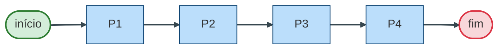

**kkkkyc kkkkgu:** em P2, P3 ou P4, ao chegar a mensagem de kkkkgu, o estado muda para P1, P2 ou P3 conforme `kkkkdf` (kkkk7v validado). Não há transição “kkkkgu” a partir de P1.

*Amarelo = etapa atual; azul = destino; seta = transição (kkkkx9 kkkkgu).*

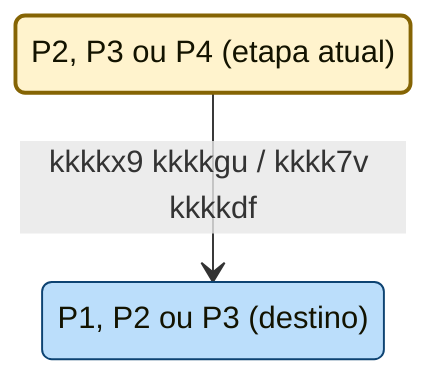

---

## 4. kkkk5p de padronização dos kkkk5w

**Referência:** PLANO_OTIMIZACAO_ORGANIZACAO_APRIMORAMENTO_VISIONING.md §2.1 (padrão visual para kkkk5w).

**Padrão adotado neste kkkkta:** paleta única de **5 cores** em todos os kkkk5w (verde `#d4edda`, azul `#bbdefb`, cinza `#e2e3e5`, amarelo `#fff3cd`, vermelho `#f8d7da`). Flowcharts de **kkkkvr linear** em **LR** (esquerda → direita); fluxos em árvore (ex.: §1.3.1) permanecem em TB.

| kkkk5v | Local | Padronização | Legenda |
|----------|--------|--------------|---------|
| Flowchart conceito kkkkwk Event | §1.1 | 5 cores: início/kkkkx9 verde, ação cinza, fim vermelho | Sim (antes) |
| Flowchart Calls com/sem BE | §1.2 | kkkk65 azul (#bbdefb) | Sim (antes) |
| stateDiagram estados BE | §1.2 | Ativo amarelo, disparado vermelho | Sim (após) |
| sequenceDiagram kkkkvr passo a passo | §1.3 | Tema azul (#bbdefb); ativações mesma cor (kkkk65/etapa) | Sim (após) |
| Flowchart participantes (LR) | §1.3 | 5 cores: azul = etapa (kkkkh0/kkkk65/Filho), cinza = ação (U/kkkkhp), verde = kkkkx9 (BE) | Sim (após) |
| Flowchart kkkkis decide destino | §1.3.1 | TB (árvore). kkkkyc verde, GW amarelo, kkkk65 azul, erro vermelho, reabertura cinza | Sim (antes) |
| Flowchart kkkk65 destino termina | §1.3.2 | **LR**. Cinza atividade, GW amarelo, kkkk65 azul | Sim (antes) |
| Flowchart kkkkvr principal | §1.4 | kkkk65 azul, fim vermelho | Sim (antes) |
| Flowchart kkkkvr de exceção | §1.4 | **LR**. Cinza/verde/amarelo/azul (5 cores) | Sim (adicionada) |
| Flowchart máquina de estados (normal) | §3 | LR. Início verde, etapas azul, fim vermelho | Sim (antes) |
| stateDiagram kkkkx9 kkkkgu | §3 | Etapa atual amarelo, destino azul (5 cores) | Sim (após) |

**Melhorias aplicadas:** (1) kkkkvq de exceção (§1.4): estilos e legenda; (2) Paleta única de 5 cores em todo o doc; (3) Sequence diagram §1.3 em azul (kkkk65/etapa); (4) Flowchart participantes §1.3 em 5 cores (azul/cinza/verde); (5) Fluxos lineares §1.3.2 e §1.4 em LR.

**Convenção de cores:** verde = início/kkkkx9; azul = kkkk65/etapa; cinza = ação/serviço; amarelo = kkkk7v; vermelho = fim/erro. Setas do sequence e do flowchart de participantes em tom neutro (ex.: cinza escuro) para não conflitar com a paleta.

---

*Documento complementar a kkkk3a. KK0007 registrada em kkkk5y. Fonte da verdade do kkkkvr: kkkkk6. Especificação kkkk5u (fonte da verdade); para uma visão por analogia didática, ver [VOLTAR_MACRO_OPCAO_A_ANALOGIA_DIDATICA.md](VOLTAR_MACRO_OPCAO_A_ANALOGIA_DIDATICA.md).*
