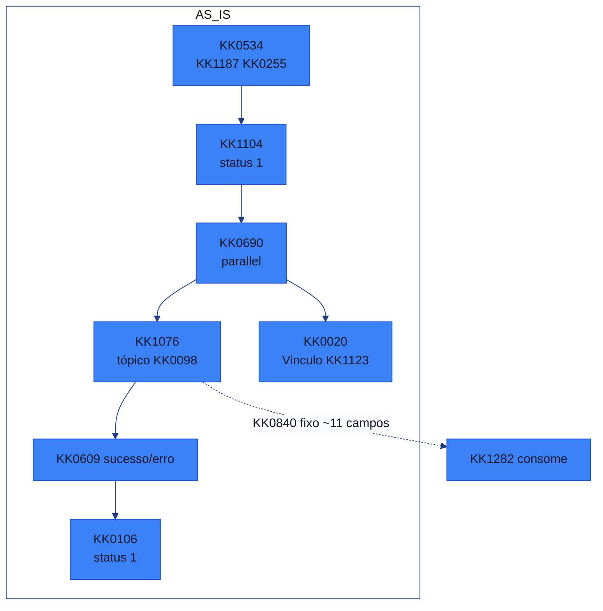
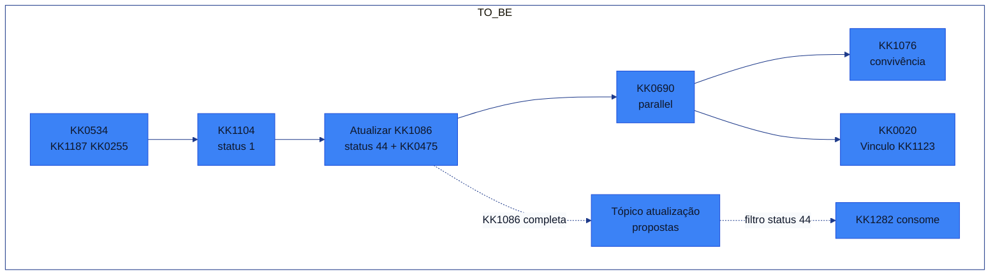
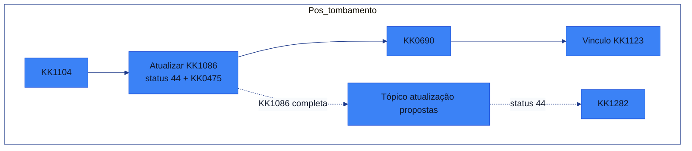
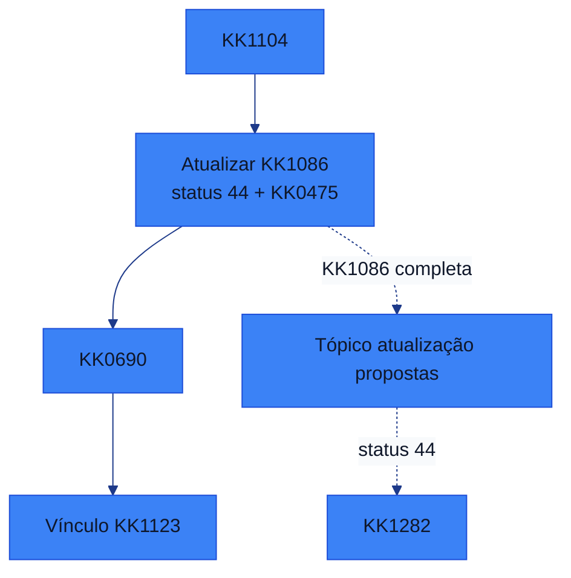

[ALINHAMENTO_CO8_SETUP_CONVIVENCIA_AGRO_B2B_GENERICO.md]
XXXXX
### Alinhamento KK0282 × KK1284 — Convivência Agro/B2B e Tópico de Atualização

---

### 1. KK0362 da KK1194

- **Objetivo principal**: alinhar como o ajuste do KK0282 para Agro/B2B (no início do KK0172) convive com o ajuste de KK1284 (no fim da KK0797, via novo tópico/KK0610 de KK0120/KK0350).
- **KK0598 KK1378**:
  - Comparação com o KK0651 KK0494 (`jornal do tapete laranja`) e reaproveitamento do padrão já implementado lá (`KK0473`, status 44, democratiza KK0809).
  - Criação de um **novo step** de atualização para KK1282 (convivência temporária com o step atual, sem desligar o KK0651 antigo de imediato).
  - Publicação do **JSON completo da KK1086** para o KK1354 de KK1282 decidir o que consumir.

---

### 2. Decisões e direcionamentos principais

- **2.1 Novo step de atualização para KK1282**
  - Não será alterado o step atual de atualização de KK1284; será criado **um novo step** no KK0172 para publicar o tópico/KK0610 de KK0120.
  - Os dois steps convivem por um período, permitindo que o KK1354 de KK1282 migre gradualmente o consumo para o novo tópico.
  - O KK1001 novo passa a enviar o **JSON completo da KK1086**, e o KK1282 decide quais campos usar.

- **2.2 Reaproveitamento do padrão da KK0494**
  - O desenho de KK1139 é o KK0651 KK0494 (`jornal do tapete laranja`), em especial o step `atualiza status KK1086 efetivada` implementado como `KK0473`.
  - O KK0282 replica a mesma abordagem:
    - uso de **status 44** como gatilho de KK0350,
    - inclusão do campo/estrutura de **democratiza KK0809**,
    - KK0473 de KK1086 como ponto de integração com o banco de dados AWS que guarda os dados do C8.

- **2.3 Estratégia de convivência de releases (KK0382 × Hentab/KK1282)**
  - Alterações da **KK0382 (Agro/B2B)** ficam **no início do KK0172**, logo após o KK0497/KK1251 — KK1201 maior de KK0157 toda a KK0797 em caso de erro.
  - Alterações da **Hentab/KK1282** ficam **no final da KK0797**, após a KK0547 — KK1201 localizado na pós-KK0797.
  - Entendimento comum:
    - A KK0382 tende a **impactar mais o KK1283** (bloqueio no começo, KK1086 não anda).
    - O KK1282 tende a impactar menos a KK0382 (problemas no fim da KK0797).
  - Direcionamento sugerido:
    - Priorizar a **subida de KK1284** (ajuste no tópico / step de atualização) antes da subida massiva de Agro/B2B,
    - Desde que o KK1026 de KK0736 e disponibilidade seja validado com Léo / liderança (backlog).

- **2.4 Uso de chave/feature toggle**
  - Alterações de Agro/B2B devem subir **sempre com chave**, permitindo:
    - ligar/desligar o comportamento novo sem quebrar o KK0651 atual,
    - homologar funcionalidade “desligada” e só habilitar quando o front e os consumidores estiverem prontos.
  - Possibilidade de chave centralizada (ex.: `kit-config`) para Agro e B2B, respeitando o padrão já adotado em outros projetos.

---

### 3. Estratégias de mitigação de KK1201 em KK0736

- **3.1 KK1025 A — Convivência no mesmo KK0172**
  - Todos sobem no mesmo KK0172 de KK0736:
    - KK0382 testa Agro/B2B com as chaves adequadas,
    - KK1282 testa o novo tópico/step de atualização com status 44.
  - Se o volume de erros for aceitável, mantêm-se os testes neste modelo.

- **3.2 KK1025 B — KK0172 de teste separado (KK1315)**
  - Se o começo do KK0651 (Agro/B2B) começar a travar a KK0797 para o restante dos times, adota-se:
    - criação de uma **“perninha”** no início do KK0172 principal com base em uma KK1424 de KK1315 (ex.: `subfluxo_atual = "teste"`),
    - desvio das propostas marcadas como teste para um **KK0172 de teste dedicado** (`teste parcial`), onde ficam Agro/B2B,
    - KK0736 normal segue no KK0172 principal sem impacto das alterações mais arriscadas.
  - Essa estratégia já foi usada anteriormente e é considerada válida para isolar testes de features novas.

- **3.3 Uso de cores/indicadores visuais no KK0172**
  - Itens novos (caixinhas, passos) são destacados visualmente (ex.: cor roxa) no KK0492 para facilitar:
    - KK1134 de que partes do KK0651 podem impactar outros times,
    - KK0311 na hora de analisar incidentes em KK0736.

---

### 4. Pendências e alinhamentos futuros

- **4.1 Priorização e janela de KK0736**
  - Depende de definição de Léo e demais responsáveis de backlog:
    - quando Agro/B2B pode ser colocado em KK0736 com foco total,
    - se o KK1026 é **subir primeiro o KK1282** e depois Agro/B2B ou conviver desde o início.
  - A equipe ficou de:
    - validar com Léo (e demais stakeholders como Luna, Zé Léo, Pan),
    - registrar a decisão final no chat/backlog para todos os envolvidos.

- **4.2 Detalhamento de chaveamento e rollout**
  - Definir onde ficam as chaves de Agro/B2B (C8 × front × kit-config),
  - Confirmar o comportamento em cenários de:
    - C8 com chave desligada e front ligado,
    - KK1282 consumindo ou não o novo tópico enquanto o KK0651 antigo ainda existe.

- **4.3 Tratamento de erros KK0627 (ex.: Day 4 / external KK1332)**
  - Há apontamentos de erro de KK0544 em Day 4:
    - external KK1332 entra em loop de reexecução sem log claro do que está sendo enviado/recebido.
  - A KK0065 inicial indica que o problema não é do KK0172 do KK0282 (mesmo com KK0172 revertido de volta à versão de produção):
    - KK1354 se comprometeu a envolver o KK1354 KK1175 pelo Day 4 para KK0065 mais profunda,
    - resultado dessa KK0065 será importante para liberar a subida futura da KK0382 (MFE confirmações, etc.).

---

### 5. Resumo executivo

- **Novo step de atualização para KK1284** será criado, convivendo com o step atual e enviando o **JSON completo da KK1086**, tomando como KK1139 a KK0759 já existente na KK0494 (status 44 + democratiza KK0809).
- **KK0382 (Agro/B2B)** tem maior potencial de impacto por atuar no início do KK0651; por isso, o grupo entende que, sempre que possível, **KK1282 deve subir primeiro**, e Agro/B2B deve entrar com **chave/feature toggle** e, se necessário, em KK0172 de teste separado.
- Foi acordado um **KK1026 faseado de convivência**, com KK1026 B (KK0172 de teste) se a KK0736 começar a ficar muito instável, e ficou pendente a KK1406 de prazos/priorização com Léo e demais responsáveis de backlog.

KK0101

$$$$$

[ALINHAMENTO_CO8_SETUP_VALIDACOES_GENERICO.md]
XXXXX
### Alinhamento KK0282 × KK1284 — KK1412 Prioritárias e Pós-KK0758

---

### 1. Objetivo

Registrar, de forma objetiva, **quais KK1039 precisam ser validados agora com o KK1282** para viabilizar o consumo do KK1381 (status 44) e **quais podem ficar para uma segunda etapa**, após a KK0759 inicial.

---

### 2. Itens prioritários para KK1406 com KK1282 (antes / durante a implantação)

#### 2.1 DN + plataforma múltiplo (KK1465 / KK0921)

- **O que validar**
  - Regra de DN para cada plataforma:
    - KK1465: usar `KK0518`.
    - KK0921: usar `KK0944`.
  - Regra de plataforma:
    - `KK0972` com **KK1475 = KK0921 / null = KK1465** como chave para diferenciar KK1465 vs KK0921.
- **Justificativa**
  - DN + plataforma definem **qual KK0651 interno** o KK1282 segue (tratamento KK1465 vs KK0921).
  - Qualquer erro aqui impacta diretamente KK1146 de KK0823, benefícios e KK1319 internos do KK1282.
  - A lógica “como tratar KK1465 vs KK0921” é **regra de KK0911 do KK1282**; o KK0282 apenas expõe os dados mapeados no JSON da KK1086.

**Resposta KK1282:** 

---

#### 2.2 Indicador de KK0981 (campo numérico + momento do KK0610)

- **O que validar**
  - Qual campo numérico será considerado KK1139:
    - `KK1414` **ou**
    - `KK1418`.
  - Se a regra **“valor > 0 = tem KK0981”** está aderente ao entendimento de KK0911 do KK1282.
  - Se, mesmo com as limitações já discutidas, o **status 44** é um momento aceitável para inferir KK0981.
- **Justificativa**
  - O campo deixa de ser `"S"/"N"` e passa a ser **numérico**, o que muda interpretação e KK1406.
  - O próprio KK1282 apontou que o KK0610 não é perfeito para responder “tem KK0981 ou não”, dado que o KK0981 pode mudar entre KK0936 e KK0544.
  - A decisão final sobre **como** e **quando** considerar que o KK0273 “tem KK0981” é de KK1167 do KK1282; o KK0282 garante apenas que os valores estarão presentes na KK1086.

**Resposta KK1282:** 

---

#### 2.3 `KK0484 = "KK0949"` (chave de rollout)

- **O que validar**
  - Que o KK1282 vai usar **exatamente** `KK0484 = "KK0949"` como chave de rollout para este KK0651.
  - Que a combinação `KK0484 + KK0746` na KK0633 atende ao cenário de convivência **KK1394 × tópico 44**.
- **Justificativa**
  - `KK0484` é a **chave de rollout** que controla quem vai para a solução nova vs antiga.
  - Valores divergentes (`"digital"`, `"fisico"` etc.) podem causar:
    - roteamento para a solução errada,
    - processamento duplicado,
    - bloqueio indevido na trilha antiga.
  - O mecanismo de rollout (KK0633, chave de configuração) está **do lado do KK1282**; o KK0282 garante a publicação constante de `"KK0949"`.

**Resposta KK1282:** 

---

#### 2.4 Status 44 como gatilho de consumo

- **O que validar**
  - Que o consumidor do KK1282 está filtrando **exclusivamente** `KK1309 = "KK0553"` (44) para este KK0651.
  - Que nenhum outro status deve disparar o mesmo tipo de processamento.
- **Justificativa**
  - O status 44 marca, para ambos os lados, o momento em que a KK0346 foi efetivada e em que a KK1086 pode ser tratada como **fonte de verdade**.
  - Consumir outros status pode gerar:
    - processamento antes da hora,
    - duplicidade de processamento,
    - comportamentos diferentes entre canais (KK0494 × KK1017).
  - A regra de quais status disparam carregamento é **configuração do consumidor**; o KK0282 garante apenas a publicação consistente com o status correto.

**Resposta KK1282:** 

---

#### 2.5 Enriquecimento de `KK0483` via KK0255

- **O que validar**
  - Que o KK1282 concorda em obter `KK0483` via `GET /KK0360/{KK0742} → KK1356` em vez de receber o detalhe diretamente no tópico.
- **Justificativa**
  - Muda a KK1167 de **enriquecimento de dados**: o tópico passa a trazer `KK0742` e o KK1282 passa a chamar o KK0255.
  - Impacta KK0084 e possivelmente desempenho/timeout do lado deles.
  - Embora não impeça a compreensão do KK1001 principal, é uma alteração direta no **KK0372 de consumo** do KK1282 e merece um “de acordo” explícito.

**Resposta KK1282:** 

---

#### 2.6 `KK0432` — formato e fuso

- **O que validar**
  - Formato final de `KK0432` a ser implementado no KK0282 (KK1086: timestamp único no padrão acordado com o KK1354 de plataforma / esquema do tópico, em UTC).
  - Se esse formato atende o consumidor do KK1282 (parse, timezone, armazenamento).
  - Se a concatenação `KK0431 + KK0737` é suficiente como origem.
- **Justificativa**
  - O campo já existe conceitualmente, mas o **formato exato** precisa ser fechado antes do desenvolvimento para evitar retrabalho.
  - Afeta diretamente logs, KK1133 e possíveis correlações internas do KK1282.
  - A KK1167 de gerar o valor é do KK0282; a de consumi-lo corretamente é do KK1282 — por isso o formato precisa ser validado entre as duas equipes.

**Resposta KK1282:** 

---

### 3. Lista para depois da KK0759 (não prioritária agora)

---

#### 3.2 Detalhamento KK0967 do KK1026 de KK1362 (KK1394 × tópico 44)

- **Para tratar em etapa posterior**
  - Quem convoca a decisão de desligar o KK1394.
  - Quem documenta o resultado da KK1406 em KK0736.
  - Critérios mínimos objetivos (volumetria, tipos de cenários, período de convivência).
- **Motivo para postergar**
  - O CA-06 já garante que o KK1362 só ocorre após KK1406 do KK1282.
  - Os detalhes operacionais podem ser definidos mais perto da fase de corte, com base em evidências dos testes.

**Resposta KK1282 (quando for o momento):** 

---

#### 3.3 Campos “futuro próximo” (PSA, PSI e demais atributos do JSON completo)

- **Para tratar em agenda específica de KK0911**
  - Quais campos adicionais do JSON completo o KK1282 pretende usar depois da KK0880.
  - Como esses campos impactam KK1319, segmentações e indicadores internos.
- **Motivo para postergar**
  - A própria estratégia definida foi **faseada**: primeiro garantir o que já existe (equivalência KK1394 × tópico 44), depois explorar o KK1001 “recheado”.
  - Não são bloqueadores para colocar o novo modelo em produção.

**Resposta KK1282 (quando for o momento):** 

---

#### 3.4 Documentação de premissas e campos removidos

- **Para consolidar em documentação pós-implantação**
  - Formalizar que `KK0293 = KK0002` deixa de trafegar e vira **KK1047** (“todos os eventos aqui são correntistas”).  
  - Listar campos removidos ou marcados como desnecessários (`KK1289`, `KK0295`, etc.).
- **Motivo para postergar**
  - A remoção já está aceita conceitualmente; o que falta é apenas o registro em KK0372/KK0521 de KK1139.
  - Pode ser feito em paralelo com a estabilização do consumo pelo tópico 44.

**Resposta KK1282 (quando for o momento):** 


$$$$$

[README_SETUP_CONTAS_GENERICO.md]
XXXXX
# KK1284 — Documentação da demanda

Documentação reunida da **demanda KK1284**: KK0880 do KK1282 para consumo do **KK1381** (status 44), em alinhamento KK0282/KK1017, KK0494 e KK1282 (Fiji). Todos os arquivos relacionados à demanda estão nesta pasta.

**KK0655 do KK0651:** `KK0953` (regra do KK1084).

---

## KK0522 nesta pasta

| Documento | Conteúdo |
|-----------|----------|
| **SETUP_CONTAS_VISAO_UNIFICADA.md** | Referência única: contexto, hoje vs demanda, KK0651 (KK0172), user KK1335, KK1168, KK0439, perguntas a esclarecer e guia de KK0759 passo a passo. |
| **KK1387** | User story: critérios de KK0009 (CA-01 a CA-08), KK0759 no KK0172 (Fase 1 e 2), anexo de KK0439 e requisito crítico `KK0484`. |
| **KK1287** | Transcrição estruturada da KK1194 KK1284 (Fiji ↔ KK0282): tópico, status 44, deparo de campos, KK1465/KK0921, KK0981, rollout. |
| **RELATORIO_REFERENCIA_CRUZADA_SETUP_INCOERENCIAS.md** | Cruzamento entre fontes (transcrições, USER_STORY, texto.md); incoerências (ex.: localização de `KK0972`) e lacunas. |
| **RELATORIO_CONSISTENCIA_SETUP_CONTAS.md** | Consistência do checklist (falat.txt) com KK1286, USER_STORY e transcrições (DN, KK0981, KK0484, etc.). |
| **ALINHAMENTO_CO8_SETUP_VALIDACOES.md** | Itens prioritários para KK1406 com KK1282 (DN, KK0981, KK0484, status 44, enriquecimento KK0255, KK0432) e lista para pós-KK0759. |

---

## Transcrições (fora desta pasta)

- **Transcrição bruta KK1194 KK1284:** `KK1366`
- **Alinhamento KK0282 (KK0860/KK0494/KK1282):** `KK1365`
- **Outros .txt de KK1283:** `transcricoes/KK1283.txt`, `transcricoes/setup_contas.txt` (quando existirem na raiz de transcricoes)

---

## Ordem de leitura sugerida

1. **SETUP_CONTAS_VISAO_UNIFICADA.md** — visão geral e KK1351.
2. **KK1387** — critérios de KK0009 e KK0759.
3. **KK1287** — detalhe da KK1194 e KK0440.
4. **ALINHAMENTO_CO8_SETUP_VALIDACOES.md** — o que validar com o KK1282.
5. **RELATORIO_CONSISTENCIA_SETUP_CONTAS.md** e **RELATORIO_REFERENCIA_CRUZADA_SETUP_INCOERENCIAS.md** — consistência e incoerências entre fontes.

---

## Observação

Cópias ou versões anteriores destes documentos podem existir em `documentacao/KK1439/Relatórios da atividade/`, `documentacao/KK1439/KK0084/` e `transcricoes/transcricao_setup_contas/`. **A KK1139 para a demanda KK1284 é esta pasta** (`documentacao/KK1284/`).

$$$$$

[RELATORIO_CONSISTENCIA_SETUP_CONTAS_GENERICO.md]
XXXXX
### KK1154 de consistência — KK1284 / KK1380

---

### KK0598

Comparar o checklist em `documentacao/falat.txt` (itens 1–5) com:

- `transcricoes/KK1283.txt`
- [KK1287](KK1287) (nesta pasta)
- [KK1387](KK1387) (nesta pasta)

e verificar se o que está anotado no checklist está de fato sustentado pelas falas e pelos documentos.

---

### 1. DN (KK0245) — KK1465 / KK0921

**KK0262 (`falat.txt`):**

- KK1465: usar sempre o DN do KK0394 (`KK0518`).  
- KK0921: usar o DN da KK0936 KK0921 (`KK0944`).  
- Ação: "só confirmar se essa regra está ok para eles".

**Fontes:**

- `KK1287` — seção "Ajustes de precisão (campos ⚠)":
  - `dn` — Regra explícita por plataforma:
    - KK1465: usar `KK0941` (mesmo se o KK0273 não tiver KK0981 — KK0394 dormente).
    - KK0921: usar `KK0944`.

- `KK1387` — critério CA-03 / anexo de KK0439:
  - KK0516 associado (KK1465: `KK0518`; KK0921: `KK0943::dn`).

- `KK1283.txt` — fala de regra:
  - No KK1465, utilizar KK0516 KK0394.
  - No KK0921, utilizar o DN da KK0936 KK0245 KK0921.

**Conclusão:**  
- **Consistente.** O checklist está alinhado com o KK0440 e com a fala.  
- KK1200 residual: KK1406 prática com KK1282 ainda é citada como passo futuro, mas não há conflito de regra.

---

### 2. Indicador de KK0981

**KK0262:**

- Antes: `"S/N"`.  
- Novo modelo: valor numérico em `KK0337`.  
- KK1282 considera KK0981 quando valor > 0.

**Fontes:**

- `KK1287`:
  - `KK0765` — antigo boolean ("S"/"N"); novo numérico (KK1414 ou KK1418); KK1282 considera KK0981 quando valor > 0.

- `KK1387`:
  - Critérios de KK0009 e anexo de KK0439 explicitam o mesmo comportamento: indicador possui KK0981 derivado de campo numérico; se > 0, então tem KK0981.

- `KK1283.txt`:
  - "Antes, ele vinha um booleano..."  
  - "Agora ... campos numéricos e que se ali tiver um KK0823 maior do que zero, a gente pode falar que o KK0273 tem um KK0981..."

**Conclusão:**  
- **Consistente.** O checklist descreve exatamente o que foi decidido.  
- Observação: os documentos marcam esse ponto como ⚠ (mudança de tipo + momento do KK0610 não ser perfeito para “tem KK0981 ou não”), mas isso é nuance KK1377, não divergência de regra.

---

### 3. `KK0483` — enriquecimento via KK0255 (`GET /KK0360/{KK0742}` → `KK1356`)

**KK0262:**

- "Não vem direto da KK1086."  
- "KK1282 vai buscar no KK0255 via `GET /KK0360/{KK0742}` → `KK1356`."  
- Ação: confirmar se está ok fazer esse enriquecimento do lado do KK1282.

**Fontes:**

- `KK1287`:
  - `KK0483` — não vem da KK1086 diretamente. O KK1282 fará KK0575 `GET /KK0360/v1/KK0360/{KK0742}` → `data::KK1356`. É marcado como campo ⚠.

- `KK1387`:
  - Conteúdo mínimo para o KK1282: descrição detalhe KK1077 (KK1254/tipo KK0346) resgatada pela KK0072 do KK0255 `GET /KK0360/v1/KK0360/{KK0742}` → `data::KK1356`.

- `KK1283.txt`:
  - Menção à "batida no KK0255" usando `KK0742` para recuperar KK0046, KK0346, DAC e informações da KK0346 necessárias ao KK1282.

**Conclusão:**  
- **Consistente.** O checklist está literalmente ancorado no KK0440.  
- A parte "confirmar que está ok fazer esse enriquecimento" é uma pendência de alinhamento de KK1167, não de definição KK1377.

---

### 4. `KK0292` (múltiplo KK1465 vs KK0921)

**KK0262:**

- Campo novo.  
- Vem de `KK0972` (KK1475 = KK0921 / null = KK1465).  
- Ação: validar se é esse o campo que o KK1282 quer usar.

**Fontes:**

- `KK1287`:
  - `KK0292` — mapeado para `KK0940::KK0972` (KK1475 = KK0921, null = KK1465); campo não existia no KK1001 antigo.

- `KK1387`:
  - KK1027 (`KK0292` / KK0972: KK1475 = KK0921, null = KK1465) aparece no conteúdo mínimo e no anexo de KK0439.

- `KK1283.txt`:
  - Fala sobre "plataforma múltiplo (KK1465 vs KK0921)" e a regra de que, quando vier com a marcação KK1475, é KK0921; se não vier, assume-se KK1465.

**Conclusão:**  
- **Consistente.** KK0262 e documentos dizem a mesma coisa.  
- Assim como no item 1, falta apenas a KK1406 final com KK1282 sobre "é exatamente esse o campo que vocês vão usar como chave de plataforma".

---

### 5. `KK0484` = `"KK0949"` (chave de rollout)

**KK0262:**

- Fixo `"KK0949"`.  
- É a chave de rollout da solução nova.

**Fontes:**

- `KK1287`:
  - `KK0484` deve continuar sendo `"KK0949"`; a chave de rollout depende desse campo ser simétrico entre tópico antigo e novo.

- `KK1387` — seção "KK1160":
  - Campo utilizado pelo KK1282 como chave de rollout.  
  - Valor obrigatório `"KK0949"`; KK1206 concretos se vier "digital" ou "fisico" (bloqueio na solução antiga, processamento em KK0651 errado ou duplicidade).

- `KK1283.txt`:
  - Menção à importância de `KK0484` para o KK1026 de rollout gradativo e para conviver com a solução antiga.

**Conclusão:**  
- **Consistente e crítico.** O checklist captura corretamente o papel de `KK0484`.  
- Nos documentos, isso está explicitamente classificado como ❗ (requisito KK0087 crítico).

---

### 6. "No restante, os campos que já mandamos hoje [...] têm correspondência no JSON da KK1086 44"

**KK0262:**

- Afirma que todos os campos já enviados no KK1394 têm origem correspondente no JSON da KK1086 publicada com status 44.

**Fontes:**

- `KK1287` e `KK1387`:
  - Tabelas de KK0439 consolidam, campo a campo, o mapeamento entre:
    - KK1002 atual do `KK1076` (tópico KK1394); e
    - Campos disponíveis na KK1086 publicada com status 44.
  - Cada campo recebe uma avaliação:
    - ✅ origem clara, comportamento igual;
    - ⚠ origem clara, mas com mudança de tipo, enriquecimento ou semântica;
    - ❗ requisito KK0087 crítico.

- `KK1283.txt`:
  - Frases como "é basicamente um deparo do que a gente traz hoje no tópico antigo para onde a gente mapeou no JSON novo" e "primeiro garantir o que a gente já tem para depois falar de coisas novas".

**Conclusão:**  

- **Conceitualmente consistente, mas com nuances importantes:**
  - Não há campo "sem origem" na KK1086 44; todos os itens relevantes têm algum caminho de mapeamento.
  - Porém:
    - Alguns campos dependem de KK0575 (caso de `KK0483`).
    - Outros mudam de tipo (por exemplo, `KK0765` — de boolean para numérico).
    - Alguns mudam de semântica (`KK0482` deixa de ser `KK0234` para virar `KK1312`).
  - Essas nuances aparecem marcadas como ⚠ nas tabelas — ou seja, o mapeamento existe, mas exige cuidado de KK0759 e revisão com KK1282.

---

### Visão geral de consistência

- **Itens 1–5 do checklist** estão **bem fundamentados**: há trecho claro na transcrição (`KK1283.txt`) e/ou no relatório detalhado (`KK1287` / `KK1387`) para cada ponto. O checklist funciona como um resumo fiel do que foi negociado.
- **Item 6 ("restante dos campos")** é **verdadeiro como visão geral**, mas os documentos são mais cautelosos:
  - Vários campos estão marcados como ⚠, indicando dependência de enriquecimento, mudança de tipo ou mudança de semântica.
  - Para uso como base de KK0759, vale complementar o checklist com uma observação: "Todos os campos têm origem mapeada na KK1086 44, mas alguns exigem enriquecimento (KK0072 KK0255) ou ajustes (mudança de tipo/semântica) conforme tabelas ⚠ dos relatórios."

---

### Conclusão

O checklist em `falat.txt` está **totalmente ancorado** nas KK0467 registradas em `KK1287`, `KK1387` e na transcrição `KK1283.txt`.  
Ele funciona bem como **TL;DR KK0967** dos principais KK1042 (DN, indicador de KK0981, enriquecimento de KK1077, plataforma múltiplo e chave de rollout), desde que os times tenham ciência dos detalhes marcados como ⚠/❗ nas tabelas de KK0439 ao implementar ou revisar o KK0372 KK1378.


$$$$$

[RELATORIO_REFERENCIA_CRUZADA_SETUP_INCOERENCIAS_GENERICO.md]
XXXXX
# KK1154 de KK1139 cruzada e incoerências — KK1284 / Tópico atualização de propostas

**Fontes usadas:**

| # | Documento | Uso |
|---|-----------|-----|
| 1 | `transcricoes/KK1283.txt` | Transcrição bruta — KK1194 com KK0860 (KK0494): alteração no KK0282 para o KK1282 consumir o tópico; status 44, KK0476, “caixinha” após KK0544. |
| 2 | `transcricoes/setup_contas.txt` | Transcrição bruta — KK1194 Fiji (KK1282) × KK0282: alinhamento de campos, deparo, status 44, JSON completo, KK1465/KK0921, KK0981, rollout. |
| 3 | [KK1287](KK1287) (nesta pasta) | Transcrição estruturada da KK1194 KK1284; deparo formal (chat Alinhamento — KK1476); tópico, filtro, KK1146. |
| 4 | [../texto.md](../texto.md) | Resumo do **dif** entre o que o KK1282 espera no KK1394 vs KK1086 status 44 (campos que mudam de origem/tipo/semântica). |
| 5 | [KK1387](KK1387) (nesta pasta) | User story KK0282/KK1282: contexto KK0172, critérios de KK0009, KK0759, KK0439, requisito crítico `KK0484`. |

---

## 1. Alinhamentos confirmados (KK1139 cruzada ok)

| Tema | KK1283.txt | setup_contas.txt | KK1286 | texto.md | USER_STORY |
|------|-----------|------------------|-------------------------|----------|------------|
| **Momento da publicação** | KK0835 KK1187 do KK0255 / KK0544 da KK0346 | Após efetiva KK0346, atualiza JSON e posta no tópico | “Caixinha” no KK0217 após terminar de efetivar KK0346 | — | Atividade imediatamente após KK0547 |
| **Status 44** | Status novo “KK0554”; KK1282 filtra por ele | Filtro status 44; “em andamento, KK0350” | `$.data.KK1309` = "KK0553" (44) | — | Status 44 – "KK0554" |
| **KK1002** | KK1085 completa; democratiza KK0809; não adicionar KK1423 no meio | JSON completo da KK1086 até aquela etapa | JSON completo da KK1086 | — | KK1085 completa no tópico |
| **Convivência / KK1362** | Envio antigo continua; depois “deletar esse carinha” e deixar só o novo | — | — | — | CA-05, CA-06: convivência temporária; depois remover producer e atualiza_proposta_setup |
| **KK0484** | — | — | "KK0949" para rollout; simétrico entre tópicos | KK1394 = `${KK0651}`; 44 = fixo "KK0949" | Requisito crítico: constante "KK0949" |
| **DN** | KK1404 dn_cartão; “KK1424 nova” KK0921 | KK1465: KK0518; KK0921: KK0943 | KK1465: KK0518; KK0921: KK0944; KK1475 = KK0921 | KK1465 → KK0941; KK0921 → KK0944 | De-para KK1465/KK0921 alinhado |
| **Plataforma (KK1465 vs KK0921)** | — | KK0972; KK1475 = KK0921; sem KK1475 = KK1465 | KK0292 / KK0972; KK1475 = KK0921 | KK0292 / KK0972; KK1475 = KK0921, null = KK1465 | KK0292 de KK0972 |
| **KK0981** | — | Numérico; > 0 = tem KK0981; não ideal definir só por esse KK0610 | Campos numéricos; > 0 = KK0981 | Numérico; > 0 = tem KK0981 | KK0765 de valor numérico; > 0 = KK0981 |
| **KK0483** | — | Não no KK1001; resgatar do KK0255 por KK0742 | KK0072 KK0255 GET /KK0360 → KK1356 | KK1394 = KK1254; 44 = via KK0255 | Enriquecimento KK0072 KK0255 |
| **KK0482** | — | sub_fluxo | KK1312 | KK1394 = KK0234; 44 = KK1312 | KK1312 |
| **KK0432** | — | Concatenação do KK1001 | data_final + hora_final (concatenação) | KK1394 = KK0437; 44 = data_final + hora_final | Concatenação → timestamp |
| **KK1253** | — | Não precisa mais; buscar no KK0255 por KK0742 | Não no KK1001; KK0255 por KK0742 | — | KK0483 via KK0255 |
| **KK0293** | — | — | Não possui paralelo; premissa correntistas | Não vai no tópico; premissa correntistas | Premissa; removido |
| **Feature-toggle / rollout** | — | — | KK0484 + KK0746; desabilita KK1394 no KK0833 | — | Dependências: mesma chave, KK0833 |
| **KK1405 conjunta** | Bater os campos com o KK1282 | KK1282 passar campos que vão consumir; KK0282 conferir | KK1282 compartilhar deparo; KK0282 conferir | — | KK1405 conjunta KK0494 × KK1017 × KK1282 |

---

## 2. Incoerências ou ambiguidades identificadas

### 2.1. Localização de `KK0972` no JSON (crítico para KK0759)

- **setup_contas.txt (Lasa):** “origem KK1077 não tá dentro KK0936 KK0245, tá direto nesse texto, detalhe, KK1086, venda, KK1077.”
- **KK1287 §3:** “**origem KK1077** fica nesse objeto (detalhe KK1086 venda KK1077), **não** dentro de KK0936 KK0245.”
- **KK1287 §7 (tabela deparo):** `KK0292` ← `KK1353::KK0940::KK0972` — ou seja, **dentro** de `KK0940`.
- **USER_STORY (Anexo):** `KK0292` ← `KK0940::KK0972` e na tabela checklist “`KK0940::KK0972`”.

**Conclusão:** Há **contradição** entre a fala da KK1194 / o texto da §3 (KK0972 em **detalhe KK1086 venda KK1077**, fora de KK0940) e a tabela deparo da §7 e da USER_STORY (KK0972 **dentro** de KK0940). A KK0759 e o KK0372 do tópico dependem desse caminho.

**Recomendação:** Confirmar com o KK1354 do KK1282 (e, se possível, com o KK1354 que define o KK1214 da KK1086) se `KK0972` fica em `KK1353` (raiz do detalhe) ou em `KK1353.KK0940`. Atualizar a tabela deparo e a USER_STORY para o caminho correto e documentar em um único lugar.

### 2.2. Nome da atividade no KK0172

- **KK1283.txt (KK0860):** “KK0120”, “esse box aqui que está pintado em amarelo”, “status quarenta e quatro”, “KK0476 … cáfica”.
- **USER_STORY:** “KK0119” ou “Atualizar status: KK0345 KK0540” (Service KK1331).

Não há incoerência de comportamento; há **variação de nomenclatura**. Para KK1133, vale padronizar o nome da tarefa no KK0172 (ex.: “Atualizar KK1086 – status 44 (KK0350)” ou como estiver no desenho da KK0494) e referir esse nome na USER_STORY e na documentação de KK0759.

### 2.3. Momento do KK0981 e fidelidade do KK0610

- **setup_contas.txt / KK1286:** Entre etapa de KK0936 e KK0544 o KK0981 pode mudar; o KK0610 (tópico antigo ou novo) **não é tão fidedigno** para “KK0273 tem KK0981”; foi discutido em KK0911 que talvez não seja a melhor forma definir KK0981 só por esse KK0610.
- **USER_STORY e texto.md:** Descrevem a regra “valor numérico; > 0 = tem KK0981” e o KK0439, mas **não** registram o KK1201 de desatualização do KK0981 nesse momento.

**Recomendação:** Incluir na USER_STORY (ou em Dependências/Observações) uma nota de que o valor de KK0981 no momento da publicação (status 44) pode não refletir o estado posterior do KK0273; o KK1282 está ciente e a regra “> 0 = KK0981” é a acordada para esse KK0610. Isso evita expectativa de que o campo seja “definitivo” para KK0981.

---

## 3. Lacunas (presente em uma fonte, ausente ou pouco detalhado nas outras)

| Conteúdo | Onde aparece | Onde não aparece ou está pouco explícito |
|----------|--------------|-------------------------------------------|
| **Nome completo do tópico KK0809** | KK1286, USER_STORY: `KK0618` | KK1283.txt, setup_contas.txt (só “tópico”, “novo tópico”) |
| **Classe do KK0610** | KK1286, USER_STORY: `PropostaAtualizada` | KK1283.txt, setup_contas.txt, texto.md |
| **KK1383 (modelo atual)** | USER_STORY: estímulo atual vem do “KK1382” | KK1283.txt fala em “envio para o KK1283” sem nomear KK1394; KK1286 cita “KK1383 (as is)” no contexto de comparação |
| **Fiji / ordem de KK0880 para KK0921** | setup_contas.txt, KK1286: alteração antes do múltiplo subir; Fiji tende a não ser o primeiro a migrar para KK0921 | USER_STORY não menciona ordem por KK0230 (Fiji vs KK0494) |
| **Democratização: nome exato da flag** | KK1283.txt: “democratiza cáfica”, “nova KK0476 KK1086”, “democratiza” = true | USER_STORY: “KK0475” ou equivalente; não cita “cáfica” |
| **Remoção de quais tarefas na Fase 2** | USER_STORY: remover `KK1076` e `KK0106` | KK1283.txt: “deletar esse carinha” (envio antigo); não cita o nome da KK1332 de KK0120 do KK1283 |

Não são incoerências, mas **KK1039 úteis para um único checklist** (nome do tópico, classe, KK1394, flags de KK0476, tarefas a remover) para quem for implementar ou validar.

---

## 4. Consistência entre transcrições brutas e documentação

- **KK1283.txt** e **setup_contas.txt** estão alinhados com **KK1286**, **texto.md** e **USER_STORY** nos KK1039 checados: publicação após KK0544, status 44, KK1086 completa, convivência e KK1362, KK0484 = "KK0949", DN KK1465/KK0921, KK0981 numérico, KK1254 via KK0255, sub_fluxo para KK0482, KK0432 por concatenação, KK0292/KK0972 para KK0921/KK1465.
- A única **incoerência substantiva** encontrada é a localização de **KK0972** (detalhe vs KK0940), conforme §2.1.

---

## 5. Resumo

| Tipo | Quantidade |
|------|------------|
| Alinhamentos confirmados | 15+ temas |
| Incoerências / ambiguidades | 3 (localização KK0972; nome da atividade KK0172; registro do KK1201 do KK0981 no KK0610) |
| Lacunas (conteúdo só em um doc ou pouco propagado) | 6 itens |

**Ações sugeridas:**  
1. **Fechar** onde fica `KK0972` no JSON (detalhe KK1086 venda KK1077 vs KK0940) com KK1282 e, se aplicável, com o dono do KK1214; atualizar KK1286 §7, USER_STORY e qualquer outro KK0439.  
2. **Padronizar** o nome da atividade de KK0120 no KK0172 e referenciá-lo na USER_STORY.  
3. **Documentar** na USER_STORY (ou em observações) a limitação do KK0981 no momento do KK0610 (valor pode mudar após KK0936/KK0544).  
4. **Reunir** num único lugar (ex.: USER_STORY ou KK1286) nome do tópico, classe, KK1394, flags de KK0476 e tarefas a remover na Fase 2 para facilitar KK0759 e KK1406.

$$$$$

[SETUP_CONTAS_DETALHADA_GENERICO.md]
XXXXX
# 📋 KK1284 — Alinhamento de campos (Fiji ↔ KK0282)

> **Fonte:** `KK1283 KK0360.mkv`  
> **Transcrição bruta:** `KK1366` (raiz do repositório)  
> **Transcrição gerada por:** Whisper (modelo small)  
> **KK0362:** Reunião para alinhar os campos que o **KK1284** (Fiji) vai precisar receber no novo tópico (KK0282), seguindo a mesma lógica do KK1354 do KK0860 (digital).

---

## 👥 Participantes identificados

| Nome | Papel / frente |
|------|----------------|
| **Marcelo** | KK0282 / Fígita — conduz a KK1194; voltou de férias; alinha envio do JSON e status 44 |
| **KK0667** | KK0282 — contexto da história, Ianto, estrutura do tópico; pergunta no final |
| **Lasa (Larissa?)** | KK1284 (Fiji) — apresenta o deparo de campos, DN, KK0981, descrição KK0797, etc. |
| **Ianto** | Citado — sugeriu trazer alguém do KK1354 do KK0860 para alinhar campos |
| **KK0860** | Time digital — KK1139 da solução que atende o KK1283; mesma estrutura a ser seguida |
| **Arli** | Participante — confirma que vê os campos; sem KK1039 adicionais |

---

## 📋 Índice de temas

1. [KK0362 e objetivo da KK1194](#1-contexto-e-objetivo-da-KK1194)
2. [O que o KK0282 vai enviar: tópico, status 44 e JSON completo](#2-o-que-o-co8-vai-enviar-tópico-status-44-e-json-completo)
3. [Deparo de campos — o que o KK1282 precisa receber](#3-deparo-de-campos--o-que-o-KK1283-precisa-receber)
4. [KK1027 (KK1465 vs KK0921) e DN](#4-plataforma-múltiplo-vq-vs-npc-e-dn)
5. [KK0981 (Possui Adiantamento), KK1254 e outros campos](#5-pa-possui-adiantamento-KK1254-e-outros-campos)
6. [Rollout, KK0921 e próximos passos](#6-rollout-npc-e-próximos-passos)
7. [Deparo formal (chat Alinhamento — KK1476) e regra de rollout](#7-deparo-formal-chat-alinhamento--yan-e-regra-de-rollout)

---

## 1. KK0362 e objetivo da KK1194

- **Marcelo** abre: caiu “meio de paraquedas” (voltou de férias), objetivo é **alinhar os campos** que o **KK1284** vai precisar receber no novo KK0651.
- KK0598 é **Fiji** (Fígita). Sugestão de ter alguém do KK1354 do **KK0860**; Marcelo explica que o KK0860 já mostrou como foi feito no digital, que atendeu o KK1283, e que vão **seguir a mesma lógica** no lado Fígita.
- **KK0667** contextualiza: Ianto comentou de trazer o KK1354 do KK0860; ele (KK0667) já falou com o KK0860 — a solução deles atende o KK1283 e a squad vai seguir o mesmo barco. Único alinhamento extra: **KK1282 passar a lista de campos que vão consumir agora** para o KK0282 conferir se tem tudo.

---

## 2. O que o KK0282 vai enviar: tópico, status 44 e JSON completo

- **KK0362 (KK1194 Alinhamento):** comparação **KK1382 (as is)** vs **Tópico KK0809 KK0282 (to be)**. O **KK1394** é o tópico/estímulo atual que o KK1282 consome hoje; o **KK0282 (to be)** é o novo tópico de KK1086 atualizada. O mesmo desenho é referido também como **KK1381 (KK0282)** (ex.: “exemplo de KK1001 do novo KK1381”).
- **Tópico (KK0809) — to be:** `KK0618` — classe `PropostaAtualizada`.
- **Filtro de consumo:** `$.data.KK1309` = **"KK0553"** (status 44).
- **KK0282** vai colocar uma **“caixinha”** no KK0217 (KK0282): ao **terminar de efetivar KK0346**, atualiza o JSON e **posta no tópico**.
- O que o KK1282 vai consumir: eventos com **status da KK1086 44** (“em andamento, KK0350”). O KK1282 já tem filtro do lado deles e **só aceita quando a KK1086 está nesse status**.
- **KK1002:** envio do **JSON completo da KK1086** até aquela etapa (efetiva KK0360), não um subconjunto fixo. Estrutura é a mesma do que o KK1354 do KK0860 passa; pode mudar “um campo ou outro” por ser KK0797 diferente.
- Combinado: **KK1282 passar** os campos que vão precisar consumir **agora**; o KK0282 confere se tem todos. Deparo que o KK1282 fez pode ser compartilhado para bater com o que o KK0282 vai mandar.

---

## 3. Deparo de campos — o que o KK1282 precisa receber

- KK1282 traz o JSON completo para o domínio deles e faz um **deparo**: atributos que já usam hoje no tópico antigo → onde vão mapear no JSON novo.
- **Campos que continuam necessários:**  
  **ID KK1013**, **ID KK0345**, **descrição de KK0797 origem** (no caso Fiji = “Homem Channel” Fígido).
- **Novo e crucial para a KK0880:** **plataforma do múltiplo** (KK1465 vs KK0921) — hoje não trafegam no tópico existente; no novo tópico já será importante para diferenciações nos KK1319 do KK1283.
- **Não precisam mais no KK1001:**  
  KK1254 (CL, CL3, etc.) — vão buscar no **KK0255** por ID KK0345 (KK0046, KK0346, DAC, KK1254);  
  **KK0398 KK1077** antigo (ex.: 9.9); **KK0230 origem**; **KK0398 KK1361 access**.
- **dataHoraEvento:** extração por concatenação do que vem no KK1001, no padrão do esquema do tópico.
- **Origem do dado:** muitas informações vêm de um JSON “coringa” (ex.: detalhe KK1086 venda KK1077). **origem KK1077** fica nesse objeto (detalhe KK1086 venda KK1077), **não** dentro de KK0936 KK0245.
- **Futuro:** depois da KK0880, outros atributos do JSON (ex.: **PSA, PSI**) tendem a ser importantes para KK0911; faz sentido uma KK1194 **a nível de KK0911** para mapear o que mais vão olhar no JSON no futuro e granularizar KK1319. Migração foi pensada em **fases**: primeiro garantir o que já existe, depois evoluir com o KK1001 mais recheado.

---

## 4. KK1027 (KK1465 vs KK0921) e DN

- **KK1027:** identifica se é **KK1465** ou **KK0921**; vem dentro do objeto de detalhe (ex.: KK1086 venda KK1077). Regra: se vier a marcação **KK1475** → **KK0921**; se não vier → assumir **KK1465**.
- **DN (KK0245):**  
  - No **KK1465:** DN pode vir em KK0936 KK0245 (KK0528 ou KK0394); instrução do KK1283 é usar **KK0516 KK0394**.  
  - No **KK0921:** existe **KK0936 KK0245 KK0921** no JSON; o KK0398 da plataforma (KK1465 ou KK0921) vem nesse mesmo objeto.
- Para a **primeira entrega**, a KK0797 do **múltiplo/KK0921** ainda não está desenvolvida (refinamentos em andamento). **Fiji** não deve ser o primeiro a migrar para KK0921; quando for KK0921, os campos podem ser complementados (ex.: DN). Por enquanto: se for KK0921 não enviarem algo, o KK1282 trata como KK1465; quando tiver KK1475, tratam como KK0921.

---

## 5. KK0981 (Possui Adiantamento), KK1254 e outros campos

- **KK0981:** antes vinha **booleano** (indicador possui KK0981). Agora a concepção mudou: são **campos numéricos** em dois lugares do JSON; se o **KK0823 for maior que zero**, consideram que o KK0273 tem KK0981.
- Foi discutido em KK0911 (e com KK0860) que **não é ideal** definir “tem KK0981 ou não” só por esse KK0610: entre etapa de KK0936 e KK0544 o KK0981 pode mudar com frequência, então o momento do KK0610 (tanto no tópico antigo quanto no novo) **não é tão fidedigno** para “KK0273 tem KK0981”.
- **Descrição KK0797 origem:** identifica o KK0230 (Fígito, KK0949, KK1283, etc.) — **muito importante** para o KK1026 de **rollout gradativo** do KK1282 (liberam a solução por tipo de KK0797). No chat de Alinhamento (KK1476) ficou definido que **`KK0484` deve continuar sendo `"KK0949"`**: a chave de rollout depende desse campo ser **simétrico** entre tópico antigo e novo (KK0277 liberados na nova solução são barrados na antiga; o rollout é controlado por esse campo).
- **KK0650 e KK1315:** a descrição que captura a origem é o **KK1315** (KK0651 + KK1315); KK0230 origem não precisa mais.

---

## 6. Rollout, KK0921 e próximos passos

- **Rollout:** KK1026 gradativo com base na **descrição KK0797 origem**; vão liberando a nova solução por tipo de KK0273/KK0797.
- **KK0921 / KK0902:** alteração do KK0282 será feita **antes** do múltiplo subir; Fiji tende a não ser o primeiro a migrar para KK0921 (REF ainda refinando/desenvolvendo). Para a primeira entrega, pode ser que alguns campos de KK0921 ainda não existam — alinhar quando for o caso.
- **Ações combinadas:**  
  - KK1282 **compartilhar o deparo** para o KK0282 conferir se tem todos os campos.  
  - **Time de KK0911** (KK1282) fazer um giro para mapear quais outras informações do JSON vão querer no futuro.  
  - Seguir a **estrutura que o KK0860 passou** (mesma que a do KK0282); se faltar ou mudar algum campo, alinhar em seguida.

---

## 7. Deparo formal (chat Alinhamento — KK1476) e regra de rollout

> **Fonte:** chat “Alinhamento” (KK1476 Maciel Ferreira Araujo) — configuração do tópico e mapeamento de campos para o KK1282.

### Tópico e condição de consumo

| Item | Valor |
|------|--------|
| **Nome do tópico** | `KK0618` |
| **Classe** | `PropostaAtualizada` |
| **Condição de filtro** | `$.data.KK1309` = `"KK0553"` (status 44) |

### KK0844 de campos (deparo)

| Campo | Origem / regra |
|-------|----------------|
| `KK0290` | `KK0290` |
| `KK0291` | `KK1353::KK0742` |
| `KK0293` | Não possui paralelo. Premissa: todos os eventos são de **KK0278**. |
| `KK0483` | Existe no tópico; o KK1282 **resgata** da KK0072 do **KK0255** `GET /KK0360/v1/KK0360/{KK0742}`, atributo `data::KK1356`. |
| `dn` | `KK1353::KK0940::dn_cartao_debito` **ou** `KK0518`. **KK1465:** usar `KK0518` mesmo se o KK0273 não tiver KK0981 (KK0394 dormente). **KK0921:** `KK1353::KK0943::dn`. |
| `KK0292` | `KK1353::KK0940::KK0972`. Valores: `'KK1475'` = KK0921, `null` = KK1465. |
| `KK0765` | `KK1353::KK0337::KK1414` **ou** `KK1418`. Regra: **se maior que zero, tem KK0981**. KK1130 em dois momentos: etapa de KK0936 (1) e etapa de KK0544 (2). Hoje a KK0259 (ex.: VI2) ocorre entre KK0936 e KK0544; no tópico to-be mantém-se no mesmo lugar; há KK1319 que não consultam KK0981 na KK0936 — KK1201 comprado do passado. |
| `KK0484` | `KK1353::KK0653`. **Rollout:** deve ser **`"KK0949"`** — simétrico entre tópico antigo e novo para controle de KK0821. |
| `KK1289` | Não possui paralelo. **Informação desnecessária** para o novo KK0651. |
| `KK0482` | `KK1353::KK1312` |
| `KK0295` | Não possui paralelo. **Informação desnecessária** para o novo KK0651. |
| `KK0432` | Concatenação: `KK0431` + `KK0737` |

### Regra de rollout (KK0484)

A **KK0484** precisa continuar sendo **"KK0949"**. A nova chave de rollout depende desse campo ser **simétrico** independente do tópico: os KK0277 liberados para a nova solução são barrados na solução antiga, e é por esse campo que o KK1282 controla o rollout.

### Feature-toggle de rollout (KK1194 Alinhamento)

Será implementada uma **KK0633 de rollout** com base em **`KK0484`** e **final de `KK0746`** (combinação habilitada por KK0273/KK0797). **Funcionamento:** quando a combinação `KK0484 : KK0746` for habilitada no **Listener do SQS**, o consumo do **KK1383** será **desabilitado automaticamente**. O controle deve usar a **mesma chave de configuração** e ocorrer em **ambiente de produção**.

### Exemplo de KK1001 do novo tópico (KK0282)

O KK1001 no novo tópico segue a estrutura de **KK1086 completa**. Exemplo de envelope (campos principais em `data`):

- `KK0747`, `KK0746`, `id_temporario`, `codigo_hash_proposta_jornada_venda`, `codigo_intencao_jornada_venda_produto`
- **`KK1309`:** `"KK0553"` (status 44)
- `data_criacao_proposta_venda`, `hora_criacao_proposta_venda`, `KK0431`, `KK0737`
- **`KK1353`:** JSON (string) aninhado com detalhe da KK1086: `KK0346`, `agencia`, `KK0742`, `KK0653`, `KK0356`, `KK0358`, **`KK0940`** (`dn_cartao_debito`, `KK0518`, `KK0972`, etc.), **`oferta_pacote`**, e demais atributos já mapeados no deparo. O KK1282 extrai do KK1381 as mesmas informações que hoje vêm do KK1394, usando o deparo (de/para) documentado acima.

---

## 📎 Referências

- **Transcrição bruta:** `KK1366`
- **User Story KK0282/KK1282:** [KK1387](KK1387) (nesta pasta)
- **Alinhamento KK0282 (KK0860, contexto inicial):** `KK1365`
- **Daily 06/03 (fala KK0729 sobre KK1282):** `transcricoes/transcricao_daily_06-03/DAILY_06-03_DETALHADA.md`

> **Termo KK0255:** nas transcrições o KK1292/serviço que efetiva a KK0346 é referido como **KK0255**.

$$$$$

[SETUP_CONTAS_VISAO_UNIFICADA_GENERICO.md]
XXXXX
# KK1284 / KK1380 — Visão unificada

Documento único que reúne **contexto**, **hoje vs demanda**, **KK1168 de equipes**, **user KK1335 e KK0785** e **perguntas a esclarecer** da iniciativa de KK0880 do **KK1284** para consumo do **KK1381** (status 44), em alinhamento entre **KK0282/KK1017**, **KK0494** e **KK1282 (Fiji)**.

**KK0655 do KK0651:** `KK0953` (regra do KK1084).  
**Fontes deste KK0521:** KK1386, KK1286, transcrições KK1283/setup_contas, texto.md (dif KK1394 vs 44), RELATORIO_REFERENCIA_CRUZADA_SETUP_INCOERENCIAS.

---

## Índice

1. [Para quem não tem ideia do que estão falando](#1-para-quem-não-tem-ideia-do-que-estão-falando)
2. [KK0362 da iniciativa e hoje vs demanda](#2-contexto-da-iniciativa-e-hoje-vs-demanda)
3. [KK0650 — KK0493 (KK0172 como KK1139)](#3-KK0651--KK0493-bpmn-como-KK1139)
4. [User KK1335 e KK0785](#4-user-KK1335-e-KK0785)
5. [Responsabilidades de equipes e como se cruzam](#5-KK1168-de-equipes-e-como-se-cruzam)
6. [Deparo de campos e requisito crítico](#6-deparo-de-campos-e-requisito-crítico)
7. [Perguntas a serem esclarecidas](#7-perguntas-a-serem-esclarecidas)
8. [Próximos passos e referências](#8-próximos-passos-e-referências)

---

## 1. Para quem não tem ideia do que estão falando

**KK1350 usados:**

| Termo | Significado |
|-------|-------------|
| **KK1282 (KK1284)** | Time/KK1292 KK1175 por **carregar configurações e dados complementares** depois que a KK0346 do KK0273 foi aberta: KK0346, KK0245, KK0981 (possui adiantamento), KK0654, etc. Consome eventos da KK0799 para saber “KK0350” e então disparar o carregamento. Hoje consome um estímulo específico (tópico KK1394 / producer); a demanda é passar a consumir um **tópico único de atualização de propostas**, filtrando por status 44. |
| **KK0282** | KK1068/KK0797 de **KK0007** (KK0949), modelado no KK0172 `KK0953`. Após efetivar a KK0346 (via **KK0255**), o KK0282 hoje “estimula” o KK1282 enviando um KK1001; no modelo alvo, o KK0282 passa a **publicar a KK1086 completa** no KK1381 com **status 44**, e o KK1282 consome desse tópico. |
| **KK0255** | KK1291/serviço que **efetiva a KK0346** (KK0007 no banco). O KK0282 chama o KK0255; quando o KK0255 KK1186 com sucesso (KK0046, KK0346, etc.), a KK0797 segue e persiste o resultado na KK1086 (`KK1104`). |
| **Fiji / Fígita (KK1017)** | KK0229/KK0797 **física** (KK0046). A alteração do KK0282 para publicar no tópico com status 44 será feita no lado **KK1017**; a **KK0494** já publica e o KK1282 já consome nesse padrão. |
| **KK0494** | KK0229/KK0797 **digital**. O KK1354 do **KK0860** (KK0494) já implementou a publicação no KK1381 com status 44; KK1017 segue a mesma lógica. |
| **KK1394** | Nome do **tópico/estímulo atual** que o KK1282 consume hoje (modelo AS IS). Nas documentações do repositório aparece como **“KK1382”** ou **“KK1383”** (AS IS) em oposição ao **“Tópico KK0809 KK0282”** / KK1381 (TO BE). O KK1001 que o KK0282 envia hoje ao KK1282 é o do **KK1076** (KK0172), cujo external KK1332 usa o tópico **`KK0098`**; no relatório de consistência esse KK1001 é referido como “(tópico KK1394)”. Ou seja: **KK1394** designa o modelo/tópico atual de consumo do KK1282; a correspondência exata entre o nome “KK1394” e o tópico KK0809 KK1378 (ex.: se `KK0098` é o nome do tópico ou do KK1468) deve ser confirmada com KK1282/infra. Ao habilitar a KK0633 de rollout no KK0833, o **consumo do KK1383** pelo KK1282 é desligado automaticamente. |
| **Status 44** | Status de KK1086 **"KK0553"**. O KK1282 filtra mensagens por `$.data.KK1309` = status 44 para interpretar “KK0346 foi aberta” e usar o KK1001 como fonte de verdade para o carregamento. |
| **Democratização (KK0475)** | Mecanismo pelo qual a **atualização da KK1086** no repositório (ex.: KK0282) resulta na **publicação da KK1086 completa** em um tópico KK0809. Ao ativar a flag `KK0475` (ou equivalente) na atividade KK0172 de “KK0119”, a KK0770 publica o KK0610 no **KK1381**. |
| **KK1380** | KK0809: `KK0618`, classe `PropostaAtualizada`. Compartilhado; KK0494 já publica; KK1017 passará a publicar com status 44 logo após KK0544 da KK0346. |
| **Tombamento** | Período em que **os dois modelos convivem**: o KK1282 continua recebendo o estímulo antigo (producer / KK1394) e passa a consumir também o tópico com status 44. Depois da KK1406 e do KK1026 aprovado, o estímulo antigo é **desligado** (removido do KK0172) e o KK1282 fica só no novo KK0372. |
| **Deparo (KK0439)** | KK0844 **campo a campo** entre o que o KK1282 usa hoje (KK1001 antigo) e onde obter cada informação no **novo** KK1001 (KK1086 completa no tópico ou via KK0072, ex.: KK0255). |
| **KK0981** | **Possui Adiantamento** (KK0823 pré-aprovado). Hoje vem como "S"/"N"; no novo modelo vem como valor numérico — se > 0, o KK1282 considera que o KK0273 tem KK0981. O valor no momento do KK0610 (status 44) pode não ser definitivo (entre KK0936 e KK0544 o KK0981 pode mudar). |
| **KK0484** | Campo usado pelo KK1282 como **chave de rollout**. No KK0651 KK0949 deve ser publicado sempre como **`"KK0949"`** (não derivado dinamicamente). Se vier errado, o KK1282 pode KK0157 o KK0273 na solução antiga ou processar na solução incorreta. |

### O que está em jogo?

Hoje, **toda vez que o KK1282 precisa de um campo novo**, a squad da KK0797 (KK1017/KK0494) tem de **alterar o KK0651 KK0282** (KK0840 do producer, KK1423). Isso gera **KK0017 forte** e atrasos. A solução é: a KK0797 **publica a KK1086 completa** em um tópico único (já usado pela KK0494), com **status 44** logo após efetivar a KK0346; o KK1282 **consome esse tópico** e extrai o que precisa via KK0439. Assim, novas necessidades do KK1282 podem ser atendidas **sem mudar o KK0172** (desde que os dados estejam na KK1086). KK1017 precisa **adicionar uma atividade** no KK0172 que (1) atualize a KK1086 com status 44 e (2) ative a KK0476 para publicar no tópico; depois do KK1362, **remover** o ramo antigo (producer + atualiza KK1086 KK1283).

### O que as documentações do repositório dizem sobre o KK1383

Busca feita nos arquivos do repositório (apenas originais, sem genéricos):

- **KK1287:** comparação **“KK1382 (as is)”** vs **“Tópico KK0809 KK0282 (to be)”**. O **KK1394** é o tópico/estímulo atual que o KK1282 consome hoje; o KK0282 (to be) é o novo tópico de KK1086 atualizada.
- **KK1387:** “o estímulo atual ao KK1282 vem do **KK1382**”; “ao habilitar no KK0833, o consumo do **KK1383** é desligado automaticamente”. A KK1332 atual é citada como “KK0096” (ex.: `[KK1394] KK0096` / `KK1076`).
- **ALINHAMENTO_CO8_SETUP_VALIDACOES.md:** cenário de convivência **“KK1394 × tópico 44”**; “desligar o KK1394”; “equivalência KK1394 × tópico 44”; KK1026 de KK1362 “KK1394 × tópico 44”.
- **RELATORIO_CONSISTENCIA_SETUP_CONTAS.md:** “KK1002 atual do `KK1076` **(tópico KK1394)**” — ou seja, o KK1001 enviado pelo producer é associado ao “tópico KK1394”.
- **texto.md / documentacao/texto.md:** “dif entre o que o KK1282 espera e o que temos hoje no **KK1394** vs KK1086 44” (campos que mudam de origem/tipo entre o modelo KK1394 e o modelo status 44).
- **KK0172 (`KK0953`):** a KK1332 que envia ao KK1282 é **KK1076**, external KK1332 com **KK1363 = `KK0098`**. Não há menção ao nome “KK1394” no XML.

**Conclusão nas documentações:** **KK1394** é a forma como o repositório chama o **modelo/tópico atual** de estímulo ao KK1282 (AS IS). O producer no KK0172 usa o tópico **`KK0098`**; a documentação associa esse producer ao “tópico KK1394”. A correspondência exata (se “KK1394” é o nome do tópico KK0809 em infra, ou um alias de KK0372/versão, ou o KK0651 de consumo no KK0833) não está explicitada; recomenda-se confirmar com KK1282/infra para rollout e KK1362.

---

## 2. KK0362 da iniciativa e hoje vs demanda

### Objetivo

Permitir que o **KK1284** consuma um **tópico único de atualização de propostas** (status 44) publicado pelo KK0282 logo após a KK0544 da KK0346, recebendo a **KK1086 completa** de forma padronizada e desacoplada da KK0797, sem depender de KK0785 específicas por KK0230 (KK0494 x KK1017).

### Hoje (AS IS) — conforme KK0172

- Após **KK0534** (KK1187 do KK0255) e **KK1104** (atualiza KK1086 com status **1**, KK0358, KK0742), o KK0651 segue para o **KK0669 paralelo KK0690**.
- Desse KK0669 saem **dois ramos**:
  1. **KK1076** — external KK1332, tópico **`KK0098`**. Envia um **KK0840 fixo** com 11 campos (KK0746, KK0742, KK1254, KK0651, KK0518, KK0981 "S"/"N", KK0234, etc.) para o consumidor KK1282.
  2. **KK0020** — KK1324 Vinculo KK1123 (KK0797 de KK1079/KK0245).
- Após sucesso (ou erro) do producer, a KK1332 **KK0106** atualiza a KK1086 com status 1 e status_atualiza_setup_contas.
- **Problema:** qualquer campo novo exigido pelo KK1282 implica alteração no KK0172 e no KK0372 do producer; forte dependência entre KK0797 e KK1282.

### Demanda (TO BE)

- **Inserir** no KK0172 uma atividade de **“KK0119”** logo após a KK0544 da KK0346 (ou logo após `KK1104`) que:
  - Atualize a KK1086 com **status 44** (“KK0554”);
  - Tenha **KK0476 KK0809** ativa, para publicar a **KK1086 completa** no tópico `KK0618`.
- O **KK1282** passa a consumir esse tópico filtrando por **status 44** e usa o KK0439 para obter os campos necessários (ID pessoa, ID KK0346, DN, KK0981, plataforma KK1465/KK0921, KK0484 = "KK0949", KK1312, etc.).
- **Convivência:** o ramo antigo (KK1076 + KK0106) permanece até o **KK1362**. Depois, **remover** esse ramo do KK0172 e deixar apenas a publicação via status 44 como gatilho para o KK1282.

---

## 3. KK0650 — KK0493 (KK0172 como KK1139)

Os KK0493 refletem a **fonte da verdade** (`KK0953`) para o “hoje” e a **visão alvo** para a demanda.

### 3.1. Hoje (AS IS) — pós-KK0544 e estímulo ao KK1282



#### 3.1.1. Narrativa do trecho AS IS (KK0543, KK1282 e KK1123)

- **KK0543 da KK0346 e consistência com a KK1086**  
  - A KK0797 chama o **KK0255** na activity **Efetiva KK0345**; o KK0651 pode esperar e consultar KK0346 até confirmar se a KK0346 foi efetivada.  
  - Há uma checagem de consistência: se a KK0350 não bate com a pessoa da KK1086 ou se o KK0823 de tentativas é atingido, o KK0651 vai para **“KK1085 não efetivada / Cancelar KK1086”**.

- **Atualiza KK0543 na KK1086**  
  - Quando a KK0346 é efetivada e válida, a activity **Atualiza KK0543 na KK1086** grava na KK1086 que a KK0346 foi aberta (status 1, `KK0742`, dados de KK0544).

- **KK0668 paralelo e ramo de KK1282**  
  - Depois dessa atualização, o KK0651 chega ao **KK0690 (paralelo)** e abre dois ramos:  
    1. **Ramo KK1282**  
       - **KK0096** (external KK1332, tópico `KK0098`): produz uma **mensagem com ~11 campos fixos** (KK0746, KK0742, KK1254, KK0651/KK1315, DN, KK0981, KK0230, etc.) para o consumidor KK1282.  
       - **KK0095** (service KK1332): atualiza a KK1086 com o resultado do envio (status 1 + `status_atualiza_setup_contas`, sucesso/erro).  
       - Esse ramo representa o **estímulo atual (KK1394)** ao KK1282, que será mantido só durante a convivência.
    2. **Ramo de Vínculo KK1123**  
       - Leva ao KK1324 **Vínculo KK1123**, onde o KK0651 decide se o KK0245 terá **KK1124** (entrega em casa), faz **tentativas com timers** (5 min, 10 min, janela de horário 20:00–07:59) para a KK1332 **Vincular KK1125** e sai por dois KK1181 possíveis: **KK1123 vinculado** (atualiza KK1086 com metadados do KK1124) ou **KK1123 não vinculado** (caminho de erro/tratamento).

- **Leitura para a mudança**  
  - Nesse desenho, o **KK1282 ainda depende do producer específico** (`KK0098`) e o **KK1124** é tratado em paralelo no KK1324 dedicado.  
  - A demanda documentada é **substituir o estímulo ao KK1282**: em vez de depender desse producer com KK0840 fixo, o KK1282 passará a se guiar pelo **KK1381 (status 44)**, preservando o conceito de “pós-KK0544 com ramos KK1282 + KK1123”, mas com o novo KK0372 de KK0610.

### 3.2. Demanda (TO BE) — publicação no KK1381



### 3.3. Após KK1362 (só novo modelo)



*(O ramo KK1076 e KK0106 é removido.)*

---

## 4. User KK1335 e KK0785

### 4.1. No KK0172 (KK0282)

| Atividade | Tipo | O que faz |
|-----------|------|-----------|
| **KK0534 (KK0667)** | External KK1332 (`KK0806`) | Chama o **KK0255** para efetivar a abertura da KK0346; KK1187 com KK0046/KK0346. |
| **KK1104 (KK0667)** | Service KK1331 (KK0473 KK0117) | Persiste na KK1086: status 1, KK1170, KK0356, KK0358, KK0742. |
| **Nova (Fase 1) – Atualizar status: KK0345 KK0540 (KK0667)** | Service KK1331 “Atualizar status: KK0345 KK0540” | Atualiza KK1086 com **status 44**; flags **KK0475** (e equivalentes) ativas → publicação da KK1086 completa no KK1381. |
| **KK1076 (KK0667)** | External KK1332 (tópico `KK0098`) | Envia KK0840 com ~11 campos ao consumidor KK1282 (modelo atual). Permanece em convivência até KK1362; depois é removida. |
| **KK0106 (KK0667)** | Service KK1331 | Atualiza KK1086 com status 1 e status_atualiza_setup_contas após sucesso/erro do producer. Removida na Fase 2. |

### 4.2. KK0784

| KK0782 | Quem | O quê |
|------------|------|-------|
| **KK0282 → KK0255** | KK0282 (KK0534) | KK0543 da KK0346; KK1187 com KK0742, KK0046, etc. |
| **KK0282 → KK0809 (hoje)** | KK1076 | Publica KK0840 fixo no tópico `KK0098` (estímulo atual ao KK1282). |
| **KK0282 → KK0809 (demanda)** | Nova atividade (status 44 + KK0476) | A KK0770 de KK0476 publica a **KK1086 completa** no tópico `KK0618`. |
| **KK1282 → KK0809** | KK1282 | Consome o KK1381 filtrando `$.data.KK1309` = "KK0553" (44). |
| **KK1282 → KK0255** | KK1282 | Para obter **KK0483** (tipo KK0346): `GET /KK0360/v1/KK0360/{KK0742}` → `KK0430`. |

---

## 5. Responsabilidades de equipes e como se cruzam

| Equipe | Responsabilidade | Cruzamento com outras |
|--------|-------------------|------------------------|
| **KK0282 / KK1017 (KK0667)** | Manter o KK0172 KK0949; adicionar a atividade de KK0120 (status 44 + KK0475); garantir que a KK1086 tenha os dados necessários antes dessa atividade; após KK1362, remover KK1076 e KK0106. | Depende do **KK1282** para lista de campos e KK1406 do KK0439; alinha com **KK0494** (KK0860) a estrutura do KK1001 e o padrão já usado por eles. |
| **KK0494** | Já publica no KK1381 com status 44; KK1139 para KK1017 (mesma estrutura, mesmo KK0372). | Participa da **KK1409** de KK1001 com KK1017 e KK1282; KK1362 coordenado entre os três. |
| **KK1282 (Fiji)** | Consumir o tópico filtrando status 44; fazer KK0439 dos campos (KK1086 completa → atributos internos); compartilhar o KK0439 com KK0282 para conferência; rollout gradativo com base em KK0484 (e KK0746). | Envia lista de campos que vão consumir **agora**; valida com KK1017 e KK0494 que o KK1001 publicado atende; após KK0736, desliga consumo do KK1394 e passa a depender só do tópico com status 44. |
| **Infraestrutura / Democratização** | Publicar no KK0809 quando a atividade KK0172 tiver KK0475 ativo; o **KK1354 KK1017** é KK1175 por **configurar** a flag na atividade (não a infra). | — |

**KK0650 de decisão resumido:** KK1017 implementa a nova atividade no KK0172 (Fase 1); KK1282 e KK0494 validam KK1001 em sessão conjunta; KK1282 faz KK1362 (convivência depois só novo consumo); KK1017 + KK0494 + KK1282 aprovam KK1362; KK1017 remove o ramo antigo do KK0172 (Fase 2).

### 5.1. Relação com o KK0902 KK0921 (KK1465, KK0921 e convivência)

#### KK0921 já existe?

- **KK0921 já existe como plataforma de cartões**: nos documentos do múltiplo (`KK0899.md`) a **Nova Plataforma de Cartões (KK0921)** é descrita como plataforma já em operação (AWS, operações online). O que esta iniciativa traz para o KK1282 **não é criar a KK0921**, e sim **fazer o KK0949/Fiji conversar com esse mundo KK0921** via tópico de KK1086 atualizada (status 44).
- **Ordem de adoção**: em `KK1287` e no relatório de cruzamento é dito que **Fiji não deve ser o primeiro a migrar para KK0921**. Isso significa que, mesmo depois de o KK1282 passar a consumir o novo tópico, por um KK1342 considerável **a maioria dos casos ainda terá “cara de KK1465”** (KK0245 legado), e só gradualmente o volume KK0921 aumenta.

#### O que é KK1465?

- **Plataforma legado de KK0245**: KK1465 é a **plataforma legada de cartões** em que o KK0245 múltiplo é vendido hoje no **AS IS**; está associada a KK1074 em **mainframe** e a muitos KK0654 em **KK0140 (D+1, D+2)**.
- **Relação com KK0921**: em `KK0899.md` e `KK1287`, KK1465 aparece sempre em oposição a **KK0921** — o objetivo do múltiplo é **tirar o KK0245 múltiplo do KK1465** e passar a emitir na **KK0921**.
- **Visão do KK1282**: para o KK1282, o campo de **plataforma múltiplo** no KK1001 (KK0439 de `KK0292`) diferencia **KK1465 vs KK0921**: se vier o KK0398 `'KK1475'` → interpretar como **KK0921**; se não vier esse KK0398 (null ou equivalente) → **assumir KK1465**. No início do KK0900, **mesmo com KK0084 pronta**, muitos eventos ainda virão com plataforma KK1465, por isso as KK1146 tratam “se não for KK0921 (KK1475) → considerar KK1465” como KK0472.

#### Relação com a estratégia de convivência (KK1465 × KK0921 × KK1282)

- **Do ponto de vista de KK0245 (KK1465/KK0921)**  
  - Hoje (**AS IS**): o KK0245 nasce na **plataforma KK1465**.  
  - Alvo (**TO BE**): o KK0245 passa a nascer na **plataforma KK0921**.  
  - A **convivência** é o período em que **KK1465 e KK0921 coexistem**: parte da base continua no KK1465, enquanto novos KK0654 (ou recortes de KK0277/agências/segmentos) vão sendo migrados para a KK0921.

- **Do ponto de vista de eventos / KK1282 (KK1394 × tópico 44)**  
  - Hoje o KK1282 é estimulado pelo **KK1383** (producer `KK0098` no KK0172).  
  - Alvo: o KK1282 passa a consumir o **KK1381** com **status 44** (KK1086 completa).  
  - A convivência aqui é: por um KK1342, o KK1282 **consome KK1394 e o tópico 44 ao mesmo KK1342**, controlando via **KK0633 / KK0484** e recortes (KK1254, KK0046, KK0746) **qual KK0273 vai por qual caminho**; só depois o **consumo do KK1394 é desligado**.

- **Como as duas convivências se encaixam**  
  - Enquanto a **KK0921 ainda está subindo** (e muitos cartões continuam **KK1465**), o KK1282 **já está migrando** seu modelo de consumo de KK0610 **de KK1394 → tópico 44**.  
  - O KK1001 do novo tópico já traz o campo de **plataforma múltiplo (KK1465 vs KK0921)**:  
    - no começo, a maior parte dos eventos virá com **plataforma KK1465** dentro do **tópico novo**;  
    - conforme a KK0797 KK0902 KK0921 avança, mais eventos passam a vir marcados como **KK0921**, mas o **KK0230 de entrada do KK1282 permanece único** (tópico 44).

- **Estratégia em uma frase**  
  A convivência é **dupla, mas escalonada**: **primeiro** o KK1282 migra do **KK1394 para o tópico 44** (mesmo ainda recebendo majoritariamente casos KK1465); **depois** a KK0797 vai deslocando o volume de cartões de **KK1465 para KK0921**. Tudo isso é controlado por **chaves de rollout** (KK0484, KK0633 no KK0833, segmentos/agências KK1020), para não quebrar nem o KK1282 nem o KK0651 de cartões durante a transição.

### 5.2. Paralelo com o desenho do KK0034 (KK1394/VI2 em deprecação)

Nos documentos de KK0034 (`KK0036`, `ANALISE_COMPLETA_DESENHO_AD.md`), o **KK1394** também aparece como **caminho legado em deprecação**, mas em outro contexto:

- No KK0651 de KK0034, após **KK0543 KK0282**, o desenho mostra:
  - **KK0809 → KK0034 novo** (tópico `topo-do-cavica-ad-novo`), quando o KK0669 KK1020 do **KK0496** manda para o **KK0034 novo** (KK0972 `"SU"`, mas o critério real é o `KK0293`).
  - **KK1394 (deprecation) → VI2 (legado)**, quando o mesmo KK0669 KK1020 decide seguir pelo **KK0034 legado**, com `KK0972: "VI2"` e consumo nos KK1298 antigos (V2/VI2).
- As anotações reforçam: **“KK0034 legado vai para KK1394/VI2 (deprecation)”** — ou seja, **KK1394 é trilha de saída para o legado**, coexistindo com o caminho novo enquanto durar o KK1020/convivência.

Esse desenho é análogo ao que acontece com o KK1282:

- **Em KK0034:** o KK0669 KK1020 no KK0496 decide entre **KK0034 novo** (KK0610 novo, tópico dedicado) e **KK0034 legado → KK1394/VI2** (caminho em deprecação).
- **No KK1282:** o rollout decide, por **KK0633 + KK0484**, entre **novo consumo** (KK1381, status 44) e **consumo legado** (KK1383 / producer `KK0098`), também tratado como **caminho em deprecação**.

**Paralelo KK0087:** em ambos os casos, **KK1394 não é “a solução alvo”**, mas sim o **caminho legado que continua existindo por um período de convivência**, sustentando KK0785 antigas (KK0034 legado, KK1282 atual) até que:

1. O **novo KK0610/KK0230** esteja validado em KK1020 (KK0034 novo, tópico 44 para o KK1282);  
2. O **KK1362** desligue de vez o consumo pelo KK1394 (seja na esteira de KK0034, seja no KK1282), mantendo só o modelo alvo.

### 5.3. Alinhamento KK1282 × KK0282 com Gi — confirmações práticas

No **alinhamento KK1282 com Gi** (`Alinhamento SETUP Gi.mkv`, transcrição em `transcricoes/alinhamento_setup_gi`), foram reforçados alguns KK1039 práticos sobre a KK0880 para o tópico de KK1086:

- **KK0598 inicial focado no AS IS (KK1465):**  
  - Gi confirma que, **neste primeiro passo**, o KK1282 vai olhar só para o **modelo atual (KK1465)**; tudo que é **KK0921** fica para uma demanda futura (“primeiro focar no que está no KK1465; depois, na demanda do KK0921, a gente volta e vê”).  
  - No KK1001, isso significa: **não começar exigindo campos específicos de KK0921**; quando a KK0797 múltiplo/KK0921 estiver pronta, haverá nova rodada de ajuste.

- **Campos que vão no novo tópico:**  
  - A combinação KK0282 + KK1282 verificou que, para esse primeiro passo, o tópico novo deve levar **pelo menos os mesmos campos que já vão hoje no estímulo atual** (KK1394): DN, KK0981, KK0651/KK1315, etc.  
  - Gi ressalta que “o que eles vão consumir é só o que a gente já envia hoje para eles; como a gente já envia, não deve ser problema” — reforçando que a mudança é **de KK0230 (tópico)**, não de semântica de campos nesta fase.

- **Status 44 e JSON completo:**  
  - Gi parte do mesmo desenho apresentado por KK0860: **criar uma nova caixinha** depois da KK0544 da KK0346, que pega **“tudo que a gente tem até aquele momento”** e posta no tópico, com **status 44**.  
  - A ênfase é que a complexidade é baixa: a tarefa de desenvolvimento é “criar a caixa e mandar o JSON completo com status 44”, sem reinventar KK1146 de KK0911 do KK1282.

- **Relação com KK0921 e planejamento de sprint:**  
  - O áudio mostra que a squad está **planejando KK0921 em paralelo**, mas com refinamentos ainda em andamento; a orientação é **não misturar**: primeiro implantar o novo tópico para o KK1282 (KK1465), depois encaixar as histórias de KK0921 em sprints seguintes.  
  - Gi combina que a história para o novo tópico deve ser criada **já nesta sprint**, mesmo que a KK0736 dependa da janela de ambiente; KK0921 entra como “próximo passo” após essa base estar funcionando.

Em outras palavras, o alinhamento com Gi **confirma a estratégia progressiva** descrita neste KK0521:  
1. **Passo 1:** mudar o gatilho do KK1282 (status 44 + tópico de KK1086) **sem mudar o modelo de KK0911** (KK1465, campos já existentes);  
2. **Passo 2:** evoluir depois para cenários de **KK0921/múltiplo**, reusando o mesmo tópico e enriquecendo apenas o KK1001 e o KK0439.

---

## 6. Deparo de campos e requisito crítico

### 6.1. Resumo do KK0439 (novo modelo)

- **KK0290** ← KK0746  
- **KK0291** ← KK0742 (ex.: KK1353::KK0742)  
- **KK0293** — sem paralelo; premissa: todos os eventos são correntistas  
- **KK0483** — KK1282 resgata da **KK0072 KK0255** `GET /KK0360/v1/KK0360/{KK0742}` → KK0430  
- **dn** — KK1465: KK0941; KK0921: KK0944  
- **KK0292** — KK0972 (KK1475 = KK0921, null = KK1465); *pendente: confirmar se KK0972 fica em detalhe KK1086 venda KK1077 ou dentro de KK0940*  
- **KK0765** — valor numérico; se > 0 tem KK0981 (KK0337 ou equivalente)  
- **KK0484** — **fixo "KK0949"** (requisito crítico)  
- **KK0482** — KK1312  
- **KK0432** — concatenação KK0431 + KK0737  

*(Lista completa e precisão em KK1286 e USER_STORY Anexo.)*

### 6.2. KK1160

O KK1282 usa **KK0484** como **chave de rollout**. Para o KK0651 KK0949, o valor publicado deve ser **sempre "KK0949"** (não derivado de KK1424 de KK1069). Se vier "digital" ou "fisico", o KK1282 pode KK0157 o KK0273 na solução antiga, processar na solução errada ou KK0525 processamento. Na atividade que publica no tópico com status 44, o campo deve ser **forçado** como "KK0949".

---

## 7. Perguntas a serem esclarecidas

### 7.1. KK0371 e KK0759

1. **Onde fica `KK0972` no JSON da KK1086?** Na KK1194 (Lasa) e no texto da KK1286 diz-se que **não** fica dentro de oferta_cartão, e sim em “detalhe KK1086 venda KK1077”. Nas tabelas de KK0439 aparece como `KK0940::KK0972`. Confirmar com KK1282 e dono do KK1214 e atualizar documentação.
2. **O tópico `KK0098` (KK0172) é o mesmo que “KK1383”?** Deixar explícito para rollout e KK1362 (quando o KK1282 desliga o consumo do KK1394).
3. **Onde inserir a nova atividade no KK0172?** **(A)** Entre KK1104 e KK0690 (Flow_lnlvcia sai da nova KK1332); **(B)** Terceiro ramo do KK0690. Definir e documentar.

### 7.2. KK1068 e coordenação

4. **KK1405 conjunta de KK1001:** quem convoca a sessão (KK0494 × KK1017 × KK1282), quem documenta o resultado e qual o critério mínimo para considerar CA-03 atendido?
5. **Tombamento (CA-06):** quem convoca a decisão de desligar o estímulo antigo, quem documenta a KK1406 em KK0736 e qual o critério para aprovar o KK1362?
6. **KK0981 no momento do KK0610:** documentar explicitamente que o valor de KK0981 no status 44 pode não refletir o estado posterior do KK0273 (entre KK0936 e KK0544 o KK0981 pode mudar); KK1282 está ciente e a regra “> 0 = KK0981” é a acordada para esse KK0610?

### 7.3. Rollout e Fiji

7. **Ordem de KK0880 por KK0230:** Fiji (KK1017) tende a não ser o primeiro a migrar para KK0921; para a primeira entrega, alguns campos de KK0921 podem não existir ainda — alinhar quando for o caso?
8. **Feature-toggle de rollout:** confirmar que a chave é KK0484 + KK0746 e que, ao habilitar no KK0833, o consumo do KK1383 é desligado automaticamente.

---

## 8. Guia de KK0759 passo a passo (visão KK0282 + KK1282 — KK0667)

Esta seção reúne um **roteiro prático** para implementar a solução, a partir do KK0172 (`KK0953`) e dos acordos com KK1282.

### 8.1. Ajustes no KK0172 (KK0282 / KK1017/ KK0667)

1. **Confirmar o trecho AS IS (hoje)**  
   - Localizar no KK0172 o bloco:
     - `KK0534` → `KK1104` (status 1) → `KK0690` (paralelo).  
   - Verificar que do `KK0690` saem:
     - `KK1076` (external KK1332, tópico `KK0098` → KK1282).  
     - KK1324 **Vínculo KK1123**.

2. **Inserir a nova activity de status 44 + KK0476**  
   - Entre `KK1104` e o `KK0690`, inserir uma nova Service KK1331, por exemplo:  
     - Nome sugerido: **“Atualizar KK1086 – status 44 (KK0350)”**.  
   - KK0316 (padrão de KK0119), com as diferenças:
     - `KK1309` = **44** (“Em Andamento – KK0345 KK0540”).  
     - Flags de **KK0476 KK0809** ativas (`KK0475` e equivalentes).

3. **Configurar publicação no KK1381**  
   - Na KK0476 dessa KK1332, garantir:
     - **Tópico**: `KK0618`.  
     - **Classe**: `PropostaAtualizada`.  
     - **KK1002**: **KK1086 completa** (não subset).  
   - Esse KK0610 será o **novo gatilho do KK1282** (depois do rollout), com filtro `KK1309 = 44`.

4. **Diagramas de KK1139 (alto nível)**  
   - Situação alvo (com convivência) pode ser lida assim em KK0172/mermaid:

```mermaid
%%{init: {
  "theme": "base",
  "themeVariables": {
    "background": "#ffffff",
    "primaryColor": "#3b82f6",
    "primaryTextColor": "#0f172a",
    "primaryBorderColor": "#1d4ed8",
    "lineColor": "#1e3a8a",
    "secondaryColor": "#f8fafc",
    "tertiaryColor": "#eef2ff",
    "clusterBkg": "#ffffff",
    "clusterBorder": "#1e3a8a",
    "fontFamily": "Inter, Segoe UI, Arial"
  }
}}%%
flowchart TB

classDef start fill:#22c55e,stroke:#15803d,stroke-width:2px,color:#ffffff;
classDef KK1332 fill:#3b82f6,stroke:#1d4ed8,stroke-width:1.5px,color:#ffffff;
classDef service fill:#ffffff,stroke:#3b82f6,stroke-width:1.5px,stroke-dasharray:5 5,color:#0f172a;
classDef KK0669 fill:#f59e0b,stroke:#b45309,stroke-width:2px,color:#ffffff;
classDef finish fill:#ef4444,stroke:#991b1b,stroke-width:2px,color:#ffffff;


  subgraph Pos_efetivacao
    EFC[KK0534<br/>KK1187 KK0255]
    EFC --> PEC[KK1104<br/>status 1]
    PEC --> NOVA[Atualizar KK1086<br/>status 44 + KK0475]
    NOVA --> GW[KK0690<br/>parallel]

    GW --> R1[[KK1076<br/>(convivência)]]
    GW --> R2[(KK1323 Vínculo KK1123)]
  end

  NOVA -.->|KK1086 completa| KAFKA[Tópico atualização propostas<br/>(status 44)]
  KAFKA -.->|filtro 44| SETUP[KK1282 consome<br/>novo modelo]
```

#### 8.1.1. Passo a passo dentro do KK0218 (KK0667)

1. **Abrir o KK1069 correto**  
   - Carregar o `KK0953` no KK0218 (ou editor padrão da squad).  
   - Navegar até o trecho da KK0798 onde estão as KK1335 **Efetiva KK0345 / KK0345 KK0540**, `KK1104` e o `KK0690`.

2. **Localizar o ramo do KK1282 e do KK1123**  
   - Confirmar que, após `KK1104`, o KK0651 segue para o `KK0690` e abre os ramos:  
     - `[KK1394] KK0096` → `KK0095`;  
     - KK1324 **Vínculo KK1123**.  
   - Opcional: adicionar um **annotation** no KK0492 marcando “Trecho KK1282 / KK1123 (KK0667)”.

3. **Inserir a nova Service KK1331 de status 44**  
   - Selecionar a KK1272 de saída de `KK1104` que leva ao `KK0690`.  
   - Usar o atalho de **Append KK1331** para inserir uma nova **Service KK1331** entre eles.  
   - Nome sugerido: `Atualizar KK1086 – status 44 (KK0350)`.  
   - Em **Implementation**, copiar o mesmo tipo de KK0759 da KK1332 atual de KK0120 (KK0473/expression/external) e ajustar para setar `KK1309 = 44`.

4. **Configurar KK0476 KK0809**  
   - Na nova KK1332, em **Extension properties / Field injections** (ou equivalente), configurar:  
     - `KK0475 = true` (ou o campo que a KK0494 já usa).  
     - Demais parâmetros de KK0476 espelhando a configuração KK1139 da KK0494 (mesmo KK0610/classe, mesmo esquema de tópico).  
   - KK1404 que os dados necessários (KK0747, KK0746, JSON de detalhe) já estejam disponíveis antes dessa KK1332.

5. **KK1196 KK0651 de erros**  
   - Se `KK1104` possuir **KK0167** (erro, timeout), garantir que a inserção da nova KK1332 **não desvie** esses KK0654 especiais.  
   - A nova KK1332 deve ficar na trilha “feliz” (happy path) entre `KK1104` e o `KK0690`.

6. **Conectar corretamente ao KK0669**  
   - Garantir que a **única saída “OK”** da nova KK1332 aponte para o `KK0690`.  
   - Não alterar as conexões existentes do KK0669 com `[KK1394] KK0096` e **Vínculo KK1123** (conivência).

7. **Documentar a mudança na própria KK1332**  
   - Em **Documentation**, registrar algo como:  
     - “Atualiza KK1086 para status 44 (KK0350) e aciona KK0476 KK0809 para o KK1381 consumido pelo KK1282 (ver `SETUP_CONTAS_VISAO_UNIFICADA.md`).”  
   - Opcional: padronizar o **ID KK1378** da KK1332 (ex.: `AtualizarPropostaStatus44Setup`).

8. **Salvar, versionar e alinhar com KK0494**  
   - Salvar o KK0172, gerar um diff com a versão anterior e anexar ao PR/Change da alteração.  
   - Compartilhar um print do trecho atualizado com o KK1354 KK0494 (KK0860) para validar se a configuração de KK0476 e o momento do status 44 estão **alinhados** com o padrão deles.

#### 8.1.2. Inputs, outputs e KK1423 (para quem está começando no KK0217)

Nesta parte não existe um “formato mágico” único, mas você pode seguir este checklist básico na nova Service KK1331 de status 44:

1. **Inputs (o que a KK1332 precisa receber)**  
   - No painel da KK1332, procure por **Inputs / Field injections / Input parameters** (ou os campos de **input do External KK1331**, conforme o template que a squad já usa).  
   - Garanta que ela tenha acesso, via KK1423 do KK1069, a:
     - `KK0754` (ou o nome que a KK0759 atual usa em `KK1104`);  
     - `KK0753` (`KK0746`);  
     - `detalheProposta` / `KK1353` (JSON de detalhe da KK1086);  
     - qualquer outro campo que hoje já é usado pela KK1332 de KK0120 (reutilize os mesmos nomes de KK1424).
   - Na prática, como usamos **External KK1331 / serviço externo**, o KK1468 vai ler essas KK1423 do contexto da KK0780 (ex.: via REST do KK0217); por isso o importante é que os **nomes das KK1423** no KK0172 sejam os mesmos que o KK1468 já espera e que elas **existam antes** da nova KK1332 (o que hoje acontece em `KK1104`).

2. **Variáveis que a KK1332 deve setar (saída para o KK1069 e para o KK0610)**  
   - Ainda no painel da KK1332, em **Outputs / Output parameters** (ou dentro do KK0398 do KK0473), setar:
     - `KK1309 = 44`;  
     - `KK0431` e `KK0737` (se forem atualizadas aqui);  
     - qualquer flag usada pela KK0476, ex.:  
       - `KK0475 = true`;  
       - `nome_evento = "PropostaAtualizada"` (se existir algo assim hoje no KK0651 da KK0494).  
   - O importante é que, ao final da KK1332, a KK0780 de KK1069 tenha **as mesmas KK1423** que a KK0494 já usa quando publica no tópico (`KK0746`, `KK0742`, `KK1353`, etc.).

3. **KK0316 de External KK1331 (se for esse o caso)**  
   - Se a KK1332 de status 44 for modelada como **Service KK1331 com External KK1331** (em vez de KK0473 direto):
     - Em **External KK1332** → `Topic`, use um nome KK1378 claro (ex.: `atualizar-KK1086-status-44`);  
     - O KK1468 (KK0398 externo) deve:  
       - ler as KK1423 de entrada (`KK0754`, `detalheProposta`, etc.);  
       - chamar o serviço de KK0132 que aplica status 44 e prepara o KK1001;  
       - devolver o resultado via `KK0308()` setando as KK1423 de saída (`KK1309`, flags de KK0476).
   - Se for **KK0473 Java/KK0732** simples, não precisa configurar tópico; apenas garanta o **class name / expression** correto em **Implementation**.

4. **Como testar sem medo (passo a passo simples)**  
   - Criar uma KK0780 de teste no KK0217 (ou via KK0072) parando um breakpoint **logo antes** da nova KK1332.  
   - Ver as KK1423 atuais em `KK1104` (KK0217 Cockpit / Debug).  
   - Rodar a KK1332 de status 44 e conferir:
     - se `KK1309` virou 44;  
     - se as flags de KK0476 estão `true`;  
     - se o KK0610 apareceu no tópico correto (pode pedir ajuda de alguém da infra ou usar ferramenta de leitura KK0809).  
   - Só depois abrir a esteira completa (commit + pipeline) quando esse teste manual estiver ok.

5. **Dica mental para iniciante**  
   - Pense na nova KK1332 como uma função simples:
     - **Entrada:** “KK1086 já efetivada” (KK1423 que o KK1069 já tinha).  
     - **KK1068:** trocar `KK1309` para 44 e marcar `KK0475 = true`.  
     - **Saída:** uma KK1086 com status 44 e flags prontas para virar KK0610 KK0809.  
   - O resto (como o KK0610 vai para o tópico, como o KK1282 lê) é tratado pela **infra de KK0476** e pelo KK0398 do KK1282, não pela KK0883 em si.

### 8.2. Ajustes no KK1282 (Fiji)

5. **Consumir o novo tópico**  
   - Configurar um consumidor no KK1282 para:
     - **Tópico**: `KK0618`.  
     - **Filtro**: `$.data.KK1309 = "KK0553"` (44).  
   - Internamente, aplicar o **KK0439** da §6:

```mermaid
%%{init: {
  "theme": "base",
  "themeVariables": {
    "background": "#ffffff",
    "primaryColor": "#3b82f6",
    "primaryTextColor": "#0f172a",
    "primaryBorderColor": "#1d4ed8",
    "lineColor": "#1e3a8a",
    "secondaryColor": "#f8fafc",
    "tertiaryColor": "#eef2ff",
    "clusterBkg": "#ffffff",
    "clusterBorder": "#1e3a8a",
    "fontFamily": "Inter, Segoe UI, Arial"
  }
}}%%
flowchart LR

classDef start fill:#22c55e,stroke:#15803d,stroke-width:2px,color:#ffffff;
classDef KK1332 fill:#3b82f6,stroke:#1d4ed8,stroke-width:1.5px,color:#ffffff;
classDef service fill:#ffffff,stroke:#3b82f6,stroke-width:1.5px,stroke-dasharray:5 5,color:#0f172a;
classDef KK0669 fill:#f59e0b,stroke:#b45309,stroke-width:2px,color:#ffffff;
classDef finish fill:#ef4444,stroke:#991b1b,stroke-width:2px,color:#ffffff;


  TOPICO[(KK0609 PropostaAtualizada<br/>status 44)] -->|KK0746, KK0742, detalhe_proposta...| MAPEADOR[De-para KK1282]
  MAPEADOR --> S1[KK0290]
  MAPEADOR --> S2[KK0291]
  MAPEADOR --> S3[dn (KK1465/KK0921)]
  MAPEADOR --> S4[KK0292 (KK1465/KK0921)]
  MAPEADOR --> S5[KK0765]
  MAPEADOR --> S6[KK0484 = \"KK0949\"]
  MAPEADOR --> S7[KK0482]
  MAPEADOR --> S8[KK0432]
```

6. **Manter o modelo de KK0911 AS IS (KK1465) no primeiro passo**  
   - Usar o mesmo conjunto de campos que o KK1282 já consome hoje do KK1394 (ver §6 e KK1286).  
   - Tratar **KK0921** apenas como enriquecimento posterior (campo `KK0292` / `KK0972` com `'KK1475'`), sem mudar KK1146 de KK0911 no primeiro rollout.

7. **Implementar o rollout via KK0633**  
   - No KK0832/consumidor do KK1282:
     - Criar uma chave de rollout baseada em `KK0484` + `KK0746` (ou combinação acordada).  
     - Para combinações **habilitadas**, o KK1282 **deixa de consumir** o estímulo antigo (KK1394) e passa a depender apenas do tópico de KK1086 (`status 44`).  
     - Para combinações **não habilitadas**, continua comportando-se como hoje (consome KK1394).

### 8.3. Convivência e KK1362 do KK1394

8. **Fase de convivência**  
   - No KK0172, manter:  
     - `KK1076` + `KK0106` **ativos** em paralelo à nova activity de status 44.  
   - No KK1282:
     - Consumir **ambos** (KK1394 + tópico 44), mas deixar que a **KK0633** defina de qual estímulo confiar para cada KK0273/KK0797.

9. **KK1405 conjunta (KK0494 × KK1017 × KK1282)**  
   - Rodar cenários comparando:
     - KK1001 que a **KK0494** já publica hoje no tópico 44;  
     - KK1001 que a **KK1017** passa a publicar;  
     - KK0439 do KK1282 (campo a campo).  
   - Critérios para considerar o ponto pronto:
     - KK1282 recebendo e processando corretamente com **status 44**;  
     - DN, KK0981, KK1465/KK0921, `KK0484`, `KK0482`, `KK0432` compatíveis com o modelo atual.

10. **Tombamento final (remoção do KK1394)**  
    - Após a fase de convivência e KK1406:
      - No KK1282: **desligar o consumo do KK1383** (e KK0651 associado).  
      - No KK0172: remover:
        - `KK1076`.  
        - `KK0106`.  
    - O pós-KK0544 fica:



---

## 9. Próximos passos e referências

| Passo | KK1174 sugerido |
|-------|----------------------|
| Fase 1: Incluir no KK0172 a atividade “Atualizar KK1086 – status 44” com KK0475 | KK1017 / KK0282 |
| KK1405 conjunta de KK1001 (KK0494, KK1017, KK1282) | A combinar (convocador e KK0521) |
| KK1282 compartilhar deparo final; KK0282 conferir se KK1086 contém todos os campos | KK1282 + KK1017 |
| Tombamento: KK1282 valida em KK0736; aprovação conjunta; Fase 2: remover producer e KK0106 | KK1017 + KK0494 + KK1282 |

### Referências

| Documento | Uso |
|-----------|-----|
| `KK0953` | Fonte única da verdade do KK0651. |
| [KK1387](KK1387) | User story, critérios de KK0009, KK0759, KK0439. |
| [KK1287](KK1287) | Reunião KK1282 × KK0282; deparo formal; tópico, filtro, KK1146. |
| [RELATORIO_REFERENCIA_CRUZADA_SETUP_INCOERENCIAS.md](RELATORIO_REFERENCIA_CRUZADA_SETUP_INCOERENCIAS.md) | Cruzamento entre fontes e KK0172; incoerências e lacunas. |
| [../texto.md](../texto.md) | Dif entre KK1394 e KK1086 status 44 (campos que mudam de origem/tipo). |

Este KK0521 foi produzido a partir dos originais listados, com o KK0172 como KK1139 do KK0651.

$$$$$

[USER_STORY_CO8_SETUP_TOPICO_ATUALIZACAO_PROPOSTA_GENERICO.md]
XXXXX
## User Story — KK0282 / KK1282 consumindo KK1381

---

### KK0362

A KK0797 KK0949 de KK0007 (KK1069 KK0282, modelado no **`KK0953`**) efetiva a KK0346 após o KK1187 do **KK0255** e, em seguida, estimula o **KK1282** para carregar configurações e dados complementares (KK0346, KK0245, KK0981, KK0654, etc.).

**No KK0172 hoje:** esse KK0651 **já existe** no KK0282. Após a **KK0544 da KK0346** (KK1332 `KK0534` → KK1187 do KK0255 com KK0046/KK0346), o KK1069 persiste o resultado na KK1086 (KK0473 `KK1104`) e, em seguida, um **KK0669 paralelo** dispara, entre outras coisas, a **Service KK1331 `KK1076`**. Essa KK1332 é do tipo **external** (tópico `KK0098`) e envia um **KK0840 com cerca de 10 campos** (KK0746, KK0742, KK1254, KK0651, dn_cartão, etc.) diretamente para o consumidor KK1282. Ou seja, o estímulo ao KK1282 hoje está **acoplado** a um producer específico e a um KK0372 fixo de KK1001.

Com o KK1342, o KK1282 passou a demandar **novos campos** e a squad KK1017 foi acoplando essas necessidades nesse estímulo (incluindo novos campos no KK0840 ou em KK1423 de KK1069), gerando **forte dependência** entre a KK0797 e o consumidor: qualquer nova necessidade do KK1282 exige alteração no KK0651 KK0282.

Já existe o **KK1380** (`KK0618`), compartilhado, que carrega a **KK1086 completa** da KK0797 sempre que ela é atualizada. Esse tópico **não é da KK1017**: fica na plataforma/KK0770 compartilhada; a **KK0494** já publica nele e o KK1282 já consome (filtro **`$.data.KK1309`** = "KK0553", status 44). **Do nosso lado (KK1017/KK0282)** a demanda é alinhar ao mesmo padrão: em vez de depender apenas do producer atual com KK0840 fixo, **inserir no KK0172** uma atividade de **“KK0119”** logo após a KK0544 da KK0346 que (1) atualize a KK1086 com o status 44 e (2) habilite a KK0476 da KK1086, resultando na publicação da **KK1086 completa** no KK1381, para o KK1282 consumir de forma padronizada e desacoplada. O estímulo antigo (`KK1076`) permanece em convivência até o KK1026 de KK1362 com o KK1282.

---

### Modelo atual × novo modelo

| | Modelo atual | Novo modelo |
| --- | -------------- | ------------- |
| **KK0650** | KK0282 → **KK1076** → KK1001 reduzido (~10 campos) enviado ao KK1282 | KK0282 → **KK0120 (status 44)** → publicação da KK1086 completa via KK0476 → KK1282 consome filtrando `KK1309` |
| **KK0371** | KK0839 fixo no tópico `KK0098` | KK1085 completa no KK1381 |

---

### User Story Principal

**Como** KK1354 de KK1282 KK1175 por carregar as configurações após a KK0007,  
**Quero** consumir um **tópico único de atualização de propostas**, filtrando pelo status `44 – "KK0554"` publicado logo após a KK0544 da KK0346 no KK0282,  
**Para que** eu receba, de forma padronizada e desacoplada da KK0797, **todas as informações necessárias** (KK0273, KK0346, KK0245, KK0981, KK0654, KK0921/KK1465, etc.) sem depender de KK0785 específicas por KK0797 ou KK0230 (KK0494 x KK1017).

---

### Critérios de Aceite

#### CA-01 — Atualização de KK1086 após KK0547

> **Dado que** a KK0346 foi efetivada no KK0282 (KK1187 bem-sucedido do `KK0255` com KK0046/KK0346 definidos),  
> **Quando** a KK0797 avança a partir desse ponto,  
> **Então** deve existir uma atividade de **“KK0119”** imediatamente após a KK0547,  
> **E** essa atividade deve atualizar a KK1086 com o **status `44 – "KK0554"`**.  

---

#### CA-02 — Publicação no KK1381 (KK0809)

> **Dado que** a atividade de “KK0119” foi executada com status `44 – "KK0554"`,  
> **Quando** a KK0780 de KK1069 passa por essa atividade,  
> **Então** a atualização da KK1086 deve resultar na publicação da **KK1086 completa** no **KK1381** (KK0476),  
> **E** as flags de KK0476 (por exemplo `KK0475` / `nova_democratizacao_proposta` / equivalentes) devem estar ativas para essa atividade.  

---

#### CA-03 — Conteúdo mínimo da KK1086 para o KK1282

> **Dado que** a KK1086 é publicada no tópico com status `44 – "KK0554"`,  
> **Quando** o KK1354 de KK1282 consome a mensagem (JSON completo da KK1086),  
> **Então** a **KK1086 publicada** deve conter as informações necessárias para que o KK1282 obtenha os campos do **KK0439 definidos nesta história**, sujeitos à KK1409 com KK1282 e KK0494, em especial:  
>
> - KK0399 do KK0273 e da KK0350 (KK0046, KK0346, identificadores necessários);  
> - KK0516 associado (KK1465/KK0921 conforme regra);  
> - KK1027 (`KK0292` / KK0972 para KK0921 vs KK1465);  
> - Informações de KK0651 e KK1315 (`KK0484`, `KK0482`), com `KK0484` = "KK0949" para rollout;  
> - KK0763 e demais campos mapeados no KK0439;  
> **E** esses dados devem estar **na KK1086 antes da atividade de atualização** (a KK0797 publica a KK1086; não monta KK1001 específico para o KK1282).  
>
> *(**Nota:** Este critério está **pendente de KK1409** com KK1282 e KK0494. O KK0439 abaixo inclui itens ⚠ ainda em aberto; a KK0736 do CA-03 depende da KK1280 de campos.)*

---

#### CA-04 — Filtro de consumo pelo status 44 no KK1282

> **Dado que** o KK1282 passa a consumir o **KK1381**,  
> **Quando** chegar uma mensagem com status `44 – "KK0554"`,  
> **Então** o KK1282 deve interpretar que a KK0346 foi aberta e **utilizar esse KK1001 como fonte de verdade** para o carregamento das configurações,  
> **E** mensagens com outros status (criação, outros andamentos) **não** devem disparar o processamento de KK1282 baseado neste KK0372.  

---

#### CA-05 — Convivência temporária com o estímulo atual do KK1282

> **Dado que** o KK1282 ainda possui um KK1069 de carregamento baseado no estímulo específico existente hoje,  
> **Quando** a publicação via KK1381 com status 44 for implantada na KK1017,  
> **Então** o estímulo atual do KK1282 deve continuar funcionando em paralelo por um período acordado de **KK1362**,  
> **E** não deve haver impacto nos KK0654 em produção enquanto o KK1282 não finalizar a KK0880 para o novo modelo de consumo.  

---

#### CA-06 — KK1025 de KK1362 e desligamento do estímulo antigo

> **Dado que** o KK1282 já valida, em ambiente de testes/KK0736, que o consumo pelo tópico com status 44 atende integralmente às suas necessidades,  
> **Quando** o KK1026 de KK1362 for concluído e aprovado por KK1017, KK0494 e KK1282 *(na execução dessa fase, definir quem convoca, quem documenta e o critério mínimo de KK1406 em KK0736 — ver Dependências de KK1069)*,  
> **Então** o estímulo antigo de KK1282 na KK0797 deve ser **removido do KK0282**,  
> **E** o carregamento passará a depender **exclusivamente** do consumo do KK1381 com status 44.  

---

#### CA-08 — Publicação não impacta o estímulo KK1282 existente

> *(A numeração pula de CA-06 para CA-08 porque o antigo CA-07 — KK1405 conjunta de KK1001 — foi movido para Dependências, por depender de KK1194 e KK1406 manual entre times.)*
>
> **Dado que** o estímulo atual ao KK1282 (`KK1076`) continua em operação durante o período de convivência,  
> **Quando** a publicação da KK1086 no KK1381 com status 44 for implantada na KK1017,  
> **Então** a publicação **não deve impactar** o funcionamento atual do estímulo KK1282 existente; ambos os KK0654 devem operar em paralelo sem interferência.  

---

### KK0758 no KK0172 (passos no KK0492)

- **Fase 1 — Adicionar a nova atividade (agora):**  
  Logo **após** a KK0544 da KK0346 (ex.: após o ponto “KK0345 KK0540” / `KK1104`), **incluir** no KK0651 uma atividade do tipo **“Atualizar status: KK0345 KK0540”** (Service KK1331) que:
  - Atualize a KK1086 com **status 44** (“KK0554”);
  - Tenha **KK0476 KK0809** ativa (`KK0475` = true ou equivalente), para publicar a **KK1086 completa** no KK1381.  
  Esse é o “carinha” novo que passa a alimentar o KK1282 via tópico; o ramo antigo de KK1282 continua existindo em paralelo (convivência).

- **Fase 2 — Desligar o estímulo antigo (após KK1362):**  
  Quando o KK1282 estiver consumindo apenas o tópico com status 44 e o KK1026 de KK1362 for aprovado, **remover do KK0172** o ramo atual de estímulo ao KK1282: a KK1332 **“KK0096”** (ex.: `[KK1394] KK0096` / `KK1076`) e a KK1332 **“KK0095”** (`KK0106`), junto com os eventos de sucesso/erro associados. Ou seja: **desplugar esse ramo** e deixar **apenas** o KK0651 da atividade **“Atualizar status: KK0345 KK0540”** como gatilho para o KK1282.

---

### Fora do KK0598

- Alterações na forma como o KK1282 **processa internamente** o KK1001 após consumi-lo (KK1146 internas, orquestrações e telas do KK1282).  
- Migração para outras tecnologias de KK0978 (Step Functions, etc.) — aqui o foco é **apenas** na publicação via KK0282 no KK1381 já existente.  
- Qualquer mudança na KK0799 de KK0346 que não esteja relacionada ao **pós-KK0544 da KK0346 e estímulo ao KK1282**.

---

### KK1160

O campo **`KK0484`** é utilizado pelo KK1282 como **chave de rollout** da solução. Para o KK0651 KK0949, esse valor deve ser publicado como **`"KK0949"`** de forma **constante**. Não deve ser derivado dinamicamente do KK0651 ou do KK0230.

**Impacto concreto** caso o valor venha errado: se forem enviados `"digital"` ou `"fisico"` em vez de `"KK0949"`, o KK1282 pode: **(a)** KK0157 o KK0273 na solução antiga, impedindo acesso ao novo KK0651; **(b)** processar na solução incorreta, gerando inconsistência de dados; **(c)** KK0525 processamento se ambos os ramos forem acionados. Por isso, no KK0651 que publica no KK1381, o campo deve ser **forçado** como `"KK0949"` (alinhado ao KK0439 acordado com o KK1354 de KK1282).

---

### Dependências e Observações

#### Dependências técnicas

- O KK0172 KK0949 de KK1139 deve refletir:  
  - A atividade de **“KK0119”** logo após a KK0544 da KK0346;  
  - O uso do **status 44 – "KK0554"**;  
  - A configuração correta de KK0476 para publicação em KK0809.  
- **KK1174 pela flag de KK0476:** o **KK1354 KK1017** deve garantir, na configuração da atividade KK0172 (Service KK1331 de KK0120), que a flag `KK0475` (ou equivalente) esteja ativa. A KK0770 de KK0476 publica o KK0610; a configuração da atividade é KK1167 do KK1354 que mantém o KK0651 KK0282.  
- O KK1354 de KK1282 deve disponibilizar a lista de campos obrigatórios/verificados no KK1001 para que KK1017 e KK0494 garantam o mapeamento adequado na KK1086.  
- **Rollout:** o campo **`KK0484`** é chave de rollout do KK1282 (KK0633 por combinação com `KK0746`; ao habilitar no KK0833, o consumo do KK1383 é desligado automaticamente). Ver seção **KK1160** para o valor obrigatório e KK1206.
- **KK1394 (modelo atual) vs KK1381 (modelo alvo):** o estímulo atual ao KK1282 vem do **KK1382**; o desenho alvo é o **KK1381** ao qual o KK0282 publica.

#### Dependências de KK1069 e coordenação

- A implantação deve ser **coordenada** entre **KK1017, KK0494 e KK1282** para evitar janelas em que apenas parte dos canais publique ou consuma o novo padrão.
- **KK1405 conjunta de KK1001 (KK0494 × KK1017):** antes de considerar a história concluída, deve haver uma **KK1280 conjunta** (KK0494, KK1017 e KK1282) para comparar os payloads publicados; a estrutura e os campos relevantes consumidos pelo KK1282 devem estar **alinhados** entre KK0494 e KK1017, evitando divergências por KK0230. *(Depende de KK1194 e KK1406 manual; não é critério de KK0009 KK1378 da KK0759.)*
- **CA-06 (KK1362):** a aprovação do KK1026 de KK1362 por KK1017, KK0494 e KK1282 está citada no critério; na **hora de executar** essa fase, será necessário definir: quem convoca a decisão, quem documenta o resultado da KK1406 em KK0736 e qual o critério mínimo de KK1406 para considerar o KK1362 aprovado.

---

### Anexo — Campos para KK1406 na agenda (atualiza KK1283 KK0360)

> **Material de KK1194** — levar para a KK1280 de campos com KK1282 (ex.: agenda solicitada por KK0729). O KK0439 abaixo **não é especificação executável final**; está sujeito à KK1409. Objetivo: cruzar o que hoje enviamos com o que o KK1282 precisa no novo modelo.

#### Campos que hoje passamos no “KK0096” (KK0172 atual)

No `KK0953`, a KK1332 **`KK1076`** (tópico `KK0098`) envia o KK0840 **`KK0115`** com os seguintes campos:

| Campo no KK1001 | Origem / expressão no KK0172 |
| ------------------ | ---------------------------- |
| `KK0290` | `${KK0746}` |
| `KK0291` | `KK0925` (se existir) ou `KK1173` |
| `KK0293` | Fixo `KK0002` |
| `KK0483` | `${KK1254}` |
| `KK0765` | "S" ou "N" conforme `KK0828` |
| `KK0484` | `${KK0651}` |
| `KK1289` | Fixo `KK0282` |
| `KK0482` | `${KK0234}` |
| `KK0295` | Valor fixo (UUID no KK0172) |
| `KK0432` | `${KK0437}` (UTC) |
| `KK0517` | `${KK0518}` |

#### Conteúdo mínimo do KK1001 no novo modelo (KK1381, status 44)

No novo desenho, o KK1282 consome o **KK1381** filtrando por **status 44 – "KK0554"**. O KK1001 deve conter, no mínimo:

- KK0399 do **KK0273** e da **KK0350** (KK0046, KK0346, identificadores necessários).
- **KK0516** associado (KK1465: `KK0518`; KK0921: `KK0943::dn`).
- **KK1027** (`KK0292` / `KK0972`: KK1475 = KK0921, null = KK1465).
- **Descrição detalhe KK1077** (KK1254/tipo KK0346): no tópico ou resgatada pela KK0072 do KK0255 `GET /KK0360/v1/KK0360/{KK0742}` → `data::KK1356`.
- **KK0763** (campos numéricos; se > 0 tem KK0981).
- Informações de **KK0651 e KK1315** (`KK0484` = `KK0653`, **"KK0949"** para rollout; `KK0482` = `KK1312`).
- Campos necessários para **KK0921** e **KK1465** (legado), quando aplicáveis.

Esses campos devem estar **mapeados na KK1086 antes** da atividade de atualização; não se criam KK1423 novas só para o KK1282 nessa etapa. Na agenda, cruzar esta lista com a que o KK1282 utiliza hoje (e com o que a KK0494 já envia) para alinhar nomes e formatos.

#### KK0262 de campos — KK0439 no novo modelo (KK1381)

A tabela abaixo consolida o mapeamento entre o KK1001 atualmente enviado ao KK1282 (`KK1076`) e as informações disponíveis na KK1086 publicada no KK1381. O objetivo é validar que os dados necessários ao KK1282 podem ser obtidos a partir do novo modelo, conforme KK0439 compartilhado no alinhamento com o KK1354 de KK1282.

**KK0816:**  
✅ alinhado com o KK0439 acordado com o KK1282  
⚠ requer ajuste de precisão na KK0759  
❗ requisito KK0087 crítico

| # | Campo | De-para (novo modelo) | Hoje (KK0172) | Avaliação |
| --- | ------- | ------------------------ | ------------- | ----------- |
| 1 | `KK0290` | `KK0290` | `${KK0746}` | ✅ |
| 2 | `KK0291` | `KK1353::KK0742` | `KK0925` ou `KK1173` | ✅ |
| 3 | `KK0293` | KK1264 (premissa: correntistas) | Fixo `KK0002` | ⚠ |
| 4 | `KK0483` | KK0072 KK0255 `GET /KK0360/v1/KK0360/{KK0742}` → `KK0430` | `${KK1254}` | ⚠ |
| 5 | `dn` | KK1465: `KK0941`; KK0921: `KK0944` (KK0528/KK0394 no objeto) | `${KK0518}` | ⚠ |
| 6 | `KK0292` | `KK0940::KK0972` (KK1475 = KK0921, null = KK1465) | não existia | ✅ |
| 7 | `KK0765` | `KK0337::KK1414` ou `KK1418`; > 0 = KK0981 | "S"/"N" | ⚠ |
| 8 | `KK0484` | `KK1353::KK0653` | `${KK0651}` | ✅ + ❗ |
| 9 | `KK1289` | Desnecessário (removido) | Fixo `KK0282` | ✅ |
| 10 | `KK0482` | `KK1353::KK1312` | `${KK0234}` | ⚠ |
| 11 | `KK0295` | Desnecessário (removido) | UUID fixo | ✅ |
| 12 | `KK0432` | `KK0431` + `KK0737` | `${KK0437}` (UTC) | ⚠ |

---

#### Ajustes de precisão (campos ⚠)

- **3. KK0293** — Não é campo migrado; é **KK1047**. Campo removido no novo modelo. Assume-se que todos os eventos do tópico representam **KK0278**. Documentar na KK1086/KK0372.
- **4. KK0483** — Não vem da KK1086 diretamente. O **KK1282 fará KK0575** (`GET /KK0360/v1/KK0360/{KK0742}` → `KK0430`). Garantir que `KK0742` esteja no KK1001 para a KK0259.
- **5. dn** — Regra explícita por plataforma:
  - **KK1465:** usar `KK0941` (mesmo se o KK0273 não tiver KK0981 — KK0394 dormente).
  - **KK0921:** usar `KK0944`.  
  Três origens possíveis no JSON: `KK0941`, `KK0942`, `KK0944`.
- **7. KK0765** — **Mudança de tipo:** antigo boolean ("S"/"N"); novo **numérico**. KK1282 calcula “tem KK0981” quando valor > 0. Garantir que `KK0337` (KK1414 ou KK1418) esteja na KK1086.
- **10. KK0482** — **Mudança de semântica:** antigo `KK0234`; novo `KK1312`. O campo no novo modelo vem de `KK1353::KK1312`.
- **12. KK0432** — Resultado da concatenação de `KK0431` + `KK0737` deve ser tratado como **timestamp único** (formato a alinhar com o esquema do tópico).

---

#### Conferência de KK0439 — modelo atual × novo modelo

| Campo | Status |
| ------- | -------- |
| KK0290 | ✅ |
| KK0291 | ✅ |
| KK0293 | ⚠ premissa (correntistas) |
| KK0483 | ⚠ enriquecimento KK0072 KK0255 |
| dn | ⚠ regra KK1465/KK0921 |
| KK0292 | ✅ |
| KK0765 | ⚠ mudança de tipo (numérico) |
| KK0484 | ✅ + ❗ constante "KK0949" |
| KK1289 | ✅ removido |
| KK0482 | ⚠ semântica (KK1312) |
| KK0295 | ✅ removido |
| KK0432 | ⚠ concatenação → timestamp |

**Conclusão:** O KK0439 está correto e consistente com o alinhamento com o KK1354 de KK1282 (chat Alinhamento — KK1476), KK1001 atual (KK1394), KK0651 KK0172 e documentação do Alinhamento. Os itens ⚠ exigem precisão na KK0759 e no KK0372; o item ❗ está detalhado na seção **KK1160**.

---

### Referências

- **Reunião de alinhamento de campos KK1284 (Fiji ↔ KK0282):** [KK1287](KK1287) — deparo de campos, status 44, JSON completo, KK0255, KK1465/KK0921, KK0981, rollout. Inclui **KK0440** do chat Alinhamento (KK1476): nome do tópico, filtro `$.data.KK1309` = "KK0553", mapeamento campo a campo e regra **KK0484 = "KK0949"**.
- **Transcrição bruta da KK1194 KK1284:** `KK1366`
- **Alinhamento KK0282 (contexto inicial, KK0860/KK0494/KK1282):** `KK1365`

$$$$$
