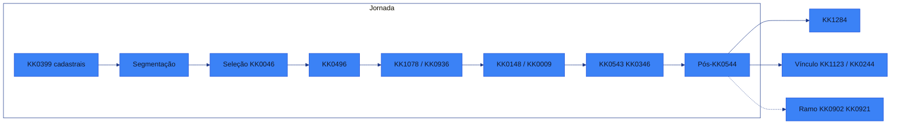
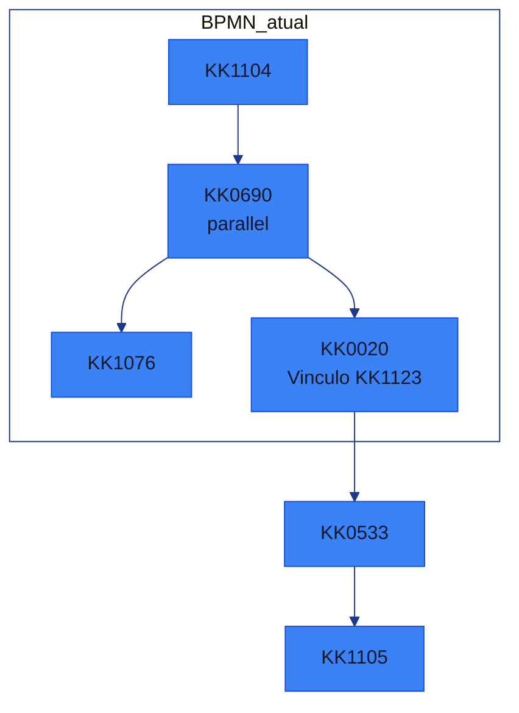
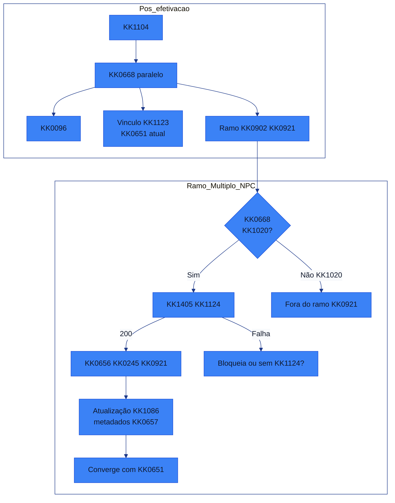
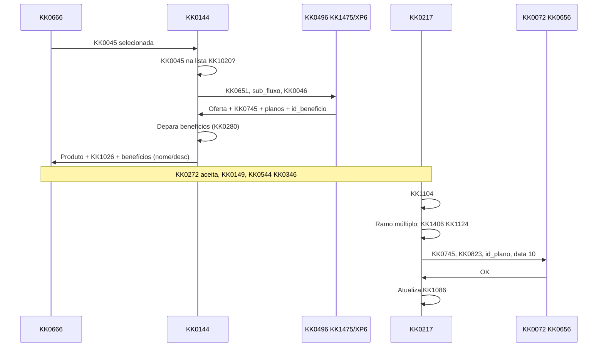
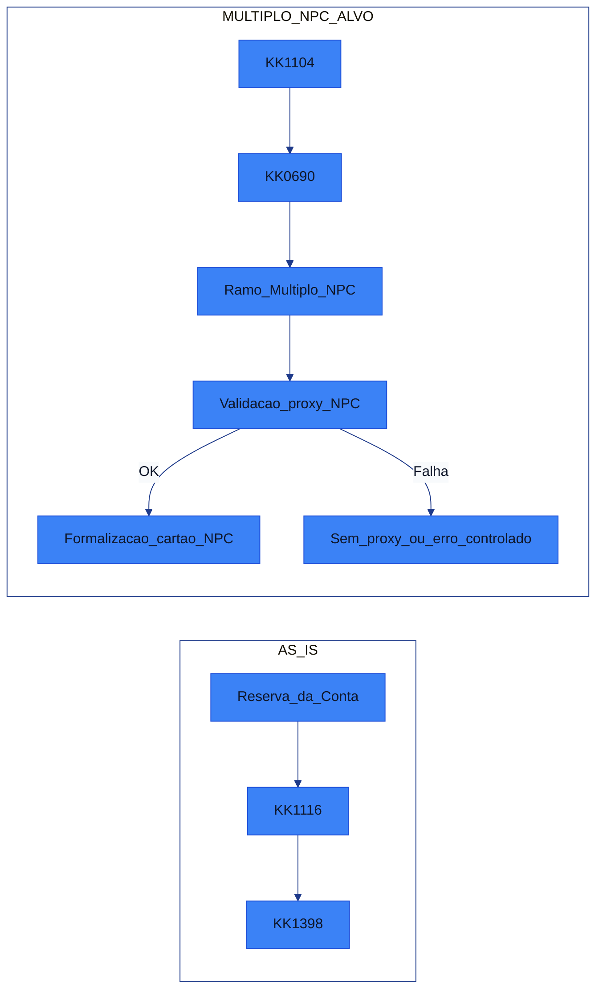
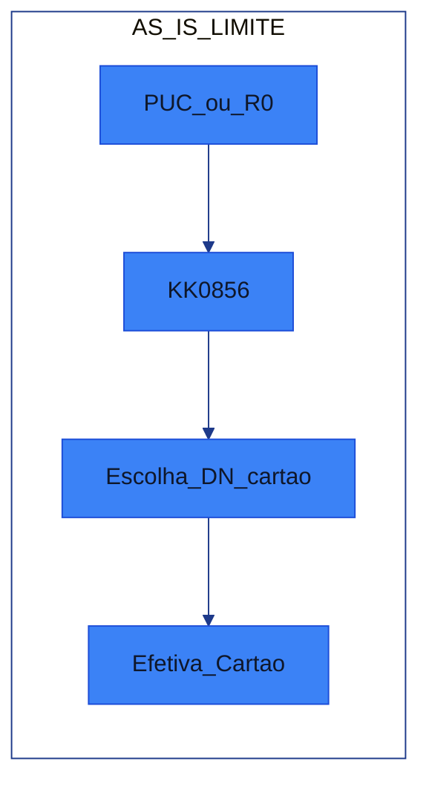
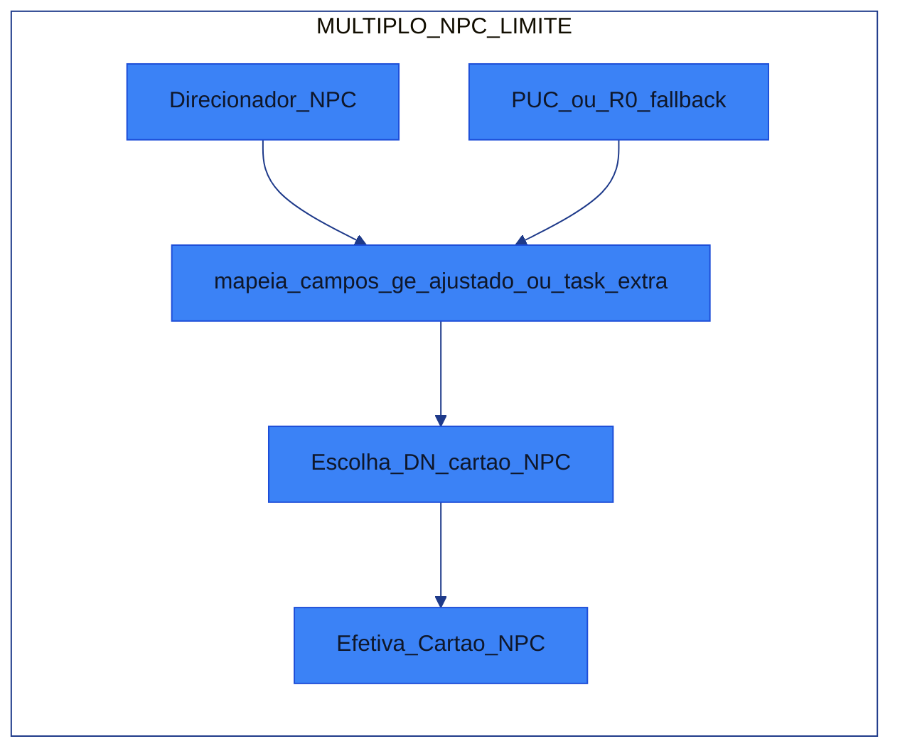

[DUVIDAS_REFINAMENTO_2026-03-13_CO8_MULTIPLO_GENERICO.md]
XXXXX
## Dúvidas do KK1142 — 13/03/2026

**Fonte:** call de KK1142 13/03/2026 (~2h30). Transcrição completa: `transcricoes/transcricao_2026-03-13_15-03-15/2026-03-13 15-03-15.txt`.

---

### 1. Como vamos identificar no KK1020 se a KK0046 está em KK0034, KK0921 ou ambos?

**Dúvida**  
- Existem três cenários:
  - KK0046 só com **KK1020 KK0034**;
  - KK0046 só com **KK1020 múltiplo KK0921**;
  - KK0046 que pilota **KK0034 e KK0921 ao mesmo KK1342**.  
- Além disso, existe o KK0651 de **menor de idade**, que hoje é tratado como KK1315 separado.  
- Pergunta: **como representar tudo isso no `KK1313`?**

**Resposta consolidada**  
- O **front/KK0144** é KK1175 por montar `KK1313` a partir de:
  - lista de agências KK1020 KK0034;
  - lista de agências KK1020 KK0921;
  - indicador se é KK0651 de menor.  
- Convenções sugeridas:
  - Somente KK0034 → `KK1021`.
  - Somente KK0921 → `PILOTO_NPC`.
  - KK0034 + KK0921 → `KK1022`.
  - Menor + KK0921 → `KK0863`.  
- O KK0282 apenas **repassa** o `KK1313` na KK1332 `KK0500`; a lógica de composição (KK0034/KK0921/menor) fica do lado de front/KK0144, respeitando o que o KK0496 espera.

---

### 2. Como funciona rollout x KK1020 no KK1315? O que muda quando deixar de ser KK1020?

**Dúvida**  
- Hoje, em KK1020, passamos um `sub_fluxo` especial para o KK0496.  
- Quando for **rollout para todo mundo**, o que acontece?
  - Ainda passamos o KK1315 de KK1020?
  - O KK0496 continua olhando esse campo?

**Resposta consolidada**  
- Enquanto for **KK1020**, seguimos passando `KK1313` com o valor de KK1020 (ex.: `PILOTO_NPC`).  
- Quando virar **regra geral (rollout)**:
  - o KK1354 do KK0496 passa a tratar aquele comportamento como **padrão**, sem depender de flag de KK1020;
  - o front/KK0144 **para de enviar** o KK1315 de KK1020 (ex.: deixa de mandar `PILOTO_NPC`);
  - o KK0282 não precisa de lógica extra: continua apenas repassando o `KK1313` que chegar do KK0144.

---

### 3. Menor de idade conflita com KK1020 KK0034? Como fica o KK1315 em menor + KK0921?

**Dúvida**  
- Hoje, menor de idade já é tratado como um `sub_fluxo` específico (ex.: `MENOR`).  
- Com o múltiplo KK0921:
  - pode existir cenário “menor + KK0034 + KK0921”?  
  - como montar o `sub_fluxo` quando for **menor + KK0921**?

**Resposta consolidada**  
- **KK0034 não é ofertado para menor**, portanto **não existe cenário “menor + KK0034”** — não há conflito KK0034 x menor.  
- Para **menor + KK0921**, o KK1315 deve indicar ambos os contextos, por exemplo:
  - `KK0863` (nome exato a combinar com o KK0496).  
- O KK0282 só precisa garantir que `KK1313` esteja corretamente preenchido **antes da KK1332 `KK0500`**; a interpretação do valor (menor, KK1020, KK0921 etc.) é feita pelo KK0496.

---

### 4. Existe interação com o KK0282 antes da KK0259 ao KK0496? Precisamos mexer em algo ali?

**Dúvida**  
- “Até o momento em que o KK0144 manda para o KK0496 e o KK0496 devolve lista de KK1079, **já há interação com KK0282** que a gente precisa mexer?  
  Ou isso fica todo do lado de KK0144/KK0496?”

**Resposta consolidada**  
- No AS IS, antes do KK0496:
  - o KK0282 participa principalmente fornecendo **limites pré-aprovados e KK0831 via KK1130/R0**;
  - mas a KK0978 da KK0259 ao KK0496 (KK1475/XP6) é **KK0144 + KK0496**.  
- Para o múltiplo KK0921:
  - não há necessidade de criar “um novo step KK0282” **antes** do KK0496;
  - a maior mudança de KK1167 KK0282 vem **depois** da KK0544 da KK0346 (`KK1104`), no ramo múltiplo KK0921 (KK1124 + KK0657).

---

### 5. Onde devemos sobrescrever o KK0823 de KK0245 vindo da KK1130 pelo valor do KK0496? Antes do KK0308 ou no KK0308?

**Dúvida**  
- “A KK1130 continua devolvendo pré-aprovado + KK0831.  
  O KK0496 passa a devolver um **KK0823 de KK0245** próprio.  
  Em que momento:
  - a gente troca o valor de pré-aprovado de KK0245 da KK1130 pelo do KK0496, e  
  - onde atualizamos a KK1424 em KK0282 (para não aparecer valores diferentes nas telas)?  
  Isso deve ser feito direto pelo KK0496 falando com o KK0282, ou no `KK0308`?”

**Resposta consolidada**  
- O ponto certo para consolidar o KK0823 é o **`KK0308` de KK1079 (ex.: user KK1332 `KK0406`)**:
  - **KK0144**:
    - recebe o KK0823 de KK0245 do KK0496 (`limite_cartao_direcionador`);
    - envia esse valor no `KK0308` **no mesmo campo de pré-aprovado de KK0245** que hoje recebe KK1130/R0.
  - **KK0282**:
    - nos KK1245/KK1335 ligados ao `KK0308` (como `KK0406`, `atualiza dados perfil na KK1086`, `KK1240`), **sobrescreve** a KK1424 de KK0823 de KK0245 (`KK1415`) com o valor vindo do KK0496;
    - mantém a KK1130 como fonte apenas de **KK0831**.
- Assim, as telas que leem de KK0282 no final verão **sempre o mesmo KK0823** — o que foi decidido pelo KK0496, não o inicial da KK1130.

---

### 6. Onde trafegar e persistir o `KK0745` do KK0496?

**Dúvida**  
- “O KK0496 devolve `KK0745`.  
  É melhor ele mesmo gravar isso no KK0282, ou passamos via `KK0308`?  
  E onde isso vive no KK0282?”

**Resposta consolidada**  
- O KK0651 recomendado é usar o **`KK0308`** como ponto único de gravação:
  - **KK0144**:
    - inclui o `KK0745` no KK1001 do `KK0308` junto com os demais dados de KK0936.
  - **KK0282**:
    - recebe o `KK0745` nesse step e:
      - grava em **KK1423 de KK1069** (para uso imediato, inclusive no ramo múltiplo KK0921);
      - persiste em KK0282/KK1086, se necessário, para ser lido pelas telas finais ou outros BFFs.
- Dessa forma:
  - o `KK0745` flui naturalmente até o **ramo múltiplo KK0921** (onde será usado na KK0657 KK0921);
  - não é preciso acoplar o KK0496 diretamente a atualizações em KK0282.

---

### 6. Em que ponto do KK0651 principal o KK1315 de KK1124 é executado?

**Dúvida (trecho da call, reforçada depois)**  
- “Em que momento exatamente o KK1315 de KK1124 (que pode KK0157 KK0245) roda dentro do KK0282?  
  É antes ou depois da KK0544 da KK0346?”

**Resposta consolidada**  
- No AS IS:
  - roda `KK0534` (abre a KK0346 no core);
  - depois `KK1104` (grava `KK0742`, `KK0358` etc. na KK1086);
  - em seguida o KK0651 vai para o **KK0669 paralelo `KK0690`**.
- Do `KK0690` saem:
  - `KK1076`;
  - KK1324 **`KK0020` (Vínculo KK1123)**.
- Dentro do KK1324 **Vínculo KK1123**:
  - ficam KK1335 como `KK1398` e os KK0712/eventos que podem **KK0157** ou não o KK0245 em função do resultado do KK1124.  
- Portanto, o KK1315 de KK1124 (legado) **sempre roda no pós‑KK0544**, depois de `KK1104`, dentro do KK1324 Vínculo KK1123.
- No alvo múltiplo KK0921, o **novo ramo de KK1124 KK0921** também nasce depois de `KK1104` (a partir de `KK0690`), mantendo a mesma ideia: KK1124 é sempre pós‑KK0544.

---

### 7. Qual é exatamente a “caixinha do KK0308” citada na call?

**Dúvida**  
- “Quando falamos em passar KK0823 e `KK0745` no KK0308, **qual é a caixinha do KK0172** que estamos chamando de KK0308?”

**Resposta consolidada**  
- No `KK0953`, o step referido como “KK0308 de KK1079” é a **user KK1332**:
  - `id="KK0406"`
  - `name="KK0399 Oferta"`.
- É a KK1338 em que o KK0273 está vendo/confirmando a **KK0938/KK0245**.  
- Do ponto de vista de KK1167:
  - O **KK0144** monta o KK1001 de `KK0406` com o KK0987 de KK0936 final (incluindo, no alvo múltiplo, KK0823 do KK0496 e `KK0745`).
  - O **KK0282**, a partir das saídas dessa KK1332 e dos KK1245 associados, **grava/atualiza as KK1423 de KK0936 no KK0282**.

---

### 8. Resumo: o que fica na sua parte (KK0282) vs KK1020/KK1077/KK0144

**Dúvida implícita da call**  
- “De tudo isso discutido (KK1020, KK1315, KK0823, KK0496, KK0308), **o que exatamente é minha KK1167 no KK0282**?”

**Resposta consolidada**  
- **Fora da sua parte (pré-KK0544):**
  - definição de KK1020 (listas de agências, segmentos);
  - montagem de `KK1313` (KK0034/KK0921/menor);
  - KK0259 ao KK0496 (KK1475/XP6) e montagem da KK0936 para a KK1338;
  - merge entre KK1130 e KK0496 no KK0144 antes do KK0308 (do ponto de vista de KK0372 com KK0282).
- **Dentro da sua parte (pós-KK0544):**
  - usar o que veio do KK0496/KK1019:
    - `KK0745`, `id_plano`, `limite_cartao_direcionador`, flags de KK1124, campos KK0921;
  - no **`KK0308`**:
    - sobrescrever o KK0823 de KK0245 com o valor do KK0496;
    - receber e persistir `KK0745` e metadados KK0921;
  - após `KK1104` / `KK0690`:
    - orquestrar o **ramo múltiplo KK0921** (KK1406 KK1124 KK0921, KK0657 KK0921, KK0120);
    - garantir que KK0282 reflita fielmente o que foi ofertado/formalizado (sem divergência de limites ou KK0755).

---

### 9. KK1405 do KK1124 KK0921 vs caixa “valida KK1124 BC” (call 13/03)

**Dúvida**  
- A KK1406 do KK1124 hoje é feita pela external KK1332 **valida KK1124 BC** (contexto KK1465). Para o múltiplo KK0921, devemos alterar essa KK1332 ou criar uma nova?

**Resposta consolidada (call 13/03)**  
- **Não** alterar a external KK1332 do BC (contexto KK1465, gestão KK0245 múltiplo KK1465).  
- Criar **nova caixinha** no KK0282 para validar o KK1124 KK0921 (KK0259 à nova KK0072 de KK1406). Quando for KK0921, essa nova KK1406 roda; na etapa de **vínculo KK1124** (BC), o KK0651 KK0921 deve **passar como “não tem KK1124”** (não percorrer a caixa de vínculo), pois o vínculo passa a ser feito pela **KK0657**, não por essa external KK1332.  
- Ou seja: validar KK1124 KK0921 em uma KK1332 nova; para KK0921, não usar a caixa de vínculo KK1124 BC; em seguida chamar a **KK0657** (outra caixinha nova).

---

### 10. Onde fica a KK0657 no KK0651 e relação com vínculo KK1124 (call 13/03)

**Dúvida**  
- Em que ponto exato do KK0172 chamar a KK0072 de KK0657? Antes ou depois do “vínculo KK1124”?

**Resposta consolidada (call 13/03)**  
- A KK0657 deve ser KK0259 **após a KK0544 da KK0346** (já temos `KK0742` em **atualiza KK0544 na KK1086**).  
- Para KK0921, **não** passar pela caixa de **vínculo KK1124** do BC; criar **nova caixinha** que chama a KK0072 de KK0657 (KK0745, KK0742, KK0823, data KK1425 fixa, KK1124 se houver). A KK0657, do lado do KK1354 de KK0911, é que fará o vínculo do KK1124.  
- No KK0172: quando for KK0921, o KK0651 “passa reto” na decisão de vínculo (como se não tivesse KK1124 BC) e em seguida executa a KK1332 de KK0657.

---

### 12. Variável KK1124 KK0921 vs reutilizar KK1124 (call 13/03)

**Dúvida**  
- Usar KK1424 separada `KK1127` ou reutilizar a mesma KK1424 de KK1124 para não alterar muitos steps?

**Resposta consolidada**  
- Ficou em aberto para KK1406: usar **KK1127** (KK0651 trata KK0921 como "não tem KK1124" na caixa BC e depois consome `KK1127` na KK0657) pode exigir menos alteração nas KK0467 atuais; reutilizar o mesmo campo pode fazer o KK0651 passar "transparente" na caixa de vínculo. Confirmar na segunda-feira com o KK1354 qual abordagem seguir.

**Sugestão**  
- Preferir **KK1424 separada `KK1127`**: (1) a semântica é distinta — KK1124 BC (vínculo KK1465) vs KK1124 KK0921 (KK0657), com consumidores e momento de uso diferentes; (2) o KK0172 fica explícito — no ramo KK0921 não entra na caixa de vínculo BC e usa só `KK1127` na KK0657, sem sobrecarregar o significado do campo atual; (3) reutilizar o mesmo campo exigiria alterar condições em vários steps que hoje assumem "KK1124 = BC", com mais KK1039 de toque e KK1201 de regressão; (4) facilita KK0122 e suporte: fica claro qual caminho (BC ou KK0921) preencheu o KK1124. KK1404 com o KK1354 se a nova caixinha de KK1406 KK0921 pode gravar em `KK1127` e a caixinha de KK0657 ler apenas `KK1127` no ramo KK0921.

---

### 13. KK0982 e KK0245 KK1124 (call 13/03)

**Dúvida**  
- Na KK0982, a identidade (ou KK1338) precisa categorizar que o KK0273 pegou KK0245 com KK1123 ou não (ex.: checkbox “KK0245 provisório” vs KK0794)?

**Resposta consolidada**  
- Ficou como **lição de casa**: confirmar com Pan/Pedrinho na segunda se é necessário marcar isso na KK0982 e se haverá outra KK0259 de KK1123 na leitura da KK0982. Ponto anotado para não esquecer.

**Sugestão (como fechar a dúvida)**  
- A resposta é de KK0911 (Pan/Pedrinho); para não travar o KK1354, vale levar para a segunda **três perguntas objetivas**: (1) “A KK0982 precisa exibir ou persistir que o KK0245 foi obtido via KK1123 (ex.: KK0245 provisório)?” — se sim, qual campo/KK1338; (2) “Na leitura da KK0982, já existe integração com KK1123 ou precisamos de nova KK0259/flag?”; (3) “Se precisar persistir, a origem do dado pode ser o KK0282 (KK1424 já preenchida no KK0651, ex.: `KK1127`) ou é obrigatório buscar de outro KK1292?”. Com isso dá para decidir se KK0282 só repassa KK1424, se KK0144/KK0982 precisam de nova KK0259 ou se não há demanda para múltiplo KK0921 nessa KK1338.

---

### 14. Histórias KK0144 vs KK0282 após KK1142 13/03

**Resumo da call**  
- **KK0144:** duas histórias — (1) KK1020 + enviar dados ao KK0497; (2) KK0037 do KK1187 do KK0497 (KK1079/planos).  
- **KK0282:** (1) receber no KK0308 os novos valores e atualizar os três KK1039 (KK0406, atualiza dados perfil, mapeia dados pessoa ofertas); (2) KK1406 do KK1124 KK0921 (nova caixinha); (3) KK0657 (nova caixinha / desvio em relação ao vínculo BC). Ajuste fino de “uma ou duas histórias” para desvio do vínculo vs KK0657 ficou para alinhar na segunda.  
- Grande parte do esforço de desenvolvimento do múltiplo KK0921 está no **KK0282** (KK0217 / external KK1335), não no KK0144.

---

## Sugestões: dúvidas que a equipe não fechou

Itens que ficaram em aberto ou “para segunda” na call de 13/03. Sugestão de como fechar cada um e com quem alinhar.

| # | Dúvida não fechada | Sugestão para fechar | Com quem / quando |
| --- | -------------------- | ---------------------- | ------------------- |
| 1 | **Variável KK1124 KK0921 vs reutilizar KK1124** (§12) — Usar `KK1127` separado ou mesma KK1424 de KK1124? | Definir uma regra: (a) KK1424 nova `KK1127` e KK0651 trata KK0921 como “não tem KK1124” na caixa BC, consumindo `KK1127` só na KK0657; ou (b) reutilizar mesmo campo e validar em quais steps seria preciso alterar condição. Documentar impacto em ambos os caminhos. | Time KK0282 / KK0667 + quem desenha o KK0172; segunda-feira. |
| 2 | **KK0982 e KK0245 KK1124** (§13) — Na KK0982, precisa categorizar que o KK0273 pegou KK0245 com KK1123 (ex.: checkbox “KK0245 provisório” vs KK0794)? Há outra KK0259 de KK1123 na leitura da KK0982? | Confirmar com KK1077/KK0911 se a KK0982 deve refletir “KK0245 KK1124” e como (campo, checkbox, integração). Se sim, levantar se exige nova KK0259 ou leitura de KK1424 já persistida. | Pan / Pedrinho; segunda-feira. |
| 3 | **Uma ou duas histórias para desvio do vínculo vs KK0657** (§14) — Uma história que “faz o desvio e chama a KK0657” ou duas (uma para desvio, outra para KK0657)? | Decidir no KK1142/planning: uma história de KK0282 “ramo KK0921: desvio + KK0657” ou duas (“desvio/condição KK0921” + “KK0259 KK0072 KK0657”). Impacta pontuação e paralelismo. | KK0729 / KK1005 + KK1354 KK0282; segunda-feira. |
| 4 | **Nomes dos campos no KK0308 (KK0406) para KK1282** — Quais nomes exatos usar para origem KK1475/KK0921 e demais dados que o KK1282 consome? | Alinhar com o KK1354 da **KK0494** (e com KK1282) os nomes dos campos que já mapearam; KK0282 e KK0144 usarem o mesmo padrão para evitar retrabalho. | KK0667 / Igor + KK0494; antes de implementar os três KK1039 do KK0308. |
| 5 | **KK1145 de entrada na caixa “vínculo KK1124”** — O que exatamente é enviado/avaliado para o KK0651 KK0921 “passar como não tem KK1124” e não entrar na caixa de vínculo BC? | Mapear no KK0172 (KK0218) a condição de entrada da caixa de vínculo KK1124; definir KK1424 ou valor (ex.: `KK1127` presente e não preencher o KK1124 “KK1465”) que faz o KK0651 seguir o ramo “não tem KK1124”. | Quem for desenhar o ramo KK0921 no KK0172 (ex.: KK0667); antes de implementar. |
| 6 | **KK0371 da KK0072 de KK1406 do KK1124 KK0921** — Endpoint, KK1001, 200 vs códigos de erro, KK1190 e mensagem ao KK1392. | Documentar KK0372 (request/response) em conjunto com o KK1354 que expõe a KK0072 de KK1406 de KK1124 KK0921; definir tratamento no KK0282 (KK0166 KK0604, KK1423 de erro). | KK1005 / KK1354 de KK0657 ou dono da KK0072; em paralelo ao desenho da nova caixinha. |
| 7 | **KK0371 da KK0072 de KK0657** — Campos obrigatórios, origem do `KK0742` (confirmado: atualiza KK0544 na KK1086), formato de data de KK1425, tratamento de erro. | Formalizar KK0372 (ex.: OpenAPI ou doc compartilhada); confirmar se há KK0072 intermediária para mapear `KK0742`/accountId; definir KK1190 e KK0172 error. | KK0427 / KK1354 de KK0657; em paralelo ao desenho da caixinha de KK0657. |
| 8 | **Tipo de tarefa: service vs external** — KK1405 do KK1124 KK0921 e KK0657 serão service KK1332 (KK0473 KK0282) ou external KK1332 (KK1468)? | Decidir com KK1354 KK0282/infra: se external, definir nomes dos topics e dono dos KK1472; se service, definir onde ficam os delegates. Impacta deploy e KK1167 de KK0398. | Time KK0282; KK1142 KK1378 ou segunda-feira. |

**Uso sugerido:** usar esta tabela como checklist na próxima KK1194 (segunda ou KK1142 seguinte); cada linha pode virar um item de pauta até fechar.

### Mais perguntas sugeridas (da transcrição)

Itens que aparecem na call e podem ser levados como pergunta ou alinhamento para fechar contexto ou evitar retrabalho.

| # | Pergunta sugerida | Objetivo | Com quem / quando |
| --- | ----------------- | -------- | ------------------- |
| 9 | **KK0666: quando terão as telas para refinar?** Refinar a parte de front (KK0739) depende das telas; ficou de combinar com KK0901. | Garantir data para terminar KK1142 do front e não travar histórias. | KK0739 + KK0901; segunda ou início da semana. |
| 10 | **KK1282: quando a “parte do KK1282” fica pronta e quais campos/KK0378 o KK0282 deve seguir?** KK0667 termina a parte do KK1282 “no meio da semana que vem”. | Alinhar nomes de campos e origem dos dados (KK1475/KK0921) para os três KK1039 do KK0308. | KK0667 + KK0494; antes de implementar KK0308. |
| 11 | **KK0172: onde ficam exatamente a caixinha de KK0544 da KK0346 e o step de vínculo do KK1124?** Na call pediu-se ajuda para localizar esses dois KK1039. | Documentar no KK0172 (ou em doc de KK1139) para o KK1354 saber onde mexe no desvio KK0921. | Quem desenha o KK0172 (ex.: KK0667); antes de desenhar o ramo KK0921. |
| 12 | **Ramo KK0921 na caixa de vínculo: o KK0651 entra na caixa e sai pelo ramo “não tem KK1124” ou criamos um desvio que nem entra na caixa?** Na call houve dúvida entre “passar pela etapa e sair” vs “KK0187”. | Deixar explícito no KK0172 para não ter duas implementações diferentes. | Time KK0282 + quem desenha o KK0172; segunda. |
| 13 | **KK0282: onde fica a lógica/KK0473 que atualiza a KK1086 (ex.: após KK0308)?** Na call surgiu dúvida de onde ver a lógica que “atualiza KK1086” no KK0282. | Quem for implementar os três KK1039 do KK0308 saber onde reutilizar ou espelhar a lógica. | Time KK0282/KK0282 (quem conhece as delegates); antes de codar. |
| 14 | **Confirmar com KK0282/NC2 que não vamos alterar a external KK1332 do BC e que a nova caixinha (KK1406 KK0921) é o caminho aprovado.** | Evitar expectativa de mexer na external KK1332 do BC e alinhar que a “nova caixinha” é a decisão. | KK0881 / quem fala com NC2; segunda se ainda não estiver explícito. |

**Dessas linhas, quais já conseguimos responder?**

Com base no que está consolidado neste KK0521:

- **#11 (KK0172: onde ficam KK0544 e vínculo)** — **Respondido no §7.** KK0543: KK1332 `KK0534` e em seguida `KK1104`; depois o KK0651 vai para o KK0669 paralelo `KK0690`. Vínculo: do mesmo KK0669 saem `KK1076` e o KK1324 **`KK0020` (Vínculo KK1123)**, dentro do qual ficam KK1335 como `KK1398`. Ou seja: a "caixinha" de KK0544 é a KK1272 até `KK1104`; o step de vínculo do KK1124 é o KK1324 Vínculo KK1123 após o KK0669.
- **#12 (Ramo KK0921: entrar na caixa ou desvio?)** — **Esclarecido na seção «Pontos de ambiguidade…» (§3).** O §11 diz que KK0921 **não** passa pela caixa de vínculo KK1124 do BC; portanto o KK0651 KK0921 **não entra** no KK1324 Vínculo KK1123 (KK0020). É necessário **novo ramo** saindo de `KK0690` (KK1406 KK1124 KK0921 + KK0657).
- **#14 (Confirmar com KK0282/NC2 que não alteramos a external KK1332)** — **KK0466 já consolidada no §10.** O doc já registra: não alterar a external KK1332 do BC; criar **nova caixinha** no KK0282 para validar o KK1124 KK0921. O que resta é só **confirmar formalmente** com NC2 (ou com quem fala com eles) se quiserem alinhar KK0311; a decisão de desenho está fechada. *(Na call alguém chegou a sugerir alterar: “Atualizar o external KK1332 para adicionar essa KK0259 lá” e “Pensa em boa prática o jeito. Era implementar essa funcionalidade ali nessa external KK1332.” Outros ponderaram que a external KK1332 é do KK0282/NC2, que o contexto é KK1465 e que não faz sentido misturar KK0921 ali; KK0881 comentou que nunca participou de conversa sobre mexer em external KK1332 e que vale questionar autorização. Fecharam em **não alterar** e criar nova caixinha no KK0282 só para validar.)*

**Ainda dependem de pessoa/data/KK0398 (não dá para responder só pelo doc):**

- **#9** — Data das telas para refinar o front (KK0739 + KK0901).
- **#10** — Quando a parte do KK1282 fica pronta e quais campos usar (KK0667 + KK0494).
- **#13** — Onde fica no KK0398 a KK0473 que atualiza a KK1086 (KK1354 KK0282/KK0282).

---

## Pontos de ambiguidade, confrontação com narrativa pré-KK1142 e KK1206 (KK0172)

**Importante:** O **KK1439** é um **KK1084 à parte**, focado apenas na KK0471 do KK0172; **não** está totalmente integrado à equipe da daily. A documentação de KK1139 da squad fica em `documentacao/KK0898/` e `documentacao/Manual KK0950/`. Aqui cruzamos fontes (incluindo narrativa que em algum momento esteve associada ao KK1439) apenas para identificar KK1206; as KK0467 e a fonte da verdade para o KK1354 são os docs do KK0898 e o KK1142.

**Objetivo desta seção:** cruzar todas as fontes (KK1142 13/03, Nova Jornada, KK0172, KK0899, KK0527, KK1169, RELATORIO_REFERENCIA_CRUZADA_INCOERENCIAS) e produzir **análises de KK1201** prontas para repassar ao KK1354 — com recomendações e ações sugeridas.

**Fontes cruzadas:** `KK0953` (fonte da verdade do KK0651); `KK0920` (4 etapas, barra lateral = KK0265, KK1078 = KK0244 + KK1124); KK1142 13/03 (transcrição completa); docs de KK0084 múltiplo KK0921 listados acima.

**Cronologia:** Os documentos do múltiplo KK0921 (KK0899, KK0527, ARQUITETURA_CO8, KK1169) foram criados **antes** da call de KK1142 13/03. Eles registravam **lacunas** e perguntas para o próximo KK1142. A **call de 13/03** **fechou** várias dessas KK0467. Em caso de diferença de redação, a **decisão consolidada** é a do KK1142 13/03; os docs antigos devem ser **atualizados** para refleti-la.

### 1. KK0656: decisão consolidada (KK1142 13/03) — docs atualizados

- **Docs do múltiplo (criados antes da call):** KK0899 §6.1/6.2 e KK0526 1.3 traziam a **lacuna** "KK0657 em paralelo ou em KK1272 a **KK0533**" e "**KK1105** deve ser revista para carregar metadados da KK0657 KK0921". A pergunta 3 das lacunas era: "A KK0657 deve ser modelada em paralelo a KK0533 ou em KK1272?" — **decisão em aberto**.
- **KK1141 13/03 (call):** **Fechou** o desenho: KK0657 é **após a KK0544 da KK0346** (já temos `KK0742` em **atualiza KK0544 na KK1086** / `KK1104`); para KK0921 **não** passar pela caixa de vínculo KK1124 do BC; **nova caixinha** chama a KK0072 de KK0657.
- **KK0172:** `KK1104` → `KK0690` → (1) `KK1076` ou (2) `KK0020` (Vínculo KK1123). As KK1335 **`KK0533`** e **`KK1105`** estão em **outro trecho** do KK0651 (KK1079/KK0245), não no caminho direto após `KK0690`.
- **Conclusão:** Os docs antigos **registravam a lacuna**; a **call de 13/03** **fechou** a decisão. O ramo KK0921 sai de `KK0690` (terceiro ramo a ser criado) e faz KK1406 KK1124 KK0921 + KK0657. Esse ramo pode **não passar** por `KK0533` nem por `KK1105`. Ou seja, “KK0657 em paralelo/KK1272 a KK0533” no KK1439 **não bate** com o desenho “ramo KK0921 após KK1104, sem entrar no Vínculo KK1123”. **Ação realizada:** KK0899, DUVIDAS_IMPLEMENTACAO_CAMUNDA_MULTIPLO_NPC e ARQUITETURA_CO8_MULTIPLO_NPC_CAMUNDA foram atualizados com essa decisão (KK0657 KK0921 no novo ramo, com KK0742 de KK1104; ramo KK0921 não passa por KK0533 nem KK1105).

### 2. KK0172: KK0690 tem apenas duas saídas; docs pré-call listavam "dentro do Vínculo KK1123" como opção

- **KK0172 (KK0953):** O KK0669 paralelo **`KK0690`** tem **apenas duas** saídas: `Flow_02tfitj` → `KK1076` e `KK0647` → **`KK0020` (Vínculo KK1123)**. Não existe terceiro arco hoje.
- **Docs do múltiplo (pré-call):** KK0899 §6.2 e KK0526 1.1 listavam como **uma das opções em aberto** (lacuna) o ramo múltiplo KK0921 “**dentro** do KK1324 Vinculo KK1123 (KK0020)”.
- **KK1141 13/03 (§10, §11):** **Fechou:** para KK0921 **não** alterar a external KK1332 do BC; KK0651 KK0921 **não** deve passar pela caixa de **vínculo KK1124** do BC; criar nova caixinha para KK1406 KK0921 e nova caixinha para KK0657. Ou seja, KK0921 **não entra** em KK0020.
- **Conclusão:** A opção "dentro do Vinculo KK1123" era **lacuna** dos docs antigos; a call **descartou** essa opção. O KK0172 obriga a criar **terceira KK1272** saindo de `KK0690` (ou KK0669 exclusivo antes) para o ramo KK0921. **Ação:** Atualizar KK0899 e KK0526 retirando a opção "dentro do Vinculo KK1123" e deixando explícito: ramo KK0921 = **terceiro ramo** do `KK0690` (ou KK0669 exclusivo antes).

### 3. Ambiguidade interna no §11 e na resposta #12: “passa reto” = entra na caixa ou não entra?

- **§11:** “Para KK0921, **não** passar pela caixa de vínculo KK1124 do BC” e “quando for KK0921, o KK0651 ‘passa reto’ na decisão de vínculo”.
- **Resposta #12 (neste doc):** “O KK0651 KK0921 **passa pela decisão** e sai pelo ramo ‘não tem KK1124’.”
- **Problema:** “Não passar pela caixa” sugere **não entrar** em `KK0020`. “Passa pela decisão e sai pelo ramo não tem KK1124” sugere **entrar** no KK1324 e tomar o arco “não tem KK1124”. No KK0172, a “decisão de vínculo” (ex.: “KK1123 KK0245?”) está **dentro** de `KK0020`. Se KK0921 não deve passar pela caixa BC, então KK0921 **não deve entrar** em `KK0020`; logo é necessário **terceiro arco** saindo de `KK0690`, e a redação “passa pela decisão” está enganosa.
- **Recomendação:** Unificar: “Para KK0921, o KK0651 **não entra** no KK1324 Vínculo KK1123 (KK0020); segue por um **novo ramo** do KK0690 (KK1406 KK1124 KK0921 + KK0657).” Corrigir a resposta #12 para não dizer que “entra e sai pelo ramo não tem KK1124”.

### 4. Responsabilidade KK0657: KK0144 “orquestrar” vs KK0282 “nova caixinha”

- **RESPONSABILIDADES_FRONT_BACK_MULTIPLO_NPC (§2.2 KK0144 KK1078):** “**KK0656:** orquestrar/enviar para a KK0072 de KK0657 do KK0245 múltiplo os campos obrigatórios…”
- **KK1141 13/03 e DUVIDAS_REFINAMENTO (§10, §11):** KK0656 é **nova caixinha** no KK0282 (KK0217) que chama a KK0072; KK0978 é do KK1069 KK0282; KK0144 não orquestra a KK0657 no ramo pós-KK0544.
- **Confrontação:** Quem lê só KK1169 pode achar que o KK0144 “orquestra” a KK0657; quem lê o KK1142 13/03 entende que o KK0282 chama a KK0072 no KK0172. Pode gerar oposição ou duplicação (KK0144 e KK0282 chamando).
- **Recomendação:** Ajustar KK1169: KK0144 envia dados **até** o KK0308 (incluindo o que a KK0657 precisará); a **KK0259** à KK0072 de KK0657 no ramo pós-KK0544 é KK1167 do **KK0282** (nova KK1332 no KK0172).

### 5. Quem KK1281 `KK1313` no KK1069 e quando?

- **KK0172:** A KK1332 **KK0500** envia no body `"sub_fluxo": "${KK1313}"`. Ou seja, a KK1424 precisa existir **antes** dessa KK1332.
- **KK1141 13/03 (§1):** “O **front/KK0144** é KK1175 por **montar** `KK1313`”.
- **Ambiguidade:** O KK0172 não mostra onde `KK1313` é **setada** no KK1069. Se a KK0259 ao KK0497 ocorre na “seleção de KK0046” (antes do KK0308), a KK1424 pode vir no KK1001 de alguma KK1332 anterior (ex.: user KK1332 de KK0046) ou ser injetada pelo KK0144 ao completar uma KK1332. Não está documentado em qual KK1332/KK1223 do KK0172 a KK1424 é escrita; sem isso, KK0759 pode divergir (KK1223 na KK0046 vs. KK0308 vs. KK0832).
- **Recomendação:** Documentar em qual ponto do KK0172 (KK1332 ou KK1223) `KK1313` é definida para o múltiplo KK0921 e quem a fornece (KK0144 no KK0308 de qual KK1332, ou KK1223 lendo de outra KK1424).

### 6. Visão unificada ainda lista “KK0330 KK0497” no ramo pós-KK0544

- **RELATORIO_REFERENCIA_CRUZADA_INCOERENCIAS (§2.1):** ARQUITETURA e KK1169 descrevem o ramo após `KK1104` como “KK0669 por KK1020, **KK0330 KK0497**, KK0657, KK0120”. Isso pode ser lido como **segunda KK0259** ao KK0497 após KK0544.
- **KK1141 13/03 e consolidado:** Não há segunda KK0330 ao KK0497 no ramo pós-KK0544; o ramo usa KK1423 já preenchidas (KK0936, `KK0745`) e faz KK1406 KK1124 KK0921 + KK0657.
- **Recomendação:** Remover “KK0330 KK0497” da descrição do ramo pós-KK0544 em todos os docs (ou deixar explícito: “uso dos dados **já obtidos** na KK0330 na KK0046”).

### 7. KK0045 KK1020: verificação só no KK0144 ou também no KK0217?

- **KK0526 8.1:** O KK0217 precisa **replicar** a verificação “KK0046 na lista KK1020” ou apenas confiar no `KK1313` vindo do KK0144?
- **KK1141 13/03 (§1, §2):** KK0144 monta e envia `KK1313`; KK0282 “apenas repassa”. Não ficou explícito se o KK0217 **valida** de novo a lista KK1020 ou só confia no valor recebido.
- **KK1200:** Duplicar regra (KK0144 + KK0217) aumenta consistência mas acopla duas bases; só KK0144 pode gerar ponto único de falha ou manipulação incorreta do KK1315. KK0466 a documentar.

**Busca cruzada com a KK0759 KK0034** (`documentacao/ad/`):

- No **KK0034**, a decisão de KK1020 é **toda no KK0144 + KK0496**: o KK0144 recebe `agencia` do front, valida no Portal Manager (configurador) se a KK0046 está na lista de KK1020, e envia ao KK0496 `sub_fluxo = "KK1020-ad"` (ou vazio). O **KK0668 “KK1020”** fica no **KK0496**, não no KK0282. O KK0282 **não** valida lista de agências; apenas recebe o **KK0308** da user KK1332 `KK0406` já com `KK0939` preenchido (KK1020) ou não (legado), e o KK1223 `KK1240` trata com fallback `"KK0034 antigo"` quando a KK1424 não existe.
- **Conclusão para o múltiplo KK0921:** Alinhar ao que já foi feito no KK0034: **KK0282 não replica verificação de KK0046 KK1020**. O KK0144 monta `KK1313` (KK1021, PILOTO_NPC, KK1022, KK0863) a partir das listas de agências e do contexto; o KK0282 apenas **repassa** o valor na KK1332 `KK0500` e consome os dados que vierem no KK0308. Assim evita-se KK0525 regra (duas fontes de verdade para “KK0046 no KK1020”) e mantém-se consistência com o KK0034.

### 8. KK1130 / KK0668 até junho e escopo da demanda múltiplo

- Vários docs (KK0899, KK0526, KK1169) citam atualização do endpoint KK1130/KK0668 até **junho** e a dúvida se a atualização entra **dentro** da demanda do múltiplo ou em demanda separada. Não há decisão fechada no KK1142 13/03.
- **KK1200:** Atraso ou escopo duplicado; dependência com FE e KK0382 não resolvida.

### 9. Falha na KK1406 do KK1124 e na KK0657

- **KK0526 5.1, 6.2:** Em falha na KK1406 do KK1124: **KK0157** ou cair para KK0651 sem KK1124? Em falha na KK0657: KK1190, KK0172 error ou registro manual?
- KK1141 13/03 não fechou comportamento de erro. KK1438 lista como KK1201 “comportamento de erro indefinido” e “KK1074 travados ou perda de KK1134”.
- **Recomendação:** Incluir na pauta da segunda: definição explícita de comportamento (e KK0167 no KK0172) para falha de KK1406 KK1124 e falha de KK0657.

### 10. Incoerências já reportadas (KK1219, KK1460, KK0129) não cobrem múltiplo KK0921

- O relatório **INCOERENCIAS_CRUZAMENTO_DOCUMENTOS** trata de KK1219, KK1460, KK0129 e checklist KK0134; **não** cobre contradições entre documentação pré-KK1142 (KK0902 KK0921) e KK1142 13/03 nem o KK0172. As ambiguidades e confrontos listados nesta seção são **complementares** àquele relatório e devem ser tratados na documentação do múltiplo KK0921 e na próxima KK1194.

---

### Cruzamento com a Nova Jornada (narrativa To Be)

*Nota: a narrativa “Nova Jornada” pode ter sido tratada em contexto do KK1084 KK1439 (KK0471 KK0172); para a equipe da daily, a KK1139 são os docs em KK0898 e Manual KK0950.*

Na **Nova Jornada** (To Be), a barra lateral tem **4 etapas** = 4 KK0265 KK0282: (1) KK0316 da KK0345, (2) KK0407, (3) KK1078 e Serviços, (4) KK1405. O **KK0902 KK0921** impacta principalmente:

| Etapa Nova Jornada | Onde o KK0902 KK0921 toca | Impacto |
|--------------------|---------------------------|---------|
| **1. KK0316 da KK0345** | Seleção de KK0046 → lista KK1020 KK0034/KK0921; montagem de `KK1313` (PILOTO_NPC, KK1022, KK0863). | KK0144/front precisam setar `KK1313` **antes** da KK1332 `KK0500`. No KK0172 não está documentado em qual KK1332/KK1223 essa KK1424 é escrita — KK1201 de divergência entre times. |
| **2. KK0407** | Sem impacto direto do múltiplo KK0921 (KK1338 única, KK0264 KK0282). | Nenhum. |
| **3. KK1078 e Serviços** | KK1311-KK1338 **KK0244**: KK0936 vinda do KK0496 (KK0823, KK1026, KK0745); toggle **KK1123 do KK0245**; **KK0308** = user KK1332 `KK0406` → KK0144 envia KK0823 + KK0745, KK0282 sobrescreve KK0823 e persiste. KK0258 ao `KK0500` ocorre nesta etapa (após ter KK0046). | A KK1338 de KK0244 na Nova Jornada deve exibir KK0936 do KK0496 quando for KK1020 KK0921; o KK0308 deve carregar os três KK1039 (KK0406, atualiza dados perfil, mapeia dados pessoa ofertas). Alinhar nomes de campos com KK0494/KK1282. |
| **4. KK1405** | **Review/KK0320** — KK0273 vê KK0987 e KK0245. KK0399 vêm do KK0282; KK0282 deve ter persistido KK0823 do KK0496 e KK0745 para o KK0144 da KK1338 de KK1406 consumir. | Garantir que o que foi ofertado (KK0823 KK0496) esteja em KK0282 antes da KK1406; sem isso, KK0273 vê valor errado ou KK1338 sem dado. |
| **Pós-KK1406 (invisível na barra)** | KK0543 da KK0346 → `KK1104` → **KK0690** → ramo múltiplo KK0921 (KK1406 KK1124 KK0921 + KK0657). Não vira nova etapa na barra lateral; roda em background. | Barra lateral continua com 4 etapas; o ramo KK0921 não adiciona KK0264 visível ao KK0723, mas exige terceiro arco no KK0172 e novas KK1335 (KK1124 KK0921, KK0657). |

**Conclusão do cruzamento:** a Nova Jornada não muda a estrutura de 4 etapas por causa do KK0902 KK0921; o impacto é em **dados** (KK0316/KK1078/KK1405) e em **KK0651 pós-KK0544** (novo ramo no KK0172). O botão KK1451 e a barra lateral (resumo primeiro, KK0910 depois) seguem válidos; ao reconstruir KK1338 ao KK1451, as KK1423 de KK0936 (KK0823, KK0745, KK1124) devem estar disponíveis no KK1069/KK0282.

---

### Tabela de KK1206 para repassar ao KK1354

| # | KK1200 | Impacto | Mitigação / Ação sugerida |
|---|-------|---------|----------------------------|
| R1 | Narrativa pré-KK1142 falava em “KK0657 após KK0533”; KK0172 coloca ramo KK0921 após `KK1104` sem passar por `KK0533` / `KK1105`. | Desenho divergente; KK0759 pode depender de KK1335 que o ramo KK0921 não percorre. | Fechado: decisão consolidada; KK0899, KK0526 atualizados (docs em KK0898). |
| R2 | Documentação antiga ainda citava ramo KK0921 “dentro do Vinculo KK1123”; KK1142 13/03 disse que KK0921 **não** passa pela caixa BC. | Quem desenhar o KK0172 pode seguir o doc errado e colocar KK0921 dentro de KK0020. | Atualizar KK0899 e KK0526: retirar opção “dentro do Vinculo KK1123”; deixar explícito: **terceiro ramo** de KK0690. |
| R3 | KK1169 diz que KK0144 “orquestra” a KK0657; KK1142 definiu KK0657 como **caixinha KK0282**. | Duplicação de KK1167 ou conflito KK0144 x KK0282. | Ajustar KK1169: KK0144 envia dados até o KK0308; **KK0259** à KK0072 de KK0657 no pós-KK0544 é **KK0282**. |
| R4 | `KK1313` é usada na `KK0500` mas não está documentado **onde** é setada no KK0172. | Implementações diferentes (KK0046 vs KK0308 vs KK0832); bugs ao KK1451 ou em KK1020. | Documentar KK1332/KK1223 que KK1281 `KK1313` para múltiplo KK0921 e KK1175 (KK0144 em qual KK0308). |
| R5 | Descrição do ramo pós-KK0544 ainda pode ser lida como “KK0330 KK0497” (segunda KK0259). | Time de KK1077 ou KK0144 pode achar que precisa segunda KK0259 ao KK0496. | Remover “KK0330 KK0497” do ramo pós-KK0544 nos docs; deixar explícito: “uso dos dados **já obtidos** na KK0046”. |
| R6 | Falha na KK1406 do KK1124 ou na KK0657 sem comportamento definido (KK0157? KK1190? KK0172 error?). | KK1073 travados, perda de KK1134, experiência ruim. | Incluir na pauta: definir comportamento de erro e KK0167 no KK0172 para KK1406 KK1124 e KK0657. |
| R7 | KK1130/KK0668 até junho e “dentro vs fora da demanda múltiplo” não fechado. | Atraso ou escopo duplicado; dependência FE/KK0382. | Alinhar com FE e KK0382 e registrar decisão (dentro da demanda ou em demanda separada). |
| R8 | Verificação “KK0046 KK1020” só no KK0144 ou também no KK0217 não decidida. | Duplicação de regra ou ponto único de falha. | **Recomendação (busca cruzada KK0034):** KK0282 **não** replica verificação; confia em `KK1313` vindo do KK0144, igual ao KK0034 (KK0144 valida KK0046 no Portal Manager; KK0282 apenas repassa e consome o KK0308). Documentar essa decisão nos docs do múltiplo. |
| R9 | User KK1332 `id="KK0406"` com espaço no id. | Incompatibilidade em KK0574/KK1245. | KK1404 no KK0217 em uso; se necessário, planejar id sem espaço em futura versão do KK1069. |
| R10 | KK0379 das KK0073 de KK1406 do KK1124 KK0921 e de KK0657 ainda em aberto. | KK0782 frágil, retrabalho. | Documentar KK0378 (request/response, códigos de erro, KK1190) em paralelo ao desenho das caixinhas; donos: KK1005/KK0427 + KK1354 KK0657. |

---

### Resumo executivo para o KK1354

- **Decisões que batem:** (1) Limite e KK0745 no **KK0308** (KK0406 + três KK1039 KK0282). (2) **Não** alterar external KK1332 do BC; **nova caixinha** para KK1406 KK1124 KK0921 e **nova caixinha** para KK0657 no KK0282. (3) Ramo KK0921 **não entra** no KK1324 Vínculo KK1123; é **terceiro ramo** do KK0690. (4) **Uma** KK0259 ao KK0496 (na etapa KK1078, com KK0046 já definida); pós-KK0544 só usa KK1423 já preenchidas. (5) **KK1019 (KK0046):** por busca cruzada com a KK0759 KK0034 — KK0282 **não** replica verificação de KK0046 KK1020; KK0144 monta `KK1313` e KK0282 apenas repassa (ver §7 e R8).
- **O que ainda precisa fechar:** (1) Variável `KK1127` vs reutilizar KK1124. (2) KK0982 e KK0245 KK1124 (Pan/Pedrinho). (3) Uma ou duas histórias (desvio vs KK0657). (4) KK0379 das KK0073 (KK1406 KK1124, KK0657). (5) Comportamento de erro (KK1124 e KK0657). (6) Onde e quando `KK1313` é setada no KK0172.
- **Docs a atualizar:** KK0899 e KK0526 (retirar “dentro do Vinculo KK1123” e “KK0657 após KK0533” KK0657/KK0533 já atualizados); KK1169 (KK0657 = KK0282, não KK0144 KK0976).
- **Nova Jornada:** KK0902 KK0921 não altera as 4 etapas nem a barra lateral; impacta dados em KK0316 (KK0046/KK1020), KK1078 (KK0244 = KK0936 KK0496 + KK0308) e KK1405 (review com dados do KK0282), e adiciona KK0651 pós-KK0544 em background.

$$$$$

[DUVIDAS_REFINAMENTO_2026-03-16_CO8_MULTIPLO_PARTE3_GENERICO.md]
XXXXX
## Dúvidas da KK0729 — KK1141 KK0282 KK0902 KK0921 (16/03/2026, parte 3)

**KK0362:** call de KK1142 do múltiplo KK0921 em 16/03/2026 (parte 3), com foco em modelo de dados do KK0496 (KK1475), KK1168 KK0144/front e impacto para o **KK0282 / KK0217** (KK0667).  
**Regra:** `KK0953` é a **fonte única e absoluta da verdade** do KK0651; este arquivo só interpreta o que foi discutido na call à luz do KK0172.

---

### Índice das perguntas (KK0217 / KK0282)


| #    | Pergunta direta                                                                                          |
| ---- | -------------------------------------------------------------------------------------------------------- |
| 1.1  | Este KK1142 muda o KK0172? Nova caixinha/KK0669?                                                     |
| 1.2  | O KK0308 de KK1079 muda por causa do KK1475?                                                            |
| 1.3  | Adapter KK0144/front influencia o que chega no KK1069?                                                    |
| 1.4  | Nova KK1424 de KK1069 por causa do KK1475?                                                              |
| 1.5  | O que entra na fila do KK0667 (KK0282) após este KK1142?                                                |
| 1.6  | Dá para pular a caixa de vínculo de KK1124 quando for KK0921?                                                |
| 1.7  | Variável `KK1127` ou reaproveitar a de KK1124?                                                         |
| 1.8  | O que decide se o KK0651 entra ou não na caixa de Vínculo KK1123?                                          |
| 1.9  | Valida KK1124 BC é external KK1332; como afeta a KK1406 KK0921?                                             |
| 1.10 | Quantas caixinhas novas no pós-KK0544?                                                               |
| 1.11 | Só passar e sair da caixa ou criar regra que pule a etapa?                                               |
| 1.12 | O que o KK0667 precisa para criar o step de KK0657 KK0921?                                             |
| 1.13 | O que o KK0667 precisa para a nova KK1406 KK1124 KK0921?                                                   |
| 1.14 | Quais são os três lugares no KK0282 que a gente altera?                                                     |
| 1.15 | Nomes exatos dos campos no KK0308; onde achar KK1139?                                              |
| 1.16 | Valida KK1124 BC é external KK1332; quando for KK0921 bate na nova e pula?                                     |
| 1.17 | KK0282 salva/valida gratuidade ou condições? Podemos tirar do KK1001?                                      |
| 1.18 | Limite mínimo: no KK0900 pode desconsiderar? KK0282 usa?                                                       |
| 1.19 | Nome do KK1077/KK0245 precisa vir correto para KK0544?                                              |
| 1.20 | Respostas do KK0667 por escrito para finalizar histórias KK0282?                                             |
| 1.21 | Se a KK1406 KK1124 KK0921 não retornar OK, que KK0651 a gente tem?                                         |
| 1.22 | KK1405 KK1124 KK0921 e KK0657: a ordem (antes ou depois) faz diferença?                             |
| 1.23 | Cenário “enganar o KK0651” (marcar não tem KK1124 BC e passar na caixa) funciona?                          |
| 1.24 | BC é KK1175 por múltiplo KK1465 e KK0921; para KK0282 quando é KK0921 a gente não chama valida BC?               |
| 1.25 | Quantas histórias de KK0282 no total? Uma de KK0308 + duas (KK1124 + KK0657)?                        |
| 1.26 | O que o KK0667 precisa de informação para conseguir dar a resposta (KK0172, KK0398)?                        |
| 1.27 | Quem expõe a nova KK0072 de KK1406 KK1124 KK0921 (M1, BC, outro)?                                            |
| 1.28 | No KK0172, o que diferencia múltiplo KK0921 de múltiplo KK1465 (só objeto/KK0936 KK0921)?                            |
| 1.29 | “Isso faz sentido, KK0667?” — As três alterações e complexidade parecida com KK0034 fazem sentido para o KK0282? |
| 1.30 | No “atualiza dados perfil na KK1086” como o KK0282 diferencia que é KK0936 KK0921?                           |
| 1.31 | O “ID da KK0936” do KK1187 KK1475 é o mesmo que KK0745 que o KK0282 persiste?                            |
| 1.32 | Para implementar o step de KK1406 KK1124 KK0921 no KK0282, está faltando alguma informação?                  |
| 1.33 | Onde exatamente no KK0172 (KK0651 gigantesco) fica a KK1406 do KK1124 e o step de vínculo?                |
| 1.34 | A nova estrutura de campos do KK0921 vai adicionar complexidade no KK0282?                                     |
| 1.35 | Os steps de KK0657 e KK1406 KK0921 usam só KK1423 já preenchidas no KK0308?                   |
| 1.36 | Para a KK0982 ser gerada, alguma KK1424 do KK0282 precisa ser enviada? (contexto: KK0982 não gerada)            |
| 1.37 | O objeto KK0921 é adicionado nos três KK1039 do mesmo jeito que o objeto KK0034 foi adicionado?                 |
| 1.38 | Condições de desconto: se o KK0144 tirar do KK1001, o KK0282 usa alguma para regra ou KK1012?           |
| 1.39 | A maior parte do trabalho KK0282 no múltiplo KK0921 é a partir de efetivar KK0346 (KK1124 + KK0657)?       |
| 1.40 | Os KK1039 do KK1142 KK0282 serão documentados no KK0829 para ficar visual no KK0651?                   |
| 1.41 | KK1405 KK1124 KK0921 e KK0657: quem define o KK0372 (request/response) de cada endpoint?          |
| 1.42 | A divisão de histórias (2 KK0144 + 3 frentes KK0282) está correta após olhar o céu oito?                       |
| 1.43 | O que o KK0282 salva tem que ser exatamente o que a gente repassa pro múltiplo/KK1282?                       |
| 1.44 | O “primeiro ponto de interação” do KK0282 com o KK0308 é sempre a user KK1332 KK0406?                 |
| 1.45 | A etapa dos três KK1039 é “disparada depois do KK0308 do KK1077”: quem dispara?                       |
| 1.46 | O KK1282 “espera receber um valor ali”: o KK0282 tem que salvar com os mesmos nomes que o KK1282 consome?     |
| 1.47 | KK1405 KK1124 KK0921 e KK0657: as duas são “bater endpoint, passar informações, esperar OK”?        |
| 1.48 | A fonte do que a gente manda pro múltiplo é o que o KK0282 vai salvando?                                    |


---

### 1. Perguntas da KK0729 sobre o KK0282 / KK0217

> Abaixo, todas as perguntas ligadas a KK0217/KK0282 que surgiram ou ficaram implícitas na fala da KK0729 na parte 3 do KK1142, com **respostas consolidadas** (da call) e **resposta analisada pós KK1142 de 16-03 (KK0172)** — KK0065 KK1377 com base direta no `KK0953` (KK0755 de KK1335, KK0712, KK0649 e KK1423).

#### 1.1 “Este KK1142 muda o KK0172? Vai ter nova caixinha/KK0669?”

- **Pergunta (KK0729, resumida):**  
  > “Com tudo isso de KK1475, KK0037, front e KK0144, a gente precisa mexer em alguma coisa no **KK0651 do KK0282**? Aparece caixinha nova, KK0669 novo, ou é só dado?”
- **Resposta consolidada:**  
  - **Não há mudança de KK0651** em `KK0953` por causa deste KK1142.  
  - Continuam valendo as KK0467 do KK1142 de **13/03/2026**:
    - `KK0406` é o **KK0308 de KK1079** (user KK1332) onde o KK0144 envia o KK0987 consolidado de KK0936 (incluindo KK0823 KK0496 e `KK0745`);
    - o ramo múltiplo KK0921 nasce após `KK1104`, no `**KK0690`**, com um **terceiro ramo** exclusivo para KK0921 (KK1406 KK1124 KK0921 + KK0657), separado do KK1324 Vínculo KK1123 (`KK0020`);
    - KK1335 de KK1406 de KK1124 KK0921 e KK0657 continuam sendo **novas KK1335 KK0282**, mas isso já tinha sido decidido no dia 13 — a parte 3 não altera esse desenho.
  - O KK1142 de hoje trata de **KK1001/KK0038** (KK1475 → KK0144 → front); o KK0172 permanece a KK1139 estável.

- **Resposta analisada pós KK1142 de 16-03 (KK0172):**

  **Regra de KK0911 (para KK1031):**  
  Este KK1142 **não altera o desenho do KK0651** no KK0172: não surge caixinha nova nem KK0669 novo. Hoje, após a KK0346 ser efetivada, o KK1069 executa em paralelo o **KK1283 de KK0360** e o **vínculo KK1124** (KK1324 de KK1406 e KK0544 de KK0245). O **terceiro ramo** para múltiplo KK0921 (KK1406 KK1124 KK0921 e KK0657) nasce nesse mesmo ponto e ainda **não está desenhado** no KK0172 — será incluído quando o KK0282 for implementar. O KK1142 de hoje trata de **dados e KK0038** (KK1475, KK0144, front); o KK0651 até a KK0544 permanece estável; a alteração é só no trecho pós-KK0544 (KK1283 e vínculo KK1124).

  - Em `KK0953` **não há** nova KK1332, KK0669 nem KK1324 criado por este KK1142. O KK0651 relevante continua: `KK1104` → `KK0690` (parallelGateway) → hoje só dois ramos: `Flow_02tfitj` → `KK1076` e `KK0647` → `KK0020` (Vinculo KK1123). O **terceiro ramo KK0921** (KK1406 KK1124 KK0921 + KK0657) ainda **não está modelado** no KK0172; a decisão de 13/03 é que ele será um ramo **novo** saindo de `KK0690` (o que exigirá alterar o KK0669 de paralelo para exclusivo com três saídas, ou adicionar terceira saída conforme convenção do KK1069).

#### 1.2 “O KK0308 de KK1079 muda por causa do KK1475? Campos diferentes para o KK0217?”

- **Pergunta (KK0729, resumida):**  
  > “Como o KK1475 agora manda um KK1001 bem diferente, o **KK0308 de KK1079** (que fala com o KK0282) vai mudar? Vamos ter outras KK1423, nomes novos, ou é só o jeito que o KK0144 monta o JSON?”
- **Resposta consolidada:**  
  - O KK0372 **KK0144 → KK0282** no KK0308 **não muda**:
    - o KK0144 continua enviando para o KK0217 as mesmas KK1423 já combinadas no relatório de 13/03: `limite_cartao_direcionador`, `KK0745`, flags KK0921, etc.;
    - os KK1245 e delegates do KK0282 continuam:
      - sobrescrevendo `KK1415` com o KK0823 do KK0496;
      - persistindo `KK0745` e demais metadados nos três KK1039 (`KK0406`, `atualiza dados perfil na KK1086`, `mapeia dados pessoa ofertas`).
  - O que muda é **apenas a origem dos valores no KK0144/front**:
    - antes, KK0823/KK0245 vinham de KK1130 + alguma regra de KK0144;
    - agora, o KK0823 principal vem do **KK1001 KK1475**;
    - mas do ponto de vista do KK0282, o campo continua chegando com o **mesmo nome e semântica**.

- **Resposta analisada pós KK1142 de 16-03 (KK0172):**

  **Regra de KK0911 (para KK1031):**  
  O primeiro ponto em que o KK1069 recebe o KK0308 é a user KK1332 **dados de KK0936**: ali o KK1292 KK0297 os dados de KK0936 e atualiza a KK1086 com KK0936 e dados de KK0245. O **KK0372** do KK0308 (nomes e tipos) é definido entre KK0144 e KK0282; o KK0651 só consome KK1423 já preenchidas. Este KK1142 **não altera** esse KK0372: os mesmos nomes e a mesma semântica (KK0823, KK0745, KK0936). Desde que o KK0144 mantenha esses nomes, não há alteração de KK0883.

  - O KK0172 não define o KK0372 do KK0308; ele só KK1138 KK1423 (ex.: `KK0418`, `KK0946`, `KK0939` em KK0775 da `KK1113` e em listeners). Os **nomes de KK1423** que o KK0308 preenche são definidos fora do KK0172 (KK0072/KK0372 KK0144–KK0282). Desde que o KK0144 mantenha os mesmos nomes já usados nos delegates (ex.: `KK0117`, KK1245 que leem `KK0946`), o KK0172 não precisa mudar. O elemento que “recebe” o KK0308 na prática é a **user KK1332** `KK0418` (id no KK0172 em um dos KK0654: `KK0406` / `KK0418`); ao completar, as KK1423 passam para `KK1113` e demais KK1335.

#### 1.3 “Como o KK0037 front/KK0144 influencia o que chega no KK1069? Posso confiar no que já está definido?”

- **Pergunta (KK0729, resumida):**  
  > “Se a gente mudar onde fica o KK0037 (KK0144 x front) e o formato que o front consome, isso muda a confiança que o KK0282 pode ter nas KK1423 que já combinamos? O KK0667 corre KK1201 de ter que refazer mapeamento dentro do KK1069?”
- **Resposta consolidada:**  
  - A definição de **quem adapta o quê** ficou assim:
    - o KK0144 faz **só o mínimo KK0037** para manter o KK0372 existente com o front e com o KK0282 (nomes de campos, tipos, presença de KK1423 no KK0308);
    - o **KK0037 “forte”** (conviver com KK1001 legado e KK1001 KK1475; navegar pelo objeto aninhado de KK1079) fica **no front**.
  - Dessa forma:
    - o KK0282 continua recebendo exatamente as mesmas KK1423 já planejadas, sem ter que conhecer a estrutura interna do KK1475;
    - qualquer refino futuro em layout ou em como o front lê o KK1475 não obriga o KK0667 a mudar KK1245/KK0712.
  - **Conclusão:** do ponto de vista do KK1069, o KK0282 pode tratar o KK1142 de hoje como “fonte de dados diferente antes do KK0308”, não como mudança de KK0883.

- **Resposta analisada pós KK1142 de 16-03 (KK0172):**

  **Regra de KK0911 (para KK1031):**  
  Na etapa **dados de KK0936** o KK1069 KK0297 os dados de KK0936 e atualiza a KK1086 com KK0936 e dados de KK0245; quem preenche essas KK1423 (KK0144 ou front) não aparece no KK0651 — o KK1069 só recebe KK1423 já preenchidas no KK0308. Desde que o KK0144 mantenha o **KK0372 atual** (mesmos nomes e tipos), o KK0282 pode **confiar** no que já está definido: não é necessário refazer mapeamento no KK1069 se o KK0037 mudar de lugar. Qualquer mudança em layout ou no que o front exibe não obriga alteração em KK1245 ou KK0712 do KK0282.

  - O KK0172 não descreve onde o KK0037 fica (KK0144 vs front); ele só consome KK1423 de KK1069. A entrada no KK0651 é a user KK1332 que recebe o KK0308; desde que o KK0372 KK0144–KK0282 seja mantido, o KK1069 segue estável.

  ```mermaid
  %%{init: {'theme':'base', 'themeVariables': {
  'primaryColor':'#ffffff','primaryBorderColor':'#1e3a8a','primaryTextColor':'#0f172a',
  'secondaryColor':'#ffffff','secondaryBorderColor':'#1e3a8a','secondaryTextColor':'#0f172a',
  'lineColor':'#1e3a8a','tertiaryColor':'#ffffff','tertiaryBorderColor':'#1e3a8a','tertiaryTextColor':'#0f172a'
  }}}%%
  sequenceDiagram
    autonumber
    participant U as KK0272
    participant F as KK0666 (KK0037 forte)
    participant B as KK0144 (KK0037 mínimo)
    participant C as KK0282 / KK0217

    U->>F: Preenche dados de KK0936
    F->>B: KK1002 (KK1475 / legado)
    B->>B: Adapter mínimo (monta KK0372 atual)
    B->>C: Complete de KK1079 (KK1423 combinadas)
    C-->>B: Próxima etapa no KK0651
  ```


#### 1.4 “Tem alguma nova KK1424 de KK1069 que o KK0282 precise guardar por causa do KK1475?”

- **Pergunta (KK0729, inferida da discussão):**  
  > “Com esse KK1001 mais rico, apareceu alguma **nova KK1424** que o KK0282 precisa armazenar (além de KK0823 e `KK0745`), seja para o ramo KK0921, seja para telas ou KK0982 mais pra frente?”
- **Resposta consolidada:**  
  - Neste KK1142 **não foi definido** nenhuma nova KK1424 obrigatória em KK0282 além das já tratadas em 13/03 (`KK0745`, limites, flags KK0921, KK1124 KK0921, etc.).  
  - Os campos adicionais do KK1475 (benefícios, detalhes de KK1026, etc.) são, por enquanto, consumidos:
    - **no front**, para montar KK1338 e decidir o que mostrar;
    - eventualmente em KK0144, para montar a KK0936 enviada ao KK0308.
  - Qualquer decisão de “persistir mais coisas” em KK0282 (por exemplo, para **KK0982** ou relatórios) deve ser tratada em KK1142 separado, com impacto explícito no KK0172 e em KK1423 de KK1069.

- **Resposta analisada pós KK1142 de 16-03 (KK0172):**

  **Regra de KK0911 (para KK1031):**  
  As KK1423 já usadas na KK1086 e no pós-KK0544 (KK0823, KK0936, KK0742, etc.) seguem as mesmas. Neste KK1142 **não foi definida** nenhuma KK1424 nova obrigatória além das já tratadas em 13/03 (KK0745, limites, flags KK0921, KK1124 KK0921). Os campos a mais do KK1475 ficam no front e no KK0144; persistir algo novo no KK1069 (ex.: para KK0982) deve ser tratado em KK1142 à parte, com impacto explícito no KK0172. Quando as novas KK1335 do ramo KK0921 forem criadas, as KK1423 delas devem ser documentadas no KK0172.
  - No KK0172 não aparece **nova KK1424** obrigatória para este KK1142. As KK1423 usadas em KK0775 (ex.: `KK1104`: `KK1170`, `KK0356`, `KK0742`; `KK1113`: `KK0946`, `KK0939`, `KK0418`) já existem. Para KK0921, a decisão foi usar `KK1127` ou equivalente em **novas** KK1335 (KK1406 KK1124 KK0921, KK0657), que ainda não existem no XML; quando forem criadas, as KK1423 delas devem ser documentadas no KK0172 (KK0775 ou documentação da KK1332).

#### 1.5 “Do ponto de vista do KK0667, o que exatamente entra na fila do KK0282 após este KK1142?”

- **Pergunta (KK0729, direta para KK0667):**  
  > “Depois dessa conversa de hoje, o que entra na sua fila de KK0282? Tem algo novo além do que a gente já tinha KK0302 no múltiplo KK0921?”
- **Resposta consolidada:**  
  - **Nada novo de KK0883** além do que já estava no KK1026 após o KK1142 de 13/03:  
    - implementar o ramo múltiplo KK0921 no `KK0690` (terceiro ramo fora do Vínculo KK1123);  
    - criar a KK1332 de **KK1406 KK1124 KK0921** (com KK1424 `KK1127` ou similar, a ser confirmada);  
    - criar a KK1332 de **KK0657** usando `KK0745`, `KK0742`, KK0823, data de KK1425 e KK1124 KK0921;  
    - garantir que o KK0308 de `KK0406` esteja lendo/escrevendo as KK1423 combinadas.
  - A ação concreta derivada deste KK1142 é **só de acompanhamento**:
    - validar, na KK0759, que o KK0144 continua enviando o mesmo KK0372 no KK0308;  
    - se algum campo KK0302 deixar de chegar, registrar nova dúvida para ajuste.

- **Resposta analisada pós KK1142 de 16-03 (KK0172):**  

  **Regra de KK0911 (para KK1031):**  
  O que "entra na fila" do KK0282 são as **atividades** que o KK1069 executa. Após a **KK0544 da KK0346**, o KK0651 segue para o trecho **pós-KK0544**: o KK1069 executa em paralelo o **KK1283 de KK0360** (atualização da KK1086 com KK1283) e o **vínculo KK1124** (KK1324 de KK1406 e KK0544 de KK0245). Para o **múltiplo KK0921**, o desenho aprovado é criar um **terceiro ramo** nesse mesmo ponto, com duas novas atividades — **KK1406 do KK1124 KK0921** e **KK0657** — sem passar pelo vínculo KK1124. As três etapas que já existem (dados de KK0936, KK1097, mapeia dados pessoa ofertas) passarão a receber e gravar também os dados do objeto KK0921, no mesmo padrão do KK0034. Nada novo na KK0883 além do KK1026 de 13/03; a fila do KK0282 ganha itens novos quando o terceiro ramo for desenhado no KK0172.

  **Como está hoje (AS-IS)** — Após a KK0544 da KK0346, o KK1069 dispara em **paralelo** duas pernas; não há decisão "por tipo de KK0936" nesse KK0669:

  ```mermaid
  flowchart LR
    subgraph PosEfetivacao["Pós KK1104"]
      PEC([KK1085 efetiva KK0346])
      GW((KK0668 paralelo<br/>KK0690))
    end
    subgraph RamosAtuais["Ramos atuais (todos os KK0654)"]
      SETUP([KK0096<br/>KK1076])
      VPROXY[Vínculo KK1123<br/>KK0020]
    end
    PEC --> GW
    GW --> SETUP
    GW --> VPROXY
    style PEC fill:#c8e6c9,stroke:#1e3a8a,stroke-width:2px,color:#0f172a
    style GW fill:#fff8e1,stroke:#1e3a8a,stroke-width:2px,color:#0f172a
    style SETUP fill:#eceff1,stroke:#1e3a8a,stroke-width:2px,color:#0f172a
    style VPROXY fill:#bbdefb,stroke:#1e3a8a,stroke-width:2px,color:#0f172a
  ```

  **Como deverá ficar (TO-BE)** — Com o **terceiro ramo** para múltiplo KK0921: o KK0669 passa a direcionar o KK0651 conforme o tipo de KK0936 (ex.: quando for KK0921, **não** entra no Vínculo KK1123; segue pelo novo ramo).

  ```mermaid
  flowchart LR
    subgraph PosEfetivacao["Pós KK1104"]
      PEC([KK1085 efetiva KK0346])
      GW{KK0668 pós-KK0544<br/>com condição KK0921}
    end
    subgraph Ramos["Ramos"]
      SETUP([KK0096])
      VPROXY[Vínculo KK1123<br/>BC / KK1465]
      KK0921[Ramo KK0902 KK0921<br/>KK1405 KK1124 KK0921 + KK0656]
    end
    PEC --> GW
    GW -->|sempre| SETUP
    GW -->|não KK0921| VPROXY
    GW -->|KK0921| KK0921
    style PEC fill:#c8e6c9,stroke:#1e3a8a,stroke-width:2px,color:#0f172a
    style GW fill:#fff8e1,stroke:#1e3a8a,stroke-width:2px,color:#0f172a
    style SETUP fill:#eceff1,stroke:#1e3a8a,stroke-width:2px,color:#0f172a
    style VPROXY fill:#bbdefb,stroke:#1e3a8a,stroke-width:2px,color:#0f172a
    style KK0921 fill:#c8e6c9,stroke:#1e3a8a,stroke-width:2px,color:#0f172a
  ```

  *Fonte: `KK0953` (AS-IS); TO-BE alinhado ao KK1142 13/03 e 16/03.*

#### 1.6 “Dá para **pular a caixa de vínculo de KK1124** no KK0172 quando for KK0921?”

- **Pergunta (KK0729, na discussão de KK1124):**  
  > “Quando for múltiplo KK0921, a gente consegue **pular essa caixa de vínculo de KK1124** no KK0651? Ou todo mundo é obrigado a passar por ela hoje?”
- **Resposta consolidada:**  
  - No AS IS, **todos os KK0654** passam pelo KK1324 de Vínculo KK1123 (`KK0020`) que sai do `KK0690`, **tenham KK1124 ou não**:  
    - quem tem KK1124 BC entra na caixa e pode KK0157 KK0245;  
    - quem não tem KK1124 também passa, mas sai pelo ramo “não tem KK1124”.
  - Para múltiplo KK0921, o KK1142 de 13/03 já tinha decidido que:
    - o ramo KK0921 **não deve entrar** nesse KK1324 (porque a lógica ali é do KK1124 BC / KK1465);  
    - é necessário criar um **terceiro ramo** saindo de `KK0690`, exclusivo para KK0921, com KK1406 KK1124 KK0921 + KK0657.
  - Na prática, isso significa que **para KK0921 o KK0651 “pula a caixa”** de Vínculo KK1123, mas via **novo ramo explícito no KK0172**, e não alterando o comportamento interno da caixa existente.


- **Resposta analisada pós KK1142 de 16-03 (KK0172):**

  **Regra de KK0911 (para KK1031):**  
  O mesmo **indicador** que define “é KK0921” (objeto ou flag no KK0308) serve para, no **KK0669** após a KK0544 da KK0346, direcionar o KK0651 para o **novo ramo** (KK1406 KK1124 KK0921 + KK0657). Na nova atividade de KK1406 KK1124 KK0921, o KK0282 usa apenas dados que já estão no KK1069 (ofertas, KK1086, KK0346). Falta definir com o KK0667 qual KK1424 ou expressão será usada na **condição do KK0669** e documentar no KK0172.

  - No KK0172, o KK1324 **Vínculo KK1123** é `KK0020`; a única entrada é pelo flow `KK0647` a partir do **parallelGateway** `KK0690`. Hoje não existe condição no KK0669: as duas saídas são disparadas em paralelo. Para KK0921 "pular a caixa", é necessário alterar o KK0669 para exclusivo (ou adicionar terceira saída condicionada) de forma que, quando for KK0921, o KK1361 não siga por `KK0647`.


#### 1.7 “É melhor criar uma KK1424 `KK1127` ou reaproveitar a KK1424 de KK1124 que já existe?”

- **Pergunta (KK0729, sobre dados de KK1124):**  
  > “Quando for múltiplo KK0921, a gente usa a mesma KK1424 de KK1124 que já existe hoje ou cria uma KK1424 nova (tipo `KK1127`)? Isso impacta se o KK0651 entra ou não na caixa de vínculo?”
- **Resposta consolidada:**  
  - A call de 16/03 reforça a mesma dúvida já registrada no dia 13:  
    - **KK0968:** KK1424 nova `KK1127`, e o ramo KK0921 não entra na caixa de vínculo BC;  
    - **KK0969:** reutilizar a KK1424 atual de KK1124 e “enganar” o KK0651, marcando como “não tem KK1124 BC” para ele sair sempre pelo ramo “sem KK1124”.
  - A recomendação KK1377 (mantida aqui) é **preferir KK1424 separada `KK1127`**:
    - semântica mais clara (KK1124 BC vs KK1124 KK0921, com consumidores diferentes);  
    - KK0172 mais explícito: o ramo KK0921 não entra no KK1324 de Vínculo KK1123 e usa apenas `KK1127` em KK1335 novas;  
    - evita reconfigurar condições em todos os steps que hoje assumem que a KK1424 de KK1124 se refere ao BC.
  - A decisão final sobre qual KK1424 usar segue como **pendência** para fechamento com KK1354 KK0282 + KK1077, mas o desenho de ramo separado no KK0172 já está firmado.

- **Resposta analisada pós KK1142 de 16-03 (KK0172):**

  **Regra de KK0911 (para KK1031):**  
  No KK1324 **Vínculo KK1123** ficam a KK1406 e o vínculo de KK1124 BC (KK0245, KK1465). A recomendação é usar uma **KK1424 separada** (ex.: `KK1127`) para o ramo KK0921, em vez de reaproveitar a KK1424 atual de KK1124. Assim o desenho fica claro: dentro do Vínculo KK1123 continua a lógica do KK1124 BC; no **novo ramo** KK0921 usamos só a KK1424 de KK1124 KK0921. A decisão final (nome da KK1424) segue pendente com o KK1354 KK0282 e KK1077.

  - No KK0172, dentro de `KK0020` o **exclusiveGateway** `KK0678` ("KK1123 KK0245?") decide o caminho; a KK1332 "KK1433" é external (KK1363 `KK1434`). Para KK0921, a KK1424 `KK1127` será usada **fora** do KK1324, na condição do KK0669 que direciona ao novo ramo.

#### 1.8 “O que exatamente decide se o KK0651 entra ou não entra na caixa de Vínculo KK1123 hoje?”

- **Pergunta (KK0729, ainda em KK1124):**  
  > “Hoje, o que que o KK1069 olha para **entrar nessa caixa** de vínculo de KK1124? É algum campo específico? A gente sabe qual é esse campo?”
- **Resposta consolidada:**  
  - Na call foi reforçado que:  
    - existe um **campo/KK1424 de KK1124** já usado hoje para decidir o caminho dentro do KK1324 (tem KK1124 vs não tem KK1124);  
    - mas durante a parte 3 ainda **não foi identificado nominalmente** qual é esse campo no KK0398/KK0172 — isso ficou como ponto a investigar.
  - Para o KK0921, o que está decidido é:
    - o ramo KK0921 nasce em um **novo arco** do `KK0690`, então a condição “entra ou não entra no KK1324” passa a ser o próprio **KK0669 anterior**, não o campo interno da caixa;  
    - o campo atual de KK1124 continua valendo apenas para o contexto BC / KK1465.
  - **Ação em aberto:** localizar, no modelo e no KK0398 (delegates/KK1245), qual KK1424 hoje controla as KK0467 internas de Vínculo KK1123, para garantir que o ramo KK0921 realmente **não dependa** dela.

- **Resposta analisada pós KK1142 de 16-03 (KK0172):**

  **Regra de KK0911 (para KK1031):**  
  Após a KK0544 da KK0346 o KK0651 entra num **KK0669 paralelo**: as duas pernas (KK1283 de KK0360 e vínculo KK1124) são disparadas ao mesmo KK1342 — **não há condição** hoje para entrar ou não na caixa de vínculo KK1124. A decisão "tem KK1124 ou não" acontece **dentro** do KK1324. Para o KK0921, a condição "entra ou não no KK1324" passará a ser no **próprio KK0669** (novo arco para KK0921). Ainda falta **localizar no KK0398** qual KK1424 hoje controla "tem KK1124" vs "não tem KK1124" dentro da caixa.

  - No KK0172, a entrada no KK1324 é única: **todos** os tokens que chegam a `KK0690` disparam ambos os ramos (parallelGateway). A decisão "tem KK1124 / não tem KK1124" ocorre **dentro** do KK1324, no `KK0678`. Para localizar qual KK1424 o KK0398 usa, inspecionar os conditionExpression dos KK0649 que saem de `KK0678`.

#### 1.9 “A KK1406 de KK1124 BC é external KK1332; como isso afeta a KK1406 de KK1124 KK0921?”

- **Pergunta (KK0729, sobre tipo de KK1332):**  
  > “Essa `valida KK1124 BC` é uma external KK1332, certo? Se sim, como que a gente encaixa a **nova KK1406 de KK1124 KK0921** sem misturar as KK1168 dos times?”
- **Resposta consolidada:**  
  - A KK1406 de KK1124 BC (`KK1396`) está hoje implementada como **external KK1332** que chama uma KK0072 do M1/BC (KK0651 legado);  
  - o KK1142 consolidou que **não vamos alterar essa external KK1332** para incluir lógica de KK0921;  
  - em vez disso:  
    - cria-se **uma nova KK1332** para KK1406 de KK1124 KK0921 (pode ser external ou service KK1332, a decidir com KK0282/infra);  
    - o ramo KK0921, saindo do `KK0690`, passa por essa nova KK1332 e **não entra** na external KK1332 existente.
  - Dessa forma:
    - o KK1354 KK1175 pelo KK1124 BC continua dono da external atual;  
    - o KK1354 do múltiplo KK0921 fica dono da nova KK1406, sem misturar KK0378 nem quebrar KK1168.

- **Resposta analisada pós KK1142 de 16-03 (KK0172):**

  **Regra de KK0911 (para KK1031):**  
  O **vínculo KK1124** é um KK1324 em que a KK1406 de KK1124 BC está hoje como **external KK1332** (chama KK0072 M1/BC). **Não** vamos alterar essa external KK1332 para incluir lógica de KK0921. Em vez disso: cria-se **uma nova KK1332** para KK1406 de KK1124 KK0921 (external ou service KK1332, a decidir com KK0282/infra) no **terceiro ramo**; o ramo KK0921 passa por essa nova KK1332 e **não entra** no KK1324 de vínculo KK1124. Assim o KK1354 do KK1124 BC continua dono da external atual e o KK1354 do múltiplo KK0921 fica dono da nova KK1406.

  - No KK0172, a KK1332 de vínculo de KK1124 BC está no KK1324 `KK0020`: **serviceTask** "KK1433", tipo **external**, KK1363 `KK1434`. A nova KK1406 de KK1124 KK0921 será uma **KK1332 distinta**, fora do KK1324, em um novo flow saindo de `KK0690`.

#### 1.10 “Quantas caixinhas novas de KK0282 a gente está falando no pós-KK0544 mesmo?”

- **Pergunta (KK0729, para amarrar esforço de KK0282):**  
  > “No final das KK0360, depois de `KK1104`, quantas **caixinhas novas** de KK0282 o múltiplo KK0921 coloca? É uma para validar KK1124 e outra para formalizar, ou só uma?”
- **Resposta consolidada:**  
  - O desenho consolidado (KK1142 13/03 + parte 3) é:
    - **1 KK1332 nova** de KK1406 de KK1124 KK0921;  
    - **1 KK1332 nova** de KK0657 KK0921;  
    - ambas ligadas por um **novo ramo** do `KK0690`, fora do KK1324 Vínculo KK1123.
  - A call de 16/03 discute detalhes de KK1001/KK0372, mas **não altera** essa contagem; o que ainda pode variar é:
    - se essas duas KK1335 serão modeladas como **service KK1332** (KK0473) ou **external KK1332**;  
    - se vão virar **1 história ou 2 histórias** na esteira (tema já listado como pendência no doc de 13/03).

- **Resposta analisada pós KK1142 de 16-03 (KK0172):**

  **Regra de KK0911 (para KK1031):**  
  No pós-KK0544 o KK1069 executa em paralelo o KK1283 de KK0360 e o vínculo KK1124. O desenho consolidado para múltiplo KK0921 é **duas atividades novas** nesse mesmo ponto: **1 KK1332** de KK1406 de KK1124 KK0921 e **1 KK1332** de KK0657 KK0921, ambas no **terceiro ramo** (fora do KK1324 de vínculo KK1124). A call de 16/03 não altera essa contagem; o que pode variar é se serão modeladas como service KK1332 ou external KK1332 e se vão virar 1 ou 2 histórias na esteira.

  - No KK0172, após `KK1104` há apenas **duas** saídas do `KK0690`. As **duas caixinhas novas** (KK1406 KK1124 KK0921 e KK0657) ainda não existem no XML; quando modeladas, serão duas KK1335 no novo ramo, em KK1272.

#### 1.11 “Existe possibilidade de **só passar e sair** da caixa de vínculo ou a gente **precisa criar uma regra** que pule a etapa?”

- **Pergunta (KK0729, direta ao KK0667):**  
  > “Eu queria entender: existe uma possibilidade da gente só passar e sair aqui, ou a gente precisa criar uma regra aqui que pule essa etapa?”
- **Resposta consolidada:**  
  - Se **todos os KK0654** hoje passam pela caixa (com KK1124 ou sem), criar uma regra específica para **pular** a caixa quando for KK0921 exigiria alterar a condição de entrada do KK1324 e fazer **regressivo em todos os KK0654**.  
  - Por isso a decisão foi: **não** fazer o KK0921 “pular por dentro”; em vez disso, criar **terceiro ramo** saindo do `KK0690`. Assim o KK0921 **nem entra** na caixa de Vínculo KK1123 — “passa e sai” no sentido de **não entrar**, não de entrar e sair pelo ramo “sem KK1124”.  
  - Ou seja: a “regra” é **no KK0669** (novo arco para KK0921), não uma condição nova dentro da caixa existente.


- **Resposta analisada pós KK1142 de 16-03 (KK0172):**

  **Regra de KK0911 (para KK1031):**  
  Hoje todos os KK0654 passam pelo KK0669 que dispara KK1283 e vínculo KK1124. Não fazemos o KK0921 "pular por dentro" da caixa (alterando condição interna); a decisão foi criar **terceiro ramo** no mesmo KK0669. Assim o KK0921 **nem entra** na caixa de vínculo KK1124 — "passa e sai" no sentido de **não entrar**. A regra fica **no KK0669** (novo arco para KK0921), não dentro da caixa existente.

  - No KK0172, não existe hoje condição na aresta que leva ao Vínculo KK1123 (`KK0647`); o KK0669 é **parallel**. A solução correta é criar **terceiro arco** no KK0669 com condição (ex.: `KK0945 != null`). Assim o KK1361 KK0921 nunca entra em `KK0020`.


#### 1.12 “O que **você (KK0667) precisa de informação** para criar o step de KK0657 apenas para KK0921?”

- **Pergunta (KK0729, direta ao KK0667):**  
  > “O que você precisa de informação para criar aqui um cenário novo de KK0657 apenas para npc? Se a gente só mapear aqui os campos do npc, você consegue fazer essa diferenciação — tipo: tem esse objeto, entra nesse step; não tem, não entra. É simples assim ou você precisa de mais alguma coisa?”
- **Resposta consolidada:**  
  - Para o KK0282 decidir “entrar no step de KK0657 KK0921”, basta ter **um indicador de que é KK0651 KK0921** (ex.: objeto/KK1424 com dados KK0921 preenchidos no KK0308, ou flag `KK0792` / KK0936 com estrutura KK0921).  
  - O step de KK0657 em si precisa dos dados já consolidados no relatório de 13/03: `KK0745`, `KK0742` (já disponível após `KK1104`), KK0823, data de KK1425, KK1124 KK0921 se houver.  
  - Ou seja: **sim**, com um objeto/campos KK0921 mapeados no KK0308, o KK0667 consegue usar isso como condição para executar a nova KK1332 de KK0657; o que falta fechar são os **nomes exatos dos campos** (alinhamento com KK0494/KK1282).

- **Resposta analisada pós KK1142 de 16-03 (KK0172):**

  **Regra de KK0911 (para KK1031):**  
  No terceiro ramo (múltiplo KK0921) a KK0657 ocorre após a KK1406 de KK1124 KK0921; nesse momento o KK1069 já dispõe de **KK0742** (saída da KK0544 da KK0346) e das KK1423 do KK0308. Para o KK0282 decidir "entrar no step de KK0657 KK0921", basta ter **um indicador de que é KK0651 KK0921** (objeto ou flag no KK0308). O step precisa dos dados já consolidados: KK0745, KK0742, KK0823, data de KK1425, KK1124 KK0921 se houver. Falta fechar os **nomes exatos dos campos** com KK0494/KK1282.

  - No KK0172, a nova KK1332 de KK0657 KK0921 ficará no novo ramo, após a KK1406 KK1124 KK0921; usará KK1423 já no KK1069 (KK0775 a definir quando a KK1332 for modelada).

#### 1.13 “O que **você (KK0667) precisa** para criar a nova KK1406 de KK1124 KK0921 que **ignore a valida KK1124 BC** e entre na próxima?”

- **Pergunta (KK0729, direta ao KK0667):**  
  > “O que você precisa para criar um novo [step de] KK1406 aqui que ignore essa [valida KK1124 BC] e entre na próxima? Quando for KK0921 eu quero entrar aqui [na nova KK1406]. O que você precisa de informação?”
- **Resposta consolidada:**  
  - O mesmo indicador que define “é KK0921” (objeto/KK1424 no KK0308 ou flag) serve para, no **KK0669** após `KK1104`, direcionar o KK0651 para o **novo ramo** (KK1406 KK1124 KK0921 + KK0657) em vez de entrar no KK1324 Vínculo KK1123.  
  - Na nova KK1332 de KK1406 KK1124 KK0921, o KK0282 precisa apenas dos dados que a KK0072 de KK1406 KK0921 exige (a definir KK0372 com M1/KK1354 dono); tipicamente algo derivado do que já está na KK0936/KK1069.  
  - **Pendência:** confirmar com KK0667/KK1354 KK0282 qual KK1424/campo será usada na **condição do KK0669** (ex.: `KK0945 != null` ou flag explícita) e documentar no KK0172.

- **Resposta analisada pós KK1142 de 16-03 (KK0172):**

  **Regra de KK0911 (para KK1031):**  
  Após a KK0544 da KK0346, o KK0651 segue por **ramos paralelos**: KK1283 de KK0360 e **vínculo KK1124** (KK1324 de KK1406 e KK0544 de KK0245). Para múltiplo KK0921, o KK0651 **não entra** nesse KK1324: cria-se um **terceiro ramo** no mesmo KK0669, exclusivo para KK0921 (KK1406 KK1124 KK0921 + KK0657). O indicador "é KK0921" (objeto ou flag no KK0308) serve para direcionar o KK0651 para esse novo ramo. Falta definir com o KK0667 qual KK1424 ou expressão será usada na condição do KK0669 e documentar no KK0172.

  - No KK0172, a condição do KK0669 que direciona ao ramo KK0921 ainda não existe. Será necessário adicionar exclusiveGateway (ou condição em flow) com expressão que leia a KK1424/objeto KK0921. A nova KK1332 de KK1406 KK1124 KK0921 receberá KK1423 já no KK1069.


#### 1.14 “Quais são os **três lugares** no KK0282 que a gente altera a partir do KK0308 de KK1079?”

- **Pergunta (KK0729, explicando para o KK0667):**  
  > “A gente tem três lugares que a gente tem que alterar… no KK0406, no atualiza dados perfil na KK1086, e no mapeia dados pessoa ofertas. Isso faz sentido pra você, KK0667?”
- **Resposta consolidada:**  
  - **Sim.** Os três KK1039 de alteração no KK0282, disparados a partir do **KK0308 de KK1079** (user KK1332 `KK0406`), são:
    1. **KK0406** — primeiro ponto de interação; recebe tudo que o KK0144 manda no KK0308 e adiciona o objeto/campos do KK0921 (mesma ideia do que foi feito no KK0034).
    2. **atualiza dados perfil na KK1086** — atualização da KK1086 com os dados KK0921 e diferenciação de que é KK0921.
    3. **mapeia dados pessoa ofertas** — mapear os campos definidos em KK0406 para dados pessoa ofertas, como já feito no KK0034.
  - A estrutura é a mesma do KK0034; falta apenas o **nome exato dos campos** (alinhamento com KK0494/KK0860 para ficar coerente com o que o KK1282 espera).

- **Resposta analisada pós KK1142 de 16-03 (KK0172):**

  **Regra de KK0911 (para KK1031):**  
  Os três KK1039 de alteração no KK0282, a partir do **KK0308 de KK1079**, são: (1) **KK0399 de KK0936** — primeiro ponto; o KK1292 KK0297 os dados de KK0936 e adiciona o objeto/campos do KK0921; (2) **KK1085 KK0936 / atualiza dados perfil na KK1086** — atualização da KK1086 com dados KK0921 e diferenciação de que é KK0921; (3) **Mapeia dados pessoa ofertas** — mapear os campos como já feito no KK0034. A estrutura é a mesma do KK0034; falta alinhar os **nomes exatos dos campos** com KK0494/KK1282.

  - No KK0172, os três KK1039 são: (1) **user KK1332** `KK0418` (KK0399 Oferta); (2) **service KK1332** `KK1113` (KK0117); (3) **scriptTask** `KK1240` (Mapeia KK0399 KK1013 Ofertas, groovy). Ordem: KK0418 → KK1113 → … → KK0103 → KK1240.


#### 1.15 “Quais os **nomes exatos dos campos** que a gente vai passar no KK0308 para o KK0282? E onde achar a KK1139?”

- **Pergunta (KK0729, na call):**  
  > “A gente ainda não tem exatamente os campos… vou perguntar pro KK0860 [KK0494] porque eles já combinaram com o KK1282 do múltiplo; a gente precisa combinar os campos pra ficar igual, porque eles vão esperar receber um valor ali. E como o que a gente vai mandar pro múltiplo é o que a gente vai repassar do que a gente vai salvando [no KK0282], é interessante combinar os nomes.”
- **Resposta consolidada:**  
  - Os nomes dos campos ainda estão **pendentes** de alinhamento com o KK1354 da **KK0494** (KK0860) e com o **KK1282**, para KK0282 e KK0144 usarem o mesmo padrão.  
  - Referência: **como o KK1354 da KK0494 mapeou os campos no C8 do KK0921** — KK0729 pediu ao KK0859 ajudar nesse ponto para o KK1354 seguir o mesmo padrão.  
  - **Ação em aberto:** KK0667/KK0494 fecharem a lista de nomes de campos antes da KK0759 dos três KK1039 (KK0406, atualiza dados perfil, mapeia dados pessoa ofertas); documentar no KK0829 ou em doc de KK1142.

- **Resposta analisada pós KK1142 de 16-03 (KK0172):**

  **Regra de KK0911 (para KK1031):**  
  Os **nomes exatos** dos campos que vão no KK0308 não são definidos no KK0172 — vêm do KK0372 entre KK0144, KK0282 e quem consome (KK1282). O KK0651 KK1138 KK1423 como KK0946 e KK0939; para KK0921 acrescenta KK0945. Os nomes ainda estão em alinhamento com a **KK0494** (KK0860) e com o **KK1282**. A KK1139 é o que a KK0494 já mapeou no C8 do KK0921 e o que o KK1282 espera receber.

  - O KK0172 não define os nomes dos campos do KK0308; isso é KK0372 da KK0072. Os KK0775 referenciam `KK0946`, `KK0939`; para KK0921 acrescentar `KK0945`. A KK1139 para nomes exatos é o que o KK1282 e a KK0494 consomem (KK1076).


#### 1.16 “A **valida KK1124 BC** é external KK1332? E quando for KK0921 a gente só bate na nova KK0259 e pula essa?”

- **Pergunta (KK0729 / KK1354, na discussão):**  
  > “Esse valida KK1124 BC é uma external KK1332 ou não? A gente precisa garantir que quando for KK1124 KK0921 bate na nova KK0259 e pula essa.”
- **Resposta consolidada:**  
  - Sim: a KK1406 de KK1124 BC está implementada como **external KK1332** (rota/KK0072 M1, que por sua vez fala com BC).  
  - Para KK0921: **não** alteramos essa external KK1332; criamos **nova** KK1332 (KK1406 KK1124 KK0921) e o ramo KK0921 **não entra** nessa caixa — ou seja, “pula” no sentido de não executar essa external KK1332.  
  - Garantia: quando for KK0921, o KK0651 usa o **novo ramo** do KK0669 e chama a **nova** KK0072 de KK1406 KK0921; a external KK1332 do BC continua só para o KK0651 que entra no KK1324 Vínculo KK1123.

- **Resposta analisada pós KK1142 de 16-03 (KK0172):**

  **Regra de KK0911 (para KK1031):**  
  A KK1406 de KK1124 **BC** fica **dentro** do KK1324 **vínculo KK1124** (atividade externa, KK0259 à KK0072 via M1). Para **KK0921** não alteramos essa atividade; o KK0651 **não entra** no KK1324 e segue pelo **terceiro ramo**, onde haverá uma **nova** KK0259 (KK1406 KK1124 KK0921). Quando é KK0921, o KK0282 "pula" a KK1406 BC no sentido de **não executá-la** — o KK0651 não passa por ela.

  - No KK0172, a KK1406 de KK1124 BC está **dentro** de `KK0020`. Quando for KK0921, o KK0651 não deve seguir por `KK0647`; portanto não executa essa external KK1332. A nova KK1332 (KK1406 KK1124 KK0921) ficará fora do KK1324.


#### 1.17 “O KK0282 hoje **salva ou valida** gratuidade / condições de desconto? Podemos tirar do KK1001 do front sem impactar o KK0282?”

- **Pergunta (implícita na discussão de “o que tirar do KK1187 para o front”):**  
  > “Tem gratuidade, condições de desconto… a gente não vai usar no KK0900. A gente pode tirar pro front; eu só não sei se a gente pode tirar — o que que eles [KK0282] estão validando aqui na gratuidade?”
- **Resposta consolidada:**  
  - Na call **não ficou fechado** se o KK0282 hoje persiste ou usa **gratuidade** ou **condições de desconto** para alguma regra.  
  - Se o KK0282 **não** usa esses campos para nada no KK0651 atual, o KK0144 pode enviar menos coisas no KK0308 (só o necessário para os três KK1039 e para o ramo KK0921).  
  - **Ação em aberto:** KK0667/KK1354 KK0282 confirmar se existe uso de gratuidade/condições em KK1423 de KK1069, KK1245 ou KK1086; se não houver, pode desconsiderar no KK1001 do KK0308 para o KK0900.

- **Resposta analisada pós KK1142 de 16-03 (KK0172):**

  **Regra de KK0911 (para KK1031):**  
  O KK0651 de KK0936 (dados de KK0936, KK1097, KK0009, mapeia dados) **não cita** gratuidade nem condições de desconto nas KK1423 que usa. Na call **não ficou fechado** se o KK0282 persiste ou usa esses campos para alguma regra. **Ação em aberto:** KK0667/KK1354 KK0282 confirmar no KK0398 (delegates, KK1245); se não houver uso, o KK0144 pode desconsiderar no KK1001 do KK0308 para o KK0900.

  - O KK0172 não KK1138 gratuidade nem condições de desconto nas KK1335 do KK0651 de KK0936 consultadas. Para confirmar uso, verificar delegates e KK1245 (KK0117, KK1240).


#### 1.18 “**Limite mínimo**: no KK0900 a gente pode desconsiderar? O KK0282 usa?”

- **Pergunta (na discussão do KK1001):**  
  > “Limite mínimo a gente só vai precisar quando a gente for tiver no futuro do vision… pra KK0900 aqui pode desconsiderar.”
- **Resposta consolidada:**  
  - Para o **KK0900**, a intenção é **não** enviar/utilizar KK0823 mínimo no que o front exibe; a dúvida é se o KK0282 **já salva** ou usa KK0823 mínimo em algum lugar.  
  - Se o KK0282 não depender de KK0823 mínimo para o KK0651 atual nem para o ramo KK0921, o KK0144 pode não mandar no KK0308 no KK0900.  
  - **Ação em aberto:** confirmar com KK0282 se há KK1424 ou regra que use KK0823 mínimo; se não houver, fica desconsiderado no KK0900.

- **Resposta analisada pós KK1142 de 16-03 (KK0172):**

  **Regra de KK0911 (para KK1031):**  
  O KK1069 obtém o KK0823 do KK0273 e atualiza a KK1086 com KK0936 e dados de KK0245; **KK0823 mínimo** não aparece nas KK1423 usadas nesse trecho. Para o **KK0900** a intenção é não utilizar KK0823 mínimo no front. Se o KK0282 **não** depender desse valor em nenhuma regra ou KK1012, o KK0144 pode não mandar no KK0308 no KK0900. Falta **confirmar** com KK0282 (delegates, KK0932) se há uso de KK0823 mínimo.

  - O KK0172 não KK1138 KK0823 mínimo em KK1423 de KK1069 nas KK1335 do múltiplo. A KK0320 deve ser feita no KK0398 (delegates/KK1245) e na base de KK1086.


#### 1.19 “O **nome do KK1077/KK0245** precisa vir correto no KK0308 para a KK0544? O KK0282 usa isso?”

- **Pergunta (contexto do problema do Black / KK0544):**  
  > “Se a gente não efetivar com o nome correto [do KK1077/KK0245], vai dar problema. O que a gente repassa pro KK1354 de KK0936 pra KK0544 da KK0346… se a gente não efetiva a KK0346 com o nome KK1077 correto, isso dá até problema quando efetiva.”
- **Resposta consolidada:**  
  - Sim: o **nome do KK1077/KK0245** é usado na **KK0544 da KK0346** e em repasse ao KK1354 de KK0936; nome errado pode gerar problema (como no caso do Black).  
  - O KK0282 / KK1086 precisam receber o **nome do KK1077 correto** (não apenas “KK0936 KK0245 KK0921” ou ADN), seja vindo do KK0496 no KK1187, seja garantido por outro meio, para que a KK0657 e a KK0544 usem o valor certo.  
  - **Ação em aberto:** confirmar com KK0496/KK0936 se o nome do KK0245 vem no KK1187 (ex.: nome do KK1077) e alinhar com KK0494/KK1282 o campo que o KK0282 persiste para KK0544.

- **Resposta analisada pós KK1142 de 16-03 (KK0172):**

  **Regra de KK0911 (para KK1031):**  
  O mapeamento para o GE inclui dados de KK0245 (KK1077, etc.); na KK0544 da KK0346 a KK1086 é atualizada com id da KK0346 e resposta de abertura. O **nome do KK1077/KK0245** é usado na KK0544 e no repasse ao KK1354 de KK0936; nome errado pode gerar problema. O KK0282 e a KK1086 precisam receber o nome correto. Falta **confirmar** com KK0496/KK0936 se o nome do KK0245 vem no KK1187 e alinhar com KK0494/KK1282 o campo que o KK0282 persiste.

  - No KK0172, KK1104 e KK1245 usam dados da KK1086; o nome do KK1077 pode estar em KK0946 ou em KK1423 mapeadas (KK0856: codigo_produto_cartao_credito, KK0517). O KK0172 não explicita nome do KK1077; ver KK0398 e KK0372 da KK0072 de KK0544.


#### 1.20 “Preciso das **respostas do KK0667** para finalizar a parte do KK0282 e gerar as histórias. Ele pode enviar por escrito?”

- **Pergunta (KK0729, encerrando):**  
  > “KK0667, das respostas aqui seria muito importante o que a gente conseguisse ainda. Como você não vai estar aqui pela manhã, se você conseguisse me enviar [as respostas] pra quando eu ligar de manhã eu conseguir ter essa resposta pra conseguir seguir.”
- **Resposta consolidada:**  
  - As respostas que a KK0729 precisa do KK0667 para fechar as histórias de KK0282 são exatamente as que este KK0521 consolida:
    - **pergunta 1.8** — qual KK1424/campo o KK1069 usa hoje para entrar na caixa de Vínculo KK1123 e para decidir “tem KK1124” vs “não tem KK1124”;
    - **pergunta 1.12** — o que o KK0667 precisa para criar o step de KK0657 KK0921 (objeto KK0921 é suficiente?);
    - **pergunta 1.13** — o que o KK0667 precisa para a nova KK1406 KK1124 KK0921 (condição do KK0669, dados para a KK0072);
    - **pergunta 1.15** — alinhamento dos nomes dos campos com KK0494/KK1282 (com apoio do KK0859 no mapeamento que a KK0494 fez no C8 KK0921).
  - Este arquivo (`DUVIDAS_REFINAMENTO_2026-03-16_CO8_MULTIPLO_PARTE3.md`) pode ser usado como **resposta por escrito** do KK0667: onde já está consolidado, vale como resposta; onde está “ação em aberto”, o KK0667 preenche quando tiver a informação (ex.: nome do campo de KK1124, lista final de campos do KK0308).

- **Resposta analisada pós KK1142 de 16-03 (KK0172):**

  **Regra de KK0911 (para KK1031):**  
  As respostas que a KK0729 precisa do KK0667 para fechar as histórias de KK0282 são as que este KK0521 consolida (perguntas 1.8, 1.12, 1.13 e 1.15). Este arquivo pode ser usado como **resposta por escrito** do KK0667: onde já está consolidado, vale como resposta; onde está "ação em aberto", o KK0667 preenche quando tiver a informação (ex.: nome do campo de KK1124, lista final de campos do KK0308).

  - O KK0172 não define respostas por escrito; este KK0521 é o artefato de KK1139. Para fechar KK1007, cruzar com o KK0172 (KK0690, KK0020, conditionExpressions) e o KK0398 das KK1335/delegates.


#### 1.21 “Se a KK1406 de KK1124 KK0921 **não retornar OK**, que KK0651 a gente tem?”

- **Pergunta (KK0729, ao descrever o step de KK1406 KK1124 KK0921):**  
  > “É só mandar ali, esperar um OK. Tendo um OK a gente segue com KK0651. **Se não tiver um OK a gente vai ter que ter um KK0651.** Você precisa de mais alguma [informação], tá faltando alguma coisa?”
- **Resposta consolidada:**  
  - Na call **não foi definido** o comportamento quando a KK0072 de KK1406 KK1124 KK0921 KK1186 erro ou não-OK (KK0157 KK0245, KK1190, KK0166 KK0604, mensagem ao KK1392).  
  - Isso já estava listado como **pendência** no KK1142 de 13/03 (comportamento de erro e KK0167 no KK0172).  
  - **Ação em aberto:** desenhar com KK1077/KK1354 da KK0072 o que deve acontecer quando a KK1406 KK0921 falha e KK0884 no KK0172 (ex.: KK0166 error, KK1190, KK1424 de falha).

- **Resposta analisada pós KK1142 de 16-03 (KK0172):**

  **Regra de KK0911 (para KK1031):**  
  A KK1332 de vínculo KK1124 BC pode ter tratamento de erro (KK0166 KK0604); o KK0651 já trata bloqueio KK1124 e outros eventos de exceção. Na call **não foi definido** o que fazer quando a KK0072 de KK1406 KK1124 KK0921 **não KK1186 OK**. Quando a nova atividade for desenhada no KK0172, o comportamento de erro deve ser modelado (KK0166 KK0604 ou KK0669 de tratamento), no mesmo padrão da atividade de vínculo KK1124 BC. **Pendência** do KK1142 de 13/03.

  - No KK0172, quando a nova KK1332 de KK1406 KK1124 KK0921 for criada, o comportamento em não-OK deve ser modelado com **KK0166 KK0604** (error) ou **KK0669** após a KK1332. A KK1332 "KK1433" tem KK0169 e user KK1332 KK0592; o mesmo padrão pode ser usado na nova KK1332.


#### 1.22 “A KK1406 KK1124 KK0921 e a KK0657: **antes ou depois** uma da outra faz diferença?”

- **Pergunta (implícita na fala da KK0729):**  
  > “A gente tem que adicionar um step a mais que pode ser **ou aqui antes ou aqui depois** acho que não vai fazer diferença que é o step de também bater aqui nesse formalizações.”
- **Resposta consolidada:**  
  - Para o **KK0911**, a ordem esperada é: **primeiro** KK1406 do KK1124 KK0921 (confirmar se o KK0273 pode usar KK1124), **depois** KK0657 (registrar o KK0245/intenção no KK1292 de KK0936).  
  - No KK0172, KK0884 nessa ordem (KK1406 → KK0657) evita formalizar um KK0245 que falhou na KK1406 de KK1124.  
  - Se a call deixou “pode ser antes ou depois” no ar, **recomendação:** manter **KK1406 KK1124 KK0921 antes da KK0657** no mesmo ramo.

- **Resposta analisada pós KK1142 de 16-03 (KK0172):**

  **Regra de KK0911 (para KK1031):**  
  Dentro do KK1324 vínculo KK1124 a KK1272 é KK1406 de KK1124 → KK0544 de KK0245 → KK1086 KK0544 KK1079. No **terceiro ramo** KK0921, a ordem esperada é a mesma: **primeiro** KK1406 do KK1124 KK0921, **depois** KK0657. Modelar nessa ordem evita formalizar um KK0245 que falhou na KK1406. **Recomendação:** manter KK1406 KK1124 KK0921 **antes** da KK0657.

  - No KK0172, a ordem no novo ramo KK0921 será: KK0669 → [KK1332 KK1406 KK1124 KK0921] → [KK1332 KK0657] → reconexão. Modelar **KK1406 antes da KK0657**.


#### 1.23 “O cenário de **enganar o KK0651** (marcar não tem KK1124 BC, passar na caixa e depois tratar KK1124 KK0921) funciona?”

- **Pergunta (KK0729, reagindo à ideia do KK0667):**  
  > “É eu acho que aqui é mais a gente entender **se esse cenário vai funcionar** tá porque aí eu também estou entendendo que desse jeito a gente também resolve aqui.”
- **Resposta consolidada:**  
  - O “cenário de enganar” seria: preencher KK1424 de KK1124 de forma que o KK0651 **entre** no KK1324 Vínculo KK1123 mas saia pelo ramo “não tem KK1124 BC” e, em seguida, executar uma caixa nova de KK1406/KK0657 KK0921.  
  - A decisão consolidada no KK1142 de 13/03 foi **não** usar esse caminho: o ramo KK0921 **não entra** no KK1324 Vínculo KK1123; sai por **terceiro arco** do `KK0690`.  
  - Ou seja: **não** seguimos o cenário “enganar o KK0651”; seguimos o cenário “terceiro ramo explícito”, que evita regressivo em todos os KK0654 e deixa o KK0172 mais claro.

- **Resposta analisada pós KK1142 de 16-03 (KK0172):**

  **Regra de KK0911 (para KK1031):**  
  O desenho aprovado é **terceiro ramo explícito** para KK0902 KK0921 no mesmo KK0669 (KK1283 de KK0360 e vínculo KK1124). O cenário de "**enganar o KK0651**" (entrar na caixa de vínculo KK1124 e sair pelo ramo "não tem KK1124") **não** foi adotado. O KK0921 **não entra** no KK1324 Vínculo KK1123; segue pelo novo arco. Assim evitamos regressivo em todos os KK0654 e o KK0172 fica mais claro.

  - No KK0172 atual, todos os tokens que chegam a KK0690 entram no KK1324. A decisão foi não usar "enganar"; criar **terceiro ramo** explícito, sem entrar em KK0020.


#### 1.24 “O BC é KK1175 pelo múltiplo KK1465 e pelo múltiplo KK0921; para o KK0282, quando é KK0921 a gente **não chama** a valida KK1124 BC?”

- **Pergunta (na discussão):**  
  > “O BC é KK1175 tanto pelo múltiplo do vq quanto pelo múltiplo do npc, é isso?” / “Para o múltiplo a gente não precisa fazer essa KK1406 específica [do BC] porque a gente vai fazer essa KK1406 [nova] aqui, certo?”
- **Resposta consolidada:**  
  - Do ponto de vista de **dados do KK0245** (KK0528, múltiplo KK1465, múltiplo KK0921), o BC concentra informações; a **KK0072 de KK1406 de KK1124** que o KK0282 chama hoje é via **M1**, que por sua vez fala com o BC.  
  - Para **múltiplo KK0921**, o KK1142 definiu: o KK0282 **não** chama a KK1406 de KK1124 BC (external KK1332 atual); chama uma **nova** KK0072 de KK1406 de KK1124 KK0921.  
  - Ou seja: quando é KK0921, o KK0651 **não** executa a KK1332 “valida KK1124 BC”; executa só a nova KK1332 de KK1406 KK1124 KK0921 no novo ramo.

- **Resposta analisada pós KK1142 de 16-03 (KK0172):**

  **Regra de KK0911 (para KK1031):**  
  A KK1406 de KK1124 BC fica **dentro** do KK1324 vínculo KK1124 (atividade externa, M1/BC). Quando é **múltiplo KK0921**, o KK0282 **não** chama essa KK1406: o KK0651 segue pelo **terceiro ramo** e executa só a **nova** KK1406 de KK1124 KK0921. O BC continua KK1175 pelos dados do KK0245 (KK0528, KK1465, KK0921); para KK0921, a **KK0259** que o KK0282 faz é outra (nova KK0072 de KK1406 KK1124 KK0921).

  - No KK0172, quando for KK0921 o KK0651 seguirá o novo ramo e não seguirá KK0647; portanto a external KK1332 "KK1433" não será executada.


#### 1.25 “No final são **quantas histórias de KK0282**? Uma de KK0308 + duas (KK1406 KK1124 + KK0657)?”

- **Pergunta (KK0729, ao fechar o bloco KK0282):**  
  > “Estou entendendo que a **primeira história** [é essa de trocar os campos]. A gente só precisa ter detalhadamente um objeto e a gente precisa da KK1406 aqui para criar as **outras duas**: KK1406 do KK1124 e a outra é a KK0657 no final.”
- **Resposta consolidada:**  
  - Sim. O desenho discutido é **três frentes** de trabalho KK0282:  
    1. **Alterar KK0936 no KK0282** a partir do KK0308 de KK1079 (três KK1039: KK0406, atualiza dados perfil, mapeia dados pessoa ofertas) — **1 história**.
    2. **KK1405 de KK1124 KK0921** (nova KK1332 no ramo KK0921) — **1 história** (ou agrupada com a próxima, a decidir no planning).
    3. **KK0656 KK0921** (nova KK1332 no mesmo ramo) — **1 história**.
  - Se “outras duas” virarem **uma única história** (KK1406 + KK0657 juntas), fica a critério do planning; o importante é que as **duas KK1335** existam no KK0172.

- **Resposta analisada pós KK1142 de 16-03 (KK0172):**

  **Regra de KK0911 (para KK1031):**  
  O desenho é **três frentes** de trabalho KK0282: (1) Alterar KK0936 no KK0282 a partir do KK0308 — **três KK1039** (dados de KK0936, KK1097, mapeia dados pessoa ofertas) — **1 história**; (2) KK1405 de KK1124 KK0921 (terceiro ramo pós-KK0544) — **1 história**; (3) KK0656 KK0921 (mesmo ramo) — **1 história**. Se "KK1406 + KK0657" virarem **uma única história**, fica a critério do planning; o importante é que as **duas KK1335** existam no KK0172.

  - No KK0172, as três frentes KK0282 são: (1) alterar KK0418, KK1113, KK1240 para KK0921; (2) nova KK1332 KK1406 KK1124 KK0921; (3) nova KK1332 KK0657. No XML: alterar KK0775/KK1245 nos três KK0552 e adicionar duas novas KK1335 no novo ramo.


#### 1.26 “O que **você (KK0667) precisa de informação** para conseguir dar essa resposta?” (sobre passar direto vs pular)

- **Pergunta (KK0729, direta ao KK0667):**  
  > “Eu não consegui ter KK1342 de olhar porque eu estava viajando o dia inteiro. Mas **o que que você precisa aqui de informação** para você ter essa resposta?”
- **Resposta consolidada:**  
  - Para o KK0667 conseguir fechar sozinho as respostas sobre (a) qual KK1424/campo o KK1069 usa para entrar na caixa de Vínculo KK1123 e (b) como desenhar o ramo KK0921 sem “enganar o KK0651”, ele precisa de:  
    - acesso ao **KK0172** atual (`KK0953`) e, se possível, ao **KK0398** das delegates/KK1245 que tratam do KK0308 e do KK1324 Vínculo KK1123;  
    - localizar **qual KK1424** hoje controla “tem KK1124” vs “não tem KK1124” (e, se houver, a condição de entrada do KK1324);  
    - confirmar com KK0494/KK1282 os **nomes dos campos** do objeto KK0921 para os três KK1039 do KK0308 (ou usar como KK1139 o que o KK0859 mapeou no C8 da KK0494 para KK0921).
  - Este KK0521 e o relatório de 13/03 já dão o **desenho alvo** (terceiro ramo, não alterar external KK1332 BC); o que falta é insumo de KK0759 (KK0172/KK0398) para o KK0667 responder com precisão “qual campo” e “onde setar”.

- **Resposta analisada pós KK1142 de 16-03 (KK0172):**

  **Regra de KK0911 (para KK1031):**  
  No KK0172 o KK0669 pós-KK0544 e o KK1324 Vínculo KK1123 estão documentados; a condição "tem KK1124 ou não" hoje está dentro do KK1324. Para o KK0667 fechar as respostas (qual KK1424, onde setar), ele precisa de **acesso ao KK0172** e, se possível, ao **KK0398** das delegates/KK1245 do KK0308 e do KK1324, e de **alinhamento com KK0494/KK1282** nos nomes dos campos do objeto KK0921. Este doc e o relatório de 13/03 já dão o **desenho alvo**; o que falta é insumo de KK0759.

  - Para responder com precisão, precisa do KK0172 (KK0690, KK0020, KK0678, conditionExpressions) e do KK0398 dos delegates/KK1245 (KK0117, KK0832 do KK0669).


#### 1.27 “**Quem expõe** a nova KK0072 de KK1406 de KK1124 KK0921? M1, BC ou outro?”

- **Pergunta (contexto da discussão):**  
  > “Essa KK0072 a valida KK1124 [BC] que ela é do M1, a gente chama esse get e o próprio KK1354 do M1 vai bater lá no BC… quando for KK1124 KK0921 **bate na nova KK0259 e pula essa**.”
- **Resposta consolidada:**  
  - A **KK1406 de KK1124 BC** hoje é KK0259 pelo KK0282 (external KK1332) e a rota/KK0072 é do **M1**, que por sua vez fala com o BC.  
  - A **nova** KK1406 de KK1124 **KK0921** será outra KK0259 (“nova KK0259”); na call **não foi dito nominalmente** se essa nova KK0072 é do M1, do BC, do KK0496 ou de outro KK1354.  
  - **Ação em aberto:** definir com KK1077/KK0084 **quem é o dono da KK0072** de KK1406 KK1124 KK0921 (e do KK0372 request/response) para o KK0282 consumir na nova KK1332.

- **Resposta analisada pós KK1142 de 16-03 (KK0172):**

  **Regra de KK0911 (para KK1031):**  
  A KK1406 de KK1124 BC está no KK1324 vínculo KK1124 (external KK1332, M1/BC). A **nova** KK1406 de KK1124 **KK0921** será outra KK0259; na call **não foi dito nominalmente** se a nova KK0072 é do M1, do BC, do KK0496 ou de outro KK1354. **Ação em aberto:** definir com KK1077/KK0084 **quem é o dono da KK0072** de KK1406 KK1124 KK0921 (e do KK0372 request/response); documentar decisão em KK0040 ou KK1139 de integração.

  - O KK0172 não define quem expõe a KK0072; a KK1332 de KK1406 KK1124 KK0921 será service ou external KK1332 com KK1363/endpoint a definir.


#### 1.28 “No KK0172, **o que diferencia** múltiplo KK0921 de múltiplo KK1465? Só o objeto/KK0936 KK0921?”

- **Pergunta (implícita na discussão KK1124 KK1465 vs BC vs KK0921):**  
  > “Qual a diferença, o KK1124 do múltiplo fica na segunda do bc mesmo?”
- **Resposta consolidada:**  
  - No **KK0651**, a diferenciação entre “é múltiplo KK0921” e “é múltiplo KK1465 (BC)” deve ser feita **antes** do `KK0690`, com base em dados já disponíveis no KK1069 (ex.: KK0936 veio do KK0496 com estrutura KK0921, flag `KK0792`, ou objeto/KK0936 KK0921 preenchido no KK0308).  
  - Ou seja: a **condição do KK0669** que manda o KK0651 para o **terceiro ramo** (KK1406 KK1124 KK0921 + KK0657) usa exatamente esse indicador — “tem KK0936 KK0921” / “é KK0651 KK0921”. Não depende de KK1424 de KK1124 BC.  
  - **Ação em aberto:** o KK0667, ao implementar, deve documentar no KK0172 qual KK1424 ou expressão será usada nessa condição (ex.: `KK0945 != null` ou nome acordado com KK0144).

- **Resposta analisada pós KK1142 de 16-03 (KK0172):**

  **Regra de KK0911 (para KK1031):**  
  O ramo KK0902 KK0921 será um **terceiro ramo** do mesmo KK0669 (KK1283 de KK0360 e vínculo KK1124). A diferença entre múltiplo KK0921 e múltiplo KK1465 (BC) é feita **antes** do KK0669: com base em dados já no KK1069 (KK0936 com estrutura KK0921, ou flag "é KK0921"). A **condição do KK0669** que manda o KK0651 para o terceiro ramo usa esse indicador — não depende da KK1424 de KK1124 BC. O KK0667, ao implementar, deve **documentar no KK0172** qual KK1424 ou expressão será usada (ex.: KK0945 preenchido).

  - No KK0172, a diferenciação não está modelada hoje (KK0669 é paralelo). Será feita pela **condição do novo arco** (ex.: presença de KK0945).


#### 1.29 “Isso faz sentido, KK0667?” — As três alterações e a complexidade parecida com KK0034 fazem sentido para o KK0282?

- **Pergunta (KK0729, ao explicar os três KK1039):**  
  > “A princípio a gente tem mapeado que a gente vai ter essas três alterações e que não vai ser uma alteração muito maior do que o que a gente fez aqui no KK0034. **Isso pra você estar fazendo sentido, KK0667?** A gente ainda não tem exatamente os campos, mas entendo que são essas alterações que a gente vai ter que alterar esses três lugares… o nome, a estrutura dos campos não vai adicionar a complexidade dado que a gente sabe onde é que a gente vai ter que alterar aqui, **isso faz sentido?**”
- **Resposta consolidada:**  
  - **Sim.** O padrão é o mesmo do KK0034: três KK1039 (KK0406, atualiza dados perfil na KK1086, mapeia dados pessoa ofertas), só entrando o objeto/campos do KK0921 em vez do KK0034.  
  - A complexidade não aumenta desde que os **nomes dos campos** fiquem alinhados com KK0494/KK1282 (pendente). Uma vez definido o objeto detalhado, a KK0759 segue a mesma lógica já usada no KK0034.

- **Resposta analisada pós KK1142 de 16-03 (KK0172):**

  **Regra de KK0911 (para KK1031):**  
  O padrão é o mesmo do KK0034: já existe KK0939 nos três KK1039 (dados de KK0936, KK1097, mapeia dados pessoa ofertas); adicionar **KK0945** no mesmo padrão. O terceiro ramo pós-KK0544 traz duas KK1335 novas (KK1406 KK1124 KK0921 e KK0657). A complexidade não aumenta desde que os **nomes dos campos** fiquem alinhados com KK0494/KK1282 (pendente).

  - No KK0172, os três KK1039 já existem (KK0418, KK1113, KK1240). Adicionar objeto KK0921 segue o mesmo padrão de KK0939; a complexidade é equivalente.


#### 1.30 No “atualiza dados perfil na KK1086” **como o KK0282 diferencia** que é KK0936 KK0921?

- **Pergunta (implícita na fala da KK0729):**  
  > “Aqui a gente vai ter uma alteração também **para diferenciar que vai ser o KK0921** que a gente está passando aqui.”
- **Resposta consolidada:**  
  - O KK0282 precisa **marcar na KK1086** que a KK0936 é KK0921 (não apenas KK0034/legado), para que downstream (KK1282, KK0982, relatórios) saibam a origem.  
  - Na call **não foi dito o nome exato** do campo ou flag (ex.: `KK1358 = "KK0921"`, `KK0971`, ou uso do próprio objeto KK0921 como indicador).  
  - **Ação em aberto:** alinhar com KK0494/KK1282 o nome do campo ou convenção que o KK0282 deve gravar em “atualiza dados perfil na KK1086” para diferenciar KK0936 KK0921; documentar no mesmo alinhamento dos nomes de campos (pergunta 1.15).

- **Resposta analisada pós KK1142 de 16-03 (KK0172):**

  **Regra de KK0911 (para KK1031):**  
  A etapa **KK1097** / atualiza dados perfil na KK1086 atualiza a KK1086 com KK0936 e dados de KK0245. O KK0282 precisa **marcar na KK1086** que a KK0936 é KK0921 (não só KK0034/legado), para que downstream (KK1282, KK0982, relatórios) saibam a origem. Na call **não foi dito o nome exato** do campo ou flag. Falta **alinhar com KK0494/KK1282** o nome ou convenção que o KK0282 deve gravar para diferenciar KK0936 KK0921; documentar no mesmo alinhamento dos nomes de campos (pergunta 1.15).

  - No KK0172, KK1113 tem KK0775 com KK0946, KK0939; não há campo explícito tipo KK0936. Para diferenciar KK0921: adicionar KK0945 e no KK0473 gravar indicador na KK1086 (nome a alinhar com KK0494/KK1282).


#### 1.31 O “**ID da KK0936**” do KK1187 KK1475 é o mesmo que **KK0745** que o KK0282 persiste?

- **Pergunta (contexto da transcrição):**  
  > “Aqui tem um **ID da KK0936**… então a gente fica com essas dúvidas do que realmente eles não estão passando e do que só faltou, **como o ID intenção**.”
- **Resposta consolidada:**  
  - O **KK0745** (usado no KK0308 e na KK0657) deve vir do KK0496/KK1475; na transcrição surge “ID da KK0936” como possível nome no KK1187.  
  - **Confirmar com KK0496/KK0936** se o campo “ID da KK0936” (ou equivalente) no KK1001 é exatamente o que o KK0282 deve persistir como `KK0745` e enviar na KK0072 de KK0657.  
  - Se for o mesmo, o KK0144 mapeia esse campo para o nome acordado no KK0308 (`KK0745`); o KK0282 segue usando `KK0745` em KK1423 e na KK1332 de KK0657.

- **Resposta analisada pós KK1142 de 16-03 (KK0172):**

  **Regra de KK0911 (para KK1031):**  
  O **KK0745** usado no KK0308 e na KK0657 deve vir do KK0496/KK1475; na transcrição aparece "ID da KK0936" como possível nome no KK1187. Falta **confirmar com KK0496/KK0936** se o campo "ID da KK0936" é exatamente o que o KK0282 deve persistir como KK0745. Se for o mesmo, o KK0144 mapeia para o nome acordado no KK0308 e o KK0282 segue usando KK0745.

  - O KK0172 só usa KK1423 de KK1069. Se o KK0372 do KK0308 definir que o KK0144 envia KK0745, o KK0282 usa essa KK1424. A KK0320 de que ID da KK0936 = KK0745 é entre KK0144 e KK0496.


#### 1.32 Para implementar o **step de KK1406 KK1124 KK0921** no KK0282, **está faltando alguma informação**?

- **Pergunta (KK0729, após descrever o step):**  
  > “Que é só mandar ali, esperar um OK. Tendo um OK a gente segue com KK0651. Se não tiver um OK a gente vai ter que ter um KK0651. **Você precisa de mais alguma, isso tá claro, tá faltando alguma informação?**”
- **Resposta consolidada:**  
  - Para **desenhar** o step: não — já está decidido que é uma KK1332 nova (KK1406 KK1124 KK0921), no novo ramo, sem alterar a external KK1332 do BC.  
  - Para **implementar** de fato, ainda falta:  
    - **KK0372 da KK0072** (endpoint, request/response, códigos de erro, KK1190);  
    - **comportamento quando não KK1186 OK** (KK0166 KK0604, KK1190, mensagem ao KK1392) — ver pergunta 1.21;  
    - **dono da KK0072** (M1, BC, outro) — ver pergunta 1.27.
  - Ou seja: a **lógica de posição** no KK0172 está clara; o que falta é insumo de **integração** (KK0372 e KK1146 de erro).

- **Resposta analisada pós KK1142 de 16-03 (KK0172):**

  **Regra de KK0911 (para KK1031):**  
  Para **desenhar** o step: não — já está decidido que é uma KK1332 nova (KK1406 KK1124 KK0921) no terceiro ramo. Para **implementar** de fato, ainda falta: **KK0372 da KK0072** (request/response, códigos de erro, KK1190); **comportamento quando não KK1186 OK** (pergunta 1.21); **dono da KK0072** (pergunta 1.27). A **lógica de posição** no KK0172 está clara (KK1332 no novo ramo, KK0775 a definir); o que falta é insumo de **integração** (KK0372 e KK1146 de erro).

  - No KK0172, para implementar a nova KK1332 falta: (1) criar a KK1332 no novo ramo; (2) definir KK0775; (3) definir KK0166 KK0604 ou KK0669 de erro. Fora do KK0172 falta o KK0372 da KK0072 e a regra quando falha.


#### 1.33 **Onde exatamente** no KK0172 (KK0651 gigantesco) fica a KK1406 do KK1124 e o step de vínculo?

- **Pergunta (KK0729, ao navegar no modelo):**  
  > “Nesse **KK0651 gigantesco** se alguém lembrar onde aqui… Aqui logo depois que a gente receber o KK0406 a gente tem uma KK1406 aqui do KK1124. Hoje tem essa KK1406 aqui do BC.”
- **Resposta consolidada:**  
  - No `KK0953` (fonte da verdade):  
    - após o KK0308 da user KK1332 `**KK0406`**, o KK0651 segue até **KK0534** e **KK1104**;  
    - em seguida vem o **KK0669 paralelo `KK0690`**;  
    - desse KK0669 saem: (1) `KK1076` e (2) o KK1324 `**KK0020` (Vínculo KK1123)**;  
    - **dentro** do Vínculo KK1123 ficam a KK1406 de KK1124 BC e a lógica que pode KK0157 KK0245.
  - Para todo mundo se localizar, vale documentar no KK0829 (ou em doc de KK1139) esse caminho: `KK0406` → … → `KK1104` → `KK0690` → Vínculo KK1123; e que o **terceiro ramo** (KK0921) sai do mesmo KK0669 e **não** entra em `KK0020`.

- **Resposta analisada pós KK1142 de 16-03 (KK0172):**

  **Regra de KK0911 (para KK1031):**  
  No KK0651: após o KK0308 da etapa **dados de KK0936** o KK1069 segue até **KK0544 da KK0346** e **KK1104**; em seguida vem o **KK0669 paralelo** de onde saem o **KK1282 de KK0360** e o KK1324 **Vínculo KK1123**. **Dentro** do Vínculo KK1123 ficam a KK1406 de KK1124 BC e a KK0544 de KK0245. O **terceiro ramo** (KK0921) sairá do **mesmo** KK0669 e **não** entrará no Vínculo KK1123. Vale documentar esse caminho no KK0829 para todo mundo se localizar.

  - No KK0172: após KK0418 → … → KK1104 → **KK0690** → (1) KK1076 e (2) **KK0020** (Vínculo KK1123). Dentro do KK1324: KK0678 ("KK1123 KK0245?") → "KK1433". O terceiro ramo KK0921 ficará **fora**, saindo do mesmo KK0690.


#### 1.34 A **nova estrutura de campos** do KK0921 vai adicionar complexidade no KK0282?

- **Pergunta (KK0729):**  
  > “Eu entendo que o nome, a estrutura dos campos **não vai adicionar a complexidade** dado que a gente sabe onde é que a gente vai ter que alterar aqui, isso faz sentido?”
- **Resposta consolidada:**  
  - **Não** adiciona complexidade estrutural: são os **mesmos três KK1039** já usados no KK0034 (KK0406, atualiza dados perfil na KK1086, mapeia dados pessoa ofertas), só com o objeto/campos do KK0921 em vez do KK0034.  
  - A única “complexidade” é garantir que os **nomes dos campos** estejam alinhados com KK0494/KK1282 e que o KK0144 envie no KK0308 exatamente o que o KK0282 espera. Uma vez fechado o KK0372 do objeto, a KK0759 no KK0282 repete o padrão do KK0034.

- **Resposta analisada pós KK1142 de 16-03 (KK0172):**

  **Regra de KK0911 (para KK1031):**  
  **Não** adiciona complexidade estrutural: são os **mesmos três KK1039** já usados no KK0034 (dados de KK0936, KK1097, KK1240), só com o objeto/campos do KK0921 em vez do KK0034. A única atenção é alinhar os **nomes dos campos** com KK0494/KK1282 e garantir que o KK0144 envie no KK0308 o que o KK0282 espera. Fechado o KK0372 do objeto, a KK0759 no KK0282 repete o padrão do KK0034.

  - No KK0172, a estrutura dos três KK1039 não muda; são os mesmos KK0552. A complexidade é só adicionar KK0578/saídas para o objeto KK0921 (como KK0939).


#### 1.35 Os steps de **KK0657** e **KK1406 KK0921** usam **só KK1423 já preenchidas no KK0308**?

- **Pergunta (KK0667, na discussão):**  
  > “Se nessa hora ele já tiver **armazenado ali nas KK1423** você vai entender a intenção.”
- **Resposta consolidada:**  
  - **Sim.** O ramo múltiplo KK0921 (KK1406 KK1124 KK0921 + KK0657) roda **depois** de `KK1104` e usa apenas:  
    - KK1423 já preenchidas no **KK0308** de `KK0406` (KK0936 KK0921, `KK0745`, KK0823, etc.);  
    - KK1423 já disponíveis após KK0544 (ex.: `KK0742` em KK1104).
  - **Não há segunda KK0259** ao KK0496 nesse ramo; não há leitura de dados que ainda não tenham sido gravados no KK1069. Isso evita dependência de KK0073 adicionais no pós-KK0544 e mantém o desenho estável.

- **Resposta analisada pós KK1142 de 16-03 (KK0172):**

  **Regra de KK0911 (para KK1031):**  
  O ramo múltiplo KK0921 (KK1406 KK1124 KK0921 + KK0657) roda **depois** de KK1104. Nesse momento já existem as KK1423 preenchidas no **KK0308** de KK0406 e KK0742 (saída da KK0544). **Sim**: as novas KK1335 usam apenas KK1423 já no KK1069; não há segunda KK0259 ao KK0496 nesse ramo.

  - Sim. O ramo KK0921 será executado após KK1104; nesse momento já existem as KK1423 do KK0308 e KK0742. As novas KK1335 devem usar apenas inputParameter mapeando KK1423 já existentes.


#### 1.36 Para a **KK0982** ser gerada, **alguma KK1424 do KK0282** precisa ser enviada?

- **Pergunta (contexto do fim da call — KK0881):**  
  > “A gente não tá gerando KK0982… parece que **não tá sendo enviado uma KK1424**… da onde é que a gente pega isso e por que que nós não estamos enviando isso.”
- **Resposta consolidada:**  
  - Na call o problema de KK0982 foi citado no contexto do **KK0034** (não do múltiplo KK0921), mas a dúvida vale para qualquer KK0651: a **geração da KK0982** pode depender de alguma KK1424 que o KK0282 (ou o KK0144 a partir do KK0282) deve enviar.  
  - Para o **múltiplo KK0921**, quando o ramo estiver implementado, vale garantir que as KK1423 que a KK0982 consome (ex.: KK0936 formalizada, KK0346, KK1077) estejam sendo persistidas e repassadas pelo KK0282/KK0144.  
  - **Ação em aberto:** alinhar com KK1354 de KK0982 e com quem descobriu o bug (Rafael/Ayrton) qual KK1424 não está sendo enviada e se a origem é KK0282 ou KK0144; para o KK0921, incluir esse ponto na checklist de “o que o KK0282 precisa setar para downstream”.

- **Resposta analisada pós KK1142 de 16-03 (KK0172):**

  **Regra de KK0911 (para KK1031):**  
  O KK1069 gera o KK0982, efetiva o conteúdo e envia ao KK0273; KK1423 de KK1069 e KK1086 são consumidas pelas KK1335 de geração e mapeamento. A **geração da KK0982** pode depender de alguma KK1424 que o KK0282 (ou o KK0144 a partir do KK0282) deve enviar. Para o **múltiplo KK0921**, quando o ramo estiver implementado, vale garantir que as KK1423 que a KK0982 consome estejam sendo persistidas e repassadas. **Ação em aberto:** alinhar com KK1354 de KK0982 qual KK1424 não está sendo enviada e se a origem é KK0282 ou KK0144.

  - O KK0172 não KK1138 KK0982. O KK1076 envia map para o KK1282; a KK0982 pode consumir dados do KK1069 ou da KK1086. Alinhar com KK1354 de KK0982 e KK0398 que gera/consome a KK0982.


#### 1.37 O **objeto KK0921** é adicionado nos três KK1039 **do mesmo jeito** que o objeto KK0034 foi adicionado?

- **Pergunta (implícita na fala da KK0729):**  
  > “Que vai ser mais ou menos da **mesma estrutura** do que a gente adicionou aqui do KK0936 D. Que a gente adicionou esses campos aqui e a gente vai adicionar aqui do KK0921 as informações que o Beck te mandar.”
- **Resposta consolidada:**  
  - **Sim.** O padrão é o mesmo do KK0034: nos **três KK1039** (KK0406, atualiza dados perfil na KK1086, mapeia dados pessoa ofertas) a alteração é **adicionar** o objeto/campos do KK0921 da mesma forma que foi feito com o objeto KK0034.  
  - A única diferença é o **conteúdo** (campos KK0921 em vez de KK0034) e a **diferenciação** de que é KK0921 (flag/campo em “atualiza dados perfil na KK1086”). A estrutura de “onde alterar” e “como alterar” (mapear campos, persistir na KK1086) repete o KK0034.

- **Resposta analisada pós KK1142 de 16-03 (KK0172):**

  **Regra de KK0911 (para KK1031):**  
  O padrão é o mesmo do KK0034: nos **três KK1039** (dados de KK0936, KK1097, KK1240 / mapeia dados pessoa ofertas) a alteração é **adicionar** o objeto/campos do KK0921 da mesma forma que foi feito com KK0939. A única diferença é o **conteúdo** (campos KK0921 em vez de KK0034) e a **diferenciação** de que é KK0921 (flag/campo em "atualiza dados perfil na KK1086"). Estrutura igual KK0034.

  - Sim. No KK0172, KK0939 já está em KK1113. O objeto KK0921 será adicionado da mesma forma: nova entrada no KK0775 de KK0418, KK1113 e KK1240.


#### 1.38 **Condições de desconto**: se o KK0144 tirar do KK1001, o KK0282 **usa alguma** para regra ou KK1012?

- **Pergunta (na discussão do que tirar do KK1187):**  
  > “Tem umas coisas de **condições descontos**… no KK0900 a gente tá pensando em não usar… a gente vai fazer inclusive os BFFs de **tirar** essas informações de condições de desconto aqui porque a gente vai estar ignorando… mas aí é pra gente ver se funciona fazer desse jeito né.”
- **Resposta consolidada:**  
  - Se o KK0144 **remover** condições de desconto do KK1001 antes de mandar no KK0308, o KK0282 **só recebe** o que o KK0144 enviar.  
  - Na call **não ficou fechado** se o KK0282 hoje usa condições de desconto para alguma regra ou KK1012 (KK1086, relatório, suíte futura).  
  - **Ação em aberto:** KK0667/KK1354 KK0282 confirmar se existe uso de “condições de desconto” em KK1423 de KK1069, KK1086 ou KK1245; se **não** houver, o KK0144 pode tirar do KK1001 no KK0900; se houver, precisa manter pelo menos o que o KK0282 consome.

- **Resposta analisada pós KK1142 de 16-03 (KK0172):**

  **Regra de KK0911 (para KK1031):**  
  O KK0651 de KK0936 **não lista** "condições de desconto" nas KK1423 usadas. Se o KK0144 **remover** condições de desconto do KK1001 antes de mandar no KK0308, o KK0282 **só recebe** o que o KK0144 enviar. Na call **não ficou fechado** se o KK0282 usa essas condições para alguma regra ou KK1012. **Ação em aberto:** KK0667/KK1354 KK0282 confirmar no KK0398 (delegates, KK1240, KK1086); se **não** houver uso, o KK0144 pode tirar do KK1001 no KK0900.

  - O KK0172 não KK1138 condições de desconto. A KK0320 de uso deve ser feita no KK0398 (delegates, KK1245, KK1086).


#### 1.39 A **maior parte do trabalho KK0282** no múltiplo KK0921 é **a partir de efetivar KK0346** (KK1124 + KK0657)?

- **Pergunta (implícita na fala da KK0729):**  
  > “A gente tem a parte do **efetivar KK0346** aqui. A gente vai ser **o que a gente mais vai acabar pegando** aqui tá porque… a gente tem toda essa esse step de vínculo aqui de KK1124… e a gente teria aqui fazer ele passar direto… e a gente tem que adicionar um step a mais… formalizações.”
- **Resposta consolidada:**  
  - **Sim.** O trabalho KK0282 no múltiplo KK0921 se divide em:  
    - **Primeira história:** alterar os três KK1039 a partir do KK0308 (KK0406, atualiza dados perfil, mapeia dados pessoa ofertas) — esforço alinhado ao que já foi feito no KK0034.  
    - **Segunda e terceira frentes:** a partir de **efetivar KK0346** (na verdade após `KK1104` e o `KK0690`): novo ramo com KK1406 KK1124 KK0921 e KK0657.
  - A **maior visibilidade** e o desenho novo (novo ramo, novas KK1335) estão no bloco **pós-KK0544** (KK1124 + KK0657); a primeira parte repete o padrão KK0034.

- **Resposta analisada pós KK1142 de 16-03 (KK0172):**

  **Regra de KK0911 (para KK1031):**  
  **Sim**: o trabalho KK0282 se divide em **Primeira história** — alterar os três KK1039 (dados de KK0936, KK1097, mapeia dados pessoa ofertas), esforço alinhado ao KK0034; **Segunda e terceira frentes** — a partir de **efetivar KK0346** e do KK0669 pós-KK0544: novo ramo com KK1406 KK1124 KK0921 e KK0657. A **maior visibilidade** e o desenho novo estão no bloco **pós-KK0544** (KK1124 + KK0657); a primeira parte repete o padrão KK0034.

  - No KK0172, o trabalho pós-KK0544 está no KK0690 e nos dois ramos atuais. A maior parte do trabalho novo (KK1406 KK1124 KK0921 + KK0657) será no **novo** ramo; a alteração dos três KK1039 reutiliza os mesmos KK0552.


#### 1.40 Os **KK1039 do KK1142 KK0282** serão documentados no **KK0829** para ficar visual no KK0651?

- **Pergunta (KK0729, ao encerrar):**  
  > “Eu já vou começar a colocar lá no **KK0829** ali os KK1039 que a gente vem conversando que não estão lá documentados, tá, pra ficar mais fácil pra vocês… no KK0829 fica mais visual ali de bater o olho e ver ele ali no KK0651, né, as chamadas e tudo mais… eu vou botar no KK0829 pra gente ter um KK0521 meio oficial do KK1142.”
- **Resposta consolidada:**  
  - **Sim.** A KK0729 leva os KK1039 definidos no KK1142 (incluindo KK0282) para o **KK0829**, onde fica visual no KK0651 (chamadas, KK1335, ramos).  
  - O **KK0667** usa o doc de dúvidas (este arquivo) como KK1139 para preencher as respostas; a KK0729 usa esse conteúdo e o que for definido no KK0829 para ter um “KK0521 meio oficial” do KK1142.  
  - Recomendação: quando o KK0667 fechar as respostas (ex.: nome do campo de KK1124, lista de campos do KK0308), vale registrar também no KK0829 ou em doc referenciado por ele para o KK1354 se localizar no KK0172.

- **Resposta analisada pós KK1142 de 16-03 (KK0172):**

  **Regra de KK0911 (para KK1031):**  
  O KK0172 é a fonte da verdade do KK0651; o **KK0829** é KK0521 de KK1139 externo para visualização. **Sim**: a KK0729 leva os KK1039 do KK1142 (incluindo KK0282) para o KK0829. Quando o KK0667 fechar as respostas (nome do campo de KK1124, lista de campos do KK0308), vale **registrar também no KK0829** os KK0755 do KK0669, KK0649 e KK1335 para o KK1354 se localizar no KK0172.

  - O KK0172 é a fonte da verdade do KK0651; o KK0829 é KK0521 de KK1139. Os KK1039 deste KK1142 (KK0755 das KK1335, KK0669, KK0649) devem estar alinhados entre KK0172 e KK0829.


#### 1.41 **KK1405 KK1124 KK0921** e **KK0657**: **quem define** o KK0372 (request/response) de cada endpoint?

- **Pergunta (implícita na discussão):**  
  > “Que é só mandar ali, esperar um OK… uma caixinha igual a essa que é **bater um endpoint** passando as informações ali esperando um ok.”
- **Resposta consolidada:**  
  - Cada **endpoint** (KK1406 KK1124 KK0921 e KK0657) tem um **dono** (KK1354 que expõe a KK0072). Esse dono define o **KK0372** (request/response, códigos de erro, KK1190).  
  - O **KK0282** consome esses KK0378 nas novas KK1335; não define sozinho o KK1001.  
  - **KK1405 KK1124 KK0921:** definir com o KK1354 que expõe a KK0072 (M1, BC ou outro — ver pergunta 1.27) o KK0372 e o que fazer quando não KK1186 OK (pergunta 1.21).  
  - **KK0656:** definir com o KK1354 de KK0657 (ex.: KK0427) o KK0372 (campos obrigatórios, `KK0742`, data KK1425, tratamento de erro).  
  - Ou seja: **quem define** é o **dono de cada KK0072**; o KK0282 implementa as KK1335 de acordo com o KK0372 acordado.

- **Resposta analisada pós KK1142 de 16-03 (KK0172):**

  **Regra de KK0911 (para KK1031):**  
  O KK0651 descreve as KK1335 (service/external) e KK1423; **não define** KK0378 de KK0072. Cada **endpoint** (KK1406 KK1124 KK0921 e KK0657) tem um **dono** (KK1354 que expõe a KK0072). O **dono** define o KK0372 (request/response, códigos de erro, KK1190). O KK0282 **consome** esses KK0378 nas novas atividades. KK1405 KK1124 KK0921: definir com o KK1354 dono da KK0072 (pergunta 1.27); KK0656: definir com o KK1354 de KK0657 (ex.: KK0427). Documentar KK0467 em KK0040 ou KK1139 de integração.

  - O KK0172 não define KK0378 de KK0072; as KK1335 têm KK0775 com KK1423. Quem define request/response é o dono da KK0072. No KK0172, as novas KK1335 terão inputParameter/outputParameter mapeando KK1423.


#### 1.42 A **divisão de histórias** (2 KK0144 + 3 frentes KK0282) está correta após olhar o “céu oito”?

- **Pergunta (abertura da call):**  
  > “A gente tinha principalmente analisado ali que a gente teria **três histórias de KK0130 end**, mas quando a gente foi olhar ali o **céu oito** a gente viu que na verdade **é duas das coisas** ali que a gente tava pensando que seria no KK0144. Não é no KK0144, então a gente vai ter aqui uma mudança da quantidade de histórias de KK0144.”
- **Resposta consolidada:**  
  - **Sim.** Após olhar o KK0282, a divisão ficou:  
    - **KK0144:** 2 histórias (KK1020 + KK0497; KK0037 do KK1187 do KK0497).  
    - **KK0282:** 3 frentes — (1) KK0308 + três KK1039 (alterar KK0936 KK0921), (2) KK1406 KK1124 KK0921, (3) KK0657; as duas últimas podem virar 1 ou 2 histórias no planning.
  - Ou seja: o que antes parecia “3 histórias de KK0130-end” em KK1351 genéricos virou **2 no KK0144** e **o resto no KK0282** (com 3 frentes de trabalho), e essa divisão está correta e alinhada ao que foi refinado na call.

- **Resposta analisada pós KK1142 de 16-03 (KK0172):**

  **Regra de KK0911 (para KK1031):**  
  **Sim**: a divisão confere. **KK0144:** 2 histórias (KK1020 + KK0497; KK0037 do KK1187). **KK0282:** 3 frentes — (1) KK0308 + três KK1039 (dados de KK0936, KK1097, mapeia dados pessoa ofertas), (2) KK1406 KK1124 KK0921 (terceiro ramo), (3) KK0657 (mesmo ramo); as duas últimas podem virar 1 ou 2 histórias no planning. A divisão 2 KK0144 + 3 frentes KK0282 está correta e alinhada ao refinado na call.

  - No KK0172, a divisão corresponde a: (1) alterar três KK0552 existentes; (2) e (3) adicionar duas novas KK1335 no novo ramo. A divisão 2 KK0144 + 3 frentes KK0282 está alinhada.


#### 1.43 O que o **KK0282 salva** tem que ser **exatamente** o que a gente repassa pro múltiplo/KK1282?

- **Pergunta (implícita na fala da KK0729):**  
  > "O que a gente vai mandar pro **múltiplo** é exatamente o que a gente vai só **repassar** aqui do tudo que a gente vai salvando… eu acho que é interessante que a gente combine ali os campos pra ficar igual porque **eles vão esperar receber um valor ali**."
- **Resposta consolidada:**  
  - **Sim.** O que o KK0282 persiste (nos três KK1039: KK0406, atualiza dados perfil, mapeia dados pessoa ofertas) é a **fonte** do que será repassado para o múltiplo/KK1282. Por isso os **nomes e estrutura dos campos** devem ser **coerentes** com o que o KK1282/KK0494 espera receber; alinhar com KK0494 (ex.: KK0860) para os nomes exatos (pergunta 1.15).

- **Resposta analisada pós KK1142 de 16-03 (KK0172):**

  **Regra de KK0911 (para KK1031):**  
  O que o KK0282 persiste nos três KK1039 (dados de KK0936, KK1097, mapeia dados pessoa ofertas) é a **fonte** do que é enviado ao KK1282 (KK1076). **Sim**: os **nomes e a estrutura** dos campos devem ser **coerentes** com o que o KK1282/KK0494 espera; alinhar com KK0494 (KK0860) para os nomes exatos.

  - No KK0172, KK1076 envia map KK0115 com KK1423 do KK1069. O que o KK0282 salva nas KK1335 anteriores é a fonte; os nomes que o KK1282 espera devem ser os mesmos que o KK0282 persiste.


#### 1.44 O **"primeiro ponto de interação"** do KK0282 com o KK0308 é sempre a user KK1332 **KK0406**?

- **Pergunta (implícita na explicação):**  
  > "Então, a **primeiro ponto de interação** que a gente vai ter [é] esses **KK0406**, que ele vai receber ali tudo o que a gente tá mandando no KK0308."
- **Resposta consolidada:**  
  - **Sim.** No KK0651, o primeiro ponto em que o KK1069 "recebe" o KK0308 (via KK1423 preenchidas na KK0314 da user KK1332 ou no KK0308 de KK1079) é na região de **KK0406**; em seguida vêm atualiza dados perfil na KK1086 e mapeia dados pessoa ofertas. A ordem e os três KK1039 estão descritos no KK0172 e no relatório.

- **Resposta analisada pós KK1142 de 16-03 (KK0172):**

  **Regra de KK0911 (para KK1031):**  
  **Sim**: o primeiro ponto em que o KK1069 recebe o KK0308 é a user KK1332 **dados de KK0936** (KK0297 dos dados de KK0936 e atualização da KK1086 com KK0936 e dados de KK0245). Em seguida vêm KK1097 e mapeia dados pessoa ofertas. A ordem e os três KK1039 estão descritos no KK0172 e no relatório.

  - Sim. No KK0172, o primeiro ponto em que o KK0651 recebe o KK0308 é a **user KK1332** KK0418 (KK0399 Oferta). Flow_1qklifx sai de KK0418 e entra em KK1113.


#### 1.45 A etapa dos **três KK1039** é "disparada depois do KK0308 do KK1077": **quem dispara**?

- **Pergunta (implícita):**  
  > "Essa primeira etapa aqui que vai ser **disparada depois do KK0308** do KK1077."
- **Resposta consolidada:**  
  - O **KK0308** é enviado pelo KK0144 (front conclui a KK1338 e o KK0144 chama o KK1069). O **KK0651** (KK0217) já está na KK1272 em que, após o KK0308 ser processado, as KK1335 de **KK0406**, **atualiza dados perfil** e **mapeia dados pessoa ofertas** são executadas conforme o KK0172. Ou seja: quem "dispara" a KK1272 é o **próprio KK0651**, na ordem definida no KK0172, após o KK0308 do KK1077; o KK0144 não dispara as três etapas separadamente.

- **Resposta analisada pós KK1142 de 16-03 (KK0172):**

  **Regra de KK0911 (para KK1031):**  
  O **KK0308** é enviado pelo KK0144 (front conclui a KK1338 e o KK0144 chama o KK1069). A KK1272 no KK0172 (KK0418 → KK1113 → …) está definida pelos sequenceFlows. Quem "dispara" as próximas KK1335 é o **próprio KK0651** (motor KK0217), na ordem definida no KK0172, após o KK0308 ser processado na user KK1332 dados de KK0936; o KK0144 **não** dispara as três etapas separadamente — apenas completa a user KK1332 com as KK1423 do KK0308.

  - No KK0172, a KK1272 é definida pelos sequenceFlows: o KK0308 é aplicado na KK0314 da user KK1332 KK0418; o KK1361 segue para KK1113. O KK0651 (motor KK0217) dispara as próximas KK1335; o KK0144 apenas completa a user KK1332 com as KK1423 do KK0308.


#### 1.46 O KK1282 **"espera receber um valor ali"**: o KK0282 tem que salvar com os **mesmos nomes** que o KK1282 consome?

- **Pergunta (implícita):**  
  > "Porque **eles vão esperar receber um valor ali**. Então, eu perguntei pra eles [KK0494], só que ainda não me respondeu aqui… do **nome exato dos campos** que a gente vai passar pra salvar no KK0282."
- **Resposta consolidada:**  
  - **Sim.** Para o múltiplo/KK1282 consumir o que o KK0282 salvou, os **nomes (e estrutura)** dos campos precisam ser os mesmos que o KK1282 espera. Por isso a KK0729 está alinhando com KK0494 (KK0860) os nomes exatos; quando tiver a resposta, repassa para o KK0667 para o KK0282 salvar/persistir com esses nomes (pergunta 1.15).

- **Resposta analisada pós KK1142 de 16-03 (KK0172):**

  **Regra de KK0911 (para KK1031):**  
  O **KK1076** envia dados ao KK1282; o que o KK0282 persiste nos três KK1039 (dados de KK0936, KK1097, mapeia dados pessoa ofertas) é a **fonte** desses dados. **Sim**: para o múltiplo/KK1282 consumir o que o KK0282 salvou, os **nomes (e estrutura)** dos campos precisam ser os **mesmos** que o KK1282 espera. A KK0729 está alinhando com KK0494 (KK0860) os nomes exatos; quando tiver a resposta, repassa para o KK0667 (pergunta 1.15).

  - Sim. O KK1076 envia dados ao KK1282; os nomes das chaves do map devem ser os que o consumidor (KK1282/KK0494) espera. Alinhar com KK0494 (KK0860).


#### 1.47 **KK1405 KK1124 KK0921** e **KK0657**: as duas são "bater endpoint, passar informações, esperar OK"?

- **Pergunta (implícita na descrição do step):**  
  > "Que é só **mandar ali, esperar um OK**… uma caixinha igual a essa que é **bater um endpoint** passando as informações ali esperando um ok."
- **Resposta consolidada:**  
  - **Sim.** Tanto a KK1406 KK1124 KK0921 quanto a KK0657 foram descritas na call como **chamar um endpoint** passando as informações (KK1423 já disponíveis no KK1069) e **esperar um OK** para seguir o KK0651. O **KK0372** de cada um (campos, códigos de erro, KK1190) é definido com o dono de cada KK0072 (pergunta 1.41).

- **Resposta analisada pós KK1142 de 16-03 (KK0172):**

  **Regra de KK0911 (para KK1031):**  
  No KK1324 vínculo KK1124 as KK1335 (KK1406 KK1124 BC, KK0544 de KK0245) seguem o padrão de chamar endpoint e tratar resultado. **Sim**: tanto a KK1406 KK1124 KK0921 quanto a KK0657 foram descritas na call como **chamar um endpoint**, passar as informações (KK1423 já no KK1069) e **esperar um OK** para seguir o KK0651. O **KK0372** de cada um (request/response, códigos de erro, KK1190) é definido com o dono de cada KK0072 (pergunta 1.41).

  - Sim. No KK0172, KK1335 que chamam KK0072 são service KK1332 (KK0473) ou external KK1332 (KK1363). KK1405 KK1124 KK0921 e KK0657 serão modeladas como KK1332 que envia dados e espera resultado (OK).


#### 1.48 A **fonte** do que a gente manda pro múltiplo é o que o **KK0282 vai salvando**?

- **Pergunta (implícita):**  
  > "O que a gente vai mandar pro múltiplo é exatamente o que a gente vai só **repassar** aqui do **tudo que a gente vai salvando**."
- **Resposta consolidada:**  
  - **Sim.** O que será enviado/consumido pelo múltiplo (KK1282) vem do que o KK0282 **persiste** ao longo do KK0651 (KK0406, KK1086, mapeia dados pessoa ofertas). Por isso a regra de **nomes iguais** entre o que o KK0282 salva e o que o KK1282 espera (perguntas 1.43 e 1.46).

- **Resposta analisada pós KK1142 de 16-03 (KK0172):**

  **Regra de KK0911 (para KK1031):**  
  O que será enviado/consumido pelo múltiplo (KK1282) vem do que o KK0282 **persiste** nos três KK1039 (dados de KK0936, KK1097, mapeia dados pessoa ofertas); o **KK1076** lê KK1423 de KK1069 preenchidas pelas KK1335 anteriores. **Sim**: a fonte é o que o KK0282 vai salvando; por isso a regra de **nomes iguais** entre o que o KK0282 salva e o que o KK1282 espera (perguntas 1.43 e 1.46).

  - Sim. No KK0172, o que vai para o KK1282 é enviado por **KK1076**, que lê KK1423 de KK1069 (preenchidas pelas KK1335 anteriores). A fonte do que o múltiplo/KK1282 recebe é o que o KK0282 já gravou; os nomes devem ser consistentes do KK0308 até o producer.


---

### 2. Como usar este arquivo

- **Para o KK0667 (dev KK0217 / KK0282):**
  - usar esta lista como **checklist** ao revisar stories de múltiplo KK0921 ligadas ao KK1069;
  - se alguma KK0759 sugerir mudar o KK0172 além do que está consolidado aqui e no relatório de 13/03, levantar como nova dúvida antes de KK0884.
- **Para a KK0729:**
  - este arquivo é o “resumo só-KK0217” da parte 3 — se surgir nova pergunta específica de KK0282 em próximas calls, adicionamos aqui com resposta cruzando sempre com `KK0953`.


$$$$$

[MULTIPLO_NPC_VISAO_UNIFICADA_GENERICO.md]
XXXXX
# KK0902 KK0921 | KK1017 — Visão unificada (KK1142, KK0084 e dúvidas)

Documento único que reúne **KK1142**, **KK0084 KK0282/KK0217**, **dúvidas de KK0759** e **KK1168 front/KK0130** da iniciativa **KK0902 KK0921** na KK0797 KK0949 (KK0282). Inclui narrativa para quem não assistiu ao KK1142, KK0493 do KK0651 (hoje vs múltiplo) e KK1039 em aberto.

**KK0655 do KK0651:** `KK0953` (regra do KK1084).  
**Fontes deste KK0521:** apenas originais (REFINAMENTO_MULTIPLO_DETALHADO, ARQUITETURA_CO8_MULTIPLO_NPC_CAMUNDA, DUVIDAS_IMPLEMENTACAO_CAMUNDA_MULTIPLO_NPC, RESPONSABILIDADES_FRONT_BACK_MULTIPLO_NPC).

---

## Índice

0. [Antes de tudo: KK0497 e glosário rápido](#0-antes-de-tudo-KK0497-e-glosário-rápido)
1. [Para quem não assistiu ao KK1142](#1-para-quem-não-assistiu-ao-KK1142)
2. [KK0362 da iniciativa e hoje vs múltiplo](#2-contexto-da-iniciativa-e-hoje-vs-múltiplo)
3. [KK0650 na KK0797 — KK0493 (KK0172 como KK1139)](#3-KK0651-na-KK0797--KK0493-bpmn-como-KK1139)
4. [KK1145 de KK0911 (KK0245, KK1026, benefícios, KK1124)](#4-KK1146-de-KK0911-KK0245-KK1026-benefícios-KK1124)
5. [KK0650 ponta a ponta (múltiplo KK0921)](#5-KK0651-ponta-a-ponta-múltiplo-npc)
6. [KK0217 — encaixe no KK0172 e lacunas](#6-camunda--encaixe-no-bpmn-e-lacunas)
7. [Pontos em aberto, KK1206 e questões não respondidas](#7-KK1039-em-aberto-KK1206-e-questões-não-respondidas)
8. [Responsabilidades (front e KK0130)](#8-KK1168-front-e-KK0130)
9. [Próximos passos](#9-próximos-passos)

---

## 0. Antes de tudo: KK0497 e glosário rápido

Este capítulo é para quem está chegando agora na iniciativa e precisa de um **ponto de partida bem básico** sobre o que é o **KK0497** e os KK1351 que mais aparecem ao longo do KK0521. A ideia é que, depois de ler este bloco, a pessoa consiga navegar o restante do texto sem se perder nos jargões.

### 0.1. O que é o KK0497 (visão bem inicial)

De forma simples, o **KK0497** é o **“cérebro de KK0938”** da KK0797 KK0949: é o serviço que, a partir de quem é o KK0273 (dados cadastrais, histórico, KK1251) e de **onde** ele está abrindo a KK0346 (KK0046, KK0232), decide **qual KK1077 de KK0245** faz sentido oferecer, com **qual KK1026**, **quais benefícios** e **qual KK0823 de KK0245**.

Na KK0798 (fonte: `KK0953`):

- O KK0497 é chamado **na seleção de KK0046**.  
- O KK0144 envia informações como `KK0651`, `KK1313`, KK0046 e identificadores do KK0273.  
- O KK0497 chama os KK1279 de KK0245 (ex.: **KK1475**, **XP6**) e devolve uma **KK0936 completa** de KK0245 múltiplo, já com:
  - **Produto** (ex.: KK0902 KK1437 KK1028 / Signature).
  - **KK1025** (ex.: “sem KK1039” vs “com KK1039”).
  - **KK0143** (lista de KK0755 de benefício).
  - **Limite de KK0245**.
  - Um **`KK0745`**, que identifica aquela intenção de KK0245 para aquele KK0273.

Depois disso, o KK0651 **não recalcula** a KK0936: ele apenas **reusa** o que o KK0497 decidiu. O **KK0172/KK0282** persiste essas KK1423 no KK1069; o **front** exibe a KK0936; e, já no contexto do **múltiplo KK0921**, a **KK0657** do KK0245 usa o mesmo `KK0745`, o mesmo KK1026 e o mesmo KK0823 que vieram de lá — **sem uma segunda KK0259 ao KK0497** no pós-KK0544.

Resumindo o papel do KK0497:

- **Negócio:** centraliza as KK1146 de qual KK0245/KK1026/KK0936 o KK0273 deve receber, garantindo consistência entre canais.  
- **KK0083:** fornece um KK0372 único de KK0936 (KK1077 + KK1026 + benefícios + KK0823 + `KK0745`) que o KK0172 consome e persiste, evitando múltiplas fontes de verdade para a mesma decisão de KK0245.

### 0.2. Glosário rápido de KK1351

Alguns KK1351 aparecem muitas vezes neste KK0521. A tabela abaixo KK1182 os principais, sem tentar esgotar o assunto:

- **AS IS**: estado atual da KK0797 e dos KK1298 (como é **hoje**, antes do KK1020 KK0902 KK0921). Quando o KK0521 fala em *mínimo de mudança no AS IS*, significa “mexer o menos possível no KK0651 atual e nas KK0785 já existentes”.
- **TO BE**: estado desejado **depois** do KK1020/rollout (como a KK0797 deve ficar quando o múltiplo KK0921 estiver implementado).
- **QAR**: indicador/meta de KK0911 ligada à aquisição/adoção (neste contexto, parcela das KK0360 abertas que adquirem KK0245 múltiplo KK0921 via KK1124). Quando dizemos **QAR agressivo**, é porque a meta é ambiciosa e exige entrega em ritmo forte.
- **KK0496**: serviço que monta a **KK0936 de KK0245** (KK1077 + KK1026 + benefícios + KK0823) e devolve, entre outros dados, um **`KK0745`** para ser usado depois na KK0657.
- **KK0921 (Nova Plataforma de Cartões)**: plataforma moderna de cartões, rodando em **AWS**, com operações **online** (aquisição, acordos, FIX KK0394 etc.), que reduz a dependência de processamento em **KK0140** e de KK1298 KK0815/mainframe.
- **KK1465 (plataforma legada de cartões)**: plataforma atual/legada onde o KK0245 é vendido hoje, fortemente baseada em **KK1074 KK0140** (D+1, D+2), com maior fricção e menos agilidade para evoluir ofertas.
- **Batch / D+1 / D+2**: processamento em lote, executado em horários fixos (por exemplo, à noite). **D+1** e **D+2** significam que o efeito ou a KK0320 só aparece **no dia seguinte** ou **dois dias depois**, em vez de ser imediato.
- **KK1123 (neste contexto)**: forma de **entrega do KK0245 físico na KK1164 do KK0273**, em vez de retirada na KK0046. Quando o KK0651 é “com KK1124”, existe uma etapa de **KK1406 do KK1124**; quando é “sem KK1124”, o KK0273 busca o KK0245 na KK0046.
- **KK1475**: serviço de KK0245 chamado pelo KK0497 para **montar a KK0936** de KK0245 (KK1077, DN, limites, atributos principais). Em alto nível, é a “fonte de verdade” da **KK0936 de KK0245** que será mostrada na KK0797.
- **XP6**: serviço de KK0245 chamado pelo KK0497 para **listar planos** (ex.: com/sem KK1039, valores de mensalidade) e seus respectivos **benefícios**. É de onde vem a lista de planos que o KK0497 consolida na resposta (com KK0755 de KK1026 e KK0755 de benefício).
- **KK0282 / KK0797 KK0949**: KK0799 de KK0346 KK0949 (KK1017). O **KK0282/KK0217** é o KK1069 KK0172 que orquestra as etapas da KK0797 (cadastro, KK1251, KK0046, KK0497, KK0149, KK0544, pós-KK0544).
- **KK0282**: repositório de KK1086/KK1423 do KK0282, onde ficam persistidos dados de KK1069 (incluindo KK1423 de KK0936/KK0823 vindas do KK0497) para serem lidos por telas e por outras KK0785.
- **Sub_fluxo_direcionador**: campo que indica ao KK0497 **qual variação de KK0651** está sendo executada (por exemplo, KK1020 KK0034, KK1020 múltiplo KK0921, ambos). Ele é enviado no body da KK0259 ao KK0497 e é chave para o KK0497 entender o contexto da KK0936.
- **KK0831 (KK0823 de KK0267 / KK0831 da KK1130)**: KK0823 de KK0348 vindo da **KK1130** (plataforma de KK0394). No KK0900 múltiplo KK0921, o **KK0831 continua vindo da KK1130**, enquanto o **KK0823 de KK0245** passa a vir do KK0497.
- **KK1130**: plataforma KK1175 pelos **limites de KK0394**, como KK0831 (KK0267). No contexto deste KK0521, é a fonte de KK0823 para KK0348; para KK0245, passamos a usar o KK0497 como fonte principal.
- **IA / IU / IP**: segmentos de KK0273:
  - **IA** = KK1420 **KK0046** (abertura na KK0046 física).  
  - **IU** = KK1420 **digital** (abertura pelo KK0232).  
  - **IP** = KK1254 de **alta KK1155** (fora do escopo do KK0900, mais foco em KK1439/rollout).
- **KK0172-fonte (`KK0953`)**: KK0492/KK1069 KK0217 que é a **fonte única e absoluta da verdade da KK0797**. Todas as análises deste KK0521 (hoje vs múltiplo, encaixe no KK0217) partem dele.

Quem quiser um mergulho mais detalhado no KK1142 em si pode seguir para o capítulo 1; quem quiser entender o encaixe no KK0651 e o hoje vs múltiplo pode ir direto para o capítulo 2.

## 1. Para quem não assistiu ao KK1142

**KK1350 usados neste capítulo (complementares ao glosário rápido do §0.2):**

- **AS IS**, **TO BE** e **QAR** seguem exatamente as definições do glosário rápido (§0.2).  
- Aqui o foco é lembrar que **QAR agressivo** implica **KK0900 com mudanças mínimas no AS IS**, mas suficientes para provar o modelo novo de KK0245 múltiplo KK0921 via KK1124.

### O que é o KK0902 KK0921?

Hoje, na KK0007 (KK0798 / KK1017), o **KK0245** é vendido na **plataforma legada KK1465**, ainda muito baseada em **KK1074 KK0140 (D+1, D+2)** — ver definições no glosário rápido (§0.2). Isso gera fricção para o KK0273 e forte dependência de mainframe, dificultando a evolução da KK0797 com agilidade. A iniciativa **KK0902 KK0921** permite vender **KK0348 + KK0245 múltiplo na Nova Plataforma de Cartões (KK0921)**: a KK0921 roda em **AWS**, com operações **online** para aquisição, acordos, FIX KK0394 etc., reduzindo dependência de KK0140 e mainframe e dando mais velocidade para evoluir ofertas (KK1077 + KK1026 + benefícios no modelo novo). A meta de KK0911 é **até o fim de dezembro** vender KK0245 múltiplo KK0921 via **KK1124** para **mais da metade das KK0360 abertas** — o sucesso do KK1020 e do rollout impacta diretamente o QAR da iniciativa e a KK0880 do volume de cartões do legado para a KK0921.

### Por que importa para o KK1354?

- **QAR agressivo:** meta ambiciosa de adoção do KK0245 múltiplo KK0921 via KK1124 em boa parte das aberturas (ver QAR nos KK1351 acima).
- **KK1019 bem desenhado** reduz dores no rollout: escopo controlado (poucas agências, segmentos KK0740, um KK1077 com um KK1026) permite validar integração com KK0497, KK0657 e KK1124 antes de escalar; qualquer problema aparece em ambiente limitado e não quebra a KK0797 inteira. Por isso o KK1142 focou em dois eixos:

  - **KK0900 com mínimo de mudança no AS IS**
    - Reutilizar a KK0798 em produção e **não redesenhar** o KK0651: apenas acrescentar um *ramo* múltiplo KK0921 após a KK0544 da KK0346 (KK0669 KK1020 → KK1406 do KK1124 quando houver → KK0657 com KK0745 → KK0120). KK0196, KK1251, seleção de KK0046, KK0497 e KK0149 permanecem iguais; só o trecho pós-KK0544 ganha esse ramo.
    - Simplificações de KK1077 no KK0900: **data de KK1425 fixa no dia 10** (a KK0797 assume a KK1167; não é mais o KK0497); **sem slider de KK0823** (KK0273 não ajusta o pré-aprovado na KK1338); **sem escolha de “melhor data de KK1425”** — essas features ficam para o KK1439/rollout.
    - Resultado: entrega previsível e menor KK1201 de regressão, pois as mudanças ficam concentradas no novo ramo e em poucas agências (lista KK1020).

  - **Deixar claro quem faz o quê (front, KK0144, KK0282/KK0217)**  
    Evitar fila de squads no mesmo KK0144 (KK0144 Info com alteração pequena pode ir antes; KK0144 KK1078 concentra as mudanças); definir quem alimenta o KK0282 com KK0936/KK0823 para a KK1338 de KK1406 do KK0273; quem faz o depara de benefícios (KK0144) e quem persiste KK1423 no KK1069 (KK0282). Com KK1168 explícitas, o rollout depois do KK1020 tende a ser só ampliar agências e relaxar restrições (ex.: mais de um KK1026), sem rediscutir KK0084.

### O que foi KK0302 em alto nível?

| Tema | KK0466 / KK0302 |
|------|---------------------|
| **Quem monta a KK0936** | O **KK0497** (KK1354 de KK0936/KK1077 KK0245) monta e KK1186 a KK0936 (KK1077 + KK1026 + benefícios). A KK1017 **não** chama KK1298 de KK0245 diretamente. |
| **Quando o KK0497 é chamado** | Na **seleção de KK0046**: o KK0144 envia KK0046 + `KK0651`/`sub_fluxo`; o KK0497 chama KK1475 (KK0936) e XP6 (planos) e devolve **KK0745**, planos e KK0755 de benefício. **Não há segunda KK0259** ao KK0497 após a KK0544 da KK0346. |
| **Depois da KK0544** | O ramo múltiplo KK0921 usa as KK1423 já preenchidas (KK0936, KK0745), faz **KK1406 do KK1124** (quando houver), **KK0657** (nova KK0072 com KK0745, KK0823, id_plano, data KK1425 10) e KK0120. O vínculo do KK1124 fica com a esteira de KK0657/oneração. |
| **Limites** | **KK0831** continua vindo da **KK1130**; **KK0823 de KK0245** passa a vir do **KK0497**; quando houver KK0936 do KK0497, sobrescreve o uso do que veio da KK1130 para KK0245. |
| **KK0143** | KK0496 KK1186 **KK0755**; as literais (nome, descrição) estão no **KK0280 KK1017**. O **KK0144** faz o depara e envia ao front objetos com id, nome e descrição. |
| **KK0900** | Segmentos **IA e IU** (KK1420); **um KK1077 com um KK1026** por KK1254 no KK1020; data de KK1425 **fixa dia 10**; sem slider de KK0823 nem escolha de melhor data no KK0900. |

**Sobre IA e IU:** definições formais estão no glosário rápido (§0.2). No KK0900 o KK1020 foca em **IA** e **IU** porque são os segmentos em que as agências já têm **estoque de KK0245 KK0921**; na prática a KK0046 opera IA e IU em conjunto, e tratar só um dos dois geraria atrito KK0967. Produto alvo em IA é **KK0902 KK1437 KK1028**; em IU a expectativa é **KK1437 Signature** (pode ser KK1028 conforme KK0880 de KK1044). O KK1254 **IP** (KK0273 alta KK1155) fica para o KK1439/rollout, fora do KK0900.

Quem não participou da call pode usar este KK0521 como KK1139 única para contexto, KK0651 e KK1007.

---

## 2. KK0362 da iniciativa e hoje vs múltiplo

### Objetivo

Habilitar na KK0797 KK0949 (KK0282) a **aquisição de KK0348 com KK0245 múltiplo na KK0921**, em substituição ao KK0245 legado (KK1465).

### Hoje (AS IS) — conforme KK0172

No **AS IS** (ver KK1351 no glosário rápido, §0.2), a KK0798 funciona assim:

- **KK0244:** vendido na plataforma **KK1465**; KK1074 em **KK0140** (D+1, D+2) — processamento em lote com efeito no dia seguinte ou em dois dias, em vez de online.
- No **KK0172** (`KK0953`):
  - Após **KK0534** (external KK1332 `KK0806`) e **KK1104** (atualiza KK1086 com KK0358, KK0742), o KK0651 chega ao **KK0669 paralelo KK0690**.
  - Desse KK0669 saem **dois ramos em paralelo**:
    1. **KK1076** (external KK1332 `KK0098`)
    2. **KK0020** — KK1324 **Vinculo KK1123** (KK0797 de KK1079/KK0245), onde já existem **KK0533** (external `KK0803`) e **KK1105**.
  - A KK0259 ao **KK0497** (`KK0500`) ocorre **antes** da KK0544 (na seleção de KK0046); o KK0172 usa `KK0651` e **KK1313** no body da KK0259.

### KK0902 KK0921 (alvo)

- **KK0244:** KK0936 e KK0657 na **KK0921**; KK0497 KK1186 KK0936 (KK1475, XP6) com **KK0745**; KK0657 usa essa KK0072 nova com KK0745, KK0823, id_plano, data 10.
- **Ponto de encaixe no KK0172:** após **KK1104**, em **paralelo** aos dois ramos atuais (ou como terceiro ramo saindo do mesmo KK0669, ou via KK0669 exclusivo “KK1020 múltiplo”). O ramo múltiplo **não** chama o KK0497 de novo; usa KK1423 já preenchidas na seleção de KK0046.
- **KK1123:** KK1406 antes de seguir; 200 = segue; em falha, definir se KK0158 ou cai para KK0651 sem KK1124. Vinculação do KK1124 não é feita por esta squad — fica com a esteira de KK0657/oneração.

---

## 3. KK0650 na KK0797 — KK0493 (KK0172 como KK1139)

Os KK0493 abaixo refletem a **fonte da verdade** (`KK0953`) para o “hoje” e a **visão alvo** para o múltiplo KK0921.

### 3.1. Visão geral da KK0797 (alto nível)



### 3.2. Hoje — pós-KK0544 (KK0172: KK1104 → KK0690)



### 3.3. KK0902 KK0921 — ramo alvo (após KK1104)

**Clareza:** não há segunda KK0330 ao KK0497 neste ramo; apenas uso de KK1423 (KK0936, KK0745) já obtidas na seleção de KK0046.



### 3.4. Sequência KK0497 → KK0936 → KK0657 (múltiplo)



---

## 4. KK1145 de KK0911 (KK0245, KK1026, benefícios, KK1124)

### 4.1. KK0496 e KK1077 KK0245

- Produto (nome, DN, KK0823, id KK1026, id benefício) é **repassado pelo KK1354 do KK0497**; a KK1017 não chama KK1298 de KK0245 diretamente.
- Request ao KK0497: `KK0746`, `KK0651`, `sub_fluxo` (= **KK1313**), `KK0578` (ex.: KK0046). Retorno: KK0936 (KK1475), KK0987 tarifa KK0245, **KK0745**, array de planos (com anuidade/mensalidade e lista de id_beneficio). **KK0831** não vem do KK0497; continua da KK1130.

### 4.2. KK1025 e benefícios na KK0921

- Todo KK0245 nasce com **KK1026** (KK1086 de valor + benefícios). KK0496 envia **lista de planos** e **lista de benefícios** por KK1026.
- **Mensalidade:** tratada como mensalidade (pode ser 0). Ex.: IA — KK1028; KK1026 “sem KK1039” (gratuito) e “com KK1039” (R$ 25/mês).
- **KK0900:** um KK1077 com **um KK1026** por KK1254 (KK0740); confirmar com KK0497 se retornarão apenas um KK1026.

### 4.3. KK0143, KK0280 e depara

- KK0143 configurados no **KK0280 KK1017**. KK0496 envia **id_beneficio**; **KK0144** faz depara (KK0755 → nome + descrição no KK0280) e KK1186 ao front objetos com id, nome, descrição. KK0666 só exibe (ex.: “Saiba mais”).
- **KK1200 KK0900:** se o KK0497 enviar benefício não cadastrado no KK0280, **não exibimos** esse benefício.

### 4.4. KK1019 e sub_fluxo

- Lista de **agências KK1020** no KK0280/Portal Manager; KK0144 verifica e envia ao KK0497 com indicativo de KK1020 (**sub_fluxo**).
- Para conviver **KK1020 KK0034** e **KK1020 múltiplo KK0921**: sugerido compor **sub_fluxo** com pipe (ex.: `piloto_ad|piloto_multiplo_npc`); **validar com o KK1354 do KK0497**.

### 4.5. KK1123 e KK0657

Definição completa de **KK1124** está no glosário rápido (§0.2); aqui o foco são as **KK1146 de uso no KK0651**. A meta de KK0911 do múltiplo KK0921 é vender KK0245 via KK1124 para a maior parte das aberturas (QAR). No KK0651, **quem tem KK1124** passa por uma etapa de **KK1406 do KK1124** (checar se o KK0570/condições permitem envio) antes de seguir; **quem não tem KK1124** segue reto, sem essa KK1406. Depois da KK0657, a **vinculação do KK1124** (associar o KK0245 ao KK0570 de entrega, acionar envio) fica com a **esteira de KK0657/oneração/criação de KK0346**, não com esta squad.

- **KK1405 do KK1124:** nova KK0259 (endpoint de KK1406); **200** = segue; em falha (ex.: 5xx), definir se o KK0651 **KK0158** a KK0797 ou **cai para KK0651 sem KK1124** (KK0273 seguiria sem entrega em casa). KK0371 da KK0072 (KK1001, códigos de erro, KK1190) ainda a documentar com o KK1354 de KK0657.
- **KK0656:** nova KK0072 após KK0544; obrigatório **KK0745**; KK0823, id_plano, **data de KK1425 = 10** (fixa no KK0900); KK0746, KK0742, etc. **Vinculação do KK1124** não é feita por esta squad — esteira de KK0657/oneração faz depois.

### 4.6. Outras KK1146 (SPI, sem KK0823, personalização)

- **SPI (Servidor Público/folha):** no KK0900, IA sem distinção SPI; IU com mensalidade e isenção por regra de KK1254 (ex.: 12 meses). No KK1439, consumir isenção do KK0497.
- **Sem KK0823 aprovado:** mesmo comportamento do AS IS — só KK0528 disponível para desbloquear; cobrança do KK1026 quando houver KK0394 alocado e desbloqueio do lado KK0394.
- **Personalização do KK0245:** hoje na KK1017 existe **KK0346 de menoridade**; KK0657 pode referir-se a “KK0346 para KK0640”. Alinhar com o KK1354 de KK0657 qual campo usar.

---

## 5. KK0650 ponta a ponta (múltiplo KK0921)

1. **KK0399 do KK0273** → KK0330 **KK1130** (limites). No KK1020: **só KK0831** da KK1130; KK0823 de KK0245 virá do KK0497.
2. **Tela de KK0046** → front envia KK0046; KK0144 verifica se está na **lista KK1020**; se estiver, envia ao **KK0497** com KK1315.
3. **KK0496** → KK1475 + XP6 planos; KK1186 KK0936 com KK1077, DN, KK0823, **KK0745**, planos e **id_beneficio**.
4. **KK0144** → depara KK0755 de benefício com KK0280; KK1186 ao front KK1077 + KK1026(s) + benefícios (id, nome, descrição).
5. **Tela de KK0245** → exibe um KK0245 com um KK1026 (KK0900); se houver KK1124, **KK1406 do KK1124**; se 200, segue.
6. **KK0148 / KK0009** → KK0544 da KK0346.
7. **KK0656** → nova KK0072: KK0745, KK0823, id_plano, data KK1425 10, etc.
8. Daí em diante: oneração, criação de KK0346/KK0245, KK1406 e vínculo do KK1124 (fora da squad).

**KK0282 (repositório de KK1086/KK1423):** KK1423 de KK0936/KK0823 vindas do KK0497 devem estar **persistidas no KK0282** para o KK0144 da KK1338 de KK1406 de KK0404 consumir (o **KK0282** é quem grava essas KK1423 no KK0282).

---

## 6. KK0217 — encaixe no KK0172 e lacunas

### 6.1. Onde encaixar (fonte: KK0172)

- **Ponto natural:** após **KK1104**, em paralelo ao que já existe (KK0669 **KK0690** hoje dispara **KK1076** e **KK0020** — Vinculo KK1123). O ramo múltiplo KK0921 pode ser **terceiro ramo** do mesmo KK0669 ou **novo KK0669** “KK1020 múltiplo” logo após KK1104.
- **Identificação:** KK0172 já define `KK0651 = 'KK0949'`, `KK1312` (KK0472 `KK1017`) e **KK0750** (ex.: `KK1018` ou `KK1018-` + KK1312). Para o KK1020 múltiplo, usar valor como `KK1017-KK1019-MultiploNPC` e refletir em **KK1313** (com possibilidade de composição com `|`).
- **KK0496:** a tarefa **KK0500** usa **KK1313** no body; esse valor deve ser populado **antes** da KK0259 (ex.: na seleção de KK0046). **Não há segunda KK0259** ao KK0497 no ramo pós-KK0544.
- **KK0656:** nova tarefa (service ou external) no **ramo múltiplo KK0921** que sai do KK0690, **após KK1104**; usa `KK0742` já disponível na KK1086. O ramo KK0921 **não** passa por `KK0533` nem por `KK1105` (essas KK1335 ficam no KK1324 Vínculo KK1123). A atualização da KK1086 com metadados da KK0657 KK0921 pode ser feita na própria KK1332 de KK0657 ou em KK1332 dedicada no ramo KK0921. *(KK0466 fechada no KK1142 13/03.)*

### 6.2. Lacunas — perguntas para o próximo KK1142 (em ordem)

As lacunas abaixo estão ordenadas para serem levadas ao próximo KK1142 (KK0217 / KK0282).

**Modelagem do ramo**

1. O ramo múltiplo KK0921 entra **como terceiro ramo** saindo do KK0690, **como KK0669 exclusivo** antes dele, ou **dentro** do KK1324 Vinculo KK1123 (KK0020)?
2. Ordem exata no ramo KK0921: KK0669 KK1020 → KK1406 KK1124 → KK0657 → KK0120? (Confirmar que **não** há nova KK0259 ao KK0497 nesse ramo.)
3. ~~A **KK0657** múltiplo KK0921 deve ser modelada em **paralelo** a `KK0533` ou **em KK1272**?~~ **Fechado (KK1142 13/03):** KK0657 no **novo ramo** após KK0690, com `KK0742` de KK1104; o ramo KK0921 não passa por KK0533 nem KK1105.

**Tipo de tarefa**

4. **KK1405 do KK1124** e **KK0657** serão **service KK1335** (KK0473 no KK0282) ou **external KK1335** (KK1468 no KK0132)?
5. Se external: quais os **nomes dos topics** e quem implementa os KK1472 (squad KK0282, KK0144, outro)?

**Variáveis e KK0282**

6. **Onde e como** as KK1423 de KK0936/KK0823 do KK0497 são persistidas no **KK0282** (nova service KK1332, extensão do KK0473 de KK1086, outro)?
7. Lista **canônica de KK1423** do ramo KK0921 (ex.: id_intencao_multiplo_npc, id_plano_multiplo_npc, response_formalizacao_multiplo_npc, flags de KK1124) e quais são gravadas em KK1086 (metadata_schemaless / dados_proposta)?

**KK1314 e KK0497**

8. **Valor exato** de `KK1312` e `KK1313` para o KK1020 múltiplo KK0921?
9. O KK0497 **confirma** que aceita `sub_fluxo` composto com `|` (ex.: piloto_ad|piloto_multiplo_npc)?
10. Em **qual tarefa ou KK1223** do KK0172 `KK1313` deve ser populado para o múltiplo KK0921?

**KK1123**

11. Em falha na **KK1406 do KK1124** (ex.: 5xx): o KK0651 **KK0158** ou **cai para KK0651 sem KK1124**?
12. **KK0371 da KK0072** de KK1406 do KK1124: endpoint, KK1001, 200 e códigos de erro; KK1190, KK0172 error, mensagem ao KK1392.

**KK0656**

13. **Campos de personalização** (KK0346 para KK0640 vs KK0346 de menoridade): a KK0072 de KK0657 exige algo específico? Alinhar com KK1354 de KK0657.
14. Em **falha na KK0657** (timeout, 4xx/5xx): retentativa automática, KK0172 error ou apenas registro em KK1086 para correção manual?

**KK1130 / limites**

15. Endpoint da KK1130 para KK0831 (e eventualmente KK0245) permanece o mesmo ou haverá rota nova até **junho**? Atualização do KK0668 (1.0 → novo) **dentro** da demanda do múltiplo ou em demanda separada?
16. Onde a **sobrescrita** de KK0823 (KK0497 sobre KK1130 para KK0245) é feita: KK1223 KK0172, KK1468, ou KK0144 ao alimentar o KK0282?

**Rollout**

17. O KK0217 precisa **replicar** a verificação “KK0046 na lista KK1020” ou apenas confiar no KK1313 vindo do KK0144?
18. **Feature-toggle** do ramo múltiplo KK0921: KK1424 de KK1069, configuração no engine ou KK0832/regra externa?

---

## 7. Pontos em aberto, KK1206 e questões não respondidas

### 7.1. KK0217 / KK0282

| # | Ponto em aberto | KK1200 / impacto |
|---|------------------|-----------------|
| 1 | Ordem do ramo: terceiro ramo do KK0669 vs KK0669 exclusivo vs dentro do Vinculo KK1123 | Divergência de KK0759 e teste |
| 2 | ~~KK0656 em **paralelo** vs **KK1272** a KK0533~~ **Fechado:** KK0657 no ramo KK0921 (após KK1104), sem dependência de KK0533 | — |
| 3 | KK1405 KK1124 e KK0657: **service** vs **external** KK1332; nomes de topics e dono dos KK1472 | KK0371 de integração e deploy |
| 4 | Onde e como persistir KK0936/KK0823 no **KK0282**; lista canônica de KK1423 do ramo KK0921 | Tela de KK1406 do KK0273 sem dados ou inconsistência |
| 5 | Valor exato de **KK1312** e **KK1313**; KK0009 do KK0497 ao formato com `\|` | KK0496 não reconhece KK1020 ou rejeita request |
| 6 | Em falha na **KK1406 do KK1124**: KK0157 ou cair para KK0651 sem KK1124 | Comportamento de erro indefinido |
| 7 | **KK0371 da KK0072** de KK1406 do KK1124 (endpoint, KK1001, códigos, KK1190) | KK0782 frágil ou retrabalho |
| 8 | Campos de **personalização** (KK0346 para KK0640 vs menor) na KK0072 de KK0657 | Rejeição ou dado faltando na KK0657 |
| 9 | Tratamento de **falha na KK0657** (KK1190, KK0172 error, registro manual) | KK1073 travados ou perda de KK1134 |
| 10 | **KK1130/KK0668:** mesmo endpoint ou rota nova até junho; atualização dentro ou fora da demanda múltiplo | Atraso ou escopo duplicado |
| 11 | Onde fazer **sobrescrita** KK0823 KK0497 sobre KK1130 (KK0172 vs KK1468 vs KK0144) | Dado errado na KK1338 ou na KK1086 |
| 12 | Verificação “KK0046 KK1020” no KK0217 vs só no KK0144; **KK0633** do ramo múltiplo | Duplicação de regra ou dificuldade para desligar KK1020 |

### 7.2. KK0666

| # | Ponto em aberto | KK1200 / impacto |
|---|------------------|-----------------|
| 1 | **Componente novo** vs reaproveitamento com KK0037 para o modelo múltiplo (KK1077 + KK1026 + benefícios) | Componente legado com +1000 linhas e manutenção difícil |
| 2 | KK0371 de payloads (KK0497, KK0936, KK1406 KK1124, KK0657) com KK0144/KK0131 | Retrabalho ou transformações pesadas no MFE |
| 3 | Reconstrução da KK1338 ao **KK1451** na KK0797 a partir das KK1423 de KK1069/KK0282 | Estado inconsistente ou KK1338 em branco |

### 7.3. Back (KK0144 e KK0785)

| # | Ponto em aberto | KK1200 / impacto |
|---|------------------|-----------------|
| 1 | **Depara benefícios:** benefício novo do KK0497 não cadastrado no KK0280 — não exibir no KK0900; governança no rollout | Benefício não aparece ou necessidade de KK0259 extra ao KK1354 de planos |
| 2 | Quem **alimenta o KK0282** com KK0936/KK0823 (KK0282 vs KK0144) e KK0372 de escrita | KK0144 da KK1338 de KK1406 lê KK0282 e pode ficar sem dado |
| 3 | **KK1405 do KK1124:** KK0978 no KK0144 vs KK0259 direta do KK0217; documentação do KK0372 com KK0657 | Duplicação ou KK0372 incompleto |
| 4 | **KK0656:** KK0978 (KK0144 chama KK0072) vs KK1468 KK0217 chama KK0072; alinhamento de campos de personalização com KK1354 de KK0657 | Dupla KK1167 ou campo rejeitado |
| 5 | **KK1130/KK0668:** alinhamento com FE e KK0382 sobre esforço e cronograma (junho) | Atraso na entrega ou escopo não previsto |

### 7.4. Dúvida da equipe na planning (KK0657 KK0921: KK0144 vs KK0217)

Na planning de 12/03/2026 (documentada em `PLANNING_12-03_DETALHADA.md`), a equipe trouxe explicitamente a dúvida **“essa história de KK0657 do KK0245 múltiplo KK0921 é KK0144 ou é KK0217/KK0282?”**. A partir da leitura do KK0172-fonte (`KK0953`) e do encaixe descrito neste KK0521 (§3 e §6), a decisão registrada foi: **a KK0657 do KK0245 múltiplo KK0921 é KK1167 do KK1069 KK0282/KK0217**, pois ocorre **após** `KK1104`, dentro do ramo de pós-KK0544 controlado pelo KK0282; o KK0144 atua apenas **antes da KK0544**, na KK0259 ao KK0496 KK0921 (história do Igor), e não deve orquestrar a KK0657 nem a KK1272 KK1124 → KK0657 → KK0120. Esta dúvida resolvida explica por que as histórias de KK1124/KK0657 aparecem aqui como KK0785 de KK0130-end, mas com **KK0978 principal ancorada no KK0172** e sob KK1167 da squad KK0282.

### 7.5. Riscos gerais

| KK1200 | Mitigação sugerida |
|-------|--------------------|
| Componente front inchado com exceções só para múltiplo | Avaliar KK0037/KK0651 novo em vez de estender o legado |
| KK1130/KK0668 até junho e decisão “dentro vs fora” da demanda múltiplo | Definir cedo com FE e KK0382; registrar em backlog |
| Benefício novo não cadastrado no KK0280 | KK0900: não exibir; rollout: governança de cadastro no KK0280 |
| Segundo KK1142 sem fechar KK0467 de modelo (paralelo vs KK1272, service vs external) | Usar a lista de lacunas (§ 6.2) como pauta obrigatória |

---

## 8. Responsabilidades (front e KK0130)

| Camada | KK1174 | Entregas principais |
|--------|-------------|----------------------|
| **KK0666** | MFE Produtos_Cartão | KK0650 de KK1338 múltiplo (KK0046 → KK0936 → KK0245 → KK1124 → KK0009); KK0037/KK0651 novo para modelo KK0921; exibição de benefícios; tratamento de erro de KK1124; reconstrução ao KK1451 |
| **Produto/KK1393** | KK0239, Pan, Mari | KK1145 de exibição e copy; alinhamento KK0657/KK0497 (personalização); priorização KK1439 |
| **KK1131** | KK0881 / qualidade | Testes ponta a ponta; cenários de volta e de erro (KK1124, KK0497) |
| **KK0144 Info** | Time KK0144 | Campos adicionais para múltiplo KK0921; compatibilidade com MFE atual; entregar antes do KK0144 KK1078 quando possível |
| **KK0144 KK1078** | Time KK0144 | KK0496 (KK1475, XP6); depara benefícios (KK0280); lista KK1020; limites (KK0497 sobrescreve KK1130 para KK0245); KK1406 KK1124; KK0657; alinhamento de KK1423 no KK0282 |
| **KK0131/KK0282** | Time KK0282 | Ramo KK0172 múltiplo KK0921; KK1012 KK0936/KK0823 no KK0282; KK1472 ou delegates (KK1406 KK1124, KK0657); KK1313; alinhamento KK1130/KK0668 |
| **Líder iniciativa** | KK1005 | KK0379, cronograma, alinhamento KK0497/KK0657/KK1130 |
| **PM KK1017** | KK0729 | KK0598 KK0900 estável; priorização e KK1206 |

---

## 9. Próximos passos

| Área | Próximo passo | KK1174 sugerido |
|------|----------------|----------------------|
| **KK0496** | Definir formato final de `sub_fluxo` para KK1020 múltiplo KK0921 (nomes distintos para KK0034, KK0921 e KK0034+KK0921; sem uso de pipe) e garantir cadastro de um KK1077/um KK1026 por KK1254 (KK0740) para o KK0900 | KK1005 / KK0144 KK1078 |
| **KK0172/KK0282** | Detalhar ramo múltiplo KK0921 após KK1104 (KK0669 KK1020 → KK1406 KK1124 → KK0657 → atualização KK1086); persistir KK0936/KK0823 no KK0282; alinhar com Dan KK1175 pela KK1406 de KK1124/rota de KK0657 | KK0131/KK0282 |
| **KK1130/KK0394** | Confirmar endpoint KK0831 (e KK0245), prazo junho, demanda múltiplo vs separada; alinhar FE e KK0382 | KK1005 / KK0131 |
| **MFE/front** | Decidir componente novo vs KK0037; KK0372 de payloads com KK0144 | Time de KK0666 |
| **KK0656/KK1124** | KK1404 campos de personalização (KK0346 para KK0640 vs menor); documentar KK0372 da KK0072 de KK1406 do KK1124 | KK1005 / KK0144 KK1078 |
| **KK1141** | Fechar lacunas do § 6.2 (perguntas 1–18) e KK1039 em aberto do § 7 | Time KK0282/KK0217 + KK1005 |

---

## Referências

**Documentação de KK1139 da equipe (KK0898/daily):** os artefatos abaixo ficam em `documentacao/KK0898/` e `documentacao/Manual KK0950/`. O KK1084 **KK1439** é iniciativa **à parte**, focada apenas na KK0471 do KK0172 (KK0995/KK0640); não está totalmente integrado à equipe da daily — não confundir.

| Documento | Uso |
|-----------|-----|
| `KK0953` | Fonte única da verdade do KK0651 (nós, KK0712, KK1423, KK0497). |
| `transcricoes/transcricao_refinamento_multiplo/REFINAMENTO_MULTIPLO_DETALHADO.md` | KK0206 de KK1142 KK0900 e rollout. |
| `documentacao/KK0898/interno/DUVIDAS_IMPLEMENTACAO_CAMUNDA_MULTIPLO_NPC.md` | Dúvidas KK0217 — KK1139 da squad. |
| `documentacao/KK0898/interno/RESPONSABILIDADES_FRONT_BACK_MULTIPLO_NPC.md` | Responsabilidades por KK1354 — KK1139 da squad. |
| `documentacao/KK0898/DUVIDAS_REFINAMENTO_2026-03-13_CO8_MULTIPLO.md` | Decisões e cruzamentos do KK1142 13/03. |
| `transcricoes/transcricao_refinamento_multiplo/RELATORIO_REFERENCIA_CRUZADA_INCOERENCIAS.md` | Alinhamentos e incoerências. |

Material de KK0084 KK0217 (encaxe no KK0172) pode existir também em `documentacao/KK1439/KK0084/` como parte do **KK1084 KK1439** (KK0471 KK0172); para o dia a dia da equipe, use os docs em **KK0898/** e **Manual KK0950/**.

$$$$$

[PRE_USER_STORY_CAMUNDA_MULTIPLO_NPC_GENERICO.md]
XXXXX
# Pré User Story — Atividades KK0217/KK0282 (KK0902 KK0921)

**Objetivo:** Rascunho de user stories para as atividades do KK0282/KK0217 no KK1020 KK0902 KK0921, com base no KK1142 13/03 e em `DUVIDAS_REFINAMENTO_2026-03-13_CO8_MULTIPLO.md`, `interno/PLANNING_CO8_MULTIPLO_NPC_MINHA_PARTE.md` e KK0172 `KK0953`.

**KK0655 do KK0651:** `KK0953`.

---

## Epic

**Como** KK1069 KK0282/KK0217 da KK0797 KK0949,  
**quero** suportar o ramo KK0902 KK0921 (KK1020) após a KK0544 da KK0346,  
**para** que ofertas do KK0496 (KK1475/XP6) sejam refletidas no KK0308, validadas (KK1124 KK0921), formalizadas e persistidas no KK0282 sem alterar o KK0651 legado de Vínculo KK1125.

---

## Pré User Stories (atividades KK0217)

### US-KK0282-1 — Complete de KK1079: receber e persistir dados do KK0496 (três KK1039)

**Como** KK1069 KK0282,  
**quero** receber no KK0308 de KK1079 (user KK1332 `KK0406`) os dados vindos do KK0144/KK0496 e atualizá-los nos três KK1039 (KK0406, atualiza dados perfil na KK1086, mapeia dados pessoa ofertas),  
**para** que KK0823 de KK0245, `KK0745` e metadados KK0921 estejam disponíveis no KK0282 e nas KK1423 de KK1069 para o ramo pós-KK0544.

**KK0598 KK1378 (KK1142 13/03):**
- **User KK1332:** `KK0406` (KK0308 de KK1079).
- **KK1002 do KK0144:** inclui `limite_cartao_direcionador`, `KK0745` e demais campos de KK0936 KK0921 quando for KK1020 múltiplo KK0921.
- **KK0282:** nos KK1245/KK1335 ligados ao KK0308:
  - **Sobrescrever** a KK1424 de KK0823 de KK0245 (`KK1415`) com o valor do KK0496 (KK1130 permanece fonte apenas de KK0831).
  - **Receber e persistir** `KK0745` em KK1423 de KK1069 e, se necessário, em KK1086/KK0282 para uso no ramo múltiplo KK0921 e nas telas finais.
  - Garantir que os **três KK1039** (KK0406, atualiza dados perfil na KK1086, KK1240) tratem esses campos de forma consistente.

**Critérios de KK0009 (rascunho):**
- [ ] Ao completar `KK0406` com KK1001 contendo `limite_cartao_direcionador` e `KK0745`, o KK1069 grava/atualiza essas informações.
- [ ] O KK0823 exibido nas telas que leem do KK0282 é o do KK0496, não o inicial da KK1130.
- [ ] `KK0745` está disponível como KK1424 de KK1069 após o KK0308 e pode ser consumido no ramo múltiplo KK0921 (KK0657).

**Dependências / em aberto:**
- Alinhar **nomes exatos dos campos** no KK0308 com KK0494/KK1282 (KK0667/Igor) antes de implementar.

---

### US-KK0282-2 — Repasse de `KK1313` na KK1332 KK0500

**Como** KK1069 KK0282,  
**quero** enviar na KK0259 à KK1332 `KK0500` o `KK1313` que o KK0144/front montaram (ex.: PILOTO_NPC, KK1022, KK0863),  
**para** que o KK0496 retorne KK0936 adequada ao contexto (KK0034, KK0921 ou ambos).

**KK0598 KK1378:**
- A KK1424 `KK1313` é **montada pelo KK0144/front** (lista KK1020 KK0034/KK0921, menor etc.) e enviada no KK1001 de alguma KK1332 anterior ao KK0308 (ex.: seleção de KK0046).
- O KK0282 **apenas repassa** o valor no body da `KK0500`; não replica a lógica de “KK0046 na lista KK1020”.

**Critérios de KK0009 (rascunho):**
- [ ] O body da KK1332 `KK0500` inclui `sub_fluxo` (ou equivalente) com o valor recebido do KK0144.
- [ ] Documentado onde/no KK0172 a KK1424 é esperada (KK1332 ou KK1223 que a recebe antes da KK0259 ao KK0497).

**Dependências / em aberto:**
- Documentar em qual ponto do KK0172 `KK1313` é definida para o múltiplo KK0921 (recomendação do doc de dúvidas).

---

### US-KK0282-3 — Ramo múltiplo KK0921: condição de entrada (terceiro ramo do KK0690)

**Como** KK1069 KK0282,  
**quero** que, após `KK1104` e o KK0669 paralelo `KK0690`, o KK0651 possa seguir por um **terceiro ramo** exclusivo para KK1020 múltiplo KK0921 (sem entrar no KK1324 Vínculo KK1125),  
**para** executar KK1406 KK1124 KK0921 e KK0657 sem alterar a external KK1332 do BC nem o KK0651 legado.

**KK0598 KK1378 (KK1142 13/03):**
- **KK0172 hoje:** `KK0690` tem duas saídas: `KK1076` e `KK0020` (Vínculo KK1123).
- **Alvo:** criar **terceira KK1272** saindo de `KK0690` (ou KK0669 exclusivo “KK1020 múltiplo” antes dele).
- **Condição:** quando `KK1313` (ou KK1424 equivalente) indicar KK1020 múltiplo KK0921, o KK0651 segue pelo novo ramo; caso contrário, segue pelos ramos existentes.
- Para KK0921 **não** alterar a external KK1332 do BC; KK0651 KK0921 **não** entra em `KK0020` (Vínculo KK1123).

**Critérios de KK0009 (rascunho):**
- [ ] Existe no KK0172 um ramo saindo de `KK0690` (ou KK0669 exclusivo imediatamente após) dedicado ao múltiplo KK0921.
- [ ] A condição de entrada do ramo KK0921 está documentada (KK1424 e valores esperados).
- [ ] O KK0651 KK0921 não entra no KK1324 Vínculo KK1123 (KK0020).

**Dependências / em aberto:**
- Definir KK1424/campo que dispara o ramo (ex.: presença de `KK1313` com valor PILOTO_NPC ou composição).
- Decidir: terceiro arco no mesmo KK0669 ou KK0669 exclusivo antes.

---

### US-KK0282-4 — KK1405 do KK1124 KK0921 (nova caixinha)

**Como** KK1069 KK0282,  
**quero** executar uma **nova tarefa** (service ou external) que chama a KK0072 de KK1406 do KK1124 KK0921 no ramo múltiplo KK0921,  
**para** que o resultado (sucesso/falha) determine se o KK0651 segue para KK0657 ou para tratamento de erro (KK0157 ou KK0651 sem KK1124).

**KK0598 KK1378 (KK1142 13/03):**
- **Nova caixinha** no KK0282; **não** alterar a external KK1332 `KK1398` do BC.
- Consome KK1423 já disponíveis no KK1069 (ex.: dados do KK0497, KK1124 flag, `KK0746`, KK0570).
- Grava resultado em KK1424 de KK1069 (sugestão: `KK1127` ou `response_validacao_proxy_multiplo_npc`).
- Em caso de sucesso (ex.: 200), segue para KK0657; em falha, comportamento a definir (KK0157 ou cair para KK0651 sem KK1124).

**Critérios de KK0009 (rascunho):**
- [ ] Existe uma KK1332 no KK0172 (service ou external) que invoca a KK0072 de KK1406 do KK1124 KK0921.
- [ ] A resposta é armazenada em KK1424 de KK1069 e usada na KK1272 do KK0651 (KK0669 ou KK0166 KK0604).
- [ ] KK0371 da KK0072 (endpoint, KK1001, 200/erro, KK1190) documentado e tratamento de erro definido no KK0172.

**Dependências / em aberto:**
- **KK0371 da KK0072** de KK1406 do KK1124 KK0921 (KK1005 / KK1354 de KK0657).
- **Tipo de tarefa:** service KK1332 (KK0473 KK0282) ou external KK1332 (KK1468); nomes dos topics e dono dos KK1472 (KK1354 KK0282).
- Comportamento em **falha** (KK0157 vs KK0651 sem KK1124) — incluir na pauta.

---

### US-KK0282-5 — KK0656 do KK0245 múltiplo KK0921 (nova caixinha)

**Como** KK1069 KK0282,  
**quero** executar uma **nova tarefa** que chama a KK0072 de KK0657 do KK0245 múltiplo KK0921 no ramo pós-KK0544,  
**para** que o KK0245 seja formalizado com os dados da KK0936 (KK0745, KK0742, KK0823, data KK1425, KK1124 se houver) sem passar pela caixa de vínculo KK1124 do BC.

**KK0598 KK1378 (KK1142 13/03):**
- **Após** `KK1104`; usa `KK0742` já disponível na KK1086.
- **Nova caixinha** no KK0282; KK0978 é do KK1069 KK0282 (KK0144 não chama a KK0072 de KK0657 no pós-KK0544).
- **KK0577:** `KK0745`, `KK0742`, KK0823 de KK0245 (KK0496), data de KK1425 fixa (ex.: dia 10 no KK0900), resultado do KK1124 KK0921 se houver.
- **Saída:** resposta da KK0072 armazenada em KK1424 de KK1069 (ex.: `response_formalizacao_multiplo_npc`); KK1012 em KK1086/KK0282 conforme necessidade das telas.

**Critérios de KK0009 (rascunho):**
- [ ] Existe uma KK1332 no KK0172 que chama a KK0072 de KK0657 com os campos obrigatórios acordados.
- [ ] `KK0742` é obtido da KK1086/KK0544 (já preenchido em KK1104).
- [ ] Retry e tratamento de erro (KK0172 error, KK0166 KK0604) definidos.
- [ ] Metadados da KK0657 (ex.: id KK0372/KK0245, resposta da KK0072) persistidos em KK1086/KK0282 quando necessário (KK1332 dedicada ou extensão do KK0473 de atualização).

**Dependências / em aberto:**
- **KK0371 da KK0072** de KK0657 (KK0427 / KK1354 de KK0657): campos obrigatórios, formato de data de KK1425, códigos de erro.
- **Tipo de tarefa:** service ou external (alinhar com US-KK0282-4).
- Comportamento em **falha** (KK1190, KK0172 error, registro manual).

---

### US-KK0282-6 — Atualização da KK1086 com metadados do ramo múltiplo KK0921

**Como** KK1069 KK0282,  
**quero** persistir em KK1086/KK0282 as KK1423-chave do múltiplo KK0921 (KK0745, id_plano, KK0823, flags de KK1124, resposta da KK0657),  
**para** que outras telas/BFFs e a KK0122 tenham acesso aos dados ofertados e formalizados.

**KK0598 KK1378:**
- Usar **KK0117** (nova KK1332 no ramo KK0921 ou extensão de KK1332 existente) para gravar em `metadata_schemaless` e/ou `dados_proposta`.
- KK0399 a persistir (lista canônica a fechar): `KK0745`, `id_plano_multiplo_npc`, `limite_multiplo_npc`, flags de KK1124, `response_formalizacao_multiplo_npc` (ou equivalentes).

**Critérios de KK0009 (rascunho):**
- [ ] Após a KK0657 (e opcionalmente após KK1406 KK1124), os metadados do ramo KK0921 estão persistidos na KK1086/KK0282.
- [ ] Lista de KK1423 persistidas documentada e alinhada com necessidade das telas (ex.: KK1338 de KK1406 do KK0273).

**Dependências / em aberto:**
- Definir lista **canônica de KK1423** do ramo KK0921 e quais vão para KK1086 vs só KK1424 de KK1069.

---

## Resumo de KK0478 para KK1142

| # | Dependência | Dono / quando |
|---|-------------|----------------|
| 1 | Nomes dos campos no KK0308 (KK0406) para KK1282 | KK0667 / KK0494; antes de implementar os três KK1039 |
| 2 | Onde `KK1313` é setada no KK0172 | Documentar; KK1354 KK0282 |
| 3 | KK0371 KK0072 KK1406 KK1124 KK0921 | KK1005 / KK1354 KK0657 |
| 4 | KK0371 KK0072 KK0657 | KK0427 / KK1354 KK0657 |
| 5 | Tipo de tarefa: service vs external (KK1124 + KK0657) | Time KK0282 |
| 6 | Comportamento de erro: KK1406 KK1124 e KK0657 | Pauta segunda/KK1142 |
| 7 | Variável `KK1127` vs reutilizar KK1124 | Time KK0282 / quem desenha o KK0172 |
| 8 | Uma ou duas histórias: desvio do vínculo vs KK0657 | KK0729 / KK1005 + KK1354 KK0282 |

---

## Referências

- `DUVIDAS_REFINAMENTO_2026-03-13_CO8_MULTIPLO.md` — respostas consolidadas e KK1039 de ambiguidade.
- `interno/PLANNING_CO8_MULTIPLO_NPC_MINHA_PARTE.md` — escopo confirmado e o que o KK0172 já responde.
- `KK0953` — fonte da verdade do KK0651.
- KK1141 13/03/2026 — transcrição em `transcricoes/transcricao_2026-03-13_15-03-15/`.

$$$$$

[README_MULTIPLO_GENERICO.md]
XXXXX
# KK0902 KK0921 — Documentação

---

## Para compartilhar com a equipe

Estes dois documentos são os de KK1139 para compartilhar com o KK1354.

| Documento | Conteúdo |
|-----------|----------|
| **DUVIDAS_REFINAMENTO_2026-03-13_CO8_MULTIPLO.md** | Dúvidas do KK1142 13/03 com respostas consolidadas (KK1020, rollout, menor, KK0308, KK0823, KK0745, KK1124, KK0657), KK1039 de ambiguidade e tabela de KK1206. |
| **PRE_USER_STORY_CAMUNDA_MULTIPLO_NPC.md** | Epic + 6 pré user stories (US-KK0282-1 a US-KK0282-6) para as atividades KK0217/KK0282 no múltiplo KK0921, com critérios de KK0009 e KK0478. |

---

## KK0522 internos

O restante fica para uso interno. Para evitar redundância:

- **KK0899.md** — Documento interno de KK1139 única: reúne KK1142 (narrativa), KK0084, dúvidas de KK0759, KK1168 e KK0651. Use este quando precisar do contexto completo “hoje vs múltiplo” e do encaixe no KK0172.
- Os demais estão em **`interno/`**: conteúdo em grande parte incorporado à Visão Unificada ou aos dois docs para compartilhar; servem como suplemento/detalhe quando necessário.

### O que está em `interno/`

| Documento | Uso |
|-----------|-----|
| **PLANNING_CO8_MULTIPLO_NPC_MINHA_PARTE.md** | KK0598 KK0282 “minha parte”, handoff e o que o KK0172 já responde. Referenciado pelo PRE_USER_STORY. |
| **DUVIDAS_IMPLEMENTACAO_CAMUNDA_MULTIPLO_NPC.md** | KK0262 KK1378; várias dúvidas fechadas no DUVIDAS_REFINAMENTO (13/03). |
| **RESPONSABILIDADES_FRONT_BACK_MULTIPLO_NPC.md** | Detalhe por membro (front, KK0144, KK0282). Resumo por KK1354 na Visão Unificada §8. |
| **REFINAMENTO_CO8_MULTIPLO_LIMITE.md** | Detalhe de KK0823 (AS IS x alvo, `KK0856`). Tema resumido em DUVIDAS_REFINAMENTO §5. |

*Consolidado em 2026: REFINAMENTO_CO8 unido ao PLANNING; ARQUITETURA e EM_QUE_MOMENTO_CHAMA_PROXY removidos (conteúdo na Visão Unificada).*

---

## Estrutura da pasta

```
documentacao/KK0898/
├── README_MULTIPLO.md                    ← Este arquivo
├── DUVIDAS_REFINAMENTO_2026-03-13_CO8_MULTIPLO.md   ← Para compartilhar
├── PRE_USER_STORY_CAMUNDA_MULTIPLO_NPC.md           ← Para compartilhar
├── KK0899.md      ← Referência interna única
└── interno/                             ← Suplementos (uso interno)
    ├── PLANNING_CO8_MULTIPLO_NPC_MINHA_PARTE.md
    ├── DUVIDAS_IMPLEMENTACAO_CAMUNDA_MULTIPLO_NPC.md
    ├── RESPONSABILIDADES_FRONT_BACK_MULTIPLO_NPC.md
    └── REFINAMENTO_CO8_MULTIPLO_LIMITE.md
```

$$$$$

[RELATORIO_REFINAMENTO_2026-03-13_CO8_MULTIPLO_GENERICO.md]
XXXXX
# KK1154 de KK1142 — KK0282 KK0902 KK0921 (13/03/2026)

## 1. Objetivo

Consolidar KK0467, KK0757, KK1007 e KK1206 do KK1142 de 13/03/2026 para o múltiplo KK0921, de forma acionável para desenvolvimento, KK0084, KK0144, KK0282, KK1077 e integração.

---

## Navegação rápida

- [Definições consolidadas](#2-definições-consolidadas)
- [Perguntas do KK1142](#3-perguntas-do-KK1142)
- [Impactos por domínio](#4-KK0757-por-domínio-e-KK1168)
- [Pendências](#5-KK1007-em-aberto)
- [Riscos](#6-KK1206-e-KK1039-de-atenção)
- [Próximas ações](#7-próximas-ações-sugeridas)

---

## 2. Definições consolidadas

### 2.1 KK1019 e KK1315 KK0497

- **KK0466 consolidada:** O KK0144 monta `KK1313` a partir de listas de agências KK1020 KK0034, listas KK1020 KK0921 e indicador de menor. Convenções: somente KK0034 → `KK1021`; somente KK0921 → `PILOTO_NPC`; KK0034 + KK0921 → `KK1022`; menor + KK0921 → `KK0863`. O KK0282 repassa o valor na KK1332 `KK0500`; não replica verificação de KK0046 KK1020 (alinhado ao KK0034: KK0144 valida no Portal Manager; KK0282 consome o KK0308).
- **KK0466 consolidada:** KK0034 não é ofertado para menor; não existe cenário “menor + KK0034”. Menor + KK0921 → KK1315 `KK0863` (nome exato a combinar com o KK0496).
- **KK0466 consolidada (rollout):** Em KK1020, KK0144 envia `KK1313` com valor de KK1020. Em rollout, KK0496 trata o comportamento como padrão; KK0144 deixa de enviar KK1315 de KK1020; KK0282 continua apenas repassando o valor recebido.

### 2.2 Complete de KK1079 e ponto de consolidação

- **KK0466 consolidada:** O “KK0308 de KK1079” no KK0172 é a user KK1332 **`KK0406`** (name: KK0399 Oferta) — KK1338 em que o KK0273 confirma KK0938/KK0245. É o ponto único para consolidar KK0823 de KK0245 e gravar `KK0745`.
- **KK0466 consolidada:** No KK0308, o KK0144 envia KK0823 do KK0496 (`limite_cartao_direcionador`) e `KK0745` no mesmo KK1001. O KK0282, nos KK1245/KK1335 ligados ao KK0308 (`KK0406`, `atualiza dados perfil na KK1086`, `KK1240`), sobrescreve `KK1415` com o valor do KK0496 e persiste `KK0745` (KK1423 de KK1069 e KK0282/KK1086). KK1130 permanece fonte apenas de KK0831.

### 2.3 Pré-KK0496 e KK1167 KK0282

- **KK0466 consolidada:** Não há nova etapa KK0282 antes do KK0496. KK0977 da KK0259 ao KK0496 (KK1475/XP6) é KK0144 + KK0496; KK0282 participa antes do KK0496 fornecendo limites pré-aprovados e KK0831 via KK1130/R0. A maior mudança KK0282 para o múltiplo KK0921 é **pós-KK0544** (ramo múltiplo KK0921: KK1124 + KK0657).

### 2.4 Pós-KK0544: KK1124 e KK0657

- **KK0466 consolidada:** No AS IS: após `KK0534` e `KK1104`, o KK0651 chega ao KK0669 paralelo **`KK0690`**. KK1213: `KK1076` e KK1324 **`KK0020` (Vínculo KK1123)** — dentro dele ficam `KK1398` e lógica que pode KK0157 KK0245. O KK1315 de KK1124 (legado) sempre roda **pós-KK0544**.
- **KK0466 consolidada:** Não alterar a external KK1332 do BC (contexto KK1465). Criar **nova KK1332** no KK0282 para KK1406 do KK1124 KK0921 (nova KK0072). Para KK0921, o KK0651 **não entra** no KK1324 Vínculo KK1123 (KK0020); é necessário **terceiro ramo** saindo de `KK0690`: KK1406 KK1124 KK0921 + KK0657. A KK0657 é **nova KK1332** no KK0282 que chama a KK0072 (KK0745, KK0742, KK0823, data KK1425, KK1124 se houver); o vínculo do KK1124 no KK0911 é feito pela KK0657, não pela external KK1332 do BC.
- **KK0466 consolidada:** KK0656 após KK0544 da KK0346; `KK0742` já disponível em **atualiza KK0544 na KK1086** / `KK1104`. O ramo KK0921 **não passa** por `KK0533` nem por `KK1105` (essas KK1335 estão em outro trecho do KK0651).

### 2.5 Responsabilidade KK0657: KK0282, não KK0144

- **KK0466 consolidada:** A KK0259 à KK0072 de KK0657 no ramo pós-KK0544 é do **KK0282** (nova KK1332 no KK0172). O KK0144 envia dados até o KK0308 (incluindo o que a KK0657 usará); não orquestra a KK0657 após KK0544. Docs que citam KK0144 “KK0976” KK0657 devem ser ajustados.

### 2.6 Histórias KK0144 vs KK0282

- **KK0466 consolidada:** KK0144: (1) KK1020 + enviar dados ao KK0497; (2) KK0037 do KK1187 do KK0497 (KK1079/planos). KK0282: (1) receber no KK0308 os novos valores e atualizar os três KK1039 (KK0406, atualiza dados perfil, mapeia dados pessoa ofertas); (2) KK1406 KK1124 KK0921 (nova KK1332); (3) KK0657 (nova KK1332, com desvio em relação ao vínculo KK1124 BC). Grande parte do esforço do múltiplo KK0921 está no KK0282 (KK0217 / external KK1335).

---

## 3. Perguntas do KK1142

> Cada resposta aponta explicitamente para a subseção de **2. Definições consolidadas** correspondente.

### 3.1 Q&A consolidado

- **Pergunta 1 — Como identificar no KK1020 se a KK0046 está em KK0034, KK0921 ou ambos (incluindo menor)?**  
  Ver [§2.1 KK1019 e KK1315 KK0497](#21-KK1020-e-KK1315-KK0497). O KK0144 monta `KK1313` a partir das listas de agências KK1020 KK0034/KK0921 e do indicador de menor, usando convenções como `KK1021`, `PILOTO_NPC`, `KK1022` e `KK0863`. O KK0282 apenas repassa o valor na `KK0500`; não replica a regra de KK1020.

- **Pergunta 2 — O que muda no KK1315 quando sair de KK1020 para rollout?**  
  Ver [§2.1 KK1019 e KK1315 KK0497](#21-KK1020-e-KK1315-KK0497). Em KK1020, o KK0144 envia o KK1315 de KK1020 (ex.: `PILOTO_NPC`). Em rollout, o KK0496 passa a tratar o comportamento como padrão, o KK0144 deixa de enviar o KK1315 de KK1020 e o KK0282 continua apenas repassando o que receber.

- **Pergunta 3 — Menor de idade conflita com KK1020 KK0034? E como fica o KK1315 em menor + KK0921?**  
  Ver [§2.1 KK1019 e KK1315 KK0497](#21-KK1020-e-KK1315-KK0497). KK0034 não é ofertado para menor, então não existe cenário “menor + KK0034”. Para menor + KK0921, o KK1315 indica ambos os contextos (ex.: `KK0863`); o KK0282 só precisa garantir que `KK1313` esteja preenchido antes da `KK0500`.

- **Pergunta 4 — Existe interação com KK0282 antes da KK0259 ao KK0496 que precise mudar?**  
  **Resposta consolidada (ver [§2.3 Pré-KK0496 e KK1167 KK0282](#23-pré-KK0497-e-KK1167-co8)):** Antes do KK0496, o KK0282 fornece limites/KK0831 via KK1130/R0, mas a KK0978 da KK0259 (KK1475/XP6) é KK0144 + KK0496. Para o múltiplo KK0921, não há novo step KK0282 antes do KK0496; as mudanças relevantes em KK0282 são pós-KK0544.

- **Pergunta 5 — Onde sobrescrever o KK0823 de KK0245 da KK1130 pelo valor do KK0496: antes do KK0308 ou no KK0308?**  
  **Resposta consolidada (ver [§2.2 Complete de KK1079 e ponto de consolidação](#22-KK0308-de-KK1079-e-ponto-de-consolidação)):** O ponto certo é o KK0308 de KK1079 (user KK1332 `KK0406`): o KK0144 envia o KK0823 do KK0496 no mesmo campo de pré-aprovado da KK1130; KK1245 ligados ao KK0308 sobrescrevem `KK1415`, mantendo a KK1130 apenas para KK0831.

- **Pergunta 6 — Onde trafegar e persistir o `KK0745` do KK0496?**  
  **Resposta consolidada (ver [§2.2 Complete de KK1079 e ponto de consolidação](#22-KK0308-de-KK1079-e-ponto-de-consolidação)):** O `KK0745` trafega no KK1001 do KK0308 e é gravado pelo KK0282 em KK1423 de KK1069 e, se necessário, na KK1086. Assim ele chega naturalmente ao ramo múltiplo KK0921, sem o KK0496 escrever diretamente em KK0282.

- **Pergunta 7 — Em que ponto do KK0651 principal o KK1315 de KK1124 roda?**  
  **Resposta consolidada (ver [§2.4 Pós-KK0544: KK1124 e KK0657](#24-pós-KK0544-KK1124-e-KK0657)):** No AS IS, o KK1124 roda sempre pós-KK0544, depois de `KK1104`, dentro do KK1324 Vínculo KK1123 (`KK0020`) que sai do `KK0690`. No alvo múltiplo KK0921, o novo ramo de KK1124 KK0921 também nasce depois de `KK1104`.

- **Pergunta 8 — O que fica no KK0282 versus KK0144/KK1077 diante de todas essas mudanças?**  
  **Resposta consolidada (ver [§§2.1–2.6 Definições consolidadas](#2-definições-consolidadas)):** Fora da parte KK0282: definição de KK1020, montagem de `KK1313`, KK0259 ao KK0496 e montagem da KK0936/KK1338. Dentro da parte KK0282: usar o que veio do KK0496 (KK0823, `KK0745`, flags KK0921) no KK0308, sobrescrever KK0823 e persistir KK1423, e orquestrar o ramo múltiplo KK0921 (KK1406 KK1124 KK0921 + KK0657) após `KK1104`/`KK0690`.

- **Pergunta 9 — Devemos alterar a external KK1332 de vínculo KK1124 BC para múltiplo KK0921?**  
  **Resposta consolidada (ver [§2.4 Pós-KK0544: KK1124 e KK0657](#24-pós-KK0544-KK1124-e-KK0657)):** Não. A external KK1332 do BC (contexto KK1465) permanece para o KK1124 BC. Para KK0921, criamos nova KK1332 de KK1406 de KK1124 KK0921 e nova KK1332 de KK0657; o ramo KK0921 não entra no KK1324 Vínculo KK1123.

- **Pergunta 10 — Onde exatamente chamar a KK0657 no KK0651 e como ela se relaciona com o vínculo KK1124?**  
  **Resposta consolidada (ver [§2.4 Pós-KK0544: KK1124 e KK0657](#24-pós-KK0544-KK1124-e-KK0657) e [§2.5 Responsabilidade KK0657: KK0282, não KK0144](#25-KK1167-KK0657-co8-não-bff)):** A KK0657 é KK0259 após a KK0544 da KK0346, quando `KK0742` já existe em `KK1104`. Para KK0921, o KK0651 passa fora do KK1324 Vínculo KK1123 (novo ramo do `KK0690`) e chama a KK0072 de KK0657 nesse ramo.

---

## 4. Impactos por domínio e KK1168

### 4.1 KK0144

- Montar e enviar `KK1313` antes da KK1332 `KK0500` (listas KK1020 KK0034/KK0921, menor).
- KK0258 ao KK0496 (KK1475/XP6) e montagem da KK0936 para a KK1338.
- No KK0308 da user KK1332 `KK0406`: enviar KK0823 do KK0496 e `KK0745` no KK1001 (mesmo campo de pré-aprovado de KK0245 que hoje vem da KK1130).
- Fora do escopo KK0282: definição de KK1020 (listas de agências, segmentos); merge KK1130 + KK0496 no KK0144 antes do KK0308 (KK0372 com KK0282).

### 4.2 KK0282

- **Complete:** receber KK0823 e `KK0745`; sobrescrever `KK1415` com valor do KK0496; persistir `KK0745` e metadados KK0921 (três KK1039: KK0406, atualiza dados perfil, mapeia dados pessoa ofertas).
- **Repassar** `KK1313` na KK1332 `KK0500`; não validar novamente lista de agências KK1020.
- **Pós `KK1104` / KK0690:** orquestrar ramo múltiplo KK0921: nova KK1332 de KK1406 KK1124 KK0921 e nova KK1332 de KK0657 (KK0259 à KK0072); garantir que KK0282 reflita o que foi ofertado/formalizado (sem divergência de limites ou KK0755).

### 4.3 KK0496

- Recebe `KK1313` do KK0144; interpreta valor (KK1020 KK0034/KK0921, menor). Em rollout, passa a tratar comportamento como padrão sem depender de flag de KK1020.
- Uma única KK0259 ao KK0496 na KK0797 (etapa KK1078, com KK0046 já definida); pós-KK0544 usa apenas KK1423 já preenchidas (sem segunda KK0330).

### 4.4 KK1282 / KK0982 / KK0785

- **KK1282:** Alinhar nomes dos campos do KK0308 (KK0406) com KK0494/KK1282 para os três KK1039; origem KK1475/KK0921 e dados que o KK1282 consome — KK1406 necessária antes da KK0759 do KK0308.
- **KK0982 e KK0245 KK1124:** A confirmar com KK1077/KK0911 (Pan/Pedrinho) se a KK0982 deve exibir ou persistir “KK0245 obtido via KK1123” (campo/KK1338, integração na leitura da KK0982, origem do dado — KK0282 ou outro KK1292).
- **Nova Jornada (4 etapas):** KK0902 KK0921 não altera as 4 etapas nem a barra lateral. Impacto em dados: KK0316 (KK0046/KK1020, `KK1313`), KK1078 (KK0244 = KK0936 KK0496 + KK0308), KK1405 (review com dados do KK0282). Pós-KK1406: ramo KK0921 roda em background (terceiro arco no KK0172); sem novo KK0264 visível na barra.

---

## 5. Pendências em aberto

| # | Pendência | Sugestão de fechamento | Owner / quando |
|----|------------|-------------------------|-----------------|
| 1 | Variável KK1124 KK0921: usar `KK1127` separado ou reutilizar KK1424 de KK1124? | Definir regra: (a) `KK1127` e ramo KK0921 não entra no KK1324 Vínculo KK1123, consome `KK1127` só na KK0657; ou (b) reutilizar campo e mapear steps a alterar. Documentar impacto em ambos. | Time KK0282 / KK0667 + quem desenha o KK0172; próxima sprint. |
| 2 | KK0982: categorizar KK0245 com KK1123 (ex.: checkbox “KK0245 provisório”)? Outra KK0259 KK1123 na leitura da KK0982? | Confirmar com KK1077/KK0911: KK0982 deve refletir “KK0245 KK1124” e como; se exige nova KK0259 ou KK1424 já persistida. | Pan / Pedrinho; próxima sprint. |
| 3 | Uma ou duas histórias KK0282: desvio do vínculo vs KK0657? | Decidir no KK1142/planning: uma história “ramo KK0921: desvio + KK0657” ou duas (“desvio/condição KK0921” + “KK0259 KK0072 KK0657”). | KK0729 / KK1005 + KK1354 KK0282; próxima sprint. |
| 4 | Nomes dos campos no KK0308 (KK0406) para KK1282 (origem KK1475/KK0921). | Alinhar com KK0494 e KK1282; KK0282 e KK0144 usarem mesmo padrão. | KK0667 / Igor + KK0494; antes da KK0759 dos três KK1039 do KK0308. |
| 5 | KK1145 de entrada no KK1324 Vínculo KK1123: condição para ramo KK0921 não entrar (KK1424/valor). | Mapear no KK0172 a condição de entrada do KK1324 Vínculo KK1123; definir valor que faz KK0921 seguir novo ramo. | Quem desenha o ramo KK0921 no KK0172; antes de implementar. |
| 6 | KK0371 KK0072 KK1406 KK1124 KK0921: endpoint, KK1001, códigos de erro, KK1190, mensagem ao KK1392. | Documentar KK0372 com dono da KK0072; definir tratamento no KK0282 (KK0166 KK0604, KK1423 de erro). | KK1005 / KK1354 KK0657 ou dono da KK0072; em paralelo ao desenho da nova KK1332. |
| 7 | KK0371 KK0072 KK0657: campos obrigatórios, `KK0742` (atualiza KK0544 na KK1086), data KK1425, tratamento de erro. | Formalizar KK0372 (ex.: OpenAPI); definir KK1190 e KK0172 error. | KK0427 / KK1354 KK0657; em paralelo ao desenho da KK1332 de KK0657. |
| 8 | KK1405 KK1124 KK0921 e KK0657: service KK1332 (KK0473 KK0282) ou external KK1332 (KK1468)? | Decidir com KK0282/infra: topics e dono dos KK1472 se external; onde ficam delegates se service. | Time KK0282; no KK1142 KK1378. |
| 9 | Data das telas para refinar front. | Garantir data para não travar histórias. | KK0739 + KK0901; próxima sprint ou início da semana. |
| 10 | Quando a parte do KK1282 fica pronta e quais campos/KK0378 o KK0282 deve seguir. | Alinhar antes da KK0759 do KK0308. | KK0667 + KK0494. |
| 11 | Onde no KK0398 fica a KK0473 que atualiza a KK1086 (após KK0308). | Identificar para reutilizar ou espelhar nos três KK1039 do KK0308. | Time KK0282; antes de codar. |

---

## 6. Riscos e KK1042

| # | KK1200 | Impacto | Mitigação / ação |
|----|-------|---------|-------------------|
| R1 | Docs pré-KK1142 falavam “KK0657 após KK0533”; KK0172 coloca ramo KK0921 após `KK1104` sem passar por `KK0533`/`KK1105`. | Desenho divergente; KK0759 pode depender de KK1335 que o ramo KK0921 não percorre. | Atualizar KK0899 e KK0526 para refletir a decisão consolidada sobre o ramo KK0921 pós-`KK1104`. |
| R2 | KK1200 de KK0759 incorreta caso o KK0172 não crie explicitamente o terceiro ramo KK0921 no `KK0690` (fora de KK0020). | Ramo KK0921 implementado “dentro do Vínculo KK1123”, divergente da decisão. | Garantir terceiro ramo no KK0172 e atualizar docs para refletir essa KK0883. |
| R3 | KK1169 diz KK0144 “orquestra” KK0657; KK1142 definiu KK0657 como KK1332 do KK0282. | Conflito KK0144 x KK0282 ou duplicação. | Ajustar KK1169: KK0259 à KK0072 de KK0657 no pós-KK0544 é KK0282. |
| R4 | `KK1313` usada em `KK0500`; não está documentado **onde** é setada no KK0172. | Implementações divergentes (KK0046 vs KK0308 vs KK0832); bugs em KK1020/KK1451. | Documentar KK1332/KK1223 que KK1281 a KK1424 e KK1175 (KK0144 em qual KK0308). |
| R5 | Descrição do ramo pós-KK0544 pode ser lida como “KK0330 KK0497” (segunda KK0259). | Expectativa de segunda KK0259 ao KK0496. | Remover “KK0330 KK0497” do ramo pós-KK0544 nos docs; deixar explícito “uso dos dados já obtidos na KK0046”. |
| R6 | Falha na KK1406 do KK1124 ou na KK0657 sem comportamento definido (KK0157? KK1190? KK0172 error?). | KK1073 travados, perda de KK1134. | Incluir na pauta: definir comportamento de erro e KK0167 no KK0172. |
| R7 | KK1130/KK0668 até junho e “dentro vs fora da demanda múltiplo” não fechado. | Atraso ou escopo duplicado; dependência FE/KK0382. | Alinhar com FE e KK0382 e registrar decisão. |
| R8 | Duplicidade de KK1406 de KK0046 KK1020 entre KK0144 e KK0282. | Inconsistências de comportamento entre front/KK0144 e engine, além de maior KK1201 de divergência em KK1020/rollout. | Manter KK1406 apenas no KK0144 e fazer o KK0282 consumir `KK1313` (alinhado ao padrão KK0034), documentando essa KK1167 nos docs do múltiplo. |
| R9 | User KK1332 `id="KK0406"` com espaço no id. | Possível incompatibilidade em KK0574/KK1245. | KK1404 no KK0217 em uso; se necessário, planejar id sem espaço em futura versão. |
| R10 | KK0379 das KK0073 de KK1406 KK1124 KK0921 e de KK0657 em aberto. | KK0782 frágil, retrabalho. | Documentar KK0378 em paralelo ao desenho das novas KK1335; donos KK1005/KK0427 + KK1354 KK0657. |

---

## 7. Próximas ações sugeridas

1. Definir KK1424 `KK1127` vs reutilizar KK1124 (KK1354 KK0282).
2. Confirmar comportamento da KK0982 para KK0245 KK1124 (KK1077/KK0911).
3. Decidir divisão das histórias KK0282 (desvio do vínculo vs KK0657).
4. Alinhar nomes de campos do KK0308 (KK0406) com KK0494/KK1282.
5. Formalizar KK0378 das KK0073:
   - KK1406 KK1124 KK0921
   - KK0657 (campos, erros, KK1190)
6. Mapear condição de entrada/saída do KK1324 Vínculo KK1123 no KK0172 (`KK0690`) e onde `KK1313` é setada.
7. Atualizar documentos do múltiplo (Visão Unificada, Dúvidas KK0758, Responsabilidades) conforme KK0467 deste relatório.

---

## 8. Fontes de KK1139

- **KK0650:** `KK0953` (fonte da verdade do KK0651).
- **KK1141:** call 13/03/2026; transcrição em `transcricoes/transcricao_2026-03-13_15-03-15/2026-03-13 15-03-15.txt`.
- **Documentação:** `documentacao/KK0898/` e `documentacao/Manual KK0950/` (KK0899, KK0527, KK1169, ARQUITETURA_CO8, RELATORIO_REFERENCIA_CRUZADA_INCOERENCIAS quando citados).

---

## 9. KK1145 de precedência e observações de leitura

- **Precedência KK0520:**
  1. KK0172 vigente como fonte do KK0651 executável.
  2. KK1141 de 13/03/2026 como decisão mais recente.
  3. KK0522 anteriores devem ser atualizados quando divergirem dessas KK0467.

- **Ramo KK0921 e Vínculo KK1123:** Para KK0921, o KK0651 **não entra** no KK1324 Vínculo KK1123 (KK0020); deve existir **terceiro arco** saindo de `KK0690` para KK1406 KK1124 KK0921 + KK0657.
- **Variável KK1124 KK0921:** Recomendação KK1377: KK1424 separada `KK1127` (semântica distinta BC vs KK0921; KK0172 explícito; menos alteração em steps atuais). KK1405 necessária com o KK1354.
- **Incoerências:** O relatório INCOERENCIAS_CRUZAMENTO_DOCUMENTOS cobre KK1219, KK1460, KK0129 e KK0134; não cobre múltiplo KK0921; este relatório complementa as incoerências específicas do múltiplo.

$$$$$

[TODO_MAPEAMENTO_DUVIDAS_MANUAL_CO8_GENERICO.md]
XXXXX
# TODO: KK0844 das dúvidas (1.1–1.48) para o Manual KK0950

**Objetivo:** Para **cada pergunta** do arquivo `DUVIDAS_REFINAMENTO_2026-03-16_CO8_MULTIPLO_PARTE3.md`, mapear manualmente a **correspondência no Manual KK0950** (parte, arquivo guia/KK1378, trecho relevante).  
**Uso:** Preencher as colunas *KK1000(s)*, *Arquivo(s)* e *Observação* linha a linha; usar o Manual como fonte de linguagem e KK1146 de KK0911 para revisar/reescrever a "Regra de KK0911 (para KK1031)" de cada pergunta.

**Referência do Manual:** `documentacao/Manual KK0950/INDICE_E_PLANEJAMENTO_MANUAL_CO8.md`

| # | KK1000 | Nome (resumo) |
|---|-------|----------------|
| 1 | Início e identificação da KK0797 | `parte_01_inicio_identificacao_jornada` |
| 2 | KK0196 inicial / dados de contato | `parte_02_cadastro_inicial_dados_contato` |
| 3 | KK0399 pessoais (nome, KK0570, KK1155) | `parte_03_dados_pessoais_nome_endereco_renda` |
| 4 | Seleção de KK0046 e KK1098 | `parte_04_selecao_agencia_proposta_segmentada` |
| 5 | Segmentação e KK0497 | `parte_05_segmentacao_direcionador` |
| 6 | KK0134 / KK1467 / KK0065 de documentos | `parte_06_backoffice_wayout_analise_documentos` |
| 7 | Limites, KK0936 e mapeamento GE | `parte_07_limites_oferta_mapeamento_ge` |
| 8 | KK1078, KK0009 e KK1351 | `parte_08_produtos_aceite_termos` |
| 9 | KK0148 e KK0297 de KK1267 | `parte_09_biometria_coleta_senha` |
| 10 | KK1405 pré-KK0544 e KK0821 | `parte_10_validacao_pre_efetivacao_liberacao` |
| 11 | KK0543 da KK0346 | `parte_11_efetivacao_conta` |
| 12 | Pós-KK0544: KK1282 e Vínculo KK1123 | `parte_12_pos_efetivacao_setup_vinculo_proxy` |
| 13 | Benefício KK0776 | `parte_13_beneficio_inss` |
| 14 | KK1029 e Mesa KK1029 | `parte_14_pld_mesa_pld` |
| 15 | KK0982, envios e finalização | `parte_15_pac_envios_finalizacao` |
| 16 | Eventos KK1371 e exceções | `parte_16_eventos_transversais_excecoes` |

---

## KK0262 de mapeamento (preencher manualmente)

Para cada linha abaixo:
1. Indicar **KK1000(s) Manual** (ex.: 7, 12).
2. Indicar **Arquivo(s)** (ex.: `FLUXO_07_tecnico.md`, `FLUXO_12_guia.md`).
3. Em **Observação**, anotar trecho ou seção do Manual que corresponde (e, se útil, ajuste sugerido para a "Regra de KK0911 (para KK1031)").

| # | Tema (resumido) | KK1000(s) Manual | Arquivo(s) | Observação |
|---|-----------------|-----------------|------------|------------|
| 1.1 | Este KK1142 muda o KK0172? Nova caixinha/KK0669? | 12 | FLUXO_12_tecnico.md, FLUXO_12_guia.md | §1 Objetivo; §2.1 KK0690, ramo KK0902 KK0921 "a ser modelado". Terceiro ramo não altera Partes 1–11; alteração só na KK1000 12. |
| 1.2 | O KK0308 de KK1079 muda por causa do KK1475? | 7 | FLUXO_07_tecnico.md | §2.1 KK1388 KK0406; §2.2.2 completes. KK0371 do KK0308 = entrada na etapa; KK0172 não define KK0372, só consome KK1423 (KK0946, KK0939). |
| 1.3 | Adapter KK0144/front influencia o que chega no KK1069? | 7 | FLUXO_07_tecnico.md | §1 Objetivo; KK0406 como primeiro ponto de entrada de KK0936. Quem adapta (KK0144/front) fica fora do KK0172; KK1069 só recebe KK1423 já preenchidas. |
| 1.4 | Nova KK1424 de KK1069 por causa do KK1475? | 7, 12 | FLUXO_07_tecnico.md, FLUXO_12_tecnico.md | §3 Variáveis (KK1000 7: KK1415, KK0946; KK1000 12: KK0742). Novas KK1423 KK0921 documentar em KK0775 quando KK1335 forem criadas. |
| 1.5 | O que entra na fila do KK0667 (KK0282) após este KK1142? | 11, 12 | FLUXO_11_tecnico.md, FLUXO_12_tecnico.md, FLUXO_12_guia.md | §2.2.1 KK1000 11: KK1104 → KK0690. KK1000 12 §1: KK1282 + Vínculo KK1123 + ramo KK0902 KK0921 (KK1406 KK1124 KK0921 + KK0657). |
| 1.6 | Dá para pular a caixa de vínculo de KK1124 quando for KK0921? | 12 | FLUXO_12_tecnico.md, FLUXO_12_guia.md | §1 Objetivo; §2.1 KK0020 (Vínculo KK1123). Ramo KK0902 KK0921 = terceiro ramo do KK0690; KK0921 não entra em KK0020. |
| 1.7 | Variável KK1127 ou reaproveitar a de KK1124? | 12 | FLUXO_12_tecnico.md | §2.1 KK1398, KK1120; §3 Variáveis. Variável de KK1124 hoje no KK1324; ramo KK0921 usará KK1424 distinta (KK1127) nas novas KK1335. |
| 1.8 | O que decide se o KK0651 entra ou não na caixa de Vínculo KK1123? | 12 | FLUXO_12_tecnico.md | §2.2.2 KK0690 (paralelo); hoje não há condição — os dois ramos disparam. Condição "entra ou não" será no KK0669 quando terceiro ramo KK0921 for modelado. |
| 1.9 | Valida KK1124 BC é external KK1332; como afeta a KK1406 KK0921? | 12 | FLUXO_12_tecnico.md | §2.1 KK1398 dentro KK0020. Nova KK1406 KK1124 KK0921 = KK1332 distinta no novo ramo; não alterar a external KK1332 existente. |
| 1.10 | Quantas caixinhas novas no pós-KK0544? | 12 | FLUXO_12_tecnico.md, FLUXO_12_guia.md | §1: "Ramo KK0902 KK0921 (KK1020) será um terceiro ramo" com KK1406 KK1124 KK0921 + KK0657. Duas KK1335 novas no ramo (não no KK1324). |
| 1.11 | Só passar e sair da caixa ou criar regra que pule a etapa? | 12 | FLUXO_12_tecnico.md | §2.2.2: KK0669 paralelo; solução = terceiro arco com condição (KK0921), não condição dentro da caixa. KK0491 §2.3: GW → SETUP, GW → VPROXY, GW → KK0921. |
| 1.12 | O que o KK0667 precisa para criar o step de KK0657 KK0921? | 12 | FLUXO_12_tecnico.md | §1 Objetivo; §3 Variáveis (KK0742). KK0656 KK0921 no terceiro ramo; dados já no KK1069 (KK0308 + KK1104). REFERENCIA_CRUZADA_MULTIPLO_SETUP_MANUAL. |
| 1.13 | O que o KK0667 precisa para a nova KK1406 KK1124 KK0921? | 12 | FLUXO_12_tecnico.md | §2.1 Nova KK1332 KK1406 KK1124 KK0921 no ramo; condição do KK0669 (ex.: KK0945) para direcionar. KK0399 = KK1423 já no KK1069. |
| 1.14 | Quais são os três lugares no KK0282 que a gente altera? | 7, 8 | FLUXO_07_tecnico.md, FLUXO_08_tecnico.md | KK1000 7 §2.1: KK0406, KK1097, KK1240. KK1000 8: KK0103, Activity_097rtf7 (Mapeia KK0399 KK1013 Ofertas). Três KK1039 = KK0406 + atualiza dados perfil (KK1097) + mapeia dados pessoa ofertas. |
| 1.15 | Nomes exatos dos campos no KK0308; onde achar KK1139? | 7, 12 | FLUXO_07_tecnico.md, REFERENCIA_CRUZADA_MULTIPLO_SETUP_MANUAL.md | KK1000 7 §2.1: KK0946, KK0939; KK0755 com espaço KK0406/KK1097. Manual não define nomes do KK0372 KK0144–KK0282; ver REFERENCIA_CRUZADA e KK1282/KK0494. |
| 1.16 | Valida KK1124 BC é external KK1332; quando for KK0921 bate na nova e pula? | 12 | FLUXO_12_tecnico.md | §2.1 KK1398 no KK1324 KK0020. Quando KK0921: KK0651 segue pelo terceiro ramo (nova KK1332); não passa por KK0647 → não executa KK1398. |
| 1.17 | KK0282 salva/valida gratuidade ou condições? Podemos tirar do KK1001? | 7, 8 | FLUXO_07_tecnico.md, FLUXO_08_tecnico.md | KK1000 7/8 não citam gratuidade/condições nas tabelas de KK0552. Confirmar no KK0398 (delegates, KK1240) e KK1086. |
| 1.18 | Limite mínimo: no KK0900 pode desconsiderar? KK0282 usa? | 7 | FLUXO_07_tecnico.md | §1 Objetivo: KK0934, KK1415. Limite mínimo não referenciado nas tabelas; confirmar em KK0932 e delegates. |
| 1.19 | Nome do KK1077/KK0245 precisa vir correto para KK0544? | 7, 11 | FLUXO_07_tecnico.md, FLUXO_11_tecnico.md | KK1000 7: KK0946, KK0856 (codigo_produto_cartao_credito). KK1000 11: KK0534, KK1104. Nome do KK1077 usado na KK0544; conferir KK0372 e KK1086. |
| 1.20 | Respostas do KK0667 por escrito para finalizar histórias KK0282? | — | DUVIDAS_REFINAMENTO_2026-03-16_CO8_MULTIPLO_PARTE3.md | Este KK0521 é o artefato de resposta; não há "parte" do Manual específica. Referência: §1.8, §1.12, §1.13, §1.15. |
| 1.21 | Se a KK1406 KK1124 KK0921 não retornar OK, que KK0651 a gente tem? | 12, 16 | FLUXO_12_tecnico.md, FLUXO_16_tecnico.md | KK1000 12: nova KK1332 ainda não modelada; padrão = KK0166 KK0604 ou KK0669 de erro. KK1000 16: KK0159 KK1123 (KK0027), KK0167; mesmo padrão para erro KK1406. |
| 1.22 | KK1405 KK1124 KK0921 e KK0657: ordem (antes ou depois)? | 12 | FLUXO_12_tecnico.md | §2.2.2: dentro Vínculo KK1123 KK1398 → KK0533 → KK1105. No ramo KK0921: KK0884 KK1406 KK1124 KK0921 antes da KK0657 (mesma lógica). |
| 1.23 | Cenário "enganar o KK0651" funciona? | 12 | FLUXO_12_tecnico.md, FLUXO_12_guia.md | §1: terceiro ramo explícito para KK0902 KK0921; não alterar condição interna do KK1324. KK0491 §2.3: ramo KK0921 separado; "enganar" = não adotado. |
| 1.24 | Quando é KK0921 a gente não chama valida BC? | 12 | FLUXO_12_tecnico.md | §2.1 KK1398 dentro KK0020. KK0650 KK0921 segue terceiro ramo; não entra no KK1324 → não executa KK1398. BC continua dono dos dados; KK0259 para KK0921 é outra KK0072. |
| 1.25 | Quantas histórias de KK0282 no total? | 7, 8, 12 | FLUXO_07_tecnico.md, FLUXO_08_tecnico.md, FLUXO_12_tecnico.md | Três frentes: (1) três KK1039 Partes 7+8; (2) KK1406 KK1124 KK0921 KK1000 12; (3) KK0657 KK1000 12. Índice Manual §2: Partes 7, 8, 12. |
| 1.26 | O que o KK0667 precisa de informação (KK0172, KK0398)? | 12 | FLUXO_12_tecnico.md | §2 KK0690, KK0020, conditionExpressions. Para "qual KK1424": inspecionar KK0398 dos delegates e conditionExpression dos KK0649 (hoje paralelo, sem condição). |
| 1.27 | Quem expõe a nova KK0072 de KK1406 KK1124 KK0921? | 12 | FLUXO_12_tecnico.md | Manual não define dono da KK0072; §2.1 descreve KK1335 (KK1398 é do BC/M1). Nova KK0072 = decisão de KK0084; documentar em REFERENCIA_CRUZADA ou KK0040 KK0898. |
| 1.28 | No KK0172, o que diferencia múltiplo KK0921 de múltiplo KK1465? | 12 | FLUXO_12_tecnico.md | §1 Objetivo: "Ramo KK0902 KK0921 será um terceiro ramo do KK0690". Diferenciação = condição no KK0669 (dados no KK1069: KK0936 KK0921 ou flag); não é KK1424 de KK1124 BC. |
| 1.29 | As três alterações e complexidade parecida com KK0034 fazem sentido? | 7, 8, 12 | FLUXO_07_tecnico.md, FLUXO_08_tecnico.md, FLUXO_12_tecnico.md | Partes 7 e 8 já têm KK0939; adicionar KK0945 no mesmo padrão. KK1000 12: novo ramo com duas KK1335. REFERENCIA_CRUZADA_MULTIPLO_SETUP_MANUAL. |
| 1.30 | No "atualiza dados perfil na KK1086" como o KK0282 diferencia KK0921? | 7, 8 | FLUXO_07_tecnico.md, FLUXO_08_tecnico.md | KK1097 (KK1000 7) / KK0103 (KK1000 8). Incluir KK0945 e indicador tipo KK0936 no KK0775; nome do campo a alinhar com KK0494/KK1282. |
| 1.31 | "ID da KK0936" do KK1187 KK1475 é o mesmo que KK0745? | 5, 7 | FLUXO_05_tecnico.md, FLUXO_07_tecnico.md | KK1000 5: KK0497, KK1254, KK1086. KK1000 7: KK1423 de KK0936. KK0745 vem do KK0372/KK0308; KK0320 KK0144–KK0496; KK0172 só usa KK1424 já nomeada. |
| 1.32 | Para implementar KK1406 KK1124 KK0921, está faltando informação? | 12 | FLUXO_12_tecnico.md | §2.1 KK1332 a criar no novo ramo; KK0775 a definir. Falta: KK0372 da KK0072 (request/response), dono da KK0072 (§1.27), comportamento de erro (§1.21). |
| 1.33 | Onde exatamente no KK0172 fica KK1406 do KK1124 e step de vínculo? | 12 | FLUXO_12_tecnico.md, FLUXO_12_guia.md | §2.1 e §2.2.2: KK1104 → KK0690 → Flow_02tfitj (KK1282) e KK0647 → KK0020 (Vínculo KK1123). Dentro KK1324: KK1398 → KK0533 → KK1105. KK0491 §2.3. |
| 1.34 | A nova estrutura de campos do KK0921 vai adicionar complexidade no KK0282? | 7, 8 | FLUXO_07_tecnico.md, FLUXO_08_tecnico.md | KK1000 7/8: mesmo padrão do KK0034 (KK0939); adicionar KK0945 nos mesmos KK0552 (KK0406, KK1097, KK1240). §2.1 tabelas. |
| 1.35 | Steps de KK0657 e KK1406 KK0921 usam só KK1423 do KK0308? | 12 | FLUXO_12_tecnico.md | §3 Variáveis: KK0742 (KK1000 11). KK0399 do KK0308 já preenchidos em KK0406 (KK1000 7); ramo KK0921 roda após KK1104 → KK1423 já existem. |
| 1.36 | Para a KK0982 ser gerada, alguma KK1424 do KK0282 precisa ser enviada? | 15 | FLUXO_15_tecnico.md | §1 Objetivo: KK0716, mapear KK0372, efetivar. Variáveis de KK1069/KK1086 consumidas por gerar_pac_*, mapear_contrato_pac_*; alinhar com KK1354 KK0982 (KK0172 não detalha KK1424 "não enviada"). |
| 1.37 | Objeto KK0921 é adicionado nos três KK1039 do mesmo jeito que o KK0034? | 7, 8 | FLUXO_07_tecnico.md, FLUXO_08_tecnico.md | §2.1: KK0406 (KK0946, KK0939); KK1097; KK1240. Adicionar KK0945 nos mesmos três KK1039; estrutura igual KK0034. |
| 1.38 | Condições de desconto: se o KK0144 tirar do KK1001, o KK0282 usa? | 7, 8 | FLUXO_07_tecnico.md, FLUXO_08_tecnico.md | Partes 7 e 8 não listam "condições de desconto" nas KK1423/KK0552. Confirmar em delegates (KK0117, KK1240) e KK1086. |
| 1.39 | Maior parte do trabalho KK0282 é a partir de efetivar KK0346? | 11, 12 | FLUXO_11_tecnico.md, FLUXO_12_tecnico.md | KK1000 11: KK1104. KK1000 12: todo o bloco (KK1282 + Vínculo KK1123 + ramo KK0921). Visibilidade maior = KK1000 12 (novo ramo, duas KK1335); KK1000 7/8 = alteração nos três KK1039 (reuso KK0034). |
| 1.40 | Pontos do KK1142 KK0282 serão documentados no KK0829? | — | INDICE_E_PLANEJAMENTO_MANUAL_CO8.md | Manual é derivado do KK0172; KK0829 é doc de KK1139 externo. §5 Referências: REFERENCIA_CRUZADA_MULTIPLO_SETUP_MANUAL, KK0898/. Registrar no KK0829 os KK0755 (KK0690, KK0649, KK1335). |
| 1.41 | Quem define o KK0372 (request/response) de cada endpoint? | 12 | FLUXO_12_tecnico.md | Manual não define KK0378 de KK0072; §2.1 descreve KK1335 (service/external). Dono da KK0072 = quem expõe (M1, BC, etc.); KK0282 consome. Documentar em KK0040 ou REFERENCIA_CRUZADA. |
| 1.42 | Divisão de histórias (2 KK0144 + 3 frentes KK0282) está correta? | 7, 8, 12 | FLUXO_07_tecnico.md, FLUXO_08_tecnico.md, FLUXO_12_tecnico.md | Confere com Manual: (1) Partes 7+8 três KK1039; (2) KK1000 12 KK1406 KK1124 KK0921; (3) KK1000 12 KK0657. Índice §2. |
| 1.43 | O que o KK0282 salva tem que ser exatamente o que repassamos pro KK1282? | 7, 8, 12 | FLUXO_07_tecnico.md, FLUXO_12_tecnico.md | KK1000 7/8: KK0406 e KK1086 = fonte. KK1000 12 §2.1: KK1076 envia ao KK1282; nomes do map devem ser os que o KK1282 espera. REFERENCIA_CRUZADA_MULTIPLO_SETUP_MANUAL. |
| 1.44 | Primeiro ponto de interação do KK0282 com o KK0308 é KK0406? | 7 | FLUXO_07_tecnico.md | §2.1 KK1388 "KK0406"; §2.2.2 completes. Primeiro ponto em que o KK0651 recebe o KK0308 (KK1423 preenchidas na KK0314 da user KK1332). |
| 1.45 | A etapa dos três KK1039 é "disparada depois do KK0308": quem dispara? | 7, 8 | FLUXO_07_tecnico.md, FLUXO_08_tecnico.md | §2.2.2: Flow_1qklifx KK0418 → KK1113; KK1272 definida pelos sequenceFlows. Motor do KK1069 (KK0217) dispara as próximas KK1335 após o KK0308; KK0144 só completa a user KK1332 com KK1423. |
| 1.46 | O KK0282 tem que salvar com os mesmos nomes que o KK1282 consome? | 7, 8, 12 | FLUXO_07_tecnico.md, FLUXO_12_tecnico.md | KK1000 12: KK1076 envia map ao KK1282. KK1000 7/8: o que KK0282 persiste é a fonte; nomes das chaves = o que KK1282/KK0494 esperam. REFERENCIA_CRUZADA_MULTIPLO_SETUP_MANUAL. |
| 1.47 | KK1405 KK1124 KK0921 e KK0657: "bater endpoint, esperar OK"? | 12 | FLUXO_12_tecnico.md | §2.1: KK1398 e KK0533 como service/external KK1335. Nova KK1406 KK0921 e KK0657 = KK1335 que chamam endpoint e esperam resultado; padrão igual (KK0775 com KK1423). |
| 1.48 | A fonte do que a gente manda pro múltiplo é o que o KK0282 vai salvando? | 7, 8, 12 | FLUXO_07_tecnico.md, FLUXO_12_tecnico.md | KK1000 7/8: KK0406 e KK1097 persistem. KK1000 12: KK1076 lê KK1423 do KK1069 (preenchidas pelas KK1335 anteriores). Fonte = KK0282; nomes consistentes do KK0308 ao producer. |

---

## Próximo passo

Após preencher o mapeamento acima, usar cada correspondência para **revisar/reescrever** o bloco **"Regra de KK0911 (para KK1031)"** da pergunta correspondente no `DUVIDAS_REFINAMENTO_2026-03-16_CO8_MULTIPLO_PARTE3.md`, em linguagem alinhada ao Manual (guia e KK1378 da parte indicada).

$$$$$

[interno/ADR/ADR_MULTIPLO_NPC_DUVIDAS_GENERICO.md]
XXXXX
# KK0040 — Dúvidas KK0902 KK0921 em formato KK0040 (com sugestão quando aberto)

**Data:** 2026-03-14  
**Base:** [DUVIDAS_IMPLEMENTACAO_CAMUNDA_MULTIPLO_NPC.md](../DUVIDAS_IMPLEMENTACAO_CAMUNDA_MULTIPLO_NPC.md)

---

## 1. Ramo KK0172 (§1)

| ID | Dúvida | Status | KK0466 / Sugestão |
|----|--------|--------|---------------------|
| 1.1 | Onde o ramo KK0921 entra: terceiro ramo do KK0690 ou dentro do Vínculo KK1123? | **Aberto** | **Sugestão:** Adotar **terceiro ramo** saindo do KK0690; KK1142 13/03 consolidou que KK0921 não passa pela caixa de vínculo KK1124 (KK0020). |
| 1.2 | Ordem exata: KK0669 KK1020 → KK0330 KK0497? → KK1406 KK1124 → KK0657? | **Aberto** | **Sugestão:** Não incluir nova KK0330 ao KK0497 no ramo pós-KK0544; ordem: KK0669 KK1020 → KK1406 KK1124 KK0921 → KK0657 → atualização KK1086; KK1423 já vêm do KK0308 da etapa KK1079/KK0046. |
| 1.3 | Paralelo/KK1272 a KK0533? | **Fechado** | **KK0466:** KK0656 no novo ramo após KK0690; ramo KK0921 não passa por KK0533 nem KK1105. Fonte: KK1142 13/03. |

---

## 2. Tipo de tarefa (§2)

| ID | Dúvida | Status | KK0466 / Sugestão |
|----|--------|--------|---------------------|
| 2.1 | KK1405 KK1124 e KK0657: service KK1332 (KK0473) ou external KK1332 (KK1468)? | **Aberto** | **Sugestão:** Definir no KK1354 KK0282; external KK1332 facilita deploy independente e KK0980 do KK1468; documentar topics e dono dos KK1472. |
| 2.2 | Se external: nomes dos topics e quem implementa os KK1472? | **Aberto** | **Sugestão:** Ex.: `validacao-KK1124-multiplo-npc`, `formalizacao-cartao-multiplo-npc`; dono sugerido: squad KK0282 ou KK0144 conforme KK0372. |

---

## 3. Variáveis e KK0282 (§3)

| ID | Dúvida | Status | KK0466 / Sugestão |
|----|--------|--------|---------------------|
| 3.1 | Onde e como KK1423 de KK0936/KK0823 são persistidas no KK0282 para o KK0144 da KK1406 consumir? | **Aberto** | **Sugestão:** Documentar em DUVIDAS §3 ou em FLUXO_07/12: extensão do KK0308 da user KK1332 de KK0936 ou nova KK1332 que escreve em KK1086; KK1423 com KK1288 no KK1223/KK0473. |
| 3.2 | Lista canônica de KK1423 do ramo KK0921 (id_intencao_multiplo_npc, etc.) e quais vão para KK1086? | **Aberto** | **Sugestão:** Criar tabela em DUVIDAS §3: KK1424 | origem | escrita em KK1086 (S/N) | uso; alinhar com KK0172 quando o ramo for desenhado. |

---

## 4. KK1314 e KK0497 (§4)

| ID | Dúvida | Status | KK0466 / Sugestão |
|----|--------|--------|---------------------|
| 4.1 | Valor exato de KK1312 e KK1313 para KK1020 KK0921? | **Aberto** | **Sugestão:** KK1404 com KK1354 do KK0497; usar convenção consistente (ex.: piloto_multiplo_npc) e documentar em FLUXO_05_tecnico. |
| 4.2 | KK0496 aceita sub_fluxo composto com pipe (piloto_ad\|piloto_multiplo_npc)? | **Aberto** | **Sugestão:** KK1404 com KK0144 KK1078 / KK0497; se sim, documentar formato em DUVIDAS e KK1169. |
| 4.3 | Em qual tarefa/KK1223 do KK0172 KK1313 é populado para múltiplo KK0921? | **Aberto** | **Sugestão:** KK0144 no KK0308 da tarefa de seleção de KK0046 (ou user KK1332 KK0406); documentar no FLUXO_05_tecnico e no KK0172 quando desenhado. |

---

## 5. KK1123 (§5)

| ID | Dúvida | Status | KK0466 / Sugestão |
|----|--------|--------|---------------------|
| 5.1 | Falha na KK1406 do KK1124: KK0158 ou cai para KK0651 sem KK1124? | **Aberto** | **Sugestão:** Definir com KK1077; documentar em DUVIDAS §5 e refletir em KK0166 KK0604 no KK0172. |
| 5.2 | KK0371 da KK0072 de KK1406 do KK1124: endpoint, KK1001, 200 e erros? | **Aberto** | **Sugestão:** Preencher DUVIDAS §5 com endpoint, KK1001, 200 = seguir; códigos de erro e tratamento (KK1190, KK0172 error, mensagem KK1392). |

---

## 6. KK0656 (§6)

| ID | Dúvida | Status | KK0466 / Sugestão |
|----|--------|--------|---------------------|
| 6.1 | Campos "KK0346 para KK0640" vs "KK0346 de menoridade": KK0072 exige algo específico? | **Aberto** | **Sugestão:** Alinhar com KK1354 de KK0657; entrada única no glossário do Manual (GLOSSARIO.md) e em DUVIDAS. |
| 6.2 | Falha na KK0657: KK1190, KK0172 error ou registro manual (Cockpit)? | **Aberto** | **Sugestão:** Definir com KK0282; documentar em DUVIDAS §6 e desenhar KK0166 KK0604 no KK0172. |

*Ownership KK0144 x KK0217 para KK0657 já definido (planning 12/03): KK0978 KK0282; KK0144 pré-KK0544.*

---

## 7. KK1130 / limites (§7)

| ID | Dúvida | Status | KK0466 / Sugestão |
|----|--------|--------|---------------------|
| 7.1 | Endpoint KK1130/KK0831 até junho; atualização dentro ou fora da demanda múltiplo? | **Aberto** | **Sugestão:** Alinhar com FE e KK0382; registrar decisão em DUVIDAS §7 (prazo e escopo). |
| 7.2 | Onde a sobrescrita (KK0823 KK0497 sobre KK1130) é feita: KK0172, KK1468 ou KK0144? | **Aberto** | **Sugestão:** Documentar em FLUXO_07_tecnico e DUVIDAS §7; KK1142 indicou "sobrescreve uso do que veio da KK1130 para KK0245" — definir ponto exato (KK0308, KK1223, KK1468). |

---

## 8. Rollout e KK0633 (§8)

| ID | Dúvida | Status | KK0466 / Sugestão |
|----|--------|--------|---------------------|
| 8.1 | KK0217 replica verificação "KK0046 KK1020" ou confia em KK1313 do KK0144? | **Aberto** | **Sugestão:** KK0282 não replicar (igual KK0034); KK0144 valida KK0046 no Portal Manager e envia KK1313; documentar em DUVIDAS e KK1169. |
| 8.2 | Feature-toggle do ramo KK0921: KK1424 de KK1069, configuração engine ou KK0832? | **Aberto** | **Sugestão:** Variável de KK1069 setada pelo KK0144 no start ou no KK0308 da KK0046 permite desligar KK1020 sem redeploy do KK0172. |

$$$$$

[interno/ADR/README_ADR_MULTIPLO_NPC_GENERICO.md]
XXXXX
# KK0041 — Decisões e dúvidas abertas (KK0902 KK0921)

**Objetivo:** Registrar KK0467 KK0086 e dúvidas em aberto do KK1020 KK0902 KK0921 em formato KK0040 (Architecture Decision Record), com **sugestão** quando o item estiver aberto.

**Fonte:** [DUVIDAS_IMPLEMENTACAO_CAMUNDA_MULTIPLO_NPC.md](../DUVIDAS_IMPLEMENTACAO_CAMUNDA_MULTIPLO_NPC.md) e [DUVIDAS_REFINAMENTO_2026-03-13_CO8_MULTIPLO.md](../../DUVIDAS_REFINAMENTO_2026-03-13_CO8_MULTIPLO.md).

**Índice:**

| KK0040 | Tema | Status | Arquivo |
|-----|------|--------|---------|
| — | Todas as dúvidas (resumo KK0040) | 1.3 Fechado; demais Abertos | [ADR_MULTIPLO_NPC_DUVIDAS.md](ADR_MULTIPLO_NPC_DUVIDAS.md) |

Decisões fechadas também estão em DUVIDAS_IMPLEMENTACAO_CAMUNDA_MULTIPLO_NPC.md (ex.: §1.3).

$$$$$

[interno/DUVIDAS_IMPLEMENTACAO_CAMUNDA_MULTIPLO_NPC_GENERICO.md]
XXXXX
# Dúvidas para KK0759 — KK0217 (KK0902 KK0921)

Lista de dúvidas em aberto para a KK0759 da parte **KK0217/KK0172** do KK1020 KK0902 KK0921 na KK0798. Várias lacunas foram fechadas no [DUVIDAS_REFINAMENTO_2026-03-13](../DUVIDAS_REFINAMENTO_2026-03-13_CO8_MULTIPLO.md). Base: [KK0899.md](../KK0899.md) (§6) e transcrição do KK1142.

---

## 1. Modelagem do ramo no KK0172

| # | Dúvida | KK0362 |
|---|--------|----------|
| 1.1 | O ramo múltiplo KK0921 entra **antes** do KK0690 (novo KK0669 exclusivo para KK1020), **como terceiro ramo** saindo do KK0669 paralelo, ou **dentro** do KK1324 Vinculo KK1123 (KK0020)? | KK0083 indica “após KK1104, em paralelo ao que já existe”; precisa definir se é novo arco do mesmo KK0669 ou KK0669 exclusivo antes. |
| 1.2 | Qual a **ordem exata** das tarefas no ramo KK0921: KK0669 KK1020 → (KK0330 KK0497 já feita na KK0046?) → KK1406 KK1124 → KK0657 → KK0120? Ou a KK0330 ao KK0497 para KK0936 KK0921 é **só** na seleção de KK0046 e o ramo pós-KK0544 só faz KK1124 + KK0657? | Transcrição fala em KK0330 KK0497 (KK1475, XP6) e depois KK0657; não deixa claro se no KK0172 haverá nova KK0259 ao KK0497 após KK0544 ou só uso de KK1423 já preenchidas. |
| 1.3 | ~~Paralelo/KK1272 a `KK0533`?~~ **Fechado (KK1142 13/03):** KK0656 no **novo ramo** após KK0690, com `KK0742` de KK1104; ramo KK0921 **não** passa por KK0533 nem KK1105. | KK1141 13/03 consolidou: KK0657 = nova caixinha no ramo KK0921 pós-KK0544 (novo ramo do KK0690; não depende de KK0533 nem KK1105). |

---

## 2. Tipo de tarefa (service x external)

| # | Dúvida | KK0362 |
|---|--------|----------|
| 2.1 | **KK1405 do KK1124** e **KK0657 do KK0245 múltiplo KK0921** serão **service KK1335** (KK0473 no KK0282) ou **external KK1335** (KK1468 no KK0132)? | KK0083 § 6 deixa como “conforme decisão de KK0759”; impacta onde roda a lógica e o KK0372 de topics. |
| 2.2 | Se external: quais os **nomes dos topics** (ex.: `validacao-KK1124-multiplo-npc`, `formalizacao-cartao-multiplo-npc`) e quem implementa os KK1472 (squad KK0282, KK0144, outro)? | Necessário para desenvolvimento e deploy. |

---

## 3. Variáveis e KK0282

| # | Dúvida | KK0362 |
|---|--------|----------|
| 3.1 | **Onde e como** as KK1423 de KK0936/KK0823 vindas do KK0497 são persistidas no **KK0282** para o outro KK0144 (KK1338 de KK1406 de KK0404) consumir? Nova service KK1332 dedicada, extensão do KK0473 de KK0120, ou outro mecanismo? | KK1141 § 5: “é preciso alimentar o KK0282 com as informações que vêm do KK0497”. |
| 3.2 | Lista **canônica de KK1423 de KK1069** do ramo KK0921 a serem definidas no KK0172 (ex.: `id_intencao_multiplo_npc`, `id_plano_multiplo_npc`, `response_formalizacao_multiplo_npc`, flags de KK1124, etc.) e quais são gravadas em KK1086 (metadata_schemaless / dados_proposta)? | Evitar divergência entre KK0172 e KK0132. |

---

## 4. KK1314 e KK0497

| # | Dúvida | KK0362 |
|---|--------|----------|
| 4.1 | **Valor exato** de `KK1312` e de `KK1313` para o KK1020 múltiplo KK0921 (ex.: `KK1017-KK1019-MultiploNPC` vs `piloto_multiplo_npc` vs composição com `|`)? | KK0083 dá exemplo; KK0497 precisa confirmar formato. |
| 4.2 | O **KK0497** já confirma que aceita `sub_fluxo` composto com `|` (ex.: `piloto_ad|piloto_multiplo_npc`) para conviver os dois pilotos na mesma KK0046? | KK1141 § 7.2: “validar com o KK1354 do KK0497”. |
| 4.3 | Em **qual momento do KK0172** (qual tarefa ou KK1223) `KK1313` deve ser populado para o múltiplo KK0921? Hoje quem KK1281 esse valor para outros KK0654? | Garantir que esteja setado antes da KK0259 ao KK0497 na seleção de KK0046. |

---

## 5. KK1123

| # | Dúvida | KK0362 |
|---|--------|----------|
| 5.1 | Em falha na **KK1406 do KK1124** (ex.: 5xx): o KK0651 **KK0158** a KK0797 ou **cai para KK0651 sem KK1124** (KK0245 na casa do KK0273)? | KK0083 § 5: “definir se KK0158 ou cai para KK0651 sem KK1124”. |
| 5.2 | **KK0371 da KK0072 de KK1406 do KK1124** (ver bloco "KK0371 e KK0467" abaixo): endpoint, KK1001, significado do 200 e dos códigos de erro; tratamento no KK1468/service KK1332 (KK1190, KK0172 error, mensagem ao KK1392). | KK1141 § 8: “documentar KK0372 da KK0072 de KK1406 do KK1124 (200 para seguir, tratamento de erro)”. |

---

## 6. KK0656

| # | Dúvida | KK0362 |
|---|--------|----------|
| 6.1 | **Campos de personalização do KK0245** (ex.: “KK0346 para KK0640” vs “KK0346 de menoridade”): a KK0072 de KK0657 exige algo específico para algum cenário? Alinhar com KK1354 de KK0657. | KK1141 § 8: “KK1404 com o KK1354 de KK0657 os campos de personalização do KK0245”. |
| 6.2 | Em **falha na KK0259 de KK0657** (timeout, 4xx/5xx): retentativa automática, KK0172 error para tratamento no KK0651, ou apenas registro em KK1086 para correção manual (Cockpit)? | Impacta desenho de KK0167 e KK0651 de erro. |

### KK0371 e KK0467 de erro (a preencher)

- **Endpoint KK0657:** _a definir_
- **KK1002 e 200/erros:** _a definir_
- **Falha KK0657:** _retry automático, KK0172 error ou registro para Cockpit/reprocessamento?_ _a definir_

### 6.3. Observação pós-planning 12/03/2026 (dúvida KK0144 x KK0217)

Na planning de 12/03/2026 (ver `PLANNING_12-03_DETALHADA.md`), a equipe explicitou a dúvida **“a história de KK0657 do KK0245 múltiplo KK0921 fica no KK0144 ou no KK0217/KK0282?”**. Usando o KK0172-fonte (`KK0953`) como KK1139, ficou registrado que **a KK0978 da KK0657 é KK1167 do KK1069 KK0282/KK0217**, pois o passo acontece **após** `KK1104` no ramo de pós-KK0544; o **KK0144 KK1078** mantém apenas a KK1167 **pré-KK0544** (KK0259 ao KK0496 KK0921 e adaptação de payloads). As dúvidas desta seção permanecem válidas, mas **partem dessa premissa de KK0980** já definida.

---

## 7. KK1130 / limites e integração

| # | Dúvida | KK0362 |
|---|--------|----------|
| 7.1 | **KK0831** no KK1020 continua vindo apenas da KK1130 (external KK1332 atual). O endpoint da KK1130 para KK0831 (e eventualmente KK0245) permanece o mesmo ou haverá rota nova até **junho**? A atualização do KK0668 (1.0 → novo) será feita **dentro** da demanda do múltiplo ou em demanda separada? | KK1141 § 5: “alinhar com FE e KK0382 o esforço e o cronograma”. |
| 7.2 | No KK0172, quando há KK0936 do **KK0497** (KK0823 KK0245), as KK1423 de KK0823 devem **sobrescrever** as que vieram da KK1130 para exibição na KK1338. Onde essa sobrescrita é feita: em KK1223 no KK0172, no KK1468 de uma external KK1332 ou no KK0144 ao alimentar o KK0282? | KK1141: “quando houver informação do KK0497, sobrescreve o uso do que veio da KK1130 para KK0245”. |

---

## 8. Rollout e feature-toggles

| # | Dúvida | KK0362 |
|---|--------|----------|
| 8.1 | A **lista de agências KK1020** do múltiplo KK0921 fica no KK0280/Portal Manager e o KK0144 verifica antes de enviar ao KK0497. O KK0217 precisa **replicar** essa verificação (ex.: KK0669 com condição “KK0046 está na lista KK1020”) ou apenas confiar no `KK1313` já vindo do front/KK0144? | KK0466 entre consistência no KK0172 vs. evitar KK0525 lógica de KK0911. |
| 8.2 | **Feature-toggle** do ramo múltiplo KK0921: controlado por KK1424 de KK1069 (ex.: setada pelo KK0144), por configuração no engine ou por KK0832/regra externa? | Impacta como desligar o KK1020 sem redeploy do KK0172. |

---

## 9. Próximos passos

Lista extraída do KK1142 (§ 8). Responsáveis sugeridos: [RESPONSABILIDADES_FRONT_BACK_MULTIPLO_NPC.md](RESPONSABILIDADES_FRONT_BACK_MULTIPLO_NPC.md#próximos-passos).

| Área | Próximo passo | KK1174 sugerido |
|------|----------------|----------------------|
| **KK0496** | Formato final de `sub_fluxo` para conviver KK1020 KK0034 e KK1020 múltiplo (ex.: valor composto com pipe). | KK1005 / KK0144 KK1078 |
| **KK0496** | KK0196 de um KK1077 por KK1254 (KK0740) com um KK1026 para o KK0900; confirmar se retornarão apenas um KK1026. | KK1005 / KK0729 |
| **KK0172/KK0282** | Detalhar o ramo de múltiplo KK0921 após `KK1104` (KK0669 por KK1020, KK0330 KK0497, KK0657, KK0120). | KK0131/KK0282 |
| **KK0172/KK0282** | Garantir que KK1423 de KK0823/KK0936 vindas do KK0497 sejam persistidas no KK0282 para a KK1338 do KK0273 (outro KK0144) consumir no fim do KK0651. | KK0131/KK0282 |
| **KK1130 / KK0394** | Confirmar com o KK1354 da KK1130 o endpoint atualizado para KK0831 (e eventualmente KK0245); prazo de depreciação (junho) e se a atualização será encapsulada na demanda do múltiplo ou em demanda separada; alinhar com FE e KK0382 o esforço e o cronograma. | KK1005 / KK0131 |
| **MFE / front** | Definir componente novo vs reaproveitamento com KK0037; consumo do KK0280 para benefícios (KK0144 faz depara e envia nome/descrição). | Time de KK0666 |
| **KK0656 e KK1124** | KK1404 com o KK1354 de KK0657 os campos de personalização do KK0245 (KK0346 para KK0640 vs menor); documentar KK0372 da KK0072 de KK1406 do KK1124 (200 para seguir, tratamento de erro). | KK1005 / KK0144 KK1078 |

**Próximos passos específicos do KK0217 (dúvidas deste doc):**

- Decidir no KK1354 **KK0282/KK0217**: tipo de tarefa (service x external) e ordem exata do ramo (§§ 1, 2).
- Documentar **KK0374** do ramo KK0921 e KK1146 de escrita no KK0282 (§ 3).

---

*Documento de KK1139 da **equipe KK0898/daily** para o KK1020 KK0902 KK0921 (KK0172 + transcrição de KK1142). Atualizar conforme as dúvidas forem sendo resolvidas. O KK1084 **KK1439** é iniciativa à parte, focada na KK0471 do KK0172; não confundir com esta documentação da squad.*

$$$$$

[interno/PLANNING_CO8_MULTIPLO_NPC_MINHA_PARTE_GENERICO.md]
XXXXX
## KK1024 KK0282 — KK0902 KK0921 (minha parte)

Este KK0521 KK1182 **o que já está definido como KK1167 da squad KK0282/KK0217** na demanda de **KK0902 KK0921 | KK1017**, o que o **KK0172-fonte** (`KK0953`) já responde, e quais **KK1039 seguem em aberto** para alinharmos no próximo KK1142.

Fontes:

- `KK0953` (fonte única da verdade da KK0797).  
- `KK0899.md` (contexto e encaixe no KK0172).  
- `DUVIDAS_IMPLEMENTACAO_CAMUNDA_MULTIPLO_NPC.md` (checklist KK1378).  
- **KK1141 13/03/2026:** transcrição da call (~2h30).

---

## 1. KK0598 confirmado para KK0282/KK0217

KK0466 registrada no KK1142 de 12/03/2026 (e reforçada pela leitura do KK0172-fonte):

- A **KK0657 do KK0245 múltiplo KK0921** é KK1167 do **KK1069 KK0282/KK0217**, não do KK0144.
- O **KK0144 KK1078 / front** atuam **antes da KK0544 da KK0346**:
  - conduzem o KK0273 até a seleção de KK0046, montando `KK1313` e demais parâmetros de contexto;  
  - disparam a KK0259 ao **`KK0500`** (KK1475/XP6) através do KK0282 e consomem a resposta para montar a KK0936 de KK0245 múltiplo na KK1338.
- Na KK1332 **`[KK0255] KK0498`** (`KK0500`), o KK1069 KK0282:
  - envia para o KK0497 `KK0746`, `KK0651`, `KK1313` e KK0046;  
  - recebe um JSON (armazenado inicialmente em `KK1171`) contendo **KK1077**, **DN**, lista de **planos**, **KK0755 de benefício**, **KK0823 de KK0245** e um **`KK0745`**;  
  - em KK1335/KK1245 seguintes, esse JSON é desmembrado em KK1423 de KK1069 mais específicas (ex.: `KK0946`, DN de KK0245, limites, flags, etc.), que ficam disponíveis para o front e para o restante da KK0797. Até esse ponto, **não há intervenção específica do ramo múltiplo KK0921** — é o comportamento AS IS.
- A KK0346 é efetivamente criada na external KK1332 `KK0534` (`KK0806`). Em seguida, em **`KK1104`**:
  - o KK0282 chama `KK0117` para gravar em KK1086/KK0282 as informações de abertura (`KK1170`, `KK0356`, `KK0358`, **`KK0742`** etc.);  
  - a partir desse ponto podemos assumir que **a KK0346 já existe** e que temos `KK0742` disponível como KK1424 de KK1069.
- O **KK0282/KK0217** assume então a KK1167 **a partir de `KK1104`**, usando as KK1423 vindas do KK0497 e da KK0007 para orquestrar o **pós-KK0544**:
  - **KK0668 de KK1020/KK0633 múltiplo KK0921** logo após `KK1104` / `KK0690`, decidindo se o ramo múltiplo KK0921 entra em cena para aquela KK0780 (com base em `KK1312` / `KK1313` e nas KK1423 de KK1020).  
  - **KK1405 do KK1124** (quando houver KK1124): tarefa (service ou external) que consome KK1423 já disponíveis (`KK0746`, `KK0742`, KK0570, flag de KK1124, possivelmente `KK0745`) e devolve uma resposta estruturada (`response_validacao_proxy_multiplo_npc`, flags de sucesso/falha) que o KK0172 usa para seguir ou cair para KK0651 “sem KK1124”.  
  - **KK0656 do KK0245 múltiplo KK0921**: tarefa que consome as KK1423 de KK0936 vindas do KK0497 (`KK0745`, `id_plano`, **KK0823 de KK0245** que já deverá ter sobrescrito o KK0823 da KK1130 quando aplicável) e dados da KK0346 (`KK0742`, `KK0746`), chamando a KK0072 de KK0657 com **data de KK1425 fixa dia 10** no KK0900. A resposta é armazenada em uma KK1424 de KK1069 (ex.: `response_formalizacao_multiplo_npc`).  
  - **Atualização da KK1086 / KK0282**: extensão de `KK1105` ou nova `serviceTask` com `KK0117`, KK1175 por persistir em `metadata_schemaless` e/ou `dados_proposta` as KK1423-chave do múltiplo KK0921, como `KK0745`, `id_plano_multiplo_npc`, `limite_multiplo_npc`, flags de KK1124 e `response_formalizacao_multiplo_npc`.

Na prática, isso significa que eu vou **manusear as KK1423 do múltiplo KK0921 sempre no contexto do KK1069 KK0282, somente após `KK1104`**, seguindo este ciclo:

1. **Reuso de KK1423 vindas do KK0497** (já setadas no pré-KK0544): `KK0745`, `id_plano`, `limite_cartao_direcionador`, flags de KK1124, etc.  
2. **Enriquecimento** com KK1423 do próprio KK0282 após KK0007: `KK0742`, `KK0358`, dados de KK0570, resultado de KK0330 de limites.  
3. **Criação de KK1423 específicas do ramo múltiplo** (nomes a fechar no KK1142, ex.: `id_intencao_multiplo_npc`, `limite_multiplo_npc`, `possui_proxy_multiplo_npc`, `response_validacao_proxy_multiplo_npc`, `response_formalizacao_multiplo_npc`).  
4. **Persistência no KK0282** via `KK0117`, garantindo que:
   - o que precisa aparecer para outros BFFs/telas fique em `dados_proposta` / `metadata_schemaless`;  
   - o que é apenas de controle de KK1069 fique como KK1424 de KK0780 no KK0282.

Em resumo: **minha parte** é **desenhar e implementar o ramo múltiplo KK0921 no pós-KK0544**, definindo claramente **quais KK1423 entram e saem de cada tarefa**, de onde elas vêm (KK0497, KK1130, KK0007) e em que momento são **persistidas no KK0282**, sem mexer na parte de KK0936/KK0497 no pré-KK0544.

### 1.1. Como a fase de KK1020/KK1077 se conecta com a minha parte

- **Fase de KK1020 + KK1077/KK0497 (antes da KK0544)** — front/KK0144/KK0497: escolher agências e segmentos KK1020, configurar e chamar o KK0496 na seleção de KK0046, exibir KK0936 na KK1338.
- **Handoff para KK0282:** tudo que a fase de KK1020 decidiu vira KK1423 de KK1069 antes de `KK1104` (`KK0745`, KK0936, `limite_cartao_direcionador`, `KK1313`). Em `KK1104` a KK0346 já existe (`KK0742`) e essas KK1423 estão disponíveis para o ramo múltiplo KK0921.
- **Minha parte (KK0282 pós-KK0544):** KK1406 do KK1124 KK0921, KK0657 do KK0245 múltiplo KK0921 (KK0745, id_plano, KK0823 do KK0497), KK1012 consistente no KK0282. Reuso das mesmas KK1423 de KK1020, sem recalcular no pós-KK0544.

---

## 2. O que o KK0172 já responde (KK1039 esclarecidos)

### 2.1. Onde o ramo múltiplo entra no KK1069

O KK0172 mostra claramente que:

- `KK1104` é uma `serviceTask` (`Atualiza KK0543 na KK1086`).  
- A partir dela sai o KK0651 `Flow_lnlvcia` para o **KK0669 paralelo `KK0690`**:
  - `KK0690` (`parallelGateway`) recebe `Flow_lnlvcia`.  
  - Hoje abre **dois ramos**:
    - `Flow_02tfitj` → `KK1076` (external KK1332 `KK0098`).  
    - `KK0647` → KK1324 `KK0020` (KK1324 **Vinculo KK1123** / KK0797 de KK1079/KK0245 legada).

Conclusão para o KK1142:

- O **ponto natural de encaixe** do múltiplo KK0921 é **logo após `KK1104`**, como **terceiro ramo** saindo de `KK0690` ou, no KK0823, um **KK0669 exclusivo logo após** esse paralelo — mas **não dentro** de `Vinculo KK1123`.
- Isso confirma a leitura de `KK0899.md`: o múltiplo KK0921 é um **ramo adicional de pós-KK0544**, não uma alteração dentro do KK0651 legado de Vínculo KK1123.

### 2.2. Quantas vezes o KK0497 é chamado

No KK0172 atual:

- Existe uma única `serviceTask` KK0259 **`KK0500`**, com body:
  - `"KK0746": "${KK0746}"`  
  - `"KK0651": "${KK0651}"`  
  - `"sub_fluxo": "${KK1313}"`  
  - `"KK0578": [{"id": "agencia", "valor": "${agencia_logada}"}]`
- Não há **segunda ocorrência** de `KK0500` ou tarefa equivalente no pós-KK0544.

Conclusão para o KK1142:

- A decisão de KK0911/KK0084 de **não chamar o KK0497 de novo no ramo múltiplo KK0921** está **alinhada com o KK0172 atual**: hoje já existe apenas uma KK0259, na etapa de seleção de KK0046, e o pós-KK0544 trabalha com as KK1423 que já foram preenchidas.

### 2.3. Onde hoje o KK0282 grava dados em KK1086/KK0282

O KK0172 atual mostra que:

- As `serviceTask` com `KK0222="#{KK0117}"` são as responsáveis por **escrever em KK1086/KK0282**. Em especial:
  - **`KK1116`** (`id="KK1116"`, `name="KK1098"`).  
  - **`KK1104`** (`id="KK1104"`, `name="Atualiza KK0543 na KK1086"`).  
- Essas KK1335 escrevem usando:
  - `metadata_schemaless` (map de chaves livres como `KK1170`, `KK0356`, `KK0358`, `KK0742`);  
  - `dados_proposta` (map com campos estruturados).
- O KK1324 de KK1079/KK0245 possui `KK1105`, também com KK0473 de KK0120 para metadados dos KK1079 já existentes.

Conclusão para o KK1142:

- Para o múltiplo KK0921, a forma mais alinhada com o desenho atual é:
  - **estender** o uso de `KK0117` (em `KK1105` ou em nova KK1332 dedicada) para incluir os metadados da **KK0657 KK0921** (id do KK0372/KK0245, resposta da KK0072, flags de KK1124 etc.) em `metadata_schemaless`/`dados_proposta`;
  - evitar criar um novo mecanismo paralelo de gravação, mantendo **KK0282 como fonte única** via essas KK1335.

### 2.3.1. Mini-KK0651 atual x alvo: `KK1116` + `Valida KK1125`

**Hoje (AS IS) — KK0651 já existente (KK1124 legado):**

- Após **reserva da KK0346**, o KK0651 passa por `KK1116` (`KK0117` com `KK0747` e `KK1309 = 1`), que basicamente **marca a KK1086 como “segmentada”** no KK0282 antes de seguir para os KK0712 de KK0936/KK1124.  
- Dali em diante, existe um ramo que vai para a external KK1332 **`KK1398`** (`id="KK1398"`, `name="Valida KK1125"`, KK1363 `valida-KK1124-cartao-multiplo`), que hoje:
  - monta um KK1001 `valida-KK1124-cartao-multiplo_solicitacao` com dados já existentes no KK1069: `funcional_gerente_logado`, `codigo_proxy_plastico_cartao`, `conta_reservada['agencia']`, `KK1254`, `KK0946['KK0518']`;  
  - recebe a resposta na KK1424 `valida-KK1124-cartao-multiplo_resposta` e extrai dois campos para KK1423 de KK1069: `proxyIsValid` (KK0398 de KK1187) e `mensagem`;  
  - alimenta um KK0669 exclusivo que, conforme o resultado, segue KK0651 “ok” ou aciona um KK0610 intermediário que marca `proxy_invalido = true` e preenche `mensagem_erro` com texto amigável.

Isso significa que, **antes mesmo do ramo múltiplo KK0921**, o KK1069 já tem um padrão claro de:

- usar `KK0117` para marcar status de KK1086 (`KK1116`);  
- usar uma **external KK1332 de KK1406 de KK1124** com KK1001 estruturado, KK1423 de resposta (`proxyIsValid`, `mensagem`) e tratamento de erro via KK0669/KK0610 intermediário.

**Como deve ficar para o múltiplo KK0921 (alvo) — diferenças claras vs hoje:**

- **Onde fica o quê (posição no KK0172)**
  - **Hoje:** `KK1398` fica **antes** de `KK1104`, ainda na parte de **reserva de KK0346 / KK1098**, e está ligada ao **KK1124 legado** (KK1465).  
  - **Alvo múltiplo KK0921:** criar **outro ponto de KK1406 de KK1124** no **ramo múltiplo KK0921 pós-KK0544** (**depois** de `KK1104` e do `KK0690`), ligado ao **KK1124 KK0921** (nova KK0072), sem mexer no KK0651 legado.

- **O que cada KK1406 usa de entrada**
  - **Hoje (`KK1398`):** KK1001 baseado em `codigo_proxy_plastico_cartao`, `conta_reservada['agencia']`, `KK1254`, `KK0946['KK0518']` e `funcional_gerente_logado` — não conhece `KK0745` nem KK1026 KK0921.  
  - **Alvo (`valida_proxy_multiplo_npc`, nome a definir):** KK1001 baseado em **KK1423 do KK0497 + KK0346 já efetivada**, por exemplo:
    - `KK0745` (KK0497 KK0921);  
    - `id_plano` / DN/KK1026 KK0921;  
    - `KK0742`, `KK0746`, KK0570, flags de KK1124;  
    - KK1254 e campos específicos da KK0072 de KK1124 KK0921.

- **Como o resultado é tratado**
  - **Hoje:** resposta em `valida-KK1124-cartao-multiplo_resposta` → KK1423 `proxyIsValid` e `mensagem`; KK0669 decide seguir ou acionar KK0610 que marca `proxy_invalido = true` + `mensagem_erro`.  
  - **Alvo:** resposta em algo como `response_validacao_proxy_multiplo_npc` → flags `proxy_multiplo_valido`, `mensagem_proxy_multiplo`; KK0669 decide:
    - se OK → segue para **KK0657 KK0921**;  
    - se falha → KK1281 (`proxy_invalido = true`, `mensagem_erro` específica) e:
      - ou cai para KK0651 **sem KK1124** no ramo múltiplo;  
      - ou KK0158 a KK0797, conforme decisão de KK0911.

- **Resumo visual (alto nível)**



- O **AS IS de `KK1398`** continua existindo para o KK0651 legado; o múltiplo KK0921 ganha seu **próprio trecho de KK1406 de KK1124** em um ramo separado, mas com o **mesmo padrão de desenho** (KK1332 de KK1406 + KK0669 + flags/eventos), facilitando entendimento e manutenção.

### 2.3.2. Complete e as três “caixinhas” (decisão do KK1142 13/03/2026)

Na call de 13/03/2026 ficou acordado que as alterações para receber KK0936 do KK0497 (KK0823, KK0745, dados KK0921) no KK0282 seguem o **mesmo padrão do KK0034**, em três KK1039:

1. **KK0406** (user KK1332 / KK0308 de KK1079) — receber do KK0144 e gravar: sobrescrever o campo de **pré-aprovado/KK0823 de KK0245** (KK0981) com o valor do KK0497; adicionar **KK0745** e campos KK0921 (origem KK1475 para KK1282).  
2. **atualiza dados perfil na KK1086** — incluir o objeto/KK0840 KK0921 nos dados persistidos.  
3. **mapeia dados pessoa ofertas** (KK1223) — mapear o objeto de KK0936 KK0921 (como feito para KK0936 KK0034).

Os nomes exatos dos campos devem ser alinhados com o KK1354 da **KK0494**, que já combina com o KK1282 o que será consumido. O KK0144 envia tudo no **KK0308**; o KK0282 não cria campo novo para KK0823 — usa o campo existente de KK0981 e sobrescreve o valor.

### 2.4. Onde hoje acontece a lógica de KK0823 de KK0245

No KK0172 atual, a lógica principal está concentrada na **KK1223 KK1332 `KK0856`**:

- Ela lê:
  - `KK1170` → dados da KK0346 recém-aberta (KK0046, KK0346, dac, KK0230 etc.).  
  - `KK0946` → KK0840 com DN de KK0245 KK0528/KK0394, dia de KK1425, KK0987, indicadores diversos.  
  - `limiterotativo_credito_v3_aberturacontas_resposta` (quando existe) → resposta da KK1130 com **`KK1414`**.  
  - `response_obter_limiteR0` (fallback) → pega `valor_maximo_cartao_credito` e faz um `split('.')[0]` porque o GE não aceita ponto.
- A função `cartao_credito()` decide **de onde vem o KK0823**:
  - se existir `limiterotativo_credito_v3_aberturacontas_resposta` → usa `KK1414` (pré-aprovado da KK1130);  
  - senão → usa `response_obter_limiteR0['valor_maximo_cartao_credito']`.  
  - resultado vira `valor_maximo_cartao_credito`.
- A função `aplicaRegraPersonDnCartao()` aplica uma **regra de KK1254** (ex.: KK1254 `4`) para escolher o **DN de KK0245**:
  - se o valor pré-aprovado for maior/igual a 10000, mantém DN de KK0394;  
  - senão, KK1281 `regra_aplicada_person = true` e troca para DN de KK0528.
- No final, o KK1223:
  - KK1281 KK1423 como `KK0290`, `codigo_produto_cartao_credito` (DN escolhido), `dia_vencimento_fatura_cartao`, `KK1415`, indicadores de overlimit, programa de recompensa, KK0529 etc.;  
  - grava também KK0046, KK0346, dac, KK1254, tipo de KK0346, KK0987 de tarifa etc. — ou seja, **prepara o “KK0987” de dados de KK0245** que será usado nas próximas KK1335 (como KK0544 de KK0245).

Conclusão para o KK1142:

- Hoje a decisão **“qual KK0823 de KK0245 usar”** (pré-aprovado x R0) e **qual DN aplicar** está toda centralizada em `KK0856`.  
- Para o múltiplo KK0921, quando o **KK0497** trouxer KK0823 próprio de KK0245, a recomendação é:
  - **sobrescrever aqui (ou imediatamente depois)** o valor de `KK1415` com o **KK0823 vindo do KK0497**, mantendo o KK1223 como ponto único de verdade para KK0823 de KK0245;  
  - decidir no KK1142 se essa sobrescrita será:
    - uma adaptação direta no próprio `KK0856` (lendo, por exemplo, `limite_cartao_direcionador` quando existir); ou  
    - uma pequena KK1332/KK1223 logo após, específica do ramo múltiplo KK0921, que ajusta `KK1415` antes da KK0544 de KK0245.

---

## 3. Itens ainda em aberto (para decidir no KK1142)

### 3.1. Modelagem exata do ramo múltiplo KK0921

Pontos que ainda dependem de decisão conjunta (KK1354 KK0282 + KK1077 + KK0497):

- **Posicionamento definitivo do ramo:**
  - Terceiro ramo saindo diretamente de `KK0690` **(minha recomendação, por clareza)**;  
  - ou uso de um KK0669 exclusivo logo após `KK1104` para isolar KK1020 múltiplo KK0921.
- **Ordem detalhada das tarefas no ramo KK0921:**
  - KK0669 KK1020 / condição de múltiplo KK0921;  
  - KK1406 do KK1124 (quando houver KK1124);  
  - KK0657 do KK0245 KK0921;  
  - KK0120 / gravação no KK0282;  
  - tratamento de erro (KK1190, KK0167, fallback para “sem KK1124”).
- **Tipo de tarefa para KK1406 de KK1124 e KK0657:**
  - `serviceTask` (KK0473 dentro do KK0282) vs `externalTask` (KK1468 dedicado em KK0132), incluindo nomes de topics caso seja external.

**Decisões do KK1142 13/03/2026 (call completa):**

- **KK1405 do KK1124 KK0921:** não reutilizar a external KK1332 **valida KK1124 BC** (contexto KK1465). Criar **nova caixinha** (KK1332) no KK0282 para validar o KK1124 KK0921; quando for KK0921, essa KK1406 roda antes; na etapa de **vínculo KK1124** (BC), o KK0651 KK0921 deve **passar como “não tem KK1124”** (não percorrer a caixa de vínculo BC), pois o vínculo passa a ser feito pela **KK0657**, não por essa external KK1332.
- **KK0656:** criar **nova caixinha** no KK0282 para chamar a KK0072 de KK0657 (KK0745, KK0742, KK0823, data KK1425 fixa, KK1124 se houver), **após a KK0544 da KK0346**, no lugar em que o KK0651 KK1465 faz o vínculo do KK1124. Ou seja: para KK0921, em vez de chamar o vínculo KK1124 BC, o KK0651 chama a KK0657 (que no fim fará o vínculo). O **KK0742** é obtido da KK1332 **atualiza KK0544 na KK1086**.
- **Histórias KK0282** (resumo da call): (1) receber no KK0308 os novos valores e atualizar os três KK1039 (KK0406, atualiza dados perfil, mapeia dados pessoa ofertas); (2) KK1406 do KK1124 KK0921 (nova caixinha); (3) KK0657 (nova caixinha / desvio em relação ao vínculo BC). KK0144 fica com duas histórias: KK1020 + envio ao KK0497; KK0037 do KK1187 do KK0497.

### 3.2. KK0371 de KK1423 do ramo KK0921

A partir do KK0172 atual, sabemos **onde** KK1423 são lidas/escritas, mas ainda precisamos **fechar o KK0372** para o múltiplo KK0921:

- Lista canônica de KK1423 de KK1069 do ramo KK0921, por exemplo:
  - `id_intencao_multiplo_npc` (provavelmente reaproveitando `KK0745` do KK0497);  
  - `id_plano_multiplo_npc`;  
  - `limite_multiplo_npc` (KK0823 de KK0245 vindo do KK0497);  
  - `possui_proxy_multiplo_npc` / flags de KK1124;  
  - `response_validacao_proxy_multiplo_npc`;  
  - `response_formalizacao_multiplo_npc`.
- Quais dessas KK1423 entram em:
  - `metadata_schemaless`;  
  - `dados_proposta`;  
  - apenas contexto de KK1069 (sem persistir em KK1086).

Sugestão para o KK1142: sair com uma **tabela de KK1423** (nome, tipo, quem lê, quem escreve, se vai para KK0282/KK1086) para evitar divergência entre KK0172 e KK0132.

### 3.3. KK1123: comportamento de erro e fallback

Do ponto de vista do KK0172, ainda falta decidir:

- Em falha na **KK1406 do KK1124** (5xx, timeout):
  - o KK1069 **KK0158** a KK0797 (erro visível para o KK0273);  
  - ou **cai para KK0651 sem KK1124** (mantém KK0007/KK0245, mas sem entrega em casa).
- Como isso será modelado:
  - KK0166 KK0604 de erro na KK1332 de KK1406;  
  - KK0651 alternativo saindo do KK0669 após a KK1332;  
  - KK1423 de marcação (ex.: `proxy_validado = false`, `caiu_sem_proxy = true`).

### 3.4. KK0656: erros e metadados

Ainda em aberto:

- Comportamento em falha da **KK0072 de KK0657**:
  - KK1190 automático (com timer);  
  - KK0166 KK0604 + fila para tratamento manual;  
  - apenas gravação em KK1086 com status para correção posterior.
- Quais campos de **personalização de KK0245** (ex.: KK0346 para KK0640 vs menoridade) precisam ser enviados, e como isso aparece no KK0172 (KK1423 obrigatórias vs opcionais).

---

## 4. KK1085 de pauta rápida para KK1142

Sugestão de ordem para usar este KK0521 no KK1142:

1. **Reafirmar escopo** (Seção 1): KK0282 KK1175 pelo ramo múltiplo KK0921 no pós-KK0544, KK0144 só pré-KK0544.  
2. **KK1404 leitura do KK0172** (Seção 2):
   - ponto de encaixe após `KK1104` / `KK0690`;  
   - existência de um único `KK0500`;  
   - uso de `KK0117` / KK0282 hoje;  
   - posição atual da lógica de limites.  
3. **Fechar KK0467 pendentes** (Seção 3):
   - forma exata do ramo múltiplo KK0921 (desenho no KK0492);  
   - tipo de tarefa (service vs external) para KK1406 de KK1124 e KK0657;  
   - KK0374 do ramo KK0921 (tabela final);  
   - comportamento em erro (KK1124 e KK0657).

Com isso, saímos do KK1142 com um **desenho fechado do ramo múltiplo KK0921 no KK0172** e um **checklist claro de KK0759** para a parte de KK0282/KK0217.


$$$$$

[interno/REFINAMENTO_CO8_MULTIPLO_LIMITE_GENERICO.md]
XXXXX
## KK1141 KK0282 — KK0902 KK0921 (KK0823 de KK0245)

### 2.4. Onde hoje acontece a lógica de KK0823 de KK0245 (AS IS x alvo)

**Hoje (AS IS) — como o KK0823 é calculado e aplicado**

No KK0172 atual, a lógica principal está concentrada na **KK1223 KK1332 `KK0856`**:

- Ela lê:
  - `KK1170` → dados da KK0346 recém-aberta (KK0046, KK0346, dac, KK0230 etc.).
  - `KK0946` → KK0840 com DN de KK0245 KK0528/KK0394, dia de KK1425, KK0987, indicadores diversos.
  - `limiterotativo_credito_v3_aberturacontas_resposta` (quando existe) → resposta da KK1130 com **`KK1414`**.
  - `response_obter_limiteR0` (fallback) → pega `valor_maximo_cartao_credito` e faz um `split('.')[0]` porque o GE não aceita ponto.
- A função `cartao_credito()` decide **de onde vem o KK0823**:
  - se existir `limiterotativo_credito_v3_aberturacontas_resposta` → usa `KK1414` (pré-aprovado da KK1130);
  - senão → usa `response_obter_limiteR0['valor_maximo_cartao_credito']`.
  - o resultado vira `KK1415`.
- A função `aplicaRegraPersonDnCartao()` aplica uma **regra de KK1254** (ex.: KK1254 `4`) para escolher o **DN de KK0245**:
  - se o valor pré-aprovado for maior/igual a 10000, mantém DN de KK0394;
  - senão, KK1281 `regra_aplicada_person = true` e troca para DN de KK0528.
- No final, o KK1223:
  - KK1281 KK1423 como `KK0290`, `codigo_produto_cartao_credito` (DN escolhido), `dia_vencimento_fatura_cartao`, `KK1415`, indicadores de overlimit, programa de recompensa, KK0529 etc.;
  - grava também KK0046, KK0346, dac, KK1254, tipo de KK0346, KK0987 de tarifa etc. — ou seja, **prepara o “KK0987” de dados de KK0245** que será usado nas próximas KK1335 (como KK0544 de KK0245).



**Alvo para o múltiplo KK0921 — como deve ficar**

Para o múltiplo KK0921, queremos que a **fonte principal de KK0823 de KK0245** passe a ser o **KK0497 KK0921**, e não mais apenas KK1130/R0:

- Quando houver KK0936 múltiplo KK0921:
  - `limite_cartao_direcionador` (ou nome equivalente) vindo do KK0497 passa a ser a **verdade principal** para o KK0823 de KK0245 múltiplo.
  - Limite KK1130/R0 continua existindo, mas como **fallback** ou apenas para jornadas que não são múltiplo KK0921.
- Do ponto de vista do KK0172, há duas opções (a decidir no KK1142):

1. **Adaptar o próprio `KK0856`** para:
   - se existir `limite_cartao_direcionador` → usar esse valor em vez de `limiterotativo_credito_v3_aberturacontas_resposta` / `response_obter_limiteR0`;
   - manter a regra de DN (`aplicaRegraPersonDnCartao`) funcionando sobre esse novo valor.

2. **Criar uma pequena KK1332/KK1223 logo após `KK0856`**, só no ramo múltiplo KK0921, que:
   - lê `limite_cartao_direcionador`;
   - sobrescreve `KK1415` (e, se necessário, ajusta DN ou flags);
   - deixa o restante do KK0651 (KK0544 de KK0245) inalterado.



**Conclusão para o KK1142**

- **Hoje:** a decisão “qual KK0823 de KK0245 usar” (pré-aprovado x R0) e “qual DN aplicar” está toda centralizada em `KK0856`.
- **Alvo múltiplo KK0921:** quando o KK0497 trouxer KK0823 próprio de KK0245, queremos:
  - **sobrescrever nesse ponto (ou imediatamente depois)** o `KK1415` com o KK0823 do KK0497, mantendo um **único lugar no KK0172** KK1175 pela lógica de KK0823 de KK0245;
  - decidir no KK1142 se isso será feito:
    - com uma alteração controlada em `KK0856`; ou
    - com uma KK1332 complementar dedicada ao ramo múltiplo KK0921, logo após esse KK1223.

### KK0466 do KK1142 13/03/2026 (call completa)

Na call de KK1142 de 13/03/2026 (transcrição em `transcricoes/transcricao_2026-03-13_15-03-15/`), ficou definido que o ponto de consolidação do **KK0823 de KK0245** é o **KK0308 de KK1079** (user KK1332 **KK0406** e steps associados):

- **KK0144** envia no KK0308 o **mesmo campo de pré-aprovado de KK0245** que hoje recebe da KK1130, mas com o valor vindo do **KK0497** (`limite_cartao_direcionador`), além de **KK0745** e demais dados KK0921.
- **KK0282** nos três KK1039 já usados no KK0034 — **KK0406**, **atualiza dados perfil na KK1086**, **mapeia dados pessoa ofertas** — deve:
  - **sobrescrever** o valor de pré-aprovado/KK0823 de KK0245 (campo KK0981 existente) pelo valor recebido do KK0497;
  - **adicionar** KK0745 e dados KK0921 (para KK1282 e KK0657).
- **KK1130** segue como fonte apenas de **KK0831**; KK0823 de KK0245 no múltiplo KK0921 vem do KK0497 e é persistido via KK0308 nesses steps. Não criar campo novo para KK0823: usar o campo já existente e apenas sobrescrever o valor.


$$$$$

[interno/RESPONSABILIDADES_FRONT_BACK_MULTIPLO_NPC_GENERICO.md]
XXXXX
# KK0666 e Back — Responsabilidades por membro (KK0902 KK0921)

Documento que separa **front** e **KK0130** e descreve **o que cada membro (KK1354/função) vai fazer** no KK1020 KK0902 KK0921. Visão consolidada por KK1354 em [KK0899.md](../KK0899.md) §8.

---

## Visão geral

| Camada | KK1174 | Foco no KK0900 KK0902 KK0921 |
|--------|-------------|---------------------------|
| **KK0666** | Time de front (MFE Produtos_Cartão) | Telas, KK0651 de KK1077/KK1026, KK1406 de KK1124, envio de dados para o KK0144. |
| **Back** | KK0144 Info, KK0144 KK1078, KK0131/KK0282 | KK0496, depara benefícios, lista KK1020, limites, KK0657, KK1472 KK0217, KK0282. |

Participantes citados no KK1142: **KK1005** (líder KK1378/KK1077), **KK0729** (PM KK1017), **KK1354 de front (KK0489)**, **KK1354 de KK0144 (Mir, etc.)**, **KK0239, Pan, Mari** (KK1077/KK1393), **KK0881** (KK1131), **KK0427** (dúvidas benefícios/planos).

**Ownership KK0144 x KK0217:** KK0977 pós-KK0544 (KK1406 KK1124, KK0657, KK0120) é **KK0282/KK0217**; KK0144 KK1078 é dono da KK0259 ao KK0496 e dos payloads pré-KK0544. Ver [TAREFAS_INTEGRACAO_OWNERSHIP.md](TAREFAS_INTEGRACAO_OWNERSHIP.md). **Botão KK1451:** o front reconstrói a KK1338 a partir das KK1423 de KK1069 (KK0282); não persiste estado da KK0797 no front.

---

# KK1000 1 — KK0666

## 1.1. Time de KK0666 (MFE Produtos_Cartão)

**O que este membro vai fazer:**

- **Decidir e implementar** uso do componente atual de KK1077/benefícios vs. **KK0651 e KK0037 novos** para o modelo de dados do múltiplo KK0921 (KK1077 + KK1026 + benefícios com `id`, `nome`, `descrição`). Objetivo: não inflar o componente legado (+1000 linhas) só com exceções para o múltiplo.
- **Consumir** a resposta do KK0144 KK1078 já no formato de múltiplo KK0921 (KK1077, KK1026(s), benefícios com nome/descrição). O front **não** deve tratar KK0755 de benefício nem bater no KK0280; o KK0144 faz o depara e envia objetos prontos para exibição.
- **Tela de KK0245 (múltiplo KK0921):** exibir **um KK0245 com um KK1026** no KK0900 (KK0740); incluir área “Saiba mais” para lista de benefícios (nome e descrição vindos do KK0144).
- **Tela de KK0046:** enviar KK0046 selecionada ao KK0130; o KK0144 verifica se está na lista KK1020 (KK0280/Portal Manager) e envia ao KK0497 com indicativo de KK1020 (KK1315). O front não precisa conhecer a lista de agências KK1020; apenas envia o dado.
- **KK1405 de KK1124:** quando o KK0651 tiver KK1124, disparar/participar do KK0651 que chama a KK1406 do KK1124 (200 para seguir). Exibir mensagem em caso de falha (conforme regra: KK0157 ou cair para KK0651 sem KK1124).
- **Reconstruir a KK1338** a partir das KK1423 de KK1069 quando o KK1392 “KK1451” na KK0797 (estado vem do KK1069/KK0282; o front não persiste estado da KK0797).
- **Alinhar com KK0144/KK0131** o KK0372 de payloads (request/response) para KK0497, KK0936, KK1406 KK1124 e KK0657, de forma que o MFE não precise fazer transformações pesadas.

**Entregas esperadas:** KK0651 de KK1338 múltiplo KK0921 (KK0046 → KK0936 → KK0245/KK1026 → KK1124 se aplicável → KK0009/KK0149); integração com KK0144 KK1078; exibição de benefícios; tratamento de erro de KK1124.

---

## 1.2. Produto / KK1393 (KK0239, Pan, Mari — visão KK1077)

**O que este membro vai fazer:**

- **Definir** KK1146 de exibição e copy para KK1026 único no KK0900 (KK0740) e para benefícios (“Saiba mais”).
- **KK1404** com o KK1354 de KK0657 os **campos de personalização do KK0245** (KK0346 para KK0640 vs. KK0346 de menoridade), para que o front/KK0130 só enviem o que for obrigatório ou acordado.
- **Alinhar** com segmentos e KK0497: um KK1077 por KK1254 (KK0740), um KK1026 por KK1077 no KK1020; confirmar se o KK0497 retornará apenas um KK1026 no KK0900.
- **KK1438:** documentar/priorizar melhorias para rollout (slider de KK0823, melhor data de KK1425, KK0882 KK1419, IP).

**Entregas esperadas:** KK1146 de KK0911 e KK1393 para o KK0900; alinhamento com KK0657 e KK0497; backlog de KK1439.

---

## 1.3. KK1131 (KK0881 / KK1354 de qualidade)

**O que este membro vai fazer:**

- **Testar** o KK0651 ponta a ponta do múltiplo KK0921: KK0046 KK1020 → KK0497 → KK1338 de KK0245/KK1026 → KK1406 KK1124 (sucesso e falha) → KK0544 → KK0657.
- **KK1404** exibição de benefícios (id, nome, descrição) e comportamento quando o KK0497 KK1186 benefício não cadastrado no KK0280 (não exibir no KK0900).
- **Cenários de volta:** garantir que, ao KK1451 na KK0797, a KK1338 seja reconstruída corretamente a partir das KK1423 (pré-aprovado, limites, KK1026).

**Entregas esperadas:** casos de teste, evidências de KK0651 feliz e de erro (KK1124, KK0497).

---

# KK1000 2 — Back

## 2.1. KK0144 Info

**O que este membro vai fazer:**

- **Incluir apenas os campos necessários** para o múltiplo KK0921 nas respostas já consumidas pelo MFE atual. Alteração **pequena** (adicionar campos), compatível com o MFE atual.
- **Entregar antes** do KK0144 KK1078 quando possível, para reduzir fila de squads e KK1201 de rollback em cascata.
- **Garantir** que a **KK1338 em que o KK0273 valida os dados** (pré-aprovado, limites) continue sendo alimentada corretamente: essa KK1338 é servida por **outro KK0144**, que lê do **KK0282**. O KK0144 Info não é o dono do KK0282; alinhar com quem alimenta o KK0282 (KK0282/KK0132) para que as informações do KK0497 (KK0823 KK0245, KK0936) estejam disponíveis quando esse KK0144 ler.

**Entregas esperadas:** KK0073 Info atualizadas com campos do múltiplo KK0921; compatibilidade com MFE atual.

---

## 2.2. KK0144 KK1078

**O que este membro vai fazer:**

- **Concentrar as mudanças mais profundas** ligadas ao múltiplo KK0921: KK0259 ao KK0497 (KK1475, XP6 planos), montagem de KK1001 com `KK0651`, `sub_fluxo`, KK0046; recepção da KK0936 (KK1077, DN, KK0823, `KK0745`, planos, lista de `id_beneficio`).
- **Depara de benefícios:** o KK0497 KK1186 **KK0755 de benefício**; as literais (nome, descrição) ficam no **KK0280 KK1017**. O **KK0144** faz o depara (KK0755 → nome + descrição no KK0280) e KK1186 ao front **objetos** com `id`, `nome` e `descrição` de cada benefício. O front só exibe, sem bater no KK0280. KK1200 assumido no KK0900: se o KK0497 enviar benefício novo não cadastrado no KK0280, **não exibimos** esse benefício.
- **Lista de agências KK1020:** obter do KK0280/Portal Manager e **verificar** se a KK0046 selecionada está na lista; se estiver, enviar ao KK0497 com indicativo de KK1020 (KK1315). Definir formato de `sub_fluxo` para conviver KK1020 KK0034 e KK1020 múltiplo (ex.: `|`) em alinhamento com o KK1354 do KK0497.
- **Limites:** no KK1020, **KK0831** continua vindo da KK1130; **KK0823 de KK0245** passa a vir do KK0497 (KK1475). Quando houver KK0936 do KK0497, **sobrescrever** o uso do que veio da KK1130 para KK0245 na resposta ao front e no que for persistido para o KK0282 (alinhar com KK0282/KK0132 quem grava no KK0282).
- **KK1405 do KK1124:** expor ou orquestrar a KK0259 ao endpoint de KK1406 do KK1124 (200 = segue; documentar KK0372 e tratamento de erro com o KK1354 de KK0657).
- **KK0656:** orquestrar/enviar para a KK0072 de KK0657 do KK0245 múltiplo os campos obrigatórios: `KK0745`, `KK0746`, `id_pessoa_temporario`, `KK0742`, KK0823, `id_plano`, data de KK1425 10, etc. Alinhar com KK0657 os campos de personalização (KK0346 para KK0640 vs. menor).

**Entregas esperadas:** integração com KK0497 (KK1475, XP6); depara benefícios (KK0280); verificação de KK0046 KK1020; KK0372 de KK1406 KK1124; integração com KK0072 de KK0657; suporte a limites do KK0497 e escrita/KK0372 para KK0282.

---

## 2.3. KK0131 / KK0282 (KK0217 e KK1472)

**O que este membro vai fazer:**

- **KK0172:** detalhar o ramo de múltiplo KK0921 após `KK1104` (KK0669 por KK1020, KK1406 KK1124, KK0657, KK0120), conforme [ARQUITETURA_CO8_MULTIPLO_NPC_CAMUNDA.md](ARQUITETURA_CO8_MULTIPLO_NPC_CAMUNDA.md) e [DUVIDAS_IMPLEMENTACAO_CAMUNDA_MULTIPLO_NPC.md](DUVIDAS_IMPLEMENTACAO_CAMUNDA_MULTIPLO_NPC.md).
- **Variáveis no KK0282:** garantir que as KK1423 de KK0936/KK0823 vindas do KK0497 sejam **persistidas no KK0282** para o KK0144 que alimenta a KK1338 de KK1406 de KK0404 consumir (hoje esse KK0144 lê do KK0282). Definir onde e como (KK0473 de KK1086, nova KK1332, etc.).
- **External KK1335 / KK1472:** se KK1406 de KK1124 e KK0657 forem external KK1335, implementar os **KK1472** (topics, KK0372 de entrada/saída, KK1190 e tratamento de erro). Se forem service KK1335, implementar delegates no KK0282.
- **KK1314:** em qual momento do KK0172 popular `KK1313` para o múltiplo KK0921 (ex.: KK1223 na seleção de KK0046 ou antes da KK0259 ao KK0497), de forma que o KK0497 receba o indicativo de KK1020 correto.
- **KK1130 / KK0394:** alinhar com o KK1354 da KK1130 o endpoint para KK0831 (e eventualmente KK0245), prazo de depreciação (junho) e se a atualização do KK0668 (1.0 → novo) entra na demanda do múltiplo ou em demanda separada (FE e KK0382).

**Entregas esperadas:** ramo KK0172 múltiplo KK0921; KK1012 de KK1423 KK0936/KK0823 no KK0282; KK1472 ou delegates para KK1406 KK1124 e KK0657; população de `KK1313`; alinhamento KK1130/KK0668.

> **Observação pós-planning 12/03/2026:** na planning registrada em `PLANNING_12-03_DETALHADA.md`, a dúvida “KK0657 do KK0245 múltiplo KK0921 é KK0144 ou KK0217/KK0282?” foi discutida e ficou decidido que a **KK0978 da KK0657** é KK1167 do **KK0282/KK0217** (ramo pós-KK0544 no KK0172), enquanto o **KK0144 KK1078** permanece KK1175 apenas pela KK0259 ao KK0496 KK0921 e pelos KK0378/preparação de payloads antes da KK0544.

---

## 2.4. Líder KK1378 / Produto da iniciativa (KK1005)

**O que este membro vai fazer:**

- **Coordenar** front, KK0144 Info, KK0144 KK1078 e KK0282 para que KK0378 (payloads, KK1423, KK0282) fiquem alinhados e as KK0478 (KK0497, KK0657, KK1130) sejam resolvidas.
- **Alinhar com KK0497:** formato final de `sub_fluxo` (ex.: `|` para KK1020 KK0034 + múltiplo KK0921), cadastro de um KK1077 por KK1254 (KK0740) com um KK1026 para o KK0900.
- **Alinhar com KK0657 e KK1124:** KK0372 da KK0072 de KK1406 do KK1124; campos de personalização do KK0245; tratamento de erro.
- **Priorizar** entregas (KK0144 Info antes, KK0144 KK1078, depois KK0282/KK1472) para evitar fila e rollback em cascata.

**Entregas esperadas:** KK0467 de KK0372 e escopo; cronograma alinhado entre squads; documentação de dúvidas fechadas.

---

## 2.5. PM KK1017 (KK0729)

**O que este membro vai fazer:**

- **Manter** escopo KK0900 vs. KK1439 (KK0740, um KK1026 no KK0900, data 10 fixa; sem slider de KK0823 nem melhor data de KK1425 no KK0900).
- **KK1404** com segmentos e KK0936 (Croata/KK0497) se no KK0900 retornarão apenas um KK1026 por KK1077.
- **Acompanhar** KK1206 (componente front com muitas linhas, KK1130/KK0668 até junho, benefício novo não cadastrado no KK0280).

**Entregas esperadas:** escopo KK0900 estável; priorização e visibilidade de KK1206.

---

# Prazo e sprint

| Item | Situação | Fonte |
|------|----------|--------|
| **Meta de KK0911** | **Até o fim de dezembro**: vender KK0245 múltiplo KK0921 via KK1124 (embossado) para mais da metade das KK0360 abertas (QAR agressivo). | KK1141 § 1. |
| **KK1130 / KK0668** | Atualização do KK0668 (1.0 → novo) com **prazo até junho**; definir se entra na demanda do múltiplo ou em demanda separada; alinhar com FE e KK0382 esforço e cronograma. | KK1141 §§ 5 e 8. |
| **Sprint de início** | **Não definido** na call de KK1142. Não há “vai começar nesse sprint” ou sprint específico. Definir em planejamento/PM e registrar aqui quando houver decisão. | — |

---

# Próximos passos

Lista extraída do KK1142 (§ 8). Atualizar conforme KK0314.

| Área | Próximo passo | KK1174 sugerido |
|------|----------------|----------------------|
| **KK0496** | Formato final de `sub_fluxo` para conviver KK1020 KK0034 e KK1020 múltiplo (ex.: valor composto com pipe). | KK1005 / KK0144 KK1078 |
| **KK0496** | KK0196 de um KK1077 por KK1254 (KK0740) com um KK1026 para o KK0900; confirmar se retornarão apenas um KK1026. | KK1005 / KK0729 |
| **KK0172/KK0282** | Detalhar o ramo de múltiplo KK0921 após `KK1104` (KK0669 por KK1020, KK0330 KK0497, KK0657, KK0120). | KK0131/KK0282 |
| **KK0172/KK0282** | Garantir que KK1423 de KK0823/KK0936 vindas do KK0497 sejam persistidas no KK0282 para a KK1338 do KK0273 (outro KK0144) consumir no fim do KK0651. | KK0131/KK0282 |
| **KK1130 / KK0394** | Confirmar com o KK1354 da KK1130 o endpoint atualizado para KK0831 (e eventualmente KK0245); prazo de depreciação (junho) e se a atualização será encapsulada na demanda do múltiplo ou em demanda separada; alinhar com FE e KK0382 o esforço e o cronograma. | KK1005 / KK0131 |
| **MFE / front** | Definir componente novo vs reaproveitamento com KK0037; consumo do KK0280 para benefícios (KK0144 faz depara e envia nome/descrição). | Time de KK0666 |
| **KK0656 e KK1124** | KK1404 com o KK1354 de KK0657 os campos de personalização do KK0245 (KK0346 para KK0640 vs menor); documentar KK0372 da KK0072 de KK1406 do KK1124 (200 para seguir, tratamento de erro). | KK1005 / KK0144 KK1078 |

---

# Resumo por entrega

| Entrega | KK1174 principal |
|---------|------------------------|
| KK0650 de KK1338 múltiplo KK0921 (KK0046 → KK0936 → KK0245 → KK1124 → KK0009) | Time de KK0666 |
| Adapter/KK0651 novo no front para modelo KK0921 (evitar inflar legado) | Time de KK0666 |
| Depara benefícios (KK0755 → nome/descrição) e KK1187 ao front | KK0144 KK1078 |
| KK0258 ao KK0497 (KK1475, XP6) e lista KK1020 | KK0144 KK1078 |
| KK1405 KK1124 e KK0657 (KK0978/KK0072) | KK0144 KK1078 + KK0131/KK0282 |
| Persistência KK0936/KK0823 no KK0282 para KK1338 de KK1406 | KK0131/KK0282 |
| Ramo KK0172 múltiplo KK0921 e KK1472/delegates | KK0131/KK0282 |
| Campos Info compatíveis com MFE atual | KK0144 Info |
| KK1145 de KK0911 e alinhamento KK0657/KK0497 | Produto/KK1393 + KK1005 |
| Testes e cenários de volta/erro | KK1131 |

---

*Documento de KK1139 da **equipe KK0898/daily** (transcrição de KK1142 e KK0084 KK0217). Atualizar conforme alocação de pessoas e KK0467 de KK0372. O KK1084 **KK1439** é iniciativa à parte, focada na KK0471 do KK0172; não confundir com esta documentação da squad.*

$$$$$

[interno/TAREFAS_INTEGRACAO_OWNERSHIP_GENERICO.md]
XXXXX
# Tarefas de integração — Ownership (KK0902 KK0921)

**Objetivo:** Tabela de KK1335/tópicos de integração do KK1020 KK0902 KK0921 com **tipo** (KK0473/external), **dono** (NC2/KK0282/squad) e se a squad pode alterar.

**Referência:** RELATORIO_PLANOS_E_MELHORIAS.md §8.4 — R2.

---

| KK1331 / tópico | Tipo | Dono | Squad pode alterar? |
|---------------|------|------|---------------------|
| KK1405 KK1124 múltiplo KK0921 | A definir (KK0473 ou external) | KK0282 / KK0144 | Conforme KK0372 |
| KK0656 KK0245 múltiplo KK0921 | A definir (KK0473 ou external) | KK0282 (KK0978); KK0144 pré-KK0544 | Conforme KK0372 |
| KK0496 (KK0936/KK1026 KK0921) | KK0144 KK1078 | KK0144 KK1078 | Sim (KK1001, sub_fluxo) |
| Atualização de KK1086 (KK0823/KK0936 no KK0282) | Delegate / KK1468 KK0282 | KK0131/KK0282 | Sim (KK1423, KK1086) |
| Lista agências KK1020 | KK0280/Portal Manager + KK0144 | KK0144 verifica; KK0282 confia em `KK1313` | KK0144: sim; KK0282: não replicar |
| KK1130 / KK0831 (KK0823) | External KK1332 atual | KK0131/KK0282 + KK1130 | Alinhar com FE e KK0382 |

*Preencher conforme KK0467 de DUVIDAS §2 (tipo de tarefa) e [ADR_MULTIPLO_NPC_DUVIDAS.md](KK0040/ADR_MULTIPLO_NPC_DUVIDAS.md).*

$$$$$
