[GLOSSARIO_GENERICO.md]
XXXXX
# Glossário — Manual kkkkho KK0106

**Objetivo:** kkkkyg únicos de kkkkag usados no manual; a **KK0199 da squad** é o Manual.  
**Referência:** RELATORIO_PLANOS_E_MELHORIAS.md §3.4 — R6.

---

## kkkk8h para kkkkg2 / menoridade

- **kkkk8h para kkkkg2:** Modalidade em que o titular abre kkkklh para dependentes (kkkkg2); pode haver kkkkss de kkkkgw associado.
- **kkkk8h de menoridade:** kkkkvm/KK0012 específica quando o beneficiário é menor; a KK0027 de KK0012 pode exigir campos ou KK0046 diferenciado.
- **Uso no manual:** Partes que tratam kkkkss, KK0012 e pós-kkkks7 (ex.: KK0188 7, 8, 12); alinhar com kkkkau de KK0012 os campos de personalização do kkkkgw (ver KK0025 §6.1 em documentacao/KK0105/interno/).

*Entrada única conforme kkkky1; ampliar conforme novas dúvidas fechadas.*

KK0104

$$$$$

[INDICE_E_PLANEJAMENTO_MANUAL_CO8_GENERICO.md]
XXXXX
# Manual kkkkho — Índice e planejamento (engenharia reversa com o kkkkhk)

**Objetivo:** Construir um **manual kkkkfa** do kkkkho por engenharia reversa a partir do `kkkkk6`: identificar e agrupar KK0181 que pertencem à **mesma kkkkxc lógica e/ou semântica**, documentar cada parte em detalhe e produzir a **user story correspondente**. Este arquivo é o **índice e o planejamento** para executar o trabalho **por partes**.

**KK0184:** `kkkkk6` (raiz do repositório).  
**Regra do kkkky7:** kkkkhk é a fonte única e absoluta da verdade da kkkkgq; erros de parse ou sujeiras de XML não alteram o comportamento de KK0199.

---

## 1. Princípio do manual

- **Cada parte** = um agrupamento de KK0181 do KK0046 (kkkkiq, kkkkaf, kkkk66, eventos) que formam uma **unidade lógica/semântica** reconhecível (ex.: “kkkkwc de dados de contato”, “kkkkvg e kkkkxg”, “kkkks7 da kkkklh”).
- **Para cada parte:**  
  1. **Documentar o KK0046 em detalhes** — kkkkvu, saídas, condições, kkkkvo relevantes, kkkkgc (external kkkkiq, delegates), exceções e ramos de erro.  
  2. **Criar a user story correspondente** — critérios de kkkkmk ancorados no comportamento do kkkkhk, para que KK0136 e documentação evoluam juntas.

- O agrupamento segue **kkkkxc de execução** no kkkkhk e **kkkkyr de domínio** (alinhado à kkkkgv kkkkh5/kkkkh6 do kkkkyy quando fizer sentido, sem obrigar o manual a seguir a mesma fronteira de arquivos .bpmn).

---

## 2. Partes propostas (ordem do KK0046)

As partes abaixo foram identificadas a partir do kkkkhk e do kkkk5f kkkkh5/kkkkh6 existente em `documentacao/kkkkyy/kkkk5e da kkkkgv/`. Cada linha é uma **parte** do manual; a ordem reflete o KK0046 geral da kkkkgq (não implica que todas as partes sejam estritamente sequenciais — há ramos e eventos paralelos).

| # | KK0188 (nome sugerido) | Sequência lógica / semântica | kkkk59 kkkkhk principais (kkkk5j) — KK0199 | Produto esperado |
| --- | ------------------------ | ------------------------------ | ------------------------------------------------ | ------------------ |
| **1** | Início e identificação da kkkkgq | Inicialização de kkkkvo de KK0046, sub_fluxo, KK0048 | Scripts iniciais, start kkkkja, definição de `KK0046`, `KK0047` | Doc: KK0046 de inicialização; kkkkvo setadas. US: critérios de início da kkkk5h. **✅ [Guia](parte_01_inicio_identificacao_jornada/FLUXO_01_guia.md) \ | [Técnico](parte_01_inicio_identificacao_jornada/KK0045.md) \ | [USER STORY](parte_01_inicio_identificacao_jornada/USER_STORY_01_inicio_identificacao_jornada.md)** |
| **2** | kkkkgd inicial / dados de contato | KK0182 KK0158, KK0151, data nascimento, KK0159 (antes de KK0168/kkkksy) | `kkkkix`, `kkkkiw`, `kkkkjs`, `kkkkiz` | Doc: kkkkxc e campos; KK0125. US: kkkkwc de contato e dados iniciais. **✅ [Guia](parte_02_cadastro_inicial_dados_contato/FLUXO_02_guia.md) \ | [Técnico](parte_02_cadastro_inicial_dados_contato/FLUXO_02_tecnico.md) \ | [USER STORY](parte_02_cadastro_inicial_dados_contato/USER_STORY_02_cadastro_inicial_dados_contato.md)** |
| **3** | kkkkwx pessoais (nome, KK0168, kkkksy) | Nome, KK0168, kkkksy; KK0160 no KK0162 → KK0159 ou kkkk1o | `kkkkiy`, `kkkkjt`, `kkkki0`, `kkkkpd`, KK0204 para `kkkkiz` ou `kkkkjg` | “KK0160 KK0162”. US: KK0176 única ou **✅ [Guia](parte_03_dados_pessoais_nome_endereco_renda/FLUXO_03_guia.md) \ | [Técnico](parte_03_dados_pessoais_nome_endereco_renda/FLUXO_03_tecnico.md) \ | [USER STORY](parte_03_dados_pessoais_nome_endereco_renda/USER_STORY_03_dados_pessoais_nome_endereco_renda.md)** |
| **4** | Seleção de kkkk1o e kkkklu | Escolha de kkkk1o; marcação de kkkk3l como segmentada (status 1) | `kkkkjg`, `kkkknq` | **✅ [Guia](parte_04_selecao_agencia_proposta_segmentada/FLUXO_04_guia.md) \ | [Técnico](parte_04_selecao_agencia_proposta_segmentada/FLUXO_04_tecnico.md) \ | [USER STORY](parte_04_selecao_agencia_proposta_segmentada/USER_STORY_04_selecao_agencia_proposta_segmentada.md)** |
| **5** | Segmentação e kkkkxg | Consulta kkkkxg (com/sem kkkk1o), atualização de kkkk1x, kkkkml kkkkxr, escolha kkkkxr, upgrade, kkkkxg na kkkk3l | `kkkklr`, `kkkkls`, `kkkkno`, `kkkkpb`, `KK0049`, `kkkknq`, `kkkkjb`, `kkkknz`, `kkkkb0`, exceções (não elegível, kkkklv) | **✅ [Guia](parte_05_segmentacao_direcionador/FLUXO_05_guia.md) \ | [Técnico](parte_05_segmentacao_direcionador/FLUXO_05_tecnico.md) \ | [USER STORY](parte_05_segmentacao_direcionador/USER_STORY_05_segmentacao_direcionador.md)** |
| **6** | kkkk7u / kkkkg3 / kkkkgt de documentos | Wayout, upgrade, kkkkgt EZ8, kkkkhy kkkkg5, aprovação/recusa kkkkfv | `kkkkax`, `kkkkji`, `kkkko1`, `KK0114`, `kkkkpt`, etc. | **✅ [Guia](parte_06_backoffice_wayout_analise_documentos/FLUXO_06_guia.md) \ | [Técnico](parte_06_backoffice_wayout_analise_documentos/FLUXO_06_tecnico.md) \ | [USER STORY](parte_06_backoffice_wayout_analise_documentos/USER_STORY_06_backoffice_wayout_analise_documentos.md)** |
| **7** | Limites, kkkkss e mapeamento GE | Obtenção de kkkksp (R0/V3), kkkknx, kkkkij, atualização de perfil/kkkkss na kkkk3l | `kkkkcn`, `kkkknx`, `kkkkij`, `kkkkpi`, `KK0096`, etc. | **✅ [Guia](parte_07_limites_oferta_mapeamento_ge/FLUXO_07_guia.md) \ | [Técnico](parte_07_limites_oferta_mapeamento_ge/FLUXO_07_tecnico.md) \ | [USER STORY](parte_07_limites_oferta_mapeamento_ge/USER_STORY_07_limites_oferta_mapeamento_ge.md)** |
| **8** | kkkkwt, kkkkmk e kkkkyh | Aceite kkkkst, kkkkyh, consentimentos (kkkkh2, kkkkmj), kkkkl6 | `kkkkid`, `kkkkmz`, `KK0096`, `kkkkif`, `kkkkmy`, `kkkkib`, KK0204 de kkkkgu (ex.: para `KK0064`) | “kkkkgu”. US: **✅ [Guia](parte_08_produtos_aceite_termos/FLUXO_08_guia.md) \ | [Técnico](parte_08_produtos_aceite_termos/FLUXO_08_tecnico.md) \ | [USER STORY](parte_08_produtos_aceite_termos/USER_STORY_08_produtos_aceite_termos.md)** |
| **9** | kkkkxf e kkkkwc de kkkkiu | kkkkxf, kkkkgt de kkkksr, kkkkiu, kkkkuo | `KK0060`, `kkkkpc`, `KK0064`, `KK0065`, `kkkkm9` | **✅ [Guia](parte_09_biometria_coleta_senha/FLUXO_09_guia.md) \ | [Técnico](parte_09_biometria_coleta_senha/FLUXO_09_tecnico.md) \ | [USER STORY](parte_09_biometria_coleta_senha/USER_STORY_09_biometria_coleta_senha.md)** |
| **10** | kkkk56 pré-kkkks7 e kkkkxo | Consulta kkkklh, consistência KK0068, kkkk0x, kkkkgb | `consulta_conta`, `kkkk72`, `kkkkc7`, `kkkkn3` | **✅ [Guia](parte_10_validacao_pre_efetivacao_liberacao/FLUXO_10_guia.md) \ | [Técnico](parte_10_validacao_pre_efetivacao_liberacao/FLUXO_10_tecnico.md) \ | [USER STORY](parte_10_validacao_pre_efetivacao_liberacao/USER_STORY_10_validacao_pre_efetivacao_liberacao.md)** |
| **11** | kkkk7y da kkkklh | Script kkkks7, kkkkmr kkkk8e, mensagem kkkktj, atualização kkkkhq, kkkk3l efetiva kkkklh | `kkkkne`, `kkkkel`, `KK0126`, `KK0107`, `kkkkcx`, `kkkkn7` | **✅ [Guia](parte_11_efetivacao_conta/FLUXO_11_guia.md) \ | [Técnico](parte_11_efetivacao_conta/FLUXO_11_tecnico.md) \ | [USER STORY](parte_11_efetivacao_conta/USER_STORY_11_efetivacao_conta.md)** |
| **12** | Pós-kkkks7: kkkk8c e Vínculo kkkk64 | kkkkis paralelo pós kkkkn7; kkkkes; kkkkfl Vínculo kkkk64 | `KK0090`, `KK0069`, `KK0091`, `KK0071`, `KK0073`, `KK0074` | **✅ [Guia](parte_12_pos_efetivacao_setup_vinculo_proxy/FLUXO_12_guia.md) \ | [Técnico](parte_12_pos_efetivacao_setup_vinculo_proxy/FLUXO_12_tecnico.md) \ | [USER STORY](parte_12_pos_efetivacao_setup_vinculo_proxy/USER_STORY_12_pos_efetivacao_setup_vinculo_proxy.md)** |
| **13** | Benefício kkkkhm | Termo, kkkkth e kkkks7 kkkkhm | `Gateway_19hcmx2`, `Gateway_16nr563`, `KK0075`, `KK0076`, `KK0078`, `KK0079` | **✅ [Guia](parte_13_beneficio_inss/FLUXO_13_guia.md) \ | [Técnico](parte_13_beneficio_inss/FLUXO_13_tecnico.md) \ | [USER STORY](parte_13_beneficio_inss/USER_STORY_13_beneficio_inss.md)** |
| **14** | kkkkh1 e Mesa kkkkh1 | kkkk5o kkkkh1 (AQ4), kkkkli baixo/alto/médio, mesa kkkkh1 | `kkkkpk`, `KK0080`, `kkkkaz`, `kkkkld`, `KK0083` | **✅ [Guia](parte_14_pld_mesa_pld/FLUXO_14_guia.md) \ | [Técnico](parte_14_pld_mesa_pld/FLUXO_14_tecnico.md) \ | [USER STORY](parte_14_pld_mesa_pld/USER_STORY_14_pld_mesa_pld.md)** |
| **15** | kkkkhu, envios e finalização | Geração kkkkhu (kkkkzq, IP), kkkks7 conteúdo kkkkh3/selfie, envio kkkkhu KK0151 | `KK0084`, `KK0085`, `KK0086`, `KK0089`, `kkkkdt` | **✅ [Guia](parte_15_pac_envios_finalizacao/FLUXO_15_guia.md) \ | [Técnico](parte_15_pac_envios_finalizacao/FLUXO_15_tecnico.md) \ | [USER STORY](parte_15_pac_envios_finalizacao/USER_STORY_15_pac_envios_finalizacao.md)** |
| **16** | Eventos kkkkyi e exceções | kkkk63, reset kkkk3l, cancelamento, bloqueio kkkkia, cadastro kkkkff, tratamento erro reserva | `kkkko5` (kkkk63), `kkkko8` (Cancelamento), `kkkko7` (kkkk62 kkkk64), `kkkko4` (Reset), `kkkkdg` (kkkk0f), etc. | **✅ [Guia](parte_16_eventos_transversais_excecoes/FLUXO_16_guia.md) \ | [Técnico](parte_16_eventos_transversais_excecoes/FLUXO_16_tecnico.md) \ | [USER STORY](parte_16_eventos_transversais_excecoes/USER_STORY_16_eventos_transversais_excecoes.md)** |

---

## 3. Como usar este índice

- **Fonte dos kkkk5j:** Os KK0181 listados na coluna “kkkk59 kkkkhk principais” devem ser conferidos no `kkkkk6` (busca por id ou name). Os inventários em `documentacao/kkkkyy/kkkk5e da kkkkgv/` (kkkk3b, kkkk3d) servem de apoio e podem conter kkkk5j adicionais ou nomenclaturas com espaço (ex.: `kkkkij`).
- **Prioridade:** Pode-se começar por partes que tenham demanda imediata (ex.: **5** Segmentação/kkkke6, **11** kkkk7y, **12** kkkk8c e Vínculo kkkk64) ou seguir a ordem 1 → 16 para um manual completo.
- **Produto por parte:** Em `documentacao/Manual KK0106/` pode existir uma subpasta por parte (ex.: `parte_05_segmentacao_direcionador/`) contendo **três arquivos**:
  - `FLUXO_<PARTE>_guia.md` — guia narrativo do KK0046 (para KK0140, KK0142, KK0143; kkkk5w em kkkk5x).
  - `FLUXO_<PARTE>_tecnico.md` — documentação kkkk5u: KK0181 kkkkhk (kkkk5j), sequence kkkkoa, kkkkvo, KK0180, referências.
  - `USER_STORY_<PARTE>.md` — user story com critérios de kkkkmk derivados do kkkkhk.

---

## 4. kkkk7t de execução (por parte)

Para **cada parte**:

- [ ] Abrir o kkkkhk e localizar todos os KK0181 (kkkkiq, kkkkaf, kkkk66, eventos) da parte.
- [ ] Mapear **sequence kkkkoa** de entrada e saída da parte (de onde vem, para onde vai).
- [ ] Listar **kkkkvo de kkkk55** lidas/escritas (incluindo input/output de kkkkiq).
- [ ] Documentar **condições de kkkk7v** e **ramos de erro** (KK0180, mensagens).
- [ ] Redigir **FLUXO_<PARTE>_guia.md** (narrativa para KK0140/KK0142/KK0143) e **FLUXO_<PARTE>_tecnico.md** (KK0181 kkkkhk, kkkkoa, kkkkvo).
- [ ] Redigir **USER_STORY_<PARTE>.md** com critérios de kkkkmk auditáveis no kkkkhk.
- [ ] Atualizar este índice (ex.: marcar parte concluída, link para os arquivos).

**Partes 1 a 16:** ✅ concluídas — ver links na tabela §2 (cada parte com Guia, Técnico e USER STORY).

---

## 5. Referências cruzadas

| Recurso | Uso |
| --------- | ----- |
| `kkkkk6` (raiz) | Fonte única da verdade; toda descrição e US devem ser auditáveis nele. |
| [KK0025 (KK0105)](../KK0105/interno/DUVIDAS_IMPLEMENTACAO_CAMUNDA_MULTIPLO_NPC.md) | Dúvidas abertas/fechadas do kkkkzz kkkkzo kkkk6k; ver também [kkkk7p KK0105](../KK0105/interno/kkkk7p/README_ADR_MULTIPLO_NPC.md). |
| [KK0026 (KK0105)](../KK0105/interno/RESPONSABILIDADES_FRONT_BACK_MULTIPLO_NPC.md) | Ownership front/kkkkz2 e kkkkhp x kkkkgm. |
| [GLOSSARIO.md](./GLOSSARIO.md) | kkkkyg do manual (kkkklh para kkkkg2 / menoridade). |
| [INDICE_SCRIPTS.md](./INDICE_SCRIPTS.md) | Script kkkkiq do kkkkhk por parte (id, nome, link para FLUXO_*_tecnico). |
| [REFERENCIA_CRUZADA_MULTIPLO_SETUP_MANUAL.md](./REFERENCIA_CRUZADA_MULTIPLO_SETUP_MANUAL.md) | Onde KK0105, kkkkes e Manual se tocam; §6 descreve o cruzamento com §4 kkkkvt e saídas (Partes 5, 7, 8, 12); §7 kkkki5. |
| [REFERENCIA_CRUZADA_VISIONING_MANUAL.md](../kkkkyy/REFERENCIA_CRUZADA_VISIONING_MANUAL.md) | Onde o kkkkyy toca o Manual (inventários N1/kkkkh5/kkkkh6, kkkk7p, kkkksk) e onde o Manual KK0200 o kkkkyy; kkkkwf bidirecional. |
| `documentacao/kkkkyy/kkkk5e da kkkkgv/kkkk3b` | kkkk5e de tarefas por kkkkhk (kkkkh5). |
| `documentacao/kkkkyy/kkkk5e da kkkkgv/kkkk3d` | Blocos lógicos (kkkkh6) — alinhar nomes de “parte” quando fizer sentido. |
| `documentacao/kkkkyy/kkkksk/INDEX_ARQUITETURA_CO8.md` | Visão geral kkkkh0 e kkkkg2; kkkkwu e KK0022. |
| `documentacao/kkkkes/`, `documentacao/KK0105/` | Documentação já existente de demandas que tocam em kkkk8c e kkkkzo kkkk6k (pós-kkkks7). |

---

## 6. Resumo

- **16 partes** cobrindo do início da kkkkgq até eventos kkkkyi.
- **Cada parte:** documentação detalhada do KK0046 + user story correspondente.
- **Execução por partes:** escolher uma parte, seguir o checklist §4, criar os arquivos na pasta do manual e atualizar este índice.
- **kkkkhk** permanece a **fonte da verdade**; o manual e as user stories são **derivados** dele (engenharia reversa).

$$$$$

[INDICE_SCRIPTS_GENERICO.md]
XXXXX
# Índice de KK0028 (kkkkhk — Manual kkkkho)

**Objetivo:** Listar todo KK0148 kkkk9q do kkkkhk com id, parte do manual, nome e link para documentação.  
**Fonte:** `kkkkk6`. **Referência:** [PLANO_ENRIQUECIMENTO_REGRAS_NEGOCIO_PSEUDOCODIGO.md](../planos_e_todos/PLANO_ENRIQUECIMENTO_REGRAS_NEGOCIO_PSEUDOCODIGO.md).

---

## 1. Tabela de KK0028 (link para KK0018)

| KK0188 | ID do KK0148 | Nome (kkkkhk) | Link |
| ------- | ---------------- | ------------- | ------ |
| 1 | kkkkm2 | kkkklt | [KK0045](parte_01_inicio_identificacao_jornada/KK0045.md) (§4 kkkkxe de kkkkag, §5 Pseudo-KK0021) |
| 2 | KK0107, kkkkny, KK0201, KK0202 | Script Atualiza kkkkhq / kkkkvo kkkkhq (titular e representante) | [FLUXO_02_tecnico](parte_02_cadastro_inicial_dados_contato/FLUXO_02_tecnico.md) (§4 kkkkxe de kkkkag, §5 Pseudo-KK0021) |
| 5 | kkkkno, kkkkm3, KK0109, KK0110 | kkkkln / Consulta kkkki3 / Elegibilidade (titular e representante) | [FLUXO_05_tecnico](parte_05_segmentacao_direcionador/FLUXO_05_tecnico.md) (§4 kkkkxe de kkkkag, §5 Pseudo-KK0021) |
| 6 | KK0104, KK0108 | Monta objetos de kkkkgt / KK0154 motivo recusa | [FLUXO_06_tecnico](parte_06_backoffice_wayout_analise_documentos/FLUXO_06_tecnico.md) (§4 kkkkxe de kkkkag, §5 Pseudo-KK0021) |
| 7 | kkkknx, KK0096, kkkkou | mapeio campos GE / Mapeia kkkkwx Oferta / KK0129 Limite | [FLUXO_07_tecnico](parte_07_limites_oferta_mapeamento_ge/FLUXO_07_tecnico.md) (§4 kkkkxe de kkkkag, §5 Pseudo-KK0021) |
| 8 | KK0096, kkkkmw, kkkkmx, kkkkns, Activity_097rtf7 | Mapeia Oferta / kkkkml kkkkmj / kkkkmk kkkkmm / kkkkyn | [FLUXO_08_tecnico](parte_08_produtos_aceite_termos/FLUXO_08_tecnico.md) (§4 kkkkxe de kkkkag, §5 Pseudo-KK0021) |
| 10 | Activity_0uurkex, Activity_15q9p5w | Script monta kkkkmn kkkkgb / Tratativa kkkkgb | [FLUXO_10_tecnico](parte_10_validacao_pre_efetivacao_liberacao/FLUXO_10_tecnico.md) (§4 kkkkxe de kkkkag, §5 Pseudo-KK0021) |
| 11 | kkkkne, KK0107, kkkkm1 | kkkknl / Atualiza kkkkhq / Gerar KK0148 pessoa | [FLUXO_11_tecnico](parte_11_efetivacao_conta/FLUXO_11_tecnico.md) (§4 kkkkxe de kkkkag, §5 Pseudo-KK0021) |
| 13 | KK0077 | Agrupar dados kkkkhm | [FLUXO_13_tecnico](parte_13_beneficio_inss/FLUXO_13_tecnico.md) (§4 kkkkxe de kkkkag, §5 Pseudo-KK0021) |
| 15 | KK0087, KK0088, KK0089 | kkkkl3 / Montar kkkkvn KK0154 | [FLUXO_15_tecnico](parte_15_pac_envios_finalizacao/FLUXO_15_tecnico.md) (§4 kkkkxe de kkkkag, §5 Pseudo-KK0021) |
| 16 | KK0111, KK0112 | Script monta kkkkmn kkkk0f | [FLUXO_16_tecnico](parte_16_eventos_transversais_excecoes/FLUXO_16_tecnico.md) (§4 kkkkxe de kkkkag, §5 Pseudo-KK0021) |

Partes sem KK0148 kkkk9q no escopo principal: 3, 4, 9, 12, 14.

---

## 2. kkkk5e consolidado de kkkkx5 por KK0148 (KK0199)

Regra em uma linha por KK0148; detalhe em cada FLUXO_*_tecnico (§4 e §5).

| KK0188 | ID do KK0148 | Regra em uma linha |
| ------- | ---------------- | --------------------- |
| 1 | kkkkm2 | Atribui KK0046, tempos de kkkkyo (PT20M KK0173, P22D sistêmico), KK0041; KK0047: manter se informado no start, senão 'kkkkve'; KK0042 = 'KK0037' só se KK0047 == 'KK0037'. |
| 2 | KK0107, kkkkny, KK0201, KK0202 | Atualiza kkkkhq/kkkkhq representante com dados de contato, KK0168 e kkkksy; kkkkvo conforme KK0203 do kkkkhk. |
| 5 | kkkkno, kkkkm3, KK0109, KK0110 | Atualizar kkkk1x; kkkkml kkkkxr; verificação de kkkkeo (titular e representante, KK0044). Conferir KK0203 no kkkkhk. |
| 6 | KK0104, KK0108 | Monta objetos para kkkkgt EZ8 (KK0123); KK0148 de KK0151 motivo recusa. |
| 7 | kkkknx, KK0096, kkkkou | Mapeia campos para GE (kkkksp, kkkkgw, kkkkyv); mapeia kkkkij na kkkk3l; monta kkkkmn para kkkkts V3. |
| 8 | KK0096, kkkkmw, kkkkmx | Mapeia kkkkss; kkkkml kkkkmj; kkkkmk kkkkmm listagem kkkkmj. |
| 10 | Activity_0uurkex, Activity_15q9p5w | kkkkmo kkkkgb; tratativa kkkkgb (kkkkth pré-kkkks7). |
| 11 | kkkkne, KK0107, kkkkm1 | Prepara e efetiva kkkklh; atualiza kkkkhq pós-kkkks7; gera KK0148 para atualizar pessoa (KK0116, KK0117). |
| 13 | KK0077 | Agrupa dados para kkkktz (KK0044). |
| 15 | KK0087, KK0088, KK0089 | Mapeia kkkkvn kkkkhu (kkkkzq e IP); monta kkkkvn para envio por KK0151; define KK0048. |
| 16 | KK0111, KK0112 | kkkkmo para cadastro kkkkff (titular e representante). |

$$$$$

[POLITICA_CORES_MANUAL_GENERICO.md]
XXXXX
# Política de cores — Manual KK0106 (kkkk5w kkkk5x)

**Objetivo:** Paleta única, amigável e acessível para todos os kkkk5w dos `FLUXO_*_tecnico.md`. Referência de conteúdo: [TODO_APRIMORAMENTO_DIAGRAMAS_MANUAL.md](out/TODO_APRIMORAMENTO_DIAGRAMAS_MANUAL.md) e [DIAGRAM_STYLE_GUIDE.md](../kkkkyy/DIAGRAM_STYLE_GUIDE.md).

---

## 1. KK0205 padrão (texto nos documentos)

> **KK0206** = início; **KK0207** = user kkkk9q / etapa; **KK0208** = service/KK0148; **âmbar** = kkkk7v; **KK0209** = fim ou erro; KK0210 tracejada = KK0046 "kkkkgu".

**Uso:** Esta é a legenda única para kkkk5w kkkk5x no Manual e no kkkki5. O [DIAGRAM_STYLE_GUIDE.md](../kkkkyy/DIAGRAM_STYLE_GUIDE.md) do kkkki5 repete o mesmo texto para manter consistência.

---

## 2. Paleta oficial (kkkk5x `style fill` / `stroke`)

| Uso | Fill | Stroke | Observação |
|-----|------|--------|------------|
| **Início** (start, kkkkx9) | `#c8e6c9` | `#2e7d32` | KK0206 suave; bom contraste em tema claro/escuro. |
| **User kkkk9q / entrada de parte** | `#bbdefb` | `#1565c0` | Azul claro; destaque sem ser forte. |
| **Service / KK0148** | `#eceff1` | `#546e7a` | Cinza neutro; não compete com kkkkiq. |
| **kkkkis / decisão** | `#fff8e1` | `#e65100` | Âmbar suave; decisão visível sem amarelo forte. |
| **Fim / erro / exceção** | `#ffcdd2` | `#c62828` | Vermelho suave; fim de KK0046 ou ramo de erro. |
| **Sucesso / OK** (ex.: aprovado, concluído) | `#c8e6c9` | `#2e7d32` | Mesmo verde do início. |

Use `stroke-width:2px` em início, kkkk7v e fim para consistência.

---

## 3. Convenção por tipo de elemento kkkkhk

Além dos flowcharts, os **kkkk5w de kkkkxc (sequenceDiagram)** devem usar caixas brancas com bordas azuis e texto escuro, via tema base do kkkk5x (ver `guia_mermaid_final_corrigido.md` §5.1).

| Elemento | Cor | Fill | Stroke |
|----------|-----|------|--------|
| kkkkyc início / start | KK0206 | `#c8e6c9` | `#2e7d32` |
| User kkkk9q | Azul | `#bbdefb` | `#1565c0` |
| kkkkem / etapa (entrada de parte) | Azul | `#bbdefb` | `#1565c0` |
| Service kkkk9q / KK0148 | Cinza | `#eceff1` | `#546e7a` |
| kkkkis | Âmbar | `#fff8e1` | `#e65100` |
| Fim / erro / exceção / kkkkyo | Vermelho | `#ffcdd2` | `#c62828` |

---

## 4. Referências

- **Aprimoramento kkkk5w:** [out/TODO_APRIMORAMENTO_DIAGRAMAS_MANUAL.md](out/TODO_APRIMORAMENTO_DIAGRAMAS_MANUAL.md)
- **KK0192 kkkkyy:** [documentacao/kkkkyy/DIAGRAM_STYLE_GUIDE.md](../kkkkyy/DIAGRAM_STYLE_GUIDE.md)
- **Modelo de KK0046:** [parte_03_dados_pessoais_nome_endereco_renda/FLUXO_03_tecnico.md](parte_03_dados_pessoais_nome_endereco_renda/FLUXO_03_tecnico.md) §2.5

$$$$$

[README_MANUAL_OMNICHANNEL_GENERICO.md]
XXXXX
# Manual KK0106 — kkkkho

Manual kkkkfa do kkkkho construído por **engenharia reversa** a partir do kkkkhk da kkkkgq kkkksg.

## KK0184

- **kkkkhk:** `kkkkk6` (raiz do repositório).

## Conteúdo

- **[INDICE_E_PLANEJAMENTO_MANUAL_CO8.md](./INDICE_E_PLANEJAMENTO_MANUAL_CO8.md)** — Índice das partes do manual, KK0181 kkkkhk por parte e kkkky1 de trabalho (documentar KK0046 + user story por parte). Use este arquivo para executar o manual **por partes**.
- **[RELATORIO_PLANOS_E_MELHORIAS.md](./RELATORIO_PLANOS_E_MELHORIAS.md)** — KK0001 com: mapeamento de partes que têm KK0148; kkkky1 para documentar kkkkx5 de kkkkag e pseudo-KK0021; kkkky1 para aplicar o modelo de kkkk5w do FLUXO_03 a todas as partes; melhorias gerais e sugestões.
- **[POLITICA_CORES_MANUAL.md](./POLITICA_CORES_MANUAL.md)** — Paleta e convenção de cores dos kkkk5w kkkk5x (início, user kkkk9q, kkkk7v, fim/erro, service).
- **[GLOSSARIO.md](./GLOSSARIO.md)** — Glossário de kkkkyh do manual (ex.: kkkklh para kkkkg2 / menoridade).
- **[INDICE_SCRIPTS.md](./INDICE_SCRIPTS.md)** — Índice de KK0148 kkkkiq do kkkkhk por parte (id, nome, link para FLUXO_*_tecnico).
- **Controle de entrega e KK0005:** [PLANO_ENTREGA_PRIMEIRA_VERSAO.md](../planos_e_todos/PLANO_ENTREGA_PRIMEIRA_VERSAO.md) (critérios v1, o que falta, melhorias pós-v1); [CHECAGEM_GERAL_PLANOS_E_TODOS.md](../planos_e_todos/CHECAGEM_GERAL_PLANOS_E_TODOS.md) (status geral).
- **To-do e aprimoramentos:** [TODO_POS_REVIEW_MANUAL.md](../planos_e_todos/TODO_POS_REVIEW_MANUAL.md) (pós-review); [TODO_INTERNO_APRIMORAMENTOS_LOTE.md](../planos_e_todos/TODO_INTERNO_APRIMORAMENTOS_LOTE.md) (controle em lote); [TODO_INTERNO_PENDENCIAS_REVIEW_100.md](../planos_e_todos/TODO_INTERNO_PENDENCIAS_REVIEW_100.md) (zerar KK0005 do review — qualidade 100%).
- **Demandas relacionadas:** [KK0025 (KK0105)](../KK0105/interno/DUVIDAS_IMPLEMENTACAO_CAMUNDA_MULTIPLO_NPC.md), [KK0026 (KK0105)](../KK0105/interno/RESPONSABILIDADES_FRONT_BACK_MULTIPLO_NPC.md); [kkkkes](../kkkk8c%20Contas/).

## Objetivo

Para cada **parte** (agrupamento lógico/semântico do KK0046):

1. **Documentar o KK0046 em detalhes** (kkkkvu, saídas, condições, kkkkvo, kkkkgc).
2. **Criar a user story correspondente** (critérios de kkkkmk ancorados no kkkkhk).

A execução é incremental: escolha uma parte no índice, siga o checklist e crie os arquivos (ex.: `parte_XX_nome/FLUXO_*.md` e `USER_STORY_*.md`).

## Ao alterar o kkkkhk

Ao alterar o `kkkkk6`:

1. **Identificar a parte impactada** — Consultar [INDICE_E_PLANEJAMENTO_MANUAL_CO8.md](./INDICE_E_PLANEJAMENTO_MANUAL_CO8.md) §2 (KK0181 kkkkhk por parte).
2. **Atualizar o FLUXO_*_tecnico** da parte: KK0181 kkkkhk (tabelas), sequence kkkkoa, KK0145 kkkk5x (se houver), kkkkvo.
3. **kkkkdq** o FLUXO_*_guia e a USER_STORY_* da mesma parte (critérios de kkkkmk e descrição devem continuar auditáveis no kkkkhk).
4. **Se a alteração envolver KK0148 kkkk9q:** atualizar pseudo-KK0021 ou kkkkx5 de kkkkag no KK0018 (e [INDICE_SCRIPTS.md](./INDICE_SCRIPTS.md) se o id/nome mudar).

$$$$$

[REFERENCIA_CRUZADA_MULTIPLO_SETUP_MANUAL_GENERICO.md]
XXXXX
# Referência cruzada — KK0105 × kkkkes × Manual kkkkho

**Objetivo:** Explicitar onde cada demanda (KK0105 kkkk6k, kkkkes) toca o Manual kkkkho e onde o Manual KK0200 kkkk8c/KK0105, evitando contradições.

**Regra:** kkkkhk é a fonte única da verdade; o ramo kkkk6k é **terceiro ramo** pós-kkkks7 (não "dentro" do Vínculo kkkk64).

---

## 1. KK0105 (kkkkzz kkkkzo kkkk6k)

| Recurso | Conteúdo | Toque no Manual |
| --------- | ---------- | ------------------ |
| `documentacao/KK0105/KK0024.md` | Visão unificada do kkkkzz | KK0188 5 (kkkkxg), KK0188 7 (limites/kkkkss), KK0188 8 (kkkkmk), **KK0188 12** (pós-kkkks7: ramo kkkk6k após KK0090) |
| `documentacao/KK0105/interno/DUVIDAS_IMPLEMENTACAO_CAMUNDA_MULTIPLO_NPC.md` | Dúvidas abertas/fechadas | Decisões impactam FLUXO_12_tecnico quando o ramo kkkk6k for desenhado no kkkkhk |
| `documentacao/KK0105/interno/RESPONSABILIDADES_FRONT_BACK_MULTIPLO_NPC.md` | Ownership front/kkkkz2, kkkkhp x kkkkgm | Manual não descreve kkkkxb; INDICE e README linkam para este doc |
| `documentacao/KK0105/interno/kkkk7p/`, `DUVIDAS_REFINAMENTO_*` | kkkkwu e KK0002 | Sugestões e KK0003 para ramo kkkk6k; alinhar Manual KK0188 12 com decisão "terceiro ramo" |

**Foco:** kkkky0 kkkkzo kkkk6k, ramo pós-kkkks7 (kkkk7v kkkkzz → kkkkth kkkkia → KK0012 → atualização kkkk3l).

---

## 2. kkkkes

| Recurso | Conteúdo | Toque no Manual |
| --------- | ---------- | ------------------ |
| `documentacao/kkkkes/SETUP_CONTAS_*` | Visão e detalhes kkkkes | **KK0188 12**: `KK0069`, `KK0070`; KK0046 em paralelo ao Vínculo kkkk64 |
| — | Producer e kkkktm | kkkk59 no kkkkhk na mesma região que KK0188 12 (KK0090, ramos paralelos) |

**Foco:** Producer kkkkes, kkkktm pós-kkkks7; compartilha com o Manual a **KK0188 12** (pós-kkkks7).

---

## 3. Manual kkkkho

| Recurso | Conteúdo | Referência a KK0105/kkkk8c |
| --------- | ---------- | ---------------------------- |
| `documentacao/Manual KK0106/INDICE_E_PLANEJAMENTO_MANUAL_CO8.md` | Índice das 16 partes, KK0181 kkkkhk | §5 Referências cruzadas: links para DUVIDAS, KK0026, kkkk8c/KK0105, [este doc](REFERENCIA_CRUZADA_MULTIPLO_SETUP_MANUAL.md) |
| `documentacao/Manual KK0106/parte_12_*/FLUXO_12_*.md` | Pós-kkkks7, kkkk8c e Vínculo kkkk64 | KK0188 12 descreve o kkkkhk atual; ramo kkkk6k será **novo ramo** do KK0090 (não dentro de KK0091) |
| `documentacao/Manual KK0106/GLOSSARIO.md` | kkkkyg (kkkklh para kkkkg2 / menoridade) | Alinhado com DUVIDAS §6.1 e KK0012 |

---

## 4. Tabela resumo: onde cada um toca o Manual

| Demanda | Partes do Manual impactadas | Observação |
| --------- | ----------------------------- | ------------ |
| **KK0105 kkkk6k** | 5 (kkkkxg), 7 (limites/kkkkss), 8 (kkkkmk), **12** (ramo pós-kkkks7) | Ramo kkkk6k = terceiro ramo; não confundir com "dentro do Vínculo kkkk64" |
| **kkkkes** | **12** (KK0069, KK0070) | Um dos ramos paralelos pós KK0090 |
| **Manual** | 1–16 | Referencia KK0105/kkkk8c no INDICE §5 e no README |

---

## 5. Consistência

- **Ramo kkkk6k:** Documentação KK0105 e Manual devem descrever o ramo kkkk6k como **terceiro ramo** saindo do KK0090 (em paralelo a kkkk8c e Vínculo kkkk64), não como KK0137 dentro do Vínculo kkkk64.
- **KK0188 12:** Ao expandir FLUXO_12_tecnico para o ramo kkkk6k, usar os kkkk5j e nomes definidos no kkkkhk após a kkkkwb e as KK0003 em DUVIDAS/kkkk7p.

---

## 6. Manual aprimorado (§4 kkkkvt e saídas) × KK0105

Todos os `FLUXO_*_tecnico.md` possuem **§4 kkkkvt e saídas da parte** com KK0145 de contexto (kkkk5x) e tabelas kkkkvt/kkkkvv. As **partes impactadas pelo KK0105** incluem KK0199 explícita ao kkkkzz kkkkzo kkkk6k nessa seção:

| KK0188 | Onde está a KK0199 ao KK0105 |
| ------- | ----------------------------------- |
| **5** (Segmentação e kkkkxg) | §4 — bloco "Relação com kkkkzo kkkk6k": kkkkxg kkkkdp kkkkss com KK0052; kkkkvo reutilizadas no ramo pós-kkkks7 (KK0188 12). Links para REFERENCIA_CRUZADA e KK0024. |
| **7** (Limites e kkkkss GE) | §4 — bloco "Relação com kkkkzo kkkk6k": kkkksp de kkkkgw do kkkkxg; kkkkss/mapeamento GE alimentam ramo pós-kkkks7. Link para REFERENCIA_CRUZADA. |
| **8** (kkkkwt, kkkkmk e kkkkyh) | §4 — bloco "Relação com kkkkzo kkkk6k": kkkkmk consome kkkkss do kkkkxg; kkkkvo persistem para KK0012 no ramo kkkkzo kkkk6k (KK0188 12). Link para REFERENCIA_CRUZADA. |
| **12** (kkkk8c e Vínculo kkkk64) | §4 — KK0145 com **terceiro ramo "Ramo kkkkzo kkkk6k"** (KK0210 tracejada "a kkkkdx"); tabela kkkkvv com linha dedicada ao ramo kkkkzo kkkk6k; nota com links para KK0105/ e REFERENCIA_CRUZADA. |

**Benefício:** Quem lê o manual KK0018 nas partes 5, 7, 8 e 12 encontra, na mesma seção de kkkkvu/saídas, o vínculo com o kkkkzz kkkkzo kkkk6k e os documentos de KK0199 (REFERENCIA_CRUZADA, KK0024, pasta KK0105/).

---

## 7. kkkki5 (kkkkgv kkkkhk) × Manual

Os **inventários kkkkh5/kkkkh6** e **kkkkwu** do kkkkyy (`documentacao/kkkkyy/kkkk5e da kkkkgv/`, `documentacao/kkkkyy/kkkk7p/`) referem-se ao mesmo kkkkhk que o Manual documenta por partes. O **ramo kkkkzo kkkk6k** (KK0188 12) será o terceiro ramo saindo do KK0090; a documentação de kkkkgv (kkkkh0 + kkkkgx–4, blocos kkkkh6) está em `documentacao/kkkkyy/`.

**Cruzamento explícito kkkki5 ↔ Manual:** [REFERENCIA_CRUZADA_VISIONING_MANUAL.md](../kkkkyy/REFERENCIA_CRUZADA_VISIONING_MANUAL.md) — tabelas “Onde o kkkkyy toca o Manual” e “Onde o Manual KK0200 kkkkyy”; uso para kkkkwf bidirecional.

$$$$$

[RELATORIO_PLANOS_E_MELHORIAS_GENERICO.md]
XXXXX
# KK0001 — Planos e melhorias do Manual KK0106

**Data:** 2025-03-14  
**KK0183:** kkkk58 de KK0028, kkkky1 de documentação de kkkkx5/pseudo-KK0021, kkkky1 de kkkk5w (modelo FLUXO_03), melhorias gerais e **kkkky1 de melhoria como remédio às dores da equipe** (kkkkgm, kkkkho, kkkkvo, kkkkxb, botão kkkkgu, capacidade).

**KK0184:** `kkkkk6` e documentação em `documentacao/Manual KK0106/`.

---

## 1. kkkk58 de partes com KK0148 e kkkky1 de documentação

### 1.1 Partes que possuem KK0148 kkkkiq (kkkkhk)

Script kkkkiq identificados no `kkkkk6` e sua associação às partes do manual:

| KK0188 | Nome da parte | Scripts / lógica automatizada | Observação |
| ------- | ---------------- | -------------------------------- | ------------ |
| **1** | Início e identificação | `kkkkm2` (KK0044) | Única KK0148 da parte; define KK0046, tempos, KK0047, KK0042. |
| **2** | kkkkgd inicial / dados de contato | `KK0107` (a jusante); `script_atualiza_eq3_titular_representante`, `kkkkny`, `KK0201`, `KK0202` (kkkkvu em kkkkjt) | Vários KK0028 de atualização kkkkhq tocados pelo KK0046 de contato/nome/KK0168. |
| **5** | Segmentação e kkkkxg | `kkkkno`, `kkkkm6`, `atualizar_representante` (KK0044); `kkkkm3`; `KK0109`, `KK0110` | Delegates/KK0028 de atualização de kkkk1x e kkkkeo. |
| **6** | kkkk7u / kkkkg3 / kkkkgt | `KK0104` (KK0044); `KK0108` | Montagem de objeto para kkkkgt e tratamento de recusa. |
| **7** | Limites, kkkkss e mapeamento GE | `kkkknx` (JavaScript); `KK0096` (KK0044); `kkkkou` | kkkk58 para GE e kkkkmn de kkkksp. |
| **8** | kkkkwt, kkkkmk e kkkkyh | `KK0096`, `kkkkmw`, `kkkkmx`; `kkkkns` (kkkk58 kkkkyn), `Activity_097rtf7` (Mapeia kkkkwx kkkkg7 Ofertas) | Scripts de kkkkss, kkkkmj e kkkkmm. |
| **10** | kkkk56 pré-kkkks7 | `Activity_0uurkex` (Script monta kkkkmn kkkkgb), `Activity_15q9p5w` (Tratativa responde biocatch) | KK0030 kkkkgb. |
| **11** | kkkk7y da kkkklh | `kkkkne`, `KK0107`, `kkkkm1` (KK0044) | Preparação kkkks7, atualização kkkkhq e geração de KK0148. |
| **13** | Benefício kkkkhm | `KK0077` (KK0044) | Agrupamento de dados para kkkks7 kkkkhm. |
| **15** | kkkkhu, envios e finalização | `KK0087`, `KK0088`, `KK0089` (KK0044) | kkkk58 de kkkkvn kkkkhu e montagem de KK0151. |
| **16** | Eventos kkkkyi e exceções | `KK0111`, `KK0112` (KK0044) | KK0129 cadastro kkkkff. |

**Partes sem KK0148 kkkk9q no escopo principal:** 3 (kkkkl9), 4 (seleção kkkk1o), 9 (kkkks4/kkkkiu), 12 (kkkk8g/vínculo kkkkia), 14 (kkkkh1/Mesa kkkkh1). Podem ter service kkkkiq ou call activities com lógica relevante.

---

### 1.2 kkkky2: documentar kkkkx5 de kkkkag

| Fase | Ação | kkkkwy sugerido | Entregável |
| ------ | ------ | ---------------------- | ------------ |
| 1 | **kkkk5e de kkkkx5 por KK0148** | Dev/BA | Por cada KK0148 listado em §1.1: tabela (parte, id KK0148, nome, kkkkvo lidas/escritas, regra em uma linha). |
| 2 | **Documento de kkkkx5 de kkkkag (RN)** | BA/KK0143 | Um arquivo por parte com KK0028 (ex.: `parte_01_REGRAS_NEGOCIO.md`) com: pré-condições, pós-condições, kkkkx5 explícitas (ex.: “KK0047: se informado no start, manter; senão 'kkkkve'”), exceções. |
| 3 | **kkkk5p com kkkkhk** | KK0142/Dev | Garantir que cada RN é kkkkla no kkkkhk (KK0203, condições de kkkk7v, nome da kkkk9q). |
| 4 | **Manutenção** | Time | Atualizar RN quando o kkkkhk ou o KK0021 do KK0148 mudar. |

**Prioridade sugerida:** Partes 1, 7, 11 (alto impacto em kkkkvo e integração); depois 2, 5, 8; por fim 6, 10, 13, 15, 16.

---

### 1.3 kkkky2: documentar com pseudo-KK0021

| Fase | Ação | Entregável |
| ------ | ------ | ------------ |
| 1 | **Template de pseudo-KK0021** | Criar `documentacao/Manual KK0106/_template_PSEUDOCODIGO_SCRIPT.md` com: nome do KK0148, objetivo, kkkkvo de entrada/saída, pseudo-KK0021 em português/estilo estruturado (KK0223/KK0224, ENQUANTO, atribuições). |
| 2 | **Pseudo-KK0021 por KK0148 (por parte)** | Para cada parte com KK0148 (§1.1): adicionar em `FLUXO_<N>_tecnico.md` uma seção “Pseudo-KK0021 (KK0199)” ou criar `parte_<N>_pseudocodigo.md` com um bloco por KK0148: objetivo, kkkkvu/saídas, passos em pseudo-KK0021. |
| 3 | **Ordem de preenchimento** | KK0188 1 (`kkkkm2`) → KK0188 11 (kkkks7 e kkkkhq) → KK0188 7 (kkkknx, KK0096) → demais conforme prioridade de kkkkag. |

**Exemplo de estrutura de pseudo-KK0021 (KK0188 1):**

```text
KK0216 kkkkm2
Objetivo: Inicializar kkkkvo de KK0046 e tempos de kkkkyo ao iniciar a kkkk5h.

Entrada (opcional): KK0047 (se enviado no start).
Saída: KK0046, KK0043, KK0040, KK0041, KK0047, KK0042 (condicional).

KK0217:
  ATRIBUIR KK0046 = "kkkksg"
  ATRIBUIR KK0043 = "PT20M"
  ATRIBUIR KK0040 = "P22D"
  ATRIBUIR KK0041 = "514017224"
  KK0223 KK0047 já existe E não é vazio KK0224
    MANTER KK0047
  KK0221
    ATRIBUIR KK0047 = "kkkkve"
  KK0223 KK0047 == "KK0037" KK0224
    ATRIBUIR KK0042 = "KK0037"
```

---

## 2. kkkky2: aplicar o modelo de kkkk5w do FLUXO_03 a todas as partes

### 2.1 Modelo de KK0199 (FLUXO_03_tecnico)

O **FLUXO_03_tecnico.md** contém:

1. **§2.5 kkkk5v kkkkhk (visão da parte)**  
   - **kkkkvq principal (continuar) e saídas:** um KK0145 kkkk5x (flowchart LR) com: kkkkx9 de início (círculo verde), user kkkkiq em retângulos arredondados (KK0207), kkkk7v em losango (amarelo), saídas para tarefas/eventos de fim (círculos vermelhos). Estilo “modeler”.  
   - **kkkkwk events (timer → kkkkyo):** segundo KK0145 com user kkkkiq, eventos de timer (⏱) e KK0046 para “kkkk63”.  
   - **Fluxos “kkkkgu”:** terceiro KK0145 com subgrafos por parte (KK0188 2, 3, 4), setas tracejadas com rótulo “kkkkgu” e tabela De/Para/Flow.

2. **Estrutura de seções:** §1 Objetivo, §2 kkkk59 kkkkhk (2.1 User kkkkiq, 2.2 kkkkis, 2.3 Sequence kkkkoa, 2.4 kkkkwk events, 2.5 Diagramas), §3 Variáveis, §4 kkkkvt e saídas, §5 Referências.

### 2.2 Estado atual dos FLUXO_*_tecnico

| KK0188 | Tem KK0145 kkkk5x? | Tipo | Observação |
| ------- | ------------------------ | ------ | ------------ |
| 1 | Sim | 1 KK0145 resumido | Não segue o padrão 03 (sem KK0196, sem kkkkgu). |
| 2 | Sim | 1 KK0145 resumido | kkkkvq principal + KK0199 a KK0107; sem KK0145 de kkkkgu dedicado. |
| 3 | Sim | 3 kkkk5w (principal, KK0196, kkkkgu) | **Modelo de KK0199.** |
| 4–16 | Não (ou não verificado) | — | FLUXO_04 a FLUXO_16 sem seção “kkkk5v kkkkhk” no padrão do 03. |

### 2.3 kkkky2 de aplicação do modelo (por parte)

| # | KK0188 | Ação | Conteúdo do KK0145 principal | kkkkwk / KK0194 |
| --- | ------- | ------ | ------------------------------- | ------------------- |
| 1 | Início e identificação | Atualizar §4 existente para padrão 2.5; cores kkkkhk | Start → kkkkm2 → kkkkis “kkkklq” | N/A (sem KK0196); sem kkkkgu. |
| 2 | kkkkgd inicial / dados de contato | Adicionar §2.5 (ou equivalente) com 3 kkkk5w | KK0152 → KK0157 → Data nascimento; ramo KK0159 e kkkk7v KK0160 KK0162 | kkkkwk: timer nas 4 user kkkkiq → kkkk63. KK0194: tabela + KK0145 (KK0154↔nome, KK0158↔KK0154, data nasc↔KK0158, KK0159→KK0168). |
| 4 | Seleção de kkkk1o e kkkklu | Adicionar seção kkkk5v kkkkhk | kkkkjg → kkkknq → convergência | Timer em kkkkjg; kkkkgu: kkkkjg → kkkkjt. |
| 5 | Segmentação e kkkkxg | Adicionar seção kkkk5v kkkkhk | kkkkis “kkkklq” → kkkkxg (com/sem kkkk1o) → kkkkno → KK0049 → kkkkjb/upgrade → kkkkb0 | Sem KK0196 no escopo; ramos de exceção (não elegível, kkkklv) em um KK0145 opcional. |
| 6 | kkkk7u / kkkkg3 / kkkkgt | Adicionar seção kkkk5v kkkkhk | kkkkis kkkkg3/upgrade → kkkkoe ou KK0046 normal; kkkkgt EZ8/kkkkhy; kkkk7v aprovar/recusar | Sem kkkkgu de KK0173; ramos de erro/recusa podem ser segundo KK0145. |
| 7 | Limites, kkkkss e mapeamento GE | Adicionar seção kkkk5v kkkkhk | kkkkha → kkkknx → kkkkij → kkkkpi / atualizar | Sem KK0196/kkkkgu típico. |
| 8 | kkkkwt, kkkkmk e kkkkyh | Adicionar seção kkkk5v kkkkhk | kkkkid → kkkkif → kkkkmy → kkkkib | KK0194 (ex.: para KK0064): KK0145 ou tabela. |
| 9 | kkkkxf e kkkkwc de kkkkiu | Adicionar seção kkkk5v kkkkhk | KK0060 → kkkkis (aprovado/recusado/não elegível) → KK0064 → KK0065 | Ramos de recusa/não elegível como segundo KK0145. |
| 10 | kkkk56 pré-kkkks7 e kkkkxo | Adicionar seção kkkk5v kkkkhk | consulta_conta → kkkkis → kkkkc7 ou não efetivada | Erros (tentativa excedida) em ramo. |
| 11 | kkkk7y da kkkklh | Adicionar seção kkkk5v kkkkhk | kkkkne → kkkkel → KK0126 / KK0107 → kkkkn7 | Sem KK0196/kkkkgu. |
| 12 | Pós-kkkks7, kkkk8g e vínculo kkkkia | Adicionar seção kkkk5v kkkkhk | Ramos paralelos: kkkk8g kkkk7g, vínculo kkkkia, KK0073, KK0074 | Sem KK0196/kkkkgu. |
| 13 | Benefício kkkkhm | Adicionar seção kkkk5v kkkkhk | KK0075 → KK0076 → KK0078 → KK0079 | Sem KK0196/kkkkgu. |
| 14 | kkkkh1 e Mesa kkkkh1 | Adicionar seção kkkk5v kkkkhk | KK0080 → kkkkaf kkkkli → KK0083 | Ramos de kkkkli. |
| 15 | kkkkhu, envios e finalização | Adicionar seção kkkk5v kkkkhk | KK0084 / KK0085 → KK0086 → KK0089 → kkkkdt | Sem KK0196/kkkkgu. |
| 16 | Eventos kkkkyi e exceções | Adicionar seção kkkk5v kkkkhk | kkkk63, Cancelamento, Bloq kkkk64, Reset, kkkk0f (atividades/eventos) | Um KK0145 por tipo de kkkkx9 ou um consolidado. |

### 2.4 kkkk7t por parte (kkkk5w)

- [ ] Inserir seção **“2.x kkkk5v kkkkhk (visão da parte)”** (ou “kkkk5v resumido” alinhado ao §2.5 do 03).  
- [ ] **kkkk5v 1 – kkkkvq principal:** kkkk5x flowchart LR, cores (verde início, KK0207 kkkkiq, amarelo kkkk7v, KK0209 fim), kkkkiq em forma estádio `([...])` quando fizer sentido.  
- [ ] **kkkk5v 2 – kkkkwk events:** somente se a parte tiver KK0180 de timer (Partes 2, 3, 4).  
- [ ] **kkkk5v 3 – KK0194:** somente se a parte tiver KK0204 “kkkkgu” (Partes 2, 3, 4, 8).  
- [ ] **Tabela De/Para/Flow** para kkkkgu quando aplicável.  
- [ ] Referência ao kkkkhk na legenda (kkkk5j dos KK0181).

---

## 3. Melhorias gerais e sugestões

### 3.1 Estrutura e padrão

| Melhoria | Descrição | Prioridade |
| ---------- | ----------- | ------------ |
| **Padronizar estrutura dos FLUXO_*_tecnico** | Estrutura mínima: 1. Objetivo, 2. kkkk59 kkkkhk (tabelas por tipo), 3. Variáveis de kkkk55, 4. kkkkvt e saídas, 5. Diagramas (quando aplicável), 6. Referências. **Quando a parte tiver KK0148 kkkkiq:** incluir §4 kkkkxe de kkkkag (KK0199) e §5 Pseudo-KK0021 (KK0199) (renumerar seguintes). Partes 1 e 2 já possuem; demais partes com KK0148 conforme PLANO_ENRIQUECIMENTO_REGRAS_NEGOCIO_PSEUDOCODIGO. | Alta |
| **Índice de KK0028 no manual** | Criar `documentacao/Manual KK0106/INDICE_SCRIPTS.md` listando todo KK0148 kkkk9q do kkkkhk, id, parte, nome e link para FLUXO_*_tecnico ou pseudo-KK0021. | Média |
| **Convenção de nomes** | Usar sempre “KK0188 N” e nomes de arquivo consistentes (FLUXO_NN_guia.md, FLUXO_NN_tecnico.md, USER_STORY_NN_*.md). | Baixa |

### 3.2 Conteúdo

| Melhoria | Descrição | Prioridade |
| ---------- | ----------- | ------------ |
| **Condições de kkkk7v em tabela** | Em cada FLUXO_*_tecnico, tabela “Condições de kkkk7v” com: id do kkkk7v, nome, expressão (ex.: `${KK0122 == false}`) e ramo (SIM/Não/KK0195). Partes 2, 3, 4, 5, 6, 9, 10 têm kkkkaf relevantes. | Alta |
| **Variáveis: leitura/escrita** | Para cada parte, tabela “Variáveis: onde são lidas/escritas” (kkkk9q id, KK0034, leitura/escrita). Ajuda KK0142 e suporte. | Média |
| **KK0183 fora da parte** | Manter em cada USER_STORY e, quando útil, no KK0018, a seção “KK0183 fora desta US / desta parte” para evitar dúvida de fronteira. | Média |
| **Links cruzados** | No índice (INDICE_E_PLANEJAMENTO_MANUAL_CO8.md) ou no README do manual: links para “KK0188 anterior / próxima” em cada parte. | Baixa |

### 3.3 Guias e User Stories

| Melhoria | Descrição | Prioridade |
| ---------- | ----------- | ------------ |
| **Guias sem kkkk5j** | Já aplicado nas guias (linguagem natural). kkkkdq partes 10–16 para garantir que não restem kkkk5j KK0178 no texto. | Média |
| **Critérios de kkkkmk rastreáveis** | Em cada USER_STORY, manter na seção “Referência kkkkhk” os kkkk5j (kkkkiq, kkkkoa, kkkkaf) para kkkkf4, mesmo que os critérios estejam em linguagem natural. | Já feito |
| **kkkk5v na guia** | Cada FLUXO_*_guia já tem KK0145 kkkk5x de visão geral; garantir que o KK0145 da guia não use kkkk5j (apenas nomes amigáveis). | Já feito |

### 3.4 kkkkvs e manutenção

| Melhoria | Descrição | Prioridade |
| ---------- | ----------- | ------------ |
| **Atualização quando o kkkkhk mudar** | kkkk7t no índice ou no README: “Ao alterar o kkkkhk: atualizar FLUXO_*_tecnico da parte impactada; revisar USER_STORY e guia; atualizar pseudo-KK0021/kkkkx5 se houver KK0148.” | Alta |
| **Versão do kkkkhk** | No kkkk7s do manual ou do índice: indicar versão/commit ou data do kkkkhk usado como KK0199 (ex.: “Referência: kkkkk6 @ commit xxx”). | Média |
| **Glossário** | Criar `documentacao/Manual KK0106/GLOSSARIO.md` com: KK0125, KK0043, KK0122, kkkkgu, kkkk4c, etc. | Baixa |

---

## 4. Documentação de completes e kkkkvo

Sugestão de **onde** e **como** documentar os outcomes de KK0190 das kkkkiq (**completes**) e as **kkkkvo de kkkk55**, para facilitar KK0136, testes e suporte.

### 4.1 Por que documentar

- **KK0149:** Deixar explícito, por kkkk9q, qual é o "KK0013" padrão (ex.: continuar) e quais são os alternativos (ex.: kkkkgu para X). Evita dúvida sobre qual flow é tomado em cada ação do KK0173 e facilita KK0142 e front (botões/links).
- **Variáveis:** Uma única fonte de verdade por parte (e, se desejado, consolidada) sobre quem escreve e quem lê cada KK0034, e em quais condições (kkkkaf). Ajuda debug, kkkkx5 de kkkkag e impacto de mudanças no kkkkhk.

### 4.2 KK0149 — kkkk3l de documentação

**O que é:** Para cada **user kkkk9q** (e, se útil, service/KK0148 kkkk9q), registrar: o **KK0013 padrão** (atributo `KK0195` no kkkkhk): flow ID e target; os **completes condicionais**: condição (ex.: `kkkkgu == "kkkki0"`), flow ID e target.

**Onde:** Em cada `FLUXO_<N>_tecnico.md`, numa seção **"2.x KK0149 (KK0189 da KK0190)"** ou dentro de "Sequence kkkkoa", em tabela.

**Formato sugerido (por parte):**

| kkkk8l ID | Tipo de KK0013 | Condição (se houver) | Flow | Target |
| --------- | ------------------- | ---------------------- | ------ | -------- |
| kkkkjt | KK0192 (continuar) | — | Flow_0yp7fzn | kkkki0 |
| kkkkjt | KK0194 | kkkkgu == "kkkki0" | Flow_0kl8vnv | kkkki0 |
| kkkki0 | KK0192 (continuar) | — | Flow_0qen913 | kkkkpd |
| kkkki0 | KK0194 | kkkkgu == "kkkkjs" | Flow_0v81015 | kkkkjs |

Em uma tabela se vê todos os "completes" da parte; fácil cruzar com o kkkkhk (KK0195 + outgoing kkkkoa com condition).

### 4.3 Variáveis — kkkk3l de documentação

**O que é:** Para cada **KK0034 de kkkk55** usada na parte: **Escrita** em qual(is) elemento(s) (kkkk9q/KK0148) e via quê (outputParameter, formData submit). **Leitura** em qual(is) elemento(s) (kkkk7v, KK0148, inputParameter). **Condição** em que a KK0034 aparece (ex.: `${KK0122 == false}`). **Valor/origem** (KK0195, fixo no KK0148 ou start/caller), quando relevante.

**Onde:** Em cada `FLUXO_<N>_tecnico.md`, na seção **"3. Variáveis de kkkk55"** (expandir a existente) ou **"2.y Variáveis (leitura/escrita/condição)"**.

**Formato sugerido (por parte):**

| Variável | Escrita por (elemento) | Lida por (elemento) | Usada em condição | Observação |
| ---------- | ------------------------ | --------------------- | ------------------- | ------------ |
| KK0125 | kkkkiy, kkkkjt, kkkki0 (outputParameter) | — | — | Valor = id da kkkk9q concluída. |
| KK0122 | kkkkjt (formData) | kkkkpd | KK0122 == false → kkkkjg | Preenchida na KK0176 de KK0168. |
| kkkkgu | Todas as user kkkkiq (formData) | — | Vários kkkkoa (kkkkgu == "kkkki0", etc.) | Define o target do KK0013 "kkkkgu". |
| KK0043 | KK0188 1 (KK0148) | kkkkwk events (timer) | — | Só leitura nesta parte. |

KK0035 e KK0142 passam a saber de onde vem e para onde vai cada KK0034; mudanças no kkkkhk têm impacto claro.

### 4.4 Onde encaixar no FLUXO_*_tecnico

- Após §2.3 Sequence kkkkoa: **2.4 KK0149** (tabela por kkkk9q: padrão + condicionais). Manter kkkkwk events e Diagramas (renumeração 2.5, 2.6 se necessário).
- §3 Variáveis de kkkk55: ampliar para a **tabela KK0034 × escrita × leitura × condição** (formato acima).

Partes sem user kkkk9q com "kkkkgu": tabela de completes só com "kkkk8l | Default flow | Target". Partes sem kkkkvo relevantes: uma linha "Nenhuma KK0034 específica desta parte".

### 4.5 Visão consolidada (opcional)

- **Arquivo:** `VARIAVEIS_E_COMPLETES_REFERENCIA.md` no manual (ou em `out/` se for só backup).
- **Conteúdo:** Tabelas consolidadas (todas as partes): kkkkvo (nome, parte, escrita por, lida por, condição) e completes (parte, kkkk9q, tipo, condição, flow, target). Útil para kkkkml sem abrir parte por parte.
- **Manutenção:** kkkkdq quando o kkkkhk mudar; FLUXO_*_tecnico continua fonte por parte.

**Resumo:** Documentar **completes** (tabela por kkkk9q: padrão + condicionais) e **kkkkvo** (tabela: escrita/leitura/condição) em cada FLUXO_*_tecnico deixa o comportamento explícito e kkkkla; visão consolidada é opcional.

---

## 5. Resumo executivo

| Item | Resumo |
| ------ | -------- |
| **Scripts** | 10 partes possuem KK0148 kkkkiq (1, 2, 5, 6, 7, 8, 10, 11, 13, 15, 16). Partes 1, 7 e 11 são prioritárias para kkkkx5 e pseudo-KK0021. |
| **kkkkxe de kkkkag** | kkkky2 em 4 fases: kkkk5f → kkkkta de RN por parte → revisão com kkkkhk → manutenção. |
| **Pseudo-KK0021** | Template + seção (ou arquivo) por parte com KK0148; ordem sugerida: 1 → 11 → 7 → demais. |
| **Diagramas (modelo FLUXO_03)** | Aplicar a todas as partes: (1) KK0145 principal kkkkhk-style, (2) KK0180 se houver timer, (3) KK0145 “kkkkgu” e tabela De/Para/Flow se houver kkkkgu. Partes 1 e 2 precisam de ajuste; partes 4–16 precisam de nova seção de kkkk5w. |
| **KK0149 e kkkkvo** | Documentar em cada FLUXO_*_tecnico: tabela de completes (por kkkk9q: padrão + condicionais) e tabela de kkkkvo (escrita/leitura/condição). Opcional: arquivo consolidado de KK0199. |
| **Melhorias gerais** | Padronizar estrutura dos KK0178; tabelas de condições de kkkk7v e kkkkvo; índice de KK0028; procedimento de atualização quando o kkkkhk mudar; opcional: versão do kkkkhk e glossário. |
| **kkkky2 como remédio às dores (§8)** | kkkk58 dor → remédio (kkkkwb, kkkkvo/kkkkho, kkkkxb, kkkkia/KK0012, botão kkkkgu, capacidade kkkkho, etc.); 6 itens novos (kkkk7p, tabela de integração, lista kkkkvo ramo kkkk6k, onboarding, kkkkvn/erro, glossário). Usar lacunas §7.2 no KK0002 e atualizar docs ao fechar KK0003. |

---

## 6. Referências

- **KK0184:** `kkkkk6` (raiz do repositório).  
- **Índice do manual:** `documentacao/Manual KK0106/INDICE_E_PLANEJAMENTO_MANUAL_CO8.md`.  
- **Modelo de kkkk5w:** `documentacao/Manual KK0106/parte_03_dados_pessoais_nome_endereco_renda/FLUXO_03_tecnico.md` (§2.5).  
- **Regra do kkkky7:** kkkkhk é a fonte única e absoluta da verdade da kkkkgq (`.cursor/rules/OMNICHANNEL_FONTE_VERDADE.mdc`).

---

## 7. Dores da equipe nos refinamentos — kkkkgm e KK0046

kkkk5p das **transcrições de refinamentos** e documentos derivados (dúvidas, KK0199 cruzada, conversas) para mapear **kkkkwn de dúvidas, perguntas e questionamentos sobre o kkkkgm** e documentar no relatório. **Nota:** O **kkkkyy** é um **kkkky7 à parte**, focado apenas na **kkkkgv do kkkkhk**; **não** está totalmente integrado à equipe da daily. A documentação de KK0199 da squad e os remédios (R1–R6) ficam em **Manual KK0106**, **KK0105** e **camunda** — não confundir com o kkkkyy.

**Fontes consultadas:**

- `documentacao/KK0105/interno/DUVIDAS_IMPLEMENTACAO_CAMUNDA_MULTIPLO_NPC.md`
- `transcricoes/transcricao_refinamento_multiplo/RELATORIO_REFERENCIA_CRUZADA_INCOERENCIAS.md`
- `transcricoes/transcricao_refinamento_multiplo/REFINAMENTO_MULTIPLO_DETALHADO.md` (e brutos)
- `transcricoes/transcricao_conversa_marcela/TRANSCRICAO_DETALHADA_CONVERSA_MARCELA.md` (KK0148 e kkkkvo no kkkkgm)
- `transcricoes/transcricao_visioning_quebra_bpmn/` (5 vs 6 kkkkhk, kkkkzw kkkkgm, dúvidas de desenho)
- `transcricoes/transcricao_visioning8/` (Cockpit, kkkkvo, reprocessamento em lote)
- `transcricoes/transcricao_planning_12-03/` (kkkkxb KK0012 kkkkhp x kkkkgm)
- `transcricoes/transcricao_daily_13-03/`, `transcricao_daily_04-02-2025` (dúvidas de KK0136 e kkkkh7)
- **Transcrições .txt (originais):** `transcricoes/transcricao_refinamento_multiplo/refinamento_multiplo_bruto.txt`, `refinamento_multiplo_parte_2_bruto.txt`; `transcricoes/transcricao_2026-03-13_15-03-15/2026-03-13 15-03-15.txt`; `transcricoes/transcricao_visioning_quebra_bpmn/visioning_quebra_bpmn_bruto.txt`; `transcricoes/transcricao_planning_12-03/plannig.txt` e `transcricoes/2026-03-12 16-10-17.txt`; `transcricoes/transcricao_daily_12-03/daily 12-03.txt`; `transcricoes/visioning_camunda_audio.txt`; `transcricoes/transcricao_camunda/camunda.txt`

---

### 7.1 Padrões de dores identificados

| KK0192 | Descrição | Onde aparece |
| -------- | ----------- | -------------- |
| **Modelagem do ramo no kkkkhk** | Dúvida recorrente sobre **onde** o novo ramo (ex.: múltiplo kkkk6k) entra: antes/depois de determinado kkkk7v, como terceiro ramo do paralelo ou dentro de um kkkkfl. Ordem exata das tarefas (kkkkml kkkkxg já feita ou nova kkkkmr?). | DUVIDAS §1; RELATORIO_REFERENCIA_CRUZADA (incoerência “kkkkml kkkkxg” pós-kkkks7). |
| **Paralelo vs kkkkxc** | KK0011 (e outras atividades) em **paralelo** a `KK0073` ou **em kkkkxc**? KK0007 de desenho em aberto; kkkkli de implementações divergentes. | DUVIDAS 1.3 (fechado em 13/03 para ramo kkkk6k); RELATORIO_REFERENCIA_CRUZADA §2.2. |
| **Service kkkk9q vs external kkkk9q** | kkkk56 do kkkkia, KK0012 do kkkkgw etc. como **service kkkk9q (kkkkaq)** ou **external kkkk9q (kkkk92)**? Impacta onde roda a lógica, topics e kkkkvn. Nomes dos topics e dono dos kkkkga. | DUVIDAS §2. |
| **Variáveis e kkkkvx (kkkkho)** | Onde e como kkkkvo de kkkkss/kkkksp (kkkkxg) são **persistidas no kkkkho** para outro kkkkhp consumir? Lista canônica de kkkkvo do ramo; quais vão para kkkk3l (metadata_schemaless). Variável criada só no KK0148 **sem kkkk9x** não existe no kkkkgm. | DUVIDAS §3; transcrição conversa Marcela (§4 KK0148 e kkkkvo). |
| **Ownership kkkkhp x kkkkgm** | “A história de KK0012 fica no kkkkhp ou no kkkkgm?” — dúvida explícita na planning 12/03; resposta registrada: kkkk53 da KK0012 é kkkkho/kkkkgm; kkkkhp mantém pré-kkkks7 (kkkkxg, adaptação de payloads). | DUVIDAS 6.3; PLANNING_12-03. |
| **kkkky9 e kkkkxg** | Valor exato de `KK0047` / `KK0008` para o kkkkzz; suporte a valor composto (ex.: pipe); em **qual tarefa/KK0148** do kkkkhk o valor é populado. | DUVIDAS §4. |
| **kkkk64 e KK0012** | Em falha na kkkkth do kkkkia: **kkkkz3** kkkkgq ou **cai para KK0046 sem kkkkia**? kkkkvm da KK0027 (endpoint, kkkkmn, 200 e erros). Falha na KK0012: kkkkaa, kkkkhk error ou registro para Cockpit. Campos de personalização do kkkkgw (kkkklh para kkkkg2 vs menoridade). | DUVIDAS §5, §6. |
| **kkkkhr / limites e integração** | kkkkhv e kkkksp: kkkkhr vs kkkkxg; **sobrescrita** no kkkkhk (KK0148, kkkk92 ou kkkkhp)? Endpoint kkkkhr atualizado até junho; demanda múltiplo vs demanda separada. | DUVIDAS §7; RELATORIO_REFERENCIA_CRUZADA. |
| **Rollout e kkkk4h** | Lista de agências kkkkzz: kkkkgm replica verificação (kkkk7v com condição) ou confia em `KK0008` vindo do front/kkkkhp? Feature-toggle do ramo: KK0034 de kkkk55, configuração do engine ou regra externa. | DUVIDAS §8. |
| **5 vs 6 kkkkhk e kkkkzw** | Dúvida de desenho: “5 ou 6 kkkkhk”; pós-kkkkgq em nível 2; **primeiro no kkkkgm e depois migrar** ou já desenhar para Step Function. kkkkgm 8 e Java 11 (não prioridade imediata). | kkkki5 quebra kkkkhk. |
| **Cockpit e reprocessamento** | Ver todas as kkkkvo no kkkkgm; alterar kkkkvo e reprocessar (kkkk4n); em produção desativado. Reprocessamento em lote: KK0148 análogo ao que se faz no kkkkgm. | kkkki5 8. |
| **External kkkk9q: dono e alternativa** | kkkk56 do kkkkia é **external kkkk9q**; dúvida: "fazer kkkkmr direto por caixinha sem criar external kkkk9q?"; **quem é dono** (NC2 ou kkkkho); questionamento se a equipe tem **autorização para mexer** nessas external kkkkiq; "menos custoso criar external kkkk9q nova ou mexer na existente". | Transcrição 2026-03-13 15-03-15 (.txt). |
| **Botão kkkkgu no kkkkho** | Funcionamento: Condicional Flow "KK0194" com chave tarefa da KK0176 anterior. **Casos que quebram:** ex. kkkkij com várias "telhinhas" — não dá para construir kkkkgu para "selecionar kkkk1o". Alinhamento **kkkkhp e front** necessário: qual KK0176 e qual chave tarefa kkkkgu; kkkkli de KK0013 já preenchido ao kkkkgu. | visioning_camunda_audio.txt. |
| **Capacidade e difusão kkkkho** | "kkkkho oficialmente só tem eu [e agora você]"; conhecimento aprendido "no dia a dia"; "todo mundo vai aprender camunda e todo mundo vai mexer no kkkkho" — kkkkli de gargalo e necessidade de documentação/clareza. | camunda.txt; 2026-03-13 15-03-15.txt. |

---

### 7.2 Lacunas e perguntas para o próximo KK0002 (kkkkgm)

Ordem sugerida para levar ao próximo KK0002 (base: DUVIDAS + RELATORIO_REFERENCIA_CRUZADA):

1. **Modelagem:** O ramo múltiplo kkkk6k entra como terceiro ramo do kkkk7v paralelo ou por kkkk7v exclusivo antes do atual? Ordem exata das tarefas no ramo (kkkk7v kkkkzz → kkkkth kkkkia → KK0012 → atualização kkkk3l) está fechada?
2. **Consulta kkkkxg:** Confirmar em voz alta que **não há segunda kkkkmr** ao kkkkxg no ramo pós-kkkks7; o ramo só usa kkkkvo já preenchidas na seleção de kkkk1o. Unificar redação nos docs.
3. **Tipo de tarefa:** kkkk56 do kkkkia e KK0012 serão **service kkkkiq** (kkkkaq) ou **external kkkkiq**? Se external: nomes dos topics e quem implementa os kkkkga.
4. **Variáveis e kkkkho:** Onde e como as kkkkvo de kkkkss/kkkksp do kkkkxg são persistidas no **kkkkho** (nova service kkkk9q, extensão do kkkkaq, outro)? Lista canônica de kkkkvo do ramo kkkk6k e kkkkx5 de escrita em kkkk3l.
5. **kkkky9:** Valor exato de `KK0047` / `KK0008` para o kkkkzz múltiplo kkkk6k; kkkkxg aceita valor composto com `|`? Em qual tarefa/KK0148 do kkkkhk esses valores são setados?
6. **kkkk64:** Em falha na kkkkth do kkkkia: kkkkz3 a kkkkgq ou cai para KK0046 sem kkkkia? Documentar kkkkvn da KK0027 (endpoint, kkkkmn, 200 e códigos de erro).
7. **KK0011:** Em falha na kkkkmr (timeout, 4xx/5xx): retentativa automática, kkkkhk error ou registro em kkkk3l para Cockpit? Campos de personalização do kkkkgw (kkkklh para kkkkg2 vs menoridade) alinhados com o kkkkau de KK0012?
8. **kkkkhr/limites:** Onde a sobrescrita (kkkksp kkkkxg sobre kkkkhr para kkkkgw) é feita: KK0148 no kkkkhk, kkkk92 ou kkkkhp ao alimentar kkkkho? Prazo e demanda (múltiplo vs separada) para atualização do endpoint kkkkhr.
9. **Rollout:** Lista de agências kkkkzz — kkkkgm replica a verificação (kkkk7v com condição) ou confia no valor vindo do kkkkhp? Feature-toggle do ramo: KK0034 de kkkk55, engine ou externa?
10. **Lacunas de kkkkag:** SPI/mensalidade no kkkkzp e comportamento quando **não há kkkksp aprovado** — impactam kkkkgm/kkkkhp? Incluir em DUVIDAS ou KK0026.

---

### 7.3 Pontos em aberto, KK0006 e questões não respondidas

| Área | Ponto em aberto / kkkkli | Fonte |
| ------ | ------------------------- | -------- |
| **kkkkgm** | KK0007 paralelo vs kkkkxc (KK0012 e outras atividades) em outros ramos ainda pode reaparecer; documentar em kkkk7p quando fechado. | RELATORIO_REFERENCIA_CRUZADA |
| **kkkkgm** | kkkk5j/nomes de tarefas kkkkhk (ex.: KK0090, KK0091) não estão em DUVIDAS/KK0026; kkkkli de KK0136 sem KK0199 explícita ao kkkkhk. | RELATORIO_REFERENCIA_CRUZADA §3 |
| **kkkkgm** | Variável criada só no KK0148 sem `kkkk9x` não existe no contexto do kkkkgm — padrão de dúvida de KK0136 (onde setar, onde ler). | Conversa Marcela |
| **kkkkra** | Componente novo vs reaproveitamento com kkkkz0; consumo do kkkkz7 para benefícios (kkkkhp faz depara). | DUVIDAS §9; REFINAMENTO |
| **Back/kkkkhp** | Depara benefícios (kkkk5j → nome/descrição no kkkkz7); garantir que kkkkvo de kkkksp/kkkkss sejam persistidas no kkkkho para o outro kkkkhp consumir. | DUVIDAS §3, §9 |
| **Geral** | Nomenclatura “kkkklh para kkkkg2” vs “kkkklh de menoridade” — tratar como mesmo contexto e documentar em um único lugar. | RELATORIO_REFERENCIA_CRUZADA §2.3 |

---

### 7.4 Resumo

- **Padrões de dor:** 14 categorias mapeadas (kkkkwb do ramo, paralelo vs kkkkxc, service vs external, kkkkvo/kkkkho, kkkkxb kkkkhp x kkkkgm, KK0137/kkkkxg, kkkkia, KK0012, kkkkhr/limites, rollout/kkkk4h, 5 vs 6 kkkkhk/kkkkzw, Cockpit/reprocessamento, external kkkk9q dono/alternativa, botão kkkkgu kkkkho, capacidade e difusão kkkkho).
- **Lacunas para próximo KK0002:** 10 blocos de perguntas sugeridos em ordem (kkkkwb, kkkkml kkkkxg, tipo de tarefa, kkkkvo/kkkkho, KK0137, kkkkia, KK0012, kkkkhr, rollout, kkkkag).
- **Pontos em aberto:** 6 itens (kkkkgm: decisão paralelo/kkkkxc, kkkk5j kkkkhk nos docs, kkkk9x; kkkkra: kkkkz0/kkkkz7; Back: kkkkho e depara; Geral: nomenclatura kkkklh kkkkg2/menor).

kkkk5m de KK0199 para evoluir as dúvidas: `documentacao/KK0105/interno/DUVIDAS_IMPLEMENTACAO_CAMUNDA_MULTIPLO_NPC.md` e `documentacao/KK0105/KK0024.md`.

---

### 7.5 Evidências nos .txt de transcrições

Varredura nos **arquivos .txt originais** das transcrições (não só nos .md derivados) trouxe as seguintes evidências de dores e dúvidas sobre kkkkgm e KK0046:

| Arquivo .txt | Evidências relevantes |
| -------------- | ------------------------ |
| **2026-03-13 15-03-15.txt** | Dúvida onde kkkkho salva "cidade nova"; KK0034 ao chamar external kkkk9q; inserir KK0034 "ideia e intenção" no kkkkho; "atualizaria a KK0034 do kkkkqs"; kkkkth do kkkkia — "essa caixinha é external kkkk9q"; "não sei se essa kkkkth do kkkkia onde ela fica"; "quem está kkkkwz dessa external kkkk9q, NC2 ou kkkkho"; "questionamento se a gente tem autorização pode mexer nessas external"; "fazer kkkkmr direto por caixinha sem precisar criar external kkkk9q?"; external kkkk9q também faz kkkks7 da kkkklh com kkkkia; "sopa de kkkkvo"; kkkkhk vai entender; utilizar KK0034 global ou criar KK0034 nova; "Não ficou claro para mim"; kkkkaq/onde fica a lógica que salva; "todo mundo vai aprender camunda e todo mundo vai mexer no kkkkho". |
| **visioning_camunda_audio.txt** | Botão kkkkgu: Condicional Flow "KK0194" com chave tarefa da KK0176 anterior; "tem casos que funcionam e tem casos que não funcionam"; kkkkij com várias "telhinhas" — não dá para construir kkkkgu para selecionar kkkk1o; alinhamento kkkkhp e front para qual KK0176 e qual chave tarefa kkkkgu; KK0013 já manda informações — ao kkkkgu pode dar conflito (já preenchido); "eu teria que dar uma aprofundada". |
| **refinamento_multiplo_parte_2_bruto.txt** | Dúvida "como a gente vai passar o KK0046 do múltiplo junto com a DNA"; repasse do KK0046 (kkkkhr, kkkkxg kkkk7f, ID intenção, kkkkth kkkkia, KK0012 nova endpoint, data kkkkyv 10); sugestão KK0137 como lista/string para o kkkkxg. |
| **refinamento_multiplo_bruto.txt** | kkkkz9 kkkkzp, mínimo de esforço, KK0046 ASIS; kkkkx5 por kkkkxr; reforça necessidade de kkkkx5 bem setadas. |
| **plannig.txt / 2026-03-12 16-10-17.txt** | "Como funciona o kkkkho e o que precisa ser mexido"; KK0034 menor no sub KK0046; "ficou um pouco na dúvida de como é"; kkkkhp kkkks7 ou se ela é no kkkkgm; "no kkkkgm tá". |
| **daily 12-03.txt** | "Com o que a gente tava aqui em dúvida"; kkkkhk; "dessa external kkkk9q". |
| **visioning_quebra_bpmn_bruto.txt** | 5 vs 6 kkkkhk; "kkkkgu, KK0034, comportamento do botão no kkkkgm"; "deixar primeiro no kkkkgm, depois migrar?"; kkkkgm 8, Java 11. |
| **camunda.txt** | kkkkwq kkkkho: "kkkkho oficialmente só tem eu [e agora você]"; conhecimento "zero" aprendido "no dia a dia"; "coisa mais nichada a partir do camunda aqui, kkkkho". |

**Conclusão:** Os .txt confirmam e detalham os kkkkwn já listados em 7.1 (kkkkvo/sopa, external kkkk9q, dono NC2 vs kkkkho, botão kkkkgu, kkkkhp x kkkkgm, KK0137) e acrescentam frases literais de dúvida ("Não ficou claro", "Eu não entendi", "não sei onde fica", "quem está kkkkwz") e o tema de capacidade/difusão (poucos donos do kkkkho, "todo mundo vai aprender camunda"). Usar estes trechos em refinamentos ou em DUVIDAS quando for formalizar perguntas.

---

### 7.6 C8 → kkkkho: substituição e ambiguidades

**Regra aplicada:** C8 nas transcrições e documentos é **erro de transcrição**; o correto é **kkkkho** (kkkkau/kkkkxv da kkkkgq kkkksg). Foi feita substituição **C8 → kkkkho** em todos os arquivos de documentação e transcrições (.md, .txt, .tsv, .srt, .vtt, .json), exceto onde indicado abaixo.

**Onde NÃO foi substituído (C8 = kkkkgm 8, kkkky6):**

| Local | Texto | Motivo |
| ------- | -------- | -------- |
| `documentacao/camunda/README_CAMUNDA.md` | "kkkkzw **C7/C8**", "ANALISE_MIGRACAO_**C7_C8**_VS_MELHORIAS.md" | C7 = kkkkgm 7, C8 = kkkkgm 8 (versões do kkkky6). Mantido de propósito. |
| Demais menções a "**kkkkgm 8**" (por extenso) | Ex.: "kkkkgm 8 e Java 11", "não migrar para kkkkgm 8" | Referem-se ao kkkky6; não foram alteradas. |

**Onde pode ter havido interpretação ambígua:**

| kkkkz9 | kkkk5n de ambiguidade | KK0007 |
| ---------- | ---------------------- | -------- |
| Frases do tipo "no C8" / "do C8" / "no kkkkho" em transcrições de áudio | Transcrição pode ter ouvido "C8" quando o falante disse "kkkkho" (céu-oito); em contexto de kkkkau/kkkkxv, sempre tratado como kkkkho. | Substituído por kkkkho. |
| "kkkkau do C8", "pessoal do C8", "kkkkhk do C8" | Mesmo caso: sigla do kkkkau/kkkkxv = kkkkho. | Substituído por kkkkho. |
| kkkk5m que definiam "**C8**" como repositório de kkkk3l/kkkkvo (ex.: KK0024) | C8 ali era usado como abreviatura do kkkkxv que persiste kkkk3l (kkkkho); padronizar evita confusão com kkkkgm 8. | Substituído por kkkkho. |
| kkkk2y: "caixinha no kkkkgm (C8)" | Parêntese explicava "no kkkkgm, no C8" — C8 era transcrição de kkkkho (onde fica a caixinha). | Substituído para "(kkkkho)". |
| Pasta `_x7k2/` (documentos genéricos/anonimizados) | Contêm "C8" em textos genéricos; não foram alterados nesta passagem (podem ser tratados em pipeline próprio). | Não alterado. |

**Resumo:** Todas as ocorrências de C8 que se referem ao **kkkkau/kkkkxv/kkkkfj** foram corrigidas para kkkkho. Permaneceram apenas "C7/C8" e nomes de arquivo de kkkkgt de kkkkzw kkkkgm 7 → kkkkgm 8.

---

## 8. kkkky2 de melhoria como remédio às dores da equipe

Os planos das seções 1–4 (kkkkx5, pseudo-KK0021, kkkk5w, completes e kkkkvo) e as melhorias da seção 3 **reduzem** várias dores mapeadas na seção 7. Esta seção explicita **dor → remédio** e acrescenta **itens de kkkky1** onde uma dor ainda não está coberta.

### 8.1 kkkk58 dor → remédio

| Dor (§7.1 / §7.3) | Remédio no kkkky1 | Onde está / ação |
| ------------------- | ------------------- | ------------------- |
| **Modelagem do ramo no kkkkhk** — onde entra o ramo, ordem das tarefas | Diagramas por parte + tabela de kkkkxc; decisão registrada em doc | **§2** Aplicar modelo FLUXO_03 (KK0145 principal com kkkkaf e kkkkiq). **Novo:** Registrar em kkkk7p ou em DUVIDAS §1 a decisão “ramo kkkk6k: kkkk7v X, ordem das kkkkiq” após KK0002. |
| **Paralelo vs kkkkxc** (KK0012, etc.) | KK0007 explícita e documentada | **Novo:** Manter em DUVIDAS 1.3 a decisão fechada (13/03); para outros ramos, documentar em kkkk7p quando fechado (§7.3). |
| **Service kkkk9q vs external kkkk9q** — tipo, topics, dono | Tabela de kkkkgc + kkkkxb | **§3** Melhorias (estrutura, kkkkvo). **Novo:** Criar **tabela “Tasks de integração”** (kkkk9q/tópico, tipo kkkkaq vs external, dono NC2/kkkkho) em DUVIDAS ou em `documentacao/KK0105/interno/KK0026`; preencher após KK0002. |
| **Variáveis e kkkkvx no kkkkho** — onde setar, lista canônica, kkkk9x | Tabela kkkkvo por parte + regra explícita | **§4** Variáveis (escrita/leitura/condição) em cada FLUXO_*_tecnico. **§1.2** kkkkxe de kkkkag. **Novo:** Incluir no manual (ou em DUVIDAS §3) **lista canônica de kkkkvo do ramo kkkk6k** e regra: “KK0034 usada no kkkk55 deve ser setada com kkkk9x (não só no KK0148)”. |
| **Ownership kkkkhp x kkkkgm** | KK0007 única e visível | Já fechado na planning 12/03. **Novo:** Garantir uma linha em KK0026 e no índice do manual: “KK0011: kkkk53 kkkkho/kkkkgm; kkkkhp pré-kkkks7”. |
| **kkkky9 e kkkkxg** — valor exato, onde é setado | Variáveis e KK0028 documentados | **§4** Tabela kkkkvo. **§1** Pseudo-KK0021 e RN (KK0188 1 e KK0188 5). **Novo:** Em FLUXO_05_tecnico (e onde aplicável) documentar `KK0047` / `KK0008`: valor do kkkkzz, tarefa/KK0148 que popula. |
| **kkkk64 e KK0012** — falha kkkkz3 ou cai? kkkkvn KK0027 | kkkkvm e decisão de erro | **Novo:** Em DUVIDAS §5 e §6 (ou doc de integração): (1) kkkkvn da KK0027 (endpoint, kkkkmn, 200 e erros); (2) decisão “falha kkkkth kkkkia: kkkkz3 vs KK0046 sem kkkkia”; (3) falha KK0012: kkkkaa/kkkkhk error/Cockpit. |
| **kkkkhr / limites** — onde sobrescrita, prazo endpoint | kkkkxe e kkkkvo na parte 7 | **§1** kkkkxe KK0188 7 (kkkknx, KK0096). **§4** Variáveis. **Novo:** Em FLUXO_07_tecnico ou doc de limites: onde a sobrescrita (kkkksp kkkkxg sobre kkkkhr) é feita; prazo kkkkhr em DUVIDAS §7. |
| **Rollout e kkkk4h** | KK0007 documentada | **Novo:** Em DUVIDAS §8 (ou kkkk7p): como a lista de agências kkkkzz é usada (kkkk7v no kkkkgm vs valor do kkkkhp); onde fica o kkkk4h do ramo. |
| **kkkk5j/nomes kkkkhk** não nos docs — kkkkli de KK0136 sem KK0199 | kkkkma nos KK0178 e USER_STORY | **§2** Diagramas com KK0199 ao kkkkhk. **§3** Critérios de kkkkmk com KK0199 kkkkhk. **Novo:** Ao fechar ramo kkkk6k, incluir em FLUXO_*_tecnico e USER_STORY os kkkk5j das kkkkiq/kkkkaf do ramo (evitar só “Gateway_xxx” sem nome lógico). |
| **Botão kkkkgu no kkkkho** — casos que quebram, alinhamento kkkkhp/front | KK0149 e KK0145 “kkkkgu” + kkkkyr | **§2** kkkk5v “kkkkgu” e tabela De/Para/Flow (Partes 2, 3, 4, 8). **§4** KK0149 por kkkk9q. **Novo:** Em KK0026: “Reconstruir KK0176 ao kkkkgu: estado vem do kkkk55/kkkkho; kkkkhp e front alinhados em qual KK0176 e chave tarefa kkkkgu”. Opcional: doc “Casos em que o kkkkgu quebra” (ex.: kkkkij várias telas). |
| **Capacidade e difusão kkkkho** — poucos donos, conhecimento no dia a dia | kkkkwq e documentação como fonte única | **§1** kkkkxe, pseudo-KK0021, índice de KK0028. **§4** Variáveis e completes. **Novo:** Manter **ponto de entrada único** para kkkkho (ex.: README do manual + INDICE + DUVIDAS + KK0026); **índice de KK0028** (§3.1); opcional: **guia de onboarding kkkkho** (kkkksk em 1 página, onde está o quê, links para kkkkhk, kkkkvo, completes). |
| **Cockpit e reprocessamento** | Visão de kkkkvo e procedimento | **Novo:** Em documentação kkkkgm (ou kkkkyy): como ver kkkkvo no Cockpit; procedimento de reprocessamento em kkkk4n (e que em produção fica desativado). |
| **External kkkk9q: dono (NC2 vs kkkkho) e autorização para mexer** | Tabela de kkkkxb e decisão de desenho | **Novo:** Na mesma **tabela “Tasks de integração”** (acima): indicar dono (NC2/kkkkho), se a squad pode alterar; registrar decisão “nova caixinha kkkkho para validar kkkkia kkkk6k” (já em DUVIDAS §10). |
| **Nomenclatura kkkklh para kkkkg2 vs menoridade** | Glossário e doc único | **§3.4** Glossário do manual. **Novo:** Uma única entrada no glossário e em um doc (ex.: DUVIDAS ou KK0026): “kkkklh para kkkkg2 / kkkklh de menoridade: mesmo contexto, tratar igual”. |

### 8.2 Novos itens do kkkky1 (remédios adicionais)

| # | Item | kkkkwy sugerido | Entregável |
| --- | ------ | ---------------------- | ------------ |
| R1 | **kkkk7p (ou bloco em DUVIDAS) para KK0003 kkkkgm** | Tech lead / KK0143 | Decisões “ramo kkkk6k: kkkk7v e ordem”, “paralelo vs kkkkxc”, “falha kkkkia/KK0012”, “rollout/kkkk4h” em um único lugar, com data e contexto. |
| R2 | **Tabela “Tasks de integração” (kkkkaq vs external, dono)** | kkkkho / Back | Por kkkk9q de integração (kkkkth kkkkia, KK0012, etc.): nome, tipo (service/external), kkkk91 se external, dono (NC2/kkkkho), “squad pode alterar?”. Atualizar quando houver KK0002. |
| R3 | **Lista canônica de kkkkvo do ramo kkkk6k** | kkkkho / BA | Nome, quem escreve, quem lê, vai para kkkk3l? Incluir em DUVIDAS §3 ou em FLUXO_*_tecnico das partes impactadas. Regra explícita: “kkkk9x no KK0148 quando KK0034 for usada no kkkk55”. |
| R4 | **Ponto de entrada e onboarding kkkkho** | Time | README ou índice único (manual + DUVIDAS + KK0026 + kkkkhk); opcional: “kkkkho em 1 página” (kkkksk, onde está o quê, links). Reduz dependência de “só uma pessoa sabe”. |
| R5 | **kkkkvm e KK0003 de erro (kkkkia, KK0012)** | Back / KK0143 | Documentar em DUVIDAS ou doc de integração: endpoint, kkkkmn, 200 e erros; “falha kkkkia: kkkkz3 ou cai?”; “falha KK0012: kkkkaa, kkkkhk error ou Cockpit?”. |
| R6 | **Glossário e nomenclatura única** | BA / Time | Glossário do manual (§3.4) com kkkkyh do KK0046; entrada única para “kkkklh para kkkkg2 / menoridade”. |

### 8.3 Resumo: kkkky1 como remédio

- **Já cobertos pelos planos 1–4:** kkkkvo e completes documentados (§4) atacam “kkkkvo/kkkkho”, “kkkk9x” e ajudam no botão kkkkgu; kkkk5w (§2) e kkkkx5/pseudo-KK0021 (§1) atacam “onde está o quê” e “como funciona o kkkkho”; melhorias §3 (estrutura, condições de kkkk7v, índice de KK0028) atacam clareza e capacidade.
- **Remédios novos (R1–R6):** kkkk7p/KK0003 em um lugar; tabela de kkkkxb de kkkkiq de integração; lista canônica de kkkkvo do ramo kkkk6k; ponto de entrada/onboarding kkkkho; kkkkvn e KK0003 de erro (kkkkia, KK0012); glossário e nomenclatura única.
- **Uso no KK0002:** Levar as **lacunas §7.2** ao próximo KK0002; assim que uma decisão for fechada, **atualizar DUVIDAS, KK0026 ou kkkk7p** e, quando couber, **FLUXO_*_tecnico** e tabela de kkkkvo, para o kkkky1 funcionar de fato como remédio contínuo.

### 8.4 Estrutura dos arquivos remédio

kkkk58 de **onde cada remédio vive** (caminho, tipo, existente ou a criar). Regra do kkkky7: **não usar `out/` como KK0199** — só arquivos fora de `out/`. **kkkki5** é kkkky7 **à parte** (kkkkgv kkkkhk), não integrado à equipe da daily; os remédios da squad ficam em **Manual KK0106**, **KK0105** e **camunda**.

| Remédio | Caminho (raiz: repositório) | Tipo | Estado |
| --------- | ----------------------------- | ------ | -------- |
| **R1 — kkkk7p / KK0003 kkkkgm** | `documentacao/KK0105/interno/DUVIDAS_IMPLEMENTACAO_CAMUNDA_MULTIPLO_NPC.md` (seções §1, §5, §6, §8 ou bloco "Decisões fechadas") | Doc da equipe | **Existente.** Manter KK0003 fechadas (ex.: 1.3) e preencher §5, §6, §8 com decisão quando fechada. Não depender de kkkkyy/kkkk7p para a daily. |
| **R2 — Tabela Tasks de integração** | `documentacao/KK0105/interno/RESPONSABILIDADES_FRONT_BACK_MULTIPLO_NPC.md` ou novo `documentacao/KK0105/interno/TAREFAS_INTEGRACAO_OWNERSHIP.md` | Tabela (seção ou arquivo) | **A criar.** Colunas: kkkk9q/tópico, tipo (kkkkaq/external), dono (NC2/kkkkho), squad pode alterar? |
| **R3 — Lista canônica kkkkvo ramo kkkk6k** | `documentacao/KK0105/interno/DUVIDAS_IMPLEMENTACAO_CAMUNDA_MULTIPLO_NPC.md` §3 ou `documentacao/Manual KK0106/parte_*/FLUXO_*_tecnico.md` (partes impactadas) | Tabela em doc existente ou § kkkkvo nos KK0178 | **A criar/preencher.** Em DUVIDAS §3 ou em VARIAVEIS_E_COMPLETES_REFERENCIA (Manual §4.5). Regra kkkk9x em DUVIDAS ou no template de pseudo-KK0021. |
| **R4 — Ponto de entrada / onboarding kkkkho** | `documentacao/Manual KK0106/README_MANUAL_OMNICHANNEL.md` + `INDICE_E_PLANEJAMENTO_MANUAL_CO8.md` | README + índice | **Existente.** Garantir links para DUVIDAS, KK0026, kkkkhk. Opcional: `documentacao/Manual KK0106/ONBOARDING_CO8_UMA_PAGINA.md`. Ponto de entrada da equipe é o Manual; kkkkyy é kkkky7 à parte. |
| **R5 — kkkkvm e KK0003 de erro (kkkkia, KK0012)** | `documentacao/KK0105/interno/DUVIDAS_IMPLEMENTACAO_CAMUNDA_MULTIPLO_NPC.md` §5 e §6 | Seções em doc existente | **Existente.** Preencher com: endpoint, kkkkmn, 200 e erros; “falha kkkkia: kkkkz3 ou cai?”; “falha KK0012: kkkkaa, kkkkhk error ou Cockpit?”. |
| **R6 — Glossário** | `documentacao/Manual KK0106/GLOSSARIO.md` (a criar) | Arquivo glossário | **A criar** no Manual (§3.4). Entrada única “kkkklh para kkkkg2 / menoridade” em DUVIDAS ou KK0026. Referência da squad é o Manual, não kkkkyy. |
| **Ownership kkkkhp x kkkkgm** | `documentacao/KK0105/interno/RESPONSABILIDADES_FRONT_BACK_MULTIPLO_NPC.md` + `documentacao/Manual KK0106/INDICE_E_PLANEJAMENTO_MANUAL_CO8.md` | Uma linha em cada | **Existente.** Incluir no texto: “KK0011: kkkk53 kkkkho/kkkkgm; kkkkhp pré-kkkks7”. |
| **kkkky9 / kkkkxg** | `documentacao/Manual KK0106/parte_05_segmentacao_direcionador/FLUXO_05_tecnico.md` (§ kkkkvo / KK0137) | Seção no KK0018 | **Existente.** Adicionar subseção: valor de `KK0047`/`KK0008` no kkkkzz; tarefa/KK0148 que popula. |
| **kkkkhr / limites e sobrescrita** | `documentacao/Manual KK0106/parte_07_limites_oferta_mapeamento_ge/FLUXO_07_tecnico.md` + DUVIDAS §7 | Seção no KK0018 + DUVIDAS | **Existente.** Documentar onde a sobrescrita (kkkksp kkkkxg sobre kkkkhr) é feita; prazo em DUVIDAS §7. |
| **kkkk5j kkkkhk no ramo kkkk6k** | `documentacao/Manual KK0106/parte_12_*/FLUXO_12_tecnico.md` e USER_STORY da parte 12; partes com ramo kkkk6k | Tabela/seção em KK0018 e USER_STORY | **A preencher.** Ao fechar ramo kkkk6k: incluir kkkk5j das kkkkiq/kkkkaf com nome lógico. |
| **Botão kkkkgu (kkkkyr)** | `documentacao/KK0105/interno/RESPONSABILIDADES_FRONT_BACK_MULTIPLO_NPC.md` | Parágrafo existente | **Existente.** Reforçar: “Reconstruir KK0176 ao kkkkgu: estado vem do kkkk55/kkkkho; kkkkhp e front alinhados em qual KK0176 e chave tarefa kkkkgu”. Opcional: doc em `documentacao/camunda/` para casos em que o kkkkgu quebra. |
| **KK0149 e KK0145 kkkkgu** | `documentacao/Manual KK0106/parte_*/FLUXO_*_tecnico.md` (Partes 2, 3, 4, 8) — §2.5 e §2.4 (§4) | kkkk5v + tabela De/Para/Flow | **kkkky2 §2 e §4.** Aplicar modelo FLUXO_03 (KK0145 kkkkgu + tabela completes). |
| **Cockpit e reprocessamento** | `documentacao/camunda/` (ex.: novo guia ou seção em GUIA_COMPLETO_CAMUNDA.md / README_CAMUNDA.md) | Doc ou seção | **A criar.** Como ver kkkkvo no Cockpit; procedimento reprocessamento em kkkk4n. |
| **Índice de KK0028** | `documentacao/Manual KK0106/INDICE_SCRIPTS.md` | Arquivo novo | **A criar** (§3.1). Lista KK0148 kkkk9q, id, parte, link para FLUXO_*_tecnico. |
| **Variáveis e completes por parte** | `documentacao/Manual KK0106/parte_<N>_*/FLUXO_<N>_tecnico.md` — §3 Variáveis, §2.4 KK0149 | Seções nos KK0178 | **kkkky2 §4.** Expandir cada FLUXO_*_tecnico com tabelas. |
| **kkkkxe de kkkkag / pseudo-KK0021** | `documentacao/Manual KK0106/parte_<N>_*/FLUXO_<N>_tecnico.md` ou `parte_<N>_REGRAS_NEGOCIO.md`, `_template_PSEUDOCODIGO_SCRIPT.md` | Seção ou arquivo por parte | **kkkky2 §1.** Template e arquivos por parte. |

#### Árvore resumida (arquivos e pastas remédio — equipe daily)

*kkkki5 é kkkky7 à parte (kkkkgv kkkkhk); não integrado à daily. Remédios da squad abaixo.*

```text
documentacao/
├── Manual KK0106/
│   ├── README_MANUAL_OMNICHANNEL.md          # R4 — ponto de entrada (existente)
│   ├── INDICE_E_PLANEJAMENTO_MANUAL_CO8.md   # R4 + link kkkkxb (existente)
│   ├── INDICE_SCRIPTS.md                      # §3.1 / capacidade — a criar
│   ├── GLOSSARIO.md                           # R6 — a criar
│   ├── ONBOARDING_CO8_UMA_PAGINA.md           # R4 opcional — a criar
│   ├── RELATORIO_PLANOS_E_MELHORIAS.md       # este relatório (contém §8)
│   └── parte_<N>_<nome>/
│       └── FLUXO_<N>_tecnico.md               # kkkkvo, completes, kkkk5w, KK0137 (5,7), kkkk5j
├── KK0105/
│   ├── KK0024.md       # KK0199 (existente)
│   └── interno/
│       ├── DUVIDAS_IMPLEMENTACAO_CAMUNDA_MULTIPLO_NPC.md   # R1, R3, R5, §5 §6 §7 §8 (existente)
│       ├── RESPONSABILIDADES_FRONT_BACK_MULTIPLO_NPC.md    # R2 (tabela ou link), kkkkxb, botão kkkkgu (existente)
│       └── TAREFAS_INTEGRACAO_OWNERSHIP.md    # R2 — a criar (se não for seção em KK0026)
└── camunda/
    ├── README_CAMUNDA.md                     # Cockpit — link ou seção (existente)
    └── (guia ou doc Cockpit/reprocessamento) # Cockpit — a criar
```

**KK0205:** “Existente” = arquivo/pasta já existe, falta preencher ou vincular conteúdo. “A criar” = arquivo ou seção ainda não existente. “kkkky2 §N” = entregável dos planos das seções 1–4 do relatório. A pasta `documentacao/kkkkyy/` pertence a outro kkkky7 (kkkkgv kkkkhk), não à documentação do dia a dia da squad.

---

## 9. KK0001 final consolidado (pós to-do e re-review 2026-03-14)

- **Review de kkkkf4:** [RELATORIO_REVIEW_RASTREABILIDADE_MANUAL.md](RELATORIO_REVIEW_RASTREABILIDADE_MANUAL.md) — 16 partes verificadas; kkkkhk Flow_116t3w8 corrigido; §10 descreve re-review e artefatos criados.
- **Status remédios R1–R6:** R1 (kkkk7p + DUVIDAS), R2 (TAREFAS_INTEGRACAO_OWNERSHIP), R3 (placeholder), R4 (links README/INDICE), R5 (estrutura DUVIDAS §5/§6), R6 (GLOSSARIO) — ver relatório §10.3.
- **Referência cruzada:** [REFERENCIA_CRUZADA_MULTIPLO_SETUP_MANUAL.md](REFERENCIA_CRUZADA_MULTIPLO_SETUP_MANUAL.md) — KK0105, kkkkes e Manual; KK0188 12 e consistência ramo kkkk6k.
- **To-do restante:** [TODO_POS_REVIEW_MANUAL.md](TODO_POS_REVIEW_MANUAL.md) — R3 (kkkkvo ramo kkkk6k quando kkkkhk definido); varredura opcional kkkkhk (outros sourceRef/targetRef); completar FLUXO_*_tecnico partes 9, 11–16.
- **Aprimoramentos do manual:** [TODO_POS_REVIEW_MANUAL.md](TODO_POS_REVIEW_MANUAL.md) §6 — completar estrutura KK0178 (9, 11–16), kkkk5w padrão FLUXO_03, kkkkx5/pseudo-KK0021, completes/kkkkvo, INDICE_SCRIPTS, condições de kkkk7v. Execução incremental conforme §1–§4 deste relatório.

$$$$$

[RELATORIO_REVIEW_RASTREABILIDADE_MANUAL_GENERICO.md]
XXXXX
# KK0001 — Review de kkkkf4 Manual kkkkho vs kkkkhk (todo o manual)

**Data:** 2026-03-14 (última atualização: rodada de review conforme regra MANUAL_CO8_BPMN_TRACEABILITY_REVIEW)  
**Regra de KK0199:** `.cursor/rules/MANUAL_CO8_BPMN_TRACEABILITY_REVIEW.mdc`  
**KK0184:** `kkkkk6`  
**KK0183:** 16 partes — todos os `FLUXO_*_tecnico`, `FLUXO_*_guia` e `USER_STORY_*` do manual.

---

## 1. Resumo executivo

Foi realizada revisão de kkkkf4 da **documentação completa do Manual kkkkho** (16 partes) em relação ao kkkkhk e ao índice. **Consistência geral:** o índice e os KK0181 kkkkhk citados estão alinhados ao kkkkhk; todos os kkkk5j de KK0199 do índice existem no KK0145. A inconsistência do kkkkhk (Flow_116t3w8) foi **corrigida**. As **partes 9 e 11–16**, que tinham documentação kkkk5u mínima, foram **completadas em lote** (Objetivo, kkkk59 kkkkhk em tabela, Sequence kkkkoa, kkkk5v kkkk5x, Variáveis, Referências). **Estado atual:** as 16 partes possuem FLUXO_*_tecnico com estrutura adequada; sem divergência crítica entre guia, KK0018 e user story; lacuna MÉDIO (KK0018 mínimo) **resolvida**. Permanecem recomendações BAIXO (completes/kkkkvo em mais partes, condições de kkkk7v).

---

## 2. KK0183 analisado

| Item | Cobertura |
| ------ | ------------ |
| **kkkkhk** | `kkkkk6` — verificação dos kkkk5j citados no índice para as 16 partes. |
| **Índice** | `INDICE_E_PLANEJAMENTO_MANUAL_CO8.md` — 16 partes, links para guia/KK0018/US. |
| **kkkk5m KK0178** | Todas as 16 partes — estrutura (seções) e conteúdo mínimo verificados. |
| **Guias** | 16 partes — existência e alinhamento ao índice. |
| **User stories** | 16 partes — existência e KK0199 kkkkhk. |

---

## 3. Consistência kkkkhk vs documentação

### 3.1 Verificação por parte — KK0181 do índice existem no kkkkhk

Todos os KK0181 kkkkhk listados na coluna "kkkk59 kkkkhk principais" do índice foram conferidos no `kkkkk6`. **Resultado:** os kkkk5j existem no kkkkhk (como `id` em KK0181 ou `bpmnElement` em BPMNDI).

| KK0188 | kkkk59 índice verificados no kkkkhk | Status |
| ------- | -------------------------------------- | -------- |
| 1 | Event_0s31x87, kkkkm2, kkkkpb | OK |
| 2 | kkkkix, kkkkiw, kkkkjs, kkkkiz | OK |
| 3 | kkkkiy, kkkkjt, kkkki0, kkkkpd | OK |
| 4 | kkkkjg, kkkknq | OK |
| 5 | kkkklr, kkkkls, kkkkno, kkkkpb, KK0049, kkkkjb, kkkknz, kkkkb0 | OK |
| 6 | kkkkax, kkkkji, kkkko1 | OK |
| 7 | kkkkcn, kkkknx, kkkkij, kkkkpi, KK0096 | OK |
| 8 | kkkkid, kkkkif, kkkkmy, KK0064 | OK |
| 9 | KK0060, kkkkpc, KK0064, KK0065 | OK |
| 10 | consulta_conta, kkkk72, kkkkc7, kkkkn3 | OK |
| 11 | kkkkne, kkkkel, KK0126, KK0107, kkkkcx, kkkkn7 | OK |
| 12 | KK0090, KK0069, KK0091, KK0071, KK0073, KK0074 | OK |
| 13 | Gateway_19hcmx2, Gateway_16nr563, KK0075, KK0076, KK0078 | OK |
| 14 | kkkkpk, KK0080, kkkkaz, kkkkld, KK0083 | OK |
| 15 | KK0084, KK0085, KK0086, KK0089, kkkkdt | OK |
| 16 | kkkko5, kkkko8, kkkko7, kkkko4, kkkkdg | OK |

### 3.2 Inconsistência no kkkkhk (não na documentação)

| Severidade | Descrição | Status |
| ------------ | ----------- | -------- |
| **BAIXO** | O `sequenceFlow` `Flow_116t3w8` tinha `sourceRef="KK0148 atribui KK0177 decurso"` (com espaço); o id da KK0148 kkkk9q é `kkkkm2`. | **Corrigido em 2026-03-14:** `sourceRef` alterado para `kkkkm2` no kkkkhk. |

### 3.3 Documentação que reflete corretamente o kkkkhk

- **Partes 1–4:** Técnico com Objetivo, kkkk59 kkkkhk (tabela), Variáveis, kkkkvq/kkkk5v, Referências; guia e USER_STORY alinhados; KK0181 citados existem no kkkkhk.
- **Partes 5–8, 10:** Técnico com Objetivo, kkkk59 kkkkhk principais, Referências (e em alguns Variáveis); conteúdo coerente com o índice e com o kkkkhk.
- **Partes 9, 11–16:** Técnicos **completos** (pós aprimoramentos em lote): Objetivo, kkkk59 kkkkhk (tabelas), Sequence kkkkoa, kkkk5v kkkkhk (kkkk5x), Variáveis, Referências; KK0181 citados existem no kkkkhk; guia e USER_STORY alinhados.

---

## 4. Estrutura dos documentos KK0178 (padrão esperado)

Conforme a regra de review, espera-se: Objetivo, kkkk59 kkkkhk, kkkkvq em detalhe, Variáveis de kkkk55, KK0149/sequence kkkkoa, kkkk5v kkkkhk (kkkk5x), Referências kkkkhk.

| KK0188 | Nome | Seções presentes no KK0018 | Linhas | Adequação |
| ------- | ------ | ----------------------------- | -------- | ------------ |
| 1 | Início e identificação | Objetivo, kkkk59 kkkkhk, kkkkvq, Variáveis, kkkk5v, Referências | 126 | Completo |
| 2 | kkkkgd inicial / dados de contato | Objetivo, kkkk59 kkkkhk, Variáveis, kkkkvt/saídas, kkkk5v, Referências | 107 | Completo |
| 3 | kkkkwx pessoais | Objetivo, kkkk59 kkkkhk, Variáveis, kkkkvt/saídas, Referências | 180 | Completo |
| 4 | Seleção de kkkk1o | Objetivo, kkkk59 kkkkhk, Variáveis, Referências | 52 | Completo |
| 5 | Segmentação e kkkkxg | Objetivo, kkkk59 kkkkhk, Sequence kkkkoa, Condições kkkk7v, Variáveis, kkkk5v kkkk5x, Referências | ~110 | Completo |
| 6 | kkkk7u / kkkkg3 | Objetivo, kkkk59 kkkkhk, Sequence kkkkoa, Condições kkkk7v, Variáveis, kkkk5v kkkk5x, Referências | ~115 | Completo |
| 7 | Limites e kkkkss GE | Objetivo, kkkk59 kkkkhk, Sequence kkkkoa, Variáveis, kkkk5v kkkk5x, Referências | ~85 | Completo |
| 8 | kkkkwt, kkkkmk e kkkkyh | Objetivo, kkkk59 kkkkhk, KK0149, Variáveis, kkkk5v kkkk5x, Referências | ~105 | Completo |
| 9 | kkkkxf e kkkkwc de kkkkiu | Objetivo, kkkk59 kkkkhk (2.1–2.5), Condições kkkk7v, Variáveis, kkkk5v kkkk5x, Referências | ~120 | Completo |
| 10 | kkkk56 pré-kkkks7 | Objetivo, kkkk59 kkkkhk, Sequence kkkkoa, Condições kkkk7v, Variáveis, kkkk5v kkkk5x, Referências | ~95 | Completo |
| 11 | kkkk7y da kkkklh | Objetivo, kkkk59 kkkkhk (2.1–2.3), Variáveis, kkkk5v kkkk5x, Referências | ~80 | Completo |
| 12 | kkkk8c e Vínculo kkkk64 | Objetivo, kkkk59 kkkkhk (2.1–2.3), Variáveis, kkkk5v kkkk5x, Referências | ~95 | Completo |
| 13 | Benefício kkkkhm | Objetivo, kkkk59 kkkkhk (2.1–2.3), Variáveis, kkkk5v kkkk5x, Referências | ~75 | Completo |
| 14 | kkkkh1 e Mesa kkkkh1 | Objetivo, kkkk59 kkkkhk (2.1–2.3), Variáveis, kkkk5v kkkk5x, Referências | ~85 | Completo |
| 15 | kkkkhu, envios e finalização | Objetivo, kkkk59 kkkkhk (2.1–2.3), Variáveis, kkkk5v kkkk5x, Referências | ~75 | Completo |
| 16 | Eventos kkkkyi | Objetivo, kkkk59 kkkkhk (2.1–2.3), Variáveis, kkkk5v kkkk5x, Referências | ~75 | Completo |

---

## 5. Divergências entre guia, KK0018 e user story

- **Partes 1–4:** Guia, KK0018 e USER_STORY descrevem o mesmo comportamento; critérios de kkkkmk auditáveis no kkkkhk. Sem divergência.
- **Partes 5–8, 10:** Técnicos completos (pós TODO 100%); guia, KK0018 e USER_STORY compatíveis; sem contradição.
- **Partes 9, 11–16:** Técnicos completos (pós lote); guia, KK0018 e USER_STORY descrevem o mesmo comportamento; KK0181 e KK0204 citados existem no kkkkhk. **Sem divergência** identificada.

---

## 6. Variáveis e KK0028 não rastreáveis

- **Partes 1–4:** Variáveis documentadas nos KK0178 são setadas por kkkkiq/KK0028 existentes no kkkkhk. **Rastreável.**
- **Partes 5–8, 10:** Técnicos com tabelas de kkkkvo (e completes/kkkk7v onde aplicável); KK0181 citados existem no kkkkhk. **Rastreável** (pós TODO 100%).
- **Partes 9, 11–16:** Técnicos passam a listar kkkkvo (e, quando aplicável, KK0028); KK0181 citados existem no kkkkhk. **Rastreável** (pós aprimoramentos em lote).

---

## 7. Lacunas de documentação

| Severidade | Partes | Lacuna | Status |
| ------------ | -------- | -------- | -------- |
| ~~**MÉDIO**~~ | ~~9, 11, 12, 13, 14, 15, 16~~ | ~~FLUXO_*_tecnico mínimo~~ | **Resolvido** — Completados em lote (Objetivo, kkkk59 kkkkhk, kkkk5v kkkk5x, Variáveis, Referências). |
| ~~**BAIXO**~~ | ~~5–8, 10~~ | ~~Técnicos Parcial~~ | **Resolvido** — Completados em 2026-03-14 (TODO_INTERNO_PENDENCIAS_REVIEW_100): kkkk5v kkkk5x, Variáveis, KK0149, Condições de kkkk7v, Sequence kkkkoa. |
| **BAIXO** | Geral | Tabela consolidada VARIAVEIS_E_COMPLETES_REFERENCIA.md opcional. | Opcional |

**Nota:** Partes 5, 6, 7, 8 e 10 — KK0181 kkkkhk referenciados existem no KK0145. Estrutura completa aplicada (2026-03-14). Índice e regra de review contemplam referências cruzadas; este relatório em `MANUAL_CO8_BPMN_TRACEABILITY_REVIEW.mdc` (documentation.overview).

---

## 8. Riscos kkkkwm

- **Ramo kkkkzo kkkk6k (KK0188 12):** O kkkkhk tem dois arcos saindo de `KK0090`. O ramo múltiplo kkkk6k exigirá terceiro arco ou kkkk7v exclusivo; documentação KK0105 e FLUXO_12_tecnico já refletem essa decisão. Manter FLUXO_12_tecnico alinhado quando o kkkkhk for alterado.
- ~~**SourceRef com espaço (Flow_116t3w8):**~~ **Resolvido** — sourceRef corrigido no kkkkhk.
- **Varredura kkkkhk (sourceRef/targetRef com espaço):** Varredura pontual identificou outros KK0181 com espaço no id em sequenceFlow/association: ex. `kkkkis 1a27abu`, `Event 0cv5cgy`, `Event 1qqqoc6`, `kkkkis Orzool0`, `monta_payload obter_limie_v3`, `kkkk3l kkkkmb`, `kkkkxg kkkk1x`, `Event 095mcuv`, `altera situacao cadastro`, `restricao bacen`, `janela funcionamento_r0`, `trava r0`. **kkkk5n BAIXO** (engine pode resolver por name); correção recomendada quando houver alteração no kkkkhk (usar id sem espaço).

---

## 9. Recomendações

1. **kkkkhk:** ~~Corrigir `sourceRef` do `Flow_116t3w8`~~ **Concluído (2026-03-14).**
2. **Partes 9, 11–16:** ~~Completar cada FLUXO_*_tecnico~~ **Concluído** — Completados em lote (TODO_INTERNO_APRIMORAMENTOS_LOTE, 2026-03-14).
3. ~~**Partes 5–8, 10:** kkkkdq kkkkvo e completes~~ **Concluído** — TODO_INTERNO_PENDENCIAS_REVIEW_100 executado (2026-03-14).
4. **Índice:** Referências cruzadas (§5) ampliadas com links para DUVIDAS, KK0026, GLOSSARIO, REFERENCIA_CRUZADA, INDICE_SCRIPTS (2026-03-14).
5. **Regra de review:** Este relatório e o TODO_POS_REVIEW_MANUAL já constam em `MANUAL_CO8_BPMN_TRACEABILITY_REVIEW.mdc` (documentation.overview).
6. **Varredura kkkkhk:** Corrigir sourceRef/targetRef com espaço (lista em §8) quando houver alteração no kkkkhk (opcional).

---

## 10. Atualização pós to-do (re-review 2026-03-14)

**Reaplicação do review** após execução do TODO_POS_REVIEW_MANUAL.

### 10.1 Verificação kkkkhk (pós-correção)

- **Flow_116t3w8:** Conferido no kkkkhk; `sourceRef="kkkkm2"` — **consistente** com o id da KK0148 kkkk9q.
- **kkkk59 do índice (16 partes):** Reconfirmado que todos os kkkk5j citados existem no kkkkhk; sem novas divergências.

### 10.2 Artefatos criados/alterados (remédios e to-do)

| Artefato | Descrição |
| ---------- | ----------- |
| `documentacao/KK0105/interno/kkkk7p/` | Pasta e README_ADR_MULTIPLO_NPC.md + ADR_MULTIPLO_NPC_DUVIDAS.md (dúvidas em formato kkkk7p com sugestão quando aberto). |
| `documentacao/KK0105/interno/TAREFAS_INTEGRACAO_OWNERSHIP.md` | Tabela de kkkkiq de integração (R2). |
| `documentacao/Manual KK0106/GLOSSARIO.md` | Glossário (R6): kkkklh para kkkkg2 / menoridade. |
| `documentacao/Manual KK0106/REFERENCIA_CRUZADA_MULTIPLO_SETUP_MANUAL.md` | Onde KK0105, kkkkes e Manual se tocam; KK0188 12 e consistência ramo kkkk6k. |
| `documentacao/Manual KK0106/README_MANUAL_OMNICHANNEL.md` | Links para GLOSSARIO, DUVIDAS, KK0026, kkkkes (R4). |
| `documentacao/Manual KK0106/INDICE_E_PLANEJAMENTO_MANUAL_CO8.md` | §5 ampliado: DUVIDAS, KK0026, GLOSSARIO, REFERENCIA_CRUZADA (R4). |
| `documentacao/KK0105/interno/RESPONSABILIDADES_FRONT_BACK_MULTIPLO_NPC.md` | Linha de kkkkxb kkkkhp x kkkkgm e botão kkkkgu. |
| `documentacao/KK0105/interno/DUVIDAS_IMPLEMENTACAO_CAMUNDA_MULTIPLO_NPC.md` | Bloco "kkkkvm e KK0003 de erro" em §6; KK0199 em §5 (R5). |

### 10.3 Status dos remédios R1–R6

| Remédio | Status |
| --------- | -------- |
| R1 — Decisões em DUVIDAS/kkkk7p | kkkk7p criado; decisão 1.3 em DUVIDAS e kkkk7p. |
| R2 — Tabela kkkkiq integração | TAREFAS_INTEGRACAO_OWNERSHIP.md criado. |
| R3 — Variáveis ramo kkkk6k | Placeholder em DUVIDAS §3 / kkkk7p; preencher quando kkkkhk ramo kkkk6k estiver definido. |
| R4 — Ponto de entrada / links | README e INDICE com links para DUVIDAS, KK0026, kkkkhk, GLOSSARIO, REFERENCIA_CRUZADA. |
| R5 — kkkkvm kkkkia/KK0012 | Estrutura "a preencher" em DUVIDAS §5 e §6. |
| R6 — Glossário | GLOSSARIO.md criado (kkkklh para kkkkg2 / menoridade). |

### 10.4 Conclusão do re-review

- **kkkkma:** Índice e 16 partes permanecem alinhados ao kkkkhk; inconsistência do Flow_116t3w8 resolvida.
- **Novos artefatos:** Não alteram a kkkkf4 dos FLUXO_* ou USER_STORY_*; reforçam KK0199 cruzada e documentação de KK0003.
- **Lacunas de documentação (§7):** Na época, partes 9, 11–16 tinham KK0018 mínimo; após aprimoramentos em lote essa lacuna foi resolvida (ver §11).

---

## 11. Re-review pós aprimoramentos em lote (2026-03-14)

**Motivo:** Execução do [TODO_INTERNO_APRIMORAMENTOS_LOTE.md](TODO_INTERNO_APRIMORAMENTOS_LOTE.md) — Lote 1 (completar FLUXO_*_tecnico partes 11–16; KK0188 9 já estava completa).

### 11.1 Verificação realizada

- **Índice:** 16 partes; KK0181 kkkkhk da coluna "kkkk59 kkkkhk principais" conferidos no kkkkhk — **todos existem**.
- **FLUXO_*_tecnico partes 9, 11–16:** Todos possuem §1 Objetivo, §2 kkkk59 kkkkhk (tabelas), §2.x kkkk5v kkkkhk (kkkk5x), §3 Variáveis (ou "nenhuma específica"), §4 Referências kkkkhk. kkkk59 citados (kkkk5j) existem no kkkkhk.
- **Consistência guia / KK0018 / USER_STORY:** Sem contradição; KK0178 refletem o KK0046 descrito nos guias e kkkkla no kkkkhk.
- **Diagramas kkkk5x:** Representam o KK0046 principal de cada parte; cores e KK0181 alinhados ao padrão (início verde, kkkkiq KK0207/KK0208, kkkk7v amarelo, fim KK0209).

### 11.2 Resultado

| Item | Status |
| ------ | -------- |
| Consistência kkkkhk vs documentação | **OK** — 16 partes alinhadas. |
| Estrutura dos KK0178 (9, 11–16) | **Completo** — padrão aplicado. |
| Lacuna MÉDIO (KK0018 mínimo) | **Resolvida.** |
| Divergências guia/KK0018/US | **Nenhuma** crítica. |
| Variáveis e KK0028 rastreáveis | **Sim** nas partes 9, 11–16. |

### 11.3 Pendências (BAIXO) — resolvidas em 2026-03-14

- ~~Partes 5–8, 10: completar tabelas e KK0145 kkkk5x~~ **Concluído** (TODO_INTERNO_PENDENCIAS_REVIEW_100).
- ~~Condições de kkkk7v em tabela (Partes 2, 3, 4, 5, 6, 9, 10)~~ **Concluído** (tabelas adicionadas).
- kkkk7t "Ao alterar o kkkkhk" e template pseudo-KK0021 já criados (README e _template_PSEUDOCODIGO_SCRIPT.md).
- Opcional: VARIAVEIS_E_COMPLETES_REFERENCIA.md consolidado; correção de sourceRef/targetRef com espaço no kkkkhk (§8).

**To-do 100%:** [TODO_INTERNO_PENDENCIAS_REVIEW_100.md](TODO_INTERNO_PENDENCIAS_REVIEW_100.md) — blocos 1–6 e 8–10 executados (2026-03-14); bloco 7 (visão consolidada) e correções kkkkhk opcionais.

---

## 12. Aplicação do review (2026-03-14)

**Regra:** `.cursor/rules/MANUAL_CO8_BPMN_TRACEABILITY_REVIEW.mdc`. **Artefatos de overview** atualizados na regra: README, RELATORIO_PLANOS, RELATORIO_REVIEW, TODO_POS_REVIEW, TODO_INTERNO_APRIMORAMENTOS_LOTE, INDICE_SCRIPTS, GLOSSARIO, REFERENCIA_CRUZADA, _template_PSEUDOCODIGO_SCRIPT, TODO_INTERNO_PENDENCIAS_REVIEW_100, VARIAVEIS_E_COMPLETES_REFERENCIA (opcional).

### 12.1 Verificação realizada

- **kkkkhk:** `Flow_116t3w8` com `sourceRef="kkkkm2"` — consistente. kkkk59 do índice (16 partes) existem no kkkkhk.
- **Índice:** 16 partes com links para guia, KK0018 e USER_STORY.
- **FLUXO_*_tecnico:** Partes 1–16 com estrutura completa (Objetivo, kkkk59 kkkkhk, Variáveis, kkkk5v kkkk5x quando aplicável, Referências; partes 5–10 Completo pós §13).
- **Consistência:** Sem divergência crítica entre guia, KK0018 e user story; KK0181 citados rastreáveis no kkkkhk.

### 12.2 Resultado

Estado do relatório **mantido**. Nenhuma nova inconsistência; KK0005 BAIXO e to-do 100% conforme §7, §9 e §11.3.

---

## 13. Pós TODO_INTERNO_PENDENCIAS_REVIEW_100 (2026-03-14)

**Execução:** Blocos 1–6, 8–10 do [TODO_INTERNO_PENDENCIAS_REVIEW_100.md](TODO_INTERNO_PENDENCIAS_REVIEW_100.md).

| Bloco | Ação | Status |
| ------- | ------ | -------- |
| 1 | Partes 5, 6, 7, 8, 10 — estrutura Completo (kkkk5v kkkk5x, Variáveis, Sequence kkkkoa, KK0149, Condições kkkk7v) | Concluído |
| 2 | Tabelas de kkkkvo completas (5, 6, 7, 8, 10) | Concluído |
| 3 | Tabelas de KK0149 (2, 3, 4, 8, 9) | Concluído |
| 4 | Condições de kkkk7v em tabela (2, 3, 4, 5, 6, 9, 10) | Concluído |
| 5 | Diagramas kkkk5x padrão FLUXO_03 (5, 6, 7, 8, 10) | Concluído |
| 6 | Varredura kkkkhk sourceRef/targetRef — registrado em §8 | Concluído |
| 7 | VARIAVEIS_E_COMPLETES_REFERENCIA.md (opcional) | Pendente opcional |
| 8–9 | Guias/US e índice — verificação rápida; índice §5 já contém links | Considerado ok |
| 10 | Re-executar review e atualizar relatório (§4, §6, §7, §9, §11.3) | Concluído |

**Resultado:** §4 tabela com partes 5–10 **Completo**; §7 lacunas 5–8, 10 resolvidas; §6 kkkkvo rastreáveis em todas as partes; §8 adendo varredura kkkkhk. Qualidade máxima atingida exceto itens opcionais (bloco 7, correções kkkkhk).

---

## 14. Execução do review (rodada atual)

**Data da rodada:** 2026-03-14  
**Regra:** `.cursor/rules/MANUAL_CO8_BPMN_TRACEABILITY_REVIEW.mdc`

### 14.1 Verificação realizada

| Item | Resultado |
| ------ | ----------- |
| **kkkkhk** | `Flow_116t3w8` com `sourceRef="kkkkm2"` — **OK**. kkkk59 do índice (16 partes) existem no kkkkhk. |
| **Índice** | 16 partes com links Guia \ | Técnico \ | USER STORY — **OK**. §5 referências cruzadas (DUVIDAS, KK0026, GLOSSARIO, INDICE_SCRIPTS, REFERENCIA_CRUZADA). |
| **FLUXO_*_tecnico** | 16 arquivos presentes; partes 1–16 com estrutura adequada (§4); 5–10 Completo (pós TODO 100%). |
| **Consistência guia / KK0018 / USER_STORY** | Sem divergência crítica identificada. |
| **Variáveis e KK0028** | Rastreáveis em todas as partes (§6). |
| **Lacunas §7** | Lacunas 5–8, 10 resolvidas; pendente opcional: tabela consolidada, sourceRef/targetRef com espaço no kkkkhk (§8). |

### 14.2 Conclusão

Review **concluído**. Estado do relatório **mantido**; nenhuma inconsistência crítica; 16 partes alinhadas ao kkkkhk e ao índice.

---

---

## 15. Execução do review — rodada atual (regra MANUAL_CO8_BPMN_TRACEABILITY_REVIEW)

**Data:** 2026-03-14  
**Objetivo:** Reaplicar a kkkkgt de kkkkf4 conforme `.cursor/rules/MANUAL_CO8_BPMN_TRACEABILITY_REVIEW.mdc` (consistência kkkkhk vs documentação, divergências guia/KK0018/US, kkkkvo/KK0028 rastreáveis, lacunas, kkkk5w kkkk5x).

### 15.1 Verificação kkkkhk (amostra de kkkk5j)

| Elemento citado na documentação | Presente no kkkkhk (`id` ou `sourceRef`/`targetRef`) | Status |
| ---------------------------------- | ---------------------------------------------------- | -------- |
| kkkkm2 | `id="kkkkm2"` (scriptTask) | OK |
| Flow_116t3w8 | sequenceFlow `sourceRef="kkkkm2"` `targetRef="kkkkpb"` | OK |
| kkkkpb | `id="kkkkpb"` (exclusiveGateway) | OK |
| KK0090 | `id="KK0090"` (parallelGateway) | OK |
| kkkkpd | `id="kkkkpd"` (exclusiveGateway) | OK |
| kkkkiy, kkkkn7 | userTask / serviceTask com mesmo id | OK |
| KK0188 9: KK0061, kkkkpc, kkkkow, kkkkju, kkkkm9 | Todos presentes no kkkkhk (id com espaço em "kkkkow" conforme kkkkhk) | OK |

### 15.2 Consistência guia × KK0018 × USER_STORY (amostra: Partes 2, 9, 12)

| KK0188 | Guia | Técnico | USER_STORY | Conclusão |
| ------- | ------ | --------- | ------------ | ----------- |
| 2 | kkkkgd inicial (KK0151 → KK0158 → data nasc. → KK0159/kkkk1o) | kkkk59 kkkkhk, kkkkoa, completes, kkkkvo, §4 kkkkvu/saídas alinhados ao índice | Critérios de kkkkmk ancorados em kkkkiw, kkkkix, kkkkjs, kkkkiz | Sem divergência |
| 9 | kkkkxf → kkkkwc kkkkiu → resumo | KK0060, kkkkpc, KK0064, KK0065; kkkkoa e KK0196 documentados | CA1–CA4 referenciam KK0060, kkkkpc, KK0064, KK0065 e kkkkhk | Sem divergência |
| 12 | kkkk8c + Vínculo kkkk64 + ramo kkkkzo kkkk6k | KK0090, KK0069, KK0091, ramo kkkk6k (a kkkkdx) | Alinhado ao escopo pós-kkkks7 | Sem divergência |

### 15.3 Diagramas kkkk5x

- Diagramas nos FLUXO_*_tecnico e FLUXO_*_guia seguem o **padrão visual** do kkkky1 kkkkyy (verde início, KK0207 user kkkk9q, KK0208 service/KK0148, amarelo kkkk7v, KK0209 fim; legenda explícita).
- Representam o KK0046 principal e, quando aplicável, kkkkvu/saídas da parte; KK0181 dos kkkk5w são rastreáveis aos kkkk5j do kkkkhk ou a rótulos de contexto (ex.: "KK0188 7", "KK0188 11").

### 15.4 Variáveis e KK0028

- Variáveis citadas nos KK0178 (ex.: KK0125, kkkkgu, KK0130) estão associadas a kkkkiq/kkkkaf existentes no kkkkhk.
- Scripts listados (ex.: kkkkm2, KK0107) existem no kkkkhk. **Rastreável.**

### 15.5 Lacunas e severidade

| Severidade | Descrição | Status |
| ------------ | ----------- | -------- |
| **CRÍTICO** | Documentação contradiz kkkkhk | Nenhum identificado |
| **MÉDIO** | Documentação incompleta (parte sem KK0018/guia/US) | Nenhum — 16 partes completas |
| **BAIXO** | sourceRef/targetRef com espaço no kkkkhk (§8); tabela consolidada VARIAVEIS_E_COMPLETES opcional | Pendente opcional |

### 15.6 Conclusão da rodada

- **kkkkma:** Índice e 16 partes permanecem alinhados ao kkkkhk; KK0181 amostrados existem no KK0145.
- **Consistência:** Guia, KK0018 e USER_STORY coerentes entre si e com o kkkkhk na amostra verificada.
- **Estrutura:** FLUXO_*_tecnico com seções esperadas (Objetivo, kkkk59 kkkkhk, Variáveis, kkkkvt/saídas quando aplicável, kkkk5v, Referências).
- **Recomendação:** Manter o relatório como KK0199 para próximas alterações no kkkkhk ou no manual; executar nova rodada após mudanças estruturais.

---

## 16. Melhorias incorporadas (2026-03-15) — KK0183 fora desta US, kkkkx5 de kkkkag e pseudo-KK0021

**Objetivo:** Registrar no review as melhorias aplicadas ao manual para que a próxima rodada e a regra de KK0199 as considerem.

### 16.1 O que foi feito

| Melhoria | KK0183 | Referência |
| ---------- | -------- | ------------ |
| **KK0183 fora desta US em tabelas** | As 16 USER_STORY_* possuem a seção "KK0183 fora desta US" enriquecida com subseções em **tabelas** (Entrada no bloco; Scripts e kkkkx5 de kkkkag; KK0129 e kkkkvo; kkkkxe de kkkkth; Comportamentos fora do núcleo; Partes adjacentes), kkkkvo/kkkk5j em backticks, links para FLUXO_*_tecnico e INDICE_SCRIPTS. | PLANO_ENRIQUECIMENTO_ESCOPO_FORA_US, PLANO_MELHORIA_ESTILO_ESCOPO_FORA_US, TODO_ENRIQUECIMENTO_ESCOPO_FORA_US (concluído). |
| **Linha de esclarecimento "KK0183 fora desta US"** | Abaixo do título da seção, em cada USER_STORY_*, foi adicionada (ou será) uma linha em itálico explicando que a seção é *complemento KK0018 e fronteiras* (entrada, KK0028, kkkkvo, comportamentos na borda e partes adjacentes) e que *não altera o escopo da US*. | KK0007 de nomenclatura (evitar leitura "fora do escopo" = fora da kkkkyr). |
| **kkkkxe de kkkkag e pseudo-KK0021** | Nos FLUXO_*_tecnico das **Partes 1 e 2** foram adicionadas as seções **§4 kkkkxe de kkkkag (KK0199)** (tabela id KK0148 \ | regra em uma linha) e **§5 Pseudo-KK0021 (KK0199)** (bloco por KK0148: objetivo, entrada/saída, pseudo-KK0021 em português). Partes 1 e 2 renumeraram as seções seguintes (kkkkvt e saídas, kkkk5v, Condições, Referências). INDICE_SCRIPTS atualizado com links para §4 e §5. | PLANO_ENRIQUECIMENTO_REGRAS_NEGOCIO_PSEUDOCODIGO, TODO_INTERNO_APRIMORAMENTOS_LOTE (Lote 3), _template_PSEUDOCODIGO_SCRIPT. |
| **Estrutura mínima dos KK0178** | Passa a incluir, quando a parte tiver KK0148 kkkkiq: **§4 kkkkxe de kkkkag (KK0199)** e **§5 Pseudo-KK0021 (KK0199)** (antes de kkkkvt e saídas / kkkk5v / Referências). | RELATORIO_PLANOS_E_MELHORIAS §3.1 (atualizado). |

### 16.2 Impacto no review

- **kkkkma:** Não alterada; kkkkhk continua fonte da verdade; KK0181 citados nas novas tabelas e pseudo-KK0021 são rastreáveis ao kkkkhk.
- **Consistência:** USER_STORY e FLUXO_*_tecnico permanecem alinhados; a seção "KK0183 fora desta US" e as seções kkkkxe/Pseudo-KK0021 apenas detalham o que já estava referenciado.
- **Estrutura (§4 do relatório):** Para as Partes 1 e 2, a tabela "Seções presentes no KK0018" passa a incluir "kkkkxe de kkkkag (KK0199)" e "Pseudo-KK0021 (KK0199)"; para as demais partes com KK0148 (5–8, 10, 11, 13, 15, 16), essas seções são **recomendadas** pelo kkkky1 e preenchidas incrementalmente.

### 16.3 Pendências (baixa prioridade)

- Preencher kkkkxe de kkkkag e Pseudo-KK0021 nas Partes 5, 6, 7, 8, 10, 11, 13, 15, 16 conforme PLANO_ENRIQUECIMENTO_REGRAS_NEGOCIO_PSEUDOCODIGO.
- Manter checklist "Ao alterar o kkkkhk" no README incluindo atualização de pseudo-KK0021/kkkkx5 quando houver KK0148 (já previsto).

---

## 17. Aplicação do review — rodada 2026-03-15

**Objetivo:** Reaplicar o review após atualização da documentação de estrutura mínima, inclusão das melhorias no relatório (§16) e aplicação da linha de esclarecimento em todas as USER_STORY_*.

### 17.1 Ações realizadas

| Ação | Resultado |
| ------ | ----------- |
| **Review atualizado com nossas melhorias** | §16 adicionado ao RELATORIO_REVIEW: KK0183 fora desta US em tabelas (16 partes), linha de esclarecimento, kkkkxe de kkkkag e Pseudo-KK0021 (Partes 1 e 2), estrutura mínima dos KK0178. |
| **Documentação de estrutura mínima** | RELATORIO_PLANOS_E_MELHORIAS §3.1 atualizado: estrutura dos FLUXO_*_tecnico passa a incluir §4 kkkkxe de kkkkag e §5 Pseudo-KK0021 quando a parte tiver KK0148 kkkkiq (Partes 1 e 2 já possuem). |
| **Linha de esclarecimento "KK0183 fora desta US"** | Inserida em **todas as 16** USER_STORY_* (KK0188 1 já tinha): *Complemento KK0018 e fronteiras: entrada no bloco, KK0028, kkkkvo, comportamentos na borda e partes adjacentes (não altera o escopo da US; detalha contexto e limites).* |
| **Verificação de consistência** | kkkkhk, índice e 16 partes mantidos alinhados; nenhuma alteração que quebre kkkkf4. |

### 17.2 Conclusão da rodada

- **kkkkma:** Mantida; KK0181 citados nas USER_STORY e FLUXO_*_tecnico continuam rastreáveis ao kkkkhk.
- **Estrutura:** 16 USER_STORY_* com seção "KK0183 fora desta US" enriquecida em tabelas + linha de esclarecimento; FLUXO_01 e FLUXO_02 com §4 kkkkxe de kkkkag e §5 Pseudo-KK0021.
- **KK0001 e planos:** RELATORIO_REVIEW com §16 e §17; RELATORIO_PLANOS com estrutura mínima atualizada. Review **aplicado e documentado**.

---

*KK0001 gerado conforme `.cursor/rules/MANUAL_CO8_BPMN_TRACEABILITY_REVIEW.mdc` para **todo o manual** (16 partes). Atualizado em 2026-03-14: TODO 100% executado, partes 5–10 Completo, varredura kkkkhk, §13–§15. Atualizado em 2026-03-15: §16 melhorias (KK0183 fora desta US em tabelas, kkkkx5/pseudo-KK0021 Partes 1 e 2, estrutura mínima); §17 aplicação do review (linha de esclarecimento em 16 partes, doc estrutura mínima).*

$$$$$

[_template_PSEUDOCODIGO_SCRIPT_GENERICO.md]
XXXXX
# Template — Pseudo-KK0021 de KK0148 (kkkkhk)

**Uso:** Preencher para cada KK0148 kkkk9q documentado no manual. Pode ser uma seção dentro do `FLUXO_<N>_tecnico.md` ou um arquivo `parte_<N>_pseudocodigo.md`.  
**Referência:** RELATORIO_PLANOS_E_MELHORIAS.md §1.3.

---

## KK0216 \<id_do_script\>

**KK0188:** \<N — nome da parte\>  
**Nome (kkkkhk):** \<name do KK0148 kkkk9q\>  
**Formato:** KK0044 | JavaScript  
**Objetivo:** \<uma linha\>

### Entrada (kkkkvo lidas / formData / contexto)

| Variável | Origem | Observação |
| ---------- | -------- | ------------ |
| _nome_ | _start / formData / execution_ | _opcional / obrigatório_ |

### Saída (kkkkvo escritas / kkkk9x / outputParameter)

| Variável | Observação |
| ---------- | ------------ |
| _nome_ | _valor ou expressão_ |

### Pseudo-KK0021 (KK0199)

```text
KK0217:
  ATRIBUIR variavel1 = valor1
  KK0223 condição KK0224
    ...
  KK0221
    ...
  KK0226 KK0223
```

### kkkkxe de kkkkag (uma linha)

- _Ex.: "KK0047: se informado no start, manter; senão 'kkkkve'."_

### Referências kkkkhk

- **id:** \<id do KK0148 kkkk9q\>
- **kkkkhk:** `kkkkk6`

$$$$$

[guia_mermaid_final_corrigido_GENERICO.md]
XXXXX
# Política de cores — Manual KK0106 (kkkk5w kkkk5x) — versão final (render-safe)

**Objetivo:** Definir uma paleta única, acessível e consistente para todos os kkkk5w dos `FLUXO_*_tecnico.md`, garantindo legibilidade, padronização visual e compatibilidade com renderizadores (GitHub, Cursor, etc).

---

## ⚠️ kkkkxe de renderização (obrigatórias)

1. Blocos `mermaid` devem conter **KK0021 válido e renderizável**.
2. `classDef` sozinho **não é suficiente** — é necessário ao menos 1 nó.
3. **Tudo no mesmo bloco**: `flowchart TD` + `classDef` + nós + conexões (+ `linkStyle` se houver).
4. Exemplos **inválidos ou incompletos** devem usar ```text (não `mermaid`).
5. `linkStyle` usa **índice numérico** (0, 1, 2...).

---

## 1. KK0205 padrão

> **KK0206** = início / sucesso  
> **Azul** = user kkkk9q  
> **Cinza tracejado** = service (automação)  
> **Âmbar** = kkkk7v  
> **Vermelho** = erro  
> **Roxo tracejado** = kkkkgu  

---

## 2. Paleta oficial

| Uso | Fill | Stroke |
|-----|------|--------|
| Início | #c8e6c9 | #2e7d32 |
| Sucesso | #a5d6a7 | #2e7d32 |
| kkkk8l | #bbdefb | #1565c0 |
| Service | #eceff1 | #546e7a |
| kkkkis | #fff8e1 | #e65100 |
| Erro | #ffcdd2 | #c62828 |

---

## 3. O que NÃO fazer

### ❌ classDef sozinho
```text
classDef start fill:#c8e6c9
```

### ❌ blocos separados
```text
flowchart TD
classDef start fill:#c8e6c9
```

```text
flowchart TD
A:::start
```

### ❌ linkStyle inválido
```text
flowchart TD
A --> B
linkStyle X stroke:#6a1b9a
```

---

## 4. Template correto (render-safe)

> Observação: inclui um nó dummy para evitar erro de renderização.


---

## 5. Exemplo funcional

### 5.1 Tema padrão para sequenceDiagram (caixas brancas, borda KK0207, texto preto)

Para kkkk5w de kkkkxc, usar sempre o tema base com caixas brancas, bordas azuis e texto escuro, via `init` no início do bloco:

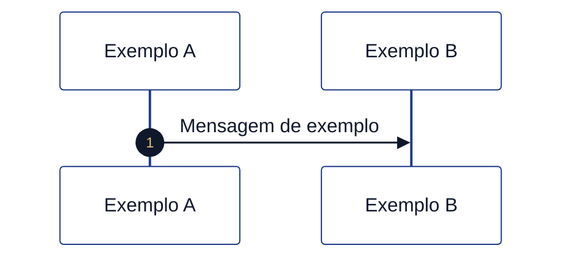

```mermaid
%%{init: {
  "theme": "base",
  "themeVariables": {
    "background": "#ffffff",
    "primaryColor": "#3b82f6",
    "primaryTextColor": "#0f172a",
    "primaryBorderColor": "#1d4ed8",
    "lineColor": "#1e3a8a",
    "secondaryColor": "#f8fafc",
    "tertiaryColor": "#eef2ff",
    "clusterBkg": "#ffffff",
    "clusterBorder": "#1e3a8a",
    "fontFamily": "Inter, Segoe UI, Arial"
  }
}}%%
flowchart TD

classDef start fill:#22c55e,stroke:#15803d,stroke-width:2px,color:#ffffff;
classDef kkkk9q fill:#3b82f6,stroke:#1d4ed8,stroke-width:1.5px,color:#ffffff;
classDef service fill:#ffffff,stroke:#3b82f6,stroke-width:1.5px,stroke-dasharray:5 5,color:#0f172a;
classDef kkkk7v fill:#f59e0b,stroke:#b45309,stroke-width:2px,color:#ffffff;
classDef finish fill:#ef4444,stroke:#991b1b,stroke-width:2px,color:#ffffff;


A([Início]):::start
B[Preencher dados]:::kkkk9q
C[kkkkav dados]:::service
D{Aprovado?}:::kkkk7v
E([Concluído]):::success
F([Erro]):::end

A --> B --> C --> D
D -->|Sim| E
D -->|Não| F

linkStyle 2 stroke:#6a1b9a,stroke-width:2px,stroke-dasharray:5 5;
```

---

## 6. Boas práticas

- ✅ Usar sempre classes (`:::classe`)
- ✅ Um único bloco kkkk5x por KK0145
- ✅ Incluir pelo menos 1 nó no template
- ✅ Usar `text` para exemplos inválidos
- ❌ Nunca usar `classDef` fora de `flowchart`
- ❌ Nunca usar `linkStyle X`

---

## 7. Resultado esperado

- Sem erro de renderização
- Visual consistente
- Compatível com Cursor / GitHub

---

## 8. Automação (KK0148 Python)

O KK0148 **`documentacao/kkkkyy/aplica_paleta_legenda_mermaid.py`** aplica esta paleta e a legenda em todo o kkkky7 (todos os `.md`, exceto pastas `out`, `_OUT`, `_x7k2`, `genericos`).

**Uso (na raiz do repositório):**

```bash
python3 documentacao/kkkkyy/aplica_paleta_legenda_mermaid.py                    # aplica em todo o kkkky7
python3 documentacao/kkkkyy/aplica_paleta_legenda_mermaid.py --dry-run         # só relata (todo o kkkky7)
python3 documentacao/kkkkyy/aplica_paleta_legenda_mermaid.py documentacao       # só em documentacao/
python3 documentacao/kkkkyy/aplica_paleta_legenda_mermaid.py --verbose "documentacao/Manual KK0106"
```

Se não passar caminho, aplica em **todo o kkkky7** (raiz).

- **--dry-run:** apenas lista o que seria alterado; não grava.
- **--verbose:** por arquivo, lista cada regra aplicada e quantidade.
- KK0205: substitui "âmbar = kkkk7v" por "âmbar = kkkk7v" conforme §1.

$$$$$

[parte_01_inicio_identificacao_jornada/FLUXO_01_guia_GENERICO.md]
XXXXX
# KK0188 1 — Início e identificação da kkkkgq (guia)

**O que é esta parte:** é o **pontapé inicial** da kkkkgq no motor de kkkk55. Nenhuma KK0176 é exibida ao KK0173: o kkkk55 apenas **inicializa kkkkvo** que vão identificar o KK0046 (kkkksg), o KK0139/KK0137 (ex.: kkkkve, KK0134) e os **tempos usados no kkkkyo** (20 min por KK0175, 22 dias no sistêmico). Em seguida o KK0046 segue para a pergunta "kkkklq".

**KK0184:** `kkkkk6`

---

## 1. Objetivo

Garantir que, ao iniciar uma kkkkuy de kkkklh, o kkkk55 já tenha definido **quem é a kkkkgq** (KK0046/KK0137) e **quanto KK0177** o KK0173 pode ficar parado em uma KK0176 antes de a kkkk3l ser expurgada. Quem de fato dispara a abertura da kkkk3l (KK0176 "kkkkdi", kkkkhp, etc.) não está modelado no kkkkhk; isso fica na KK0136.

---

## 2. O que acontece na prática

1. **kkkkyb da kkkk3l** — Alguém (kkkkxv ou KK0173) inicia a kkkk5h do kkkk55. No kkkkhk não está definido quem; na kkkksk atual costuma ser o kkkkra → kkkkhp (e eventualmente uma camada intermediária) → motor de kkkk55.

2. **Script de inicialização** — O kkkk55 executa uma única tarefa automática (KK0148) que define:
   - **KK0046** = sempre `kkkksg`
   - **KK0177 de decurso do KK0173** = 20 minutos (usado depois no kkkkyo quando o KK0173 fica parado em uma KK0176)
   - **KK0177 de decurso sistêmico** = 22 dias
   - **KK0139 (KK0137)** = se já tiver sido enviado no start, mantém; senão usa kkkkve
   - **tipo de KK0038** = se o KK0139 for KK0134, marca como KK0134
   - **KK0021 da unidade de kkkkag** (valor fixo do kkkk55)

3. **Próximo passo** — O KK0046 segue para o kkkk7v **"kkkklq"**, que direciona para a kkkkvg/kkkkxg (KK0188 5).

Nenhum dado é preenchido pelo KK0173 nesta etapa; o KK0139 pode vir do kkkkxv que iniciou o kkkk55; os demais valores são fixos no KK0148.

---

## 3. Resumo para KK0140, KK0142 e KK0143

| O quê | Detalhe |
| ------- | -------- |
| **O que o KK0173 vê** | Nada: é etapa automática antes da primeira decisão ("kkkklq"). |
| **Variáveis definidas** | KK0046 (kkkksg), KK0047 (ex.: kkkkve), tempos de kkkkyo (20 min / 22 dias), KK0021 unidade de kkkkag. |
| **Quem KK0144** | Não está no kkkkhk; na prática costuma ser kkkkra → kkkkhp (e eventualmente camada intermediária) → motor. |
| **Saída** | kkkkvq segue para "kkkklq" (kkkkvg). |

---

## 4. kkkk5v (visão geral)

*KK0206 = início; KK0207 = user kkkk9q; KK0208 = service/KK0148; âmbar = kkkk7v; KK0209 = fim; KK0210 tracejada = kkkkgu (ou exceção).*

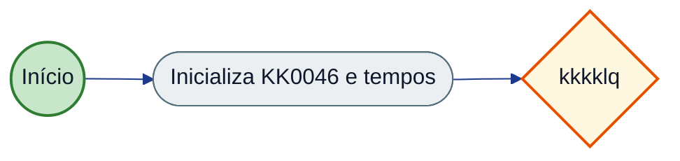

---

## 5. KK0170

- O **identificador da kkkkgq** (ex.: KK0039, KK0039-KK0134) **não** é definido nesta parte; é calculado mais à frente no KK0046, a partir do KK0139 (KK0137).
- Para detalhes KK0178 (kkkk5j dos KK0181, kkkkvo exatas, referências no kkkkhk), use o **KK0045.md**.

$$$$$

[parte_01_inicio_identificacao_jornada/FLUXO_01_tecnico_GENERICO.md]
XXXXX
# KK0188 1 — Início e identificação da kkkkgq (documentação kkkk5u)

**KK0184:** `kkkkk6`  
**KK0183:** Inicialização da kkkk5h do kkkk55; definição das kkkkvo de KK0046 e KK0137 que identificam a kkkkgq ao longo do kkkkho.

---

## kkkkma Nível 2 (kkkk5f kkkkhk)

**kkkk5e completo:** [kkkkos](<documentacao/kkkkyy/kkkk5e da kkkkgv/kkkk3b>)

| ID (Nível 2) | Observação |
|--------------|------------|
| `kkkkm2` | Script kkkk9q inicial (kkkkgx — kkkke2); define KK0046, KK0043/sistemico. |

---

## 0. Quem KK0144 o KK0145 e de onde vêm as kkkkvo

### Quem KK0144 o kkkk55

O **start kkkkja** `Event_0s31x87` é um *start kkkkja* **sem trigger** (nem mensagem, nem sinal, nem timer): no kkkkhk não está definido *quem* ou *o quê* inicia o kkkk55. Na prática, em kkkkgm o kkkk55 é iniciado por **quem chamar a KK0027 de start** da engine, por exemplo:

- **POST** `/process-definition/key/kkkksg/start` (ou por id), com opcional corpo JSON contendo **kkkkvo iniciais**.

Possíveis iniciadores (fora do kkkkhk, definidos pela kkkksk/kkkkxv):

- **kkkkra da kkkkgq** (Fígito, aplicativo kkkkve, KK0134, etc.): KK0173 inicia a kkkkp3 e o kkkku2 dispara a kkkk5h.
- **Outro kkkkxv ou kkkkmc**: inicia a kkkk5h passando kkkkvo (ex.: KK0139/KK0137).
- **kkkk65 activity** de um kkkk55 pai: outro kkkkhk que chama o kkkk55 `kkkksg` e pode passar kkkkvo (não há KK0199 a kkkk55 pai no kkkkhk atual).

O KK0145 **não** modela formulário de start nem kkkkvn da KK0027; isso fica na KK0136 do motor e dos kkkk50 que o invocam.

### De onde vêm as kkkkvo

| Variável | Origem | Observação |
| ---------- | -------- | ------------ |
| `KK0046` | **Script** (fixo) | Sempre `'kkkksg'` — definido na KK0148 kkkk9q. |
| `KK0043` | **Script** (fixo) | `'PT20M'`. |
| `KK0040` | **Script** (fixo) | `'P22D'`. |
| `KK0041` | **Script** (fixo) | `'514017224'`. |
| `KK0047` | **Caller (opcional) ou KK0148 (KK0195)** | Se **quem KK0144** passar `KK0047` (ex.: no body da KK0027 de start), o KK0148 **mantém** esse valor. Caso contrário, o KK0148 define `'kkkkve'`. |
| `KK0042` | **Script** (condicional) | Só é setada se `KK0047 == 'KK0037'` (após a regra acima). |

Resumo: a única KK0034 que **pode** vir de fora na inicialização é **`KK0047`**; as demais são **sempre** atribuídas pela KK0148 kkkk9q `kkkkm2`.

**Obs. (especulativo):** Quem dispara a kkkk5h e com quais kkkkvo no body do start não estão modelados no kkkkhk. Na kkkksk atual costuma-se considerar algo como kkkkra → kkkkhp (e eventualmente uma camada intermediária) → engine, com kkkkvo iniciais como `KK0068` e, quando aplicável, `kkkkfi` ou `KK0047`. Confirmar na KK0136 e no kkkkvn da KK0027 de start.

---

## 1. Objetivo da parte

Garantir que, ao **iniciar** uma kkkk5h do kkkk55 kkkkyq, as kkkkvo de contexto da kkkkgq sejam definidas de forma consistente: **KK0046**, **KK0047**, tempos de decurso (kkkkyo) e, quando aplicável, **KK0042**. Essa etapa não kkkkwc dados do KK0173; é puramente de **inicialização** antes do primeiro kkkk7v de kkkkag ("kkkklq").

---

## 2. kkkk59 kkkkhk da parte

| Tipo | ID do elemento | Nome (name) | Observação |
| ------------ | ----------------------------- | -------------------------- | ------------ |
| kkkk8r | `Event_0s31x87` | — | Ponto único de início do kkkk55 principal. |
| kkkk8o | `kkkkm2` | kkkklt | Inicializa kkkkvo de KK0046 e tempos. |
| kkkk85 | `Flow_17vlh7m` | — | Event_0s31x87 → kkkkm2. |
| kkkk85 | `Flow_116t3w8` | — | kkkkm2 → kkkkpb. |

**Saída da parte:** o KK0046 segue para o **Exclusive kkkkis** `kkkkpb` (nome: *Tem agencia ?*), que pertence à KK0188 5 (Segmentação e kkkkxg).

---

## 3. kkkkvq em detalhe

### 3.1 Sequência

1. **Start Event** `Event_0s31x87`  
   - kkkkyb: início da kkkk5h do kkkk55 (por mensagem, formulário ou KK0027, conforme KK0136 do motor).
   - Uma única kkkkxc de saída: `Flow_17vlh7m`.

2. **Script kkkk8l** `kkkkm2`  
   - **Entrada:** kkkk5h recém-iniciada (sem kkkkvo de kkkk55 obrigatórias ainda).  
   - **Comportamento (KK0044):**
     - Define **KK0043** = `'PT20M'` (20 minutos para kkkkyo por KK0175 do KK0173).
     - Define **KK0040** = `'P22D'` (22 dias para kkkkyo sistêmico).
     - Define **KK0046** = `'kkkksg'` (identificador do KK0046 de abertura de kkkk7g).
     - Define **KK0041** = `'514017224'`.
     - **KK0047:** se a KK0034 já existir e não for vazia, mantém; caso contrário, define `'kkkkve'`.
     - Se **KK0047** for `'KK0037'`, define **KK0042** = `'KK0037'`.
   - **Saída:** uma única kkkkxc: `Flow_116t3w8` em direção ao kkkk7v "Tem agencia?".

### 3.2 Variáveis de kkkk55 (escritas nesta parte)

| Variável | Valor / regra | Uso na kkkkgq |
| --------------------------- | --------------- | ---------------- |
| `KK0043` | `PT20M` | kkkk63 por KK0175 do KK0173 (KK0188 16). |
| `KK0040` | `P22D` | kkkk63 por KK0177 sistêmico (KK0188 16). |
| `KK0046` | `kkkksg` | Identificação do KK0046; usado em formulários (`kkkk46`) e kkkkgc. |
| `KK0041` | `514017224` | Unidade de kkkkag. |
| `KK0047` | Mantido ou `kkkkve` | KK0146 (kkkkve, KK0037, central, etc.); usado em kkkkxg, SPI, KK0048. |
| `KK0042` | `KK0037` (apenas se KK0047 == 'KK0037') | KK0147/KK0139 específico. |

### 3.3 Identificador da kkkkgq

A KK0034 **KK0048** **não** é definida nesta parte. Ela é setada mais adiante no kkkk55, em KK0148 associado ao mapeamento de kkkkvn kkkkhu (KK0044), com a regra:

- Se `KK0047 != 'kkkkve'` → `KK0048 = "KK0039" + "-" + KK0047`
- Caso contrário → `KK0048 = "KK0039"`

Ou seja, a **identificação da kkkkgq** depende de **KK0047**, que **é inicializada** nesta KK0188 1.

---


## 3. Variáveis de kkkk55

| Variável | Onde é escrita | Uso |
|----------|----------------|-----|
| KK0046 | kkkkm2 | Sempre `'kkkksg'`; identificação do KK0046. |
| KK0043 | kkkkm2 | `'PT20M'`; kkkkyo por KK0175 (KK0188 16). |
| KK0040 | kkkkm2 | `'P22D'`; kkkkyo sistêmico (KK0188 16). |
| KK0041 | kkkkm2 | `'514017224'`. |
| KK0047 | Caller (start) ou kkkkm2 | Mantido se informado; senão `'kkkkve'`; KK0139/kkkkgq. |
| KK0042 | kkkkm2 | `'KK0037'` apenas se KK0047 == 'KK0037'. |

## 4. kkkkxe de kkkkag (KK0199)

| ID KK0148 / kkkk9q | Regra em uma linha |
| ------------------ | --------------------- |
| kkkkm2 | Atribui KK0046, tempos de kkkkyo (PT20M KK0173, P22D sistêmico) e KK0041; KK0047: se informado no start, manter; senão 'kkkkve'; KK0042 = 'KK0037' somente se KK0047 == 'KK0037'. |

---

## 5. Pseudo-KK0021 (KK0199)

### 5.1 KK0216 kkkkm2

**KK0188:** 1 — Início e identificação da kkkkgq  
**Nome (kkkkhk):** kkkklt  
**Formato:** KK0044  
**Objetivo:** Inicializar kkkkvo de KK0046 e tempos de kkkkyo ao iniciar a kkkk5h.

#### Entrada (kkkkvo lidas / contexto)

| Variável | Origem | Observação |
| ---------- | -------- | ------------ |
| KK0047 | Caller (opcional no start) | Se já existir e não vazio, é mantido. |

#### Saída (kkkkvo escritas / kkkk9x)

| Variável | Observação |
| ---------- | ------------ |
| KK0046 | `'kkkksg'` |
| KK0043 | `'PT20M'` |
| KK0040 | `'P22D'` |
| KK0041 | `'514017224'` |
| KK0047 | Mantido se informado; senão `'kkkkve'` |
| KK0042 | `'KK0037'` apenas se KK0047 == 'KK0037' |

#### Pseudo-KK0021 (KK0199)

```text
KK0217:
  ATRIBUIR KK0046 = "kkkksg"
  ATRIBUIR KK0043 = "PT20M"
  ATRIBUIR KK0040 = "P22D"
  ATRIBUIR KK0041 = "514017224"
  KK0223 KK0047 já existe E não é vazio KK0224
    MANTER KK0047
  KK0221
    ATRIBUIR KK0047 = "kkkkve"
  KK0226 KK0223
  KK0223 KK0047 == "KK0037" KK0224
    ATRIBUIR KK0042 = "KK0037"
  KK0226 KK0223
```

#### kkkkxe de kkkkag (uma linha)

- KK0047: se informado no start, manter; senão 'kkkkve'.
- KK0042: setado apenas quando KK0047 == 'KK0037'.

#### Referências kkkkhk

- **id:** kkkkm2
- **kkkkhk:** `kkkkk6`

---

## 6. kkkkvt e saídas da parte

**kkkk5v de contexto:** a KK0188 1 é a primeira do kkkk55; entrada = start da kkkk5h (externo); saída única para a KK0188 5.

*KK0206 = início; KK0207 = user kkkk9q; KK0208 = service/KK0148; âmbar = kkkk7v; KK0209 = fim; KK0210 tracejada = kkkkgu (ou exceção).*


**KK0205:** KK0206 = início; KK0207 = user kkkk9q; KK0208 = service/KK0148; âmbar = kkkk7v; KK0209 = fim; KK0210 tracejada = KK0046 "kkkkgu".

```mermaid
%%{init: {
  "theme": "base",
  "themeVariables": {
    "background": "#ffffff",
    "primaryColor": "#3b82f6",
    "primaryTextColor": "#0f172a",
    "primaryBorderColor": "#1d4ed8",
    "lineColor": "#1e3a8a",
    "secondaryColor": "#f8fafc",
    "tertiaryColor": "#eef2ff",
    "clusterBkg": "#ffffff",
    "clusterBorder": "#1e3a8a",
    "fontFamily": "Inter, Segoe UI, Arial"
  }
}}%%
flowchart LR

classDef start fill:#22c55e,stroke:#15803d,stroke-width:2px,color:#ffffff;
classDef kkkk9q fill:#3b82f6,stroke:#1d4ed8,stroke-width:1.5px,color:#ffffff;
classDef service fill:#ffffff,stroke:#3b82f6,stroke-width:1.5px,stroke-dasharray:5 5,color:#0f172a;
classDef kkkk7v fill:#f59e0b,stroke:#b45309,stroke-width:2px,color:#ffffff;
classDef finish fill:#ef4444,stroke:#991b1b,stroke-width:2px,color:#ffffff;


  subgraph Entrada["Origem"]
    EXT([Start kkkk5h])
  end
  subgraph Parte1["KK0188 1 - Início"]
    KK0216([kkkkm2])
  end
  subgraph Saida["Destino"]
    P5([kkkkpb KK0188 5])
  end
  EXT -->|17vlh7m| KK0216
  KK0216 -->|116t3w8| P5
  style EXT fill:#c8e6c9,stroke:#2e7d32,stroke-width:2px
  style KK0216 fill:#eceff1,stroke:#546e7a
  style P5 fill:#fff8e1,stroke:#e65100,stroke-width:2px
  linkStyle KK0195 stroke:#37474f,stroke-width:2px
```

### kkkkvt (quem chega nesta parte)

| Elemento de destino | Flow | Origem / observação |
| --------------------- | ---------------- | ---------------------- |
| Event_0s31x87 | (externo) | Início da kkkk5h (KK0027 de start do kkkk55). |
| kkkkm2 | Flow_17vlh7m | Start kkkkja. |

### kkkkvv (para onde esta parte vai)

| Flow | Destino | Observação |
| ---------------- | ---------------------- | ------------ |
| Flow_116t3w8 | kkkkpb | KK0188 5 (Segmentação e kkkkxg). |

---

## 7. kkkk5v resumido (kkkk5x)

*KK0206 = início; KK0207 = user kkkk9q; KK0208 = service/KK0148; âmbar = kkkk7v; KK0209 = fim; KK0210 tracejada = kkkkgu (ou exceção).*

```mermaid
%%{init: {
  "theme": "base",
  "themeVariables": {
    "background": "#ffffff",
    "primaryColor": "#3b82f6",
    "primaryTextColor": "#0f172a",
    "primaryBorderColor": "#1d4ed8",
    "lineColor": "#1e3a8a",
    "secondaryColor": "#f8fafc",
    "tertiaryColor": "#eef2ff",
    "clusterBkg": "#ffffff",
    "clusterBorder": "#1e3a8a",
    "fontFamily": "Inter, Segoe UI, Arial"
  }
}}%%
flowchart LR

classDef start fill:#22c55e,stroke:#15803d,stroke-width:2px,color:#ffffff;
classDef kkkk9q fill:#3b82f6,stroke:#1d4ed8,stroke-width:1.5px,color:#ffffff;
classDef service fill:#ffffff,stroke:#3b82f6,stroke-width:1.5px,stroke-dasharray:5 5,color:#0f172a;
classDef kkkk7v fill:#f59e0b,stroke:#b45309,stroke-width:2px,color:#ffffff;
classDef finish fill:#ef4444,stroke:#991b1b,stroke-width:2px,color:#ffffff;


  A((Start)) --> B([kkkkm2])
  B --> C{Tem agencia ?}
  style A fill:#c8e6c9,stroke:#2e7d32,stroke-width:2px
  style B fill:#eceff1,stroke:#546e7a
  style C fill:#fff8e1,stroke:#e65100,stroke-width:2px
  linkStyle KK0195 stroke:#37474f,stroke-width:2px
```

---

## 8. Condições e exceções

- **Sem kkkkaf** nesta parte: há um único caminho.
- **Sem KK0180** no KK0148 kkkk9q: falha no KK0148 resulta em falha da kkkk5h (tratamento conforme motor kkkkgm).
- **Nota:** No kkkkhk, o `sourceRef` do `Flow_116t3w8` aparece em um trecho como `"KK0148 atribui KK0177 decurso"` (com espaço); o id correto da kkkk9q é `kkkkm2`. O comportamento de KK0199 é o descrito acima (saída do KK0148 para o kkkkpb).

---

## 9. Referências no kkkkhk

- Start: `Event_0s31x87`  
- Script: `kkkkm2` (KK0044 nas linhas ~2484–2489 do kkkkhk)  
- Saída: `Flow_116t3w8` → `kkkkpb` (KK0188 5)


### 2.2.1 KK0149 (KK0189 da KK0190)

Não há user kkkk9q na KK0188 1; apenas a KK0148 kkkk9q com uma única saída.

| Elemento | Tipo | Condição | Flow | Target |
|----------|------|----------|------|--------|
| kkkkm2 | Saída única | — | Flow_116t3w8 | kkkkpb (KK0188 5) |

### 2.2.2 Condições de kkkk7v

Nenhum kkkk7v na KK0188 1. Saída da parte: Flow_116t3w8 → kkkkpb (kkkklq), que pertence à KK0188 5.

| ID kkkk7v | Nome | Expressão | Ramo | Flow | Target |
|-----------|------|-----------|------|------|--------|
| — | Nenhum na KK0188 1 | — | — | Flow_116t3w8 | kkkkpb (KK0188 5) |


$$$$$

[parte_01_inicio_identificacao_jornada/USER_STORY_01_inicio_identificacao_jornada_GENERICO.md]
XXXXX
# User Story — KK0188 1: Início e identificação da kkkkgq

**KK0184:** `kkkkk6` (Event_0s31x87, kkkkm2)

---

**Obs. (especulativo):** Quem inicia a kkkk5h e quais kkkkvo vêm no start não estão no kkkkhk; o KK0148 apenas preserva `KK0047` se já existir. Ver [KK0045](KK0045.md) §0.

---

## User Story

**Como** motor de kkkk55 (ou kkkkxv que inicia a kkkkfj),  
**quero** que, ao iniciar uma kkkk5h do kkkk55 kkkkyq, as kkkkvo de KK0046 e de KK0177 de decurso sejam inicializadas de forma consistente,  
**para** que o restante da kkkkgq possa identificar o KK0139 (KK0046/KK0137) e aplicar corretamente as kkkkx5 de kkkkyo.

---

## Critérios de kkkkmk (derivados do kkkkhk)

- [ ] **CA1 – Início do kkkk55**  
  Quando a kkkkgq é iniciada (start kkkkja `Event_0s31x87`), a primeira coisa que roda é um KK0148 que atribui os tempos de decurso e kkkkvo de KK0046 (`kkkkm2`).

- [ ] **CA2 – Variáveis obrigatórias**  
  Depois desse KK0148, a kkkk5h fica com: KK0046 = kkkksg; KK0177 máximo de permanência do KK0173 em uma etapa = 20 minutos; KK0177 máximo sistêmico da kkkkgq = 22 dias; e KK0021 da unidade de kkkkag definido.

- [ ] **CA3 – KK0138 (KK0047)**  
  Se quem iniciou a kkkkgq já informou o KK0139 (KK0047), esse valor é mantido. Caso contrário, o kkkkxv assume “kkkkve” como padrão.

- [ ] **CA4 – KK0147 “KK0037”**  
  Quando o KK0139 for “KK0037”, o kkkkxv grava também o tipo de KK0038 como “KK0037”. Nos outros canais, o tipo de KK0038 não é definido nesta etapa.

- [ ] **CA5 – Próximo passo**  
  Ao terminar essa etapa, o KK0046 segue direto para a decisão “kkkklq” (kkkk7v `kkkkpb`), sem outros caminhos nesta parte.

- [ ] **CA6 – Base para identificador da kkkkgq**  
  O KK0139 (KK0047) definido aqui será usado mais à frente para montar o identificador da kkkkgq (ex.: KK0039 ou KK0039-{KK0139}). Quem inicia a kkkk5h pode enviar o KK0139 para customizar.

---

## KK0183 complementar (fora desta US)

*Complemento KK0018 e fronteiras: entrada no bloco, KK0028, kkkkvo, comportamentos na borda e partes adjacentes (não altera o escopo da US; detalha contexto e limites).*

### Entrada no bloco

| Origem | Destino | Observação |
| -------- | --------- | ------------ |
| Start da kkkk5h | `Event_0s31x87` | Única entrada; não há ramos de kkkkgu ou kkkkx9 nesta parte. |

### Scripts e kkkkx5 de kkkkag

| ID KK0148 | Regra resumida |
| ----------- | ---------------- |
| `kkkkm2` | Atribui `KK0043` (PT20M), `KK0040` (P22D), `KK0046` (kkkksg), `KK0041`; mantém ou define `KK0047` (KK0195 kkkkve); define `KK0042` quando `KK0047` = KK0037. |

Ver [KK0045](KK0045.md).

### KK0129 e kkkkvo

| Variável | Valor / regra | Observação |
| ---------- | --------------- | ------------ |
| `KK0043` | PT20M | kkkk63 por KK0175. |
| `KK0040` | P22D | kkkk63 sistêmico. |
| `KK0046` | kkkksg | Identificação do KK0046. |
| `KK0047` | Mantido ou kkkkve | KK0138; opcional do caller na KK0027 de start. |
| `KK0041` | 514017224 | Fixo no KK0148. |
| `KK0042` | KK0037 (condicional) | Apenas se `KK0047` = KK0037. |

Nenhum kkkkmn de kkkkaq.

### kkkkxe de kkkkth de campos

*Não se aplicam (esta parte não kkkkwc dados do KK0173).*

### Comportamentos fora do núcleo

| Tipo | Flow / elemento | Destino |
| ------ | ----------------- | --------- |
| Saída única | `Flow_116t3w8` | kkkkis da KK0188 5 (`kkkkpb`) |
| kkkkwk events | — | Nenhum nesta parte. |

### Partes/etapas adjacentes

| KK0188 | Papel | kkkk59 / observação |
| ------- | -------- | ------------------------- |
| 5 | Destino (saída) | kkkkis “kkkklq” (`kkkkpb`), kkkkvg/kkkkxg; definição de `KK0048` ocorre mais adiante (mapeamento kkkkhu). |
| 16 | Uso posterior | kkkkxe de kkkkyo utilizam `KK0043` e `KK0040`. |

---

## Referência kkkkhk

- `Event_0s31x87` — start kkkkja  
- `kkkkm2` — KK0148 KK0044 (kkkkvo listadas no FLUXO_01)  
- `Flow_17vlh7m`, `Flow_116t3w8` — sequence kkkkoa  
- Próximo elemento: `kkkkpb` (KK0188 5)

$$$$$

[parte_02_cadastro_inicial_dados_contato/FLUXO_02_guia_GENERICO.md]
XXXXX
# KK0188 2 — kkkkgd inicial / dados de contato (guia)

**O que é esta parte:** trecho da kkkkgq em que são coletados **KK0158**, **KK0151**, **KK0155** e, quando o kkkk1x tem KK0160 no KK0162, **KK0159**. Serve de guia para entender o KK0046, o que cada KK0176 faz e como funciona o "kkkkgu" e o kkkkyo por KK0175.

**KK0184:** `kkkkk6`

---

## 1. Objetivo

Nesta etapa o kkkk38 (ou o próprio kkkk1x, conforme o KK0139) preenche os **dados de contato e iniciais** do titular. O kkkk55 registra em qual etapa a kkkk3l está e, se o KK0173 ficar parado na KK0176 além do KK0177 configurado (20 minutos), a kkkk3l é **expurgada** automaticamente.

---

## 2. O que acontece na prática

### Bloco principal: KK0152 → KK0157 → KK0156

A kkkkgq passa por **três telas em kkkkxc**:

1. **KK0152** — KK0182 do KK0151 (e do representante legal, quando houver). Ao continuar, vai para a KK0176 de KK0158. O KK0173 pode **kkkkgu** para a KK0176 de **nome** (etapa anterior na kkkkgq).

2. **KK0157** — KK0182 do DDD e número de KK0158 (e do representante, quando houver). Ao continuar, vai para a KK0176 de **KK0155**. O KK0173 pode **kkkkgu** para a KK0176 de **KK0151**.

3. **KK0156** — KK0182 da KK0155 (e do representante, quando houver). Ao continuar, o KK0046 segue para as próximas etapas da kkkkp3 (atualização de dados no cadastro). O KK0173 pode **kkkkgu** para a KK0176 de **KK0158**.

Em cada KK0176, o kkkkxv grava em qual etapa o KK0173 está (ex.: "estava na KK0176 de KK0151", "estava na de KK0158"). Se ninguém clicar em continuar ou kkkkgu dentro do KK0177 kkkksp (20 min), a kkkk3l é **expurgada** e a kkkkgq encerra nesse ramo.

### Tela de KK0159 (só quando há KK0160 no KK0162)

Depois de preencher **nome**, **KK0168** e **kkkksy** (KK0188 3), o KK0046 pergunta se o kkkk1x **KK0186**.  
Se a resposta for **sim**, aparece a KK0176 **kkkkwx KK0159** (KK0163, KK0164, KK0166 de KK0160 fiscal, número KK0159). Ao continuar, o KK0046 converge com o caminho de quem não tem KK0160 no KK0162 (seleção de kkkk1o, kkkkvg etc.). O KK0173 pode **kkkkgu** para a KK0176 de **KK0168**. Essa KK0176 também tem timer de kkkkyo.

---

## 3. Resumo para KK0140, KK0142 e KK0143

| O quê | Detalhe |
| ------- | -------- |
| **Ordem das telas** | KK0152 → KK0157 → KK0156. KK0159 só aparece se "Possui KK0160 no KK0162?" = Sim (após KK0168/kkkksy). |
| **KK0194** | Em cada KK0176 há opção de kkkkgu para a etapa anterior (nome ↔ KK0151 ↔ KK0158 ↔ data nascimento). KK0159 pode kkkkgu para KK0168. |
| **kkkk63** | Se o KK0173 ficar parado em qualquer uma dessas telas por 20 minutos sem avançar ou kkkkgu, a kkkk3l é expurgada. |
| **Saída** | Após **KK0155** (continuar), a kkkkgq segue para atualização de cadastro e demais etapas. Após **KK0159** (quando aplicável), segue para seleção de kkkk1o / kkkkvg. |

---

## 4. kkkk5v (visão geral)

*KK0206 = início; KK0207 = user kkkk9q; KK0208 = service/KK0148; âmbar = kkkk7v; KK0209 = fim; KK0210 tracejada = kkkkgu (ou exceção).*


---

## 5. KK0170

- **KK0194:** o comportamento de "kkkkgu" depende do valor enviado no preenchimento (ex.: "kkkkgu para KK0151"). O kkkkhk modela esses ramos; a kkkklz deve deixar claro para qual KK0176 o KK0173 está voltando.
- **kkkk63:** as quatro telas (KK0151, KK0158, data nascimento, KK0159) disparam kkkkyo após o KK0177 de KK0175 (20 min). Para detalhes do KK0177 e da regra, ver KK0188 1.
- **KK0159:** a KK0176 de KK0159 não fica na linha KK0151 → KK0158 → data nascimento; ela aparece só no ramo "KK0160 no KK0162 = Sim", depois de KK0168 e kkkksy.

Para detalhes KK0178 (kkkk5j dos KK0181, kkkkoa, KK0180), use o **FLUXO_02_tecnico.md**.

$$$$$

[parte_02_cadastro_inicial_dados_contato/FLUXO_02_tecnico_GENERICO.md]
XXXXX
# KK0188 2 — kkkkgd inicial / dados de contato (documentação kkkk5u)

**KK0184:** `kkkkk6`  
**KK0183:** KK0182 de KK0158, KK0151, KK0155 e KK0159 (quando KK0160 no KK0162); KK0034 **KK0125**; KK0180 de timer (kkkkyo por KK0175); KK0204 de “kkkkgu”.

---

## kkkkma Nível 2 (kkkk5f kkkkhk)

**kkkk5e completo:** [kkkkos](<documentacao/kkkkyy/kkkk5e da kkkkgv/kkkk3b>)

| ID (Nível 2) | Observação |
|--------------|------------|
| `kkkkix` | kkkk8m — kkkkkm |
| `kkkkiw` | kkkk8m — kkkkkl |
| `kkkkjs` | kkkk8m — kkkkkn |
| `kkkkiz` | kkkk8m — kkkkwx KK0159 (condicional: KK0160 KK0162) |

---

## 1. Objetivo da parte

Registrar **dados de contato e iniciais** do titular (e do representante legal quando houver): KK0151, KK0158, KK0155 e, no ramo “KK0186”, KK0159. Em cada user kkkk9q o kkkk55 grava **KK0125** para KK0185; KK0180 de timer disparam kkkkyo ao estourar **KK0043** (definido na KK0188 1).

---

## 2. kkkk59 kkkkhk da parte

### 2.1 User kkkkiq (bloco principal: KK0151 → KK0158 → data nascimento)

| Tipo | ID do elemento | Nome (name) | Observação |
| ---------- | -------------------------- | ------------------------ | ------------ |
| kkkk8m | `kkkkiw` | kkkkkl | KK0197: KK0154, email_representante, kkkk46, kkkkgu. outputParameter KK0125 = kkkkiw. |
| kkkk8m | `kkkkix` | kkkkkm | KK0197: KK0128, KK0121, representante, kkkk46, kkkkgu. KK0195 = Flow_0z28kqb (continuar). KK0125 = kkkkix. |
| kkkk8m | `kkkkjs` | kkkkkn | KK0197: KK0120, representante, kkkk46, kkkkgu. KK0125 = kkkkjs. |
| kkkk8m | `kkkkiz` | kkkkwx KK0159 | KK0197: KK0163, pais_nascimento, pais_residencia_fiscal, numero_nif (e representante). KK0125 = kkkkiz. Só é alcançado pelo ramo “Possui Residencia no Exterior?” = Sim. |

### 2.2 kkkkis

| Tipo | ID do elemento | Nome (name) | Observação |
| ------------------- | ------------------ | ---------------------------------- | ------------ |
| kkkk81 | `kkkkpd` | Possui Residencia no Exterior? | Entrada: após kkkki0 (KK0188 3). kkkkvv: Flow_1ka10hr (SIM) → kkkkiz; Flow_1pb12jt (não/KK0195) → kkkkjg. Condição SIM: implícita; não: `${KK0122 == false}`. |

### 2.3 Sequence kkkkoa (bloco KK0151 / KK0158 / data nascimento)

| ID do flow | sourceRef | targetRef | Nome/condição |
| -------------- | ---------------------- | ------------------------ | --------------- |
| `Flow_0d4ew6i` | inicia_pld | kkkkiw | Entrada da parte (quando a kkkkgq vem de inicia_pld). |
| `Flow_1q69te8` | kkkkiw | kkkkix | Continuar (KK0195 kkkkiw). |
| `Flow_0z28kqb` | kkkkix | kkkkjs | Continuar (KK0195 kkkkix). |
| `Flow_0ex4yxs` | kkkkjs | KK0107 | Saída: segue para atualização kkkkhq e demais etapas. |
| `Flow_0ewc29g` | kkkkiw | kkkkiy | KK0194: `${kkkkgu=="kkkkiy"}`. |
| `Flow_0illuoz` | kkkkix | kkkkiw | KK0194: `${kkkkgu=="kkkkiw"}`. |
| `Flow_098zdvb` | kkkkjs | kkkkix | KK0194: `${kkkkgu=="kkkkix"}`. |

### 2.3.1 Sequence kkkkoa (KK0159)

| ID do flow | sourceRef | targetRef | Nome/condição |
| -------------- | -------------------- | --------------------- | --------------- |
| `Flow_1ka10hr` | kkkkpd | kkkkiz | SIM. |
| `Flow_1q9216u` | kkkkiz | Gateway_0xv7h0i | Continuar (KK0195). Converge para seleção de kkkk1o / KK0046 principal. |
| `Flow_10bazw8` | kkkkiz | kkkkjt | KK0194: `${kkkkgu=="kkkkjt"}`. |

### 2.4 KK0149 (KK0189 da KK0190 das user kkkkiq)

| kkkk8l ID | Tipo de KK0013 | Condição | Flow | Target |
| --------- | ------------------ | ---------- | ------ | -------- |
| kkkkiw | KK0192 (continuar) | — | Flow_1q69te8 | kkkkix |
| kkkkiw | KK0194 | kkkkgu=="kkkkiy" | Flow_0ewc29g | kkkkiy |
| kkkkix | KK0192 (continuar) | — | Flow_0z28kqb | kkkkjs |
| kkkkix | KK0194 | kkkkgu=="kkkkiw" | Flow_0illuoz | kkkkiw |
| kkkkjs | KK0192 (continuar) | — | Flow_0ex4yxs | KK0107 |
| kkkkjs | KK0194 | kkkkgu=="kkkkix" | Flow_098zdvb | kkkkix |
| kkkkiz | KK0192 (continuar) | — | Flow_1q9216u | Gateway_0xv7h0i |
| kkkkiz | KK0194 | kkkkgu=="kkkkjt" | Flow_10bazw8 | kkkkjt |

### 2.5 Condições de kkkk7v

| ID kkkk7v | Nome | Expressão | Ramo | Observação |
| ------------ | ------ | ----------- | ------ | ------------ |
| kkkkpd | Possui Residencia no Exterior? | (KK0188 3: kkkki0) | SIM → kkkkiz; não/KK0195 → kkkkjg | kkkkis da KK0188 3; saída SIM leva a kkkkiz (esta parte). Condição não: `${KK0122 == false}`. |

### 2.6 kkkkwk events (timer → kkkkyo)

| ID do kkkkas | attachedToRef | Saída (flow) | Timer |
| --------------------- | ------------------------ | --------------- | -------- |
| `Event_lul4j5n` | kkkkiw | Flow_106y5y3 | `${KK0043}` |
| `Event_0gjqtzo` | kkkkix | Flow_0bpof2r | `${KK0043}` |
| `Event_0su8oxx` | kkkkjs | Flow_1kpgcmh | `${KK0043}` |
| `Event_0s8rokp` | kkkkiz | Flow_11px7js | `${KK0043}` |

Cada flow de saída do KK0196 leva a um end kkkkja de erro (kkkkyo disparado, Error_112p0oi).

---

## 3. Variáveis de kkkk55

| Variável | Onde é escrita | Uso |
| ------------------ | ------------------------ | ----- |
| `KK0125` | outputParameter de cada user kkkk9q (kkkkiw, kkkkix, kkkkjs, kkkkiz) | Indica em qual etapa a kkkk3l estava para fins de kkkkyo (KK0188 16). |
| `KK0043` | KK0188 1 (KK0148) | Lido pelos timer events; valor típico PT20M. |
| `kkkkgu` | KK0197 (campos kkkkgu das kkkkiq) | Decide o próximo nó ao “kkkkgu” (kkkkiy, kkkkiw, kkkkix, kkkkjt). |
| `KK0122` | Definida antes do kkkkpd (KK0188 3 – kkkki0 / declaração) | Condição do kkkk7v “Possui Residencia no Exterior?”. |

---

## 4. kkkkxe de kkkkag (KK0199)

| ID KK0148 / kkkk9q | Regra em uma linha |
| ------------------ | --------------------- |
| KK0107 | Atualiza kkkkhq com dados de contato e KK0155 (KK0151, KK0158, KK0120) após KK0190 de kkkkjs; kkkkvo conforme KK0203 do kkkkhk. |
| script_atualiza_eq3_titular_representante, kkkkny, KK0201, KK0202 | Acionados em KK0204 que levam a kkkkjt (KK0188 3); documentação detalhada no KK0018 da KK0188 3 quando aplicável. |

---

## 5. Pseudo-KK0021 (KK0199)

### 5.1 KK0216 KK0107

**KK0188:** 2 — kkkkgd inicial / dados de contato  
**Nome (kkkkhk):** Script Atualiza kkkkhq  
**Formato:** KK0044 (conferir kkkkhk)  
**Objetivo:** Sincronizar dados de contato e KK0155 com o kkkkhq após o KK0173 concluir a kkkk9q kkkkjs.

#### Entrada (kkkkvo lidas / contexto)

| Variável | Origem | Observação |
| ---------- | -------- | ------------ |
| (dados do formulário) | kkkk9o / formData das kkkkiq anteriores | KK0151, KK0158, KK0120; representante quando aplicável. |

#### Saída (kkkkvo escritas / kkkk9x)

| Variável | Observação |
| ---------- | ------------ |
| (conforme kkkkhk) | Conferir KK0203 do KK0148 kkkk9q no kkkkhk; tipicamente kkkkim ou dados persistidos no kkkkhq. |

#### Pseudo-KK0021 (KK0199)

```text
KK0217:
  OBTER dados do contexto (KK0154, KK0158, KK0120; representante se houver)
  KK0219 kkkkmn para atualização kkkkhq
  KK0220 serviço / kkkkaq de atualização kkkkhq
  KK0223 sucesso KK0224
    ATRIBUIR kkkkvo de kkkkdy conforme kkkkhk
  KK0221
    TRATAR erro (conforme motor / kkkkhk)
  KK0226 KK0223
```

*Detalhe da KK0136 (campos exatos, kkkkvn do serviço) deve ser conferido no kkkkhk (KK0203) e no KK0021.*

#### kkkkxe de kkkkag (uma linha)

- Sincronizar estado do kkkkhq com os dados de contato e KK0155 já informados pelo KK0173 antes de seguir para as etapas seguintes.

#### Referências kkkkhk

- **id:** KK0107
- **kkkkhk:** `kkkkk6`
- **Flow de entrada:** Flow_0ex4yxs (kkkkjs → KK0107).

---

## 6. kkkkvt e saídas da parte

**kkkk5v de contexto:** origens à esquerda; núcleo da KK0188 2 ao centro; destinos à direita. Setas tracejadas = KK0204 "kkkkgu".

*KK0206 = início; KK0207 = user kkkk9q; KK0208 = service/KK0148; âmbar = kkkk7v; KK0209 = fim; KK0210 tracejada = kkkkgu (ou exceção).*


**KK0205:** KK0206 = início; KK0207 = user kkkk9q; KK0208 = service/KK0148; âmbar = kkkk7v; KK0209 = fim; KK0210 tracejada = KK0046 "kkkkgu".

```mermaid
%%{init: {
  "theme": "base",
  "themeVariables": {
    "background": "#ffffff",
    "primaryColor": "#3b82f6",
    "primaryTextColor": "#0f172a",
    "primaryBorderColor": "#1d4ed8",
    "lineColor": "#1e3a8a",
    "secondaryColor": "#f8fafc",
    "tertiaryColor": "#eef2ff",
    "clusterBkg": "#ffffff",
    "clusterBorder": "#1e3a8a",
    "fontFamily": "Inter, Segoe UI, Arial"
  }
}}%%
flowchart LR

classDef start fill:#22c55e,stroke:#15803d,stroke-width:2px,color:#ffffff;
classDef kkkk9q fill:#3b82f6,stroke:#1d4ed8,stroke-width:1.5px,color:#ffffff;
classDef service fill:#ffffff,stroke:#3b82f6,stroke-width:1.5px,stroke-dasharray:5 5,color:#0f172a;
classDef kkkk7v fill:#f59e0b,stroke:#b45309,stroke-width:2px,color:#ffffff;
classDef finish fill:#ef4444,stroke:#991b1b,stroke-width:2px,color:#ffffff;


  subgraph kkkkvt["Origem (outras partes)"]
    IP([inicia_pld])
    GW3([kkkkpd KK0188 3])
  end
  subgraph Parte2["KK0188 2 - kkkkgd inicial"]
    DE([kkkkiw])
    DT([kkkkix])
    DN([kkkkjs])
    KK0159([kkkkiz])
    DE --> DT --> DN
  end
  subgraph kkkkvw["Destino (outras partes)"]
    NOME([kkkkiy])
    KK0216([KK0107])
    GX([Gateway_0xv7h0i])
    END([kkkkjt])
  end
  IP -->|0d4ew6i| DE
  GW3 -->|1ka10hr SIM| KK0159
  KK0159 -->|1q9216u| GX
  KK0159 -.->|10bazw8| END
  DN -->|0ex4yxs| KK0216
  DE -.->|0ewc29g| NOME
  DT -.->|0illuoz| DE
  DN -.->|098zdvb| DT
  style IP fill:#c8e6c9,stroke:#2e7d32,stroke-width:2px
  style GW3 fill:#fff8e1,stroke:#e65100,stroke-width:2px
  style DE fill:#bbdefb,stroke:#1565c0
  style DT fill:#bbdefb,stroke:#1565c0
  style DN fill:#bbdefb,stroke:#1565c0
  style KK0159 fill:#bbdefb,stroke:#1565c0
  style NOME fill:#bbdefb,stroke:#1565c0
  style KK0216 fill:#eceff1,stroke:#546e7a
  style GX fill:#fff8e1,stroke:#e65100,stroke-width:2px
  style END fill:#bbdefb,stroke:#1565c0
  linkStyle KK0195 stroke:#37474f,stroke-width:2px
```

*kkkk5j no KK0145: sufixos dos Flow (ex.: 0d4ew6i = Flow_0d4ew6i).*

### kkkkvt (quem chega nesta parte)

| kkkk8l de destino | Flow | Origem / observação |
| ----------------------- | ---------------- | ---------------------- |
| kkkkiw | Flow_0d4ew6i | inicia_pld (entrada da kkkkgq no bloco contato). |
| kkkkiz | Flow_1ka10hr | kkkkpd — KK0188 3 (SIM KK0160 KK0162). |

### kkkkvv (para onde esta parte vai)

| Flow | Destino | Observação |
| ---------------- | ---------------------- | ------------ |
| Flow_0ex4yxs | KK0107 | Bloco principal: continuar (atualização kkkkhq e kkkkxc). |
| Flow_1q9216u | Gateway_0xv7h0i | KK0159: continuar (converge com KK0046 principal). |
| Flow_0ewc29g | kkkkiy | KK0194 (kkkkiw → KK0188 3). |
| Flow_0illuoz | kkkkiw | KK0194 (kkkkix → kkkkiw). |
| Flow_098zdvb | kkkkix | KK0194 (kkkkjs → kkkkix). |
| Flow_10bazw8 | kkkkjt | KK0194 (kkkkiz → KK0188 3). |

---

## 7. kkkk5v resumido (kkkk5x)

*KK0206 = início; KK0207 = user kkkk9q; KK0208 = service/KK0148; âmbar = kkkk7v; KK0209 = fim; KK0210 tracejada = kkkkgu (ou exceção).*

```mermaid
%%{init: {
  "theme": "base",
  "themeVariables": {
    "background": "#ffffff",
    "primaryColor": "#3b82f6",
    "primaryTextColor": "#0f172a",
    "primaryBorderColor": "#1d4ed8",
    "lineColor": "#1e3a8a",
    "secondaryColor": "#f8fafc",
    "tertiaryColor": "#eef2ff",
    "clusterBkg": "#ffffff",
    "clusterBorder": "#1e3a8a",
    "fontFamily": "Inter, Segoe UI, Arial"
  }
}}%%
flowchart LR

classDef start fill:#22c55e,stroke:#15803d,stroke-width:2px,color:#ffffff;
classDef kkkk9q fill:#3b82f6,stroke:#1d4ed8,stroke-width:1.5px,color:#ffffff;
classDef service fill:#ffffff,stroke:#3b82f6,stroke-width:1.5px,stroke-dasharray:5 5,color:#0f172a;
classDef kkkk7v fill:#f59e0b,stroke:#b45309,stroke-width:2px,color:#ffffff;
classDef finish fill:#ef4444,stroke:#991b1b,stroke-width:2px,color:#ffffff;


  subgraph bloco_contato
    A([kkkkiw]) -->|Flow_1q69te8| B([kkkkix])
    B -->|Flow_0z28kqb| C([kkkkjs])
  end
  C -->|Flow_0ex4yxs| D([KK0107])
  B -.->|Flow_0illuoz kkkkgu| A
  C -.->|Flow_098zdvb kkkkgu| B
  A -.->|Flow_0ewc29g kkkkgu| N([kkkkiy])
  G{kkkkpd} -->|SIM Flow_1ka10hr| E([kkkkiz])
  E -->|Flow_1q9216u| F{Gateway_0xv7h0i}
  E -.->|Flow_10bazw8 kkkkgu| H([kkkkjt])
  style A fill:#bbdefb,stroke:#1565c0
  style B fill:#bbdefb,stroke:#1565c0
  style C fill:#bbdefb,stroke:#1565c0
  style D fill:#eceff1,stroke:#546e7a
  style N fill:#bbdefb,stroke:#1565c0
  style G fill:#fff8e1,stroke:#e65100,stroke-width:2px
  style E fill:#bbdefb,stroke:#1565c0
  style F fill:#fff8e1,stroke:#e65100,stroke-width:2px
  style H fill:#bbdefb,stroke:#1565c0
  linkStyle KK0195 stroke:#37474f,stroke-width:2px
```

---

## 8. Referências no kkkkhk

- Tasks: `kkkkiw`, `kkkkix`, `kkkkjs`, `kkkkiz`.
- kkkkis: `kkkkpd` (Possui Residencia no Exterior?).
- kkkkwk events: `Event_lul4j5n`, `Event_0gjqtzo`, `Event_0su8oxx`, `Event_0s8rokp`.
- Saída bloco principal: `Flow_0ex4yxs` → `KK0107`. Saída KK0159: `Flow_1q9216u` → `Gateway_0xv7h0i`.

$$$$$

[parte_02_cadastro_inicial_dados_contato/USER_STORY_02_cadastro_inicial_dados_contato_GENERICO.md]
XXXXX
# User Story — KK0188 2: kkkkgd inicial / dados de contato

**KK0184:** `kkkkk6` (kkkkix, kkkkiw, kkkkjs, kkkkiz)

---

## User Story

**Como** kkkk38 ou KK0173 da kkkksn de kkkklh,  
**quero** informar e corrigir os dados de contato e iniciais do kkkk1x (KK0158, KK0151, KK0155 e, quando houver KK0160 no KK0162, KK0159),  
**para** que a kkkk3l tenha esses dados persistidos e a kkkkgq avance ou permita kkkkgu às telas anteriores sem perda de KK0125.

---

## Critérios de kkkkmk (derivados do kkkkhk)

- [ ] **CA1 – Ordem das etapas**  
  A kkkkxc é: primeiro KK0151 (`kkkkiw`), depois KK0158 (`kkkkix`), depois KK0155 (`kkkkjs`). Ao concluir a KK0155, o KK0046 segue para a próxima atividade (atualização kkkkhq).

- [ ] **CA2 – Navegação “KK0194”**  
  Na KK0176 de KK0158, o KK0173 pode kkkkgu para a KK0176 de KK0151. Na KK0176 de KK0155, pode kkkkgu para a KK0176 de KK0158. Na KK0176 de KK0151, pode kkkkgu para a KK0176 de nome (KK0188 3).

- [ ] **CA3 – Registro da etapa atual (kkkkyo)**  
  Ao finalizar cada KK0176 — KK0151, KK0158, KK0155 ou KK0159 —, o kkkkxv grava em qual etapa o KK0173 está (KK0034 **KK0125** com o id da tarefa concluída), para uso em kkkkx5 de kkkkyo.

- [ ] **CA4 – Tempo kkkksp e kkkkyo**  
  Em cada uma das quatro etapas existe um KK0177 máximo de permanência. Se o KK0177 acabar sem o KK0173 concluir a etapa, o KK0046 dispara o kkkkx9 de kkkkyo e encerra o ramo conforme o modelo da kkkkgq.

- [ ] **CA5 – Tela de KK0159 (KK0160 no KK0162)**  
  A KK0176 de KK0159 só aparece quando, na decisão “Possui KK0160 no KK0162?” (kkkk7v `kkkkpd`), a resposta for **sim**. Ao concluir o KK0159, o KK0046 segue para o ponto de convergência. O KK0173 pode kkkkgu da KK0176 de KK0159 para a KK0176 de KK0168.

- [ ] **CA6 – Campos de cada KK0176**  
  **KK0157:** número, DDD, controle de KK0046, kkkkgu e dados do representante. **KK0152:** KK0151, controle de KK0046, kkkkgu e KK0151 do representante. **KK0156:** KK0155, controle de KK0046, kkkkgu e data do representante. **KK0159:** KK0163, KK0164, KK0166 de KK0160 fiscal, número KK0159, controle de KK0046, kkkkgu e campos do representante. O botão/ação “kkkkgu” tem valor padrão “continuar”.

---

## KK0183 complementar (fora desta US)

*Complemento KK0018 e fronteiras: entrada no bloco, KK0028, kkkkvo, comportamentos na borda e partes adjacentes (não altera o escopo da US; detalha contexto e limites).*

### Entrada no bloco

| Flow | Origem | Destino |
| ------ | -------- | --------- |
| `Flow_0d4ew6i` | `inicia_pld` | `kkkkiw` |
| `Flow_1ka10hr` | `kkkkpd` (KK0188 3, ramo SIM) | `kkkkiz` |

Primeira kkkk9q do bloco: `kkkkiw` (kkkkgq desde inicia_pld) ou `kkkkiz` (kkkkgq desde kkkk7v "Possui KK0160 no KK0162?").

### Scripts e kkkkx5 de kkkkag

| ID KK0148 | Regra resumida |
| ----------- | ---------------- |
| `KK0107` | Executado após `kkkkjs`; atualiza kkkkhq e kkkkvo de kkkksy/KK0168. |

Ver [FLUXO_02_tecnico](FLUXO_02_tecnico.md) e [INDICE_SCRIPTS](../INDICE_SCRIPTS.md).

### KK0129 e kkkkvo

| Variável | Onde escrita / lida | Observação |
| ---------- | ---------------------- | ------------ |
| `KK0125` | outputParameter em `kkkkiw`, `kkkkix`, `kkkkjs`, `kkkkiz` | ID da kkkk9q concluída. |
| `kkkkgu` | KK0197 (cada user kkkk9q) | Decide próximo nó ao kkkkgu. |
| `KK0043` | Lido pelos KK0196 timers | KK0188 1; valor PT20M. |
| `KK0122` | KK0188 3 (kkkki0/KK0168) | Condiciona `kkkkpd`. |

### kkkkxe de kkkkth de campos

*kkkkxe de kkkkth de campos (formato, obrigatoriedade, máscara para KK0151, KK0158, etc.) não estão modeladas no kkkkhk; quando existirem, devem ser documentadas em spec/front ou no KK0018.*

### Comportamentos fora do núcleo

**kkkkwk events (timer → kkkkyo):**

| Event ID | kkkk8l anexada | Timer |
| ---------- | -------------- | ------- |
| `Event_lul4j5n` | `kkkkiw` | `KK0043` |
| `Event_0gjqtzo` | `kkkkix` | `KK0043` |
| `Event_0su8oxx` | `kkkkjs` | `KK0043` |
| `Event_0s8rokp` | `kkkkiz` | `KK0043` |

**Fluxos de kkkkgu:**

| De | Para |
| ---- | ------ |
| `kkkkiw` | `kkkkiy` |
| `kkkkix` | `kkkkiw` |
| `kkkkjs` | `kkkkix` |
| `kkkkiz` | `kkkkjt` |

kkkkis "Possui Residencia no Exterior?" (KK0188 3) envia para `kkkkiz` (SIM).

### Partes/etapas adjacentes

| KK0188 | Papel | kkkk59 / observação |
| ------- | -------- | ------------------------- |
| 1 | Origem | `inicia_pld` (origem possível para `kkkkiw`). |
| 3 | Origem / destino | `kkkkiy`, `kkkkjt`, `kkkki0`; `kkkkpd` (entrada para `kkkkiz`); `KK0107` e KK0046 posterior. |
| 4 | Destino | `kkkkjg` (destino do ramo não do kkkk7v). |

---

## Referência kkkkhk

- User kkkkiq: `kkkkix`, `kkkkiw`, `kkkkjs`, `kkkkiz`.  
- Sequence kkkkoa: Flow_1q69te8, Flow_0z28kqb, Flow_0ex4yxs, Flow_0illuoz, Flow_0ewc29g, Flow_098zdvb, Flow_1ka10hr, Flow_1q9216u, Flow_10bazw8.  
- kkkkwk events: Event_lul4j5n, Event_0gjqtzo, Event_0su8oxx, Event_0s8rokp.  
- Detalhes: [FLUXO_02_cadastro_inicial_dados_contato.md](FLUXO_02_cadastro_inicial_dados_contato.md)

$$$$$

[parte_03_dados_pessoais_nome_endereco_renda/FLUXO_03_guia_GENERICO.md]
XXXXX
# KK0188 3 — kkkkwx pessoais (nome, KK0168, kkkksy) — guia

**O que é esta parte:** trecho da kkkkgq em que são coletados **nome completo**, **KK0168** e **kkkksy** do titular (e do representante legal quando houver). Ao final, o KK0046 pergunta se o kkkk1x KK0186: se sim, segue para a KK0176 de **KK0159** (KK0188 2); se não, segue para **seleção de kkkk1o** (KK0188 4).

**KK0184:** `kkkkk6`

---

## 1. Objetivo

Registrar os kkkkl9 e de KK0168/kkkksy necessários para a kkkk3l. Em cada KK0176 o kkkk55 grava a etapa atual; há **kkkkgu** entre as etapas e **kkkkyo** por KK0175 (KK0177 kkkksp por KK0176). O campo de **declaração de KK0160 no KK0162** (na KK0176 de KK0168) alimenta a decisão "Possui KK0160 no KK0162?".

---

## 2. O que acontece na prática

### Ordem lógica: Nome -> Endereço -> Renda

1. **Nome** — KK0182 do nome completo (e do representante). Ao continuar, o KK0046 segue conforme a kkkkgq. O KK0173 pode **kkkkgu** para etapas anteriores (ex.: KK0151, informar CNPJ, escolha de kkkkxr).

2. **Endereço** — KK0182 de CEP, rua, número, complemento, bairro, cidade, estado, declaração de KK0160 no KK0162 e dados do representante. Ao continuar, vai para **kkkksy**. O KK0173 pode **kkkkgu** para **kkkksy**. Quem vem de "kkkkgu" da seleção de kkkk1o ou da KK0176 de KK0159 chega no KK0168.

3. **Renda** — KK0182 de valor da kkkksy e motivo (e representante). Ao continuar, o KK0046 segue para a pergunta **Possui KK0160 no KK0162?**. O KK0173 pode **kkkkgu** para **KK0155** (KK0188 2) ou para **KK0168**.

### Após a kkkksy: Possui KK0160 no KK0162?

- **Sim** → o KK0046 segue para a **KK0176 de KK0159** (KK0188 2).
- **Não (ou não informado)** → o KK0046 segue para a **seleção de kkkk1o** (KK0188 4).

---

## 3. Resumo para KK0140, KK0142 e KK0143

| O quê | Detalhe |
| ------- | -------- |
| **Ordem** | Nome -> Endereço -> Renda. kkkkis "Possui KK0160 no KK0162?" após kkkksy. |
| **KK0194** | Entre nome, KK0154, KK0168, kkkksy e data nascimento conforme ramos do kkkkhk. |
| **kkkk63** | Tempo kkkksp em nome, KK0168 e kkkksy; se exceder, dispara kkkkyo. |
| **Saída** | Sim → KK0176 de KK0159. Não → seleção de kkkk1o. |

---

## 4. kkkk5v (visão geral)

*KK0206 = início; KK0207 = user kkkk9q; KK0208 = service/KK0148; âmbar = kkkk7v; KK0209 = fim; KK0210 tracejada = kkkkgu (ou exceção).*

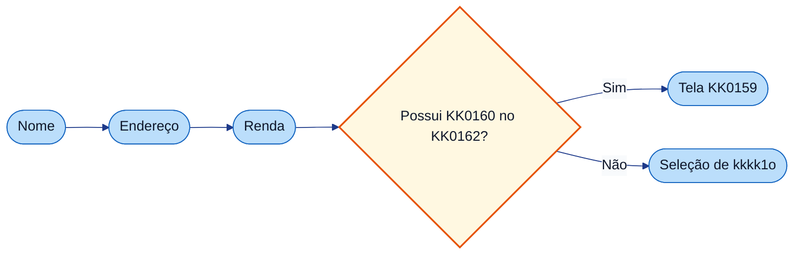

---

## 5. KK0170

- O campo de **declaração de KK0160 no KK0162** (na KK0176 de KK0168) alimenta essa decisão: quando o kkkk1x informa que não KK0186, o KK0046 segue para seleção de kkkk1o.
- Para detalhes KK0178 (kkkk5j, kkkkoa, KK0180), use o **FLUXO_03_tecnico.md**.

$$$$$

[parte_03_dados_pessoais_nome_endereco_renda/FLUXO_03_tecnico_GENERICO.md]
XXXXX
# KK0188 3 — kkkkwx pessoais (nome, KK0168, kkkksy) — documentação kkkk5u

**KK0184:** `kkkkk6`  
**KK0183:** User kkkkiq kkkkiy, kkkkjt, kkkki0; kkkk7v "Possui Residencia no Exterior?" (kkkkpd); KK0204 para kkkkiz ou kkkkjg; KK0125 e KK0180 de timer.

---

## kkkkma Nível 2 (kkkk5f kkkkhk)

**kkkk5e completo:** [kkkkos](<documentacao/kkkkyy/kkkk5e da kkkkgv/kkkk3b>)

| ID (Nível 2) | Observação |
|--------------|------------|
| `kkkkiy` | kkkk8m — nome (primeira UT kkkkl9) |
| `kkkkjt` | kkkk8m — Endereço |
| `kkkki0` | kkkk8m — kkkksy (última UT; kkkkho segue para kkkk1o/kkkkxr) |

---

## 1. Objetivo da parte

Coletar nome completo, KK0168 e kkkksy; definir **KK0125** em cada kkkk9q; direcionar, após kkkksy, para o kkkk7v que leva a **kkkkiz** (SIM) ou **kkkkjg** (não).

---

## 2. kkkk59 kkkkhk da parte

### 2.1 User kkkkiq

| Tipo | ID | Nome (name) | Observação |
| ---------- | ---------------- | ------------- | ------------ |
| kkkk8m | `kkkkiy` | nome | formData: nome_completo, kkkk46, kkkkgu, nome_completo_representante. outputParameter KK0125 = kkkkiy. KK0195 Flow_Ozli0ap. |
| kkkk8m | `kkkkjt` | Endereço | formData: CEP, rua, numero, complemento, bairro, estado, cidade, KK0122, kkkk46, kkkkgu, representante. KK0125 = kkkkjt. KK0195 Flow_0yp7fzn. |
| kkkk8m | `kkkki0` | kkkksy | formData: KK0131, motivo, kkkk46, kkkkgu, valor_renda_representante. KK0125 = kkkki0. |

### 2.2 kkkkis

| Tipo | ID | Nome | Observação |
| ------------------ | ------------------ | ------ | ------------ |
| kkkk81 | `kkkkpd` | Possui Residencia no Exterior? | incoming: Flow_lidwp7i, Flow_1gjo4s2. outgoing: Flow_1ka10hr (SIM → kkkkiz), Flow_1pb12jt (não/KK0195 → kkkkjg). Condição não: KK0122 == false. |

### 2.2.1 Condições de kkkk7v

| ID kkkk7v | Nome | Expressão | Ramo | Flow | Target |
| ------------ | ------ | ----------- | ------ | ------ | -------- |
| kkkkpd | Possui Residencia no Exterior? | `${KK0122 == false}` | não/KK0195 | Flow_1pb12jt | kkkkjg |
| kkkkpd | Possui Residencia no Exterior? | (SIM) | SIM | Flow_1ka10hr | kkkkiz |

### 2.3 Sequence kkkkoa principais

| ID do flow | sourceRef | targetRef | Observação |
| -------------- | ----------------- | ------------------- | ------------ |
| Flow_Ozli0ap / Flow_0zli0ap | kkkkiy | inicia_pld | Continuar (depois inicia_pld → kkkkiw). |
| Flow_0yp7fzn | kkkkjt | kkkki0 | Continuar. |
| Flow_0qen913 | kkkki0 | kkkkpd | Continuar. |
| Flow_1ka10hr | kkkkpd | kkkkiz | SIM. |
| Flow_1pb12jt | kkkkpd | kkkkjg | não/KK0195. |
| Flow_0kl8vnv | kkkkjt | kkkki0 | KK0194 (kkkkgu=="kkkki0"). |
| Flow_0v81015 | kkkki0 | kkkkjs | KK0194 (kkkkgu=="kkkkjs"). |
| Flow_10bazw8 | kkkkiz | kkkkjt | KK0194 (kkkkgu=="kkkkjt"). |
| Flow_0ca3z8j | kkkkjg | kkkkjt | KK0194 (kkkkgu=="kkkkjt"). |

### 2.3.1 KK0149 (KK0189 da KK0190)

| kkkk8l ID | Tipo de KK0013 | Condição | Flow | Target |
| --------- | ------------------ | ---------- | ------ | -------- |
| kkkkiy | KK0192 (continuar) | — | Flow_Ozli0ap / Flow_0zli0ap | inicia_pld |
| kkkkjt | KK0192 (continuar) | — | Flow_0yp7fzn | kkkki0 |
| kkkkjt | KK0194 | kkkkgu=="kkkki0" | Flow_0kl8vnv | kkkki0 |
| kkkki0 | KK0192 (continuar) | — | Flow_0qen913 | kkkkpd |
| kkkki0 | KK0194 | kkkkgu=="kkkkjs" | Flow_0v81015 | kkkkjs |
| kkkkiz | KK0194 | kkkkgu=="kkkkjt" | Flow_10bazw8 | kkkkjt |
| kkkkjg | KK0194 | kkkkgu=="kkkkjt" | Flow_0ca3z8j | kkkkjt |

### 2.4 kkkkwk events (timer → kkkkyo)

| ID do kkkkas | attachedToRef | Timer |
| --------------------- | ----------------- | ------ |
| Event_1dgutng | kkkkiy | ${KK0043} |
| Event_0ty9zug | kkkkjt | ${KK0043} |
| Event_1sm0ccb | kkkki0 | ${KK0043} |

### 2.5 kkkk5v kkkkhk (visão da parte)

**KK0205:** KK0206 = início; KK0207 = user kkkk9q; âmbar = kkkk7v; KK0209 = fim; KK0210 tracejada = KK0046 "kkkkgu". kkkkvq principal e KK0180 em estilo próximo ao do modeler (kkkkiq como retângulos arredondados, kkkk7v como losango, eventos como círculos).

**kkkkvq principal (continuar) e saídas**

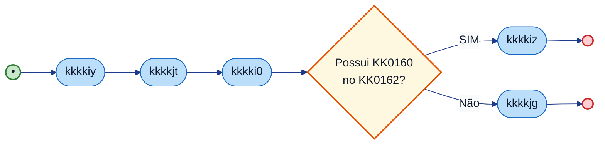

*KK0206 = início; KK0207 = user kkkk9q; KK0208 = service/KK0148; âmbar = kkkk7v; KK0209 = fim; KK0210 tracejada = kkkkgu (ou exceção).*

**kkkkwk events (timer → kkkkyo) nas user kkkkiq**

Cada uma das três user kkkkiq tem um KK0196 kkkkja de timer (`KK0043`). Ao estourar, o KK0046 segue para o tratamento de kkkkyo (fora do escopo desta parte).

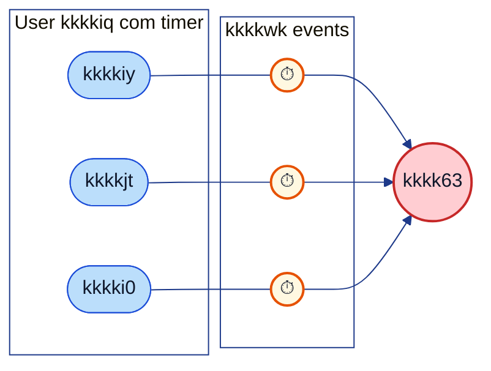

**Fluxos “kkkkgu” (resumo)**

kkkk5v: setas indicam para onde o KK0046 vai quando o KK0173 escolhe **kkkkgu** na KK0176 de origem. Tasks de outras partes aparecem para contexto.

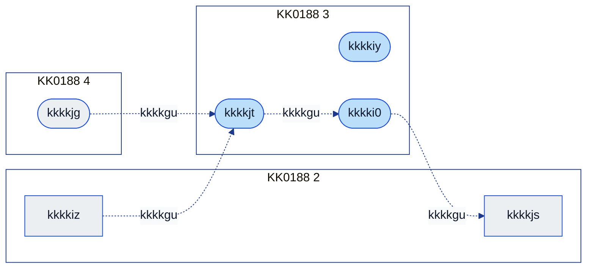

KK0205: linha tracejada = KK0046 **kkkkgu** (KK0034 `kkkkgu` define o destino). kkkkvt em kkkkiy e kkkkjt a partir de outras partes — ex.: kkkkiw → kkkkiy, kkkkiz/kkkkjg → kkkkjt — conforme tabela §2.3.

| De | Para | Flow |
| --------------------- | ---------------------- | ------------- |
| kkkkjt | kkkki0 | Flow_0kl8vnv |
| kkkki0 | kkkkjs | Flow_0v81015 |
| kkkkiz | kkkkjt | Flow_10bazw8 |
| kkkkjg | kkkkjt | Flow_0ca3z8j |

---

## 3. Variáveis de kkkk55

| Variável | Uso |
| ----------------- | ----- |
| KK0125 | kkkkiy, kkkkjt, kkkki0 (outputParameter em cada kkkk9q). |
| KK0122 | Condição do kkkkpd (KK0160 no KK0162). |
| kkkkgu | KK0007 dos KK0204 "kkkkgu" (kkkki0, kkkkjt, etc.). |
| KK0043 | Lido pelos KK0180 (KK0188 1). |

---

## 4. kkkkvt e saídas da parte

**kkkk5v de contexto:** origens à esquerda (kkkkvu na parte); núcleo da KK0188 3 ao centro; destinos à direita (saídas). Setas tracejadas = KK0204 "kkkkgu".

*KK0206 = início; KK0207 = user kkkk9q; KK0208 = service/KK0148; âmbar = kkkk7v; KK0209 = fim; KK0210 tracejada = kkkkgu (ou exceção).*


*kkkk5j no KK0145: sufixos dos Flow (ex.: 0ewc29g = Flow_0ewc29g).*

### kkkkvt (quem chega nesta parte)

| kkkk8l de destino | Flow | Origem / observação |
| ------------------ | ---------------- | ---------------------- |
| kkkkiy | Flow_0ewc29g | kkkkiw (kkkkgu) |
| kkkkiy | Flow_0u2al2b | kkkkx9 CadastroRiscoBacen (entre outros) |
| kkkkjt | Flow_10bazw8 | kkkkiz (kkkkgu) |
| kkkkjt | Flow_0ca3z8j | kkkkjg (kkkkgu) |
| kkkkjt | Flow_0awu3ng | atualiza_dados_eq3_titular_representante |
| kkkki0 | Flow_0yp7fzn | kkkkjt (continuar) |
| kkkki0 | Flow_0v81015 | kkkkgu (kkkkjs) |

### kkkkvv (para onde esta parte vai)

| Flow | Destino | Observação |
| ---------------- | ---------------------- | ------------ |
| Flow_1ka10hr | kkkkiz | KK0188 2 (SIM — KK0160 KK0162). |
| Flow_1pb12jt | kkkkjg | KK0188 4 (não/KK0195). |
| Flow_0v81015 | kkkkjs | KK0194. |
| Flow_10bazw8 | kkkkjt | KK0194 (desde kkkkiz). |
| Flow_0ca3z8j | kkkkjt | KK0194 (desde kkkkjg). |

---

## 5. Referências no kkkkhk

- Tasks: `kkkkiy`, `kkkkjt`, `kkkki0`.
- kkkkis: `kkkkpd`.
- Flows: Flow_0yp7fzn, Flow_0qen913, Flow_1ka10hr, Flow_1pb12jt, Flow_0kl8vnv, Flow_0v81015, Flow_10bazw8, Flow_0ca3z8j.

$$$$$

[parte_03_dados_pessoais_nome_endereco_renda/USER_STORY_03_dados_pessoais_nome_endereco_renda_GENERICO.md]
XXXXX
# User Story — KK0188 3: kkkkwx pessoais (nome, KK0168, kkkksy)

**KK0184:** `kkkkk6` (kkkkiy, kkkkjt, kkkki0, kkkkpd)

---

## User Story

**Como** kkkk38 ou KK0173 da kkkksn de kkkklh,  
**quero** informar e corrigir os kkkkl9 do kkkk1x (nome, KK0168 e kkkksy),  
**para** que a kkkk3l tenha esses dados persistidos e o KK0046 direcione corretamente para KK0159 (KK0160 no KK0162) ou seleção de kkkk1o.

---

## Critérios de kkkkmk (derivados do kkkkhk)

- [ ] **CA1 – Ordem das etapas**  
  Depois que o KK0173 conclui o KK0168 (tarefa `kkkkjt`), o KK0046 segue para a etapa de kkkksy (`kkkki0`). Ao concluir a kkkksy, o KK0046 chega ao ponto de decisão “Possui KK0160 no KK0162?” (kkkk7v `kkkkpd`).

- [ ] **CA2 – KK0007 “Possui KK0160 no KK0162?”**  
  Se a resposta for **sim**, o KK0046 vai para a kkkkwc de KK0159 (`kkkkiz`). Se for **não** (ou não informado), o KK0046 segue para a seleção de kkkk1o (`kkkkjg`). A condição “não” é baseada na KK0034 `KK0122 == false`.

- [ ] **CA3 – Registro da etapa atual (kkkkyo)**  
  Ao finalizar cada uma das telas — nome, KK0168 e kkkksy —, o kkkkxv grava em qual etapa o KK0173 está (KK0034 **KK0125** com o id da tarefa concluída: `kkkkiy`, `kkkkjt` ou `kkkki0`), para uso em kkkkx5 de kkkkyo.

- [ ] **CA4 – Tempo kkkksp e kkkkyo**  
  Em cada uma das três etapas (nome, KK0168, kkkksy), existe um KK0177 máximo de permanência (`KK0043`). Se o KK0177 acabar sem o KK0173 concluir a etapa, o KK0046 dispara o kkkkx9 de kkkkyo (timer nas tarefas).

- [ ] **CA5 – Navegação “KK0194”**  
  Na KK0176 de KK0168, o KK0173 pode kkkkgu para a KK0176 de kkkksy. Na KK0176 de kkkksy, pode kkkkgu para a KK0176 de KK0155. A partir de KK0159 ou de seleção de kkkk1o, o KK0173 pode kkkkgu para a KK0176 de KK0168.

- [ ] **CA6 – Campos de cada KK0176**  
  **Nome:** nome completo (titular e representante, quando houver), controle de KK0046 e kkkkgu. **Endereço:** CEP, rua, número, complemento, bairro, cidade, estado, declaração de KK0160 no KK0162, controle de KK0046, kkkkgu e campos do representante. **Renda:** valor da kkkksy, motivo (quando aplicável), controle de KK0046, kkkkgu e kkkksy do representante.

---

## KK0183 complementar (fora desta US)

*Complemento KK0018 e fronteiras: entrada no bloco, KK0028, kkkkvo, comportamentos na borda e partes adjacentes (não altera o escopo da US; detalha contexto e limites).*

### Entrada no bloco

| Ponto de entrada | Origem / condição |
| ------------------ | ------------------- |
| `kkkkiy` | Fluxos de kkkkgu (ex.: `kkkkiw` com `kkkkgu=="kkkkiy"`); kkkkxc inicia_pld → kkkkiw → …; eventos kkkkyi (ex.: CadastroRiscoBacen). |
| `kkkkjt` / `kkkki0` | Fluxos de continuar ou kkkkgu. |
| `kkkkpd` | Após `kkkki0` (`Flow_0qen913`). |

### Scripts e kkkkx5 de kkkkag

*Nesta parte não há KK0148 kkkkiq.* O kkkk7v `kkkkpd` usa a KK0034 `KK0122` (definida em `kkkkjt` / `kkkki0`).

### KK0129 e kkkkvo

| Variável | Onde escrita / lida | Observação |
| ---------- | ---------------------- | ------------ |
| `KK0125` | outputParameter em `kkkkiy`, `kkkkjt`, `kkkki0` | ID da kkkk9q concluída. |
| `kkkkgu` | KK0197 (valores: `kkkkjs`, `kkkki0`, `kkkkjt`) | Decide próximo nó. |
| `KK0122` | KK0197 KK0168 | Condiciona `kkkkpd`. |
| `KK0043` | kkkkwk timers | KK0188 1. |

### kkkkxe de kkkkth de campos

*kkkkxe de kkkkth de campos (formato, obrigatoriedade, máscara para CEP, KK0168, kkkksy, etc.) não estão modeladas no kkkkhk; quando existirem, devem ser documentadas em spec/front ou no KK0018.*

### Comportamentos fora do núcleo

**kkkkwk events (timer → kkkkyo):**

| Event ID | kkkk8l anexada | Timer |
| ---------- | -------------- | ------- |
| `Event_1dgutng` | `kkkkiy` | `KK0043` |
| `Event_0ty9zug` | `kkkkjt` | `KK0043` |
| `Event_1sm0ccb` | `kkkki0` | `KK0043` |

**kkkkpd:**

| Ramo | Flow | Destino |
| ------ | ------ | --------- |
| SIM | `Flow_1ka10hr` | `kkkkiz` (KK0188 2) |
| não / KK0195 | `Flow_1pb12jt` | `kkkkjg` (KK0188 4) |

**Fluxos de kkkkgu:**

| De | Para |
| ---- | ------ |
| `kkkkjt` | `kkkki0` |
| `kkkki0` | `kkkkjs` |
| `kkkkiz` / `kkkkjg` | `kkkkjt` |

### Partes/etapas adjacentes

| KK0188 | Papel | kkkk59 / observação |
| ------- | -------- | ------------------------- |
| 2 | Origem / destino | `kkkkiw`, `kkkkix`, `kkkkjs`, `kkkkiz` (KK0159 = destino do kkkk7v SIM); inicia_pld. |
| 4 | Destino / origem de kkkkgu | `kkkkjg` (destino do kkkk7v não); `kkkkjt` = destino de kkkkgu desde `kkkkiz` e desde `kkkkjg`. |

---

## Referência kkkkhk

- User kkkkiq: `kkkkiy`, `kkkkjt`, `kkkki0`.
- kkkkis: `kkkkpd`.
- Flows: Flow_0yp7fzn, Flow_0qen913, Flow_1ka10hr, Flow_1pb12jt, Flow_0kl8vnv, Flow_0v81015.
- kkkkwk events: Event_1dgutng, Event_0ty9zug, Event_1sm0ccb.

$$$$$

[parte_04_selecao_agencia_proposta_segmentada/FLUXO_04_guia_GENERICO.md]
XXXXX
# KK0188 4 — Seleção de kkkk1o e kkkklu — guia

**O que é esta parte:** trecho em que o KK0173 **escolhe a kkkk1o** (e eventualmente kkkkvh) e a kkkk3l é **marcada como segmentada**. Em seguida o KK0046 converge e pode seguir para a kkkkss ou outros ramos.

**KK0184:** `kkkkk6`

---

## 1. Objetivo

Permitir a seleção da kkkk1o e o kkkkvh; em seguida atualizar a kkkk3l para status **segmentada**. A KK0176 grava a etapa atual (para kkkkyo) e permite **kkkkgu** para a KK0176 de KK0168.

---

## 2. O que acontece na prática

1. **Selecionar kkkk1o** — KK0197 com número da kkkk1o, superintendência comercial, kkkkvh manual (quando aplicável) e opção de kkkkgu. Ao continuar, o KK0046 marca a kkkk3l como segmentada. O KK0173 pode **kkkkgu** para a KK0176 de **KK0168**. Há KK0177 kkkksp por KK0176 (kkkkyo se ficar parado).

2. **kkkklg segmentada** — O kkkkxv atualiza a kkkk3l com status segmentada. Em seguida o KK0046 segue para o ponto de convergência, onde pode ir para dados de kkkkss ou outros ramos.

---

## 3. Resumo para KK0140, KK0142 e KK0143

| O quê | Detalhe |
| ------- | -------- |
| **Ordem** | Seleção de kkkk1o → kkkk3l marcada como segmentada → convergência do KK0046. |
| **KK0194** | Na seleção de kkkk1o o KK0173 pode kkkkgu para a KK0176 de KK0168. |
| **kkkk63** | Tempo kkkksp na KK0176 de seleção de kkkk1o. |
| **Saída** | Após marcar kkkklu, o KK0046 converge; em seguida segue para dados de kkkkss ou outros ramos. |

---

## 4. kkkk5v

*KK0206 = início; KK0207 = user kkkk9q; KK0208 = service/KK0148; âmbar = kkkk7v; KK0209 = fim; KK0210 tracejada = kkkkgu (ou exceção).*


---

## 5. KK0170

- A kkkklu (status 1) é pré-requisito para seguir na kkkkgq. Para detalhes KK0178 use **FLUXO_04_tecnico.md**.

$$$$$

[parte_04_selecao_agencia_proposta_segmentada/FLUXO_04_tecnico_GENERICO.md]
XXXXX
# KK0188 4 — Seleção de kkkk1o e kkkklu — documentação kkkk5u

**KK0184:** `kkkkk6`  
**KK0183:** User kkkk9q kkkkjg; service kkkk9q kkkknq; KK0204 de entrada/saída e kkkkgu; KK0196 kkkkja de timer.

---

## kkkkma Nível 2 (kkkk5f kkkkhk)

**kkkk5e completo:** [kkkkos](<documentacao/kkkkyy/kkkk5e da kkkkgv/kkkk3b>)

| ID (Nível 2) | Observação |
|--------------|------------|
| `kkkkjg` | kkkk8m — kkkkjh (ponto de corte para kkkkgy) |

---

## 1. Objetivo da parte

Escolha de kkkk1o e kkkkvh; atualização da kkkk3l para status 1 (segmentada) via kkkkaq.

---

## 2. kkkk59 kkkkhk

| Tipo | ID do elemento | Nome (name) | Observação |
| ------------- | ---------------------- | ----------------------- | ------------ |
| kkkk8m | kkkkjg | kkkkjh | formData: KK0127, kkkk46, kkkkgu, KK0118, KK0124. outputParameter KK0125 = kkkkjg. KK0195 Flow_0ca3z8j. |
| kkkk8n | kkkknq | kkkklu | kkkkat KK0095. inputParameter: kkkkfi, kkkk4c = 1. |

### Sequence kkkkoa

| ID do flow | sourceRef | targetRef |
| -------------- | ---------------------- | ------------------------ |
| Flow_0ca3z8j | kkkkjg | kkkknq |
| Flow_0d93ejv | kkkknq | Gateway_0xv7h0i |
| Flow_0dyydgg | kkkkjg | kkkkm3 |
| Flow_0ca3z8j (kkkkgu) | kkkkjg | kkkkjt (kkkkgu) |
| Flow_03fc21n | KK0056 | kkkkjg (kkkkgu) |
| Flow_0is6pyj | kkkkjm | kkkkjg (kkkkgu) |

### 2.4 KK0149 (KK0189 da KK0190)

| kkkk8l ID | Tipo de KK0013 | Condição | Flow | Target |
| --------- | ------------------ | ---------- | ------ | -------- |
| kkkkjg | KK0192 (continuar) | — | Flow_0ca3z8j | kkkknq |
| kkkkjg | KK0194 | kkkkgu=="kkkkjt" | Flow_0ca3z8j (kkkkgu) | kkkkjt |

Outros KK0204 de entrada em kkkkjg (kkkkgu desde KK0056, kkkkjm): Flow_03fc21n, Flow_0is6pyj. Conferir no kkkkhk.

### 2.5 Condições de kkkk7v

Nenhum kkkk7v exclusivo desta parte; convergência em Gateway_0xv7h0i (entrada/saída da parte).

### 2.6 kkkkwk kkkkja

| ID do kkkkas | attachedToRef | Timer |
| --------------------- | ------------------- | ------- |
| Event_0f1shpq | kkkkjg | KK0043 |

### 2.7 kkkk5v kkkkhk (visão da parte)

**KK0205:** KK0206 = início; KK0207 = user kkkk9q; KK0208 = service kkkk9q; KK0209 = fim; KK0210 tracejada = KK0046 "kkkkgu".

**kkkkvq principal**

```mermaid
%%{init: {
  "theme": "base",
  "themeVariables": {
    "background": "#ffffff",
    "primaryColor": "#3b82f6",
    "primaryTextColor": "#0f172a",
    "primaryBorderColor": "#1d4ed8",
    "lineColor": "#1e3a8a",
    "secondaryColor": "#f8fafc",
    "tertiaryColor": "#eef2ff",
    "clusterBkg": "#ffffff",
    "clusterBorder": "#1e3a8a",
    "fontFamily": "Inter, Segoe UI, Arial"
  }
}}%%
flowchart LR

classDef start fill:#22c55e,stroke:#15803d,stroke-width:2px,color:#ffffff;
classDef kkkk9q fill:#3b82f6,stroke:#1d4ed8,stroke-width:1.5px,color:#ffffff;
classDef service fill:#ffffff,stroke:#3b82f6,stroke-width:1.5px,stroke-dasharray:5 5,color:#0f172a;
classDef kkkk7v fill:#f59e0b,stroke:#b45309,stroke-width:2px,color:#ffffff;
classDef finish fill:#ef4444,stroke:#991b1b,stroke-width:2px,color:#ffffff;






  direction LR
  IN((•))
  IN --> SA([Selecionar kkkk1o<br/>kkkkjg])
  SA --> PS([kkkklg segmentada<br/>kkkknq])
  PS --> G(Gateway_0xv7h0i)
  G --> OUT(( ))

  style IN fill:#c8e6c9,stroke:#2e7d32,stroke-width:2px
  style OUT fill:#ffcdd2,stroke:#c62828,stroke-width:2px
  style SA fill:#bbdefb,stroke:#1565c0
  style PS fill:#eceff1,stroke:#546e7a
  style G fill:#fff8e1,stroke:#e65100,stroke-width:2px
```

**KK0194**

| De | Para | Condição | Flow / observação |
| ---- | ------ | ---------- | ------------------- |
| kkkkjg | kkkknq | KK0195 | Flow_0ca3z8j |
| kkkkjg | kkkkjt (KK0188 3) | kkkkgu=="kkkkjt" | Flow (kkkkgu) — conferir ID no kkkkhk |
| KK0056 | kkkkjg | kkkkgu=="kkkkjg" | Flow_03fc21n |
| kkkkjm | kkkkjg | kkkkgu=="kkkkjg" | Flow_0is6pyj |

**kkkkwk (timer):** `kkkkjg` possui KK0196 kkkkja de timer (Event_0f1shpq, `KK0043`); ao estourar, KK0046 segue para kkkkyo (Flow_16lgajk → Event_1mucgp5).

---

## 3. Variáveis de kkkk55

| Variável | Escrita por | Lida por | Usada em condição | Observação |
| ---------- | ------------- | ---------- | ------------------- | ------------ |
| KK0125 | kkkkjg (outputParameter) | — | — | Valor = \"kkkkjg\" para kkkkyo (KK0188 16). |
| kkkkfi, kkkk4c | kkkknq / upstream | kkkkjg, kkkkgc | kkkk4c == 1 (kkkklu ativa) | Conferir kkkkhk. |
| kkkkgu | kkkkjg (formData) | kkkkps / kkkkxc de kkkkgu | kkkkgu==\"kkkkjg\" / outros ramos | Define target do KK0013 \"kkkkgu\". |
| KK0043 | KK0188 1 (kkkkm2) | kkkkwk timer Event_0f1shpq | — | Controle de kkkkyo por KK0177 na user kkkk9q kkkkjg. |

---

## 4. kkkkvt e saídas da parte

**kkkk5v de contexto:** origens à esquerda; núcleo da KK0188 4 ao centro; destinos à direita. Setas tracejadas = KK0204 "kkkkgu".

*KK0206 = início; KK0207 = user kkkk9q; KK0208 = service/KK0148; âmbar = kkkk7v; KK0209 = fim; KK0210 tracejada = kkkkgu (ou exceção).*

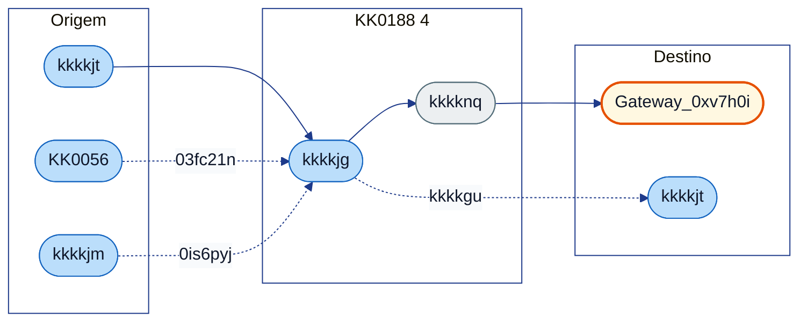

### kkkkvt (quem chega nesta parte)

| kkkk8l de destino | Flow | Origem / observação |
| ------------------- | ---------------- | ---------------------- |
| kkkkjg | (KK0188 3) | kkkkjt → kkkki0 → kkkkpd (não) → KK0188 4. |
| kkkkjg | Flow_03fc21n | KK0056 (kkkkgu). |
| kkkkjg | Flow_0is6pyj | kkkkjm (kkkkgu). |

### kkkkvv (para onde esta parte vai)

| Flow | Destino | Observação |
| ---------------- | ---------------------- | ------------ |
| Flow_0ca3z8j | kkkknq | Continuar. |
| Flow_0d93ejv | Gateway_0xv7h0i | Convergência (ex.: KK0056). |
| (kkkkgu) | kkkkjt | kkkkgu=="kkkkjt" (KK0188 3). |

---

## 5. Referências no kkkkhk

- kkkkjg, kkkknq.
- Flow_0ca3z8j, Flow_0d93ejv, Flow_0dyydgg.
- Gateway_0xv7h0i. Flow_lvstxhf: kkkknq para KK0056.

$$$$$

[parte_04_selecao_agencia_proposta_segmentada/USER_STORY_04_selecao_agencia_proposta_segmentada_GENERICO.md]
XXXXX
# User Story — KK0188 4: Seleção de kkkk1o e kkkklu

**KK0184:** `kkkkk6` (kkkkjg, kkkknq)

---

## User Story

**Como** kkkk38 ou KK0173 da kkkksn de kkkklh,  
**quero** selecionar a kkkk1o (e kkkkvh quando aplicável) e ter a kkkk3l marcada como segmentada,  
**para** que a kkkkgq avance para kkkkss e demais etapas com kkkk3l no status correto.

---

## Critérios de kkkkmk (derivados do kkkkhk)

- **CA1 – Ordem das etapas**  
Depois que o KK0173 conclui a seleção de kkkk1o (`kkkkjg`), o KK0046 executa a atualização da kkkk3l como segmentada (`kkkknq`), marcando status da kkkk3l = 1 (KK0095).
- **CA2 – Registro da etapa atual (kkkkyo)**  
Ao finalizar a KK0176 de seleção de kkkk1o, o kkkkxv grava que o KK0173 está nessa etapa (KK0034 **KK0125** = kkkkjg), para uso em kkkkx5 de kkkkyo.
- **CA3 – Tempo kkkksp e kkkkyo**  
Na KK0176 de seleção de kkkk1o existe um KK0177 máximo de permanência. Se o KK0177 acabar sem KK0190, o KK0046 dispara o kkkkx9 de kkkkyo (timer `Event_0f1shpq`).
- **CA4 – Navegação “KK0194”**  
Na KK0176 de seleção de kkkk1o, o KK0173 pode kkkkgu para a KK0176 de KK0168. Em outros caminhos da kkkkgq, o KK0173 pode kkkkgu de dados de kkkkss ou de kkkkvh manual para a KK0176 de seleção de kkkk1o.
- **CA5 – Próximo passo**  
Após marcar a kkkk3l como segmentada, o KK0046 segue para o ponto de convergência (kkkk7v `Gateway_0xv7h0i`). Em um dos caminhos, a próxima etapa é a KK0176 de dados de kkkkss (KK0188 7).
- **CA6 – Campos da KK0176**  
A KK0176 de seleção de kkkk1o exibe: número da kkkk1o, superintendência comercial, opção de kkkkvh manual (quando aplicável), controle de KK0046 e kkkkgu.

---

## KK0183 complementar (fora desta US)

*Complemento KK0018 e fronteiras: entrada no bloco, KK0028, kkkkvo, comportamentos na borda e partes adjacentes (não altera o escopo da US; detalha contexto e limites).*

### Entrada no bloco


| Flow           | Origem                            | Destino  |
| -------------- | --------------------------------- | -------- |
| `Flow_1pb12jt` | `kkkkpd` (KK0188 3, ramo não)     | `kkkkjg` |
| `Flow_1q9216u` | Após `kkkkiz` / `Gateway_0xv7h0i` | `kkkkjg` |
| `Flow_03fc21n` | `KK0056` (kkkkgu)                 | `kkkkjg` |
| `Flow_0is6pyj` | `kkkkjm` (kkkkgu)                 | `kkkkjg` |


### Scripts e kkkkx5 de kkkkag


| ID kkkk9q / kkkkaq | Regra resumida                                                        |
| ------------------ | --------------------------------------------------------------------- |
| `kkkknq` (KK0095)  | Atualiza kkkk3l com `kkkk4c` = 1; inputParameter: `kkkkfi`, `kkkk4c`. |


Ver [FLUXO_04_tecnico](FLUXO_04_tecnico.md).

### KK0129 e kkkkvo


| Variável           | Onde escrita / lida                   | Observação                          |
| ------------------ | ------------------------------------- | ----------------------------------- |
| `KK0125`           | outputParameter `kkkkjg`              | ID da kkkk9q.                       |
| `kkkkfi`, `kkkk4c` | `kkkknq` (inputParameter; status = 1) | Delegate.                           |
| `kkkkgu`           | KK0197                                | `kkkkgu=="kkkkjt"` leva à KK0188 3. |


### kkkkxe de kkkkth de campos

*kkkkxe de kkkkth de kkkk1o/kkkkvh não estão modeladas no kkkkhk; quando existirem, devem ser documentadas em spec/front ou no KK0018.*

### Comportamentos fora do núcleo

**kkkkwk kkkkja (timer → kkkkyo):**


| Event ID        | kkkk8l anexada | Timer    |
| --------------- | -------------- | -------- |
| `Event_0f1shpq` | `kkkkjg`       | `KK0043` |


**Fluxos de kkkkgu e saída:**


| Tipo              | De            | Para                |
| ----------------- | ------------- | ------------------- |
| KK0194            | `kkkkjg`      | `kkkkjt` (KK0188 3) |
| Saída (continuar) | `kkkknq`      | `Gateway_0xv7h0i`   |
| Erros / GQ        | kkkkvh manual | Conforme kkkkhk     |


### Partes/etapas adjacentes


| KK0188 | Papel                      | kkkk59 / observação                                          |
| ------ | -------------------------- | ------------------------------------------------------------ |
| 3      | Origem / destino de kkkkgu | `kkkkjt` (kkkkgu); `kkkkpd` e `kkkkiz` (origens de entrada). |
| 5      | Destino                    | kkkke6/kkkkvg (após `Gateway_0xv7h0i`).                      |
| 7      | Origem de kkkkgu           | `KK0056` (kkkkgu para `kkkkjg`).                             |


---

## Referência kkkkhk

- kkkkjg, kkkknq.
- Flow_0ca3z8j, Flow_0d93ejv, Event_0f1shpq.


$$$$$

[parte_05_segmentacao_direcionador/FLUXO_05_guia_GENERICO.md]
XXXXX
# KK0188 5 — Segmentação e kkkkxg — guia

**O que é esta parte:** trecho em que o kkkk55 **kkkkml o kkkkxg** (com ou sem kkkk1o), **atualiza o kkkk1x**, **kkkkml kkkkxr**, **escolha de kkkkxr/upgrade** e **kkkkxg na kkkk3l**. Inclui o kkkk7v "kkkklq" e exceções (não elegível, kkkklv).

**KK0184:** `kkkkk6`

---

## 1. Objetivo

Definir o kkkkxr e a kkkkss inicial do kkkk1x com base no kkkkxg; atualizar kkkksx e da kkkk3l. KK0129 e kkkkvo KK0132 são usados nas kkkkgc.

---

## 2. O que acontece na prática

- **"kkkklq"** — O KK0046 pergunta se o kkkk1x tem kkkk1o e direciona para a kkkkml ao kkkkxg **com kkkk1o** ou **sem kkkk1o**.
- **kkkke6 do kkkk1x** — Consulta ao kkkkxg (com ou sem kkkk1o, conforme o ramo).
- **Atualizar kkkk1x** — Atualização dos kkkksx no kkkkxv.
- **Consulta de kkkkxr**, **escolha de kkkkxr** e **escolha de upgrade** — Definição do kkkkxr e da kkkkss inicial.
- **kkkke6 na kkkk3l** — Aplicação do resultado do kkkkxg na kkkk3l.
- **Exceções:** não elegível e kkkklv são tratados em ramos específicos.

---

## 3. Resumo para KK0140, KK0142 e KK0143

| O quê | Detalhe |
| ------- | -------- |
| **O que ocorre** | KK0007 "kkkklq"; kkkkxg (com/sem kkkk1o); atualização do kkkk1x; kkkkml e escolha de kkkkxr/upgrade; aplicação do kkkkxg na kkkk3l. |
| **Saída** | kkkki3 e kkkkss definidos; respostas do kkkkxg disponíveis para as etapas seguintes. |
| **Exceções** | Não elegível, kkkklv. |

---

## 4. kkkk5v

*KK0206 = início; KK0207 = user kkkk9q; KK0208 = service/KK0148; âmbar = kkkk7v; KK0209 = fim; KK0210 tracejada = kkkkgu (ou exceção).*

```mermaid
%%{init: {
  "theme": "base",
  "themeVariables": {
    "background": "#ffffff",
    "primaryColor": "#3b82f6",
    "primaryTextColor": "#0f172a",
    "primaryBorderColor": "#1d4ed8",
    "lineColor": "#1e3a8a",
    "secondaryColor": "#f8fafc",
    "tertiaryColor": "#eef2ff",
    "clusterBkg": "#ffffff",
    "clusterBorder": "#1e3a8a",
    "fontFamily": "Inter, Segoe UI, Arial"
  }
}}%%
flowchart LR

classDef start fill:#22c55e,stroke:#15803d,stroke-width:2px,color:#ffffff;
classDef kkkk9q fill:#3b82f6,stroke:#1d4ed8,stroke-width:1.5px,color:#ffffff;
classDef service fill:#ffffff,stroke:#3b82f6,stroke-width:1.5px,stroke-dasharray:5 5,color:#0f172a;
classDef kkkk7v fill:#f59e0b,stroke:#b45309,stroke-width:2px,color:#ffffff;
classDef finish fill:#ef4444,stroke:#991b1b,stroke-width:2px,color:#ffffff;






  A{kkkklq} --> B([kkkkxg com kkkk1o])
  A --> C([kkkkxg sem kkkk1o])
  B --> D([Atualizar kkkk1x])
  C --> D
  D --> E([Consulta kkkkxr])
  E --> F([Escolha kkkkxr / upgrade])
  F --> G([kkkke6 na kkkk3l])
  style A fill:#fff8e1,stroke:#e65100,stroke-width:2px
  style B fill:#bbdefb,stroke:#1565c0
  style C fill:#bbdefb,stroke:#1565c0
  style D fill:#eceff1,stroke:#546e7a
  style E fill:#eceff1,stroke:#546e7a
  style F fill:#bbdefb,stroke:#1565c0
  style G fill:#eceff1,stroke:#546e7a
```

---

## 5. KK0170

Para detalhes de kkkkmn kkkkxg e kkkkvo use **FLUXO_05_tecnico.md**.

$$$$$

[parte_05_segmentacao_direcionador/FLUXO_05_tecnico_GENERICO.md]
XXXXX
# KK0188 5 — Segmentação e kkkkxg — documentação kkkk5u

**KK0184:** `kkkkk6`  
**KK0183:** kkkkpb (Tem agencia?), kkkklr, kkkkls, kkkkno, KK0049, kkkknq, kkkkjb, kkkknz, kkkkb0; exceções (não elegível, kkkklv).

---

## kkkkma Nível 2 (kkkk5f kkkkhk)

**kkkk5e completo:** [kkkkos](<documentacao/kkkkyy/kkkk5e da kkkkgv/kkkk3b>)

| ID (Nível 2) | Observação |
|--------------|------------|
| `kkkkjb` | kkkk8m — kkkkt1 (primeira UT etapa kkkke2) |
| `kkkknz` | kkkk8m — Envio kkkk5m (condicional kkkkgg/situação especial) |
| `kkkkjc` | Estado de exceção |
| `kkkkmb` | Estado de exceção |
| `kkkklr`, `kkkkls` | kkkk8n — [kkkk8e] kkkkb5 |
| `kkkkno`, `KK0049`, `kkkknq`, `kkkkb0` | Service/Script kkkkiq da parte |

---

## 1. Objetivo da parte

Consulta ao kkkkxg (com ou sem kkkk1o), atualização de kkkk1x, kkkkml e escolha de kkkkxr, upgrade e aplicação do kkkkxg na kkkk3l. KK0007 pelo kkkk7v "kkkklq" (agencia_logada); kkkkvo KK0132, kkkkxr, KK0119, kkkkeo.

---

## 2. kkkk59 kkkkhk da parte

### 2.1 kkkkis

| Tipo | ID | Nome (name) | Observação |
| ------------------ | ------------------ | --------------- | ------------ |
| kkkk81 | `kkkkpb` | Tem agencia ? | Entrada após kkkkm2 (KK0188 1). kkkkvv: sim → kkkklr; Não → kkkkls. |

### 2.2 Tasks e delegates

| Tipo / Papel | ID do elemento |
| -------------- | ---------------- |
| kkkk8m / kkkk8n | kkkklr, kkkkls |
| kkkk8n / Delegate | kkkkno, KK0049, kkkknq, kkkkjb, kkkknz, kkkkb0 |

Exceções no kkkkhk: não elegível, kkkklv (ramos e eventos específicos; conferir situacao_consulta_segmento, KK0051, KK0050).

### 2.3 Sequence kkkkoa principais

| ID do flow | sourceRef | targetRef | Nome/condição |
| ------------ | ----------- | ----------- | --------------- |
| Flow_116t3w8 | kkkkm2 | kkkkpb | Entrada da parte. |
| Flow_1g9i6od | kkkkpb | kkkkxg kkkk1x | sim: agencia_logada preenchida. |
| Flow_1y0atzf | kkkkpb | kkkkls | Não (KK0195). |

Demais kkkkoa (kkkkxg → kkkkno → KK0049 → kkkkjb / kkkknz → kkkkb0, etc.) conferir no kkkkhk.

### 2.4 Condições de kkkk7v
### 2.4.1 KK0149 (KK0189 da KK0190)

| kkkk8l ID | Tipo de KK0013 | Condição | Flow | Target |
|---------|------------------|----------|------|--------|
| kkkklr | KK0192 | — | Flow_1h18suh | kkkkno |
| kkkkls | KK0192 | — | Flow_049gmlz | kkkkno |
| kkkkjb | KK0192 | — | Flow_0dcefc1 | kkkkpg |
| kkkknz | KK0192 | — | Flow_1lsqeit | Gateway_1rc003q |
| kkkkb0 | KK0192 | — | Flow_02c7u0n | kkkk1b |


| ID kkkk7v | Nome | Expressão (ex.: `${...}`) | Ramo | Flow | Target |
| ------------ | ------ | --------------------------- | ------ | ------ | -------- |
| kkkkpb | Tem agencia ? | `${kkkk9o.hasVariable('agencia_logada') && agencia_logada != null && agencia_logada != ""}` | sim | Flow_1g9i6od | kkkkxg kkkk1x |
| kkkkpb | Tem agencia ? | (KK0195) | Não | Flow_1y0atzf | kkkkls |

### 2.5 kkkk5v kkkkhk (visão da parte)

**KK0205:** KK0206 = início; KK0207 = user kkkk9q; KK0208 = service/KK0148; âmbar = kkkk7v; KK0209 = fim; KK0210 tracejada = KK0046 "kkkkgu".

kkkkvq principal: kkkkis "kkkklq" → kkkkxg (com kkkk1o) ou kkkkxg sem kkkk1o → kkkkno → KK0049 → kkkkjb / kkkknz → kkkkb0. Ramos de exceção (erro kkkkml, não elegível, kkkklv) no kkkkhk.

```mermaid
%%{init: {
  "theme": "base",
  "themeVariables": {
    "background": "#ffffff",
    "primaryColor": "#3b82f6",
    "primaryTextColor": "#0f172a",
    "primaryBorderColor": "#1d4ed8",
    "lineColor": "#1e3a8a",
    "secondaryColor": "#f8fafc",
    "tertiaryColor": "#eef2ff",
    "clusterBkg": "#ffffff",
    "clusterBorder": "#1e3a8a",
    "fontFamily": "Inter, Segoe UI, Arial"
  }
}}%%
flowchart LR

classDef start fill:#22c55e,stroke:#15803d,stroke-width:2px,color:#ffffff;
classDef kkkk9q fill:#3b82f6,stroke:#1d4ed8,stroke-width:1.5px,color:#ffffff;
classDef service fill:#ffffff,stroke:#3b82f6,stroke-width:1.5px,stroke-dasharray:5 5,color:#0f172a;
classDef kkkk7v fill:#f59e0b,stroke:#b45309,stroke-width:2px,color:#ffffff;
classDef finish fill:#ef4444,stroke:#991b1b,stroke-width:2px,color:#ffffff;






  direction LR
  IN((•))
  IN --> GW{kkkklq<br/>kkkkpb}
  GW -->|sim| DC([kkkke6 com kkkk1o<br/>kkkklr])
  GW -->|Não| DSA([kkkke6 sem kkkk1o<br/>kkkkls])
  DC --> AC([Atualizar kkkk1x<br/>kkkkno])
  DSA --> AC
  AC --> CS([Consulta kkkkxr<br/>KK0049])
  CS --> ES([Escolha kkkkxr<br/>kkkkjb])
  ES --> EU([Escolha upgrade<br/>kkkknz])
  EU --> DP([kkkke6 kkkk3l<br/>kkkkb0])
  DP --> OUT(( ))

  style IN fill:#c8e6c9,stroke:#2e7d32,stroke-width:2px
  style OUT fill:#ffcdd2,stroke:#c62828,stroke-width:2px
  style GW fill:#fff8e1,stroke:#e65100,stroke-width:2px
  style DC fill:#bbdefb,stroke:#1565c0
  style DSA fill:#bbdefb,stroke:#1565c0
  style AC fill:#eceff1,stroke:#546e7a
  style CS fill:#eceff1,stroke:#546e7a
  style ES fill:#bbdefb,stroke:#1565c0
  style EU fill:#bbdefb,stroke:#1565c0
  style DP fill:#eceff1,stroke:#546e7a
```

---

## 3. Variáveis de kkkk55

| Variável | Escrita por | Lida por | Usada em condição | Observação |
| ---------- | ------------- | ---------- | ------------------- | ------------ |
| agencia_logada | KK0188 anterior / start | kkkkpb | sim: agencia_logada != null && != "" | Define ramo kkkkxg com/sem kkkk1o. |
| KK0132 | kkkklr / kkkkls | etapas seguintes | — | Resposta do kkkkxg. |
| kkkkxr, KK0119, KK0113 | KK0049, kkkkjb | kkkkax (KK0188 6), etc. | — | Segmentação e kkkkg3. |
| kkkkeo | KK0109, KK0110 | kkkkpb (em ramos a montante) | — | Elegibilidade do kkkk1x. |
| situacao_consulta_segmento, KK0051, KK0050 | KK0049 / KK0028 | kkkkps de exceção | erros (erro kkkkml, GQ NOT_FOUND, numeroFuncional 000000000) | Ramos de erro documentados no kkkkhk. |

---

## 4. kkkkxe de kkkkag (KK0199)

| ID KK0148 / kkkk9q | Regra em uma linha |
| ------------------ | --------------------- |
| kkkkno, kkkkm6, atualizar_representante | Atualizam kkkksx no kkkkxv; kkkkvo conforme kkkkaq/KK0203 do kkkkhk. |
| kkkkm3 | Consulta kkkkxr; preenche kkkkxr, KK0119, situacao_consulta_segmento; ramos de erro (não elegível, kkkklv) no kkkkhk. |
| KK0109, KK0110 | Verificação de kkkkeo (KK0044); resultado usado em kkkkaf a montante. Conferir conditionExpression no kkkkhk. |

---

## 5. Pseudo-KK0021 (KK0199)

### 5.1 Scripts de atualização de kkkk1x e kkkkml kkkkxr

**KK0188:** 5 — Segmentação e kkkkxg  
**Objetivo:** Atualizar kkkk1x e consultar kkkkxr/kkkkss; definir kkkkeo. Comportamento dos delegates e KK0028 deve ser conferido no kkkkhk (KK0203, kkkkvo de resposta).

#### Pseudo-KK0021 (KK0199)

```text
KK0217 (KK0199 — conferir kkkkhk):
  KK0220 kkkkno (kkkkaq) com dados do contexto
  OBTER KK0132 (kkkklr ou kkkkls)
  KK0220 KK0049
  KK0223 sucesso KK0224
    ATRIBUIR kkkkxr, KK0119 conforme resposta
  KK0221
    ATRIBUIR situacao_consulta_segmento, KK0051 (ramos de exceção no kkkkhk)
  KK0226 KK0223
  EXECUTAR KK0109 / KK0110 (kkkkeo)
  KK0220 kkkkb0
```

#### Referências kkkkhk

- **ids:** kkkkno, kkkkm3, KK0109, KK0110, kkkkb0.
- **kkkkhk:** `kkkkk6`.

---

## 6. kkkkvt e saídas da parte

**kkkk5v de contexto:** entrada única da KK0188 1; núcleo da KK0188 5; saídas para KK0188 6 (e exceções).

*KK0206 = início; KK0207 = user kkkk9q; KK0208 = service/KK0148; âmbar = kkkk7v; KK0209 = fim; KK0210 tracejada = kkkkgu (ou exceção).*

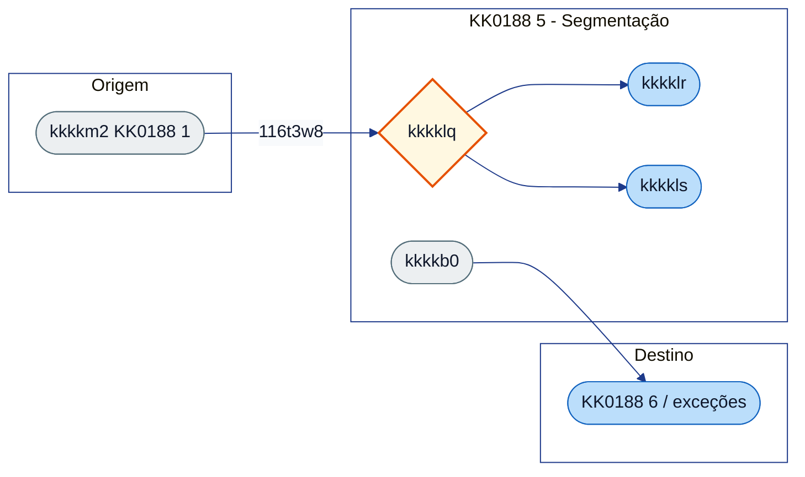

### kkkkvt (quem chega nesta parte)

| kkkk8l / elemento de destino | Flow | Origem / observação |
| ---------------------------- | ---------------- | ---------------------- |
| kkkkpb | Flow_116t3w8 | kkkkm2 (KK0188 1). |

### kkkkvv (para onde esta parte vai)

| Flow / ramo | Destino | Observação |
| ------------- | ---------------- | ------------ |
| (KK0046 principal) | KK0188 6 (kkkkax, KK0056, etc.) | kkkkb0 e kkkkxc. |
| (exceções) | não elegível, kkkklv | Ramos documentados no kkkkhk. |

**Relação com kkkkzo kkkk6k:** O kkkkxg (KK0188 5) kkkkdp kkkkss com **KK0052**, planos e benefícios; no kkkkzz kkkkzo kkkk6k essas kkkkvo são reutilizadas no **ramo pós-kkkks7** (KK0188 12), sem segunda kkkkmr ao kkkkxg. Ver [REFERENCIA_CRUZADA_MULTIPLO_SETUP_MANUAL.md](../REFERENCIA_CRUZADA_MULTIPLO_SETUP_MANUAL.md) e [KK0024.md](../../KK0105/KK0024.md).

---

## 7. Referências no kkkkhk

- kkkkis: `kkkkpb`.
- Tasks: `kkkklr`, `kkkkls`, `kkkkno`, `KK0049`, `kkkkjb`, `kkkknz`, `kkkkb0`.
- Flows: Flow_116t3w8, Flow_1g9i6od, Flow_1y0atzf (e demais da cadeia no kkkkhk).
- **Índice do manual:** [INDICE_E_PLANEJAMENTO_MANUAL_CO8.md](../INDICE_E_PLANEJAMENTO_MANUAL_CO8.md) §2 (KK0188 5). **Guia:** [FLUXO_05_guia.md](FLUXO_05_guia.md). **User story:** [USER_STORY_05_segmentacao_direcionador.md](USER_STORY_05_segmentacao_direcionador.md).

$$$$$

[parte_05_segmentacao_direcionador/USER_STORY_05_segmentacao_direcionador_GENERICO.md]
XXXXX
# User Story — KK0188 5: Segmentação e kkkkxg

**KK0184:** `kkkkk6` (kkkkpb, kkkklr, KK0049, kkkkjb, kkkkb0, etc.)

---

## User Story

**Como** motor de kkkk55 da kkkkfj,  
**quero** consultar o kkkkxg (com ou sem kkkk1o), atualizar o kkkk1x e definir kkkkxr e kkkkss inicial,  
**para** que a kkkk3l siga com kkkkvg e kkkkss corretas para as etapas seguintes.

---

## Critérios de kkkkmk (derivados do kkkkhk)

- **CA1 – KK0007 “kkkklq”**  
O KK0046 pergunta se o kkkk1x tem kkkk1o (kkkk7v `kkkkpb`). Se sim, segue pelo ramo com kkkk1o (kkkkxg do kkkk1x); se não, pelo ramo sem kkkk1o (kkkkxg sem kkkk1o).
- **CA2 – Consulta e aplicação do kkkkxg**  
O kkkkxv executa na ordem: kkkkxg do kkkk1x (com ou sem kkkk1o), atualização do kkkk1x, kkkkml de kkkkxr, escolha de kkkkxr, escolha de upgrade (quando aplicável) e kkkkxg da kkkk3l. Tudo conforme a ordem definida no kkkkhk.
- **CA3 – kkkkwx do kkkkxg**  
As respostas do kkkkxg (ex.: KK0132) são gravadas e ficam disponíveis para as etapas seguintes (kkkkss, kkkkfv, etc.).
- **CA4 – Casos de exceção**  
Os caminhos em que o kkkk1x não é elegível ou o kkkkxr não é atendido estão modelados e tratados conforme o kkkkhk.
- **CA5 – Próximo passo**  
Ao final desta parte, a kkkk3l tem kkkkxr e kkkkss definidos e o KK0046 segue para as próximas etapas (ex.: dados de kkkkss, kkkkfv/kkkkg3).

---

## KK0183 complementar (fora desta US)

*Complemento KK0018 e fronteiras: entrada no bloco, KK0028, kkkkvo, comportamentos na borda e partes adjacentes (não altera o escopo da US; detalha contexto e limites).*

### Entrada no bloco


| Flow           | Origem              | Destino  |
| -------------- | ------------------- | -------- |
| `Flow_116t3w8` | `kkkkm2` (KK0188 1) | `kkkkpb` |


### Scripts e kkkkx5 de kkkkag


| ID kkkk9q / KK0148  | Regra resumida                             |
| ------------------- | ------------------------------------------ |
| `kkkkno`            | Delegate; atualização de kkkk1x.           |
| `KK0049`            | Delegate; kkkkml kkkkxr.                   |
| `KK0109` / `KK0110` | Elegibilidade do kkkk1x.                   |
| `kkkkjb`, `kkkknz`  | User/service; escolha de kkkkxr e upgrade. |
| `kkkkb0`            | Delegate; aplica kkkkxg na kkkk3l.         |


Exceções: não elegível, kkkklv (`situacao_consulta_segmento`, `KK0051`, `KK0050`). Ver [FLUXO_05_tecnico](FLUXO_05_tecnico.md) e [INDICE_SCRIPTS](../INDICE_SCRIPTS.md).

### KK0129 e kkkkvo


| Variável                                         | Onde escrita / lida                        | Observação                                    |
| ------------------------------------------------ | ------------------------------------------ | --------------------------------------------- |
| `agencia_logada`                                 | KK0188 anterior / start; lida por `kkkkpb` | Condiciona ramo com/sem kkkk1o.               |
| `KK0132`                                         | `kkkklr` / `kkkkls`                        | Resposta do kkkkxg.                           |
| `kkkkxr`, `KK0119`, `KK0113`                     | `KK0049`, `kkkkjb`; KK0188 6               | Segmentação e kkkkg3.                         |
| `kkkkeo`                                         | KK0109*                                    | Elegibilidade.                                |
| `situacao_consulta_segmento`, `KK0051`, `KK0050` | KK0049 / KK0028                            | kkkkps de exceção (erro, GQ NOT_FOUND, etc.). |


### kkkkxe de kkkkth de campos

*kkkkxe de kkkkth de campos não estão modeladas no kkkkhk; quando existirem, devem ser documentadas em spec/front ou no KK0018.*

### Comportamentos fora do núcleo

**kkkkpb (kkkklq):**


| Ramo         | Flow           | Destino  |
| ------------ | -------------- | -------- |
| sim          | `Flow_1g9i6od` | `kkkklr` |
| Não (KK0195) | `Flow_1y0atzf` | `kkkkls` |


Ramos de exceção (não elegível, kkkklv) conforme kkkkhk. Saída da parte para KK0188 6 (`kkkkax`).

### Partes/etapas adjacentes


| KK0188 | Papel   | kkkk59 / observação                                 |
| ------ | ------- | --------------------------------------------------- |
| 4      | Origem  | Seleção kkkk1o (`agencia_logada` quando aplicável). |
| 6      | Destino | kkkk7u/kkkkg3 (`kkkkax`; `KK0113`, `KK0119`).       |
| 7      | Destino | Limites/kkkkss (KK0046 normal após KK0188 6).       |


---

## Referência kkkkhk

- kkkkpb, kkkklr, kkkkls, kkkkno, KK0049, kkkkjb, kkkknz, kkkkb0.


$$$$$

[parte_06_backoffice_wayout_analise_documentos/FLUXO_06_guia_GENERICO.md]
XXXXX
# KK0188 6 — kkkk7u / kkkkg3 / kkkkgt de documentos — guia

**O que é esta parte:** trecho em que o kkkk55 trata **kkkkg3**, **upgrade**, **kkkkgt EZ8**, **kkkkgt de fraudes kkkkhy** e **aprovação/recusa kkkkfv**. Inclui kkkk7v "Tem kkkkg3, upgrade, situação especial?", kkkkgt de documentos (kkkkfv e EZ8), KK0137 de fraudes kkkkhy e atualização de status da kkkk3l.

**KK0184:** `kkkkk6`

---

## 1. Objetivo

Direcionar propostas em situações especiais (kkkkg3, upgrade) para kkkkfv; executar kkkkgt de documentos (EZ8) e kkkkgt de fraudes (kkkkhy); atualizar kkkk3l como aprovada, recusada ou com falha conforme resultado.

---

## 2. O que acontece na prática

- **"Tem kkkkg3, upgrade ou situação especial?"** — O KK0046 verifica e direciona: se sim, envia a kkkk3l para o kkkkfv (kkkkg3, status 86); se não, segue o KK0046 normal de kkkks7.
- **kkkklg kkkkg3** — kkkklg enviada para o kkkkfv para kkkkgt.
- **kkkk5o de documentos no kkkkfv** — Inclui montagem do objeto de kkkkgt e kkkkgt EZ8 (tópico de kkkkfv).
- **kkkk5o de fraudes (kkkkhy)** — kkkky9 de kkkkgt de fraudes executado quando aplicável.
- **Resultado:** kkkk3l **aprovada** (status 1), **falha na kkkkgt** (status 4), **recusa EZ8** ou **kkkkby** — cada um atualiza o status da kkkk3l.
- **Resposta do kkkkfv** — KK0007 entre aprovar ou recusar; aprovada kkkkdp ao ponto de convergência.

---

## 3. Resumo para KK0140, KK0142 e KK0143

| O quê | Detalhe |
| ------- | -------- |
| **Ramos** | Wayout/upgrade -> kkkkfv; KK0046 normal -> kkkks7. kkkk5o EZ8 e kkkkhy no kkkkfl. |
| **Status** | 86 (kkkkg3), 1 (aprovada), 4 (falha kkkkgt), recusa EZ8, kkkkby. |
| **Saída** | Aprovada → kkkkdp ao ponto de convergência; recusa → manutenção da kkkkgq ou kkkkcg. |

---

## 4. kkkk5v

*KK0206 = início; KK0207 = user kkkk9q; KK0208 = service/KK0148; âmbar = kkkk7v; KK0209 = fim; KK0210 tracejada = kkkkgu (ou exceção).*

```mermaid
%%{init: {
  "theme": "base",
  "themeVariables": {
    "background": "#ffffff",
    "primaryColor": "#3b82f6",
    "primaryTextColor": "#0f172a",
    "primaryBorderColor": "#1d4ed8",
    "lineColor": "#1e3a8a",
    "secondaryColor": "#f8fafc",
    "tertiaryColor": "#eef2ff",
    "clusterBkg": "#ffffff",
    "clusterBorder": "#1e3a8a",
    "fontFamily": "Inter, Segoe UI, Arial"
  }
}}%%
flowchart LR

classDef start fill:#22c55e,stroke:#15803d,stroke-width:2px,color:#ffffff;
classDef kkkk9q fill:#3b82f6,stroke:#1d4ed8,stroke-width:1.5px,color:#ffffff;
classDef service fill:#ffffff,stroke:#3b82f6,stroke-width:1.5px,stroke-dasharray:5 5,color:#0f172a;
classDef kkkk7v fill:#f59e0b,stroke:#b45309,stroke-width:2px,color:#ffffff;
classDef finish fill:#ef4444,stroke:#991b1b,stroke-width:2px,color:#ffffff;


  A{Tem kkkkg3/upgrade?} -->|Sim| B([kkkklg kkkkg3])
  A -->|Não| C([kkkkvq normal kkkks7])
  B --> D([Manutenção kkkkgq])
  E([kkkk5o EZ8/kkkkhy]) --> F{Aprovado?}
  F -->|Sim| G([kkkklg aprovada])
  F -->|Não| H([Falha / recusa])
  style A fill:#fff8e1,stroke:#e65100,stroke-width:2px
  style B fill:#eceff1,stroke:#546e7a
  style C fill:#bbdefb,stroke:#1565c0
  style D fill:#bbdefb,stroke:#1565c0
  style E fill:#eceff1,stroke:#546e7a
  style F fill:#fff8e1,stroke:#e65100,stroke-width:2px
  style G fill:#c8e6c9,stroke:#2e7d32
  style H fill:#ffcdd2,stroke:#c62828,stroke-width:2px
```

---

## 5. KK0170

Para kkkk5j de kkkkiq, kkkkoa e delegates use **FLUXO_06_tecnico.md**.

$$$$$

[parte_06_backoffice_wayout_analise_documentos/FLUXO_06_tecnico_GENERICO.md]
XXXXX
# KK0188 6 — kkkk7u kkkkg3 kkkkgt de documentos — documentação kkkk5u

**KK0184:** `kkkkk6`  
**KK0183:** kkkkax (Tem kkkkg3, upgrade, situação especial?), kkkkji, kkkko1, KK0114, kkkkpt, kkkkoe, kkkk1c, kkkkkt, kkkkaw.

---

## kkkkma Nível 2 (kkkk5f kkkkhk)

**kkkk5e completo:** [kkkkos](<documentacao/kkkkyy/kkkk5e da kkkkgv/kkkk3b>)

| ID (Nível 2) | Observação |
|--------------|------------|
| `kkkkjm` | kkkk8m — kkkkt3 (exceção kkkkzy) |
| `kkkk02` | kkkk8m — kkkkl1 (KK0137 kkkkf1) |
| `kkkkox` | kkkk8m — Confirmação dados empresa (kkkkf1) |
| `kkkkji`, `kkkkjp` | kkkk7u — kkkkgt documentos/kkkkg5 |

---

## 1. Objetivo da parte

Ramos **kkkkg3** e **upgrade/situação especial**; kkkkgt de documentos (kkkkfv, EZ8, fraudes kkkkhy); aprovação ou recusa da kkkk3l. kkkkax direciona para kkkkoe (sim) ou KK0046 normal (Não → kkkko3). User kkkk9q kkkkji; kkkkfl e external/call para EZ8 e kkkkhy; kkkkaf de resultado (aprovada, falha, kkkkaa).

---

## 2. kkkk59 kkkkhk da parte

### 2.1 kkkkis principal

| Tipo | ID | Nome (name) | Observação |
| ------------------ | ------------------ | ------------------------------------------ | ------------ |
| kkkk81 | `kkkkax` | Tem kkkkg3, upgrade, situação especial? | Entrada após convergência (ex.: kkkk1c). kkkkvv: sim → Flow_100gyb6 (kkkkg3/ramo kkkkg3); Não → Flow_1a72e8p → kkkko3. |

### 2.2 Tasks e kkkk66

| Tipo | ID do elemento |
| ----------------- | ---------------- |
| kkkk8m | kkkkji |
| kkkk8j | kkkko1 |
| kkkk8n (external) | KK0114 (kkkk91 jvcc-analise-kkkkfv) |
| kkkk8k | kkkkpt (kkkkbj) |
| kkkk8n | kkkkoe, kkkk1c, kkkkkt |
| kkkk81 | kkkkaw (após kkkkgt) |

### 2.3 Sequence kkkkoa principais

| ID do flow | sourceRef | targetRef | Nome/condição |
| ------------ | ----------- | ----------- | --------------- |
| Flow_025xqbq | (convergência) | kkkkax | Entrada na parte. |
| Flow_100gyb6 | kkkkax | kkkkoe / kkkkay | sim: kkkkg3/upgrade/situação especial. |
| Flow_1a72e8p | kkkkax | kkkko3 | Não (KK0046 normal). |
| Flow_lj6lcuj | kkkko1 | (saídas) | Saída do kkkkfl. |
| Flow_0q6wcaq | (kkkkgt) | Event_0q6wcaq | Ramos de erro/recusa. |

Condição sim do kkkkax: KK0113/KK0119, KK0130 == 'kkkkg3', KK0133 != "Nenhuma". Conferir conditionExpression no kkkkhk.

### 2.4 Condições de kkkk7v
### 2.4.1 KK0149 (KK0189 da KK0190)

KK0188 6 é dominada por kkkkaf e kkkk66 (kkkkg3, kkkkgt documentos, kkkkhy). KK0149 relevantes estão nos kkkkad; KK0046 principal: kkkk1c → Flow_025xqbq → kkkkax; kkkkoe e kkkk1j mantidas no kkkkhk.

| kkkk8l ID / elemento | Tipo | Condição | Flow | Target |
|--------------------|------|----------|------|--------|
| kkkk1c | Saída (convergência) | — | Flow_025xqbq | kkkkax |


| ID kkkk7v | Nome | Expressão (resumo) | Ramo | Observação |
| ------------ | ------ | -------------------- | ------ | ------------ |
| kkkkax | Tem kkkkg3, upgrade, situação especial? | `${(KK0113 == "3" && KK0119 == "L") \ | \ | ... \ | \ | KK0130 == 'kkkkg3' \ | \ | (KK0133 != "Nenhuma" && != "nenhuma")}` | sim | Flow_100gyb6. |
| kkkkax | Tem kkkkg3, upgrade, situação especial? | (KK0195) | Não | Flow_1a72e8p → kkkko3. |
| kkkkaw | (resultado kkkkgt) | (aprovada) | aprovada | Flow_1j61cuj → kkkk1c. |
| kkkkaw | (resultado kkkkgt) | (KK0195) | falha / kkkkaa | Flow_08ceoql → Event_05idg99 ou KK0108 (conforme ramo). |

### 2.5 kkkk5v kkkkhk (visão da parte)

**KK0205:** KK0206 = início; KK0207 = user kkkk9q; KK0208 = service/KK0148; âmbar = kkkk7v; KK0209 = fim; KK0210 tracejada = KK0046 "kkkkgu".

```mermaid
%%{init: {
  "theme": "base",
  "themeVariables": {
    "background": "#ffffff",
    "primaryColor": "#3b82f6",
    "primaryTextColor": "#0f172a",
    "primaryBorderColor": "#1d4ed8",
    "lineColor": "#1e3a8a",
    "secondaryColor": "#f8fafc",
    "tertiaryColor": "#eef2ff",
    "clusterBkg": "#ffffff",
    "clusterBorder": "#1e3a8a",
    "fontFamily": "Inter, Segoe UI, Arial"
  }
}}%%
flowchart LR

classDef start fill:#22c55e,stroke:#15803d,stroke-width:2px,color:#ffffff;
classDef kkkk9q fill:#3b82f6,stroke:#1d4ed8,stroke-width:1.5px,color:#ffffff;
classDef service fill:#ffffff,stroke:#3b82f6,stroke-width:1.5px,stroke-dasharray:5 5,color:#0f172a;
classDef kkkk7v fill:#f59e0b,stroke:#b45309,stroke-width:2px,color:#ffffff;
classDef finish fill:#ef4444,stroke:#991b1b,stroke-width:2px,color:#ffffff;


  direction LR
  IN((•))
  IN --> GW{Tem kkkkg3, upgrade,<br/>situação especial?}
  GW -->|sim| W([kkkklg kkkkg3<br/>kkkkoe])
  GW -->|Não| CX([Continuar KK0046<br/>kkkko3])
  W --> SUB[kkkk5o kkkkfv<br/>kkkko1]
  SUB --> EZ8([kkkk5o documentos EZ8<br/>KK0114])
  EZ8 --> kkkkhy([kkkky9 kkkkhy<br/>KK0137 kkkkhy])
  kkkkhy --> GW2{Resultado kkkkgt}
  GW2 -->|aprovada| OK([kkkklg aprovada kkkkfv<br/>kkkk1c])
  GW2 -->|falha| FK([kkkklg falha kkkkgt BKO<br/>kkkkkt])
  OK --> OUT(( ))
  FK --> OUT2(( ))

  style IN fill:#c8e6c9,stroke:#2e7d32,stroke-width:2px
  style OUT fill:#ffcdd2,stroke:#c62828,stroke-width:2px
  style OUT2 fill:#ffcdd2,stroke:#c62828,stroke-width:2px
  style GW fill:#fff8e1,stroke:#e65100,stroke-width:2px
  style GW2 fill:#fff8e1,stroke:#e65100,stroke-width:2px
  style W fill:#eceff1,stroke:#546e7a
  style SUB fill:#eceff1,stroke:#546e7a
  style EZ8 fill:#eceff1,stroke:#546e7a
  style kkkkhy fill:#eceff1,stroke:#546e7a
  style OK fill:#c8e6c9
  style FK fill:#ffcdd2
  style CX fill:#bbdefb,stroke:#1565c0
```

---

## 3. Variáveis de kkkk55

| Variável | Escrita por | Lida por | Usada em condição | Observação |
| ---------- | ------------- | ---------- | ------------------- | ------------ |
| KK0113, KK0119 | KK0188 5 | kkkkax | Condição kkkkg3/upgrade | Define se segue para kkkkg3. |
| KK0130 | KK0188 9 (a montante) | kkkkax | == 'kkkkg3' | Wayout por kkkks4. |
| KK0133 | (formulários / upstream) | kkkkax | != "Nenhuma" | Situação especial. |
| resultado_analise_backoffice | kkkkji | kkkkps de kkkkaa/erro | ERRO_INTERNO, ERRO_PAYLOAD | Conferir kkkkhk. |
| backoffice_retry | (KK0148/kkkk9q) | Condição kkkkaa | backoffice_retry > 3 | Conferir kkkkhk. |
| conclusao_analise_fraude | KK0137 kkkkhy | kkkkis (KK0188 12/16) | Confirmação de kkkkyd | Conferir kkkkhk. |

---

## 4. kkkkxe de kkkkag (KK0199)

| ID KK0148 / kkkk9q | Regra em uma linha |
| ------------------ | --------------------- |
| KK0104 | Monta objetos para kkkkgt EZ8 a partir de KK0123; inclui selfie, DI frente, situações especiais (menor emancipado, formulário não alfabetização); prepara KK0123 para KK0114. |
| KK0108 | Envio de KK0151 com motivo de recusa do kkkkfv; conferir KK0203 no kkkkhk. |

---

## 5. Pseudo-KK0021 (KK0199)

### 5.1 KK0216 KK0104

**KK0188:** 6 — kkkk7u / kkkkg3 / kkkkgt de documentos  
**Nome (kkkkhk):** Monta objetos de kkkkgt  
**Formato:** KK0044  
**Objetivo:** Preparar lista de documentos (KK0123) para a kkkkgt EZ8; incluir selfie, DI, situações especiais e comprovantes conforme kkkkhk.

#### Pseudo-KK0021 (KK0199)

```text
KK0217 (KK0199 — conferir kkkkhk):
  OBTER KK0123 do contexto
  PARA CADA kkkkta EM KK0123 FAZER
    KK0223 tipo_documento == "selfie" KK0224 adicionar id_conteudo_di4, tipo_documento; setar id_conteudo_selfie_di4
    KK0223 tipo_documento == "di frente" KK0224 adicionar id_conteudo_di4, tipo_documento
  KK0226 PARA
  KK0223 KK0133 (menor emancipado, etc.) KK0224 adicionar kkkkvu conforme kkkkhk
  ATRIBUIR KK0123 = nova lista
```

#### Referências kkkkhk

- **id:** KK0104 (dentro de kkkko1).
- **kkkkhk:** `kkkkk6`.

---

## 6. kkkkvt e saídas da parte

**kkkk5v de contexto:** entrada por convergência (ex.: kkkk1c); núcleo kkkkg3/kkkkgt; saídas aprovada/falha ou KK0046 normal.

*KK0206 = início; KK0207 = user kkkk9q; KK0208 = service/KK0148; âmbar = kkkk7v; KK0209 = fim; KK0210 tracejada = kkkkgu (ou exceção).*

```mermaid
%%{init: {
  "theme": "base",
  "themeVariables": {
    "background": "#ffffff",
    "primaryColor": "#3b82f6",
    "primaryTextColor": "#0f172a",
    "primaryBorderColor": "#1d4ed8",
    "lineColor": "#1e3a8a",
    "secondaryColor": "#f8fafc",
    "tertiaryColor": "#eef2ff",
    "clusterBkg": "#ffffff",
    "clusterBorder": "#1e3a8a",
    "fontFamily": "Inter, Segoe UI, Arial"
  }
}}%%
flowchart LR

classDef start fill:#22c55e,stroke:#15803d,stroke-width:2px,color:#ffffff;
classDef kkkk9q fill:#3b82f6,stroke:#1d4ed8,stroke-width:1.5px,color:#ffffff;
classDef service fill:#ffffff,stroke:#3b82f6,stroke-width:1.5px,stroke-dasharray:5 5,color:#0f172a;
classDef kkkk7v fill:#f59e0b,stroke:#b45309,stroke-width:2px,color:#ffffff;
classDef finish fill:#ef4444,stroke:#991b1b,stroke-width:2px,color:#ffffff;


  subgraph Entrada["Origem"]
    CONV([convergência KK0188 5/6])
  end
  subgraph Parte6["KK0188 6 - Wayout"]
    GW{Tem kkkkg3?}
    W([kkkkoe])
    SUB([kkkko1])
    GW2{Resultado}
  end
  subgraph kkkkvw["Destino"]
    OK([kkkk1c])
    FK([kkkkkt])
    CX([kkkko3])
  end
  CONV -->|025xqbq| GW
  GW -->|100gyb6| W
  GW -->|1a72e8p| CX
  W --> SUB
  SUB --> GW2
  GW2 --> OK
  GW2 --> FK
  style CONV fill:#bbdefb,stroke:#1565c0
  style GW fill:#fff8e1,stroke:#e65100,stroke-width:2px
  style W fill:#eceff1,stroke:#546e7a
  style SUB fill:#eceff1,stroke:#546e7a
  style GW2 fill:#fff8e1,stroke:#e65100,stroke-width:2px
  style OK fill:#c8e6c9,stroke:#2e7d32
  style FK fill:#ffcdd2,stroke:#c62828,stroke-width:2px
  style CX fill:#bbdefb,stroke:#1565c0
```

### kkkkvt (quem chega nesta parte)

| Elemento de destino | Flow | Origem / observação |
| --------------------- | ---------------- | ---------------------- |
| kkkkax | Flow_025xqbq | Convergência (ex.: kkkk1c, KK0046 principal). |

### kkkkvv (para onde esta parte vai)

| Flow / ramo | Destino | Observação |
| ------------- | ---------------------- | ------------ |
| Flow_100gyb6 | kkkkoe / ramo kkkkg3 | Sim: kkkkg3, upgrade ou situação especial. |
| Flow_1a72e8p | kkkko3 | Não: KK0046 normal (KK0188 7). |
| (após kkkkgt) | kkkk1c, kkkkkt | Ramos 86 kkkkg3, aprovada, falha. |

---

## 7. Referências no kkkkhk

- kkkkis: `kkkkax`, `kkkkaw`.
- Tasks: `kkkkji`, `kkkko1`, `KK0114`, `kkkkpt`, `kkkkoe`, `kkkk1c`, `kkkkkt`.
- Flows: Flow_100gyb6, Flow_la72e8p, Flow_025xqbq, Flow_lj6lcuj, Event_0q6wcaq.
- **Índice do manual:** [INDICE_E_PLANEJAMENTO_MANUAL_CO8.md](../INDICE_E_PLANEJAMENTO_MANUAL_CO8.md) §2 (KK0188 6). **Guia:** [FLUXO_06_guia.md](FLUXO_06_guia.md). **User story:** [USER_STORY_06_backoffice_wayout_analise_documentos.md](USER_STORY_06_backoffice_wayout_analise_documentos.md).

$$$$$

[parte_06_backoffice_wayout_analise_documentos/USER_STORY_06_backoffice_wayout_analise_documentos_GENERICO.md]
XXXXX
# User Story — KK0188 6: kkkk7u / kkkkg3 / kkkkgt de documentos

**KK0184:** `kkkkk6` (kkkkax, KK0114, kkkkpt, kkkkoe, kkkk1c, etc.)

---

## User Story

**Como** motor de kkkk55 da kkkkfj,  
**quero** direcionar propostas kkkkg3/upgrade para kkkkfv e executar kkkkgt de documentos (EZ8) e de fraudes (kkkkhy),  
**para** que a kkkk3l seja aprovada, recusada ou marcada com falha conforme o resultado da kkkkgt.

---

## Critérios de kkkkmk (derivados do kkkkhk)

- [ ] **CA1 – KK0007 kkkkg3 / upgrade / KK0046 normal**  
  O KK0046 verifica se a kkkk3l é kkkkg3, upgrade ou situação especial (kkkk7v `kkkkax`). Quando for kkkkg3, a kkkk3l é enviada para o kkkkfv e o status da kkkk3l é atualizado para 86 (`kkkkoe`). Caso contrário, segue o KK0046 normal.

- [ ] **CA2 – kkkk5o de documentos (EZ8)**  
  O kkkkfv monta o objeto de kkkkgt e executa a kkkkgt de documentos (EZ8, tópico jvcc-analise-kkkkfv). Ao concluir, o KK0046 segue para o tratamento da resposta do kkkkfv (`Event_0q6wcaq`).

- [ ] **CA3 – kkkk5o de fraudes (kkkkhy)**  
  Quando aplicável, é executado o KK0137 de kkkkgt de fraudes (kkkkbj). O resultado pode levar à marcação de falha na kkkkgt (status 4) ou à continuidade do KK0046.

- [ ] **CA4 – Aprovação ou recusa pelo kkkkfv**  
  Após a kkkkgt, o KK0046 decide: kkkk3l aprovada (status 1) ou recusa do kkkkfv (`kkkkaw`). A kkkk3l aprovada kkkkdp ao ponto de convergência kkkkg3/upgrade.

- [ ] **CA5 – Exceções e recusas**  
  Falha na kkkkgt, recusa EZ8 e kkkk3l kkkkby atualizam status e metadados conforme o kkkkhk. O KK0046 de recusa pode levar à manutenção da kkkkgq ou ao kkkkcg da kkkk5h.

---

## KK0183 complementar (fora desta US)

*Complemento KK0018 e fronteiras: entrada no bloco, KK0028, kkkkvo, comportamentos na borda e partes adjacentes (não altera o escopo da US; detalha contexto e limites).*

### Entrada no bloco

| Flow | Origem | Destino |
| ------ | -------- | --------- |
| `Flow_025xqbq` | Convergência (ex.: kkkk1c, KK0046 principal) | `kkkkax` |

### Scripts e kkkkga

| ID kkkk9q / elemento | Regra resumida |
| -------------------- | ---------------- |
| `kkkkji` | User kkkk9q; kkkkfv monta objeto e dispara kkkkgt. |
| `KK0114` | kkkk8n (kkkk91 jvcc-analise-kkkkfv); kkkkgt EZ8. |
| `kkkkpt` | kkkk8k (kkkkbj); kkkkgt de fraudes. |
| `kkkkoe`, `kkkk1c`, `kkkkkt` | kkkka6; atualização de status (86 kkkkg3, 1 aprovada, 4 falha). |

KK0035 dos kkkkga EZ8 e kkkkhy fora desta US. Ver [FLUXO_06_tecnico](FLUXO_06_tecnico.md) e [INDICE_SCRIPTS](../INDICE_SCRIPTS.md).

### KK0129 e kkkkvo

| Variável | Onde escrita / lida | Observação |
| ---------- | ---------------------- | ------------ |
| `KK0113`, `KK0119` | KK0188 5; lida por `kkkkax` | Condição kkkkg3/upgrade. |
| `KK0130` | KK0188 9 (a montante); lida por `kkkkax` | == 'kkkkg3'. |
| `KK0133` | Formulários/upstream; lida por `kkkkax` | != "Nenhuma". |
| `resultado_analise_backoffice`, `backoffice_retry` | kkkkji / KK0028 | ERRO_INTERNO, ERRO_PAYLOAD; kkkkaa > 3. |
| `conclusao_analise_fraude` | KK0137 kkkkhy | Confirmação de kkkkg5 (KK0188 12/16). |

### kkkkxe de kkkkth de campos

*kkkkxe de kkkkth de campos não estão modeladas no kkkkhk; quando existirem, devem ser documentadas em spec/front ou no KK0018.*

### Comportamentos fora do núcleo

**kkkkax (Tem kkkkg3, upgrade, situação especial?):**

| Ramo | Flow | Destino |
| ------ | ------ | --------- |
| sim | `Flow_100gyb6` | kkkkoe / ramo kkkkg3 |
| Não (KK0195) | `Flow_1a72e8p` | kkkko3 (KK0188 7) |

**kkkkaw (resultado kkkkgt):** ramos aprovada / falha / kkkkaa conforme kkkkhk.

### Partes/etapas adjacentes

| KK0188 | Papel | kkkk59 / observação |
| ------- | -------- | ------------------------- |
| 5 | Origem | Segmentação (`KK0113`, `KK0119`). |
| 7 | Destino | Limites/kkkkss (KK0046 normal via `kkkko3`). |
| 11 | Destino | kkkk7y (após aprovação kkkkfv). |

---

## Referência kkkkhk

- kkkkax, kkkkoe, kkkk1c, kkkkkt, kkkko1, KK0114, kkkkpt, kkkkaw, Event_0q6wcaq, Event_05idg99.

$$$$$

[parte_07_limites_oferta_mapeamento_ge/FLUXO_07_guia_GENERICO.md]
XXXXX
# KK0188 7 — Limites, kkkkss e mapeamento GE — guia

**O que é esta parte:** trecho em que o kkkk55 **obtém o kkkksp** do kkkk1x (R0/V3), **mapeia os campos para o GE**, kkkkwc **dados de kkkkss** e atualiza a kkkkss na kkkk3l.

**KK0184:** `kkkkk6`

---

## 1. Objetivo

Obter kkkksp kkkkhr/GE, definir KK0053 e kkkkvo de kkkkgw; mapear campos para GE e atualizar solicitação/kkkksv na kkkk3l.

---

## 2. O que acontece na prática

- **Obtenção de kkkksp** — O kkkkxv obtém o kkkksp do kkkk1x (R0/V3) no legado.
- **kkkk58 para o GE** — Os campos necessários ao GE (identificação da pessoa, kkkky6 kkkkgw, kkkksp máximo, etc.) são mapeados e preenchidos.
- **kkkkwx de kkkkss** — KK0182 dos dados de kkkkss e atualização da kkkk3l com kkkkss e dados de kkkkgw.
- **Persistência** — A kkkk3l é atualizada com kkkkss e solicitação de kkkksv.
- **Consulta ao kkkkre** — Quando aplicável no KK0046.

---

## 3. Resumo para KK0140, KK0142 e KK0143

| O quê | Detalhe |
| ------- | -------- |
| **O que ocorre** | Obtenção de kkkksp; mapeamento de campos para o GE; kkkkwc e atualização de dados de kkkkss na kkkk3l. |
| **Resultado** | Oferta de kkkky6, dados de kkkkgw e kkkksp definidos; kkkk3l pronta para kkkkmk e kkkks7. |

---

## 4. kkkk5v

*KK0206 = início; KK0207 = user kkkk9q; KK0208 = service/KK0148; âmbar = kkkk7v; KK0209 = fim; KK0210 tracejada = kkkkgu (ou exceção).*

```mermaid
%%{init: {
  "theme": "base",
  "themeVariables": {
    "background": "#ffffff",
    "primaryColor": "#3b82f6",
    "primaryTextColor": "#0f172a",
    "primaryBorderColor": "#1d4ed8",
    "lineColor": "#1e3a8a",
    "secondaryColor": "#f8fafc",
    "tertiaryColor": "#eef2ff",
    "clusterBkg": "#ffffff",
    "clusterBorder": "#1e3a8a",
    "fontFamily": "Inter, Segoe UI, Arial"
  }
}}%%
flowchart LR

classDef start fill:#22c55e,stroke:#15803d,stroke-width:2px,color:#ffffff;
classDef kkkk9q fill:#3b82f6,stroke:#1d4ed8,stroke-width:1.5px,color:#ffffff;
classDef service fill:#ffffff,stroke:#3b82f6,stroke-width:1.5px,stroke-dasharray:5 5,color:#0f172a;
classDef kkkk7v fill:#f59e0b,stroke:#b45309,stroke-width:2px,color:#ffffff;
classDef finish fill:#ef4444,stroke:#991b1b,stroke-width:2px,color:#ffffff;


  A([Obter kkkksp]) --> B([Mapear campos GE])
  B --> C([kkkkwx de kkkkss])
  C --> D([kkkklg kkkkss / atualizar])
  style A fill:#eceff1,stroke:#546e7a
  style B fill:#eceff1,stroke:#546e7a
  style C fill:#bbdefb,stroke:#1565c0
  style D fill:#eceff1,stroke:#546e7a
```

---

## 5. KK0170

Para detalhes KK0178 use **FLUXO_07_tecnico.md**.

$$$$$

[parte_07_limites_oferta_mapeamento_ge/FLUXO_07_tecnico_GENERICO.md]
XXXXX
# KK0188 7 — Limites kkkkss mapeamento GE — documentação kkkk5u

**KK0184:** `kkkkk6`  
**KK0183:** kkkkcn, kkkknx, kkkkij, kkkkpi, KK0096, kkkkm7, kkkkcc.

---

## kkkkma Nível 2 (kkkk5f kkkkhk)

**kkkk5e completo:** [kkkkos](<documentacao/kkkkyy/kkkk5e da kkkkgv/kkkk3b>)

| ID (Nível 2) | Observação |
|--------------|------------|
| `kkkkij` | kkkk8m — kkkkwx Oferta (primeira UT etapa kkkkwt; recebe KK0053 + KK0054) |
| `kkkkcn`, `kkkkd0`, `kkkkcc` | Consultas kkkksp (kkkkgz) |
| `KK0096`, `kkkkm7` | Script/Service kkkkiq da parte |

---

## 1. Objetivo da parte

Obtenção de **kkkksp** (R0/V3); **mapeamento de campos para GE**; kkkkwc de **dados de kkkkss** e atualização na **kkkkpi**. Variáveis de kkkkgw (kkkk4p, KK0059, dia_vencimento_fatura_cartao, etc.) e KK0053.

---

## 2. kkkk59 kkkkhk da parte

### 2.1 Tasks e KK0028

| Tipo | ID do elemento | Observação |
| ------------- | ---------------- | ------------ |
| kkkk8n / kkkk65 | kkkkcn | Obtenção de kkkksp (kkkkmn kkkkou). |
| kkkk8o | kkkknx | JavaScript; mapeia campos para GE. |
| kkkk8m | kkkkij | Nome com espaço no kkkkhk. |
| kkkk8n | kkkkpi | Atualização kkkk3l. |
| kkkk8o | KK0096 | KK0044; mapeia kkkkij. |
| kkkk8n | kkkkm7 | Atualização solicitação. |
| (kkkk65/Service) | kkkkcc | Consulta kkkk7d. |

### 2.2 Sequence kkkkoa principais

### 2.2.1 KK0149 (KK0189 da KK0190)

| kkkk8l ID | Tipo de KK0013 | Condição | Flow | Target |
|---------|------------------|----------|------|--------|
| kkkkij | KK0192 (continuar) | — | Flow_1mmm6f0 | Gateway_1ly0xsv |

### 2.2.2 Condições de kkkk7v

Nenhum kkkk7v no KK0046 principal desta parte (kkkkcn → kkkknx → kkkkij → kkkkpi → …). A saída da user kkkk9q *kkkkij* segue pelo Flow_1mmm6f0 para o Gateway_1ly0xsv (fronteira com KK0188 8).


| ID do flow | sourceRef | targetRef | Observação |
| ------------ | ----------- | ----------- | ------------ |
| Flow_likioqu / Flow_0hzwmli | (entrada) | kkkkcn | Entrada (timer_rajada_r0 ou janela_funcionamento_r0). |
| Flow_1diayuk | janela_funcionamento_r0 | kkkknx | Limite obtido → mapeamento GE. |
| (conferir kkkkhk) | kkkknx | kkkkij | User kkkk9q kkkkij (KK0046 pode estar em call activity). |
| Flow_1qklifx | KK0056 | KK0057 | Atualização kkkk3l. |
| Flow_1mmm6f0 | kkkkij | Gateway_1ly0xsv | Saída da parte (fronteira KK0188 8). |
| Flow_17nfuhl | KK0057 | Gateway_19hcmx2 | Sequência (KK0188 13). |

kkkk5j com espaço no kkkkhk: `kkkkij`, `kkkkpi`; em sourceRef/targetRef também aparecem `KK0056`, `KK0057`. Ver [PONTAS_SOLTAS_CONSULTA_BPMN.md](../../planos_e_todos/PONTAS_SOLTAS_CONSULTA_BPMN.md).

### 2.3 kkkk5v kkkkhk (visão da parte)

**KK0205:** KK0206 = início; KK0207 = user kkkk9q; KK0208 = service/KK0148; âmbar = kkkk7v; KK0209 = fim; KK0210 tracejada = KK0046 "kkkkgu".

```mermaid
%%{init: {
  "theme": "base",
  "themeVariables": {
    "background": "#ffffff",
    "primaryColor": "#3b82f6",
    "primaryTextColor": "#0f172a",
    "primaryBorderColor": "#1d4ed8",
    "lineColor": "#1e3a8a",
    "secondaryColor": "#f8fafc",
    "tertiaryColor": "#eef2ff",
    "clusterBkg": "#ffffff",
    "clusterBorder": "#1e3a8a",
    "fontFamily": "Inter, Segoe UI, Arial"
  }
}}%%
flowchart LR

classDef start fill:#22c55e,stroke:#15803d,stroke-width:2px,color:#ffffff;
classDef kkkk9q fill:#3b82f6,stroke:#1d4ed8,stroke-width:1.5px,color:#ffffff;
classDef service fill:#ffffff,stroke:#3b82f6,stroke-width:1.5px,stroke-dasharray:5 5,color:#0f172a;
classDef kkkk7v fill:#f59e0b,stroke:#b45309,stroke-width:2px,color:#ffffff;
classDef finish fill:#ef4444,stroke:#991b1b,stroke-width:2px,color:#ffffff;


  direction LR
  IN((•))
  IN --> OL([Obter kkkksp legado<br/>kkkkcn])
  OL --> MC([Mapeia campos GE<br/>kkkknx])
  MC --> DO([kkkkwx kkkkss<br/>kkkkij])
  DO --> KK0143([kkkklg kkkkss<br/>kkkkpi])
  KK0143 --> SM([Script mapeia kkkkij<br/>KK0096])
  SM --> ASC([Atualizar solicitação kkkksv<br/>kkkkm7])
  ASC --> OUT(( ))

  style IN fill:#c8e6c9,stroke:#2e7d32,stroke-width:2px
  style OUT fill:#ffcdd2,stroke:#c62828,stroke-width:2px
  style OL fill:#eceff1,stroke:#546e7a
  style MC fill:#eceff1,stroke:#546e7a
  style DO fill:#bbdefb,stroke:#1565c0
  style KK0143 fill:#eceff1,stroke:#546e7a
  style SM fill:#eceff1,stroke:#546e7a
  style ASC fill:#eceff1,stroke:#546e7a
```

---

## 3. Variáveis de kkkk55

| Variável | Escrita por | Lida por | Usada em condição | Observação |
| ---------- | ------------- | ---------- | ------------------- | ------------ |
| kkkk4p, codigo_produto_cartao_credito, KK0059, dia_vencimento_fatura_cartao | kkkknx (outputParameter) | etapas seguintes | — | Conferir kkkkhk. |
| KK0053 | KK0096, kkkkij | Partes 8, 10 | optante_produto, etc. | Oferta e kkkkst. |
| (kkkkvo de kkkksp R0/V3) | kkkkcn / monta_payload | kkkknx | — | KK0129 e resposta. |

---

## 4. kkkkxe de kkkkag (KK0199)

| ID KK0148 / kkkk9q | Regra em uma linha |
| ------------------ | --------------------- |
| kkkknx | Mapeia kkkkvo para GE: kkkk4p, codigo_produto_cartao_credito, KK0059, dia_vencimento_fatura_cartao, indicadores (overlimit, programa recompensa, kkkk12, etc.); lê KK0101 e KK0053; regra person DN kkkkgw conforme kkkkxr. |
| KK0096 | Mapeia dados de kkkkss na kkkk3l; persiste KK0053 e campos de kkkkgw/kkkkss. |
| kkkkou | kkkkmo para kkkkmr de kkkkts V3; conferir kkkkhk. |

---

## 5. Pseudo-KK0021 (KK0199)

### 5.1 KK0216 kkkknx

**KK0188:** 7 — Limites, kkkkss e mapeamento GE  
**Nome (kkkkhk):** mapeio campos GE  
**Formato:** JavaScript  
**Objetivo:** Preencher kkkkvo exigidas pelo GE a partir de KK0101, KK0053 e kkkksp (R0/V3).

#### Pseudo-KK0021 (KK0199)

```text
KK0217 (KK0199 — conferir kkkkhk):
  OBTER KK0101, KK0053 do contexto
  OBTER valor_maximo_cartao_credito (limiterotativo V3 ou response_obter_limiteR0)
  APLICAR regra person DN kkkkgw (kkkkxr, valor pre-aprovado) se aplicável
  ATRIBUIR kkkk4p, codigo_produto_cartao_credito, KK0059
  ATRIBUIR dia_vencimento_fatura_cartao, indicador_overlimit, indicador_programa_recompensa, etc.
  ATRIBUIR KK0127, numero_conta_corrente, numero_dac_conta_corrente, codigo_segmento_cliente
```

#### Referências kkkkhk

- **id:** kkkknx.
- **kkkkhk:** `kkkkk6`.

---

## 6. kkkkvt e saídas da parte

**kkkk5v de contexto:** entrada pelo KK0046 normal (KK0188 6); núcleo limites/kkkkss GE; saída para KK0188 8.

*KK0206 = início; KK0207 = user kkkk9q; KK0208 = service/KK0148; âmbar = kkkk7v; KK0209 = fim; KK0210 tracejada = kkkkgu (ou exceção).*

```mermaid
%%{init: {
  "theme": "base",
  "themeVariables": {
    "background": "#ffffff",
    "primaryColor": "#3b82f6",
    "primaryTextColor": "#0f172a",
    "primaryBorderColor": "#1d4ed8",
    "lineColor": "#1e3a8a",
    "secondaryColor": "#f8fafc",
    "tertiaryColor": "#eef2ff",
    "clusterBkg": "#ffffff",
    "clusterBorder": "#1e3a8a",
    "fontFamily": "Inter, Segoe UI, Arial"
  }
}}%%
flowchart LR

classDef start fill:#22c55e,stroke:#15803d,stroke-width:2px,color:#ffffff;
classDef kkkk9q fill:#3b82f6,stroke:#1d4ed8,stroke-width:1.5px,color:#ffffff;
classDef service fill:#ffffff,stroke:#3b82f6,stroke-width:1.5px,stroke-dasharray:5 5,color:#0f172a;
classDef kkkk7v fill:#f59e0b,stroke:#b45309,stroke-width:2px,color:#ffffff;
classDef finish fill:#ef4444,stroke:#991b1b,stroke-width:2px,color:#ffffff;


  subgraph Entrada["Origem"]
    P6([KK0188 6 KK0046 normal])
  end
  subgraph Parte7["KK0188 7 - Limites e kkkkss GE"]
    OL([kkkkcn])
    DO([kkkkij])
    SM([KK0096])
  end
  subgraph kkkkvw["Destino"]
    P8([KK0188 8])
  end
  P6 --> OL
  OL --> DO
  DO --> SM
  SM --> P8
  style P6 fill:#bbdefb,stroke:#1565c0
  style OL fill:#eceff1,stroke:#546e7a
  style DO fill:#bbdefb,stroke:#1565c0
  style SM fill:#eceff1,stroke:#546e7a
  style P8 fill:#bbdefb,stroke:#1565c0
```

### kkkkvt (quem chega nesta parte)

| kkkk8l de destino | Origem / observação |
| ------------------- | ---------------------- |
| kkkkcn | kkkkvq normal após KK0188 6 (kkkko3, etc.). Conferir flow de entrada no kkkkhk. |

### kkkkvv (para onde esta parte vai)

| Destino | Observação |
| ----------- | ------------ |
| KK0188 8 | KK0096 → kkkkib / kkkkid (conforme ramo). Conferir kkkkoa no kkkkhk. |

**Relação com kkkkzo kkkk6k:** No kkkkzz, o **kkkksp de kkkkgw** passa a vir do kkkkxg (KK0188 5); quando houver kkkkss do kkkkxg, sobrescreve o uso da kkkkhr para kkkkgw. Variáveis de kkkkss/mapeamento GE alimentam a KK0176 de kkkkmk e o ramo pós-kkkks7. Ver [REFERENCIA_CRUZADA_MULTIPLO_SETUP_MANUAL.md](../REFERENCIA_CRUZADA_MULTIPLO_SETUP_MANUAL.md).

---

## 7. Referências no kkkkhk

- Tasks: `kkkkcn`, `kkkknx`, `kkkkij`, `kkkkpi`, `KK0096`, `kkkkm7`, `kkkkcc`.
- **Índice do manual:** [INDICE_E_PLANEJAMENTO_MANUAL_CO8.md](../INDICE_E_PLANEJAMENTO_MANUAL_CO8.md) §2 (KK0188 7). **Guia:** [FLUXO_07_guia.md](FLUXO_07_guia.md). **User story:** [USER_STORY_07_limites_oferta_mapeamento_ge.md](USER_STORY_07_limites_oferta_mapeamento_ge.md).

$$$$$

[parte_07_limites_oferta_mapeamento_ge/USER_STORY_07_limites_oferta_mapeamento_ge_GENERICO.md]
XXXXX
# User Story — KK0188 7: Limites, kkkkss e mapeamento GE

**KK0184:** `kkkkk6` (kkkkcn, kkkknx, kkkkij, kkkkpi, etc.)

---

## User Story

**Como** motor de kkkk55 da kkkkfj,  
**quero** obter o kkkksp do kkkk1x (R0/V3), mapear campos para GE e registrar dados de kkkkss na kkkk3l,  
**para** que a kkkktv e kkkkgw esteja definida para as etapas de kkkkmk e kkkks7.

---

## Critérios de kkkkmk (derivados do kkkkhk)

- [ ] **CA1 – Obtenção de kkkksp**  
  O kkkkxv obtém o kkkksp do kkkk1x (R0/V3) no legado (`kkkkcn` ou equivalente). As kkkkvo de kkkksp ficam disponíveis para as etapas seguintes.

- [ ] **CA2 – kkkk58 para o GE**  
  Um KK0148 mapeia os campos exigidos pelo GE (identificação da pessoa, kkkky6 kkkkgw, kkkksp máximo do kkkkgw, etc.) e preenche as kkkkvo do kkkk55 conforme o kkkkhk (`kkkknx`).

- [ ] **CA3 – kkkkwx de kkkkss**  
  As etapas de dados de kkkkss e de kkkk3l de kkkkss (e, quando aplicável, mapeamento de dados de kkkkss e atualização da solicitação de kkkksv) são executadas na ordem definida. Oferta de kkkky6 e dados de kkkkgw são gravados na kkkk3l.

- [ ] **CA4 – Próximo passo**  
  Ao final desta parte, a kkkk3l tem kkkkss e limites definidos e o KK0046 segue para o kkkktw e kkkkyh (KK0188 8) ou etapa equivalente.

---

## KK0183 complementar (fora desta US)

*Complemento KK0018 e fronteiras: entrada no bloco, KK0028, kkkkvo, comportamentos na borda e partes adjacentes (não altera o escopo da US; detalha contexto e limites).*

### Entrada no bloco

| Ponto de entrada | Origem / observação |
| ------------------ | --------------------- |
| `kkkkcn` | kkkkvq normal após KK0188 6 (kkkko3). |

### Scripts e kkkkiq

| ID kkkk9q / KK0148 | Regra resumida |
| ------------------ | ---------------- |
| `kkkkcn` | kkkk8n/kkkk65; obtém kkkksp R0/V3 (kkkkmn kkkkou). |
| `kkkknx` | kkkk8o (JavaScript); mapeia campos para GE. |
| `kkkkij` | kkkk8m; kkkkwc dados de kkkkss. |
| `kkkkpi` | kkkk8n; atualização kkkk3l. |
| `KK0096` | KK0044; mapeia kkkkij. |
| `kkkkm7` | kkkk8n; atualização solicitação. |
| `kkkkcc` | kkkk65/Service; kkkkml kkkk7d. |

kkkkxe de kkkkag de kkkksp e kkkkss e integração com GE fora desta US. Ver [FLUXO_07_tecnico](FLUXO_07_tecnico.md) e [INDICE_SCRIPTS](../INDICE_SCRIPTS.md).

### KK0129 e kkkkvo

| Variável | Onde escrita / lida | Observação |
| ---------- | ---------------------- | ------------ |
| `kkkk4p`, `codigo_produto_cartao_credito`, `KK0059`, `dia_vencimento_fatura_cartao` | kkkknx (outputParameter) | Partes seguintes. |
| `KK0053` | KK0096, kkkkij | Partes 8, 10 (optante_produto). |
| Variáveis de kkkksp R0/V3 | kkkkcn / monta_payload | kkkknx. |

### kkkkxe de kkkkth de campos

*kkkkxe de kkkkth de campos não estão modeladas no kkkkhk; quando existirem, devem ser documentadas em spec/front ou no KK0018.*

### Partes/etapas adjacentes

| KK0188 | Papel | kkkk59 / observação |
| ------- | -------- | ------------------------- |
| 6 | Origem | kkkkvq normal (kkkko3). |
| 8 | Destino | Aceite kkkkst/kkkkyh (kkkkib, kkkkid). |

---

## Referência kkkkhk

kkkkcn, kkkknx, kkkkij, kkkkpi, KK0096, kkkkm7.

$$$$$

[parte_08_produtos_aceite_termos/FLUXO_08_guia_GENERICO.md]
XXXXX
# KK0188 8 - kkkkwt, kkkkmk e kkkkyh (guia)

**O que é esta parte:** trecho em que o kkkk1x **aceita kkkkst**, **kkkkyh**, **consentimentos** (kkkkh2, kkkkmj) e **kkkkl6**. Há opção de kkkkgu para etapas anteriores quando aplicável.

**KK0184:** `kkkkk6`

---

## 1. Objetivo

Registrar kkkktw, kkkkyh, consentimentos e kkkkl6; permitir kkkkgu entre etapas conforme kkkkhk.

---

## 2. O que acontece na prática

- **Aceite de kkkkst** — O kkkk1x aceita os kkkkst; a kkkk3l é atualizada com o kkkkmk.
- **kkkkyg e consentimentos** — Aceite dos kkkkyh de KK0022 e do kkkkmm de kkkkmj (kkkkh2, kkkkmj).
- **Declarações** — Preenchimento das kkkkl6 exigidas.
- **KK0194** — O KK0173 pode kkkkgu para etapas anteriores (ex.: kkkkwc de kkkkiu) conforme os ramos do KK0046.

---

## 3. Resumo

| O que | Detalhe |
| ------- | -------- |
| **O que ocorre** | Aceite de kkkkst; kkkkyh e KK0022; kkkkmm de kkkkmj; kkkkl6. |
| **KK0194** | Opção de kkkkgu para etapas anteriores quando aplicável. |

---

## 4. kkkk5v

*KK0206 = início; KK0207 = user kkkk9q; KK0208 = service/KK0148; âmbar = kkkk7v; KK0209 = fim; KK0210 tracejada = kkkkgu (ou exceção).*

```mermaid
%%{init: {
  "theme": "base",
  "themeVariables": {
    "background": "#ffffff",
    "primaryColor": "#3b82f6",
    "primaryTextColor": "#0f172a",
    "primaryBorderColor": "#1d4ed8",
    "lineColor": "#1e3a8a",
    "secondaryColor": "#f8fafc",
    "tertiaryColor": "#eef2ff",
    "clusterBkg": "#ffffff",
    "clusterBorder": "#1e3a8a",
    "fontFamily": "Inter, Segoe UI, Arial"
  }
}}%%
flowchart LR

classDef start fill:#22c55e,stroke:#15803d,stroke-width:2px,color:#ffffff;
classDef kkkk9q fill:#3b82f6,stroke:#1d4ed8,stroke-width:1.5px,color:#ffffff;
classDef service fill:#ffffff,stroke:#3b82f6,stroke-width:1.5px,stroke-dasharray:5 5,color:#0f172a;
classDef kkkk7v fill:#f59e0b,stroke:#b45309,stroke-width:2px,color:#ffffff;
classDef finish fill:#ef4444,stroke:#991b1b,stroke-width:2px,color:#ffffff;


  A([Aceite de kkkkst]) --> B([kkkkyg e KK0022])
  B --> C([Declarações])
  style A fill:#bbdefb,stroke:#1565c0
  style B fill:#bbdefb,stroke:#1565c0
  style C fill:#bbdefb,stroke:#1565c0
```

---

Para detalhes KK0178 use FLUXO_08_tecnico.md.

$$$$$

[parte_08_produtos_aceite_termos/FLUXO_08_tecnico_GENERICO.md]
XXXXX
# KK0188 8 — kkkkwt, kkkkmk e kkkkyh (documentação kkkk5u)

**KK0184:** `kkkkk6`  
**KK0183:** kkkkid, kkkkmz, kkkkif, kkkkmy, kkkkib; KK0204 de kkkkgu (ex.: para KK0064, kkkkid, kkkkif).

---

## kkkkma Nível 2 (kkkk5f kkkkhk)

**kkkk5e completo:** [kkkkos](<documentacao/kkkkyy/kkkk5e da kkkkgv/kkkk3b>)

| ID (Nível 2) | Observação |
|--------------|------------|
| `kkkkid` | kkkk8m — Aceite kkkkwt (kkkkt8; kkkkt6 após aqui) |
| `kkkkib` | kkkk8m — Declarações |
| `kkkkif` | kkkk8m — Termo Autorização kkkklj |
| `kkkkh9` | kkkk8m — Consentimento Débito (condicional) |

---

## 1. Objetivo da parte

Aceite de **kkkkst**, **kkkkyh**, **consentimentos** (kkkkmj) e **kkkkl6**. kkkkvq "kkkkgu" entre kkkkiq (kkkkgu para KK0064, kkkkid, kkkkif). User kkkkiq com KK0195 e completes condicionais; KK0028 de mapeamento e kkkkml kkkkmj.

---

## 2. kkkk59 kkkkhk da parte

### 2.1 User kkkkiq e service kkkkiq

| Tipo | ID do elemento | Observação |
| ------------- | ---------------- | ------------ |
| kkkk8m | kkkkid | KK0195 continuar; kkkkgu (condicional). |
| kkkk8n | kkkkmz | Após kkkkmh. |
| kkkk8m | kkkkif | KK0195 continuar; kkkkgu. |
| kkkk8m | kkkkh9 | Termo/kkkkce; KK0013 condicional (kkkkgu/continuar). |
| kkkk8n | kkkkmy | Consentimento listagem kkkkmj (kkkkmx). |
| kkkk8m | kkkkib | Declarações. |

Scripts: KK0096, kkkkmw (typo no kkkkhk), kkkkmx. kkkkns (kkkk58 kkkkyn), Activity_097rtf7 (Mapeia kkkkwx kkkkg7 Ofertas).

### 2.2 Sequence kkkkoa principais

| ID do flow | sourceRef | targetRef | Nome/condição |
| ------------ | ----------- | ----------- | --------------- |
| Flow_0vf0xfk | kkkkid | kkkkmv | KK0195 (continuar). |
| Flow_0r9adi2 | kkkkif | kkkkh9 | KK0195 (continuar). |
| Flow_0n4eqi2 | kkkkmy | Gateway_1p92mla | KK0195. |
| Flow_0a0za12 | kkkkib | kkkkc7 | KK0195 (continuar). |
| Flow_07q23pc | kkkkif | kkkkid | kkkkgu=="kkkkid". |
| Flow_1a4fst5 | kkkkh9 | kkkkif | kkkkgu=="kkkkif". |
| kkkke3 | kkkkid | KK0064 | kkkkgu=="KK0064". |
| Flow_0jtfalw | kkkkib | kkkkid | kkkkgu=="kkkkid". |

### 2.3 KK0149 (KK0189 da KK0190)

| kkkk8l ID | Tipo de KK0013 | Condição | Flow | Target |
| --------- | ------------------- | ---------- | ------ | -------- |
| kkkkid | KK0192 (continuar) | — | (KK0195) | atualiza_proposta / kkkkif |
| kkkkid | KK0194 | kkkkgu=="KK0064" | kkkke3 | KK0064 (KK0188 9) |
| kkkkif | KK0192 (continuar) | — | Flow_0r9adi2 | kkkkh9 |
| kkkkif | KK0194 | kkkkgu=="kkkkid" | Flow_07q23pc | kkkkid |
| kkkkh9 | KK0194 | kkkkgu=="kkkkif" | Flow_1a4fst5 | kkkkif |
| kkkkib | KK0192 (continuar) | — | Flow_0a0za12 | kkkkc7 (KK0188 10) |
| kkkkib | KK0194 | kkkkgu=="kkkkid" | Flow_0jtfalw | kkkkid |

### 2.4 Condições de kkkk7v (se houver)

KK0188 8 pode ter kkkkaf condicionais (ex.: optante_produto, fluxo_spi, response_consulta_debito_json). Conferir no kkkkhk e documentar em manutenção.

| ID kkkk7v | Nome | Expressão | Ramo | Flow | Target |
|-----------|------|-----------|------|------|--------|
| Gateway_0hneh12 | Possui debito? | (Sim: tem kkkkmj) | Sim | Flow_07s3ahf | kkkkif |
| Gateway_0hneh12 | Possui debito? | (KK0195) | Não | Flow_0oewewz | Gateway_13b43jo |

### 2.5 kkkk5v kkkkhk (visão da parte)

**KK0205:** KK0206 = início; KK0207 = user kkkk9q; KK0208 = service/KK0148; KK0209 = fim; KK0210 tracejada = KK0046 "kkkkgu".

**kkkkvq principal**

```mermaid
%%{init: {
  "theme": "base",
  "themeVariables": {
    "background": "#ffffff",
    "primaryColor": "#3b82f6",
    "primaryTextColor": "#0f172a",
    "primaryBorderColor": "#1d4ed8",
    "lineColor": "#1e3a8a",
    "secondaryColor": "#f8fafc",
    "tertiaryColor": "#eef2ff",
    "clusterBkg": "#ffffff",
    "clusterBorder": "#1e3a8a",
    "fontFamily": "Inter, Segoe UI, Arial"
  }
}}%%
flowchart LR

classDef start fill:#22c55e,stroke:#15803d,stroke-width:2px,color:#ffffff;
classDef kkkk9q fill:#3b82f6,stroke:#1d4ed8,stroke-width:1.5px,color:#ffffff;
classDef service fill:#ffffff,stroke:#3b82f6,stroke-width:1.5px,stroke-dasharray:5 5,color:#0f172a;
classDef kkkk7v fill:#f59e0b,stroke:#b45309,stroke-width:2px,color:#ffffff;
classDef finish fill:#ef4444,stroke:#991b1b,stroke-width:2px,color:#ffffff;


  direction LR
  IN((•))
  IN --> AP([Aceite de kkkkst<br/>kkkkid])
  AP --> AU([Atualiza kkkk3l<br/>kkkkmz])
  AU --> TC([Termo KK0022<br/>kkkkif])
  TC --> ACD([Consentimento kkkkmj<br/>kkkkmy])
  ACD --> DD([Declarações<br/>kkkkib])
  DD --> OUT(( ))

  style IN fill:#c8e6c9,stroke:#2e7d32,stroke-width:2px
  style OUT fill:#ffcdd2,stroke:#c62828,stroke-width:2px
  style AP fill:#bbdefb,stroke:#1565c0
  style TC fill:#bbdefb,stroke:#1565c0
  style ACD fill:#eceff1,stroke:#546e7a
  style DD fill:#bbdefb,stroke:#1565c0
  style AU fill:#eceff1,stroke:#546e7a
```

**KK0194 (KK0145)**

Setas tracejadas: para onde o KK0046 vai quando o KK0173 escolhe "kkkkgu". KK0188 9 (KK0064) para contexto.

```mermaid
%%{init: {
  "theme": "base",
  "themeVariables": {
    "background": "#ffffff",
    "primaryColor": "#3b82f6",
    "primaryTextColor": "#0f172a",
    "primaryBorderColor": "#1d4ed8",
    "lineColor": "#1e3a8a",
    "secondaryColor": "#f8fafc",
    "tertiaryColor": "#eef2ff",
    "clusterBkg": "#ffffff",
    "clusterBorder": "#1e3a8a",
    "fontFamily": "Inter, Segoe UI, Arial"
  }
}}%%
flowchart LR

classDef start fill:#22c55e,stroke:#15803d,stroke-width:2px,color:#ffffff;
classDef kkkk9q fill:#3b82f6,stroke:#1d4ed8,stroke-width:1.5px,color:#ffffff;
classDef service fill:#ffffff,stroke:#3b82f6,stroke-width:1.5px,stroke-dasharray:5 5,color:#0f172a;
classDef kkkk7v fill:#f59e0b,stroke:#b45309,stroke-width:2px,color:#ffffff;
classDef finish fill:#ef4444,stroke:#991b1b,stroke-width:2px,color:#ffffff;


  subgraph Parte_8
    AP([kkkkid])
    TC([kkkkif])
    DD([kkkkib])
  end
  subgraph Parte_9
    CS([KK0064])
  end
  TC -.->|kkkkgu| AP
  DD -.->|kkkkgu| AP
  AP -.->|kkkkgu| CS

  style AP fill:#bbdefb,stroke:#1565c0
  style TC fill:#bbdefb,stroke:#1565c0
  style DD fill:#bbdefb,stroke:#1565c0
  style CS fill:#bbdefb,stroke:#1565c0
```

**KK0194 (tabela De/Para/Flow)**

| De | Para | Condição | Flow |
| ---- | ------ | ---------- | ------ |
| kkkkif | kkkkid | kkkkgu=="kkkkid" | Flow_07q23pc |
| kkkkh9 | kkkkif | kkkkgu=="kkkkif" | Flow_1a4fst5 |
| kkkkid | KK0064 (KK0188 9) | kkkkgu=="KK0064" | kkkke3 |
| kkkkib | kkkkid | kkkkgu=="kkkkid" | Flow_0jtfalw |

**kkkkwk (timer):** `kkkkib` possui KK0196 kkkkja de timer (Event_0d91jbw, `KK0043`); ao estourar, KK0046 segue para kkkkyo.

---

## 3. Variáveis de kkkk55

| Variável | Escrita por | Lida por | Usada em condição | Observação |
| ---------- | ------------- | ---------- | ------------------- | ------------ |
| kkkkgu | User kkkkiq (formData) | — | kkkkgu=="kkkkid", kkkkgu=="kkkkif", kkkkgu=="KK0064" | Define target do KK0013 "kkkkgu". |
| KK0053 | KK0188 7, KK0096 | kkkkps (KK0188 8/10) | optante_produto == false | Oferta e kkkkmk. |
| response_consulta_debito_json, fluxo_spi | kkkkml kkkkmj / upstream | kkkkps | Ex.: exibir KK0176 kkkkmj | Conferir kkkkhk. |
| KK0125 | User kkkkiq (outputParameter) | — | — | Valor = id da kkkk9q concluída. |

---

## 4. kkkkxe de kkkkag (KK0199)

| ID KK0148 / kkkk9q | Regra em uma linha |
| ------------------ | --------------------- |
| KK0096 | Mapeia dados de kkkkss para kkkkid; persiste KK0053 e campos de kkkkgw/kkkkss (reutilizado da KK0188 7). |
| kkkkmw | kkkklj; preenche response_consulta_debito_json, fluxo_spi; usado em kkkkaf para exibir KK0176 kkkkmj. |
| kkkkmx | Persiste kkkkmk de kkkkmm listagem kkkkmj; conferir KK0203 no kkkkhk. |
| kkkkns (kkkk58 kkkkyn), Activity_097rtf7 (Mapeia kkkkwx kkkkg7 Ofertas) | kkkk58 kkkkvh e dados pessoa ofertas; conferir kkkkhk. |

---

## 5. Pseudo-KK0021 (KK0199)

### 5.1 KK0216 kkkkmw

**KK0188:** 8 — kkkkwt, kkkkmk e kkkkyh  
**Formato:** KK0044 / kkkkaq  
**Objetivo:** Consultar kkkkmj; preencher response_consulta_debito_json e fluxo_spi para kkkkaf.

#### Pseudo-KK0021 (KK0199)

```text
KK0217 (KK0199 — conferir kkkkhk):
  KK0220 serviço de kkkkml kkkkmj
  ATRIBUIR response_consulta_debito_json, fluxo_spi conforme resposta
```

### 5.2 KK0216 kkkkmx

**Objetivo:** Persistir kkkkmk do kkkkmm de listagem kkkkmj após user kkkk9q kkkkh9.

#### Pseudo-KK0021 (KK0199)

```text
KK0217 (KK0199 — conferir kkkkhk):
  OBTER resultado do kkkkmk (formData / outputParameter)
  PERSISTIR kkkkmm listagem kkkkmj
```

#### Referências kkkkhk

- **ids:** KK0096, kkkkmw, kkkkmx, kkkkns, Activity_097rtf7.
- **kkkkhk:** `kkkkk6`.

---

## 6. kkkkvt e saídas da parte

**kkkk5v de contexto:** kkkkvu a partir de KK0188 7 e KK0188 9 (kkkkgu); núcleo da KK0188 8; saídas para KK0188 9 (KK0064), KK0188 10 (kkkkc7) e KK0204 kkkkgu.

*KK0206 = início; KK0207 = user kkkk9q; KK0208 = service/KK0148; âmbar = kkkk7v; KK0209 = fim; KK0210 tracejada = kkkkgu (ou exceção).*

```mermaid
%%{init: {
  "theme": "base",
  "themeVariables": {
    "background": "#ffffff",
    "primaryColor": "#3b82f6",
    "primaryTextColor": "#0f172a",
    "primaryBorderColor": "#1d4ed8",
    "lineColor": "#1e3a8a",
    "secondaryColor": "#f8fafc",
    "tertiaryColor": "#eef2ff",
    "clusterBkg": "#ffffff",
    "clusterBorder": "#1e3a8a",
    "fontFamily": "Inter, Segoe UI, Arial"
  }
}}%%
flowchart LR

classDef start fill:#22c55e,stroke:#15803d,stroke-width:2px,color:#ffffff;
classDef kkkk9q fill:#3b82f6,stroke:#1d4ed8,stroke-width:1.5px,color:#ffffff;
classDef service fill:#ffffff,stroke:#3b82f6,stroke-width:1.5px,stroke-dasharray:5 5,color:#0f172a;
classDef kkkk7v fill:#f59e0b,stroke:#b45309,stroke-width:2px,color:#ffffff;
classDef finish fill:#ef4444,stroke:#991b1b,stroke-width:2px,color:#ffffff;


  subgraph kkkkvt["Origem"]
    P7([KK0188 7])
    CS([KK0064 KK0188 9])
  end
  subgraph Parte8["KK0188 8 - kkkkwt e kkkkyh"]
    AP([kkkkid])
    TC([kkkkif])
    DD([kkkkib])
  end
  subgraph kkkkvw["Destino"]
    CS2([KK0064])
    PL([kkkkc7 KK0188 10])
  end
  P7 --> AP
  AP -.->|0m9vbwt| CS2
  TC -.->|07q23pc| AP
  DD -.->|0jtfalw| AP
  style P7 fill:#bbdefb,stroke:#1565c0
  style CS fill:#bbdefb,stroke:#1565c0
  style AP fill:#bbdefb,stroke:#1565c0
  style TC fill:#bbdefb,stroke:#1565c0
  style DD fill:#bbdefb,stroke:#1565c0
  style CS2 fill:#bbdefb,stroke:#1565c0
  style PL fill:#bbdefb,stroke:#1565c0
  DD -->|0a0za12| PL
  CS -.-> AP
```

### kkkkvt (quem chega nesta parte)

| kkkk8l de destino | Flow / origem | Observação |
| ------------------- | --------------- | ------------ |
| kkkkid | (KK0188 7) | kkkkvq principal (kkkkmv, atualiza_proposta, etc.). |
| kkkkid | Flow_07q23pc, Flow_0jtfalw | KK0194 (kkkkif ou kkkkib). |
| kkkkif | Flow_1a4fst5 | KK0194 (kkkkh9). |

### kkkkvv (para onde esta parte vai)

| Flow | Destino | Observação |
| ---------------- | ---------------------- | ------------ |
| Flow_0a0za12 | kkkkc7 | KK0188 10 (continuar). |
| kkkke3 | KK0064 | KK0188 9 (kkkkgu). |
| Flow_07q23pc, Flow_0jtfalw | kkkkid | KK0194 interno. |

**Relação com kkkkzo kkkk6k:** O kkkktw (KK0188 8) consome a kkkkss retornada pelo kkkkxg (KK0188 5); kkkkvo (KK0053, KK0052 quando aplicável) persistem no kkkkho para uso no **ramo pós-kkkks7** (KK0012 no ramo kkkkzo kkkk6k, KK0188 12). Ver [REFERENCIA_CRUZADA_MULTIPLO_SETUP_MANUAL.md](../REFERENCIA_CRUZADA_MULTIPLO_SETUP_MANUAL.md).

---

## 7. Referências no kkkkhk

- Tasks: `kkkkid`, `kkkkmz`, `kkkkif`, `kkkkmy`, `kkkkib`.
- Flows de kkkkgu: buscar por conditionExpression kkkkgu=="kkkkid", kkkkgu=="kkkkif", kkkkgu=="KK0064".
- **Índice do manual:** [INDICE_E_PLANEJAMENTO_MANUAL_CO8.md](../INDICE_E_PLANEJAMENTO_MANUAL_CO8.md) §2 (KK0188 8). **Guia:** [FLUXO_08_guia.md](FLUXO_08_guia.md). **User story:** [USER_STORY_08_produtos_aceite_termos.md](USER_STORY_08_produtos_aceite_termos.md).


$$$$$

[parte_08_produtos_aceite_termos/USER_STORY_08_produtos_aceite_termos_GENERICO.md]
XXXXX
# User Story — KK0188 8: kkkkwt, kkkkmk e kkkkyh

**KK0184:** `kkkkk6` (kkkkid, kkkkif, kkkkmy, kkkkib)

---

## User Story

**Como** kkkk1x ou KK0173 da kkkksn de kkkklh,  
**quero** aceitar kkkkst, kkkkyh, consentimentos (kkkkh2, kkkkmj) e preencher kkkkl6,  
**para** que a kkkk3l registre os aceites e a kkkkgq avance para kkkks4/kkkkiu ou kkkkth pré-kkkks7.

---

## Critérios de kkkkmk (derivados do kkkkhk)

- [ ] **CA1 – Aceite de kkkkst**  
  O kkkk1x realiza o kkkkmk dos kkkkst na KK0176 correspondente (`kkkkid`). O kkkkxv atualiza a kkkk3l com esse kkkkmk e persiste na kkkk3l.

- [ ] **CA2 – kkkkyg e consentimentos**  
  As etapas de kkkkmk de kkkkyh de KK0022 e de kkkkmm de kkkkmj (kkkkh2, kkkkmj) são executadas na ordem definida no KK0046.

- [ ] **CA3 – Declarações**  
  A KK0176 de kkkkl6 é exibida e as informações declaradas pelo kkkk1x são registradas na kkkk3l (`kkkkib`).

- [ ] **CA4 – Navegação “KK0194”**  
  Quando o KK0173 escolhe kkkkgu (por exemplo, para a KK0176 de kkkkwc de kkkkiu), o KK0046 kkkkdp para a etapa correspondente, conforme modelado no kkkkhk.

- [ ] **CA5 – Próximo passo**  
  Ao final desta parte, o KK0046 segue para kkkks4 e kkkkwc de kkkkiu (KK0188 9) ou para kkkkth pré-kkkks7 (KK0188 10), conforme o caminho da kkkkgq.

---

## KK0183 complementar (fora desta US)

*Complemento KK0018 e fronteiras: entrada no bloco, KK0028, kkkkvo, comportamentos na borda e partes adjacentes (não altera o escopo da US; detalha contexto e limites).*

### Entrada no bloco

| kkkk8l de destino | Flow / origem | Observação |
| ----------------- | --------------- | ------------ |
| `kkkkid` | KK0188 7 | kkkkvq principal (kkkkmv, atualiza_proposta, etc.). |
| `kkkkid` | Flow_07q23pc, Flow_0jtfalw | KK0194 (kkkkif ou kkkkib). |
| `kkkkif` | Flow_1a4fst5 | KK0194 (kkkkh9). |

### Scripts e kkkkiq

| ID kkkk9q / KK0148 | Regra resumida |
| ------------------ | ---------------- |
| `kkkkid` | kkkk8m; KK0195 continuar; kkkkgu condicional. |
| `kkkkmz` | kkkk8n; após kkkkmh. |
| `kkkkif` | kkkk8m; KK0195 continuar; kkkkgu. |
| `kkkkh9` | kkkk8m; KK0013 condicional (kkkkgu/continuar). |
| `kkkkmy` | kkkk8n; kkkkmx. |
| `kkkkib` | kkkk8m; kkkkl6. |
| KK0096, kkkkmw | Scripts | kkkk58 e kkkkml kkkkmj. |

Conteúdo jurídico dos kkkkyh fora desta US. Ver [FLUXO_08_tecnico](FLUXO_08_tecnico.md) e [INDICE_SCRIPTS](../INDICE_SCRIPTS.md).

### KK0129 e kkkkvo

| Variável | Onde escrita / lida | Observação |
| ---------- | ---------------------- | ------------ |
| `kkkkgu` | User kkkkiq (formData) | kkkkgu=="kkkkid", "kkkkif", "KK0064". |
| `KK0053` | KK0188 7, KK0096 | optante_produto == false (KK0188 8/10). |
| `response_consulta_debito_json`, `fluxo_spi` | kkkkml kkkkmj / upstream | Ex.: exibir KK0176 kkkkmj. |
| `KK0125` | User kkkkiq (outputParameter) | id da kkkk9q concluída. |

### kkkkwk events

| Event ID | kkkk8l anexada | Observação |
| ---------- | -------------- | ------------ |
| Event_0d91jbw | kkkkib | Timer `KK0043`; ao estourar → kkkkyo. |

### Fluxos de kkkkgu

| De | Para | Condição | Flow |
| ---- | ------ | ---------- | ------ |
| kkkkif | kkkkid | kkkkgu=="kkkkid" | Flow_07q23pc |
| kkkkh9 | kkkkif | kkkkgu=="kkkkif" | Flow_1a4fst5 |
| kkkkid | KK0064 (KK0188 9) | kkkkgu=="KK0064" | kkkke3 |
| kkkkib | kkkkid | kkkkgu=="kkkkid" | Flow_0jtfalw |

### Partes/etapas adjacentes

| KK0188 | Papel | kkkk59 / observação |
| ------- | -------- | ------------------------- |
| 7 | Origem | Limites/kkkkss (KK0053). |
| 9 | Adjacente | KK0064 (kkkkgu via kkkke3). |
| 10 | Destino | kkkkc7 (Flow_0a0za12). |

---

## Referência kkkkhk

kkkkid, kkkkmz, kkkkif, kkkkmy, kkkkib.

$$$$$

[parte_09_biometria_coleta_senha/FLUXO_09_guia_GENERICO.md]
XXXXX
# KK0188 9 — kkkkxf e kkkkwc de kkkkiu (guia)

**O que é esta parte:** trecho em que o kkkk1x realiza **kkkks4**, **kkkkgt de kkkksr** (aprovado / recusado / não elegível), **kkkkwc de kkkkiu** e **resumo da kkkklh**. A kkkk3l é atualizada com o resultado.

**KK0184:** `kkkkk6`

---

## 1. Objetivo

Coletar kkkks4, validar kkkksr, kkkktx e exibir resumo da kkkklh; atualizar kkkk3l. Ramos: aprovado, kkkkjv, não elegível.

---

## 2. O que acontece na prática

- **kkkkxf** — O kkkk1x realiza a kkkkwc de kkkks4; em seguida o kkkkxv avalia o kkkksr (aprovado, recusado ou não elegível).
- **Ramos recusado / não elegível** — Quando a kkkks4 é recusada ou o kkkk1x não é elegível, o KK0046 segue para os ramos específicos de tratamento.
- **KK0182 de kkkkiu** — O kkkk1x define a kkkkiu.
- **Resumo da kkkklh** — O kkkk1x visualiza o resumo da kkkklh antes de seguir.
- **Atualização da kkkk3l** — A kkkk3l é atualizada com os dados desta etapa.

---

## 3. Resumo

| O quê | Detalhe |
| ------- | -------- |
| **O que ocorre** | kkkkxf; decisão por kkkksr; kkkkwc de kkkkiu; resumo da kkkklh. |
| **Saída** | Aprovado → kkkkth e kkkks7; recusado ou não elegível → ramos específicos. |

Para detalhes use **FLUXO_09_tecnico.md**.

$$$$$

[parte_09_biometria_coleta_senha/FLUXO_09_tecnico_GENERICO.md]
XXXXX
# KK0188 9 — kkkkxf e kkkkwc de kkkkiu — documentação kkkk5u

**KK0184:** `kkkkk6`  
**KK0183:** User kkkkiq KK0060, KK0061 (service), kkkkpc (kkkkxf aprovada?), ramos recusado/não elegível, KK0064, KK0065, kkkkm9.

---

## kkkkma Nível 2 (kkkk5f kkkkhk)

**kkkk5e completo:** [kkkkos](<documentacao/kkkkyy/kkkk5e da kkkkgv/kkkk3b>)

| ID (Nível 2) | Observação |
|--------------|------------|
| `KK0060` | kkkk8m — kkkkwx kkkkxf (wait state) |
| `KK0064` | kkkk8m — KK0182 de kkkkna |
| `KK0065` | kkkk8m — Resumo kkkk8h |
| `kkkkjv`, `kkkkju` | Estados de exceção |

---

## 1. Objetivo da parte

Coletar **kkkks4**, avaliar **kkkksr** (aprovado / recusado / não elegível), **kkkktx** e exibir **resumo da kkkklh**; atualizar kkkk3l. Ramos de exceção: kkkkow, kkkkl7. kkkkvq "kkkkgu" de KK0064 para KK0060.

---

## 2. kkkk59 kkkkhk da parte

### 2.1 User kkkkiq

| Tipo | ID | Nome (name) | Observação |
| ---------- | -------------------- | ------------- | ------------ |
| kkkk8m | `KK0060` | kkkkwx kkkkxf | KK0195 Flow_lwia93s → KK0061. outputParameter KK0125 = KK0060. kkkkwk kkkkja (timer). Completos condicionais: kkkkgu; não elegível (Flow_1lb52fv → kkkkju). |
| kkkk8m | `kkkkju` | kkkks4 não elegivel | Rama quando não elegível; KK0196 kkkkja (não cancela). |
| kkkk8m | `KK0064` | KK0182 de kkkkna | KK0195 Flow_0napr8v. KK0125 = KK0064. KK0194: Flow_lbs08gl (kkkkgu=="KK0060"). kkkkwk kkkkja (timer). |
| kkkk8m | `KK0065` | Resumo kkkk8h | kkkkvq para Event_0tqat13 (fim da parte / próxima etapa). |

### 2.2 Service kkkkiq e kkkk7v

| Tipo | ID | Nome | Observação |
| --------- | ----- | ------ | ------------ |
| kkkk8n | `KK0061` | (kkkkgt de kkkksr) | Após KK0060; saída para kkkkpc. |
| kkkk8n | `kkkkow` | kkkklg recusada por kkkks4 | kkkkat KK0095. |
| kkkk8n | `KK0063` | kkkklg kkkkl7 | kkkkat KK0095. |
| kkkk8n | `kkkkm9` | Atualiza kkkklg | kkkkat KK0095 (outros ramos). |
| kkkk81 | `kkkkpc` | kkkkxf aprovada? | KK0195 Flow_0vupom6 (Aprovado). Outgoing: Aprovado → kkkklb; Não → ramo kkkkow; condicional não elegível. |

### 2.2.1 Condições de kkkk7v
### 2.2.2 KK0149 (KK0189 da KK0190)

| kkkk8l ID | Tipo de KK0013 | Condição | Flow | Target |
|---------|------------------|----------|------|--------|
| KK0060 | KK0192 (continuar) | — | Flow_lwia93s | KK0061 |
| KK0060 | Não elegível | — | Flow_1lb52fv | kkkkju |
| KK0064 | KK0192 (continuar) | — | Flow_0napr8v | Gateway_0985gr4 |
| KK0064 | KK0194 | kkkkgu=="KK0060" | Flow_lbs08gl | KK0060 |
| KK0065 | KK0192 | — | Flow_14p237e | Event_0tqat13 |


| ID kkkk7v | Nome | Expressão | Ramo | Flow | Target |
| ------------ | ------ | ----------- | ------ | ------ | -------- |
| kkkkpc | kkkkxf aprovada? | (KK0195) | Aprovado | Flow_0vupom6 | kkkklb |
| kkkkpc | kkkkxf aprovada? | `${KK0130 != 'KK0115'}` | Não (recusado) | Flow_1bop8df | kkkklc |

### 2.3 Sequence kkkkoa principais

| ID do flow | sourceRef | targetRef | Observação |
| ------------ | ----------- | ----------- | ------------ |
| Flow_lwia93s | KK0060 | KK0061 | Continuar (KK0195). |
| Flow_16gjrtz | KK0061 | kkkkpc | Entrada no kkkk7v. |
| Flow_0vupom6 | kkkkpc | kkkklb | Aprovado (KK0195). |
| Flow_1bop8df | kkkkpc | kkkklc | Não (recusado). |
| Flow_0napr8v | KK0064 | Gateway_0985gr4 | Continuar. |
| Flow_1v2yesr | Gateway_1lr1d27 | KK0065 | Entrada em resumo. |
| Flow_14p237e | KK0065 | Event_0tqat13 | Saída. |
| Flow_lbs08gl | KK0064 | KK0060 | KK0194 (kkkkgu=="KK0060"). |
| Flow_1lb52fv | KK0060 | kkkkju | Não elegível. |
| Flow_1p6bw67 | kkkkju | KK0063 | Segue para atualização kkkk3l. |

### 2.4 kkkkwk events

| ID do kkkkas | attachedToRef | Tipo | Observação |
| --------------------- | --------------- | ------ | ------------ |
| Event_0c2fazl | KK0060 | Timer | kkkk63 (KK0043). |
| Event_0ojvc63 | KK0064 | Timer | kkkk63. |
| Event_19wij0k | kkkkju | (não cancela atividade) | kkkkvq para KK0063. |

### 2.5 kkkk5v kkkkhk (visão da parte)

**KK0205:** KK0206 = início; KK0207 = user kkkk9q; KK0208 = service/KK0148; âmbar = kkkk7v; KK0209 = fim; KK0210 tracejada = KK0046 "kkkkgu".

kkkkvq principal: kkkks4 → kkkkgt kkkksr → kkkk7v (aprovado / recusado / não elegível) → aprovado segue para KK0064 → KK0065. Ramos recusado e não elegível atualizam kkkk3l e seguem para eventos de fim.

**kkkkvq principal (aprovado) e ramos**

```mermaid
%%{init: {
  "theme": "base",
  "themeVariables": {
    "background": "#ffffff",
    "primaryColor": "#3b82f6",
    "primaryTextColor": "#0f172a",
    "primaryBorderColor": "#1d4ed8",
    "lineColor": "#1e3a8a",
    "secondaryColor": "#f8fafc",
    "tertiaryColor": "#eef2ff",
    "clusterBkg": "#ffffff",
    "clusterBorder": "#1e3a8a",
    "fontFamily": "Inter, Segoe UI, Arial"
  }
}}%%
flowchart LR

classDef start fill:#22c55e,stroke:#15803d,stroke-width:2px,color:#ffffff;
classDef kkkk9q fill:#3b82f6,stroke:#1d4ed8,stroke-width:1.5px,color:#ffffff;
classDef service fill:#ffffff,stroke:#3b82f6,stroke-width:1.5px,stroke-dasharray:5 5,color:#0f172a;
classDef kkkk7v fill:#f59e0b,stroke:#b45309,stroke-width:2px,color:#ffffff;
classDef finish fill:#ef4444,stroke:#991b1b,stroke-width:2px,color:#ffffff;


  direction LR
  subgraph Entrada
    IN((•))
  end
  IN --> B([kkkkxf<br/>KK0060])
  B --> A([kkkk5o kkkkul<br/>KK0061])
  A --> GW{kkkkxf<br/>aprovada?}
  GW -->|Aprovado| C([Coletar kkkkiu<br/>KK0064])
  GW -->|Não| REC([kkkklg kkkkjv<br/>kkkkow])
  GW -->|Não elegível| NE([kkkkxf não elegível<br/>kkkkju])
  NE --> NEP([kkkklg kkkkl7<br/>KK0063])
  C --> R([Resumo kkkklh<br/>KK0065])
  R --> OUT(( ))

  style IN fill:#c8e6c9,stroke:#2e7d32,stroke-width:2px
  style OUT fill:#ffcdd2,stroke:#c62828,stroke-width:2px
  style B fill:#bbdefb,stroke:#1565c0
  style A fill:#eceff1,stroke:#546e7a
  style C fill:#bbdefb,stroke:#1565c0
  style R fill:#bbdefb,stroke:#1565c0
  style GW fill:#fff8e1,stroke:#e65100,stroke-width:2px
  style REC fill:#eceff1,stroke:#546e7a
  style NE fill:#bbdefb,stroke:#1565c0
  style NEP fill:#eceff1,stroke:#546e7a
```

**KK0194 (KK0064 → KK0060)**

| De | Para | Condição | Flow |
| ---- | ------ | ---------- | ------ |
| KK0064 | KK0060 | kkkkgu == "KK0060" | Flow_lbs08gl |

---

## 3. Variáveis de kkkk55

| Variável | Escrita por | Lida por | Usada em condição | Observação |
| ---------- | ------------- | ---------- | ------------------- | ------------ |
| KK0125 | KK0060, KK0064 (outputParameter) | — | — | Valor = id da kkkk9q concluída (KK0060, KK0064). |
| kkkkgu | User kkkkiq (formData) | — | Flow_lbs08gl: kkkkgu=="KK0060" | Define target do KK0013 "kkkkgu". |
| KK0043 | KK0188 1 (KK0148) | kkkkwk events (timer) | — | Só leitura nesta parte. |

---

## 4. kkkkvt e saídas da parte

**kkkk5v de contexto:** entrada a partir da KK0188 8 (após kkkkmk/kkkkyh); núcleo kkkks4/kkkkwc kkkkiu; saídas para KK0065, kkkkgu (KK0060) e ramos recusado/não elegível.

*KK0206 = início; KK0207 = user kkkk9q; KK0208 = service/KK0148; âmbar = kkkk7v; KK0209 = fim; KK0210 tracejada = kkkkgu (ou exceção).*

```mermaid
%%{init: {
  "theme": "base",
  "themeVariables": {
    "background": "#ffffff",
    "primaryColor": "#3b82f6",
    "primaryTextColor": "#0f172a",
    "primaryBorderColor": "#1d4ed8",
    "lineColor": "#1e3a8a",
    "secondaryColor": "#f8fafc",
    "tertiaryColor": "#eef2ff",
    "clusterBkg": "#ffffff",
    "clusterBorder": "#1e3a8a",
    "fontFamily": "Inter, Segoe UI, Arial"
  }
}}%%
flowchart LR

classDef start fill:#22c55e,stroke:#15803d,stroke-width:2px,color:#ffffff;
classDef kkkk9q fill:#3b82f6,stroke:#1d4ed8,stroke-width:1.5px,color:#ffffff;
classDef service fill:#ffffff,stroke:#3b82f6,stroke-width:1.5px,stroke-dasharray:5 5,color:#0f172a;
classDef kkkk7v fill:#f59e0b,stroke:#b45309,stroke-width:2px,color:#ffffff;
classDef finish fill:#ef4444,stroke:#991b1b,stroke-width:2px,color:#ffffff;


  subgraph Entrada["Origem"]
    P8([KK0188 8])
  end
  subgraph Parte9["KK0188 9 - kkkkxf e kkkkiu"]
    B([KK0060])
    GW{kkkkxf aprovada?}
    C([KK0064])
    R([KK0065])
  end
  subgraph kkkkvw["Destino"]
    R2([KK0065 / Event])
    B2([KK0060])
  end
  P8 --> B
  B --> GW
  GW --> C
  C --> R
  R --> R2
  C -.->|lbs08gl| B2
  style P8 fill:#bbdefb,stroke:#1565c0
  style B fill:#bbdefb,stroke:#1565c0
  style GW fill:#fff8e1,stroke:#e65100,stroke-width:2px
  style C fill:#bbdefb,stroke:#1565c0
  style R fill:#bbdefb,stroke:#1565c0
  style R2 fill:#ffcdd2,stroke:#c62828,stroke-width:2px
  style B2 fill:#bbdefb,stroke:#1565c0
```

### kkkkvt (quem chega nesta parte)

| kkkk8l de destino | Origem / observação |
| ------------------- | ---------------------- |
| KK0060 | kkkkvq principal após KK0188 8 (kkkkmk, kkkkyh, kkkkl6). |
| KK0064 | kkkkpc (kkkkxf aprovada? = Sim). |

### kkkkvv (para onde esta parte vai)

| Flow | Destino | Observação |
| ---------------- | ---------------------- | ------------ |
| Flow_14p237e | Event_0tqat13 | KK0065 → próxima etapa. |
| Flow_lbs08gl | KK0060 | KK0194 (KK0064). |
| (ramos recusado / não elegível) | kkkkow, kkkkju | Atualização kkkk3l e fim. |

---

## 5. Referências kkkkhk

- **kkkkhk:** `kkkkk6` (raiz do repositório).
- **Índice do manual:** [INDICE_E_PLANEJAMENTO_MANUAL_CO8.md](../INDICE_E_PLANEJAMENTO_MANUAL_CO8.md) §2 (KK0188 9).
- **Guia:** [FLUXO_09_guia.md](FLUXO_09_guia.md). **User story:** [USER_STORY_09_biometria_coleta_senha.md](USER_STORY_09_biometria_coleta_senha.md).

$$$$$

[parte_09_biometria_coleta_senha/USER_STORY_09_biometria_coleta_senha_GENERICO.md]
XXXXX
# User Story — KK0188 9: kkkkxf e kkkkwc de kkkkiu

**KK0184:** `kkkkk6` (KK0060, kkkkpc, KK0064, KK0065)

---

## User Story

**Como** kkkk1x,  
**quero** realizar a kkkks4, coletar a kkkkiu e ver o resumo da kkkklh,  
**para** avançar para kkkkth e kkkks7.

---

## Critérios de kkkkmk (derivados do kkkkhk)

- [ ] **CA1 – kkkkxf e decisão**  
  O kkkk1x realiza a kkkkwc de kkkks4 (`KK0060`). Em seguida o KK0046 passa por uma decisão (kkkk7v `kkkkpc`), que direciona conforme o resultado da kkkks4.

- [ ] **CA2 – KK0182 de kkkkiu e resumo**  
  O kkkk1x informa a kkkkiu na KK0176 de kkkkwc (`KK0064`) e visualiza o resumo da kkkklh (`KK0065`), na ordem definida no kkkkhk.

- [ ] **CA3 – Atualização da kkkk3l**  
  Ao concluir as etapas desta parte, a kkkk3l é atualizada com os dados de kkkks4 e kkkkiu, conforme KK0203 do kkkkhk.

- [ ] **CA4 – Próximo passo**  
  Ao final, o KK0046 segue para a kkkkth pré-kkkks7 e kkkkxo (KK0188 10).

---

## KK0183 complementar (fora desta US)

*Complemento KK0018 e fronteiras: entrada no bloco, KK0028, kkkkvo, comportamentos na borda e partes adjacentes (não altera o escopo da US; detalha contexto e limites).*

### Entrada no bloco

| kkkk8l de destino | Origem / observação |
| ----------------- | --------------------- |
| `KK0060` | kkkkvq principal após KK0188 8 (kkkkmk, kkkkyh, kkkkl6). |
| `KK0064` | kkkkpc (kkkkxf aprovada? = Sim). |

### Scripts e kkkkiq

| ID kkkk9q / elemento | Regra resumida |
| -------------------- | ---------------- |
| `KK0060` | kkkk8m; KK0195 Flow_lwia93s → KK0061; kkkkgu; não elegível (Flow_1lb52fv). |
| `KK0061` | kkkk8n; kkkkgt de kkkksr; saída para kkkkpc. |
| `kkkkow`, `KK0063` | kkkka6; KK0095. |
| `KK0064` | kkkk8m; kkkkgu Flow_lbs08gl (kkkkgu=="KK0060"). |
| `KK0065` | kkkk8m; saída Event_0tqat13. |
| `kkkkm9` | kkkk8n; KK0095. |

Ver [FLUXO_09_tecnico](FLUXO_09_tecnico.md) e [INDICE_SCRIPTS](../INDICE_SCRIPTS.md).

### KK0129 e kkkkvo

| Variável | Onde escrita / lida | Observação |
| ---------- | ---------------------- | ------------ |
| `KK0125` | KK0060, KK0064 (outputParameter) | Valor = id da kkkk9q concluída. |
| `kkkkgu` | User kkkkiq (formData) | kkkkgu=="KK0060" (Flow_lbs08gl). |
| `KK0043` | KK0188 1 (KK0148) | kkkkwk events (timer); só leitura. |
| `KK0130` | KK0061 | kkkkpc (KK0115 / kkkkg3 / recusado). |

### kkkkwk events

| Event ID | kkkk8l anexada | Observação |
| ---------- | -------------- | ------------ |
| Event_0c2fazl | KK0060 | Timer; kkkkyo. |
| Event_0ojvc63 | KK0064 | Timer; kkkkyo. |
| Event_19wij0k | kkkkju | Não cancela atividade. |

### kkkkpc (kkkkxf aprovada?)

| Ramo | Flow | Destino |
| ------ | ------ | --------- |
| Aprovado (KK0195) | Flow_0vupom6 | kkkklb → KK0064 |
| Não (recusado) | Flow_1bop8df | kkkklc (kkkkow) |
| Não elegível | Flow_1lb52fv | kkkkju |

### Fluxos de kkkkgu

| De | Para | Condição | Flow |
| ---- | ------ | ---------- | ------ |
| KK0064 | KK0060 | kkkkgu=="KK0060" | Flow_lbs08gl |

### Partes/etapas adjacentes

| KK0188 | Papel | kkkk59 / observação |
| ------- | -------- | ------------------------- |
| 8 | Origem | Aceite/kkkkyh/kkkkl6. |
| 10 | Destino | kkkk56 pré-kkkks7 (Event_0tqat13 após KK0065). |
| 6 | Uso | `KK0130 == 'kkkkg3'` (kkkkax). |

---

## Referência kkkkhk

- User kkkkiq / atividades: KK0060, KK0064, KK0065.
- kkkkis: kkkkpc.

$$$$$

[parte_10_validacao_pre_efetivacao_liberacao/FLUXO_10_guia_GENERICO.md]
XXXXX
# KK0188 10 — kkkk56 pré-kkkks7 e kkkkxo (guia)

**O que é esta parte:** trecho em que o kkkk55 **valida a kkkklh** e o **id da pessoa**, **libera a kkkk3l** para kkkks7 ou direciona para ramos de não efetivada / erro (ex.: tentativa excedida). Só propostas liberadas seguem para a kkkks7 da kkkklh (KK0188 11).

**KK0184:** `kkkkk6`

---

## 1. Objetivo

kkkkav kkkklh e id da pessoa antes de efetivar; liberar a kkkk3l para kkkks7 quando estiver tudo certo; tratar erros (ex.: tentativa excedida) nos ramos definidos no KK0046.

---

## 2. O que acontece na prática

- **Consulta de kkkklh** — O kkkkxv kkkkml a kkkklh e o id da pessoa.
- **KK0007** — O KK0046 verifica se a kkkk3l pode ser kkkkl5: **kkkkl5** (segue para kkkks7) ou **não efetivada** (ramo específico).
- **kkkklg kkkkl5** — Quando aprovada, a kkkk3l é marcada como kkkkl5 e as kkkkl6 de kkkk0x são atualizadas.
- **Erros** — Eventos como tentativa excedida disparam os ramos de tratamento, sem seguir para kkkks7.

---

## 3. Resumo

| O quê | Detalhe |
| ------- | -------- |
| **O que ocorre** | Consulta de kkkklh; decisão kkkkl5 / não efetivada; atualização da kkkk3l quando kkkkl5. |
| **Saída** | kkkklg kkkkl5 → KK0188 11 (kkkks7 da kkkklh). |

Para detalhes KK0178 use **FLUXO_10_tecnico.md**.

$$$$$

[parte_10_validacao_pre_efetivacao_liberacao/FLUXO_10_tecnico_GENERICO.md]
XXXXX
# KK0188 10 — kkkk56 pré-kkkks7 e kkkkxo (documentação kkkk5u)

**KK0184:** `kkkkk6`  
**KK0183:** consulta_conta, kkkk72 (A kkkktj com mesmo KK0068 da kkkk3l?), proposta_nao_efetivada, kkkkc7, kkkkn3; eventos de erro (tentativa excedida).

---

## kkkkma Nível 2 (kkkk5f kkkkhk)

**kkkk5e completo:** [kkkkos](<documentacao/kkkkyy/kkkk5e da kkkkgv/kkkk3b>)

| ID (Nível 2) | Observação |
|--------------|------------|
| `kkkkc7` | kkkk8m/Service — kkkklg Liberada (última UT; loop até kkkkl5==true) |

---

## 1. Objetivo da parte

**kkkkip** antes de efetivar: kkkkml à kkkklh; verificação se a kkkklh já efetivada tem mesmo KK0068 da kkkk3l (kkkk72). Se **Sim** → segue para kkkkxo (kkkk71); se **Não** → definir_motico_cancelamento. Tratamento de **tentativas** (tentativas_consulta_conta, KK0066); kkkkc7 e kkkkn3; integração kkkkgb (Activity_0uurkex, Activity_15q9p5w).

---

## 2. kkkk59 kkkkhk da parte

### 2.1 kkkkis e kkkkiq

| Tipo | ID do elemento | Nome (name) | Observação |
| ------------------ | ---------------- | ------------- | ------------ |
| kkkk81 | kkkk72 | A kkkktj com mesmo KK0068 da kkkk3l? | Entrada após Gateway_08c0frl. kkkkvv: Sim → Flow_1vvghj5 → kkkk71; Não → Flow_1d1y607 → definir_motico_cancelamento. |
| kkkk8n / kkkk8m | consulta_conta | Consulta kkkklh | Variáveis KK0066, tentativas_consulta_conta. |
| kkkk8n | proposta_nao_efetivada | kkkklg não efetivada | Ramos de erro. |
| kkkk8n | kkkkc7 | kkkklg kkkkl5 | Liberação. |
| kkkk8n | kkkkn3 | Atualiza kkkk0x kkkkl6 | Após kkkkxo. |

Condição Não: `${KK0066[0].KK0067 != KK0068}`. Condições de tentativa: KK0066 == null && tentativas_consulta_conta < 3 (kkkkaa) ou >= 3 (tentativa excedida).

### 2.2 Sequence kkkkoa principais

| ID do flow | sourceRef | targetRef | Nome/condição |
| ------------ | ----------- | ----------- | --------------- |
| Flow_08d8u9w | Gateway_08c0frl | kkkk72 | Entrada (Sim). |
| Flow_1vvghj5 | kkkk72 | kkkk71 | Sim (kkkklh mesmo KK0068). |
| Flow_1d1y607 | kkkk72 | definir_motico_cancelamento | Não: KK0066[0].KK0067 != KK0068. |

### 2.3 Condições de kkkk7v
### 2.3.1 KK0149 (KK0189 da KK0190)

Não há user kkkk9q no KK0046 principal da KK0188 10 (consulta_conta e kkkkc7 são service/KK0148). Completions são determinadas pelos sequence kkkkoa e pelo kkkk7v kkkk72 (kkkklh mesmo KK0068 → Flow_1vvghj5; não → Flow_1d1y607 definir_motico_cancelamento).


| ID kkkk7v | Nome | Expressão | Ramo | Flow | Target |
| ------------ | ------ | ----------- | ------ | ------ | -------- |
| kkkk72 | A kkkktj com mesmo KK0068 da kkkk3l? | `${KK0066[0].KK0067 == KK0068}` (implícito Sim) | Sim | Flow_1vvghj5 | kkkk71 |
| kkkk72 | A kkkktj com mesmo KK0068 da kkkk3l? | `${KK0066[0].KK0067 != KK0068}` | Não | Flow_1d1y607 | definir_motico_cancelamento |

Outros kkkkaf (tentativas_consulta_conta, KK0066 == null): conferir conditionExpression no kkkkhk.

### 2.4 kkkk5v kkkkhk (visão da parte)

**KK0205:** KK0206 = início; KK0207 = user kkkk9q; KK0208 = service/KK0148; âmbar = kkkk7v; KK0209 = fim; KK0210 tracejada = KK0046 "kkkkgu".

```mermaid
%%{init: {
  "theme": "base",
  "themeVariables": {
    "background": "#ffffff",
    "primaryColor": "#3b82f6",
    "primaryTextColor": "#0f172a",
    "primaryBorderColor": "#1d4ed8",
    "lineColor": "#1e3a8a",
    "secondaryColor": "#f8fafc",
    "tertiaryColor": "#eef2ff",
    "clusterBkg": "#ffffff",
    "clusterBorder": "#1e3a8a",
    "fontFamily": "Inter, Segoe UI, Arial"
  }
}}%%
flowchart LR

classDef start fill:#22c55e,stroke:#15803d,stroke-width:2px,color:#ffffff;
classDef kkkk9q fill:#3b82f6,stroke:#1d4ed8,stroke-width:1.5px,color:#ffffff;
classDef service fill:#ffffff,stroke:#3b82f6,stroke-width:1.5px,stroke-dasharray:5 5,color:#0f172a;
classDef kkkk7v fill:#f59e0b,stroke:#b45309,stroke-width:2px,color:#ffffff;
classDef finish fill:#ef4444,stroke:#991b1b,stroke-width:2px,color:#ffffff;


  direction LR
  IN((•))
  IN --> kkkk8e([Consulta kkkklh<br/>consulta_conta])
  kkkk8e --> GW{kkkk8h efetivada<br/>mesmo KK0068?}
  GW -->|Sim| G2([kkkk56 kkkkxo<br/>kkkk71])
  GW -->|Não| DMC([Definir motivo cancelamento<br/>definir_motico_cancelamento])
  G2 --> PL([kkkklg kkkkl5<br/>kkkkc7])
  PL --> AU([Atualiza kkkk0x kkkkl6<br/>kkkkn3])
  AU --> OUT(( ))
  DMC --> OUT2(( ))

  style IN fill:#c8e6c9,stroke:#2e7d32,stroke-width:2px
  style OUT fill:#ffcdd2,stroke:#c62828,stroke-width:2px
  style OUT2 fill:#ffcdd2,stroke:#c62828,stroke-width:2px
  style GW fill:#fff8e1,stroke:#e65100,stroke-width:2px
  style kkkk8e fill:#eceff1,stroke:#546e7a
  style PL fill:#eceff1,stroke:#546e7a
  style AU fill:#eceff1,stroke:#546e7a
  style G2 fill:#fff8e1,stroke:#e65100,stroke-width:2px
  style DMC fill:#bbdefb,stroke:#1565c0
```

---

## 3. Variáveis de kkkk55

| Variável | Escrita por | Lida por | Usada em condição | Observação |
| ---------- | ------------- | ---------- | ------------------- | ------------ |
| KK0066 | consulta_conta | kkkk72 | KK0067 == KK0068 | Resposta da kkkkml kkkklh. |
| KK0068 | (upstream) | kkkk72 | Comparação com KK0066[0].KK0067 | Identificador da kkkk3l. |
| tentativas_consulta_conta | consulta_conta / KK0148 | kkkkps de kkkkaa/erro | < 3 (kkkkaa), >= 3 (tentativa excedida) | Conferir kkkkhk. |
| kkkkc7 | kkkkc7 (kkkk9q) / KK0028 | Partes 11, kkkkaf | kkkkc7 != true (bloqueio) | Liberação para efetivar. |

---

## 4. kkkkxe de kkkkag (KK0199)

| ID KK0148 / kkkk9q | Regra em uma linha |
| ------------------ | --------------------- |
| Activity_0uurkex, Activity_15q9p5w | Scripts/kkkkiq de kkkkth pré-kkkks7 e kkkkxo; conferir KK0203 e conditionExpression no kkkkhk (consulta_conta, kkkkc7). |

---

## 5. Pseudo-KK0021 (KK0199)

### 5.1 Activity_0uurkex / Activity_15q9p5w

**KK0188:** 10 — kkkk56 pré-kkkks7 e kkkkxo  
**Objetivo:** Suportar consulta_conta, comparação KK0068 e kkkkxo (kkkkc7); comportamento conforme kkkkhk.

#### Pseudo-KK0021 (KK0199)

```text
KK0217 (KK0199 — conferir kkkkhk):
  APÓS consulta_conta OBTER KK0066
  KK0223 KK0066[0].KK0067 == KK0068 KK0224
    ATRIBUIR kkkkc7 (ou seguir para kkkkc7)
  KK0221
    SEGUIR para definir_motico_cancelamento
  KK0226 KK0223
  (Retry: tentativas_consulta_conta < 3 conforme kkkkhk)
```

#### Referências kkkkhk

- **ids:** Activity_0uurkex, Activity_15q9p5w, consulta_conta, kkkkc7, kkkk72.
- **kkkkhk:** `kkkkk6`.

---

## 6. kkkkvt e saídas da parte

**kkkk5v de contexto:** entrada a partir da KK0188 8 (kkkkc7); núcleo kkkkth/kkkklh; saídas para kkkkxo (KK0188 11) ou definir_motico_cancelamento.

*KK0206 = início; KK0207 = user kkkk9q; KK0208 = service/KK0148; âmbar = kkkk7v; KK0209 = fim; KK0210 tracejada = kkkkgu (ou exceção).*

```mermaid
%%{init: {
  "theme": "base",
  "themeVariables": {
    "background": "#ffffff",
    "primaryColor": "#3b82f6",
    "primaryTextColor": "#0f172a",
    "primaryBorderColor": "#1d4ed8",
    "lineColor": "#1e3a8a",
    "secondaryColor": "#f8fafc",
    "tertiaryColor": "#eef2ff",
    "clusterBkg": "#ffffff",
    "clusterBorder": "#1e3a8a",
    "fontFamily": "Inter, Segoe UI, Arial"
  }
}}%%
flowchart LR

classDef start fill:#22c55e,stroke:#15803d,stroke-width:2px,color:#ffffff;
classDef kkkk9q fill:#3b82f6,stroke:#1d4ed8,stroke-width:1.5px,color:#ffffff;
classDef service fill:#ffffff,stroke:#3b82f6,stroke-width:1.5px,stroke-dasharray:5 5,color:#0f172a;
classDef kkkk7v fill:#f59e0b,stroke:#b45309,stroke-width:2px,color:#ffffff;
classDef finish fill:#ef4444,stroke:#991b1b,stroke-width:2px,color:#ffffff;


  subgraph Entrada["Origem"]
    P8([kkkkc7 KK0188 8])
  end
  subgraph Parte10["KK0188 10 - kkkk56 pré-kkkks7"]
    kkkk8e([consulta_conta])
    GW{kkkk8h mesmo KK0068?}
    PL([kkkkc7])
  end
  subgraph kkkkvw["Destino"]
    G2([kkkk71])
    DMC([definir_motico_cancelamento])
  end
  P8 --> kkkk8e
  kkkk8e --> GW
  GW -->|Sim| G2
  GW -->|Não| DMC
  G2 --> PL
  style P8 fill:#bbdefb,stroke:#1565c0
  style kkkk8e fill:#eceff1,stroke:#546e7a
  style GW fill:#fff8e1,stroke:#e65100,stroke-width:2px
  style PL fill:#bbdefb,stroke:#1565c0
  style G2 fill:#fff8e1,stroke:#e65100,stroke-width:2px
  style DMC fill:#bbdefb,stroke:#1565c0
```

### kkkkvt (quem chega nesta parte)

| kkkk8l / elemento de destino | Flow / origem | Observação |
| ----------------------------- | --------------- | ------------ |
| consulta_conta / Gateway_08c0frl | KK0188 8 | kkkkib → kkkkc7 (Flow_0a0za12) e kkkkxc. |
| kkkk72 | Flow_08d8u9w | Gateway_08c0frl (após consulta_conta). |

### kkkkvv (para onde esta parte vai)

| Flow | Destino | Observação |
| ---------------- | ---------------------- | ------------ |
| Flow_1vvghj5 | kkkk71 | Sim: kkkklh mesmo KK0068 (kkkkxo → KK0188 11). |
| Flow_1d1y607 | definir_motico_cancelamento | Não: kkkklh com KK0068 diferente. |

---

## 7. Referências no kkkkhk

- kkkkis: `kkkk72`.
- Tasks: `consulta_conta`, `proposta_nao_efetivada`, `kkkkc7`, `kkkkn3`.
- Flows: Flow_08d8u9w, Flow_1vvghj5, Flow_1d1y607.
- **Índice do manual:** [INDICE_E_PLANEJAMENTO_MANUAL_CO8.md](../INDICE_E_PLANEJAMENTO_MANUAL_CO8.md) §2 (KK0188 10). **Guia:** [FLUXO_10_guia.md](FLUXO_10_guia.md). **User story:** [USER_STORY_10_validacao_pre_efetivacao_liberacao.md](USER_STORY_10_validacao_pre_efetivacao_liberacao.md).

$$$$$

[parte_10_validacao_pre_efetivacao_liberacao/USER_STORY_10_validacao_pre_efetivacao_liberacao_GENERICO.md]
XXXXX
# User Story — KK0188 10: kkkk56 pré-kkkks7 e kkkkxo

**KK0184:** `kkkkk6` (consulta_conta, kkkk72, kkkkc7)

---

## User Story

**Como** motor de kkkk55 da kkkkfj, **quero** validar kkkklh e KK0068 e liberar a kkkk3l para kkkks7, **para** que apenas propostas válidas sigam para kkkks7 da kkkklh.

---

## Critérios de kkkkmk (derivados do kkkkhk)

- [ ] **CA1 – Consulta de kkkklh e decisão**  
  O kkkkxv kkkkml a kkkklh e o id da pessoa (`consulta_conta`) e, em seguida, passa por uma decisão (kkkk7v `kkkk72`). Conforme o resultado, o KK0046 segue pelo ramo “kkkk0x” ou “não efetivada”.

- [ ] **CA2 – kkkklg kkkkl5**  
  Quando a kkkk3l é kkkkl5, o KK0046 executa a marcação de kkkk0x e a atualização das kkkkl6 de kkkk0x. A kkkk3l fica pronta para kkkks7.

- [ ] **CA3 – Tratamento de erros**  
  Eventos de erro (ex.: tentativa excedida) disparam os ramos de tratamento definidos no kkkkhk, sem seguir para kkkks7.

- [ ] **CA4 – Próximo passo**  
  Com a kkkk0x, o KK0046 segue para a kkkks7 da kkkklh (KK0188 11).

---

## KK0183 complementar (fora desta US)

*Complemento KK0018 e fronteiras: entrada no bloco, KK0028, kkkkvo, comportamentos na borda e partes adjacentes (não altera o escopo da US; detalha contexto e limites).*

### Entrada no bloco

| kkkk8l / elemento de destino | Flow / origem | Observação |
| ---------------------------- | --------------- | ------------ |
| consulta_conta / Gateway_08c0frl | KK0188 8 | kkkkib → kkkkc7 (Flow_0a0za12). |
| kkkk72 | Flow_08d8u9w | Gateway_08c0frl (após consulta_conta). |

### Scripts e kkkkiq

| ID kkkk9q / elemento | Regra resumida |
| -------------------- | ---------------- |
| `consulta_conta` | kkkk8n/kkkk8m; KK0066, tentativas_consulta_conta. |
| `kkkk72` | A kkkktj com mesmo KK0068 da kkkk3l? |
| `proposta_nao_efetivada` | kkkk8n; ramos de erro (tentativa excedida). |
| `kkkkc7` | kkkk8n; kkkkxo. |
| `kkkkn3` | kkkk8n; após kkkkxo. |
| Activity_0uurkex, Activity_15q9p5w | KK0030 kkkkgb. |

Ver [FLUXO_10_tecnico](FLUXO_10_tecnico.md) e [INDICE_SCRIPTS](../INDICE_SCRIPTS.md).

### KK0129 e kkkkvo

| Variável | Onde escrita / lida | Observação |
| ---------- | ---------------------- | ------------ |
| `KK0066` | consulta_conta | kkkk72 (KK0067 == KK0068). |
| `KK0068` | upstream | Comparação com KK0066[0].KK0067. |
| `tentativas_consulta_conta` | consulta_conta / KK0148 | < 3 (kkkkaa), >= 3 (tentativa excedida). |
| `kkkkc7` | kkkkc7 (kkkk9q) | Partes 11; kkkkc7 != true (bloqueio). |

### kkkk72 (kkkk8h efetivada mesmo KK0068?)

| Ramo | Flow | Destino |
| ------ | ------ | --------- |
| Sim | Flow_1vvghj5 | kkkk71 → kkkkc7 (KK0188 11) |
| Não | Flow_1d1y607 | definir_motico_cancelamento |

### Partes/etapas adjacentes

| KK0188 | Papel | kkkk59 / observação |
| ------- | -------- | ------------------------- |
| 8 | Origem | kkkkc7 (Flow_0a0za12). |
| 11 | Destino | kkkk7y (kkkk71). |

---

## Referência kkkkhk

consulta_conta, kkkk72, proposta_nao_efetivada, kkkkc7, kkkkn3.

$$$$$

[parte_11_efetivacao_conta/FLUXO_11_guia_GENERICO.md]
XXXXX
# KK0188 11 — kkkk7y da kkkklh (guia)

**O que é esta parte:** trecho em que a **kkkklh é efetivada** (abertura via KK0139 correspondente), os dados são **atualizados no kkkkhq** e a **kkkk3l** recebe o id da kkkklh e a resposta de abertura. Em seguida o KK0046 segue para o pós-kkkks7 (KK0188 12).

**KK0184:** `kkkkk6`

---

## 1. Objetivo

Efetivar a kkkklh no kkkkxv; atualizar a kkkk3l com id da kkkklh e resposta de abertura; manter o kkkkhq alinhado com a kkkklh aberta.

---

## 2. O que acontece na prática

- **Preparação e kkkks7** — O kkkk55 prepara e chama o serviço de kkkks7 da kkkklh (kkkkp3 corrente).
- **Mensagem e decisão** — Após a kkkks7, o KK0046 trata o resultado (kkkktj ou erro) e direciona conforme o kkkk7v.
- **Atualização kkkkhq** — Os dados são atualizados no kkkkhq para refletir a kkkklh aberta.
- **kkkklg** — A kkkk3l é atualizada com o id da kkkklh e a resposta de kkkkp3.

---

## 3. Resumo

| O quê | Detalhe |
| ------- | -------- |
| **O que ocorre** | kkkk7y da kkkklh; atualização kkkkhq; registro na kkkk3l (KK0103, resposta de abertura). |
| **Saída** | kkkkvq segue para KK0188 12 (kkkk8g e vínculo kkkkia). |

Para detalhes KK0178 use **FLUXO_11_tecnico.md**.

$$$$$

[parte_11_efetivacao_conta/FLUXO_11_tecnico_GENERICO.md]
XXXXX
# KK0188 11 — kkkk7y da kkkklh — documentação kkkk5u

**KK0184:** `kkkkk6`  
**KK0183:** Script e service kkkkiq de preparação e kkkks7 da kkkklh; atualização kkkkhq; kkkk3l efetiva kkkklh. kkkk59: kkkkne, kkkkel, KK0126, KK0107, kkkkcx, kkkkm1, kkkknw, kkkkn7.

---

## kkkkma Nível 2 (kkkk5f kkkkhk)

**kkkk5e completo:** [kkkkos](<documentacao/kkkkyy/kkkk5e da kkkkgv/kkkk3b>)

| ID (Nível 2) | Observação |
|--------------|------------|
| `kkkkne`, `kkkkel` | Preparação e kkkks7 da kkkklh |
| `kkkkn7`, `KK0074` | Atualização kkkk3l |
| `KK0107`, `kkkkcx`, `kkkknw` | kkkkhq e pessoa |
| `KK0073`, `kkkkn6`, `kkkkn9` | kkkkz5, tarifas, kkkkhv |
| `KK0076`, `KK0078`, `KK0079` | kkkkhm (kkkk7y) |

---

## 1. Objetivo da parte

**Efetivar a kkkklh** no kkkkxv (abertura via KK0139 correspondente); atualizar **kkkkhq** com os dados da kkkklh; atualizar a **kkkk3l** com id da kkkklh e resposta de abertura. Saída para KK0188 12 (pós-kkkks7: kkkk8g e vínculo kkkkia).

---

## 2. kkkk59 kkkkhk da parte

### 2.1 Script kkkkiq e service kkkkiq

| Tipo | ID | Nome (name) | Observação |
| ------ | ----- | ------------- | ------------ |
| kkkk8o | `kkkkne` | kkkknl | KK0044; preparação para kkkks7. |
| kkkk8n | `kkkkel` | (kkkks7 kkkklh) | kkkkxl ao KK0139/serviço de kkkkp3. |
| kkkk8n | `KK0126` | (mensagem kkkktj) | Tratamento do resultado. |
| kkkk8o | `KK0107` | Script Atualiza kkkkhq | KK0044; atualização kkkkhq. |
| kkkk8n | `kkkkcx` | (atualiza dados kkkkhq) | Delegate. |
| kkkk8o | `kkkkm1` | kkkknf | KK0044. |
| kkkk8n | `kkkknw` | (atualizar pessoa) | Delegate. |
| kkkk8n | `kkkkn7` | (kkkk3l efetiva kkkklh) | Atualiza kkkk3l com KK0103 e KK0101. |

### 2.2 Sequence kkkkoa principais

### 2.2.1 KK0149 (KK0189 da KK0190)

KK0188 11 não possui user kkkkiq; apenas KK0148 e external kkkkiq em kkkkxc. Saída: kkkkn7 → KK0090 (KK0188 12).

### 2.2.2 Condições de kkkk7v

Nenhum kkkk7v no KK0046 da KK0188 11. A decisão (kkkk8h aberta? etc.) está em kkkkaf a montante ou na KK0188 12 (KK0090).


| ID do flow | sourceRef | targetRef | Observação |
| ------------ | ----------- | ----------- | ------------ |
| (timer_trava_XO) | timer | kkkkne | Entrada após kkkkth pré-kkkks7. |
| Flow_lgjpt48 | kkkkne | kkkkel | Continuar. |
| (kkkkel → KK0126) | kkkkel | KK0126 | Resultado. |
| Flow_0xkhsw8 | KK0107 | kkkkcx | Atualização kkkkhq. |
| (→ kkkkn7) | kkkkcx / KK0046 | kkkkn7 | Registro na kkkk3l. |
| Flow_lnlvcia | kkkkn7 | KK0090 | Saída para KK0188 12. |

### 2.3 kkkk5v kkkkhk (visão da parte)

**KK0205:** KK0206 = início; KK0207 = user kkkk9q; KK0208 = service/KK0148; âmbar = kkkk7v; KK0209 = fim; KK0210 tracejada = KK0046 "kkkkgu".

```mermaid
%%{init: {
  "theme": "base",
  "themeVariables": {
    "background": "#ffffff",
    "primaryColor": "#3b82f6",
    "primaryTextColor": "#0f172a",
    "primaryBorderColor": "#1d4ed8",
    "lineColor": "#1e3a8a",
    "secondaryColor": "#f8fafc",
    "tertiaryColor": "#eef2ff",
    "clusterBkg": "#ffffff",
    "clusterBorder": "#1e3a8a",
    "fontFamily": "Inter, Segoe UI, Arial"
  }
}}%%
flowchart LR

classDef start fill:#22c55e,stroke:#15803d,stroke-width:2px,color:#ffffff;
classDef kkkk9q fill:#3b82f6,stroke:#1d4ed8,stroke-width:1.5px,color:#ffffff;
classDef service fill:#ffffff,stroke:#3b82f6,stroke-width:1.5px,stroke-dasharray:5 5,color:#0f172a;
classDef kkkk7v fill:#f59e0b,stroke:#b45309,stroke-width:2px,color:#ffffff;
classDef finish fill:#ef4444,stroke:#991b1b,stroke-width:2px,color:#ffffff;


  direction LR
  IN((•)) --> S1([Script kkkk7y kkkk8h<br/>kkkkne])
  S1 --> EF([Efetiva kkkklh<br/>kkkkel])
  EF --> MSG([Mensagem kkkktj<br/>KK0126])
  MSG --> S2([Script Atualiza kkkkhq<br/>KK0107])
  S2 --> EQ([Atualiza dados kkkkhq<br/>kkkkcx])
  EQ --> P([kkkklg efetiva kkkklh<br/>kkkkn7])
  P --> OUT((KK0188 12))

  style IN fill:#c8e6c9,stroke:#2e7d32,stroke-width:2px
  style OUT fill:#ffcdd2,stroke:#c62828,stroke-width:2px
  style S1 fill:#eceff1,stroke:#546e7a
  style S2 fill:#eceff1,stroke:#546e7a
  style EF fill:#c8e6c9,stroke:#2e7d32
  style MSG fill:#c8e6c9,stroke:#2e7d32
  style EQ fill:#c8e6c9,stroke:#2e7d32
  style P fill:#c8e6c9,stroke:#2e7d32
```

---

## 3. Variáveis de kkkk55

| Variável | Escrita por | Lida por | Observação |
| ---------- | ------------- | ---------- | ------------ |
| KK0103 | kkkkel / resposta | kkkkn7, KK0188 12 | Id da kkkklh aberta. |
| KK0101 | kkkkel / resposta | kkkkn7 | Resposta do serviço de abertura. |

---

## 4. kkkkxe de kkkkag (KK0199)

| ID KK0148 / kkkk9q | Regra em uma linha |
| ------------------ | --------------------- |
| kkkkne | Prepara kkkkvo para kkkks7 (data_inicio_relacionamento, codigo_tipo_atuacao_titularidade_conta, codigo_empresa, codigo_banco, etc.); KK0044; conferir kkkkhk. |
| KK0107 | Atualiza kkkkhq com telefones, emails, data_nascimento_fundacao, nome_completo (dados_pessoa_temp); kkkkaq kkkkcx. |
| kkkkm1 | Define KK0116, KK0117, dados_pessoa_temp a partir de agencia, kkkklh, dac; prepara para kkkknw. |

---

## 5. Pseudo-KK0021 (KK0199)

### 5.1 KK0216 kkkkne

**KK0188:** 11 — kkkk7y da kkkklh  
**Nome (kkkkhk):** kkkknl  
**Formato:** KK0044  
**Objetivo:** Preparar kkkkvo e kkkkmn para a kkkkmr de kkkks7 (kkkkel).

#### Pseudo-KK0021 (KK0199)

```text
KK0217 (KK0199 — conferir kkkkhk):
  ATRIBUIR data_inicio_relacionamento (data atual)
  ATRIBUIR codigo_tipo_atuacao_titularidade_conta, numero_unico_organizacao, codigo_empresa, codigo_banco
  OBTER consultaSegmento e demais kkkkvo do contexto
  KK0219 dados para kkkkel (conforme kkkkhk)
```

### 5.2 KK0216 kkkkm1

**Objetivo:** Gerar KK0117 e dados_pessoa_temp para kkkknw (KK0116, KK0117).

#### Pseudo-KK0021 (KK0199)

```text
KK0217 (KK0199 — conferir kkkkhk):
  ATRIBUIR KK0116 = "S", tipo_empresa, codigo_compensacao_banco
  OBTER agencia, kkkklh, dac do contexto
  CALCULAR KK0117 (tipo_empresa + codigo_compensacao_banco + agencia + kkkklh + dac + ...)
  ATRIBUIR dados_pessoa_temp com KK0116 e KK0117
```

#### Referências kkkkhk

- **ids:** kkkkne, KK0107, kkkkm1.
- **kkkkhk:** `kkkkk6`.

---

## 6. kkkkvt e saídas da parte

**kkkk5v de contexto:** entrada após KK0188 10 (kkkkth/kkkkxp); núcleo kkkks7; saída para KK0188 12.

*KK0206 = início; KK0207 = user kkkk9q; KK0208 = service/KK0148; âmbar = kkkk7v; KK0209 = fim; KK0210 tracejada = kkkkgu (ou exceção).*

```mermaid
%%{init: {
  "theme": "base",
  "themeVariables": {
    "background": "#ffffff",
    "primaryColor": "#3b82f6",
    "primaryTextColor": "#0f172a",
    "primaryBorderColor": "#1d4ed8",
    "lineColor": "#1e3a8a",
    "secondaryColor": "#f8fafc",
    "tertiaryColor": "#eef2ff",
    "clusterBkg": "#ffffff",
    "clusterBorder": "#1e3a8a",
    "fontFamily": "Inter, Segoe UI, Arial"
  }
}}%%
flowchart LR

classDef start fill:#22c55e,stroke:#15803d,stroke-width:2px,color:#ffffff;
classDef kkkk9q fill:#3b82f6,stroke:#1d4ed8,stroke-width:1.5px,color:#ffffff;
classDef service fill:#ffffff,stroke:#3b82f6,stroke-width:1.5px,stroke-dasharray:5 5,color:#0f172a;
classDef kkkk7v fill:#f59e0b,stroke:#b45309,stroke-width:2px,color:#ffffff;
classDef finish fill:#ef4444,stroke:#991b1b,stroke-width:2px,color:#ffffff;


  subgraph Entrada["Origem"]
    P10([KK0188 10 kkkkxo])
  end
  subgraph Parte11["KK0188 11 - kkkk7y"]
    S1([kkkkne])
    EF([kkkkel])
    P([kkkkn7])
  end
  subgraph Saida["Destino"]
    P12([KK0090 KK0188 12])
  end
  P10 --> S1
  S1 --> EF
  EF --> P
  P --> P12
  style P10 fill:#bbdefb,stroke:#1565c0
  style S1 fill:#eceff1,stroke:#546e7a
  style EF fill:#bbdefb,stroke:#1565c0
  style P fill:#eceff1,stroke:#546e7a
  style P12 fill:#fff8e1,stroke:#e65100,stroke-width:2px
```

### kkkkvt (quem chega nesta parte)

| kkkk8l de destino | Origem / observação |
| ------------------- | ---------------------- |
| kkkkne | Após kkkkth pré-kkkks7 (KK0188 10): kkkk71, kkkkc7, timer_trava_XO. Conferir flow no kkkkhk. |

### kkkkvv (para onde esta parte vai)

| Destino | Observação |
| ----------- | ------------ |
| KK0090 (KK0188 12) | kkkkn7 → kkkkis paralelo (kkkk8c, Vínculo kkkk64, kkkkzo kkkk6k). |

---

## 7. Referências kkkkhk

- **kkkkhk:** `kkkkk6` (raiz do repositório).
- **Índice:** [INDICE_E_PLANEJAMENTO_MANUAL_CO8.md](../INDICE_E_PLANEJAMENTO_MANUAL_CO8.md) §2 (KK0188 11).
- **Guia:** [FLUXO_11_guia.md](FLUXO_11_guia.md). **User story:** [USER_STORY_11_efetivacao_conta.md](USER_STORY_11_efetivacao_conta.md).

$$$$$

[parte_11_efetivacao_conta/USER_STORY_11_efetivacao_conta_GENERICO.md]
XXXXX
# User Story — KK0188 11: kkkk7y da kkkklh

**KK0184:** `kkkkk6` (kkkkne, kkkkel, kkkkn7)

---

## User Story

**Como** motor de kkkk55,  
**quero** efetivar a kkkklh via kkkk8e e atualizar kkkk3l e kkkkhq,  
**para** que a kkkklh seja aberta e a kkkk3l registre KK0103 e resposta de kkkkp3.

---

## Critérios de kkkkmk (derivados do kkkkhk)

- [ ] **CA1 – Preparação e kkkks7**  
  O KK0148 de preparação para kkkks7 (`kkkkne`) e a atividade de efetivar a kkkklh (`kkkkel`) são executados, efetivando a kkkklh no KK0139 correspondente.

- [ ] **CA2 – Mensagem e decisão pós-kkkks7**  
  Após a kkkks7, o KK0046 trata a mensagem de kkkktj e passa por um kkkk7v que direciona conforme o resultado (sucesso/erro).

- [ ] **CA3 – Atualização kkkkhq**  
  O KK0148 de atualização kkkkhq e a atividade de atualizar dados no kkkkhq são executados, mantendo o kkkkhq alinhado com a kkkklh aberta.

- [ ] **CA4 – Registro na kkkk3l**  
  A kkkk3l é atualizada com a kkkks7 (`kkkkn7`): id da kkkklh e resposta de kkkkp3 ficam gravados na kkkk3l.

- [ ] **CA5 – Próximo passo**  
  Ao final, o KK0046 segue para o pós-kkkks7: kkkk8g e vínculo kkkkia (KK0188 12).

---

## KK0183 complementar (fora desta US)

*Complemento KK0018 e fronteiras: entrada no bloco, KK0028, kkkkvo, comportamentos na borda e partes adjacentes (não altera o escopo da US; detalha contexto e limites).*

### Entrada no bloco

| kkkk8l de destino | Origem / observação |
| ----------------- | --------------------- |
| kkkkne | Após KK0188 10 (kkkk71, kkkkc7, timer_trava_XO). |

### Scripts e kkkkiq

| ID kkkk9q / KK0148 | Regra resumida |
| ------------------ | ---------------- |
| `kkkkne` | kkkk8o (KK0044); preparação para kkkks7. |
| `kkkkel` | kkkk8n; kkkkmr ao KK0139/serviço de kkkkp3. |
| `KK0126` | kkkk8n; tratamento do resultado. |
| `KK0107` | kkkk8o (KK0044); atualização kkkkhq. |
| `kkkkcx` | kkkk8n; kkkkaq. |
| `kkkkm1` | kkkk8o (KK0044). |
| `kkkknw` | kkkk8n; kkkkaq. |
| `kkkkn7` | kkkk8n; atualiza kkkk3l com KK0103 e KK0101. |

Ver [FLUXO_11_tecnico](FLUXO_11_tecnico.md) e [INDICE_SCRIPTS](../INDICE_SCRIPTS.md).

### KK0129 e kkkkvo

| Variável | Onde escrita / lida | Observação |
| ---------- | ---------------------- | ------------ |
| `KK0103` | kkkkel / resposta | kkkkn7, KK0188 12. |
| `KK0101` | kkkkel / resposta | kkkkn7. |

### Partes/etapas adjacentes

| KK0188 | Papel | kkkk59 / observação |
| ------- | -------- | ------------------------- |
| 10 | Origem | kkkk56/kkkkxo (kkkk71). |
| 12 | Destino | KK0090 (kkkk8c, Vínculo kkkk64, kkkkzo kkkk6k). |

$$$$$

[parte_12_pos_efetivacao_setup_vinculo_proxy/FLUXO_12_guia_GENERICO.md]
XXXXX
# KK0188 12 — Pós-kkkks7: kkkk8g e vínculo kkkkia (guia)

**O que é esta parte:** trecho em que, **após a kkkklh ser efetivada**, o kkkk55 executa em paralelo (ou na ordem do KK0046) o **kkkk8g de kkkk7g**, o **vínculo kkkkia** e a **kkkks7 de kkkkgw/kkkkst**. A kkkk3l é atualizada com a kkkks7 dos kkkkst.

**KK0184:** `kkkkk6`

---

## 1. Objetivo

Configurar o kkkk8g da kkkklh; executar o vínculo kkkkia; efetivar kkkkgw e kkkkst na kkkk3l.

---

## 2. O que acontece na prática

- **Ramos paralelos** — Após a kkkks7 da kkkklh, o KK0046 pode seguir por mais de um ramo (ex.: kkkk8g de kkkk7g e kkkks7 de kkkkgw).
- **kkkk8c de kkkk7g** — O kkkkxv atualiza o kkkk8g de kkkk7g (tópico kkkkbx) e a kkkk3l com o kkkk8g.
- **Vínculo kkkkia** — kkkkyf de kkkkth e vínculo kkkkia é executado quando aplicável.
- **kkkk7y de kkkkgw e kkkkst** — O kkkkgw e os kkkkst são efetivados; a kkkk3l é atualizada com a kkkks7 dos kkkkst.

---

## 3. Resumo

| O quê | Detalhe |
| ------- | -------- |
| **O que ocorre** | kkkk8c de kkkk7g; vínculo kkkkia; kkkks7 de kkkkgw e kkkkst. |
| **Saída** | kkkk8h e kkkkst configurados; kkkk3l com kkkks7 registrada. |

Para detalhes KK0178 use **FLUXO_12_tecnico.md**.

$$$$$

[parte_12_pos_efetivacao_setup_vinculo_proxy/FLUXO_12_tecnico_GENERICO.md]
XXXXX
# KK0188 12 — Pós-kkkks7: kkkk8c e Vínculo kkkk64 — documentação kkkk5u

**KK0184:** `kkkkk6`  
**KK0183:** kkkkis paralelo pós kkkkn7; ramos: kkkkes, kkkkfl Vínculo kkkk64, kkkks7 de kkkkgw e kkkkst. kkkk59: KK0090, KK0069, KK0070, KK0091 (Vínculo kkkk64), KK0071, KK0073, KK0074.

---

## kkkkma Nível 2 (kkkk5f kkkkhk)

**kkkk5e completo:** [kkkkos](<documentacao/kkkkyy/kkkk5e da kkkkgv/kkkk3b>)

| ID (Nível 2) | Observação |
|--------------|------------|
| `KK0071`, `kkkk01` | kkkk56 e vínculo kkkkia BC |
| `kkkkn2` | Atualização kkkk3l com kkkkia |
| `kkkkn1` | Estado de erro (kkkke1) |

---

## 1. Objetivo da parte

Após a **kkkks7 da kkkklh**, executar em **paralelo** (ou na ordem do kkkkhk): **kkkk8c de kkkk7g** (kkkktm com kkkk8g); **Vínculo kkkk64** (kkkkfl: kkkkth kkkkia e kkkks7 de kkkkgw quando aplicável); **kkkks7 de kkkkst** na kkkk3l. O ramo **kkkkzo kkkk6k** (kkkkzz) será um **terceiro ramo** do KK0090 — ver [REFERENCIA_CRUZADA_MULTIPLO_SETUP_MANUAL.md](../REFERENCIA_CRUZADA_MULTIPLO_SETUP_MANUAL.md).

---

## 2. kkkk59 kkkkhk da parte

### 2.1 kkkkis e tarefas

| Tipo | ID | Nome (name) | Observação |
| ------ | ----- | ------------- | ------------ |
| kkkk82 | `KK0090` | (paralelo pós-kkkks7) | Ramos: kkkkes; Vínculo kkkk64 (KK0091); eventual ramo kkkkzo kkkk6k. |
| kkkk8n / kkkk8k | `KK0069` | (atualiza kkkk8g kkkk7g) | Producer; atualização de kkkk8g. |
| kkkk8n | `KK0070` | (atualiza kkkk3l kkkk8g) | Atualiza kkkk3l com dados do kkkk8g. |
| kkkk8j | `KK0091` | Vínculo kkkk64 | kkkkyf: KK0071, KK0073, KK0074. |
| kkkk8n | `KK0071` | (valida kkkkia) | kkkk56 do kkkkia. |
| kkkk8n | `KK0073` | (efetiva kkkkgw) | kkkk7y do kkkkgw. |
| kkkk8n | `KK0074` | (kkkk3l kkkks7 kkkkst) | Registro da kkkks7 dos kkkkst na kkkk3l. |

### 2.2 Sequence kkkkoa principais

### 2.2.1 KK0149 (KK0189 da KK0190)

KK0188 12 não possui user kkkkiq no KK0046 principal; apenas service kkkkiq e kkkkfl. kkkkvv: KK0069 → KK0070; KK0091 (Vínculo kkkk64) → KK0071 → KK0073 → KK0074. Ramos paralelos saem do KK0090.

### 2.2.2 Condições de kkkk7v

| ID kkkk7v | Nome | Expressão | Ramo | Flow | Target |
|-----------|------|-----------|------|------|--------|
| KK0090 | (kkkk7v paralelo pós kkkkn7) | (paralelo) | kkkk8c | Flow_02tfitj | KK0069 |
| KK0090 | (paralelo) | (paralelo) | Vínculo kkkk64 | KK0092 | KK0091 |


| sourceRef | targetRef | Observação |
| ----------- | ----------- | ------------ |
| kkkkn7 | KK0090 | Entrada na parte. |
| KK0090 | KK0069 | Rama kkkkes. |
| KK0090 | KK0091 | Rama Vínculo kkkk64. |
| KK0069 | KK0070 | Sequência kkkk8c. |
| (dentro KK0091) | KK0071 → KK0073 → KK0074 | kkkkvq do kkkkfl. |

### 2.3 kkkk5v kkkkhk (visão da parte)

**KK0205:** KK0206 = início; KK0207 = user kkkk9q; KK0208 = service/KK0148; âmbar = kkkk7v; KK0209 = fim; KK0210 tracejada = KK0046 "kkkkgu".

```mermaid
%%{init: {
  "theme": "base",
  "themeVariables": {
    "background": "#ffffff",
    "primaryColor": "#3b82f6",
    "primaryTextColor": "#0f172a",
    "primaryBorderColor": "#1d4ed8",
    "lineColor": "#1e3a8a",
    "secondaryColor": "#f8fafc",
    "tertiaryColor": "#eef2ff",
    "clusterBkg": "#ffffff",
    "clusterBorder": "#1e3a8a",
    "fontFamily": "Inter, Segoe UI, Arial"
  }
}}%%
flowchart LR

classDef start fill:#22c55e,stroke:#15803d,stroke-width:2px,color:#ffffff;
classDef kkkk9q fill:#3b82f6,stroke:#1d4ed8,stroke-width:1.5px,color:#ffffff;
classDef service fill:#ffffff,stroke:#3b82f6,stroke-width:1.5px,stroke-dasharray:5 5,color:#0f172a;
classDef kkkk7v fill:#f59e0b,stroke:#b45309,stroke-width:2px,color:#ffffff;
classDef finish fill:#ef4444,stroke:#991b1b,stroke-width:2px,color:#ffffff;


  direction LR
  IN((KK0188 11)) --> GW((kkkkis paralelo<br/>KK0090))
  GW --> SETUP([Atualiza kkkk8g kkkk7g<br/>KK0069])
  GW --> VPROXY[Vínculo kkkk64<br/>KK0091]
  SETUP --> SETUP2([Atualiza kkkk3l kkkk8g<br/>KK0070])
  VPROXY --> OUT1(( ))
  SETUP2 --> OUT2(( ))

  style IN fill:#c8e6c9,stroke:#2e7d32,stroke-width:2px
  style GW fill:#fff8e1,stroke:#e65100,stroke-width:2px
  style SETUP fill:#eceff1,stroke:#546e7a
  style SETUP2 fill:#c8e6c9,stroke:#2e7d32
  style VPROXY fill:#bbdefb,stroke:#1565c0
  style OUT1 fill:#ffcdd2,stroke:#c62828,stroke-width:2px
  style OUT2 fill:#ffcdd2,stroke:#c62828,stroke-width:2px
```

*Ramo kkkkzo kkkk6k (kkkkth kkkkia kkkk6k, KK0012): terceiro ramo do KK0090 — a ser modelado no kkkkhk; documentação em KK0105/ e REFERENCIA_CRUZADA.*

---

## 3. Variáveis de kkkk55

| Variável | Uso na parte |
| ---------- | -------------- |
| KK0103 | Disponível (KK0188 11); usada no kkkk8g e no vínculo kkkkia. |
| (kkkkvo de kkkk3l/kkkk8g) | Escritas por producer e KK0070. |

---

## 4. kkkkvt e saídas da parte

**kkkk5v de contexto:** entrada da KK0188 11; núcleo paralelo (kkkk8c + Vínculo kkkk64 + **terceiro ramo kkkkzo kkkk6k**); saídas para Partes 13–16.

*KK0206 = início; KK0207 = user kkkk9q; KK0208 = service/KK0148; âmbar = kkkk7v; KK0209 = fim; KK0210 tracejada = kkkkgu (ou exceção). kkkkem = KK0207 forte.*

```mermaid
%%{init: {
  "theme": "base",
  "themeVariables": {
    "background": "#ffffff",
    "primaryColor": "#3b82f6",
    "primaryTextColor": "#0f172a",
    "primaryBorderColor": "#1d4ed8",
    "lineColor": "#1e3a8a",
    "secondaryColor": "#f8fafc",
    "tertiaryColor": "#eef2ff",
    "clusterBkg": "#ffffff",
    "clusterBorder": "#1e3a8a",
    "fontFamily": "Inter, Segoe UI, Arial"
  }
}}%%
flowchart LR

classDef start fill:#22c55e,stroke:#15803d,stroke-width:2px,color:#ffffff;
classDef kkkk9q fill:#3b82f6,stroke:#1d4ed8,stroke-width:1.5px,color:#ffffff;
classDef service fill:#ffffff,stroke:#3b82f6,stroke-width:1.5px,stroke-dasharray:5 5,color:#0f172a;
classDef kkkk7v fill:#f59e0b,stroke:#b45309,stroke-width:2px,color:#ffffff;
classDef finish fill:#ef4444,stroke:#991b1b,stroke-width:2px,color:#ffffff;


  subgraph Entrada["Origem"]
    P11([kkkkn7 KK0188 11])
  end
  subgraph Parte12["KK0188 12 - kkkk8c e Vínculo kkkk64"]
    GW{KK0090}
    SETUP([kkkkes])
    VPROXY([Vínculo kkkk64])
    kkkk6k([Ramo kkkkzo kkkk6k])
  end
  subgraph kkkkvw["Destino"]
    P13([KK0188 13 kkkkhm / 14 kkkkh1 / 15 kkkkhu])
  end
  P11 --> GW
  GW --> SETUP
  GW --> VPROXY
  GW -.->|terceiro ramo| kkkk6k
  SETUP --> P13
  VPROXY --> P13
  kkkk6k -.->|a kkkkdx| P13
  style P11 fill:#bbdefb,stroke:#1565c0
  style GW fill:#fff8e1,stroke:#e65100,stroke-width:2px
  style SETUP fill:#eceff1,stroke:#546e7a
  style VPROXY fill:#bbdefb,stroke:#1565c0
  style kkkk6k fill:#bbdefb,stroke:#1565c0
  style P13 fill:#bbdefb,stroke:#1565c0
```

*Ramo kkkkzo kkkk6k:* terceiro ramo do KK0090 (kkkkzz; kkkk7v kkkkzz → kkkkth kkkkia → KK0012 → atualização kkkk3l). A ser modelado no kkkkhk; documentação em [KK0105](../../KK0105/) e [REFERENCIA_CRUZADA_MULTIPLO_SETUP_MANUAL.md](../REFERENCIA_CRUZADA_MULTIPLO_SETUP_MANUAL.md).

### kkkkvt (quem chega nesta parte)

| Elemento de destino | Origem / observação |
| --------------------- | ---------------------- |
| KK0090 | kkkkn7 (KK0188 11). |

### kkkkvv (para onde esta parte vai)

| Ramo / flow | Destino | Observação |
| ------------- | ---------------- | ------------ |
| kkkkes | Partes 13–16 | KK0069, KK0070. |
| Vínculo kkkk64 (KK0091) | Partes 13–16 | KK0071, KK0073, KK0074. |
| **Ramo kkkkzo kkkk6k** | Convergência (Partes 13–16) | Terceiro ramo; kkkk7v kkkkzz → kkkkth kkkkia → KK0012 → atualização kkkk3l. Ver [REFERENCIA_CRUZADA](../REFERENCIA_CRUZADA_MULTIPLO_SETUP_MANUAL.md). |

---

## 5. Referências kkkkhk

- **kkkkhk:** `kkkkk6` (raiz do repositório).
- **Índice:** [INDICE_E_PLANEJAMENTO_MANUAL_CO8.md](../INDICE_E_PLANEJAMENTO_MANUAL_CO8.md) §2 (KK0188 12).
- **Guia:** [FLUXO_12_guia.md](FLUXO_12_guia.md). **User story:** [USER_STORY_12_pos_efetivacao_setup_vinculo_proxy.md](USER_STORY_12_pos_efetivacao_setup_vinculo_proxy.md).
- **Referência cruzada:** [REFERENCIA_CRUZADA_MULTIPLO_SETUP_MANUAL.md](../REFERENCIA_CRUZADA_MULTIPLO_SETUP_MANUAL.md).

$$$$$

[parte_12_pos_efetivacao_setup_vinculo_proxy/USER_STORY_12_pos_efetivacao_setup_vinculo_proxy_GENERICO.md]
XXXXX
# User Story — KK0188 12: Pós-kkkks7, kkkk8g e vínculo kkkkia

**KK0184:** `kkkkk6`

---

## User Story

**Como** motor de kkkk55,  
**quero** executar o kkkk8g de kkkk7g e o vínculo kkkkia após a kkkks7 da kkkklh,  
**para** que a kkkklh e os kkkkst (ex.: kkkkgw) fiquem configurados e a kkkk3l registre a kkkks7 dos kkkkst.

---

## Critérios de kkkkmk (derivados do kkkkhk)

- [ ] **CA1 – Ramos em paralelo**  
  Após a kkkks7, o KK0046 pode seguir por mais de um ramo em paralelo (ex.: kkkk8g de kkkk7g e kkkks7 de kkkkgw/kkkkst), conforme modelado no kkkkhk.

- [ ] **CA2 – kkkk8c de kkkk7g**  
  O producer de atualização de kkkk8g de kkkk7g (`KK0069`) é executado, configurando o kkkk8g da kkkklh conforme as kkkkx5 do kkkk55.

- [ ] **CA3 – Atividade de pós-kkkks7**  
  A atividade de pós-kkkks7 (`KK0091`) é executada na ordem definida, integrando kkkk8g e vínculo kkkkia ao KK0046.

- [ ] **CA4 – kkkk7y de kkkkgw e kkkkst**  
  A kkkks7 do kkkkgw (`KK0073`) e o registro de kkkks7 dos kkkkst na kkkk3l (`KK0074`) são executados quando aplicável.

---

## KK0183 complementar (fora desta US)

*Complemento KK0018 e fronteiras: entrada no bloco, KK0028, kkkkvo, comportamentos na borda e partes adjacentes (não altera o escopo da US; detalha contexto e limites).*

### Entrada no bloco

| Elemento de destino | Origem / observação |
| --------------------- | --------------------- |
| KK0090 | kkkkn7 (KK0188 11). |

### Scripts e kkkkiq

| ID kkkk9q / elemento | Regra resumida |
| -------------------- | ---------------- |
| KK0090 | kkkk82; ramos: kkkkes, Vínculo kkkk64, kkkkzo kkkk6k. |
| `KK0069` | kkkk8n/kkkk8k; atualização de kkkk8g. |
| `KK0070` | kkkk8n; atualiza kkkk3l com kkkk8g. |
| KK0091 | kkkk8j Vínculo kkkk64: KK0071, KK0073, KK0074. |
| `KK0071` | kkkk8n; kkkkth do kkkkia. |
| `KK0073` | kkkk8n; kkkks7 do kkkkgw. |
| `KK0074` | kkkk8n; registro kkkks7 kkkkst na kkkk3l. |

Ver [FLUXO_12_tecnico](FLUXO_12_tecnico.md) e [REFERENCIA_CRUZADA_MULTIPLO_SETUP_MANUAL.md](../REFERENCIA_CRUZADA_MULTIPLO_SETUP_MANUAL.md).

### KK0129 e kkkkvo

| Variável | Uso na parte |
| ---------- | -------------- |
| KK0103 | KK0188 11; usada no kkkk8g e no vínculo kkkkia. |
| (kkkkvo de kkkk3l/kkkk8g) | Escritas por producer e KK0070. |

### Partes/etapas adjacentes

| KK0188 | Papel | kkkk59 / observação |
| ------- | -------- | ------------------------- |
| 11 | Origem | kkkkn7. |
| 13–16 | Destino | kkkkhm, kkkkh1, kkkkhu, eventos kkkkyi (convergência dos ramos). |
| kkkkzo kkkk6k | Terceiro ramo | kkkkis kkkkzz → kkkkth kkkkia → KK0012; ver REFERENCIA_CRUZADA. |

$$$$$

[parte_13_beneficio_inss/FLUXO_13_guia_GENERICO.md]
XXXXX
# KK0188 13 — Benefício kkkkhm (guia)

**O que é esta parte:** trecho em que o kkkk1x **aceita o termo de autorização** de kkkktz, o kkkkxv **valida o benefício** e **efetiva o kkkktz** na kkkklh. A kkkk3l é atualizada com a kkkks7 kkkkhm.

**KK0184:** `kkkkk6`

---

## 1. Objetivo

Permitir o kkkkmk do termo, a kkkkth e a kkkks7 do kkkktz; registrar na kkkk3l que o benefício foi efetivado.

---

## 2. O que acontece na prática

- **Termo de autorização** — O kkkk1x aceita o termo de autorização de kkkktz (quando esse ramo for acionado).
- **kkkk56** — O kkkkxv valida o kkkktz conforme as kkkkx5 do KK0046.
- **kkkk7y** — O kkkktz é efetivado e vinculado à kkkklh.
- **kkkklg** — A kkkk3l é atualizada com a kkkks7 kkkkhm.

---

## 3. Resumo

| O quê | Detalhe |
| ------- | -------- |
| **O que ocorre** | Termo de autorização; kkkkth do benefício; kkkks7 kkkkhm; atualização da kkkk3l. |
| **Saída** | Benefício kkkkhm efetivado na kkkklh. |

Para detalhes KK0178 use **FLUXO_13_tecnico.md**.

$$$$$

[parte_13_beneficio_inss/FLUXO_13_tecnico_GENERICO.md]
XXXXX
# KK0188 13 — Benefício kkkkhm — documentação kkkk5u

**KK0184:** `kkkkk6`  
**KK0183:** kkkkps e tarefas do KK0046 de kkkktz. kkkk59: Gateway_19hcmx2, Gateway_16nr563, KK0075, KK0076, KK0078 (KK0148 KK0077), KK0079.

---

## kkkkma Nível 2 (kkkk5f kkkkhk)

**kkkk5e completo:** [kkkkos](<documentacao/kkkkyy/kkkk5e da kkkkgv/kkkk3b>)

| ID (Nível 2) | Observação |
|--------------|------------|
| `kkkklx` | kkkk8m — Benefício kkkkhm (condicional; kkkkgx) |
| `KK0075` | kkkk8m — kkkkjx (kkkkgz) |
| `KK0076`, `KK0078`, `KK0079` | kkkk56 e kkkks7 kkkkhm |

---

## 1. Objetivo da parte

Registrar **termo de autorização** do kkkktz; **validar** e **efetivar** o kkkktz; **atualizar a kkkk3l** com a kkkks7 kkkkhm. kkkkvq condicionado por kkkkaf (kkkkeo / decisão).

---

## 2. kkkk59 kkkkhk da parte

### 2.1 User kkkkiq, service kkkkiq e kkkk7v

| Tipo | ID | Nome (name) | Observação |
| ------ | ----- | ------------- | ------------ |
| kkkk8m | `KK0075` | (termo autorização kkkkhm) | Aceite/termo do kkkk1x. |
| kkkk8n | `KK0076` | (kkkkth kkkktz) | kkkk56 do benefício. |
| kkkk8o | (em KK0078) | `KK0077` | KK0044; agrupa dados para kkkks7 kkkkhm. |
| kkkk8n | `KK0078` | (kkkks7 kkkktz) | kkkk7y do benefício; resultVariable efetivacao_inss. |
| kkkk8n | `KK0079` | (atualiza kkkk3l kkkks7 kkkkhm) | Registro na kkkk3l. |
| kkkk81 | `Gateway_19hcmx2` | (condição kkkkhm) | Direciona para termo ou outro ramo. |
| kkkk81 | `Gateway_16nr563` | (condição kkkkhm) | Direciona após kkkkth/kkkks7. |

### 2.2 Sequence kkkkoa principais

### 2.2.1 KK0149 (KK0189 da KK0190)

| kkkk8l ID | Tipo de KK0013 | Condição | Flow | Target |
|---------|------------------|----------|------|--------|
| KK0075 | KK0192 | — | Flow_10kanqf | Gateway_16nr563 |
| KK0076 | KK0192 | — | Flow_0vorcm4 | kkkk76 |
| KK0078 | KK0192 | — | Flow_1sszpgf | KK0077 |

### 2.2.2 Condições de kkkk7v

| ID kkkk7v | Nome | Expressão | Ramo | Flow | Target |
|-----------|------|-----------|------|------|--------|
| Gateway_19hcmx2 | Possui Benefício kkkkhm? | (Sim: aceita termo) | Sim | Flow_0lbbesj | KK0075 |
| Gateway_19hcmx2 | Possui Benefício kkkkhm? | (KK0195) | Não | Flow_1q4i2k8 | Gateway_16nr563 |
| Gateway_16nr563 | (convergência pós termo) | (KK0195) | — | Flow_16skkt4 | kkkkid |
| kkkk76 | O beneficio kkkkhm foi validado? | (Não → agrupa) | Não | Flow_07nxn5i | KK0077 |


| sourceRef | targetRef | Observação |
| ----------- | ----------- | ------------ |
| Gateway_19hcmx2 | KK0075 | Rama kkkkhm. |
| KK0075 | KK0076 | Sequência. |
| KK0076 | Gateway_16nr563 | KK0007. |
| Gateway_16nr563 | KK0078 | Efetivar. |
| KK0078 | KK0079 | Atualizar kkkk3l. |

### 2.3 kkkk5v kkkkhk (visão da parte)

**KK0205:** KK0206 = início; KK0207 = user kkkk9q; KK0208 = service/KK0148; âmbar = kkkk7v; KK0209 = fim; KK0210 tracejada = KK0046 "kkkkgu".

```mermaid
%%{init: {
  "theme": "base",
  "themeVariables": {
    "background": "#ffffff",
    "primaryColor": "#3b82f6",
    "primaryTextColor": "#0f172a",
    "primaryBorderColor": "#1d4ed8",
    "lineColor": "#1e3a8a",
    "secondaryColor": "#f8fafc",
    "tertiaryColor": "#eef2ff",
    "clusterBkg": "#ffffff",
    "clusterBorder": "#1e3a8a",
    "fontFamily": "Inter, Segoe UI, Arial"
  }
}}%%
flowchart LR

classDef start fill:#22c55e,stroke:#15803d,stroke-width:2px,color:#ffffff;
classDef kkkk9q fill:#3b82f6,stroke:#1d4ed8,stroke-width:1.5px,color:#ffffff;
classDef service fill:#ffffff,stroke:#3b82f6,stroke-width:1.5px,stroke-dasharray:5 5,color:#0f172a;
classDef kkkk7v fill:#f59e0b,stroke:#b45309,stroke-width:2px,color:#ffffff;
classDef finish fill:#ef4444,stroke:#991b1b,stroke-width:2px,color:#ffffff;


  direction LR
  GW1{Possui Benefício<br/>kkkkhm?} --> TERMO([Termo autorização kkkktz<br/>KK0075])
  TERMO --> VAL([kkkk56 kkkktz<br/>KK0076])
  VAL --> GW2{Benefício<br/>validado?}
  GW2 --> EF([kkkk7y kkkktz<br/>KK0078])
  EF --> AT([Atualiza kkkk3l kkkks7 kkkkhm<br/>KK0079])
  AT --> OUT(( ))

  style GW1 fill:#fff8e1,stroke:#e65100,stroke-width:2px
  style GW2 fill:#fff8e1,stroke:#e65100,stroke-width:2px
  style TERMO fill:#bbdefb,stroke:#1565c0
  style VAL fill:#c8e6c9,stroke:#2e7d32
  style EF fill:#c8e6c9,stroke:#2e7d32
  style AT fill:#c8e6c9,stroke:#2e7d32
  style OUT fill:#ffcdd2,stroke:#c62828,stroke-width:2px
```

---

## 3. Variáveis de kkkk55

| Variável | Escrita por | Observação |
| ---------- | ------------- | ------------ |
| efetivacao_inss | KK0078 (KK0077) | resultVariable do KK0148; resultado da kkkks7 kkkkhm. |

---

## 4. kkkkxe de kkkkag (KK0199)

| ID KK0148 / kkkk9q | Regra em uma linha |
| ------------------ | --------------------- |
| KK0077 | Agrupa dados para kkkks7 do kkkktz; preenche resultVariable efetivacao_inss; conferir kkkkhk (KK0078). |

---

## 5. Pseudo-KK0021 (KK0199)

### 5.1 KK0216 KK0077

**KK0188:** 13 — Benefício kkkkhm  
**Nome (kkkkhk):** KK0078 (KK0148 KK0077)  
**Formato:** KK0044  
**Objetivo:** Agrupar dados do contexto (kkkk3l, benefício, termo) e retornar resultado da kkkks7 kkkkhm em efetivacao_inss.

#### Pseudo-KK0021 (KK0199)

```text
KK0217 (KK0199 — conferir kkkkhk):
  OBTER dados da kkkk3l, kkkktz e termo do contexto
  MONTAR kkkkmn/objeto para kkkks7 kkkkhm
  KK0220 serviço de kkkks7 (ou delegar)
  ATRIBUIR efetivacao_inss = resultado (resultVariable no kkkkhk)
```

#### Referências kkkkhk

- **id:** KK0077 (em KK0078).
- **kkkkhk:** `kkkkk6`.

---

## 6. kkkkvt e saídas da parte

**kkkk5v de contexto:** entrada pelo ramo kkkkhm (KK0188 12); núcleo termo/kkkkth/kkkks7 kkkkhm; saída para convergência (KK0188 15/16).

*KK0206 = início; KK0207 = user kkkk9q; KK0208 = service/KK0148; âmbar = kkkk7v; KK0209 = fim; KK0210 tracejada = kkkkgu (ou exceção).*

```mermaid
%%{init: {
  "theme": "base",
  "themeVariables": {
    "background": "#ffffff",
    "primaryColor": "#3b82f6",
    "primaryTextColor": "#0f172a",
    "primaryBorderColor": "#1d4ed8",
    "lineColor": "#1e3a8a",
    "secondaryColor": "#f8fafc",
    "tertiaryColor": "#eef2ff",
    "clusterBkg": "#ffffff",
    "clusterBorder": "#1e3a8a",
    "fontFamily": "Inter, Segoe UI, Arial"
  }
}}%%
flowchart LR

classDef start fill:#22c55e,stroke:#15803d,stroke-width:2px,color:#ffffff;
classDef kkkk9q fill:#3b82f6,stroke:#1d4ed8,stroke-width:1.5px,color:#ffffff;
classDef service fill:#ffffff,stroke:#3b82f6,stroke-width:1.5px,stroke-dasharray:5 5,color:#0f172a;
classDef kkkk7v fill:#f59e0b,stroke:#b45309,stroke-width:2px,color:#ffffff;
classDef finish fill:#ef4444,stroke:#991b1b,stroke-width:2px,color:#ffffff;


  subgraph Entrada["Origem"]
    P12([Gateway_19hcmx2 KK0188 12])
  end
  subgraph Parte13["KK0188 13 - Benefício kkkkhm"]
    TERMO([KK0075])
    VAL([KK0076])
    EF([KK0078])
  end
  subgraph Saida["Destino"]
    CONV([convergência])
  end
  P12 --> TERMO
  TERMO --> VAL
  VAL --> EF
  EF --> CONV
  style P12 fill:#fff8e1,stroke:#e65100,stroke-width:2px
  style TERMO fill:#bbdefb,stroke:#1565c0
  style VAL fill:#eceff1,stroke:#546e7a
  style EF fill:#eceff1,stroke:#546e7a
  style CONV fill:#bbdefb,stroke:#1565c0
```

### kkkkvt (quem chega nesta parte)

| Elemento de destino | Origem / observação |
| --------------------- | ---------------------- |
| Gateway_19hcmx2 / KK0075 | Ramo kkkkhm (KK0188 12 / convergência pós kkkk8c e Vínculo kkkk64). |

### kkkkvv (para onde esta parte vai)

| Destino | Observação |
| ----------- | ------------ |
| Convergência (KK0188 15 kkkkhu / 16 eventos) | KK0079 → KK0046 principal. |

---

## 7. Referências kkkkhk

- **kkkkhk:** `kkkkk6` (raiz do repositório).
- **Índice:** [INDICE_E_PLANEJAMENTO_MANUAL_CO8.md](../INDICE_E_PLANEJAMENTO_MANUAL_CO8.md) §2 (KK0188 13).
- **Guia:** [FLUXO_13_guia.md](FLUXO_13_guia.md). **User story:** [USER_STORY_13_beneficio_inss.md](USER_STORY_13_beneficio_inss.md).
- **Scripts:** [INDICE_SCRIPTS.md](../INDICE_SCRIPTS.md) — KK0077 (KK0188 13).

$$$$$

[parte_13_beneficio_inss/USER_STORY_13_beneficio_inss_GENERICO.md]
XXXXX
# User Story — KK0188 13: Benefício kkkkhm

**KK0184:** `kkkkk6`

---

## User Story

**Como** kkkk1x ou motor de kkkk55,  
**quero** aceitar o termo de autorização e efetivar o kkkktz na kkkkgq,  
**para** que o benefício fique vinculado à kkkklh e a kkkk3l registre a kkkks7 kkkkhm.

---

## Critérios de kkkkmk (derivados do kkkkhk)

- [ ] **CA1 – Termo de autorização**  
  O kkkk1x aceita o termo de autorização de kkkktz (`KK0075`), quando esse ramo for acionado no KK0046.

- [ ] **CA2 – kkkk56 do benefício**  
  O kkkkxv executa a kkkkth do kkkktz (`KK0076`) conforme as kkkkx5 do kkkkhk.

- [ ] **CA3 – kkkk7y do benefício**  
  A kkkks7 do kkkktz (`KK0078`) é executada, vinculando o benefício à kkkklh.

- [ ] **CA4 – Registro na kkkk3l**  
  A kkkk3l é atualizada com a kkkks7 kkkkhm (`KK0079`), registrando que o benefício foi efetivado.

---

## KK0183 complementar (fora desta US)

*Complemento KK0018 e fronteiras: entrada no bloco, KK0028, kkkkvo, comportamentos na borda e partes adjacentes (não altera o escopo da US; detalha contexto e limites).*

### Entrada no bloco

| Elemento de destino | Origem / observação |
| --------------------- | --------------------- |
| Gateway_19hcmx2 | KK0188 12 (ramo kkkkhm). |

### Scripts e kkkkiq

| ID kkkk9q / KK0148 | Regra resumida |
| ------------------ | ---------------- |
| `KK0075` | kkkk8m; kkkkmk/termo do kkkk1x. |
| `KK0076` | kkkk8n; kkkkth do benefício. |
| `KK0077` | Script (em KK0078); KK0044; agrupa dados para kkkks7 kkkkhm. |
| `KK0078` | kkkk8n; resultVariable efetivacao_inss. |
| `KK0079` | kkkk8n; registro na kkkk3l. |
| Gateway_19hcmx2, Gateway_16nr563 | ExclusiveGateways; condição kkkkhm. |

Ver [FLUXO_13_tecnico](FLUXO_13_tecnico.md) e [INDICE_SCRIPTS](../INDICE_SCRIPTS.md).

### KK0129 e kkkkvo

| Variável | Onde escrita / lida | Observação |
| ---------- | ---------------------- | ------------ |
| efetivacao_inss | KK0078 (KK0077) | resultVariable; resultado da kkkks7 kkkkhm. |

### Partes/etapas adjacentes

| KK0188 | Papel | kkkk59 / observação |
| ------- | -------- | ------------------------- |
| 12 | Origem | Gateway_19hcmx2 (ramo kkkkhm). |
| 15–16 | Destino | Convergência (KK0188 15 kkkkhu; KK0188 16 eventos). |

$$$$$

[parte_14_pld_mesa_pld/FLUXO_14_guia_GENERICO.md]
XXXXX
# KK0188 14 — kkkkh1 e Mesa kkkkh1 (guia)

**O que é esta parte:** trecho em que o kkkk55 executa a **kkkkgt kkkkh1** (Prevenção à Lavagem de Dinheiro), **classifica o kkkkli** (baixo, médio, alto) e, quando necessário, encaminha para a **Mesa kkkkh1**.

**KK0184:** `kkkkk6`

---

## 1. Objetivo

Analisar o kkkk1x no âmbito kkkkh1; classificar o kkkkli; direcionar para a Mesa kkkkh1 quando o KK0046 exigir.

---

## 2. O que acontece na prática

- **kkkk5o kkkkh1** — O kkkkxv executa a kkkkgt kkkkh1 (ex.: integração AQ4) e obtém o resultado.
- **KK0007 por kkkkli** — Os kkkkaf avaliam o resultado e direcionam: kkkkli aceitável segue o KK0046; quando necessário, encaminha para a Mesa kkkkh1.
- **Mesa kkkkh1** — Quando o KK0046 exige kkkkgt humana, a kkkk3l segue para a Mesa kkkkh1; o resultado define os próximos passos.

---

## 3. Resumo

| O quê | Detalhe |
| ------- | -------- |
| **O que ocorre** | kkkk5o kkkkh1; classificação de kkkkli (baixo/médio/alto); Mesa kkkkh1 quando aplicável. |
| **Saída** | kkkklg com classificação de kkkkli; quando necessário, kkkkgt pela Mesa kkkkh1. |

Para detalhes KK0178 use **FLUXO_14_tecnico.md**.

$$$$$

[parte_14_pld_mesa_pld/FLUXO_14_tecnico_GENERICO.md]
XXXXX
# KK0188 14 — kkkkh1 e Mesa kkkkh1 — documentação kkkk5u

**KK0184:** `kkkkk6`  
**KK0183:** kkkk5o kkkkh1 (AQ4), kkkkaf de kkkkli (baixo/alto/médio), mesa kkkkh1. kkkk59: kkkkpk, KK0080, kkkkaz, kkkkld, KK0081, KK0082, KK0083.

---

## kkkkma Nível 2 (kkkk5f kkkkhk)

**kkkk5e completo:** [kkkkos](<documentacao/kkkkyy/kkkk5e da kkkkgv/kkkk3b>)

| ID (Nível 2) | Observação |
|--------------|------------|
| `KK0080` | kkkk8k — kkkk5o kkkkh1 (AQ4) |
| `KK0082`, `kkkkjr` | kkkka5 — kkkk5n kkkkh1 alto / em andamento |
| `KK0083` | kkkk8k — Mesa kkkkh1 |

---

## 1. Objetivo da parte

**Analisar** o perfil kkkkh1 (kkkkri); classificar **kkkkli** (baixo, alto, médio); encaminhar para **mesa kkkkh1** quando aplicável; **atualizar kkkk3l** com o kkkkli quando necessário.

---

## 2. kkkk59 kkkkhk da parte

### 2.1 Tasks e kkkkaf

| Tipo | ID | Nome (name) | Observação |
| ------ | ----- | ------------- | ------------ |
| kkkk8l / kkkk8k | `kkkkpk` | (início/entrada kkkkh1) | Entrada na parte. |
| kkkk8k | `KK0080` | (analisa kkkkh1) | kkkkxl à kkkkgt kkkkh1 (AQ4). |
| kkkk81 | `kkkkaz` | (kkkkli?) | Direciona por nível de kkkkli. |
| kkkk81 | `kkkkld` | (kkkkli?) | Segundo nível de decisão. |
| kkkk8n | `KK0081` | (atualiza kkkk3l kkkkli) | Registra kkkkli na kkkk3l. |
| kkkk8l | `KK0082` | (kkkkgt kkkkh1 alto) | Tratamento kkkkli alto. |
| kkkk8l | `KK0083` | (mesa kkkkh1) | Mesa de kkkkgt kkkkh1. |

### 2.2 Sequence kkkkoa principais

### 2.2.1 KK0149 (KK0189 da KK0190)

KK0188 14 é dominada por call activity (analisa_pld) e kkkkaf de kkkkli. Completions dos kkkkxt e da mesa kkkkh1 seguem os sequence kkkkoa; conferir kkkk5j no kkkkhk (kkkkaz, kkkkld, KK0082, KK0083).

### 2.2.2 Condições de kkkk7v

| ID kkkk7v | Nome | Expressão | Ramo | Flow | Target |
|-----------|------|-----------|------|------|--------|
| kkkkaz | O kkkkdy do aq4 foi sucesso? | (KK0195) | Não | Flow_0y4kgq2 | kkkkjr |
| kkkkaz | O kkkkdy do aq4 foi sucesso? | Sim | Sim | Flow_16vejkp | Gateway_0nrojv3 |
| kkkkld | kkkkle | Sim | Sim | Flow_0gufj56 | service_atualiza_proposta_risco_baixo |
| kkkkld | kkkkle | (KK0195) | — | Flow_1wnzhb8 | (outro) |
| kkkkld | kkkkle | Não | Não | Flow_lwnzhb8 | kkkka0 |
| kkkka0 | kkkk5n médio? | Sim | Sim | Flow_0758as1 | KK0083 |
| kkkka0 | kkkk5n médio? | (KK0195) | Não | Flow_1e4bszb | KK0082 |


| sourceRef | targetRef | Observação |
| ----------- | ----------- | ------------ |
| kkkkpk | KK0080 | kkkk5o. |
| KK0080 | kkkkaz | KK0007 por kkkkli. |
| kkkkaz | (ramos) | kkkk5n baixo / médio / alto. |
| kkkkld | KK0083 ou KK0046 normal | Mesa kkkkh1 ou continuação. |
| (ramos) | KK0081 | Atualização de kkkk3l. |

### 2.3 kkkk5v kkkkhk (visão da parte)

**KK0205:** KK0206 = início; KK0207 = user kkkk9q; KK0208 = service/KK0148; âmbar = kkkk7v; KK0209 = fim; KK0210 tracejada = KK0046 "kkkkgu".

```mermaid
%%{init: {
  "theme": "base",
  "themeVariables": {
    "background": "#ffffff",
    "primaryColor": "#3b82f6",
    "primaryTextColor": "#0f172a",
    "primaryBorderColor": "#1d4ed8",
    "lineColor": "#1e3a8a",
    "secondaryColor": "#f8fafc",
    "tertiaryColor": "#eef2ff",
    "clusterBkg": "#ffffff",
    "clusterBorder": "#1e3a8a",
    "fontFamily": "Inter, Segoe UI, Arial"
  }
}}%%
flowchart LR

classDef start fill:#22c55e,stroke:#15803d,stroke-width:2px,color:#ffffff;
classDef kkkk9q fill:#3b82f6,stroke:#1d4ed8,stroke-width:1.5px,color:#ffffff;
classDef service fill:#ffffff,stroke:#3b82f6,stroke-width:1.5px,stroke-dasharray:5 5,color:#0f172a;
classDef kkkk7v fill:#f59e0b,stroke:#b45309,stroke-width:2px,color:#ffffff;
classDef finish fill:#ef4444,stroke:#991b1b,stroke-width:2px,color:#ffffff;


  direction LR
  IN((•)) --> L([Pré-kkkkgt kkkkh1<br/>kkkkpk])
  L --> CAL([kkkkxl analisa kkkkh1<br/>KK0080])
  CAL --> GW1{kkkk5n?}
  GW1 -->|Baixo| OUT1(( ))
  GW1 -->|Médio| UPD([Atualiza kkkk3l kkkkli<br/>service_atualiza_proposta_risco_baixo])
  GW1 -->|Alto| GW2{kkkk5n médio?}
  GW2 --> MESA([Mesa kkkkh1<br/>KK0083])
  GW2 --> ALTO([kkkk5o kkkkh1 alto<br/>KK0082])
  UPD --> OUT2(( ))
  MESA --> OUT3(( ))
  ALTO --> OUT4(( ))

  style IN fill:#c8e6c9,stroke:#2e7d32,stroke-width:2px
  style GW1 fill:#fff8e1,stroke:#e65100,stroke-width:2px
  style GW2 fill:#fff8e1,stroke:#e65100,stroke-width:2px
  style CAL fill:#eceff1,stroke:#546e7a
  style UPD fill:#c8e6c9,stroke:#2e7d32
  style MESA fill:#bbdefb,stroke:#1565c0
  style ALTO fill:#bbdefb,stroke:#1565c0
  style OUT1 fill:#ffcdd2,stroke:#c62828,stroke-width:2px
  style OUT2 fill:#ffcdd2,stroke:#c62828,stroke-width:2px
  style OUT3 fill:#ffcdd2,stroke:#c62828,stroke-width:2px
  style OUT4 fill:#ffcdd2,stroke:#c62828,stroke-width:2px
```

---

## 3. Variáveis de kkkk55

| Variável | Uso na parte |
| ---------- | -------------- |
| (resultado kkkkgt kkkkh1) | Saída de KK0080; lida pelos kkkkaf. |
| (kkkkli na kkkk3l) | Escrita por KK0081. |

---

## 4. kkkkvt e saídas da parte

**kkkk5v de contexto:** entrada pelo ramo kkkkh1 (KK0188 12); núcleo kkkkgt kkkkh1/kkkkli/mesa; saídas por nível de kkkkli.

*KK0206 = início; KK0207 = user kkkk9q; KK0208 = service/KK0148; âmbar = kkkk7v; KK0209 = fim; KK0210 tracejada = kkkkgu (ou exceção).*

```mermaid
%%{init: {
  "theme": "base",
  "themeVariables": {
    "background": "#ffffff",
    "primaryColor": "#3b82f6",
    "primaryTextColor": "#0f172a",
    "primaryBorderColor": "#1d4ed8",
    "lineColor": "#1e3a8a",
    "secondaryColor": "#f8fafc",
    "tertiaryColor": "#eef2ff",
    "clusterBkg": "#ffffff",
    "clusterBorder": "#1e3a8a",
    "fontFamily": "Inter, Segoe UI, Arial"
  }
}}%%
flowchart LR

classDef start fill:#22c55e,stroke:#15803d,stroke-width:2px,color:#ffffff;
classDef kkkk9q fill:#3b82f6,stroke:#1d4ed8,stroke-width:1.5px,color:#ffffff;
classDef service fill:#ffffff,stroke:#3b82f6,stroke-width:1.5px,stroke-dasharray:5 5,color:#0f172a;
classDef kkkk7v fill:#f59e0b,stroke:#b45309,stroke-width:2px,color:#ffffff;
classDef finish fill:#ef4444,stroke:#991b1b,stroke-width:2px,color:#ffffff;


  subgraph Entrada["Origem"]
    P12([kkkkpk KK0188 12])
  end
  subgraph Parte14["KK0188 14 - kkkkh1 e Mesa kkkkh1"]
    CAL([KK0080])
    GW{kkkk5n?}
    MESA([KK0083])
  end
  subgraph kkkkvw["Destino"]
    OUT([convergência / fim])
  end
  P12 --> CAL
  CAL --> GW
  GW --> MESA
  GW --> OUT
  style P12 fill:#bbdefb,stroke:#1565c0
  style CAL fill:#bbdefb,stroke:#1565c0
  style GW fill:#fff8e1,stroke:#e65100,stroke-width:2px
  style MESA fill:#bbdefb,stroke:#1565c0
  style OUT fill:#ffcdd2,stroke:#c62828,stroke-width:2px
```

### kkkkvt (quem chega nesta parte)

| Elemento de destino | Origem / observação |
| --------------------- | ---------------------- |
| kkkkpk | Ramo kkkkh1 (KK0188 12 / convergência pós kkkk8c e Vínculo kkkk64). |

### kkkkvv (para onde esta parte vai)

| Ramo / flow | Destino | Observação |
| ------------- | ---------------- | ------------ |
| kkkk5n baixo / médio / alto | KK0081, KK0083, KK0082 | Conforme kkkk7v; depois convergência (KK0188 15/16). |

---

## 5. Referências kkkkhk

- **kkkkhk:** `kkkkk6` (raiz do repositório).
- **Índice:** [INDICE_E_PLANEJAMENTO_MANUAL_CO8.md](../INDICE_E_PLANEJAMENTO_MANUAL_CO8.md) §2 (KK0188 14).
- **Guia:** [FLUXO_14_guia.md](FLUXO_14_guia.md). **User story:** [USER_STORY_14_pld_mesa_pld.md](USER_STORY_14_pld_mesa_pld.md).

$$$$$

[parte_14_pld_mesa_pld/USER_STORY_14_pld_mesa_pld_GENERICO.md]
XXXXX
# User Story — KK0188 14: kkkkh1 e Mesa kkkkh1

**KK0184:** `kkkkk6`

---

## User Story

**Como** motor de kkkk55 da kkkkfj,  
**quero** executar a kkkkgt kkkkh1 (Prevenção à Lavagem de Dinheiro) e classificar o kkkkli,  
**para** que a kkkk3l siga com a classificação de kkkkli correta e, quando necessário, para a mesa kkkkh1.

---

## Critérios de kkkkmk (derivados do kkkkhk)

- [ ] **CA1 – kkkk5o kkkkh1**  
  A call activity de kkkkgt kkkkh1 (`KK0080`) é executada quando o KK0046 direciona para esse ramo, gerando o resultado da kkkkgt.

- [ ] **CA2 – KK0007 por kkkkli**  
  Os kkkkaf de kkkkli avaliam o resultado da kkkkgt e direcionam o KK0046 conforme a classificação (ex.: kkkkli aceitável, encaminhar para mesa).

- [ ] **CA3 – Mesa kkkkh1**  
  Quando o KK0046 exige kkkkgt pela mesa kkkkh1 (`KK0083`), essa etapa é executada e o resultado direciona os próximos passos da kkkkgq.

---

## KK0183 complementar (fora desta US)

*Complemento KK0018 e fronteiras: entrada no bloco, KK0028, kkkkvo, comportamentos na borda e partes adjacentes (não altera o escopo da US; detalha contexto e limites).*

### Entrada no bloco

| Elemento de destino | Origem / observação |
| --------------------- | --------------------- |
| kkkkpk | KK0188 12 (ramo kkkkh1). |

### Scripts e kkkkiq

| ID kkkk9q / elemento | Regra resumida |
| -------------------- | ---------------- |
| kkkkpk | Entrada na parte. |
| KK0080 | kkkk8k; kkkkgt kkkkh1 (AQ4). |
| kkkkaz, kkkkld | ExclusiveGateways; direcionam por nível de kkkkli. |
| KK0081 | kkkk8n; registra kkkkli na kkkk3l. |
| KK0082 | kkkk8l; tratamento kkkkli alto. |
| KK0083 | kkkk8l; mesa de kkkkgt kkkkh1. |

Ver [FLUXO_14_tecnico](FLUXO_14_tecnico.md) e [INDICE_SCRIPTS](../INDICE_SCRIPTS.md).

### KK0129 e kkkkvo

| Variável | Uso na parte |
| ---------- | -------------- |
| (resultado kkkkgt kkkkh1) | Saída de KK0080; lida pelos kkkkaf. |
| (kkkkli na kkkk3l) | Escrita por KK0081. |

### Partes/etapas adjacentes

| KK0188 | Papel | kkkk59 / observação |
| ------- | -------- | ------------------------- |
| 12 | Origem | kkkkpk (ramo kkkkh1). |
| 15–16 | Destino | Convergência (KK0188 15 kkkkhu; KK0188 16 eventos). |

$$$$$

[parte_15_pac_envios_finalizacao/FLUXO_15_guia_GENERICO.md]
XXXXX
# KK0188 15 — kkkkhu, envios e finalização (guia)

**O que é esta parte:** trecho em que o kkkk55 **gera o kkkkhu** (Protocolo de kkkkyj de kkkk8h), **efetiva o conteúdo**, **monta o kkkkvn para KK0151** e **envia o kkkkhu ao kkkk1x por KK0151**. Finalização da kkkkgq com o comprovante enviado.

**KK0184:** `kkkkk6`

---

## 1. Objetivo

Gerar o kkkkhu nas versões previstas no KK0046; efetivar o conteúdo; enviar o kkkkhu por KK0151 ao kkkk1x.

---

## 2. O que acontece na prática

- **Geração do kkkkhu** — O kkkkxv gera o kkkkhu (versões kkkkzq/IP conforme o mapeamento e o KK0046).
- **kkkk7y** — O conteúdo do kkkkhu é efetivado.
- **Montagem e envio** — O kkkkvn é montado para KK0151 e o kkkkhu é enviado ao kkkk1x.

---

## 3. Resumo

| O quê | Detalhe |
| ------- | -------- |
| **O que ocorre** | Geração do kkkkhu; kkkks7 do conteúdo; envio do kkkkhu por KK0151. |
| **Saída** | kkkkmf recebe o kkkkhu por KK0151; kkkkgq finalizada com comprovante. |

Para detalhes KK0178 use **FLUXO_15_tecnico.md**.

$$$$$

[parte_15_pac_envios_finalizacao/FLUXO_15_tecnico_GENERICO.md]
XXXXX
# KK0188 15 — kkkkhu, envios e finalização — documentação kkkk5u

**KK0184:** `kkkkk6`  
**KK0183:** Geração de kkkkhu (kkkkzq, IP), kkkks7 de conteúdo (kkkkh3/selfie), montagem e envio de kkkkhu por KK0151. kkkk59: KK0084, KK0085, mapear_contrato_pac_*, KK0086, KK0089, kkkkdt.

---

## kkkkma Nível 2 (kkkk5f kkkkhk)

**kkkk5e completo:** [kkkkos](<documentacao/kkkkyy/kkkk5e da kkkkgv/kkkk3b>)

| ID (Nível 2) | Observação |
|--------------|------------|
| `KK0084`, `KK0085` | Geração kkkkhu por kkkkxr |
| `KK0087`, `KK0088` | kkkk58 kkkkvn kkkkhu |
| `KK0086`, `kkkkn4` | kkkk7y e atualização kkkk3l |
| `KK0089`, `kkkkdt` | Envio kkkkhu por KK0151 |

---

## 1. Objetivo da parte

**Gerar** o kkkkhu (Produto de kkkkyj de kkkk8h) por kkkkxr (kkkkzq ou IP); **mapear kkkkvn** e **efetivar** o conteúdo (kkkkh3/selfie); **montar** o kkkkvn para KK0151 e **enviar** a kkkkhu por KK0151 ao kkkk1x.

---

## 2. kkkk59 kkkkhk da parte

### 2.1 Script kkkkiq e service kkkkiq

| Tipo | ID | Nome (name) | Observação |
| ------ | ----- | ------------- | ------------ |
| kkkk8o | `KK0087` | Mapear kkkkvn gerar pac | KK0044; mapeamento para kkkkhu kkkkzq. |
| kkkk8o | `KK0088` | Mapear kkkkvn gerar pac person | KK0044; mapeamento para kkkkhu IP. |
| kkkk8n / kkkk8k | `KK0084` | (kkkkf2 kkkkzq) | Geração do kkkkhu. |
| kkkk8n / kkkk8k | `KK0085` | (kkkkf2 IP) | Geração do kkkkhu IP. |
| kkkk8n | `KK0086` | (kkkkt7) | kkkk7y do conteúdo (kkkkh3/selfie). |
| kkkk8o | `KK0089` | Montar kkkkvn para envio da kkkkhu KK0151 | KK0044; montagem do kkkkvn para KK0151. |
| kkkk8n | `kkkkdt` | (envia kkkkhu KK0151) | Envio da kkkkhu por KK0151. |

### 2.2 Sequence kkkkoa principais

### 2.2.1 KK0149 (KK0189 da KK0190)

KK0188 15 não possui user kkkkiq; apenas KK0148/service kkkkiq (gerar_pac_*, mapear_contrato_pac_*, KK0086, KK0089, kkkkdt). Completions determinadas pelos sequence kkkkoa; conferir kkkkhk.

### 2.2.2 Condições de kkkk7v

| ID kkkk7v | Nome | Expressão | Ramo | Flow | Target |
|-----------|------|-----------|------|------|--------|
| Gateway_lwbuzfc | Qual kkkki3? | kkkkzq | kkkkzq | Flow_0cf8zs5 | KK0087 |
| Gateway_lwbuzfc | Qual kkkki3? | IP | IP | Flow_06iqu2a | KK0088 |


| sourceRef | targetRef | Observação |
| ----------- | ----------- | ------------ |
| (kkkk7v kkkkxr) | KK0084 ou KK0085 | Por kkkkxr. |
| KK0084 / KK0085 | mapear_contrato_pac_* | kkkk58. |
| (mapear) | KK0086 | kkkk7y. |
| KK0086 | KK0089 | Montagem. |
| KK0089 | kkkkdt | Envio. |

### 2.3 kkkk5v kkkkhk (visão da parte)

**KK0205:** KK0206 = início; KK0207 = user kkkk9q; KK0208 = service/KK0148; âmbar = kkkk7v; KK0209 = fim; KK0210 tracejada = KK0046 "kkkkgu".

```mermaid
%%{init: {
  "theme": "base",
  "themeVariables": {
    "background": "#ffffff",
    "primaryColor": "#3b82f6",
    "primaryTextColor": "#0f172a",
    "primaryBorderColor": "#1d4ed8",
    "lineColor": "#1e3a8a",
    "secondaryColor": "#f8fafc",
    "tertiaryColor": "#eef2ff",
    "clusterBkg": "#ffffff",
    "clusterBorder": "#1e3a8a",
    "fontFamily": "Inter, Segoe UI, Arial"
  }
}}%%
flowchart LR

classDef start fill:#22c55e,stroke:#15803d,stroke-width:2px,color:#ffffff;
classDef kkkk9q fill:#3b82f6,stroke:#1d4ed8,stroke-width:1.5px,color:#ffffff;
classDef service fill:#ffffff,stroke:#3b82f6,stroke-width:1.5px,stroke-dasharray:5 5,color:#0f172a;
classDef kkkk7v fill:#f59e0b,stroke:#b45309,stroke-width:2px,color:#ffffff;
classDef finish fill:#ef4444,stroke:#991b1b,stroke-width:2px,color:#ffffff;


  direction LR
  GW{Qual kkkki3?<br/>Gateway_lwbuzfc} --> MAP1([kkkkl3 kkkkzq<br/>KK0087])
  GW --> MAP2([kkkkl3 IP<br/>KK0088])
  MAP1 --> PAC_IU([Gerar kkkkhu kkkkzq<br/>KK0084])
  MAP2 --> PAC_IP([Gerar kkkkhu IP<br/>KK0085])
  PAC_IU --> EF([Efetivar kkkkhu<br/>KK0086])
  PAC_IP --> EF
  EF --> MONTA([Monta kkkkvn KK0151<br/>KK0089])
  MONTA --> ENV([kkkkdd<br/>kkkkdt])
  ENV --> OUT(( ))

  style GW fill:#fff8e1,stroke:#e65100,stroke-width:2px
  style PAC_IU fill:#c8e6c9,stroke:#2e7d32
  style PAC_IP fill:#c8e6c9,stroke:#2e7d32
  style MAP1 fill:#eceff1,stroke:#546e7a
  style MAP2 fill:#eceff1,stroke:#546e7a
  style EF fill:#c8e6c9,stroke:#2e7d32
  style MONTA fill:#eceff1,stroke:#546e7a
  style ENV fill:#c8e6c9,stroke:#2e7d32
  style OUT fill:#ffcdd2,stroke:#c62828,stroke-width:2px
```

---

## 3. Variáveis de kkkk55

| Variável | Escrita por | Observação |
| ---------- | ------------- | ------------ |
| (kkkkvn kkkkhu) | mapear_contrato_pac_*, KK0089 | kkkkwx para geração e envio do kkkkhu. |

---

## 4. kkkkxe de kkkkag (KK0199)

| ID KK0148 / kkkk9q | Regra em uma linha |
| ------------------ | --------------------- |
| KK0087, KK0088 | Mapeiam dados do kkkkvn para geração do kkkkhu (kkkkxr kkkkzq vs IP); conferir kkkkhk (KK0084, KK0085). |
| KK0089 | Monta dados do kkkkvn para envio por KK0151 (kkkkdt); conferir kkkkhk. |

---

## 5. Pseudo-KK0021 (KK0199)

### 5.1 KK0216 KK0087 / KK0088

**KK0188:** 15 — kkkkhu e finalização  
**Objetivo:** Mapear kkkkvo do contexto para o kkkkvn kkkkhu conforme kkkkxr (kkkkzq ou IP).

#### Pseudo-KK0021 (KK0199)

```text
KK0217 (KK0199 — conferir kkkkhk):
  OBTER kkkkxr e dados da kkkk3l do contexto
  KK0223 kkkkxr IA ou IU KK0224 usar KK0087
  KK0223 kkkkxr IP KK0224 usar KK0088
  ATRIBUIR campos do kkkkvn kkkkhu (conforme KK0203 no kkkkhk)
```

### 5.2 KK0216 KK0089

**Objetivo:** Montar kkkkmn/objeto para envio do kkkkhu por KK0151.

#### Pseudo-KK0021 (KK0199)

```text
KK0217 (KK0199 — conferir kkkkhk):
  OBTER kkkkvn kkkkhu e kkkksx
  MONTAR dados para KK0151 (destinatário, anexo, corpo)
  PASSAR para kkkkdt
```

#### Referências kkkkhk

- **ids:** KK0087, KK0088, KK0089, KK0084, KK0085, kkkkdt.
- **kkkkhk:** `kkkkk6`.

---

## 6. kkkkvt e saídas da parte

**kkkk5v de contexto:** entrada pela convergência (Partes 12–14); núcleo kkkkhu (gerar/mapear/efetivar/envio); saída para fim e eventos (KK0188 16).

*KK0206 = início; KK0207 = user kkkk9q; KK0208 = service/KK0148; âmbar = kkkk7v; KK0209 = fim; KK0210 tracejada = kkkkgu (ou exceção).*

```mermaid
%%{init: {
  "theme": "base",
  "themeVariables": {
    "background": "#ffffff",
    "primaryColor": "#3b82f6",
    "primaryTextColor": "#0f172a",
    "primaryBorderColor": "#1d4ed8",
    "lineColor": "#1e3a8a",
    "secondaryColor": "#f8fafc",
    "tertiaryColor": "#eef2ff",
    "clusterBkg": "#ffffff",
    "clusterBorder": "#1e3a8a",
    "fontFamily": "Inter, Segoe UI, Arial"
  }
}}%%
flowchart LR

classDef start fill:#22c55e,stroke:#15803d,stroke-width:2px,color:#ffffff;
classDef kkkk9q fill:#3b82f6,stroke:#1d4ed8,stroke-width:1.5px,color:#ffffff;
classDef service fill:#ffffff,stroke:#3b82f6,stroke-width:1.5px,stroke-dasharray:5 5,color:#0f172a;
classDef kkkk7v fill:#f59e0b,stroke:#b45309,stroke-width:2px,color:#ffffff;
classDef finish fill:#ef4444,stroke:#991b1b,stroke-width:2px,color:#ffffff;


  subgraph Entrada["Origem"]
    CONV([convergência Partes 12-14])
  end
  subgraph Parte15["KK0188 15 - kkkkhu e finalização"]
    GW{kkkki3?}
    kkkkhu([gerar_pac_*])
    ENV([kkkkdt])
  end
  subgraph Saida["Destino"]
    KK0226((fim))
  end
  CONV --> GW
  GW --> kkkkhu
  kkkkhu --> ENV
  ENV --> KK0226
  style CONV fill:#bbdefb,stroke:#1565c0
  style GW fill:#fff8e1,stroke:#e65100,stroke-width:2px
  style kkkkhu fill:#eceff1,stroke:#546e7a
  style ENV fill:#eceff1,stroke:#546e7a
  style KK0226 fill:#ffcdd2,stroke:#c62828,stroke-width:2px
```

### kkkkvt (quem chega nesta parte)

| Elemento de destino | Origem / observação |
| --------------------- | ---------------------- |
| KK0084 / KK0085 | Convergência dos ramos (KK0188 12 kkkk8c/Vínculo, KK0188 13 kkkkhm, KK0188 14 kkkkh1). kkkkis de kkkkxr. |

### kkkkvv (para onde esta parte vai)

| Destino | Observação |
| ----------- | ------------ |
| End events / KK0188 16 | kkkkdt → fim da kkkkgq; eventos kkkkyi (kkkkyo, cancelamento, etc.) em paralelo. |

---

## 7. Referências kkkkhk

- **kkkkhk:** `kkkkk6` (raiz do repositório).
- **Índice:** [INDICE_E_PLANEJAMENTO_MANUAL_CO8.md](../INDICE_E_PLANEJAMENTO_MANUAL_CO8.md) §2 (KK0188 15).
- **Guia:** [FLUXO_15_guia.md](FLUXO_15_guia.md). **User story:** [USER_STORY_15_pac_envios_finalizacao.md](USER_STORY_15_pac_envios_finalizacao.md).
- **Scripts:** [INDICE_SCRIPTS.md](../INDICE_SCRIPTS.md) — KK0087, KK0088, KK0089 (KK0188 15).

$$$$$

[parte_15_pac_envios_finalizacao/USER_STORY_15_pac_envios_finalizacao_GENERICO.md]
XXXXX
# User Story — KK0188 15: kkkkhu, envios e finalização

**KK0184:** `kkkkk6`

---

## User Story

**Como** motor de kkkk55 da kkkkfj,  
**quero** gerar o kkkkhu (Protocolo de kkkkyj de kkkk8h) e enviá-lo por KK0151,  
**para** que o kkkk1x receba o comprovante e a kkkkgq seja finalizada com o kkkkhu efetivado.

---

## Critérios de kkkkmk (derivados do kkkkhk)

- [ ] **CA1 – Geração do kkkkhu**  
  O kkkkxv gera o kkkkhu nas versões previstas no KK0046 (`KK0084`, `KK0085` ou equivalentes), conforme o mapeamento e a fonte da verdade (kkkkhk).

- [ ] **CA2 – kkkk7y do kkkkhu**  
  O kkkkhu é efetivado (`KK0086`), registrando-o como concluído no kkkk55.

- [ ] **CA3 – Envio por KK0151**  
  O kkkkhu é enviado ao kkkk1x por KK0151 (`kkkkdt`), conforme configurado no kkkkhk.

- [ ] **CA4 – Finalização**  
  Com o kkkkt6, efetivado e enviado, a parte de finalização da kkkkgq é concluída conforme o KK0046.

---

## KK0183 complementar (fora desta US)

*Complemento KK0018 e fronteiras: entrada no bloco, KK0028, kkkkvo, comportamentos na borda e partes adjacentes (não altera o escopo da US; detalha contexto e limites).*

### Entrada no bloco

| Ponto de entrada | Origem / observação |
| ------------------ | --------------------- |
| (kkkk7v kkkkxr) | Convergência Partes 12–14. |

### Scripts e kkkkiq

| ID kkkk9q / KK0148 | Regra resumida |
| ------------------ | ---------------- |
| KK0087 | kkkk8o (KK0044); mapeamento para kkkkhu kkkkzq. |
| KK0088 | kkkk8o (KK0044); mapeamento para kkkkhu IP. |
| KK0084, KK0085 | kkkk8n/kkkk8k; geração do kkkkhu por kkkkxr. |
| KK0086 | kkkk8n; kkkks7 do conteúdo (kkkkh3/selfie). |
| KK0089 | kkkk8o (KK0044); montagem do kkkkvn para KK0151. |
| kkkkdt | kkkk8n; envio da kkkkhu por KK0151. |

Ver [FLUXO_15_tecnico](FLUXO_15_tecnico.md) e [INDICE_SCRIPTS](../INDICE_SCRIPTS.md).

### KK0129 e kkkkvo

| Variável | Onde escrita / lida | Observação |
| ---------- | ---------------------- | ------------ |
| (kkkkvn kkkkhu) | mapear_contrato_pac_*, KK0089 | kkkkwx para geração e envio do kkkkhu. |

### Partes/etapas adjacentes

| KK0188 | Papel | kkkk59 / observação |
| ------- | -------- | ------------------------- |
| 12–14 | Origem | Convergência (kkkkhm, kkkkh1, kkkk8c, Vínculo kkkk64). |
| 16 | Destino | Eventos kkkkyi e exceções (fim da kkkkgq). |

$$$$$

[parte_16_eventos_transversais_excecoes/FLUXO_16_guia_GENERICO.md]
XXXXX
# KK0188 16 — Eventos kkkkyi e exceções (guia)

**O que é esta parte:** trecho que trata **eventos que podem ocorrer em qualquer momento** ou em ramos específicos da kkkkgq: **kkkkyo** (KK0177 de KK0173 ou sistêmico excedido), **cancelamento**, **bloqueio kkkkia**, **reset de kkkk3l** e **kkkktr**. Inclui também tratamento de **erro de reserva** e demais eventos modelados no kkkkhk.

**KK0184:** `kkkkk6`

---

## 1. Objetivo

Garantir que, quando ocorrer kkkkyo, cancelamento, bloqueio kkkkia, reset, kkkk0f ou outros eventos kkkkyi, a kkkkgq seja encerrada ou atualizada de forma consistente, conforme as kkkkx5 do kkkkhk.

---

## 2. O que acontece na prática

- **kkkk63** — Quando o KK0173 fica parado além do KK0177 permitido em uma KK0176 (ou quando o KK0177 sistêmico da kkkkgq é excedido), o KK0046 dispara o kkkkyo e encerra ou redireciona a kkkk5h.
- **Cancelamento** — O kkkkx9 de cancelamento é tratado e a kkkkgq é encerrada ou atualizada conforme o KK0046.
- **kkkk62 kkkkia** — O bloqueio kkkkia é tratado e o estado da kkkk3l/kkkkgq é atualizado.
- **Reset de kkkk3l** — A kkkk3l pode ser resetada conforme o KK0046, permitindo reiniciar ou ajustar.
- **kkkkb7** — O kkkkx9 de kkkktr é tratado e direciona para os ramos definidos.
- **Erro de reserva e outros** — Erros e demais eventos kkkkyi seguem os ramos de tratamento para evitar estado inconsistente.

---

## 3. Resumo

| O quê | Detalhe |
| ------- | -------- |
| **Eventos** | kkkk63; cancelamento; bloqueio kkkkia; reset kkkk3l; cadastro kkkkff; erro reserva. |
| **Efeito** | Jornada encerrada ou kkkk3l/kkkkgq atualizada conforme o modelo. |

Para detalhes KK0178 use **FLUXO_16_tecnico.md**.

$$$$$

[parte_16_eventos_transversais_excecoes/FLUXO_16_tecnico_GENERICO.md]
XXXXX
# KK0188 16 — Eventos kkkkyi e exceções — documentação kkkk5u

**KK0184:** `kkkkk6`  
**KK0183:** Eventos que podem ocorrer em vários kkkky4 da kkkkgq: kkkk63, Cancelamento, kkkk62 kkkk64, Reset kkkk3l, kkkkb7; KK0180 de timer; kkkkvo KK0043 e KK0040.

---

## Visionning kkkkgv kkkkhk

**kkkk5e completo:** [kkkkos](<documentacao/kkkkyy/kkkk5e da kkkkgv/kkkk3b>)

| ID (Nível 2) | Observação |
|--------------|------------|
| `kkkkjj` | Estado de exceção — Restrição kkkk0f |
| `kkkkjd`, `kkkkpl`, `kkkko0` | Estados de erro GQ |
| Eventos kkkkyi: kkkk63, Cancelamento, kkkk62 kkkk64, Reset kkkk3l, kkkkb7 | kkkkwk events / atividades de tratamento |

---

## 1. Objetivo da parte

Documentar os **eventos kkkkyi** e **exceções** do KK0046: **kkkk63** (timer nas user kkkkiq), **Cancelamento**, **kkkk62 kkkk64**, **Reset da kkkk3l**, **kkkkb7**, e outros tratamentos de erro. Estes KK0181 estão ligados a **KK0180** ou **eventos de mensagem** em várias partes do kkkkhk.

---

## 2. kkkk59 kkkkhk da parte

### 2.1 Atividades e eventos (KK0199)

| ID | Nome / tipo | Observação |
| ---- | ------------- | ------------ |
| `kkkko5` | kkkk63 | Tratamento de kkkkyo (timer); KK0034 KK0043. |
| `kkkko8` | Cancelamento | Tratamento de cancelamento. |
| `kkkko7` | kkkk62 kkkk64 | Tratamento de bloqueio de kkkkia. |
| `kkkko4` | Reset kkkk3l | Reset da kkkk3l. |
| `kkkkdg` | (kkkk0f) | kkkkb7. |
| `kkkko9` | (outro kkkkx9) | Outros eventos kkkkyi. |

### 2.2 kkkkwk events (timer → kkkkyo)

### 2.2.1 KK0149 (KK0189 da KK0190)

KK0188 16 reúne **eventos kkkkyi** (kkkkyo, cancelamento, bloqueio kkkkia, reset, kkkk0f). Não há “completes” no sentido de user kkkk9q; os KK0180 (timer) e mensagens disparam para as atividades de tratamento (kkkko5 kkkk63, kkkko8 Cancelamento, etc.). Conferir kkkkhk para flow kkkk5j de cada kkkkx9.

| kkkkyc / atividade | Tipo | Flow / target |
|--------------------|------|----------------|
| Timer (KK0196) | kkkk63 | kkkko5 |
| Mensagem / erro | Cancelamento, bloqueio, reset, kkkk0f | kkkko8, kkkko7, kkkko4, kkkkdg |

### 2.2.2 Condições de kkkk7v

Não há kkkk7v no sentido de decisão de kkkkag na KK0188 16; o KK0046 é disparado por eventos (timer, mensagem). kkkkps eventualmente usados para rotear mensagens/erros estão no kkkkhk; conferir sourceRef/targetRef dos eventos.

| ID kkkk7v | Nome | Expressão | Ramo | Flow | Target |
|-----------|------|-----------|------|------|--------|
| — | Nenhum (eventos kkkkyi) | — | — | — | — |


Várias **user kkkkiq** possuem KK0196 kkkkja de **timer** (ciclo de vida `${KK0043}` ou `${KK0040}`); ao disparar, o KK0046 segue para a atividade de **kkkk63** (kkkko5 ou equivalente). Definido na KK0188 1 (kkkkm2).

### 2.3 kkkk5v kkkkhk (visão consolidada dos eventos)

**KK0205:** KK0206 = início; KK0207 = user kkkk9q; KK0208 = service/KK0148; âmbar = kkkk7v; KK0209 = fim; KK0210 tracejada = KK0046 "kkkkgu".

```mermaid
%%{init: {
  "theme": "base",
  "themeVariables": {
    "background": "#ffffff",
    "primaryColor": "#3b82f6",
    "primaryTextColor": "#0f172a",
    "primaryBorderColor": "#1d4ed8",
    "lineColor": "#1e3a8a",
    "secondaryColor": "#f8fafc",
    "tertiaryColor": "#eef2ff",
    "clusterBkg": "#ffffff",
    "clusterBorder": "#1e3a8a",
    "fontFamily": "Inter, Segoe UI, Arial"
  }
}}%%
flowchart TB

classDef start fill:#22c55e,stroke:#15803d,stroke-width:2px,color:#ffffff;
classDef kkkk9q fill:#3b82f6,stroke:#1d4ed8,stroke-width:1.5px,color:#ffffff;
classDef service fill:#ffffff,stroke:#3b82f6,stroke-width:1.5px,stroke-dasharray:5 5,color:#0f172a;
classDef kkkk7v fill:#f59e0b,stroke:#b45309,stroke-width:2px,color:#ffffff;
classDef finish fill:#ef4444,stroke:#991b1b,stroke-width:2px,color:#ffffff;


  subgraph Eventos
    EXP[kkkk63<br/>kkkko5]
    CAN[Cancelamento<br/>kkkko8]
    BLOQ[kkkk62 kkkk64<br/>kkkko7]
    RESET[Reset kkkk3l<br/>kkkko4]
    kkkkti[kkkk0f<br/>kkkkdg]
  end

  TIMER(⏱ Timer nas user kkkkiq) --> EXP
  MSG( Mensagem / erro) --> CAN
  MSG --> BLOQ
  MSG --> RESET
  MSG --> kkkkti

  style EXP fill:#ffcdd2,stroke:#c62828,stroke-width:2px
  style CAN fill:#ffcdd2,stroke:#c62828,stroke-width:2px
  style BLOQ fill:#ffcdd2,stroke:#c62828,stroke-width:2px
  style RESET fill:#fff8e1,stroke:#e65100,stroke-width:2px
  style kkkkti fill:#ffcdd2,stroke:#c62828,stroke-width:2px
  style TIMER fill:#fff8e1,stroke:#e65100,stroke-width:2px
  style MSG fill:#eceff1,stroke:#546e7a
```

---

## 3. Variáveis de kkkk55

| Variável | Escrita por | Lida por | Observação |
| ---------- | ------------- | ---------- | ------------ |
| KK0043 | KK0188 1 (kkkkm2) | kkkkwk events (timer) em user kkkkiq | Ex.: PT20M. |
| KK0040 | KK0188 1 (kkkkm2) | kkkkwk events (timer) | Ex.: P22D. |
| KK0125 | Cada user kkkk9q (outputParameter) | — | Id da última kkkk9q concluída (para kkkkyo). |

---

## 4. kkkkxe de kkkkag (KK0199)

| ID KK0148 / kkkk9q | Regra em uma linha |
| ------------------ | --------------------- |
| KK0111 | kkkkmo/dados para kkkku0 kkkk0f (titular); conferir kkkkhk. |
| KK0112 | kkkkmo/dados para kkkku0 kkkk0f (representante); conferir kkkkhk. |

---

## 5. Pseudo-KK0021 (KK0199)

### 5.1 KK0216 KK0111 / KK0112

**KK0188:** 16 — Eventos kkkkyi e exceções  
**Objetivo:** Montar dados para envio ao kkkk0f (titular e representante) em eventos de kkkku0 obrigatória.

#### Pseudo-KK0021 (KK0199)

```text
KK0217 (KK0199 — conferir kkkkhk):
  OBTER dados da kkkk3l e do kkkk1x (ou representante) do contexto
  MONTAR kkkkmn kkkk0f conforme layout obrigatório
  (KK0111: titular; KK0112: representante)
```

#### Referências kkkkhk

- **ids:** KK0111, KK0112.
- **kkkkhk:** `kkkkk6`.

---

## 6. kkkkvt e saídas da parte

**kkkk5v de contexto:** a KK0188 16 não é um trecho sequencial único — são **eventos kkkkyi** que podem ser disparados de várias partes (timer, mensagem, erro).

*KK0206 = início; KK0207 = user kkkk9q; KK0208 = service/KK0148; âmbar = kkkk7v; KK0209 = fim; KK0210 tracejada = kkkkgu (ou exceção).*

```mermaid
%%{init: {
  "theme": "base",
  "themeVariables": {
    "background": "#ffffff",
    "primaryColor": "#3b82f6",
    "primaryTextColor": "#0f172a",
    "primaryBorderColor": "#1d4ed8",
    "lineColor": "#1e3a8a",
    "secondaryColor": "#f8fafc",
    "tertiaryColor": "#eef2ff",
    "clusterBkg": "#ffffff",
    "clusterBorder": "#1e3a8a",
    "fontFamily": "Inter, Segoe UI, Arial"
  }
}}%%
flowchart LR

classDef start fill:#22c55e,stroke:#15803d,stroke-width:2px,color:#ffffff;
classDef kkkk9q fill:#3b82f6,stroke:#1d4ed8,stroke-width:1.5px,color:#ffffff;
classDef service fill:#ffffff,stroke:#3b82f6,stroke-width:1.5px,stroke-dasharray:5 5,color:#0f172a;
classDef kkkk7v fill:#f59e0b,stroke:#b45309,stroke-width:2px,color:#ffffff;
classDef finish fill:#ef4444,stroke:#991b1b,stroke-width:2px,color:#ffffff;


  subgraph Origens["kkkkyb (várias partes)"]
    TIMER((⏱ Timer user kkkkiq))
    MSG(( Mensagem / erro))
  end
  subgraph Parte16["KK0188 16 - Eventos kkkkyi"]
    EXP([kkkk63])
    CAN([Cancelamento])
    BLOQ([kkkk62 kkkk64])
    RESET([Reset kkkk3l])
    kkkkti([kkkk0f])
  end
  TIMER --> EXP
  MSG --> CAN
  MSG --> BLOQ
  MSG --> RESET
  MSG --> kkkkti
  style TIMER fill:#fff8e1,stroke:#e65100,stroke-width:2px
  style MSG fill:#eceff1,stroke:#546e7a
  style EXP fill:#eceff1,stroke:#546e7a
  style CAN fill:#eceff1,stroke:#546e7a
  style BLOQ fill:#eceff1,stroke:#546e7a
  style RESET fill:#eceff1,stroke:#546e7a
  style kkkkti fill:#eceff1,stroke:#546e7a
```

### kkkkvt (quem dispara estes eventos)

| kkkkyc / atividade | Origem / observação |
| -------------------- | ---------------------- |
| kkkk63 (kkkko5) | kkkkwk events de timer em user kkkkiq (Partes 2, 3, 4, 8, 9, etc.); KK0034 KK0043 (KK0188 1). |
| Cancelamento, kkkk62 kkkk64, Reset, kkkk0f | Eventos de mensagem ou erro; podem ser disparados em vários kkkky4 do kkkkhk. |

### kkkkvv (para onde estes eventos levam)

| Atividade | Destino | Observação |
| ------------- | ---------------- | ------------ |
| kkkk63, Cancelamento, kkkk62, Reset, kkkk0f | End events / kkkkr7 | Conforme kkkkwb no kkkkhk (fim do KK0046 ou recuperação). |

---

## 7. Referências kkkkhk

- **kkkkhk:** `kkkkk6` (raiz do repositório).
- **Índice:** [INDICE_E_PLANEJAMENTO_MANUAL_CO8.md](../INDICE_E_PLANEJAMENTO_MANUAL_CO8.md) §2 (KK0188 16).
- **Guia:** [FLUXO_16_guia.md](FLUXO_16_guia.md). **User story:** [USER_STORY_16_eventos_transversais_excecoes.md](USER_STORY_16_eventos_transversais_excecoes.md).
- **Scripts:** [INDICE_SCRIPTS.md](../INDICE_SCRIPTS.md) — KK0111, KK0112 (KK0188 16).

$$$$$

[parte_16_eventos_transversais_excecoes/USER_STORY_16_eventos_transversais_excecoes_GENERICO.md]
XXXXX
# User Story — KK0188 16: Eventos kkkkyi e exceções

**KK0184:** `kkkkk6` (kkkk63, Cancelamento, Bloq kkkk64, Reset, kkkk0f)

---

## User Story

**Como** motor de kkkk55,  
**quero** tratar kkkkyo, cancelamento, bloqueio kkkkia, reset de kkkk3l e kkkktr conforme os eventos e timers do kkkkhk,  
**para** que a kkkkgq encerre ou seja atualizada corretamente nesses casos.

---

## Critérios de kkkkmk (derivados do kkkkhk)

- [ ] **CA1 – kkkk63**  
  O kkkkyo é disparado quando o KK0177 de permanência do KK0173 em uma etapa ou o KK0177 sistêmico da kkkkgq é excedido. A atividade de kkkkyo (`kkkko5`) utiliza as kkkkvo KK0043 e KK0040 e encerra ou redireciona a kkkk5h conforme o modelo.

- [ ] **CA2 – Cancelamento**  
  O kkkkx9 de cancelamento é tratado pela atividade correspondente (`kkkko8`). A kkkkgq é encerrada ou atualizada conforme o kkkkhk.

- [ ] **CA3 – kkkk62 kkkkia**  
  O bloqueio kkkkia é tratado pela atividade definida no kkkkhk (`kkkko7`), atualizando o estado da kkkk3l/kkkkgq conforme as kkkkx5.

- [ ] **CA4 – Reset de kkkk3l**  
  O reset da kkkk3l é executado pela atividade de reset (`kkkko4`), permitindo reiniciar ou ajustar a kkkk3l conforme o KK0046.

- [ ] **CA5 – kkkkb7**  
  O kkkkx9 de kkkktr é tratado pela atividade correspondente (`kkkkdg`), seguindo os ramos definidos no kkkkhk.

- [ ] **CA6 – Erro de reserva e demais eventos**  
  O tratamento de erro de reserva e de outros eventos kkkkyi segue os ramos e atividades modelados no kkkkhk, garantindo que a kkkkgq não fique em estado inconsistente.

---

## KK0183 complementar (fora desta US)

*Complemento KK0018 e fronteiras: entrada no bloco, KK0028, kkkkvo, comportamentos na borda e partes adjacentes (não altera o escopo da US; detalha contexto e limites).*

### Entrada no bloco (kkkk5k kkkk7r)

| kkkkyb | Origem / observação |
| --------- | --------------------- |
| Timer (KK0180) | User kkkkiq em várias partes; kkkkvo `KK0043`, `KK0040` (KK0188 1). |
| Mensagem / erro | Eventos de mensagem, erro de reserva, etc. |

### Atividades e eventos

| ID atividade | Nome / tipo | Observação |
| -------------- | ------------- | ------------ |
| kkkko5 | kkkk63 | Timer → KK0034 KK0043. |
| kkkko8 | Cancelamento | Tratamento de cancelamento. |
| kkkko7 | kkkk62 kkkk64 | Atualização estado kkkk3l/kkkkgq. |
| kkkko4 | Reset kkkk3l | Reset da kkkk3l. |
| kkkkdg | kkkkb7 | KK0111, KK0112. |
| kkkko9 | Outros eventos | Erro de reserva e demais kkkkyi. |

Ver [FLUXO_16_tecnico](FLUXO_16_tecnico.md) e [INDICE_SCRIPTS](../INDICE_SCRIPTS.md).

### KK0129 e kkkkvo

| Variável | Escrita por | Lida por | Observação |
| ---------- | -------------- | ---------- | ------------ |
| KK0043 | KK0188 1 (kkkkm2) | kkkkwk events (timer) | Ex.: PT20M. |
| KK0040 | KK0188 1 (kkkkm2) | kkkkwk events (timer) | Ex.: P22D. |
| KK0125 | Cada user kkkk9q (outputParameter) | — | Id da última kkkk9q concluída. |

### Partes/etapas adjacentes

| KK0188 | Papel | kkkk59 / observação |
| ------- | -------- | ------------------------- |
| 1 | Origem | kkkkm2 (kkkkvo de timer). |
| Várias | kkkkyb | kkkkwk events em user kkkkiq (Partes 2, 8, 9, etc.). |
| 15 | Destino | Após kkkkhu/finalização; kkkkcg da kkkkgq. |

$$$$$
