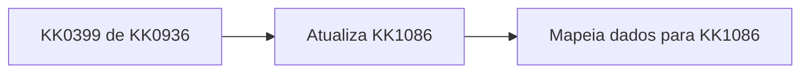
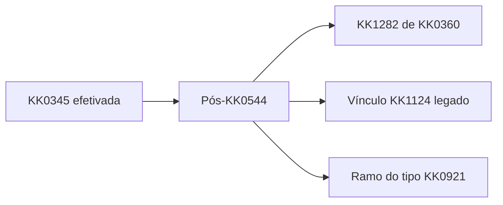

## KK0282 / KK0217 — KK0902 KK0921 — guia objetivo (KK0911)

Objetivo: explicar de forma objetiva o que muda no KK0282 para habilitar o KK0245 KK0902 na plataforma KK0921.

---

## Resumo (1 minuto)

- A KK0936 do KK0245 vem do serviço que define o que será ofertado ao KK0273. O KK0282 precisa salvar isso na KK1086 no momento do "KK0399 de KK0936".
- Depois que a KK0346 foi efetivada, quando for KK0936 do tipo KK0921, o KK0282 NÃO pode seguir o KK0651 legado de vínculo de KK1124.
- Para KK0936 do tipo KK0921, o KK0282 deve executar um KK0651 próprio: validar KK1124 KK0921 e chamar a KK0657.

---

## O que muda (3 mudanças)

1) KK0399 de KK0936 (KK0936 do KK0245)
   - Salvar os dados do KK0245 da KK0936 na KK1086.
   - Salvar o identificador da intenção da KK0936.
   - Usar o KK0826 definido na KK0936 como KK0823 final do KK0245; o KK0823 de KK0346 permanece na fonte atual.

2) Pós-KK0544 (KK1124 e KK0657)
   - Se for KK0936 do tipo KK0921, executar: validar KK1124 KK0921 -> KK0657.

3) Desvio do legado
   - Se for KK0936 do tipo KK0921, não executar o KK0651 legado de "Vínculo KK1123".

## Complete de KK0399 de KK0936 (campos para esta demanda)

KK0371 de dados para o motor do KK1069 no fechamento da KK1338 KK0399 de KK0936: os nomes abaixo são os combinados no KK1142; ajuste fino de nomenclatura fica com as equipes responsáveis.

O que precisa constar no KK0308 (KK0911):

1) Identificação da KK0797 KK0921  
   - Indicar que a KK0936 de KK0245 é do tipo KK0921 (flag ou equivalente), para o KK1069 decidir o ramo pós-KK0544 e não mandar para vínculo KK1124 legado.

2) Identificador da intenção de KK0245  
   - O identificador da intenção devolvido pela origem da KK0936, para reutilizar na KK0657 sem nova KK0330.

3) Limite final do KK0245  
   - O KK0823 de KK0245 definido na resposta da origem da KK0936; no KK1069, esse valor passa a ser tratado como KK0823 máximo do KK0245 na KK1086, substituindo o pré-aprovado que vem da fonte atual.

4) Pacote de KK1077 e KK1026  
   - O que já existe para montar KK0938 no KK1069 (KK1077, KK1026, identificadores que a KK0544 e o KK1283 esperam). Incluir o bloco específico da KK0936 KK0921 no mesmo padrão do bloco já usado para outras jornadas, propagado nos KK1039 do KK0651 que já tratam KK0936 e perfil: KK0399 de KK0936, atualização de perfil na KK1086 e mapeamento de dados de pessoa e ofertas.

5) KK0399 de KK1124 para KK0921 (quando aplicável)  
   - Informações necessárias para a KK1406 de KK1124 KK0921 depois da KK0544; devem estar disponíveis no contexto do KK1069 após o KK0308 (detalhe de KK0372 da KK0072 de KK1406 a fechar com o dono do serviço).

Fora do escopo imediato do KK0308 (conforme refinamentos citados):

- Gratuidade, descontos e condições comerciais extras: não foram tratados como obrigatórios nesta demanda; se essas informações não chegarem no KK0987 de KK0936, o KK1069 não depende delas para a regra acima.
- KK1145 finas de KK0823 mínimo do KK0245 e detalhes da origem do KK0823: no escopo atual, o KK0826 vem da KK0936; o KK0823 de KK0346 segue a fonte original.

## Onde mexer (KK1039 do KK0651)

- Ponto 1: "KK0399 de KK0936" (onde salva a KK0936 e o que será usado depois)
- Ponto 2: "Pós-KK0544" (onde hoje roda KK1283 + vínculo KK1124 legado)

Na pós-KK0544, para KK0936 do tipo KK0921, criar um ramo novo e desviar do vínculo KK1124 legado.

---

## Passo a passo (objetivo)

1) Definir como o KK1069 identifica "é KK0921" (flag ou objeto na KK1086).
2) Em "KK0399 de KK0936", salvar na KK1086: dados do KK0245, identificador da intenção da KK0936 e KK0823 final do KK0245 definido na KK0936.
3) Garantir que o que foi salvo em "KK0399 de KK0936" fica disponível para o resto do KK0651 (KK1086 e KK1423).
4) Na pós-KK0544, quando for KK0936 do tipo KK0921, desviar do "Vínculo KK1124 legado".
5) No ramo do tipo KK0921, chamar a KK1406 de KK1124 KK0921.
6) Se OK, chamar a KK0657.
7) Garantir que, ao final, o KK1283/consumidores downstream leem da KK1086 os dados do KK0245 da KK0936 do tipo KK0921.

## KK0262 (para validar com KK0911/KK1131)

- A KK0936 de KK0245 no KK0921 aparece igual ao que foi definido na origem da KK0936.
- O KK0823 final do KK0245 é o definido na KK0936 (sem divergência com a fonte atual de KK0823 de KK0346).
- No KK0308 de KK0399 de KK0936 chegam: indicador KK0921, identificador da intenção, KK0826 definido na KK0936, KK0987 KK1077/KK1026 com bloco KK0921 e dados de KK1124 KK0921 quando houver.
- O KK1069, quando for KK0936 do tipo KK0921, não executa o vínculo KK1124 legado.
- O KK1069, quando for KK0936 do tipo KK0921, executa validar KK1124 KK0921 e formalizar.

## Apêndice KK1378 (só para quem implementa)

- "KK0399 de KK0936": `KK0418` -> `KK1113` -> `KK1240`
- "Pós-KK0544": `KK1104` e KK0669 `KK0690`
- "Vínculo KK1124 legado": KK1324 `KK0020`
- Complete / KK1423 citadas no KK1142 (alinhar com KK0144 antes de codar):
  - `KK0745`
  - `limite_cartao_direcionador` (entrada do KK0308 usada para sobrescrever `KK1415`)
  - flags ou objeto que identifique KK0936 KK0921 (ex.: `KK0792`, `KK0945` conforme KK0372 final)
  - `KK0946`, `KK0939` já existentes; adicionar `KK0945` nos mesmos três KK1039 que o KK0034
  - KK1124 KK0921: `KK1127` ou equivalente nas KK1335 novas de pós-KK0544; confirmar KK0775 no KK0172 quando as KK1335 existirem
