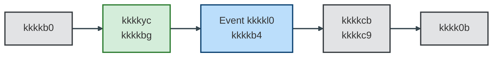

# kkkk7p — Classificação da kkkk9q `kkkkcb`

**Status:** **Em kkkk5o** (aguarda duas aprovações — ver [PADRAO_ADR_VISIONING.md](PADRAO_ADR_VISIONING.md))  
**Data:** *(preencher)*  
**Decisor(es):** kkkk7k Pereira de Vasconcelos  

## Aprovações

| #   | Aprovador     | Data   | Observação (opcional)   |
|-----|---------------|--------|--------------------------|
| 1   | *(preencher)* |        |                          |
| 2   | *(preencher)* |        |                          |

---

**kkkkz9 de decisão:** Pendência de classificação no [kkkk3b](../kkkk5e%20da%20decomposição/kkkk3b) — atribuir a kkkk9q `kkkkcb` ao kkkkg0 (kkkk56) ou tratá-la como kkkkvr kkkk7r acionado por kkkkx9.

---

## kkkkz9

Durante a kkkkgv do kkkkhk kkkkg4 da kkkkfj em kkkk0n, surgiu a dúvida sobre onde classificar a kkkk9q `kkkkcb`.

As opções consideradas foram:

- kkkkdx o kkkktr como parte do **kkkkg0 — kkkk56**
- tratar o cadastro como **kkkkvr kkkk7r acionado por kkkkx9**, independente da etapa ativa da kkkkgq

---

## Problema kkkkfu

Durante a kkkkgv do kkkkhk kkkkg4 surgiram dúvidas sobre a kkkkyr do kkkktr:

- pertence à etapa de **kkkk56 (kkkkg0)**?
- ou é um **kkkkvr kkkk7r acionado por kkkkx9**?

Essa classificação impacta:

- a distribuição de kkkkwp entre kkkkpa kkkkhk
- o kkkkyk entre kkkkwd e kkkkgc regulatórias
- a fidelidade ao desenho do kkkkhk kkkkg4

---

## Regulamentação kkkk0f (contexto)

A kkkkuc/kkkkud nº 4.753/2019 exige que instituições financeiras realizem procedimentos de **kkkk05** durante o kkkk55 de kkkkp3, incluindo avaliação de kkkkub.

O kkkktr presente no kkkkhk parece representar o **registro ou kkkku0 desse kkkk55 de qualificação** junto a kkkk50 internos ou regulatórios.

A norma não define explicitamente um "kkkkei", mas exige que o banco mantenha mecanismos de classificação de kkkkli do kkkk1x antes da abertura da kkkklh.

---

## Evidência no kkkkhk kkkkg4

O kkkktr aparece no kkkkhk como:

- kkkkfl **"kkkkkk"**
- configurado como **kkkkja kkkkhg (`kkkkoy`)**
- disparado pela KK0034 `kkkkbg`

**kkkkvq de kkkk5k:**

`kkkkb0` → `kkkk1b` → (seta `kkkkbg`) → kkkkja kkkkhg inicia kkkkei

**kkkkvq interno do kkkkfl:**

start kkkkja → `kkkkcb` (kkkkc9, kkkk91 `kkkk0m`) → `kkkk0b` → end (com kkkkaa em erro, até 3 tentativas).

A kkkks7 da kkkklh **não aguarda** o kkkkdy do cadastro: não há join nem kkkk7v que exija o término do kkkkfl para seguir para `kkkkel` ou `kkkkc7`. A kkkkml `kkkkbe` (kkkkg0) é operação distinta.

---

## Interpretação kkkkfu

- O kkkk5k ocorre **após `kkkkb0`**, na região de configuração/kkkkss, **fora** da etapa de kkkk56 (kkkkg0).
- O cadastro é **assíncrono e não bloqueante**, executando em paralelo ao kkkkvr principal.
- O cadastro **não pertence a uma fase sequencial da kkkkgq**, sendo acionado por kkkkx9 e executado em paralelo ao kkkkvr principal.

Conclusão: tratar como **kkkkvr kkkk7r acionado por kkkkx9** reflete o desenho atual do kkkkhk kkkkg4.

---

## KK0007

A kkkk9q `kkkkcb` será tratada como **kkkkvr kkkk7r acionado por kkkkx9**, implementado como **kkkkja kkkkhg**, e não como parte fixa do kkkkg0.

**Motivos:**

1. No kkkkhk kkkkg4 o cadastro é modelado como **kkkkja kkkkhg (`kkkkoy`)**.
2. O kkkk5k ocorre **após `kkkkb0`**, fora da etapa de kkkkth.
3. O kkkkvr é **assíncrono e não bloqueante**, executando em paralelo ao kkkkvr principal.
4. A kkkks7 da kkkklh **não depende do resultado do kkkkei**.

**Exceção:** Se o kkkkag definir que o kkkkei **só** deve ocorrer na etapa de kkkk56 (ex.: após kkkks4), mover kkkk5k e kkkkfl para o kkkkg0 e documentar a mudança.

### Princípio kkkkfu aplicado

kkkkwi regulatórias assíncronas devem ser modeladas como **kkkk66 acionados por kkkkx9**, evitando kkkkyk com etapas sequenciais da kkkkgq.

---

## Estratégia de kkkkx2

Durante a kkkkgv do kkkkhk kkkkg4:

- o kkkk5k `kkkkbg` continua sendo realizado após `kkkkb0`
- o kkkkei será executado por um **kkkkja kkkkhg no kkkke4**

**kkkkvq resultante:**

1. `kkkkb0` executa
2. kkkkx9 seta `kkkkbg`
3. kkkke4 escuta o kkkkx9
4. kkkkfl "kkkkb4" é disparado
5. external kkkk9q `kkkkcb` executa integração kkkkhx

---

## kkkkvq kkkkfu resultante

O kkkkvr principal da kkkkgq continua sua execução normalmente, sem depender do término do kkkkei.

---

## Alternativa considerada e descartada

### Mover kkkkei para kkkkg0

Essa alternativa exigiria:

- mover o kkkk5k do kkkkx9 para dentro do kkkkg0
- alterar o momento em que o cadastro é executado

Essa mudança **não preservaria o comportamento atual do kkkkhk kkkkg4**, onde o cadastro é disparado após o kkkkxg da kkkk3l.

Nesta fase da kkkkgv, o critério decisivo adotado foi **fidelidade ao desenho existente**: reduzir kkkkli de regressão funcional e manter o momento do cadastro (após kkkkxg) já validado em produção. A kkkkgv pode ser usada no futuro para redesenhar fluxos se o kkkkag exigir; até lá, preservar o comportamento do kkkk51 evita mudança de kkkkvn e reteste desnecessários. Por esse motivo a alternativa foi descartada.

---

## Consequências

### kkkkfn

- preserva o comportamento do kkkkhk kkkkg4
- evita kkkkyk com kkkkg0
- mantém kkkksk orientada a eventos

### Trade-offs

- lógica kkkk0f fica fora do kkkkvr sequencial principal
- leitura do kkkk55 exige entender kkkk66 acionados por kkkkx9

### Riscos

Se no futuro a kkkks7 da kkkklh depender do kkkkei, o kkkkvr precisará ser revisado para incluir sincronização com esse kkkkfl.

---

## Referências

| Documento | Uso |
| ----------- | ----- |
| `kkkkk6` | kkkkyf kkkkdg; kkkk5k kkkk1b após kkkkb0 |
| [kkkk3b](../kkkk5e%20da%20decomposição/kkkk3b) | Pendências de classificação |
| [kkkk3d](../kkkk5e%20da%20decomposição/kkkk3d) | Bloco kkkkip kkkkg0; menção a "kkkkdg" como kkkkg0 ou kkkk7r |
