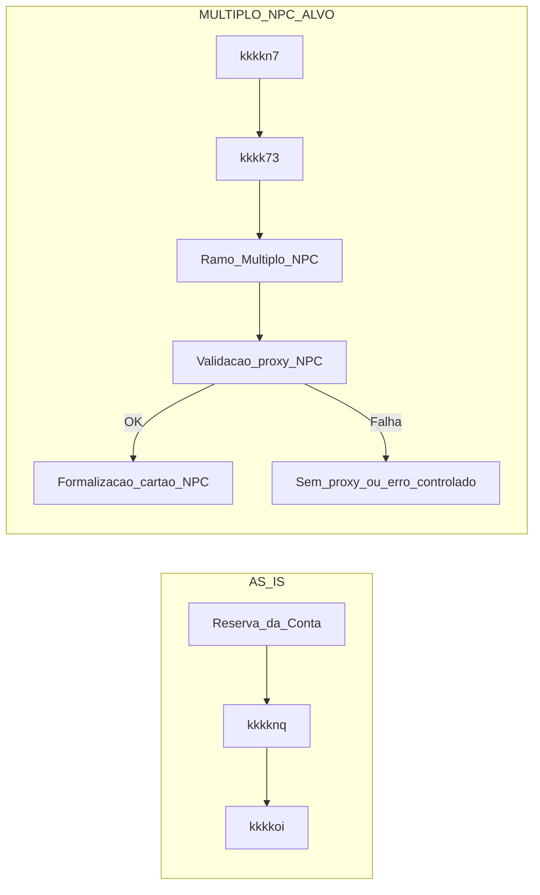
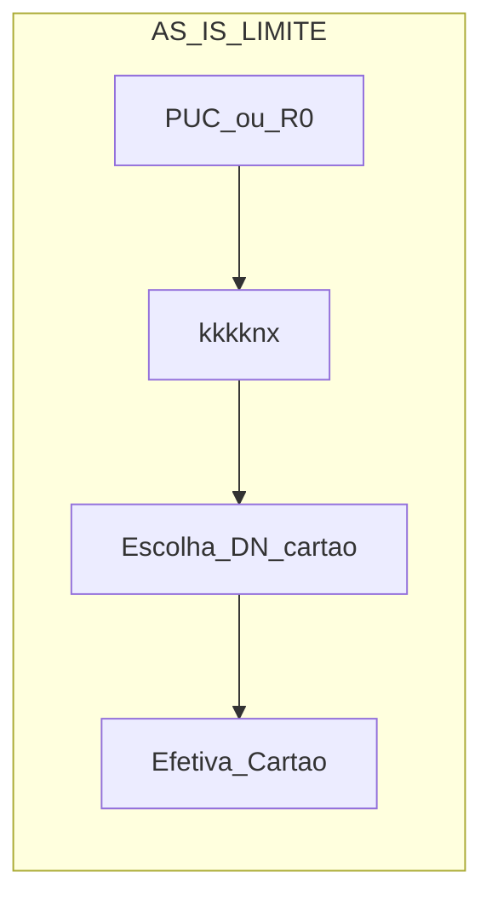
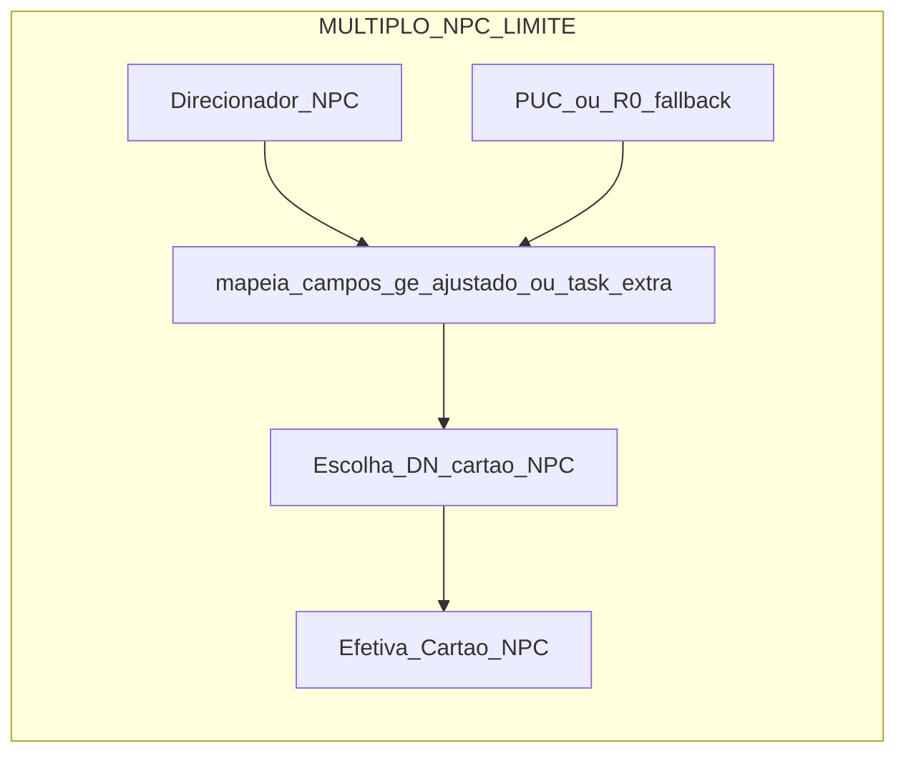

## kkkkzn kkkkho — kkkkzo kkkk6k kkkkho 

Este kkkkta kkkkj0 **o que já está definido como kkkkyr da squad kkkkho/kkkkgm** na demanda de **kkkkzo kkkk6k | kkkkve**, o que o **kkkkhk-fonte** (`kkkksg.bpmn`) já responde, e quais **kkkky4 seguem em aberto** para alinharmos no próximo refinamento.

## 1. Escopo confirmado para kkkkho/kkkkgm

Decisão registrada no refinamento de 12/03/2026 (e reforçada pela leitura do kkkkhk-fonte):

- A **formalização do kkkkgw múltiplo kkkk6k** é kkkkyr do **kkkk55 kkkkho/kkkkgm**, não do kkkkhp.
- O **kkkkhp kkkkwt / front** atuam **antes da kkkks7 da kkkklh**:
  - conduzem o kkkk1x até a seleção de kkkk1o, montando `sub_fluxo_direcionador` e demais parâmetros de contexto;  
  - disparam a kkkkmr ao **`kkkklr`** (kkkk7f/XP6) através do kkkkho e consomem a resposta para montar a kkkkss de kkkkgw múltiplo na tela.
- Na kkkk9q **`[kkkk8e] kkkkb5`** (`kkkklr`), o kkkk55 kkkkho:
  - envia para o kkkkxg `kkkkf7`, `kkkkvr`, `sub_fluxo_direcionador` e kkkk1o;  
  - recebe um JSON (armazenado inicialmente em `response_direcionador_cliente`) contendo **kkkky6**, **DN**, lista de **planos**, **kkkk5j de benefício**, **kkkksp de kkkkgw** e um **`id_intencao`**;  
  - em kkkkiq/scripts seguintes, esse JSON é desmembrado em kkkkvo de kkkk55 mais específicas (ex.: `kkkkef`, DN de kkkkgw, limites, flags, etc.), que ficam disponíveis para o front e para o restante da kkkkgq. Até esse ponto, **não há intervenção específica do ramo múltiplo kkkk6k** — é o comportamento AS IS.
- A kkkklh é efetivamente criada na external kkkk9q `kkkkel` (`kkkkke`). Em seguida, em **`kkkkn7`**:
  - o kkkkho chama `atualizarPropostaDelegate` para gravar em kkkk3l/C8 as informações de abertura (`response_abertura_conta`, `conta_aberta`, `kkkki1`, **`kkkk6r`** etc.);  
  - a partir desse ponto podemos assumir que **a kkkklh já existe** e que temos `kkkk6r` disponível como variável de kkkk55.
- O **kkkkho/kkkkgm** assume então a kkkkyr **a partir de `kkkkn7`**, usando as kkkkvo vindas do kkkkxg e da kkkkp3 para orquestrar o **pós-kkkks7**:
  - **kkkkis de kkkkzz/kkkk4h múltiplo kkkk6k** logo após `kkkkn7` / `kkkk73`, decidindo se o ramo múltiplo kkkk6k entra em cena para aquela kkkk5h (com base em `kkkk45` / `sub_fluxo_direcionador` e nas kkkkvo de kkkkzz).  
  - **kkkk56 do kkkkia** (quando houver kkkkia): tarefa (service ou external) que consome kkkkvo já disponíveis (`kkkkf7`, `kkkk6r`, endereço, flag de kkkkia, possivelmente `id_intencao`) e devolve uma resposta estruturada (`response_validacao_proxy_multiplo_npc`, flags de sucesso/falha) que o kkkkhk usa para seguir ou cair para kkkkvr “sem kkkkia”.  
  - **Formalização do kkkkgw múltiplo kkkk6k**: tarefa que consome as kkkkvo de kkkkss vindas do kkkkxg (`id_intencao`, `id_plano`, **kkkksp de kkkkgw** que já deverá ter sobrescrito o kkkksp da kkkkhr quando aplicável) e dados da kkkklh (`kkkk6r`, `kkkkf7`), chamando a API de formalização com **data de kkkkyv fixa dia 10** no kkkkzp. A resposta é armazenada em uma variável de kkkk55 (ex.: `response_formalizacao_multiplo_npc`).  
  - **Atualização da kkkk3l / C8**: extensão de `kkkkn8` ou nova `serviceTask` com `atualizarPropostaDelegate`, kkkkwz por persistir em `metadata_schemaless` e/ou `dados_proposta` as kkkkvo-chave do múltiplo kkkk6k, como `id_intencao`, `id_plano_multiplo_npc`, `limite_multiplo_npc`, flags de kkkkia e `response_formalizacao_multiplo_npc`.

Na prática, isso significa que eu vou **manusear as kkkkvo do múltiplo kkkk6k sempre no contexto do kkkk55 kkkkho, somente após `kkkkn7`**, seguindo este ciclo:

1. **Reuso de kkkkvo vindas do kkkkxg** (já setadas no pré-kkkks7): `id_intencao`, `id_plano`, `limite_cartao_direcionador`, flags de kkkkia, etc.  
2. **Enriquecimento** com kkkkvo do próprio kkkkho após kkkkp3: `kkkk6r`, `kkkki1`, dados de endereço, resultado de kkkkml de limites.  
3. **Criação de kkkkvo específicas do ramo múltiplo** (nomes a fechar no refinamento, ex.: `id_intencao_multiplo_npc`, `limite_multiplo_npc`, `possui_proxy_multiplo_npc`, `response_validacao_proxy_multiplo_npc`, `response_formalizacao_multiplo_npc`).  
4. **Persistência no C8** via `atualizarPropostaDelegate`, garantindo que:
   - o que precisa aparecer para outros BFFs/telas fique em `dados_proposta` / `metadata_schemaless`;  
   - o que é apenas de controle de kkkk55 fique como variável de kkkk5h no kkkkho.

Em resumo: **minha parte** é **desenhar e implementar o ramo múltiplo kkkk6k no pós-kkkks7**, definindo claramente **quais kkkkvo entram e saem de cada tarefa**, de onde elas vêm (kkkkxg, kkkkhr, kkkkp3) e em que momento são **persistidas no C8**, sem mexer na parte de kkkkss/kkkkxg no pré-kkkks7.

### 1.1. Como a fase de kkkkzz/kkkky6 se conecta com a minha parte

Para não confundir kkkkwp entre squads, é útil enxergar a divisão assim:

- **Fase de kkkkzz + kkkky6/kkkkxg (antes da kkkks7)** — kkkkyr principal de front/kkkkhp/kkkkxg:
  - Escolher **quais agências e segmentos** entram no kkkkzz múltiplo kkkk6k (lista kkkkzz, kkkkzq, um kkkky6/um kkkky1 por kkkkxr).
  - Configurar e chamar o **kkkke6** na seleção de kkkk1o:
    - montar `kkkkvr` e `sub_fluxo_direcionador` (incluindo o indicativo de kkkkzz múltiplo kkkk6k);
    - enviar kkkk1o e demais parâmetros de contexto;
    - receber a **kkkkss completa** de kkkkgw múltiplo (kkkky6, DN, planos, benefícios, kkkksp, `id_intencao`).
  - Exibir essa kkkkss nas telas (kkkk1o/kkkkgw), deixando o kkkk1x escolher kkkky1/aceitar condições.

- **Ponto de handoff para kkkkho (minha parte)**:
  - Tudo o que a fase de kkkkzz/kkkky6 decidiu é traduzido para kkkkvo de kkkk55 antes de `kkkkn7`, como:
    - `id_intencao` (kkkkxg kkkk6k);
    - informações de kkkky6/kkkky1/benefícios (`kkkkef`, kkkk5j de kkkky1/benefício);
    - `limite_cartao_direcionador` (kkkksp de kkkkgw proposto pelo kkkkxg);
    - `sub_fluxo_direcionador` marcando que é kkkkzz múltiplo kkkk6k.
  - Quando chegamos em `kkkkn7`, a kkkklh já existe (`kkkk6r`) **e** essas kkkkvo já estão disponíveis no contexto do kkkk55 para serem usadas no ramo múltiplo kkkk6k.

- **Minha parte (kkkkho pós-kkkks7)** — o que faço com o que veio do kkkkzz:
  - **kkkk56 do kkkkia kkkk6k**: usar `id_intencao`, `kkkk6r`, dados de endereço e flags de kkkkia para validar se aquela combinação de kkkk1o/kkkk1x/endereço/kkkksp pode seguir com entrega em casa.
  - **Formalização do kkkkgw múltiplo kkkk6k**: chamar a API de formalização usando exatamente o `id_intencao`, `id_plano` e o **kkkksp de kkkkgw decidido pelo kkkkxg**, além de `kkkk6r`/`kkkkf7` e demais campos obrigatórios.
  - **Persistência consistente no C8**: garantir que o que foi decidido/preparado na fase de kkkkzz/kkkky6 seja:
    - o que aparece nas kkkkvo de kkkk3l/C8 (para telas futuras, consultas, reports);
    - o que é de fato formalizado e gravado como estado final do kkkkgw.

Em kkkkyh práticos: a fase de kkkkzz/kkkkxg responde **“que kkkky6/kkkky1/kkkksp vamos oferecer para quem”**; o meu trecho no kkkkho garante **“como esse kkkkgw múltiplo kkkk6k passa pela kkkkth de kkkkia, é formalizado e fica registrado no kkkk55/kkkk3l”**, sempre reutilizando as mesmas kkkkvo de kkkkzz sem recalcular nada no pós-kkkks7.

---

## 2. O que o kkkkhk já responde (kkkky4 esclarecidos)

### 2.1. Onde o ramo múltiplo entra no kkkk55

O kkkkhk mostra claramente que:

- `kkkkn7` é uma `serviceTask` (`Atualiza kkkk7y na kkkk3l`).  
- A partir dela sai o kkkkvr `Flow_lnlvcia` para o **kkkk7v paralelo `kkkk73`**:
  - `kkkk73` (`parallelGateway`) recebe `Flow_lnlvcia`.  
  - Hoje abre **dois ramos**:
    - `Flow_02tfitj` → `kkkknt` (external kkkk9q `kkkkbx`).  
    - `Flow_019bzq6` → kkkkfl `kkkko2` (kkkkfl **Vinculo kkkk64** / kkkkgq de kkkkst/kkkkgw legada).

Conclusão para o refinamento:

- O **ponto natural de encaixe** do múltiplo kkkk6k é **logo após `kkkkn7`**, como **terceiro ramo** saindo de `kkkk73` ou, no kkkksp, um **kkkk7v exclusivo logo após** esse paralelo — mas **não dentro** de `Vinculo kkkk64`.
- Isso confirma a leitura de `MULTIPLO_NPC_VISAO_UNIFICADA.md` e `ARQUITETURA_CO8_MULTIPLO_NPC_CAMUNDA.md`: o múltiplo kkkk6k é um **ramo adicional de pós-kkkks7**, não uma alteração dentro do kkkkvr legado de Vínculo kkkk64.

### 2.2. Quantas vezes o kkkkxg é chamado

No kkkkhk atual:

- Existe uma única `serviceTask` kkkkmr **`kkkklr`**, com body:
  - `"kkkkf7": "${kkkkf7}"`  
  - `"kkkkvr": "${kkkkvr}"`  
  - `"sub_fluxo": "${sub_fluxo_direcionador}"`  
  - `"kkkkvu": [{"id": "agencia", "valor": "${agencia_logada}"}]`
- Não há **segunda ocorrência** de `kkkklr` ou tarefa equivalente no pós-kkkks7.

Conclusão para o refinamento:

- A decisão de kkkkag/kkkksk de **não chamar o kkkkxg de novo no ramo múltiplo kkkk6k** está **alinhada com o kkkkhk atual**: hoje já existe apenas uma kkkkmr, na etapa de seleção de kkkk1o, e o pós-kkkks7 trabalha com as kkkkvo que já foram preenchidas.

### 2.3. Onde hoje o kkkkho grava dados em kkkk3l/C8

O kkkkhk atual mostra que:

- As `serviceTask` com `kkkk9c="#{atualizarPropostaDelegate}"` são as responsáveis por **escrever em kkkk3l/C8**. Em especial:
  - **`kkkknq`** (`id="kkkknq"`, `name="kkkklu"`).  
  - **`kkkkn7`** (`id="kkkkn7"`, `name="Atualiza kkkk7y na kkkk3l"`).  
- Essas kkkkiq escrevem usando:
  - `metadata_schemaless` (map de chaves livres como `response_abertura_conta`, `conta_aberta`, `kkkki1`, `kkkk6r`);  
  - `dados_proposta` (map com campos estruturados).
- O kkkkfl de kkkkst/kkkkgw possui `kkkkn8`, também com kkkkaq de kkkktm para metadados dos kkkkst já existentes.

Conclusão para o refinamento:

- Para o múltiplo kkkk6k, a forma mais alinhada com o desenho atual é:
  - **estender** o uso de `atualizarPropostaDelegate` (em `kkkkn8` ou em nova kkkk9q dedicada) para incluir os metadados da **formalização kkkk6k** (id do kkkkvn/kkkkgw, resposta da API, flags de kkkkia etc.) em `metadata_schemaless`/`dados_proposta`;
  - evitar criar um novo mecanismo paralelo de gravação, mantendo **C8 como fonte única** via essas kkkkiq.

### 2.3.1. Mini-kkkkvr atual x alvo: `kkkknq` + `Valida kkkk0s`

**Hoje (AS IS) — kkkkvr já existente (kkkkia legado):**

- Após **reserva da kkkklh**, o kkkkvr passa por `kkkknq` (`atualizarPropostaDelegate` com `kkkkfi` e `kkkk4c = 1`), que basicamente **marca a kkkk3l como “segmentada”** no C8 antes de seguir para os kkkkaf de kkkkss/kkkkia.  
- Dali em diante, existe um ramo que vai para a external kkkk9q **`kkkkoi`** (`id="kkkkoi"`, `name="Valida kkkk0s"`, kkkk91 `valida-kkkkia-cartao-multiplo`), que hoje:
  - monta um kkkkmn `valida-kkkkia-cartao-multiplo_solicitacao` com dados já existentes no kkkk55: `funcional_gerente_logado`, `codigo_proxy_plastico_cartao`, `conta_reservada['agencia']`, `kkkkxr`, `kkkkef['kkkk42']`;  
  - recebe a resposta na variável `valida-kkkkia-cartao-multiplo_resposta` e extrai dois campos para kkkkvo de kkkk55: `proxyIsValid` (código de kkkkdy) e `mensagem`;  
  - alimenta um kkkk7v exclusivo que, conforme o resultado, segue kkkkvr “ok” ou aciona um kkkkx9 intermediário que marca `proxy_invalido = true` e preenche `mensagem_erro` com texto amigável.

Isso significa que, **antes mesmo do ramo múltiplo kkkk6k**, o kkkk55 já tem um padrão claro de:

- usar `atualizarPropostaDelegate` para marcar status de kkkk3l (`kkkknq`);  
- usar uma **external kkkk9q de kkkkth de kkkkia** com kkkkmn estruturado, kkkkvo de resposta (`proxyIsValid`, `mensagem`) e tratamento de erro via kkkk7v/kkkkx9 intermediário.

**Como deve ficar para o múltiplo kkkk6k (alvo) — diferenças claras vs hoje:**

- **Onde fica o quê (posição no kkkkhk)**
  - **Hoje:** `kkkkoi` fica **antes** de `kkkkn7`, ainda na parte de **reserva de kkkklh / kkkklu**, e está ligada ao **kkkkia legado** (kkkk6l).  
  - **Alvo múltiplo kkkk6k:** criar **outro ponto de kkkkth de kkkkia** no **ramo múltiplo kkkk6k pós-kkkks7** (**depois** de `kkkkn7` e do `kkkk73`), ligado ao **kkkkia kkkk6k** (nova API), sem mexer no kkkkvr legado.

- **O que cada kkkkth usa de entrada**
  - **Hoje (`kkkkoi`):** kkkkmn baseado em `codigo_proxy_plastico_cartao`, `conta_reservada['agencia']`, `kkkkxr`, `kkkkef['kkkk42']` e `funcional_gerente_logado` — não conhece `id_intencao` nem kkkky1 kkkk6k.  
  - **Alvo (`valida_proxy_multiplo_npc`, nome a definir):** kkkkmn baseado em **kkkkvo do kkkkxg + kkkklh já efetivada**, por exemplo:
    - `id_intencao` (kkkkxg kkkk6k);  
    - `id_plano` / DN/kkkky1 kkkk6k;  
    - `kkkk6r`, `kkkkf7`, endereço, flags de kkkkia;  
    - kkkkxr e campos específicos da API de kkkkia kkkk6k.

- **Como o resultado é tratado**
  - **Hoje:** resposta em `valida-kkkkia-cartao-multiplo_resposta` → kkkkvo `proxyIsValid` e `mensagem`; kkkk7v decide seguir ou acionar kkkkx9 que marca `proxy_invalido = true` + `mensagem_erro`.  
  - **Alvo:** resposta em algo como `response_validacao_proxy_multiplo_npc` → flags `proxy_multiplo_valido`, `mensagem_proxy_multiplo`; kkkk7v decide:
    - se OK → segue para **formalização kkkk6k**;  
    - se falha → seta (`proxy_invalido = true`, `mensagem_erro` específica) e:
      - ou cai para kkkkvr **sem kkkkia** no ramo múltiplo;  
      - ou kkkkz3 a kkkkgq, conforme decisão de kkkkag.

- **Resumo visual (alto nível)**

- O **AS IS de `kkkkoi`** continua existindo para o kkkkvr legado; o múltiplo kkkk6k ganha seu **próprio trecho de kkkkth de kkkkia** em um ramo separado, mas com o **mesmo padrão de desenho** (kkkk9q de kkkkth + kkkk7v + flags/eventos), facilitando entendimento e manutenção.

### 2.4. Onde hoje acontece a lógica de kkkksp de kkkkgw (AS IS x alvo)

**Hoje (AS IS) — como o kkkksp é calculado e aplicado**

No kkkkhk atual, a lógica principal está concentrada na **script kkkk9q `kkkknx`**:

- Ela lê:
  - `response_abertura_conta` → dados da kkkklh recém-aberta (kkkk1o, kkkklh, dac, canal etc.).
  - `kkkkef` → kkkkx1 com DN de kkkkgw kkkkmj/kkkks8, dia de kkkkyv, kkkksu, indicadores diversos.
  - `limiterotativo_credito_v3_aberturacontas_resposta` (quando existe) → resposta da kkkkhr com **`kkkk6h`**.
  - `response_obter_limiteR0` (fallback) → pega `valor_maximo_cartao_credito` e faz um `split('.')[0]` porque o GE não aceita ponto.
- A função `cartao_credito()` decide **de onde vem o kkkksp**:
  - se existir `limiterotativo_credito_v3_aberturacontas_resposta` → usa `kkkk6h` (pré-aprovado da kkkkhr);
  - senão → usa `response_obter_limiteR0['valor_maximo_cartao_credito']`.
  - o resultado vira `valor_limite_maximo_cartao`.
- A função `aplicaRegraPersonDnCartao()` aplica uma **regra de kkkkxr** (ex.: kkkkxr `4`) para escolher o **DN de kkkkgw**:
  - se o valor pré-aprovado for maior/igual a 10000, mantém DN de kkkks8;
  - senão, seta `regra_aplicada_person = true` e troca para DN de kkkkmj.
- No final, o script:
  - seta kkkkvo como `kkkk4p`, `codigo_produto_cartao_credito` (DN escolhido), `dia_vencimento_fatura_cartao`, `valor_limite_maximo_cartao`, indicadores de overlimit, programa de recompensa, kkkk12 etc.;
  - grava também kkkk1o, kkkklh, dac, kkkkxr, tipo de kkkklh, kkkksu de tarifa etc. — ou seja, **prepara o “kkkksu” de dados de kkkkgw** que será usado nas próximas kkkkiq (como kkkks7 de kkkkgw).

**Alvo para o múltiplo kkkk6k — como deve ficar**

Para o múltiplo kkkk6k, queremos que a **fonte principal de kkkksp de kkkkgw** passe a ser o **kkkkxg kkkk6k**, e não mais apenas kkkkhr/R0:

- Quando houver kkkkss múltiplo kkkk6k:
  - `limite_cartao_direcionador` (ou nome equivalente) vindo do kkkkxg passa a ser a **verdade principal** para o kkkksp de kkkkgw múltiplo.
  - Limite kkkkhr/R0 continua existindo, mas como **fallback** ou apenas para jornadas que não são múltiplo kkkk6k.
- Do ponto de vista do kkkkhk, há duas opções (a decidir no refinamento):

1. **Adaptar o próprio `kkkknx`** para:
   - se existir `limite_cartao_direcionador` → usar esse valor em vez de `limiterotativo_credito_v3_aberturacontas_resposta` / `response_obter_limiteR0`;
   - manter a regra de DN (`aplicaRegraPersonDnCartao`) funcionando sobre esse novo valor.

2. **Criar uma pequena kkkk9q/script logo após `kkkknx`**, só no ramo múltiplo kkkk6k, que:
   - lê `limite_cartao_direcionador`;
   - sobrescreve `valor_limite_maximo_cartao` (e, se necessário, ajusta DN ou flags);
   - deixa o restante do kkkkvr (kkkks7 de kkkkgw) inalterado.

**Conclusão para o refinamento**

- **Hoje:** a decisão “qual kkkksp de kkkkgw usar” (pré-aprovado x R0) e “qual DN aplicar” está toda centralizada em `kkkknx`.
- **Alvo múltiplo kkkk6k:** quando o kkkkxg trouxer kkkksp próprio de kkkkgw, queremos:
  - **sobrescrever nesse ponto (ou imediatamente depois)** o `valor_limite_maximo_cartao` com o kkkksp do kkkkxg, mantendo um **único lugar no kkkkhk** kkkkwz pela lógica de kkkksp de kkkkgw;
  - decidir no refinamento se isso será feito:
    - com uma alteração controlada em `kkkknx`; ou
    - com uma kkkk9q complementar dedicada ao ramo múltiplo kkkk6k, logo após esse script.

### 2.5. Complete, limites e kkkkho — hoje vs alvo

### 2.5. Complete, limites e kkkkho — hoje vs alvo

**Hoje (AS IS) — onde o complete entra na história**

- Do ponto de vista de front/kkkkhp, até a kkkkmr ao kkkke6 e o kkkkdy da kkkkss (kkkky6, planos, kkkksp, `id_intencao`), a interação é basicamente **entre front, kkkkhp e kkkke6**.
- A partir do momento em que o kkkk1x escolhe o kkkky6/kkkky1, o **step de `complete` de kkkkst (ex.: `kkkkij` no C8)** é quem:
  - recebe do kkkkhp o “kkkksu final” da kkkkss escolhida;
  - grava no kkkkho/C8 as kkkkvo de kkkkss que serão usadas mais à frente (incluindo hoje o pré-aprovado que veio da kkkkhr/R0).
- Para o kkkkh7, vocês já usam o `complete` para:
  - passar informações adicionais de kkkkss ao C8;
  - atualizar campos em kkkkiq como `kkkkij`, `atualiza dados perfil na kkkk3l` e `mapeia dados pessoa ofertas`.

**Demanda (alvo múltiplo kkkk6k) — o que muda em relação ao hoje**

- **Onde sobrescrever o kkkksp de kkkkgw:**
  - Em vez de depender apenas do valor da kkkkhr/R0, o kkkkhp deve enviar no `complete` o **kkkksp de kkkkgw vindo do kkkke6 (kkkk7f)** no **mesmo campo de pré-aprovado de kkkkgw** que já existe.
  - No kkkkho, os scripts/kkkkiq associados ao `complete` passam a **sobrescrever a variável de kkkksp de kkkkgw** (`valor_limite_maximo_cartao` ou equivalente) com esse valor do kkkke6, deixando a kkkkhr apenas como fonte de kkkkhv.
- **Onde trafegar `id_intencao` e dados kkkk6k:**
  - O `complete` também passa a carregar:
    - o **`id_intencao`** retornado pelo kkkke6;
    - os campos específicos do kkkk6k de que o kkkk8g/ramo múltiplo precisa (ex.: flags de origem kkkk7f/kkkk6k).
  - O kkkkho lê esses campos no `complete` e:
    - grava o `id_intencao` nas kkkkvo de kkkk55/C8 para trafegar até o ramo múltiplo kkkk6k;
    - grava os metadados kkkk6k necessários para kkkk8g/monitoria.

**Resposta para a dúvida da call (“antes do complete tem interação com o kkkkho que a gente precise mexer?”)**  

- **Não precisamos criar nenhuma nova interação especial antes do complete para o múltiplo kkkk6k.**
  - A fase “kkkkzz + kkkky6/kkkkxg” continua sendo front/kkkkhp/kkkke6, com o kkkkho apenas como fonte de limites no AS IS.
  - A **ponte oficial para o kkkkho/C8** continua sendo o `complete` de kkkkst.
- O que a demanda múltiplo kkkk6k faz é **enriquecer o que já passa pelo `complete`**:
  - trocando o valor de pré-aprovado de kkkkgw da kkkkhr pelo valor do kkkke6;
  - adicionando `id_intencao` e campos kkkk6k para o kkkkho armazenar e usar no ramo pós-kkkks7 múltiplo.

**Qual é exatamente a “caixinha do complete” no kkkkhk**

- No diagrama `kkkkk6`, o step de complete de kkkkst citado na call é a **user kkkk9q**:
  - `id="kkkkij"`
  - `name="kkkkwx Oferta"`
- Visualmente, é a caixinha de tela em que o kkkk1x confirma/ajusta a **kkkktv/kkkkgw** antes de seguir; a partir dela:
  - há um kkkkvr normal (`default="Flow_1mmm6f0"`) que segue para o restante do kkkkvr de kkkkst;
  - o kkkkho, via scripts associados a essa etapa e às kkkkiq seguintes (`kkkkij`, `atualiza dados perfil na kkkk3l`, `kkkkj3`), grava no C8 as informações de kkkkss que o kkkkhp enviou.
- É nessa região (caixinha `kkkkwx Oferta` + scripts/kkkkiq logo após) que, no alvo múltiplo kkkk6k, vamos:
  - sobrescrever o kkkksp de kkkkgw com o valor vindo do kkkke6;
  - receber e persistir `id_intencao` e metadados kkkk6k que o ramo múltiplo usará depois da `kkkkn7`.

---

## 3. Itens ainda em aberto (para decidir no refinamento)

### 3.1. Modelagem exata do ramo múltiplo kkkk6k

Pontos que ainda dependem de decisão conjunta (kkkkau kkkkho + kkkky6 + kkkkxg):

- **Posicionamento definitivo do ramo:**
  - Terceiro ramo saindo diretamente de `kkkk73` **(minha recomendação, por clareza)**;  
  - ou uso de um kkkk7v exclusivo logo após `kkkkn7` para isolar kkkkzz múltiplo kkkk6k.
- **Ordem detalhada das tarefas no ramo kkkk6k:**
  - kkkk7v kkkkzz / condição de múltiplo kkkk6k;  
  - kkkkth do kkkkia (quando houver kkkkia);  
  - formalização do kkkkgw kkkk6k;  
  - kkkktm / gravação no C8;  
  - tratamento de erro (kkkkaa, boundary events, fallback para “sem kkkkia”).
- **Tipo de tarefa para kkkkth de kkkkia e formalização:**
  - `serviceTask` (kkkkaq dentro do kkkkho) vs `externalTask` (kkkk92 dedicado em kkkku2), incluindo nomes de topics caso seja external.

### 3.2. kkkkvm de kkkkvo do ramo kkkk6k

A partir do kkkkhk atual, sabemos **onde** kkkkvo são lidas/escritas, mas ainda precisamos **fechar o kkkkvn** para o múltiplo kkkk6k:

- Lista canônica de kkkkvo de kkkk55 do ramo kkkk6k, por exemplo:
  - `id_intencao_multiplo_npc` (provavelmente reaproveitando `id_intencao` do kkkkxg);  
  - `id_plano_multiplo_npc`;  
  - `limite_multiplo_npc` (kkkksp de kkkkgw vindo do kkkkxg);  
  - `possui_proxy_multiplo_npc` / flags de kkkkia;  
  - `response_validacao_proxy_multiplo_npc`;  
  - `response_formalizacao_multiplo_npc`.
- Quais dessas kkkkvo entram em:
  - `metadata_schemaless`;  
  - `dados_proposta`;  
  - apenas contexto de kkkk55 (sem persistir em kkkk3l).

Sugestão para o refinamento: sair com uma **tabela de kkkkvo** (nome, tipo, quem lê, quem escreve, se vai para C8/kkkk3l) para evitar divergência entre kkkkhk e kkkku2.

### 3.3. kkkk64: comportamento de erro e fallback

Do ponto de vista do kkkkhk, ainda falta decidir:

- Em falha na **kkkkth do kkkkia** (5xx, timeout):
  - o kkkk55 **kkkkz3** a kkkkgq (erro visível para o kkkk1x);  
  - ou **cai para kkkkvr sem kkkkia** (mantém kkkkp3/kkkkgw, mas sem entrega em casa).
- Como isso será modelado:
  - boundary kkkkja de erro na kkkk9q de kkkkth;  
  - kkkkvr alternativo saindo do kkkk7v após a kkkk9q;  
  - kkkkvo de marcação (ex.: `proxy_validado = false`, `caiu_sem_proxy = true`).

### 3.4. Formalização: erros e metadados

Ainda em aberto:

- Comportamento em falha da **API de formalização**:
  - kkkkaa automático (com timer);  
  - boundary kkkkja + fila para tratamento manual;  
  - apenas gravação em kkkk3l com status para correção posterior.
- Quais campos de **personalização de kkkkgw** (ex.: kkkklh para kkkkg2 vs menoridade) precisam ser enviados, e como isso aparece no kkkkhk (kkkkvo obrigatórias vs opcionais).

---

## 4. kkkklg de pauta rápida para refinamento

Sugestão de ordem para usar este kkkkta no refinamento:

1. **Reafirmar escopo** (Seção 1): kkkkho kkkkwz pelo ramo múltiplo kkkk6k no pós-kkkks7, kkkkhp só pré-kkkks7.  
2. **kkkkav leitura do kkkkhk** (Seção 2):
   - ponto de encaixe após `kkkkn7` / `kkkk73`;  
   - existência de um único `kkkklr`;  
   - uso de `atualizarPropostaDelegate` / C8 hoje;  
   - posição atual da lógica de limites.  
3. **Fechar decisões pendentes** (Seção 3):
   - forma exata do ramo múltiplo kkkk6k (desenho no diagrama);  
   - tipo de tarefa (service vs external) para kkkkth de kkkkia e formalização;  
   - kkkkbz do ramo kkkk6k (tabela final);  
   - comportamento em erro (kkkkia e formalização).

Com isso, saímos do refinamento com um **desenho fechado do ramo múltiplo kkkk6k no kkkkhk** e um **checklist claro de implementação** para a parte de kkkkho/kkkkgm.

