[ADR/DECISAO_BACKOFFICE_QUEM_PUBLICA_EVENTO_GENERICO.md]
XXXXX
# KK0466 / Pendência: KK0134 — quem publica o KK0610? (KK0639 vs KK0995)

> **KK0362:** Pendência 2 do [KK0846](../KK0789%20da%20decomposição/KK0846). O KK1069 **KK0134** (`KK0952.bpmn`) é disparado por **KK0610** (KK0065 de KK0661, KK1029, etc.) a partir de qualquer etapa da KK0797. A dúvida era: o KK0610 que inicia o KK0134 deve ser publicado por **cada KK0178** (1, 2, 3 ou 4) ou pelo **KK0995**?
> **Status:** **Em KK0064**. (KK0466 KK1086: KK0641 o KK0610 de KK0134 diretamente; aguarda duas aprovações — ver [PADRAO_ADR_VISIONING.md](PADRAO_ADR_VISIONING.md).)

**KK0362 da decisão:**

- **Data:** *(preencher)*
- **Decisor(es):** KK0667 Pereira de Vasconcelos

## Aprovações

| #   | Aprovador     | Data   | Observação (opcional)   |
|-----|---------------|--------|--------------------------|
| 1   | *(preencher)* |        |                          |
| 2   | *(preencher)* |        |                          |

> **Nota:** KK0040 em KK0065 até preenchimento de duas aprovações.

---

## 1. Situação no KK0889

- O KK0134 não é KK1324 sequencial; é acionado em situações como KK1467, KK0065 de documentos, KK1029, KK0587.
- No KK0889, esses disparos ocorrem a partir de KK1039 do mesmo KK1069. Após a KK0471, esses KK1039 estarão nos KK0184.

---

## 2. Opções consideradas

| Opção | Descrição | Prós / contras |
| ------- | ----------- | ----------------- |
| **Filhos publicam** | Cada KK0178 que identificar condição de KK0135 **publica** uma mensagem/sinal. O KK1069 KK0134 é iniciado por subscription. | **Prós:** Filho tem o contexto; não depende do KK0995. **Contras:** Cada KK0639 conhece o KK0372 do KK0610. |
| **KK0995 publica** | Os KK0640 notificam o KK0995 (KK1424 ou mensagem); o **KK0995** é o único que publica o KK0610 que inicia o KK0134. | **Prós:** Um único ponto de publicação. **Contras:** KK0995 precisa tratar o sinal; pode exigir KK0165 KK0867 ou lógica extra. |
| **Híbrido / broker** | Serviço intermediário (KK0604 mesh, KK0669 de eventos) escuta KK1423 ou eventos dos KK0640 e publica o KK0610 de início do KK0134. | **Prós:** Desacopla engine do KK0372; um único produtor para o tópico. **Contras:** Mais um componente; operação e latência adicionais. |

**Por que não adotar o híbrido (reversibilidade):** Um intermediário de eventos é uma KK0084 legítima (KK0604 mesh, KK0669), mas neste contexto o custo de complexidade não se justifica. Os KK0640 já têm o contexto da condição de KK0134; publicar diretamente no broker mantém o caminho curto e evita um ponto único de falha e um ciclo de vida extra (deploy, monitoração, versionamento do intermediário). Se no futuro o número de produtores ou a necessidade de transformação/KK1406 centralizada crescer, a opção híbrida pode ser reavaliada — até lá, "KK0641" com KK0372 e KK1214 únicos é o trade-off escolhido.

---

## 3. Problema KK0087

Após a KK0471, vários KK1039 da KK0797 podem precisar disparar KK0134:

- Wayout / KK0065 de KK0661 em KK1078 ou KK1405.
- Análises KK1029 em KK0654 KK1371.
- Erros de KK1406 (KK0082, KK0145, etc.).

Se apenas o **KK0995** pudesse publicar o KK0610:

- Cada KK0178 teria de **sinalizar o KK0995**, que por sua vez publicaria o KK0610.
- O KK0995 passaria a concentrar lógica de eventos de domínio que não são KK1167 direta dele.
- A coordenação entre KK0640 e KK0995 ficaria mais acoplada (mais KK1423, mais casos especiais).

Por outro lado, deixar **cada KK0639 publicar** o KK0610 sem padrão traria:

- KK0379 de KK0610 espalhados e difíceis de manter.
- Comportamentos heterogêneos de KK1190/erro.

A decisão precisa equilibrar **KK0480** (KK0640 são donos do contexto) e **governança** (KK0372 único de KK0610).

---

## 4. Solução recomendada

### 4.1 Quem publica

- **Recomendação:** cada KK0178 que detectar condição de KK0134 **publica diretamente** o KK0610 de domínio (ex.: `KK0137`), em um **broker de mensagens** (KK0809, etc.).
- O KK1069 `KK0952.bpmn` é iniciado por **subscription** (message start KK0604) a esse KK0610.
- O KK0995 **não** publica nem intermedia o KK0610; ele continua focado em orquestrar apenas as etapas macro (1→2→3→4).

### 4.2 KK0371 de KK0610 (exemplo)

Para KK0759, o KK0372 deve incluir **identificação do KK0230/KK0610** e o KK1001. Exemplo (não definitivo; definir na KK0759):

**Identificação do KK0610 (obrigatório no KK0372):**

- **Tópico / KK0230:** nome do tópico KK0809 (ou equivalente) — ex.: `KK0951` ou conforme convenção do KK1084. Documentar no KK1214 ou KK0040 de mensagens.
- **MessageName (KK0172):** nome da mensagem que dispara o KK0867 Start Event do KK1069 `KK0952.bpmn` — ex.: `KK0872` ou nome acordado. Deve ser o mesmo usado na subscription do KK1069 KK0134.

**KK1002 (campos de exemplo):**

- `KK0754`
- `KK0753`
- `KK0973` ("KK0179", "KK0180", "KK0181", "KK0182")
- `KK0896` KK0001
- `timestamp`
- `KK0422` (objeto opcional para contexto específico)

Esse KK0372 deve ser mantido em **KK1214 compartilhado** (libs ou registry) para evitar divergências entre KK0640.

### 4.3 Dificuldades e mitigação

- **KK0379 espalhados:** todos os KK0640 precisam usar o mesmo KK0372.  
  → Mitigar com KK1214 único versionado (ex.: módulo compartilhado ou KK1214 registry).

- **KK0731 de mensagens:** KK1201 de cada squad alterar o KK0610 de forma diferente.  
  → Mitigar com owners claros do KK0610 de domínio e revisão de mudanças (KK0488, KK0040).

- **Observabilidade:** vários produtores diferentes para o mesmo KK0610.  
  → Mitigar com logging/tracing padronizado (correlação por `KK0754` e `KK0973`).

- **Tratamento de erro:** publicar KK0610 pode falhar.  
  → Padronizar KK1037 no nível de KK0770 ou de KK1468 que faz a publicação.

---

## 5. O que documentar no N1

- **Quem** publica: KK0185, via KK0610 de domínio em broker.
- **KK0371** do KK0610 (KK1001, tópico/KK0230) — ou link para KK1215 correspondente.
- **Onde** no N1: seção \"KK0867 / Event (KK0134)\", descrevendo que o KK0995 não intermedia esses eventos.
- **Referência** KK0004 de KK0084 de mensagens com os detalhes de KK0759.

---

## 6. Referências

| Documento | Uso |
| ----------- | ----- |
| [KK0846](../KK0789%20da%20decomposição/KK0846) | Pendência 2; seção "KK0867 / Event (KK0134)" |
| [KK0848](../KK0789%20da%20decomposição/KK0848) | KK0134 como KK1069 KK1372 |
| [KK1153](../Relatórios%20da%20atividade/KK1153) | Seção 5 — item "KK0134: quem publica o KK0610?" |

$$$$$

[ADR/DECISAO_CADASTRA_RISCO_BACEN_BPMN4_OU_TRANSVERSAL_GENERICO.md]
XXXXX
# KK0040 — Classificação da KK1332 `KK0195`

**Status:** **Em KK0064** (aguarda duas aprovações — ver [PADRAO_ADR_VISIONING.md](PADRAO_ADR_VISIONING.md))  
**Data:** *(preencher)*  
**Decisor(es):** KK0667 Pereira de Vasconcelos  

## Aprovações

| #   | Aprovador     | Data   | Observação (opcional)   |
|-----|---------------|--------|--------------------------|
| 1   | *(preencher)* |        |                          |
| 2   | *(preencher)* |        |                          |

---

**KK0362 de decisão:** Pendência de classificação no [KK0848](../KK0789%20da%20decomposição/KK0848) — atribuir a KK1332 `KK0195` ao KK0177 (KK1405) ou tratá-la como KK0651 KK1372 acionado por KK0610.

---

## KK0362

Durante a KK0471 do KK0172 KK0890 da KK0798 em KK1075, surgiu a dúvida sobre onde classificar a KK1332 `KK0195`.

As opções consideradas foram:

- KK0884 o KK0199 como parte do **KK0177 — KK1405**
- tratar o cadastro como **KK0651 KK1372 acionado por KK0610**, independente da etapa ativa da KK0797

---

## Problema KK0087

Durante a KK0471 do KK0172 KK0890 surgiram dúvidas sobre a KK1167 do KK0199:

- pertence à etapa de **KK1405 (KK0177)**?
- ou é um **KK0651 KK1372 acionado por KK0610**?

Essa classificação impacta:

- a distribuição de KK1168 entre KK1074 KK0172
- o KK0017 entre KK1413 e KK0785 regulatórias
- a fidelidade ao desenho do KK0172 KK0890

---

## Regulamentação KK0129 (contexto)

A KK1165/KK0279 nº 4.753/2019 exige que instituições financeiras realizem procedimentos de **KK0752** durante o KK1069 de KK0007, incluindo avaliação de KK1008.

O KK0199 presente no KK0172 parece representar o **registro ou KK0311 desse KK1069 de qualificação** junto a KK1298 internos ou regulatórios.

A norma não define explicitamente um "KK0197", mas exige que o banco mantenha mecanismos de classificação de KK1201 do KK0273 antes da abertura da KK0346.

---

## Evidência no KK0172 KK0890

O KK0199 aparece no KK0172 como:

- KK1324 **"KK0192"**
- configurado como **KK0604 KK1322 (`KK1374`)**
- disparado pela KK1424 `KK0771`

**KK0650 de KK0509:**

`KK0503` → `KK0744` → (KK1281 `KK0771`) → KK0604 KK1322 inicia KK0197

**KK0650 interno do KK1324:**

start KK0604 → `KK0195` (KK0625, KK1363 `KK0194`) → `KK0099` → end (com KK1190 em erro, até 3 tentativas).

A KK0544 da KK0346 **não aguarda** o KK1187 do cadastro: não há join nem KK0669 que exija o término do KK1324 para seguir para `KK0534` ou `KK1110`. A KK0330 `KK0338` (KK0177) é operação distinta.

---

## Interpretação KK0087

- O KK0509 ocorre **após `KK0503`**, na região de configuração/KK0936, **fora** da etapa de KK1405 (KK0177).
- O cadastro é **assíncrono e não bloqueante**, executando em paralelo ao KK0651 principal.
- O cadastro **não pertence a uma fase sequencial da KK0797**, sendo acionado por KK0610 e executado em paralelo ao KK0651 principal.

Conclusão: tratar como **KK0651 KK1372 acionado por KK0610** reflete o desenho atual do KK0172 KK0890.

---

## KK0466

A KK1332 `KK0195` será tratada como **KK0651 KK1372 acionado por KK0610**, implementado como **KK0604 KK1322**, e não como parte fixa do KK0177.

**Motivos:**

1. No KK0172 KK0890 o cadastro é modelado como **KK0604 KK1322 (`KK1374`)**.
2. O KK0509 ocorre **após `KK0503`**, fora da etapa de KK1406.
3. O KK0651 é **assíncrono e não bloqueante**, executando em paralelo ao KK0651 principal.
4. A KK0544 da KK0346 **não depende do resultado do KK0197**.

**Exceção:** Se o KK0911 definir que o KK0197 **só** deve ocorrer na etapa de KK1405 (ex.: após KK0149), mover KK0509 e KK1324 para o KK0177 e documentar a mudança.

### Princípio KK0087 aplicado

KK0784 regulatórias assíncronas devem ser modeladas como **KK1326 acionados por KK0610**, evitando KK0017 com etapas sequenciais da KK0797.

---

## Estratégia de KK1137

Durante a KK0471 do KK0172 KK0890:

- o KK0509 `KK0771` continua sendo realizado após `KK0503`
- o KK0197 será executado por um **KK0604 KK1322 no KK1070**

**KK0650 resultante:**

1. `KK0503` executa
2. KK0610 KK1281 `KK0771`
3. KK1070 escuta o KK0610
4. KK1324 "KK0193" é disparado
5. external KK1332 `KK0195` executa integração KK0257

---

## KK0650 KK0087 resultante

```mermaid
%%{init: {
  "theme": "base",
  "themeVariables": {
    "background": "#ffffff",
    "primaryColor": "#3b82f6",
    "primaryTextColor": "#0f172a",
    "primaryBorderColor": "#1d4ed8",
    "lineColor": "#1e3a8a",
    "secondaryColor": "#f8fafc",
    "tertiaryColor": "#eef2ff",
    "clusterBkg": "#ffffff",
    "clusterBorder": "#1e3a8a",
    "fontFamily": "Inter, Segoe UI, Arial"
  }
}}%%
flowchart LR

classDef start fill:#22c55e,stroke:#15803d,stroke-width:2px,color:#ffffff;
classDef KK1332 fill:#3b82f6,stroke:#1d4ed8,stroke-width:1.5px,color:#ffffff;
classDef service fill:#ffffff,stroke:#3b82f6,stroke-width:1.5px,stroke-dasharray:5 5,color:#0f172a;
classDef KK0669 fill:#f59e0b,stroke:#b45309,stroke-width:2px,color:#ffffff;
classDef finish fill:#ef4444,stroke:#991b1b,stroke-width:2px,color:#ffffff;


  A[KK0503]
  B[KK0609<br>KK0771]
  C[Event KK1321<br>KK0193]
  D[KK0195<br>KK0625]
  E[KK0099]

  A --> B
  B --> C
  C --> D
  D --> E

  %% Estilos padrão KK1084
  style A fill:#eceff1,stroke:#546e7a,stroke-width:2px
  style B fill:#c8e6c9,stroke:#2e7d32,stroke-width:2px
  style C fill:#bbdefb,stroke:#1565c0,stroke-width:2px
  style D fill:#eceff1,stroke:#546e7a,stroke-width:2px
  style E fill:#eceff1,stroke:#546e7a,stroke-width:2px
  linkStyle KK0472 stroke:#37474f,stroke-width:2px
```

O KK0651 principal da KK0797 continua sua execução normalmente, sem depender do término do KK0197.

---

## Alternativa considerada e descartada

### Mover KK0197 para KK0177

Essa alternativa exigiria:

- mover o KK0509 do KK0610 para dentro do KK0177
- alterar o momento em que o cadastro é executado

Essa mudança **não preservaria o comportamento atual do KK0172 KK0890**, onde o cadastro é disparado após o KK0497 da KK1086.

Nesta fase da KK0471, o critério decisivo adotado foi **fidelidade ao desenho existente**: reduzir KK1201 de regressão funcional e manter o momento do cadastro (após KK0497) já validado em produção. A KK0471 pode ser usada no futuro para redesenhar KK0654 se o KK0911 exigir; até lá, preservar o comportamento do KK0889 evita mudança de KK0372 e reteste desnecessários. Por esse motivo a alternativa foi descartada.

---

## Consequências

### KK0143

- preserva o comportamento do KK0172 KK0890
- evita KK0017 com KK0177
- mantém KK0084 orientada a eventos

### Trade-offs

- lógica KK0129 fica fora do KK0651 sequencial principal
- leitura do KK1069 exige entender KK1326 acionados por KK0610

### Riscos

Se no futuro a KK0544 da KK0346 depender do KK0197, o KK0651 precisará ser revisado para incluir sincronização com esse KK1324.

---

## Referências

| Documento | Uso |
| ----------- | ----- |
| `KK0953` | KK1323 KK0025; KK0509 KK0744 após KK0503 |
| [KK0848](../KK0789%20da%20decomposição/KK0848) | Pendências de classificação |
| [KK0852](../KK0789%20da%20decomposição/KK0852) | Bloco KK1412 KK0177; menção a "KK0025" como KK0177 ou KK1372 |

$$$$$

[ADR/DECISAO_CONSISTENCIA_N2_CONSULTAR_PA_GENERICO.md]
XXXXX
# Correção de KK1133 — KK0343 no KK0903

**ID da decisão:** TRACE-DEC-001
**Status:** **Em KK0064** (correção aplicada no KK0903; aguarda duas aprovações no KK0040 — ver [PADRAO_ADR_VISIONING.md](PADRAO_ADR_VISIONING.md))
**Tipo:** Correção de KK1133 KK0520
**Data:** 2026-03-05
**Decisor(es):** KK0667 Pereira de Vasconcelos

## Aprovações

| #   | Aprovador     | Data   | Observação (opcional)   |
|-----|---------------|--------|--------------------------|
| 1   | *(preencher)* |        |                          |
| 2   | *(preencher)* |        |                          |

---

> **KK0362:** Item "Divergências e KK1039 a validar" do [KK1153](../Relatórios%20da%20atividade/KK1153). O [KK0848](../KK0789%20da%20decomposição/KK0848) chegou a listar `KK0343` como KK1276 do **KK0173** (KK0316), enquanto a decisão KK1377 e o KK0904 alocam em **KK0176** (KK1078). Correção aplicada: `KK0343` removido do KK0173 e incluído no KK0176 no KK0903, com KK1139 a [KK0457](KK0457).

---

## Natureza da decisão

Esta correção **não introduz nova decisão KK0087**. Trata-se apenas de alinhamento KK0520 entre os artefatos de KK0471 e a decisão previamente registrada em [KK0457](KK0457).

---

## 1. Situação identificada

| Onde | O que estava errado |
| ------ | ---------------------- |
| **KK0903 — KK0173** | `KK0343` ([KK1130] KK0340 KK0272) aparecia na tabela de KK1277/KK1247 do KK0173 (KK0317). |
| **KK0903 — KK0176** | A mesma KK1332 não constava explicitamente na tabela do KK0176 (KK1078). |
| **KK0904** | Bloco "KK1080" já incluía `KK0343` conforme decisão KK0823/KK0981 em KK0176. |

Isso gerava ambiguidade: um leitor do KK0903 poderia concluir que a KK0330 KK0981 fica na KK0316, em desacordo com a decisão e com o KK0651 do `KK0953`.

---

## 2. Onde está no KK0172 KK0890

Conforme [KK0457](KK0457):

- **KK0343** está dentro do KK1324 `KK0023` "KK0334" (`KK1374`).
- O KK0509 ocorre após `KK0107` (fim do bloco de KK0408 / início do contexto de KK0936) — fronteira KK0175 → KK0176, com KK1167 em **KK1078**.

Conclusão: a KK1332 **não** pertence à região de KK0316. A fronteira correta é KK0176.

**Identificação no KK0172:**

| Elemento | ID KK0172 / localização |
| ---------- | ------------------------ |
| KK1323 KK0334 | `KK0023` |
| KK1331 KK0343 | Contida em `KK0023`; ID KK1378 da KK1276 em `KK0953` ou KK0790 KK0903/KK0904 |

---

## 3. KK0466 aplicada

Esta correção não altera a KK0084 definida; apenas restaura a consistência entre os artefatos de KK0471 (KK0903, KK0904) e a decisão KK0087 previamente registrada.

| Ação | Detalhe |
| ------ | --------- |
| **Remover** | `KK0343` da tabela de KK1277/KK1247 do **KK0173** no [KK0848](../KK0789%20da%20decomposição/KK0848). |
| **Incluir** | `KK0343` na tabela de KK1277/KK1247 do **KK0176** no KK0903, com observação: "Consulta KK0827 — alocado em KK0176 conforme KK0457". |

**KK1132**

| Elemento | Localização |
| ---------- | ------------- |
| `KK0343` | KK0172 KK0890: KK1324 `KK0023` (KK0334) |
| → KK0904 | Bloco **KK1080** |
| → KK0903 | **KK0176** (KK1078) |

**KK1132 completa (audit trail):**

```text
KK0953
    → KK0023 (KK0334)
        → KK0343
            → KK0904: KK1080
                → KK0903: KK0176 (KK1078)
                    → KK0457
                    → TRACE-DEC-001 (esta correção)
```

---

## 4. Consequências KK0086

- Mantém o princípio de **KK1167 única por domínio funcional** entre KK0173 e KK0176.
- Evita KK0017 entre **configuração de KK0346** e **KK0938**.
- Preserva a coerência da KK0471 funcional definida para a KK0798.
- Garante consistência entre os níveis de documentação KK0903 e KK0904.

---

## 5. Verificação de consistência

Após a correção:

- `KK0343` aparece **somente** na tabela de KK1277 do KK0176 no [KK0848](../KK0789%20da%20decomposição/KK0848).
- Não há mais ocorrência dessa KK1332 nas tabelas do KK0173.
- O KK0903 fica alinhado com:
  - [KK0457](KK0457)
  - [KK0852](../KK0789%20da%20decomposição/KK0852)
  - KK0953

---

## KK1405 automatizável

Esta decisão pode ser validada automaticamente verificando:

- ausência de `KK0343` no escopo do KK0173 (tabelas KK0903 do KK0173)
- presença de `KK0343` no escopo do KK0176 (tabelas KK0903 do KK0176)

Ferramentas possíveis:

- KK1223 de KK0065 KK0172 XML
- KK1406 de KK0790 de KK1277 no [KK0848](../KK0789%20da%20decomposição/KK0848)

---

## 6. Referências

| Documento | Uso |
| ----------- | ----- |
| [KK0457](KK0457) | KK0466: KK0932 e KK0342 em KK0176 |
| [KK0848](../KK0789%20da%20decomposição/KK0848) | Artefato corrigido |
| [KK0852](../KK0789%20da%20decomposição/KK0852) | Bloco KK1080 — alinhamento KK0903/KK0904 |
| [KK1153](../Relatórios%20da%20atividade/KK1153) | Seção 5 — divergência que motivou esta correção |

---

## 7. Impacto KK0967

Nenhuma alteração de comportamento do KK1069 é introduzida por esta correção. Trata-se exclusivamente de alinhamento KK0520 entre os níveis de KK0471 (KK0903/KK0904) e a decisão KK0087 existente.

Não há impacto em:

- execução de KK1069
- KK0073 ou KK0378 de integração
- KK0378 de KK1423
- KK1472 de external KK1332
- KK0785 externas

$$$$$

[ADR/DECISAO_CRITERIOS_CRIACAO_BLOCOS_N3_GENERICO.md]
XXXXX
# Critérios para criação de blocos KK0904 na KK0471 KK0172

**ID da decisão:** KK0904-DEC-001  
**Status:** **Em KK0064** (aguarda duas aprovações — ver [PADRAO_ADR_VISIONING.md](PADRAO_ADR_VISIONING.md))  
**Tipo:** Diretriz de KK0883 KK0904  
**Data:** 2026-03-05  
**Decisor(es):** KK0667 Pereira de Vasconcelos

## Aprovações

| #   | Aprovador     | Data   | Observação (opcional)   |
|-----|---------------|--------|--------------------------|
| 1   | *(preencher)* |        |                          |
| 2   | *(preencher)* |        |                          |

---

> **KK0362:** Durante a KK0471 do KK0172 KK0890 da KK0798 em níveis N1/KK0903/KK0904, surgem dúvidas sobre quando criar um **bloco KK0904** (KK1324 ou agrupamento lógico) versus quando tratar KK0552 como ramos, campos ou KK1423 dentro de um bloco existente. Este KK0040 estabelece critérios para evitar discussões repetidas e manter consistência no [KK0852](../KK0789%20da%20decomposição/KK0852).

---

## 1. Criar bloco KK0904 quando

Criar um bloco KK0904 (ou KK1324/agrupamento no nível 3) quando houver **KK0613 no KK0172** de pelo menos um dos seguintes:

| Critério | Descrição | Exemplo |
| ---------- | ------------ | --------- |
| **Sequência lógica de atividades** | Conjunto de KK1335 e KK0654 que formam uma unidade de comportamento reconhecível no KK0172. | Bloco "KK1080" (KK0418, KK0932, KK1124, KK0528, KK0009). |
| **KK0782 externa relevante** | Service KK1331, KK0208 ou External KK1331 que representa integração com KK1292 externo e merece destaque no KK0790. | KK0203 (KK0604 KK1322); KK0343 (KK1324 KK0023). |
| **KK1405 complexa** | KK0668(s) e KK0654 que implementam regra de KK0911 ou KK1406 relevante para o domínio. | KK1412 antes da KK0544 (KK0177). |
| **Responsabilidade de domínio distinta** | Agrupamento que corresponde a um KK0170 KK0361 ou KK1167 clara no desenho da KK0797. | KK0399 pessoais (KK0175); KK1405 (KK0177). |

A decisão deve ser **KK0123**: o bloco KK0904 deve corresponder a KK0552 concretos no KK0172 (KK1324, conjunto de KK1335, flow nomeado), não apenas a nomes de KK1338 ou de KK1077.

---

## 2. Não criar bloco KK0904 quando

**Não** criar bloco KK0904 isolado quando o elemento for apenas:

| Caso | Descrição | Exemplo |
| ------ | ------------ | --------- |
| **Campo de formulário** | Form field ou KK1424 de uma User KK1331, sem KK1332 ou KK1324 próprio no KK0172. | `KK0365`, `KK0764` (ver [KK0461](KK0461)). |
| **Opção de KK1077** | Nome de KK1077, KK0987 ou opção comercial exibida na KK0936/KK0009, sem ID de KK1332 correspondente. | KK1260, KK1310, KK0303 como *opções* na KK1338 de KK1079. |
| **Flag de KK1393** | Variável ou flag que controla exibição/KK0910 na interface, sem KK1272 de atividades de KK1069. | Flags de exibição condicional na mesma User KK1331. |
| **Nome de KK1338 sem KK1332** | Nome usado na KK1393 ou no KK0911 para uma KK1338/conteúdo que no KK0172 é parte de uma KK1332 maior. | "Tela do KK0305 e do KK1310" como conteúdo da etapa de KK1079, não como KK1335 com ID próprio. |

Regra prática: **KK1393 ≠ estrutura KK0172; KK1338 ≠ KK1324.** Na dúvida, conferir no `KK0953` se existe **elemento de KK1069** (User KK1331, Service KK1331, KK0208, KK1321) com ID ou nome correspondente. Se não existir, tratar como ramo/campo do bloco que contém a KK1332 onde o dado aparece.

---

## 3. Princípio KK0087

Subprocessos e blocos KK0904 devem representar **lógica de KK1069** (atividades, KK0785, KK1413, KK1167 de domínio). Campos de formulário e opções de KK1077 **não justificam** blocos KK0904 dedicados; eles são descritos no bloco que contém a KK1332 de KK0936/KK0009 onde aparecem.

---

## 4. Referências

| Documento | Uso |
| ----------- | ----- |
| [KK0461](KK0461) | Aplicação dos critérios: KK1260, KK1310, KK0303 como campos/ramos em KK1080 |
| [KK0457](KK0457) | Alocação de KK1167 (KK0823/KK0981 em KK0176); bloco KK1080 |
| [KK0448](KK0448) | KK1132 KK0343 em KK1324 KK0023 |
| [KK0852](../KK0789%20da%20decomposição/KK0852) | KK0789 de blocos KK0904 por KK0172 |
| KK0953 | Fonte de verdade para conferência de KK0755 e estrutura de KK1069 |

$$$$$

[ADR/DECISAO_EFETIVACAO_PAI_OU_BPMN4_GENERICO.md]
XXXXX
# KK0466 KK1377: KK0543 — KK0259 pelo KK0995 ou pelo KK0177?

> **KK0362:** Pendência 1 do [KK0846](../KK0789%20da%20decomposição/KK0846). A KK0543 (KK0007, KK0245, tarifas, etc.) hoje é KK0259 de dentro do KK0651 de KK1405 no KK0889. Na KK0471, restava a dúvida: o **KK0995** chama a KK0208 de KK0543 após o KK1187 do KK0177, ou o **KK0177** (KK1405) continua chamando a KK0543 como KK0208 interna?  
> **Status:** **Em KK0064**. (KK0466 KK1086: KK0543 permanece como KK0208 dentro do KK0177; aguarda duas aprovações — ver [PADRAO_ADR_VISIONING.md](PADRAO_ADR_VISIONING.md).)

**KK0362 da decisão:**

- **Data:** *(preencher)*
- **Decisor(es):** KK0667 Pereira de Vasconcelos

## Aprovações

| #   | Aprovador     | Data   | Observação (opcional)   |
|-----|---------------|--------|--------------------------|
| 1   | *(preencher)* |        |                          |
| 2   | *(preencher)* |        |                          |

> **Nota:** KK0040 em KK0065 até preenchimento de duas aprovações.

---

## 1. Situação no KK0889 (`KK0953`)

- A **KK0543** (KK1235, KK0534, KK0533, KK0367, etc.) ocorre **após** `KK1110` e KK0654 de KK0982/KK1406, ainda dentro do mesmo KK1069.
- Não existe hoje um KK1069 KK0172 separado "KK0995" que chame KK0640; tudo está em um único KK1069. A KK1272 lógica é: KK1405 (KK0149, KK1267, resumo, KK1110) → KK0509 da KK0543 (em background) → fim da KK0797 visível ao KK0723.

---

## 2. Opções na KK0471

| Opção | Descrição | Prós / contras |
| ------- | ----------- | ----------------- |
| **KK0543 no KK0177** | O KK1069 `KK0961.bpmn` contém uma KK0208 para `KK0959`; ao retornar do KK0177, o KK0995 recebe "KK0797 concluída" (KK0544 já disparada ou em andamento). | **Prós:** Menor mudança em relação ao KK0651 atual; KK0995 mais simples (só orquestra 1→2→3→4); KK1167 "pós-KK0821" permanece na KK1405. **Contras:** O KK0995 não "vê" o resultado da KK0543 diretamente (o KK0177 é que chama e pode tratar KK1187/erro). |
| **KK0543 no KK0995** | Após o KK0177 retornar (KK1110 concluída), o KK0995 chama a KK0208 `KK0959`. | **Prós:** KK0995 centraliza todas as KK0206 KK0018 macro. **Contras:** Exige que o KK0177 **termine sem efetivar** e devolva KK1423 de controle ao KK0995 para o KK0995 decidir chamar KK0543 — KK0372 novo e KK0017 que hoje não existem; mais um ponto de costura no KK0995. |

---

## 3. Onde a KK0543 está no KK0651 atual

- A KK0543 é disparada **dentro** do bloco que hoje será o KK0177 (após KK1110, KK0716, etc.). No KK0903 e KK0904, a seção "KK0543 — KK0959 (KK0208 pós-KK0797)" está listada como parte do contexto da KK1405.
- O guia [KK0075](../Apresentações/KK0075) descreve: "KK0208: KK0543 (pós-KK0797)" como bloco do KK0177.

Conclusão a partir do desenho atual: a fronteira natural é **KK0543 KK0259 pelo KK0177**.

---

## 4. KK0466 e impacto no N1

**KK0466: manter a KK0543 como KK0208 dentro do KK0177 (KK0961.bpmn).**

- O KK0995 **não** terá KK0208 para `KK0959`.
- A tabela de KK0206 KK0018 do KK0995 (N1) permanece com: `KK0210`, `KK0211`, `KK0212`, `KK0213`; a nota sobre KK0543 fica: "KK0258 pelo KK0177 (KK0208 dentro de KK0961.bpmn)".
- **Pendência 1 do N1:** Fechar como **"Decidido: KK0543 KK0259 pelo KK0177 (não pelo KK0995)."**

**Tratamento de erro da KK0543 (consequência da decisão):** Com a KK0543 dentro do KK0177, o KK0995 **não vê** o resultado da KK0543 diretamente — quem chama é o KK0177, então **quem trata falha/KK1187 da KK0206 KK0543 é o KK0177**. Fica como KK1167 do KK0903 (e do desenho do KK0177) definir: a KK0543 falha → o KK0177 absorve o erro e termina com status de falha (KK1423 de saída indicando falha)? O KK0995 recebe apenas "KK0177 retornou" (sucesso ou falha conforme KK1423 devolvidas pelo KK0639)? Ou há sinal/KK0610 para o KK0995 em caso de falha? Essa consequência deve ser explicitada no KK0372 KK0177 ↔ KK0995 e no mapeamento KK0903 (tratamento de erro da KK0206 `KK0958` dentro do KK0177).

---

## 5. Referências

| Documento | Uso |
| ----------- | ----- |
| [KK0846](../KK0789%20da%20decomposição/KK0846) | Pendência 1; tabela KK0206 KK0018 (sem call_efetivacao no KK0995) |
| [KK0848](../KK0789%20da%20decomposição/KK0848) | KK0543 listada como "KK0208 pós-KK0797" no contexto KK1405 |
| [KK0852](../KK0789%20da%20decomposição/KK0852) | KK0177 — bloco "KK0543" como KK0208 |
| [KK0075](../Apresentações/KK0075) | KK0491: KK0543 sob KK0177 |
| [KK1153](../Relatórios%20da%20atividade/KK1153) | Seção 5 — item "KK0543: KK0995 ou KK0177?" |

$$$$$

[ADR/DECISAO_ENVIA_CONSENTIMENTO_SCR_BPMN2_OU_3_GENERICO.md]
XXXXX
# KK0466 KK1377: KK0582 (KK0861) — KK0175 ou KK0176?

**ID da decisão:** KK0172-DEC-004
**Status:** **Em KK0064** (aguarda KK1406 de KK0911 e duas aprovações — ver [PADRAO_ADR_VISIONING.md](PADRAO_ADR_VISIONING.md))
**Tipo:** Classificação de KK1167 KK0172
**Data:** 2026-03-05
**Decisor(es):** KK0667 Pereira de Vasconcelos

## Aprovações

| #   | Aprovador     | Data   | Observação (opcional)   |
|-----|---------------|--------|--------------------------|
| 1   | *(preencher)* |        |                          |
| 2   | *(preencher)* |        |                          |

---

> **KK0362:** Pendência de classificação no [KK0848](../KK0789%20da%20decomposição/KK0848). A KK1332 `KK0582` (Sigla KK0861 — KK0766 ao KK1219) precisa ser atribuída ao KK0175 (KK0399 pessoais) ou ao começo do KK0176 (KK1078 e KK1279).

> **Nota:** Incompleto até KK1406 de KK0911; referenciar como **KK0172-DEC-004** em outros documentos.

---

## KK0362 KK1150 (KK1219)

O **KK1219 (KK1296 do KK0138)** registra operações de KK0394 e autorizações relacionadas ao KK0273. A KK0311 ao KK1219 pode exigir KK0324 do KK0273, dependendo da natureza da operação. A KK1332 `KK0582` no KK0282 representa a notificação/KK0324 ligado à KK0007 nesse contexto KK1150.

---

## 1. Motivos para ficar no KK0175 (KK0399 pessoais)

- A informação ao KK1219 é sobre **KK0007** e pode ser considerada “dado cadastral” ou notificação assim que os KK0404 estão consolidados (KK0586 atualizado).
- No KK0889 a KK1332 está **logo após** `KK0101` — ou seja, no fim do bloco de “atualizar pessoa/dados no KK0586”, que pertence ao domínio de KK0399 pessoais.
- Manter no KK0175 evita depender do KK0176 para uma ação que não é de KK0936/KK0009, e deixa “dados atualizados + KK1219 informado” como saída clara do KK0175.

---

## 2. Motivos para ficar no KK0176 (KK1078 / começo)

- Na transcrição da nova KK0797: *“Até a questão do KK1219, porque no KK1219, na KK1338 de KK0009, hoje, traz também. Então, eu entendo que ficaria tudo aí nessa KK1338, Mari.”* — Ou seja, o **conteúdo** ligado ao KK1219 aparece na **KK1338 de KK0009** (etapa KK1079).
- **Ressalva:** A presença de informações do KK1219 na KK1338 de KK0009 **não implica necessariamente** que a integração KK1377 com o KK1219 ocorra nesse momento. Pode tratar-se apenas de exibição de KK0324 ou informação KK1148 ao KK0273. Se a regra de KK0911 for "informar KK1219 no momento do KK0009", faria sentido a **KK0259** estar no KK0176; caso contrário, a posição atual (KK0175) permanece coerente.
- Se o KK1219 for informado só quando há “intenção de KK0936/KK0009”, o momento correto seria ao entrar em KK1078 (ou no KK0009), não ao sair de KK0399.

---

## 3. Onde está no KK0172 KK0890 (`KK0953`)

| KK1331 | Onde está no KK0651 |
| ------ | -------------------- |
| **KK0582** | KK0650 **sequencial**: `KK0101` → **KK0582** → `Gateway_1pjnllx`. Ou seja, **dentro do bloco de KK0408**, logo após atualizar dados no KK0586; **antes** de qualquer User KK1331 de KK1079 (`KK0418`). |

**Identificação no KK0172:**

| Elemento | ID KK0172 / localização |
| ---------- | ------------------------ |
| KK0582 | ID KK1378 da KK1276 em `KK0953` (ex.: ServiceTask_xxxxx); KK0651 entre `KK0101` e `Gateway_1pjnllx` |

**Conclusão a partir do KK0172:** A posição da KK1332 no KK0172 KK0890 indica que ela pertence ao domínio de **KK0399 pessoais**, pois ocorre imediatamente após a consolidação dos dados no KK0586 e antes de qualquer etapa de KK0936 ou seleção de KK1079. Refatorar mantendo no KK0175 não exige mudar ordem — só desenhar a fronteira onde o KK0651 já está.

---

## 4. Refatoração

| Critério | KK0175 (KK0399) | KK0176 (KK1078) |
| ---------- | ---------------- | ------------------- |
| Onde está no KK0889 | Sim: após KK0101, antes de KK0418 | Seria deslocar a KK1332 para depois da fronteira 2→3 |
| Coerência | “KK0399 atualizados + notificação KK1219” como saída de KK0399 | KK1219 junto com KK0009/KK0936 — depende da regra de KK0911 |

Mover a KK1332 para o KK0176 exigiria alterar a ordem atual do KK0651, introduzindo dependência entre a integração KK1219 e a etapa de KK1079. Isso aumentaria o KK0017 entre domínios e divergiria do comportamento do KK0172 KK0890.

**Conclusão (KK1137):** Mais fácil em **KK0175** — posição atual no KK0651; sem reordenação.

---

## 5. Corte e KK1451

- **No KK0175:** Saída do KK0175 = “KK0408 atualizados (KK0586) + KK1219 informado”. Entrada no KK0176 = KK0936/KK0009. Fronteira clara.
- **No KK0176:** Seria preciso definir se a KK0259 ocorre no início do KK0176 (ao entrar) ou na KK1338 de KK0009; pode exigir KK1423 vindas do KK0175.

---

## 6. Recomendação KK1377

**Recomendação: manter `KK0582` no KK0175 (KK0399 pessoais).**

1. **Posição no KK0889:** Já está após `KK0101` e antes de qualquer tarefa de KK1079.
2. **Refatoração:** Sem mudança de ordem; fronteira 2→3 continua “dados prontos + KK1219 informado” → KK1079.
3. **Regra de KK0911:** Se no futuro o KK0911 exigir “informar KK1219 somente no KK0009”, pode-se reavaliar e mover para o KK0176; até lá, manter no KK0175 é o que reflete o KK0651 atual.

**Critério de reavaliação:** A recomendação será revista caso a regra de KK0911 confirme que:

- o KK0328 é obtido **apenas** no KK0012, ou
- a KK0311 ao KK1219 **depende** de KK0320 de KK0369.

Isso deixa a decisão condicional e KK0123.

---

## KK1132

```text
KK0953
    → KK0101
        → KK0582
            → Gateway_1pjnllx
                → KK0418
```

---

## 7. Referências

| Documento | Uso |
| ----------- | ----- |
| KK0953 | KK0650: KK0101 → KK0582 → Gateway_1pjnllx |
| [KK0848](../KK0789%20da%20decomposição/KK0848) | Pendências de classificação |
| [nova_jornada_audio.txt](../transcricoes/transcricao_nova_jornada/nova_jornada_audio.txt) | Menção ao KK1219 na KK1338 de KK0009 (conteúdo; decisão de onde chamar segue KK0651 atual) |

$$$$$

[ADR/DECISAO_FLOW_VOLTAR_ACEITE_PRODUTOS_COLETAR_SENHA_GENERICO.md]
XXXXX
# KK0466 KK1377: KK1452 de KK0016 (KK0176) para KK0301 (KK0177)

**ID da decisão:** KK0172-DEC-005
**Status:** **Em KK0064** (decisão KK1086 registrada; aguarda duas aprovações — ver [PADRAO_ADR_VISIONING.md](PADRAO_ADR_VISIONING.md))
**Tipo:** Classificação de KK0651 cross-KK0172
**Data:** 2026-03-05
**Decisor(es):** KK0667 Pereira de Vasconcelos

## Aprovações

| #   | Aprovador     | Data   | Observação (opcional)   |
|-----|---------------|--------|--------------------------|
| 1   | *(preencher)* |        |                          |
| 2   | *(preencher)* |        |                          |

---

> **KK0362:** Item "Divergências e KK1039 a validar" do [KK1153](../Relatórios%20da%20atividade/KK1153). O [KK0848](../KK0789%20da%20decomposição/KK0848) lista o flow `KK0648` como "Verificar — pode ser KK0176 → KK0177". É necessário confirmar no KK0172 e definir como tratá-lo após a KK0471.

> **KK0466:** O flow é **KK1451** de `KK0016` (KK0176) para `KK0301` (KK0177). Após a KK0471, deve ser tratado como **KK0187** (KK0995 recebe sinal de KK1451 e reativa o KK0177 no KK0264 adequado). Referenciar como **KK0172-DEC-005** em outros documentos.

---

## Problema KK0087 da KK0471

Após a KK0471, `KK0016` e `KK0301` estarão em KK1074 distintos (KK0176 e KK0177). Sequence KK0649 diretos não podem atravessar limites de KK1069; portanto o KK1187 deve ser mediado pelo KK1069 KK0974 (KK0995).

Neste contexto, **"KK0187"** refere-se a um KK1187 entre etapas que atravessa fronteiras de KK1074 KK0172 após a KK0471. O redirecionamento não ocorre por sequence flow direto, mas por sinalização ao KK1070, que reativa o KK1324 correto.

---

## 1. Onde está no KK0172 KK0890 (KK0953)

**Identificação no KK0172:**

| Elemento | ID KK0172 | Descrição |
| ---------- | --------- | ----------- |
| Aceite KK1078 | KK0016 | User KK1331 |
| KK0298 de KK1266 | KK0301 | User KK1331 |
| Flow (KK1451) | KK0648 | Sequence Flow |

| Elemento | Encontro |
| ---------- | ---------- |
| **KK0648** | `sourceRef="KK0016"` → `targetRef="KK0301"`; atributo `name="KK1451"`. |
| **Condição** | `conditionExpression`: `${KK0615.hasVariable('KK1451') && KK1451=="KK0301"}`. |
| **KK0016** | User KK1331 "Aceite KK1078" — última UT relevante da etapa **KK1078 e KK1279** (KK0176). |
| **KK0301** | User KK1331 "KK0298 de KK1266" — primeira UT da etapa **KK1405** (KK0177). |

O KK0889 utiliza um **padrão de KK0910 baseado em KK1424 `KK1451`**, onde o valor indica explicitamente a KK1332 destino. KK0711 avaliam essa KK1424 para redirecionar o KK0651 para etapas anteriores da KK0797.

Conclusão: o flow é um **KK1451** que cruza a fronteira **KK0176 → KK0177**. No KK0889 é sequence flow direto; após a KK0471, as duas KK1335 estarão em KK1074 diferentes.

---

## 2. Implicação para a KK0471

Após a KK0471:

1. Usuário completa a KK1332 `KK0016` no KK0176.
2. KK0666 envia KK0610 de KK1451 com destino `KK0301`.
3. KK0131 publica mensagem para o KK1070.
4. KK0995 **finaliza a KK0780 ativa do KK0176**.
5. KK0995 invoca o KK0177 com KK0264 `KK0301`.

Ou seja: **KK0648** vira **KK1451 entre KK0183 macro** (KK0187), igual aos KK0649 2→1 e 3→1.

---

## 3. Recomendação KK1377

**Registrar o KK0651 `KK0648` como KK0651 cross-KK0172 mediado pelo KK0995**, classificado como KK1187 KK0176 → KK0177.

- **Registrar** no KK0903 (tabela "Flows KK0187") o flow **KK0016 → KK0301** como **KK0176 → KK0177 via KK0995**.
- **Atualizar** o KK0903: na linha do `KK0648`, substituir "Verificar — pode ser KK0176 → KK0177" por **"KK0176 → KK0177 via KK0995 (KK1451 para KK0301)"**.
- **KK0758:** Incluir na KK1032 do KK1456 ([KK1036](../Reuniões/KK1036)).

---

## KK1132 KK0087

**KK0650 original (KK0889):**

```text
KK0016 (KK0176)
    → KK0648
        → KK0301 (KK0177)
```

**KK0650 após KK0471:**

```text
KK0176
    → sinal "KK1451" (destino: KK0301)

KK0995
    → finaliza KK0780 KK0176
    → invoca KK0177

KK0177
    → KK0264 KK0301
```

---

## 4. Referências

| Documento | Uso |
| ----------- | ----- |
| `KK0953` | KK0650: KK0016 → KK0648 (KK1451) → KK0301 |
| [KK0848](../KK0789%20da%20decomposição/KK0848) | Tabela "Flows KK0187 existentes em produção" |
| [KK0075](../Apresentações/KK0075) | KK1454 macro (Caso 3) |
| [KK1153](../Relatórios%20da%20atividade/KK1153) | Seção 5 — item KK0648 |

$$$$$

[ADR/DECISAO_OBTER_LIMITE_BPMN1_OU_3_GENERICO.md]
XXXXX
# KK0466 KK1377: Alocação das consultas de KK0823 entre KK0173 e KK0176

**ID da decisão:** KK0172-DEC-003  
**Status:** **Em KK0064** (decisão KK1086: KK1335 em KK0176; aguarda duas aprovações — ver [PADRAO_ADR_VISIONING.md](PADRAO_ADR_VISIONING.md))  
**Tipo:** Alocação de KK1167 entre KK1074  
**Data:** 2026-03-05  
**Decisor(es):** KK0667 Pereira de Vasconcelos

## Aprovações

| #   | Aprovador     | Data   | Observação (opcional)   |
|-----|---------------|--------|--------------------------|
| 1   | *(preencher)* |        |                          |
| 2   | *(preencher)* |        |                          |

---

> **KK0362:** Pendência de classificação no [KK0848](../KK0789%20da%20decomposição/KK0848). As KK1335 `KK0934`, `KK0935` e `KK0343` precisam ser atribuídas ao KK0173 (KK0317) ou ao KK0176 (KK1078 e KK1279).

> **KK0466:** As três KK1335 permanecem no **KK0176 (KK1078 e KK1279)**. Referenciar como **KK0172-DEC-003** em outros documentos.

---

## 1. Motivos para ficar na KK0316 (KK0173)

- O KK0823 pode ser usado **antes** de montar a KK0936: para definir KK1254, bandeira ou o que pode ser oferecido (ex.: KK0245 KK0472 vs outras opções).
- Se a KK0330 de KK0981/KK0823 servir para **direcionar o KK0651** (qual KK0046, qual KK1077 mostrar), faz sentido junto de KK1251 e KK0562.
- Centralizar a KK0330 em um único momento evita rodar KK0823 duas vezes (uma em Config, outra em KK1078).
- Em alguns desenhos, “configuração” abrange tudo que é **pré-KK0936** (dados mínimos para decidir o que oferecer); KK0823/KK0981 entrariam nessa ideia.

---

## 2. Motivos para ficar em KK1078 (KK0176)

- No protótipo da nova KK0797, **KK0987 e KK0824** estão na etapa de KK1079; a KK1338 que exibe KK0823 é a de KK1079/KK1279.
- O KK0823 é usado para **montar e exibir a KK0936** (KK0824, KK0245, KK0831, etc.) e para o KK0009 — domínio do KK0176.
- A KK0936 é gerada **depois** dos KK0408 (KK0175); KK0929 faz parte de “calcular o que o KK0273 pode contratar”.
- Se a KK0330 hoje só acontece ao entrar na KK1338 de KK1079, a fronteira natural é o KK0176.
- O “KK1354 de KK0824” e a KK1130 aparecem no contexto de KK1079/KK0936 nas conversas e na transcrição da nova KK0797.

---

## 3. Onde está no KK0172 KK0890 (`KK0953`)

**Identificação no KK0172:**

| KK1331 | ID KK0172 | Onde está no KK0651 |
| ------ | --------- | -------------------- |
| KK0935 | KK0935 | Após KK0418 |
| KK0934 | KK0934 | Caminho alternativo (janela/timer RO) |
| KK0343 | KK0343 | KK1323 KK0023 (KK0334) |

Consulta feita no arquivo do KK0889 para saber a **ordem real** das KK1335 no KK0651:

| KK1331 | Onde está no KK0651 |
| ------ | -------------------- |
| **KK0935** | KK0650 **sequencial**: `KK0418` (UT) → `Gateway_1ly0xsv` → … → `KK1398` → … → `KK0015` → `Gateway_1p92mla` → `Gateway_1hkmab0` → `KK0894` → **KK0935** → `Gateway_0z9hof0`. Ou seja, **depois** da primeira User KK1331 de KK1079 (`KK0418`) e de várias KK1335 de KK0936/KK1124/KK0528; claramente na **região de KK1078**. |
| **KK0934** | Caminho **alternativo** (janela/timer RO): `janela_funcionamento_r0` ou `timer_rajada_r0` → **KK0934** → `Flow_1vf6xvv` → `Gateway_0z9hof0`. Mesmo KK0669 de saída que o `KK0935`; faz parte do mesmo bloco lógico de “KK0333” (legado vs v3). Também **não** fica antes de KK0408. |
| **KK0343** | `KK0343` é executada dentro do KK1324 `KK0023`, configurado como `KK1374`, que representa a KK0330 assíncrona de KK0827. KK0508: KK1424 `KK0773` é setada em **`KK0607`** “Iniciar KK0333 rotativo”, que fica **após** `KK0107` (documentação do KK0610: *“O início dessa KK0330 só pode ser feito após atualizar os dados da KK1155 no cadastro temporário do KK0586”*). Ou seja, na **fronteira KK0175 → KK0176** (fim dos KK0408 / início do contexto de KK0936). |

**Conclusão a partir do KK0172:** No KK0172 KK0890, as três KK1335 estão posicionadas dentro do contexto de **geração de KK0936** ou imediatamente antes dele. Nenhuma delas participa da configuração inicial da KK0346 (KK1251, KK0562 ou definição de KK0046). Portanto, sua KK1167 natural está no **domínio de KK1078**. Refatorar mantendo no KK0176 (ou na fronteira 2→3 com KK1167 no 3) não exige puxar nada para o KK0173 — só desenhar a fronteira onde o KK0651 já está.

---

## 4. Refatoração

| Critério | KK0173 (Config) | KK0176 (KK1078) |
| ---------- | ----------------- | ------------------- |
| Responsabilidade | Mistura configuração da KK0346 com cálculo de KK0936 | Domínio claro: KK1079 e KK0369 |
| Onde está no KK0889 | Não é o caso: as três KK1335 estão após KK0418 ou após KK0107 (ver §3) | Sim: KK0935/legado após KK0418; KK0342 após KK0586 KK1155. Basta desenhar a fronteira onde está |
| KK0399 necessários | Limite costuma depender de KK0404 (KK0175); em Config ainda não tem | Em KK1078 os dados já existem; evita passar muitas KK1423 entre KK0183 |
| Acoplamento | Exige passar resultado do KK0823 de 1 → 2 → 3 de forma consistente | Limite, KK0936 e KK0009 no mesmo KK1069; menos costura entre KK0183 |
| Coerência | Mistura “config da KK0346” com “KK0823 para KK0936” | Um bloco só: “o que o KK0273 pode contratar” (KK0823 + KK0936 + KK0009) |
| Tratamento de erro | Falha de KK0823 em Config pode exigir lógica em mais de um KK0172 | Tratamento de falha de KK0823 dentro do próprio KK0176 |

**Conclusão (KK1137):** Mais fácil em **KK0176** — menos reordenação, menos KK1423 entre KK1074, dados disponíveis no momento da KK0259.

---

## 5. Corte (fronteira) e KK1452

### Corte

- **Limite em KK0176:** O corte fica claro: saída do KK0175 = “KK0404 coletados”; entrada no KK0176 = “KK0929, montar KK0936, KK0009”. Uma fronteira só.
- **Limite em KK0173:** O fim do KK0173 vira “config + KK0823 calculado”. Surge dúvida: o KK0823 depende de dado que só existe após o KK0175 (ex.: KK1155)? Se sim, o corte fica ambíguo (chamar KK0823 em Config com dado incompleto ou deslocar lógica).

### KK1452

- **Limite em KK0176:** Usuário em KK1078 volta para KK0399 ou Config. Na próxima vez que entrar no KK0176, o KK1069 chama `KK0932` de novo com os dados atuais. Regra simples: “em KK1078, sempre KK0929/KK0936 com o estado atual”.
- **Limite em KK0173:** O KK0823 foi calculado no 1. Se o KK1392 volta do 3 para o 2 (muda KK1155) ou para o 1 (muda KK0046), o KK0823 pode ficar desatualizado. É preciso definir: ao KK1451, em que ponto retomar o KK0173? Recalcula KK0823 ao reentrar no 3? A lógica de KK1451 ganha mais casos e exceções.

**Regra KK0087:** Qualquer cálculo de KK0936 ou KK0550 deve ocorrer dentro do KK0172 KK1175 pela KK0936, evitando KK0478 de estado calculado em KK1074 anteriores.

**Conclusão (corte e KK1451):** Também mais simples com KK0823 em **KK0176** — fronteira única e regra de KK1451 sem invalidar estado de outro KK0172.

---

## 6. Recomendação KK1377

**Recomendação: manter `KK0934`, `KK0935` e `KK0343` no KK0176 (KK1078 e KK1279).**

Resumo dos motivos:

1. **Alinhamento com o desenho:** Protótipo e nova KK0797 colocam KK0987 e KK0824 na etapa de KK1079.
2. **Refatoração:** Menor mudança no KK0651 atual, KK0404 já disponíveis, menos KK1423 entre KK0183 e menos KK0017.
3. **Corte:** Fronteira clara: KK0175 = dados; KK0176 = KK0823 + KK0936 + KK0009.
4. **KK1452:** Sem misturar estado de dois KK0183; ao reentrar no KK0176, recalcula KK0823 com dados atuais.
5. **Responsabilidade:** “O que o KK0273 pode contratar” (KK0823 + KK0936 + KK0009) fica em um único KK1069.

**Exceção:** Caso exista requisito de KK0911 para consultar KK0823 apenas com KK0391 (antes da KK0297 de KK0408), a decisão deverá ser reavaliada e documentada como exceção KK0087.

---

## Impacto da decisão

- As consultas de KK0823 permanecem encapsuladas no KK0176.
- O KK0173 não terá dependência de KK1279 de KK0823 ou KK0981.
- O KK0175 fornece apenas KK0404 necessários para cálculo de KK0823.
- O KK0176 torna-se KK1175 por:
  - consultar KK0823
  - montar KK0936
  - conduzir KK0012

---

## KK1132

| Elemento | KK0172 |
| ---------- | ------ |
| KK0935 | KK0176 |
| KK0934 | KK0176 |
| KK0343 | KK0176 |

---

## 7. Referências

| Documento | Uso |
| ----------- | ----- |
| KK0953 | Fonte da KK0065 do §3 — posição das KK1335 no KK0651 |
| [KK0848](../KK0789%20da%20decomposição/KK0848) | Tabela “Pendências de classificação”; indícios da transcrição da nova KK0797 |
| [KK0852](../KK0789%20da%20decomposição/KK0852) | Blocos de KK1078 (KK0932 já listado no bloco KK1080) |
| [nova_jornada_audio.txt](../transcricoes/transcricao_nova_jornada/nova_jornada_audio.txt) | “Pacote e KK0824” na KK1338 de KK1079 |

$$$$$

[ADR/DECISAO_PRESERVACAO_ESTADO_VOLTAR_STATELESS_OU_RESUME_GENERICO.md]
XXXXX
# KK0040 — Preservação de estado ao reabrir KK1075

**Status:** **Em KK0064** (aguarda duas aprovações — ver [PADRAO_ADR_VISIONING.md](PADRAO_ADR_VISIONING.md))  
**Data:** *(preencher)*  
**Decisor(es):** KK0667 Pereira de Vasconcelos

## Aprovações

| #   | Aprovador     | Data   | Observação (opcional)   |
|-----|---------------|--------|--------------------------|
| 1   | *(preencher)* |        |                          |
| 2   | *(preencher)* |        |                          |

---

**KK0362 de decisão:** Decomposição de KK0172 KK0890 da KK0798  
**Tipo:** KK0083 de KK1069 / KK0977 KK0172  
**Impacto:** Engine KK0172, KK0131/KK0072, KK0666-end, KK0371 de KK1423  
**Consequência da decisão:** KK1073 KK0640 passam a ser reiniciáveis e o estado da KK0797 passa a ser KK1167 exclusiva do KK0995.

*Detalhes de KK0084 (limites de KK1167, KK0374, KK0749, observabilidade, KK0505 de KK0883, etc.) estão em [KK0085](../KK0084/KK0085), [KK0377](../KK0084/KK0377) e [KK0506](../KK0084/KK0506).*

**Nota sobre terminologia:** Neste KK0040 aparecem "sem estado próprio", "KK1308" e "nova KK0780" em contextos relacionados. A definição precisa — KK1069 KK0639 *possui* KK1423 de entrada e saída, mas *não mantém* estado navegacional entre invocações — está na seção *Definição: KK1069 KK0639 sem estado próprio (KK1308)* do KK0521 [KK0506](../KK0084/KK0506).

---

## 1. KK0362

A KK0798 foi originalmente modelada como **KK0172 KK0890** e foi **decomposta em KK1075** KK0975 por um **KK1070**. Com a KK0968 do KK1456 (mensagem + KK0165 Event no KK0995), ao "KK1451" o KK0995 reabre uma KK0208 (ex.: KK0407). Surge a dúvida: o KK0639 reabre como **nova KK0780** (sem estado próprio: front reconstrói a KK1338 a partir das KK1423) ou como **retomada em ponto de parada** (engine reabre em tarefa/estado específico)?

---

## 2. Problema

É necessário definir **como o estado da KK0797 é preservado ao retornar para etapas anteriores** (KK1456). O KK0995 reabre a KK0206 do KK0639; o engine pode: (1) iniciar **nova KK0780** do KK1069 KK0639, ou (2) **retomar** uma KK0780 em ponto de parada. Os dados já preenchidos **devem** reaparecer ao reentrar na etapa; a escolha impacta o KK0374 e a complexidade no engine e no front. Sem definição clara, haveria KK1201 de inconsistência de KK1393 e KK0017 excessivo entre KK1074.

---

## 3. Opções

| Opção | Descrição | Prós | Contras |
| ------- | ----------- | ------ | --------- |
| **Sem estado próprio (nova KK0780)** | Cada vez que o KK0995 reabre a KK0206, o KK0639 inicia **do início** (nova KK0780). O front **reexibe a KK1338** hidratando o estado local (campos do formulário, flags de KK1406 e status do **stepper** (barra/indicador de progresso das etapas da KK0797)) a partir do **retrato (snapshot) das KK1423 de KK1069** (KK0995/KK0639) já persistidas. | KK0371 simples; menos lógica de ponto de parada no engine; dados preenchidos garantidos pelo KK0374; reduz KK1201 de estado inconsistente. | Depende de o KK0372 KK0995/KK0639 expor todas as KK1423 necessárias para o front reidratar a KK1338; sensação de "voltei exatamente onde estava" é dada pelo front, não pelo engine. |
| **Retomada em ponto de parada** | O engine reabre o KK0639 em uma **tarefa de KK1392 ou estado específico**, com estado restaurado pelo engine. | KK1393 de "voltei exatamente onde estava" com estado restaurado pelo engine. | Exige definição de KK1039 de parada por KK0639, KK1012 e rota de retomada; em geral o engine precisa **reidratar estado de execução/KK1361 e eventos pendentes** (mais IO/coordenação); mais complexidade no engine e no KK0172; KK1201 de estado inconsistente se mal modelado. |

**Compromisso KK1378:**

| Opção | Complexidade Engine | Complexidade KK0666 | Escalabilidade |
| ------- | --------------------- | --------------------- | ---------------- |
| Sem estado próprio | baixa | média | alta |
| Retomada | alta | baixa | média |

---

## Fatores da decisão

- **Simplicidade KK0967:** reduzir complexidade de execução no engine KK0172 (evitando reidratação de estado de execução/KK1361 nas retomadas).
- **Desacoplamento entre KK1074:** evitar dependência entre estado interno de KK1075.
- **Escalabilidade:** permitir reinicialização de KK1074 sem dependência de estado persistido no engine.
- **Previsibilidade de execução:** garantir comportamento determinístico dos KK1075.
- **Evolução incremental:** permitir introdução futura de retomada em ponto de parada apenas onde necessário.

---

## 4. KK0466

**KK1073 KK0640 devem ser KK1308 (sem estado próprio).**

- Os KK0640 (KK0173–4) são tratados como **sem estado próprio** ao reabrir: cada reentrada = **nova KK0780** do KK1069 KK0639; o front reconstrói a KK1338 usando um mapeamento **KK1423 de KK1069 → estado do formulário/stepper**, conforme KK0372.
- **KK0371 KK0087:** documentar em KK0903/KK0084 que o padrão é sem estado próprio; o front recebe KK1423 suficientes para reexibir a KK1338 ao "KK1451".
- **Como o front mantém a sensação de continuidade (exemplo real em tópicos):** ao reentrar para **revisar KK0407** depois de passar por **KK1078**, ele:
  1. lê do **retrato (conjunto de dados já salvos)** das **KK1423 já salvas do KK0995/KK0639** os valores preenchidos (ex.: `nome`, `KK0569`, `KK1155`) e as flags de KK1406/completude;
  2. popula os campos do formulário e reconfigura o **stepper** (barra/indicador de progresso das etapas; ex.: marca KK0407 como “visitada”, define o estado dos botões);
  3. reexibe mensagens de KK1406 e ajusta a UI (habilitar/desabilitar ações e progressão) para ficar equivalente ao que o KK1392 viu antes;
  4. segue o KK0651 usando apenas essas KK1423 do **retrato (conjunto de dados já salvos)**, sem depender de um estado interno retomado pelo engine.
- **Reavaliação:** se KK1393 ou KK1077 exigirem retomada pontual em algum KK0639, avaliar retomada em ponto de parada **por KK0639** em KK0040 ou KK0372 de KK0903, sem obrigar todos os KK0640 ao mesmo comportamento.

---

## Exemplo real: KK1456 em KK0282 (KK1078 → KK0407)

**Cenário:** o KK1392 preenche a etapa **KK1078**, mas clica **KK1452** para **ajustar KK0407** (ex.: nome/KK0570) e depois KK1186 à etapa seguinte.

**Lista de seleção (comportamento adotado neste KK0040):**

- [x] **Sem estado próprio (nova KK0780)**: ao reabrir, o KK0639 começa “do início”; o KK0995 reexecuta a KK0208 e o front reconstrói a KK1338 com base no KK0374.
- [ ] **Retomada em ponto de parada**: reabrir o KK0639 já em uma tarefa/estado específico do engine (não adotado na primeira entrega).

**Como o KK1392 “vê exatamente onde estava”:**

- o KK0995 já tem (e/ou garante) as KK1423 necessárias (ex.: valores preenchidos/flags de KK1406) para reexibir os campos do formulário;
- a nova KK0780 do KK0639 executa novamente as etapas internas necessárias, mas sem depender de estado navegacional anterior;
- o front preenche os campos a partir das KK1423 e apresenta ao KK1392 uma KK1338 equivalente à que ele deixou.

**Estado da KK0797 (fonte de verdade):**

```text
KK0995 (source of truth)
   │
   ├─ KK0208 → Filho 1
   ├─ KK0208 → Filho 2
   ├─ KK0208 → Filho 3
   └─ KK0208 → Filho 4
```

O estado da KK0797 é centralizado no **KK1070**; KK1075 não mantêm estado navegacional; cada reentrada inicia nova KK0780 do KK0639 com KK1423 do KK0995.

---

## 5. Consequências

**Positivas:** redução da complexidade no engine KK0172; menor KK0017 entre KK1075; simplificação da KK0883 KK0172; maior previsibilidade na execução; facilidade de evolução e de reexecução segura de KK1075.

**Negativas:** maior KK1167 do front na reconstrução da interface; dependência do KK0374 entre KK0995 e KK0640; necessidade de padronização rigorosa de KK1423 de KK1069.

**Compromissos aceitos:** maior KK1167 no front-end em troca de menor complexidade no engine, maior KK0480 e melhor escalabilidade.

---

## 6. Trade-offs

**Aceitamos:** maior KK1167 do front-end; necessidade de KK0378 de KK1423 bem definidos; reconstrução de estado visual fora do engine KK0172.

**Em troca de:** redução significativa da complexidade no engine KK0172; eliminação de dependência de retomada de tarefas; maior KK0480 entre KK1075; maior previsibilidade na execução da KK0797.

---

## 7. Fitness Functions

A KK0084 deve garantir (verificações contínuas de aderência):

1. KK1073 KK0640 podem ser reiniciados sem erro (sem dependência de identificador de tarefa).
2. O front consegue reconstruir a KK1338 apenas com KK1423 do KK0995 (e do KK0639 conforme KK0372).
3. Nenhum KK1069 KK0639 depende de retomada de tarefa de KK1392.
4. KK0206 KK0018 são executáveis de forma idempotente (mesmas KK1423 de entrada → mesmo efeito observável).
5. O KK0995 permanece como única fonte autoritativa de estado da KK0797.
6. Reexecutar uma KK0208 com as mesmas KK1423 não deve depender de estado anterior do KK1069 KK0639.

---

## Referências

| Documento | Uso |
| ----------- | ----- |
| [KK0846](../KK0789%20da%20decomposição/KK0846) | Pendência 5 e sugestão que embasou a decisão |
| [KK0462](KK0462) | KK0968 (KK1456); não define sem estado próprio vs retomada |
| [KK1458](../KK0084/KK1458) | KK0371 KK0087 e preservação de estado |
| [NARRATIVA_COMUNICACAO_PAI_FILHOS_CO8.md](../KK0084/NARRATIVA_COMUNICACAO_PAI_FILHOS_CO8.md) | Narrativa da KK0311 KK0995 ↔ KK0640 e conexão com KK1308 |

KK0458

$$$$$

[ADR/DECISAO_SEGUROS_STI_COMBINAKI_BLOCOS_N3_GENERICO.md]
XXXXX
# KK0466: KK1260, KK1310 e KK0303 no KK0904 — bloco à parte ou ramos de KK1080?

**ID da decisão:** KK0904-DEC-002  
**Status:** **Em KK0064** (decisão KK1086: campos/ramos em KK1080; aguarda duas aprovações — ver [PADRAO_ADR_VISIONING.md](PADRAO_ADR_VISIONING.md))  
**Tipo:** Classificação de KK0552 KK0904 (campos vs. blocos)  
**Data:** 2026-03-05  
**Decisor(es):** KK0667 Pereira de Vasconcelos

## Aprovações

| #   | Aprovador     | Data   | Observação (opcional)   |
|-----|---------------|--------|--------------------------|
| 1   | *(preencher)* |        |                          |
| 2   | *(preencher)* |        |                          |

---

> **KK0362:** Item "Divergências e KK1039 a validar" do [KK1153](../Relatórios%20da%20atividade/KK1153). O [KK0852](../KK0789%20da%20decomposição/KK0852) cita o bloco **"KK1260 / KK1310 / KK0303"** no KK0176 com a observação "conferir no KK0172 se existirem KK1335 com esses nomes ou agrupamento lógico". É necessário esclarecer como esses conceitos aparecem no KK0889 e como devem ser refletidos no KK0904.  
> **KK0466:** Tratar seguros, KK1310 e KK0303 como **campos e ramos condicionais dentro do bloco KK1080**, sem criação de KK1326 KK0904 dedicados. No KK0172 não há KK1335 com ID/nome "KK1260", "KK1310" ou "KK0303"; são campos e KK1423 na KK0936/KK0009. Referenciar como **KK0904-DEC-002**; critérios gerais em [DECISAO_CRITERIOS_CRIACAO_BLOCOS_N3.md](DECISAO_CRITERIOS_CRIACAO_BLOCOS_N3.md) (KK0904-DEC-001).

---

## 1. O que foi conferido no KK0172 KK0890 (`KK0953`)

### 1.1 KK1260

| O que existe | Onde / como |
| ------------- | ------------- |
| **Variáveis / KK1001** | `KK0764`, `KK1117`, `KK1118`, `KK1119`, `KK0366`, `KK0947`. |
| **Form fields** | Na User KK1331 de KK0936/KK0009 (ex.: `KK0764`, `KK0366`). |
| **Scripts / delegates** | Montagem de KK1001 com flags de KK1259 (ex.: KK1117, KK1119). |

Não há **KK1332** com id ou name "KK1260" ou "KK1259" como atividade de KK1069 isolada; a lógica de KK1259 está embutida na **KK0936 e no KK0012** (formulário e KK1423).

### 1.2 KK0303 / KK0305

| O que existe | Onde / como |
| ------------- | ------------- |
| **Form fields** | `KK0365`, `KK0913`, `KK1416`; KK1139 em `camunda:value`: `KK0365`. |
| **KK0362** | KK1000 da KK1338/KK0938 (KK0176). |

Não há **KK1332** com id "KK0303" ou "KK0305"; é opção da KK0936/KK0009.

### 1.3 KK1310

- Busca por "sti", "KK1310" no KK0172 não retornou **KK0552 de KK1069** (User KK1331, Service KK1331, KK0208) com esse nome.
- Na transcrição da nova KK0797 fala-se em "KK1338 do KK0305 e do KK1310" como telas/conteúdos da etapa de KK1079 — ou seja, **telas/opções de KK1077**, não necessariamente KK0755 de KK1335 no KK0172. Pode estar representado como parte do mesmo formulário de KK0936 ou como ramo condicional sem nome explícito "KK1310" no XML.

Conclusão: **KK1260**, **KK1310** e **KK0303** no KK0889 são **conteúdo de KK0936/KK0009** (formulários, KK1423, ramos), não blocos de KK1069 com KK0755 próprios. O bloco lógico que os contém é o mesmo de "KK1080" (KK0406, KK0823, KK1124, KK0528, KK1351, KK0009).

### Evidência no KK0172

Exemplo de campos de formulário encontrados no KK0172 (KK1385 de KK0936/KK0009):

```xml
<KK0225 id="KK0365"
                   label="Contratar KK0305"
                   type="boolean"/>
```

Outro exemplo:

```xml
<KK0225 id="KK0764"
                   label="Seguro KK0244"
                   type="boolean"/>
```

Esses campos aparecem dentro das KK1385 de KK0936/KK0009, não como atividades de KK1069 isoladas. Isso deixa o KK0040 **KK0123** perante o KK0172.

---

## 2. Implicação para o KK0904

| Antes (KK0904) | Depois (recomendado) |
| ------------ | ---------------------- |
| Bloco **"KK1260 / KK1310 / KK0303"** como KK0558 KK1311 à parte, com observação "conferir no KK0172 se existirem KK1335". | **Não** criar bloco KK0904 separado com esse nome. Incluir na descrição do bloco **"KK1080"** que ele abrange: KK0936, KK0823, KK1124, KK0528, **seguros (campos/opções de KK1259)**, **KK0303 (KK0365, KK0987, valor)** e, na prática, as opções de KK1077 que na KK1393 aparecem como "KK1310" e "KK0305". |
| Possível confusão com "KK0552 específicos de seguros, KK1310, KK0303" como KK1335. | Esclarecer: são **ramos e campos** dentro da mesma KK1272 de KK0936/KK0009; o bloco KK1080 já lista as KK1335 que montam KK0936 e processam KK0009 (incluindo formulários onde esses campos aparecem). |

---

## 3. Ajuste sugerido no KK0852

- Na seção **KK0176 — KK1078 e KK1279 — Blocos nível 3**, na linha do bloco **"KK1260 / KK1310 / KK0303"**:
  - **KK0968:** Remover a linha do bloco "KK1260 / KK1310 / KK0303" e na linha do bloco **"KK1080"** acrescentar na coluna Observação: "Inclui KK0936, KK0823, KK1124, KK0528, KK1351, KK0009; seguros (KK0764, KK0366, etc.), KK0303 (KK0365, KK0913, KK1416) e opções de KK1077 (KK1310/KK0305 na KK1393) como ramos/campos, sem KK1335 dedicadas no KK0172."
  - **KK0969:** Manter a linha "KK1260 / KK1310 / KK0303" mas alterar o texto para: "Ramos e campos dentro de KK1080 (sem KK1335 com ID próprio no KK0172); conferir formulários de KK0936/KK0009 e KK1423 de KK1259/KK0306."

---

## 4. Recomendação KK1377

- **Adotar KK0968:** um único bloco **KK1080** com descrição explícita de que abrange seguros, KK0303 e KK1310 como parte da KK0936/KK0009, sem bloco KK0904 separado.
- **Referência:** `KK0953` — form fields e KK1423 listados neste KK0521; não há KK1335 nomeadas "KK1260", "KK1310" ou "KK0303".

---

## 5. Impacto na KK0471

Como seguros, KK1310 e KK0303 **não são atividades de KK1069** e sim **campos de KK0936**, eles não geram novos KK1326 no nível KK0904.

Essas opções permanecem dentro do bloco **KK1080**, que representa a montagem da KK0936 e KK0297 do KK0009. A decisão conecta-se diretamente ao objetivo da KK0471: manter a estrutura KK0904 alinhada ao que existe no KK0172 (blocos de lógica de KK1069), sem criar blocos fictícios a partir de nomes de KK1338 ou de KK1077.

---

## 6. Princípio KK0087 aplicado

Subprocessos KK0904 devem representar:

- blocos de **lógica de KK1069**
- sequências de atividades
- KK0785 ou KK1413 relevantes

**Campos de formulário** ou **opções de KK1077** não justificam criação de blocos KK0904 isolados. KK1393 ≠ estrutura KK0172; KK1338 ≠ KK1324. Esse critério evita discussões futuras sobre cada novo campo ou opção de KK0936.

---

## 7. Referências

| Documento | Uso |
| ----------- | ----- |
| [DECISAO_CRITERIOS_CRIACAO_BLOCOS_N3.md](DECISAO_CRITERIOS_CRIACAO_BLOCOS_N3.md) | Critérios gerais para criação de blocos KK0904 (KK0904-DEC-001) |
| KK0953 | Busca por KK1259, KK0306, KK1310; form fields e KK1423 |
| [KK0852](../KK0789%20da%20decomposição/KK0852) | Blocos KK0176 — KK1080 e KK1260/KK1310/KK0303 |
| [KK1153](../Relatórios%20da%20atividade/KK1153) | Seção 5 — item "KK1260 / KK1310 / KK0303 (KK0904)" |
| [nova_jornada_audio.txt](../transcricoes/transcricao_nova_jornada/nova_jornada_audio.txt) | Menção a "KK1338 do KK0305 e do KK1310" na etapa de KK1079 |

$$$$$

[ADR/DECISAO_VOLTAR_MACRO_OPCAO_A_OU_B_GENERICO.md]
XXXXX
# KK0466 KK1377: KK1452 macro — KK0968 (mensagem) ou KK0969 (KK0639 devolve KK1423)?

> **KK0362:** KK1006 do [KK0846](../KK0789%20da%20decomposição/KK0846). Quando o KK1392 clica em **KK1452** numa etapa (ex.: KK1078), o KK0995 precisa sair do KK0639 atual e reabrir o KK0639 anterior (ex.: KK0407).
> **Status:** **Em KK0064** (decisão KK1086: KK0968; aguarda duas aprovações — ver [PADRAO_ADR_VISIONING.md](PADRAO_ADR_VISIONING.md)).
>
> **Resumo rápido (para explicar na hora):**
>
> - **KK0968:** mensagem externa (KK0144 → engine) + **KK0609 de Mensagem na Borda (KK0168)** no KK0995 cancela a KK0206 atual e o KK0995 decide “para onde KK1451?”.
> - **KK0969:** o KK0639 encerra devolvendo KK1423 (`KK1457`, `KK1459`); o KK0995 lê essas KK1423 e só então reabre a KK0206 destino.

**KK0362 da decisão:**

- **Data:** *(preencher)*
- **Decisor(es):** KK0667 Pereira de Vasconcelos

## Aprovações

| #   | Aprovador     | Data   | Observação (opcional)    |
|-----|---------------|--------|--------------------------|
| 1   | *(preencher)* |        |                          |
| 2   | *(preencher)* |        |                          |

> **Nota:** KK0040 em KK0065 até preenchimento de duas aprovações.

---

## 1. Situação e objetivo

- No KK0889, o “KK1451” entre etapas macro é tratado no mesmo KK1069. Na KK0471, o KK0995 orquestra KK0206 KK0018 (KK0174). Ao clicar KK1452 na KK1338 (ex.: KK1078), é preciso **interromper** a KK0206 atual e **reabrir** outra (ex.: KK0407).
- Objetivo: definir **como** o KK0995 fica sabendo que deve KK1451 e **onde** fica a regra (KK0995 vs KK0640).

---

## 2. Opções

### KK0968 — Mensagem + KK0609 na borda (KK0995 manda em tudo)

- Quando o KK1392 clica **KK1452**, o **KK0144 envia** uma mensagem externa (`KK1457`, `KK1459`).
- No **KK0995**, um **KK0609 de Mensagem na Borda (KK0168)** na **KK0206 ativa** fica “escutando” enquanto o KK0639 executa.
- Ao chegar a mensagem, o KK0610 **cancela** a KK0206 e o KK1361 KK1186 ao **KK0995**.
- No **KK0995**, o KK0669 `GW_resolve_voltar_para_bpmn` decide o destino e **reabre a KK0206 correspondente**.
- A **regra do KK1451** fica centralizada no **KK0995**; os **KK0640 não precisam implementar “KK1456”**.

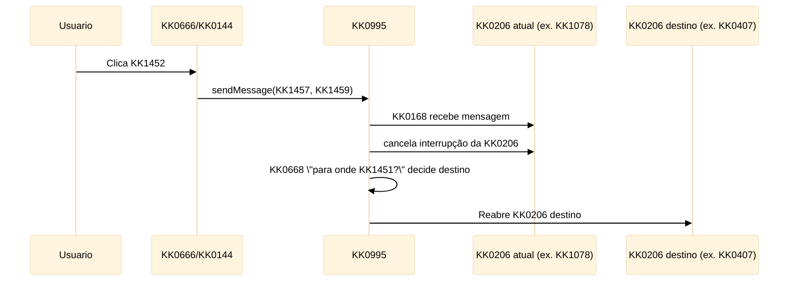

*Sequência KK0968 (para apresentar):* KK0144 envia `KK1457` + `KK1459` → KK0609 de Mensagem na Borda cancela a KK0206 ativa → `GW_resolve_voltar_para_bpmn` escolhe o destino → KK0995 reabre a KK0206 correta.

- **Prós:** regra do KK1451 **unificada no KK0995** (menos KK0017 nos KK0183 KK0640) e um **KK0372 único** de mensagem com o KK0144.
- **Prós:** a mesma mensagem pode ser reutilizada por outros disparadores (ex.: KK0135/KK0140) sem KK0525 lógica nos KK0640.
- **Contras:** requer **mensagem KK0144 → engine** e exige **KK0609 de Mensagem na Borda** em cada KK0206 onde o “KK1451” é permitido.

### KK0969 — Filho devolve KK1423 (KK0640 participam da decisão)

- Quando o KK1392 clica **KK1452**, o **KK0639** encerra sua execução e devolve (`KK1457=true`, `KK1459=<destino>`) na saída da **KK0208**.
- O **KK0995**, ao receber o KK1187 normal da KK0206, lê `KK1457` e `KK1459` nos KK0712 **“veio KK1451?”** e **“para onde KK1451?”** e então reabre a KK0206 correspondente ao destino.
- Nesta opção, a regra do “KK1456” fica distribuída nos **KK0640**: é o KK0639 que precisa implementar o KK0374 para que o KK0995 consiga reentrar no destino.

- **Prós:** não depende de mensagem externa; tudo acontece no KK1187 da KK0206.
- **Contras:** a regra do KK1451 fica **em cada KK0639**; é necessário implementar o KK0372 de “KK1456” nos KK0183 participantes.

*Sequência KK0969 (para apresentar):*

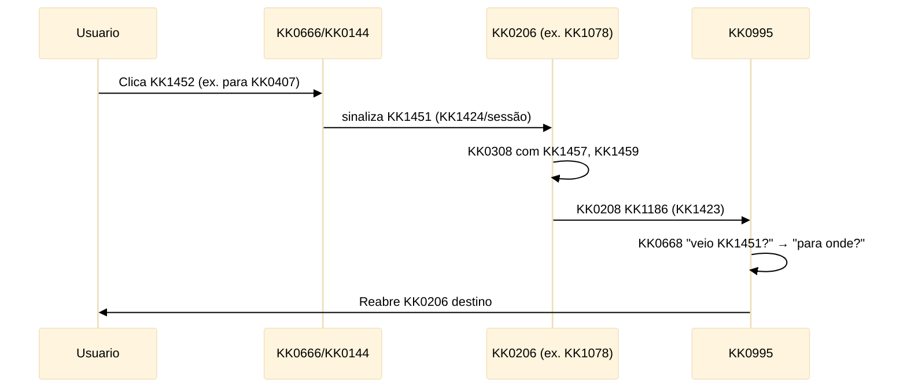

---

## 3. Diagramas da KK0968

Os KK0493 de KK0651 do KK0995 (KK0165 KK0612, KK1272 KK1392/KK0144/engine, paradas com e sem rádio) estão em [KK1458](../KK0084/KK1458), que é a KK1139 para explicitação com analogias e KK0865. Este KK0040 não repete esses KK0493 para evitar duplicação; use o KK0521 de analogias para detalhe KK1378 e visual da opção adotada.

---

## 4. KK0466 e impacto no N1

**KK0466: adotar a KK0968 — mensagem de “KK1451” vinda de fora; lógica do KK1451 na macro (KK0995).**

- O KK0995 terá **KK0609 de Mensagem na Borda (KK0168)** (ex.: `KK0864`) nas Calls de **KK0407, KK1078 e KK1405** (não em KK0316).
- O KK0144 envia mensagem correlacionada ao KK1069 (ex.: por `KK1067`) com **KK0877** (ex.: `KK1457`) e KK1001 contendo **`KK1459`**. Esse é o KK0372 da mensagem para o KK0165 Event no KK0995.
- O KK0995 terá **KK0668 exclusivo “para onde KK1451?”** com uma saída por destino (KK0316, KK0407, KK1078), conforme valor de `KK1459`.
- Os **KK0640** não precisam expor nem preencher KK1423 de “KK1456”; apenas executam a etapa e retornam.
- **KK1006 do N1:** Fechar como **“Decidido: KK0968 — mensagem + KK0609 de Mensagem na Borda (KK0168) no KK0995; lógica na macro. Ver KK0462.”**

---

## 5. Referências

| Documento | Uso |
| ----------- | ----- |
| [KK0846](../KK0789%20da%20decomposição/KK0846) | KK1006; seção 2.3.1 KK0711 para o KK1452 |
| [KK1458](../KK0084/KK1458) | Explicação da abordagem adotada (KK0968) com analogias e KK0493 (KK0865) |
| KK0953 | KK0655 do comportamento da KK0797 |

---

## 6. Consequências

- Introdução de dependência explícita de mensagem externa (KK0144 → engine).
- Necessidade de KK0165 KK0612 adicionais no KK0995 (KK0407, KK1078, KK1405).
- Simplificação e KK0480 dos KK0183 KK0640 em relação ao mecanismo de “KK1451”.
- Padronização do mecanismo de “KK1451” para possíveis novos canais (KK0135, KK0140) que enviem a mesma mensagem.

**Não-decisão:** Este KK0040 não define se os KK0640 preservam estado ao reentrar (KK1308 vs KK1182/KK0264); essa decisão pertence ao KK0903/KK0084 dos KK1075 e está tratada em outros documentos (ex.: KK0521 de analogias, KK0372 KK0087).

KK0098

$$$$$

[ADR/DECISAO_VOUCHER_MESMA_INSTANCIA_OU_NOVA_GENERICO.md]
XXXXX
# KK0466: KK1460 — mesma KK0780 de KK1069 ou nova?

**ID da decisão:** JORNADA-DEC-001  
**Status:** **Em KK0064** (decisão KK1086: mesma KK0780; aguarda duas aprovações — ver [PADRAO_ADR_VISIONING.md](PADRAO_ADR_VISIONING.md))  
**Tipo:** Retomada da KK0797 (KK1461 / mesma KK0780)  
**Data:** 2026-03-05  
**Decisor(es):** KK0667 Pereira de Vasconcelos

## Aprovações

| #   | Aprovador     | Data   | Observação (opcional)   |
|-----|---------------|--------|--------------------------|
| 1   | *(preencher)* |        |                          |
| 2   | *(preencher)* |        |                          |

---

> **KK0362:** Pendência de classificação no [KK0848](../KK0789%20da%20decomposição/KK0848). O KK0651 **KK1460** ("KK0363" — envio de link para o KK0273 continuar a KK0007) precisa ser definido: **mesma KK0780** de KK1069 associada à KK1086 ou **nova KK0780** ao retomar pelo link?
>
> **KK0466:** **Mesma KK0780** de KK1069 associada à KK1086 (recomendação KK1377 adotada; decisão final com KK0634 + KK0911 — ver seção 8). Referenciar como **JORNADA-DEC-001** em outros documentos.

---

## KK0466

O KK0651 **KK1460** utilizará **a mesma KK0780 de KK1069 associada à KK1086**.

Ao clicar no link recebido por KK0530/SMS, o KK0273 retomará a **KK0780 existente da KK1086**, identificada por `KK0747` e validada por `KK1464`.

**Não será criada uma nova KK0780 de KK1069.**

---

## 1. O que é o KK1460 (no desenho)

- **Funcionalidade:** Na etapa de KK0317 (KK0173), o KK0723 pode acionar “KK0363”: envia link por KK0530/SMS para o KK0273 prosseguir a KK0007 de onde estiver.
- **Protótipo / nova KK0797:** Stepper próprio com 2 etapas — KK0317 ✅ → KK1460 ✅. Não existe no KK0172 KK0890 atual; é **feature nova**.
- **Dúvida:** Quando o KK0273 clica no link e retoma, o KK0282 usa a **mesma** KK0780 do KK1069 (mesma KK1086, mesmo `KK0747`) ou inicia uma **nova** KK0780 (nova KK1086, novo KK1069)?

### 1.1 KK0650 (visão simplificada)

```mermaid
%%{init: {
  "theme": "base",
  "themeVariables": {
    "background": "#ffffff",
    "primaryColor": "#3b82f6",
    "primaryTextColor": "#0f172a",
    "primaryBorderColor": "#1d4ed8",
    "lineColor": "#1e3a8a",
    "secondaryColor": "#f8fafc",
    "tertiaryColor": "#eef2ff",
    "clusterBkg": "#ffffff",
    "clusterBorder": "#1e3a8a",
    "fontFamily": "Inter, Segoe UI, Arial"
  }
}}%%
flowchart TB

classDef start fill:#22c55e,stroke:#15803d,stroke-width:2px,color:#ffffff;
classDef KK1332 fill:#3b82f6,stroke:#1d4ed8,stroke-width:1.5px,color:#ffffff;
classDef service fill:#ffffff,stroke:#3b82f6,stroke-width:1.5px,stroke-dasharray:5 5,color:#0f172a;
classDef KK0669 fill:#f59e0b,stroke:#b45309,stroke-width:2px,color:#ffffff;
classDef finish fill:#ef4444,stroke:#991b1b,stroke-width:2px,color:#ffffff;


  G[KK0722]
  G -->|gerar KK1461| KK0282[KK0282]
  KK0282 -->|KK1361| L[KK0272 recebe link]
  L --> U["https://co8/KK1461?KK1361=abc"]
  U --> B[KK0131 valida KK1361]
  B --> R[Identifica User KK1331 ativa e redireciona]
  subgraph mesma["Mesma KK0780 de KK1069 (KK1086)"]
    R
    R -.->|KK1061 + KK1333| P[KK1085 / KK0780 existente]
  end

  %% Estilos (só teste - cores antigas)
  style G fill:#eceff1,stroke:#546e7a,stroke-width:2px
  style KK0282 fill:#bbdefb,stroke:#1565c0,stroke-width:2px
  style L fill:#eceff1,stroke:#546e7a,stroke-width:2px
  style U fill:#eceff1,stroke:#546e7a,stroke-width:2px
  style B fill:#eceff1,stroke:#546e7a,stroke-width:2px
  style R fill:#bbdefb,stroke:#1565c0,stroke-width:2px
  style P fill:#bbdefb,stroke:#1565c0,stroke-width:2px
  linkStyle KK0472 stroke:#546e7a,stroke-width:2px
```

---

## 2. Modelo KK1378 de retomada

O link de KK1461 utilizará um **KK1182 KK1361** associado à KK1086.

**KK0650 KK1378:**

1. KK0722 aciona "KK0363".
2. KK0282 gera `KK1464` associado à `KK0747`.
3. KK1360 é enviado ao KK0273 por KK0530 ou SMS.
4. KK0272 acessa o link: `https://co8.brb.com/KK1461?KK1361=abc123`
5. KK0131 valida: KK1361 válido, KK1086 ativa, prazo não expirado (ver seção 9).
6. O KK0132 recupera o `KK1061` associado à KK1086 e **identifica a User KK1331 ativa da KK0780** no engine. O KK0273 é então **redirecionado para a etapa correspondente** na interface da KK0797.

**Observação (KK0217 / KK0171):** O engine não "retoma" uma KK0780 parada; ele mantém a KK0780 com uma ou mais KK1385 ativas. O KK0132 KK0330 qual é a **User KK1331 ativa** da KK0780 (ex.: via KK0072 do engine) e redireciona o KK0273 para a KK1338 dessa etapa. O KK0264 deve usar `KK1333` (ID da KK1332 no KK0172) para alinhar UI e engine e evitar divergência entre stepper e KK1069 real.

**KK0991 de KK1185:** O mecanismo descrito (KK1182 KK1361 + `KK1061` + `KK1333`) é o **padrão de KK1185 KK0949**. O mesmo KK0651 serve para KK1461, timeout, relogin e KK1187 do KK0273: identificar a KK0780, a User KK1331 ativa e redirecionar para a etapa correspondente. Eventos como KK1451, retomar, KK1461 e KK0264 estão consolidados em [KK0376](../KK0084/KK0376).

---

## 3. Implicações técnicas

A decisão implica:

- Persistência de `KK1464` associado à KK1086.
- Definição de **prazo de expiração** do KK1461 (e KK1406 de expiração da KK1086 — seção 9).
- **Endpoint de retomada** da KK0797 por KK1361 (KK0330 User KK1331 ativa e redireciona).
- KK0263 por **KK1333** (User KK1331 atual no KK0172), evitando divergência entre stepper UI e KK1069 real.

Exemplo de estrutura (KK0264 / retomada):

| Campo | Descrição |
| ------- | ------------ |
| `KK0747` | Identificador da KK1086 |
| `KK1061` | ID da KK0780 no engine |
| `KK1333` | User KK1331 atual da KK0797 (ID no KK0172) |
| `KK1464` | KK1360 de retomada |
| `KK1463` | Expiração do link |

---

## 4. Motivos para mesma KK0780 de KK1069

- **Continuidade da KK1086:** Uma única KK1086, um único `KK0747`; o KK0723 e o KK0273 referem-se ao mesmo KK0911. Relatórios e KK1134 ficam simples (uma KK1086 do início ao fim).
- **KK0399 já preenchidos:** O que já foi coletado na KK0046 (KK1254, KK0046, dados iniciais) permanece na mesma KK0780; o KK0273 retoma de onde parou sem KK0525 dados.
- **KK1145 de KK0911:** Prazos de decurso, KK0621, “uma KK1086 por KK0391” etc. continuam válidos para a mesma KK0780.

---

## 5. Motivos para nova KK0780 de KK1069

- **Isolamento de contexto:** “Presencial” vs “remoto por KK1461” podem ser tratados como jornadas distintas (ex.: KK0654 diferentes, KK1413 diferentes no KK1187).
- **Simplicidade de KK0759:** Nova KK0780 = novo KK1069; não é preciso “congelar” e “descongelar” a KK0780 nem tratar retomada com KK1361 em outro lugar.
- **Segurança / KK0122:** Em alguns desenhos, o link do KK1461 gera um novo KK1069 com vínculo explícito à KK1086 original (KK1139), mas a execução é nova.

---

## 6. Onde está no KK0172 / desenho

- **Monolito atual:** Não há tarefa nem KK1324 com nome “KK1461” no `KK0953`. A funcionalidade é **nova** no desenho da nova KK0797.
- **Documentação:** Em [DIVISAO_BPMN_V2_NOVA_JORNADA.md](../Relatórios%20da%20atividade/DIVISAO_BPMN_V2_NOVA_JORNADA.md) e [KK0075](../Apresentações/KK0075) consta a dúvida “mesma KK0780 KK0282 ou nova?” e “KK0634 + KK0911” como KK1175 pela decisão.
- **Transcrição nova KK0797:** *“Ele pode também seguir com o KK1461, que é a opção dele enviar o link ali para o KK0273, e aí clicando aqui ele volta para a KK1338 inicial.”* — Confirma o KK0651 de envio de link e KK1187 à KK0797; não define KK0780.

---

## 7. Refatoração e impacto

| Opção | Impacto na KK1137 |
| ------- | ------------------------- |
| **Mesma KK0780** | O KK0995 (ou o KK0173) precisa de um mecanismo de “pause/KK1182” ou de **retomada por link**: ao clicar no KK1461, o KK0273 reabre a **mesma** KK0780 (mesmo KK1067 ou mesma KK1086). Exige definição de KK0264, KK1012 de estado e rota de “retomar por KK1361/link”. |
| **Nova KK0780** | O link do KK1461 inicia um **novo** KK1069 (nova KK1086) com KK1139 à KK1086 original (ex.: `KK0748`). Não exige pause/KK1182 no KK0995; exige regra de KK0911 para vincular KK1086 presencial → KK1086 KK1461 (e eventualmente consolidar ou substituir). |

---

## 8. Recomendação KK1377

**Recomendação: adotar mesma KK0780 de KK1069 associada à KK1086**, salvo decisão explícita de KK0911 em contrário.

1. **Experiência:** Uma KK1086, um KK1134; o KK0723 e o KK0273 falam da mesma KK0007.
2. **KK0399:** Evita KK0525 ou reconciliar dados entre duas propostas (presencial + KK1461).
3. **KK0758:** O “custo” é desenhar retomada por link (KK1361 na URL → reabrir KK0780 no KK0264 correto); é um padrão conhecido (magic link / KK1182 KK1361).

**Quem decide em definitivo:** **KK0634 + KK0911** (conforme tabela de KK1007). Este KK0521 serve de base KK1377; a decisão final e a KK0311 ao KK1354 ficam com KK1077/KK0911.

---

## 9. Expiração do KK1461

A retomada via KK1461 deve respeitar **duas validades**:

| Validade | Descrição |
| ---------- | ----------- |
| **KK1360** | `KK1463`: o link de retomada expira após o prazo configurado. |
| **KK1085** | A KK1086 pode estar **encerrada** (concluída, cancelada) ou **expirada** (ex.: KK0621 por decurso de prazo). |

**Regra:** Se a KK1086 estiver encerrada ou expirada, a retomada deve ser **negada**, mesmo que o KK1361 ainda seja válido.

Exemplo: o KK0723 gera o KK1461; o KK0273 abre o link 5 dias depois; nesse intervalo a KK1086 já foi expurgada. O KK0132 deve responder que a retomada não é possível (KK1086 inexistente ou expirada) e orientar o KK1392 adequadamente, sem tentar reabrir a KK0780.

---

## 10. Referências

| Documento | Uso |
| ----------- | ----- |
| [KK0376](../KK0084/KK0376) | KK0371 consolidado: KK1451, retomar, KK1461, KK0264 |
| [KK0848](../KK0789%20da%20decomposição/KK0848) | Pendências de classificação — KK1460 |
| [DIVISAO_BPMN_V2_NOVA_JORNADA.md](../Relatórios%20da%20atividade/DIVISAO_BPMN_V2_NOVA_JORNADA.md) | KK1314 KK1460, stepper 2 etapas, dúvida KK0780 |
| [KK0075](../Apresentações/KK0075) | KK1460 como KK0208; decisão KK0780 |
| [nova_jornada_audio.txt](../transcricoes/transcricao_nova_jornada/nova_jornada_audio.txt) | Menção ao KK1461 e envio de link |

$$$$$

[ADR/PADRAO_ADR_VISIONING_GENERICO.md]
XXXXX
# KK0991 de KK0040 — KK1438 KK0282

**Objetivo:** Padronizar os KK0041 (Architecture Decision Records) do KK1439: KK1351 em **português**, **status** únicos e **duas aprovações** obrigatórias antes de considerar uma decisão fechada.

**KK0598:** Todos os arquivos `DECISAO_*.md` nesta pasta (fora de `out/`). **Não usar `out/` como KK1139.**

---

## 1. Status (somente estes, em português)

| Status | Significado |
|--------|-------------|
| **Em KK0064** | Documento em elaboração ou em revisão; decisão ainda não aprovada. **Estado inicial de todo KK0040.** |
| **Aguardando decisão** | KK0362 e opções descritos; aguardando KK1194 ou KK1406 de KK0911/KK0084. |
| **Decidido** | KK0466 tomada e **registradas as duas aprovações** (ver §3). Pode ser referenciada em outros documentos. |
| **Substituído** | KK0466 foi substituída por outro KK0040 ou por mudança de desenho; indicar qual KK0521 a substitui. |
| **Obsoleto** | Não se aplica mais (ex.: escopo cancelado); manter apenas para histórico. |

**Regra:** Usar **apenas** um dos valores acima. Evitar KK1351 em inglês (ex.: Proposed, Accepted, Applied) — traduzir para o status correspondente em português.

---

## 2. Estado inicial dos KK0041 existentes

Todos os KK0041 atuais devem ser tratados como **Em KK0064** até que:

1. O status seja explicitamente atualizado no KK0521, e  
2. A seção **Aprovações** (§3) esteja preenchida com **duas pessoas** aprovadoras.

Ou seja: mesmo que o texto descreva uma decisão já tomada, o **status oficial** do KK0521 é **Em KK0064** até o preenchimento das duas aprovações. Depois disso, o status pode ser alterado para **Decidido** (ou **Aguardando decisão**, se ainda faltar KK1406 de KK0911).

---

## 3. Duas aprovações obrigatórias

Para que um KK0040 seja considerado **Decidido**, é obrigatório registrar **duas aprovações** no próprio KK0521.

### 3.1 Seção obrigatória no KK0040

Incluir no KK0040 (por exemplo após o bloco de KK0362/KK0466) a seção:

```markdown
## Aprovações

| #   | Aprovador     | Data   | Observação (opcional)   |
|-----|---------------|--------|--------------------------|
| 1   | *(nome ou papel)* | *(data)* | |
| 2   | *(nome ou papel)* | *(data)* | |
```

- **Aprovador:** nome da pessoa ou papel (ex.: Arquiteto KK0282, Tech Lead).
- **Data:** data em que aprovou (formato livre, ex.: 2026-03-14).
- Com **menos de duas linhas** preenchidas, o status do KK0040 deve permanecer **Em KK0064** ou **Aguardando decisão**.

### 3.2 Sugestões de KK0651

1. Autor redige o KK0040 e deixa status **Em KK0064**.
2. Primeira revisão: uma pessoa preenche a linha 1 da tabela de Aprovações → status pode ir para **Aguardando decisão** se faltar KK1406 externa, ou seguir para segunda aprovação.
3. Segunda aprovação: outra pessoa preenche a linha 2 → status pode ser atualizado para **Decidido** (se a decisão estiver fechada).
4. Para KK0467 que dependem de KK0911: manter **Aguardando decisão** até a KK1406; depois, as duas aprovações (ex.: KK0084 + KK0911) e status **Decidido**.

---

## 4. Estrutura sugerida do KK0040 (template)

1. **Título** — frase clara da decisão (em português).
2. **Status** — um dos valores do §1 (ex.: `**Status:** Em KK0064`).
3. **KK0362** — por que a decisão é necessária; KK1139 a MAPEAMENTO_*, KK0172 ou relatório.
4. **KK0466** — o que foi decidido (ou KK1086, se ainda Em KK0064 / Aguardando decisão).
5. **Opções consideradas** — tabela ou lista (opcional mas recomendado).
6. **Consequências** — impacto no N1/KK0903/KK0904, KK0378, outros KK0041.
7. **Aprovações** — tabela com duas linhas preenchidas quando for o caso (§3).
8. **Referências** — links para MAPEAMENTO_*, KK0172, outros DECISAO_*.md.

---

## 5. Resumo das KK1146

- **KK1350 em português:** status e rótulos somente em PT.
- **Status padronizados:** Em KK0064 | Aguardando decisão | Decidido | Substituído | Obsoleto.
- **Estado inicial:** todo KK0040 começa ou é reclassificado como **Em KK0064** até ter duas aprovações.
- **Duas aprovações:** obrigatório para status **Decidido**; usar a seção **Aprovações** com tabela de duas linhas.
- **KK0655 do KK0651:** `KK0953` (raiz do repositório).

---

*Documento de padronização — KK1439 KK0282. Atualizar este arquivo quando houver mudança de regra (ex.: novo status, critério de aprovação).*

$$$$$

[ADR/README_ADR_VISIONING_GENERICO.md]
XXXXX
# Índice de KK0041 — KK1438 KK0282

Lista das KK0467 KK0086 (KK0040) do KK1439. **Use apenas os arquivos nesta pasta (fora de `out/`)** como KK1139; `out/` é backup.

**KK0991 obrigatório:** [PADRAO_ADR_VISIONING.md](PADRAO_ADR_VISIONING.md) — status em **português** (Em KK0064, Aguardando decisão, Decidido, Substituído, Obsoleto); **duas aprovações** obrigatórias para status Decidido; todos os KK0041 em **Em KK0064** até preenchimento das aprovações.

| Documento | Resumo |
|------------|--------|
| [KK0457](KK0457) | Onde alocar KK0929 / consultar KK0981: KK0173 ou KK0176. |
| [KK0452](KK0452) | Onde alocar envio de KK0328: KK0175 ou KK0176. |
| [KK0445](KK0445) | KK0204: KK0177 ou KK1069 KK1372. |
| [KK0465](KK0465) | KK1460: mesma KK0780 de KK1069 ou nova. |
| [KK0450](KK0450) | KK0543 da KK0346: no KK0995 ou no KK0177. |
| [KK0462](KK0462) | KK1452 macro: opção A (mensagem) ou B (KK0639 devolve KK1423). |
| [KK0458](KK0458) | Preservação de estado ao reabrir KK1075. |
| [KK0454](KK0454) | KK0650 KK1451 entre KK0016 e KK0301. |
| [DECISAO_CRITERIOS_CRIACAO_BLOCOS_N3.md](DECISAO_CRITERIOS_CRIACAO_BLOCOS_N3.md) | Critérios para criação de blocos KK0904. |
| [KK0461](KK0461) | KK1260, KK1310 e KK0303 no KK0904: bloco à parte ou ramos. |
| [KK0448](KK0448) | Consistência KK0903 e consultar KK0981. |
| [KK0443](KK0443) | KK0134: quem publica o KK0610. |

Template dos KK0041: **KK0362**, **KK0466**, **Status** (padronizado em PT), **Aprovações** (tabela com duas pessoas), **Referências** (MAPEAMENTO_*, KK0172). Ver [PADRAO_ADR_VISIONING.md](PADRAO_ADR_VISIONING.md). KK0655 do KK0651: `KK0953`.

$$$$$

[ANALISE_CRUZADA_COERENCIA_USER_STORY_TRANSCRICOES_GENERICO.md]
XXXXX
# KK0064 cruzada de coerência — User Story KK0282/KK1282 × Transcrições

**Objetivo:** Verificar consistência entre a User Story (`KK1387`) e as transcrições de alinhamento (KK1284, Alinhamento KK0282, Daily 06/03).

**Fontes analisadas:**

- `KK1367`
- `KK1366`
- `KK1365`
- `transcricoes/alinhamento co8.txt`
- `transcricoes/transcricao_daily_06-03/DAILY_06-03_DETALHADA.md`

---

## 1. Terminologia

| Conceito | User Story | Transcrições | Coerência |
| ---------- | ------------ | -------------- | ----------- |
| KK1291 de KK0547 | **KK0255** | "cc", "comitocontas" (alinhamento bruto) | ✅ User Story usa KK0255 (correto) |
| Squad KK1017 | **KK1017** | "Fígita", "fígita" (coloquial) | ✅ User Story padronizou |
| KK1068/KK0797 | **KK0282** | "corbão", "corbã" (alinhamento bruto) | ✅ User Story usa KK0282 |
| KK0229 KK0949 | **KK0949** | "Homem Channel" (Whisper em setup_contas_bruto) | ✅ Mesmo conceito; transcrição fonética |

**Conclusão:** A User Story aplicou corretamente as correções de terminologia (KK0255, KK1017, KK0282) em relação ao que aparece nas falas transcritas.

---

## 2. KK0650 e mecanismo

| Aspecto | User Story | Transcrições | Coerência |
| --------- | ------------ | -------------- | ----------- |
| **Tópico KK0809 (novo)** | `KK0618` | Idêntico em KK1286 e transcricao_alinhamento_co8 | ✅ |
| **Status da KK1086** | 44 – "KK0554" | Idêntico em todas as fontes | ✅ |
| **Filtro de consumo** | `$.data.KK1309` = "KK0553" | Explícito em KK1286 (KK1476) e transcricao_alinhamento_co8 | ✅ |
| **Classe** | — | `PropostaAtualizada` (KK1286) | ℹ️ User Story não cita; não conflita |
| **Posição no KK0651** | KK0835 KK0544 da KK0346 (KK1187 do KK0255) | KK0860 (alinhamento): "logo depois que foi efetivado a KK0346"; Marcelo (KK1283): "ao terminar de efetiva KK0346" | ✅ |
| **Publicação** | Via KK0476 (KK1086 completa) | KK0860: "democratiza cáfica" = true; "posta toda a KK1086"; Marcelo: "atualização do JSON e posta no tópico" | ✅ |
| **Flags de KK0476** | `KK0475`, `nova_democratizacao_proposta` | KK0860: "nova KK0476 de KK1086", "KK0476 sim" (KK0809) | ✅ |

**Conclusão:** KK0650, tópico, status e mecanismo de publicação estão alinhados entre User Story e transcrições.

---

## 3. De-para de campos

Comparação entre o checklist da User Story e o de-paro formal do chat Alinhamento (KK1476) em KK1286:

| # | Campo | User Story | KK1286 (KK1476) | Coerência |
| --- | ------- | ------------ | ------------------------------ | ----------- |
| 1 | KK0290 | KK0290 | idem | ✅ |
| 2 | KK0291 | KK1353::KK0742 | idem | ✅ |
| 3 | KK0293 | Premissa correntistas; removido | idem | ✅ |
| 4 | KK0483 | KK0072 KK0255 → KK0430 | idem | ✅ |
| 5 | dn | KK1465: KK0941; KK0921: KK0944 | idem (KK1476 detalha dn_cartao_debito/credito) | ✅ |
| 6 | KK0292 | KK0940::KK0972 (KK1475=KK0921, null=KK1465) | texto_detalhe...::KK0940::KK0972 | ⚠️ Ver nota abaixo |
| 7 | KK0765 | Numérico; >0 = KK0981 | idem | ✅ |
| 8 | KK0484 | "KK0949" (constante) | KK0653; rollout = "KK0949" | ✅ |
| 9 | KK1289 | Removido | Desnecessário | ✅ |
| 10 | KK0482 | KK1312 | idem | ✅ |
| 11 | KK0295 | Removido | Desnecessário | ✅ |
| 12 | KK0432 | data_final + hora_final → timestamp | Concatenação idem | ✅ |

**Nota sobre KK0292 / KK0972:**  
No `setup_contas_bruto.txt` (linha 117), a Lasa (KK1282) corrige: *"origem KK1077 não tá dentro de KK0936 KK0245, tá? Ele tá direto nesse texto, detalhe, KK1086, venda, KK1077."*  
O de-paro formal (KK1476) e a User Story colocam em `KK0940::KK0972`. **Recomendação:** na KK1280 conjunta, confirmar o caminho exato do JSON (objeto pai vs. KK0940) para evitar erro de KK0759.

---

## 4. Requisito KK0087 — KK0484

| Fonte | Conteúdo | Coerência |
| ------- | ---------- | ----------- |
| User Story | `KK0484` = "KK0949" constante; chave de rollout; KK1206 se vier "digital" ou "fisico" | ✅ |
| KK1286 | "deve continuar sendo 'KK0949'"; simétrico entre tópico antigo e novo; KK0633 por KK0484 + KK0746 | ✅ |
| transcricao_alinhamento_co8 | Idem | ✅ |
| setup_contas_bruto | Lasa: "descrição KK0797 origem... Homem Channel aqui do Fíjido" — transcrição fonética de "KK0948" | ✅ |

**Conclusão:** Totalmente coerente. O valor obrigatório "KK0949" e o uso como chave de rollout estão bem documentados.

---

## 5. Convivência e KK1362

| Aspecto | User Story | Transcrições | Coerência |
| --------- | ------------ | -------------- | ----------- |
| Convivência | CA-05: estímulo atual continua em paralelo durante KK1362 | KK0860: "o envio para o KK1283 continua... só vai criar um cara mais"; "depois entendo que é só deletar esse carinha" | ✅ |
| Tombamento | CA-06: remover estímulo antigo após KK1406 e aprovação | transcricao_alinhamento_co8: "remover a atividade antiga de estímulo ao KK1282"; "desplugar esse cara" | ✅ |
| Tasks a remover | KK1076 + KK0106 | Alinhamento fala em "deletar esse carinha" (producer) | ✅ User Story detalha as duas KK1335 |

---

## 6. KK1405 conjunta e próximos passos

| Aspecto | User Story | Transcrições | Coerência |
| --------- | ------------ | -------------- | ----------- |
| KK1405 conjunta | Sessão de KK1409 (KK0494 × KK1017 × KK1282); CA-03 pendente | Marcelo: "KK1282 passar os campos que vão precisar consumir agora"; KK0667: "bater os campos"; KK0860: "sentar com o KK1354 de KK1282 e bater campo a campo" | ✅ |
| De-paro compartilhado | Anexo como material de KK1194; não especificação final | Lasa: "se puder compartilhar esse deparo"; Marcelo: "KK1282 passar a lista de campos" | ✅ |
| Daily 06/03 (KK0729) | — | "mapear os campos para a KK1194 ser rápida"; "confirmar os campos que passamos" | ✅ Alinhado com CA-03 e Dependências |

---

## 7. KK1041 (não são incoerências)

1. **KK0972:** Conflito verbal (Lasa) vs. de-paro formal. Resolver na KK1406.
2. **Formato de KK0432:** User Story registra que o formato do timestamp deve ser alinhado com o esquema do tópico — pendência já documentada.
3. **KK0921 / múltiplo:** Transcrições indicam que Fiji não será o primeiro a migrar para KK0921; campos de KK0921 podem ser complementados depois. User Story menciona KK1465/KK0921 no de-paro — coerente com abordagem em fases.

---

## 8. Resumo executivo

| Dimensão | Resultado |
| ---------- | ----------- |
| Terminologia | ✅ User Story padronizada (KK0255, KK1017, KK0282) |
| KK0650 e mecanismo | ✅ Totalmente coerente |
| De-para de campos | ✅ Alinhado; 1 ponto a confirmar (KK0972) |
| KK0484 | ✅ Consistente em todas as fontes |
| Convivência e KK1362 | ✅ Alinhado |
| KK1405 conjunta | ✅ Coerente com transcrições |

**Conclusão geral:** A User Story está **coerente** com as transcrições. O único ponto a esclarecer na KK1280 é o caminho exato de `KK0972` no JSON (objeto pai vs. KK0940), conforme correção verbal da Lasa no setup_contas_bruto.

---

## 9. Cruzamento com o KK0172 (`KK0953`)

**Fonte:** `KK0953` (raiz do repositório) — versão tag `20250219`.

### 9.1 KK0650 atual no KK0492 (KK0544 → KK1282)

| Ordem | Elemento no KK0172 | ID / tópico | User Story / Transcrições | Coerência |
| ------- | ------------------- | ------------- | --------------------------- | ----------- |
| 1 | **KK0534** | KK1276, `KK0228="KK0806"` | KK0258 ao KK0255 para efetivar KK0346 | ✅ |
| 2 | **KK0688** | KK0998 | — | ✅ |
| 3 | **KK1104** | "Atualiza KK0543 na KK1086", KK0473 `KK0117`, **KK1309 = 1** | User Story: "persiste o resultado na KK1086 (KK0473 KK1104)" | ✅ Status 1 hoje; status 44 será na **nova** atividade |
| 4 | **KK0690** | KK0998 | "um KK0669 paralelo dispara, entre outras coisas, a Service KK1331 KK1076" | ✅ |
| 5 | **KK1076** | "KK0096", external, **KK1363 `KK0098`** | Tópico e nome da KK1332 idênticos à User Story | ✅ |
| 6 | **KK0106** | "KK0095", KK1309 = 1 | User Story Fase 2: remover junto com producer | ✅ |

**Conclusão:** A KK1272 **KK0534 → KK1104 → KK0668 paralelo → KK1076** está igual à descrita na User Story e nas transcrições (KK0860: "logo depois que a gente recebe o KK1187 do cc").

### 9.2 KK0839 `KK0115` no KK0172 × tabela da User Story

O KK0172 define o KK0840 **`KK0115`** em `KK1076` com os seguintes campos (linhas 6400–6412):

| Campo no KK0172 | Expressão no KK0172 | User Story (tabela "Campos que hoje passamos") | Coerência |
| --------------- | ------------------- | ------------------------------------------------ | ----------- |
| KK0290 | `${KK0746}` | `${KK0746}` | ✅ |
| KK0291 | `KK0925` ou `KK1173` | idem | ✅ |
| KK0293 | `KK0002` | Fixo `KK0002` | ✅ |
| KK0483 | `${KK1254}` | `${KK1254}` | ✅ |
| KK0765 | "S"/"N" conforme `KK0828` | idem | ✅ |
| KK0484 | `${KK0651}` | `${KK0651}` | ✅ *(no modelo alvo deve ser constante "KK0949")* |
| KK1289 | `KK0282` | Fixo `KK0282` | ✅ |
| KK0482 | `${KK0234}` | `${KK0234}` | ✅ |
| KK0295 | UUID fixo | Valor fixo (UUID no KK0172) | ✅ |
| KK0432 | `${KK0437}` (KK1223 UTC no flow) | `${KK0437}` (UTC) | ✅ |
| KK0517 | `${KK0518}` | `${KK0518}` | ✅ |

**Conclusão:** Os 11 campos do KK1001 atual no KK0172 batem com a tabela do Anexo da User Story. O KK0172 já possui o KK1223 que define `KK0437` em UTC no `executionListener` do flow que entra em `KK1076`.

### 9.3 O que existe vs. o que a User Story prevê

| Item | No KK0172 hoje | User Story / KK0758 | Coerência |
| ------ | ---------------- | ---------------------------- | ----------- |
| KK1331 de KK0544 (KK0255) | **KK0534**, KK1363 KK0806 | Retorno do KK0255 com KK0046/KK0346 | ✅ |
| Persistência "KK0350" na KK1086 | **KK1104**, status 1 | "KK0345 KK0540" / KK1104 | ✅ |
| Estímulo KK1282 (modelo atual) | **KK1076** + **KK0106** | "KK0096" e "KK0095" a remover na Fase 2 | ✅ |
| **Nova** atividade status 44 + KK0476 | **Não existe** | Fase 1: incluir "Atualizar status: KK0345 KK0540" (status 44, KK0475) após KK1104 | ✅ Esperado; é a alteração a ser feita |
| Status 44 no KK0172 | Nenhuma KK1332 com status 44 | Nova Service KK1331 com status 44 | ✅ |
| Democratização KK0809 (exemplo no KK0172) | Outras KK1335 usam `KK0475`, `novo_democratiza_proposta` (ex.: KK0104, linhas 2450–2453) | Nova atividade com `KK0475` (ou equivalente) ativo | ✅ KK0991 já existe no KK0492 |

### 9.4 Ponto de inserção da nova atividade (Fase 1)

- **User Story:** "Logo **após** a KK0544 da KK0346 (ex.: após o ponto 'KK0345 KK0540' / KK1104), **incluir** no KK0651 uma atividade do tipo 'Atualizar status: KK0345 KK0540'".
- **KK0172 hoje:** `KK1104` → **Flow_lnlvcia** → `KK0690` → (KK1076 | KK0020).
- **Inserção sugerida:** Incluir a nova Service KK1331 (status 44 + KK0476) **entre** `KK1104` e `KK0690`, ou como **novo ramo** saindo de `KK0690` (em paralelo ao producer atual), conforme KK0302 no alinhamento ("logo na KK1272 aqui do lado do KK1283"). Em ambos os casos o KK0172 atual suporta a descrição; a decisão é de desenho (um KK0651 sequencial vs. ramo paralelo).

### 9.5 Resumo KK0172 × User Story

| Dimensão | Resultado |
| ---------- | ----------- |
| KK0650 KK0544 → KK1282 | ✅ Igual ao descrito na User Story e nas transcrições |
| Nomes e KK0755 das KK1335 | ✅ KK1076, KK0106, KK1104 presentes e corretos |
| Tópico atual | ✅ `KK0098` no KK0172 = User Story |
| KK1002 atual (KK0840) | ✅ 11 campos alinhados com o Anexo da User Story |
| Nova atividade (status 44 + KK0809) | ✅ Não existe no KK0172; Fase 1 da User Story descreve a inclusão |
| Remoção do ramo antigo (Fase 2) | ✅ Tasks a remover estão identificadas no KK0492 |

**Conclusão cruzada KK0172:** O `KK0953` está **coerente** com a User Story e com as transcrições. O KK0492 reflete o modelo **atual** (estímulo KK1282 via producer + KK0106); a **nova** atividade (status 44 + publicação no KK1381) ainda não está no KK0172 e corresponde exatamente à alteração prevista na Fase 1.

$$$$$

[Apresentações/APRESENTACAO_SOLUCAO_BPMN_HOJE_v2_GENERICO.md]
XXXXX

$$$$$

[Apresentações/README_GENERICO.md]
XXXXX
# Apresentações — Arquivado

**Não é KK1139.** O conteúdo desta pasta está em **`out/`** (cópias de apresentações KK0172, guia de KK0084/KK1137). Não use como fonte para documentação do KK1439; use **KK0084/**, **KK0789 da KK0471/** e **KK0040/**.

Regra do KK1084: pastas `out/` são backup/arquivamento — não usar como KK1139.

$$$$$

[DIAGRAM_STYLE_GUIDE_GENERICO.md]
XXXXX
# KK0991 de KK0493 do KK1084

Referência única para cores, convenções e orientação de KK0493 KK0865 na documentação de KK0084 e KK1439. Uso consistente melhora leitura rápida, acessibilidade e aparência em tema claro/escuro.

**KK0816 igual à do Manual:** usar exatamente o texto abaixo em documentos que incluam legenda de KK0492.

---

## KK0816 padrão (igual ao Manual KK0950)

> **KK1426** = início; **KK0127** = user KK1332 / etapa; **KK0269** = service/KK1223; **âmbar** = KK0669; **KK1430** = fim ou erro; KK1281 tracejada = KK0651 "KK1451".

Use este bloco antes ou depois dos KK0493 KK0865. Referência: [POLITICA_CORES_MANUAL.md](../Manual KK0950/POLITICA_CORES_MANUAL.md) §1.

---

## Paleta de cores

| Cor     | Fill      | Stroke (borda) | Uso                    |
|---------|-----------|----------------|------------------------|
| verde   | `#c8e6c9` | `#2e7d32`      | eventos, início        |
| KK0127    | `#bbdefb` | `#1565c0`      | KK0206 KK0018, user KK1332, etapa |
| KK0269   | `#eceff1` | `#546e7a`      | ações técnicas, service/KK1223 |
| âmbar   | `#fff8e1` | `#e65100`      | KK0712, decisão      |
| KK1430| `#ffcdd2` | `#c62828`      | erro, fim              |

- **KK1426** com stroke `#2e7d32`: melhor contraste em tema claro/escuro.
- **Âmbar** para KK0712 (evita amarelo forte). **Cinza** e demais: usar `stroke-width:2px` para consistência.
- **Alinhado à:** [POLITICA_CORES_MANUAL.md](../Manual KK0950/POLITICA_CORES_MANUAL.md) (Manual KK0282).

---

## Convenção por tipo de elemento

| Elemento           | Cor    | Exemplo de uso                    |
|--------------------|--------|------------------------------------|
| KK0609 / início    | verde  | start, KK0165 Event, início     |
| KK0208      | KK0127   | KK0178, etapa do KK0651         |
| Ação / serviço     | KK0269  | user KK1332 KK1378, KK1223, KK1187 |
| KK0668 / decisão  | âmbar  | KK0712, ramificações            |
| Erro / fim         | KK1430 | fim de KK1069, ramo erro       |

---

## Setas (flowcharts)

Padronizar em todos os flowcharts:

```text
linkStyle KK0472 stroke:#37474f,stroke-width:2px
```

Assim não é necessário enumerar `linkStyle 0,1,2,3...`.

---

## Orientação e tipo de KK0492

| Tipo de KK0651     | Orientação | Uso                          |
|-------------------|------------|------------------------------|
| KK0650 linear      | **LR**     | esquerda → direita            |
| KK0650 em árvore   | **TB**     | top → bottom (ramificações)  |
| Estados           | stateDiagram-v2 | máquinas de estado    |
| Interações        | sequenceDiagram  | mensagens entre participantes |

---

## Sequence diagram (tema)

Para KK0493 de KK1272 alinhados à paleta:

```text
%%{init: {'theme':'base', 'themeVariables': {
  'primaryColor':'#bbdefb',
  'primaryBorderColor':'#1565c0',
  'actorBorderColor':'#1565c0',
  'actorTextColor':'#1565c0',
  'lineColor':'#37474f',
  'activationBkgColor':'#bbdefb',
  'activationBorderColor':'#1565c0'
}}}%%
```

---

## Referências

- **KK0991 visual detalhado:** [PLANO_OTIMIZACAO_ORGANIZACAO_APRIMORAMENTO_VISIONING.md](PLANO_OTIMIZACAO_ORGANIZACAO_APRIMORAMENTO_VISIONING.md) §2.1.
- **Exemplo de uso:** [KK0084/VOLTAR_MACRO_OPCAO_A.md](KK0084/VOLTAR_MACRO_OPCAO_A.md) (convenção no topo e §4 KK1197 de padronização).

$$$$$

[Documentação/POC_BACKOFFICE_BFFS_GENERICO.md]
XXXXX
# KK1032 KK0134 — BFFs Envolvidos

> **Objetivo:** descrever quais BFFs são úteis para a KK1032 de KK0471 + KK0135 e como eles conversam com os KK1074 KK0172 demo.

---

## 1. Visão geral da KK1032

- **KK0183 demo:**
  - `omnichannel_pai_demo.bpmn` — KK0995 simples que orquestra uma KK0797 demo.
  - `omnichannel_demo_jornada.bpmn` — KK0797 principal demo (1 UT + opção de mandar para KK0135).
  - `omnichannel_backoffice_demo.bpmn` — KK0135 demo disparado por mensagem.

- **Principais KK1423 de KK1069:**
  - `KK0746` — identificador do KK0273.
  - `KK0747` — identificador da KK1086/KK0797.
  - `tipo_caso_backoffice` — KK0661, KK1029, KK0967 (na KK1032 pode ser string simples).
  - `motivo_backoffice` — texto/enum com o motivo do envio ao KK0135.

---

## 1.1. Nomes dos BFFs (quando conhecidos)

| Papel na KK1032 | Nome do serviço / app | Observação |
|--------------|------------------------|------------|
| **Jornada KK0948 (KK0282)** | **KK0144 KK1078** — `itau-nc2-app-bffprodutos` | Hoje faz KK0936 (“Oferta bffprodutos novo”), Complete em `KK0016` / KK0399 Oferta e envia dados ao KK0282. O *start* da KK0797 e o KK0509 para KK0135 podem estar neste KK0144 ou em outro que chame o KK0282/KK0217. |
| **Jornada — KK0543** | **KK0144 KK0543** — `itau-nc2-app-bffefetivacao` | KK0650: Completar bffprodutos → bffefetivacao → KK0543 KK0282. Não é o foco da KK1032 KK0135, mas integra com a KK0797. |
| **Info / Declarações** | **KK0144 Info** | Usado para mapear KK0936 (ex.: `KK0939`) na KK1338 de KK0470. Nome de app não encontrado no repo. |
| **Cockpit / KK0722** | *(a preencher)* | Listagem de propostas/KK0797 e acionamento manual de KK0135. |
| **KK0134 / Casos** | *(a preencher)* | KK0637 de casos KK0663/KK0967 e KK0308 de KK1385 do KK1069 de KK0135. |
| **KK0276 / KK1085** | **KK0741** (referenciado no MAPEAMENTO_NIVEL1) | Fonte de `KK0746` e contexto de KK1086; pode ser KK0144 ou KK0072. Nome exato do app/serviço a confirmar. |

> **Fonte dos nomes:** `documentacao/ad/KK0036` (KK0144 KK1078, KK0144 KK0543, KK0144 Info). Os demais papéis devem ser preenchidos com os nomes usados no seu contexto (LeanIX, KK0254 de KK0073, KK1354 de KK0084).

---

## 2. KK0144 KK1078 (`itau-nc2-app-bffprodutos`) — Jornada KK0948 / KK0282

**Responsabilidade:** iniciar a KK0797 no KK0995 e permitir que o front dispare casos de KK0135 a partir da KK1338 da KK0797.

- **Endpoints sugeridos:**

```http
POST /KK0797/KK0949/start
Content-Type: application/json

{
  "KK0753": "string",
  "KK0230": "KK0282",
  "origem": "AGENCIA",
  "dadosIniciais": { ... }
}
```

**Comportamento:**

- Cria KK0780 de `omnichannel_pai_demo.bpmn` (ou do KK0995 real).
- Passa `KK0746` (e, se já existir, `KK0747`) como KK1423 de startup.
- Retorna `idInstanciaProcesso` (e `KK0747` se criado dentro do KK1069).

```http
POST /KK0797/KK0949/{KK0754}/KK0135
Content-Type: application/json

{
  "tipoCaso": "FRAUDE" | "KK1029" | "OPERACIONAL",
  "motivo": "string descritiva",
  "detalhes": { ... }
}
```

**Comportamento:**

- Publica mensagem (REST KK0217) correlacionando pela KK1424 `KK0747`:
  - `KK0877 = "Message_backoffice_demo"`
  - `correlationKey = "KK0747"`
  - `correlationValue = {KK0754}`
- Cria/continua KK0780 em `omnichannel_backoffice_demo.bpmn`.

---

## 3. KK0144 do Cockpit / KK0722

**Responsabilidade:** listar o status da KK0797 e permitir que o KK0723 acione KK0135/manual para uma KK1086.

- **Endpoints sugeridos:**

```http
GET /cockpit/KK0797?filtro=...
```

**Comportamento:**

- Lista propostas com status (ex.: etapa atual, se tem caso de KK0135 associado, etc.).

```http
POST /cockpit/{KK0754}/abrir-KK0135
Content-Type: application/json

{
  "tipoCaso": "OPERACIONAL",
  "motivo": "Ajuste manual solicitado pelo KK0723",
  "origem": "COCKPIT"
}
```

**Comportamento:**

- Mesmo KK0651 KK1378 do `/KK0797/KK0949/{KK0754}/KK0135`:
  - Publica `Message_backoffice_demo` correlacionando por `KK0747`.
  - Define `tipo_caso_backoffice`, `motivo_backoffice` e `origem_backoffice="COCKPIT"`.

---

## 4. KK0144 do KK0134 / Casos

**Responsabilidade:** expor uma fila simples de casos de KK0135 (KK0663/KK0967) para os analistas, ligada às KK1385 do `omnichannel_backoffice_demo.bpmn`.

- **Endpoints sugeridos:**

```http
GET /KK0135/casos?tipoCaso=FRAUDE|KK1029|OPERACIONAL&status=ABERTO
```

**Comportamento:**

- Lista KK1335 ativas em `omnichannel_backoffice_demo.bpmn` filtrando por:
  - `tipo_caso_backoffice` (KK1424 de KK1069).
  - `assignee` / `candidateGroup` correspondendo às filas (ex.: `FRAUDE_BACKOFFICE`).

```http
POST /KK0135/casos/{idTask}/decisao
Content-Type: application/json

{
  "decisao": "APROVAR" | "REPROVAR" | "AJUSTAR",
  "observacao": "string opcional"
}
```

**Comportamento:**

- Completa a User KK1331 do KK0135 via REST KK0217.
- Grava KK1423 como `decisao_backoffice`, `observacao_backoffice`.
- Dependendo do modelo KK0172, pode:
  - Encerrar apenas o KK1069 de KK0135.
  - Publicar KK0610 de KK1187 para a KK0797 (não obrigatório na KK1032).

---

## 5. (Opcional) KK0741 — KK0276/KK1085

**Responsabilidade:** apenas simular leitura/atualização de status da KK1086 para a KK1032.

- **Endpoints mínimos:**

```http
GET /propostas/{KK0754}
```

```http
PATCH /propostas/{KK0754}
Content-Type: application/json

{
  "status": "EM_ANALISE_BACKOFFICE" | "APROVADA_BACKOFFICE" | "REPROVADA_BACKOFFICE",
  "KK0896": "string opcional"
}
```

**Uso na KK1032:**

- O `omnichannel_backoffice_demo.bpmn` chama esse KK0144 (ou um stub) num Service KK1331 para refletir a decisão do analista no “mundo externo”.

---

## 6. Resumo de KK0785 (KK1032)

- **Jornada → KK0134:** via KK0144 da KK0797 ou Cockpit publicando `Message_backoffice_demo` no KK0217.  
- **KK0134 → Mundo externo:** KK0120/KK0346 via KK0144 de KK1085 (opcional).  
- **KK0058 KK0134:** opera sempre via KK0144 de KK0134, que apenas “enche” e completa KK1385 nos KK0183.

$$$$$

[INDICE_VISIONING_GENERICO.md]
XXXXX
# Índice — KK1438 KK0282

**Objetivo do KK1439:** Alinhar a documentação de KK0471 KK0172 (KK0995 + KK0640), KK0041, KK0084 e relatórios ao padrão do Manual KK0950: índice único, KK0578/saídas explícitas por nível, KK1139 cruzada com Manual e KK0898, KK0493 padronizados. **KK0655 do KK0651:** `KK0953` (raiz do repositório). **Regra:** arquivos em pastas **out/** são backup — **não usar como KK1139**; usar apenas artefatos fora de `out/`.

**KK1025 de execução:** [PLANO_OTIMIZACAO_ORGANIZACAO_APRIMORAMENTO_VISIONING.md](PLANO_OTIMIZACAO_ORGANIZACAO_APRIMORAMENTO_VISIONING.md)

---

## 1. Tabela mestre por eixo

| Eixo | Artefato principal | Estado | Link(s) |
|------|---------------------|--------|---------|
| **Decomposição N1** | KK0845 | Em revisão | [KK0789 da KK0471/KK0846](KK0789%20da%20decomposição/KK0846) |
| **Decomposição KK0903** | KK0847 | Em revisão | [KK0789 da KK0471/KK0848](KK0789%20da%20decomposição/KK0848) |
| **Decomposição KK0904** | KK0851 | Em revisão | [KK0789 da KK0471/KK0852](KK0789%20da%20decomposição/KK0852) |
| **Decomposição KK0134** | KK0849 | Em revisão | [KK0789 da KK0471/KK0850](KK0789%20da%20decomposição/KK0850) |
| **KK0040** | Decisões KK0086 | — | [KK0040/README_ADR_VISIONING.md](KK0040/README_ADR_VISIONING.md) (índice); DECISAO_*.md na mesma pasta (fora de out/) |
| **KK0083** | INDEX_ARQUITETURA_CO8 | Referência | [KK0084/INDEX_ARQUITETURA_CO8.md](KK0084/INDEX_ARQUITETURA_CO8.md) |
| **Relatórios** | Relatórios da atividade | — | [Relatórios da atividade/README_RELATORIOS.md](Relatórios%20da%20atividade/README_RELATORIOS.md) |
| **Documentação** | KK1032, BFFs, outros | — | [Documentação/](Documentação/) (fora de out/) |

**Apresentações** não é eixo de KK1139; conteúdo arquivado em `Apresentações/out/` (arquivado). Ver [Apresentações/README.md](Apresentações/README.md).

---

## 2. Referências cruzadas

| Recurso | Uso |
|---------|-----|
| [INDICE_E_PLANEJAMENTO_MANUAL_CO8.md](../Manual%20OMNICHANNEL/INDICE_E_PLANEJAMENTO_MANUAL_CO8.md) | Índice das 16 partes do Manual; KK0552 KK0172 por parte. |
| [REFERENCIA_CRUZADA_MULTIPLO_SETUP_MANUAL.md](../Manual%20OMNICHANNEL/REFERENCIA_CRUZADA_MULTIPLO_SETUP_MANUAL.md) | Onde KK0898, KK1284 e Manual se tocam. |

**KK1350 e glossário:** para KK1351 comuns (ex.: “KK1451”, “KK0621”, “KK1086”), ver [GLOSSARIO.md](../Manual%20OMNICHANNEL/GLOSSARIO.md) do Manual. Visão KK1439/KK0084: [KK0084/glosario/](KK0084/glosario/) (quando existir GLOSSARIO_TERMOS_NORMALIZADOS) e KK1351 internos conforme KK1084.

---

## 3. Ponto de entrada alternativo

Para visão resumida, use também [README_VISIONING.md](README_VISIONING.md). Para acompanhamento de KK1007, use [TODO_VISIONING_16-03_UNIFICADO.md](../planos_e_todos_visioning/TODO_VISIONING_16-03_UNIFICADO.md).

$$$$$

[Inventário da decomposição/MAPEAMENTO_ELEMENTOS_NIVEL1_GENERICO.md]
XXXXX
# KK0844 de KK0551 — Nível 1 (KK0995 — KK0949.bpmn)

> **Objetivo:** KK0788 o que o KK1069 **KK0995** deve conter após a KK0471.  
> **Fonte:** desenho da KK0471 (não existe hoje — o KK0889 é um único KK1069).  
> **Regra:** Nível 1 **não tem KK1385** — apenas KK0978 via KK0206 KK0018, KK0712 e eventos.

---

## 1. KK0598 do nível 1

O arquivo **`KK0949.bpmn`** (KK0995) será o **único ponto de entrada** da KK0797 no KK0217. Ele:

- Inicia com KK1423 de startup (`KK0746`, etc.) vindas do KK0741.
- Invoca os 4 KK0183 da KK0797 em KK1272 (ou condicional) via **KK0208**.
- Invoca **KK0543** e **KK0134** quando aplicável (KK0208 ou KK0610).
- Implementa o mecanismo de **KK1451 entre KK0183 macro** (KK0187): recebe sinal, suspende KK0639 ativo, reativa KK0639 anterior no KK0264.

---

## 2. KK0577 e saídas do KK0995

| Aspecto | Descrição |
|--------|------------|
| **Start** | Variáveis de startup vindas do KK0741/KK0144 (ex.: `KK0746`, `KK0747`). Único Start Event; sem mensagem externa de start — KK0509 pela integração. |
| **Retorno de cada KK0639** | Cada KK0208 (KK0173–4) termina e devolve o KK1361 ao KK0995; o KK0995 segue para o próximo KK0669 de KK1272 (ou para o KK0668 "Para onde KK1451?" se houve KK0168). |
| **Próximo KK0639** | Sequência fixa: KK0173 → 2 → 3 → 4. Após KK1187 de KK0173, KK0995 invoca KK0175; após KK0175, invoca KK0176; após KK0176, invoca KK0177. Após KK0177, fim da KK0797 (KK0543 é KK0206 dentro do KK0177). |
| **KK1452** | Mensagem com `KK1459`; KK0165 Event cancela a KK0206 ativa; KK0669 reabre KK0206 KK0316, KK0407 ou KK1078. Ver §2.3.1. |

---

## 3. KK0551 a levantar (checklist)

### 3.1 Eventos

| Tipo | ID (sugerido) | Observação |
| ------ | ---------------- | ------------- |
| **Start** | `StartEvent_1` | Único start; KK1423 de startup passadas pelo KK0741/KK0144 |
| **End (sucesso)** | `EndEvent_jornada_ok` | Após KK1187 do KK0177 + KK0544 disparada |
| **End (cancelamento/exceção)** | `EndEvent_cancelamento` | Opcional — quando KK1086 é cancelada/expurgada |

### 3.2 KK0206 KK0018 (KK0640)

| ID (sugerido) | KK0216 | Quando invoca | Manual (partes) |
| --------------- | --------------- | ---------------- | ------------------- |
| `KK0210` | `KK0954` | Sempre primeiro — KK0317 | [Partes 1–6, 12](../../Manual%20OMNICHANNEL/INDICE_E_PLANEJAMENTO_MANUAL_CO8.md#2-partes-propostas-ordem-do-KK0651) |
| `KK0211` | `KK0956` | Após config — KK0399 pessoais | [KK1000 2](../../Manual%20OMNICHANNEL/parte_02_cadastro_inicial_dados_contato/FLUXO_02_tecnico.md), [KK1000 3](../../Manual%20OMNICHANNEL/parte_03_dados_pessoais_nome_endereco_renda/FLUXO_03_tecnico.md) |
| `KK0212` | `KK0960` | Após KK0408 — KK1078 e KK1279 | [Partes 5–8, 12](../../Manual%20OMNICHANNEL/INDICE_E_PLANEJAMENTO_MANUAL_CO8.md) |
| `KK0213` | `KK0961` | Após KK1079 — KK1405 (KK0149, KK1267, KK0982) | [Partes 9–16](../../Manual%20OMNICHANNEL/INDICE_E_PLANEJAMENTO_MANUAL_CO8.md) |
| `call_efetivacao` | `KK0958` | Chamado **pelo KK0177** (não pelo KK0995). **Decidido** — ver `KK0450`. | [KK1000 11](../../Manual%20OMNICHANNEL/parte_11_efetivacao_conta/FLUXO_11_tecnico.md) |
| — | `KK0952` | **Não** é KK0206 do KK0995 — disparado por **KK0610/mensagem** a partir de qualquer KK0639 | [KK1000 6](../../Manual%20OMNICHANNEL/parte_06_backoffice_wayout_analise_documentos/FLUXO_06_tecnico.md), [KK1000 14](../../Manual%20OMNICHANNEL/parte_14_pld_mesa_pld/FLUXO_14_tecnico.md), [KK1000 16](../../Manual%20OMNICHANNEL/parte_16_eventos_transversais_excecoes/FLUXO_16_tecnico.md) |

> **Nota:** KK0543 permanece como KK0208 **dentro do KK0177** (nível 2); o KK0995 não chama KK0543.
>
> Ver decisão em `KK0450`.

### 3.3 KK0711

KK0789 único dos KK0712 do KK0995 (KK1272 normal + KK1451). O detalhamento do **KK1451** (KK0165 KK0612, condições, KK0651) está na subseção **3.3.1**.

> **Desenho alternativo (KK1306):** na subseção 3.3.1 o KK0521 sugere um **KK0668 central "qual etapa executar?"** em vez de três KK0712 de KK1272. Se a KK0759 adotar esse desenho, os KK0712 `Gateway_sequencia_1_2`, `_2_3` e `_3_4` abaixo podem ser substituídos por esse único KK0669 (com KK1424 `etapa_atual` ou `proxima_etapa`). O KK0790 lista ambas as formas até decisão de KK0759.

| ID (sugerido) | Nome / decisão | Observação |
| --------------- | ---------------- | ------------ |
| `Gateway_sequencia_1_2` | Após KK0173 → vai para KK0175 | Sequência normal (ver nota acima se desenho for KK1306) |
| `Gateway_sequencia_2_3` | Após KK0175 → vai para KK0176 | Sequência normal (ver nota acima se desenho for KK1306) |
| `Gateway_sequencia_3_4` | Após KK0176 → vai para KK0177 | Sequência normal (ver nota acima se desenho for KK1306) |
| `GW_resolve_voltar_para_bpmn` | **"Para onde KK1451?"** — após KK0168 | Lê `KK1459` e reabre a KK0206 correspondente (KK0316, KK0407 ou KK1078). **Buraco de minhoca** — KK0968. Ver **3.3.1** para condições e KK0651. **Manual (partes impactadas):** KK1451 para KK0173 → [Partes 1–6, 12](../../Manual%20OMNICHANNEL/INDICE_E_PLANEJAMENTO_MANUAL_CO8.md); para KK0175 → [KK1000 2](../../Manual%20OMNICHANNEL/parte_02_cadastro_inicial_dados_contato/FLUXO_02_tecnico.md), [KK1000 3](../../Manual%20OMNICHANNEL/parte_03_dados_pessoais_nome_endereco_renda/FLUXO_03_tecnico.md); para KK0176 → [Partes 5–8, 12](../../Manual%20OMNICHANNEL/INDICE_E_PLANEJAMENTO_MANUAL_CO8.md). |
| (opcional) `Gateway_excecao_backoffice` | KK0609 de mensagem → dispara KK0135 | Se KK0135 for disparado pelo KK0995 (a definir) |

---

### 3.3.1 Detalhamento: KK0711 e Eventos de Mensagem na Borda (KK0168) do KK1452 (KK0968)

O KK0669 de KK1451 da tabela 2.3 é o **GW_resolve_voltar_para_bpmn** ("Para onde KK1451?"). KK0466: **KK0968** — mensagem de fora + KK0165 Event no KK0995. Ver `KK0462`.

**Onde existe Eventos de Mensagem na Borda:** em cada KK0206 em que o KK1392 pode apertar KK1452 — **KK0407 (P2), KK1078 (P3), KK1405 (P4)**. Em **KK0316 (P1)** não (não há "KK1451" para antes do KK0995).

**KK0668 "Para onde KK1451?"** — após o Eventos de Mensagem disparar, o KK0995 usa este KK0669 com uma saída por destino:

| Saída do KK0668 | Condição (exemplo) | Target |
| ------------------ | -------------------- | -------- |
| KK1452 para KK0316 | `KK1459 == "KK0954"` ou `== "1"` | `KK0210` |
| KK1452 para KK0407 | `KK1459 == "KK0956"` ou `== "2"` | `KK0211` |
| KK1452 para KK1078 | `KK1459 == "KK0960"` ou `== "3"` | `KK0212` |
| (KK0472) | — | End ou tratamento de erro |

Para KK0651 completo, estados e KK0493, ver **`KK1458`**.

### 3.4 Variáveis de KK1069 (KK0995)

| Variável | Tipo | Uso |
| ---------- | ------ | ----- |
| `KK0746` | string | Startup — vinda do KK0741 |
| `KK0747` | string | KK0362 da KK1086 (criada em algum KK0639) |
| `bpmn_ativo` | string | *(Status a definir na KK0759 — ver nota abaixo)* Qual KK0639 está ativo. No KK0889 era usado no mecanismo de KK0187; na **KK0968** a posição do KK1361 já indica a KK0206 ativa, então esta KK1424 pode ser dispensável ou usada apenas para observabilidade/telemetria. |
| `KK1459` | string | Destino do KK1451 (ex.: `KK0956`). Chega na **mensagem** do KK0144; KK0995 usa no KK0669 "Para onde KK1451?" (KK0968). |
| (outras) | — | Variáveis de KK0911 repassadas aos KK0640 conforme KK0372 |

> **Nota (KK1457):** A KK1424 **`KK1457`** (boolean) pertence à **KK0969** (KK0639 devolve KK1423), rejeitada. Na **KK0968** adotada o KK0995 não usa `KK1457`; o KK0372 é **KK0877** (ex.: `KK1457`) + **`KK1459`** na KK1001. Ver `KK0462` e `VOLTAR_MACRO_OPCAO_A.md` (especificação KK1377); analogia didática em `VOLTAR_MACRO_OPCAO_A_ANALOGIA_DIDATICA.md`.  
> **Nota (bpmn_ativo):** Definir na KK0759 se `bpmn_ativo` é necessária na KK0471 (KK0968). Se não for usada para KK0978, pode ser omitida ou mantida apenas para logs/observabilidade.

### 3.5 KK0867 / Event (KK0134)

| Tipo | Observação |
| ------ | ------------ |
| **KK0867 Event** ou **Signal** | KK0134 é disparado por KK0610 de mensagem a partir de KK0173, 2, 3 ou 4 — não pelo KK0995. Cada KK0178 publica o KK0610 de domínio (ex.: em broker KK0809) e o KK1069 `KK0952` é iniciado por subscription. **Decidido** — ver `KK0443`. |

---

## 4. O que o KK0995 **não** contém

- Nenhuma **User KK1331**.
- Nenhuma **Service KK1331** de KK0911 (delegates, KK0073) — só KK0978.
- Nenhum **Script KK1331** de regra de KK0911 — só eventual KK1223 mínimo para KK1423 de controle do “KK1451”.
- Detalhe de KK0651 interno dos KK0640 (isso fica no nível 2 e 3).

---

## 5. KK0650 resumido (KK0995)

```mermaid
%%{init: {
  "theme": "base",
  "themeVariables": {
    "background": "#ffffff",
    "primaryColor": "#3b82f6",
    "primaryTextColor": "#0f172a",
    "primaryBorderColor": "#1d4ed8",
    "lineColor": "#1e3a8a",
    "secondaryColor": "#f8fafc",
    "tertiaryColor": "#eef2ff",
    "clusterBkg": "#ffffff",
    "clusterBorder": "#1e3a8a",
    "fontFamily": "Inter, Segoe UI, Arial"
  }
}}%%
flowchart LR

classDef start fill:#22c55e,stroke:#15803d,stroke-width:2px,color:#ffffff;
classDef KK1332 fill:#3b82f6,stroke:#1d4ed8,stroke-width:1.5px,color:#ffffff;
classDef service fill:#ffffff,stroke:#3b82f6,stroke-width:1.5px,stroke-dasharray:5 5,color:#0f172a;
classDef KK0669 fill:#f59e0b,stroke:#b45309,stroke-width:2px,color:#ffffff;
classDef finish fill:#ef4444,stroke:#991b1b,stroke-width:2px,color:#ffffff;


  Start([Start])
  C1[KK0206 KK0173]
  C2[KK0206 KK0175]
  C3[KK0206 KK0176]
  C4[KK0206 KK0177]
  End([End])

  Start --> C1 --> C2 --> C3 --> C4 --> End

  %% Estilos padrão KK1084
  style Start fill:#c8e6c9,stroke:#2e7d32,stroke-width:2px,color:#000000
  style C1 fill:#bbdefb,stroke:#1565c0,stroke-width:2px,color:#000000
  style C2 fill:#bbdefb,stroke:#1565c0,stroke-width:2px,color:#000000
  style C3 fill:#bbdefb,stroke:#1565c0,stroke-width:2px,color:#000000
  style C4 fill:#bbdefb,stroke:#1565c0,stroke-width:2px,color:#000000
  style End fill:#ffcdd2,stroke:#c62828,stroke-width:2px,color:#000000
  linkStyle KK0472 stroke:#37474f,stroke-width:2px
```

- **KK1452 macro:** o KK0492 acima mostra apenas a **KK1272 normal**. O KK0651 de KK1451 (KK0168 em cada KK0206 exceto KK0316, cancelamento da KK0206 ativa, KK0669 "Para onde KK1451?", reabertura do KK0639) está documentado com KK0493 em **`VOLTAR_MACRO_OPCAO_A.md`** (especificação KK1377); analogia didática em `VOLTAR_MACRO_OPCAO_A_ANALOGIA_DIDATICA.md`. KK0466: `KK0462`.
- **KK0134:** KK0509 por KK0610 (fora do KK0651 sequencial acima).
- **KK0543:** KK0259 pelo KK0177 (KK0208 dentro de `KK0961.bpmn`).

---

## 6. Pendências nível 1

| # | Pendência | KK0466 |
| --- | ----------- | --------- |
| 1 | KK0543: KK0259 pelo KK0995 ou pelo KK0177? | **Decidido: KK0177** — ver `KK0450`. |
| 2 | KK0134: KK0610 publicado por quem (KK0639 vs KK0995)? | **Decidido: KK0641** — ver `KK0443`. |
| 3 | KK0755 exatos dos KK0206 KK0018 e KK0216 | **Definido neste KK0521:** tabela **2.2** (KK0206 KK0018). KK0755 sugeridos: `KK0210`, `KK0211`, `KK0212`, `KK0213`; KK0216: `KK0954`, `KK0956`, `KK0960`, `KK0961`. Na KK0759, usar esses nomes nos .bpmn da KK0471 e conferir no deploy. |
| 4 | KK1452 macro: KK0968 (mensagem) ou B (KK0639 devolve KK1423)? | **Decidido: KK0968** — mensagem de fora + KK0168 no KK0995; lógica na macro. Ver `KK0462`. KK0758 (KK1032/spike) segue em `KK1036` quando aplicável. |
| 5 | Preservação de estado ao reabrir KK0639 (nova KK0780 vs KK1182/KK0264) | **Decidido: KK1308 na primeira entrega** — ver `KK0458`. KK0371 KK0087 em KK0903; reavaliar KK1182/KK0264 por KK0639 se KK1393/KK1077 exigir. |

---

### Nota KK1377 (rodapé)

Em KK1039 onde havia dúvida sobre a fronteira entre KK0183 (por exemplo, obtenção de KK0823, KK0330 KK0981, KK1219, KK1202, KK1461 e KK1456), este mapeamento assume as KK0467 registradas em `KK0457`, `KK0452`, `KK0445`, `KK0465` e `KK0462`, sempre tomando `KK0953` como fonte de verdade comportamental.

---

## 7. Referências

| Documento | Uso |
| ----------- | ----- |
| [KK0848](KK0848) | Conteúdo de cada KK0639 chamado pelo KK0995 |
| [KK0075](../Apresentações/out/KK0075) | KK0491 KK0995 e KK0187 |
| [KK0818](../Relatórios%20da%20atividade/KK0818) | Metodologia do levantamento nível 2 |
| [KK0462](../KK0040/KK0462) | KK0466: KK1456 = KK0968 (mensagem + KK0165 Event no KK0995) |
| [KK1458](../KK0084/KK1458) | Explicação do KK1456 com analogias e KK0493 (KK0865) |
| [KK0458](../KK0040/KK0458) | KK0466: preservação de estado ao reabrir KK0639 = KK1308 na primeira entrega |
| [NARRATIVA_COMUNICACAO_PAI_FILHOS_CO8.md](../KK0084/NARRATIVA_COMUNICACAO_PAI_FILHOS_CO8.md) | Narrativa formal de KK0311 KK0995 ↔ KK0640 (inclui KK1456 e preservação de estado) |

---

$$$$$

[Inventário da decomposição/MAPEAMENTO_ELEMENTOS_NIVEL2_BACKOFFICE_GENERICO.md]
XXXXX
# KK0844 de KK0551 — KK0134 (KK1069 KK1372, nível 2/3)

> **Objetivo:** KK0788 e agrupar os KK0552 do KK1069 **`KK0952.bpmn`** seguindo o mesmo padrão dos mapeamentos `MAPEAMENTO_ELEMENTOS_NIVEL*`.  
> **KK0598:** KK1069 KK1372 iniciado por **KK0610/mensagem** a partir de qualquer KK0172 macro (KK0316, KK0407, KK1078, KK1405).  
> **KK0756:** Os valores entre aspas nas seções 3 e 4 (KK1389, KK1277) são **idênticos** ao `KK0953` para uso com KK0397+C / KK0397+V na busca do KK0218.

**Manual (partes):** [KK1000 6](../Manual%20OMNICHANNEL/parte_06_backoffice_wayout_analise_documentos/FLUXO_06_tecnico.md) (KK0135/KK1467, KK0065 documentos), [KK1000 14](../Manual%20OMNICHANNEL/parte_14_pld_mesa_pld/FLUXO_14_tecnico.md) (KK1029/mesa), [KK1000 16](../Manual%20OMNICHANNEL/parte_16_eventos_transversais_excecoes/FLUXO_16_tecnico.md) (KK1371/exceções).

**KK0577 e saídas:** Iniciado por **KK0867 Start Event** (mensagens publicadas pelos KK0183 macro ou KK1298 KK0627 — ver `KK0443`). Não KK1186 KK1361 ao KK0995; atualiza KK1086/KK0346 e publica eventos quando aplicável.

---

## 1. KK0598 do KK1069 `KK0952.bpmn`

- Iniciado por **KK0867 Start Event** (um ou mais tipos de solicitação de KK0135).  
- Atendido por **analistas de KK0663/KK1327/KK0135**, não pelo KK0723 da KK0046.  
- Pode **interagir** com a KK0780 da KK0797 (KK1086/KK0346) via:
  - Atualizações em KK1298 KK0815 (KK0586, KK1086, KK1201, etc.).
  - Publicação de eventos para que a KK0797 principal ajuste estado (quando aplicável).
- Não participa da **KK0978 principal** da KK0797 (isso é papel do KK0995).

---

## 2. Eventos de início (mensagens)

| ID (sugerido) | Tipo | Origem (quem publica) | Quando dispara | Observação |
| --------------- | ------ | ------------------------ | ---------------- | ----------- |
| `KK0870` | KK0867 Start | KK0176 / KK1405 / eventos KK0082 | Suspeita de KK0661 na KK1086/KK0346 | Abre caso de KK0135 KK0663 |
| `KK0871` | KK0867 Start | Eventos de KK1202 / KK1029 | Sinalização de KK1029 | Pode compartilhar KK0770 com KK0661, mas filas distintas |
| `Message_backoffice_operacional` | KK0867 Start | Qualquer KK0172 macro / KK1298 KK0627 | Ajustes operacionais (dados, KK0346, KK1079) | Ex.: correção de dados pós-KK0544 |

> **Origem dos KK0755:** Os KK0755 acima são **propostos para o novo design** (não necessariamente existentes no KK0889). Eventuais KK0867 Start / eventos de KK0509 do KK0135 no `KK0953` devem ser inspecionados para alinhar nomes. Ajustar granularidade conforme `KK0443`.

---

## 3. KK1385 (filas de trabalho)

KK0755 e filas KK0629 do `KK0953` — replicados de `KK0848` (seção KK0134).

| ID | Nome | KK0637 / Grupo | Observação |
| ---- | ------ | -------------- | ----------- |
| `KK0053` | KK0050 de KK0661 em andamento | KK0060 | KK0660 |
| `KK0523` | KK0522 KK0064 KK0134 | KK0058 | KK0660/documentos |
| `KK0055` | KK1200 KK1029 - ALTO | KK0058 de KK1029 | KK1029 |
| `KK0056` | KK0051 | KK0058 de KK1029 | KK1029 |
| `KK0591` | Erro KK0082 (KK0145) | KK0134 | Erro KK0145 |
| `KK1195` | KK1197 manual da KK1086 | Supervisor | KK1197 |
| `KK0623` | KK0622 | KK0134 | KK0566 |

> **KK0316 KK0217:** usar as filas exatamente como no KK0172 (ex.: "KK0060", "KK0058 de KK1029") para candidaturas/KK1334.

---

## 4. KK1277 / KK1247

KK0755 KK0629 do `KK0953` — replicados de `KK0848` (seção KK0134).

| ID | Nome | Observação |
| ---- | ------ | ----------- |
| `KK1121` | KK1085 enviada para KK0134 | Entrada no KK0135 |
| `KK1099` | KK1088 | Saída OK |
| `KK1107` | KK1085 com Falha na KK0050 | Saída com falha |
| `KK1108` | KK1094 | Recusa por KK0661 |
| `KK1111` | KK0094 | Intervenção manual |
| `KK0487` | KK0486 | Cancel de reserva |
| `KK1275` | [KK0549] Enviar KK0530 recusa KK0664 | KK0917 |

> **KK0214** do KK0135 (KK1319 KK0663/reserva) estão no KK0903; ver seção "KK0214 já separados" em `KK0848`. Outras KK1277 auxiliares do KK0135 no KK0889: _(a preencher se identificadas)_.

---

## 5. KK0711 principais

KK0755 KK0629 do `KK0953` no KK0651 KK0135/KK0663. Lista principal — podem existir outros KK0712 no mesmo KK0651; conferir no KK0172.

| ID | Nome / pergunta | Observação |
| ---- | ----------------- | ----------- |
| `KK0680` | _(sem name no KK0172)_ | Resposta do KK0135 → KK1099 ou recusa (Flow_08ceoql) |
| `KK0675` | Tem KK1467, upgrade, situação especial? | Após KK1099 → KK1467, KK0534 ou KK0021 |
| `KK0708` | Sucesso analise da documentação? | Após KK1315 KK0661 / KK0019 → Sim: KK1099; Não: Event_0nm8w4d |
| `KK0676` | _(parallel)_ | Split → KK0053 e KK1121 |
| `KK0687` | _(sem name no KK0172)_ | Após KK1108 / KK1106 → KK0591 |
| `KK0700` | _(sem name no KK0172)_ | Wayout → KK0523; Recusada → biometria_recusada |
| `KK0685` | _(sem name no KK0172)_ | Após KK0523 |
| `KK0696` | O KK1187 do aq4 foi sucesso? | KK1029 — Sim/Não → KK0056 ou segue |
| `KK0695` | KK1203 | KK1029 |
| `KK0682` | KK1200 médio? | KK1029 — Sim → KK0866; Não → KK0055 |
| `KK0702` | _(sem name no KK0172)_ | Após KK0866 → Flow_025xqbq (KK0675) |
| `KK0679` | Qual o resultado da KK0065? | Após KK0487 |
| `KK0699` | _(parallel)_ | Encaminha para KK0487 (ou Event_07ttzcw) |

> **Nota:** No KK0172 há KK1139 a `KK0707` (com L) em alguns KK0649; o elemento definido é `KK0699` (com 1). Usar `KK0699` na busca no Modeler.

---

## 6. Blocos nível 3 (KK1326 internos)

| Bloco (sub) | Tipo proposto | KK0551 (KK0755) que pertencem ao bloco | Observação |
| ------------- | ---------------- | ---------------------------------------- | ----------- |
| **KK0068** | KK0558 KK1311 | KK1390 de KK0661; KK0712: `KK0708`, `KK0687`, `KK0685`, `KK0700` (ver seção 5) | Recebe casos de suspeita de KK0661; sucesso doc. → `KK0708`; KK0665 → `KK0687`. |
| **KK0064 KK1029** | KK0558 KK1311 | KK1390 de KK1029; KK0712: `KK0696`, `KK0695`, `KK0682`, `KK0702` (ver seção 5) | Casos de KK0814 de KK0495 / KK1205; KK1187 aq4 → `KK0696`; KK1201 médio → `KK0682`. |
| **KK0048** | KK0558 KK1311 | _(KK1389 + KK1277 para ajuste de dados/KK1079)_ | Correções de dados, KK1079, limites, etc. |
| **KK0566 / Retorno** | KK0558 KK1311 ou KK1272 final | KK0711: `KK0680`, `KK0675`, `KK0679`, `KK0699`; KK1335 finais (ver seção 5) | Resposta KK0135 → `KK0680`; KK1467/upgrade → `KK0675`; resultado KK0065 → `KK0679`. |

> **Nota:** Assim como no `KK0852`, cada bloco poderá virar **KK0559** dentro de `KK0952.bpmn`. Só vira **KK0208** para outro .bpmn se houver necessidade de deploy independente (ex.: KK1069 de KK1029 corporativo).

---

## 7. Interação com a KK0797 principal

- **Entrada:** sempre via **mensagem** (`KK0867 Start`) publicada pelos KK0183 KK0640 ou por KK1298 KK0627.  
- **Saída:** três possibilidades principais:
  - Atualizar apenas **KK1299** (KK1086, KK0346, KK1201, etc.) — a KK0797 não precisa “acordar”.  
  - Publicar **KK0610 de KK1187** (ex.: `KK0869`) para que um KK0172 macro trate consequência (KK0157 KK0346, cancelar KK1086, etc.).  
  - Encerrar o caso de KK0135 sem impacto adicional (KK0886 apenas).

> **Pendência:** detalhar, por caso de uso, se há ou não KK0610 de KK1187 para a KK0797, e qual KK0172 assina esse KK0610.

---

## 8. KK0262 de KK0314 KK0134

- [x] Extrair do `KK0953` os **KK0712** do KK0651 KK0135 e preencher a seção 5; conferir se há outras KK1277 além das listadas na seção 4.  
- [ ] **KK1404 com o KK1354 de KK0911/KK1201 quais tipos de casos devem virar KK0867 Start distintos** — pendência rastreada na tabela de KK1007 do KK0903 (`KK0848`, seção Pendências de classificação).  
- [ ] Definir claramente os KK0156 (KK0661, KK1029, KK0967, KK0567) e checar se todos os KK0552 estão alocados em algum bloco.  
- [ ] KK0485 o `KK0952.bpmn` seguindo este mapeamento e as KK0467 de `KK0443`.  
- [ ] KK1196 impacto de cada caminho (KK0080, KK1159, KK1186) na KK0797 principal e, se necessário, KK0884 eventos de KK1187.

$$$$$

[Inventário da decomposição/MAPEAMENTO_ELEMENTOS_NIVEL2_GENERICO.md]
XXXXX
# KK0844 de KK0551 — Nível 2 (por KK0178)

> **Fonte:** `KK0953` — extração direta dos KK0755 (KK1388, KK1276, KK1246, KK0215)  
> **Data:** 24/02/2026  
> **Método:** grep dos KK0552 + rastreamento de sequence KK0649  
> **Objetivo:** KK0790 completo para guiar a KK0471 — saber o que cortar e para onde mover  
> **KK0756:** os valores entre aspas nas colunas ID (e Flow ID, De/Para) são **idênticos** ao `KK0953` para uso com KK0397+V na busca do KK0218. Onde o KK0172 usa espaço no id (ex.: `KK0406`, `KK1433`, `KK0906`), o texto está com espaço.

---

## KK0816 de tipos

| Tipo | Descrição |
| --- | --- |
| KK1388 | Interação humana |
| KK1276 | KK0258 externa/KK0473 |
| KK1246 | Script interno (KK0732/JS) |
| KK0215 | KK0258 para KK0178 já existente |
| KK0668 | KK0466 ou junção relevante |

---

## KK0173 — `KK0955`

**Manual (partes):** [KK1000 1](<../../Manual KK0950/parte_01_inicio_identificacao_jornada/KK0652.md>), [KK1000 2](<../../Manual KK0950/parte_02_cadastro_inicial_dados_contato/FLUXO_02_tecnico.md>), [KK1000 3](<../../Manual KK0950/parte_03_dados_pessoais_nome_endereco_renda/FLUXO_03_tecnico.md>), [KK1000 4](<../../Manual KK0950/parte_04_selecao_agencia_proposta_segmentada/FLUXO_04_tecnico.md>), [KK1000 5](<../../Manual KK0950/parte_05_segmentacao_direcionador/FLUXO_05_tecnico.md>), [KK1000 6](<../../Manual KK0950/parte_06_backoffice_wayout_analise_documentos/FLUXO_06_tecnico.md>), [KK1000 12](<../../Manual KK0950/parte_12_pos_efetivacao_setup_vinculo_proxy/FLUXO_12_tecnico.md>).

> **Etapa:** ① KK0317 (stepper)  
> **KK0263 KK0282:** entrada em [KK0596](<../../Manual KK0950/parte_05_segmentacao_direcionador/FLUXO_05_tecnico.md>)  
> **Ponto de não-KK1187:** após [KK1262](<../../Manual KK0950/parte_04_selecao_agencia_proposta_segmentada/FLUXO_04_tecnico.md>) → KK0496 consultado, KK0936 iniciada

**KK0577 e saídas:** Invocado pela KK0208 `KK0210` do KK0995. Retorno ao KK0995 → próximo KK0172 (KK0407); ou KK1451 (mensagem) antes do fim desta KK0206.

### KK1389

| ID | Nome | Observação |
| --- | --- | --- |
| [KK0596](<../../Manual KK0950/parte_05_segmentacao_direcionador/FLUXO_05_tecnico.md>) | KK0595 | Primeira UT da etapa
| [KK0597](<../../Manual KK0950/parte_05_segmentacao_direcionador/FLUXO_05_tecnico.md>) | Envio KK0522 | Condicional: KK1384 ou situação especial
| [KK1262](<../../Manual KK0950/parte_04_selecao_agencia_proposta_segmentada/FLUXO_04_tecnico.md>) | KK1261 | Última UT — ponto de corte para KK0175
| [KK0415](<../../Manual KK0950/parte_13_beneficio_inss/FLUXO_13_tecnico.md>) | Benefício KK0776 | Condicional: toggle KK0776 ativo
| [KK0769](<../../Manual KK0950/parte_06_backoffice_wayout_analise_documentos/FLUXO_06_tecnico.md>) | KK0768 | KK1311: KK1375 (portabilidade KK1211)
| [KK0319](<../../Manual KK0950/parte_06_backoffice_wayout_analise_documentos/FLUXO_06_tecnico.md>) | KK0321 | KK1311: KK1375
| [KK0564](<../../Manual KK0950/parte_06_backoffice_wayout_analise_documentos/FLUXO_06_tecnico.md>) | KK0563 | Exceção KK0967
| [KK1258](<../../Manual KK0950/parte_05_segmentacao_direcionador/FLUXO_05_tecnico.md>) | KK1253 KK0926 | Estado de exceção
| [KK0906](<../../Manual KK0950/parte_05_segmentacao_direcionador/FLUXO_05_tecnico.md>) | KK0927 | Estado de exceção
| [KK1177](<../../Manual KK0950/parte_16_eventos_transversais_excecoes/FLUXO_16_tecnico.md>) | Restrição KK0129 | Estado de exceção
| [KK0043](<../../Manual KK0950/parte_16_eventos_transversais_excecoes/FLUXO_16_tecnico.md>) | KK0588 | Estado de erro
| [KK0589](<../../Manual KK0950/parte_16_eventos_transversais_excecoes/FLUXO_16_tecnico.md>) | KK0588 | Estado de erro
| [KK0590](<../../Manual KK0950/parte_16_eventos_transversais_excecoes/FLUXO_16_tecnico.md>) | KK0588 | Estado de erro

### KK1277 / KK1247

| ID | Nome | Tipo | Observação |
| --- | --- | --- | --- |
| `KK1232` | KK0092 | 📜 | START → aqui (inicializa KK1423 de KK0651) |
| `KK0500` | [KK0255] KK0498 | ⚙️ | Consulta perfil quando KK0738 |
| `KK0502` | [KK0255] KK0498 | ⚙️ | Idem quando KK1263 |
| `KK0111` | KK0109 | 📜 | Persiste KK0404 pós-KK0497 |
| `KK0503` | Atualiza dados KK0497 na KK1086 | ⚙️ | Após KK0497, antes de [KK0417](<../../Manual KK0950/parte_03_dados_pessoais_nome_endereco_renda/FLUXO_03_tecnico.md>) |
| `KK1222` | Consulta KK1253 | 📜 | KK1228 externa |
| `KK0339` | Consulta KK1253 | ⚙️ External (`KK0344`) | Verifica KK0242/KK1254 |
| `KK1116` | KK1098 | ⚙️ KK0473 | Persiste KK1254 na KK1086 |
| `KK0108` | KK1253 KK0926 | ⚙️ KK0473 | Caminho de exceção |
| `KK1112` | KK1085 não elegível | ⚙️ KK0473 | Caminho de exceção |
| `KK0030` | KK0844 KK0561 | 📜 | Mapeia dados para KK0562 manual |
| `KK1076` | KK0096 | ⚙️ External (`KK0098`) | Configura KK0346 |
| `KK0106` | KK0095 | ⚙️ KK0473 | Persiste KK1283 na KK1086 |
| `KK1401` | KK1405 Beneficio KK0776 | ⚙️ External (`KK1400`) | KK1395 se ativo |

### KK0214 (já existentes)

| ID | KK0216 | Observação |
| --- | --- | --- |
| `KK1318` | `KK1376` | Portabilidade de KK1211 — permanece embedded no KK0173 |
| `KK1316` | `KK1469` | KK0662 — KK1372 |

### KK0711 chave

| ID | Nome | KK0466 |
| --- | --- | --- |
| `KK0674` | KK1341 | Direciona para `KK0500` ou `KK0502` |
| `KK0709` | — | Elegibilidade: ok → [KK0415](<../../Manual KK0950/parte_13_beneficio_inss/FLUXO_13_tecnico.md>), não → `KK0908` |
| `KK0697` | — | Após [KK0596](<../../Manual KK0950/parte_05_segmentacao_direcionador/FLUXO_05_tecnico.md>): precisa de upgrade? |
| `KK0689` | Pode mudar KK1254? | Permite re-KK1251 ou não |
| `KK0686` | Possui Residência no Exterior? | Após [KK0420](<../../Manual KK0950/parte_03_dados_pessoais_nome_endereco_renda/FLUXO_03_tecnico.md>): SIM → [KK0416](<../../Manual KK0950/parte_02_cadastro_inicial_dados_contato/FLUXO_02_tecnico.md>), NÃO → [KK1262](<../../Manual KK0950/parte_04_selecao_agencia_proposta_segmentada/FLUXO_04_tecnico.md>) |

---

## KK0175 — `KK0957`

**Manual (partes):** [KK1000 2](<../../Manual KK0950/parte_02_cadastro_inicial_dados_contato/FLUXO_02_tecnico.md>), [KK1000 3](<../../Manual KK0950/parte_03_dados_pessoais_nome_endereco_renda/FLUXO_03_tecnico.md>).

> **Etapa:** ② KK0399 pessoais (stepper)  
> **KK0263 KK0282:** 1 KK1388 única (decisão 24/02)  
> **Ponto de não-KK1187:** após dados salvos → próximo passo usa esses dados para montar KK0936

**KK0577 e saídas:** Invocado pela KK0208 `KK0211` do KK0995. Retorno ao KK0995 → próximo KK0172 (KK1078); ou KK1451 (mensagem) para KK0316.

### KK1389

| ID | Nome | Observação |
| --- | --- | --- |
| [KK0417](<../../Manual KK0950/parte_03_dados_pessoais_nome_endereco_renda/FLUXO_03_tecnico.md>) | nome | Primeira UT — abre KK0408 |
| [KK0421](<../../Manual KK0950/parte_02_cadastro_inicial_dados_contato/FLUXO_02_tecnico.md>) | KK0426 | ⚠️ Nova KK0797: front KK0721 como sub-KK1338 |
| [KK0413](<../../Manual KK0950/parte_02_cadastro_inicial_dados_contato/FLUXO_02_tecnico.md>) | KK0405 | ⚠️ Nova KK0797: front KK0721 como sub-KK1338 |
| [KK0411](<../../Manual KK0950/parte_02_cadastro_inicial_dados_contato/FLUXO_02_tecnico.md>) | KK0402 | ⚠️ Nova KK0797: front KK0721 como sub-KK1338 |
| [KK0416](<../../Manual KK0950/parte_02_cadastro_inicial_dados_contato/FLUXO_02_tecnico.md>) | KK0399 KK0912 | Condicional: KK0273 com KK1164 fiscal no KK0624 |
| [KK0414](<../../Manual KK0950/parte_03_dados_pessoais_nome_endereco_renda/FLUXO_03_tecnico.md>) | Endereço | ⚠️ Nova KK0797: front KK0721 como sub-KK1338 |
| [KK0420](<../../Manual KK0950/parte_03_dados_pessoais_nome_endereco_renda/FLUXO_03_tecnico.md>) | KK1155 | Última UT — KK0282 segue para KK0046/KK1254 (KK0651 atual) |

> **KK0466 de KK0084 (24/02):** na nova KK0797, as 7 UTs acima colapsam em **1 User KK1331** no KK0282. O front navega entre as sub-telas internamente. O KK0282 só sabe que a etapa foi concluída.

### KK1277 / KK1247

| ID | Nome | Tipo | Observação |
| --- | --- | --- | --- |
| `KK0714` | KK0717 | 📜 | KK0891 para atualização |
| `KK0113` | Atualizar KK1013 | ⚙️ KK0473 (`atualizar KK1016`) | Persiste KK0408 |
| `KK0856` | mapeio campos GE | 📜 Javascript | Mapeia campos para GE |
| `KK0101` | Atualiza KK0399 KK0586 | ⚙️ KK0473 (`atualizar KK1016`) | Persiste KK0570/KK1155 no KK0586 |
| `KK1243` | KK1422 atualiza KK0586 | 📜 | Prepara KK1423 para KK0586 |
| `KK0107` | Atualiza KK0399 KK0586 | ⚙️ KK0473 | Segunda KK0259 KK0586 (KK1155 + KK0570) |
| `KK0582` | Sigla KK0861 — KK0766 | ⚙️ KK0473 | Informa KK1219 sobre abertura |
| `KK0501` | [KK0255] KK0498 | ⚙️ External | KK1143 após KK0408 |
| `KK0112` | KK0109 | 📜 | KK1010 |

> **Flows de KK1451 cross-KK0172** que envolvem este KK0172: ver seção **Flows cross-KK0172 existentes em produção** no final do KK0521.

---

## KK0176 — `KK0960.bpmn`

**Manual (partes):** [KK1000 5](<../../Manual KK0950/parte_05_segmentacao_direcionador/FLUXO_05_tecnico.md>), [KK1000 6](<../../Manual KK0950/parte_06_backoffice_wayout_analise_documentos/FLUXO_06_tecnico.md>), [KK1000 7](<../../Manual KK0950/parte_07_limites_oferta_mapeamento_ge/FLUXO_07_tecnico.md>), [KK1000 8](<../../Manual KK0950/parte_08_produtos_aceite_termos/FLUXO_08_tecnico.md>), [KK1000 12](<../../Manual KK0950/parte_12_pos_efetivacao_setup_vinculo_proxy/FLUXO_12_tecnico.md>).

> **Etapa:** ③ KK1078 e KK1279 (stepper)  
> **KK0263 KK0282:** entrada em [KK0406](<../../Manual KK0950/parte_07_limites_oferta_mapeamento_ge/FLUXO_07_tecnico.md>)  
> **Ponto de não-KK1187:** após [KK0016](<../../Manual KK0950/parte_08_produtos_aceite_termos/FLUXO_08_tecnico.md>) → KK0985

**KK0577 e saídas:** Invocado pela KK0208 `KK0212` do KK0995. Retorno ao KK0995 → próximo KK0172 (KK1405); ou KK1451 (mensagem) para KK0316 ou KK0407.

### KK1389

| ID | Nome | Observação |
| --- | --- | --- |
| [KK0406](<../../Manual KK0950/parte_07_limites_oferta_mapeamento_ge/FLUXO_07_tecnico.md>) | KK0399 Oferta | Primeira UT — recebe `KK0946` + `KK0939` |
| [KK0016](<../../Manual KK0950/parte_08_produtos_aceite_termos/FLUXO_08_tecnico.md>) | Aceite KK1078 | Ponto de não-KK1187 — KK0982 é gerado após aqui |
| [KK0412](<../../Manual KK0950/parte_08_produtos_aceite_termos/FLUXO_08_tecnico.md>) | Declarações | Declarações do KK0273 |
| [KK1349](<../../Manual KK0950/parte_08_produtos_aceite_termos/FLUXO_08_tecnico.md>) | Termo Autorização KK0332 | Termo legal |
| [KK0329](<../../Manual KK0950/parte_08_produtos_aceite_termos/FLUXO_08_tecnico.md>) | Consentimento Débito | Condicional: KK0273 com KK0528 |
| [KK1348](<../../Manual KK0950/parte_13_beneficio_inss/FLUXO_13_tecnico.md>) | KK1345 | Condicional: KK0776 ativo |
| [KK0592](<../../Manual KK0950/parte_12_pos_efetivacao_setup_vinculo_proxy/FLUXO_12_tecnico.md>) | Erro Vincular KK1125 | Estado de erro: KK1126 |

### KK1277 / KK1247

| ID | Nome | Tipo | Observação |
| --- | --- | --- | --- |
| `KK0336` | KK0332 | ⚙️ External (`KK0966`) | KK0835 [KK0016](<../../Manual KK0950/parte_08_produtos_aceite_termos/FLUXO_08_tecnico.md>) |
| `KK1248` | KK1226 | 📜 | KK1063 KK0330 |
| `KK1231` | KK1225 | 📜 | KK0891 KK0324 |
| `KK0015` | KK0011 | ⚙️ External | Registra KK0326 |
| `KK0103` | Atualiza KK1086 com KK0014 | ⚙️ KK0473 | Após KK0009, antes de KK1239 |
| `KK1240` | Mapeia KK0399 KK1013 Ofertas | 📜 | Roda DEPOIS do KK0009 — não é ponte KK0175→3 |
| `KK1103` | KK1091 | ⚙️ KK0473 | Caminho de não-KK0009 |
| `KK0343` | [KK1130] KK0340 KK0272 | ⚙️ External | Consulta KK0827 — alocado em KK0176 conforme KK0457 |
| `KK0934` | KK0930 | ⚙️ External | Consulta KK0827 legado |
| `KK0894` | KK0895 KK0928 | 📜 | KK1048 KK0632 |
| `KK0935` | [KK0632] KK0931 | ⚙️ External | Consulta KK0827 v3 |
| `KK1398` | Valida KK1125 | ⚙️ External | Valida KK1124 do KK0245 |
| `KK1433` | Vincular KK1125 | ⚙️ External | Vincula KK1124 ao KK0245 |
| `KK1120` | Atualizar KK1085 Vincular KK1123 | ⚙️ KK0473 | Persiste KK1124 na KK1086 |
| `KK0116` | KK0110 | ⚙️ External | KK0097 |

> **Flows de KK1451 cross-KK0172** que envolvem este KK0172: ver seção **Flows cross-KK0172 existentes em produção** no final do KK0521.

---

## KK0177 — `KK0961.bpmn`

**Manual (partes):** [KK1000 9](<../../Manual KK0950/parte_09_biometria_coleta_senha/FLUXO_09_tecnico.md>), [KK1000 10](<../../Manual KK0950/parte_10_validacao_pre_efetivacao_liberacao/FLUXO_10_tecnico.md>), [KK1000 11](<../../Manual KK0950/parte_11_efetivacao_conta/FLUXO_11_tecnico.md>), [KK1000 12](<../../Manual KK0950/parte_12_pos_efetivacao_setup_vinculo_proxy/FLUXO_12_tecnico.md>), [KK1000 13](<../../Manual KK0950/parte_13_beneficio_inss/FLUXO_13_tecnico.md>), [KK1000 14](<../../Manual KK0950/parte_14_pld_mesa_pld/FLUXO_14_tecnico.md>), [KK1000 15](<../../Manual KK0950/parte_15_pac_envios_finalizacao/FLUXO_15_tecnico.md>), [KK1000 16](<../../Manual KK0950/parte_16_eventos_transversais_excecoes/FLUXO_16_tecnico.md>).

> **Etapa:** ④ KK1405 (stepper)  
> **KK0263 KK0282:** entrada em [KK0409](<../../Manual KK0950/parte_09_biometria_coleta_senha/FLUXO_09_tecnico.md>)  
> **Ponto de não-KK1187:** após KK0149 aprovada / após [KK1110](<../../Manual KK0950/parte_10_validacao_pre_efetivacao_liberacao/FLUXO_10_tecnico.md>)

**KK0577 e saídas:** Invocado pela KK0208 `KK0213` do KK0995. Retorno ao KK0995 → fim da KK0797 (KK0543 é KK0206 interna). Ou KK1451 (mensagem) para KK0316, KK0407 ou KK1078.

### KK1389

| ID | Nome | Observação |
| --- | --- | --- |
| [KK0409](<../../Manual KK0950/parte_09_biometria_coleta_senha/FLUXO_09_tecnico.md>) | KK0399 KK0148 | Wait state — KK0273 faz KK0149 (QR/WhatsApp/SMS) |
| [KK0151](<../../Manual KK0950/parte_09_biometria_coleta_senha/FLUXO_09_tecnico.md>) | KK0148 recusada | Estado de exceção |
| [KK0154](<../../Manual KK0950/parte_09_biometria_coleta_senha/FLUXO_09_tecnico.md>) | KK0150 | Estado de exceção |
| [KK0301](<../../Manual KK0950/parte_09_biometria_coleta_senha/FLUXO_09_tecnico.md>) | KK0298 de KK1266 | KK0272 cria KK1267 do KK0245 |
| [KK1184](<../../Manual KK0950/parte_09_biometria_coleta_senha/FLUXO_09_tecnico.md>) | Resumo KK0345 | Confirmação final |
| [KK1110](<../../Manual KK0950/parte_10_validacao_pre_efetivacao_liberacao/FLUXO_10_tecnico.md>) | KK1085 Liberada | Last UT — loop até KK1110==true |

### KK1277 / KK1247 / BusinessRuleTasks

| ID | Nome | Tipo | Observação |
| --- | --- | --- | --- |
| `KK0052` | Analisa Score KK0148 Selfie | 🔀 BusinessRule (KK0514) | Após [KK0409](<../../Manual KK0950/parte_09_biometria_coleta_senha/FLUXO_09_tecnico.md>) — classifica resultado |
| `KK0114` | Atualiza KK1085 | ⚙️ KK0473 | Persiste status da KK1086 |
| `KK1097` | Atualiza dados perfil na KK1086 | ⚙️ KK0473 | Atualiza perfil pós-KK0149 |
| `KK1089` | KK1085 recusada por KK0149 | ⚙️ KK0473 | Caminho de recusa |
| `KK1100` | KK1085 KK0150 | ⚙️ KK0473 | Caminho de exceção |
| `KK0105` | Atualiza KK1095 e KK0470 | ⚙️ KK0473 | Após [KK1110](<../../Manual KK0950/parte_10_validacao_pre_efetivacao_liberacao/FLUXO_10_tecnico.md>)==true |
| `KK0026` | [KK0082] KK0145 | ⚙️ External | KK0064 comportamental pós-KK0821 |
| `KK0338` | KK0335 | ⚙️ | Consulta restrição antes de KK0544. **Distinto** de `KK0195` (este no KK1069 KK1372 KK0129 — ver `KK0445`). Nome/ID a confirmar no KK0172 se necessário. |
| `KK0718` | KK0715 | ⚙️ External (`KK0808`) | Após [KK1110](<../../Manual KK0950/parte_10_validacao_pre_efetivacao_liberacao/FLUXO_10_tecnico.md>) |
| `KK0719` | KK0715 (IP) | ⚙️ External | Variante para KK1014 |
| `KK0854` | Mapear KK0372 KK0716 | 📜 | KK0891 KK0982 |
| `KK0855` | Mapear KK0372 KK0716 person | 📜 | Variante KK1014 |
| `KK0542` | [KK0490] Efetivar KK0982 | ⚙️ External (`KK0805`) | Ativa o KK0521 KK0982 |
| `KK0535` | [KK0490] Efetiva Conteudo KK0490 | ⚙️ External | Ativa conteúdo KK0490 |
| `KK0532` | [KK0490] Efetiva Conteudo Selfie | ⚙️ External | Ativa selfie KK0490 |
| `KK1114` | Atualiza KK0982 na KK1086 | ⚙️ KK0473 | Persiste dados do KK0982 |
| `KK0892` | Montar KK0372 para envio KK0982 KK0530 | 📜 | KK1049 |
| `KK0583` | [KK0549] Enviar KK0982 KK0530 | ⚙️ External (`KK0804`) | Envia KK0982 por KK0530 |

### KK0711 chave

| ID | Nome | KK0466 |
| --- | --- | --- |
| `KK0677` | KK0148 aprovada? | Após `KK0052` — aprovada / recusada / KK1467 |
| `KK0691` | — | Tem representante? → direciona para [KK0409](<../../Manual KK0950/parte_09_biometria_coleta_senha/FLUXO_09_tecnico.md>) |

---

## KK0543 — `KK0959` (KK0208 pós-KK0797)

> **Quando:** após [KK1110](<../../Manual KK0950/parte_10_validacao_pre_efetivacao_liberacao/FLUXO_10_tecnico.md>) / `gerar_pac` — roda em background  
> **KK0722 não vê.** Pode demorar mais que a sessão.

### KK1277 / KK1247

| ID | Nome | Tipo | Observação |
| --- | --- | --- | --- |
| `KK1235` | KK1227 | 📜 | KK1050 |
| `KK0534` | Efetiva KK0345 | ⚙️ External (`KK0806`) | Abre a KK0346 de fato |
| `KK0533` | Efetiva KK0244 | ⚙️ External (`KK0803`) | Ativa o KK0245 |
| `KK0367` | Contratar KK1329 | ⚙️ External (`KK0368`) | Contrata tarifas |
| `KK1104` | Atualiza KK0543 na KK1086 | ⚙️ KK0473 | Persiste KK0544 |
| `KK1105` | Atualiza KK1078 na KK1086 | ⚙️ KK0473 | Persiste KK1079 efetivados |
| `KK1233` | Script Atualiza KK0586 | 📜 | Persiste dados finais no KK0586 |
| `KK0101` | Atualiza KK0399 KK0586 | ⚙️ KK0473 | Atualização KK0586 pós-KK0544 |
| `KK0714` | KK0717 | 📜 | KK0891 de pessoa |
| `KK0113` | Atualizar KK1013 | ⚙️ KK0473 | Atualização final de pessoa |
| `KK0601` | KK0364 | ⚙️ External | Contrata KK0831 (KK0267) |
| `KK0857` | Mapeia KK0372 KK0369 KK0831 | 📜 | Prepara KK1001 KK0831 |
| `KK1401` | KK1405 Beneficio KK0776 | ⚙️ External | Valida KK0779 aberta |
| `KK0538` | KK0543 Beneficio KK0776 | ⚙️ External | Efetiva KK0776 |
| `KK0044` | Agrupar dados KK0776 | 📜 | Agrupa dados para KK0544 |
| `KK0104` | Atualiza KK1085 Efetivacao KK0776 | ⚙️ KK0473 | Persiste KK0776 na KK1086 |

### KK0711 (KK0543)

KK0755 KK0629 do `KK0953` no KK0651 de KK0543 (KK1235 → KK0534 → KK1104 / KK1105, tarifas, KK0586, KK0776, KK0831).

| ID | Nome / pergunta | Tipo | Observação |
| ---- | ----------------- | ------ | ----------- |
| `KK0684` | *(parallel)* | Parallel | KK1235 → KK0534 e KK0705 |
| `KK0705` | *(KK0604-based)* | EventBased | Após KK0101: mensagem KK0350 ou timer 1 dia |
| `KK0688` | *(parallel)* | Parallel | Junção: KK0534 ou KK0703 → KK1104 |
| `KK0703` | *(sem name no KK0172)* | Exclusive | KK0873 ou “KK0350 mesmo KK0746?” → segue para KK1104 |
| `KK0683` | A KK0350 com mesmo KK0746 da KK1086? | Exclusive | Consulta KK0346; Sim → KK0703 |
| `KK0690` | *(parallel)* | Parallel | KK1104 → KK1076 e KK0020 |
| `KK0673` | *(parallel)* | Parallel | Após KK0367 → ramos paralelos |
| `KK0698` | O KK0273 aceitou vincular o benefício? | Exclusive | KK0776: Sim → KK1401; Não → KK0044 |
| `KK0693` | O beneficio KK0776 foi validado? | Exclusive | Sim → KK0538; Não → KK0044 |
| `KK0694` | KK0650 Alternativo ? | Exclusive | Após KK0104 |
| `KK0706` | KK0272 optou pela KK0369 do KK0831? | Exclusive | KK0831 (KK0267) |
| `KK0701` | KK0345 Encerrada? | Exclusive | KK0831: Não → KK0857; Sim → Event_03z0vm0 |
| `KK0692` | Produto contratado? | Exclusive | KK0831: Sim → KK0704; Não → KK0681 |
| `KK0681` | Máximo de tentativas atendidas | Exclusive | KK0831: Sim → KK1195; Não → KK1190 |
| `KK0704` | *(sem name no KK0172)* | Exclusive | Após KK0601 ou ramos KK0831 → segue (ex.: KK0710) |

---

## KK0134 — `KK0952.bpmn` (KK1372)

> **Quando:** disparado por KK0610 desde qualquer KK0172 macro  
> **Quem trabalha:** analistas de KK0661, KK1029, supervisores — não o KK0723

### KK1389

| ID | Nome | KK0637 |
| --- | --- | --- |
| `KK0053` | KK0050 de KK0661 em andamento | KK0060 |
| `KK0523` | KK0522 KK0064 KK0134 | KK0058 |
| `KK0055` | KK1200 KK1029 - ALTO | KK0058 de KK1029 |
| `KK0056` | KK0051 | KK0058 de KK1029 |
| `KK0591` | Erro KK0082 (KK0145) | KK0134 |
| `KK1195` | KK1197 manual da KK1086 | Supervisor |
| `KK0623` | KK0622 | KK0134 |

### KK1277

| ID | Nome | Observação |
| --- | --- | --- |
| `KK1121` | KK1085 enviada para KK0134 | Entrada no KK0135 |
| `KK1099` | KK1088 | Saída OK |
| `KK1107` | KK1085 com Falha na KK0050 | Saída com falha |
| `KK1108` | KK1094 | Recusa por KK0661 |
| `KK1111` | KK0094 | Intervenção manual |
| `KK0487` | KK0486 | Cancel de reserva |
| `KK1275` | [KK0549] Enviar KK0530 recusa KK0664 | KK0917 |

### KK0214 já separados (mantêm como estão)

| ID | KK0216 | Observação |
| --- | --- | --- |
| `KK1316` | `KK1469` | KK0064 KK0661 KK0082 |
| `KK1317` | `KK1469` | Duplicata — mesma KK0259 |
| `KK0209` | `KK1471` | KK0064 KK1029 AQ4 |
| `KK0866` | `KK1470` | Mesa KK1029 |
| `KK1162` | `KK1161` | Reserva de número de KK0346 |

---

## Flows cross-KK0172 existentes em produção

> Esses KK0649 JÁ EXISTEM no KK0889 como sequence KK0649 diretos. Após a KK0471: KK0649 de **KK1451** viram "KK0187" (coordenação via KK0995); flow de **avanço** 1→2 vira KK1272 normal do KK0995.

### Flows de KK1451 (KK0187)

| Flow ID | De (KK1332) | Para (KK1332) | KK0172 futuro |
| --- | --- | --- | --- |
| `Flow_11m3pcg` | [KK0417](<../../Manual KK0950/parte_03_dados_pessoais_nome_endereco_renda/FLUXO_03_tecnico.md>) | [KK0596](<../../Manual KK0950/parte_05_segmentacao_direcionador/FLUXO_05_tecnico.md>) | KK0175 → KK0173 via KK0995 |
| `Flow_03fc21n` | [KK0406](<../../Manual KK0950/parte_07_limites_oferta_mapeamento_ge/FLUXO_07_tecnico.md>) | [KK1262](<../../Manual KK0950/parte_04_selecao_agencia_proposta_segmentada/FLUXO_04_tecnico.md>) | KK0176 → KK0173 via KK0995 |
| `KK0648` | [KK0016](<../../Manual KK0950/parte_08_produtos_aceite_termos/FLUXO_08_tecnico.md>) | [KK0301](<../../Manual KK0950/parte_09_biometria_coleta_senha/FLUXO_09_tecnico.md>) | KK0176 → KK0177 via KK0995 (KK1451 para KK0301) — ver `KK0454` |

### Flow de avanço — KK1272 KK0995 (1→2)

| Flow ID | De (KK1332) | Para (KK1332) | KK0172 futuro |
| --- | --- | --- | --- |
| `Flow_0ca3z8j` | [KK1262](<../../Manual KK0950/parte_04_selecao_agencia_proposta_segmentada/FLUXO_04_tecnico.md>) | [KK0414](<../../Manual KK0950/parte_03_dados_pessoais_nome_endereco_renda/FLUXO_03_tecnico.md>) | KK0173 → KK0175 via KK0995 |

> **Semântica:** este flow é **avanço** (KK1272 normal). O KK0995 KK1186 da KK0206 KK0316 e invoca a KK0206 KK0407; implementado pelo `Gateway_sequencia_1_2` do N1 (`KK0846`), não por mensagem de KK1451.

### Impacto (KK0649 de KK1451)

> **Impacto:** cada flow de **KK1451** acima é ponto de KK0759 do "KK0187". Na **KK0968** (ver `KK0462`), o KK0995 usa KK0168 e KK0668 "para onde KK1451?"; a posição do KK1361 já indica a KK0206 ativa. A KK1424 `bpmn_ativo` pode ser dispensável ou usada apenas para observabilidade (ver `KK0846`, KK1423).

---

## Pendências de classificação

| Elemento | Dúvida | Quem decide | Status |
| --- | --- | --- | --- |
| `KK0934` / `KK0935` | KK0173 (KK0316) ou KK0176 (KK1078)? | Engenharia | **Decidido: KK0176** — ver `KK0457` |
| `KK0343` | KK0173 ou KK0176? | Engenharia | **Decidido: KK0176** — ver `KK0457` |
| `KK0582` (KK0861) | KK0175 ou começo do KK0176? | Regra de KK0911 | **Recomendado: KK0175** — aguarda KK0320 de KK0911; ver `KK0452` |
| `KK0195` | KK0177 ou KK1372 KK0129? | Engenharia | **Decidido: KK1069 KK1372 KK0129** — ver `KK0445` |
| KK1460 | Mesma KK0780 KK0282 ou nova? | KK0634 + KK0911 | **Decidido: mesma KK0780 KK0282** — ver `KK0465` |
| KK0711 da KK0543 | Extração do KK0172 | Engenharia | **Concluído** — ver subseção "KK0711 (KK0543)" em KK0543 |
| KK0867 Start KK0134 (tipos/granularidade) | KK1404 com KK0911 quais tipos de casos devem virar KK0867 Start distintos | Negócio / KK0083 | **Pendente** — ver `KK0850` seções 2 e 8 |

> Nota KK1377: as KK0467 acima seguem as recomendações técnicas formalizadas nos documentos `DECISAO_*` e são aplicadas tomando `KK0953` como fonte de verdade para o comportamento.
---

## Referências

| Documento | Foco | Conteúdo |
| ----------- | ------ | --------- |
| `KK0077` | **Por quê** | Pitch executivo: problema, pilares, métricas antes/depois, benchmarks |
| `APRESENTACAO_DIVISAO_BPMN_V2.md` | **Como** | Decisões KK0086, fronteiras, cortes exatos por KK1332, KK0187 |
| `KK0953` | Fonte | KK0172 KK0890 — origem de todos os KK0755 mapeados aqui |
| `KK0457` | KK0466 | KK0932 / KK0342 → KK0176 (adotado) |
| `KK0452` | KK0466 | KK0582 (KK0861) — KK0175 ou 3 |
| `KK0445` | KK0466 | KK0195 — KK0177 ou KK1372 |
| `KK0465` | KK0466 | KK1460 — mesma KK0780 KK0282 ou nova |
| `KK0448` | KK0466 | KK0342 só no KK0176 no KK0903 (consistência) |
| `KK0454` | KK0466 | KK0648 = KK0187 KK0176→4 |
| `KK0450` | KK0466 | KK0543 KK0259 pelo KK0177 |
| `KK0443` | Pendência | Quem publica KK0610 de início do KK0134 |
| `KK0850` | KK0789 | KK1389, KK1277 e blocos do KK1069 KK0135; pendência KK0867 Start (seções 2 e 8) |
| `KK0461` | KK0466 | KK1260/KK1310/KK0303 = ramos em KK1080 |

$$$$$

[Inventário da decomposição/MAPEAMENTO_ELEMENTOS_NIVEL3_GENERICO.md]
XXXXX
# KK0844 de KK0551 — Nível 3 (blocos internos aos KK0183 nível 2)

> **Objetivo:** Agrupar os KK0552 do **nível 2** em **blocos lógicos** (sub-KK1326) dentro de cada KK0178. Cada bloco pode ser depois implementado como **KK0559** ou **KK0208** (arquivo separado).  
> **Fonte:** `KK0848` + KK1086 de divisão em `KK0075`.  
> **KK0756:** Os valores entre aspas nas colunas de KK0552 (e na tabela da seção 6) são **idênticos** ao `KK0953` para uso com KK0397+C / KK0397+V na busca do KK0218. Onde o KK0172 usa espaço no id (ex.: `KK0406`, `KK1433`, `KK0906`, `KK1097`, `KK1089`, `KK0052`, `KK0535`, `KK0532`), o texto está com espaço.

---

## 1. KK0598 do nível 3

O nível 3 **não é um arquivo .bpmn separado** — são **blocos dentro** de cada arquivo de nível 2 (`KK0955`, `KK0957`, etc.). Cada bloco:

- Agrupa **KK1385**, **KK1273**, **KK1229** e **KK0711** relacionados.
- Pode ser modelado como **KK0559** (no mesmo arquivo) ou, se precisar de deploy independente, como **KK0208** para outro .bpmn (ex.: KK1460, KK0543).
- Contém a lógica real de KK0911; o nível 2 orquestra a ordem entre os blocos.

**KK0577 e saídas (KK0904):** Cada bloco recebe o KK0651 da KK0978 do KK0172 pai (nível 2); saída = KK0314 do bloco (sequence flow para o próximo bloco ou para fim do KK0172). KK0206 KK0018 (KK1375, KK1460, KK0543) têm KK0372 específico com o KK1069 chamado.

---

## 2. KK0173 — KK0317 — Blocos nível 3

| Bloco (sub) | Tipo proposto | KK0551 (KK0755) que pertencem ao bloco | Manual (parte) | Observação |
| ------------- | ---------------- | ---------------------------------------- | ------------------- | ------------- |
| **Segmentação** | KK0558 KK1311 | `KK1232`, `KK0500`, … | [KK1000 5](../Manual%20OMNICHANNEL/parte_05_segmentacao_direcionador/FLUXO_05_tecnico.md) | Consulta KK0496, KK0330 KK1254, escolha KK1254, upgrade. |
| **KK0561 / KK0045** | KK0558 KK1311 | `KK0503`, `KK1076`, … | [KK1000 4](../Manual%20OMNICHANNEL/parte_04_selecao_agencia_proposta_segmentada/FLUXO_04_tecnico.md) | KK1282 KK0360, KK0562, seleção de KK0046. **Atenção:** `KK0686` cruza fronteira KK0173/2. |
| **KK0776 / KK0550** | KK0558 KK1311 (ou parte de Segmentação) | `KK0709`, `KK0415`, `KK1401`, `KK1348` | [KK1000 13](../Manual%20OMNICHANNEL/parte_13_beneficio_inss/FLUXO_13_tecnico.md) | Toggle KK0776, KK1406, termo. |
| **KK1375** | KK0208 (já existente) | `KK0769`, `KK0319`, `KK1318` | — | Portabilidade KK1211 — KK0651 alternativo. |
| **Exceções Config** | KK0558 KK1311 ou ramos | `KK1177` | — | Restrição KK0129. Consulta KK0981/KK0823 migra para KK0176. |
| **KK1460** | KK0208 | (novo) — botão "KK0363" | — | Conforme `KK0465`. |

> **KK0466 KK1377:** `KK0343` e `KK0933` são tratados em KK0176 (KK1078), conforme `KK0457` e mapeamento de nível 2.

---

## 3. KK0175 — KK0399 pessoais — Blocos nível 3

| Bloco (sub) | Tipo proposto | KK0551 (KK0755) que pertencem ao bloco | Manual (parte) | Observação |
| ------------- | ---------------- | ---------------------------------------- | ------------------- | ------------- |
| **KK0299** | KK0558 KK1311 (único bloco) | `KK0417`, `KK0421`, … | [Partes 2, 3](../Manual%20OMNICHANNEL/INDICE_E_PLANEJAMENTO_MANUAL_CO8.md) | **1 User KK1331** na nova KK0797 (KK0264 único); front KK0721 sub-telas. KK0668 híbrido do KK1452 fica aqui. |

> KK0175 tem um único bloco lógico na KK1086 atual — **KK0299** — com uma única UT no KK0282 após consolidação.

---

## 4. KK0176 — KK1078 e KK1279 — Blocos nível 3

| Bloco (sub) | Tipo proposto | KK0551 (KK0755) que pertencem ao bloco | Manual (parte) | Observação |
| ------------- | ---------------- | ---------------------------------------- | ------------------- | ------------- |
| **KK1080** | KK0558 KK1311 | `KK0406`, `KK0116`, `KK0343`, … | [Partes 7, 8](../Manual%20OMNICHANNEL/parte_07_limites_oferta_mapeamento_ge/FLUXO_07_tecnico.md), [KK1000 8](../Manual%20OMNICHANNEL/parte_08_produtos_aceite_termos/FLUXO_08_tecnico.md) | Oferta, KK0823, KK1124, KK0528, KK1351, KK0470, KK0009. |
| **KK1260 / KK1310 / KK0303** | Ramos e campos (não bloco à parte) | Campos e KK1423 na KK0936/KK0009. Incluídos no bloco KK1080. | — | Ver `KK0461`. |
| **KK0777** | Ramo condicional | `KK1348` | [KK1000 13](../Manual%20OMNICHANNEL/parte_13_beneficio_inss/FLUXO_13_tecnico.md) | Se KK0776 ativo; ramo em KK1080. |

> **Decidido:** `KK0343` em KK0176 (KK1080) — ver `KK0457` e tabela de KK1007 do KK0903.  
> **Subprocessos no KK0889:** `KK0020` (Vinculo KK1123), `KK0023` (KK0334) — já são subs no atual; podem virar um único bloco “KK1080” com esses KK0654 dentro.

---

## 5. KK0177 — KK1405 — Blocos nível 3

| Bloco (sub) | Tipo proposto | KK0551 (KK0755) que pertencem ao bloco | Manual (parte) | Observação |
| ------------- | ---------------- | ---------------------------------------- | ------------------- | ------------- |
| **KK0148** | KK0558 KK1311 | `KK0409`, `KK0052`, `KK0677`, … | [KK1000 9](../Manual%20OMNICHANNEL/parte_09_biometria_coleta_senha/FLUXO_09_tecnico.md) | QR/WhatsApp/SMS, KK0065 de KK1216, recusa/KK1467. |
| **KK1268** | KK0558 KK1311 | `KK0114`, `KK0301`, `KK1184`, `KK1110`, … | [KK1000 9](../Manual%20OMNICHANNEL/parte_09_biometria_coleta_senha/FLUXO_09_tecnico.md), [KK1000 10](../Manual%20OMNICHANNEL/parte_10_validacao_pre_efetivacao_liberacao/FLUXO_10_tecnico.md) | KK1266, resumo, KK0821; KK0145 pós-KK0821. |
| **KK0984** | KK0558 KK1311 | `KK0338`, `KK0718`, `KK0719`, … | [KK1000 15](../Manual%20OMNICHANNEL/parte_15_pac_envios_finalizacao/FLUXO_15_tecnico.md) | Geração de KK0982, KK0544 KK0490, envio KK0982 por KK0530. |
| **KK0543** | KK0208 | KK0258 para `KK0959` | [KK1000 11](../Manual%20OMNICHANNEL/parte_11_efetivacao_conta/FLUXO_11_tecnico.md) | Pós-KK0797; disparado após `KK1110` (ou após KK0982/envio). |

> **Subprocessos no KK0889 (KK0604-driven):** Vários são `KK1374` (ex.: KK0159 KK1123 KK0240, KK0620, KK0193) — podem permanecer como eventos anexados ao KK1069 de KK1405 ou ao KK0995; não precisam ser “blocos” de nível 3 obrigatórios.

---

## 6. Subprocessos existentes no KK0889 (KK1139)

Para conferência — estes são **KK1326 que já existem** no `KK0953`; na KK0471, cada um será realocado para o KK0178 correspondente ou tratado como KK0610 KK1372.

| ID no KK0889 | Nome | Linhas (ref.) | Destino proposto |
| ---------------- | ------ | ---------------- | ------------------ |
| `KK0019` | — | 520–640 | **Destino: Pendente — inspeção necessária.** Conteúdo ainda não inspecionado; não assumir bloco sem validar no KK0172. |
| `KK0021` | — | 1095–1207 | Contém KK0206 KK0082 KK0661 — KK1372 |
| `KK0022` | Envio de KK0530 reset KK1086 | 1474–1524 | KK0609 — pode ficar no KK0172 onde KK1086 é resetada |
| `KK0029` | Tratamento erro desfazimento reserva | 2072–2081 | KK0609 |
| `KK0031` | KK0050 KK1029 | 2206–2224 | KK0134 / KK1372 |
| `KK0028` | Finalização cancelamento KK1086 | 2999–3004 | KK0609 |
| `KK0024` | KK0620 por abandono | 3029–3064 | KK0609 |
| `KK0027` | KK0159 KK1123 KK0240 | 3079–3110 | KK0176 (KK1078) ou KK0610 |
| `KK0025` | KK0192 | 4143–4222 | KK1068 KK1372 KK0129, conforme `KK0445` |
| `KK0020` | Vinculo KK1123 | 5800–5814 | KK0176 — KK1080 |
| `KK0023` | KK0334 | 6106–6174 | KK0176 — KK1080 |

---

## 7. KK0262 de KK0314 nível 3

- [ ] **KK0173:** Conferir se todos os KK0552 do MAPEAMENTO nível 2 (KK0173) estão atribuídos a um bloco (Segmentação, KK0561, KK0776, KK1375, Exceções, KK1460).
- [ ] **KK0175:** Único bloco KK0299 — confirmar lista de KK0552 e KK0669 híbrido.
- [ ] **KK0176:** Definir se “KK1260 / KK1310 / KK0303” é sub à parte ou ramos dentro de KK1080; conferir se todos os KK0552 de KK0823/KK0981 (`KK0343`, `KK0933`) estão corretamente alocados em KK1080.
- [ ] **KK0177:** Conferir subdivisão KK0148 / KK1268 / KK0984; definir em qual bloco fica a KK0259 à KK0543 e como ela conversa com o KK1069 KK1372 de KK1202.
- [ ] **Eventos (triggeredByEvent):** Listar quais permanecem em qual KK0172 e quais viram eventos globais (KK0995 ou mensagem).
- [ ] **KK1404 com KK1354:** Rafa / Fabrício revisam o agrupamento antes de desenhar os .bpmn.

### Nota KK1377 (rodapé)

Este mapeamento de nível 3 já incorpora as recomendações técnicas formalizadas em `KK0457`, `KK0452`, `KK0445` e `KK0465`, sempre tomando `KK0953` como KK1139 de comportamento ao distribuir blocos entre os KK0183 de nível 2.

---

## 8. Referências

| Documento | Uso |
| ----------- | ----- |
| `KK0848` | Fonte dos KK0755 por KK0172 |
| `KK0846` | O que o KK0995 orquestra |
| `KK0075` | KK0491 dos 3 níveis e blocos propostos |
| `KK0818` | Metodologia e checklist nível 2 |

$$$$$

[LISTA_TERMOS_INTERNOS_ITAU_GENERICO.md]
XXXXX
# Lista de KK1351 internos KK0794 — KK0040, KK0084 e KK0790

KK1350 **específicos do banco** (KK1298, bases, KK1079, KK1423, nomes de KK0797) encontrados em:

- `documentacao/KK1439/KK0040`
- `documentacao/KK1439/KK0084`
- `documentacao/KK1439/KK0789 da KK0471`

**Fora do escopo:** KK1351 genéricos de TI (KK0172, KK0995, KK0640, KK0208, KK0867 Start Event, etc.).

---

## 1. Sistemas / KK1279

| Termo interno | KK0362 / uso |
| -------------- | ----------------- |
| **KK0082** | KK1291 de antifraude; filas "KK0060", KK0587, KK1469 |
| **KK0145** | Serviço de KK1406 comportamental (antifraude); integração no KK0177 |
| **KK0282** | Nome da KK0799 de KK0346 KK0949 (KK1069 KK0974) |
| **KK0393** | Camada/intermediário de KK0308 (KK0144 → engine); decisão de bypass em KK1032 |
| **KK0498** / **[KK0255]** | KK0196/KK0241; KK0330 perfil, refresh; `KK0500`, `KK0502` |
| **KK0586** | KK0196; dados pessoa, KK0570, KK1155; `KK0101`, `KK0107` |
| **KK0632** | KK1078/Limite; KK0929 (KK0931); integração crítica |
| **KK0741** | Aplicação/KK0230; KK1338 "KK0918", fonte de `KK0746`; pré-stepper antes do KK0282 |
| **KK0802** / **KK0490** / **KK0549** | Documento/KK0371 e KK0382; KK0982, ativação KK0521, KK0530; `KK0808`, `KK0805`, `KK0806`, `KK0803`, `KK0804` |
| **KK1130** | KK1078/Limite; KK0340 KK0272 (`KK0343`) |
| **KK1284** | KK0382/Config; `KK0098`, `KK1076` |
| **KK0241** | KK0196; `KK0344`, KK0330 KK1254 |
| **KK0383** | KK0546, KK0528; `KK0966`, KK0326 |
| **KK1085** (como KK1292/KK0473) | Persistência de KK1086; KK0473 em várias tarefas |
| **KK1016** / **KK1013** | KK0196; `KK0113`, KK1012 KK0408 |
| **Vitrine ofertas** | KK1078; solicitação KK0369, `KK0116` |
| **KK1125** | KK0382/KK0244; valida/vincular KK1126; `KK1398`, `KK1433` |
| **KK0915** / **KK0916** | KK0917; KK1461 KK0530/SMS |
| **KK1469** | KK1068 KK0172 de antifraude (KK0206 no KK0173); KK0662 |
| **KK1376** | Produto; KK1375; KK0208 no KK0173 |
| **KK0514** | Business rule (engine); KK1217 |

---

## 2. KK1149 / KK1201

| Termo interno | KK0362 / uso |
| -------------- | ----------------- |
| **KK0129** / **KK0128** | KK0138; KK0330 restrição (`KK0338`), KK0191 KK1201 (`KK0195`) |
| **KK1219** | KK1296 do KK0138; KK0324 KK0006; `KK0582`; KK1221 |
| **KK1029** | Prevenção à KK0814 de KK0495; KK0065 KK1029, KK0061, KK1201 KK1029, KK0871 |

---

## 3. KK1078 de KK0911 / domínio

| Termo interno | KK0362 / uso |
| -------------- | ----------------- |
| **KK0134** | KK1068 KK1372 (KK0661, KK1029, KK0065 documentos, KK0967); `KK0952`, KK0610/mensagem |
| **KK0982** | Documento/KK0372 gerado após KK1095; pré-requisito para KK0821; `KK0718`, `KK0542` |
| **KK0831** | Produto (ex.: KK0267); `KK0601`, KK0364 |
| **KK0266** | Produto; contratar KK0831 |
| **KK0776** | Benefício; KK1406 e KK0544; `KK1400`, `KK1401`, `KK0415`, `KK1348` |
| **KK1310** | Ramo/campo em KK1079 (KK1260/KK1310/KK0303); não é bloco KK0904 próprio |
| **KK0303** | Ramo/campo em KK1079 (KK1260/KK1310/KK0303) |
| **KK0034** | Antecipação de Recebíveis (ou equivalente); `KK0939`, estrutura KK0936 KK0034 |
| **KK1467** / **KK1466** | KK0650 de exceção / motivo de ida para KK0135; `KK1121`, KK0668 "Tem KK1467, upgrade..." |
| **KK1384** | KK1253 (vs KK0047) |
| **KK0047** | KK1253 (vs KK1384) |

---

## 4. Variáveis / campos de KK0372 (KK1001, KK1069)

| Termo interno | KK0362 / uso |
| -------------- | ----------------- |
| **KK0747** / **KK0754** | Identificador da KK1086/KK0797; KK1424 de KK1069, correlation key |
| **KK0746** / **KK0753** | Identificador do KK0273; startup vinda do KK0741 |
| **KK0973** | Origem da etapa (ex.: KK0179..KK0182) em eventos/KK1001 |
| **KK0896** | Motivo de KK0509 do KK0135 (ex.: KK1466, KK1029, ERRO_AQ5) |
| **KK0939** | Objeto/KK0936 KK0034 (novo ou legado); KK0496, KK1338 de KK0470 |
| **KK0946** | Oferta KK1077; entrada em `KK0406` |
| **KK1459** | Destino do KK1456; valor ex.: KK0954, "1", "2", "3" |
| **KK1464** | KK1360 de retomada por link (KK1461) |
| **KK1067** | Correlação de mensagem (KK0144 ↔ engine) |

---

## 5. Nomes de KK1074 / arquivos KK0172 (KK0797 KK0949)

| Termo interno | KK0362 / uso |
| -------------- | ----------------- |
| **KK0949** (prefixo) | Nome da KK0797; arquivos `omnichannel_*.bpmn` |
| **KK0953** | Monolito (fonte da verdade comportamental) |
| **KK0952.bpmn** | KK1068 KK1372 KK0134 |
| **KK0959** | KK0543 (KK0206 do KK0177) |
| **KK0961.bpmn** | KK1405 (KK0177) |
| **KK0960.bpmn** | KK1078 (KK0176) |
| **KK0957** | KK0399 pessoais (KK0175) |
| **KK0955** | KK0316 (KK0173) |
| **KK0962** | KK1460 (a decidir) |
| **KK0872** / **Message_backoffice_*** | Nomes de mensagem para KK0509 do KK0135 |
| **KK0874** | Mensagem do KK0144 para KK1456 |
| **KK0951** | Exemplo de tópico/KK0230 para KK0610 KK0135 |

---

## 6. KK0755 de tarefas / KK0552 (amostra; ver KK0903/KK0904 para lista completa)

Incluídos apenas os que aparecem como **nome de KK1292 ou integração** nos catálogos:

| Termo interno | KK0362 / uso |
| -------------- | ----------------- |
| **KK0343** | [KK1130] KK0340 KK0272; KK1332 ID; KK0176; genérico: consulta_perfil_limite |
| **KK1400** | KK0776; KK1406 benefício |
| **KK0808** | KK0713 |
| **KK0805** | Ativa KK0521/selfie (KK0490) |
| **KK0806** | KK0008 |
| **KK0368** | KK1330 BT |
| **KK0210**, **KK0211**, **KK0212**, **KK0213** | KK0755 das KK0206 KK0018 no KK0995 (omnichannel_*) |
| **KK1110** | User KK1331 / estado; última UT antes da KK0544 |

### 6.1. Nomes de métodos / KK1423 / eventos (documentação genérica)

KK1350 **muito internos** que devem constar na lista e no KK0439 para versões genéricas (ex.: KK0040 KK0191 KK1201):

| Termo interno | KK0362 / uso |
| -------------- | ----------------- |
| **KK0102** | KK1331/KK1424 do KK0496; dispara KK0651 de cadastro de KK1201 |
| **id_evento_dispara_CadastroRiscoRegulatorio** / **KK0744** | ID do KK0610 que dispara o KK0604 KK1322 de cadastro de KK1201 |
| **KK0772** / **KK0771** | Variável de KK1069 que dispara o KK1324 de cadastro de KK1201 |
| **cadastra_risco_regulatorio** / **KK0195** | Nome da External KK1331 (KK1363 KK0191-autorizacao-KK1201-*) |
| **KK0100** / **KK0099** | KK1331 que atualiza dados após cadastro de KK1201 |
| **KK0534** | KK1331/operação de KK0544 da KK0346 |
| **consulta_restricao_regulatoria** / **KK0338** | KK1331 de KK0330 de restrição (Etapa 4) |
| **KK0257** | KK1291/integração de cadastro de KK1201 (External KK1331) |
| **KK0025** | ID interno do KK1324 no KK0172 (KK0193) |
| **KK1374** | Atributo KK0172; manter em genérico como convenção de KK1069 |
| **KK0023** | ID do KK1324 "KK0334" no KK0172; genérico: id_subprocesso_consulta_limite_rotativo |
| **KK0107** | KK1331 de atualização de KK1155/KK0570 no KK1294 (KK0586); genérico: atualiza_renda_endereco_cadastro |
| **KK1302** | Nome da equipe; genérico: equipe da KK0797 |
| **KK0365** | Form field KK0303; genérico: campo_contratar_ramo_produto |
| **KK0764** | Form field KK1259 KK0245; genérico: indicador_opcao_seguro |
| **KK0913**, **KK1416** | Form fields KK0987; genérico: nome_pacote_produto, valor_pacote_produto |

---

## 7. Outros (eventos, filas, nomes de KK1338)

| Termo interno | KK0362 / uso |
| -------------- | ----------------- |
| **KK0918** | Tela do KK0741 (pré-stepper); não é User KK1331 do KK0282 |
| **KK0060** / **KK0058 de KK1029** | Filas de candidatura/tasklist no KK0135 |
| **KK0144** (KK0741/KK0144) | KK0131 for Frontend; KK0308, startup, mensagem KK1451 — nome do componente de integração |
| **KK0393** | Ver Sistemas (camada de KK0308) |

---

## Como usar

- **Documentação genérica:** usar esta lista como base para criar KK0439 (termo interno → termo genérico) em outros KK0041/KK0084.
- **Glossário:** manter alinhado ao [KK0249](KK0084/KK0249) e ao [KK0251](KK0084/KK0251).
- **KK0789:** conferir com [KK0848](KK0789%20da%20decomposição/KK0848) e KK0904 para KK0755 de tarefas e KK0712.

**Fontes:** varredura em KK0040, KK0084 e KK0789 da KK0471 (visão consolidada em fev/2026).

$$$$$

[MAPEAMENTO_ALTERACOES_CORES_VISIONING_GENERICO.md]
XXXXX
# KK0844 — alterações de cores em todo o KK1438

**Objetivo:** Registrar, por arquivo e por linha, onde há uso de cores em KK0493 KK0865 e texto de convenção, e o que alterar para manter a paleta única ([DIAGRAM_STYLE_GUIDE.md](DIAGRAM_STYLE_GUIDE.md) / [POLITICA_CORES_MANUAL.md](../Manual%20OMNICHANNEL/POLITICA_CORES_MANUAL.md)).

**Paleta oficial:** verde `#c8e6c9` / `#2e7d32` · KK0127 `#bbdefb` / `#1565c0` · KK0269 `#eceff1` / `#546e7a` · âmbar `#fff8e1` / `#e65100` · KK1430 `#ffcdd2` / `#c62828`.

---

## 1. Resumo por arquivo


| Arquivo                                                       | Linhas com cor                                                                                             | O que alterar                                                                                                                                         |
| ------------------------------------------------------------- | ---------------------------------------------------------------------------------------------------------- | ----------------------------------------------------------------------------------------------------------------------------------------------------- |
| `DIAGRAM_STYLE_GUIDE.md`                                      | 11–15, 17, 40, 64–70                                                                                       | Referência; já conforme (raiz).                                                                                                                       |
| `RELATORIO_PENDENCIAS_VISIONING.md`                           | 110–114                                                                                                    | Texto de KK1139; já conforme.                                                                                                                     |
| `out/DIAGRAM_STYLE_GUIDE.md`                                  | 11–15, 17, 39, 63–70                                                                                       | **Alterar:** tabela e sequence theme para paleta nova (igual à raiz).                                                                                 |
| `out/PLANO_OTIMIZACAO_ORGANIZACAO_APRIMORAMENTO_VISIONING.md` | 48–54, 74, 76, 89–93, 115–116                                                                              | **Alterar:** linhas 74 e 76 — texto ainda cita cores antigas; substituir por hex da paleta nova.                                                      |
| `KK0084/VOLTAR_MACRO_OPCAO_A.md`                         | 19, 42–47, 71–75, 91–92, 111, 153–159, 184–191, 219–223, 252–257, 271–275, 331–337, 349–350, 359, 364, 366 | **Alterar:** em todos os `stroke:#1565c0` → `stroke:#1565c0` (linhas 71–74, 153–155, 186–188, 223, 252–255, 274, 332–335, 350). Restante já conforme. |
| `KK0084/out/VOLTAR_MACRO_OPCAO_A.md`                     | Idem ao acima                                                                                              | **Alterar:** mesmo que VOLTAR_MACRO_OPCAO_A.md (stroke #0d4372 → #1565c0); sequenceDiagram init linha 111: `#0d4372` → `#1565c0`.                     |
| `KK0084/VOLTAR_MACRO_OPCAO_A_ANALOGIA_DIDATICA.md`       | 55–60                                                                                                      | **Alterar:** linha 55 `stroke:#1565c0` → `stroke:#1565c0`.                                                                                            |
| `KK0084/KK0085`                 | 67–72                                                                                                      | **Alterar:** linhas 70–71 `stroke:#1565c0` → `stroke:#1565c0`.                                                                                        |
| `KK0084/INDEX_ARQUITETURA_CO8.md`                        | 33–38                                                                                                      | **Alterar:** linhas 33–37 `stroke:#1565c0` → `stroke:#1565c0`.                                                                                        |
| `KK0084/KK0841`                        | 24–32                                                                                                      | **Alterar:** linhas 25–28 `stroke:#1565c0` → `stroke:#1565c0`.                                                                                        |
| `KK0084/KK1307`                       | 92–107                                                                                                     | Já conforme (âmbar/KK1430).                                                                                                                         |
| `KK0789 da KK0471/KK0846`   | 133–139                                                                                                    | **Alterar:** linhas 134–137 `stroke:#1565c0` → `stroke:#1565c0`.                                                                                      |
| `KK0040/KK0445`    | 138–143                                                                                                    | **Alterar:** linha 140 `stroke:#1565c0` → `stroke:#1565c0`.                                                                                           |
| `KK0040/KK0465`              | 56–63                                                                                                      | **Alterar:** linhas 57, 61–62 `stroke:#1565c0` → `stroke:#1565c0`.                                                                                    |


---

## 2. Detalhamento por arquivo (arquivo → linha → alterar)

### 2.1 `DIAGRAM_STYLE_GUIDE.md` (raiz)


| Linha | Conteúdo atual / uso                                | Alterar?              |
| ----- | --------------------------------------------------- | --------------------- |
| 11–15 | Tabela paleta (verde, KK0127, KK0269, âmbar, KK1430) | Não — já paleta nova. |
| 17    | Nota verde / stroke                                 | Não.                  |
| 40    | linkStyle KK0472                                   | Não.                  |
| 64–70 | themeVariables sequenceDiagram                      | Não — já #1565c0.     |


---

### 2.2 `out/DIAGRAM_STYLE_GUIDE.md`


| Linha | Conteúdo atual                    | Alterar para               |
| ----- | --------------------------------- | -------------------------- |
| 11    | `#c8e6c9`                         | `#c8e6c9`                  |
| 12    | `#0d4372`                         | `#1565c0`                  |
| 13    | `#eceff1`, `#383d41`              | `#eceff1`, `#546e7a`       |
| 14    | amarelo `#fff8e1`, `#856404`      | âmbar `#fff8e1`, `#e65100` |
| 15    | `#ffcdd2`, `#dc3545`              | `#ffcdd2`, `#c62828`       |
| 63–70 | primaryBorderColor etc. `#0d4372` | `#1565c0`                  |


---

### 2.3 `out/PLANO_OTIMIZACAO_ORGANIZACAO_APRIMORAMENTO_VISIONING.md`


| Linha | Conteúdo atual                                                                                                                                      | Alterar para                                                                                                                                                          |
| ----- | --------------------------------------------------------------------------------------------------------------------------------------------------- | --------------------------------------------------------------------------------------------------------------------------------------------------------------------- |
| 74    | Texto: início `#c8e6c9`/`#28a745`, fim `#ffcdd2`/`#dc3545`, user KK1332 `#cce5ff`/`#004085`, service `#eceff1`/`#383d41`, KK0669 `#fff8e1`/`#856404` | Usar paleta nova: início `#c8e6c9`/`#2e7d32`, fim `#ffcdd2`/`#c62828`, user KK1332 `#bbdefb`/`#1565c0`, service `#eceff1`/`#546e7a`, KK0669 âmbar `#fff8e1`/`#e65100`. |
| 76    | stateDiagram: amarelo `#fff8e1`/`#856404`, KK1430 `#ffcdd2`/`#dc3545`                                                                             | Âmbar `#fff8e1`/`#e65100`; KK1430 `#ffcdd2`/`#c62828`.                                                                                                              |


---

### 2.4 `KK0084/VOLTAR_MACRO_OPCAO_A.md`


| Linha   | Conteúdo atual                                                         | Alterar para     |
| ------- | ---------------------------------------------------------------------- | ---------------- |
| 71–74   | `stroke:#1565c0` (P1–P4)                                               | `stroke:#1565c0` |
| 153–155 | `stroke:#1565c0` (KK0995, KK0206, Filho)                                    | `stroke:#1565c0` |
| 186–188 | `stroke:#1565c0` (P1–P3)                                               | `stroke:#1565c0` |
| 223     | CallP `stroke:#1565c0`                                                 | `stroke:#1565c0` |
| 252–255 | P1–P4 `stroke:#1565c0`                                                 | `stroke:#1565c0` |
| 274     | Reabre `stroke:#1565c0`                                                | `stroke:#1565c0` |
| 332–335 | P1–P4 `stroke:#1565c0`                                                 | `stroke:#1565c0` |
| 350     | destino `stroke:#1565c0`                                               | `stroke:#1565c0` |
| 111     | sequenceDiagram init `primaryBorderColor':'#0d4372'` (e demais 0d4372) | `#1565c0`        |


---

### 2.5 `KK0084/out/VOLTAR_MACRO_OPCAO_A.md`

Mesmas linhas e alterações que em `KK0084/VOLTAR_MACRO_OPCAO_A.md` (stroke `#0d4372` → `#1565c0`; init tema linha 111).

---

### 2.6 `KK0084/VOLTAR_MACRO_OPCAO_A_ANALOGIA_DIDATICA.md`


| Linha | Conteúdo atual                            | Alterar para     |
| ----- | ----------------------------------------- | ---------------- |
| 55    | `style A fill:#bbdefb,stroke:#1565c0,...` | `stroke:#1565c0` |


---

### 2.7 `KK0084/KK0085`


| Linha | Conteúdo atual              | Alterar para     |
| ----- | --------------------------- | ---------------- |
| 70–71 | KK0995, FILHO `stroke:#1565c0` | `stroke:#1565c0` |


---

### 2.8 `KK0084/INDEX_ARQUITETURA_CO8.md`


| Linha | Conteúdo atual              | Alterar para     |
| ----- | --------------------------- | ---------------- |
| 33–37 | KK0995, B1–B4 `stroke:#1565c0` | `stroke:#1565c0` |


---

### 2.9 `KK0084/KK0841`


| Linha | Conteúdo atual                                            | Alterar para     |
| ----- | --------------------------------------------------------- | ---------------- |
| 25–28 | Configuracao, KK0399, KK1078, Validacao `stroke:#1565c0` | `stroke:#1565c0` |


---

### 2.10 `KK0789 da KK0471/KK0846`


| Linha   | Conteúdo atual         | Alterar para     |
| ------- | ---------------------- | ---------------- |
| 134–137 | C1–C4 `stroke:#1565c0` | `stroke:#1565c0` |


---

### 2.11 `KK0040/KK0445`


| Linha | Conteúdo atual           | Alterar para     |
| ----- | ------------------------ | ---------------- |
| 140   | style C `stroke:#1565c0` | `stroke:#1565c0` |


---

### 2.12 `KK0040/KK0465`


| Linha      | Conteúdo atual             | Alterar para     |
| ---------- | -------------------------- | ---------------- |
| 57, 61, 62 | KK0282, R, P `stroke:#1565c0` | `stroke:#1565c0` |


---

### 2.13 Arquivos já 100% conforme

- `KK0084/KK1307` — estilos âmbar/KK1430 já na paleta nova.
- `DIAGRAM_STYLE_GUIDE.md` (raiz) — tabela e sequence theme já atualizados.
- `RELATORIO_PENDENCIAS_VISIONING.md` — texto de KK1139 já com paleta nova.

---

## 3. Regra única de alteração (stroke KK0127)

Em **todo o KK1438**, para alinhar à paleta oficial:

- **Onde estiver:** `stroke:#1565c0`  
- **Substituir por:** `stroke:#1565c0`

O mesmo vale para texto que descreve a convenção (ex.: "KK0127 stroke #0d4372" → "KK0127 stroke #1565c0") e para blocos `%%{init: ... themeVariables ...}%%` em sequenceDiagram.

---

## 4. Referências

- [DIAGRAM_STYLE_GUIDE.md](DIAGRAM_STYLE_GUIDE.md) — paleta oficial do KK1439.
- [POLITICA_CORES_MANUAL.md](../Manual%20OMNICHANNEL/POLITICA_CORES_MANUAL.md) — paleta Manual KK0282 (alinhada).


$$$$$

[README_VISIONING_GENERICO.md]
XXXXX
# Documentação — KK1438

Documentação de **KK1439** da KK0798: KK0471 KK0172 (KK0995 + KK0640), KK0041, reuniões, relatórios de atividade, inventários da KK0471, KK0084 e KK0378. Uso interno e KK1139 para KK0084 e KK1142 da KK0797 KK0949. **Apresentações** não fazem parte da documentação de KK1139 (conteúdo arquivado em Apresentações/out/).

**KK1025 de otimização/organização (modelo Manual):** [PLANO_OTIMIZACAO_ORGANIZACAO_APRIMORAMENTO_VISIONING.md](PLANO_OTIMIZACAO_ORGANIZACAO_APRIMORAMENTO_VISIONING.md) — fases para alinhar o KK1439 ao padrão do Manual KK0950 (índice único, KK0578/saídas, glossário).

**Índice e KK1007:** [INDICE_VISIONING.md](INDICE_VISIONING.md) — tabela mestre por eixo; [TODO_VISIONING_16-03_UNIFICADO.md](../planos_e_todos_visioning/TODO_VISIONING_16-03_UNIFICADO.md) — checklist de KK1007.

---

## Ponto de entrada para KK0084 KK0282

**KK0084/INDEX_ARQUITETURA_CO8.md** — Índice da KK0084 KK0282: visão KK0995 → KK0173–4, KK1272 de leitura, inventários (N1, KK0903, KK0904), KK0041, KK0378 (KK1423, eventos), catálogos e artefatos de descoberta. Use para onboarding de arquitetos/desenvolvedores e como KK0840 da KK0797.

---

## Uso da pasta `out/`

Em várias subpastas existe **`out/`** com cópias dos documentos. **Não use `out/` como KK1139** — use os arquivos nas pastas de origem. O `out/` serve como histórico/saída de pipeline.

---

## Estrutura principal

| Pasta | Conteúdo |
|-------|----------|
| **KK0084/** | INDEX_ARQUITETURA_CO8.md (entrada principal), mapas (KK1326, KK1168, jornadas), KK0378 (KK1423, eventos), catálogos (tarefas, KK0785), KK0505, modelo de KK0978, botão KK1451. **Demanda KK1284:** documentação em **documentacao/KK1284/**. Inclui **glosario/** (KK1351 normalizados). |
| **KK0040/** | Decisões KK0086: preservação de estado, KK1456, KK0654 cross-KK0172, KK0544 KK0995/KK0182, KK0328, limites KK0179/3, KK0135, KK0128, blocos KK0904, KK1461, etc. |
| **Reuniões/** | KK1438 completo, KK1439 KK0217 (KK0084, divisão de funcionalidades), KK0467 KK0282, botão KK1451 (KK1032, escopo), nova KK0797 detalhada, narrativas. |
| **Relatórios da atividade/** | KK1132/KK0471 KK0172, consistência KK1284, incoerências cruzamento documentos, alinhamento KK0282/KK1282/KK1413, botão KK1451 (KK0065, soluções, escopo), user stories e requisitos genéricos. Inclui **genericos/** com versões genéricas dos relatórios. |
| **Documentação/** | KK1032 KK0134/BFFs e outros artefatos de documentação. |
| **KK0789 da KK0471/** | KK0844 KK0552 N1, KK0903, KK0903 KK0134, KK0904 (referenciados pelo INDEX_ARQUITETURA_CO8). |

Arquivos na **raiz** de KK1439: RELATORIO_REVISAO_RASTREABILIDADE_DECOMPOSICAO_BPMN.md, KK1428, ANALISE_CRUZADA_COERENCIA_USER_STORY_TRANSCRICOES.md, LISTA_TERMOS_INTERNOS_ITAU.md, e arquivos .bpmn ilustrativos (omnichannel_pai_nivel1_*).

---

## Estrutura da pasta (resumida)

```
documentacao/KK1439/
├── README_VISIONING.md
├── KK0084/
│   ├── INDEX_ARQUITETURA_CO8.md   ← Entrada principal KK0084
│   ├── glosario/
│   └── out/
├── KK0040/                            ← Decisões KK0086
│   └── out/
├── Reuniões/
│   └── out/
├── Relatórios da atividade/
│   ├── genericos/
│   └── out/
├── Documentação/
│   └── out/
├── KK0789 da KK0471/
│   └── out/
└── out/
```

---

## Redundância e consolidação

- **Apresentações/:** não é eixo de KK1139; todo o conteúdo está em `Apresentações/out/` (arquivado). Ver [Apresentações/README.md](Apresentações/README.md).
- **KK0084/out/** e cópias em outras **out/**: contêm versões antigas ou espelho; sempre preferir os arquivos fora de `out/`.
- KK0522 em **Relatórios da atividade/genericos/** são versões genéricas (sem nomes internos) dos relatórios; usar conforme necessidade de compartilhamento externo.
- Para **KK0471 KK0172 e KK0282**, seguir a **KK1272 de leitura** indicada no **INDEX_ARQUITETURA_CO8.md**; ele KK1138 inventários, KK0041 e KK0378.

$$$$$

[REFERENCIA_CRUZADA_VISIONING_MANUAL_GENERICO.md]
XXXXX
# Referência cruzada — KK1438 × Manual KK0282

**Objetivo:** Explicitar onde a documentação de **KK1439** (KK0471 KK0172, inventários, KK0041, KK0084) se conecta ao **Manual KK0950** (16 partes por KK0651), para KK0910 bidirecional e KK1133.

**KK0655 do KK0651:** `KK0953` (raiz do repositório). Manual e KK1439 são derivados do mesmo KK0172; o Manual agrupa por “parte” lógica e o KK1439 por nível (N1/KK0903/KK0904) e por KK0178.

---

## 1. Onde o KK1439 toca o Manual

| Eixo KK1439 | Artefato principal | Partes do Manual relacionadas | Observação |
|----------------|--------------------|-------------------------------|------------|
| **KK0789 N1 (KK0995)** | [KK0846](KK0789%20da%20decomposição/KK0846) | 1–16 | KK0995 orquestra toda a KK0797; cada parte do Manual cobre trechos do KK0651 que o KK0995 coordena. |
| **KK0789 KK0903 — KK0173 (KK0316)** | [KK0848](KK0789%20da%20decomposição/KK0848) | 1 (início), 2–4 (cadastro, dados, KK0046), 5 (KK1251/KK0497), 6 (KK0135), 12 (KK1283/KK0562) | Tarefas do KK0173 aparecem nas Partes 1–6 e na KK1000 12 (KK1282). |
| **KK0789 KK0903 — KK0175 (KK0399)** | idem | 2 (dados contato), 3 (KK0408, KK0570, KK1155) | KK0298 de dados; único bloco KK0904 = “KK0299”. |
| **KK0789 KK0903 — KK0176 (KK1078)** | idem | 5 (KK0497/KK0936), 6 (KK0135), 7 (limites/KK0936 GE), 8 (KK1079/KK0009/KK1351), 12 (KK0544 KK1079, Vínculo KK1123) | Limites, KK0936, KK0009, consentimentos; KK1000 12 inclui ramo KK0902 KK0921 (terceiro ramo). |
| **KK0789 KK0903 — KK0177 (KK1405)** | idem | 9 (KK0149/KK1267), 10 (pré-KK0544/KK0821), 11 (KK0544 KK0346), 12 (pós-KK0544), 13–16 (KK0776, KK1029, KK0982, KK1371) | KK1405, KK0544, pós-KK0544 e eventos KK1371. |
| **KK0789 KK0904 (blocos lógicos)** | [KK0852](KK0789%20da%20decomposição/KK0852) | Partes 1–16 (conforme bloco) | Agrupamento de tarefas KK0903 em blocos; alinhar nomes de “parte” quando fizer sentido. |
| **KK0789 KK0903 KK0134** | [KK0850](KK0789%20da%20decomposição/KK0850) | 6 (KK0135/KK1467), 14 (KK1029/mesa), 16 (KK1371) | KK0660, KK1029, KK1467, KK0065 documentos. |
| **Índice KK0084** | [KK0084/INDEX_ARQUITETURA_CO8.md](KK0084/INDEX_ARQUITETURA_CO8.md) | 1–16 | Visão KK0995 → KK0173–4; KK1272 de leitura e links para inventários, KK0041 e KK0378. |
| **KK0040** (ex.: KK0328, limites KK0179/3, KK1451) | [KK0040/](KK0040/) | Conforme decisão (ex.: KK0582 → KK1000 8; KK0932 → Partes 5/7) | Cada KK0040 pode impactar uma ou mais partes do Manual; ver descrição no próprio KK0040. |

---

## 2. Onde o Manual KK1138 o KK1439

| KK1000 do Manual | Conteúdo | Referência KK1439 |
|-----------------|----------|----------------------|
| **Índice (§5)** | Links para inventários, KK0084 e referências cruzadas | [KK0848](KK0789%20da%20decomposição/KK0848), [KK0852](KK0789%20da%20decomposição/KK0852), [INDEX_ARQUITETURA_CO8.md](KK0084/INDEX_ARQUITETURA_CO8.md), [REFERENCIA_CRUZADA_VISIONING_MANUAL.md](REFERENCIA_CRUZADA_VISIONING_MANUAL.md) (este doc) |
| **1–16** | KK0551 KK0172, KK0755, sequence KK0649 | Conferir KK0755 no `KK0953`; inventários KK0903/KK0904 em KK1439 servem de apoio (nomenclaturas, agrupamentos). |
| **5, 7, 8, 12** | KK0898 KK0921 (KK0497, limites, KK0009, ramo pós-KK0544) | [REFERENCIA_CRUZADA_MULTIPLO_SETUP_MANUAL.md](../Manual%20OMNICHANNEL/REFERENCIA_CRUZADA_MULTIPLO_SETUP_MANUAL.md) (Manual); visão KK0471 em KK1439 (KK0903/KK0904, KK0041). |

---

## 3. Navegação rápida

| De onde | Para onde |
|---------|-----------|
| **KK1438** (você está aqui) | Manual: [INDICE_E_PLANEJAMENTO_MANUAL_CO8.md](../Manual%20OMNICHANNEL/INDICE_E_PLANEJAMENTO_MANUAL_CO8.md) |
| **KK1438** | KK0898/KK1282 × Manual: [REFERENCIA_CRUZADA_MULTIPLO_SETUP_MANUAL.md](../Manual%20OMNICHANNEL/REFERENCIA_CRUZADA_MULTIPLO_SETUP_MANUAL.md) |
| **Manual** | KK1438: este KK0521 + §5 do [INDICE](../Manual%20OMNICHANNEL/INDICE_E_PLANEJAMENTO_MANUAL_CO8.md) (inventários, INDEX_ARQUITETURA) |

---

## 4. Consistência

- **Nomenclatura:** KK1350 comuns (ex.: “KK1451”, “KK0621”, “KK1086”) alinhados entre Manual ([GLOSSARIO.md](../Manual%20OMNICHANNEL/GLOSSARIO.md)) e KK1439 (KK0084/glosario/, LISTA_TERMOS_INTERNOS_ITAU.md); preferir “ver Manual GLOSSARIO” quando for o mesmo conceito.
- **KK0172:** Qualquer elemento citado (KK1332, KK0669, flow) deve existir no `KK0953` ou estar marcado como “a KK0884”.
- **KK0898/KK1282:** O cruzamento KK0898 × KK1282 × Manual está em [REFERENCIA_CRUZADA_MULTIPLO_SETUP_MANUAL.md](../Manual%20OMNICHANNEL/REFERENCIA_CRUZADA_MULTIPLO_SETUP_MANUAL.md); o KK1439 KK1138 esse doc e os inventários KK0903/KK0904 onde o ramo KK0902 KK0921 (KK1000 12) é tratado.

$$$$$

[RELATORIO_PENDENCIAS_VISIONING_GENERICO.md]
XXXXX
# KK1154 de KK1007 — KK1438 KK0282

**Data:** 2026-03-15  
**KK0655 do KK0651:** `KK0953` (raiz do repositório). KK0172 é a KK1139 única e absoluta; KK1439, Manual e demais documentos devem estar coerentes com ele.

---

## 1. KK0362

Este relatório consolida, em um único lugar, as **KK1007 atuais relacionadas ao KK1439 KK0282**, cruzando:

- `documentacao/planos_e_todos/PLANO_OTIMIZACAO_ORGANIZACAO_APRIMORAMENTO_VISIONING.md`
- `documentacao/planos_e_todos/TODO_VISIONING.md`
- `documentacao/planos_e_todos/PLANO_REORGANIZACAO_PASTA_ARQUITETURA.md`
- `documentacao/planos_e_todos/CHECAGEM_GERAL_PLANOS_E_TODOS.md` (para status geral)
- Outros TODOs/planos correlatos onde o KK1439 é impactado.

KK0598: **somente KK1007** ligadas ao KK1439 (KK0471 KK0172, KK0041 do KK1439, KK0084 do KK1439, KK1139 cruzada com Manual/KK0898, relatórios e glossário).

---

## 2. Síntese executiva das KK1007

| Eixo | Situação atual |
|------|----------------|
| **KK0041 do KK1439** | Template padronizado aplicado; principais KK0041 referenciam MAPEAMENTO_* e KK0172. **Pendente validar KK0467 em aberto** com KK0911/KK0084 e registrar fechamento. |
| **KK0083 (pasta `KK1439/KK0084/`)** | KK1025 de reorganização escrito e INDEX padronizado. **Pendente aplicar o KK1026 em cada arquivo** (KK0190 padrão, tipos, referências, KK0493, glosário). |
| **Referência cruzada KK1438 × Manual × KK0898** | Docs criados (INDICE_VISIONING, REFERENCIA_CRUZADA_VISIONING_MANUAL, REFERENCIA_CRUZADA_MULTIPLO_SETUP_MANUAL). **Pendente manter alinhamento contínuo** conforme inventários, Manual e KK0172 ramo KK0921 evoluírem. |
| **Relatórios de KK1133/coerência** | Relatórios principais existem. **Pendente revisão periódica e registro de conclusões** em TODO_VISIONING ou no próprio relatório. |
| **Glossário e KK1351 (KK1438)** | Glossário de KK1351 normalizados e lista de KK1351 internos existem. **Pendente criar porta de entrada única e alinhar KK1351 com o GLOSSARIO do Manual. |
| **Diagramas (padrão visual KK0865)** | KK0991 visual definido em KK1026 de KK1439/DIAGRAM_STYLE_GUIDE. **Pendente aplicar o padrão em todos os KK0493 relevantes** de inventários, KK0041 e KK0084. |

---

## 3. KK0041 do KK1439

### 3.1. Situação

- `KK0040/PADRAO_ADR_VISIONING.md` define status, aprovações e KK1351 em português.
- `KK0040/README_ADR_VISIONING.md` indexa os `DECISAO_*.md` (fora de `out/`), com resumo e link.
- A maior parte dos KK0041 principais já:
  - Usa status em português (ex.: **Em KK0064**).
  - Possui seção **Aprovações** com tabela.
  - Faz KK1139 explícita a `MAPEAMENTO_*` e ao KK0172 (`KK0953`) quando aplicável.

### 3.2. Pendências

- **KK1404 KK0467 em aberto nos KK0041 de KK1439**
  - Exemplos citados em `TODO_VISIONING.md`:
    - `DECISAO_VOLTAR_MACRO_OPCAO_A_OU_B`
    - `KK0449`
  - Ações necessárias:
    - Discutir com KK0911/KK0084 e registrar:
      - Se a decisão está **fechada**, marcar status final (ex.: **Decidido**) e completar a seção **Aprovações** (duas aprovações).
      - Se continuar **em aberto**, melhorar a seção de **Sugestão provisória** (quando houver) e referências para que fique claro o comportamento até a decisão final.
    - Garantir que, quando a decisão impactar KK0172, o `KK0953` seja atualizado de forma consistente.

---

## 4. Pasta `KK1439/KK0084/` (aplicação do KK1026)

Referência principal: `documentacao/planos_e_todos/PLANO_REORGANIZACAO_PASTA_ARQUITETURA.md`.

### 4.1. Situação

- Índice `KK0084/INDEX_ARQUITETURA_CO8.md` já:
  - Explica o uso da pasta.
  - Traz KK1272 de leitura.
  - Reforça a regra: **arquivos fora de `out/` são KK1139; `out/` é backup**.
- Existem diversos tipos de KK0521 em `KK1439/KK0084/` (fora de `out/`):
  - KK0083/modelo (`KK0085`, `KK0885`, `KK1307`).
  - KK0379 (`KK0377`, `KK0376`).
  - KK0504/notas técnicas (`KK0506`, `KK1458`).
  - Mapas (`KK0843`, `KK0842`, `KK0841`).
  - Catálogos (`KK0252`, `KK0251`, `KK0249`).
  - Glossário (`glosario/GLOSSARIO_TERMOS_NORMALIZADOS.md`).
- Problemas gerais já mapeados:
  - Ausência de **KK0190 padrão** (Objetivo / Quando usar / Fonte).
  - Títulos e seções pouco uniformes (PT/EN misturados, níveis de título diferentes).
  - Diagramas KK0865 nem sempre seguem o padrão de cores/legenda definido no KK1026 de KK1439.
  - Referências ao Manual e aos inventários ainda incompletas em alguns artefatos.

### 4.2. Pendências principais

1. **Criar `PADRAO_ARQUITETURA_VISIONING.md`**
   - Conteúdo mínimo:
     - Taxonomia de tipos (Índice, KK0083 e modelo, KK0371, Diretriz e nota KK1377, KK0839, KK0253, Glossário).
     - Template por tipo (seções obrigatórias).
     - KK1145 de nomenclatura em português.
     - KK0991 de KK0493 (referenciando o §2.1 do KK1026 de KK1439).

2. **Inserir KK0190 padrão em cada KK0521 de KK0084**
   - Em todo arquivo de KK1139 em `KK1439/KK0084/` (fora de `out/`), logo após o H1:
     - **Objetivo:** *(uma ou duas frases — para que serve este KK0521)*  
     - **Quando usar:** *(em que situação consultar)*  
     - **Fonte:** *(ex.: `KK0953`, `MAPEAMENTO_N2`, KK0040 X)*  
   - Opcional:
     - **Última atualização**.
     - **Relacionado** (links para Manual parte X, KK0040 Y, inventários).

3. **Uniformizar títulos e seções em português**
   - Garantir:
     - Um único H1 por doc.
     - Demais títulos em H2/H3 com nomes em português (ex.: “Limites de KK1167”, “KK0362”, “Referências”).
     - KK1350 tecnicamente em EN apenas quando forem nomes próprios de KK0172/KK0217 (KK0208, KK0165 Event etc.), explicando em português no texto.

4. **Aplicar padrão visual de KK0493**
   - Em todos os KK0865 da pasta (fora de `out/`):
     - Cores por tipo:
       - Início: verde (`#c8e6c9` / `#2e7d32`).
       - Fim: KK1430 (`#ffcdd2` / `#c62828`).
       - User KK1332: KK0127 (`#bbdefb` / `#1565c0`).
       - Service/KK1223: KK0269 (`#eceff1` / `#546e7a`).
       - KK0668: âmbar (`#fff8e1` / `#e65100`).
     - Formas:
       - Início/fim: círculos.
       - KK0711: losangos.
       - Tarefas: retângulos arredondados.
     - `stroke-width:2px` em início/fim/KK0669.
     - **KK0816 textual obrigatória** (igual ao Manual): *KK1426 = início; KK0127 = user KK1332 / etapa; KK0269 = service/KK1223; âmbar = KK0669; KK1430 = fim ou erro; KK1281 tracejada = KK0651 "KK1451".*

5. **Completar referências para Manual e inventários**
   - Em cada KK0521 que descreve trechos de KK0651:
     - Campo “Manual (parte): …” com link para as partes correspondentes do Manual.
     - Referência a `MAPEAMENTO_N1/KK0903/KK0904` quando o conteúdo for derivado dos inventários.
     - Referência a KK0041 relevantes quando a KK0084 formalizar KK0467.
   - Garantir que `INDEX_ARQUITETURA_CO8.md` tenha entrada clara para “KK0083 (documentos em `KK1439/KK0084/`)" dentro da KK1139 cruzada Manual × KK1438.

6. **KK1196 docs específicos de baixa prioridade**
   - `KK1458`:
     - Ajustar H1, KK0190 padrão e referências (KK0041 sobre KK1451, partes do Manual, inventários).
   - `RELATORIO_RASTREABILIDADE_DECOMPOSICAO_BPMN.md`:
     - Decidir se permanece na pasta de KK0084 ou se é mantido apenas como relatório em `Relatórios da atividade/`.
     - Atualizar `INDEX_ARQUITETURA_CO8.md` conforme a decisão.

7. **Aplicar checklist por KK0521**
   - Para cada arquivo em `KK1439/KK0084/` (fora de `out/`):
     - [ ] Tipo definido (Índice, KK0083 e modelo, KK0371, Diretriz e nota KK1377, KK0839, KK0253, Glossário).  
     - [ ] Cabeçalho **Objetivo / Quando usar / Fonte**.  
     - [ ] Títulos de seção em português.  
     - [ ] Seção de **Referências** com links para KK0172, MAPEAMENTO_*, KK0040, Manual (parte) quando aplicável.  
     - [ ] Diagramas KK0865 com legenda e cores padrão (quando houver).  
     - [ ] Sem quebra de links em `INDEX_ARQUITETURA_CO8.md`.  

---

## 5. Referência cruzada KK1438 × Manual × KK0898

### 5.1. Situação

- `INDICE_VISIONING.md` já aponta para os eixos principais (Decomposição N1/KK0903/KK0904, KK0040, KK0083, Relatórios, Documentação).
- Existem documentos de KK1139 cruzada:
  - `REFERENCIA_CRUZADA_VISIONING_MANUAL.md` (KK1438 × Manual).
  - `REFERENCIA_CRUZADA_MULTIPLO_SETUP_MANUAL.md` (KK0898 × KK1284 × Manual), no Manual.
- O Manual KK0282 tem, em seu índice, uma seção de referências cruzadas com KK1284 e KK0898, e já reconhece que o KK1439 é KK1084 à parte (focado na KK0471 KK0172).

### 5.2. Pendências

1. **Manter `REFERENCIA_CRUZADA_VISIONING_MANUAL.md` alinhado**
   - Sempre que ocorrer:
     - Alteração em `MAPEAMENTO_N1/KK0903/KK0904` (incluindo BACKOFFICE).
     - Alteração em partes FLUXO_*_tecnico relevantes (ex.: mudança de fronteira ou de KK0651).
   - Atualizar:
     - Tabelas do tipo “Eixo KK1439 → Partes do Manual”.
     - Tabelas do tipo “KK1000 do Manual → KK0789/KK0040/KK0083”.

2. **Garantir coerência com KK0898 e KK1284**
   - Quando o KK0172 do **ramo KK0921** estiver definido ou alterado:
     - Conferir se a descrição de “terceiro ramo” (KK0902 KK0921) está coerente entre:
       - `REFERENCIA_CRUZADA_MULTIPLO_SETUP_MANUAL.md`
       - Inventários KK0903/KK0904.
       - Docs de KK0084 que mencionam o pós-KK0544/KK1282/KK0898.
       - Partes do Manual, especialmente KK1000 12.
   - Evitar contradições como descrever o ramo KK0921 “dentro do Vínculo KK1123” se a decisão for ramo separado no KK0172.

---

## 6. Relatórios ligados ao KK1439

### 6.1. Situação

- Existem relatórios específicos em `documentacao/KK1439/Relatórios da atividade/` (e alguns na raiz), por exemplo:
  - `KK1153`
  - `INCOERENCIAS_CRUZAMENTO_DOCUMENTOS.md`
- `Relatórios da atividade/README_RELATORIOS.md` lista relatórios, objetivos, links e menção a versões genéricas (sem dados sensíveis).

### 6.2. Pendências

1. **KK1197 periódica e fechamento de itens**
   - Para cada relatório relevante:
     - Rodar revisão periódica (principalmente após alterações de KK0172, inventários ou Manual).
     - Marcar no relatório os itens resolvidos ou obsoletos.
     - Quando um item for encerrado, refletir o fechamento em `TODO_VISIONING.md` (ou criar nova entrada quando surgirem novas incoerências).

2. **Posicionamento de relatórios de KK0084**
   - Confirmar o papel de relatórios como `RELATORIO_RASTREABILIDADE_DECOMPOSICAO_BPMN.md`:
     - Se permanecerem na pasta de KK0084, deixá-los claramente identificados como relatórios (não como artefatos de KK1139).
     - Caso sejam movidos/centralizados em `Relatórios da atividade/`, manter apenas os arquivos de KK1139 de KK0084 fora de `out/` e ajustar os índices.

---

## 7. Glossário e KK1351 (KK1438)

### 7.1. Situação

- KK1438 possui:
  - `LISTA_TERMOS_INTERNOS_ITAU.md` (na raiz de KK1439).
  - `KK0084/glosario/GLOSSARIO_TERMOS_NORMALIZADOS.md`.
- Manual KK0282 possui:
  - `GLOSSARIO.md` (glossário do Manual).

### 7.2. Pendências

1. **Criar uma “porta de entrada” de glossário no KK1439**
   - Em `INDICE_VISIONING.md` (ou em doc dedicado, ex.: `GLOSSARIO_VISIONING.md`):
     - Explicar a diferença entre:
       - Lista de KK1351 internos (uso interno, siglas, KK1351 da empresa).
       - Glossário de KK1351 normalizados (conceitos que devem ser escritos de forma padronizada).
     - Incluir links diretos para ambos.

2. **Alinhar KK1351 com o Manual**
   - Para KK1351 que aparecem tanto no Manual quanto no KK1439 (ex.: “KK1451”, “KK0621”, “KK1086”):
     - Decidir qual definição é canônica (em geral, a do `GLOSSARIO.md` do Manual).
     - Nos docs de KK1439, quando se tratar do mesmo conceito:
       - Referenciar explicitamente o glossário do Manual (ex.: “ver definição em `GLOSSARIO.md` do Manual KK0282”).
     - Evitar KK0525 e manter textos diferentes para o mesmo termo.

3. **Alinhar `glosario/GLOSSARIO_TERMOS_NORMALIZADOS.md` com o KK1026 de KK0084**
   - Aplicar:
     - Cabeçalho padrão (Objetivo/Quando usar/Fonte).
     - Tipo “Glossário” na taxonomia de KK0084.
     - Referência explícita ao Glossário do Manual quando os KK1351 forem compartilhados.

---

## 8. Diagramas (padrão visual único)

### 8.1. Situação

- O padrão visual único para KK0493 KK0865 está definido em:
  - `PLANO_OTIMIZACAO_ORGANIZACAO_APRIMORAMENTO_VISIONING.md` (§2.1).
  - `DIAGRAM_STYLE_GUIDE.md`.
- Já há exemplos aplicados (por exemplo, em `VOLTAR_MACRO_OPCAO_A.md`), mas o próprio `TODO_VISIONING.md` indica que a aplicação ainda não é geral.

### 8.2. Pendências

1. **Aplicar padrão visual em todos os KK0493 do KK1439**
   - Abrange:
     - Inventários (`KK0845/2/3`, `KK0849`).
     - KK0041 de KK1439 com KK0493.
     - KK0522 em `KK0084/` com KK0865.
   - Para cada KK0492:
     - Adotar as cores, formas, stroke e legenda descritas no padrão.
     - Evitar textos muito longos em nós (quebrar com `<br/>` quando necessário).
     - Diferenciar setas normais (`-->`) de setas de “KK1451”/exceção (`-.->`).

2. **Garantir KK0493 de KK0578/saídas por nível**
   - Mesmo onde hoje a fronteira já está descrita em texto:
     - Verificar se o KK0492 de “KK0577 e saídas” do nível (KK0995, KK0903 por KK0172, KK0904 por bloco) está presente e no padrão.
     - Quando não houver KK0492, avaliar se um flowchart simples ajuda (especialmente em N1/KK0903).

---

## 9. Próximos passos recomendados

1. **Fechar KK0041 em aberto e atualizar KK0172 quando necessário.**
2. **Criar `PADRAO_ARQUITETURA_VISIONING.md` e aplicar o checklist de KK0084 em todos os arquivos da pasta `KK1439/KK0084/`.**
3. **KK1196 e atualizar `REFERENCIA_CRUZADA_VISIONING_MANUAL.md` após quaisquer mudanças significativas em inventários ou FLUXO_*_tecnico.**
4. **Rodar uma passada de revisão nos relatórios de traceabilidade/coerência, registrando fechamentos em `TODO_VISIONING.md`.**
5. **Criar a porta de entrada de glossário no `INDICE_VISIONING.md` (ou doc dedicado) e alinhar KK1351 com o Glossário do Manual.**
6. **Padronizar todos os KK0493 KK0865 do KK1439 conforme §2.1 do KK1026, usando `DIAGRAM_STYLE_GUIDE.md` como apoio.**

---

## 10. To-do para primeira versão a compartilhar com a equipe

KK0262 focado no que precisa estar pronto para uma **primeira versão apresentável do KK1439 KK0282** (sem exaurir todas as melhorias de longo prazo).

### 10.1 Alta prioridade (KK0900 para compartilhar)

- [ ] **Fechar KK0041 em aberto do KK1439 que impactam diretamente o KK0651 atual**
  - Priorizar KK0467 como:
    - `DECISAO_VOLTAR_MACRO_OPCAO_A_OU_B`
    - `KK0449`
  - Atualizar status, aprovações e, quando necessário, o `KK0953`.

- [ ] **Criar `PADRAO_ARQUITETURA_VISIONING.md` (versão mínima)**
  - Definir pelo menos:
    - Tipos básicos de KK0521 (Índice, KK0083 e modelo, KK0371, Diretriz e nota KK1377, KK0839, KK0253, Glossário).
    - Bloco de KK0190 padrão (Objetivo / Quando usar / Fonte).
    - Referência ao padrão visual de KK0493 (§2.1 do KK1026 de KK1439).

- [ ] **Aplicar KK0190 padrão nos principais arquivos de `KK1439/KK0084/`**
  - Começar pelos documentos mais visíveis na apresentação:
    - `KK0085`
    - `KK0885`
    - `KK0843`, `KK0842`, `KK0841`
  - Garantir que cada um tenha **Objetivo / Quando usar / Fonte** claros.

- [ ] **Garantir um ponto de entrada claro no `INDICE_VISIONING.md`**
  - Verificar se:
    - A tabela mestre por eixo está atualizada.
    - Os links principais (Inventários, KK0040, KK0083, Relatórios, Glossário/KK1350) funcionam e não apontam para `out/`.

### 10.2 Média prioridade (refino logo após a primeira apresentação)

- [ ] **Aplicar KK0190 padrão gradualmente nos demais arquivos de `KK1439/KK0084/` (fora de `out/`)**
  - Marcar, por arquivo, o tipo e completar o bloco Objetivo / Quando usar / Fonte.

- [ ] **KK1196 rapidamente `REFERENCIA_CRUZADA_VISIONING_MANUAL.md`**
  - Checar se, para a apresentação, os cruzamentos principais (N1/KK0903/KK0904 ↔ partes do Manual) estão corretos.

- [ ] **Criar uma porta de entrada simples para glossário no `INDICE_VISIONING.md`**
  - Uma linha/tabela indicando:
    - Onde ver KK1351 internos (`LISTA_TERMOS_INTERNOS_ITAU.md`).
    - Onde ver KK1351 normalizados (`KK0084/glosario/GLOSSARIO_TERMOS_NORMALIZADOS.md`).

- [ ] **Escolher 1–2 KK0493 representativos do KK1439 e aplicar neles o padrão visual completo**
  - Ex.: um KK0492 de N1 (KK0995) e um KK0840-chave de KK0084.
  - Servirão como “exemplo modelo” na apresentação, antes de expandir o padrão para todos os demais.

### 10.3 Baixa prioridade (pós-primeira versão)

- [ ] **Expandir o padrão visual de KK0493 para todos os inventários, KK0041 e documentos de KK0084 do KK1439.**

- [ ] **Completar a revisão de todos os relatórios de traceabilidade/incoerências e registrar fechamentos em `TODO_VISIONING.md`.**

- [ ] **Alinhar glossários do KK1439 em detalhe com o `GLOSSARIO.md` do Manual (termo a termo) e revisar docs específicos de KK0084 de baixa prioridade.**

---

*KK1154 gerado em 2026-03-15 a partir dos planos e TODOs vigentes. Atualizar este arquivo e o checklist da seção 10 sempre que um conjunto relevante de KK1007 for concluído ou surgirem novas frentes de trabalho no KK1439 KK0282.*


$$$$$

[RELATORIO_REVISAO_RASTREABILIDADE_DECOMPOSICAO_BPMN_GENERICO.md]
XXXXX
# KK1154 KK1378 — KK1197 orientada por KK1133 da KK0471 KK0172

**Tipo:** KK1154 KK1378 enxuto  
**Público:** Engenharia e KK0084  
**Data:** 2026-03-05  
**Fonte de verdade do KK1069:** `KK0953`

Este relatório atende à revisão definida em `.cursor/rules/TRACEABILITY_DRIVEN_BPMN_DECOMPOSITION_REVIEW.mdc`: verifica se a divisão em 3 níveis está consistente com o guia de KK0084, se as KK0467 de fronteira (KK1461, KK1202, KK1219, KK0823/KK0981) estão ancoradas no KK0172 e nos documentos de decisão, e se o comportamento descrito na transcrição da nova KK0797 é respeitado pela KK0471. Inclui justificativas por decisão (KK0172 + decisão + transcrição), KK1139 explícita aos KK0041 e destaque de KK1206 e KK1039 pendentes de KK1406 com KK0911/CX.

---

## 1. Objetivo e escopo

- **KK0172 de KK1139:** `KK0953` (raiz do repositório) — fonte única da verdade do comportamento.
- **Guia de KK0084:** [KK0075](Apresentações/KK0075).
- **KK0522 de decisão consultados:**
  - [KK0465](KK0040/KK0465) (JORNADA-DEC-001)
  - [KK0445](KK0040/KK0445)
  - [KK0452](KK0040/KK0452) (KK0172-DEC-004)
  - [KK0457](KK0040/KK0457) (KK0172-DEC-003)
- **Transcrição de KK0911:** `transcricoes/transcricao_nova_jornada/nova_jornada_audio.txt`.

---

## 2. Consistência da divisão em 3 níveis com o guia de KK0084

O guia [KK0075](Apresentações/KK0075) define:

- **Nível 1 (KK0995):** apenas KK0978 (KK0206 KK0018, KK0712, eventos); sem KK1385.
- **Nível 2:** quatro KK0183 macro — KK0316 (1), KK0399 pessoais (2), KK1078 e KK1279 (3), KK1405 (4) — espelhando as 4 etapas do stepper da nova KK0797.
- **Nível 3:** blocos internos (embedded sub ou KK0208) dentro de cada KK0175; KK1385 concentradas nos sub-KK1326.

**Conferência:** Os inventários N1/KK0903/KK0904 (KK0845/2/3) e os KK0041 estão alinhados a essa estrutura. Os cortes propostos no guia (Corte 1: KK1262 → dados_pessoais; Corte 2: dados_pessoais → KK0418; Corte 3: KK0016 → KK0409; Corte 4: KK1110 → KK0543) são os mesmos referenciados nos KK0041 e no KK0903. A KK0471 está **consistente** com o guia de KK0084.

---

## 3. Justificativa das KK0467 de fronteira (KK0172 + decisão + transcrição)

Cada decisão de fronteira ou classificação é justificada com base em (1) KK0613 no KK0172 KK0890, (2) KK0521 de decisão e (3) transcrição da nova KK0797, quando aplicável.

### 3.1 KK1460 — mesma KK0780 ou nova (JORNADA-DEC-001)

| Fonte | Evidência |
| ------- | ----------- |
| **KK0172** | Não existe KK1332 nem KK1324 com nome “KK1461” no `KK0953`. A funcionalidade é **nova** no desenho. |
| **KK0466** | [KK0465](KK0040/KK0465): **mesma KK0780** de KK1069 associada à KK1086; retomada por `KK1464` + `KK0747`; padrão de retomada (KK1182 KK1361 + `KK1061` + `KK1333`) aplicado também a timeout, relogin e KK1187 do KK0273. |
| **Transcrição** | *"Ele pode também seguir com o KK1461, que é a opção dele enviar o link ali para o KK0273, e aí clicando aqui ele volta para a KK1338 inicial."* — Confirma que o KK1461 é envio de link para o KK0273 continuar; não define se é mesma ou nova KK0780; a decisão KK1377 (mesma KK0780) evita KK0525 KK1086 e mantém um único estado da KK0797. |

**Conclusão:** A fronteira do KK1461 está no KK0173 (KK0316); a decisão de mesma KK0780 está documentada e é coerente com a transcrição (retomar pelo link = continuar a mesma KK0797). **Ponto pendente com KK0911:** KK1406 final com KK0634 + KK0911 (mencionada no próprio KK0040).

---

### 3.2 KK0204 — KK0177 ou KK1372

| Fonte | Evidência |
| ------- | ----------- |
| **KK0172** | A KK1332 `KK0195` está dentro do KK1324 **KK0025** ("KK0192"), com **KK1374**. KK0508: `KK0503` → `KK0744` → KK0604 KK1322. Ou seja, o KK0509 ocorre na **região de configuração/KK0936** (após KK0503), **não** na etapa de KK1405. A KK0544 da KK0346 **não aguarda** o KK1187 do cadastro. |
| **KK0466** | [KK0445](KK0040/KK0445): tratar como **KK0651 KK1372 acionado por KK0610** (KK0604 KK1322), não como parte fixa do KK0177. Motivos: modelo no KK0889 já é KK0604 KK1322; KK0509 fora da KK1405; KK0651 assíncrono e não bloqueante. |
| **Transcrição** | Não há menção explícita ao KK0197 na transcrição; a decisão é puramente ancorada no KK0172 e no KK0040. |

**Conclusão:** A fronteira está justificada pelo KK0172 (posição e tipo do KK1324) e pelo KK0040. Nenhuma divergência com a transcrição. **KK1200:** Se o KK0911 passar a exigir KK0197 **somente** na KK1405 (ex.: após KK0149), o KK0040 prevê exceção e reavaliação.

---

### 3.3 KK0582 (KK0861) — KK0175 ou KK0176 (KK0172-DEC-004)

| Fonte | Evidência |
| ------- | ----------- |
| **KK0172** | No KK0889: KK1272 **KK0101** → **KK0582** → **Gateway_1pjnllx**; ou seja, **dentro do bloco de KK0408**, antes de qualquer User KK1331 de KK1079 (`KK0406`). |
| **KK0466** | [KK0452](KK0040/KK0452): **recomendação KK1377** manter no **KK0175 (KK0399 pessoais)**; status **Proposed — aguarda KK1406 de KK0911**. Critério de reavaliação: se o KK0328 for obtido apenas no KK0012 ou se a KK0311 ao KK1219 depender de KK0320 de KK0369, reavaliar para KK0176. |
| **Transcrição** | *"Até a questão do KK1219, porque no KK1219, na KK1338 de KK0009, hoje, traz também. Então, eu entendo que ficaria tudo aí nessa KK1338, Mari."* — Indica que o **conteúdo** ligado ao KK1219 aparece na **KK1338 de KK0009** (etapa KK1079). O KK0040 ressalva: exibição na KK1338 de KK0009 não implica que a **integração KK1377** deva ocorrer nesse momento; pode ser só exibição de KK0324. |

**Conclusão:** A **fronteira KK1377** (KK1332 no KK0175) está justificada pelo KK0172 e pela KK1137 (sem reordenação). A **transcrição** puxa a dúvida de KK0911: “ficaria tudo aí nessa KK1338” pode ser interpretado como “KK0259 no KK0009”. **Ponto que ainda depende de KK1406 com KK0911/CX:** confirmar se a regra de KK0911 é “informar KK1219 ao consolidar dados” (KK0175) ou “informar KK1219 no KK0009” (KK0176). Enquanto não houver KK0320, manter no KK0175 é o que reflete o KK0651 atual do KK0172.

---

### 3.4 Obtenção de KK0823 / KK0981 — KK0173 ou KK0176 (KK0172-DEC-003)

| Fonte | Evidência |
| ------- | ----------- |
| **KK0172** | **KK0935:** após `KK0418` (ou equivalente), na KK1272 Gateway_1ly0xsv → … → KK1398 → … → KK0015 → Gateway_1p92mla → Gateway_1hkmab0 → KK0894 → KK0935 → Gateway_0z9hof0 (região de KK1078). **KK0934:** caminho alternativo (janela/timer RO) convergindo no mesmo Gateway_0z9hof0. **KK0343:** dentro do KK1324 **KK0023** (KK0334, KK1374); KK0509 em **KK0607** após **KK0107** (fim dos KK0408 / início do contexto de KK0936). As três KK1335 estão no contexto de **geração de KK0936**, não na KK0316. |
| **KK0466** | [KK0457](KK0040/KK0457): as três KK1335 permanecem no **KK0176 (KK1078 e KK1279)**. Motivos: posição no KK0889; KK1167 “o que o KK0273 pode contratar” (KK0823 + KK0936 + KK0009); KK1137 e KK1451 mais simples (recalcular KK0823 ao reentrar no KK0176). |
| **Transcrição** | *"A gente tem a KK1338 do KK0987, a gente agrupou o KK0987 e o KK0824, todos os KK1079 aqui de KK0824."* — Pacote e KK0823 na **etapa de KK1079**; *"Hoje eu estava falando com o KK1354 de KK0824 pra trazer corretinha."* — KK0362 de KK1079/KK0936. Alinha com a decisão de manter KK0823/KK0981 no KK0176. |

**Conclusão:** A fronteira (KK0823/KK0981 em KK0176) está justificada pelo KK0172 (posição das KK1335), pelo KK0040 e pela transcrição (KK0987 e KK0823 na KK1338 de KK1079). Consistência KK0903 (KK0343 apenas no KK0176) está documentada em KK0447 e reflete a mesma decisão.

---

## 4. Comportamento da transcrição da nova KK0797 vs KK0471

Trechos relevantes da transcrição e como a KK0471 os respeita:

| Comportamento na transcrição | Respeito na KK0471 |
| ------------------------------ | ---------------------------- |
| 4 etapas: KK0316 → KK0399 pessoais → KK1078 e KK1279 → KK1405 | Guia e N1 definem exatamente 4 KK0183 macro (1–4) nessa ordem. |
| KK1452: “o de cima volta para home”, “o de baixo volta KK1338 a KK1338”, “o lateral vai para um ponto específico” | KK1452 macro (entre etapas) tratado no KK0995 (KK0968 — mensagem + KK0165 Event); KK1451 dentro da etapa no KK0669 híbrido (KK0904); documentado no guia e em DECISAO_VOLTAR_MACRO_OPCAO_A_OU_B. |
| KK1460: “seguir com o KK1461”, “enviar o link para o KK0273”, “clicando aqui ele volta para a KK1338 inicial” | KK1460 no KK0173; decisão de mesma KK0780 (KK0463) mantém uma única KK1086 ao retomar pelo link. |
| KK0399 pessoais: “agrupamos a KK1338 de KK0408 do KK0273”, “único KK0264 editável” | KK0175 com 1 User KK1331 (KK0264 único); front KK0721 sub-telas; guia e KK0904 descrevem “KK0299” como único bloco. |
| “Tela do KK0987”, “KK0987 e KK0824”, “KK1079 aqui de KK0824” | Limite/KK0981 no KK0176 (KK0455); KK0904 “KK1080” inclui KK0936 e KK0823. |
| “Tela do KK0305 e do KK1310” na etapa de KK1079 | KK0459: KK1260/KK1310/KK0303 como ramos/campos em KK1080, não blocos KK0904 separados; alinhado à transcrição (mesma etapa). |
| KK1219 “na KK1338 de KK0009” | DECISAO_ENVIA_CONSENTIMENTO_SCR mantém a **KK1332** no KK0175; transcrição pode indicar apenas **exibição** na KK1338 de KK0009; pendente KK1406 KK0911 (ver §3.3). |
| KK0148, KK1267, resumo, “abertura realizada” | KK0177 com blocos KK0148 e KK1412 (KK1267, resumo, KK1110); KK0543 como KK0208 dentro do KK0177 (KK0449). |

**Conclusão:** A KK0471 respeita o comportamento descrito na transcrição. O único ponto em que a transcrição abre interpretação (KK1219 na KK1338 de KK0009 = KK0259 no KK0009 ou só exibição?) está explicitamente tratado no KK0040 como pendente de KK1406 de KK0911.

---

## 5. Divergências entre KK0172 KK0890 e KK1086 de divisão

- **ID da User KK1331 “KK0399 Oferta”:** No KK0172, o elemento tem **id="KK0406"** (com espaço), mas vários sequenceFlows e o KK0492 usam **KK0418** (com underscore). Isso gera inconsistência **dentro do próprio KK0172** (refs não batem com o id). A documentação (KK0903/KK0904) usa “KK0406”; parte dos KK0041 usa “KK0418”. **Recomendação:** Unificar no KK0172 (id ou refs) e, em seguida, alinhar toda a documentação à forma escolhida (detalhes em [KK1428](KK1428)).
- **Nenhuma outra divergência crítica** entre o KK0889 e a KK1086 foi identificada: cortes, KK0654 cross-KK0172 (KK0648, etc.) e classificação de KK1335/KK1326 estão consistentes com o KK0172 e com os KK0041 (conforme já verificado no relatório de consistência cruzada).

---

## 6. Riscos, trade-offs e KK1039 pendentes de KK1406 (KK0911/CX)

| Item | KK1200 / trade-off | Quem valida / ação |
| ------ | ------------------- | --------------------- |
| **KK1219 (KK0582)** | Transcrição sugere “tudo na KK1338 de KK0009”; se KK0911 confirmar que a **integração** deve ocorrer no KK0009, a KK1332 precisaria migrar para KK0176 (reordenação de KK0651). | **Negócio/CX:** Confirmar se “informar KK1219” é ao consolidar dados (KK0175) ou no KK0009 (KK0176). |
| **KK1460** | KK0466 KK1377 (mesma KK0780) adotada; decisão final mencionada no KK0040 como “com KK0634 + KK0911”. | **Negócio (KK0634):** KK1404 mesma KK0780 como decisão de KK1077. |
| **Cortes 1 e 2 (KK0173→2 e 2→3)** | Guia de KK0084 deixa explícito: “KK1404 com KK0911/CX” (KK1451 após preencher dados / após ver KK0936). | **Negócio/CX:** Confirmar KK1146 de KK1451 e recálculo de KK0936 ao cruzar essas fronteiras. |
| **KK0196 KK0129** | Se KK0911 exigir cadastro **somente** na KK1405 (ex.: após KK0149), o KK0040 prevê exceção e mudança de desenho. | **Negócio/KK1149:** Manter alinhamento com norma e expectativa de momento do cadastro. |
| **Navegação / barra lateral** | Transcrição menciona período de convivência entre KK0651 novo e antigo; barra lateral pode ser habilitada de forma incremental. | **Produto/Engenharia:** Definir roadmap de habilitação do KK1451 e da barra lateral na convivência. |

---

## 7. Referências

| Artefato | Caminho / uso |
| ---------- | ---------------- |
| KK0172 (fonte da verdade) | `KK0953` (raiz do repositório) |
| Guia de KK0084 | [KK0075](Apresentações/KK0075) |
| KK0040 KK1460 | [KK0465](KK0040/KK0465) |
| KK0040 KK0193 | [KK0445](KK0040/KK0445) |
| KK0040 KK1219 | [KK0452](KK0040/KK0452) |
| KK0040 KK0928 | [KK0457](KK0040/KK0457) |
| Transcrição nova KK0797 | `transcricoes/transcricao_nova_jornada/nova_jornada_audio.txt` |
| Verificação consistência KK0172 × doc | [KK1428](KK1428) |

---

*KK1154 gerado em atendimento à regra TRACEABILITY_DRIVEN_BPMN_DECOMPOSITION_REVIEW. Cada decisão de fronteira foi justificada com base no KK0172, no KK0521 de decisão correspondente e na transcrição quando aplicável; KK1206 e KK1007 de KK1406 com KK0911/CX foram destacados.*

$$$$$

[Relatórios da atividade/ALTERNATIVAS_EXPERIENCIA_USUARIO_BOTAO_VOLTAR_GENERICO.md]
XXXXX
# Alternativas de KK1393 para o Botão KK1452 e Retomada de KK1085

> **Foco:** experiência do KK1392 na KK0007  
> **Objetivo:** reduzir fricção, evitar perda de dados e tornar o KK0651 previsível

---

## 1) KK1452 apenas para a KK1338 anterior (KK0900)

**Como funciona**  

- O KK1392 sempre KK1186 apenas uma KK1338.  
- Não existe “KK1451 N telas” nem histórico lateral.

**KK0143 para o KK1392**  

- Comportamento previsível e simples.  
- Menos chance de “quebrar” o KK0651.  
- Evita surpresas na KK0910.

**KK1200/limitação**  

- Para corrigir algo mais antigo, o KK1392 precisa avançar e KK1451 várias vezes.

**Quando usar**  

- Para entregar rápido e com baixa chance de regressão.  
- Enquanto valida a necessidade real de KK1451 múltiplas telas.

---

## 2) Retomada por KK0265 (retomar onde parou)

**Como funciona**  

- O KK1392 retoma a KK1086 em KK1039-chave (ex.: Segmentação, KK1078, KK0543).  
- Não volta livremente, mas escolhe um ponto de retomada.

**KK0143 para o KK1392**  

- Retomada clara e objetiva.  
- Reduz frustração quando a KK1086 é interrompida.

**KK1200/limitação**  

- Não cobre correção de dados “no meio” de uma etapa.

**Quando usar**  

- Para resolver a dor principal de retomada sem abrir KK0910 complexa.

---

## 3) Histórico lateral (KK0910 explícita)

**Como funciona**  

- Uma barra lateral lista as etapas já concluídas.  
- O KK1392 escolhe para onde KK1451.

**KK0143 para o KK1392**  

- Sensação de controle e transparência.  
- Reduz ansiedade em KK0654 longos.

**KK1200/limitação**  

- Pode gerar inconsistência se a pessoa KK1451 e invalidar etapas posteriores.

**Quando usar**  

- Em KK0654 estáveis e bem testados, com KK1146 claras de validade.

---

## 4) Modo “revisão antes de confirmar”

**Como funciona**  

- No final, o KK1392 vê um resumo editável dos dados.  
- Pode ajustar dados sem navegar todo o KK0651.

**KK0143 para o KK1392**  

- Corrige erros sem “KK1451”.  
- Reduz necessidade de KK0910 reversa.

**KK1200/limitação**  

- Exige uma KK1338 de revisão bem desenhada.  
- Pode não substituir totalmente o “KK1451”.

**Quando usar**  

- Para diminuir a dependência do botão KK1451 em etapas simples.

---

## 5) Etapas agrupadas (menos “telas” no KK0172)

**Como funciona**  

- Agrupa várias telas em uma única etapa lógica.  
- O KK1392 navega livremente dentro do grupo.

**KK0143 para o KK1392**  

- KK0650 mais fluido e contínuo.  
- Menos interrupções.

**KK1200/limitação**  

- Precisa de estado persistido no front.

**Quando usar**  

- Para KK0408/KK0570/KK1079 sem KK0478 críticas.

---

## 6) Opção de “salvar e sair” visível

**Como funciona**  

- Em qualquer etapa, o KK1392 pode salvar e sair.  
- Ao KK1451, retoma do último KK0264.

**KK0143 para o KK1392**  

- Reduz ansiedade e abandono.  
- Dá sensação de controle.

**KK1200/limitação**  

- Exige KK1012 confiável do estado.

**Quando usar**  

- Em jornadas longas e com alto abandono.

---

## Recomendações de curto prazo (rápidas e seguras)

1. **KK1452 KK1338 anterior (KK0900)**  
2. **Checkpoints de retomada**  
3. **Tela de revisão no final**

---

## Recomendações de médio prazo (após KK1032)

1. **Histórico lateral controlado**  
2. **Etapas agrupadas**  
3. **Salvar e sair**

---

## KK0262 de KK1406 com KK1393/KK1078

- O KK1392 precisa KK1451 N telas ou basta KK1451 1 KK1338?  
- Quais são os KK1039 “naturais” de retomada?  
- Qual a tolerância a ajustes após KK1413 críticas?  
- A KK1338 de revisão substitui parte do KK1451?

---

## Conclusão

Para atender rápido e com experiência consistente, o caminho mais lógico é **KK1451 apenas uma KK1338 + KK0265 de retomada + revisão final**.  
As opções avançadas (histórico lateral e KK1451 N telas) devem ser tratadas como evolução, após KK1032 e KK1406 com KK1393/KK1078.

$$$$$

[Relatórios da atividade/BOTAO_VOLTAR_ESCOPO_E_CRONOGRAMA_GENERICO.md]
XXXXX
# 🔙 Botão KK1452 — KK0598, Cronograma e Separação de Responsabilidades

> **Criado em:** 23/02/2026  
> **Fontes:** KK1438 6, conversa Fabrício, nova KK0797.mkv, visioning4.txt

---

## ⚠️ TL;DR — A confusão mais comum

> **O botão KK1451 não é UMA coisa. São TRÊS camadas diferentes com prazos e responsáveis distintos.**

---

## 🗂️ As três camadas

### 🔴 Camada 1 — Fix paliativo (AGORA, KK0797 atual)

**O que é:**  
Bug real identificado por Fabrício no `KK0953`. Na KK1338 `KK0417`, existe um KK0651 de KK1452 que deveria ir para `KK0596`, mas está indo para `KK0769` por causa de uma condição de KK1254 quebrada.

**Detalhe KK1378:**

- `Flow_11m3pcg` (KK1452 → `KK0596`) tem condição `(KK1254=="L" || KK1254=="1")` que só funciona para esses segmentos
- `Flow_02ht0nu` (KK1452 → `KK0769`) tem bug de sintaxe (parêntese extra)
- Resultado: usuários de outros segmentos voltam para `KK0769` em vez de `KK0596`

**Solução paliativa:**

- Remover a condição de KK1254 do `Flow_11m3pcg`
- Corrigir o bug de sintaxe no `Flow_02ht0nu`

**KK1174:** Fabrício  
**Prazo:** Curto prazo / antes da Release 2  
**Impacto:** Não muda a KK0084, só corrige o comportamento errado

---

### 🟡 Camada 2 — KK1032 KK1377 (AGORA, KK1406)

**O que é:**  
KK1032 em andamento para validar se a solução de KK0084 para o KK1438 é tecnicamente viável antes de comprometer no planejamento da Release 2.

**O que está sendo validado:**

1. Chamar o KK0282 diretamente (sem KK0393) no KK0308
2. Funcionalidade nativa do KK0217 de KK1451 (setinha de link para KK1332 anterior)
3. **"Buraco de minhoca" (wormhole)** — KK0859 identificou que é possível pular de um KK0172 para outro no KK0217; ou seja, KK1451 entre KK0183 separados pode ser possível
4. Como o KK1451 funcionaria se o KK0172 for decomposto em KK1326

**Quem está na KK1032:** Fabrício (puxou), Rafa, KK0667, Arthur, Regi  
**Status (23/02):** Reunião agendada para a tarde de hoje  
**KK0634:** não consegue entrar, quer ver gravação e conversar amanhã (24/02)

> ⚠️ O achado do "KK0187" **muda a KK0065 anterior** de que "não é possível KK1451 entre KK0183". Precisa ser validado na KK1032 antes de assumir como verdade.

---

### 🟢 Camada 3 — Solução de KK0084 (VISIONING — Release 2+)

**O que é:**  
A solução completa apresentada no KK1438 de hoje: KK0471 do KK0172 + KK0669 híbrido + redução de KK1385. Não é um fix da KK0797 atual — é o desenho da nova KK0797 **já construída com o KK1451 nativo**.

**Meta mínima acordada (KK1438 6):**
> *"No KK1438: garantir que a KK0797 toda permita pelo menos KK1451 para a KK1338 anterior. Hoje existem telas na FISH que não voltam para a anterior — isso precisa ser corrigido."*  
> — KK0634

**Os 3 tipos de KK1451 definidos pela Mari (nova KK0797):**

| Elemento | Comportamento | Fase |
|----------|--------------|------|
| **Seta topo** | Volta para home (início da KK0797) | Fase 1 |
| **Botão rodapé "KK1452"** | Volta KK1338 a KK1338 (passo anterior) | **Fase 1 — prioridade** |
| **Barra lateral** | Navega para etapa específica | Fase 2 (incremental, após KK1438 maduro) |

**KK0466 da KK0634:**
> *"A gente pode tentar garantir o KK1451 do rodapé no primeiro momento. A barra lateral, a gente deixa primeiro só como resumo, e, aos poucos, vai habilitando a KK0910."*

**Quando entra em desenvolvimento:** Release 2 (planejamento começa na semana que vem, 24/02+)

---

## 🗓️ Linha do KK1342 consolidada

```
AGORA (Release 1)              KK1032 (esta semana)          RELEASE 2 em diante
──────────────────             ─────────────────          ───────────────────
Fix paliativo                  Valida tecnicamente        Implementa solução
KK0417                     a solução do KK1451        completa no KK1438
(bug cirúrgico no KK0172)        (KK0669 híbrido,          com KK0471 do
Resp: Fabrício                 KK0187,         KK0172 já no design certo
                               sem KK0393)
                               Resp: Fabrício, Arthur,
                               Rafa, Regi, KK0667
```

---

## 📌 KK0362: por que a KK0797 atual tem esse problema?

A KK0797 FISH atual **não foi projetada** para o modelo assistido — ela foi reaproveitada de uma KK0797 digital. Por isso:

- Só **10 de 42 KK1385** têm KK0651 de KK1451 implementado
- As outras **32 telas** simplesmente não voltam
- Os voltares existentes seguem o padrão `${KK0615.hasVariable('KK1451') && KK1451=="tarefa_destino"}` e estão desconectados entre si (ex: KK0149 isolada)

A KK0797 nova (KK1438) é uma reescrita — daí faz sentido resolver o KK1451 na KK0084, não ficar remendando o KK0172 atual.

---

## 🔑 Decisões importantes registradas

| KK0466 | Quem decidiu | Onde |
|---------|-------------|------|
| Barra lateral não entra no KK1438 atual | KK0634 + KK0427 + Gus | KK1438 6 |
| Meta mínima: pelo menos KK1451 KK1338 anterior no KK1438 | KK0634 | KK1438 6 |
| Botão rodapé é prioridade 1; barra lateral vem depois | KK0634 | Nova Jornada |
| KK1032 deve validar "KK0187" antes de assumir limitação | KK0634 | KK1438 6 |
| KK0667 entrega KK1086 de quebra do KK0172 até quarta (25/02) | KK0634 para KK0667 | KK1438 6 |
| Convivência: novos caminhos ficam atrás do atual, troca gradual | KK0634 | KK1438 6 |

---

## 📎 KK0522 relacionados

- [`KK0077`](./KK0077) — KK1086 da solução de KK0084 (Camada 3)
- [`KK1058`](./KK1058) — KK0065 do KK0172 real
- [`KK0238`](./KK0238) — card da KK1032 (Camada 2)
- [`KK0381`](../../transcricoes/transcricao_conversa_fabricio/KK0381) — fix paliativo do `KK0417` (Camada 1)
- [`KK1445`](../../transcricoes/transcricao_visioning6/KK1445) — KK1194 onde as KK0467 foram tomadas
- [`KK0920`](../../transcricoes/transcricao_nova_jornada/KK0920) — design dos 3 tipos de KK1451

$$$$$

[Relatórios da atividade/CARD_JIRA_POC_BOTAO_VOLTAR_GENERICO.md]
XXXXX
# 🎟️ Card Jira — KK1032: Botão KK1452 na Jornada Fígital

> **Tipo:** KK1032 / KK1438  
> **Origem:** KK1438 4 (`transcricoes/visioning4.txt`) + KK1438 3 (`transcricoes/visioning3.txt`)  
> **KK1174 (KK0978):** Fabrício  
> **Documentação de suporte:** `KK1058`, `KK1443`

---

## 📌 KK0362 / Motivação

Hoje, na KK0797 da Fígital, **o KK0723 não consegue retroceder para uma KK1338 anterior** após avançar para a próxima etapa. Isso é um **desejo de KK0911** explicitamente levantado no backlog e discutido no KK1438 3 e KK1438 4.

> *"Um trabalho que ficou para uma próxima agenda: a gente vai olhar muito para um desejo de negócios que é habilitar o uso do botão KK1451 ali na KK0797 da Fígital — hoje, uma vez que o KK0723 passa para uma etapa, ele não consegue KK1451 para anterior."*  
> — KK1438 3

O objetivo desta KK1032 é **entender, testar e validar** como seria tecnicamente viável implementar o botão KK1451 em todas as camadas da aplicação (C8/KK0217, KK0144 e KK0666/MFE).

---

## 🔍 Diagnóstico Atual (pré-KK1032)

### O que já existe no KK0172

- Apenas **10 de 85 user KK1335** possuem KK0651 de `KK1451` hoje (11,76%)
- Todas usam o mesmo padrão:

  ```
  ${KK0615.hasVariable('KK1451') && KK1451=="tarefa_destino"}
  ```

- Retornam sempre para a **KK1338 imediatamente anterior** (KK1451 −1)
- O campo `<KK0225 id="KK1451">` já existe nessas tarefas — o front já sabe o que enviar

### Problemas identificados (Rafa, KK1438 4)

| Problema | Detalhe |
|---------|---------|
| **KK1452 só existe em 10 KK1335** | A maioria das telas não tem KK0651 de KK1187 |
| **Destinos duplicados e quebrados** | Ex: KK1338 "nome" tem dois voltares — um funcional (→ CNPJ) e um que não funciona (→ escolha KK1254) |
| **Sem KK1413 condicionais** | Não checa `KK0358`, nem impede KK1451 após KK0544 |
| **Não existe KK1451 N passos** | Cada KK1332 volta no máximo um passo |
| **Tela de escolha de KK1254** | Sem botão KK1451 em produção (foi removido por algum problema histórico) |
| **Cadeias isoladas** | Bloco de KK0149 está isolado — não há KK0651 de KK1187 da KK0149 para etapas anteriores |

### O que funciona bem hoje

- ✅ O KK0282 mantém os dados quando o KK1392 volta (o campo preenchido permanece)
- ✅ Ao reenviar o `KK0308`, o KK0217 atualiza o valor com a nova informação
- ✅ O padrão de `KK1451` já é consistente nas 10 KK1335 existentes

---

## 🎯 Objetivo da KK1032

Criar uma **KK1032 integrada** (KK0666 + KK0144 + KK0217) que valide:

1. **KK1452 KK1338 −1 funciona em toda a KK0797** (KK0900 mínimo)
2. **KK1452 N passos** — é tecnicamente possível sem criar N setas no KK0172?
3. **KK0393** — é obrigatório para o `KK0308`? Dá para chamar o C8 diretamente?
4. **Navegação entre MFEs** — aproveitar a KK1032 do Arthur (KK0910 novo/legado) para testar o KK1451 entre MFEs
5. **Guardar estado no front** — como o MFE persiste o preenchimento para pré-popular ao KK1451
6. **Retomada de KK1086** — KK1451 em outro dia (além da sessão atual) — é possível?

---

## 🧪 KK0598 da KK1032

### Camada KK0217 (C8) — Rafa + Fabrício

- [ ] Mapear os 10 KK0649 existentes com seus `Flow_xxx`, condições e tarefas destino
- [ ] Testar adicionar KK0651 de KK1451 em tarefas que ainda não têm (`KK0417`, `KK0411`, `KK0418`, etc.)
- [ ] Testar KK1451 de um KK1324 para outro (ex: KK0172 dividido — é possível?)
- [ ] KK1404 comportamento do KK0282 com `voltar_para` como KK1424 de roteamento
- [ ] Checar se KK0669 híbrido (`gateway_voltar_dados_oferta`) é viável para múltiplos destinos

### Camada KK0144 — Igor / Leo / Dão

- [ ] Verificar se hoje o KK0144 precisa do KK0393 para fazer o `KK0308` das KK1335
- [ ] Criar/testar método alternativo que chame o C8 diretamente (sem Cruzeiro)
  - Endpoint direto: `POST /engine-rest/KK1332/{id}/KK0308`
  - Mesmo KK0372 de KK1001 que hoje
- [ ] Entender e documentar o método `KK0308` atual no KK0144 (qual endpoint chama, como monta a request)

### Camada KK0666 (MFE) — Arthur + Paulinha

- [ ] Aproveitar KK1032 de KK0910 MFE novo ↔ MFE legado (Arthur já havia iniciado o `KK0308` modernizado → legado)
- [ ] Adicionar botão KK1451 na KK1032 e testar o que acontece
- [ ] Implementar salvamento de estado no front:
  - Sessão (para dentro da mesma sessão)
  - Objeto de KK1086 (para retomada posterior)
- [ ] Testar pré-população de campos ao KK1451 (front envia `GET /KK1086/{id}` e repopula)

---

## 📐 KK1085 Técnica (base para a KK1032)

### Abordagem atual do KK1451 (simplificada)

```
KK0666 clica "KK1452"
  → KK0666 envia KK0308 com { "KK1451": "tarefa_anterior" }
  → KK0144 chama KK0393
  → Cruzeiro roteia para C8
  → C8 valida condição: ${KK1451 == "tarefa_anterior"}
  → C8 volta para a user KK1332 anterior
```

### Abordagem KK1086 para a KK1032 (sem Cruzeiro)

```
KK0666 clica "KK1452"
  → KK0666 envia KK0308 com { "KK1451": "tarefa_destino", "voltar_para": "KK0418" }
  → KK0144 chama C8 diretamente: POST /engine-rest/KK1332/{id}/KK0308
  → C8 valida condição: ${KK1451 == "KK0418"}
  → C8 roteia para a KK1332 correta
```

### Estrutura de KK0669 no KK0172 (Híbrido)

```
[User KK1331 atual]
    ↓
[KK0668 exclusivo: KK1451?]
    ├── SIM → [KK0668 de roteamento: voltar_para?]
    │              ├── "KK0418"     → [User KK1331 KK0418]
    │              ├── "KK0417"       → [User KK1331 KK0417]
    │              └── "etapa_anterior"   → [User KK1331 N-1]
    └── NÃO → continua o KK0651 normal →
```

---

## ⚠️ Pontos de Atenção e Riscos

| KK1200 | Nível | Mitigação |
|-------|-------|-----------|
| KK1454 distintos (pós-KK0471) pode não ser possível | 🔴 Alto | KK1404 com Rafa; se não for possível, os KK1039 de quebra do KK0172 devem coincidir com "sem KK1451 nesta etapa" |
| KK0393 é problemático | 🟡 Médio | Testar KK0259 direta ao C8 como alternativa |
| Múltiplos destinos criam muitas setas no KK0172 | 🟡 Médio | Usar KK0669 de roteamento único para concentrar os KK0654 |
| Estado perdido ao retomar em outro dia (sessão expirada) | 🟡 Médio | Endpoint `GET /KK1086/{id}` já existe? Confirmar antes de construir |
| Guardar `KK0358` antes de permitir KK1451 | 🟢 Baixo | Guardrail simples — adicionar condição no KK0669 |

---

## 🗣️ KK0362 de Negócio

- **Time de KK0494** já passou por desafio similar e dividiu o KK0172 em vários KK0183 (estratégia a ser analisada)
- **Sugestão da Mati (KK1438 3):** alinhar com o KK1354 de CX e KK1078 qual é o apetite real — não necessariamente precisamos cobrir "KK1451 de qualquer KK1338 para qualquer KK1338"
- **Cenário levantado pelo Ayrton:** um botão de "home" (recomeçar KK0797) como alternativa mais simples ao KK1451 N passos
- **KK0722 relatou** querer começar uma KK1086 e o KK0273 finalizar depois — retomada de KK1086 além da sessão
- **Sugestão do Léo:** front controla a KK0910 de telas sem KK0478 críticas e o C8 só valida os passos com KK0978 necessária (less KK1335 no KK0217)

---

## 👥 Pessoas a Envolver

| Papel | KK1013 | Por quê |
|-------|--------|---------|
| KK0977 da KK1032 | **Fabrício** | Definido no KK1438 4 |
| C8 / KK0217 | **Rafa** | Fez os testes iniciais, conhece o comportamento |
| KK0144 | **Igor / Léo / Dão** | Entende o método de KK0308 e o KK0393 |
| KK0666 / MFE | **Arthur** | Puxando a KK1032 de KK0910 entre MFEs |
| KK0666 / MFE | **Paulinha** | KK1032 Docker/KK0666, conhece MFEs |
| Consulta experiência C8 | **Regi** | Tem experiência no Mova com C8 — sugerida no KK1438 4 |
| Negócios / CX | A definir | Alinhar o apetite real antes de construir |

---

## 📋 Critérios de Aceite da KK1032

- [ ] Documentar se é possível fazer KK1451 sem o KK0393
- [ ] Demonstrar KK1451 −1 funcionando ponta-a-ponta (KK0666 → KK0144 → C8 → KK0666)
- [ ] Documentar o que acontece ao tentar KK1451 entre KK0183 distintos (pós-KK0471)
- [ ] Definir quais telas precisam de KK1451 (alinhar com negócios)
- [ ] Definir onde o front salva o estado e como repopula os campos
- [ ] Gerar relatório com soluções viáveis, parcialmente viáveis e inviáveis

---

## 🔗 Referências

| Documento | Descrição |
|-----------|-----------|
| `transcricoes/visioning4.txt` | Transcrição completa do KK1438 4 — foco total em botão KK1451 |
| `transcricoes/visioning3.txt` | KK1438 3 — menção inicial ao desejo de KK0911 |
| `documentacao/KK1439/KK1443` | Resumo estruturado do KK1438 4 |
| `documentacao/KK1439/KK1058` | KK0064 baseada no KK0172 real + soluções propostas |
| `documentacao/KK1439/KK1056` | Estratégias detalhadas de KK0669 |
| `documentacao/KK1439/KK0513` | Decomposição do KK0172 — impacta diretamente o KK1451 entre KK1326 |

---

> **⚠️ Separação de cards (conforme backlog):** Cards de KK1032/KK1438 devem ser criados **separados** dos cards de correção/desenvolvimento regular. Este card é exclusivamente para a KK1032 exploratória — a KK0759 real virá em cards subsequentes baseados nos KK1181 desta KK1032.

$$$$$

[Relatórios da atividade/DIVISAO_BPMN_POR_FUNCIONALIDADES_GENERICO.md]
XXXXX
# Divisão do KK0172 por Funcionalidades

> **Objetivo:** Facilitar KK0736, visualização, manutenção e evolução do KK1069 KK0948

---

## 📊 Situação Atual

### Problemas Identificados

- **Arquivo único muito grande:**
  - 14.016 linhas de XML
  - 746 KB de tamanho
  - Difícil KK0910 e visualização
  - Lento para abrir no KK0218

- **Complexidade alta:**
  - 42 KK1385
  - 35 KK1229
  - 93 KK1273
  - 100 KK0711
  - 190 KK0612
  - 17 Subprocessos/KK0206 KK0018

- **Dificuldades:**
  - Homologação complexa (testar tudo junto)
  - Visualização limitada (KK0492 muito grande)
  - Manutenção difícil (mudanças afetam tudo)
  - Colaboração complicada (conflitos no Git)
  - Deploy de mudanças pequenas requer deploy completo

---

## 🎯 KK1085 de Divisão

### Estratégia: KK0206 KK0018 + KK1073 Separados

Dividir o KK1069 em **múltiplos arquivos KK0172** usando **KK0206 KK0018** para invocar KK1326 especializados.

---

## 📁 Estrutura KK1085

### 1. KK1068 Principal (Orquestrador)

**Arquivo:** `omnichannel_principal.bpmn`  
**Responsabilidade:** Orquestrar o KK0651 principal, chamando KK1326 especializados

```
omnichannel_principal.bpmn
├── Início
├── KK0208: KK0299
├── KK0208: Segmentação
├── KK0208: KK1080
├── KK0208: KK1412
├── KK0208: KK0543
└── Fim
```

**KK1419:**

- KK0491 principal simples e legível
- Fácil visualizar KK0651 geral
- Mudanças em KK1326 não afetam o principal

---

### 2. Subprocessos por Funcionalidade

#### 2.1. KK0299

**Arquivo:** `subprocesso_coleta_dados.bpmn`  
**ID do KK1068:** `coleta_dados_omnichannel`

**Responsabilidades:**

- Coletar dados básicos do KK0273
- KK1385: KK1339, KK0556, data nascimento, KK0912, KK0570, KK1155, nome
- KK1412 básicas de dados
- Preparação de dados para próximas etapas

**KK0551:**

- ~10 KK1385
- ~5 KK1229 (KK1413 e mapeamentos)
- ~3 KK0711 (KK1413)

**Variáveis de Entrada:**

- `KK0747`
- `KK0746`
- `id_temporario`
- `canal_origem`

**Variáveis de Saída:**

- `dados_cliente` (objeto consolidado)
- `dados_validados` (boolean)

---

#### 2.2. Segmentação e Direcionamento

**Arquivo:** `subprocesso_segmentacao.bpmn`  
**ID do KK1068:** `segmentacao_omnichannel`

**Responsabilidades:**

- Consultar KK0496
- Determinar KK1254 do KK0273 (3, L, 4)
- Seleção de KK0046
- KK0844 de segmentos

**KK0551:**

- ~2 KK1273 (KK0496)
- ~3 KK1229 (mapeamento de segmentos)
- ~5 KK0711 (KK0467 de KK1254)
- ~1 User KK1331 (seleção de KK0046)

**Variáveis de Entrada:**

- `dados_cliente`
- `agencia_selecionada`

**Variáveis de Saída:**

- `KK1254` (3, L, 4)
- `codigo_segmento` (3111, L111, 4111)
- `direcionamento_completo` (KK1001 do KK0496)

---

#### 2.3. KK1080

**Arquivo:** `subprocesso_produtos_complementares.bpmn`  
**ID do KK1068:** `produtos_complementares_omnichannel`

**Responsabilidades:**

- Exibir ofertas de KK1079 (KK0034, Seguro Transações, etc.)
- Coletar KK0009 do KK0273
- Processar ofertas selecionadas
- Mapear dados de KK1079

**KK0551:**

- ~2 KK1385 (KK0406, KK0014)
- ~5 KK1229 (mapeamento de ofertas)
- ~3 KK1273 (atualização de dados)
- ~4 KK0711 (KK0467 de KK1079)

**Variáveis de Entrada:**

- `KK1254`
- `direcionamento_completo`
- `dados_cliente`

**Variáveis de Saída:**

- `KK0946`
- `KK0939` (novo ou legado)
- `KK0947`
- `produtos_aceitos` (array)

**Subprocessos Internos (Opcional):**

- `subprocesso_ad.bpmn` (processamento específico do KK0034)
- `subprocesso_seguro_transacoes.bpmn`

---

#### 2.4. KK1412 e Análises

**Arquivo:** `subprocesso_validacoes.bpmn`  
**ID do KK1068:** `validacoes_omnichannel`

**Responsabilidades:**

- KK0064 de documentos
- KK0064 de KK0661
- KK0064 KK1029
- KK1412 de KK0550
- KK0134

**KK0551:**

- ~8 KK1385 (análises manuais)
- ~10 KK1273 (KK0785 de KK1406)
- ~15 KK1229 (processamento de KK1413)
- ~20 KK0711 (KK0467 de KK1406)

**KK0206 KK0018 Internos:**

- `KK1469` (já existe)
- `KK1471` (já existe)
- `KK1470` (já existe)

**Variáveis de Entrada:**

- `dados_cliente`
- `documentos`
- `produtos_aceitos`

**Variáveis de Saída:**

- `analise_fraude` (resultado)
- `analise_pld` (resultado)
- `documentos_validados` (boolean)
- `elegibilidade_aprovada` (boolean)

---

#### 2.5. KK0148

**Arquivo:** `subprocesso_biometria.bpmn`  
**ID do KK1068:** `biometria_omnichannel`

**Responsabilidades:**

- KK0298 de KK0149
- Processamento de KK0149
- KK1405 de KK0149
- Tratamento de recusas

**KK0551:**

- ~3 KK1385 (KK0297, recusa, não elegível)
- ~2 KK1273 (processamento)
- ~3 KK1229 (KK1413)
- ~5 KK0711 (KK0467)

**Variáveis de Entrada:**

- `dados_cliente`
- `canal_origem`

**Variáveis de Saída:**

- `status_biometria` (PROCESSADO, RECUSADO, etc.)
- `tracking_biometria`
- `biometria_validada` (boolean)

---

#### 2.6. KK0543

**Arquivo:** `subprocesso_efetivacao.bpmn`  
**ID do KK1068:** `efetivacao_omnichannel`

**Responsabilidades:**

- Reserva de KK0346
- KK0543 de KK0346
- KK0543 de KK1079 (KK0034, Seguro, etc.)
- Geração de documentos
- Finalização do KK1069

**KK0551:**

- ~5 KK1385 (confirmações, KK1267, resumo)
- ~15 KK1273 (efetivações)
- ~8 KK1229 (preparação de dados)
- ~10 KK0711 (KK0467 de KK0544)

**KK0206 KK0018 Internos:**

- `KK1161` (já existe)

**Variáveis de Entrada:**

- `dados_cliente`
- `produtos_aceitos`
- `elegibilidade_aprovada`

**Variáveis de Saída:**

- `KK0358` (boolean)
- `produtos_efetivados` (array)
- `documentos_gerados` (array)

---

#### 2.7. Eventos e Tratamento de Erros

**Arquivo:** `subprocesso_eventos_erros.bpmn`  
**ID do KK1068:** `eventos_erros_omnichannel`

**Responsabilidades:**

- Tratamento de eventos assíncronos
- Tratamento de erros
- KK0620 de KK1074 abandonados
- Eventos de cancelamento
- Eventos de desfazimento

**KK0551:**

- ~10 Subprocessos (KK1374)
- ~15 KK0165 KK0612
- ~20 Intermediate KK0612
- ~5 KK1229 (tratamento de erros)

**Eventos Principais:**

- `desfazimento-KK1322`
- `inicia_pld`
- `expurgo_abandono`
- `cancelamento_proposta`
- `bloqueio_proxy_cartao`

**Variáveis:**

- Recebe eventos via message correlation
- Usa `KK0747` para correlacionar

---

## 🏗️ KK0083 KK1085

### Estrutura de Arquivos

```
bpmn/
├── omnichannel_principal.bpmn          # KK1068 KK0974 principal
├── KK1326/
│   ├── subprocesso_coleta_dados.bpmn
│   ├── subprocesso_segmentacao.bpmn
│   ├── subprocesso_produtos_complementares.bpmn
│   ├── subprocesso_validacoes.bpmn
│   ├── subprocesso_biometria.bpmn
│   ├── subprocesso_efetivacao.bpmn
│   └── subprocesso_eventos_erros.bpmn
└── workers_externos/                    # KK1073 já existentes
    ├── KK1469.bpmn
    ├── KK1471.bpmn
    ├── KK1470.bpmn
    └── KK1161.bpmn
```

---

## 🔄 KK0650 Principal Simplificado

### KK0491 de Alto Nível

```
┌─────────────────────────────────────────────────────────────┐
│              KK0950 PRINCIPAL                           │
└─────────────────────────────────────────────────────────────┘

[Start Event]
    │
    ▼
[KK0208: KK0299]
    │
    ▼
[KK0208: Segmentação]
    │
    ▼
[KK0208: KK1080]
    │
    ▼
[KK0668: Precisa KK1412?]
    │
    ├─► SIM ──► [KK0208: KK1412]
    │              │
    │              ▼
    │         [KK0668: Aprovado?]
    │              │
    │              ├─► NÃO ──► [End Event: Recusado]
    │              │
    │              └─► SIM ──► [Continuar]
    │
    └─► NÃO ──► [Continuar]
    │
    ▼
[KK0668: Precisa KK0148?]
    │
    ├─► SIM ──► [KK0208: KK0148]
    │              │
    │              ▼
    │         [KK0668: KK0148 OK?]
    │              │
    │              ├─► NÃO ──► [End Event: Recusado]
    │              │
    │              └─► SIM ──► [Continuar]
    │
    └─► NÃO ──► [Continuar]
    │
    ▼
[KK0208: KK0543]
    │
    ▼
[End Event: Sucesso]

[KK1323: Eventos e Erros] (assíncrono, triggeredByEvent)
```

---

## 📋 Detalhamento por KK1323

### 1. KK0299

**Complexidade:** Média  
**Tamanho Estimado:** ~500 linhas  
**Tempo de Homologação:** 2-3 horas

**KK1385:**

- `KK0421`
- `KK0413`
- `KK0411`
- `KK0416`
- `KK0414`
- `KK0420`
- `KK0417`
- `KK0409` (opcional)

**KK1229:**

- KK1405 de dados
- KK0844 de campos
- Preparação de objeto `dados_cliente`

---

### 2. Segmentação

**Complexidade:** Baixa-Média  
**Tamanho Estimado:** ~300 linhas  
**Tempo de Homologação:** 1-2 horas

**KK1273:**

- `KK0500`
- `KK0502`

**KK1229:**

- KK0844 de segmentos
- KK1405 de KK1254

**KK0711:**

- KK0466 de KK1254 (3, L, 4)
- KK1405 de KK0046

---

### 3. KK1080

**Complexidade:** Alta  
**Tamanho Estimado:** ~800 linhas  
**Tempo de Homologação:** 4-6 horas

**KK1385:**

- `KK0418`
- `KK0016`

**KK1229:**

- `script_mapeia_dados_oferta_ad` (CARD 3)
- KK0844 de ofertas
- Processamento de aceites

**KK1273:**

- `atualiza_dados_perfil_proposta` (CARD 2)
- `KK0103` (CARD 7)

**KK0711:**

- KK0466 KK0034 novo vs legado (não precisa KK0668 - CARD 4)
- KK0466 de KK1079 aceitos

---

### 4. KK1412

**Complexidade:** Muito Alta  
**Tamanho Estimado:** ~2000 linhas  
**Tempo de Homologação:** 8-12 horas

**KK0206 KK0018:**

- `KK1469`
- `KK1471`
- `KK1470`

**KK1385:**

- Análises manuais
- Revisões de KK0135

**KK1273:**

- KK0784 de KK1406
- Consultas de KK0550

---

### 5. KK0148

**Complexidade:** Média  
**Tamanho Estimado:** ~400 linhas  
**Tempo de Homologação:** 2-3 horas

**KK1385:**

- KK0298 de KK0149
- KK0148 recusada
- KK0148 não elegível

**KK1273:**

- Processamento de KK0149

---

### 6. KK0543

**Complexidade:** Alta  
**Tamanho Estimado:** ~1500 linhas  
**Tempo de Homologação:** 6-8 horas

**KK0206 KK0018:**

- `KK1161`

**KK1273:**

- KK0543 de KK0346
- KK0543 de KK1079 (KK0034, Seguro, etc.)
- Geração de documentos

**KK1229:**

- `KK1235` (CARD 6)
- Preparação de dados de KK0544

---

### 7. Eventos e Erros

**Complexidade:** Média-Alta  
**Tamanho Estimado:** ~1000 linhas  
**Tempo de Homologação:** 4-6 horas

**Subprocessos Assíncronos:**

- KK0620 por abandono
- Cancelamento de KK1086
- Desfazimento de reserva
- KK0159 de KK1126
- KK0196 de KK1202

---

## ✅ KK1419 da Divisão

### 1. Homologação

- ✅ **Testes isolados:** Cada KK1324 pode ser testado independentemente
- ✅ **Homologação incremental:** Testar apenas o KK1324 alterado
- ✅ **Ambientes específicos:** Criar ambientes de teste por KK1324
- ✅ **Cobertura de testes:** Mais fácil garantir cobertura completa

### 2. Visualização

- ✅ **Diagramas menores:** Cada KK1324 é visualizável
- ✅ **Navegação fácil:** Entender KK0651 geral e detalhes separadamente
- ✅ **Documentação clara:** Cada KK1324 pode ter documentação específica
- ✅ **KK0963:** Novos desenvolvedores entendem mais rápido

### 3. Manutenção

- ✅ **Mudanças isoladas:** Alterar um KK1324 não afeta outros
- ✅ **Deploy seletivo:** Deploy apenas do KK1324 alterado
- ✅ **Versionamento:** Versões independentes por KK1324
- ✅ **Rollback:** Reverter apenas o KK1324 problemático

### 4. Colaboração

- ✅ **Menos conflitos Git:** Múltiplos desenvolvedores podem trabalhar em paralelo
- ✅ **Code review focado:** KK1196 apenas o KK1324 alterado
- ✅ **Responsabilidades claras:** Equipes podem "adotar" KK1326
- ✅ **Evolução independente:** Evoluir KK1326 em ritmos diferentes

### 5. Performance

- ✅ **Carregamento mais rápido:** Arquivos menores abrem mais rápido
- ✅ **Modeler mais responsivo:** Menos KK0552 para processar
- ✅ **KK0064 mais rápida:** Ferramentas de KK0065 processam mais rápido

---

## ⚠️ Desafios e Considerações

### 1. Variáveis Compartilhadas

**Desafio:** Variáveis precisam ser passadas entre KK1326

**Solução:**

- Usar `camunda:in` e `camunda:out` nas KK0206 KK0018
- Documentar KK1423 de entrada/saída de cada KK1324
- Criar KK0374 (documentação)

### 2. Eventos Assíncronos

**Desafio:** Eventos precisam ser correlacionados corretamente

**Solução:**

- Usar `KK0747` como correlation key
- Manter KK1324 de eventos no KK1069 principal
- Documentar eventos e suas correlações

### 3. Transações e Rollback

**Desafio:** Rollback pode ser mais complexo com múltiplos KK1074

**Solução:**

- Implementar KK0307 (compensation events)
- Documentar estratégias de rollback por KK1324
- Testar cenários de erro extensivamente

### 4. Monitoramento

**Desafio:** Monitorar múltiplos KK1074 pode ser mais complexo

**Solução:**

- Usar tags consistentes nos KK1074
- Criar dashboards agregados no KK0217 Cockpit
- Implementar logging estruturado

### 5. Migração

**Desafio:** Migrar KK1069 existente para estrutura dividida

**Solução:**

- Fazer KK0880 incremental (um KK1324 por vez)
- Manter KK1069 antigo funcionando durante KK0880
- Testar extensivamente antes de desativar KK1069 antigo

---

## 🚀 KK1025 de Migração Sugerido

### Fase 1: Preparação (1-2 semanas)

1. **Documentar estrutura atual:**
   - Mapear todas as KK1385, KK1273, KK1229
   - Identificar KK0478 entre KK0552
   - Documentar KK1423 compartilhadas

2. **Definir KK0378:**
   - Variáveis de entrada/saída de cada KK1324
   - Eventos e correlações
   - KK1145 de KK0911 por KK1324

3. **Criar estrutura de arquivos:**
   - Criar diretórios
   - Criar arquivos KK0172 vazios com estrutura básica

### Fase 2: Migração Incremental (4-6 semanas)

**Ordem sugerida:**

1. **Semana 1-2: KK0299**
   - Extrair KK1385 de KK0297
   - Criar KK1324
   - Testar isoladamente
   - Integrar no KK1069 principal

2. **Semana 2-3: Segmentação**
   - Extrair lógica de KK1251
   - Criar KK1324
   - Testar isoladamente
   - Integrar no KK1069 principal

3. **Semana 3-4: KK1080**
   - Extrair lógica de KK1079
   - Criar KK1324
   - Testar isoladamente
   - Integrar no KK1069 principal

4. **Semana 4-5: KK1412**
   - Extrair lógica de KK1413
   - Criar KK1324
   - Testar isoladamente
   - Integrar no KK1069 principal

5. **Semana 5-6: KK0148 e KK0543**
   - Extrair lógica de KK0149
   - Extrair lógica de KK0544
   - Criar KK1326
   - Testar isoladamente
   - Integrar no KK1069 principal

6. **Semana 6: Eventos e Erros**
   - Extrair KK1326 assíncronos
   - Criar KK1324 de eventos
   - Testar isoladamente
   - Integrar no KK1069 principal

### Fase 3: KK1405 e Desativação (2 semanas)

1. **Testes de integração completos:**
   - Testar KK0651 completo
   - Testar cenários de erro
   - Testar eventos assíncronos

2. **Homologação:**
   - Homologar em ambiente de staging
   - KK1404 com usuários
   - Ajustar conforme necessário

3. **Produção:**
   - Deploy gradual (canary)
   - Monitorar métricas
   - Desativar KK1069 antigo após KK1406

---

## 📊 Comparação: Antes vs Depois

| Aspecto | Antes (Arquivo Único) | Depois (Dividido) |
|---------|----------------------|-------------------|
| **Tamanho do arquivo principal** | 746 KB | ~50 KB |
| **Linhas do arquivo principal** | 14.016 | ~500 |
| **Tempo para abrir no Modeler** | 30-60 segundos | 2-5 segundos |
| **Facilidade de visualização** | Difícil | Fácil |
| **Homologação** | Tudo junto | Isolada por KK1324 |
| **Deploy** | Completo sempre | Seletivo |
| **Conflitos Git** | Frequentes | Raros |
| **KK0963** | Difícil | Fácil |
| **Manutenção** | Complexa | Simples |

---

## 🎯 Conclusão

A divisão do KK0172 por funcionalidades traz **benefícios significativos** em:

- ✅ Homologação (testes isolados)
- ✅ Visualização (KK0493 menores)
- ✅ Manutenção (mudanças isoladas)
- ✅ Colaboração (menos conflitos)
- ✅ Performance (arquivos menores)

**Recomendação:** Implementar divisão de forma **incremental**, começando pelos KK1326 mais independentes (KK0299, Segmentação) e evoluindo para os mais complexos (KK1412, KK0543).

---

---

## 📚 Referências Relacionadas

- **KK1438 sobre KK0217:** `KK1449`
  - Transcrição completa da KK1194 de KK1439
  - Discussões sobre botão KK1451, KK0393, KK0172 Pai
  - Confirmação da necessidade de divisão por funcionalidade
  - Priorização: botão KK1451 (urgente) vs divisão (organização)

---

**Documento criado em:** KK1085 de divisão do KK0172 por funcionalidades para facilitar KK0736 e visualização  
**Vínculo:** `KK1449`

$$$$$

[Relatórios da atividade/DIVISAO_BPMN_V2_NOVA_JORNADA_GENERICO.md]
XXXXX
# 🗂️ Divisão do KK0172 — V2 (Alinhada com a Nova Jornada)

> **Versão:** 2.0 — Baseada nas KK0467 do KK1438 6 (23/02/2026) e design da Nova Jornada (Mari)  
> **Substitui:** `KK0513` (V1 — baseada na estrutura KK1377 atual, desalinhada com o KK1438)  
> **Prazo de entrega da KK1086:** quarta-feira, 25/02/2026  
> **KK1174:** KK0667  
> **Fonte do KK0172:** `KK0953` (42 KK1385, 746 KB, 14.016 linhas)
---

## ⚠️ Diferença crítica: V1 vs V2

| | V1 (antiga) | V2 (nova) |
|-|-------------|-----------|
| **Base** | Estrutura KK1377 do KK0172 atual | Design da nova KK0797 (KK1393/KK0911) |
| **Nº de KK1326** | 7 | 4 + 2 KK1371 |
| **Alinhamento com barra lateral** | ❌ Não | ✅ Sim — cada KK0172 = 1 item da barra |
| **Redução de KK1385** | Não prevê | ✅ Prevê: de 42 → ~10–12 KK0265 |
| **Estratégia de convivência** | Não tratada | ✅ Peças novas atrás das antigas |

---

## 🗺️ As 4 Divisões Macro (baseadas na barra lateral da Nova Jornada)

```
┌───────────────────────────────────────────────┐
│  BARRA LATERAL = SUBPROCESSOS = CHECKPOINTS   │
│                                               │
│  1. KK0316 da KK0345  ← KK0173          │
│  2. KK0407         ← KK0175          │
│  3. KK1078 e Serviços    ← KK0176          │
│  4. KK1405              ← KK0177          │
└───────────────────────────────────────────────┘
  + Subfluxos KK1371 (KK0660, KK1029, Pós-KK0797)
```

> **Princípio:** cada item da barra lateral do KK0273 = 1 arquivo KK0172 separado.  
> A fronteira entre KK0183 deve estar sempre num **KK1038** validado pelo KK0911/CX.

> 🆕 **KK0083 de 3 níveis (atualizado 25/02/2026):**  
> **Nível 1 — KK0995** (): orquestra os 4 KK0183 via KK0208, sem KK1385.  
> **Nível 2 — Filhos** (KK0173–4): orquestram cada etapa, definem KK0265.  
> **Nível 3 — KK0558 Subs**: encapsulam complexidade interna (Segmentação, KK0148 etc.) e concentram o KK0669 híbrido do KK1452.

### ✅ Validado no protótipo real — Plataforma 360 / 360i (24/02/2026)

> **URL:** `agencias.canal360i.cloud.itau.com.br/#/`  
> **Fonte:** Protótipo Figma `.Explorações / KK0005 de KK0346 KK1017 / 360i` — **105 frames**

A Nova Jornada está implementada como **stepper horizontal** no topo da KK1338, com exatamente os 4 passos previstos neste KK0521:

```
① KK0317 ──── ② KK0399 pessoais ──── ③ KK1078 e KK1279 ──── ④ KK1405
        (ativo)                                                                 (futuro)
```

Estados visuais do stepper:

- `①` número KK0127 = etapa atual
- `✅` verde = etapa concluída (aparece nos frames de KK1078 e KK1279 em diante)
- `②③④` KK0269 = etapas futuras

---

#### 🗺️ Jornada completa mapeada (frames do protótipo)

```
[KK0741]
    │
    └─→ Buscar KK0273 (KK0391/CNPJ)
           │
           └─→ [PRÉ-STEPPER] "KK0918"  ← frame 4/105
                  │  Situação especial do titular
                  │  Tipo de KK0346
                  │  KK0391 do titular  ← ⚠️ KK0391 entra AQUI, antes do stepper
                  │  Benefício do KK0776 (toggle)
                  │     └─→ se ativado: campo "Número do benefício" aparece
                  │  KK0345 com recebimento de KK1211 (toggle)
                  │
                  │  ⚠️ Exceções do pré-stepper:
                  │     → "Pendência na Receita Federal" — KK0391 irregular
                  │        "O KK0273 pode acessar o site da Receita Federal e
                  │         seguir as orientações para regularizar o KK0391."
                  │        Botão "KK1452 ao início" — KK1069 encerrado
                  │     → "Erro inesperado" — falha de KK1292
                  │
                  └─→ [KK0173 — KK0317] ← frame 6/105
                         │
                         ├─→ KK1253  ← frame 6/105
                         │      KK0794 KK0047 (Recomendado) vs KK0794 KK1384
                         │      └─→ se KK1384: "Comprovante de KK1155" ← frame 7/105
                         │             PDF, máx 10MB, tipo do KK0521
                         │
                         └─→ KK0045 e KK0562  ← frame 16/105
                                KK0045 recomendada + KK0722 KK1175
                                Busca por KK0570 ou número (KK1186 KK0046 + KK0723)
                                "KK0363" → envia link por KK0530/SMS
                                
                  └─→ [KK0175 — KK0399 pessoais]
                         KK0399 do KK0273 (nome: Carlos Cavalcanti Martins)
                         Sidebar já exibe nome salvo

                  └─→ [KK0176 — KK1078 e KK1279]
                         ├─→ Cartões
                         │      KK0244 KK0902 (KK0794 KK1028)
                         │      Toggle "KK1123 do KK0245" → campo "Informe o KK1124"
                         │
                         └─→ KK1023
                                KK0399 do KK0273 já preenchidos (KK0391, celular, KK0530)
                                Criar chave aleatória
                                Botão "Cadastrar depois" (opcional)
```

---

**O que o protótipo confirma:**

| Observação na KK1338 | Frame | Implicação para o KK0172 |
|--------------------|-------|------------------------|
| "KK0918" pré-stepper KK0297 KK0391 + tipo + KK0776 | 4/105 | ⚠️ KK0391 entra **antes** do KK0173 — revisar fronteira |
| Stepper com 4 etapas nomeadas igual ao V2 | 6/105 | ✅ Divisão correta confirmada |
| KK1253 vem **antes** de KK0045 dentro do KK0173 | 6/105 | ✅ Ordem: KK0391 → KK1253 → KK0045 |
| KK1384 exige comprovante de KK1155 (PDF) | 7/105 | ✅ `KK0597` permanece no KK0282 — KK0651 condicional |
| "KK0363" — envia link por KK0530/SMS | 6/105 | 💡 Feature de retomada assíncrona — não está no KK0172 atual |
| KK0722 logado: "Mariana Q. Villar (você)" | 16/105 | ✅ Visão do KK0723 confirmada |
| Busca de KK0046 KK1186 KK0046 + KK0723 disponível | 16/105 | ✅ `KK1262` + `KK0562` no KK0173 |
| Etapas ✅ verde ao concluir (KK0316 + KK0399 pessoais) | KK1078 | ✅ Checkpoints KK0282 = marcos visuais do stepper |
| Sidebar: nome do KK0273 (Carlos Cavalcanti Martins) | KK1078 | ✅ KK0399 pessoais salvos no KK0282 são exibidos na sidebar |
| KK1023 mostra KK0391/celular/KK0530 do KK0273 | KK1078 | ✅ KK0399 pessoais do KK0175 fluem para o KK0176 |
| KK1123 do KK0245: campo condicional | KK1078 | ✅ Navegação intra-etapa no front, sem nova User KK1331 |
| "Salvamos para você!" em todas as telas | Todos | ✅ **Confirma a decisão de KK0265** — KK1077 promete retomada |
| Botão "KK1452" presente em todas as telas | Todos | ✅ Botão KK1451 é requisito real em toda a KK0797 |
| Sidebar: Configurações da KK0346 (KK1254, tipo, situação) | Todos | 💡 Barra lateral de KK0910 (fase 2) já no design |

---

#### ⚠️ Descoberta crítica: KK0391 é pré-stepper

A KK1338 **"KK0918"** (frame 4/105) KK0297 o KK0391 do titular **antes** do stepper com as 4 etapas. Isso significa:

```
KK0741 → KK0918 (KK0391 + tipo + KK0776) → KK0173 (KK1253 → KK0045) → KK0175 → ...
                    ↑
             pré-stepper: fora dos 4 KK0183?
             ou: entrada do KK0173?
```

| Opção | Consequência |
|-------|-------------|
| KK0391 faz parte do **KK0173** (KK0316) | O KK0173 tem 2 fases: pré-stepper (KK0391) + stepper (KK1253/KK0045) |
| KK0391 é uma **User KK1331 de entrada** separada | Há um KK0172 0 / pré-KK1069 antes do stepper |
| KK0391 é coletado **pelo KK0741** (fora do KK0282) | O KK0282 só começa quando o stepper aparece |

> ❓ **Pergunta aberta:** O formulário "KK0918" está dentro de uma User KK1331 do KK0282 ou é uma KK1338 do KK0741 que depois chama o KK0282?

---

## 📁 KK0173 — KK0316 da KK0345

**Arquivo:** `KK0955`  
**KK0263 KK0282:** entrada → KK1251 do KK0273  
**Ponto de não-KK1187:** após confirmar KK1254 e KK0046 (dados enviados ao KK0496)

### KK1385 incluídas (hoje no KK0172)

| ID | Nome | Tipo | Permanece no KK0282? |
|----|------|------|-------------------|
| `KK0596` | KK0595 | Tela ativa | ✅ Sim |
| `KK1262` | KK1261 | Tela ativa | ✅ Sim |
| `KK0415` | Benefício KK0776 | Tela ativa | ✅ Sim |
| `KK0769` | KK0768 | **KK1375** — CNPJ do empregador (portabilidade de KK1211) | ✅ Sim |
| `KK0319` | KK0321 | **KK1375** — confirma dados da empresa pagadora | ✅ Sim |
| `KK0597` | Envio KK0522 | Tela ativa (situação especial) | ✅ Sim |
| `KK0564` | KK0563 | Tela KK0967 | ✅ Sim |
| `KK1258` | KK1253 KK0926 | Estado de exceção | ✅ Sim |
| `KK0906` | KK0927 | Estado de exceção | ✅ Sim |
| `KK1177` | Restrição KK0129 | Estado de exceção | ✅ Sim |
| `KK0043` | KK0588 | Estado de erro | ✅ Sim |
| `KK0589` | KK0588 | Estado de erro | ✅ Sim |
| `KK0590` | KK0588 | Estado de erro | ✅ Sim |

**Total atual:** 13 KK1385  
**No KK1438:** manter estrutura — lógica de KK1254 precisa do KK0282

### KK0206 KK0018 já existentes nesse escopo

- `KK1316` — KK0065 de KK0661 KK0082 (já separado)

### Referência Nova Jornada
>
> KK0316 da KK0345 inclui: KK0391, vínculo KK0776, recebimento KK1211, definição de KK1254, seleção de KK0046, envio documentos (situações especiais / upgrade), dados do KK0723.

### 📸 Telas reais confirmadas no protótipo (24/02/2026)

**Tela "KK1253"** (frame 6/105) — dentro de ① KK0317:

- Cards: `KK0794 KK0047` (Recomendado) vs `KK0794 KK1384`
- Sidebar direita expandida mostra: KK1253 selecionado, Tipo de KK0346, Situação especial
- **"KK0363"** — envia link por KK0530/SMS se o atendimento não for concluído presencialmente
- KK0650 condicional: selecionar KK1384 → aparece sub-KK1338 "Comprovante de KK1155" (PDF, máx 10MB)

**Tela "KK0045 e KK0562"** (frame 16/105) — dentro de ① KK0317:

- Exibe KK0046 recomendada com badge "Recomendado"
- Exibe o KK0723 KK1175: funcional, KK0046, KK1254
- Busca KK1186 **KK0046 + KK0723 disponível** (ex: Amanda L. Barbosa, ag. 0294)
- Botão "KK1452" ativo

> ⚠️ **Ordem dentro do KK0173:** `KK1253` vem **antes** de `KK0045 e KK0562` — confirmar se é assim no KK0172 atual ou se precisa reordenar.

**🆕 KK1314 KK1460** (saída alternativa do KK0173):

- Ativado via "KK0363" na KK1338 de KK1253 ou KK0045
- **Stepper próprio:** somente 2 etapas — `① KK0317 ✅` → `KK1460 ✅`
- Tela: "KK0399 de contato" (KK0557 + KK1340) — KK0723 preenche manualmente
- Botão "Enviar" — dispara link por KK0530/KK1339 para o KK0273 continuar de onde estiver
- Sidebar exibe: `KK1460 — Link para KK0007`, `Configurações da KK0346`
- > ❓ **Pergunta:** o KK1461 cria uma nova KK0780 no KK0282 ou retoma a mesma? Tem User KK1331 no KK0173 para isso?

---

## 📁 KK0175 — KK0407

**Arquivo:** `KK0957`  
**KK0263 KK0282:** ✅ **1 User KK1331** — ponto de salvamento e retomada (decidido 24/02)  
**Ponto de não-KK1187:** após envio dos KK0408 ao servidor (KK1223 `KK1240`)

### KK1385 incluídas (hoje no KK0172)

| ID | Nome | Tipo | Permanece no KK0282? |
|----|------|------|-------------------|
| `KK0417` | nome | Tela ativa | ⚠️ KK0666 assume |
| `KK0421` | KK0426 | Tela ativa | ⚠️ KK0666 assume |
| `KK0413` | KK0405 | Tela ativa | ⚠️ KK0666 assume |
| `KK0411` | KK0402 | Tela ativa | ⚠️ KK0666 assume |
| `KK0416` | KK0399 KK0912 | Tela ativa | ⚠️ KK0666 assume |
| `KK0414` | Endereço | Tela ativa | ⚠️ KK0666 assume |
| `KK0420` | KK1155 | Tela ativa | ⚠️ KK0666 assume |

**Total atual:** 7 KK1385  
**No KK1438:** Mari agrupou tudo em **1 KK1338 única** no front

### ✅ KK0466 tomada (24/02/2026) — 1 User KK1331 no KK0282

- ❌ **KK0968 (0 UTs) descartada** — sem KK0264, não há retomada de KK1086.
- ✅ **KK0969 escolhida**: 1 User KK1331 = 1 KK0264 de KK0407 no KK0282.
  - KK0666 navega livremente entre os campos (nome, KK0570, KK1155…).
  - KK0668 híbrido fica dentro do embedded sub; KK0282 só sabe que a etapa foi concluída.
  - Permite retomada da KK1086 a partir desse ponto.

### Referência Nova Jornada
>
> *"A gente agrupou a KK1338 de KK0408 do KK0273 — é o único campo imeditável aqui: o CEP."* — Mari

### 📸 Tela real confirmada no protótipo — frame 24/105

> **KK0362:** stepper mostra ① ✅ KK0317, ② ativo KK0399 pessoais.

**Campos visíveis na KK1338 de KK0399 pessoais:**

| Campo | Exemplo | Editável? |
|-------|---------|-----------|
| Nome civil | Gabriela Cavalcanti Santos Martins | ✅ Sim |
| KK0391 | 123.456.789-00 | ❌ **Bloqueado (KK0269)** — vem do pré-stepper |
| Nome social (opcional) | Carlos Cavalcanti Martins | ✅ Sim |
| Renda mensal | R$ 4.000,00 | ✅ Sim |
| KK0429 | 01/01/1989 | ✅ Sim |
| KK0531 | <carlos.cm@outlook.com> | ✅ Sim (dropdown) |
| Celular | (95) 98456-7896 | ✅ Sim (dropdown) |
| KK0272 autoriza WhatsApp | toggle ativo | ✅ Sim |
| Residência fiscal no KK0624 | toggle | ✅ Sim |

> ✅ **KK0391 bloqueado confirma:** o KK0391 coletado no pré-stepper chega ao KK0175 como **KK1424 de KK1069 imutável**. O front só exibe, nunca edita.  
> 🎉 Easter egg: "Faz aniversário em breve!" aparece quando KK0428 é próxima.

---

## 📁 KK0176 — KK1078 e Serviços

**Arquivo:** `KK0960.bpmn`  
**KK0263 KK0282:** entrada → dados da KK0936 recebidos (KK0496 já rodou)  
**Ponto de não-KK1187:** após `KK0016` — KK1086 enviada para geração do KK0982

### KK1385 incluídas (hoje no KK0172)

| ID | Nome | Tipo | Permanece no KK0282? |
|----|------|------|-------------------|
| `KK0406` | KK0399 Oferta | Tela ativa | ✅ Sim (recebe `KK0946`, `KK0939`) |
| `KK0016` | Aceite KK1078 | Tela ativa | ✅ Sim (KK1038) |
| `KK0412` | Declarações | Tela ativa | ✅ Sim |
| `KK1349` | Termo Autorização KK0332 | Tela ativa | ✅ Sim |
| `KK0329` | Consentimento Débito | Tela ativa | ✅ Sim |
| `KK1348` | KK1345 | Tela ativa | ✅ Sim |

**Total atual:** 6 KK1385  
**No KK1438:** sub-telas de Pacote+KK0831, KK0244, KK0303+KK1310, KK1023, KK0034, KK1260 → 1 KK0264 de entrada no KK0282, front navega entre sub-telas

### Observações de KK0911

- **Pacote e KK0245:** não podem ser desmarcados (pré-requisito jurídico)
- **Pacote:** fica em KK1338 separada dos outros (exigência jurídica)
- **Todos os KK1079:** devem ser mostrados expandidos (sem collapse KK0472)
- **KK0034:** já tem estrutura de `KK0939` implementada (Cards 1–5)

### Referência Nova Jornada
>
> KK1311-telas: Pacote + KK0831, KK0244, KK0303 + KK1310, KK1023, KK1260 — agrupados mas apresentados em sub-passos dentro da etapa.

### 📸 Telas reais confirmadas no protótipo (24/02/2026)

> **KK0362:** ao entrar nesta etapa, stepper mostra ① ✅ e ② ✅ em verde — etapas anteriores concluídas.  
> Sidebar direita exibe: KK1078 e KK1279, KK0399 pessoais (nome do KK0273), Configurações da KK0346.

**Tela "Cartões":**

- Exibe `KK0244 KK0902 — KK0794 KK1028` (sem programa de KK1039, mensalidade grátis, KK0823 a partir de R$ 4.500)
- Toggle **"KK1123 do KK0245"** — condicional: ao ativar, aparece campo "Informe o KK1124 do KK0245"
- Botão Continuar desabilitado até preencher o KK1124 (se toggle ativo)
- Link "Confira as condições"

**Tela "KK1023":**

- Título: "Cadastre uma chave KK1023 para receber pagamentos na hora e com segurança"
- "Na KK0007 é possível cadastrar apenas **uma** chave KK1023, o cadastro não é obrigatório."
- Opções de chave: KK0391, Celular, KK0531, Chave aleatória — **KK0404 já preenchidos** (vêm do KK0175)
- Botão principal: **"Cadastrar depois"** (reforça que é opcional)
- Botão "KK1452" presente

> 💡 **Implicação KK0087:** os KK0404 (KK0391, celular, KK0530) preenchidos no KK0175 chegam prontos na KK1338 de KK1023. Isso valida que o KK0282 precisa **carregar os dados do KK0175 como KK1423** acessíveis no KK0176.

---

## 📁 KK0177 — KK1405

**Arquivo:** `KK0961.bpmn`  
**KK0263 KK0282:** entrada → KK0012 concluído, KK0985  
**Ponto de não-KK1187:** após KK0149 (irreversível) / após `KK0534` (KK0346 aberta)

### KK1385 incluídas (hoje no KK0172)

| ID | Nome | Tipo | Permanece no KK0282? |
|----|------|------|-------------------|
| `KK0409` | KK0399 KK0148 | Tela ativa (KK0273 faz KK0149) | ✅ Sim |
| `KK0151` | KK0148 recusada | Estado de exceção | ✅ Sim |
| `KK0154` | KK0150 | Estado de exceção | ✅ Sim |
| `KK0301` | KK0298 de KK1266 | Tela ativa (KK0273 cria KK1267) | ✅ Sim |
| `KK1184` | Resumo KK0345 | Tela de KK0320 | ✅ Sim |
| `KK1110` | KK1085 Liberada | Estado pós-aprovação | ✅ Sim |

> ⚠️ `KK0409` e `KK0301` aparecem **2 vezes** no KK0172 (KK0651 principal e alternativo). Contabilizados como 6 KK0755 únicos.

**Total atual:** 6 KK1385 (4 únicas + 2 duplicadas por contexto de KK0651)  
**No KK1438:** mantém estrutura — KK0149 e KK1267 são etapas do KK0273, precisam do KK0282

### Referência Nova Jornada
>
> Etapa 4 (KK1405): KK1338 de orientações para KK0149, criação de KK1267 do KK0245, review/KK0320, KK0009 e direcionamento para download do app.

### 📸 Telas reais confirmadas no protótipo — frame 17/105

> **KK0362:** ao entrar na KK1405, stepper mostra ① ✅ ② ✅ ③ ✅ — e ④ KK1405 ativo.

**Tela "QR Code" (KK0723 mostra para o KK0273 fazer KK0149):**

- Título: *"Peça para a pessoa apontar a câmera para o QR Code."*
- QR Code com **temporizador de expiração** (ex: 04:33) + botão "Gerar novo QR Code"
- **Outras formas de continuar:** WhatsApp *(destaque laranja)*, SMS, App KK0794
  - "Enviaremos um link para o contato informado na etapa de KK0408."
- Instruções ao KK0723 no rodapé:
  - A pessoa KK0273 deve seguir as instruções para a leitura da KK0148 Facial
  - É importante conferir todos os dados exibidos na KK1338
- > 💡 O KK0723 não faz a KK0149 — só apresenta o QR Code. **Handoff físico** do KK0510.

**Tela "KK0399 em KK0065" (wait state — KK0723 aguarda o KK0273):**

- Ícone de relógio KK0127
- Título: *"KK0399 em KK0065"*
- Texto: *"Carlos está conferindo os dados para a abertura da KK0346. Esta KK1338 será atualizada automaticamente ao final desta etapa."*
- "Lembre-se:" (mensagens institucionais para o KK0723):
  - A pessoa tem controle para decidir incluir ou não algum KK1077 ou serviço
  - A transparência deve estar presente do início ao fim
  - O KK0794 é feito de pessoas
- > ⚠️ **Esta é uma User KK1331 de ESPERA no KK0282** — o KK1069 fica pausado até o KK0273 completar a KK0149. Equivale ao `KK0409` do KK0172 atual. O front faz **polling** ou usa **WebSocket** para detectar quando o KK0273 concluiu.

**Tela "Erro inesperado":**

- Ilustração + "Erro inesperado — Você pode tentar novamente mais tarde."
- Botão "KK1452 ao início"
- > Mapeado como estado de erro de KK1292 — equivale a `KK0591` ou similar

---

## 📁 Subfluxos Transversais — KK0134 e Exceções

**Esses KK0552 NÃO correspondem a telas da KK0797 do KK0723.**  
São KK0654 que rodam **por trás**, acionados por eventos (KK0065 de KK0661, KK1029, erros operacionais).

### KK1385 de KK0135/exceção

| ID | Nome | KK0362 | KK0172 proposto |
|----|------|----------|---------------|
| `KK0053` | KK0050 de KK0661 em andamento | Aguardando KK0065 KK0082 | `omnichannel_excecoes.bpmn` |
| `KK0523` | KK0522 KK0064 KK0134 | KK0134 manual | `omnichannel_excecoes.bpmn` |
| `KK0055` | KK1200 KK1029 - ALTO | KK0064 KK1029 manual | `omnichannel_excecoes.bpmn` |
| `KK0056` | KK0051 | Aguardando KK1029 | `omnichannel_excecoes.bpmn` |
| `KK0591` | Erro KK0082 | Erro KK0145 | `omnichannel_excecoes.bpmn` |
| `KK1195` | KK1197 manual da KK1086 | Intervenção KK0967 | `omnichannel_excecoes.bpmn` |
| `KK0623` | KK0622 | Limpeza de propostas | `omnichannel_excecoes.bpmn` |
| `KK0592` | Erro Vincular KK1125 | Erro de KK0245 | `omnichannel_excecoes.bpmn` |

### KK0206 KK0018 já existentes (já separados, mantêm como estão)

| ID | Nome | Arquivo |
|----|------|---------|
| `KK1316` | KK0064 de fraudes KK0082 | `KK1469.bpmn` |
| `KK1317` | KK0064 de fraudes KK0082 | `KK1469.bpmn` |
| `KK0209` | AQ4 KK1029 | `KK1471.bpmn` |
| `KK0866` | Mesa KK1029 | `KK1470.bpmn` |
| `KK1318` | KK1375 | `KK1376.bpmn` |
| `KK1162` | Reserva da KK0345 | `KK1161.bpmn` |

---

## 📁 Pós-KK0797 (fora do escopo V1 — novo)

**Confirmado na Nova Jornada:** KK0544 de KK1079 (KK0245, KK0776, KK1023, seguros) roda em **background** após a KK0346 ser aberta. O KK0723 não recebe feedback — é puramente KK0967.

**Status:** Bruno levantou no KK1438 6 que o pós-KK0797 também precisa ser quebrado.  
**KK1085:** `omnichannel_pos_jornada.bpmn` — fora do escopo da KK1086 de quarta, mas deve ser mencionado.

---

## 📊 Resumo: Antes vs Depois

| Divisão | KK1385 HOJE | KK1385 no VISIONING | KK0282 KK0265 |
|---------|-----------------|------------------------|-----------------|
| KK0316 da KK0345 | 13 | ~8 (mantém lógica de KK1254) | 1 por sub-etapa relevante |
| KK0407 | 7 | **1 KK1338 única** → **1** ✅ | **1** ✅ decidido (24/02) |
| KK1078 e Serviços | 6 | ~4 sub-telas | 1 entrada + KK0009 |
| KK1405 | 6 | Mantém | ~3 |
| KK0134/Exceções | 8 | Mantém (fora da KK0797 ativa) | — |
| **TOTAL** | **42** | **~20–25** | **~10–12** |

> **Benchmarks:**  
>
> - Time de KK0494: 3–4 KK1385 no KK0651 inteiro  
> - KK0965: 9 KK0183 separados  
> - KK1085 atual: 4 KK0183 principais + 2 KK1371

---

## 🚧 Fronteiras — Critério de corte

A fronteira entre KK1326 DEVE estar num **KK1038**:

| Fronteira | Por que é KK1038? | Validado? |
|-----------|--------------------------------|-----------|
| KK0316 → KK0407 | KK1253 e KK0046 confirmados; KK0496 já consultado. KK0391 vem do KK0741 (pré-stepper), não é fronteira de KK0172. | ✅ Fronteira clara |
| KK0407 → KK1078 | KK0399 enviados ao servidor; próximo passo já usa dados salvos | ⚠️ KK1404 com KK0911 |
| KK1078 → KK1405 | **Aceite de KK1079** — KK1086 confirmada e KK0985 (irreversível) | ✅ Claro |
| KK1405 → Fim | **KK0148 + KK0543** — KK0346 aberta (irreversível) | ✅ Claro |

---

## 🔄 Estratégia de Convivência

> *"Vai ter que ser com o avião voando."* — KK0634 (KK1438 6)

1. **Não é big bang** — KK0880 incremental, um KK0172 por vez
2. **Novos caminhos ficam atrás do atual** via feature flag — quando ativado, roteia para o novo KK0172
3. **Ordem sugerida de KK0880:**
   - 1º: KK0316 da KK0345 (mais isolado, menor impacto)
   - 2º: KK1078 e Serviços (KK0034 Novo já preparado)
   - 3º: KK0407 (depende da decisão front vs KK0282)
   - 4º: KK1405 (mais crítico — KK0149 + KK0544)
4. **Barra lateral:** começa como KK0330/resumo (fase 1), navega depois (fase 2)

---

## ❓ Perguntas abertas (para discutir com o KK1354)

| Pergunta | Impacto | Quem decide |
|----------|---------|-------------|
| ~~KK0407: 0 ou 1 User KK1331 no KK0282?~~ | ✅ **Decidido: 1** — permite retomada | KK0667 (24/02/2026) |
| ~~"KK0918" KK0391 pré-stepper é KK0282 ou KK0741?~~ | ✅ **Resolvido**: é KK0741 — `KK0746` chega como KK1424 de startup (l.208 KK0172) | — |
| "KK0363" precisa de suporte no KK0282? | Retomada assíncrona por link/KK0530/SMS | KK0634 + KK0911 |
| KK1123 do KK0245: campo obrigatório ou opcional no KK0172? | Define se KK0158 o Continuar | Produto |
| ~~KK0650 alternativo (menor emancipado): mesmo KK0172 ou separado?~~ | ✅ **Resolvido**: é o KK0651 **KK1375** (portabilidade de KK1211) — `KK1318` já é KK0208 dentro do KK0173 | — |
| Pós-KK0797 entra na KK1086 de quarta? | Amplia ou limita o escopo | KK0634 |
| Qual KK0172 migrar primeiro? | Define ordem do roadmap | Time de engenharia |
| Bruno tem contexto da KK0797 para apoiar? | KK0634 perguntou isso | KK0634 → Bruno |

---

## 🧑‍💼 Visão KK0272 vs Visão KK0722 no KK0172

> **Pergunta:** Como o KK0172 separa o que o KK0723 faz do que o KK0273 faz?

### Conceito: Pools e Lanes no KK0172

No KK0172 padrão, a separação de participantes é feita por **Pools** (KK1074 separados) e **Lanes** (raias dentro de um mesmo KK1069). No KK0949 atual, existe **um único KK1043** — tudo passa pela visão do KK0723.

```
┌──────────────────────────────────────────────────┐
│  POOL: KK0005 de KK0345 (omnichannel_completo)  │
│                                                  │
│  ┌─────────────────────────────────────────────┐ │
│  │ LANE: KK0722 (a maioria das KK1385)    │ │
│  │  → KK0596, dados_pessoais, etc.   │ │
│  └─────────────────────────────────────────────┘ │
│  ┌─────────────────────────────────────────────┐ │
│  │ LANE: KK0272 (tarefas do KK0273)          │ │
│  │  → KK0409, KK0301           │ │
│  └─────────────────────────────────────────────┘ │
│  ┌─────────────────────────────────────────────┐ │
│  │ LANE: KK0134 (operação interna)         │ │
│  │  → analise_pld, revisao_manual, KK0621     │ │
│  └─────────────────────────────────────────────┘ │
└──────────────────────────────────────────────────┘
```

### Como o KK0282 (KK0217) identifica quem deve completar cada tarefa

No KK0217, cada **User KK1331** pode ter:

| Propriedade | O que define | Exemplo |
|-------------|-------------|---------|
| `assignee` | Usuário específico KK1175 | `gerente_joao` |
| `candidateGroups` | Grupo que pode pegar a tarefa | `gerentes`, `KK0135` |
| `candidateUsers` | Lista de usuários elegíveis | `joao, maria` |
| Form fields | KK0399 que o KK1392 preenche | `KK0392`, `KK1155`, `KK0149` |

> 💡 **Na prática do KK0949:** a separação hoje é **implícita** — não há lanes explícitas no XML. O front sabe por convenção que `KK0409` é do KK0273 e `KK0596` é do KK0723.

### Separação na Nova Jornada

| User KK1331 | Quem executa | Como o KK0282 sabe |
|-----------|-------------|-----------------|
| `KK0596` | **KK0722** | Tela do MFE do KK0723 |
| `KK1262` | **KK0722** | Tela do MFE do KK0723 |
| `dados_pessoais` (1 KK0264) | **KK0722** preenche, **KK0273** confirma | Tela compartilhada |
| `KK0409` | **KK0272** (no KK0510) | Handoff via link/QR code |
| `KK0301` | **KK0272** (no KK0510) | Handoff via link/QR code |
| `KK0564` | **KK0134** | KK0637 separada no Tasklist |
| `KK0055` | **KK0134** | KK0637 separada no Tasklist |

### Implicação para a KK1086 de KK0471

```
KK0173 (KK0316) ────→ GERENTE preenche dados, KK0282 orquestra lógica de KK1254
KK0175 (KK0407) ──→ GERENTE + CLIENTE revisam juntos, 1 KK0264 KK0282
KK0176 (KK1078) ────────→ GERENTE seleciona KK1079, CLIENTE confirma (KK0009)
KK0177 (KK1405) ───────→ CLIENTE faz KK0149 e KK1267, GERENTE acompanha
KK0183 Transversais ───────→ BACKOFFICE analisa KK0661, KK1029, revisão manual
```

> ⚠️ **Ponto de atenção:** O `KK0409` e `KK0301` são do **KK0273**, mas estão no mesmo KK0172 que as tarefas do KK0723. Isso é intencional — o KK0282 precisa saber que a etapa foi concluída para avançar o KK0651. O **handoff** (KK0723 passa para o KK0273 via link/app) acontece dentro da User KK1331, não entre KK0183.

### Pergunta aberta: Lanes explícitas valem a pena?

| Opção | Prós | Contras |
|-------|------|---------|
| Manter sem lanes (como hoje) | Simples, menos manutenção | Difícil visualizar quem faz o quê |
| Adicionar lanes no XML | Documentação clara, KK0218 mostra visualmente | Mudança nos arquivos KK0172 sem impacto funcional |

> 💡 **Sugestão:** incluir lanes na KK1086 como melhoria de documentação — custo zero, ganho visual alto para apresentar ao KK1354.

---

## 📎 KK0522 relacionados

| Documento | Relação |
|-----------|---------|
| [`KK0513`](./KK0513) | V1 — substituída por este |
| [`KK0920`](../../transcricoes/transcricao_nova_jornada/KK0920) | Base do design das 4 divisões |
| [`KK1445`](../../transcricoes/transcricao_visioning6/KK1445) | KK0466 de KK0667 entregar KK1086 até quarta |
| [`KK0077`](./KK0077) | Apresentação feita no KK1438 de hoje |
| [`KK0164`](./KK0164) | Como a KK0471 se relaciona com o KK1451 |
| `KK0953` | Fonte de todos os KK0755 e KK1335 |

$$$$$

[Relatórios da atividade/EVOLUCAO_E_STATUS_DECOMPOSICAO_GENERICO.md]
XXXXX
# Evolução, KK0467 e status da KK0471 — narrativa para fala

> Documento para apoiar a KK0311 oral sobre o trabalho de KK0471 do KK0949. Pode ser lido em reuniões curtas ou usado como roteiro.

---

## 1. O que a gente fez (evolução)

A gente pegou o KK1069 KK0890 de KK0007 — aquele KK0172 gigante que hoje é um arquivo só — e começou a desenhar como ele ficaria **quebrado em camadas**: um KK1070 no nível 1, que só orquestra; quatro KK1075 no nível 2, que são as etapas que o KK0723 enxerga — KK0316, KK0407, KK1078 e KK1405; e dentro de cada KK0639, blocos lógicos no nível 3, que agrupam as tarefas por tema (KK1251, KK0936, KK0149, etc.).

O primeiro passo foi **inventariar** o que existe hoje: extrair do KK0172 real os KK0755 das KK1385, KK1273, KK0206 KK0018 e KK0712, e mapear em qual etapa cada um deveria ficar depois da quebra. Isso virou o **KK0845**, **NIVEL2** e **NIVEL3** — e também o mapeamento do **KK0134** como KK1069 KK1372, separado.

A partir daí surgiram várias **dúvidas de fronteira**: quem chama a KK0543, quem publica o KK0610 do KK0134, onde fica a KK0330 de KK0823, onde fica o KK1219, como tratar o KK0199, o KK1461, o flow de KK1451 entre KK0012 e KK0297 de KK1267. Para cada uma dessas dúvidas a gente criou um KK0521 de **decisão de KK0084** (os DECISAO_*.md), registrando o contexto, as opções e o que foi decidido. Assim, quando a KK0759 começar, não fica “por que a gente fez assim?” — está tudo escrito.

Uma **dificuldade grande** foi lidar com os **KK0654 KK1371**: KK0135, KK0661, KK1029, KK1202, alguns eventos que cortam a KK0797 em vários KK1039. No KK0889 isso aparece espalhado; na KK0471 a gente teve que decidir o que continua dentro de cada KK0172, o que vira KK1069 separado disparado por KK0610 e o que o KK0995 precisa ou não saber. Esse trabalho de puxar as chamadas KK1371 para o lugar certo é o que evita virar um KK0889 só que picotado em vários arquivos.

Por fim, a gente olhou a **viabilidade prática**: quais BFFs entram na história, como seria uma KK1032 mínima com KK0135 por mensagem, como testar com KK0217 local e com mocks em homol, e que o mecanismo de “KK1451” entre etapas (o KK0187) tem duas opções técnicas — mensagem de fora ou KK0639 devolvendo KK1423 — e **qual delas usar ainda não foi decidido**, ficou para a KK1032.

---

## 2. Resumo das KK0467 (o que está fechado)

- **KK0083 em 3 níveis:** KK0995 só orquestra, sem User KK1331; quatro KK0183 macro (KK0316, KK0407, KK1078, KK1405); nível 3 são blocos dentro de cada KK0639.

- **KK0543:** Ficou decidido que a KK0543 continua sendo **KK0259 pelo KK0177** (KK1405), não pelo KK0995. O KK0995 só enxerga que a KK0797 1–2–3–4 terminou.

- **KK0134:** O KK0134 é KK1069 **KK1372**, disparado por **KK0610**. Quem publica o KK0610 são os **KK0183 KK0640** (1, 2, 3 ou 4), preferencialmente em broker (ex.: KK0809). O KK0995 não publica nem intermedia.

- **Limite e KK0330 KK0981:** As KK1335 de KK0929 e consultar KK0981 ficam todas no **KK0176 (KK1078)**. A gente corrigiu também o mapeamento no nível 2 para não ter consultar KK0981 no KK0173.

- **KK1219 (KK0582):** Fica no **KK0175 (KK0399 pessoais)**, logo após atualizar dados no KK0586, antes de entrar em KK1078.

- **KK0204:** Tratado como **KK0651 KK1372** (KK0604 KK1322), não como parte fixa do KK0177. O KK0509 acontece após o KK0497 na KK1086 e roda em paralelo.

- **KK1460:** Recomendação KK1377 é **mesma KK0780** (mesmo KK0747, retomar por link). A decisão final fica com KK0911.

- **KK0645 KK0016 → KK0301:** Esse KK1451 cruza KK0176 e KK0177; ficou decidido que vira **KK0187 via KK0995** (KK0995 recebe o sinal e reabre o KK0177 no KK0264 certo).

- **KK1260, KK1310 e KK0303:** Não viram bloco separado no nível 3. São **campos e ramos** dentro do bloco KK1080.

---

## 3. Onde estamos (status)

**Já feito:**

- KK0844 completo dos três níveis (KK0995, quatro KK0640, blocos internos) e do KK0134.
- Decisões de KK0084 documentadas (DECISAO_*) para KK0543, KK0134, KK0823/KK0981, KK1219, KK0129, KK1460, flow KK1451 KK0009→KK0301, KK1260/KK1310/KK0303 e consistência do KK0342.
- Desenho do “KK1456” (KK0187) com duas opções descritas no nível 1; definição de qual opção implementar ficou para a KK1032.
- Visão de BFFs (KK0144 KK1078, KK0144 KK0543, KK0144 Info, KK0741) e de KK1032 com KK0135 por mensagem e testes com mocks.

**Ainda pendente:**

- **KK0755 exatos** dos KK0206 KK0018 e dos KK1074 (conferir com os nomes dos .bpmn que forem deployados).
- **KK0758 do KK1456:** KK1032 ou spike para validar KK0968 (mensagem de fora) ou KK0969 (KK0639 devolve KK1423) e registrar em KK1035.
- **Preenchimento do mapeamento do KK0134** com os KK0755 reais das KK1385 e KK1273 KK0629 do KK0889, quando for o caso.
- **KK1154 final** consolidando tudo isso para KK1406 e próximos passos (em andamento).

---

## 4. Como falar em poucas frases

*“A gente estruturou a KK0471 do KK0949 em três níveis — KK0995, quatro KK0183 macro e blocos internos — e mapeou tudo que existe hoje. Fechamos as KK0467 de KK0084 que estavam em aberto: KK0543 no KK0177, KK0134 por KK0610 publicado pelos KK0640, KK0823 e KK0981 em KK1078, KK1219 em KK0407, KK0129 como KK1372, KK1461 na mesma KK0780, e o KK1451 entre etapas como KK0187 via KK0995. A parte mais difícil foi encaixar os KK0654 KK1371. O que ainda falta é definir na KK1032 qual mecanismo de KK1451 a gente usa — mensagem de fora ou KK0639 devolvendo KK1424 —, conferir os KK0755 dos KK0183 e fechar o relatório de visão para vocês validarem.”*

---

## 5. Referências rápidas

| Onde está | O que tem |
|-----------|-----------|
| `KK0846` | KK0995: KK0206 KK0018, KK0712, KK1451, KK1007 |
| `KK0848` | Conteúdo de cada KK0178 (1, 2, 3, 4, KK0543, KK0134) |
| `KK0850` | Agrupamento do KK1069 KK0134 (KK1372) |
| `KK0852` | Blocos internos de cada KK0639 |
| `DECISAO_*.md` | Uma decisão por arquivo (KK0543, KK0134, KK0823, KK1219, KK0129, KK1460, KK1451 KK0009→KK1267, KK1260/KK1310/KK0303, consistência KK0981) |
| `KK1034` | BFFs da KK1032 e endpoints sugeridos |

$$$$$

[Relatórios da atividade/INCOERENCIAS_CRUZAMENTO_DOCUMENTOS_GENERICO.md]
XXXXX
# Incoerências no cruzamento dos documentos de KK1439

> **Data da verificação:** 04/03/2026  
> **KK0598:** KK0845/2/3, KK0849, DECISAO_*.md, RELATORIO_TRACEABILITY, EVOLUCAO_E_STATUS.

---

## 1. Status KK1219: KK0903 vs KK0040

| Documento | Afirmação |
| ----------- | ----------- |
| **KK0848** (tabela Pendências) | `KK0582`: **Decidido: KK0175** |
| **KK0452** | **Status:** Recomendado tecnicamente — aguarda KK0320 de KK0911 sobre regra do KK1219 no KK0009 antes de fechar como Decidido. |

**Incoerência:** O KK0903 trata como decisão fechada; o KK0040 deixa explícito que ainda aguarda KK1406 de KK0911 para ser considerado Decidido.

**Ajuste recomendado:** No KK0903, na linha de `KK0582`, alterar para: **Recomendado: KK0175 — aguarda KK0320 de KK0911** (e manter KK1139 ao KK0040). Ou fechar o KK0040 como Decidido após KK1406 e manter KK0903 como está.

---

## 2. KK1460: KK0903 vs KK0040

| Documento | Afirmação |
| ----------- | ----------- |
| **KK0848** (Pendências) | KK1460: **Decidido: mesma KK0780 KK0282** |
| **KK0465** | Recomendação KK1377: mesma KK0780; **"Quem decide em definitivo: KK0634 + KK0911"**; não há bloco **Status** / KK0362 da decisão no KK0190. |

**Incoerência:** O KK0903 marca como Decidido; o KK0040 não declara status (Decidido/Recomendado) e atribui decisão final a KK0911.

**Ajuste recomendado:** Incluir no KK0190 do KK0040: **Status:** Decidido (se KK0911 já confirmou) ou **Recomendado — aguarda KK0320 KK0634 + KK0911**; adicionar bloco KK0362 da decisão (Data, Decisor) e nota de incompletude, alinhado aos outros KK0041.

---

## 3. KK0195: KK0040 sem status no KK0190

| Documento | Afirmação |
| ----------- | ----------- |
| **KK0848** | **Decidido: KK1069 KK1372 KK0129** |
| **KK0446** | Recomendação: KK1372; **não há** bloco Status / KK0362 da decisão no KK0190. |

**Incoerência:** Conteúdo e KK0903 estão alinhados (KK1372), mas o KK0040 não segue o padrão dos outros (Status + KK0362 da decisão + nota de incompletude).

**Ajuste recomendado:** Adicionar no KK0190 do KK0040: **Status:** Decidido; **KK0362 da decisão:** Data, Decisor(es); **Nota:** Incompleto até preenchimento dos campos acima.

---

## 4. KK0262 KK0134 (seção 8) desatualizado

| Documento | Item |
| ----------- | ------ |
| **KK0850** | "- [ ] Extrair do KK0953 os **KK0712** do KK0651 KK0135 e preencher a seção 5" |

**Incoerência:** A seção 5 já foi preenchida com os KK0712 KK0629 do KK0172; o item do checklist continua não marcado.

**Ajuste recomendado:** Marcar como concluído: `- [x] Extrair do KK0953 os **KK0712** ...` (ou equivalente).

---

## 5. RELATORIO_TRACEABILITY — KK0314 otimista sobre KK1219

| Documento | Afirmação |
| ----------- | ----------- |
| **KK1153** (seção 7) | "Os mapeamentos N1, KK0903 e KK0904 estão **consistentes** com ... KK0452" |

**Incoerência:** O relatório trata a decisão KK1219 como fechada; o KK0040 de KK1219 está em "Recomendado — aguarda KK1406 de KK0911".

**Ajuste recomendado:** Incluir ressalva na KK0314: "exceto KK0582, que permanece recomendação KK1377 (KK0175) até KK0320 de KK0911".

---

## 6. KK0668 compartilhado (não é erro)

**KK0708** aparece no **KK0850** (seção 5 e 6) como "Sucesso analise da documentação?" — após KK1315 KK0661. No KK0172 KK0890 esse KK0669 também recebe KK0651 de **KK1105** (KK0543). É um **KK0669 compartilhado** entre o KK0651 de KK0135 e o pós-KK0544 no mesmo KK1069; não há incoerência entre os documentos — cada um descreve o uso relevante ao seu contexto.

---

## 7. Conferências feitas (consistentes)

- **KK0343:** Só no KK0176 no KK0903; KK0455 e KK0447 alinhados.
- **KK0338 vs KK0195:** KK0903 KK0177 deixa claro que são distintos; cadastra_risco no KK1069 KK1372; DECISAO_CADASTRA_RISCO coerente.
- **KK0543:** N1 e KK0903 indicam KK0259 pelo KK0177; call_efetivacao não no KK0995; KK0449 alinhada.
- **KK0134 quem publica:** N1 "Decidido: KK0641"; KK0442 com Status Decidido — alinhado.
- **KK0648:** KK0903 e KK0453: KK0187 KK0176→4 via KK0995 — alinhado.
- **KK0711 KK0543:** Subseção no KK0903 preenchida; pendência na tabela do KK0903 marcada como Concluído — alinhado.

---

## Resumo de ações sugeridas

| # | Incoerência | Ação |
| --- | ------------- | ------ |
| 1 | KK1219: KK0903 "Decidido" vs KK0040 "Recomendado" | Ajustar KK0903 para "Recomendado: KK0175 — aguarda KK0320 KK0911" ou fechar KK0040 após KK1406. |
| 2 | KK1460: KK0903 "Decidido" vs KK0040 sem status | Incluir Status + bloco KK0040 no KK0463. |
| 3 | KK0129: KK0040 sem bloco Status/contexto | Incluir Status Decidido + KK0362 da decisão no DECISAO_CADASTRA_RISCO. |
| 4 | KK0262 KK0134 | Marcar item "Extrair KK0712... seção 5" como concluído. |
| 5 | RELATORIO_TRACEABILITY | Ressalva na KK0314 sobre KK1219. |

$$$$$

[Relatórios da atividade/LEVANTAMENTO_AGRUPAMENTO_NIVEL2_GENERICO.md]
XXXXX
# Levantamento e agrupamento de objetos KK0217 — Nível 2

> **Objetivo:** KK0788 e agrupar os KK0552 do KK0217 (KK1388, KK1276, KK1246, KK0215, KK0711) **para o nível 2** — os 4 KK0183 macro da KK0797 + KK0543 + KK0134 — como base para a KK0471.  
> **Fonte:** `KK0953`  
> **Status:** Levantamento por KK0172 já iniciado em `KK0848`; este doc define o método e o checklist de KK0314.

---

## 1. KK0598 do levantamento (nível 2)

| Arquivo alvo | Conteúdo | Origem no KK0889 |
|--------------|----------|---------------------|
| `KK0955` | KK0173 — KK0317 | Segmentação, KK0562, KK0046, KK1375, exceções |
| `KK0957` | KK0175 — KK0399 pessoais | 7 UTs atuais → 1 UT (nova KK0797) + Service/Script KK1335 |
| `KK0960.bpmn` | KK0176 — KK1078 e KK1279 | Oferta, KK0009, KK1351, KK1124, limites |
| `KK0961.bpmn` | KK0177 — KK1405 | KK0148, KK1267, resumo, KK1095, KK0982, envio KK0530 |
| `KK0959` | KK0543 (KK0208) | Pós-KK0797 — KK0346, KK0245, KK0776, KK0831, KK0586 |
| `KK0952.bpmn` | KK0134 (KK1372) | KK0660, KK1029, revisão manual, KK0621 |

---

## 2. Tipos de objetos a levantar

| Tipo | Símbolo | O que registrar |
|------|---------|----------------|
| **KK1388** | 🟦 | `id`, `name`, se é KK0264, se é exceção/erro, condicional (ex.: KK0776, KK0912) |
| **KK1276** | ⚙️ | `id`, `name`, `KK1363` ou KK0473, se External, KK0478 (antes/depois de qual UT) |
| **KK1246** | 📜 | `id`, `name`, linguagem (groovy/JS), propósito (mapear, validar, etc.) |
| **KK0215** | 📞 | `id`, `KK0216`, se permanece no nível 2 ou vira KK0639 do KK0995 |
| **KK0668** | 🔀 | `id`, nome/decisão, ramos (condições) — só os que impactam corte ou KK1451 |
| **Sequence flow “KK1451”** | 🪱 | `sourceRef` → `targetRef`, condição (`KK1451`, `voltar_para`) — para KK0187 |

---

## 3. Onde está o levantamento hoje

O arquivo **`KK0848`** já contém:

- KK1389, KK1277/KK1247 e KK0214 **por KK0178** (1, 2, 3, 4, KK0543, KK0134).
- KK0711 chave onde há decisão relevante para o KK0651.
- Flows de **KK1451** cross-KK0172 (KK0187) e KK1007 de classificação.

Ou seja: o **levantamento por KK0172** está feito. O que falta é o **agrupamento** e a **KK1406**.

---

## 4. Agrupamento sugerido

Além da visão “por KK0172” (já no MAPEAMENTO), vale ter:

### 4.1 Por tipo (visão horizontal)

| Agrupamento | Uso |
|-------------|-----|
| **Todas as KK1389 do nível 2** | Lista única para conferir KK0265, exceções e fronteiras. |
| **Todas as KK1277 External** | Ver temas (KK1363), KK0478 externas e ordem de KK0880. |
| **Todos os KK0214** | O que já é KK0639 hoje (KK1375, KK0661, KK1029, reserva) e o que vira (KK0544). |
| **Todos os KK0649 “KK1451”** | Lista dos que viram KK0187 no KK0995. |

### 4.2 Por KK0172 (visão vertical) — já existente

- Mantida no `KK0848` por arquivo (KK0173, 2, 3, 4, KK0543, KK0134).

### 4.3 Por “bloco lógico” dentro do nível 2 (opcional)

- Ex.: “Segmentação”, “KK0561”, “KK0299”, “KK0148”, “KK1412”.  
- Útil para depois desenhar o **nível 3** (embedded sub ou KK0208).

---

## 5. KK0262 de KK0314 do levantamento nível 2

- [ ] **Conferir KK0755 no KK0172** — Todos os KK0755 do MAPEAMENTO batem com `KK0953` (grep por `id="..."`).
- [ ] **Fechar KK1007 de classificação** — Resolver no MAPEAMENTO: `KK0934`/`v3`, `KK0343`, `KK0582`, `KK0195` (ver tabela “Pendências de classificação” no MAPEAMENTO).
- [ ] **Lista única de KK1389 nível 2** — Extrair do MAPEAMENTO uma tabela “todas as UTs por arquivo” (ou por etapa) para revisão com KK1077.
- [ ] **Lista única de KK0649 “KK1451”** — Confirmar os 4 (ou N) KK0649 que viram KK0187; documentar no MAPEAMENTO ou no doc da KK0471.
- [ ] **KK1404 com um dev que mexe no KK0651** — Rafa ou Fabrício revisam o agrupamento (KK0173 vs 3 para limites, KK0175 vs 3 para KK1219, etc.).
- [ ] **Atualizar APRESENTACAO / DIVISAO** — Se algum elemento mudar de KK0172 ou surgir novo, refletir na apresentação e no KK0521 de divisão.

---

## 6. Próximos passos após o levantamento

1. Usar o KK0790 para **desenhar os arquivos .bpmn** de cada KK0639 (quais KK0552 entram em qual arquivo).
2. Definir no **KK0172 KK0995** apenas KK0206 KK0018 + KK0712 de KK0978 e de “KK1456”.
3. Decidir **nível 3** (embedded sub vs KK0208) por bloco, usando o agrupamento por bloco lógico.

---

## 7. Levantamento nível 1 e nível 3

- **Nível 1 (KK0995):** `KK0846` — eventos, KK0206 KK0018, KK0712 e KK1423 do KK1069 `KK0949.bpmn` (KK0974). Sem KK1385.
- **Nível 3 (blocos internos):** `KK0852` — agrupamento dos KK0552 de nível 2 em blocos lógicos (Segmentação, KK0561, KK0299, KK0148, KK1412, etc.) por KK0178.

---

## 8. Referências

| Documento | Conteúdo |
|-----------|----------|
| `KK0846` | KK0789 nível 1 (KK0995). |
| `KK0848` | KK0789 detalhado por KK0172 (UT, Service, Script, KK0206, KK0711, KK0649 KK1451). |
| `KK0852` | Blocos internos (subs) por KK0173–4. |
| `KK0075` | Decisões de divisão e fronteiras. |
| `KK0953` | Fonte dos KK0755. |
| `KK1193` | Pendências e próximos passos da KK1194 (item 0 = este levantamento). |

$$$$$

[Relatórios da atividade/PROBLEMA_BOTAO_VOLTAR_ANALISE_BPMN_REAL_GENERICO.md]
XXXXX
# Problema do Botão KK1452 - KK0064 Baseada no KK0172 Real

> **Baseado em:** KK0064 direta do arquivo `KK0953`  
> **Data da KK0064:** Fevereiro 2025  
> **Arquivo Analisado:** `KK0953` (14.016 linhas)

---

## 📋 Índice

1. [Estatísticas do KK0172 Real](#estatisticas-do-bpmn-real)
2. [KK0844 dos Fluxos de KK1452](#mapeamento-dos-KK0654-de-KK1451)
3. [Estrutura Atual de KK0758](#estrutura-atual-de-implementacao)
4. [Problemas Identificados no Código Real](#problemas-identificados-no-codigo-real)
5. [KK0064 de Cobertura](#analise-de-cobertura)
6. [Padrões Encontrados](#KK0990-encontrados)
7. [Comparação com Documentação Anterior](#comparacao-com-documentacao-anterior)
8. [Recomendações Baseadas no Código Real](#recomendacoes-baseadas-no-codigo-real)

---

## 📊 Estatísticas do KK0172 Real

### Dimensões do KK1068

- **Total de KK1385:** 85
- **Total de Sequence Flows:** 608
- **Fluxos de KK1452 Identificados:** 10
- **Cobertura de KK1452:** 11,76% (10 de 85 KK1385 têm KK0651 de KK1451)

### Observação Importante

- **Apenas 10 KK1385** têm KK0654 de KK1451 implementados
- **75 KK1385** (88,24%) **NÃO têm** KK0651 de KK1451
- Isso explica muitos dos problemas relatados

---

## 🗺️ KK0844 dos Fluxos de KK1452

### Fluxos Identificados no KK0172 Real

| # | Tarefa Origem | Tarefa Destino | Flow ID | Condição |
|---|---------------|----------------|---------|----------|
| 1 | `KK0413` | `KK0417` | `Flow_0ewc29g` | `${KK0615.hasVariable('KK1451') && KK1451=="KK0417"}` |
| 2 | `KK0421` | `KK0413` | `Flow_0illuoz` | `${KK0615.hasVariable('KK1451') && KK1451=="KK0413"}` |
| 3 | `KK0411` | `KK0421` | `Flow_098zdvb` | `${KK0615.hasVariable('KK1451') && KK1451=="KK0421"}` |
| 4 | `KK0414` | `KK0420` | `Flow_0kl8vnv` | `${KK0615.hasVariable('KK1451') && KK1451=="KK0420"}` |
| 5 | `KK0420` | `KK0411` | `Flow_0v81015` | `${KK0615.hasVariable('KK1451') && KK1451=="KK0411"}` |
| 6 | `KK1262` | `KK0414` | `Flow_0ca3z8j` | `${KK0615.hasVariable('KK1451') && KK1451=="KK0414"}` |
| 7 | `KK0418` | `KK1262` | `Flow_03fc21n` | `${KK0615.hasVariable('KK1451') && KK1451=="KK1262"}` |
| 8 | `KK0301` | `KK0409` | `Flow_lbs08gl` | `${KK0615.hasVariable('KK1451') && KK1451=="KK0409"}` |
| 9 | `KK0016` | `KK0301` | `KK0648` | `${KK0615.hasVariable('KK1451') && KK1451=="KK0301"}` |
| 10 | `KK0564` | `KK1262` | `Flow_0is6pyj` | `${KK0615.hasVariable('KK1451') && KK1451=="KK1262"}` |

### KK0650 Visual da Cadeia de KK1452

```
[KK0417]
    ↑
[KK0413] ← KK1452 1
    ↑
[KK0421] ← KK1452 2
    ↑
[KK0411] ← KK1452 3
    ↑
[KK0420] ← KK1452 4
    ↑
[KK0414] ← KK1452 5
    ↑
[KK1262] ← KK1452 6
    ↑
[KK0418] ← KK1452 7
    ↑
[KK0564] ← KK1452 10

[KK0409]
    ↑
[KK0301] ← KK1452 8
    ↑
[KK0016] ← KK1452 9
```

---

## 🔍 Estrutura Atual de KK0758

### KK0991 de KK0758 Identificado

**Todos os KK0654 de KK1451 seguem o mesmo padrão:**

```xml
<bpmn:sequenceFlow id="Flow_XXXXX" name="KK1451" sourceRef="tarefa_origem" targetRef="tarefa_destino">
  <bpmn:conditionExpression xsi:type="bpmn:tFormalExpression">
    ${KK0615.hasVariable('KK1451') && KK1451=="tarefa_destino"}
  </bpmn:conditionExpression>
</bpmn:sequenceFlow>
```

### Características do KK0991

1. **Nome do KK0651:** Sempre `name="KK1451"`
2. **Condição:** Sempre `${KK0615.hasVariable('KK1451') && KK1451=="nome_da_tarefa_destino"}`
3. **Tipo:** Conditional Flow (setinha com triângulo no KK0218)
4. **Direção:** Sempre volta para a tarefa **anterior imediata** (KK1338 -1)

### Campo "KK1451" nas KK1385

**Todas as KK1385 têm campo `KK1451` no formData:**

```xml
<KK0225 id="KK1451" type="string" defaultValue="continuar" />
```

**Observação:**

- Campo existe em todas as KK1385 (85)
- Valor padrão: `"continuar"`
- Quando KK1392 clica em KK1451, valor muda para nome da tarefa destino
- Exemplo: Se está em `KK0413` e clica KK1451, `KK1451="KK0417"`

---

## ⚠️ Problemas Identificados no Código Real

### 1. Cobertura Incompleta

**Problema:**

- Apenas **10 de 85 KK1385** têm KK0651 de KK1451
- **75 KK1385** (88,24%) **não têm** KK0651 de KK1451 implementado

**Impacto:**

- Usuário não consegue KK1451 da maioria das telas
- Experiência inconsistente (algumas telas têm KK1451, outras não)

### 2. KK1452 Apenas Tela -1

**Problema:**

- Todos os KK0654 de KK1451 apontam apenas para a **tarefa anterior imediata**
- Não há KK0654 para KK1451 múltiplas telas (KK1338 -2, -3, -4, etc.)

**Exemplo:**

- De `KK0418` só volta para `KK1262`
- Não consegue KK1451 de `KK0418` para `KK0414` ou `KK0420`

**Impacto:**

- Usuário precisa clicar KK1451 múltiplas vezes para KK1451 várias telas
- Se houver problema em uma KK1338 intermediária, não consegue pular

### 3. Cadeia Quebrada

**Problema:**

- A cadeia de KK1451 está **quebrada** em alguns KK1039
- Exemplo: `KK0417` não tem KK0651 de KK1451 (é o início da cadeia)

**Cadeia Completa (onde existe):**

```
KK0417 → KK0413 → KK0421 → KK0411 → KK0420 → KK0414 → KK1262 → KK0418
```

**Cadeia Quebrada:**

- Não há KK0651 de `KK0417` para tarefa anterior (se houver)
- Não há KK0651 de `KK0418` para tarefas anteriores além de `KK1262`

### 4. Duas Cadeias Separadas

**Problema:**

- Existem **duas cadeias separadas** de KK1451:
  1. **Cadeia Principal:** KK0417 → KK0413 → ... → KK0418
  2. **Cadeia KK0148:** KK0409 → KK0301 → KK0016

**Impacto:**

- Não há conexão entre as duas cadeias
- Não consegue KK1451 de `KK0016` para `KK0418` diretamente

### 5. Tarefas Sem KK1452

**Tarefas críticas que NÃO têm KK0651 de KK1451:**

- `KK0417` (primeira da cadeia)
- `KK0416` (não está na cadeia)
- `KK1116` (não está na cadeia)
- Muitas outras (75 no total)

**Observação:**

- `KK0564` tem KK1451 para `KK1262`
- Mas `KK1262` não tem KK1451 para `KK0564` (não faz sentido, mas mostra inconsistência)

### 6. Ausência de Condições Complexas

**Problema:**

- Todas as condições são simples: `${KK0615.hasVariable('KK1451') && KK1451=="tarefa"}`
- Não há KK1406 de KK1146 de KK0911
- Não há verificação se pode KK1451 (ex: não pode KK1451 se já efetivou)

**Exemplo de condição que deveria existir:**

```groovy
${KK0615.hasVariable('KK1451') && KK1451=="KK0418" && 
 !KK0615.hasVariable('KK0358')}
```

---

## 📈 KK0064 de Cobertura

### KK1385 com KK1452 vs Sem KK1452

| Categoria | Quantidade | Percentual |
|-----------|------------|------------|
| **Com KK0651 de KK1451** | 10 | 11,76% |
| **Sem KK0651 de KK1451** | 75 | 88,24% |
| **Total** | 85 | 100% |

### Distribuição por Área

**Área de KK0299:**

- ✅ `KK0413` → `KK0417`
- ✅ `KK0421` → `KK0413`
- ✅ `KK0411` → `KK0421`
- ✅ `KK0420` → `KK0411`
- ✅ `KK0414` → `KK0420`
- ❌ `KK0417` (sem KK1451 - primeira da cadeia)
- ❌ `KK0416` (sem KK1451 - não está na cadeia)

**Área de KK0045 e KK1078:**

- ✅ `KK1262` → `KK0414`
- ✅ `KK0418` → `KK1262`
- ✅ `KK0564` → `KK1262`

**Área de KK0148 e KK1266:**

- ✅ `KK0301` → `KK0409`
- ✅ `KK0016` → `KK0301`
- ❌ `KK0409` (sem KK1451 - primeira da cadeia)

---

## 🔄 Padrões Encontrados

### KK0991 1: KK1452 Sequencial (Tela -1)

**Características:**

- Volta sempre para a tarefa anterior imediata
- Forma uma cadeia linear
- KK0758 simples

**Exemplo:**

```
KK0413 → KK1451 → KK0417
KK0421 → KK1451 → KK0413
KK0411 → KK1451 → KK0421
```

**KK1419:**

- KK0758 simples
- Fácil de entender
- Funciona para maioria dos casos

**Desvantagens:**

- Não permite KK1451 múltiplas telas de uma vez
- Usuário precisa clicar múltiplas vezes

### KK0991 2: Campo "KK1451" KK0991

**Características:**

- Todas as KK1385 têm campo `KK1451` no formData
- Valor padrão: `"continuar"`
- Quando KK1392 clica KK1451, valor muda para nome da tarefa destino

**KK0758:**

```xml
<KK0225 id="KK1451" type="string" defaultValue="continuar" />
```

**Uso:**

- KK0666 envia `KK1451="nome_tarefa"` quando KK1392 clica em KK1451
- Condição do KK0651 verifica: `${KK0615.hasVariable('KK1451') && KK1451=="nome_tarefa"}`

### KK0991 3: Conditional Flow Simples

**Características:**

- Todos os KK0654 de KK1451 são Conditional Flows
- Condição sempre no mesmo formato
- Nome sempre `"KK1451"`

**Estrutura:**

```xml
<bpmn:sequenceFlow id="Flow_XXXXX" name="KK1451" sourceRef="origem" targetRef="destino">
  <bpmn:conditionExpression>
    ${KK0615.hasVariable('KK1451') && KK1451=="destino"}
  </bpmn:conditionExpression>
</bpmn:sequenceFlow>
```

---

## 🔄 Comparação com Documentação Anterior

### O que a Documentação Anterior Dizia

**Do KK0521 `KK1056`:**

1. ✅ **Funciona:** KK1452 de uma KK1338 para a anterior (KK1338 -1) - **CONFIRMADO**
2. ❌ **Não funciona:** KK1452 múltiplas telas para trás (KK1338 -3, -4, -5) - **CONFIRMADO**
3. ⚠️ **Problemas específicos:** Após etapa de KK1079, especialmente KK0149 - **PARCIALMENTE CONFIRMADO**
4. ⚠️ **Estrutura confusa:** Múltiplos KK0654 de KK1451 na mesma tarefa - **NÃO ENCONTRADO NO CÓDIGO**

### O que a KK0064 Real Revelou

**Descobertas Adicionais:**

1. **Cobertura muito menor do que esperado:**
   - Documentação sugeria que "maioria funciona"
   - Realidade: Apenas 11,76% das tarefas têm KK1451

2. **Não há múltiplos KK0654 na mesma tarefa:**
   - Documentação mencionava `KK0417` com dois KK0654
   - Realidade: Cada tarefa tem apenas 1 KK0651 de KK1451 (ou nenhum)

3. **Cadeias separadas:**
   - Documentação não mencionava cadeias separadas
   - Realidade: Existem 2 cadeias separadas (principal + KK0149)

4. **Tarefas críticas sem KK1451:**
   - Documentação não detalhava quais tarefas não têm KK1451
   - Realidade: 75 tarefas não têm KK1451, incluindo algumas críticas

### KK1405 das Tarefas Mencionadas

**Tarefas mencionadas na documentação anterior:**

| Tarefa | Mencionada? | Existe no KK0172? | Tem KK1452? |
|--------|-------------|-----------------|-------------|
| `KK0418` | ✅ Sim | ✅ Sim | ✅ Sim (para `KK1262`) |
| `KK0417` | ✅ Sim | ✅ Sim | ❌ Não (primeira da cadeia) |
| `KK0596` | ✅ Sim | ❓ Não encontrado | ❓ N/A |
| `informar_CNPJ` | ✅ Sim | ❓ Não encontrado | ❓ N/A |
| `KK1262` | ✅ Sim | ✅ Sim | ✅ Sim (para `KK0414`) |

**Observação:**

- `KK0596` e `informar_CNPJ` não foram encontrados no KK0172
- Pode ser que tenham nomes diferentes ou sejam parte de outro KK1069

---

## 💡 Recomendações Baseadas no Código Real

### Recomendação 1: Completar Cobertura de KK1452

**Ação:**

- Adicionar KK0654 de KK1451 para as **75 tarefas** que não têm
- Priorizar tarefas críticas da KK0797

**Priorização:**

1. **Alta Prioridade:** Tarefas da KK0797 principal (KK0297 de dados, KK1079, KK0544)
2. **Média Prioridade:** Tarefas de KK1406 e KK0320
3. **Baixa Prioridade:** Tarefas administrativas e de suporte

**Estimativa:**

- Adicionar ~50-60 KK0654 de KK1451 para cobrir tarefas críticas
- Manter padrão atual (KK1451 KK1338 -1)

### Recomendação 2: Conectar Cadeias Separadas

**Ação:**

- Conectar cadeia de KK0149 com cadeia principal
- Permitir KK1451 de `KK0016` para `KK0418` (se necessário)

**KK0758:**

```xml
<bpmn:sequenceFlow id="Flow_voltar_oferta" name="KK1451" sourceRef="KK0016" targetRef="KK0418">
  <bpmn:conditionExpression>
    ${KK0615.hasVariable('KK1451') && KK1451=="KK0418"}
  </bpmn:conditionExpression>
</bpmn:sequenceFlow>
```

### Recomendação 3: Adicionar KK1412 de KK1145 de Negócio

**Ação:**

- Adicionar KK1413 nas condições de KK1451
- Prevenir KK1451 em situações inválidas

**Exemplo:**

```xml
<bpmn:conditionExpression>
  ${KK0615.hasVariable('KK1451') && KK1451=="KK0418" && 
   !KK0615.hasVariable('KK0358') &&
   !KK0615.hasVariable('KK1102')}
</bpmn:conditionExpression>
```

### Recomendação 4: Documentar Tarefas Sem KK1452

**Ação:**

- Criar lista documentada de tarefas que **intencionalmente** não têm KK1451
- Justificar por que não têm KK1451 (KK1146 de KK0911, segurança, etc.)

**Exemplo:**

- `KK0417`: Primeira KK1338 da KK0797 (não faz sentido KK1451)
- Tarefas de KK0544: Após efetivar, não pode KK1451
- Tarefas de KK0320 final: Após confirmar, não pode KK1451

### Recomendação 5: Implementar KK1452 Múltiplas Telas (Opcional)

**Ação:**

- Se necessário, adicionar KK0654 para KK1451 múltiplas telas
- Usar KK0668 para decidir para onde KK1451

**KK0758:**

```xml
<bpmn:exclusiveGateway id="Gateway_voltar_dados_oferta" name="Para onde KK1451?">
  <bpmn:incoming>Flow_apos_dados_oferta</bpmn:incoming>
  <bpmn:outgoing>Flow_voltar_agencia</bpmn:outgoing>
  <bpmn:outgoing>Flow_voltar_endereco</bpmn:outgoing>
  <bpmn:outgoing>Flow_voltar_renda</bpmn:outgoing>
</bpmn:exclusiveGateway>
```

**Desafio:**

- Adiciona complexidade significativa
- Precisa definir KK1146 de KK0911 claras
- Pode ser melhor usar KK0910 no front para isso

---

## 📊 Resumo Executivo

### Situação Atual

- ✅ **10 KK0654 de KK1451** implementados
- ❌ **75 tarefas sem KK1451** (88,24%)
- ✅ **KK0991 consistente** de KK0759
- ❌ **Cobertura incompleta** da KK0797
- ❌ **Cadeias separadas** não conectadas

### Principais Problemas

1. **Cobertura muito baixa:** Apenas 11,76% das tarefas têm KK1451
2. **KK1452 apenas KK1338 -1:** Não permite KK1451 múltiplas telas
3. **Cadeias desconectadas:** KK0148 separada da KK0797 principal
4. **Falta KK1413:** Não há KK1146 de KK0911 nas condições

### Próximos Passos Recomendados

1. **Curto Prazo:** Completar cobertura de KK1451 para tarefas críticas
2. **Médio Prazo:** Conectar cadeias separadas
3. **Longo Prazo:** Adicionar KK1413 e KK1451 múltiplas telas (se necessário)

---

## 🆕 Atualizações - KK1438 5 (13/02/2026)

- Foi citada a possibilidade de KK1187 entre KK0183 via **“KK0187”** usando **chave de tarefa**.
- A KK1032 integrada (front + KK0130) deve incluir **testes reais do botão KK1451** e do **KK0308** em todas as camadas.
- Alinhamento com KK1393/KK1078 sobre **KK0910 do KK0723/KK0273** e **histórico lateral** passa a ser pré-requisito para fechar a solução.

---

## 📝 Notas Técnicas

### Arquivo Analisado

- **Nome:** `KK0953`
- **Tamanho:** ~14.016 linhas
- **Versão:** `20250219`
- **Modeler:** KK0218 5.9.0

### Método de KK0064

1. Busca por `name="KK1451"` em sequenceFlows
2. Extração de sourceRef e targetRef
3. KK0064 de condições
4. Contagem de KK1385
5. KK0844 de cadeias

### Limitações da KK0064

- KK0064 baseada apenas em estrutura XML
- Não analisa comportamento em runtime
- Não verifica integração com front-end
- Não valida KK1146 de KK0911 complexas

---

**Documento criado em:** Fevereiro 2025  
**Baseado em:** KK0064 direta do arquivo `KK0953`  
**Complementa:** `KK1056`

$$$$$

[Relatórios da atividade/PROBLEMA_BOTAO_VOLTAR_SOLUCOES_GENERICO.md]
XXXXX
# Problema do Botão KK1452 - KK0064 Detalhada e Soluções

> **Baseado em:** Transcrição do visioning4.mkv e discussões técnicas  
> **Foco:** Entender o problema do botão KK1451 e propor soluções na KK0471 do KK0172

---

## 📋 Índice

1. [Visão Geral do Problema](#visao-geral-do-problema)
2. [Como Funciona Atualmente](#como-funciona-atualmente)
3. [Problemas Identificados](#problemas-identificados)
4. [Causa Raiz do Problema](#causa-raiz-do-problema)
5. [Soluções KK1122](#solucoes-propostas)
6. [Soluções na Decomposição do KK0172](#solucoes-na-decomposicao-do-bpmn)
7. [Usando KK0711 para Controlar Transição Entre KK0183](#usando-KK0712-para-controlar-transicao-entre-bpmns)
   - [Estratégia 1: KK0668 de Retomada](#estrategia-1-KK0669-de-retomada)
   - [Estratégia 2: KK0668 de KK1452](#estrategia-2-KK0669-de-KK1451)
   - [Estratégia 3: KK0668 de KK1405 de Estado](#estrategia-3-KK0669-de-validacao-de-estado)
   - [Estratégia 4: KK0668 de Roteamento Inteligente](#estrategia-4-KK0669-de-roteamento-inteligente)
   - [Estratégia 5: KK0668 de KK0263](#estrategia-5-KK0669-de-KK0264)
   - [Estratégia 6: KK0668 Híbrido](#estrategia-6-KK0669-hibrido)
8. [Comparação de Estratégias de KK0668](#comparacao-de-estrategias-de-KK0669)
9. [Recomendação: Estratégia Híbrida Simplificada](#recomendacao-estrategia-hibrida-simplificada)
10. [Estratégia Avançada: Variável de Retorno Antes do KK0208](#estrategia-avancada-variavel-de-KK1187-antes-do-call-activity)
11. [Alternativas de KK0083](#alternativas-de-KK0084)
12. [Comparação de Soluções](#comparacao-de-solucoes)
13. [Recomendações e Próximos Passos](#recomendacoes-e-proximos-passos)
14. [Conclusão](#KK0313)

---

<a id="visao-geral-do-problema"></a>

## 🎯 Visão Geral do Problema

### KK0362

O botão KK1451 é uma funcionalidade crítica na KK0799 de KK0346, mas apresenta problemas crônicos que afetam a experiência do KK1392 e a manutenibilidade do KK1292.

### Situação Atual

- ✅ **Funciona:** KK1452 de uma KK1338 para a anterior (KK1338 -1)
- ❌ **Não funciona:** KK1452 múltiplas telas para trás (KK1338 -3, -4, -5)
- ❌ **Problemas específicos:** Após a etapa de KK1079, especialmente na KK0149
- ❌ **Estrutura confusa:** Múltiplos KK0654 de KK1451 na mesma tarefa

---

<a id="como-funciona-atualmente"></a>

## 🔍 Como Funciona Atualmente

### Estrutura Técnica no KK0217

**KK0758:**

- Botão KK1451 é um **Conditional Flow** (setinha com triângulo)
- Aponta para a tarefa anterior usando a **chave tarefa** (KK1332 key)
- Usa expressão condicional: `${KK0615.hasVariable('KK1451') && KK1451=="chave_tarefa_anterior"}`

**Exemplo no KK0172:**

```xml
<bpmn:sequenceFlow id="Flow_0ewc29g" name="KK1451" sourceRef="KK0413" targetRef="KK0417">
  <bpmn:conditionExpression xsi:type="bpmn:tFormalExpression">
    ${KK0615.hasVariable('KK1451') && KK1451=="KK0417"}
  </bpmn:conditionExpression>
</bpmn:sequenceFlow>
```

### Comportamento Observado (Testes do Rafa)

**Teste 1: KK0776 → CNPJ → KK1452 para KK0776**

1. Preenche KK0142: `1, 2, 3`
2. Avança para CNPJ
3. Clica em KK1451
4. **Resultado:** Volta para KK0776
5. **Cockpit:** Ainda mostra na tarefa CNPJ (não atualiza visualmente)
6. **KK0399:** Informação `1, 2, 3` está mantida
7. Altera para `4, 5, 6` e avança
8. **Resultado:** Informação é atualizada corretamente

**Conclusão do Teste:**

- ✅ KK0217 mantém informações ao KK1451
- ✅ Informações são atualizadas no segundo KK0308
- ✅ Funciona corretamente para KK1338 -1

**Teste 2: Múltiplos Voltares**

- Testou KK0776 → CNPJ → KK0595 → KK1452 múltiplas vezes
- **Resultado:** Funcionou perfeitamente em todos os casos testados
- **Problema:** Só aparece após a etapa de KK1079

---

<a id="problemas-identificados"></a>

## ⚠️ Problemas Identificados

### 1. Problema com Múltiplas Telas Dentro de uma User KK1331

**Caso específico: `KK0418`**

- User KK1331 `KK0418` contém **várias telinhas** internas
- Primeira KK1338 mostra descrição → segunda KK1338 mostra outra descrição
- Não consegue construir estrutura de KK1451 entre essas telas internas
- Não consegue KK1451 de `KK0418` para `KK1262`

**Comentário do Rafa:**
> "KK0399 KK0936, ele é uma KK1338 que você tem várias telas, aqui eu chamo de KK1338, mas dados ofertas. Mas essa é a usar test que dá KK0406, eu tenho várias telinhas. Então, aqui eu não tenho como construir essa estrutura de KK0406, ele volta pra selecionar a KK0046."

### 2. Problema Após Etapa de KK1078

**Observação:**

- Maioria dos problemas ocorre **após a etapa de KK1079**
- Especificamente na parte de **KK0149**
- Não foi possível identificar o problema específico nos testes iniciais

### 3. Problema com Informações Preenchidas (Hipótese)

**Hipótese da Paulinha:**

- Quando faz KK0308, envia todas as informações
- Volta para KK1338 anterior
- Informações já estão preenchidas no Cockpit
- Pode haver conflito ao tentar continuar novamente

**Cenário:**

1. Está na KK1338 de encarteramento
2. Faz KK0308 → vai para `KK0418`
3. Complete já enviou todas as informações que `KK0418` precisa
4. Informações já estão preenchidas no Cockpit
5. Clica em KK1451 → volta para KK1338 de KK0046
6. Informações já estão preenchidas
7. Tenta continuar de novo → **pode haver conflito**

### 4. Múltiplos Fluxos de KK1452 na Mesma Tarefa

**Caso: Tarefa `KK0417`**

- Tem **dois KK0654 de KK1451**:
  1. KK1452 para `KK0596`
  2. KK1452 para `informar_CNPJ`
- Na prática, usa o KK1451 para `informar_CNPJ` (mais distante)
- O KK1451 para `KK0596` não funciona

**Problema:**

- Estrutura confusa e herdada do início
- Não fica claro qual KK1451 será usado
- Se houver múltiplas opções, ele segue um caminho (não dois)

### 5. Tarefas sem Botão KK1452

**Observação:**

- Algumas tarefas não têm botão KK1451 no front
- Exemplo: `KK0596` não tem botão KK1451 para `informar_CNPJ`
- Foi removido por algum motivo (provavelmente dava problema)

### 6. Problema com KK0393

**KK0362:**

- KK0217 usa **KK0393** para decidir próxima tarefa
- KK0393 precisa ter a tarefa anterior para decidir qual é a próxima
- Se já avançou, na hora de KK1451, ele se perde

**Comentário do Rafa:**
> "Porque a gente precisa ter a próxima tarefa, quer dizer, a tarefa anterior, para decidir qual é a próxima tarefa, então, se a gente já avançou na hora dele fazer essa decisão, o momento de KK1451, ele se perde."

**Comparação com Movo:**

- No Movo (antigo), não tinha KK0393
- Botão KK1451 funcionava melhor
- KK0083 mais simples

---

<a id="causa-raiz-do-problema"></a>

## 🔬 Causa Raiz do Problema

### KK0064 Técnica

#### 1. **KK0977 Centralizada no KK0217**

**Problema:**

- KK0217 controla toda a KK0910 da KK0797
- Cada KK1338 = uma User KK1331 = um KK0308
- Para KK1451, precisa criar Conditional Flow para cada tarefa anterior possível
- Resultado: **Teia de aranha** de KK0654 condicionais

**Exemplo:**

- Se tenho 20 telas na KK0797
- E quero poder KK1451 de qualquer KK1338 para qualquer KK1338 anterior
- Preciso criar: 20 × 19 = 380 KK0654 condicionais (teia de aranha)

#### 2. **Dependência do KK0393**

**Problema:**

- KK0393 decide próxima tarefa baseado na tarefa anterior
- Ao KK1451, a "tarefa anterior" muda
- KK0393 se perde na decisão
- Adiciona complexidade desnecessária

#### 3. **Múltiplas Telas em uma User KK1331**

**Problema:**

- User KK1331 `KK0418` tem várias telas internas
- KK0217 não KK0721 KK0910 interna de telas
- Não consegue KK1451 entre telas internas
- Não consegue KK1451 de uma KK1338 interna para tarefa anterior

#### 4. **Estado Persistido vs Estado em Memória**

**Problema:**

- KK0217 mantém KK1423 em memória durante a execução
- Ao KK1451, KK1423 são mantidas
- KK0666 precisa gerenciar estado da sessão
- Pode haver conflito entre estado do KK0217 e estado do KK0666

#### 5. **Estrutura Monolítica do KK0172**

**Problema:**

- KK0172 único com todas as tarefas
- Alterar uma parte pode impactar outras
- Difícil gerenciar KK0654 de KK1451 em um arquivo tão grande
- Múltiplos desenvolvedores trabalhando = conflitos

---

## 🔬 Causa Raiz Real — Baseada no Código `KK0949.bpmn`

### Cruzamento entre causa raiz documentada e o que existe no KK0398

---

#### 1. **KK0977 Centralizada — "Teia de Aranha" foi evitada, mas às custas da cobertura**

**O que o KK0398 mostra:**

- Existem apenas **10 KK0649 de KK1451** no KK0172 inteiro
- Todos seguem o mesmo padrão simples: `${KK0615.hasVariable('KK1451') && KK1451=="tarefa_anterior"}`
- Das ~85 KK1385 identificadas, **75 não têm nenhum KK0651 de KK1451**

**Flows reais encontrados:**

```
KK0413        → KK0417
KK0421     → KK0413
KK0411 → KK0421
KK0420        → KK0411
KK0414     → KK0420
KK1262 → KK0414
KK0418       → KK1262
KK0301      → KK0409
KK0016    → KK0301
KK0564 → KK1262
```

**Conclusão:**

- A teia de aranha foi evitada, mas o preço foi deixar a esmagadora maioria das telas **sem nenhum caminho de volta**
- Isso explica por que "parte funciona e parte não": só funciona onde o flow foi criado

---

#### 2. **Dependência do KK0393 — Não resolvido no KK0398**

**O que o KK0398 mostra:**

- O KK0172 define os `sequenceFlow` condicionais com `KK1451`, mas o KK0217/KK0393 ainda precisa processar o KK0308 e rotear para a tarefa destino
- Não há nenhum bypass ou contorno ao Cruzeiro no XML atual

**Conclusão:**

- A causa permanece **ativa e não resolvida** no KK0398
- O KK0393 continua no caminho crítico de cada KK0308, inclusive nos voltares

---

#### 3. **Múltiplas Telas em uma User KK1331 — Confirmado no KK0398**

**O que o KK0398 mostra:**

- `KK0418` existe no KK0172 com um único KK0651 de KK1451 para `KK1262`:

  ```xml
  <bpmn:sequenceFlow id="Flow_03fc21n" name="KK1451"
    sourceRef="KK0418" targetRef="KK1262">
    <bpmn:conditionExpression>
      ${KK0615.hasVariable('KK1451') && KK1451=="KK1262"}
    </bpmn:conditionExpression>
  </bpmn:sequenceFlow>
  ```

- O KK0217 não tem nenhum mecanismo para navegar entre sub-telas internas de uma mesma User KK1331

**Conclusão:**

- O problema é **confirmado e não resolvido** no KK0398
- A KK0910 interna de `KK0418` precisa ser tratada 100% no front

---

#### 4. **Estado Persistido vs Estado em Memória — Não resolvido**

**O que o KK0398 mostra:**

- Cada User KK1331 declara apenas:

  ```xml
  <KK0225 id="KK1451" type="string" defaultValue="continuar" />
  ```

- O KK0217 armazena internamente as KK1423 entre completes, mas não há nenhum mecanismo de KK1012 externa ou KK0264 salvo

**Conclusão:**

- O front **não tem controle sobre o estado** entre telas hoje
- Ao clicar KK1451, o front precisa "saber" o que foi preenchido anteriormente sem nenhum suporte do KK0172 para isso
- A causa está **ativa**: sem endpoints de KK1012, retomada de KK1086 em outro dia é inviável

---

#### 5. **Estrutura Monolítica — Confirmado no KK0398**

**O que o KK0398 mostra:**

- Um único arquivo `KK0953` com **14.017 linhas**
- Flows de KK1451 espalhados em KK1039 distantes do arquivo (linhas 1677, 2460, 3513, 5504, 6385, 6519, 6924)
- Qualquer alteração em um flow de KK1451 exige navegar um arquivo enorme e arrisca impactar outros KK0654

**Conclusão:**

- A estrutura monolítica é **confirmada** e é a causa raiz que a KK0471 KK1086 ataca diretamente
- Resolver a causa 5 (KK0471 em KK1326) cria as condições para resolver as causas 1, 3 e 4

---

### Resumo do Cruzamento

| Causa Raiz | Status no Código |
|---|---|
| 1. Teia de aranha | ⚠️ Evitada, mas cobertura quase zero (10/85 tarefas) |
| 2. KK0393 | ❌ Não resolvido — segue ativo em todos os completes |
| 3. Múltiplas telas em User KK1331 | ❌ Confirmado e não resolvido |
| 4. Estado persistido vs memória | ❌ Não resolvido — front não controla estado |
| 5. Estrutura monolítica | ❌ Confirmado — 14.017 linhas num único arquivo |

> **Ponto central:** a KK0471 do KK0172 em KK1326 é a alavanca principal para resolver as causas 1 e 5, e cria as condições técnicas para endereçar 3 e 4 via KK0265 e KK1012 no front.

---

<a id="solucoes-propostas"></a>

## 💡 Soluções KK1122

### Solução 1: Reduzir Quantidade de KK1385

**KK1085 do Léo:**

- Ter menos chaves tarefas na KK0797
- Pensar em 4-5 chaves tarefas ao invés de 20+
- Cada chave tarefa pode ter múltiplas telas internas (gerenciadas pelo front)

**KK1419:**

- Menos KK0654 de KK1451 para gerenciar
- Menos completes para o KK0217
- Navegação interna fica no front (mais simples)

**Exemplo:**

- **Antes:** `KK0417`, `KK0413`, `KK0421`, `KK0414` (4 KK1385)
- **Depois:** `coleta_dados_cliente` (1 User KK1331 com 4 telas internas)

**Desafio:**

- KK0666 precisa gerenciar KK0910 interna
- KK0217 só precisa saber quando a KK0297 de dados está completa

### Solução 2: Controle de Navegação no KK0666

**KK1085 do Léo (inspirada em KK1298 de carrinho):**

- KK0666 controla toda a KK0910 da KK0797
- KK0217 só recebe informações quando necessário
- KK0073 expostas para recuperar e atualizar informações
- Objeto completo montado no front
- No final, envia tudo para o KK0217

**Estrutura:**

```
KK0666 (Navegação)
  ├─ Tela 1: Preenche dados
  ├─ Tela 2: Preenche dados
  ├─ Tela 3: Preenche dados
  └─ Final: POST completo para KK0217
```

**KK1419:**

- KK1452/avançar funciona naturalmente (está no front)
- Não precisa de completes intermediários
- KK0217 só processa no final
- Retomada de KK1086 = recuperar objeto salvo

**Desafios:**

- Precisa salvar estado em algum lugar (sessão ou banco)
- Retomada de KK1086 em outro dia = precisa persistir
- Dependências entre chamadas precisam ser controladas

**Quando usar:**

- Para partes da KK0797 sem KK0478 críticas
- KK0298 de KK0408, KK0570, etc.
- Não usar para partes com KK0478 (ex: KK1254 → KK1079)

### Solução 3: Remover KK0393

**KK1085 do Rafa:**

- Ligar próxima tarefa diretamente do KK1187 do KK0282
- KK0144 chama KK0282 diretamente (sem passar pelo Cruzeiro)
- KK0282 KK1186 próxima tarefa
- KK0144 devolve para o KK0666

**Estrutura Atual:**

```
KK0666 → KK0144 → KK0393 → KK0282 → KK0393 → KK0144 → KK0666
```

**Estrutura KK1085:**

```
KK0666 → KK0144 → KK0282 → KK0144 → KK0666
```

**KK1419:**

- Menos uma camada (menos complexidade)
- Menos KK1039 de falha
- KK0466 de próxima tarefa fica no KK0282 (onde deve estar)
- Botão KK1451 pode funcionar melhor

**Desafio:**

- Precisa testar se funciona sem o Cruzeiro
- Pode ter KK0478 que não conhecemos

### Solução 4: KK0900 - KK1452 Apenas Tela Anterior

**KK1085 do Léo:**

- Para KK0900, garantir que toda KK1338 tem botão KK1451 para KK1338 anterior (KK1338 -1)
- Não implementar navegador lateral (KK1451 N telas)
- Negociar com negócios/CX se isso atende

**KK1419:**

- KK0758 mais simples
- Já funciona na maioria dos casos
- Resolve 80% dos problemas

**Desafio:**

- Pode não atender todos os desejos de negócios
- Retomada de KK1086 em etapa específica fica mais complexa

### Solução 5: Divisão do KK0172 por Funcionalidades

**KK1085:**

- Quebrar KK0172 em múltiplos KK1326
- Cada KK1324 KK0721 seu próprio KK1451
- KK1452 entre KK1326 = mais complexo

**Estrutura:**

```
KK0172 Principal
  ├─ KK1323: KK0299 (KK1451 interno)
  ├─ KK1323: Segmentação (KK1451 interno)
  ├─ KK1323: KK1078 (KK1451 interno)
  └─ KK1323: KK0543 (KK1451 interno)
```

**KK1419:**

- KK1452 dentro de um KK1324 = mais simples
- Menos conflitos Git
- Manutenção mais fácil

**Desafio:**

- KK1452 de um KK1324 para outro = não funciona nativamente
- Precisa de solução específica

---

## 📊 KK1405 das Soluções com o Código Real (`KK0949.bpmn`)

---

### Solução 1 — Reduzir KK1385

**Status: ✅ Válida e recomendada**

O KK0398 confirma que há tarefas sequenciais com KK0649 de KK1451 já encadeados:

```
KK0413 → KK0417
KK0421 → KK0413
KK0411 → KK0421
KK0420 → KK0411
KK0414 → KK0420
```

Agrupar essas 5 tarefas em uma única `coleta_dados_cliente` eliminaria 4 KK0649 do
 KK0172 e transferiria a KK0910 interna para o front — exatamente o que a solução propõe. É compatível com o padrão já existente.

**O que muda no KK0398:**

- Remover os 5 KK0649 de KK1451 individuais
- Criar 1 User KK1331 `coleta_dados_cliente` com `<KK0225 id="KK1451" type="string" defaultValue="continuar" />`
- KK0666 KK0721 KK0910 interna entre nome → KK0556 → KK1339 → data → KK1155

---

### Solução 2 — Controle de Navegação no KK0666

**Status: ✅ Válida, mas depende de endpoints novos**

O KK0398 mostra que o campo `KK1451` existe em todas as KK1385:

```xml
<KK0225 id="KK1451" type="string" defaultValue="continuar" />
```

Mas não há nenhum mecanismo de KK1012 ou retomada no KK0172. Para a solução funcionar é preciso criar endpoints no KK0144:

```
GET  /KK1086/{id}                   → recupera estado ao retomar
PUT  /KK1086/{id}/dados-pessoais    → salva bloco de KK0408
PUT  /KK1086/{id}/KK1079          → salva bloco de KK1079
PUT  /KK1086/{id}/KK0264        → salva etapa atual + voltar_para
POST /KK1086/{id}/efetivar          → envia tudo para o KK0217
```

**Quando usar:** tarefas sem KK0478 críticas (`KK0417`, `KK0413`, `KK0414`).
**Não usar** para KK1251 → KK1079 (dependência de KK0497).

---

### Solução 3 — Remover KK0393

**Status: ⚠️ Válida como hipótese — precisa de KK1032**

O KK0172 não evidencia nenhum bypass ao KK0393. Os KK0649 de KK1451 existem mas o roteamento após o KK0308 ainda passa por ele. A solução exige:

- Criar novo método no KK0144 chamando o endpoint direto do KK0282
- Testar se o roteamento funciona sem o Cruzeiro
- KK1404 KK0478 desconhecidas

**KK1200:** pode haver KK0478 não mapeadas no KK0172 que o Cruzeiro resolve. Precisa de KK1032 antes de adotar.

---

### Solução 4 — KK0900: KK1452 Apenas Tela Anterior

**Status: ✅ Aplicar imediatamente — é o padrão já existente**

O KK0398 confirma que o padrão funciona perfeitamente nos 10 KK0649 existentes:

```xml
<bpmn:sequenceFlow name="KK1451" sourceRef="KK0413" targetRef="KK0417">
  <bpmn:conditionExpression>
    ${KK0615.hasVariable('KK1451') && KK1451=="KK0417"}
  </bpmn:conditionExpression>
</bpmn:sequenceFlow>
```

**O que falta:** das ~85 KK1385, apenas 10 têm esse flow. Para o KK0900 funcionar basta replicar o mesmo padrão nas tarefas críticas restantes.
Estimativa: ~20-30 novos `sequenceFlow` para cobrir a KK0797 principal.

**Prioridade de cobertura:**

1. Tarefas da KK0797 principal sem KK1451 (ex: `KK0417`, `KK0416`)
2. KK0148 → cadeia principal (conectar cadeias separadas)
3. Demais tarefas administrativas

---

### Solução 5 — Divisão do KK0172 por Funcionalidades

**Status: ✅ Estratégica — resolve a causa raiz principal**

O KK0398 confirma a estrutura monolítica (14.017 linhas, KK0649 espalhados em linhas 1677, 2460, 3513, 5504, 6385, 6519, 6924).
A KK0471 resolve isso criando KK1326 com seus próprios KK0649 internos:

```
KK0172 Principal (orquestra)
  ├─ KK0208: KK0299
  │     KK0649 internos: nome→KK0556→KK1339→data→KK1155→KK0570
  ├─ KK0208: Segmentação + KK1078
  │     KK0649 internos: KK0936→KK0046→KK0562
  └─ KK0208: KK0148 + KK0543
        KK0649 internos: KK0149→KK1267→KK0009→KK1351
```

**Impacto no KK1451 entre KK1326:** usar KK1423 globais `voltar_para` e `etapa_anterior` + KK0669 no KK0172 principal para rotear o KK1187 entre KK0206 KK0018.

---

### Resumo de Priorização

| Solução | Status | Prazo | Impacto |
|---|---|---|---|
| 4 - KK0900 KK1451 KK1338 −1 | ✅ Aplicar agora | Imediato | Alto — resolve 80% da dor atual |
| 5 - Decomposição KK0172 | ✅ Base estratégica | Médio prazo | Muito alto — resolve causa raiz |
| 1 - Reduzir KK1385 | ✅ KK1000 da KK0471 | Médio prazo | Alto — simplifica manutenção |
| 2 - Navegação no KK0666 | ✅ Requer endpoints novos | Médio prazo | Alto — permite retomada real |
| 3 - Remover Cruzeiro | ⚠️ Requer KK1032 | Longo prazo | Alto se validado |

---

<a id="solucoes-na-decomposicao-do-bpmn"></a>

## 🏗️ Soluções na Decomposição do KK0172

### Estratégia 1: KK1452 Interno por KK1323

**Conceito:**

- Cada KK1324 KK0721 seu próprio botão KK1451
- KK1452 funciona apenas dentro do KK1324
- Entre KK1326 = não permite KK1451 (ou usa solução alternativa)

**Exemplo: KK1323 "KK0299"**

```
KK1323: KK0299
  ├─ User KK1331: KK0417
  │   └─ KK1452: (não tem - primeira KK1338)
  ├─ User KK1331: KK0413
  │   └─ KK1452: KK0417
  ├─ User KK1331: KK0421
  │   └─ KK1452: KK0413
  └─ User KK1331: KK0414
      └─ KK1452: KK0421
```

**KK1419:**

- KK1452 funciona naturalmente dentro do KK1324
- Menos complexidade (menos tarefas por KK1324)
- Fácil de manter

**Limitação:**

- Não consegue KK1451 de `KK0414` (última do KK1324) para `KK0417` (primeira)
- Não consegue KK1451 para KK1324 anterior

### Estratégia 2: KK0668 de Retomada

**Conceito:**

- Criar KK1039 de entrada (KK0712) em cada KK1324
- Permitir retomar KK0797 em KK1039 específicos
- Não é "KK1451", mas sim "retomar em etapa específica"

**Exemplo:**

```
KK0172 Principal
  ├─ KK0668: Retomar em KK0299?
  │   └─ SIM → KK0208: KK0299 (retomar)
  ├─ KK0668: Retomar em KK1078?
  │   └─ SIM → KK0208: KK1078 (retomar)
  └─ KK0668: Retomar em KK0543?
      └─ SIM → KK0208: KK0543 (retomar)
```

**KK1419:**

- Atende necessidade de retomada de KK1086
- Mais simples que KK1451 N telas
- Pode ser KK0302 com KK1451 interno

**Desafio:**

- Precisa definir KK1039 de retomada com negócios
- Não é "KK1451 livre", é "retomar em ponto específico"

### Estratégia 3: Menos KK1385 + Navegação no KK0666

**Conceito:**

- Reduzir KK1385 no KK0217
- KK0666 KK0721 KK0910 entre telas
- KK0217 só recebe informações quando necessário

**Exemplo: KK1323 "KK0299"**

**Antes:**

```
KK1323: KK0299
  ├─ User KK1331: KK0417
  ├─ User KK1331: KK0413
  ├─ User KK1331: KK0421
  └─ User KK1331: KK0414
```

**Depois:**

```
KK1323: KK0299
  └─ User KK1331: coleta_dados_cliente
      (KK0666 KK0721: nome → KK0556 → KK1339 → KK0570)
      (KK1452 funciona naturalmente no front)
      (Complete só quando terminar todas as telas)
```

**KK1419:**

- KK1452 funciona naturalmente (está no front)
- Menos completes para o KK0217
- Menos KK0654 de KK1451 no KK0172
- Mais flexível

**Desafio:**

- KK0666 precisa gerenciar estado
- Precisa salvar informações (sessão ou banco)
- Retomada de KK1086 = recuperar estado salvo

### Estratégia 4: Híbrida - Dependências no KK0282, Navegação no KK0666

**Conceito:**

- Partes com KK0478 críticas → KK1385 no KK0282
- Partes sem KK0478 → Navegação no KK0666
- Combinar ambas abordagens

**Exemplo:**

**Com Dependências (KK0282):**

```
KK1323: Segmentação
  ├─ Service KK1331: Consultar KK0496
  ├─ User KK1331: KK0596 (depende do KK0497)
  └─ Service KK1331: Mapear KK1253
```

**Sem Dependências (KK0666):**

```
KK1323: KK0299
  └─ User KK1331: coleta_dados_cliente
      (KK0666: nome → KK0556 → KK1339 → KK0570)
      (KK1452 funciona no front)
      (Complete só quando terminar)
```

**KK1419:**

- Melhor dos dois mundos
- Dependências controladas no KK0282
- Navegação simples no KK0666
- KK1452 funciona onde faz sentido

**Desafio:**

- Precisa mapear KK0478
- Decidir o que vai para KK0282 vs KK0666

---

<a id="usando-KK0712-para-controlar-transicao-entre-bpmns"></a>

## 🚪 Usando KK0711 para Controlar Transição Entre KK0183

### Visão Geral

Na KK0471 do KK0172, KK0711 podem ser usados estrategicamente para controlar a transição entre KK1326, permitindo:

- **Retomada de KK1086** em KK1039 específicos
- **KK1452 para KK1326 anteriores** de forma controlada
- **KK1405 de estado** antes de avançar/KK1451
- **Roteamento inteligente** baseado em condições

<a id="estrategia-1-KK0669-de-retomada"></a>

### Estratégia 1: KK0668 de Retomada (Re-entry KK0668)

**Conceito:**

- KK0668 que verifica se a KK1086 já passou por um KK1324
- Permite "pular" KK1326 já completados
- Útil para retomada de KK1086

**Estrutura no KK0172 Principal:**

```
[KK0208: KK0299]
    │
    ▼
[KK0668: KK0399 já coletados?]
    │
    ├─► SIM ──► [Pula KK0298] ──► [Próximo KK1323]
    │
    └─► NÃO ──► [KK0208: KK0299]
                    │
                    ▼
                [Próximo KK1323]
```

**KK0758:**

```xml
<bpmn:exclusiveGateway id="Gateway_retomada_coleta" name="KK0399 já coletados?">
  <bpmn:incoming>Flow_apos_segmentacao</bpmn:incoming>
  <bpmn:outgoing>Flow_pula_coleta</bpmn:outgoing>
  <bpmn:outgoing>Flow_faz_coleta</bpmn:outgoing>
</bpmn:exclusiveGateway>

<bpmn:sequenceFlow id="Flow_pula_coleta" sourceRef="Gateway_retomada_coleta" targetRef="Call_produtos">
  <bpmn:conditionExpression xsi:type="bpmn:tFormalExpression">
    ${KK0615.hasVariable('dados_cliente_completos') && dados_cliente_completos == true}
  </bpmn:conditionExpression>
</bpmn:sequenceFlow>

<bpmn:sequenceFlow id="Flow_faz_coleta" sourceRef="Gateway_retomada_coleta" targetRef="Call_coleta_dados">
  <bpmn:conditionExpression xsi:type="bpmn:tFormalExpression">
    ${!KK0615.hasVariable('dados_cliente_completos') || dados_cliente_completos == false}
  </bpmn:conditionExpression>
</bpmn:sequenceFlow>
```

**Variáveis de Controle:**

- `dados_cliente_completos` (boolean)
- `produtos_selecionados` (boolean)
- `validacoes_aprovadas` (boolean)
- `etapa_atual` (string): "KK0297", "KK1079", "KK1403", etc.

**KK1419:**

- Permite retomar KK1086 em qualquer etapa
- Não precisa refazer KK1326 já completados
- Controle explícito de estado

**Desafios:**

- Precisa manter estado de cada KK1324
- Pode ser complexo gerenciar múltiplos estados

---

<a id="estrategia-2-KK0669-de-KK1451"></a>

### Estratégia 2: KK0668 de KK1452 (Backward KK0668)

**Conceito:**

- KK0668 que permite KK1451 para KK1326 anteriores
- Verifica se pode KK1451 baseado em KK1146 de KK0911
- Controla KK0651 reverso de forma segura

**Estrutura no KK0172 Principal:**

```
[KK0208: KK1078]
    │
    ▼
[KK0668: Pode KK1451?]
    │
    ├─► SIM ──► [KK0668: Para onde KK1451?]
    │              │
    │              ├─► KK0298 ──► [KK0208: KK0299]
    │              │
    │              └─► Segmentação ──► [KK0208: Segmentação]
    │
    └─► NÃO ──► [Próximo KK1323]
```

**KK0758:**

```xml
<bpmn:exclusiveGateway id="Gateway_pode_voltar" name="Pode KK1451?">
  <bpmn:incoming>Flow_apos_produtos</bpmn:incoming>
  <bpmn:outgoing>Flow_voltar</bpmn:outgoing>
  <bpmn:outgoing>Flow_continuar</bpmn:outgoing>
</bpmn:exclusiveGateway>

<bpmn:sequenceFlow id="Flow_voltar" sourceRef="Gateway_pode_voltar" targetRef="Gateway_para_onde_voltar">
  <bpmn:conditionExpression xsi:type="bpmn:tFormalExpression">
    ${KK0615.hasVariable('KK1451') && KK1451 == true}
  </bpmn:conditionExpression>
</bpmn:sequenceFlow>

<bpmn:exclusiveGateway id="Gateway_para_onde_voltar" name="Para onde KK1451?">
  <bpmn:incoming>Flow_voltar</bpmn:incoming>
  <bpmn:outgoing>Flow_voltar_coleta</bpmn:outgoing>
  <bpmn:outgoing>Flow_voltar_segmentacao</bpmn:outgoing>
</bpmn:exclusiveGateway>

<bpmn:sequenceFlow id="Flow_voltar_coleta" sourceRef="Gateway_para_onde_voltar" targetRef="Call_coleta_dados">
  <bpmn:conditionExpression xsi:type="bpmn:tFormalExpression">
    ${KK0615.hasVariable('voltar_para') && voltar_para == "KK0297"}
  </bpmn:conditionExpression>
</bpmn:sequenceFlow>
```

**Variáveis de Controle:**

- `KK1451` (boolean): Indica se KK1392 quer KK1451
- `voltar_para` (string): Indica para qual KK1324 KK1451
- `pode_voltar` (boolean): Indica se é permitido KK1451 (KK1146 de KK0911)

**KK1145 de Negócio:**

- Não pode KK1451 se já efetivou KK0346
- Não pode KK1451 se está em KK1406 crítica
- Pode KK1451 para KK0297 se ainda não selecionou KK1079
- Pode KK1451 para KK1079 se ainda não validou

**KK1419:**

- Controle explícito de quando pode KK1451
- Flexibilidade para KK1451 para diferentes KK1039
- Segurança (não permite KK1451 em situações críticas)

**Desafios:**

- Precisa definir KK1146 claras de KK0911
- Pode ser complexo gerenciar múltiplos destinos

---

<a id="estrategia-3-KK0669-de-validacao-de-estado"></a>

### Estratégia 3: KK0668 de KK1405 de Estado (State Validation KK0668)

**Conceito:**

- KK0668 que valida estado antes de avançar/KK1451
- Garante que pré-condições estão atendidas
- Previne transições inválidas

**Estrutura:**

```
[KK0208: Segmentação]
    │
    ▼
[KK0668: Estado válido para KK1079?]
    │
    ├─► SIM ──► [KK0208: KK1078]
    │
    └─► NÃO ──► [KK0668: O que falta?]
                    │
                    ├─► Falta KK1254 ──► [Erro: Volta para KK1251]
                    │
                    └─► Falta dados ──► [Erro: Volta para KK0297]
```

**KK0758:**

```xml
<bpmn:exclusiveGateway id="Gateway_valida_estado_produtos" name="Estado válido para KK1079?">
  <bpmn:incoming>Flow_apos_segmentacao</bpmn:incoming>
  <bpmn:outgoing>Flow_ok_produtos</bpmn:outgoing>
  <bpmn:outgoing>Flow_erro_estado</bpmn:outgoing>
</bpmn:exclusiveGateway>

<bpmn:sequenceFlow id="Flow_ok_produtos" sourceRef="Gateway_valida_estado_produtos" targetRef="Call_produtos">
  <bpmn:conditionExpression xsi:type="bpmn:tFormalExpression">
    ${KK0615.hasVariable('KK1254') && 
      KK0615.hasVariable('dados_cliente_completos') && 
      dados_cliente_completos == true}
  </bpmn:conditionExpression>
</bpmn:sequenceFlow>

<bpmn:sequenceFlow id="Flow_erro_estado" sourceRef="Gateway_valida_estado_produtos" targetRef="Gateway_o_que_falta">
  <bpmn:conditionExpression xsi:type="bpmn:tFormalExpression">
    ${!KK0615.hasVariable('KK1254') || 
      !KK0615.hasVariable('dados_cliente_completos') || 
      dados_cliente_completos == false}
  </bpmn:conditionExpression>
</bpmn:sequenceFlow>
```

**KK1412 Comuns:**

- KK0399 obrigatórios preenchidos
- Subprocessos anteriores completados
- KK1412 críticas aprovadas
- Estado consistente

**KK1419:**

- Previne transições inválidas
- Garante integridade do KK0651
- Facilita debugging (erros explícitos)

**Desafios:**

- Precisa definir todas as KK1413
- Pode adicionar complexidade

---

<a id="estrategia-4-KK0669-de-roteamento-inteligente"></a>

### Estratégia 4: KK0668 de Roteamento Inteligente (Smart Routing KK0668)

**Conceito:**

- KK0668 que roteia para diferentes KK1326 baseado em condições
- Permite KK0654 alternativos
- Útil para diferentes tipos de KK0346/modalidades

**Estrutura:**

```
[KK0668: Tipo de KK0346?]
    │
    ├─► Corrente ──► [KK0208: KK1078 Corrente]
    │
    ├─► Salário ──► [KK0208: KK1078 Salário]
    │
    └─► Especial ──► [KK0208: KK1078 Especial]
```

**KK0758:**

```xml
<bpmn:exclusiveGateway id="Gateway_tipo_conta" name="Tipo de KK0346?">
  <bpmn:incoming>Flow_apos_segmentacao</bpmn:incoming>
  <bpmn:outgoing>Flow_produtos_corrente</bpmn:outgoing>
  <bpmn:outgoing>Flow_produtos_salario</bpmn:outgoing>
  <bpmn:outgoing>Flow_produtos_especial</bpmn:outgoing>
</bpmn:exclusiveGateway>

<bpmn:sequenceFlow id="Flow_produtos_corrente" sourceRef="Gateway_tipo_conta" targetRef="Call_produtos_corrente">
  <bpmn:conditionExpression xsi:type="bpmn:tFormalExpression">
    ${KK0615.hasVariable('KK1356') && KK1356 == "CORRENTE"}
  </bpmn:conditionExpression>
</bpmn:sequenceFlow>
```

**KK1419:**

- Flexibilidade para diferentes KK0654
- Reutilização de KK1326
- Fácil adicionar novos tipos

**Desafios:**

- Precisa gerenciar múltiplos KK1326
- Pode ser complexo com muitos tipos

---

<a id="estrategia-5-KK0669-de-KK0264"></a>

### Estratégia 5: KK0668 de KK0263 (KK0263 KK0668)

**Conceito:**

- KK0668 que marca KK1039 de entrada/saída de KK1326
- Permite retomar de KK0265 específicos
- Útil para retomada de KK1086

**Estrutura:**

```
[KK0668: KK0263 - KK0298]
    │
    ├─► Entrada Normal ──► [KK0208: KK0299]
    │
    └─► Retomada ──► [KK0208: KK0299 (retomar)]
                        (pula telas já preenchidas)
```

**KK0758:**

```xml
<bpmn:exclusiveGateway id="Gateway_checkpoint_coleta" name="KK0263 - KK0298">
  <bpmn:incoming>Flow_para_coleta</bpmn:incoming>
  <bpmn:outgoing>Flow_coleta_normal</bpmn:outgoing>
  <bpmn:outgoing>Flow_coleta_retomar</bpmn:outgoing>
</bpmn:exclusiveGateway>

<bpmn:sequenceFlow id="Flow_coleta_retomar" sourceRef="Gateway_checkpoint_coleta" targetRef="Call_coleta_retomar">
  <bpmn:conditionExpression xsi:type="bpmn:tFormalExpression">
    ${KK0615.hasVariable('retomar_em') && retomar_em == "KK0297"}
  </bpmn:conditionExpression>
</bpmn:sequenceFlow>
```

**Variáveis de Controle:**

- `retomar_em` (string): KK0263 onde retomar
- `checkpoint_coleta` (boolean): KK0399 de KK0297 já coletados
- `checkpoint_produtos` (boolean): KK1078 já selecionados

**KK1419:**

- Retomada precisa em KK1039 específicos
- Não precisa refazer tudo
- Controle granular

**Desafios:**

- Precisa gerenciar múltiplos KK0265
- Subprocessos precisam suportar retomada

---

<a id="estrategia-6-KK0669-hibrido"></a>

### Estratégia 6: KK0668 Híbrido (Combinação de Estratégias)

**Conceito:**

- Combina múltiplas estratégias
- KK0668 de KK1406 + KK0668 de roteamento
- Máxima flexibilidade

**Estrutura Completa:**

```
[KK0208: Segmentação]
    │
    ▼
[KK0668: Valida Estado]
    │
    ├─► OK ──► [KK0668: Tipo de KK0345]
    │              │
    │              ├─► Corrente ──► [KK0208: KK1078]
    │              │
    │              └─► Salário ──► [KK0208: KK1078 Salário]
    │
    └─► ERRO ──► [KK0668: Pode KK1452?]
                    │
                    ├─► SIM ──► [KK0668: Para Onde?]
                    │              │
                    │              └─► [KK0208: KK0298/Segmentação]
                    │
                    └─► NÃO ──► [Erro: Bloqueia]
```

---

<a id="comparacao-de-estrategias-de-KK0669"></a>

## 📊 Comparação de Estratégias de KK0668

| Estratégia | Complexidade | Flexibilidade | Retomada | KK1452 | Quando Usar |
|------------|--------------|---------------|----------|--------|-------------|
| **Retomada** | Média | Alta | ✅ Sim | ❌ Não | Retomada de KK1086 |
| **KK1452** | Alta | Muito Alta | ❌ Não | ✅ Sim | Botão KK1451 entre KK1326 |
| **KK1405** | Baixa | Média | ❌ Não | ❌ Não | Prevenir erros |
| **Roteamento** | Média | Alta | ❌ Não | ❌ Não | Diferentes tipos de KK0346 |
| **KK0263** | Alta | Muito Alta | ✅ Sim | ✅ Sim | Retomada precisa |
| **Híbrida** | Muito Alta | Muito Alta | ✅ Sim | ✅ Sim | Máxima flexibilidade |

---

<a id="recomendacao-estrategia-hibrida-simplificada"></a>

## 🎯 Recomendação: Estratégia Híbrida Simplificada

**Para o contexto do KK1438, recomendo:**

1. **KK0668 de KK1405** em cada transição (obrigatório)
   - Garante integridade do KK0651
   - Previne erros

2. **KK0668 de Retomada** em KK1039 estratégicos (opcional)
   - Permite retomar KK1086
   - Não precisa em todos os KK1039

3. **KK0668 de KK1452** apenas onde necessário (opcional)
   - Baseado em KK1146 de KK0911
   - Não precisa em todos os KK1039

**Estrutura Recomendada:**

```
[KK0208: KK0298]
    │
    ▼
[KK0668: Valida Estado] ← Obrigatório
    │
    ├─► OK ──► [KK0208: Segmentação]
    │
    └─► ERRO ──► [Tratamento de Erro]

[KK0208: Segmentação]
    │
    ▼
[KK0668: Valida Estado] ← Obrigatório
    │
    ├─► OK ──► [KK0668: Retomada?] ← Opcional
    │              │
    │              ├─► SIM ──► [KK0208: KK1078 (retomar)]
    │              │
    │              └─► NÃO ──► [KK0208: KK1078]
    │
    └─► ERRO ──► [KK0668: Pode KK1452?] ← Opcional
                    │
                    └─► [KK0208: KK0298]
```

---

<a id="estrategia-avancada-variavel-de-KK1187-antes-do-call-activity"></a>

## 🎯 Estratégia Avançada: Variável de Retorno Antes do KK0208

### Conceito

**Antes de chamar um KK1324 (KK0208), definir uma KK1424 indicando "para onde KK1451" e usar um KK0668 no KK1187 para controlar o KK0651.**

Esta estratégia permite:

- **Controle explícito** de para onde KK1451 após completar um KK1324
- **Flexibilidade** para KK1451 para diferentes KK1039 baseado em condições
- **KK1132** de onde veio e para onde deve KK1451

### Estrutura Básica

```
[KK0668: De onde veio?]
    │
    ├─► KK0298 ──► [Define KK1424: voltar_para = "KK0297"]
    │
    └─► Segmentação ──► [Define KK1424: voltar_para = "segmentacao"]
    │
    ▼
[KK0208: KK1078]
    │
    ▼
[KK0668: Para onde KK1451?] ← Usa KK1424 voltar_para
    │
    ├─► KK0298 ──► [KK0208: KK0299]
    │
    └─► Segmentação ──► [KK0208: Segmentação]
```

### KK0758 Detalhada

#### Passo 1: Definir Variável Antes do KK0208

**No KK0172 Principal, antes de chamar o KK1324:**

```xml
<!-- Script KK1331: Define KK1424 de KK1187 -->
<bpmn:scriptTask id="Script_define_voltar_para" name="Define para onde KK1451">
  <bpmn:extensionElements>
    <camunda:KK1223 scriptFormat="groovy">
      // Define de onde veio baseado no contexto
      if (KK0615.hasVariable('etapa_anterior')) {
        KK0615.KK1288('voltar_para', etapa_anterior)
      } else {
        // Se não tem etapa anterior, volta para o início
        KK0615.KK1288('voltar_para', 'inicio')
      }
      
      // Log para debug
      println("Variável voltar_para definida: ${KK0615.KK0728('voltar_para')}")
    </camunda:KK1223>
  </bpmn:extensionElements>
  <bpmn:incoming>Flow_apos_segmentacao</bpmn:incoming>
  <bpmn:outgoing>Flow_para_produtos</bpmn:outgoing>
</bpmn:scriptTask>

<bpmn:sequenceFlow id="Flow_para_produtos" sourceRef="Script_define_voltar_para" targetRef="Call_produtos" />
```

**Ou usando Input Parameter no KK0208:**

```xml
<bpmn:callActivity id="Call_produtos" name="KK1078" KK0216="produtos_omnichannel">
  <bpmn:extensionElements>
    <!-- Passa KK1424 para o KK1324 -->
    <camunda:in source="voltar_para" target="voltar_para" />
    <camunda:in source="etapa_anterior" target="etapa_anterior" />
    
    <!-- Ou define diretamente -->
    <camunda:in>
      <camunda:KK1223 scriptFormat="groovy">
        // Define para onde KK1451 baseado no contexto
        def etapaAnterior = KK0615.KK0728('etapa_anterior') ?: 'inicio'
        KK0615.KK1288('voltar_para', etapaAnterior)
      </camunda:KK1223>
    </camunda:in>
  </bpmn:extensionElements>
  <bpmn:incoming>Flow_para_produtos</bpmn:incoming>
  <bpmn:outgoing>Flow_apos_produtos</bpmn:outgoing>
</bpmn:callActivity>
```

#### Passo 2: KK0668 de Retorno Após o KK0208

**No KK0172 Principal, após o KK1324 retornar:**

```xml
<bpmn:exclusiveGateway id="Gateway_voltar_para" name="Para onde KK1451?">
  <bpmn:incoming>Flow_apos_produtos</bpmn:incoming>
  <bpmn:outgoing>Flow_voltar_coleta</bpmn:outgoing>
  <bpmn:outgoing>Flow_voltar_segmentacao</bpmn:outgoing>
  <bpmn:outgoing>Flow_continuar_validacoes</bpmn:outgoing>
</bpmn:exclusiveGateway>

<!-- KK1452 para KK0298 -->
<bpmn:sequenceFlow id="Flow_voltar_coleta" sourceRef="Gateway_voltar_para" targetRef="Call_coleta_dados">
  <bpmn:conditionExpression xsi:type="bpmn:tFormalExpression">
    ${KK0615.hasVariable('voltar_para') && voltar_para == "KK0297"}
  </bpmn:conditionExpression>
</bpmn:sequenceFlow>

<!-- KK1452 para Segmentação -->
<bpmn:sequenceFlow id="Flow_voltar_segmentacao" sourceRef="Gateway_voltar_para" targetRef="Call_segmentacao">
  <bpmn:conditionExpression xsi:type="bpmn:tFormalExpression">
    ${KK0615.hasVariable('voltar_para') && voltar_para == "segmentacao"}
  </bpmn:conditionExpression>
</bpmn:sequenceFlow>

<!-- Continuar para KK1412 (KK0651 normal) -->
<bpmn:sequenceFlow id="Flow_continuar_validacoes" sourceRef="Gateway_voltar_para" targetRef="Call_validacoes">
  <bpmn:conditionExpression xsi:type="bpmn:tFormalExpression">
    ${!KK0615.hasVariable('KK1451') || KK1451 != true}
  </bpmn:conditionExpression>
</bpmn:sequenceFlow>
```

### Estrutura Completa com Múltiplos Pontos de Entrada

```
┌─────────────────────────────────────────────────────────┐
│              KK0172 PRINCIPAL                              │
└─────────────────────────────────────────────────────────┘

[KK0208: KK0299]
    │
    ▼
[Script: Define etapa_anterior = "KK0297"]
    │
    ▼
[KK0208: Segmentação]
    │
    ▼
[Script: Define etapa_anterior = "segmentacao"]
    │
    ▼
[KK0668: Usuário quer KK1451?]
    │
    ├─► SIM ──► [Script: Define voltar_para = etapa_anterior]
    │              │
    │              ▼
    │         [KK0208: KK1078]
    │              │
    │              ▼
    │         [KK0668: Para onde KK1451?]
    │              │
    │              ├─► KK0298 ──► [KK0208: KK0298]
    │              │
    │              └─► Segmentação ──► [KK0208: Segmentação]
    │
    └─► NÃO ──► [KK0208: KK1078]
                    │
                    ▼
                [KK0208: KK1412]
```

### Variáveis de Controle

**Variáveis principais:**

1. **`etapa_anterior`** (string)
   - Indica de qual etapa veio
   - Valores: `"KK0297"`, `"segmentacao"`, `"KK1079"`, etc.
   - Definida antes de cada KK0208

2. **`voltar_para`** (string)
   - Indica para onde KK1451
   - Pode ser igual a `etapa_anterior` ou diferente (baseado em KK1146)
   - Definida antes do KK0208 ou no KK1324

3. **`KK1451`** (boolean)
   - Indica se KK1392 quer KK1451
   - Definida no KK1324 (User KK1331)

4. **`pode_voltar`** (boolean)
   - Indica se é permitido KK1451 (KK1146 de KK0911)
   - Validado antes de permitir KK1451

### Exemplo Prático: KK0650 Completo

#### Cenário: Usuário está em KK1078 e quer KK1451 para KK0298

**1. Antes de entrar em KK1078:**

```xml
<!-- Script KK1331 antes de chamar KK1078 -->
<bpmn:scriptTask id="Script_prepara_produtos" name="Prepara entrada em KK1078">
  <bpmn:extensionElements>
    <camunda:KK1223 scriptFormat="groovy">
      // Salva de onde veio
      KK0615.KK1288('etapa_anterior', 'segmentacao')
      
      // Define para onde pode KK1451 (baseado em KK1146)
      def podeVoltarParaColeta = true // regra de KK0911
      if (podeVoltarParaColeta) {
        KK0615.KK1288('voltar_para_coleta', true)
      }
      
      println("Preparando entrada em KK1078. Etapa anterior: segmentacao")
    </camunda:KK1223>
  </bpmn:extensionElements>
</bpmn:scriptTask>
```

**2. No KK1324 KK1078 (quando KK1392 clica em KK1451):**

```xml
<!-- User KK1331 no KK1324 KK1078 -->
<bpmn:userTask id="KK0418" name="KK0399 Oferta">
  <bpmn:extensionElements>
    <camunda:formData>
      <KK0225 id="KK1451" label="KK1452" type="boolean" />
      <KK0225 id="voltar_para" label="Para onde KK1451" type="string" />
    </camunda:formData>
  </bpmn:extensionElements>
</bpmn:userTask>

<!-- Script KK1331 no KK1324 (quando completa) -->
<bpmn:scriptTask id="Script_processa_voltar" name="Processa decisão de KK1451">
  <bpmn:extensionElements>
    <camunda:KK1223 scriptFormat="groovy">
      def KK1451 = KK0615.KK0728('KK1451')
      def voltarPara = KK0615.KK0728('voltar_para')
      
      if (KK1451 == true && voltarPara) {
        // Define KK1424 para o KK0172 principal usar
        KK0615.KK1288('voltar_para', voltarPara)
        KK0615.KK1288('KK1451', true)
        println("Usuário quer KK1451 para: ${voltarPara}")
      } else {
        KK0615.KK1288('KK1451', false)
      }
    </camunda:KK1223>
  </bpmn:extensionElements>
</bpmn:scriptTask>
```

**3. Após retornar do KK1324 KK1078:**

```xml
<!-- KK0668 no KK0172 Principal -->
<bpmn:exclusiveGateway id="Gateway_apos_produtos" name="Após KK1078">
  <bpmn:incoming>Flow_retorno_produtos</bpmn:incoming>
  <bpmn:outgoing>Flow_voltar_coleta</bpmn:outgoing>
  <bpmn:outgoing>Flow_voltar_segmentacao</bpmn:outgoing>
  <bpmn:outgoing>Flow_continuar</bpmn:outgoing>
</bpmn:exclusiveGateway>

<!-- Condição: KK1452 para KK0298 -->
<bpmn:sequenceFlow id="Flow_voltar_coleta" sourceRef="Gateway_apos_produtos" targetRef="Call_coleta_dados">
  <bpmn:conditionExpression xsi:type="bpmn:tFormalExpression">
    ${KK0615.hasVariable('KK1451') && KK1451 == true && 
      KK0615.hasVariable('voltar_para') && voltar_para == "KK0297"}
  </bpmn:conditionExpression>
</bpmn:sequenceFlow>

<!-- Condição: KK1452 para Segmentação -->
<bpmn:sequenceFlow id="Flow_voltar_segmentacao" sourceRef="Gateway_apos_produtos" targetRef="Call_segmentacao">
  <bpmn:conditionExpression xsi:type="bpmn:tFormalExpression">
    ${KK0615.hasVariable('KK1451') && KK1451 == true && 
      KK0615.hasVariable('voltar_para') && voltar_para == "segmentacao"}
  </bpmn:conditionExpression>
</bpmn:sequenceFlow>

<!-- Condição: Continuar (KK0651 normal) -->
<bpmn:sequenceFlow id="Flow_continuar" sourceRef="Gateway_apos_produtos" targetRef="Call_validacoes">
  <bpmn:conditionExpression xsi:type="bpmn:tFormalExpression">
    ${!KK0615.hasVariable('KK1451') || KK1451 != true}
  </bpmn:conditionExpression>
</bpmn:sequenceFlow>
```

### KK1419 desta Abordagem

1. ✅ **Controle Explícito**
   - Sabe exatamente de onde veio e para onde deve KK1451
   - Variáveis documentam o KK0651

2. ✅ **Flexibilidade**
   - Pode KK1451 para diferentes KK1039 baseado em condições
   - Não limitado a "KK1338 anterior"

3. ✅ **KK1132**
   - Variáveis `etapa_anterior` e `voltar_para` documentam o KK0651
   - Facilita debugging

4. ✅ **Reutilização**
   - Mesma lógica pode ser aplicada em múltiplos KK1039
   - KK0991 consistente

5. ✅ **KK1145 de Negócio**
   - Pode validar se pode KK1451 antes de definir `voltar_para`
   - Previne KK1451 em situações inválidas

### Desafios e Considerações

1. ⚠️ **Gerenciamento de Variáveis**
   - Precisa manter `etapa_anterior` atualizada
   - Múltiplas KK1423 podem ser confusas

2. ⚠️ **Complexidade**
   - Mais KK0711 e condições
   - Pode ser complexo com muitos KK1326

3. ⚠️ **Sincronização**
   - Variáveis precisam estar sincronizadas entre KK0172 principal e KK1326
   - Input/Output parameters precisam ser bem definidos

### Melhorias e Otimizações

#### 1. Usar Objeto de KK0362

**Ao invés de múltiplas KK1423, usar um objeto:**

```groovy
// Script KK1331: Cria objeto de contexto
def contexto = [
  KK0603: 'KK1079',
  etapaAnterior: 'segmentacao',
  historico: ['KK0297', 'segmentacao', 'KK1079'],
  podeVoltarPara: ['KK0297', 'segmentacao'],
  voltarPara: null
]

KK0615.KK1288('contexto_navegacao', contexto)
```

#### 2. KK0668 com Múltiplas Condições

**KK0668 mais inteligente:**

```xml
<bpmn:exclusiveGateway id="Gateway_voltar_inteligente" name="KK1452 Inteligente">
  <bpmn:incoming>Flow_apos_produtos</bpmn:incoming>
  <bpmn:outgoing>Flow_voltar_coleta</bpmn:outgoing>
  <bpmn:outgoing>Flow_voltar_segmentacao</bpmn:outgoing>
  <bpmn:outgoing>Flow_voltar_inicio</bpmn:outgoing>
  <bpmn:outgoing>Flow_continuar</bpmn:outgoing>
</bpmn:exclusiveGateway>

<!-- KK1452 para KK0298 (se permitido) -->
<bpmn:sequenceFlow id="Flow_voltar_coleta" sourceRef="Gateway_voltar_inteligente" targetRef="Call_coleta_dados">
  <bpmn:conditionExpression xsi:type="bpmn:tFormalExpression">
    ${KK0615.hasVariable('KK1451') && KK1451 == true && 
      KK0615.hasVariable('voltar_para') && voltar_para == "KK0297" &&
      KK0615.hasVariable('pode_voltar_coleta') && pode_voltar_coleta == true}
  </bpmn:conditionExpression>
</bpmn:sequenceFlow>
```

#### 3. Service KK1331 para Gerenciar Navegação

**Criar um Service KK1331 dedicado:**

```xml
<bpmn:serviceTask id="Service_gerencia_navegacao" name="Gerencia Navegacao" 
                  KK0222="${gerenciaNavegacaoDelegate}">
  <bpmn:extensionElements>
    <camunda:KK0775>
      <camunda:inputParameter name="KK0603">KK1079</camunda:inputParameter>
      <camunda:inputParameter name="KK1451">${KK1451}</camunda:inputParameter>
      <camunda:outputParameter name="proximaEtapa">${proximaEtapa}</camunda:outputParameter>
      <camunda:outputParameter name="voltarPara">${voltarPara}</camunda:outputParameter>
    </camunda:KK0775>
  </bpmn:extensionElements>
</bpmn:serviceTask>
```

### Exemplo Completo: KK0650 com Variável de Retorno

```
┌─────────────────────────────────────────────────────────────┐
│                    KK0172 PRINCIPAL                           │
└─────────────────────────────────────────────────────────────┘

[Start Event]
    │
    ▼
[KK0208: KK0299]
    │
    ▼
[Script: etapa_anterior = "KK0297"]
    │
    ▼
[KK0208: Segmentação]
    │
    ▼
[Script: etapa_anterior = "segmentacao"]
    │
    ▼
[KK0668: Usuário quer KK1451?]
    │
    ├─► SIM ──► [Script: voltar_para = etapa_anterior]
    │              │
    │              ▼
    │         [KK0208: KK1078]
    │              │ (KK1324 define: KK1451 = true, voltar_para = "KK0297")
    │              ▼
    │         [KK0668: Para onde KK1451?]
    │              │
    │              ├─► "KK0297" ──► [KK0208: KK0298]
    │              │
    │              └─► "segmentacao" ──► [KK0208: Segmentação]
    │
    └─► NÃO ──► [KK0208: KK1078]
                    │
                    ▼
                [KK0208: KK1412]
```

### Recomendação Final

**Para o KK1438, recomendo:**

1. ✅ **Usar KK1424 `etapa_anterior`** antes de cada KK0208
2. ✅ **Definir `voltar_para`** no KK1324 quando KK1392 clica em KK1451
3. ✅ **KK0668 de KK1187** após cada KK0208 para controlar KK0651
4. ✅ **KK1405 de KK1146** antes de permitir KK1451

**Estrutura recomendada:**

```xml
<!-- Antes de cada KK0208 -->
<Script: Define etapa_anterior>
    │
    ▼
<KK0208: KK1323>
    │
    ▼
<KK0668: Para onde KK1451? (usa voltar_para)>
    │
    ├─► KK1452 ──► [KK0208: KK1323 Anterior]
    │
    └─► Continuar ──► [KK0208: Próximo KK1323]
```

Esta abordagem oferece **controle total** sobre a KK0910 entre KK1326, permitindo KK1451 de forma inteligente e controlada.

---

<a id="alternativas-de-KK0084"></a>

## 🔄 Alternativas de KK0083

### Alternativa 1: KK0083 "Carrinho de Compras"

**Conceito:**

- KK0666 controla toda KK0910
- KK0073 expostas para GET/POST/PUT/PATCH
- Objeto completo montado no front
- No final, POST completo para KK0217

**Estrutura:**

```
KK0666 (Navegação Completa)
  ├─ GET /KK1086/{id} → Recupera dados
  ├─ PUT /KK1086/{id}/dados-pessoais → Atualiza dados
  ├─ PUT /KK1086/{id}/KK0569 → Atualiza KK0570
  ├─ PUT /KK1086/{id}/KK1079 → Atualiza KK1079
  └─ POST /KK1086/{id}/efetivar → Envia tudo para KK0282
```

**KK1419:**

- KK1452/avançar funciona naturalmente
- Retomada = GET do objeto salvo
- Menos completes intermediários
- Mais simples

**Desafios:**

- Precisa persistir estado (banco de dados)
- Dependências precisam ser controladas
- Retomada em outro dia = precisa salvar

**Quando usar:**

- Para partes sem KK0478 críticas
- KK0298 de dados, KK1079, etc.

### Alternativa 2: KK0083 "Três Chaves Tarefas"

**Conceito:**

- Reduzir para apenas 3 KK1385 no KK0217:
  1. **KK0791:** KK1412 iniciais, KK1254
  2. **KK0298 de Informações:** KK0399 pessoais, KK0570, KK1079 (tudo junto)
  3. **Envio de KK1085:** KK0543

**Estrutura:**

```
KK0172 Principal
  ├─ User KK1331: inicio_jornada
  │   └─ (KK0666: KK0391, KK1413, KK1254)
  ├─ User KK1331: coleta_informacoes
  │   └─ (KK0666: KK0408, KK0570, KK1079 - tudo junto)
  └─ User KK1331: envio_proposta
      └─ (KK0666: KK0320, KK1267, resumo)
```

**KK1419:**

- Apenas 3 completes para gerenciar
- KK1452 funciona no front (dentro de cada etapa)
- Menos complexidade no KK0172

**Desafio:**

- KK0666 precisa gerenciar muita KK0910
- Precisa salvar estado

### Alternativa 3: KK0083 "Pontos de KK0263"

**Conceito:**

- Definir KK1039 de KK0264 na KK0797
- Entre KK0265 = KK0910 no front
- Checkpoints = KK1385 no KK0282

**Estrutura:**

```
KK0263 1: Início (KK0282)
  └─ Navegação KK0666: KK0391, KK1413
KK0263 2: KK1253 (KK0282)
  └─ Navegação KK0666: KK0399 pessoais, KK0570
KK0263 3: KK1078 (KK0282)
  └─ Navegação KK0666: Escolha KK1079, aceites
KK0263 4: KK0543 (KK0282)
  └─ Navegação KK0666: Confirmação, KK1267
```

**KK1419:**

- Dependências controladas nos KK0265
- Navegação simples entre KK0265
- KK1452 funciona no front

**Desafio:**

- Precisa definir KK0265 com negócios
- Precisa salvar estado entre KK0265

---

<a id="comparacao-de-solucoes"></a>

## 📊 Comparação de Soluções

| Solução | Complexidade | KK1452 Funciona? | Retomada | Manutenibilidade |
|---------|--------------|------------------|----------|------------------|
| **Atual (Monolito)** | Alta | Parcial | Não | Baixa |
| **Divisão + KK1452 Interno** | Média | Dentro do KK1324 | Parcial | Média |
| **Menos KK1385 + KK0666** | Baixa-Média | Sim (no front) | Sim | Alta |
| **Híbrida** | Média | Sim (onde faz sentido) | Sim | Alta |
| **Carrinho de Compras** | Baixa | Sim | Sim | Alta |
| **Três Chaves Tarefas** | Baixa | Sim (no front) | Sim | Alta |

---

<a id="recomendacoes-e-proximos-passos"></a>

## 🎯 Recomendações e Próximos Passos

### Recomendação Principal: Abordagem Híbrida

**Estratégia:**

1. **Reduzir KK1385** onde não há KK0478 críticas
2. **Manter KK1385** onde há KK0478 (KK1254, KK1079)
3. **KK0666 KK0721 KK0910** dentro de grupos de telas
4. **KK0217 controla** KK0478 e KK1413 críticas
5. **Remover KK0393** (testar se funciona)

### KK1025 de Ação

#### Fase 1: Estudo e KK1405 (2 semanas)

1. **Mapear KK0478:**
   - Quais telas dependem de informações anteriores?
   - Quais podem ser agrupadas?
   - Quais precisam estar no KK0282?

2. **KK1404 com negócios/CX:**
   - Qual é o desejo real de KK1451?
   - KK1452 KK1338 -1 é suficiente?
   - Precisa KK1451 N telas?
   - Quais são os KK1039 de retomada?

3. **Testar remoção do KK0393:**
   - Criar KK1032 sem Cruzeiro
   - Testar se funciona
   - KK1404 se resolve problemas

#### Fase 2: KK1032 Integrada (3-4 semanas)

1. **Criar KK1032 com:**
   - Menos KK1385
   - Navegação no front
   - Sem KK0393
   - KK1452 funcionando

2. **Testar cenários:**
   - KK1452 KK1338 -1
   - KK1452 múltiplas telas
   - Retomada de KK1086
   - Dependências críticas

3. **KK1404 com usuários:**
   - Testar com gerentes
   - Coletar feedback
   - Ajustar conforme necessário

#### Fase 3: KK0758 (6-8 semanas)

1. **Aplicar na KK0471 do KK0172:**
   - Implementar estratégia híbrida
   - Reduzir KK1385 onde possível
   - Manter KK0478 no KK0282

2. **Implementar no front:**
   - Gerenciar KK0910 interna
   - Salvar estado (sessão/banco)
   - Implementar KK1451

3. **Remover KK0393:**
   - Se KK1032 validar
   - Implementar KK0259 direta KK0282

### Pontos de Atenção

1. **Retomada de KK1085:**
   - Precisa salvar estado em banco
   - Não pode depender apenas de sessão
   - Precisa recuperar de onde parou

2. **Dependências Críticas:**
   - KK1253 → KK1078 (precisa estar no KK0282)
   - KK1412 → Próximas etapas (precisa estar no KK0282)
   - KK0543 → Depende de tudo (precisa estar no KK0282)

3. **Experiência do Usuário:**
   - KK1452 deve ser intuitivo
   - Não pode perder informações
   - Deve funcionar de forma consistente

---

## 🆕 Atualizações - KK1438 5 (13/02/2026)

### Novos Insumos

- Foi citado um mecanismo de “**KK0187**” para **KK1451 entre KK0183**, usando **chave de tarefa** como ponto de entrada/saída em outro KK0651.
- A KK1032 integrada (front + KK0130) será usada para **experimentar cenários de botão KK1451 e KK0308** em todas as camadas.
- Necessidade explícita de **alinhamento com KK1393/KK1078** sobre a experiência de KK0910:
  - KK1452 global
  - KK1452 pelo botão
  - KK1452 pelo histórico lateral
- Retomada de KK1086 segue como **dor prioritária** trazida por KK1078, influenciando o desenho da KK0910.

### Impacto nas Soluções

- Considerar **KK0206 KK0018 com KK1039 de entrada controlados** (“wormhole”) como alternativa prática de KK1187 entre KK1326.
- Reforçar a necessidade de **definir KK1039 críticos de retomada** antes de fechar a KK0471 do KK0172.
- Incluir **KK1406 de experiência** com protótipos do KK0723/KK0273 como etapa obrigatória da solução.

---

<a id="KK0313"></a>

## 📝 Conclusão

### Principais Descobertas

1. ✅ **KK1452 KK1338 -1 funciona** na maioria dos casos
2. ❌ **KK1452 N telas não funciona** com estrutura atual
3. ⚠️ **KK0393 adiciona complexidade** desnecessária
4. ⚠️ **Múltiplas telas em User KK1331** causam problemas
5. ⚠️ **Estrutura monolítica** dificulta manutenção

### Solução Recomendada

**Abordagem Híbrida:**

- Reduzir KK1385 onde não há KK0478
- KK0666 KK0721 KK0910 interna
- KK0282 controla KK0478 críticas
- Remover KK0393
- Implementar na KK0471 do KK0172

### Próximos Passos

1. **Imediato:** KK1404 com negócios/CX o desejo real de KK1451
2. **Curto prazo:** Criar KK1032 integrada testando soluções
3. **Médio prazo:** Aplicar na KK0471 do KK0172
4. **Longo prazo:** Remover KK0393 e otimizar KK0084

---

**Documento criado em:** KK0064 do problema do botão KK1451 baseada em visioning4  
**Vínculo:** `KK0513`, `KK1449`

$$$$$

[Relatórios da atividade/PROBLEMA_BOTAO_VOLTAR_SOLUCOES_V2_GENERICO.md]
XXXXX
---
title: Problema do Botão KK1452 — Solução Atualizada pelo KK0172
based_on: KK0953 (KK0065 real)
date: 23/02/2026
---

## 1. Qual é a realidade hoje?

- **KK1452 existe em 10 de 42 KK1385** (23,8%): as tarefas entre `KK0413` e `KK0418`, além de `KK0301`/`KK0016` e `KK0564`.
- **Todos os KK0649 usam o mesmo padrão**: `${KK0615.hasVariable('KK1451') && KK1451=="tarefa_destino"}` e retornam sempre para a etapa imediatamente anterior.
- **Cadeias separadas:** coletam dados → KK0046/KK1079 → KK0149. Não há conectores entre KK0149 e a cadeia principal nem KK0654 para tarefas como `KK0417`, `KK0416` ou `KK1116`.
- **KK0666 precisa salvar estado** para retomar dados porque o KK0217 não atualiza KK0265 intermediários nem armazena a trilha completa.

## 2. O que funciona e o que não funciona

### Funciona

1. Se o KK1392 está numa das 10 tarefas com `KK1451`, o compl ete validará `KK1451` e ele volta uma KK1338 (KK1338 −1).
2. Mesmo KK0651 é consistente (mesma condição, mesmo nome “KK1451”), o que facilita testes e manutenção.
3. O campo `<KK0225 id="KK1451">` está presente em todas as tarefas — o front já sabe o que enviar.

### Não funciona

1. 32 das 42 KK1385 não têm KK0651 de KK1451, então o front perde o ponto ao KK1392 tentar retroceder.
2. Não há múltiplos destinos: cada tarefa só pode KK1451 para a anterior, impossibilitando “KK1451 N passos” direto.
3. Cadeias estão desconectadas (KK0149 isolada) e sem KK1413 condicionais (não checa `KK0358`, `voltar_para`).

## 3. Solução KK1086 (baseada no KK0172 real e na KK0471)

### 3.1 Priorizar cobertura e consistência

1. **Completar as 10 cadeias mínímas**: garantir KK0654 de KK1451 para tarefas críticas da KK0797 principal (`KK0417`, `KK0411`, `KK0420`, `KK0418` e `KK0564`) e para KK0149.
2. **Manter o padrão atual** `{KK1451=="destino"}` para evitar lógica complexa. Cada novo KK0651 deve documentar a condição e a KK1139 XML `Flow_xxxxx`.
3. **Adicionar guardrails** (ex: `KK0358`, `KK1102`) nas condições antes de permitir KK1451 em etapas finais.

### 3.2 Checkpoints + front state

1. **KK0263 em blocos sem dependência crítica**: coletar dados, KK1079 e KK0544 permanecem no front, que salva estado (sessão/BD). O KK0217 só entra para KK1413 críticas.
2. **Salvar/retomar objeto de KK1086**: o front envia `GET /KK1086/{id}` para recuperar últimos dados ao reentrar e define o `KK1451` apropriado.
3. **Retomada controlada**: usar um KK0669 binário (`Gateway_voltar_dados_oferta`) para decidir se volta para `KK0418`, `KK1262` ou continua — e o KK0669 só dispara quando `KK1451==true`.

### 3.3 KK0711 inteligentes

1. **KK0668 de KK1406 leve** antes de cada KK0651 de KK1451: verifica `dados_obrigatorios`, `KK1254` e `contexto` para não permitir KK1451 em estados frágeis.
2. **KK0668 de roteamento no KK0144** (não necessariamente no KK0172) que, ao receber `voltar_para`, chama o KK1324 correto. O KK0172 apenas valida a flag `KK1451`.
3. **KK0668 híbrido**: manter a lógica de KK0478 críticas no KK0217 e deixar o front cuidar das telas agrupadas (menos user KK1335). O KK0172 invoca KK1326 quando as KK0478 forem fortes e o front executa a KK0910 interna.

## 4. Decomposição do KK0172 e impacto no KK1451

1. **Subprocessos por funcionalidade** (como descrito em `KK0513`) permitem tratar cada cadeia como um bloco autônomo: cada KK1324 documenta seus próprios KK0654 de KK1451 e expõe KK0578/saídas bem definidas, evitando que o KK0172 principal vire uma teia de setas.
2. **KK0668 de retomada interno** em cada KK1324 define KK0265 (ex: KK0297, KK1079, KK0149). O KK0172 principal só escolhe qual KK1324 chamar; a lógica de KK0910 fica concentrada no front ou no KK1324 que tem controle local do `KK1451`.
3. **KK0782 entre KK1326** se dá por KK1423 globais (`voltar_para`, `etapa_anterior`) e KK0712 híbridos (estratégia 6) que permitem KK1451 de um bloco para outro sem replicar KK0654 em todas as tarefas.
4. A KK0471 também sugere que partes com KK0478 críticas (KK1251 → KK1079) permaneçam no KK0217 e partes sem KK0478 (KK0408, revisão) sejam navegadas no front, o que reduz a contagem de KK0649 dentro de cada KK1324.

## 5. Estratégias de KK1393 alinhadas

1. **KK1452 KK1338 −1 (KK0900)** continua sendo o fallback; o front exibe o botão e envia `KK1451="tarefa_anterior"`.
2. **Checkpoints de retomada** (ex: `retomar_produtos`, `retomar_biometria`) são definidos como KK0712 com KK1424 `KK0264`.
3. **Tela de revisão** na finalização permite editar sem “KK1451” e reduz a pressão sobre o KK0217.
4. **Salvar e sair** complementa: front persiste o objeto completo e o KK0217 apenas valida quando o KK1392 retoma.

## 5. Estratégias (+KK0471)

| Estratégia | Como se encaixa na KK0471 atual |
|------------|--------------------------------------|
| KK0668 de Retomada | Aplicar dentro de cada KK1324 funcional (KK0297, KK1079, KK0149) para definir KK1039 de entrada com KK1423 `voltar_para`; o KK0172 principal só escolhe qual KK1324 executar. |
| KK0668 de KK1452 | Só se for reconstruído como um KK0669 entre KK1326 usando `voltar_para`/`etapa_anterior`; o KK0651 base continua sendo o padrão `{KK1451=="destino"}` dentro do KK1324. |
| KK0668 de KK1405 de Estado | Perfeito para rodar antes de cada KK0651 `KK1451` dentro dos KK1326 críticos; usa KK1423 locais para autorizar o KK1187 (ex: `KK0358`). |
| KK0668 de Roteamento Inteligente | Ideal para o KK0144/KK0666 que decide qual KK1324 chamar com base no contexto; não precisa adicionar KK0654 extras no KK0217 principal, basta passar a KK1424 correta. |
| KK0668 de KK0263 | Já presente em relação aos KK0265 de KK0297/KK1079/KK0149; cada KK1324 define seus próprios KK0265 e expõe um KK0669 de retomada interna. |
| KK0668 Híbrido | Mantém as KK0478 no KK0217 (KK1326 com KK1413) e deixa o front controlar KK0910 livre dentro de blocos; estratégia natural da KK0471 (menos KK1335 no KK0217 e mais controle no front). |

## 6. Próximos passos

## 7. KK0666 & endpoints para KK0265

1. **Objetivo:** KK0666 persiste o estado coletivo conforme o KK1392 avança, mesmo quando o KK0217 ainda não tem um KK0651 de KK1451.
2. **Onde salvar:** os endpoints do KK0144/KK0130 já existentes (ex: `POST /KK1086/{id}/dados-pessoais`, `PATCH /KK1086/{id}/KK1079`) podem ser usados para salvar cada bloco preenchido. Adicionar, se não houver, um `PUT /KK1086/{id}/KK0264` que receba:
   - `etapa_atual`
   - `dados` (KK1001 do formulário)
   - `voltar_para` (tarefa esperada ao KK1451)
3. **Retomada:** ao clicar KK1451, o front chama `GET /KK1086/{id}` para recuperar o objeto, pré-popula os campos e define `KK1451="tarefa_destino"` ou `voltar_para` antes de chamar o KK0217. Esse GET também é usado após “salvar e sair”.
4. **Variáveis enviadas ao KK0217:** além do campo `KK1451`, o front envia `KK0264=true` e `voltar_para` quando necessário, para que o KK0669 do KK0172 possa decidir qual KK1324 reconectar.
5. **Fallback:** se o KK0132 não tiver o KK0264, o front ainda pode mover-se uma etapa por vez usando o KK0651 padrão de volta (`KK1451="tarefa_anterior"`), mas precisa informar o KK1392 do KK0823.

1. **Mapear 10 KK0654 reais** e documentar cada `Flow_xxx` com seu handler (campo `KK1451`, KK1272, condição).
2. **Criar KK1032 integrada** (front + KK0217) que:
   - Usa KK0265 definidos (KK1251, KK1079, KK0149).
   - Salva estado no front e repopula quando o KK1392 KK1186.
   - Envia `voltar_para` para o KK0172 e deixa o KK0669 decidir se continua ou volta.
3. **Testar cenários críticos** (KK1451 de `KK0418`, retomar KK0149, KK1451 para `KK0564`) para validar consistência.

## 6. 🆕 Novos Achados — KK1438 6 (23/02/2026)

### ⚠️ "KK0186" do KK0217 — Muda a KK0065 anterior
>
> *"A gente validou com o KK0859, que tem aquela questão do buraquinho de minhoca lá que você consegue KK1451 de um KK0172 pro anterior."* — KK0634

A premissa anterior de que **"não é possível KK1451 entre KK0183 via KK0208"** pode não ser totalmente verdadeira. O KK0859 identificou uma funcionalidade nativa do KK0217 que permite esse tipo de KK0910. **Precisa ser validado na KK1032 antes de definir as fronteiras dos KK1326.**

> **Impacto:** Se confirmado, o critério de corte dos KK1326 pode ser mais flexível — não precisa necessariamente cair em um "KK1038" do KK0911.

### 🎯 Referência: Time de KK0494 — 3 a 4 chaves-tarefa no KK0651 inteiro
>
> *"O novo modelo que eles estão seguindo é com um número muito reduzido de KK0261 — se eu não me engano, eles têm 3 ou 4 KK0261 no KK0651 inteiro."* — KK0634

Isso é o **alvo KK0087 de longo prazo**: sair de 42 KK1385 para algo em torno de 3–4 KK0265 críticos no KK0282. As demais telas ficam no front.

### 📁 Quick Config — arquivo de KK0910 já existe

O Quick Config já possui um arquivo que indica próxima/anterior KK1332 na KK0797. Pode ser reaproveitado para desacoplar a KK0910 do KK0282 no futuro — especialmente após a retirada do KK0393.

### 4 divisões macro confirmadas pela KK0797

A KK0634 confirmou as 4 divisões que mapeiam os KK1326:

1. **KK0316 da KK0345** — KK0391, KK0776, KK1211, KK1254, documentos especiais
2. **KK0407** — formulários do KK0273
3. **KK1078 e Serviços** — KK0987 de KK0346, KK0831, KK0034, KK0303, KK1310, KK0245, seguros
4. **KK1405** — QR Code, KK0149, KK0124, KK0065 KK0663, abertura

> ⚠️ Pós-KK0797 também entra na KK0065 de quebra (Bruno levantou).

### KK0466: KK0667 monta KK1086 de quebra até quarta-feira

- **KK1174:** KK0667
- **Prazo:** Quarta-feira (25/02/2026)
- **KK0598:** fronteiras dos KK1326 + redução de chaves-tarefa + estratégia de convivência

## 7. Referências

- `KK1054` (KK0654 existentes no KK0172).
- `transcricoes/visioning4.txt` (contexto dos testes do Rafa).
- `KK0953` (fonte do KK0398).

$$$$$

[Relatórios da atividade/README_RELATORIOS_GENERICO.md]
XXXXX
# Relatórios da atividade — KK1438 KK0282

**Uso interno.** Estes relatórios são produzidos para acompanhamento da atividade de KK1439 e **não** são o material de compartilhamento com a equipe. Para a equipe, use o restante do KK1439: [INDICE_VISIONING.md](../INDICE_VISIONING.md), [KK0040](../KK0040/README_ADR_VISIONING.md), [KK0084](../KK0084/INDEX_ARQUITETURA_CO8.md), [KK0789 da KK0471](../KK0789%20da%20decomposição/), [REFERENCIA_CRUZADA_VISIONING_MANUAL.md](../REFERENCIA_CRUZADA_VISIONING_MANUAL.md).

**Use apenas os arquivos nesta pasta (fora de `out/`)** como KK1139; `out/` é backup. Versões genéricas (templates) ficam em [genericos/](genericos/).

| Documento | Objetivo | Link |
|-----------|----------|------|
| KK1152 | KK1132 KK0172 × KK0471 | [KK1153](KK1153) |
| RELATORIO_CONSISTENCIA_SETUP_CONTAS | Consistência KK0282 × KK1284 | [RELATORIO_CONSISTENCIA_SETUP_CONTAS.md](RELATORIO_CONSISTENCIA_SETUP_CONTAS.md) |
| INCOERENCIAS_CRUZAMENTO_DOCUMENTOS | Incoerências no cruzamento de documentos | [INCOERENCIAS_CRUZAMENTO_DOCUMENTOS.md](INCOERENCIAS_CRUZAMENTO_DOCUMENTOS.md) |
| EVOLUCAO_E_STATUS_DECOMPOSICAO | Evolução e status da KK0471 | [EVOLUCAO_E_STATUS_DECOMPOSICAO.md](EVOLUCAO_E_STATUS_DECOMPOSICAO.md) |
| KK0817 | Agrupamento de KK0552 no KK0903 | [KK0818](KK0818) |
| KK0512 | Divisão do KK0172 por funcionalidades | [KK0513](KK0513) |
| DIVISAO_BPMN_V2_NOVA_JORNADA | Divisão KK0172 v2 / nova KK0797 | [DIVISAO_BPMN_V2_NOVA_JORNADA.md](DIVISAO_BPMN_V2_NOVA_JORNADA.md) |
| KK1053 | KK0064 do botão KK1451 no KK0172 real | [KK1054](KK1054) |
| KK1055 | Soluções para o botão KK1451 | [KK1056](KK1056) |
| KK1057 | Soluções botão KK1451 (v2) | [KK1058](KK1058) |
| REQUISITOS_ANALISE_DEFINITIVA_BOTAO_VOLTAR | Requisitos e KK0065 definitiva do botão KK1451 | [REQUISITOS_ANALISE_DEFINITIVA_BOTAO_VOLTAR.md](REQUISITOS_ANALISE_DEFINITIVA_BOTAO_VOLTAR.md) |
| KK0163 | KK0598 e cronograma do botão KK1451 | [KK0164](KK0164) |
| ALTERNATIVAS_EXPERIENCIA_USUARIO_BOTAO_VOLTAR | Alternativas de KK1393 para o botão KK1451 | [ALTERNATIVAS_EXPERIENCIA_USUARIO_BOTAO_VOLTAR.md](ALTERNATIVAS_EXPERIENCIA_USUARIO_BOTAO_VOLTAR.md) |
| KK0237 | Card Jira KK1032 botão KK1451 | [KK0238](KK0238) |
| KK1386 | User story KK0282/KK1282 — tópico atualização KK1086 | [KK1387](KK1387) |

**genericos/** — Contém versões genéricas (templates) dos relatórios, com sufixo `_GENERICO`. Use para criar novos relatórios ou padronizar estrutura.

$$$$$

[Relatórios da atividade/RELATORIO_CONSISTENCIA_SETUP_CONTAS_GENERICO.md]
XXXXX
### KK1154 de consistência — KK1284 / KK1380

---

### KK0598

Comparar o checklist em `documentacao/falat.txt` (itens 1–5) com:

- `transcricoes/KK1283.txt`
- `KK1367`
- `documentacao/KK1439/Relatórios da atividade/KK1387`

e verificar se o que está anotado no checklist está de fato sustentado pelas falas e pelos documentos.

---

### 1. DN (KK0245) — KK1465 / KK0921

**KK0262 (`falat.txt`):**

- KK1465: usar sempre o DN do KK0394 (`KK0518`).  
- KK0921: usar o DN da KK0936 KK0921 (`KK0944`).  
- Ação: "só confirmar se essa regra está ok para eles".

**Fontes:**

- `KK1287` — seção "Ajustes de precisão (campos ⚠)":
  - `dn` — Regra explícita por plataforma:
    - KK1465: usar `KK0941` (mesmo se o KK0273 não tiver KK0981 — KK0394 dormente).
    - KK0921: usar `KK0944`.

- `KK1387` — critério CA-03 / anexo de KK0439:
  - KK0516 associado (KK1465: `KK0518`; KK0921: `KK0943::dn`).

- `KK1283.txt` — fala de regra:
  - No KK1465, utilizar KK0516 KK0394.
  - No KK0921, utilizar o DN da KK0936 KK0245 KK0921.

**Conclusão:**  

- **Consistente.** O checklist está alinhado com o KK0440 e com a fala.  
- KK1200 residual: KK1406 prática com KK1282 ainda é citada como passo futuro, mas não há conflito de regra.

---

### 2. Indicador de KK0981

**KK0262:**

- Antes: `"S/N"`.  
- Novo modelo: valor numérico em `KK0337`.  
- KK1282 considera KK0981 quando valor > 0.

**Fontes:**

- `KK1287`:
  - `KK0765` — antigo boolean ("S"/"N"); novo numérico (KK1414 ou KK1418); KK1282 considera KK0981 quando valor > 0.

- `KK1387`:
  - Critérios de KK0009 e anexo de KK0439 explicitam o mesmo comportamento: indicador possui KK0981 derivado de campo numérico; se > 0, então tem KK0981.

- `KK1283.txt`:
  - "Antes, ele vinha um booleano..."  
  - "Agora ... campos numéricos e que se ali tiver um KK0823 maior do que zero, a gente pode falar que o KK0273 tem um KK0981..."

**Conclusão:**  

- **Consistente.** O checklist descreve exatamente o que foi decidido.  
- Observação: os documentos marcam esse ponto como ⚠ (mudança de tipo + momento do KK0610 não ser perfeito para “tem KK0981 ou não”), mas isso é nuance KK1377, não divergência de regra.

---

### 3. `KK0483` — enriquecimento via KK0255 (`GET /KK0360/{KK0742}` → `KK1356`)

**KK0262:**

- "Não vem direto da KK1086."  
- "KK1282 vai buscar no KK0255 via `GET /KK0360/{KK0742}` → `KK1356`."  
- Ação: confirmar se está ok fazer esse enriquecimento do lado do KK1282.

**Fontes:**

- `KK1287`:
  - `KK0483` — não vem da KK1086 diretamente. O KK1282 fará KK0575 `GET /KK0360/v1/KK0360/{KK0742}` → `data::KK1356`. É marcado como campo ⚠.

- `KK1387`:
  - Conteúdo mínimo para o KK1282: descrição detalhe KK1077 (KK1254/tipo KK0346) resgatada pela KK0072 do KK0255 `GET /KK0360/v1/KK0360/{KK0742}` → `data::KK1356`.

- `KK1283.txt`:
  - Menção à "batida no KK0255" usando `KK0742` para recuperar KK0046, KK0346, DAC e informações da KK0346 necessárias ao KK1282.

**Conclusão:**  

- **Consistente.** O checklist está literalmente ancorado no KK0440.  
- A parte "confirmar que está ok fazer esse enriquecimento" é uma pendência de alinhamento de KK1167, não de definição KK1377.

---

### 4. `KK0292` (múltiplo KK1465 vs KK0921)

**KK0262:**

- Campo novo.  
- Vem de `KK0972` (KK1475 = KK0921 / null = KK1465).  
- Ação: validar se é esse o campo que o KK1282 quer usar.

**Fontes:**

- `KK1287`:
  - `KK0292` — mapeado para `KK0940::KK0972` (KK1475 = KK0921, null = KK1465); campo não existia no KK1001 antigo.

- `KK1387`:
  - KK1027 (`KK0292` / KK0972: KK1475 = KK0921, null = KK1465) aparece no conteúdo mínimo e no anexo de KK0439.

- `KK1283.txt`:
  - Fala sobre "plataforma múltiplo (KK1465 vs KK0921)" e a regra de que, quando vier com a marcação KK1475, é KK0921; se não vier, assume-se KK1465.

**Conclusão:**  

- **Consistente.** KK0262 e documentos dizem a mesma coisa.  
- Assim como no item 1, falta apenas a KK1406 final com KK1282 sobre "é exatamente esse o campo que vocês vão usar como chave de plataforma".

---

### 5. `KK0484` = `"KK0949"` (chave de rollout)

**KK0262:**

- Fixo `"KK0949"`.  
- É a chave de rollout da solução nova.

**Fontes:**

- `KK1287`:
  - `KK0484` deve continuar sendo `"KK0949"`; a chave de rollout depende desse campo ser simétrico entre tópico antigo e novo.

- `KK1387` — seção "KK1160":
  - Campo utilizado pelo KK1282 como chave de rollout.  
  - Valor obrigatório `"KK0949"`; KK1206 concretos se vier "digital" ou "fisico" (bloqueio na solução antiga, processamento em KK0651 errado ou duplicidade).

- `KK1283.txt`:
  - Menção à importância de `KK0484` para o KK1026 de rollout gradativo e para conviver com a solução antiga.

**Conclusão:**  

- **Consistente e crítico.** O checklist captura corretamente o papel de `KK0484`.  
- Nos documentos, isso está explicitamente classificado como ❗ (requisito KK0087 crítico).

---

### 6. "No restante, os campos que já mandamos hoje [...] têm correspondência no JSON da KK1086 44"

**KK0262:**

- Afirma que todos os campos já enviados no KK1394 têm origem correspondente no JSON da KK1086 publicada com status 44.

**Fontes:**

- `KK1287` e `KK1387`:
  - Tabelas de KK0439 consolidam, campo a campo, o mapeamento entre:
    - KK1002 atual do `KK1076` (tópico KK1394); e
    - Campos disponíveis na KK1086 publicada com status 44.
  - Cada campo recebe uma avaliação:
    - ✅ origem clara, comportamento igual;
    - ⚠ origem clara, mas com mudança de tipo, enriquecimento ou semântica;
    - ❗ requisito KK0087 crítico.

- `KK1283.txt`:
  - Frases como "é basicamente um deparo do que a gente traz hoje no tópico antigo para onde a gente mapeou no JSON novo" e "primeiro garantir o que a gente já tem para depois falar de coisas novas".

**Conclusão:**  

- **Conceitualmente consistente, mas com nuances importantes:**
  - Não há campo "sem origem" na KK1086 44; todos os itens relevantes têm algum caminho de mapeamento.
  - Porém:
    - Alguns campos dependem de KK0575 (caso de `KK0483`).
    - Outros mudam de tipo (por exemplo, `KK0765` — de boolean para numérico).
    - Alguns mudam de semântica (`KK0482` deixa de ser `KK0234` para virar `KK1312`).
  - Essas nuances aparecem marcadas como ⚠ nas tabelas — ou seja, o mapeamento existe, mas exige cuidado de KK0759 e revisão com KK1282.

---

### Visão geral de consistência

- **Itens 1–5 do checklist** estão **bem fundamentados**: há trecho claro na transcrição (`KK1283.txt`) e/ou no relatório detalhado (`KK1287` / `KK1387`) para cada ponto. O checklist funciona como um resumo fiel do que foi negociado.
- **Item 6 ("restante dos campos")** é **verdadeiro como visão geral**, mas os documentos são mais cautelosos:
  - Vários campos estão marcados como ⚠, indicando dependência de enriquecimento, mudança de tipo ou mudança de semântica.
  - Para uso como base de KK0759, vale complementar o checklist com uma observação: "Todos os campos têm origem mapeada na KK1086 44, mas alguns exigem enriquecimento (KK0072 KK0255) ou ajustes (mudança de tipo/semântica) conforme tabelas ⚠ dos relatórios."

---

### Conclusão

O checklist em `falat.txt` está **totalmente ancorado** nas KK0467 registradas em `KK1287`, `KK1387` e na transcrição `KK1283.txt`.  
Ele funciona bem como **TL;DR KK0967** dos principais KK1042 (DN, indicador de KK0981, enriquecimento de KK1077, plataforma múltiplo e chave de rollout), desde que os times tenham ciência dos detalhes marcados como ⚠/❗ nas tabelas de KK0439 ao implementar ou revisar o KK0372 KK1378.

$$$$$

[Relatórios da atividade/RELATORIO_TRACEABILITY_BPMN_DECOMPOSITION_GENERICO.md]
XXXXX
# KK1154 de KK1197 — Traceability-Driven KK0172 Decomposition

**Tipo:** KK1154 KK1378 enxuto  
**Público:** Engenharia e KK0084  
**KK0655 comportamental:** `KK0953`  
**Artefatos revisados:** `KK0846`, `KK0848`, `KK0852`  
**Guias:** `KK0075`; KK0467 em `DECISAO_*.md`; transcrição `transcricoes/transcricao_nova_jornada/nova_jornada_audio.txt`.

---

## 1. Objetivo da revisão

Verificar se a KK0471 em 3 níveis (KK0995 → 4 KK0183 macro → blocos internos) está consistente com o guia de KK0084, ancorada no KK0172 KK0890 e nas KK0467 registradas, e alinhada ao comportamento descrito na transcrição da nova KK0797.

---

## 2. Consistência com o guia de KK0084 (KK0075)

| Critério | Guia | Mapeamentos N1/KK0903/KK0904 | Status |
| ---------- | ------ | ---------------------- | -------- |
| 3 níveis | KK0995 sem UTs; KK0640 orquestram etapa; sub-KK1326 contêm UTs | N1: só KK0206 KK0018 e KK0712; KK0903: KK0790 por KK0172; KK0904: blocos (Segmentação, KK0299, KK1080, KK0148, KK1412, KK0543) | Consistente |
| 4 KK0183 macro | KK0316, KK0399 pessoais, KK1078, KK1405 | KK0903 explicita os 4 e os KK1039 de corte (ex.: `KK1262` → KK0175; `KK0406` / `KK0016` em KK0176) | Consistente |
| KK1452 | KK0668 híbrido no nível 3; KK1456 via KK0995 (sinal + suspend/KK1182) | N1: KK0712 e KK1423 `KK1457`, `KK1459`; KK0903: KK0649 KK0187 listados; KK0904: KK0669 híbrido no bloco KK0299 (KK0175) | Consistente |
| KK0543 | KK0208 dentro do KK0177 | N1: "KK0259 pelo KK0177"; KK0903/KK0904: KK0543 como KK0208 pós-`KK1110` | Consistente |
| KK0134 / KK1371 | KK0609 desde qualquer KK0172 | N1: KK0509 por KK0610; KK0903: KK0135 e KK0082/KK1029 como KK1371; decisão KK0129 como KK1372 | Consistente |

**Conclusão:** Os mapeamentos N1, KK0903 e KK0904 estão alinhados ao guia de divisão em 3 níveis e ao papel do KK0995 e dos KK0640.

---

## 3. KK1132 das KK0467 de fronteira

Cada decisão de fronteira foi confrontada com: (1) posição no `KK0953`, (2) KK0521 de decisão correspondente, (3) transcrição da nova KK0797 quando aplicável.

### 3.1 Obter KK0823 / KK0340 — KK0176

**Documento:** `KK0457`

- **No KK0172:** `KK0935` e `KK0934` aparecem após `KK0418` e KK1335 de KK0936/KK1124/KK0528; `KK0343` está no KK1324 "KK0334" (KK0604-driven), disparado após `KK0107` (fim de KK0408 / início de KK0936).
- **KK0466:** Manter as três KK1335 no **KK0176 (KK1078)** — fronteira desenhada onde o KK0651 já está; evita passar KK0823 entre KK0183 e centraliza "o que o KK0273 pode contratar" em um KK1069.
- **Transcrição:** *"A gente tem a KK1338 do KK0987, a gente agrupou o KK0987 e o KK0824"* — KK0987 e KK0823 na etapa de KK1079, em linha com KK0176.
- **Mapeamentos:** KK0903 marca "Decidido: KK0176"; KK0904 inclui `KK0343` e `KK0933` no bloco KK1080; N1 não invoca KK0823 no KK0995.

**KK1132:** Completa. KK0903 e KK0904 refletem a decisão e o KK0172.

### 3.2 Envia KK0328 (KK0861) — KK0175

**Documento:** `KK0452`

- **No KK0172:** `KK0582` em KK1272 após `KK0101`, antes de qualquer UT de KK1079 (`KK0418`).
- **KK0466:** Manter no **KK0175 (KK0399 pessoais)** — "dados atualizados + notificação KK1219" como saída do KK0175; sem reordenação.
- **Transcrição:** Menção a KK1219 na KK1338 de KK0009; o doc de decisão pondera que a **KK0259** no KK0651 atual está em KK0399 e recomenda mantê-la no KK0175.
- **Mapeamentos:** KK0903: "Decidido: KK0175"; KK0904: `KK0582` no bloco KK0299 (KK0175).

**KK1132:** Completa. Posição no KK0889 e decisão estão refletidas nos mapeamentos.

### 3.3 Cadastra KK1202 — KK1372

**Documento:** `KK0445`

- **No KK0172:** KK1323 "KK0192" é KK0604 KK1322 (`KK1374`), disparado após `KK0503` (KK1424 `KK0771`). External KK1332 KK0257; não faz parte do KK0651 sequencial de KK1405.
- **KK0466:** Tratar como **KK1069 KK1372** (KK0604-driven), não como bloco dentro do KK0177 — alinhado à KK1165/KK0279 4.753/2019 (qualificação/KK1008 antes da abertura).
- **Mapeamentos:** KK0903: "Decidido: KK1069 KK1372 KK0129"; KK0904: `KK0025` com destino "KK1068 KK1372 KK0129".

**KK1132:** Completa. KK0903 e KK0904 não colocam KK0197 como bloco de KK1405; KK1372 explícito.

### 3.4 KK1460 — mesma KK0780 KK0282

**Documento:** `KK0465`

- **No KK0172:** Não existe KK1332/KK1324 "KK1461" no KK0889; funcionalidade nova.
- **KK0466:** **Mesma KK0780 KK0282** — uma KK1086, retomada por link; exige KK0264 e rota de retomar por KK1361/link.
- **Transcrição:** *"Ele pode também seguir com o KK1461, que é a opção dele enviar o link ali para o KK0273, e aí clicando aqui ele volta para a KK1338 inicial"* — confirma KK0651 de envio e KK1187; não define KK0780; decisão KK1377 adotada.
- **Mapeamentos:** KK0903: "Decidido: mesma KK0780 KK0282"; KK0904: KK1460 como KK0208 (`KK0962`), "executado na mesma KK0780 KK0282 (sem nova KK0780)".

**KK1132:** Completa. KK0466 e impacto (mesma KK1086, retomada) estão refletidos; KK0759 (pause/KK1182 ou retomar por link) permanece a detalhar na KK0995/KK0173.

---

## 4. Comportamento na transcrição vs KK0471

- **KK1452:** Transcrição distingue "KK1451 para o início" (home), "KK1451 KK1338 a KK1338" e "escolher para onde KK1451" (menu lateral). O guia e os mapeamentos separam KK1451 dentro da UT (front), KK1451 entre KK0265 (KK0669 híbrido nível 3) e KK1451 entre KK0183 macro (KK0995). **Alinhado.**
- **KK0399 pessoais:** "Agrupamos a KK1338 de KK0408 do KK0273" / "única KK1338" — KK0903 e KK0904 consolidam em 1 UT (KK0264 único) no KK0175, front KK0721 sub-telas. **Alinhado.**
- **KK1078 / KK0823:** "Tela do KK0987, agrupamos KK0987 e KK0824" — KK0823 em KK1078 (KK0176), conforme decisão e KK0903/KK0904. **Alinhado.**
- **KK1460:** Envio de link e KK1187 à KK1338 inicial descritos na transcrição; decisão de mesma KK0780 não contradiz o desenho de KK1077.

Nenhuma inconsistência identificada entre transcrição e KK1086 de KK0471.

---

## 5. Divergências e KK1039 a validar

| Item | Situação | Documento de decisão | Recomendação |
| ------ | ---------- | ---------------------- | -------------- |
| **KK0343 no KK0903 (KK0173)** | Listado como KK1276 no KK0173 no KK0903; decisão e KK0904 alocam em KK0176 | `KK0448` | **Aplicado:** removido do KK0173 e incluído no KK0176 no KK0903. |
| **KK0648 (KK0016 → KK0301)** | KK1452 de KK0176 para KK0177 | `KK0454` | Tratar como **KK0187** (KK0176 → KK0177 via KK0995); atualizar KK0903 e KK1032 KK1451. |
| **KK0543: KK0995 ou KK0177?** | N1 pendência 1 | `KK0450` | **Decidido:** KK0543 KK0259 pelo KK0177; fechar pendência N1. |
| **KK0134: quem publica o KK0610?** | N1 pendência 2: KK0639 vs KK0995 | `KK0443` | Opções registradas; alinhar com KK0084 de mensagens e documentar no N1 quando definido. |
| **KK1260 / KK1310 / KK0303 (KK0904)** | Bloco citado com "conferir no KK0172" | `KK0461` | **Esclarecido:** sem KK1335 com ID próprio; são ramos/campos em KK1080; atualizar descrição no KK0904. |

---

## 6. Riscos e trade-offs

- **KK1452 macro:** KK0758 (KK0168 vs KK0639 devolve KK1423 + KK1032 suspend/KK1182) ainda a realizar; impacto em KK0995 e front. KK1200 de custo e prazo se mal dimensionado.
- **KK1460 mesma KK0780:** Exige desenho explícito de retomada por link (KK0264, KK1361, rota); dependência de KK1077/segurança para formato do link e vínculo à KK1086.
- **KK1200 KK0129 KK1372:** Garantir que o KK0610 que dispara o cadastro (após `KK0503`) seja emitido pelo KK1069 correto e que o KK1468 KK0257 e o KK0651 de KK1190/erro permaneçam alinhados à regulação.

---

## 7. Conclusão

- Os mapeamentos **N1, KK0903 e KK0904** estão **consistentes** com o guia de KK0084 e com as KK0467 em `KK0457`, `KK0445` e `KK0465`, com KK1133 ao `KK0953` e à transcrição da nova KK0797. **Ressalva:** `KK0582` permanece como **recomendação KK1377 (KK0175)** em `KK0452` até KK0320 de KK0911 sobre a regra do KK1219 no KK0009.
- **Ajuste recomendado:** corrigir a lista de KK1277 do KK0173 no KK0903 para não incluir `KK0343` (ou indicar KK0880 para KK0176).
- **KK1405 com KK0911/CX:** (1) Confirmação do comportamento do menu lateral (KK1451 para ponto específico); (2) Regra de KK0911 do KK1219 na KK1338 de KK0009 vs momento da KK0259 (já endereçada pela decisão em KK0175); (3) Experiência desejada do KK1461 (KK1187 à "KK1338 inicial" — qual etapa/KK0264).

---

*KK1154 gerado conforme a regra **Traceability-Driven KK0172 Decomposition Review** (`.cursor/rules/TRACEABILITY_DRIVEN_BPMN_DECOMPOSITION_REVIEW.mdc`).*

$$$$$

[Relatórios da atividade/REQUISITOS_ANALISE_DEFINITIVA_BOTAO_VOLTAR_GENERICO.md]
XXXXX
# Requisitos para KK0064 Definitiva do Botão KK1452

> **Objetivo:** Identificar todos os recursos, informações e ferramentas necessárias para uma KK0065 completa e solução definitiva do problema do botão KK1451

---

## 📋 Índice

1. [Informações Técnicas Necessárias](#informacoes-tecnicas-necessarias)
2. [Informações de Negócio Necessárias](#informacoes-de-negocio-necessarias)
3. [Acesso a Sistemas e Ferramentas](#acesso-a-KK1298-e-ferramentas)
4. [Documentação e KK0362](#documentacao-e-contexto)
5. [KK0399 de Produção e Métricas](#dados-de-producao-e-metricas)
6. [Testes e KK1412](#testes-e-KK1403)
7. [KK0083 e KK0784](#KK0084-e-KK0781)
8. [Priorização e KK0598](#priorizacao-e-escopo)

---

## 🔧 Informações Técnicas Necessárias

### 1. Comportamento em Runtime

**O que preciso:**

- Logs de execução de KK1074 com botão KK1451
- Variáveis de KK1069 durante execução (antes/depois do KK1451)
- Estado do KK1069 no KK0217 Cockpit quando volta
- Histórico de execução de casos que usaram KK1451

**Por que preciso:**

- Entender o que acontece no runtime (não apenas estrutura XML)
- Identificar problemas que só aparecem em execução
- KK1404 se KK1423 são mantidas corretamente
- Verificar se há side effects não documentados

**Como obter:**

- Acesso ao KK0217 Cockpit (produção/KK0736)
- Logs de aplicação
- Casos de teste reais

### 2. KK0782 KK0666-End ↔ Back-End

**O que preciso:**

- Código do front-end que implementa o botão KK1451
- Como o front envia a KK1424 `KK1451` para o KK0144/KK0282
- Formato do KK1001 quando clica em KK1451
- Tratamento de erros no front quando KK1451 falha

**Por que preciso:**

- Entender o KK0651 completo (não apenas KK0172)
- Identificar problemas na KK0311 front-KK0130
- KK1404 se o problema está no KK0172 ou na integração

**Como obter:**

- Código do front-end (MFE)
- Código do KK0144 que processa o KK1451
- Documentação de KK0073
- Testes de integração

### 3. Estrutura Completa do KK0172

**O que preciso:**

- ✅ **JÁ TENHO:** Estrutura básica (10 KK0654 de KK1451)
- ❌ **FALTA:** KK0844 completo de todas as KK1385 e suas conexões
- ❌ **FALTA:** Identificar todas as tarefas que DEVERIAM ter KK1451 mas não têm
- ❌ **FALTA:** Mapear KK0478 entre tarefas (quais dependem de quais)

**Por que preciso:**

- Entender o KK0651 completo da KK0797
- Identificar KK1039 onde KK1451 não faz sentido (KK1146 de KK0911)
- Mapear onde KK1451 DEVERIA existir mas não existe

**Como obter:**

- KK0064 completa do KK0172 (já iniciada)
- KK0491 de KK0651 da KK0797 completa
- Lista de todas as KK1385 com descrição

### 4. KK0782 com KK0393

**O que preciso:**

- Como o KK0393 decide a próxima tarefa
- O que acontece quando volta (KK0393 se perde?)
- Logs de interação KK0144 → Cruzeiro → KK0282
- Código do KK0393 (se possível)

**Por que preciso:**

- Documentação menciona que KK0393 causa problemas
- KK1404 se remover KK0393 resolveria
- Entender impacto de mudanças

**Como obter:**

- Documentação do KK0393
- Código do serviço (se disponível)
- Logs de integração
- Testes sem KK0393 (KK1032)

### 5. Estado e Persistência

**O que preciso:**

- Como KK1423 são persistidas quando volta
- Se há perda de dados ao KK1451
- Como retomada de KK1086 funciona
- Onde estado é salvo (sessão, banco, etc.)

**Por que preciso:**

- KK1404 se dados são mantidos corretamente
- Entender impacto de retomada de KK1086
- Propor soluções de KK1012 se necessário

**Como obter:**

- Código de KK1012
- Estrutura de banco de dados
- Testes de retomada

---

## 💼 Informações de Negócio Necessárias

### 1. KK1145 de Negócio para KK1452

**O que preciso:**

- Em quais situações NÃO pode KK1451 (ex: após efetivar KK0346)
- Em quais situações DEVE poder KK1451
- KK1145 específicas por tipo de KK0346/KK1254
- KK1145 de KK1406 antes de permitir KK1451

**Por que preciso:**

- Implementar KK1413 corretas
- Não permitir KK1451 em situações inválidas
- Atender requisitos de KK0911

**Como obter:**

- Reunião com Product Owner / KK0058 de Negócio
- Documentação de KK1146 de KK0911
- Casos de uso documentados

### 2. Requisitos de Experiência do Usuário

**O que preciso:**

- Qual é o comportamento esperado do botão KK1451?
- KK1452 KK1338 -1 é suficiente ou precisa KK1451 N telas?
- Precisa de navegador lateral (breadcrumb)?
- Qual é a prioridade: funcionalidade vs complexidade?

**Por que preciso:**

- Definir escopo da solução
- Priorizar o que implementar
- KK1404 se KK0900 (KK1338 -1) atende

**Como obter:**

- Reunião com KK1393/CX
- Pesquisas de KK1392
- KK0064 de concorrentes
- Definição de KK0900

### 3. Casos de Uso Reais

**O que preciso:**

- Cenários reais onde KK1392 precisa KK1451
- Problemas relatados por usuários/gerentes
- Casos de teste de aceitação
- Jornadas de KK1392 documentadas

**Por que preciso:**

- KK1404 se solução atende casos reais
- Priorizar KK0759
- Garantir que não quebra casos existentes

**Como obter:**

- Tickets de suporte/incidentes
- Feedback de usuários
- Casos de teste
- Documentação de jornadas

### 4. Priorização e KK0598

**O que preciso:**

- Quais tarefas são críticas (devem ter KK1451 prioritariamente)
- Quais tarefas podem ficar sem KK1451 (por enquanto)
- Prazo e recursos disponíveis
- Definição de KK0900 vs Solução Completa

**Por que preciso:**

- Planejar KK0759 de forma realista
- Focar em alto impacto primeiro
- Não tentar resolver tudo de uma vez

**Como obter:**

- Reunião de planejamento
- Backlog priorizado
- Definição de KK0900

---

## 🛠️ Acesso a Sistemas e Ferramentas

### 1. KK0217 Cockpit

**O que preciso:**

- Acesso a produção (ou pelo menos KK0736)
- Permissão para visualizar KK1074 em execução
- Permissão para ver KK1423 e histórico
- Permissão para testar (não precisa modificar)

**Por que preciso:**

- Ver comportamento real em runtime
- KK1404 se KK0759 funciona
- Debug de problemas
- KK0064 de casos reais

**Status:** Verificar se já tem acesso

### 2. Ambiente de Desenvolvimento/Testes

**O que preciso:**

- Ambiente local ou de testes
- Possibilidade de fazer deploy de KK0172 modificado
- Possibilidade de testar sem impactar produção
- KK0399 de teste realistas

**Por que preciso:**

- Testar soluções antes de produção
- KK1404 mudanças
- Fazer POCs

**Status:** Verificar disponibilidade

### 3. Código-Fonte

**O que preciso:**

- Código do front-end (MFE)
- Código do KK0144
- Código do KK0282 (se houver Java Delegates relacionados)
- Código do KK0393 (se disponível)

**Por que preciso:**

- Entender integração completa
- Identificar problemas fora do KK0172
- Propor mudanças em todas as camadas

**Status:** Verificar acesso aos repositórios

### 4. Ferramentas de KK0064

**O que preciso:**

- KK0218 (para editar KK0172)
- Ferramentas de KK0065 de KK0172 (se houver)
- Ferramentas de log analysis
- Ferramentas de KK0886

**Por que preciso:**

- Editar e testar KK0172
- Analisar logs
- Monitorar comportamento

**Status:** Verificar disponibilidade

---

## 📚 Documentação e KK0362

### 1. Documentação Técnica

**O que preciso:**

- ✅ **JÁ TENHO:** KK0172 completo
- ❌ **FALTA:** Documentação de KK0084 completa
- ❌ **FALTA:** Diagramas de KK1272 (front → KK0144 → KK0282)
- ❌ **FALTA:** Documentação de KK0073
- ❌ **FALTA:** Documentação de KK0785

**Por que preciso:**

- Entender KK0084 completa
- Identificar KK1039 de integração
- Propor mudanças consistentes

**Como obter:**

- Documentação existente
- Diagramas de KK0084
- Documentação de KK0073 (Swagger, etc.)

### 2. Histórico de Problemas

**O que preciso:**

- Tickets/incidentes relacionados ao botão KK1451
- Problemas conhecidos documentados
- Tentativas anteriores de resolver
- O que já foi testado e não funcionou

**Por que preciso:**

- Não repetir tentativas que falharam
- Entender contexto histórico
- Aprender com erros anteriores

**Como obter:**

- KK1291 de tickets (Jira, etc.)
- Documentação de problemas conhecidos
- Conversas com KK1354

### 3. Decisões Arquiteturais

**O que preciso:**

- Por que foi implementado assim (histórico)
- Decisões técnicas anteriores
- Trade-offs feitos
- Restrições técnicas

**Por que preciso:**

- Entender contexto de KK0467
- Não propor soluções que violam restrições
- Respeitar KK0467 KK0086

**Como obter:**

- KK0041 (Architecture Decision Records)
- Documentação de KK0467
- Conversas com arquitetos

---

## 📊 KK0399 de Produção e Métricas

### 1. Métricas de Uso

**O que preciso:**

- Quantas vezes botão KK1451 é usado (por dia/semana)
- Em quais telas é mais usado
- Taxa de sucesso vs falha
- Tempo médio de resolução quando falha

**Por que preciso:**

- Priorizar onde focar
- KK1404 impacto de problemas
- Medir sucesso da solução

**Como obter:**

- Analytics do front-end
- Logs de aplicação
- Métricas do KK0217
- Relatórios de suporte

### 2. Problemas em Produção

**O que preciso:**

- Quantos incidentes relacionados ao KK1451
- Severidade dos problemas
- Impacto no KK0911
- Frequência de ocorrência

**Por que preciso:**

- Priorizar problemas críticos
- Justificar investimento
- Medir melhoria

**Como obter:**

- KK1291 de incidentes
- Relatórios de produção
- Métricas de SLA

### 3. Performance

**O que preciso:**

- Tempo de resposta quando volta
- Impacto no desempenho do KK1069
- Uso de recursos (CPU, memória)
- Comparação com KK0651 normal (sem KK1451)

**Por que preciso:**

- Garantir que solução não degrada performance
- Identificar gargalos
- Otimizar se necessário

**Como obter:**

- Métricas de performance
- APM (Application Performance Monitoring)
- Logs de performance

---

## 🧪 Testes e KK1412

### 1. Casos de Teste Existentes

**O que preciso:**

- Casos de teste do botão KK1451 (se houver)
- Cobertura de testes atual
- Testes automatizados relacionados
- Cenários de teste documentados

**Por que preciso:**

- Não quebrar testes existentes
- Adicionar novos testes
- KK1404 solução

**Como obter:**

- Repositório de testes
- Documentação de testes
- Time de KK1131

### 2. Ambiente de Testes

**O que preciso:**

- Ambiente de testes funcional
- KK0399 de teste realistas
- Possibilidade de testar todos os cenários
- Automação de testes (se possível)

**Por que preciso:**

- KK1404 solução antes de produção
- Testar todos os cenários
- Garantir qualidade

**Como obter:**

- Ambiente de KK0736
- KK0399 de teste
- Ferramentas de automação

### 3. KK1405 com Usuários

**O que preciso:**

- Possibilidade de testar com usuários reais
- Feedback de usuários
- KK1405 de KK1393
- A/B testing (se aplicável)

**Por que preciso:**

- Garantir que solução atende usuários
- KK1404 experiência
- Ajustar conforme feedback

**Como obter:**

- Usuários beta/testers
- Pesquisas de KK1392
- Ferramentas de feedback

---

## 🏗️ KK0083 e KK0784

### 1. KK0083 Completa

**O que preciso:**

- KK0491 completo: KK0666 → KK0144 → Cruzeiro → KK0282 → Serviços
- Como cada camada se comunica
- Onde estado é mantido
- Como retomada funciona

**Por que preciso:**

- Entender impacto de mudanças
- Propor soluções consistentes
- Não quebrar KK0785

**Como obter:**

- Diagramas de KK0084
- Documentação KK1377
- Conversas com arquitetos

### 2. KK0784 Críticas

**O que preciso:**

- Quais KK1279 são chamados durante a KK0797
- Dependências entre KK1279
- O que acontece se KK1451 no meio de uma integração
- Como rollback funciona (se houver)

**Por que preciso:**

- Garantir que KK1451 não quebra KK0785
- Entender impacto em KK1279 KK0627
- Propor tratamento de erros

**Como obter:**

- Documentação de KK0785
- Código de KK0785
- Diagramas de KK1272

### 3. Estado e Sessão

**O que preciso:**

- Como estado é gerenciado (sessão, banco, etc.)
- O que acontece com estado ao KK1451
- Como retomada recupera estado
- Onde estado é persistido

**Por que preciso:**

- Garantir que estado é mantido corretamente
- Propor melhorias se necessário
- Entender limitações

**Como obter:**

- Código de gerenciamento de estado
- Documentação de sessão
- Estrutura de banco de dados

---

## 🎯 Priorização e KK0598

### 1. Definição de KK0900

**O que preciso:**

- O que é mínimo viável para resolver problema crítico
- O que pode ficar para depois
- Prazo e recursos disponíveis
- Definição de "sucesso"

**Por que preciso:**

- Focar no essencial primeiro
- Entregar valor rápido
- Não tentar resolver tudo de uma vez

**Como obter:**

- Reunião de planejamento
- Definição de KK0900 com stakeholders
- Backlog priorizado

### 2. Roadmap de KK0758

**O que preciso:**

- Fases de KK0759
- Dependências entre fases
- Marcos e entregas
- Riscos e mitigações

**Por que preciso:**

- Planejar KK0759 de forma realista
- Gerenciar expectativas
- Identificar KK1206 cedo

**Como obter:**

- Planejamento com KK1354
- Roadmap documentado
- KK0064 de KK1206

### 3. Critérios de Aceitação

**O que preciso:**

- Como validar que solução funciona
- Métricas de sucesso
- Critérios de qualidade
- Definição de "pronto"

**Por que preciso:**

- Saber quando está completo
- KK1404 qualidade
- Medir sucesso

**Como obter:**

- Definição com stakeholders
- Critérios de aceitação documentados
- Métricas definidas

---

## 📋 KK0262 de Recursos Necessários

### Informações Técnicas

- [ ] Logs de runtime de KK1074 com KK1451
- [ ] Código do front-end (botão KK1451)
- [ ] Código do KK0144 (processamento de KK1451)
- [ ] KK0844 completo de todas as KK1385
- [ ] Documentação do KK0393
- [ ] Código de KK1012 de estado

### Informações de Negócio

- [ ] KK1145 de KK0911 para KK1451
- [ ] Requisitos de KK1393/CX
- [ ] Casos de uso reais
- [ ] Priorização de tarefas
- [ ] Definição de KK0900

### Acesso a Sistemas

- [ ] KK0217 Cockpit (produção/KK0736)
- [ ] Ambiente de desenvolvimento/testes
- [ ] Repositórios de KK0398
- [ ] Ferramentas de KK0065

### Documentação

- [ ] Documentação de KK0084
- [ ] Diagramas de KK1272
- [ ] Histórico de problemas
- [ ] Decisões KK0086 (KK0041)

### KK0399 e Métricas

- [ ] Métricas de uso do botão KK1451
- [ ] Incidentes relacionados
- [ ] Métricas de performance

### Testes

- [ ] Casos de teste existentes
- [ ] Ambiente de testes
- [ ] Possibilidade de KK1406 com usuários

### Planejamento

- [ ] Definição de KK0900
- [ ] Roadmap de KK0759
- [ ] Critérios de aceitação

---

## 🎯 Priorização de Necessidades

### 🔴 Crítico (Sem isso não dá para avançar)

1. **KK1145 de Negócio para KK1452**
   - Em quais situações pode/não pode KK1451
   - KK1412 necessárias
   - KK1145 por tipo de KK0346/KK1254

2. **Definição de KK0900**
   - O que é mínimo viável
   - KK0598 inicial
   - Priorização de tarefas

3. **Acesso ao KK0217 Cockpit**
   - Ver comportamento real
   - KK1404 KK0759
   - Debug de problemas

### 🟡 Importante (Facilita muito a KK0065)

4. **Código do KK0666-End**
   - Como implementa botão KK1451
   - Como envia KK1424 `KK1451`
   - Tratamento de erros

5. **KK0844 Completo de KK1385**
   - Todas as tarefas da KK0797
   - Quais deveriam ter KK1451
   - Dependências entre tarefas

6. **Casos de Uso Reais**
   - Cenários onde KK1392 precisa KK1451
   - Problemas relatados
   - Jornadas de KK1392

### 🟢 Desejável (Melhora qualidade da solução)

7. **Documentação do KK0393**
   - Como funciona
   - Impacto no KK1451
   - Possibilidade de remover

8. **Métricas de Uso**
   - Onde é mais usado
   - Taxa de sucesso/falha
   - Impacto no KK0911

9. **Histórico de Problemas**
   - Tickets/incidentes
   - Tentativas anteriores
   - O que não funcionou

---

## 💡 Recomendações Imediatas

### Para Começar Agora (Com o que já temos)

1. **Completar KK0844 de KK1385**
   - Listar todas as 85 KK1385
   - Identificar quais deveriam ter KK1451
   - Priorizar por criticidade

2. **Definir KK1145 de Negócio Básicas**
   - Reunião com Product Owner
   - Documentar KK1146
   - KK1404 com KK0911

3. **Criar KK1032 de Solução**
   - Implementar KK1451 em algumas tarefas críticas
   - Testar em ambiente de desenvolvimento
   - KK1404 abordagem

### Para Próximos Passos

4. **Obter Acesso ao KK0217 Cockpit**
   - Solicitar acesso
   - Analisar casos reais
   - KK1404 comportamento

5. **Analisar Código do KK0666-End**
   - Entender KK0759 atual
   - Identificar melhorias
   - Propor mudanças

6. **Documentar Solução Completa**
   - KK0083 KK1086
   - KK1025 de KK0759
   - Critérios de aceitação

---

## 📝 Conclusão

### O que Já Temos ✅

- Estrutura básica do KK0172
- 10 KK0654 de KK1451 mapeados
- KK0991 de KK0759 identificado
- Problemas principais identificados

### O que Falta ❌

- KK1145 de KK0911 claras
- Definição de KK0900
- Acesso a runtime (Cockpit)
- Código do front-end
- Casos de uso reais

### Próximo Passo Recomendado 🎯

**Reunião de Alinhamento:**

1. Product Owner → KK1145 de KK0911 e KK0900
2. Time Técnico → Acesso a KK1298 e KK0398
3. KK1393/CX → Requisitos de experiência
4. Planejamento → Roadmap e priorização

---

**Documento criado em:** Fevereiro 2025  
**Objetivo:** Guia para KK0297 de informações necessárias para KK0065 definitiva

$$$$$

[Relatórios da atividade/USER_STORY_CO8_SETUP_TOPICO_ATUALIZACAO_PROPOSTA_GENERICO.md]
XXXXX
## User Story — KK0282 / KK1282 consumindo KK1381

---

### KK0362

A KK0797 KK0949 de KK0007 (KK1069 KK0282, modelado no **`KK0953`**) efetiva a KK0346 após o KK1187 do **KK0255** e, em seguida, estimula o **KK1282** para carregar configurações e dados complementares (KK0346, KK0245, KK0981, KK0654, etc.).

**No KK0172 hoje:** esse KK0651 **já existe** no KK0282. Após a **KK0544 da KK0346** (KK1332 `KK0534` → KK1187 do KK0255 com KK0046/KK0346), o KK1069 persiste o resultado na KK1086 (KK0473 `KK1104`) e, em seguida, um **KK0669 paralelo** dispara, entre outras coisas, a **Service KK1331 `KK1076`**. Essa KK1332 é do tipo **external** (tópico `KK0098`) e envia um **KK0840 com cerca de 10 campos** (KK0746, KK0742, KK1254, KK0651, dn_cartão, etc.) diretamente para o consumidor KK1282. Ou seja, o estímulo ao KK1282 hoje está **acoplado** a um producer específico e a um KK0372 fixo de KK1001.

Com o KK1342, o KK1282 passou a demandar **novos campos** e a squad KK1017 foi acoplando essas necessidades nesse estímulo (incluindo novos campos no KK0840 ou em KK1423 de KK1069), gerando **forte dependência** entre a KK0797 e o consumidor: qualquer nova necessidade do KK1282 exige alteração no KK0651 KK0282.

Já existe o **KK1380** (`KK0618`), compartilhado, que carrega a **KK1086 completa** da KK0797 sempre que ela é atualizada. Esse tópico **não é da KK1017**: fica na plataforma/KK0770 compartilhada; a **KK0494** já publica nele e o KK1282 já consome (filtro **`$.data.KK1309`** = "KK0553", status 44). **Do nosso lado (KK1017/KK0282)** a demanda é alinhar ao mesmo padrão: em vez de depender apenas do producer atual com KK0840 fixo, **inserir no KK0172** uma atividade de **“KK0119”** logo após a KK0544 da KK0346 que (1) atualize a KK1086 com o status 44 e (2) habilite a KK0476 da KK1086, resultando na publicação da **KK1086 completa** no KK1381, para o KK1282 consumir de forma padronizada e desacoplada. O estímulo antigo (`KK1076`) permanece em convivência até o KK1026 de KK1362 com o KK1282.

---

### Modelo atual × novo modelo

| | Modelo atual | Novo modelo |
| --- | -------------- | ------------- |
| **KK0650** | KK0282 → **KK1076** → KK1001 reduzido (~10 campos) enviado ao KK1282 | KK0282 → **KK0120 (status 44)** → publicação da KK1086 completa via KK0476 → KK1282 consome filtrando `KK1309` |
| **KK0371** | KK0839 fixo no tópico `KK0098` | KK1085 completa no KK1381 |

---

### User Story Principal

**Como** KK1354 de KK1282 KK1175 por carregar as configurações após a KK0007,  
**Quero** consumir um **tópico único de atualização de propostas**, filtrando pelo status `44 – "KK0554"` publicado logo após a KK0544 da KK0346 no KK0282,  
**Para que** eu receba, de forma padronizada e desacoplada da KK0797, **todas as informações necessárias** (KK0273, KK0346, KK0245, KK0981, KK0654, KK0921/KK1465, etc.) sem depender de KK0785 específicas por KK0797 ou KK0230 (KK0494 x KK1017).

---

### Critérios de Aceite

#### CA-01 — Atualização de KK1086 após KK0547

> **Dado que** a KK0346 foi efetivada no KK0282 (KK1187 bem-sucedido do `KK0255` com KK0046/KK0346 definidos),  
> **Quando** a KK0797 avança a partir desse ponto,  
> **Então** deve existir uma atividade de **“KK0119”** imediatamente após a KK0547,  
> **E** essa atividade deve atualizar a KK1086 com o **status `44 – "KK0554"`**.  

---

#### CA-02 — Publicação no KK1381 (KK0809)

> **Dado que** a atividade de “KK0119” foi executada com status `44 – "KK0554"`,  
> **Quando** a KK0780 de KK1069 passa por essa atividade,  
> **Então** a atualização da KK1086 deve resultar na publicação da **KK1086 completa** no **KK1381** (KK0476),  
> **E** as flags de KK0476 (por exemplo `KK0475` / `nova_democratizacao_proposta` / equivalentes) devem estar ativas para essa atividade.  

---

#### CA-03 — Conteúdo mínimo da KK1086 para o KK1282

> **Dado que** a KK1086 é publicada no tópico com status `44 – "KK0554"`,  
> **Quando** o KK1354 de KK1282 consome a mensagem (JSON completo da KK1086),  
> **Então** a **KK1086 publicada** deve conter as informações necessárias para que o KK1282 obtenha os campos do **KK0439 definidos nesta história**, sujeitos à KK1409 com KK1282 e KK0494, em especial:  
>
> - KK0399 do KK0273 e da KK0350 (KK0046, KK0346, identificadores necessários);  
> - KK0516 associado (KK1465/KK0921 conforme regra);  
> - KK1027 (`KK0292` / KK0972 para KK0921 vs KK1465);  
> - Informações de KK0651 e KK1315 (`KK0484`, `KK0482`), com `KK0484` = "KK0949" para rollout;  
> - KK0763 e demais campos mapeados no KK0439;  
> **E** esses dados devem estar **na KK1086 antes da atividade de atualização** (a KK0797 publica a KK1086; não monta KK1001 específico para o KK1282).  
>
> *(**Nota:** Este critério está **pendente de KK1409** com KK1282 e KK0494. O KK0439 abaixo inclui itens ⚠ ainda em aberto; a KK0736 do CA-03 depende da KK1280 de campos.)*

---

#### CA-04 — Filtro de consumo pelo status 44 no KK1282

> **Dado que** o KK1282 passa a consumir o **KK1381**,  
> **Quando** chegar uma mensagem com status `44 – "KK0554"`,  
> **Então** o KK1282 deve interpretar que a KK0346 foi aberta e **utilizar esse KK1001 como fonte de verdade** para o carregamento das configurações,  
> **E** mensagens com outros status (criação, outros andamentos) **não** devem disparar o processamento de KK1282 baseado neste KK0372.  

---

#### CA-05 — Convivência temporária com o estímulo atual do KK1282

> **Dado que** o KK1282 ainda possui um KK1069 de carregamento baseado no estímulo específico existente hoje,  
> **Quando** a publicação via KK1381 com status 44 for implantada na KK1017,  
> **Então** o estímulo atual do KK1282 deve continuar funcionando em paralelo por um período acordado de **KK1362**,  
> **E** não deve haver impacto nos KK0654 em produção enquanto o KK1282 não finalizar a KK0880 para o novo modelo de consumo.  

---

#### CA-06 — KK1025 de KK1362 e desligamento do estímulo antigo

> **Dado que** o KK1282 já valida, em ambiente de testes/KK0736, que o consumo pelo tópico com status 44 atende integralmente às suas necessidades,  
> **Quando** o KK1026 de KK1362 for concluído e aprovado por KK1017, KK0494 e KK1282 *(na execução dessa fase, definir quem convoca, quem documenta e o critério mínimo de KK1406 em KK0736 — ver Dependências de KK1069)*,  
> **Então** o estímulo antigo de KK1282 na KK0797 deve ser **removido do KK0282**,  
> **E** o carregamento passará a depender **exclusivamente** do consumo do KK1381 com status 44.  

---

#### CA-08 — Publicação não impacta o estímulo KK1282 existente

> *(A numeração pula de CA-06 para CA-08 porque o antigo CA-07 — KK1405 conjunta de KK1001 — foi movido para Dependências, por depender de KK1194 e KK1406 manual entre times.)*
>
> **Dado que** o estímulo atual ao KK1282 (`KK1076`) continua em operação durante o período de convivência,  
> **Quando** a publicação da KK1086 no KK1381 com status 44 for implantada na KK1017,  
> **Então** a publicação **não deve impactar** o funcionamento atual do estímulo KK1282 existente; ambos os KK0654 devem operar em paralelo sem interferência.  

---

### KK0758 no KK0172 (passos no KK0492)

- **Fase 1 — Adicionar a nova atividade (agora):**  
  Logo **após** a KK0544 da KK0346 (ex.: após o ponto “KK0345 KK0540” / `KK1104`), **incluir** no KK0651 uma atividade do tipo **“Atualizar status: KK0345 KK0540”** (Service KK1331) que:
  - Atualize a KK1086 com **status 44** (“KK0554”);
  - Tenha **KK0476 KK0809** ativa (`KK0475` = true ou equivalente), para publicar a **KK1086 completa** no KK1381.  
  Esse é o “carinha” novo que passa a alimentar o KK1282 via tópico; o ramo antigo de KK1282 continua existindo em paralelo (convivência).

- **Fase 2 — Desligar o estímulo antigo (após KK1362):**  
  Quando o KK1282 estiver consumindo apenas o tópico com status 44 e o KK1026 de KK1362 for aprovado, **remover do KK0172** o ramo atual de estímulo ao KK1282: a KK1332 **“KK0096”** (ex.: `[KK1394] KK0096` / `KK1076`) e a KK1332 **“KK0095”** (`KK0106`), junto com os eventos de sucesso/erro associados. Ou seja: **desplugar esse ramo** e deixar **apenas** o KK0651 da atividade **“Atualizar status: KK0345 KK0540”** como gatilho para o KK1282.

---

### Fora do KK0598

- Alterações na forma como o KK1282 **processa internamente** o KK1001 após consumi-lo (KK1146 internas, orquestrações e telas do KK1282).  
- Migração para outras tecnologias de KK0978 (Step Functions, etc.) — aqui o foco é **apenas** na publicação via KK0282 no KK1381 já existente.  
- Qualquer mudança na KK0799 de KK0346 que não esteja relacionada ao **pós-KK0544 da KK0346 e estímulo ao KK1282**.

---

### KK1160

O campo **`KK0484`** é utilizado pelo KK1282 como **chave de rollout** da solução. Para o KK0651 KK0949, esse valor deve ser publicado como **`"KK0949"`** de forma **constante**. Não deve ser derivado dinamicamente do KK0651 ou do KK0230.

**Impacto concreto** caso o valor venha errado: se forem enviados `"digital"` ou `"fisico"` em vez de `"KK0949"`, o KK1282 pode: **(a)** KK0157 o KK0273 na solução antiga, impedindo acesso ao novo KK0651; **(b)** processar na solução incorreta, gerando inconsistência de dados; **(c)** KK0525 processamento se ambos os ramos forem acionados. Por isso, no KK0651 que publica no KK1381, o campo deve ser **forçado** como `"KK0949"` (alinhado ao KK0439 acordado com o KK1354 de KK1282).

---

### Dependências e Observações

#### Dependências técnicas

- O KK0172 KK0949 de KK1139 deve refletir:  
  - A atividade de **“KK0119”** logo após a KK0544 da KK0346;  
  - O uso do **status 44 – "KK0554"**;  
  - A configuração correta de KK0476 para publicação em KK0809.  
- **KK1174 pela flag de KK0476:** o **KK1354 KK1017** deve garantir, na configuração da atividade KK0172 (Service KK1331 de KK0120), que a flag `KK0475` (ou equivalente) esteja ativa. A KK0770 de KK0476 publica o KK0610; a configuração da atividade é KK1167 do KK1354 que mantém o KK0651 KK0282.  
- O KK1354 de KK1282 deve disponibilizar a lista de campos obrigatórios/verificados no KK1001 para que KK1017 e KK0494 garantam o mapeamento adequado na KK1086.  
- **Rollout:** o campo **`KK0484`** é chave de rollout do KK1282 (KK0633 por combinação com `KK0746`; ao habilitar no KK0833, o consumo do KK1383 é desligado automaticamente). Ver seção **KK1160** para o valor obrigatório e KK1206.
- **KK1394 (modelo atual) vs KK1381 (modelo alvo):** o estímulo atual ao KK1282 vem do **KK1382**; o desenho alvo é o **KK1381** ao qual o KK0282 publica.

#### Dependências de KK1069 e coordenação

- A implantação deve ser **coordenada** entre **KK1017, KK0494 e KK1282** para evitar janelas em que apenas parte dos canais publique ou consuma o novo padrão.
- **KK1405 conjunta de KK1001 (KK0494 × KK1017):** antes de considerar a história concluída, deve haver uma **KK1280 conjunta** (KK0494, KK1017 e KK1282) para comparar os payloads publicados; a estrutura e os campos relevantes consumidos pelo KK1282 devem estar **alinhados** entre KK0494 e KK1017, evitando divergências por KK0230. *(Depende de KK1194 e KK1406 manual; não é critério de KK0009 KK1378 da KK0759.)*
- **CA-06 (KK1362):** a aprovação do KK1026 de KK1362 por KK1017, KK0494 e KK1282 está citada no critério; na **hora de executar** essa fase, será necessário definir: quem convoca a decisão, quem documenta o resultado da KK1406 em KK0736 e qual o critério mínimo de KK1406 para considerar o KK1362 aprovado.

---

### Anexo — Campos para KK1406 na agenda (atualiza KK1283 KK0360)

> **Material de KK1194** — levar para a KK1280 de campos com KK1282 (ex.: agenda solicitada por KK0729). O KK0439 abaixo **não é especificação executável final**; está sujeito à KK1409. Objetivo: cruzar o que hoje enviamos com o que o KK1282 precisa no novo modelo.

#### Campos que hoje passamos no “KK0096” (KK0172 atual)

No `KK0953`, a KK1332 **`KK1076`** (tópico `KK0098`) envia o KK0840 **`KK0115`** com os seguintes campos:

| Campo no KK1001 | Origem / expressão no KK0172 |
| ------------------ | ---------------------------- |
| `KK0290` | `${KK0746}` |
| `KK0291` | `KK0925` (se existir) ou `KK1173` |
| `KK0293` | Fixo `KK0002` |
| `KK0483` | `${KK1254}` |
| `KK0765` | "S" ou "N" conforme `KK0828` |
| `KK0484` | `${KK0651}` |
| `KK1289` | Fixo `KK0282` |
| `KK0482` | `${KK0234}` |
| `KK0295` | Valor fixo (UUID no KK0172) |
| `KK0432` | `${KK0437}` (UTC) |
| `KK0517` | `${KK0518}` |

#### Conteúdo mínimo do KK1001 no novo modelo (KK1381, status 44)

No novo desenho, o KK1282 consome o **KK1381** filtrando por **status 44 – "KK0554"**. O KK1001 deve conter, no mínimo:

- KK0399 do **KK0273** e da **KK0350** (KK0046, KK0346, identificadores necessários).
- **KK0516** associado (KK1465: `KK0518`; KK0921: `KK0943::dn`).
- **KK1027** (`KK0292` / `KK0972`: KK1475 = KK0921, null = KK1465).
- **Descrição detalhe KK1077** (KK1254/tipo KK0346): no tópico ou resgatada pela KK0072 do KK0255 `GET /KK0360/v1/KK0360/{KK0742}` → `data::KK1356`.
- **KK0763** (campos numéricos; se > 0 tem KK0981).
- Informações de **KK0651 e KK1315** (`KK0484` = `KK0653`, **"KK0949"** para rollout; `KK0482` = `KK1312`).
- Campos necessários para **KK0921** e **KK1465** (legado), quando aplicáveis.

Esses campos devem estar **mapeados na KK1086 antes** da atividade de atualização; não se criam KK1423 novas só para o KK1282 nessa etapa. Na agenda, cruzar esta lista com a que o KK1282 utiliza hoje (e com o que a KK0494 já envia) para alinhar nomes e formatos.

#### KK0262 de campos — KK0439 no novo modelo (KK1381)

A tabela abaixo consolida o mapeamento entre o KK1001 atualmente enviado ao KK1282 (`KK1076`) e as informações disponíveis na KK1086 publicada no KK1381. O objetivo é validar que os dados necessários ao KK1282 podem ser obtidos a partir do novo modelo, conforme KK0439 compartilhado no alinhamento com o KK1354 de KK1282.

**KK0816:**  
✅ alinhado com o KK0439 acordado com o KK1282  
⚠ requer ajuste de precisão na KK0759  
❗ requisito KK0087 crítico

| # | Campo | De-para (novo modelo) | Hoje (KK0172) | Avaliação |
| --- | ------- | ------------------------ | ------------- | ----------- |
| 1 | `KK0290` | `KK0290` | `${KK0746}` | ✅ |
| 2 | `KK0291` | `KK1353::KK0742` | `KK0925` ou `KK1173` | ✅ |
| 3 | `KK0293` | KK1264 (premissa: correntistas) | Fixo `KK0002` | ⚠ |
| 4 | `KK0483` | KK0072 KK0255 `GET /KK0360/v1/KK0360/{KK0742}` → `KK0430` | `${KK1254}` | ⚠ |
| 5 | `dn` | KK1465: `KK0941`; KK0921: `KK0944` (KK0528/KK0394 no objeto) | `${KK0518}` | ⚠ |
| 6 | `KK0292` | `KK0940::KK0972` (KK1475 = KK0921, null = KK1465) | não existia | ✅ |
| 7 | `KK0765` | `KK0337::KK1414` ou `KK1418`; > 0 = KK0981 | "S"/"N" | ⚠ |
| 8 | `KK0484` | `KK1353::KK0653` | `${KK0651}` | ✅ + ❗ |
| 9 | `KK1289` | Desnecessário (removido) | Fixo `KK0282` | ✅ |
| 10 | `KK0482` | `KK1353::KK1312` | `${KK0234}` | ⚠ |
| 11 | `KK0295` | Desnecessário (removido) | UUID fixo | ✅ |
| 12 | `KK0432` | `KK0431` + `KK0737` | `${KK0437}` (UTC) | ⚠ |

---

#### Ajustes de precisão (campos ⚠)

- **3. KK0293** — Não é campo migrado; é **KK1047**. Campo removido no novo modelo. Assume-se que todos os eventos do tópico representam **KK0278**. Documentar na KK1086/KK0372.
- **4. KK0483** — Não vem da KK1086 diretamente. O **KK1282 fará KK0575** (`GET /KK0360/v1/KK0360/{KK0742}` → `KK0430`). Garantir que `KK0742` esteja no KK1001 para a KK0259.
- **5. dn** — Regra explícita por plataforma:
  - **KK1465:** usar `KK0941` (mesmo se o KK0273 não tiver KK0981 — KK0394 dormente).
  - **KK0921:** usar `KK0944`.  
  Três origens possíveis no JSON: `KK0941`, `KK0942`, `KK0944`.
- **7. KK0765** — **Mudança de tipo:** antigo boolean ("S"/"N"); novo **numérico**. KK1282 calcula “tem KK0981” quando valor > 0. Garantir que `KK0337` (KK1414 ou KK1418) esteja na KK1086.
- **10. KK0482** — **Mudança de semântica:** antigo `KK0234`; novo `KK1312`. O campo no novo modelo vem de `KK1353::KK1312`.
- **12. KK0432** — Resultado da concatenação de `KK0431` + `KK0737` deve ser tratado como **timestamp único** (formato a alinhar com o esquema do tópico).

---

#### Conferência de KK0439 — modelo atual × novo modelo

| Campo | Status |
| ------- | -------- |
| KK0290 | ✅ |
| KK0291 | ✅ |
| KK0293 | ⚠ premissa (correntistas) |
| KK0483 | ⚠ enriquecimento KK0072 KK0255 |
| dn | ⚠ regra KK1465/KK0921 |
| KK0292 | ✅ |
| KK0765 | ⚠ mudança de tipo (numérico) |
| KK0484 | ✅ + ❗ constante "KK0949" |
| KK1289 | ✅ removido |
| KK0482 | ⚠ semântica (KK1312) |
| KK0295 | ✅ removido |
| KK0432 | ⚠ concatenação → timestamp |

**Conclusão:** O KK0439 está correto e consistente com o alinhamento com o KK1354 de KK1282 (chat Alinhamento — KK1476), KK1001 atual (KK1394), KK0651 KK0172 e documentação do Alinhamento. Os itens ⚠ exigem precisão na KK0759 e no KK0372; o item ❗ está detalhado na seção **KK1160**.

---

### Referências

- **Reunião de alinhamento de campos KK1284 (Fiji ↔ KK0282):** `KK1367` — deparo de campos, status 44, JSON completo, KK0255, KK1465/KK0921, KK0981, rollout. Inclui **KK0440** do chat Alinhamento (KK1476): nome do tópico, filtro `$.data.KK1309` = "KK0553", mapeamento campo a campo e regra **KK0484 = "KK0949"**.
- **Transcrição bruta da KK1194 KK1284:** `KK1366`
- **Alinhamento KK0282 (contexto inicial, KK0860/KK0494/KK1282):** `KK1365`

$$$$$

[Reuniões/NARRATIVA_FALA_VISIONING_GENERICO.md]
XXXXX
# 🎙️ Narrativa para o KK1438 — Fala ao Vivo

> **Use como roteiro de fala, não como leitura literal.**  
> Partes entre *[ ]* são suas pausas para respirar ou abrir espaço para o grupo.

---

## 🟢 ABERTURA — Situa o problema (1 min)

*"Galera, eu quero apresentar uma KK1086 que na minha cabeça resolve três problemas ao mesmo KK1342: a manutenibilidade do KK0172, o botão KK1451, e o tamanho do nosso KK1069 que tá difícil de trabalhar.*

*Hoje a gente tem um único arquivo KK0172 com 14 mil linhas, 746 KB, 42 KK1385 — e o botão KK1451 funciona em só 10 delas. Isso significa que em 32 telas o KK0723 simplesmente não consegue KK1451.*

*Mas antes de só sair adicionando KK0651 de KK1451 em tudo, eu preciso trazer um alerta importante — e é esse alerta que conecta tudo que vou falar."*

---

## 🔴 O ALERTA — O problema escondido da KK0471 (1,5 min)

*"A gente tem conversado sobre quebrar o KK0172 em KK1326 menores. Faz todo sentido — deploy seletivo, menos conflito de Git, mais fácil de homologar. Mas tem uma pegadinha que precisa ser resolvida antes: quando você parte o KK0172 em dois arquivos via KK0208, eles ficam completamente isolados um do outro.*

*Isso significa que não dá pra desenhar uma setinha de KK1187 de um KK1324 pra dentro do outro. O KK0217 simplesmente não enxerga essa ligação.*

*Então pensa comigo: se eu quebrar o KK0172 assim — KK1323 de KK0298 e depois KK1323 de KK1078 — e o KK0723 estiver na KK1338 de KK0938 e clicar KK1452 querendo ir pro campo de KK0530... não vai funcionar. São dois mundos separados.*

*Isso quer dizer que a KK0471 e o botão KK1451 precisam ser planejados juntos. A fronteira entre KK1326 tem que cair exatamente num ponto onde o KK0911 já diz que não faz sentido KK1451 — tipo depois da KK0149, depois da KK0544."*

*[ Pausa — deixa a galera absorver ]*

---

## 💡 A PROPOSTA — Os 3 pilares (2 min)

*"Partindo desse alerta, eu cheguei numa KK1086 com três pilares que se sustentam juntos.*

**Primeiro pilar: KK0471.** A gente quebra o KK0172 em KK1326 — KK0298, Segmentação, KK1078, KK1412, KK0148 e KK0543. Mas a fronteira entre eles é definida junto com a equipe que desenhou a KK0797, não só por conveniência KK1377.*

**Segundo pilar: KK0669 híbrido.** Lembra que no primeiro pilar a gente falou em decompor em KK1326? Cada KK1324 começa e termina num KK0264 — um ponto crítico onde o KK0282 assume, valida e persiste o estado. Segmentação é um KK0264. KK1078 é um KK0264. KK0148 é um KK0264. São esses momentos onde tem uma decisão real de KK0911 acontecendo, e onde potencialmente não tem mais volta.*

*Então o KK0669 híbrido fica exatamente nesses KK1039. Em vez de ter uma setinha de KK1451 espalhada em cada KK1332, a gente coloca um único KK0669 na entrada de cada KK1324. O front manda `voltar_para` dizendo o destino, e o KK0669 resolve: ou o KK0723 avança normalmente, ou ele é roteado de volta pro KK1324 anterior. Um lugar só pra controlar tudo. Muito mais limpo.*

**Terceiro pilar — e esse é o que muda mais coisa —: reduzir o número de KK1385 no KK0282.** Hoje cada KK1338 é uma User KK1331, e isso é o que cria essa dívida enorme de KK0654 de KK1451. A KK1086 é: telas sem dependência crítica saem do KK0282 e ficam no front. São basicamente as 7 KK1335 de KK0297 de dados — nome, KK0556, KK1339, nascimento, KK0912, KK0570, KK1155 — o front navega livremente entre elas, salva o estado em um endpoint do KK0144 para poder retomar horas depois.*

*O KK0282 só é chamado nos **KK0265** — que são os momentos onde tem uma decisão ou KK1406 crítica de KK0911: KK1251, escolha de KK1079, KK0149, KK0544. Nesses KK1039 o KK1069 precisa persistir, validar KK1146, e potencialmente não ter mais volta. É aí que o KK0217 faz sentido estar. A gente sai de 42 KK1385 pra algo entre 10 e 15."*

---

## 🔧 O DETALHE QUE MUDA NA PRÁTICA (1 min)

*"Na prática, quando o KK0723 clicar KK1452 numa KK1338 que o front controla, é o próprio front que volta — sem chamar o KK0282, sem tocar no KK0144. Rápido e simples.*

*Quando o KK1451 cruzar um KK0264 — tipo o KK0723 quer KK1451 da KK1338 de KK1079 pra rever o KK1254 —, aí o front envia pro KK0144 a KK1424 `voltar_para` com o destino, o KK0282 avalia o KK0669 e roteia. Um KK0651 só pra gerenciar tudo.*

*E aqui tem mais uma coisa que a gente precisa validar na KK1032: hoje o KK0144 passa pelo KK0393 pra chegar no KK0282. O Léo mesmo já disse que o Cruzeiro é bem problemático. A ideia é testar se dá pra chamar o KK0282 diretamente, sem o Cruzeiro no meio."*

---

## ⚠️ O QUE AINDA NÃO SABEMOS — Honestidade (45 seg)

*"Mas eu preciso ser honesto: isso aqui é uma KK1086, não uma solução fechada. Tem três coisas que a gente ainda precisa validar.*

*Uma: KK1451 entre KK0183 distintos é possível de alguma forma no KK0217? O Rafa tá melhor pra responder isso.*

*Dois: o front consegue salvar esse estado sem uma reescrita grande? O Arthur que tá tocando a KK1032 de MFE pode ter uma visão.*

*Três — e essa é talvez a mais importante —: quais telas o KK0911 e o CX de fato precisam de botão KK1451? Porque se a gente sair implementando sem esse alinhamento, pode investir energia no lugar errado."*

*[ Abre pra perguntas aqui se quiser ]*

---

## 🎯 FECHAMENTO — O que a gente faz agora (30 seg)

*"O que eu proponho como próximo passo é criar um card de KK1032 separado — não misturar com os cards de feature. A KK1032 valida as três incertezas que levantei: o KK0282 sem Cruzeiro, o estado no front, e o KK1451 entre KK1326.*

*Em paralelo, a gente marca um papo com CX e KK1077 pra mapear onde o KK1451 realmente precisa funcionar — isso vai guiar onde a gente faz os cortes do KK0172.*

*Só com essas duas coisas resolvidas a gente parte pra KK0759 com segurança."*

---

## 💬 RESPOSTAS RÁPIDAS — Se surgirem perguntas

**"Por que não só adicionar KK1451 em todas as KK1335 como estão?"**  
*"Porque a gente ia estar tapando o sol com a peneira. O problema real é ter 42 KK1385 todas no KK0282, gerando 42 KK1039 de sincronização — sendo que boa parte delas são telas simples de formulário sem nenhuma dependência de KK0911. Adicionar KK1451 em todas resolveria o sintoma, mas manteria a KK0084 pesada."*

**"Isso não aumenta muito a KK1167 do front?"**  
*"Aumenta sim — e é intencional. O front já deveria ser o dono da KK0910 de telas sem lógica de KK0911. O KK0282 deve ser o KK0974 de KK1146 críticas, não de cada campo de formulário."*

**"E se o KK0723 fechar o navegador no meio da KK0797?"**  
*"Esse é exatamente o cenário de retomada de KK1086. O front faz um GET na KK1086 pelo ID, recupera o último estado salvo e repopula os campos. Esse KK0651 precisa existir independente do botão KK1451 — é algo que o backlog já levantou como desejo de KK0911."*

**"Quando isso estaria pronto?"**  
*"A KK1032 é pra validar viabilidade — não tem data de entrega de feature ainda. A KK1272 natural é: KK1032 → alinhamento com negócios → KK0471 incremental começando pelo KK1324 mais simples."*
---

## 📋 Apêndice — Lista das 42 KK1385 do KK0172

| ID | Nome | Categoria | Onde fica? |
|----|------|-----------|------------|
| `KK0417` | Nome | KK0299 | 🖥️ KK0666 |
| `KK0413` | KK0405 | KK0299 | 🖥️ KK0666 |
| `KK0421` | KK0426 | KK0299 | 🖥️ KK0666 |
| `KK0411` | KK0402 | KK0299 | 🖥️ KK0666 |
| `KK0416` | KK0399 KK0912 | KK0299 | 🖥️ KK0666 |
| `KK0414` | Endereço | KK0299 | 🖥️ KK0666 |
| `KK0420` | Renda | KK0299 | 🖥️ KK0666 |
| `KK0596` | KK0595 | Segmentação | 🔴 KK0282 KK0263 |
| `KK1258` | KK1253 KK0926 | Segmentação | 🔴 KK0282 |
| `KK0906` | KK0927 | Segmentação | 🔴 KK0282 |
| `KK1262` | KK1261 | Segmentação | 🔴 KK0282 |
| `KK0043` | KK0588 | Segmentação / Erro | 🔴 KK0282 |
| `KK0589` | KK0588 | Segmentação / Erro | 🔴 KK0282 |
| `KK0590` | KK0588 | Segmentação / Erro | 🔴 KK0282 |
| `KK0406` *(x2 — KK0651 principal e alternativo)* | KK0399 Oferta | KK1078 | 🔴 KK0282 KK0263 |
| `KK0016` | Aceite KK1078 | KK1078 | 🔴 KK0282 KK0263 |
| `KK0597` | Envio KK0522 | KK1078 | 🔴 KK0282 |
| `KK0769` | KK0768 | KK1078 | 🔴 KK0282 |
| `KK0412` | Declarações | Declarações / KK1350 | 🔴 KK0282 |
| `KK0329` | Consentimento Débito | Declarações / KK1350 | 🔴 KK0282 |
| `KK1349` | Termo Autorização Consulta Débito | Declarações / KK1350 | 🔴 KK0282 |
| `KK1348` | KK1345 | Declarações / KK1350 | 🔴 KK0282 |
| `KK0415` | Benefício KK0776 | Declarações / KK1350 | 🔴 KK0282 |
| `KK0319` | Confirmação de KK0399 Empresa | Declarações / KK1350 | 🔴 KK0282 |
| `KK0409` *(x2 — KK0651 principal e alternativo)* | KK0399 KK0148 | KK0148 | 🔴 KK0282 KK0263 |
| `KK0154` | KK0148 não Elegível | KK0148 | 🔴 KK0282 |
| `KK0151` | KK0148 Recusada | KK0148 | 🔴 KK0282 |
| `KK0301` *(x2 — KK0651 principal e alternativo)* | KK0298 de KK1266 | KK1266 | 🔴 KK0282 KK0263 |
| `KK1184` | Resumo KK0345 | KK0543 | 🔴 KK0282 KK0263 |
| `KK1110` | KK1085 Liberada | KK0543 | 🔴 KK0282 |
| `KK1177` | KK1178 | KK0543 | 🔴 KK0282 |
| `KK0053` | KK0068 em Andamento | KK0134 | 🔴 KK0282 |
| `KK0056` | KK0064 de KK1029 em Andamento | KK0134 | 🔴 KK0282 |
| `KK0055` | KK1200 KK1029 - ALTO | KK0134 | 🔴 KK0282 |
| `KK0523` | KK0522 KK0064 KK0134 | KK0134 | 🔴 KK0282 |
| `KK1195` | KK1199 | KK0134 | 🔴 KK0282 |
| `KK0623` | KK0622 | KK0134 | 🔴 KK0282 |
| `KK0564` | KK0563 | KK0134 | 🔴 KK0282 |
| `KK0591` | Erro KK0082 | Erros | 🔴 KK0282 |
| `KK0592` | Erro Vincular KK1125 | Erros | 🔴 KK0282 |

> **KK0816:** 🖥️ KK0666 = pode sair do KK0282 e ser gerenciado pelo front | 🔴 KK0282 = deve permanecer como KK0264 no KK0217  
> ⚠️ Tasks marcadas com *(x2)* aparecem duplicadas no KK0172 por existirem nos dois KK0654 (principal e alternativo).

$$$$$

[Reuniões/NOVA_JORNADA_DETALHADA_GENERICO.md]
XXXXX
# 🎨 Nova Jornada — Apresentação de Design (KK1438)

> **Tipo:** Apresentação de protótipo / KK0488  
> **Apresentadora:** Mari (KK1393/CX)  
> **Arquivo de áudio:** `nova_jornada_audio.wav` (original: `nova KK0797.mkv`)  
> **Transcrição bruta:** `nova_jornada_audio.txt`

---

## O KK1438 e a Nova Jornada

**O KK1438 se refere à nova KK0797.** As reuniões de KK1438 (KK0084 KK0217, KK0467 KK0282, botão KK1451, quebra KK0172, KK1032, etc.) tratam do desenho e da evolução dessa KK0797 To Be. As fontes abaixo formam a base de conhecimento do KK1438 ligado à nova KK0797:

| Tipo | Caminho |
|------|--------|
| Transcrição Nova Jornada | `transcricoes/transcricao_nova_jornada/nova_jornada_audio.txt` |
| KK1438 8 (detalhada) | `transcricoes/transcricao_visioning8/VISIONING8_DETALHADA.md` |
| KK1438 7 (KK1032) | `transcricoes/transcricao_visioning7/REUNIAO_VISIONING7_POC_DETALHES.md` |
| KK1438 Quebra KK0172 | `transcricoes/transcricao_visioning_quebra_bpmn/VISIONING_QUEBRA_BPMN_DETALHADA.md` |
| Transcrições KK1438 (brutas) | `transcricoes/transcricao_visioning/visioning_transcricao.txt`, `visioning2.txt`, `visioning3.txt` |
| Nova KK0083 | `transcricoes/transcricao_nova_arquitetura/nova KK0084.txt` |
| KK1438 Completo (consolidado) | `documentacao/KK1439/Reuniões/VISIONING_COMPLETO.md` |
| KK1438 4 — Botão KK1452 | `documentacao/KK1439/Reuniões/KK1443` |
| KK1438 2 — Decisões KK0282 | `documentacao/KK1439/Reuniões/KK1441` |
| Nova Jornada (este doc) | `documentacao/KK1439/Reuniões/KK0920` |

*Use esta tabela para cruzar KK0467, protótipos e transcrições quando precisar rastrear a origem de uma regra ou desenho da nova KK0797.*

---

## 👥 Participantes identificados

| Nome | Papel |
|------|-------|
| **Mari** | KK1393/CX — apresenta o protótipo |
| **KK0634 (Fê/Fer/Pei)** | KK1031 |
| **Léo** | Tech Lead front-end |
| **Gabi** | Dev / KK1131 |
| **Pam / Pani** | KK1031 / Produto |
| **Bruno / Brunão** | Dev KK0130-end |
| **Arthur** | Dev front-end |
| **Juliana** | Stakeholder |
| **KK0427 (Dan)** | Coordenador de CX |

---

## 🗺️ Estrutura da Nova Jornada (To Be — KK1438)

A nova KK0797 está dividida em **4 etapas** refletidas numa **barra lateral de status/KK0910**:

```
┌────────────────────────────────────────────────────┐
│  BARRA LATERAL (status + KK0910 futura)         │
│                                                    │
│  1. KK0316 da KK0345                          │
│  2. KK0407          ← única KK1338           │
│  3. KK1078 e Serviços     ← múltiplas sub-telas  │
│  4. KK1405 (KK0273)                            │
└────────────────────────────────────────────────────┘
```

---

## 📱 Telas por etapa — detalhamento

### 1. KK0316 da KK0345

- Consulta de KK0391
- Vínculo com KK0776 e recebimento de KK1211
- Definição de KK1254
- Seleção de KK0046 (com sugestão por KK0570/CEP)
- Envio de documentos (situações especiais / upgrade)
- KK0399 do KK0723 que está atendendo (foto + nome — vem do cadastro do KK0723)

### 2. KK0407 (KK1338 única agrupada)
>
> *"A gente agrupou a KK1338 de KK0408 do KK0273 — é o único campo imeditável aqui: o CEP."*

Campos na KK1338 única:

- Nome, Data de Nascimento, CEP (pré-preenchido)
- Endereço completo (buscável)
- Consentimento para comunicações via WhatsApp *(novidade)*
- Residência fiscal superior (KK0912)

**Impacto KK0087:** O que antes eram 5–7 KK1385 separadas (`KK0417`, `KK0413`, `KK0421`, `KK0411`, `KK0416`, `KK0414`, `KK0420`) agora é **uma única KK1338**. No KK0282, pode ser **1 User KK1331** ou até **0** (front KK0721 internamente e só bate no KK0282 no KK0264 de KK1251).

### 3. KK1078 e Serviços (múltiplas sub-telas dentro da etapa)

| KK1311-KK1338 | Conteúdo |
|----------|---------|
| **Pacote + KK0831** | Pacote recomendado, benefícios, outros pacotes (accordion), rendimento automático, KK1079 de KK0394 opcionais |
| **KK0244** | KK0316 de KK1124, condições gerais (side sheet) |
| **KK0303 + KK1310** | Agrupados numa mesma KK1338; pode trocar KK1026 mas não mudar |
| **KK1023** | Solicitação de chave (KK0391 aleatório, celular/KK0530 com PIN de KK1406), portabilidade |
| **KK1260** | *(mencionado, não detalhado)* |

**Regra de KK0911 importante:**

- Pacote e KK0245: **não podem ser desmarcados** (pré-requisito da KK0346)
- KK0303/KK1310: pode desmarcar, mas **não pode trocar** — nova KK0936 necessária
- KK0345 KK1211 ≠ KK0346 com recebimento de KK1211 (Léo apontou a distinção KK1377)

**KK0466 jurídica tomada na KK1194:**
> Pacote deve ficar em **KK1338 separada** dos outros KK1079/KK1279 contratados — exigência jurídica. Todos os KK1079 devem ser mostrados **expandidos** (sem collapse KK0472).

### 4. KK1405 (visão do KK0273)

- Tela de orientações para KK0149
- Criação de KK1267 do KK0245
- **Review/KK0320** — KK0273 vê tudo que o KK0723 configurou:
  - Pacote e KK0245: fixos (só ver detalhes)
  - Outros KK1079: pode desmarcar antes de aceitar
- Aceite e direcionamento para download do app

### 5. Finalização (pós-KK1406)

- **QR Code** para o KK0273 (5 min de validade)
- Opções de envio: WhatsApp, SMS, push do app KK0794 *(KK0530 retirado — não fazia sentido para o KK0723)*
- Tela de abertura realizada com:
  - Número da KK0346
  - Botão de download do app
  - Outras ofertas de KK0394
  - NPS da KK0797
  - Retorno para KK1338 inicial

---

## 🔙 Navegação — 3 tipos de "KK1452"

Esta é a parte mais relevante para a KK0084 do botão KK1451:

```
┌──────────────────────────────────────────────────┐
│  [← ]  Botão topo = Volta para HOME (início)     │
│                                                  │
│  Conteúdo da KK1338 atual                          │
│                                                  │
│  [KK1452]  Rodapé = Volta TELA A TELA            │
└──────────────────────────────────────────────────┘
  Barra lateral = Navega para PONTO ESPECÍFICO
```

| Elemento | Comportamento | Prioridade |
|----------|--------------|-----------|
| **Seta topo** | Volta para home (início da KK0797) | Fase 1 |
| **Botão rodapé "KK1452"** | Volta KK1338 a KK1338 (passo anterior) | **Fase 1 — prioridade** |
| **Barra lateral** | Navega para etapa específica escolhida | Fase 2 (incremental) |

### KK0466 de priorização (KK0634)
>
> *"A gente pode tentar garantir o KK1451 do rodapé no primeiro momento. Aí a barra lateral, a gente deixa primeiro só como resumo, e, aos poucos, a gente vai habilitando a KK0910 através dela."*

**Estratégia confirmada:**

1. **Fase 1 (KK1438 + convivência):** Barra lateral habilitada como **resumo/KK0330 apenas** (sem KK0910). Botão rodapé funciona KK1338 a KK1338.
2. **Fase 2 (após madurez no KK1438):** Habilitar KK0910 pela barra lateral progressivamente, conforme telas forem migradas.

**Motivo para adiar barra lateral:**
> *"Quando a gente tiver num cenário em que a gente está no velho, vai para o novo, volta para o velho, aí vai do novo para o novo, volta para o velho — a chance do KK0651 se perder é grande."*

---

## 🔗 Relação com a Decomposição do KK0172 e o Botão KK1452

### ⭐ Insight crítico: a barra lateral É o KK0264

**A barra lateral da nova KK0797 é a representação visual dos KK0265 do KK0282.**

Cada item da barra = um KK0264:

| Item da barra lateral | KK0263 no KK0282 | KK0172 KK1323 |
|-----------------------|-------------------|-----------------|
| KK0316 da KK0345 | Segmentação / KK0550 | KK1321: KK0316 |
| KK0407 | (pode ir para front) | KK0666 navega internamente |
| KK1078 e Serviços | Escolha de KK1079 | KK1321: KK1078 |
| KK1405 | KK0148 / KK0544 | KK1321: KK1405 |

**Isso confirma nossa KK1086 de KK0669 híbrido:**

- Barra lateral (KK0910 por etapa) = `voltar_para` enviado ao KK0282 → KK0669 roteia para o KK0264 certo
- Botão rodapé (KK1338 a KK1338) = KK0910 local do front, sem chamar o KK0282

### Impacto na contagem de KK1385

| Etapa | Hoje (KK1385 no KK0282) | No KK1438 |
|-------|--------------------------|-------------|
| KK0399 pessoais | 7 KK1335 separadas | **1 KK1338 única** → 1 KK0264 |
| KK1078 | ~4 KK1335 | ~4 sub-telas mas 1 KK0264 de entrada |
| KK0316 | ~5 KK1335 | Mantém no KK0282 (lógica de KK1254) |
| KK1405 | ~3 KK1335 | Mantém no KK0282 (KK0149 crítica) |

**Redução estimada:** de 42 KK1385 para ~10–12 KK0265 reais no KK0282.

### Pós-KK0797 — sem feedback visual ao KK0723
>
> *"Se dá algum problema na KK0544 de KK1079 na Fígital, o KK0723 não recebe KK0530, não recebe nenhuma mensagem. É algo puramente KK0967."*

Confirmado que a KK0544 de KK1079 (KK0245, KK0776, KK1023, seguros) roda em **background pós-KK0797**, sem KK1385 adicionais. Isso **não muda** no KK1438 — mantém a mesma KK0084 de pós-KK0797.

---

## 💡 Decisões de KK0911 relevantes para a KK0084

### 1. KK1023 — apenas solicitação, não KK0320

- Chave KK1023 é **solicitada** durante a KK0797, não efetivada imediatamente
- KK0543 ocorre pós KK0346 aberta, no app do KK0273
- KK0722 vê "chave KK1023 solicitada" — não há KK0320 real-KK1354
- KK0650 de PIN (celular/KK0530) e portabilidade já contemplados na KK1338

### 2. QR Code — 5 minutos de validade

- Confirmado: QR Code e link WhatsApp expiram em 5 minutos
- KK0722 vê o KK1342 contando (feedback visual para o KK0723)
- Para renovar: KK0723 gera de novo o QR Code
- *"Guardar KK1086 para finalizar amanhã"* — não existe hoje, é uma evolução futura

### 3. Limite da KK0346 zerado

- KK0272 pode contratar KK0831 mesmo com pré-aprovado zero
- KK0064 de KK0394 posterior pode liberar o KK0823
- Exibir valor zerado com texto de "sujeito à KK0067"

### 4. KK0345 KK1211 vs. KK0346 com recebimento de KK1211

- São **tecnicamente diferentes** (Léo corrigiu)
- Não pode desmarcar KK0346 com vínculo de KK1211 quando obrigatório

### 5. Feature: listagem de KK0528 (SPI)

- Está produtiva em KK1020 (5–50%) — Fígital
- Não contemplada no KK1438 V1
- Será incluída como evolução (EV2)

---

## 🧪 KK1405 pelo Teste de Usabilidade (24/02/2026)

> Fonte: `transcricoes/transcricao_rr_teste_usabilidade/RR_TESTE_USABILIDADE_DETALHADA.md`

O protótipo desta KK0797 foi testado com **7–8 gerentes reais** (agências físicas e digitais) por Ana Lu, Mari e Kevin.

### ✅ O que foi validado pelos gerentes

| Elemento | Feedback dos gerentes |
|----------|-----------------------|
| **KK0399 pessoais em KK1338 única** | *"Mais completa, com menos telas"* — aprovação unânime |
| **Redução de telas em geral** | *"Menos telas = mais fácil, mais intuitivo, menos chance de travar"* |
| **KK1023 + QR Code via WhatsApp** | Percebido como muito interessante — querem as duas funcionalidades |
| **KK0776 auto-linking pelo KK0391** | Aprovado — mais simples que o KK0651 atual |
| **Funcionalidades de segurança/agilidade** | Percebidas positivamente por todos os segmentos |

### ⚠️ Dor identificada — KK0391 antes da KK0046

> *"A inclusão da informação do KK0391 antes da seleção da KK0046 gerou muitas dúvidas durante o teste, com diferentes segmentos de gerentes."* — Ana Lu

O KK0723 **não consegue entender a sugestão de KK0046 sem o KK0391/CEP do KK0273** — quebra o modelo mental. A ordem sugerida pelos gerentes:

```
KK0391 → CEP → sugestão de KK0046
```

⚠️ **Impacto KK0087:** A ordem das etapas em "KK0316 da KK0345" (1ª divisão da barra lateral) precisa ser revisada. O KK1324 de KK0316 deve garantir que o CEP/KK0391 seja coletado **antes** do emparteiramento/seleção de KK0046.

### 🔵 KK0148 facial — dor já endereçada

A Luma (gestora) confirmou que a reclamação de KK0149 facial foi encaminhada para o KK1354 KK1175 e **já foi corrigida** — não é pendência do nosso escopo.

---

## 🖥️ Protótipo real — Walkthrough das telas (24/02/2026)

> **Fonte:** Capturas do protótipo Figma `.Explorações / KK0005 de KK0346 KK1017 / 360i` (105 frames)  
> **URL:** `agencias.canal360i.cloud.itau.com.br/#/`  
> **KK0362:** Protótipo navegável com 105 frames cobrindo toda a KK0797 do KK0723

---

### 🔵 Pré-stepper — "KK0918" (antes das 4 etapas)

O protótipo revela uma KK1338 **anterior ao stepper de 4 etapas** onde o KK0723 inicia a abertura:

| Campo | Detalhe |
|-------|---------|
| Situação especial do titular | Dropdown (ex: "Nenhuma") |
| Tipo de KK0346 | Dropdown (ex: "Corrente") |
| KK0391 do titular | Campo texto — "Use apenas números" |
| Benefício do KK0776 | Toggle — se ativado, aparece campo "Número do benefício" |
| KK0345 com recebimento de KK1211 | Toggle |
| Aviso KK1219 | "Ao continuar, você confirma que o KK0273 foi sinalizado e autorizou a KK0330 das informações mantidas no KK1291 de Informação de Crédito (KK1219)..." |

> ⚠️ **Descoberta crítica:** o **KK0391 é coletado AQUI**, antes de qualquer etapa do stepper.  
> Implicação: o pré-stepper pode ser uma User KK1331 KK0282 ou uma KK1338 do KK0741 que dispara o KK1069.

**Exceções do pré-stepper:**

- **"Pendência na Receita Federal"** — KK0391 irregular: *"O KK0273 pode acessar o site da Receita Federal e seguir as orientações para regularizar o KK0391. Depois disso, peça para que faça uma nova tentativa."* → Botão "KK1452 ao início"
- **"Erro inesperado"** — falha de KK1292 → Botão "KK1452 ao início"

---

### ① KK0316 da KK0345 — telas observadas

**Tela "KK1253"** (frame 6/105):

- Cards: `KK0794 KK0047` (Recomendado) vs `KK0794 KK1384`
- Sidebar expandida: KK1253, Tipo de KK0346, Situação especial
- **KK0650 condicional KK1384:** aparece sub-KK1338 "Comprovante de KK1155" — PDF, máx 10 MB, tipo do KK0521 (ex: Holerite), com barra de upload

**"KK0363"** — KK1315 alternativo do KK0173:

- Stepper próprio com **apenas 2 etapas:** `KK0317 ✅ → KK1460 ✅`
- Tela de dados de contato: KK0531 + KK1340
- *"Com essas informações, enviaremos um KK1461 para que a pessoa possa continuar a abertura da KK0346 de onde estiver."*
- Sidebar: "KK1460 — Link para KK0007"

**Tela "KK0045 e KK0562"** (frame 16/105):

- KK0045 recomendada com badge "Recomendado"
- KK0722 KK1175: foto + nome + funcional + KK0046 + KK1254 (ex: Mariana Q. Villar)
- Busca por KK0570 ou número KK1186 **KK0046 + KK0723 disponível**

> ✅ Ordem confirmada no protótipo: **KK1253 → KK0045** (não o contrário)

---

### ② KK0407 — KK1338 única confirmada (frame 24/105)

> Stepper: ① ✅ KK0317 → ② ativo KK0399 pessoais

| Campo | Exemplo | Editável? |
|-------|---------|-----------|
| Nome civil | Gabriela Cavalcanti Santos Martins | ✅ |
| KK0391 | 123.456.789-00 | ❌ **Bloqueado** — vem do pré-stepper |
| Nome social (opcional) | Carlos Cavalcanti Martins | ✅ |
| Renda mensal | R$ 4.000,00 | ✅ |
| KK0429 | 01/01/1989 | ✅ |
| KK0531 | <carlos.cm@outlook.com> | ✅ (dropdown) |
| Celular | (95) 98456-7896 | ✅ (dropdown) |
| KK0272 autoriza WhatsApp | toggle ativo | ✅ |
| Residência fiscal no KK0624 | toggle | ✅ |

> 💡 **KK0391 bloqueado confirma:** é passado como KK1424 imutável do pré-stepper → 1 KK0264 KK0282 é suficiente (não precisaria de User KK1331 para KK0391 aqui).  
> 🎉 Easter egg: "Faz aniversário em breve!" quando KK0428 é próxima.

---

### ③ KK1078 e Serviços — sub-telas observadas

> Stepper: ① ✅ ② ✅ → ③ ativo KK1078 e KK1279  
> Sidebar exibe: nome do KK0273 (Carlos Cavalcanti Martins), Configurações da KK0346

**Tela "Cartões":**

- KK0244 KK0902 — KK0794 KK1028: sem programa de KK1039, mensalidade grátis, KK0823 a partir de R$ 4.500
- Toggle **"KK1123 do KK0245"** — condicional: ao ativar, aparece campo obrigatório "Informe o KK1124 do KK0245"
- Continuar desabilitado enquanto KK1124 não preenchido

**Tela "KK1023":**

- *"Na KK0007 é possível cadastrar apenas uma chave KK1023, o cadastro não é obrigatório."*
- Opções: KK0391, Celular, KK0531, Chave aleatória — **KK0404 pré-preenchidos** (vindos do KK0175)
- Botão principal: **"Cadastrar depois"** — reforça que KK1023 é opcional na abertura

> 💡 Os KK0404 preenchidos no KK0175 fluem como KK1423 para o KK0176 — KK1406 de que os KK1326 **compartilham contexto**.

---

### ④ KK1405 — handoff KK0723 → KK0273 (frame 17/105)

> Stepper: ① ✅ ② ✅ ③ ✅ → ④ ativo KK1405

**Tela do KK0723 — QR Code:**

- *"Peça para a pessoa apontar a câmera para o QR Code."*
- QR Code com **temporizador de expiração** (ex: 04:33) + "Gerar novo QR Code"
- **Outras formas de continuar:** WhatsApp *(botão destaque laranja)*, SMS, App KK0794
  - *"Enviaremos um link para o contato informado na etapa de KK0408."*
- Instruções ao KK0723: *"A pessoa KK0273 deve seguir as instruções para a leitura da KK0148 Facial. É importante conferir todos os dados exibidos na KK1338."*

> 🔑 **Handoff físico:** o KK0723 **não faz** a KK0149 — mostra o QR Code e o KK0273 escaneia com o próprio KK0510.

**Tela do KK0723 — "KK0399 em KK0065" (wait state):**

- Ícone de relógio KK0127
- *"Carlos está conferindo os dados para a abertura da KK0346. Esta KK1338 será atualizada automaticamente ao final desta etapa."*
- Mensagens institucionais para o KK0723 enquanto aguarda:
  - *"A pessoa tem controle para decidir incluir ou não algum KK1077 ou serviço."*
  - *"A transparência deve estar presente do início ao fim."*
  - *"O KK0794 é feito de pessoas."*

> ⚠️ **Implicação KK0282:** esta é uma User KK1331 de **espera** — o KK1069 fica pausado até o KK0273 concluir a KK0149. O front faz polling ou usa WebSocket para detectar a KK0314.

---

### 📊 Stepper — estados visuais

| Estado | Visual | Significado |
|--------|--------|-------------|
| Etapa atual | Número KK0127 `①` com linha KK0127 | Em andamento |
| Etapa concluída | `✅` verde | KK0263 KK0282 completado |
| Etapa futura | Número KK0269 `②③④` | Ainda não iniciada |

> **"Salvamos para você! Acompanhe e edite etapas anteriores quando quiser."** aparece em **todas as telas** — o KK1077 já promete retomada ao KK0723.

---

## 📋 Próximos Passos mencionados

| Ação | KK1174 |
|------|------------|
| Ajustar KK1338 de KK0987 (separar dos outros KK1079 — legal) | Mari |
| KK1196 todos os KK1079 expandidos por padrão (legal) | Mari |
| Corrigir "KK0355" para "KK0346 com recebimento de KK1211" | Mari (já ajustou) |
| Puxar conversa dedicada sobre menu lateral (KK0910) | KK0634 + Mari |
| Alinhar com KK1354 de KK1023: KK0311 sobre KK1069 da chave | Fê + Mari |
| Definir roadmap de habilitação progressiva da barra lateral | KK0634 + KK0427 |
| Handoff completo do protótipo até final de sexta-feira | Mari |

---

## 🎯 Resumo — O que muda na KK0084

### Confirmado nessa KK1194

1. **KK0399 pessoais = 1 KK1338** → Reduz drasticamente KK1385 no KK0282
2. **Barra lateral = KK0264 visual** → Confirma a lógica de KK0669 híbrido por etapa
3. **Botão rodapé (KK1338 a KK1338) é prioridade** → Implementar primeiro, antes da KK0910 pela barra
4. **Barra lateral: resumo primeiro, KK0910 depois** → Estratégia de convivência confirmada
5. **4 etapas = 4 KK1326** → Alinha com as 4 divisões macro do KK1438 6

### Impacto direto nos documentos de KK0084

- `KK1058` — barra lateral confirma o modelo de KK0264
- `KK0077` — a divisão por telas confirma a redução de KK1385
- `KK0238` — KK1032 deve validar o "KK1451 de rodapé" como prioridade 1

---

## 🔑 Frases-chave

> *"Embaixo ele volta KK1338 a KK1338, o de cima ele volta para home, o lateral ele vai para um ponto específico."* — Mari

> *"Durante o período de convivência, essa barra lateral talvez não seja muito viável. É mais para deixar declarado que talvez a gente tenha que fazer um trabalho mais evolutivo."* — KK0634

> *"A gente pode começar a ter ali a barra lateral, mas no primeiro momento sem a KK0910. Só com resumo."* — KK0634

> *"Antes deles clicarem, eles já falaram o que imaginavam que tinha ali — e era exatamente a KK1086 que a gente fez."* — Sobre teste com gerentes

> *"O KK0723 não recebe KK0530, não recebe nenhuma mensagem. É algo puramente KK0967."* — Sobre pós-KK0797

$$$$$

[Reuniões/POC_BOTAO_VOLTAR_DETALHADA_GENERICO.md]
XXXXX
# 🔬 KK1032 — Botão KK1452 no KK0217 (KK0282)

> **Data:** 24/02/2026  
> **Duração:** ~27 minutos  
> **Arquivo de transcrição:** `transcricao.txt`  
> **Tipo:** Reunião de KK1032 — demonstração KK1377 do botão KK1451 no KK0172

---

## 👥 Participantes identificados

| Nome | Papel |
|------|-------|
| **Rafael Henrique Costa (Rafa)** | Dev KK0130-end (KK0282 / KK0217) — conduz a demonstração |
| **Regiane Mesquita Dos Santos (Regi)** | Dev — observa e valida a KK1032 |
| **Fabio Pereira de Vasconcelos (KK0667)** | Dev KK0130-end (KK0282) — presente |
| **Fabricio Valenca Luz Borgatto (Fabrício)** | Dev — presente |

---

## 📋 O que foi demonstrado

### Abordagem KK1377 do Rafa para o botão KK1451

> *"Aí Rejo, o que eu entendo de botão KK1451? Então todas as user KK1335 que a gente tem aqui, a gente basicamente pega a KK1281, faz ele KK1451 aqui e depois faz alteração. Aí fica com esse..."*  
> — Rafa (0:10–0:27)

> *"Pontinho aqui branco. Então esse é o nosso KK1451. Eu sei que eu tenho que fazer o mapeamento do KK1451 tanto na é aqui no field, no farm fields, a gente coloca o KK1451."*  
> — Rafa (0:27–0:41)

> *"E depois a gente tem que fazer mapeamento aqui na condicional dele."*  
> — Rafa (0:41–0:46)

> *"É dados nome, por exemplo. Então eu estou voltando para dados nome. Eu estou na user KK1332 de dados KK0530 e eu estou voltando para dados nome."*  
> — Rafa (0:46–0:58)

> *"E isso?"*  
> — Rafa (confirmando o entendimento com Regi)

---

## 🔍 KK0064 KK1377 da abordagem demonstrada

### O "pontinho branco"

O que Rafa chama de **"pontinho branco"** é a **condição de saída em uma KK1272 (sequence flow)** do KK0669 exclusivo no KK0217. Visualmente, aparece como um pequeno losango/ponto na KK1281 de KK0651 do KK0172 — a condição que avalia se `KK1451 == true` para redirecionar o KK0651.

### "Farm fields" / Form fields

Rafa menciona que o mapeamento do `KK1451` é feito nos **form fields** da User KK1331. Isso significa:

```
User KK1331: KK0413
  └── Form Fields:
        ├── KK1451       (Boolean)  → ativa o KK0669 de KK1187
        └── voltar_para  (String)   → define o destino ("KK0417")
```

### KK0650 demonstrado

```
[UT: KK0413]
      │
      │  (KK0308 com KK1451=true, voltar_para="KK0417")
      ▼
[KK0668 Exclusivo: KK1451?]
      │
      ├── SIM → [Condicional: voltar_para == "KK0417"?]
      │                └── SIM → [UT: KK0417]
      │
      └── NÃO → continua KK0651 normal →
```

### O que valida essa KK1032

| Ponto validado | Resultado |
|----------------|-----------|
| É possível KK1451 dentro de um KK1324? | ✅ **Sim** — usando sequence flow condicional |
| O mecanismo usa form fields? | ✅ **Sim** — `KK1451` + `voltar_para` no form da UT |
| O mapeamento é por condicional no KK0669? | ✅ **Sim** — condicional avalia `voltar_para` |
| Exemplo concreto funcionou? | ✅ `KK0413` → KK1451 → `KK0417` |

---

## 💬 KK0566 da KK1194

> *"Valeu, obrigado, viu, Regiane?"* — Rafa (26:57)  
> *"Obrigado, tchau, tchau."* — Regi (26:58)  
> *"Então está obrigado, valeu, pessoal."* — KK0667 (26:58)

Após o KK0567, KK0667 comenta com Fabrício e Rafa:

> *"O Fabrício, daí é o Rafael Fabrício. Depois a gente marca então para eu terminar de apresentar para vocês, tá?"*  
> — KK0667 (27:04)

> *"Beleza, a gente continua falando, tal."* — Rafa (27:10)  
> *"Sim, aí vamos ver para tarde com os."* — KK0667 (27:14)

> *"Mas cara, acho que valeu, valeu super a pena, viu?"* — Rafa (27:14)  
> *"É."* — Fabrício (27:18)  
> *"Sim, valeu para caramba."* — KK0667 (27:18)

---

## ⭐ Achados críticos da KK1032

### 1. Mecanismo nativo do KK0217 funciona

O KK1451 **dentro de um KK1324** é viável usando:

- KK0668 exclusivo + condição na sequence flow
- Form fields para passar `KK1451` e `voltar_para`
- **Não precisa de KK0084 externa** para KK0910 intra-KK1324

### 2. KK0667 não terminou de apresentar

A linha *"Depois a gente marca então para eu terminar de apresentar para vocês"* indica que a KK1032/demo não foi concluída integralmente nessa sessão — há uma **KK1194 de continuação prevista para a tarde do mesmo dia**.

### 3. Reação positiva da equipe

*"Valeu super a pena"* (Rafa) e *"Valeu para caramba"* (KK0667) — a demonstração foi bem recebida e considerada produtiva.

---

## 🔗 Implicações para a KK0083 (ver KK0065 completa abaixo)

| Impacto | Detalhe |
|---------|---------|
| **KK0668 Híbrido validado** | A abordagem KK1086 na apresentação é exatamente o que o Rafa demonstrou |
| **Form fields como KK1423** | `KK1451` + `voltar_para` confirmados como mecanismo |
| **KK1454** | Ainda não foi testado nessa sessão — pendente |
| **KK0393** | Não discutido nessa sessão — pendente |
| **Reunião de continuação** | Prevista para tarde de 24/02/2026 |

---

## 👥 Equipes de KK1139 para o "KK1452" e KK0910

Durante a KK1032, a Regiane cita explicitamente times que **já lidaram com KK1451 em outros contextos** e podem servir de KK1139:

- **CIASquad**  
  - Regi comenta que lá existe "alguma coisa de KK1451 lá de volta para teste anterior, sem ter que informar nada".  
  - Pode ter implementações de KK1451 mais maduras (sem `voltar_para` explícito) que valem ser estudadas antes de evoluir o padrão atual.

- **Time da Estefânia / IGOR**  
  - "Vou até conversar com a Estefânia, que está lá na frente do pessoal do IGOR e eles dominam isso." — Regi.  
  - Referência para KK0992 de **integração front ↔ KK0130** em jornadas com KK0910 complexa.

### Quem procurar primeiro (para continuidade)

| Assunto | Quem / Time | Como conecta com a KK0471 |
|--------|-------------|----------------------------------|
| KK1452 dentro do KK0172 (form fields + KK0669) | **Rafa** + **Regi** | Consolidar o padrão `KK1451`/`voltar_para` como guideline oficial dos KK1326 |
| KK1452 em outros KK0654 (testes anteriores no CIASquad) | Regi → **CIASquad** | Ver boas práticas antes de aplicar o padrão em todos os 4 KK0183 |
| KK0782 front ↔ KK0130 para KK0910 | Regi → **Estefânia / KK1354 do IGOR** | Garantir KK0372 claro: front decide `voltar_para`, KK0130 só executa |

> **Sugestão prática:** antes de fechar a KK0471 e o design final do botão KK1451, marcar um **tech talk curto** com Rafa + Regi + alguém do CIASquad / IGOR para validar se o padrão proposto cobre os casos que eles já viram em produção.

---

## 📎 KK0522 relacionados

| Documento | Relação |
|-----------|---------|
| `KK0077` | KK1085 do KK0668 Híbrido — **parcialmente validada** |
| `KK1445` | KK0362 onde a KK1032 foi planejada |
| `KK1058` | KK0064 KK1377 base para a KK1032 |

$$$$$

[Reuniões/VISIONING2_DECISOES_CO8_GENERICO.md]
XXXXX
# 🎯 KK1438 2 - Decisões e Discussões KK0282

> **Data da Reunião**: 05/02/2025  
> **Foco**: Aprofundamento na parte do KK0282 (KK0217)  
> **Transcrição**: ✅ Concluída (8.924 palavras)

---

## 📋 Índice

1. [Resumo Executivo](#resumo-executivo)
2. [Decisões Principais](#KK0467-principais)
3. [KK0217 8 - KK0064 e KK0466](#camunda-8---KK0065-e-decisão)
4. [Step Functions - Estratégia de KK0758](#step-functions---estratégia-de-KK0759)
5. [KK0172 - Quebra em Subprocessos](#bpmn---quebra-em-KK1326)
6. [Melhorias e Otimizações](#melhorias-e-otimizações)
7. [Problemas e Soluções](#problemas-e-soluções)
8. [KK1032 e Próximos Passos](#poc-e-próximos-passos)
9. [Transcrição Completa](#transcrição-completa)

---

## 🎯 Resumo Executivo

**Principais Decisões:**

- ✅ **KK0217 7 será mantido** para KK1438 (não migrar para KK0217 8 agora)
- ✅ **Step Functions** será usado no **pós-KK0797** (experimentação)
- ✅ **KK0172 será quebrado** em KK1326 (KK0065 futura)
- ✅ **Responsabilidades serão movidas para BFFs** (caso a caso)
- ✅ **KK1032 de Step Function** será iniciada (Rafa + Fabrício)

**Estratégia:**

- Manter KK0217 7 durante a KK0797
- Aplicar Step Function no pós-KK0797
- Desidratar KK0217 aos poucos
- Faseado, não Big Bang

---

## ✅ Decisões Principais

### 1. KK0217 8 - Não Migrar Agora

**KK0466:** ✅ **NÃO migrar para KK0217 8 no KK1438**

**Razões:**

- Migração é **Big Bang** (não dá para fazer faseado)
- Requer **reconstruir todo o KK0172** na nova versão
- Não há **casos de sucesso** do KK0217 8 no banco
- Seria necessário **desbravar** (sem muito apoio)
- **Esforço muito alto** para o momento atual

**Estratégia:**

- Manter KK0217 7 para KK1438
- Em paralelo, conversar com KK1354 do KK0382 do C8 (Glauco Lupe)
- Avaliar possibilidade futura (não ligado ao KK1438)
- Se houver benefícios relevantes, paralelizar uma frente separada

**Data de Descontinuidade:**

- KK0217 7: 2030 (com extensão até 2033-2036)
- KK0794 provavelmente pedirá extensão

### 2. Step Functions - Pós-Jornada

**KK0466:** ✅ **Usar Step Functions no pós-KK0797**

**Estratégia:**

- **Não fazer vai e volta** (KK0217 → Step Function → KK0217)
- **Jogar carga no Step Function** e encerrar KK0797 lá
- Começar pelo **final da KK0982** (não pelo BASEN)
- Comunicação via **KK0144** (não via KK0668 do CEL8)

**KK0143:**

- Evita complexidade de KK0668 entre KK0360 (CEL8 vs NC2)
- Comunicação mais simples (KK0144 já está na AWS)
- Experimentação sem impacto na KK0797 do KK0273

**Reprocessamento:**

- Step Function tem **KK1190** configurável
- **Batches** para casos que ficam parados
- **Re-drive** para execuções que falharam
- **KK0072 aberta** para reprocessamento programático
- Perde praticidade do KK0217 (2 botões), mas ganha automação

### 3. KK0172 - Quebra em Subprocessos

**KK0466:** ✅ **Analisar quebra do KK0172 em KK1326**

**KK0362:**

- KK0172 está muito extenso
- Dificulta manutenção e code review
- Outros projetos já fazem (Distor, Anital - 5-6 KK0183 quebrados)

**Estratégia:**

- Pegar uma agenda para analisar o KK0172 completo
- Ver possibilidades de quebra
- Considerar etapas críticas (ex: retomada de KK1086 em documentos)
- Fazer KK0065 geralzão (não esperar demanda específica)
- Analisar junto com como serão feitos os completes do KK1438

**KK0143:**

- Facilita retomada de KK1086
- Reduz complexidade
- Melhora manutenção
- Permite versionamento independente

### 4. Responsabilidades - Mover para BFFs

**KK0466:** ✅ **Mover KK1168 do KK0172 para BFFs (caso a caso)**

**Estratégia:**

- Analisar durante KK1142 de cada KK1084
- Caso a caso: "isso vai para KK0144", "isso continua no KK0172"
- External Tasks → Connectors (quando possível)
- Não fazer agenda separada passando KK0172 inteiro

**KK0143:**

- Reduz conhecimento nichado do KK0217
- Melhora code review (KK0398 Java no KK0144)
- Melhora performance (pontual)
- Facilita manutenção

**Limitação:**

- Java Delegates do KK0382 não podem ser alterados diretamente
- Precisam abrir ritme para squad de plataformas
- Mais simples mover para BFFs durante a KK0797

### 5. KK1032 Step Function

**KK0466:** ✅ **Iniciar KK1032 de Step Function**

**Responsáveis:**

- **Rafa** (líder)
- **Fabrício** (apoio)

**KK0598:**

- Começar pelo **final da KK0982**
- Construir ponte com KK0282
- Experimentar KK0311 via KK0144
- Sentir como funciona na prática

**Linguagem:**

- Provavelmente **Java** (KK1354 é Java)
- Quarkus pode ser usado para otimizar cold start
- Lambda no Mova: 30ms com Java (otimizado)

---

## 🔍 KK0217 8 - KK0064 e KK0466

### KK0083 Monolítica vs Distribuída

**KK0217 7:**

- KK0083 **monolítica**
- Banco de dados **centralizado** (SQL Server + PostgreSQL)
- Tudo roda no **KK0217 KK0382**
- Reimplanta **tudo** quando altera qualquer parte
- Não consegue usar **endpoints separados** (reader/writer) para tokens

**KK0217 8:**

- KK0083 **distribuída**
- Usa **Zeebe** (novo motor)
- Banco de dados **descentralizado**
- Totalmente refeito para KK0084 distribuída

### Problemas do KK0217 7

1. **Lock Errors:**
   - Alta taxa de erros no KK0144 Info
   - Conflitos de concorrência em completes
   - Problema não será totalmente resolvido no KK0217 7

2. **Performance:**
   - Principal ofensor: **pós-KK0797**
   - Durante a KK0797: já transformando em connectors

3. **Banco de KK0399:**
   - SQL Server para propostas
   - PostgreSQL para tokens (problema principal)
   - Não suporta reader/writer separados
   - Engessado (ferramenta do mercado)

### KK0466 Final

**✅ NÃO migrar para KK0217 8 agora**

**Razões:**

1. Migração é **Big Bang** (não faseado)
2. Requer **reconstruir todo KK0172**
3. Não há **casos de sucesso** no banco
4. Seria necessário **desbravar**
5. **Esforço muito alto** para momento atual
6. Foco deve ser em **criar nova KK0797** (KK1438)

**Estratégia Futura:**

- Conversar com KK1354 do KK0382 do C8
- Avaliar possibilidade futura (paralelo ao KK1438)
- Se houver benefícios relevantes, paralelizar frente separada
- Feature toggle para chavear apontamento (como no MOVO)

---

## 🚀 Step Functions - Estratégia de KK0758

### KK0466: Pós-Jornada

**✅ Usar Step Functions no pós-KK0797**

**Estratégia:**

- **Não fazer vai e volta** (KK0217 → Step Function → KK0217)
- **Jogar carga no Step Function** e encerrar KK0797 lá
- Jornada do KK0273 já encerrou
- Fica sendo problema do Step Function dali para frente

### Por Que Não Vai e Volta?

**Problemas:**

1. **Complexidade de KK0311:**
   - CEL8 e NC2 são KK0360 diferentes
   - Precisaria criar KK0668 para sair do CEL8
   - Comunicação mais complicada

2. **Solução via KK0144:**
   - KK0144 já está na AWS
   - Comunicação mais simples
   - Não precisa de KK0668

3. **Garantias:**
   - KK0637 com DLQ (Dead Letter Queue)
   - Garantia de consumo
   - Não perde mensagem

### KK0598 Inicial

**Começar pelo final da KK0982:**

- Não pelo BASEN (que seria vai e volta)
- Construir ponte com KK0282
- Comunicação via KK0144 (não via KK0668 do CEL8)

**KK0143:**

- Experimentação sem impacto na KK0797
- Comunicação mais simples
- Evita complexidade de KK0668

### Reprocessamento

**KK0862 disponíveis:**

1. **Retry:**
   - Configurável (2min, 4min, 8min - exponencial)
   - Para erros temporários (500, etc.)

2. **Batches:**
   - Rodam em horários específicos
   - Para casos que ficam parados
   - Podem ser eventuais (aprovados via HitM)

3. **Re-drive:**
   - Executar execuções que falharam
   - Limitações de dias
   - Para casos específicos

4. **KK0072 Aberta:**
   - Acessar KK1361 programaticamente
   - Reprocessar com aplicação externa
   - Construir ferramentas customizadas

**Comparação com KK0217:**

- Perde praticidade (2 botões no KK0217)
- Ganha automação e KK1074 eventuais
- KK0650 normal de empresa grande

---

## 📦 KK0172 - Quebra em Subprocessos

### KK0466: Analisar Quebra

**✅ Analisar quebra do KK0172 em KK1326**

**KK0362:**

- KK0172 está muito extenso
- Dificulta manutenção
- Dificulta code review
- Outros projetos já fazem (Distor, Anital)

### Exemplos de Outros Projetos

**Distor:**

- Vários KK0183
- Mesma KK0797, mas quebrados

**Anital:**

- 5-6 KK0183 quebrados
- Quiseram ir em etapas
- Não é um KK0172 só extenso

### Estratégia

**KK0064 Geralzão:**

- Pegar uma agenda para analisar KK0172 completo
- Ver possibilidades de quebra
- Não esperar demanda específica
- Fazer KK0065 junto com completes do KK1438

**Fatores de KK0466:**

- Etapas críticas (ex: retomada de KK1086 em documentos)
- Pontos de retomada
- KK0268 de vida da KK1086
- Como serão feitos os completes no KK1438

### KK0143

1. **Retomada de KK1085:**
   - Facilita retomar em etapas específicas
   - Ex: retomar na etapa de documentos (caso mais comum)

2. **Reduz Complexidade:**
   - KK0172 menor e mais focado
   - Facilita manutenção

3. **Melhora Code Review:**
   - Menos KK0398 para revisar
   - Mais focado

4. **Versionamento:**
   - Subprocessos podem ser KK1432 independentemente
   - Facilita evolução

---

## 🔧 Melhorias e Otimizações

### 1. Mover Responsabilidades para BFFs

**Estratégia:**

- Analisar durante KK1142 de cada KK1084
- Caso a caso: "isso vai para KK0144", "isso continua no KK0172"
- External Tasks → Connectors (quando possível)

**KK0143:**

- Reduz conhecimento nichado do KK0217
- Melhora code review (KK0398 Java no KK0144)
- Melhora performance (pontual)
- Facilita manutenção

**Limitação:**

- Java Delegates do KK0382 não podem ser alterados diretamente
- Precisam abrir ritme para squad de plataformas
- Mais simples mover para BFFs durante a KK0797

### 2. Connectors vs External Tasks

**Estratégia:**

- Migrar External Tasks para Connectors quando possível
- Transferir lógica para BFFs
- Simplificar KK0172

**KK0143:**

- Centraliza lógica no KK0144
- Simplifica KK0172
- Melhora separação de KK1168

### 3. Botão KK1452

**KK0362:**

- Desejo do KK0911
- Na KK0797 nova (KK1438) a ideia é funcionar
- Não usar KK0393 vai abrir possibilidade

**Próxima Agenda:**

- Focar na questão do botão KK1451
- Discutir possibilidades
- Ver como implementar

---

## ⚠️ Problemas e Soluções

### 1. Lock Errors no KK0217 7

**Problema:**

- Alta taxa de erros no KK0144 Info
- Conflitos de concorrência em completes
- Problema não será totalmente resolvido no KK0217 7

**Soluções:**

1. **Mover para Step Function** (pós-KK0797)
2. **Melhorar alertas no Datadog:**
   - Não considerar locks como erro crítico
   - KK1196 indicadores
   - KK0144 Info: não alarmar por locks

3. **KK1196 configurações:**
   - Pessoal de plataforma já fez melhorias
   - KK1196 conforme for fazendo

**Expectativa:**

- Vai continuar acontecendo
- Não vai atrapalhar muito a performance
- Importante não considerar como erro nos indicadores

### 2. KK0172 Muito Extenso

**Problema:**

- KK0172 muito extenso
- Dificulta manutenção
- Dificulta code review

**Soluções:**

1. **Quebrar em KK1326** (KK0065 futura)
2. **Mover KK1168 para BFFs** (caso a caso)
3. **Transformar em connectors** (quando possível)

### 3. Retomada de KK1085

**Problema:**

- KK0722 não consegue retomar KK1086
- Principal caso: recusa de KK0521 por qualidade ruim
- Tem que começar tudo de novo

**Solução:**

- Quebra do KK0172 pode ajudar
- Criar sub-KK0172 para retomada
- Retomar na etapa específica (ex: documentos)

**Caso Mais Comum:**

- KK0064 de documentos recusada
- KK0722 precisa reenviar documentos
- Hoje: tem que começar tudo de novo
- Futuro: retomar na etapa de documentos

### 4. Tempo de KK0620

**Problema:**

- Tempo de KK0621 de 20 minutos
- Não funciona bem para casos não presenciais
- Ex: Central, B2B (mesa de corretora)

**KK0362:**

- KK0272 não está na frente do KK0723
- Tem que esperar SMS/PUSH chegar
- SMS depende de operador (KK1342 KK1424)

**Solução:**

- Avaliar possibilidades
- Ver se pode ser configurável
- Considerar casos de uso diferentes

---

## 🧪 KK1032 e Próximos Passos

### KK1032 Step Function

**Responsáveis:**

- **Rafa** (líder)
- **Fabrício** (apoio)

**KK0598:**

- Começar pelo **final da KK0982**
- Construir ponte com KK0282
- Experimentar KK0311 via KK0144
- Sentir como funciona na prática

**Linguagem:**

- Provavelmente **Java** (KK1354 é Java)
- Quarkus pode ser usado para otimizar cold start
- Lambda no Mova: 30ms com Java (otimizado)

**Timing:**

- Assim que for possível
- Não depender de Q5
- Começar a tatear e colocar mão na massa

### Próximas Agendas

1. **Botão KK1452:**
   - Focar na questão do botão KK1451
   - Discutir possibilidades
   - Ver como implementar

2. **KK0172 - Quebra em Subprocessos:**
   - Analisar KK0172 completo
   - Ver possibilidades de quebra
   - Considerar junto com completes do KK1438

3. **Retomada de KK1085:**
   - Discutir ciclo de vida da KK1086
   - Ver como implementar retomada
   - Considerar quebra do KK0172

### Planos de Ação

**Criados no Miro:**

- KK1032 Step Function (Rafa + Fabrício)
- Listagem de rotas (Marcela + Paulinha)
- Padronização de logs e criação de libs
- Reavaliar solução de KK0978 de KK0797
- Matriz de decisão (KK0172 vs KK0144)
- Revisitar critérios de DoD (incluir itens do KK1438)

---

## 📄 Transcrição Completa

A transcrição completa está disponível em:

- **Arquivo**: `transcricoes/transcricao_visioning/visioning2.txt`
- **Estatísticas**: 8.924 palavras, 47.682 caracteres
- **Modelo**: Whisper Medium (GPU)

---

**Última atualização**: 05/02/2025  
**Baseado em**: Transcrição do vídeo visioning2.mkv

$$$$$

[Reuniões/VISIONING4_BOTAO_VOLTAR_GENERICO.md]
XXXXX
# KK1438 4 - Botão KK1452 (Transcrição Completa)

> **Data:** KK1438 sobre botão KK1451  
> **Foco:** Testes, problemas identificados e soluções propostas  
> **Participantes:** Rafa, KK0634, Léo, Arthur, Paulinha, Fabrício, Mati

---

## 📋 Índice

1. [KK0362 da Reunião](#contexto-da-KK1194)
2. [Testes Realizados pelo Rafa](#testes-realizados-pelo-rafa)
3. [Problemas Identificados](#problemas-identificados)
4. [Discussões e KK1122](#discussões-e-propostas)
5. [Soluções Alternativas](#soluções-alternativas)
6. [Decisões e Próximos Passos](#KK0467-e-próximos-passos)

---

## 🎯 KK0362 da Reunião

### Objetivo

Discutir como fazer testes do botão KK1451 em todas as camadas da aplicação e estruturar uma KK1032 nesse sentido.

### Participantes

- **Rafa:** Testes no KK0217, KK0065 do comportamento
- **KK0634:** Coordenação, alinhamento com negócios
- **Léo:** KK1122 de KK0084, experiência com front
- **Arthur:** KK1032 do front (KK0910 entre MFEs)
- **Paulinha:** Questões sobre KK1423 e comportamento
- **Fabrício:** KK0977 da KK1032
- **Mati:** Questões sobre comportamento do KK0282

---

## 🧪 Testes Realizados pelo Rafa

### Teste 1: KK0776 → CNPJ → KK1452

**Cenário:**

1. Está na KK1338 de KK0776
2. Inclui KK0142: `1, 2, 3, 4, 5, 6`
3. Avança para KK1338 de CNPJ
4. Clica no botão KK1451

**Observações:**

- ✅ Volta para KK1338 de KK0776
- ⚠️ No Cockpit, a KK1086 não anda (ainda mostra CNPJ)
- ✅ Informação `1, 2, 3, 4, 5, 6` está mantida
- ✅ Quando volta, informação continua lá

**Teste Adicional:**

- Altera número para outro aleatório
- Dá avançar
- Quando volta para CNPJ, número foi alterado

**Conclusão do Rafa:**
> "Então, aqui, eu não consegui encontrar um problema, tá? E aí, como que o KK0282, ele funciona? Quando eu uso o botão KK1451, ele mantém a informação, e aí, quando a gente dá o próximo KK0308, ele altera a informação. Então, a informação inicial, ela sempre se mantém. Só que ele altera quando eu faço o segundo KK0308."

### Teste 2: Múltiplos Voltares

**Cenário:**

- KK0776 → CNPJ → KK0595 → KK1452 múltiplas vezes

**Resultado:**

- ✅ Funcionou perfeitamente em todos os casos testados
- ✅ Informações mantidas
- ✅ Atualizações funcionando

**Observação:**

- Problema só aparece **após a etapa de KK1079**

### Teste 3: Remoção de Informação

**Cenário:**

1. Informação preenchida
2. Volta
3. Informação se mantém
4. Remove KK0142
5. Avança

**Resultado:**

- ✅ Informação foi removida corretamente
- ✅ KK1291 se comporta como esperado

---

## ⚠️ Problemas Identificados

### 1. Problema Após Etapa de KK1078

**Observação do Rafa:**
> "Hoje a nossa maior dor é depois de KK1079. É. Desculpa, a partir de KK1079. Então, aí é os KK1039 que eu anotei. Então, assim, eu comecei a ver um pouco, assim, de problema, já que depois de KK1079 na parte de KK0149."

**Status:**

- Não foi possível identificar o problema específico nos testes iniciais
- Precisa investigar mais a fundo

### 2. Estrutura do KK0172 Construída de Forma Errada

**Observações do Rafa:**

- Tela de `KK0596` não tem botão KK1451
- Tarefa `KK0417` tem **dois KK0654 de KK1451**:
  1. KK1452 para `KK0596`
  2. KK1452 para `informar_CNPJ`
- Na prática, usa o KK1451 para `informar_CNPJ` (mais distante)
- O KK1451 para `KK0596` não funciona

**Comentário do Rafa:**
> "Então, é um outro ponto que assim, só que eu também tenho um KK1451 que na verdade não funciona, né? que seria de nome para escolher KK1254. Mas assim, eu também consigo, Léo, ah, eu estou em nome, eu utilizo essa opção. Só que nesse caso, como vocês podem ver, se eu tiver mais opções, ele segue um caminho, ele não segue dois caminhos."

### 3. Problema com Múltiplas Telas em User KK1331

**Caso: `KK0418`**

- User KK1331 tem várias telinhas dentro
- Não consegue construir estrutura de KK1451 entre telas internas
- Não consegue KK1451 para `KK1262`

---

## 💬 Discussões e KK1122

### Discussão 1: Comportamento do Cockpit

**Questão da Mati:**
> "Quando você falou que você volta, ele mantém os dados, depois só atualiza? Certo. Quando ele vai, você falou que no cockpit, ele não volta pra caixinha anterior, ele fica no CNPJ, certo? E aí, quando você... Pode falar. É, eu queria falar, esse é um ponto que eu achei um pouco esquisito, porque pra mim, no cockpit, isso voltava."

**Resposta do Rafa:**

- No Cockpit, não volta visualmente
- Fica mostrando a tarefa atual (CNPJ)
- Mas na prática, voltou para KK0776

**Explicação do Léo:**
> "Mas faz sentido, desculpa interromper, tá? Porque na prática, quando ele faz esse KK1451, ele só tá devolvendo a próxima chave-tarefa, que em vez de ser pra frente, vai ser pra trás. Só que eu não fiz o KK0308 ainda. Eu só naveguei. Isso. Aí o KK0308, ele vai ser dali em diante, né? Então, acho que é por isso que causa essa sensação de no KK0217 que ele tá na mesma chave-tarefa."

### Discussão 2: Guardar Estado no KK0666

**KK1085 do Léo:**
> "O KK0282, ele vai ter armazenado internamente a KK1424 com o valor. Beleza? O 1, 2, 3 lá que eu comentei, do KK0776. Só que nós aqui, do lado do front, a gente vai ter que garantir que isso vai estar gravado, por exemplo, numa session da vida. Pra eu poder reaproveitar esse mesmo valor e poder... Porque, pensa comigo, né? Eu tô percorrendo a KK0797. Só que pro KK1439 eu tenho uma visão de forms. Então, eu tenho nome, KK0530, KK1339, por exemplo, tudo na mesma KK1338. Se eu avancei e voltei, não faz sentido. A gente tem que reescrever tudo."

**Questão do Arthur:**
> "Por exemplo, na primeira KK1338 a gente vai ter várias chamadas ao mesmo KK1342. Vai. Como é que quando a gente for pra segunda KK1338 e mandar eu KK1451, ele vai identificar que eu vou ter que KK1451 pra primeira KK1338 e ter que preencher tudo novamente. Se a gente vai preencher."

**Resposta do Léo:**
> "O que eu tô trazendo aqui de ponto de atenção é mais o cenário KK1338-KK1338. Então eu tô na KK1338 de... Não, mas assim... Mas assim, eu acho que se a gente atender o... lá KK1451 lá pra trás, a gente vai estar atendendo KK1451 pra uma KK1338 anterior, né? Vai, vai, vai. É que assim, o KK1451 pra KK1338 anterior, pelo que o Rafa tá mostrando aqui, é o mais simples do mundo que já funciona assim. Entendeu? Agora, o que eu acho que hoje não funciona é eu estar na KK1338... Vou usar um... Até mais simples, tá? Eu tô na KK1338 de KK0428. E eu quero KK1451 lá pra escolha KK1254. Eu nem cheguei em KK1079 ainda. Já não funciona hoje."

### Discussão 3: KK1452 Múltiplas Telas

**Questão do Léo:**
> "Eu tô na KK1338 de KK0428. E eu quero KK1451 lá pra escolha KK1254. Eu nem cheguei em KK1079 ainda. Já não funciona hoje. Se eu quiser fazer isso."

**KK1085 do Léo:**
> "Acho que o primeiro ponto pro front, guardar o estado, guardar a informação pra gente conseguir KK1451 de uma KK1338 da frente e KK1451 pra trás. Agora, o problema de eu estar numa KK1338 quatro casas pra frente e KK1451 cinco casas pra trás, aí eu acho que... Enfim, é um problema."

**Sugestão do Ayrton (mencionado):**

- Botão de "KK1451 a KK0797" (tipo home)
- Mais fácil que KK1451 N telas

**KK1085 do Léo para KK0900:**
> "E pegando o gancho do que você falou do KK1451 aqui, acho que a gente pode falar com o KK1354 de KK1079 para ver se é um KK0900, a gente KK1451, mas KK1451, KK1338 menos um. Então sempre fazendo o caminho igual o meu navegador, né? Você está no carrinho de... Você está no mercado livre, vou dar um exemplo. Aí você vai lá, todo o KK1069 de procurar o KK1077, pegar o KK1077, colocar no carrinho, escolher método de KK0993. Ah, desisti. Volta, volta para o KK1077, escolhe outro KK1077, entendeu? Não, de repente, sair lá da etapa de KK0246 e ir para, sei lá, lista de favoritos, por exemplo."

### Discussão 4: Divisão do KK0172 e Botão KK1452

**Questão da Mati:**
> "Agora até me bateu uma preocupação quanto a essas divisões dos KK0183, porque eu, pelo menos, não sei como que seria esse botão KK1451. Por exemplo, eu estou lá no KK0172 de KK1079, quero KK1451 para a KK1338 anterior que está em outro KK0172. Aí já vai complicar a vida, né? Então acho que a gente já vai ter que pensar na quebra com relação ao botão KK1451, né? A gente só vai conseguir quebrar quando não tiver um KK1451 nessa etapa."

**Resposta do Rafa:**
> "É porque você pensa assim, Mande, até onde eu sei o que eu olhei, imagina assim, para o KK0282 KK1451, por exemplo, eu estou aqui, eu estou no Autentica KK0272 e sei lá, tem uma tarefa que está em outro KK0172 anterior. Tipo, eu não consigo colocar uma setinha de KK1451 que entra nesse KK0651 e sai no outro, sabe? Não, mas isso você tem certeza, não é possível fazer. Certeza absoluta não, não estrecha esse ponto, precisa olhar."

**Descoberta do Rafa:**

- Encontrou exemplo no One (KK0084 deles)
- Parece que pode funcionar (precisa validar)

**Questão do KK0667:**
> "O que está aparecendo aqui é que eu tenho esse tipo de ligação, né? O KK0936 KK0987, ele está voltando para esse KK1451 lojinha, que eu não sei o que é isso. KK1452 lojinha. Como? Desculpa, eu entendi o KK0667. Gerda, eu entendi o KK0667. Gasto. uma coisa que a gente pode fazer é até porque assim a gente está supondo que talvez a gente tenha que KK1451 ali todos os passos mas acho que vale a gente puxar uma conversa com o KK1354 de KK1079 e com o KK1354 de CX também e definir isso qual que é o norte como experiência"

### Discussão 5: Reduzir Quantidade de KK1385

**KK1085 do Léo:**
> "Da gente tentar, putz, do jeito que está as caixinhas individuais vai dar muita dor de cabeça. A gente talvez minimamente teria que pensar, não sei se vocês já falaram isso em outras agendas, mas de tentar ter menos chaves tarefas dentro da KK0797. pensando, sei lá, cinco chaves tarefas, quatro chaves tarefas, porque quanto mais caixinhas a gente tiver, eu acho que agrega mais complexidade aqui para esses controles de KK1451, de completar, de, sei lá, minha opinião, tá?"

**Resposta da KK0634:**
> "É que aí, Léo, qual que é o ponto que a gente discutiu, tá? Só para te trazer o histórico aqui das conversas. Essa quebra por vários KK0183, ela facilita bastante a manutenção, tá? Porque pensa assim, a gente está mexendo num pedaço, não está afetando o outro. A gente está subindo um pedaço e não está afetando o outro. A gente sai desse cenário do monolitão ali."

### Discussão 6: KK0083 "Carrinho de Compras"

**KK1085 do Léo:**
> "O que eu vejo muito o KK1292 fazendo fora do banco, tá, e aí a gente vê se se aplica aqui, é o seguinte, não ter, por exemplo, esse KK0974 de KK0797 do jeito que ele está hoje, e aí todo o controle de KK0797 a princípio até a KK1086 ser enviada ficaria com um front no sentido de aproveitar a sessão criar um objeto com todas as informações que foram populadas toda a KK0910 no front e aí eu posso KK1451 eu posso andar eu posso KK1451 é KK0259 de KK0072 acontecendo para post ou patch barra put ou seja ou eu estou andando para criar um cadastro novo já cadastrei tudo que for novo eu faço um put um patch aqui para poder atualizar o dado e aí no final eu tenho todo o meu objeto de requisição montado com KK1077 com dado pessoal com tudo que é referente a minha KK0797 e aí eu faço um post para aquilo que faz sentido ou eu vou completando tarefas específicas a partir do momento que eu avanço quando eu volto eu não preciso recompletar porque eu já vou fazer isso lá no final"

**Questão da KK0634:**
> "Porque na minha cabeça é início da KK0797 isso é fato tem que ter porque é ali que eu vou falar ó meu ID KK1086 é esse meu KK1254 recomendado é esse tenho KK0550 ou não pra começar ponto etapa de KK0297 de informações e aí entra KK0408 KK0570 acho que até parte de KK1079 ali a gente pode pensar só um ponto na experiência do KK1438 a KK1338 de escolha de KK1254 upgrade essas coisas ela é antes dos dados"

**Resposta do Léo:**
> "O que eu quero dizer é começar a KK0797 metade da KK0797 aqui é coletar todas as informações necessárias KK1254 KK0408 etc etc e no final envio de KK1086 que é o pegar tudo que eu já populei e enviar pra mim deveria ser algo nessa linha se eu não me engano uma conversa que eu tive com o Tiago, tá, eles falaram que tem algum KK0651 eu não lembro qual mas algum KK0651 que já tá nesse modelo de três chaves tarefas não tem nem mais nada do que isso"

### Discussão 7: Remover KK0393

**KK1085 do Rafa:**
> "E vocês acham que vale também a gente validar como que seria sem usar o KK0393 também acho que vale Léo, você que é mais das antigas e tem um histórico do KK0393 o Cruzeiro ele é bem problemático eu vou ser bem sincero então assim se a gente pudesse depender menos dele melhor tá porque assim na prática ele só entre aspas ajuda a direcionar pra chave e tarefa correta aqui se a gente já sabe de acordo com a KK0259 não precisa do Cruzeiro o próprio KK0130-end tem esse controle então não precisaria não precisaria daria pra testar o link direto"

**Resposta do Léo:**
> "Porque que adicionaram na KK0084 o Cruzeiro na época o porquê eu não sei eu sei que a gente precisou usar por KK0346 do reuso tá mas porque que criaram isso eu confesso que eu não sei e sei que ele é problemático isso é certeza é o top sim tá e isso não vai afetar nada do que a gente tá pensando ali pro pra convivência por enquanto tá"

**KK1085 do Arthur:**
> "Aí teria que no KK0144 porque lá lá tem no KK0144 ele tem um método de KK0308 né que aí ele monta a request pra poder bater no cruzeiro e ter o KK1187 se eu falar o bester é o KK1354 de backbeat corrige tá mas na prática é esquipar esse cara criar um novo método pra linkar direto com o endpoint do KK0282 a prática seria isso inclusive é fácil da gente obter o endpoint direto do KK0282 eu nunca fiz isso tá sem passar no cruzeiro no cruzeiro dá pra pegar né cruzeiro bate lá seria tipo bater lá em vez de bater no cruzeiro perfeito caminho direto"

---

## 🔄 Soluções Alternativas

### Solução 1: KK1032 Integrada

**KK1085:**

- Unir KK1032 do front (Arthur) com KK1032 do KK0130/KK0282 (Rafa)
- Testar botão KK1451 sem KK0393
- KK1404 se funciona

**Estrutura:**

```
KK1032 KK0666 (Arthur) + KK1032 Back/KK0282 (Rafa)
  ├─ Testar KK0910 entre MFEs
  ├─ Testar botão KK1451
  ├─ Testar sem KK0393
  └─ KK1404 comportamento
```

### Solução 2: Conversar com Times que Já Passaram por Isso

**KK1085 do Léo:**
> "Será que não vale talvez uma conversa antes com o pessoal que já teve o mesmo desafio que a gente pra ver se a gente não tá reinventando a roda e aí eu sei que a gente falou bastante lá com o KK1354 do digital que eles também passaram por isso e deram algumas soluções legais mas que não necessariamente a gente tá seguindo a risca"

**Sugestões:**

- Conversar com KK1354 do KK0494
- Conversar com Regi (experiência com KK0282)
- Conversar com Rede (experiência com Movo e KK0282)

### Solução 3: KK1404 com Negócios/CX

**KK1085 da KK0634:**
> "Acho que vale a gente puxar uma conversa com o KK1354 de KK1079 e com o KK1354 de CX também e definir isso qual que é o norte como experiência ah eu tenho esse desejo ou tenho algum ganho de ter um KK1451 KK1338 a KK1338 ali no KK0651 inteiro ou eu posso ter ali um dividir a KK0797 meio que por etapas né então passei ali da KK1338 de modalidade aí eu consigo KK1451 nela até a KK1338 de KK0404 até a KK1338 de perfil então eu consigo KK1451 e assim olhando para a experiência do Vision que é diferente são menos telas e menos etapas também sim então ah beleza aí quando eu entro em KK1079 eu não consigo KK1451 mais isso é um problema eu posso tipo da KK1338 do múltiplo KK1451 até a KK1338 do KK0987 de tarifas isso para em KK1351 de experiência já é um ganho ou não eu tenho que ah lá da KK1338 do múltiplo eu tenho que conseguir KK1451 na KK1338 do nome do cara porque assim também se KK1451 muito você está começando de novo né praticamente não faz muito sentido seria uma coisa mais KK1338 a KK1338 mesmo"

---

## ✅ Decisões e Próximos Passos

### Decisões Tomadas

1. **Fabrício vai orquestrar a KK1032:**
   - Unir KK1032 do front com KK1032 do KK0130/KK0282
   - Testar botão KK1451 sem KK0393
   - KK1404 comportamento

2. **Conversar com times experientes:**
   - Regi (experiência com KK0282)
   - Rede (experiência com Movo e KK0282)
   - Time do KK0494 (soluções que deram certo)

3. **KK1404 com negócios/CX:**
   - Qual é o desejo real de KK1451?
   - KK1452 KK1338 -1 é suficiente?
   - Precisa KK1451 N telas?
   - Quais são os KK1039 de retomada?

### Próximos Passos

1. **Fabrício:**
   - Criar grupo de trabalho
   - Orquestrar KK1032 integrada
   - Conversar com times experientes

2. **Rafa:**
   - Ajudar na KK1032
   - Testar sem KK0393
   - KK1404 comportamento

3. **Time:**
   - KK1404 com negócios/CX
   - Definir requisitos de KK1451
   - Apoiar na KK1032

---

## 📝 Conclusão

### Principais Descobertas

1. ✅ **KK1452 KK1338 -1 funciona** na maioria dos casos
2. ❌ **Problemas aparecem após KK1079** (especialmente KK0149)
3. ⚠️ **Estrutura do KK0172 tem problemas** (múltiplos KK1451, tarefas sem KK1451)
4. ⚠️ **KK0393 é problemático** e pode ser removido
5. ⚠️ **Divisão do KK0172** pode complicar KK1451 entre KK1326

### Próximos Passos

1. **Imediato:** Criar KK1032 integrada testando soluções
2. **Curto prazo:** KK1404 com negócios/CX requisitos de KK1451
3. **Médio prazo:** Aplicar soluções na KK0471 do KK0172
4. **Longo prazo:** Remover KK0393 e otimizar KK0084

---

**Documento criado em:** Transcrição do visioning4 sobre botão KK1451  
**Vínculo:** `KK1056`, `KK0513`

$$$$$

[Reuniões/VISIONING5_GENERICO.md]
XXXXX
# KK1438 5 - Transcrição e Resumo

> **Fonte:** video `visioning5.mkv`  
> **Data:** Fevereiro 2025  
> **Local do arquivo de origem:** `/home/fabao/Área de trabalho/visioning5.mkv`

---

## ✅ Resumo Executivo

- Discussão sobre KK0084 de micro frontends, padronização e modularização de componentes (header/content/navigation/footer).
- KK1085 de esteira/automação para criação de estrutura base de MFEs.
- Definição de KK0992 de KK0398 (HTML/TS/SCSS) com lint/format/autofix e gate em pré-commit.
- KK1032 KK1377 no KK0130-end com Step Functions + Lambda + KK0072 KK0668 para KK0330 de KK1179.
- Pauta de KK0910 e retomada: foco em botão KK1451, retomada de KK1086 e quebra do KK0172 em múltiplos KK1074.
- Necessidade de alinhamento com Product/KK1393 para experiência de KK0910 (KK0723/KK0273) e KK1039 críticos de retomada.

---

## 📌 Principais Pontos

### 1) KK0083 KK0666 / Micro Frontends

- Casca de MFE modularizada por componentes (header/content/navigation/footer).
- Componentes compartilhados via shell (module federation/web components).
- Navigation lateral como componente dedicado (ponto crítico da KK0910).
- Estratégia de baixo KK0017 + padronização para reduzir curva de entrada.

### 2) Padronização de Código

- Padrões para HTML, TypeScript e SCSS.
- Uso de ESLint/StyleLint/Formatter e KK1146 automatizadas.
- Pre-commit com Husky para garantir KK0992 e qualidade.
- Objetivo: qualidade sem afetar produtividade.

### 3) KK1032 Back-End (Step Functions)

- KK1032 de KK0330 KK0129 com Lambda + Step Function + KK0072 KK0668.
- Execução assíncrona por limitação de IAM Role (subida manual).
- Próximo passo: aplicar esteira e execução síncrona.
- Possibilidade de expandir para KK0654 maiores e reprocessamento.

### 4) Navegação, Retomada e Botão KK1452

- KK0131 analisando habilitar KK0651 de KK0910 com botão KK1451.
- Retomada de propostas como dor do KK1077.
- KK1085 de quebra do KK0172 KK0890 em múltiplos KK0183.
- Necessidade de alinhar experiência (KK0910 do KK0723/KK0273, histórico lateral).

---

## 🔁 Botão KK1452 - Atualizações

**Novas informações citadas no KK1438 5:**

- Foi mencionado que existe um modo de implementar o botão KK1451 entre KK0183 usando algo descrito como um **“KK0187”**:
  - Entrar em um KK0172 e “sair” em outro ponto/KK1069.
  - Possível via **chave de tarefa**.
- A KK1032 integrada (front + KK0130) será usada para experimentar situações de **botão KK1451** e **KK0308 de tarefas** em todas as camadas.
- Foi reforçada a necessidade de alinhamento com **KK1393/KK1078** sobre a **experiência de KK0910**, incluindo:
  - KK1452 global
  - KK1452 pelo botão
  - KK1452 pelo histórico lateral
- Há agenda marcada com a Mari para navegar o KK0651 e validar KK1039 críticos de retomada.

---

## 📝 Transcrição Completa

Agora que eu tô vendo que a Estéia mandou um P.E.G. aqui, deixa eu ver se o Léo aprovou.
Não, vou aprovar aqui.
O Fê, só uma coisa, eu tava preparado pra, você comentou aí, eu tava preparado pra mostrar aquela questão que tava no meu nome, então a gente remarca pra semana que vem, ou pra outra, ou pra próxima?
Qual delas? A do Lint?
A do padrão, do padrão do KK0666, com o Linter, o Formatter.
Bom, se você quiser se dividir com o Léo ali na KK0084 do KK0666 pra passar por isso também.
Não sei se que sabe, tranquilo por mim.
Só não pode ser muito extenso, porque a gente tem três tópicos aqui pra mostrar, então...
Não, perfeito.
É, mas dá uma passada...
Se quiser deixar pra semana que vem, dá tranquilo também.
Dá uma passada por cima ali, tá?
Show.
Coisa rápida.
Coisa de dez minutos, assim, sabe?
Mas é isso, dá KK1342 que você faça.
Eu tinha esquecido, desculpa.
Não?
Não problemas.
Falta Arthur, né?
É isso?
Tem bastante gente off hoje.
Arthur, falta o ST também.
Vou KK1451 pra gravar e aí a gente vai começando também, pra não perder a gente.
A Sté vai chegar mais tarde, tá?
Ela fez o almoço mais longo.
Acho que ela deve chegar entre três e quatro horas, então pode seguir.
Show.
Beleza.
Eu já volto rapidão.
Eu já iniciei a gravação aqui.
Aí, Léo, se quiser começar passando a parte ali do front, da KK0084 que a gente desenhou nas últimas agendas.
Beleza.
Vou puxar aqui.
Se vocês tiverem nem me avisem, por favor.
Apareceu.
Boa.
Então, só recapitulando aqui, pessoal.
Nas conversas que a gente tá tendo ali sobre os micro frontchains, a nova KK0084 aqui dos micro frontchains da Vision,
a gente pensou em algo pra otimizar ali a parte do desenvolvimento, padronizar, templateizar e ter aqui um maior KK0480, dependendo do cenário.
Então, qual que é a ideia, tá?
A gente criar uma casca, e aí aqui é um exemplo, tá?
Do MFE 1.
A gente usou um nome fictício aqui só pra ilustrar.
Mas, na prática, esse MFE, ele é modularizado.
Então, o que a gente percebeu?
Que no desenho do Vision, no protótipo ali, todas as telas respeitavam um padrão.
Então, sempre tinha um header, sempre tinha um footer, um conteúdo e uma aba lateral aqui que controla toda a parte da KK0910.
Então, pra gente garantir que qualquer pessoa que entrar aqui na nossa squad consiga desenvolver dentro dos KK0992,
sem muita curva ali, né, sobre o KK0398, a gente pensou em criar algo nessa linha.
Então, é um MFE que vai depender de módulos, ou seja, vai importar módulos de header, content, navigation e footer.
E esses componentes, essas libs, né, tudo que vai ser importado aqui como KK0472, ele vai vir do shell, tá?
Então, hoje, a gente tá fazendo toda a parte ali de KK0910 de micro frontchains novos pra micro frontchains antigo,
via shell, com o conceito de web componente e módulo federation, né?
Então, a ideia, além de fazer essa alteração no shell pra conviver entre os MFEs,
a gente também ter uma área dedicada dentro do shell pra armazenar esses novos componentes compartilhados,
que a gente chama de shared, né?
Então, esses componentes de header, content, navigation e footer ficariam aqui dentro
e transbordariam, ou seja, passariam via contexto aqui pra esse novo MFE ou novos MFEs, tá?
Então, a gente colocou aqui um exemplo de KK1338 que segue esse modelo, pensando aqui no vision,
então, perceba que essa área de cima, onde eu tenho os bullets de KK0910,
que é como se fosse um tracking aqui, a gente trataria dentro desse import do header, né?
Então, teria toda a parte de estilização, teria a parte aqui do HTML e, possivelmente,
do TypeScript aqui também pra tratar algum tipo de lógica, tá?
A parte do conteúdo, eu costumo brincar que é o recheio do bolo, né?
Então, tudo isso aqui é forma, né?
Tudo que tá em volta é a forma e o que tem dentro é bolo, é recheio do bolo, né?
Então, tudo que for referente aqui à KK0797, né?
Então, eu preciso ter uma KK1338 de escolha de KK1254,
eu preciso ter uma KK1338 com vários campos pra eu imputar informações,
preciso ter uma KK1338 com alguns cards que vão me levar pra algum lugar.
Tudo isso a gente trata como content, tá?
Então, essa parte aqui da KK1338 de exemplo, onde eu tenho a escolha de KK1254,
estaria dentro desse bloquinho aqui.
E a parte lateral, que é o que a gente tem bastante desafio, inclusive,
que é a parte de KK0910, a gente trataria como um componente apartado, né?
Então, esse navigation aqui teria todo esse controle, tá?
A gente ainda tá aprofundando em como que vai ser a lógica desse cara aqui,
mas de maneira geral, é bem modularizado.
E por último, não menos importante, a gente tem o footer, né?
Que é onde eu tenho, geralmente, os meus botões de KK0910,
seja pra eu KK1451 ou pra continuar, e aí o continuar, ele tem várias ações.
Não só navegar, mas também fazer uma KK0259 pra uma KK0072,
fazer um post, passando uma request aqui pra um determinado endpoint, tá?
Então, é essa a ideia que a gente teve, e aí é importante também lembrar que
todas essas caixinhas aqui, todos esses baldinhos, que a gente chama de KK0280,
Quick Config, Google Analytics e Datadog, eles precisam existir,
eles precisam ser estimulados, tá?
E quem faria esse estímulo seria o próprio MFA,
de acordo com as KK1146 de KK0911 de cada etapa, de cada KK1338, tá?
Então, isso aqui é um pré-requisito pra todo esse modelo aqui funcionar.
Alguma dúvida até aqui?
Não?
Beleza.
E aí, o que é importante como próximos passos,
que é o que a gente também já tá conversando, tá?
Dois desafios, antes de eu falar da IAC.
O primeiro desafio é o seguinte,
hoje o nosso Shell, ele tá em Voxel, né?
E no Angular 13.
Isso dificulta um pouco quando a gente pensa em garantir que essas Libs,
esses componentes, tenham já tudo voltado pro IDS, Angular mais novo,
e só transborde o componente pronto pro novo MFE casca aqui que a gente tá pensando.
Então, o que a gente discutiu na última agenda e estamos aprofundando aos poucos?
De repente, esses componentes aqui, eles terem o mínimo de lógica possível e o mínimo de estilo possível, tá?
Tem muitas áreas aqui no banco, até em conversa que a gente teve aqui com o Arthur, com a Gi,
comentaram que é possível a gente fazer o estilo do IDS de maneira um pouco mais manual,
porque não vai ter muita alteração, né?
Então, aqui a gente poderia fazer algo nessa linha,
e aí quando o próprio MFE herdasse aqui, importasse aqui essas Libs, esses componentes,
faria toda a parte de renderização de uma maneira mais voltada ali pro IDS oficialmente, tá?
Então, existe luz no fim do túnel, acho que vai funcionar bem essa estratégia
de talvez fazer um CSS um pouco mais manual pra esses componentes,
mas quando a gente fala aqui do ciclo de vida do MFE novo,
a gente já fazer totalmente voltado pro IDS no Angular mais novo, tá?
Não é algo que estamos evoluindo aos poucos, mas acredito fortemente que vai dar certo.
E aí, por último, o desafio que é importante a gente comentar
é sobre o uso de IA pra fazer todo esse modelo.
Então, a nossa ideia não é que cada desenvolvedor pegue ali a estrutura de pastas,
tenha que criar a pasta na mão, tenha que usar o template padrão do Angular,
depois ficar mexendo num monte de coisa.
Não é isso que a gente quer.
A gente quer fazer como se fosse uma esteira, né?
Como se fosse uma esteira de produção, né?
Onde a gente tem um pedido, a gente roda um comando através de um agente, por exemplo,
e esse agente, ele já cria toda a minha estrutura de pastas,
todos os meus arquivos base pra todo esse modelo que a gente tá falando
de compartilhamento funcionar, tá?
Então, é outro assunto que também tá em andamento aqui nos bastidores
e que eu acho que pra próxima agenda de sync aqui a gente consegue trazer.
Não vou entrar tanto no detalhe, só pra também não tomar muito KK1342.
Mas aí, John, Sté, quem estiver aqui de front e quiser comentar,
fiquem à vontade, tá?
E se tiverem alguma dúvida também.
Acredito que, só pra talvez complementar aqui no que você falou,
nós não queremos deixar na mão da IA pra poder ela fazer por completo, tá?
A gente comentou isso, inclusive, na KK1194 de ontem,
de ontem e ontem, pra falar a verdade,
mas que ela seja mais uma ferramenta aí pra manter a nossa linha de produção.
Então, sobre a questão que eu tinha comentado de padrão,
talvez eu demore mais do que 10 minutos,
então eu acho melhor a gente remarcar e eu falar na semana que vem.
Não sei o que vocês acham.
Beleza, ou qualquer coisa, se sobra KK1342 aqui também.
Você fala, John.
Só pra manter o esquema lá que a gente já tinha feito.
Mas eu acho que talvez sobre KK1342.
Show.
Ô, Fê, pra essa parte da KK0084, quer que entre mais algum detalhe ou é o suficiente?
Não, eu acho que era mais passar um resumo das nossas discussões ali.
Perfeito.
Pra todo mundo saber o que tá andando ali.
Pelo fato do Arthur não estar aí, talvez sobre KK1342, né?
É, e aí é só um ponto que eu esqueci de comentar.
Todo esse modelo que a gente tá mostrando mais estrutural, mais visual,
a gente começou já a experimentar na prática, tá?
A gente pegou o shell que o Arthur tá trabalhando na KK1032,
já criou a estrutura de pastas pensando nesses shared,
nesses novos componentes shared,
e aí ficou como to do aqui a gente começar a testar, né?
E pegando o gancho do que eu falei ali,
de colocar o mínimo possível de lógica dentro desses componentes,
e tentar fazer talvez um CSS mais manual,
pra que funcione sem muitas adaptações
entre MFEs novas e MFEs antigos, tá?
Como eu disse, eu tenho bastante esperança que isso vai funcionar,
até porque já trouxeram cases parecidos e que funcionou super bem.
Não sei se foi da PJ, não sei se a gente tá por aqui,
mas o pessoal comentou um pouco disso também.
Beleza.
Ah, gente, eu comi uma bola aqui,
o Arthur, ele tinha me avisado ontem que ele não ia tá.
Errou, esqueci.
Ah, não, de boa.
Ele tinha me avisado ontem no final do dia lá,
ele me mandou mensagem,
esqueci aqui.
Então, John, se quiser apresentar,
aí a gente fecha aqui os assuntos de front,
e aí depois o Fabrício apresenta ali a parte do...
Eu vou devolver a KK1338
e vou mandar aqui no chat esse desenhinho
pra vocês terem uma noção de como que tá ficando, tá bom?
Show.
Obrigado.
Bom, pra quem não sabe,
foi criado um note aqui, tá?
Um note page pra a gente conseguir,
no OneNote,
pra gente conseguir documentar todas essas etapas
que nós estamos desenvolvendo, tá?
Inclusive, se tiver alguma coisa de KK0130-end,
fiquem à vontade.
Se vocês não tiverem acesso,
é só comentar comigo
que eu tô mandando pra todo mundo que me pede, tá bom?
Inclusive, os desenhos que o Léo acabou de mostrar
estão já aqui, tá?
Os desenhos já estão aqui,
inclusive com um resumo de cada camada que ele comentou, beleza?
Mas vou me ater especificamente aos KK0992.
Então, qual que era o objetivo da padronização, tá?
No caso, hoje, a gente tem um KK0398
em que em cada micro front-end
existe uma variação de padrão
tanto de estrutura como de KK0398,
especificamente falando, tá?
Code style.
E aí, o objetivo é que a gente tenha
basicamente um só KK0398
através de toda a aplicação
e não existam variações
ou diminuir o máximo que puder dessas variações
sem que a gente perca produtividade, tá?
Ou seja,
basicamente manter um KK0398 limpo
de forma que pessoas novas não sofram
pra poder entender aquilo que tá acontecendo,
mas sem que isso afete a nossa produção.
Porque, querendo ou não,
quando se tem um KK0398 mais limpo,
se é, é mais difícil de se manter o mesmo.
Então, o que foi pensado aqui foi
KK0992 claros para HTML, TabScript e SCSS,
ferramentas que orientam o dev
enquanto ele está codando,
ou seja, link, format, hints e autofix,
KK1413 automáticas em pré-commit
e em pull requests dentro do GitHub.
KK1145 suficientes para manter qualidade,
mas não a ponto de reduzir a produtividade.
Então, dentro do HTML,
mais falando aí do link, do format,
pra quem não sabe o que significa,
um linter, ele é basicamente um cara
que vai te avisar quando você está fazendo algo
que não necessariamente está,
não vai fazer funcionar o seu KK0398,
mas é fora dos KK0992
baseado na comunidade
e baseado no próprio criador da linguagem, tá?
Então, ele vai te ajudar tanto na hora,
enquanto você está codando,
te ajudando com hints
e te avisando aquilo que você está fazendo,
como também ele tem KK1245
que você pode rodar
pra fazer com que ele te mostre
caso haja alguma coisa fora do padrão.
O format, ele é basicamente uma ferramenta
que vai formatar o teu KK0398 automaticamente pra você.
tanto na hora de salvar o teu arquivo,
caso o desenvolvedor prefira o mesmo,
como na hora de você comitar.
E aí, é pra aí que vai entrar o pré-commit,
que eu vou já entrar em mais detalhes já já.
Bom, pra HTML, tá?
A gente pode utilizar o próprio ESLint
e a padronização desses dois templates,
ela pode ser dividida em três partes,
onde a primeira é decisão de corpo,
de escopo bem definida,
KK0823 de complexidade
e semântica barra acessibilidade, tá?
Os três, tá?
Basicamente, começando pelo início,
decisão de escopo bem definida,
é baseado basicamente num pai,
onde nós temos os containers,
e os KK0640,
onde nós temos o presentional.
Tudo isso que eu tô escrevendo aqui
é baseado com referências, tá, pessoal?
Então, caso vocês tenham dúvidas ou perguntas,
e eu não saio,
obviamente eu não sei todas as respostas,
mas se vocês estiverem com curiosidade,
dá uma olhada nas referências
que eu coloquei aqui na documentação, tá?
Então, eu não vou me ater profundamente
em cada um dos KK0992
que vão ser aplicados aqui,
até porque senão ia demorar
500 milhões de anos aqui,
e também porque nós não vamos...
Nós não vamos necessariamente
ter que nos importar tanto com isso,
porque o ES a gente vai estar lá
para nos avisar,
caso a gente esteja fora do padrão.
Então, é mais realmente
para a configuração, tá?
E para poder entender
aquilo que está sendo aplicado.
Então, qual que é o problema real
que nós temos hoje, tá?
Um KK0398 não padronizado,
ele vai ter muita div,
ele vai ter basicamente muito spam,
as coisas muito divididas,
baseadas em div,
e isso não é bom,
tanto para semântica,
como para acessibilidade,
como para leitura do KK0398,
é péssimo.
E não é de acordo
com a própria documentação do HTML, tá?
E como que isso pode ser resolvido?
Através de um KK0398 limpo e padronizado.
Quando nós temos um KK0398 HTML padronizado
e semântico,
é bem mais fácil de entender
aquilo que está acontecendo na KK1338
e nós não perdemos KK1342
tendo que tentar entender
aquilo que está acontecendo,
navegando entre estilo
e TypeScript e HTML,
navegando entre os três,
essa tria de,
para conseguir entender
aquilo que está acontecendo.
Então,
você pode perceber
que aqui está muito mais organizado,
isso aqui já é o KK0398 padronizado,
via session,
nós temos um lugar
onde tem o header,
nós temos um lugar
onde tem os textos
através da tag de parágrafo,
listas e assim por diante.
Disclaimer,
a boa parte desse problema
vai ser resolvido com IDS,
porque boa parte do IDS
será colocada nas nossas telas.
Então,
tanto componentes mais macro
como componentes mais micro,
o IDS vai ser,
vai resolver o nosso problema,
ou seja,
macro,
pensa,
por exemplo,
no modal,
micro,
pensa,
por exemplo,
num título,
por exemplo,
num botão ou algo do tipo.
Boa parte desses problemas
o IDS vai resolver,
mas é bom a gente ter em mente também
e não só ter em mente,
mas alguém,
excelente,
vulgo,
excelente para poder nos ajudar
num KK1069 como esse.
Então,
o HTML é mais ou menos isso
e aí é muito uma questão também
de separação de KK1167.
Onde,
em lugares em que nós temos
um HTML,
onde existiu um pai
e um texto,
na verdade,
um conglomerado
de componentes,
KK0640,
muito grandes,
é aí que entra
a parte do isolamento
e a parte de entender
qual é o escopo necessário
para aquela aplicação.
Então,
ir para aquela KK1338
e para aquela parte
da KK0797.
Então,
tem a ver com isso.
Aqui você pode perceber
que nós dividimos
e colocamos em um outro componente
a parte em que
fazia sentido
mediante o escopo de KK0911
daquele componente
separar e isolar.
Certo?
Vou mais passar
mais para frente aqui
porque o resto
é basicamente falando
um pouco mais do mesmo
e novamente
essas KK1146
vão ser aplicadas automaticamente
e a gente não vai ter
que se preocupar.
Voltando para o TypeScript,
se voltando
para o TypeScript,
a gente tem algumas
algumas KK1146
e elas podem ser dividas
em três etapas.
Componentes enxutos,
mais lógica de KK0911
em KK1279,
tipagem forte
e modelos
de domínio explícitos,
boas práticas
com RXJS
e assincronia.
Para quem não sabe,
o RXJS
é uma biblioteca
que nós utilizamos
hoje no TypeScript,
na realidade,
no Angular,
ela é específica
para o Angular,
onde ela nos ajuda
com operações
assíncronas
que utilizam
observables
ou promises.
Então,
hoje nós,
por exemplo,
temos vários lugares
da aplicação
que misturam
as duas
ferramentas,
que no caso
são as promises
e os observables
e isso não é legal.
Fora que nós temos
componentes gigantescos,
nós temos componentes
que têm milhares
de KK1168
ao mesmo KK1342
e é por isso
que entra a lógica
de KK0911
em KK1279
e não dentro
do componente,
onde a gente deixa
uma KK1167 única,
onde é tratar
da Viu.
O componente,
ele é KK1175
por tratar da Viu
e tudo que é
mais denso
relacionado à lógica
de KK0911
deve ser tratada
dentro dos KK1279.
Isso não é um padrão
que eu estou aplicando,
é a mesma coisa
para o HTML,
não é um padrão
que o Jonathan
decidiu,
mas é um padrão
que o próprio Angular
nos fala
para poder seguir.
Então,
eu tentei
sair o mínimo possível
daquilo que
precisamos fazer
para gerar
menos trabalho
e manutenção,
mas manter
a base
que é a documentação
do próprio Angular.
Então,
aqui você pode perceber
esse aqui
é um componente
que nós temos,
na realidade,
um método
que nós temos
hoje dentro
de modalidades.
É uma função
que nós utilizamos
dentro de modalidades.
Oh,
meu Deus.
Abaixa.
O maus
não está funcionando.
Aí.
É um componente
que nós temos
hoje dentro
de modalidades
e um método
que nós temos
hoje dentro
de modalidades
chamado
enviar KK1254.
E aqui você pode
perceber
que ele tem
algumas
KK1168.
fora que nós
estamos misturando
assuntos
onde aqui
nós temos
o conceito
de promises
onde o await
ele vai
basicamente
esperar a resposta
de uma promise
e o centro
KK1254
ele KK1186
para a gente
um observable.
Isso é
basicamente
aquilo que
o IJS
veio para poder
resolver
para que a gente
não tenha
que ficar
utilizando
vários
recursos
ao mesmo KK1342
sendo que
poderia ter sido
resolvido
de uma forma
muito mais simples.
Aplicando
a padronização
como que ela
ficaria?
Seria um
service
do próprio
componente
e aí
esse service
ele teria
o método
lá dentro
do enviar KK1254
aqui
a gente
resolveria
as partes
de KK0911
então
basicamente
inclusive
a parte
de loading
eu coloquei
aqui
inclusive
um comentário
que a gente
pode
basicamente
acessar
o estado
do loading
de dentro
do service
e
tudo que é
relacionado
a request
e regra
de KK0911
e tratamento
de erro
e etc
fica dentro
desse service
um service
próprio
do componente
não é um service
pai
onde a gente
vai compartilhar
por toda a
aplicação
mas sim
do próprio
componente
e aí
tendo isso
do lado de cá
a gente tem
um método
muito mais limpo
e muito mais
agradável
de se ler
e muito mais
fácil
de se entender
aqui
nós apenas
estruturamos
e chamamos
ele dentro
do constructor
o service
dele
e de 27
de mais de 30
na realidade
27
de mais de 30
linhas
nós passamos
para
20 linhas
a partir
da linha 7
a partir da linha 7
ao 27
nós temos
20 linhas
então
é um
algo
muito mais
tranquilo
de se ler
você percebe
que é muito
mais fácil
de se ler
e muito
mais tranquilo
também
de se lidar
na hora
de se debugar
e assim por diante
aqui também
pode ser passado
para o service
acabou que eu não
passei só
por motivos
de exemplo
bom
não vou me ater
muito
a mais
KK0992
até porque
senão a gente
vai ficar aqui
eternamente
voltando-se
para o
SCSS
hoje
existe um
padrão
de KK0084
para
se escrever
KK0398
de estilo
que ele é
o mais
querido
por
a maioria
das pessoas
inclusive
hoje
dentro do próprio
banco
nós temos
esse padrão
inclusive
o pessoal
da própria
IDS
utiliza esse padrão
que é o padrão
BEM
que significa
Block
Element
Modifier
e ele é um padrão
de como se escrever
é basicamente
semântica
para que se fique
mais fácil
de se entender
aquilo que está
sendo escrito
então ao invés
de nós KK1351
cara
basicamente
várias
classes
genéricas
onde você pode
perceber que tem
card, card, card, card, card, card, header
footer
beleza
mas esse footer é de onde
para quem que ele está sendo falado
com quem que ele está conversando
fora que
o fato de nós KK1351
componentes alinhados
hoje na nossa estrutura
faz com que
a gente tenha
por exemplo
classes duplicadas
e a gente precisa utilizar
o important
para poder dizer
que aquela classe
é a que nós estamos esperando
ao invés de ter isso
nós temos
um padrão BEM
onde
nós temos
um pai
o container
o componente em si
onde ele tem
os seus KK0640
ou seja
os KK0552
dentro dele
e cada elemento
tem o seu próprio modificador
caso necessário
então aqui dentro
ao invés de
um card
alinhado com
um header
nós temos
um product card
e um header
e isso só vai se aplicar
para aquele que estiver
dentro do product card
então qualquer coisa
que estiver utilizando
fora isso
não será
não será
como é que eu posso dizer
prejudicada
por
estilos
duplicados
em diferentes partes
da aplicação
fora a questão
dos modifiers
também não vou entrar
em detalhes
desses KK0992
para poder também
não tirar muito KK1342
da KK1194
a gente pode conversar
um pouco melhor
a respeito das KK1146
que vão ser aplicadas
por que eu não vou
entrar em detalhes
porque nós temos
uma boa notícia
que 95%
daquilo que eu
acabei de falar
mesmo que de forma
bem rápida
ele vai ser aplicado
de forma
semi-automática
ou automática
por que semi-automática
ou automática
porque nós temos
ferramentas que fazem
isso para a gente
hoje
então nós temos
os linters
como ESLint
o StyleLint
onde dentro
do ESLint
nós configuramos
KK1146
as KK1146
que eu acabei
de comentar
com vocês
e ao salvar
o arquivo
ele automaticamente
altera aquilo
que precisa ser alterado
e não só
ao salvar
enquanto você
está codando
ele vai te dizer
aquilo que você
está fazendo certo
aquilo que você
está fazendo errado
então a nossa
produtividade
não deve ser impactada
por isso
fora que
não é apenas
em KK1342
de execução
ou seja
execução
do KK0398
de escrita
não execução
do KK0398
mas de escrita
do KK0398
não é apenas
em KK1342
de escrita
do KK0398
mas sim
quando você
for subir
o seu commit
hoje nós temos
uma
uma ferramenta
KK0259
Husky Pre-Commiter
que ele é
basicamente
uma ferramenta
onde
você vai
setar
aquilo que você
quer rodar
como KK1245
ou seja
KK1245 do ESLint
KK1245 do próprio
Pre-Dear
e aí
antes de você
comitar
você comita
só que
ele automaticamente
vai rodar
esses KK1245
antes de você
comitar
então
ele vai rodar
os KK1245
dentro dos
arquivos
como
salvos como
staged
que é aqueles
que você coloca
como
git at
então
dentro desse
cara
ele vai
conseguir
rodar
esses KK1245
e se algo
estiver fora
do comum
ele vai
KK1451 o
commit
e aí você
vai ter
oportunidade
de resolver
aquilo que está
de errado
aquilo que está
que não está
dentro do padrão
do padrão
ou seja
isso mantém
uma branch
um repositório
limpo
mesmo sem
a gente
necessariamente
ter que se
preocupar
sempre com
padrão
padrão
padrão
padrão
mas
nos ajuda
a manter
esse padrão
através dessas
ferramentas
fora que
nós temos
o CodeView
com automático
com IA
em que nós
temos uma
documentação
repleta
dentro do
próprio
GitHub
dizendo que
nós podemos
utilizar o
Copilot
ao qual
nós temos
acesso
hoje
e através
do Copilot
a gente pode
adicionar
KK1146
para que
ele possa
fazer o CodeReview
para a gente
então a gente
não vai precisar
se preocupar
com se
o
coleguinha
ou a gente
está
mantendo
padrão
porque
nós
teremos
um CodeReview
automático
para a gente
então nós
podemos
apenas nos
ater
apenas
aos
negócios
apenas aquilo
que está sendo
aplicado no
KK0911
do KK0398
de forma
bem genérica
e bem geral
falei bem rapidão
aqui
é isso que nós
temos a respeito
do padrão
e novamente
a nossa intenção
aqui é manter
a produtividade
sem que a
qualidade do KK0398
seja
afetada por isso
é isso
Boa John
Obrigada
pela apresentação
Fabrício
quer puxar aí
parte do
Boa Fer
puxando aqui
Tarde pessoal
Fer
eu mostrei
já
para algumas
pessoas
ali na
demo
de manhã
então talvez
para as pessoas
fiquem
repetitivo
aqui
tá
ó
eu vou
vou passar
vou repassar
aqui com todos
a gente se propôs
ali conversando
com o Rafa
inicialmente
em fazer
primeiro um caso
mais simples
então nós pegamos
aqui uma KK0330
ao
de restrição
do KK0129
né
então é nessa rota
aqui KK0497
KK1179
onde nós passamos
o ID da KK1086
e o ID do KK0273
tá
e com base
nisso
ele dá
um KK1187
se existe
a KK1086
se existe
a restrição
então
a KK0084
ficou dessa
forma
nós temos
essa KK0072
que nós
consultamos
para fazer
a KK0259
essa KK0072
foi criada
uma Lambda
então a Lambda
contém
toda
toda a lógica
né
de KK0259
oh meu Deus
tá aberto até agora
deixa eu abrir
então essa
ah tá
então essa Lambda
ela vai
ela vai
conter aqui
a lógica
para fazer a KK0259
a essa KK0072
então aqui tá
o KK0398
da Lambda
então e
e
também assim
depois eu vou falar
um pouquinho mais
à frente
mas toda essa
essa KK0770
todos os componentes
aqui
é
dado que é uma KK1032
eu acabei subindo
todos de forma manual
tá
e aí a gente encontrou
uma
tem uma limitação
aqui
eu vou explicar
é
então aqui tá
o KK0398 da Lambda
ela fazendo então
a chamadinha
para
para aquela KK0072
e
passando
rapidinho
mas é o que ela
é o que ela faz
aqui ó
então ó
ela recebe
um aí de KK1069
e o ID KK0273
aí pode receber
um correlation ID
um full ID
e aí KK1186
as informações
ali que
a KK0072
vai trazer
ela também faz
uma
uma KK0259
ao STS
para recuperar
um
um access KK1361
para fazer
a KK0259
para
para a KK0072
então
essa é a Lambda
na frente da Lambda
aí o nosso
caso de
de estudo
aqui né
seria um
um step function
aí foi criado
também
então
essa aqui
é a cara
dele
o que ele vai fazer
ele tem
um início
aqui
um start
que vai fazer
a KK0259
né
e vai invocar
a Lambda
da function
e aqui
a gente tem
algumas
informações
que a gente
passa
então o KK1001
por exemplo
esse KK1001
ele vem
como
um parâmetro
que a gente
recupera
faz então
a KK0259
para a Lambda
e aqui
está
a Lambda
que a gente
está invocando
depois disso
a gente vai fazer
então
o tratamento
lembrando que
aqui
na step function
a gente pode fazer
uma KK0978
também
de KK0259
né
que para esse caso
é um caso
simples
então a gente
só tem
uma KK0259
mas
a gente poderia
por exemplo
colocar
fazer execuções
em paralelo
tá
a gente poderia
fazer
até conversando
com o Rafa
um caso
talvez que seja
legal a gente
fazer
que é
colocar um
wait
sei lá
por exemplo
um serviço
externo
que a gente
vai bater
esse aqui
por exemplo
ele caiu
e a gente
vai fazer
a requisição
e perceber
o que caiu
então a gente
consegue
pôr um
wait
e um KK1190
nessa KK0259
e a gente
consegue
fazer com que
essa KK0259
também
a gente consegue
aumentar
o KK1342
entre
as próximas
então o step function
permite todas
essas configurações
no nosso caso
como ele é mais
simples
então ele faz
a KK0259
ele recupera
qual
o status
da requisição
então a gente
tem esse
choice state
que ele vai
a gente coloca
uma regrinha
dizendo
olha
o status
da requisição
ele foi 200
então significa
que ele
teve sucesso
se sim
a gente vem
para uma outra
lógica
para outras KK1146
caso contrário
ele já termina
a execução
dizendo que
houve um erro
e aqui é o erro
que a gente
KK1186
para quem estiver
executando
o step function
então caso contrário
tendo um sucesso
a gente vai fazer
uma outra
KK1406
que aí é o que
o status
do KK1069
ele foi
consultado
aqui
retornou
erro
ou sucesso
se retornou
erro
então eu já
devolvo também
um erro
dizendo
olha
KK1069 não
encontrado
caso contrário
eu verifico
qual é
o tipo
de resposta
que ele me deu
se o KK1069
foi
encontrado
então ele
KK1186 um sucesso
vem para cá
e aí aqui
eu verifico
se tem alguma
restrição
então aqui
possui restrição
true
significa que
existem restrições
caso contrário
então
não há restrições
e eu posso seguir
o meu KK0651
aqui sem
problema
tenho sucesso
e aí voltando
aqui para a KK0084
então a gente
tem aqui a step function
batendo na lambda
que bate lá no serviço
e na frente da step function
seria uma integração
uma camada de integração
entre o KK0282
e a step function
então para fazer
a execução
da step function
aqui tem várias opções
aqui eu escolhi
o KK0072 KK0669
mas para
para KK1032 mesmo
então
criei um KK0072 KK0669
aqui na frente
vou dar um refresh
só para
a gente conseguir testar
esse KK0072 KK0669
ele tem
dois métodos
eu vou explicar o porquê
o post
seria para
fazer a execução
em si
da step function
e aqui no post
eu vou receber
então
o KK1001
com as informações
eu poderia colocar
outra coisa
poderia colocar um get
que faz mais sentido
por isso tratar
de uma KK0330
mas aqui
só para testar
então eu coloquei
esse post
criei esse método post
passando então
o id KK1069
e o id KK0273
a massa que eu tenho aqui
ela
eu vou executar aqui
para vocês
verem
mas ela
daí eu vou explicar
também o porquê
que tem duas
então vamos aqui
então o primeiro post
seria para executar
a step function
então ele executou
e aqui a gente tem
a resposta
receive response
então
200
significa que a step function
executou com sucesso
aqui
a gente tem no log
send request
aí é uma KK0072
da step function
que a própria AWS
disponibiliza
então
quando eu chamo
states
significa que eu vou
chamar uma
que a step function
ela se chama
KK1306
então
eu estou executando
a KK0072 de step functions
dentro da região
aqui da América do Sul
tá
e aí
qual é a action
que seria
o start KK0615
então
start KK0615
seria a step function
e aí
a gente tem
um modelinho
que a gente coloca
na própria KK0072
dizendo
qual é a step function
que eu quero executar
deixa eu
baixar aqui
aqui ó
no mapping templates
eu indico
então ó
qual é a step function
que eu quero executar
então eu estou recebendo
um KK1001
e aí
esse KK1001
eu vou
usar
esse KK1001
como um input
para a minha
máquina de status
que é a minha step function
e aqui
eu indico
qual é a step function
que eu quero
executar
aí voltando
para o nosso teste
então vou
executar de novo
nesse caso
como eu disse
como eu tive que subir
na mão
a gente não subiu
com esteira
tem uma limitação
que é o que
para
para o KK0072 KK0669
executar
a step function
ele precisa
de uma role
do IAM
só que essa role
eu pesquisei aqui
dentro da KK0346
e não tinha
nenhuma role
que permitia
executar
a step function
de forma
síncrona
então
como eu peguei
uma
como eu não usei esteira
né
subindo a mão
porque ia tomar muito KK1342
para fazer pela esteira
então eu peguei
uma role pronta
só que todas as prontas
que tinham na KK0346
só permitem
a execução
da step function
de forma
assíncrona
então por isso
eu fiz assim
então primeiro
ele executa
e aí ele KK1186
para a gente
um ID de execução
e aí por isso
agora a gente vai ter
que consultar
e aqui a gente passa
então o ID
da step function
da execução
no cenário
normal
não precisaria
fazer assim
a gente subiria
por esteira
criaria role
conseguiria fazer
fazer a KK0259
da step function
de forma síncrona
e ela já retornaria
o resultado
para a gente
e aqui a gente tem
o KK1187
então
da execução
da step function
com a lambda
já
aí então
ele fala
a execução
realmente foi com sucesso
aqui
e aí
aqui
qual o resultado
da execução
da step function
e da lambda
que foi
KK1069 não encontrado
para o KK0273
devido a massa
que eu tinha aqui
e aí a gente
olhando então
as execuções
da step function
a gente consegue
identificar
teve aqui
uma última execução
deixa eu pegar
a mais atual
que foi agora
1240
e aqui a gente consegue
ver
a execução dela
então olha
aqui a gente tem
a KK0259
a lambda
com os valores
que nós passamos
e aqui
a execução
da lambda em si
então ela retornou
200
com status
de KK1069
com erro
com id KK1069
e a mensagem
KK1069 não encontrado
e aí
aqui a gente faz
então
as KK1146
a lógica
do que a gente
quer retornar
então
aqui
eu verifico
se a KK0259
foi com sucesso
então retornou 200
e foi com sucesso
eu verifico
o KK1001
da requisição
ou seja
ele retornou
um status
de KK1069
com erro
e aí
significa que o KK1069
não foi encontrado
então já defino
aqui uma regrinha
dizendo
KK1069 não encontrado
e aí
a reason
eu formatei
aqui dizendo
KK1069 não encontrado
para o KK0273
e aí
é exatamente
o que a gente
KK1186 aqui
então
esse seria
um primeiro caso
aí tem
tem um caso
que a gente vai fazer
aqui
que eu vou implementar
que é da geração
da KK0982
e aí
é um
é um
KK0651
bem mais complexo
só não fiz ainda
porque
precisava de alguns
acessos
aí
ontem que
terminou de
operar
então
provavelmente
hoje
segunda-feira
já
comece
com esse KK1069
mais
mais complexo
mas
no primeiro
momento
essa então
esse é o cenário
tá
e aí
com
essas
com todos
esses
esses componentes
aqui já criados
tá
então é isso
boa
bem legal
acho que é
é
aí o próximo passo
mesmo é a gente
tentar outros KK0654
maiores
ver como se comporta
é
o Bruno
tinha ficado
de trazer
também pra gente
uma
uma solução
de reprocessamento
com step function
e aí também
a gente pode
depois
num próximo passo
é
tentar
replicar
aí essa solução
ou ver como
que funcionaria
pra gente
porque
aí
na hora
da gente
plugar mesmo
no KK0651
é importante
a gente ter ali
pelo menos
em alguns KK1039
mais críticos
uma solução
de reprocessamento
pra gente não
perder a funcionalidade
que a gente já tem
hoje no
no KK0217
né
e aí
a gente vê
se
aí já
como você fez
a KK1032
no cenário real
ali né
numa KK0259
que a gente
tem no KK0651
aí a gente
pode fazer
depois uns testes
plugando
no
no KK0651
mesmo
mas
bem legal
já
conseguimos
experimentar
bastante coisa
aí
obrigada
Fabrício
valeu
alguém tem
dúvida
pra tirar
alguém quer
perguntar
alguma coisa
também
antes do
próximo assunto
tranquilo
boa
aí assim
uma outra
frente
que a gente
tá olhando
também
é
com relação
ali no
KK0130-end
a gente
tá revendo
algumas questões
ali no
KK0217
no nosso
KK0172
então tem
dois KK1039
que a gente
tá olhando
ali né
um
é relacionado
ali
habilitar
o
KK0651
de KK0910
ali
possibilitando
o uso
do botão
KK1451
e também
mirando ali
a retomada
de propostas
que é um desejo
ali que o KK1354
de KK1079
trouxe pra gente
é uma dor
que a gente
tem hoje
ali nas agências
é
e aí
um outro ponto
que a gente
tá vendo
também em conjunto
é a quebra
do KK0172
porque hoje
o nosso KK0172
é um esqueletão
ali gigantão
é
com N passos
é
que você
com dois monitores
você não consegue
plotar ele
na KK1338
de tão grande
e ele
meio que
acaba
funcionando
como KK0889
ali né
no
dentro do nosso
ecossistema
porque como ele é
uma peça única
quando
toda subida
que a gente faz
a gente sobe
uma nova versão
daquele BPMNzão
enorme ali né
então
qualquer mexida
acaba meio que
indiretamente
afetando toda a KK0797
e aí a gente
tá fazendo
uns estudos
baseado
numa experiência
prévia ali
do KK1354
da KK0797
do ano KK0794
que eles fatiaram
o KK0172 deles
em várias partes
acho que
eles estão com
sete ou nove
KK0183 ali
contemplando a KK0797
toda
então isso daí
traz um ganho
que você
mexe ali só
naquele pedacinho
e não afeta
os demais
não coloca
os demais
partes da KK0797
ali em KK1201
então a gente
tá fazendo
uns estudos
nesse sentido
só que aí
assim
um ponto
que a gente
precisava
entender melhor
é como
que ficaria
essa experiência
de KK0910
e quais
são os KK1039
críticos
de retomada
de KK1086
ali
que a gente
já tem
mapeado
com as agências
tá
então a gente
precisava
de uma ajuda
ali
tanto
da Mari
ali de
Sietes
quanto
das meninas
ali de
KK1079
pra
dar uma
visão melhor
pra gente
de como
que seria
qual que é o norte
aí dessa
experiência
ali de
KK0910
do KK0723
e de retomada
de propostas
acho que na listagem
de propostas
ali também
a gente ainda
nem estressou
tanto essa experiência
né
mas o KK1354
de KK1079
já tem umas
dores mapeadas
mas pra gente
entender
porque influencia
diretamente ali
na solução
que a gente
vai desenhar
tá
pode falar
Mari
eu marquei
pra semana
que vem
uma agenda
que é pra ver
exatamente
a KK0910
ali eu posso
já compartilhar
os dois
protótipos
que eu tenho
da versão
do KK0723
e do KK0273
que foi
pra teste
e da KK0330
não tá priorizado
pra modernização
então a gente
nem chegou lá
ainda
eu acho que
vai ser a última
coisa ali
pelo cronograma
das gurias
mas a gente
pode olhar
o que tem
já no
no Exis
qualquer coisa
a gente faz
algo em cima
do Exis
mesmo
mas pensando
ali no
KK0651 de retomada
de KK1086
ali né
de poder
pegar uma KK1086
ali da KK1338
de KK0330
e continuar
essa KK1086
ou refazer
algum passo
ali né
sim
aí assim
eu também
marquei uma agenda
pra quinta
aí eu vi
que você tinha
uma
você tinha
mandado uma
Mari de
esboço
esboço
desenho
de solução
né
é
é
qual
foi essa
que você mandou
pra quinta
qual que é a sua
eu não lembro
o nome de cabeça
ah não
eu tô olhando
a semana errada
nova KK0797
de KK0007
é isso né
é isso
ah tá
é eu tava
na quinta-feira
eu tava na agenda
de ontem
aqui olhando
mas eu vou compartilhar
aqui dentro dos
protótipos
que também
acho que fica
já um pouco
mais fácil
aí eu puro
beleza
eu puxei pra quinta
também uma agenda
com todo mundo
pra gente
falar desse
desses assuntos
aí
aí assim
eu não sei
o que que você
tava imaginando
falar na
na sua
pra ver até
se tem alguma
convergência ali
era navegar
mesmo pelo
pelo KK0651
da abertura
sem situação
especial
tirar dúvidas
entender um pouco
ali
foi um ponto
que o Léo
me trouxe
do KK1451
tanto KK1451
global
KK1451 no
botão
e KK1451 ali
naquele histórico
que a gente tem
na lateral
direita
ah
então eu acho
que talvez
a gente possa
aproveitar
a sua agenda
então
já tava
marcado
eu só vou
dar uma olhada
no público
aqui
tem problema
se eu encaminhar
pra mais gente
pode encaminhar
pode encaminhar
acho que não é
muita diferença
não tá
de público
tá bem parecido
aí eu só
vou incluir
mais algumas pessoas
então
que estavam
na minha
e a gente
já mata
numa só
porque é bem
esse o foco
tá
era entender
ali
a questão
da KK0910
e aí
se der KK1342
a gente entra
um pouco
ali também
na retomada
de propostas
acho que o objetivo
era o mesmo
assim
perfeito
vou puxar aqui
os links
já deixo
no chat
também
beleza
é porque aí
a gente precisa
entender melhor
esse
casar melhor
ali o que tá
sendo pensado
em KK1351 de
experiência
com o que a gente
tá desenhando
aqui tecnicamente
né
a gente chegou
num ponto
ali que
putz
não tem mais
muito como
avançar aqui
sem
fazer esse
alinhamento
né
e aí
em paralelo
também
o Arthur
segue tocando
ali a KK1032
do front
focado ali
em navegar
e executar
as tarefas
indo do
MFE
atual
para um MFE
novo
voltando para um
atual
e também
aí agora a gente
já vai integrar
essa KK1032
ali
o Rafa
o Fabrício
já vão entrar
mais ali
também
junto com ele
para a gente
experimentar
algumas situações
de botão
KK1451
também
tá
então
e de
KK0308
de tarefa
ali em todas
as camadas
da aplicação
não só no
front-end
então a gente
já está fazendo
a KK1032
mais integrada
é justamente
para a gente
começar a
experimentar
algumas opções
de solução
ali para
KK0910
também
então
basicamente
nesse PEC
que a gente
está
eu acho
que a gente
ainda não
tem ali
os insumos
que a gente
precisa
para fazer
aquele planejamento
do vídeo
nem ali
encaixar
as coisas
nas demandas
mas acho
que a gente
está chegando
perto ali
e na semana
que vem
a gente
segue
aí assim
antes eu
estava
quebrando
as agendas
front-end
e KK0130-end
então
duas
de cada
disciplina
ali
por semana
mas acho
que agora
talvez esteja
no momento
da gente
fazer
umas agendas
mais direcionadas
aos problemas
que a gente
tem
principalmente
de KK0130-end
ali
e aí
talvez manter
as de front
para a gente
terminar
algumas discussões
ali que a gente
estava tendo
em relação
à KK0084
do front
o que vocês
acham
das próximas
agendas
se vocês
tem alguma
sugestão
alguma coisa
que vocês
observaram
ali
que tipo
ainda faz
sentido
manter
ou faz
sentido
mudar
ali
a pegada
que a gente
estava
nas agendas
ou
essa linha
que eu falei
que está
boa para vocês
o front
eu acredito
que da parte
do front
faz sentido
eu ia comentar
também
faz sentido
manter
uma de front
ali
mais especializada
e
e uma de KK0130
aí a de KK0130
já está ficando
mais multidisciplinar
né
porque
a gente
chegou
nos KK1039
ali
que tem
uns assuntos
muito específicos
para tratar
então eu vou
tentar mesclar
essas agendas
mais da disciplina
com agendas
focadas ali
em resolver
KK1039 específicos
porque eu acho
que
a gente precisa
também pegar
alguns KK1039
específicos
e estressar
eu acho
que
além disso
seria legal
mais para frente
quando as coisas
estiverem mais
fechadas
tecnicamente
como solução
e tudo mais
a gente puxar
agendas mais
de hands-on
prática mesmo
de unir ali
o que está sendo
feito na KK1032
de front
com o que está
sendo feito
na KK1032 de KK0130
sabe
de já
aplicar os conceitos
de tudo que a gente
usa aqui no sync
né
tudo que a gente está
falando nesses
syncs aqui
porque aí fica
cada vez mais
prático
e a gente vai
usando isso
até como documentação
de como tudo surgiu
como era desenhado
e como está
sendo aplicado
sugestão só
tá
beleza
vamos ver
como vai fluir
aí as próximas
para a gente
estressar ali
no campo
das ideias
e aí depois
a gente começa
a puxar
essas mais
práticas
beleza
que por hoje
é isso pessoal
alguém tem mais
algum ponto
alguma dúvida
pode falar
é isso pessoal
Obrigado.
Beleza, KK0667.
Acho que até nas próximas agendas
aí, se você quiser mostrar
ou alguém te quiser tirar dúvida
também, aí a gente discute
aí o que você estudou.
Acho que vai precisar
a gente se debruçar um pouco.
É, o KK0667, até
eu vi lá que você tinha mandado
e até baixei aqui pra abrir
aí que só com agendas
não consegui, mas
ontem, como a gente falou,
a Amanda pediu pra
organizar essa parte, aí eu
vou te chamar aí depois pra gente conversar
até vendo com o Rafa ontem também, a gente viu
uns cenários ali, que talvez
envolva o front,
mas aí a gente, daí eu chamo você
depois aí pra gente aprofundar um pouquinho
melhor aí e você também me explicar
algumas coisinhas.
Eu consegui ver uma saída
também lá, o mate ontem
do pessoal do digital
mostrou pra gente como é que
pode ser feita essa questão do botão KK1451.
Como eu tava comentando com vocês ontem,
eu acreditava que não daria,
mas tem um jeito sim, é basicamente
um KK0187.
Eu dou em um KK0172, coloco um buraquinho
de minhoca e saio em outro lugar.
E dá pra utilizar o botão KK1451
também, então
daria pra fazer com chave tarefa.
É um dos KK1039 também que dá pra ser feito.
Boa.
Bom, acho que por hoje
é isso, pessoal.
Eu tinha mandado uma agenda ali também
pra semana que vem, mas a gente vai aproveitar a da Mari
pra falar dessas questões de experiência de KK0910.
Então, como
o pessoal do front ainda tava
discutindo algumas questões de KK0084,
e o do KK0130 vai tá
mais sobrecarregado ali na questão
da KK0910, eu vou
pegar aquele horário pra fazer mais uma de front.
Beleza?
Aí a gente continua as discussões ali
que a gente parou na última
agenda de front.
Beleza, chefe.
É isso, gente.
Obrigada.
Obrigada pro pessoal que apresentou aí as coisas.
Vamos seguir nos trabalhos aí.
Pra quem não fala, eu não falar mais,
bom carnaval aí pra vocês.
Aproveitem aí.
Até mais, gente.
Tchau, tchau.
Tchau, tchau, tchau.
Tchau, tchau.
Tchau, tchau.
KK0816 Adriana Zanotto

$$$$$

[Reuniões/VISIONING_ARQUITETURA_CAMUNDA_GENERICO.md]
XXXXX
# 🏗️ KK1438 - KK0083 e Melhorias no KK0217

> **Status da Transcrição**: ✅ **CONCLUÍDA** - A transcrição completa do vídeo KK1439.mkv (duração: ~1h20min) foi processada e os principais KK1039 discutidos na KK1194 foram incorporados neste KK0521. Este KK0521 foi criado com base na KK0065 da KK0084 atual, comparação com o KK1084 BRB, boas práticas identificadas e **KK0467 da KK1194 de KK1439**.

## 📋 Índice

1. [Visão Geral](#visão-geral)
2. [Transcrição do Vídeo KK1438](#transcrição-do-vídeo-KK1439)
3. [KK0064 da KK0083 Atual](#KK0065-da-KK0084-atual)
4. [Comparação com Projeto BRB](#comparação-com-KK1084-brb)
5. [Sugestões de Melhorias no KK0217](#sugestões-de-melhorias-no-camunda)
6. [Continuidade com Nova KK0083](#continuidade-com-nova-KK0084)
7. [Roadmap de KK0758](#roadmap-de-KK0759)

---

## 🎯 Visão Geral

Este KK0521 apresenta uma KK0065 da KK0084 atual do KK0217 no KK1084 KK0794 (KK0948) e propõe melhorias baseadas em:

- KK0064 comparativa com o KK1084 BRB (ACO)
- Boas práticas identificadas em outros projetos
- Necessidades de evolução KK0087
- Melhorias de performance, manutenibilidade e observabilidade
- **Transcrição do vídeo KK1439** (em processamento)

### KK0362 Atual

**Projeto KK0794 - KK0948:**

- **Versão KK0217**: KK0217 8 (KK0282) - versão 7
- **Complexidade**: 14.016 linhas (746 KB, KK1069 completo validado)
- **KK0551**: ~50+ KK1385, ~30+ KK1229, ~40+ KK1273, ~60+ KK0711
- **KK0083**: MFE → KK0144 → KK0393 → KK0282
- **Comunicação**: External Tasks via KK0809

**Problemas Identificados:**

- Alta complexidade dificulta manutenção
- Muitos caminhos alternativos dificultam testes
- Dependências externas podem causar KK1039 de falha
- Necessidade de melhor observabilidade

---

## 📹 Transcrições dos Vídeos KK1438

### KK1438 1 (KK1439.mkv)

- **Arquivo**: KK1439.mkv
- **Duração**: ~1h20min (01:19:55)
- **Status**: ✅ **CONCLUÍDA**
- **Modelo**: Whisper Medium (GPU - NVIDIA RTX 3060)
- **Formato**: SRT (legendas com timestamps)
- **Blocos de legenda**: 1.095
- **Arquivo de transcrição**: `transcricoes/transcricao_visioning/visioning_transcricao.srt` (95 KB)

### KK1438 2 (visioning2.mkv) - Foco KK0282

- **Arquivo**: visioning2.mkv
- **Data da Reunião**: 05/02/2025
- **Foco**: Aprofundamento na parte do KK0282 (KK0217)
- **Status**: ✅ **CONCLUÍDA**
- **Modelo**: Whisper Medium (GPU)
- **Estatísticas**: 8.924 palavras, 47.682 caracteres
- **Arquivo de transcrição**: `transcricoes/transcricao_visioning/visioning2.txt`
- **📖 Documento Consolidado**: [`../KK1439/KK1441`](../KK1439/KK1441)

### 📝 Principais Pontos Discutidos na Reunião

#### 1. **KK0172 Muito Extenso** ⚠️

- **Problema principal identificado**: O KK0172 está muito extenso e complexo
- **Impacto**: Dificulta manutenção, testes e code review
- **Ação**: Será discutido em detalhes na próxima agenda de KK0217 (quinta-feira)

#### 2. **External Tasks (ETs) → Conectores**

- **KK0466**: Considerar substituir External Tasks por conectores
- **Benefício**: Transferir lógica para os BFFs, dando mais flexibilidade
- **KK0362**: Hoje há muitas KK1146 no front e no KK0282; objetivo é centralizar no KK0144

#### 3. **Problemas de Lock no KK0217 7**

- **Problema**: Alta taxa de erros no KK0144 Info por erros de lock no KK0282
- **Causa**: KK0083 monolítica do KK0217 7 (tudo conectado ao KK0382)
- **Impacto**: Conflitos de concorrência em completes e retomadas de tarefas
- **Soluções discutidas**:
  - Migração para KK0217 8 (KK0084 distribuída)
  - Migração para Step Functions (AWS)
  - Melhorar configuração de alertas no Datadog (não considerar locks como erro crítico)

#### 4. **Performance no KK0282**

- **Problema**: Performance com grandes volumes
- **Causa**: KK0083 monolítica do KK0217 7
- **Ação**: Fica para agenda de KK0217

#### 5. **Code Review no KK0282**

- **Dificuldade**: Dificuldade em fazer code review no KK0282
- **Relação**: Tem a ver com KK1146 de KK0911 que ficam no KK0217
- **Ação**: Será discutido na agenda de KK0217

#### 6. **Logs e Observabilidade**

- **KK0466**: Criar padrão de uso de logs e biblioteca comum
- **KK0362**:
  - Logs devem ser para troubleshooting (não para métricas de longo prazo)
  - Usar métricas customizadas para dashboards
  - Reduzir quantidade de logs (hoje em KK0736: 5% dos logs)
- **Ação**: Criar KK1026 de ação para padronização e criação de lib

#### 7. **Feature Toggles**

- **KK0466**: Sempre avaliar possibilidade de usar feature toggle
- **Benefício**: Permite desligar funcionalidade rapidamente se houver problema
- **Ação**: Incluir no checklist de KK1142 e critérios de door

#### 8. **BFFs e KK0083**

- **KK0466**: Usar ECS (não Lambda) para os 4 BFFs
- **KK0316**: Fargate normal (não spot) para evitar quedas em KK0736
- **Razão**: Aplicações grandes, melhor manutenção no ECS

#### 9. **KK0668 e Caronte**

- **KK0466**: Criar primeira aplicação com KK0668 2.1 e Caronte
- **Objetivo**: Desbravar e identificar possíveis problemas
- **Status**: KK0668 do KK1079 foi criado com "lambiarra" (CloudFront, sem Kong); será refeito

#### 10. **KK0268 de Vida da KK1085**

- **Ponto levantado**: Estudo sobre ciclo de vida da KK1086 no KK0217
- **KK0362**: Relacionado a retomada de KK0797, KK1342 de vida
- **Ação**: Será discutido na agenda de KK0217

### 📄 Transcrição Completa

A transcrição completa está disponível em:

- **Arquivo SRT**: `visioning_transcricao.srt` (com timestamps)
- **Arquivo TXT**: `/tmp/visioning_transcricao.txt` (texto puro, 1.095 linhas)

**Principais tópicos da transcrição:**

- Discussão sobre problemas KK0086
- Decisões sobre BFFs, KK0712 e conectores
- Problemas de performance e lock no KK0217 7
- Planejamento para próxima agenda de KK0217
- Discussões sobre logs, métricas e observabilidade
- Feature toggles e estratégias de rollout

---

## 📊 KK0064 da KK0083 Atual

### Pontos Fortes

1. **KK0083 em Camadas**: Separação clara (MFE → KK0144 → Cruzeiro → KK0282)
2. **External Tasks**: Comunicação assíncrona escalável via KK0809
3. **KK1385 Detalhadas**: Formulários bem estruturados
4. **Scripts Flexíveis**: KK0732 e JavaScript para transformações
5. **Controle de KK0620**: `KK0602` em cada User KK1331

### Pontos de Atenção

1. **Complexidade Muito Alta**: 14.016 linhas (746 KB) dificulta manutenção
2. **Muitos Caminhos**: Dificulta testes e KK1406
3. **Dependências Externas**: Muitas KK0785 podem causar KK1039 de falha
4. **Versionamento**: Necessário para evoluções sem quebrar KK1074 antigos
5. **Observabilidade**: Logs e KK0886 podem ser melhorados

---

## 🔄 Comparação com Projeto BRB

### Padrões do BRB que Podem Ser Aplicados

#### 1. **Subprocessos Reutilizáveis (KK0206 KK0018)**

**BRB:**

- 9+ KK0206 KK0018 reutilizáveis
- Separação clara de KK1168
- Facilita manutenção e testes

**Sugestão para KK0794:**

```xml
<!-- Exemplo: Extrair KK1413 em KK1326 -->
<callActivity id="subprocesso_validacao_segmentacao" 
              name="KK1405 de Segmentação"
              KK0216="validacao_segmentacao_v1">
  <extensionElements>
    <camunda:in source="KK1086" target="KK1086"/>
    <camunda:out source="KK1254" target="KK1254"/>
  </extensionElements>
</callActivity>
```

**KK0143:**

- Reduz complexidade do KK1069 principal
- Facilita reutilização
- Melhora testabilidade
- Permite versionamento independente

#### 2. **Multi-Tenancy**

**BRB:**

- Separação por tenant (`aco`, `msqualificacao`)
- Isolamento de KK1074

**Sugestão para KK0794:**

```java
// Exemplo: KK0316 de tenant
runtimeService
    .createProcessInstanceByKey("KK0949")
    .processDefinitionTenantId("figital")
    .KK0188(propostaId)
    .execute();
```

**KK0143:**

- Isolamento de ambientes
- Facilita testes
- Permite diferentes configurações por tenant

#### 3. **Tratamento de Erros Robusto**

**BRB:**

- KK0165 KK0612 em cada service KK1332
- Retentativas automáticas via Timer KK0612
- Escalation KK0612 para finalizar KK1326

**Sugestão para KK0794:**

```xml
<!-- Exemplo: KK0165 Event com KK1190 -->
<KK0169 id="erro_external_task" 
               attachedToRef="KK0534">
  <errorEventDefinition errorRef="ErroEfetivacao"/>
  <timerEventDefinition>
    <timeDuration>PT1M</timeDuration>
  </timerEventDefinition>
</KK0169>
```

**KK0143:**

- Resiliência a falhas
- Retentativas automáticas
- Melhor KK1133 de erros

#### 4. **KK0650 Assíncrono (KK0991 ACO)**

**BRB:**

- Spring KK0612 para iniciar KK1069 após commit
- `@TransactionalEventListener` com `AFTER_COMMIT`
- Resposta HTTP imediata

**Sugestão para KK0794:**

```java
@Async
@TransactionalEventListener(phase = TransactionPhase.AFTER_COMMIT)
public void onPropostaCriada(PropostaCriadaEvent KK0604) {
    if (!existeInstanciaCamunda(KK0604.getPropostaId())) {
        motorBPM.instanciarProcesso(
            "KK0949",
            KK0604.getPropostaId().toString()
        );
    }
}
```

**KK0143:**

- Resposta HTTP mais rápida
- Garantia de consistência (após commit)
- Não KK0158 threads HTTP

#### 5. **Correlation ID para Observabilidade**

**BRB:**

- Correlation ID em toda aplicação
- Logs estruturados
- Propagação via HTTP headers e KK0809 headers

**Sugestão para KK0794:**

```java
// Exemplo: Propagação de Correlation ID
String correlationId = MDC.get("correlationId");
runtimeService
    .createProcessInstanceByKey("KK0949")
    .KK1288("correlationId", correlationId)
    .execute();
```

**KK0143:**

- KK1132 completa
- Facilita debugging
- Melhora observabilidade

---

## 🚀 Sugestões de Melhorias no KK0217

> **Nota**: Estas sugestões foram validadas e discutidas na KK1194 de KK1439. Algumas são prioridades para a próxima agenda de KK0217.

### 1. **Modularização do KK1068 Principal** ⚠️ PRIORIDADE

**Problema Atual (discutido na KK1194):**

- **KK0172 muito extenso** - dificulta manutenção, testes e code review
- KK1068 muito grande (14.016 linhas)
- Dificulta manutenção e testes

**Solução:**

- Extrair KK1326 reutilizáveis
- Criar KK0206 KK0018 para:
  - KK1412 (KK1251, documentos, fraudes)
  - Processamento de KK1079 (KK0034, KK1260, Cartões)
  - Efetivações (KK0346, KK0245, tarifas)

**Exemplo:**

```xml
<!-- KK1068 Principal Simplificado -->
<process id="KK0949" name="KK0948">
  <!-- KK0299 -->
  <callActivity id="coleta_dados" KK0216="coleta_dados_v1"/>
  
  <!-- KK1412 -->
  <callActivity id="validacao_segmentacao" KK0216="validacao_segmentacao_v1"/>
  <callActivity id="validacao_documentos" KK0216="validacao_documentos_v1"/>
  <callActivity id="validacao_fraudes" KK0216="validacao_fraudes_v1"/>
  
  <!-- KK1078 -->
  <callActivity id="processamento_ad" KK0216="processamento_ad_v1"/>
  <callActivity id="processamento_seguros" KK0216="processamento_seguros_v1"/>
  <callActivity id="processamento_cartao" KK0216="processamento_cartao_v1"/>
  
  <!-- KK0543 -->
  <callActivity id="efetivacao" KK0216="efetivacao_v1"/>
</process>
```

**KK0143:**

- Reduz complexidade do KK1069 principal
- Facilita manutenção
- Permite testes isolados
- Facilita versionamento

### 2. **Substituir External Tasks por Conectores** ⚠️ PRIORIDADE

**KK0466 da Reunião:**

- Considerar substituir External Tasks (ETs) por conectores
- Transferir lógica para os BFFs
- Dar mais flexibilidade e controle aos BFFs

**Problema Atual:**

- Muitas KK1146 no front e no KK0282
- External Tasks podem ser substituídas por conectores mais simples

**Solução:**

- Analisar cada KK0651 e identificar ETs que podem virar conectores
- Mover lógica de KK0911 para os BFFs
- Simplificar KK0311 com KK0217

**KK0143:**

- ✅ Mais controle nos BFFs
- ✅ Menos complexidade no KK0217
- ✅ Melhor separação de KK1168

### 3. **Resolver Problemas de Lock no KK0217 7** ⚠️ CRÍTICO

**Problema Identificado na Reunião:**

- Alta taxa de erros no KK0144 Info por erros de lock no KK0282
- KK0083 monolítica do KK0217 7 causa conflitos de concorrência
- Problemas em completes e retomadas de tarefas

**Causa Raiz:**

- KK0217 7 é construído em KK0084 monolítica
- Tudo conectado ao KK0382 (banco de dados centralizado)
- Múltiplas aplicações mexendo na mesma transação

**Soluções Discutidas:**

#### Opção 1: Migração para KK0217 8

- KK0083 distribuída (não monolítica)
- Resolve problemas de lock
- **Desvantagem**: Esforço de KK0880

#### Opção 2: Migração para Step Functions (AWS)

- KK0083 nativa da AWS
- Totalmente distribuída
- **Desvantagem**: Mudança de tecnologia

#### Opção 3: Melhorias Imediatas (Curto Prazo)

- Melhorar configuração de alertas no Datadog
- Não considerar locks como erro crítico
- Reestruturar KK0172 para reduzir chamadas (ex: KK0144 Info - agrupar informações em uma KK1338)

**Ação Imediata:**

- Reestruturar KK0172 do KK0144 Info (já em andamento)
- Agendar KK1194 com KK1354 de plataformas para discutir melhorias
- Avaliar possibilidade de apartar banco de dados (custo alto, não compensa para KK0217 7)

### 4. **Melhoria na Observabilidade** (Discutido na Reunião)

**Decisões da Reunião:**

- Criar padrão de uso de logs e biblioteca comum
- Logs devem ser para troubleshooting (não para métricas de longo prazo)
- Usar métricas customizadas para dashboards
- Reduzir quantidade de logs (hoje em KK0736: 5% dos logs)

**Problema Atual:**

- Logs não estruturados
- Falta de Correlation ID
- Dificuldade em rastrear KK1074
- Uso excessivo de logs para KK0886 (deve usar métricas)

**Solução:**

- Implementar Correlation ID em toda aplicação
- Logs estruturados (JSON)
- KK0782 com Datadog/ELK
- Métricas customizadas

**Exemplo:**

```java
@Component
public class CamundaCorrelationIdListener implements ExecutionListener {
    
    @Override
    public void notify(DelegateExecution KK0615) {
        String correlationId = (String) KK0615.KK0728("correlationId");
        if (correlationId == null) {
            correlationId = UUID.randomUUID().toString();
            KK0615.KK1288("correlationId", correlationId);
        }
        MDC.put("correlationId", correlationId);
        MDC.put("KK1067", KK0615.getProcessInstanceId());
        MDC.put("KK0188", KK0615.getProcessBusinessKey());
    }
}
```

**Decisões da Reunião:**

- Criar biblioteca comum de logs (fachada sobre camada de logs)
- Buffer de log para reduzir tráfego de rede
- Usar métricas customizadas para dashboards (não logs)
- Logs apenas para troubleshooting

**KK0143:**

- KK1132 completa
- Facilita debugging
- Melhora observabilidade
- KK0782 com ferramentas de KK0886
- Redução de custos (menos logs = menos custo)

### 3. **Tratamento de Erros Melhorado**

**Problema Atual:**

- Tratamento de erros limitado
- Falta de retentativas automáticas
- Dificuldade em identificar causas raiz

**Solução:**

- KK0165 KK0612 em todas as KK1335 críticas
- Retentativas configuráveis
- Dead Letter Queue para falhas persistentes
- Alertas automáticos

**Exemplo:**

```xml
<!-- Service KK1331 com KK0165 KK0612 -->
<serviceTask id="KK0534" 
             name="Efetiva KK0345"
             KK0222="${efetivaContaDelegate}">
  <!-- KK0165 Event para Erro -->
  <KK0169 id="erro_efetivacao" 
                 attachedToRef="KK0534">
    <errorEventDefinition errorRef="ErroEfetivacao"/>
    <timerEventDefinition>
      <timeDuration>PT1M</timeDuration>
    </timerEventDefinition>
  </KK0169>
  
  <!-- KK0165 Event para Timeout -->
  <KK0169 id="timeout_efetivacao" 
                 attachedToRef="KK0534">
    <timerEventDefinition>
      <timeDuration>PT30S</timeDuration>
    </timerEventDefinition>
  </KK0169>
</serviceTask>
```

**KK0143:**

- Resiliência a falhas
- Retentativas automáticas
- Melhor KK1133
- Alertas proativos

### 4. **Versionamento de KK1073**

**Problema Atual:**

- Dificuldade em evoluir KK1074 sem quebrar instâncias antigas
- Falta de estratégia de versionamento

**Solução:**

- Versionamento semântico (v1.0.0, v1.1.0, v2.0.0)
- Estratégia de KK0880 de instâncias
- Compatibilidade retroativa

**Exemplo:**

```java
// Estratégia de Versionamento
public class ProcessVersionStrategy {
    
    public String getProcessKey(String baseKey, String version) {
        return baseKey + "_" + version;
    }
    
    public boolean isCompatible(String oldVersion, String newVersion) {
        // Lógica de compatibilidade
        return VersionUtils.isCompatible(oldVersion, newVersion);
    }
    
    public void migrateInstance(String KK1067, String newVersion) {
        // Lógica de KK0880
    }
}
```

**KK0143:**

- Evolução segura
- Compatibilidade retroativa
- Facilita rollback
- Melhor controle de versões

### 5. **Otimização de Performance**

**Problema Atual:**

- KK1073 podem ser lentos
- Muitas chamadas síncronas
- Falta de paralelização

**Solução:**

- Parallel KK0711 para execução paralela
- Async Before em KK1273
- Cache de dados frequentes
- Otimização de queries

**Exemplo:**

```xml
<!-- Parallel KK0668 para Execução Paralela -->
<parallelGateway id="gateway_paralelo"/>
<sequenceFlow sourceRef="gateway_paralelo" targetRef="validacao_segmentacao"/>
<sequenceFlow sourceRef="gateway_paralelo" targetRef="validacao_documentos"/>
<sequenceFlow sourceRef="gateway_paralelo" targetRef="validacao_fraudes"/>
<parallelGateway id="gateway_join"/>
```

**KK0143:**

- Melhor performance
- Redução de KK1342 de execução
- Melhor utilização de recursos
- Escalabilidade

### 6. **Feature Toggles e Code Review** (Discutido na Reunião)

**Decisões da Reunião:**

- Sempre avaliar possibilidade de usar feature toggle
- Incluir no checklist de KK1142 e critérios de door
- Feature toggle permite desligar funcionalidade rapidamente se houver problema
- Dificuldade em fazer code review no KK0282 (será discutido na agenda de KK0217)

**Problema Atual:**

- Dificuldade em fazer code review no KK0282
- Relacionado com KK1146 de KK0911 que ficam no KK0217
- Falta de estratégia de rollout/KK1020

**Solução:**

- Sempre avaliar necessidade de feature toggle em cada demanda
- Definir estratégia de rollout/KK1020 em conjunto com KK1354 de KK1079
- Incluir no checklist de KK1142
- Usar feature toggle para mitigar problemas rapidamente

**KK0143:**

- ✅ Mitigação rápida de problemas
- ✅ Possibilidade de KK1020 controlado
- ✅ Rollback rápido sem deploy
- ✅ Testes em produção com controle

### 7. **Testes Automatizados**

**Problema Atual:**

- Dificuldade em testar KK1074 complexos
- Falta de testes automatizados

**Solução:**

- Testes unitários para Delegates
- Testes de integração para KK1074
- Testes de cenários end-to-end
- Mocks para KK0785 externas

**Exemplo:**

```java
@SpringBootTest
public class OmnichannelProcessTest {
    
    @Autowired
    private RuntimeService runtimeService;
    
    @Test
    public void testProcessoCompleto() {
        // Arrange
        Map<String, Object> variables = new HashMap<>();
        variables.put("KK1086", criarProposta());
        
        // Act
        ProcessInstance instance = runtimeService
            .startProcessInstanceByKey("KK0949", variables);
        
        // Assert
        assertThat(instance).isNotNull();
        assertThat(instance.isEnded()).isTrue();
    }
}
```

**KK0143:**

- Maior confiabilidade
- Facilita KK1137
- Documentação viva
- Reduz bugs

### 8. **Monitoramento e Alertas** (Discutido na Reunião)

**Decisões da Reunião:**

- Usar métricas customizadas para dashboards (não logs)
- Logs apenas para troubleshooting
- Criar dashboards para acompanhar saúde da KK0797
- Melhorar configuração de alertas (não considerar locks como erro crítico)

**Problema Atual:**

- Falta de KK0886 proativo
- Alertas limitados
- Uso de logs para métricas (caro e limitado)

**Solução:**

- Métricas customizadas (mais baratas que logs)
- Alertas para KK1074 travados
- Dashboards de KK0886
- SLA tracking
- Não usar logs para KK0065 de longo prazo (usar mesh/tagamento)

**Exemplo:**

```java
@Component
public class ProcessMonitoringService {
    
    public void monitorProcessInstance(String KK1067) {
        ProcessInstance instance = runtimeService
            .createProcessInstanceQuery()
            .KK1067(KK1067)
            .singleResult();
        
        if (instance != null && isStuck(instance)) {
            alertService.sendAlert("KK1068 travado: " + KK1067);
        }
    }
    
    private boolean isStuck(ProcessInstance instance) {
        // Lógica para detectar KK1074 travados
        long duration = System.currentTimeMillis() - instance.getStartTime().getTime();
        return duration > TimeUnit.HOURS.toMillis(24);
    }
}
```

**KK0143:**

- Detecção proativa de problemas
- Melhor SLA
- Redução de KK1342 de resolução
- Melhor experiência do KK1392

---

## 🔗 Continuidade com Nova KK0083

### KK0064 de Continuidade

Baseado na KK0065 da KK0084 atual e comparação com o BRB, as melhorias propostas são uma **continuidade natural** da KK0084 existente:

1. **Mantém Padrões Existentes:**
   - External Tasks via KK0809 (mantido)
   - KK0083 em camadas (mantida)
   - KK1385 detalhadas (mantidas)

2. **Evolui Sem Quebrar:**
   - Modularização gradual
   - Versionamento compatível
   - Melhorias incrementais

3. **Adiciona Novos Padrões:**
   - Correlation ID
   - Melhor observabilidade
   - Tratamento de erros robusto
   - Testes automatizados

### Alinhamento com Visão de KK0083

As melhorias propostas estão alinhadas com:

- **Event-Driven Architecture**: Mantém e melhora
- **Microservices**: Facilita evolução
- **DDD**: Melhora separação de KK1168
- **Observability**: Adiciona KK1133 completa

---

## 📅 Roadmap de KK0758

### Fase 1: Fundação (1-2 meses)

- [ ] Implementar Correlation ID
- [ ] Melhorar logs estruturados
- [ ] Configurar KK0886 básico
- [ ] Documentar KK1074 atuais

### Fase 2: Modularização (2-3 meses)

- [ ] Extrair KK1326 reutilizáveis
- [ ] Criar KK0206 KK0018 para KK1413
- [ ] Criar KK0206 KK0018 para KK1079
- [ ] Testes de compatibilidade

### Fase 3: Resiliência (1-2 meses)

- [ ] Implementar KK0165 KK0612
- [ ] Configurar retentativas
- [ ] Dead Letter Queue
- [ ] Alertas automáticos

### Fase 4: Otimização (1-2 meses)

- [ ] Parallel KK0711
- [ ] Async Before
- [ ] Cache de dados
- [ ] Otimização de queries

### Fase 5: Qualidade (Contínuo)

- [ ] Testes automatizados
- [ ] Métricas e dashboards
- [ ] Documentação
- [ ] Treinamento da equipe

---

## 📚 Referências

### Documentação Interna

- `COMPARATIVO_ITAU_BRB.md` - Comparativo detalhado KK0794 vs BRB
- `DOCUMENTACAO_COMPLETA_AD.md` - Documentação do KK1077 KK0034
- `DOCUMENTACAO_OMNICHANNEL_BPMN.md` - Documentação do KK0172 KK0948

### Projeto BRB

- `abertura-KK0346-online/documentos/DOCUMENTACAO.md` - Documentação BRB
- `abertura-KK0346-online/documentos/FLUXO_ASSINCRONO.md` - KK0650 assíncrono BRB

### Boas Práticas

- [KK0217 Best Practices](https://docs.camunda.org/manual/7.20/user-guide/process-engine/best-practices/)
- [Event-Driven Architecture](https://martinfowler.com/articles/201701-KK0604-driven.html)
- [Domain-Driven Design](https://martinfowler.com/bliki/DomainDrivenDesign.html)

---

## 🎓 Conclusão

As melhorias propostas são uma **evolução natural** da KK0084 atual, mantendo os KK1039 fortes e endereçando os KK1042 identificados. A comparação com o KK1084 BRB forneceu insights valiosos sobre KK0992 que podem ser aplicados.

**Principais KK0143 Esperados:**

- ✅ Redução de complexidade
- ✅ Melhor manutenibilidade
- ✅ Maior resiliência
- ✅ Melhor observabilidade
- ✅ Facilita evolução futura

**Próximos Passos:**

1. KK1404 melhorias com equipe KK1377
2. Priorizar KK0759
3. Criar POCs para KK1406
4. Implementar gradualmente
5. Monitorar KK1181

---

**Documento criado em**: 03/02/2026  
**Versão**: 1.0  
**Autor**: KK0064 Técnica - KK1438 KK0083 KK0217

---

## 🎥 Transcrição: KK1438 2 - Reunião KK0282

**Data da transcrição**: 05/02/2026 16:50  
**Arquivo fonte**: `visioning2.mkv`  
**Modelo de transcrição**: Whisper Medium (GPU)

### 📊 Resumo da Transcrição

**Estatísticas:**

- Total de caracteres: 47,682
- Total de palavras: 8,924
- Decisões tomadas: 1
- Discussões sobre KK0217 8: 1
- Discussões sobre Step Function: 1
- Discussões sobre KK0172: 1
- Melhorias identificadas: 1
- Problemas levantados: 1
- Soluções propostas: 1

### 🔍 Principais Tópicos Discutidos

#### Decisões Tomadas

- Bom gente, a ideia hoje aqui é a gente se aprofundar ali na parte do KK0282, então eu criei uma coluninha aqui no vídeo, eu nem centralizei todos os itens de Camundo aqui, que apareceram nas outras frentes aqui, né, pra gente dar essa mergulhada. Aí tem...

#### KK0217 8

- Bom gente, a ideia hoje aqui é a gente se aprofundar ali na parte do KK0282, então eu criei uma coluninha aqui no vídeo, eu nem centralizei todos os itens de Camundo aqui, que apareceram nas outras frentes aqui, né, pra gente dar essa mergulhada. Aí tem...

#### Step Function

- Bom gente, a ideia hoje aqui é a gente se aprofundar ali na parte do KK0282, então eu criei uma coluninha aqui no vídeo, eu nem centralizei todos os itens de Camundo aqui, que apareceram nas outras frentes aqui, né, pra gente dar essa mergulhada. Aí tem...

#### KK0172 e KK0083

- Bom gente, a ideia hoje aqui é a gente se aprofundar ali na parte do KK0282, então eu criei uma coluninha aqui no vídeo, eu nem centralizei todos os itens de Camundo aqui, que apareceram nas outras frentes aqui, né, pra gente dar essa mergulhada. Aí tem...

#### Melhorias KK1122

- Bom gente, a ideia hoje aqui é a gente se aprofundar ali na parte do KK0282, então eu criei uma coluninha aqui no vídeo, eu nem centralizei todos os itens de Camundo aqui, que apareceram nas outras frentes aqui, né, pra gente dar essa mergulhada. Aí tem...

#### Problemas Identificados

- Bom gente, a ideia hoje aqui é a gente se aprofundar ali na parte do KK0282, então eu criei uma coluninha aqui no vídeo, eu nem centralizei todos os itens de Camundo aqui, que apareceram nas outras frentes aqui, né, pra gente dar essa mergulhada. Aí tem...

### 📄 Transcrição Completa

<details>
<summary>Clique para expandir a transcrição completa</summary>

```
 Bom gente, a ideia hoje aqui é a gente se aprofundar ali na parte do KK0282, então eu criei uma coluninha aqui no vídeo, eu nem centralizei todos os itens de Camundo aqui, que apareceram nas outras frentes aqui, né, pra gente dar essa mergulhada. Aí tem alguns aqui que eu já coloquei até alguns spots que foram falados ali quando a gente passou por eles ali dentro de cada coluninha, né. Então hoje do não fazer o uso da esteira, né, aí como o Rafa explicou na nossa última agenda, existe essa possibilidade, a gente só precisa configurar o uso da esteira e começar a usar. Então acho que isso daqui é algo que a gente consegue resolver, vale entender ali qual que é o melhor timing pra gente fazer isso e já colocar isso no nosso KK1069 ali de implantação. Aí tem o ponto do KK0217 7, que ele é construído em cima de uma KK0084 monolítica. Eu coloquei dois itens aqui, aí vocês podem me corrigir se não for bem isso, ou também colocar outros KK1039 também, se vocês enxergarem. Eu coloquei aqui entender o cenário do KK0217 8 com o KK1354 do KK0382 do C8, que acho que é é algo que a gente ouve muito falar aí do KK0217 8, mas a gente não tem muita certeza de como que isso está sendo tocada aqui dentro do banco. Então na última agenda a gente falou de puxar uma conversa ali com o KK1354 do KK0382 do C8, né, com a equipe do Glauco Lupe ali e tirar algumas dúvidas ali com eles também. E acho que essa pode ser uma questão pra gente levar, né. Como que está o KK0217 8? Eu não sei se vocês têm um conhecimento maior ali de como que ele é estruturado, se ele segue ainda com essa questão da KK0084 monolítica ou se tem alguma diferença. Alguém sabe? Eu queria fazer uma pergunta na verdade, Fê. O que quer dizer quando eu falo KK0084 monolítica? Como assim ele é estruturado com KK0084 monolítica? Porque a estrutura dele é um pouquinho diferente, né. O XML, quando eu abro, de fato, ele é um KK0890, né. Mas quando eu penso em KK0492, ele é separado. Assim, a estrutura dele não é construída, tipo, é diferente do Java, né, que você tem os métodos, você vai criando classes, né. Eu acho que eu entendo muito bem essa questão. É banco de dados centralizado, aplicação centralizada, porque tudo aquilo roda no KK0217 KK0382, entendeu? Entendi, entendi, agora entendi. Eu pensei que ali tinha uma questão de KK0398. Não. Quando a gente pensa em implantação, a gente reimplanta uma versão nova do KK0172 ali, então a gente não consegue, ah, eu alterei só esse pedacinho aqui, só esse quadradinho, eu não consigo subir só esse quadradinho. Eu tenho que subir tudo, entendeu? E aí esse ponto do KK0217 8, ele não é. Ele foi totalmente refeito ali, ele usa o ZEV, eu acho, uma coisa assim, o nome, que é um outro motor ali que ele usa e ele, acho que ele usa, e ele usa assim, banco de dados descentralizado, né, então ele é totalmente feito, voltado assim pra KK0084 distribuída mesmo, KK0217 8. Aí assim, o que eu tenho de cheiro do KK0217 8, eu não me aprofundei muito nele também, mas eu conversei com um KK1354 do pessoal do, foi um papo meio informal, mas eu conversei com o pessoal do, de bio, e eu conheci uma moça que ela tentou utilizar o KK0217 8, e ela falou que assim, a experiência dela que ela teve, ela falou que não foi legal. Eles tentaram fazer esse KK1084 com o KK0217 8 e não conseguiram muito apoio, porque ela falou que assim, teria que desbravar, então é um ponto que assim, seria uma novidade, e parece, pelo que eu sei, não tem muita gente que tá utilizando, tentaram e não conseguiram, por N fatores, dificuldade KK1377, sem apoio, não tem ninguém, muitas pessoas que conhecem, então até onde eu sei, a gente não tem um caso de sucesso do KK0217 8, a gente teria que estar desbravando isso se optar pelo KK0217 8, tá? Mas vale assim conversar com, claro, fazer a agenda e conversar, pegar mais informação. Daniel, você tá com a mão levantada dizendo? Só uma pergunta sobre banco de dados do KK0217, precisa ser SQL Server, né? Eu acho que alguém falou isso em algum local, precisa ser um SQL Server e precisa estar no mesmo ambiente que o KK0217, na mesma máquina, ou pode ser por exemplo, no RDS, em algum local assim? Ele já fica já no RDS, ele usa dois bancos de dados, o SQL e o Postgre, o SQL é usado ali pra guardar as propostas e o Postgre é o que ele usa pra transição ali dos tokens, mas assim, a gente não tem liberdade pra mexer nisso porque é uma ferramenta do mercado, então toda essa parte é engessada, é tipo um KK0987 mesmo fechado, entendeu? Então a gente não consegue mudar o endpoint de conexão dele? Se eu quiser, por exemplo, em vez do RDS, usar o Aurora, ele permite? Não, assim, a gente, mudar ali onde que ele foi deployado, ele daria pra mudar, mas a não, entendeu? Teria que ser mais SQL, Postgre, porque já é a ferramenta que veio do mercado já, entendeu? Pacotezinho. É, se a Endini a gente consegue manter, mas o Aurora permite tanto mais SQL quanto o Postgre, e aí tem uma situação do Aurora que a gente pode configurar a leitura num local e a escrita em outro e manter o mesmo endpoint. Se a gente tiver um problema de deadlock talvez, se bem que normalmente leitura não causa problemas de deadlock, mas causa problema de performance, né? A gente pode tentar pensar em algo assim, se for manter no set, né? O pessoal já teve vendo isso, mas assim, em partes o próprio Camundo ele não suporta, por exemplo, essa transição de tokens, você não consegue usar um endpoint reader e outro writer ali, sabe? É literalmente centralizado mesmo pela biblioteca, pela plataforma em si, sabe? Então não tem muito pra onde correr. O de KK1086, sim, tem uns endpoints só de leitura que a gente ainda não usa muito aqui, mas assim, essa parte KK1086 é meio que o que onera menos, né? O que onera mais são os tokens ali mesmo, que é como se fosse o problema principal. E assim, o Camundo já está descontinuando o set por causa disso. A própria empresa ali já viu que não era algo que compensaria manter muito, então eles estão muito nessa pegada forte de tentar, vamos dizer assim, convencer as empresas a fazer a transição do site pro 8, né? A gente tem data de desligamento aí, ou você sabe? A KK0217 fala, acho que é 2033 ou 36, assim, a data oficial ali, mesmo estendendo licença. Mas por exemplo, tem uma data, acho que 2030, alguma coisa assim, aí as empresas podem pedir uma extensão, provavelmente o KK0794 vai pedir, né? E aí você fica ali, mas tem assim um deadline mesmo já, independente se, sabe, aí vai perder totalmente o suporte ali do KK0217. Aí quem quiser continuar utilizando vai continuar, né? Só não vai ter o suporte do KK0217, não vai ter atualizações, etc. Ainda bem que 2036 eu já tô pensando em me aposentar já. Mas eu acho que esse ponto do... É do dia que tá indo, Fê? Eu não contaria com isso, tá? Não, mas é por minha KK0346, né? Ah, uma possessoria particular, entendi. Isso aí, esse é o pensamento. Mas assim, esse ponto do ralo... Não pode falar, Fê. Olha, então, não, desculpa, eu achei um... Tem uma doc aqui de um KK1354 de prevenção a fraudes, parece que tá usando o KK0217 8. Nossa. Não sei se às vezes daria pra gente tentar bater um papo pra ver como é que foi lá a experimentação deles, como implementaram. O que eu penso assim, né, a princípio a gente usaria metade, né, como eu já tinha comentado, né, a gente tem o KK0651 da KK0797 e o pós-KK0797, né? E assim, a ideia principal, pelo menos, por enquanto, pra mim, é metade CEL8, o KK0217 7, que é o que a gente já tem no HAL, e a outra metade seria o Step Function, pra gente começar a fazer essa transição. Agora, se pensar uma KK0084 nova, tipo CEL8 novo, KK0217 8 e mais Step Function, a gente estaria meio que... Duas coisas que a gente não tem muito domínio, sabe? São mais coisas pra gente espravar, né? É, mas isso acho que eu entendo que não é agora. O som do KK0217 8 inteiro. Mas eu entendo que isso também não é pra agora, né? Ou tô errado, assim. Eu acho que esse ponto aí da etapa de KK0797 é uma coisa assim, depois que tiver feito a parte do Step Function ali, não vai ser as duas coisas juntas, né? Ou eu tô errado? É assim, acho que da forma como a gente vai aplicar o Vigeni, eu não vejo um cenário que a gente vire de uma vez só pra alguma outra tecnologia de tirando o KK0217, né? Assim, vamos pensar, se a gente chega numa decisão aqui, que, putz, vamos pro Step Function, 100%, a gente vai ter que começar a desidratar o KK0217 aos poucos, assim, né? Vai ter que pegar alguns KK0654 e colocar... Mas vai ficando no Step Function, mas vai ficar aquele quadradinho do KK0217 ali, porque hoje a gente ainda tá muito amarrado. E a gente não vai conseguir tombar tudo de uma vez. Então, assim, a gente vai ter que manter um esqueleto de KK0217 ali, e ir plugando o Step Function nele, e depois a gente vai tirando meio que aos poucos, assim, né? Etapa por etapa. Acho que a gente vai ter que fazer meio que faseado, se a gente for por um caminho desse. Eu imagino que seja assim. É mais KK1259, né? Eu acho que eu concordo 100%. E eu acho que é uma oportunidade da gente experimentar com esse Step Function, que é o que você também comentou, né, Rafa? Então, aí assim, o KK0217 8, ele fica mais ali pra... Sabe? Mas é o que a Fico colocou, acho que mais uma conversa pra entender, mas não o que a gente vai implementar, entendeu? Agora, né? Porque se a gente for migrar... Eu já vi algumas outras migrações aqui de versão do KK0217, não acompanhei tão de perto assim. Mas é que eu não sei também qual o tamanho da mudança também pro KK0217 8, né? Mas a gente já teve algumas... Por exemplo, as jornadas que saíram lá do Paas e foram pra AWS, né? Do KK0217 centralizado ali no Paas e foram pra AWS. Tipo o que o Mova tava tentando fazer, né? Nessa mudança mesmo, eles já mudaram a versão do KK0217, né? Eles já mudavam pra uma outra versão do KK0217. Mas aí você tem que reconstruir o KK0172 todo, né? Sim. Então, e uma dúvida se eu tenho, essa mudança do 7 pra 8 é algo que realmente dá pra fazer com vivência? Ou é que nem o IDS que mudei a versão, eu vou ter que refatorar tudo de uma vez? Porque senão não vai funcionar. É, você tem que fazer o KK0172 de novo. Você tipo, tem que pegar, reconstruir outro, fazer outro KK0172 na nova versão, igual entre aspas ali ao seu. E aí você muda o apontamento, quando estiver pronto, você muda o apontamento pro novo. Ah, então é Big Bang. É, é Big Bang. É igual quando muda o Paas pra AWS, assim, né? É Big Bang. Então, assim, eu descartaria a gente fazer... Ah não, é, não é algo que a gente vai conseguir fazer, tipo... Eu já falaria, não, não vamos fazer agora. Nem vamos perder muito KK1342 aqui, e aí em paralela a gente vai vendo aí com o pessoal e tal, mas não ligado ao Vigini. Então, Vigini a gente vai fazendo o 7, e aí a gente vai discutir, ah, qual peça que a gente vai pegar primeiro aqui pra fazer Step Function, por exemplo. E aí vamos fazendo aos pouquinhos aí, conforme você falou, Fênix. Mas eu já nem ficaria gastando KK1342 aqui discutindo e tal. Minimamente, se for algo assim que vai trazer benefícios muito relevantes, se a gente entender que vai trazer benefícios muito relevantes, a gente teria que paralelizar uma frente, entendeu? Então, assim, ah, beleza, enquanto a gente tá aqui no KK0217 7, a gente bota alguns KK0654 em Step Function, ah, mas vamos manter o modelo híbrido? Eu tô colocando hipóteses aqui, tá, pessoal? Vamos manter o modelo híbrido, KK0217, Step Function? Ah, então vamos pro KK0217 8 porque ele resolve, ajuda a resolver alguns problemas também, tá bom. Aí a gente ia ter que começar ali, no modelo atual, no ambiente atual, coloca algumas coisas em Step Function, vai fazendo algumas melhorias, que a gente tem outros KK1039 de melhoria também que a gente tem que olhar, e em paralelo começa a construir esse KK0172 no KK0217 8. Meio que copiando ali o que a gente tem no 7, e depois no final faz uma virada. Só que realmente não é simples de se fazer, porque aí nessa virada você tem que testar a KK0797 inteira, plugada nele, aí tem que virar de uma vez, aí assim, você pode fazer algum chaveamento, assim, por feature toggle, que era o caminho que a gente tava indo no MOVO ali, quando tava tentando migrar pra AWS. Então tinha um feature toggle ali que chaveava o apontamento dos KK0183. Então você ia ligar, ligava ali, putz, deu ruim no KK0172 novo, desliga, aí volta a aplicação, volta a apontar pro velho, dá pra chavear, mas é assim, você vira de uma vez. Você tá batendo no outro... Não, mas aí só mais uma coisa, Dania. É que qual a minha preocupação? A gente tá mudando o avião, ele voando, a gente já se comprometeu com algumas demandas, e assim, a gente tem uma pressão gigante com o game changer aí da vida. Então assim, por mais que eu não acho, não quero ser pessimista, mas eu não acho viável nem a gente fazer em Paráelo, eu acho que não vai dar, tá? Porque assim, tipo, que nem o do KK1310 lá no ano passado, a gente queria fazer em Paráelo, criar lá o novo Shell, já pra ir adiantando e tal, não conseguimos. Então assim, eu não queria criar essa expectativa assim, e eu acho que a gente vai precisar focar totalmente, já é muita coisa, em a gente criar a nova KK0797, né? Então eu acho que não dá, mas... Assim, eu também não tô entrando muito nesse mérito, tá? Acho que aqui a ideia é a gente discutir os caminhos possíveis e depois a gente pesar ali os prós e contras. Então, beleza, o KK0217 8, a gente pode chegar à KK0314 que ele vai trazer um ganho pra gente migrar pro KK0217 8. Vai, não necessariamente a gente precisa fazer esse ano também, a gente pode fazer faseado. Mas assim, isso é situação hipotética, tá? Acho que também a gente não precisa aqui estressar questões de esforço, capacite, essas coisas, em cima dessa hipótese, acho que a gente ainda tem muito o que discutir. É mais que assim, a gente tem essa possibilidade de fasear as coisas, se a gente enxergar que tem ganho, que vale a pena fazer, mas eventualmente não dá pra fazer agora, a gente pode fazer no segundo momento. É mais assim, pra tipo, não descartar possibilidades técnicas por questões de timing, essas coisas, a gente pode fasear as coisas, assim, né? Então, é mais nesse sentido que eu tô falando, tá? Não que, ah, vamos fazer, não vamos fazer, vai caber, não vai caber. Acho que aqui o intuito é a gente discutir as possibilidades e aí depois a gente discute como que a gente encaixa essas possibilidades e pode ser que a gente olhe, puta, essa possibilidade aqui é boa, mas não dá pra encaixar, e o ganho que ela traz também não é tão grande, assim, então não vale a pena o esforço, entendeu? Eu acho que é mais da gente, assim, eu entendo, eu só tô preocupada com o KK1342 e assim, da gente ter umas discussões, assim, um pouco mais efetivas, assim, sabe? Porque se não a gente fica muito KK1342 falando de Cabo da Sete ou oito lendo coisas e outras coisas que são mais urgentes a gente acaba discutindo, entendo? Como, por exemplo, a questão de retomada de propostas, se a gente, ah, com Ca...
[Transcrição truncada. Ver arquivo completo em: /home/fabao/KK0522/Projetos/exemplos/DDD/transcricoes/transcricao_refinamento_ad/visioning2.txt]
```

</details>

---

**Última atualização**: 05/02/2026 16:50:56

---

## 🎥 Transcrição: KK1141 KK0034 - Alterações no KK0282

**Data da transcrição**: 05/02/2026 16:54  
**Arquivo fonte**: `KK1142 ad.mkv`  
**Modelo de transcrição**: Whisper Medium (GPU)

### 📊 Resumo da Transcrição

**Estatísticas:**

- Total de caracteres: 56,182
- Total de palavras: 10,812
- Pontos de mapeamento identificados: 1
- Discussões sobre KK0936 KK0034: 1
- KK1412 mencionadas: 1

### 🔍 Principais Alterações no KK0282 Identificadas

#### 1. KK0844 de KK0399 da Oferta KK0034

**Três locais onde mapear `KK0939`:**

1. **KK0399 Oferta** (User KK1331)
   - Receber informações do KK0034 do front
   - Campo `contratar_adiantamento_depositante` (true/false)
   - Objeto `KK0939` com informações do novo KK0034

2. **Atualiza KK0399 Perfil na KK1085** (Service KK1331)
   - Adicionar `KK0939` ao objeto `dados_proposta`
   - Mesmo objeto com os mesmos campos nos três lugares

3. **KK0844 para o Mesh** (Service KK1331)
   - Mapear `KK0939` para passar ao KK0809
   - KK1405: se não tiver objeto, usar string "KK0034 antigo"

#### 2. Estrutura do Objeto `KK0939`

**Campos identificados:**

- `id_oferta_contratada_ad` (hash/ID da KK0936)
- `taxa_juros` (taxa de juros)
- `tarifa` (valor da tarifa)
- `tarifa_teto` (valor KK0823 da tarifa)
- `contratar_adiantamento_depositante` (boolean)

**Comportamento:**

- Se objeto `KK0939` vier vazio → KK0034 antigo
- Se objeto `KK0939` vier preenchido → KK0034 novo
- Campo `contratar_adiantamento_depositante` independe do KK0651 (novo ou legado)

#### 3. KK1405 no KK0282

**KK1405 mencionada:**

- Se não tiver o objeto retornando do KK0130, jogar string "KK0034 antigo"
- Isso é só para mapear no mesh
- Caso a gente não tenha o objeto, ele joga uma string "KK0034 antigo", só pra não ficar vazio

#### 4. KK0650 de KK0399

**KK0650 identificado:**

1. KK0666 → KK0144: Envia informações do KK0034 no KK0308
2. KK0144 → KK0282: Mapeia e envia para KK0282 (lista de chave-valor)
3. KK0282: Recebe e mapeia em três lugares
4. KK0282 → KK0809: Passa informações para KK0544

**Observações:**

- O objeto `KK0946` já existe e continua funcionando
- O novo objeto `KK0939` é adicionado
- Se vier vazio o novo, ele pode não necessariamente contratar o antigo
- Pode vir com objeto vazio e `KK0946` com false

### 📝 Trechos Relevantes da Transcrição

#### Sobre KK0844 no KK0282

```
"Aqui do KK0282, confesso que é a parte que eu ainda não entendo muito bem, 
mas eu entendo que a gente tem aqui que alterar em três momentos aqui para receber. 
Então, a gente tem que mapear aqui os dados da... nesse KK0406. 
A gente tem que trazer aqui as informações do KK0034. 
Hoje a gente tem aqui esse contratar adiantamento depositante. 
A gente tem que ter aqui esse KK0936 KK0034 com as informações que a gente precisa."
```

#### Sobre KK1405

```
"Na hora de mapear o objeto, ele tem um campinho lá que você coloca tipo o que ele vai pegar. 
Caso a gente não tenha o objeto retornando do KK0130, ele joga uma string KK0034 antigo, 
só pra não ficar vazio."
```

#### Sobre Estrutura

```
"E aí como é um movimento invocado, tem esses aqui que não vão ter alteração. 
A diferença é, se vier vazio é porque está indo pelo antigo. 
E ainda assim, se vier vazio o novo, ele pode não necessariamente contratar o antigo. 
Ele pode vir com objeto vazio e ali dentro de KK0936 KK1077 vir falso."
```

### 📄 Transcrição Completa

<details>
<summary>Clique para expandir a transcrição completa</summary>

```
 Eu só mostrar como se tivesse um intervalo exame. Eu achei mais facilmente pegar ou algum que já tivesse funcionando. Bom, que funcionou então. Eu estava estudando aqui na hora do almoço aqui dando umas olhadas nos benchmarkings ali de Lambda para Java, para .NET, Python, porque tinha muito KK1342 que eu tinha tentado um benchmarking para ver a aplicação Lambda com outras linguagens. E realmente, para Java, hoje o Quarkus está conseguindo ser competitivo para o Lambda. Mas se for usar outras frameworks ali, já fica bem complicado. A questão é que mesmo assim qualquer programinha em Java dá 30 MB e tudo mais, e nas outras linguagens tem programas de 10K, 20K. A diferença é muito grande. Isso é uma das coisas. O cold start dele, a inicialização nas outras linguagens, todas elas é mais hábito. Por outro lado, dependendo de como for que tem alguns, depende das bibliotecas que vão utilizar, consegue ter alguns casos do Java ser mais rápido. Mas legal que evoluiu. Java evoluiu nesse sentido. Eu dei uma olhada nas informações que eles me mandaram e eles pegaram bem nessa questão do cold start. Eu definia muito uma estratégia de fazer layer no Lambda. A gente faz uma camada de coisas que você vai usar de biblioteca externa e tudo mais, com uma camada prévia, e ficava mais rápido ali. Na primeira execução era um KK1342 normal, mas nas próximas era mais rápido. Sim, sim. O próprio Lambda já tem isso do modelo do cold start. Como é que chamam de hot spot? Vou começar aqui, gente. Eu coquei a Amanda e a Marcela como opcionais porque elas estavam ali no War Room. E aí a gente vai começando aqui. Vou compartilhar a minha KK1338. Boa tarde. Pode gravar, Gil. Boa tarde. Até está de volta. Boa tarde. Voltei, gente. Estou um pouco perdida, lembrando das coisas que eu esqueci tudo. A pedinça lembra. Bom, gente, aqui a gente tem a demanda do KK0034. Eu vou dizer que, como a maior parte das pessoas dessa KK1194, eu também estou pegando o contexto das coisas, então não necessariamente não faça isso. Eu vou fazer uma pedinça, mas eu vou fazer uma pedinça. Eu vou fazer uma pedinça, mas eu vou fazer uma pedinça. Eu também estou pegando o contexto das coisas, então não necessariamente eu sei todos os contextos ainda. Mas aqui a gente já tinha passado naquela KK1194 com a Amanda um pouco sobre o KK0651 do KK0034. Então a gente vai ter aqui o front do MF KK1078, que vai chamar ali a KK0936 do MFF KK1078. E aí ele vai ver, dependendo da KK0046, se ele é KK1020 ou não. Vai passar aqui para o KK0497. Se for KK1020, ele vem aqui para o novo KK0034, se não, aí vai para o KK0034 ele legado, tudo mais, para trazer a KK0936. Aí eu comecei a fazer uma outra visão aqui, rascunho meu, com que eu já tenho aqui entendido do KK0034. Se vocês forem entendendo dúvidas, comentários, complementos, se eu falar alguma coisa que não está certo, vocês podem ir falando. Falando aqui, eu separei em front, KK0144, tem a parte do C8 também. Aqui a demanda, o que a gente precisa fazer? Lá na KK0797 a gente tem a parte que ele vai buscar os KK1079. Hoje na busca do KK1077 ele não sabe qual foi a KK0046 que ele selecionou ali naquela etapa. Então a primeira demanda que a gente tem que fazer falando de front, é que no Get KK1078 tem que passar qual foi a KK0046 selecionada. Então ali na KK1338, o status que está guardado da KK0046 que ele selecionou tem que ser passado aqui no Get KK1078. Como a gente vai ter um KK1020. Como uma dúvida, como query parameter? Isso, assim como já está lá o... Aestuação especial. Isso. Aí a gente só vai adicionar ali a KK0046. Então no Get KK1078 a gente tem essa alteração. E aí assim, aqui a gente tem que conviver os dois ADs. Então hoje a gente tem esse KK0034 aqui, que é o que está em produção. Então ele aqui vem com essa tarifa aqui. Isso aqui já é tudo fixo, não tem um cálculo. O cálculo sempre foi 59,90 e a taxa sempre foi 17%, o juro sempre foi 17%. Então esse valor era fixo. E a gente tinha aqui as condições completas que quando o clica abre esse... Boronchit acho que é isso o nome. Posso estar falando o nome errado, mas é esse componente aqui com essa... Com essa prévia aqui do que ficaria, todos os valores, a gente entendeu que isso aqui hoje não faz sentido com o que a gente está querendo fazer. A gente teria que fazer uns cálculos e o clica aqui é muito baixo. Então a gente entendeu que não tinha esse valor todo. Então essa é a visão do legado e no novo ela vai ficar diferente. Vou abrir aqui o protótipo que a Mari fez. No novo está assim só o KK0034 aqui. Aqui vai ter a tarifa. A tarifa vai vir agora do KK0130-end porque ela é diferente dependendo do KK1254. Tem um KK0823 aqui, um valor KK0823 de tarifa. Os juros também podem ter um valor diferente. Então por isso que aqui está a x porque ele vai vir do KK0130-end. Pode falar. Quando a gente está pensando nisso, a gente já está pensando no KK0651 onde a toggle do KK0497 está ativa. A toggle ali no KK1310. Porque hoje, o que acontece? Quando a gente entra na Mefia Productions, a gente tem um service que faz uma verificação. Não lembro direito. Ele olha na seção e pega algumas informações de se o KK0651 atual é o mini-channel e mais outra informação. E se ele for um KK0651 atual mini-channel e a toggle que a gente tem no portal manage do KK1310, se estiver ligada, ele vai chamar a rota de KK1079 e consumir. Se não, ele vai chamar a rota antiga que é uma outra PI, uma PI legada. Então essa KK1338 aqui a gente está pensando com o KK0497 ativo. Isso, com o KK0497. Então, aqui eu só estou confirmando porque tinha um texto que estava aqui, que era esse aqui da KK0821, que a Amanda tinha pensado em trazer aqui para cá, mas aqui a Mari não botou. Então eu só estou validando se esse texto vai vir ou não aqui. Mas é com a flag do KK0497 ligada que a gente está contando que vai ter o KK0497. Só uma interrupção rápida aqui. Como a gente vai ter que passar ali qual que é a KK0046 no Get KK1078, só vamos passar a KK0046 se tiver com esse flag ligado ou nós vamos passar sempre? Só quando tiver com o flag ligado, porque essa informação aqui vai vir do KK0497 do Get KK1078. Você disse que a gente só vai passar a KK0046, o front vai passar a KK0046 para o KK0130 se tiver com a flag ligada. Isso. Eu entendo que sim, mas a gente pode confirmar com a Amanda, porque esse ponto da flag... Eu entendo que sim, porque a gente estava no Arrumo hoje justamente para corrigir os últimos detalhes, para poder disponibilizar essa nova KK0072 de KK1079 em produção, porque ela hoje não está disponível, apesar de estar pronta. Então eu entendo que é pensado já nela ativa. Mas eu estou entendendo que aqui a gente está contando, aqui a gente parte de que a gente está tudo com a flag ligada. A gente está ligada, se em algum momento isso mudar, eu volto e aviso. É isso mesmo. Aqui a gente está partindo do pressuposto que tudo a flag está ligada e a gente vai trabalhar só com a flag ligada. Então aqui o front tem que passar para o KK0130 end a KK0046 no Get. Olha, a Amanda entrou. A gente já pode perguntar para ela. Aqui a estetro se trouxe a dúvida de que a gente está contando com a flag do KK0497 ligada. Sim. A gente vai ter esse KK0651 aqui contando que está ligada. Sim. Beleza. Porque no desligado não é KK0497. Então o jeito antigo não bate lá na KK0072 do pessoal do KK0034. É tudo fixe. É uma premissa. Só vai funcionar isso aqui se for pelo KK0497. Beleza. Amanda, eu mandei a mensagem para a Pân. Eu não sei se ela falou alguma coisa com você. Porque a gente tinha visto aquele texto que você até tinha adicionado que estava lá no Borocheat e ele não veio para cá. Eu não sei se a Mari não cucou, se não vai mais ser necessário. Eu fui confirmar com a Pân, mas eu não sei se vocês chegaram a falar sobre isso. Não, não falamos. Mas quer que eu pergunte com a Mari? Ela está na minha frente aqui. É. Se você... Espera aí. Sabe o KK0034? Você tinha falado com a Mari? Com a Pân? De como iria ficar? Você chegou ali com ela? É. Porque a gente ficou com uma dúvida de ter um textinho ainda embaixo. Porque tinha um texto dentro do modal. Que era a única diferença mais no modal. E aí... Ah, tirou mesmo. Tirou modal. Mas a minha dúvida era se aquele texto que estava dentro do modal que tinha um texto no final, eu sei que é isso ou...? Não não, mas depois do exemplo. Ele é assim ó, a KK0821 do valor sempre estará sujeita a uma avaliação, esse é um serviço emergencial para quando o KK0273 tiver sem KK1208 na KK0346, era um textinho no final do mudal, eu não sei se a gente vai trazer ele para a caixinha. A Pã não falou nada disso. Você questionou ela aonde, Giovana? Eu mandei aqui notíns para a Pamela, eu mandei direto para ela. Ah tá, bom, vê o que ela responde, porque aí qual é a coisa. Tá, beleza. Então a gente segue aqui. Ah, mas o link lá na frente, né? Isso, mas o link é lá na KK1338 de declaração. Tá. Isso, mas esse é lá na etapa do KK0273. Tá. Esse eu digo, o link de quando ser gerais é lá na etapa do KK0273, e agora o texto é do KK0723 mesmo. Tá. Tá bom. Tá, por enquanto deixa da forma como está no FIG, porque qualquer coisa também é só um texto fixo para colocar, então é um pouco mais simples. Sim, só para confirmar mesmo. Só uma observação, esse texto vai ser preciso ser adicionado na estrutura do KK0280, porque todas as telas de KK1079 quando a gente está com direcionando ativo vem com o texto do KK0280. Aqui a gente está contemplando que o texto vem do KK0280 e os valores a gente pega ali do KK1187 do KK0130-end, porque esses valores mudam dependendo do KK1254. Então eu vou seguir aqui com o que eu tinha anotado. Então a gente tem aqui, voltando, falando de front, a gente tem aqui no get de KK1079, a gente tem que adicionar a KK0046, aí aqui a gente vai conviver, e aí que eu trouxe a diferença, hoje esse aqui é o que KK1186 quando a gente está falando do KK0034 aqui, e eu estou entendendo que a gente não está usando esses valores, porque está lá no KK0280, está pegando o texto inteiro do KK0280. Se eu estiver falando alguma besteira aqui quando a gente está falando de front. E hoje aqui a origem do KK1077 vem aqui, VI2. E quando a gente estiver aqui no novo KK0034, o KK1187 fica bem diferente, vem mais coisas. Mas só uma coisa, só uma coisa. Estamos pegando do KK0280, mas o KK0497 bate no KK0280. Então assim, pega do KK1187 do KK0497. É que essas informações estão no KK0280 hoje. No KK0280, Gil, a gente tem dois tipos de content de estruturas. Uma é content conteúdo, onde a gente coloca o seu texto, e outra é content KK0936, que essa KK0936 tem chaves e valores do KK0497, da KK0072 do KK0497. Então quando a Amanda fala que o KK0497 bate no KK0280, ele bate nessa content KK0936 do KK0280. Então aqui o que a gente está entendendo é que a gente tem o KK0280 de conteúdo, e aí vem esse ideal, esse caso KK1208, e esse outro de KK0936 é o que vem a tarifa aqui, o KK0034 e tudo mais. Isso. Aí aqui no front a gente faz sempre uma concatenação. Um que vem com get, e um que vem do conteúdo. Beleza. Entendi. Então aqui falando do KK1187 da KK0936, hoje a gente tem essa estrutura. E a gente vai receber mais coisas agora. E aí então aqui a gente tem a tarifa, a tarifa teto, a gente tem também a taxa de juros aqui, que é o que a gente vai colocar aqui. Antes a gente não tinha aqui uma tarifa teto, né? Então tem que trazer esses dados, tem que pegar esses dados aqui que são diferentes. E aqui a gente tem logo uma diferença também na origem. Talvez eu não tenha colocado a origem aqui. Vou pegar o KK1187 completo ali. Mas a gente tem uma diferença aqui na origem KK1077, e a gente pode usar ela aqui para diferenciar quando a gente tem que exibir esse KK0034 e o KK0034 aqui novo, tá? Se não estiver sendo clara, vocês podem avisar. Não, do que você está falando? Do C8? Então, mas são objetos diferentes. Uma coisa é o KK1001 do KK0497 para o KK0144. Aí é uma coisa que a gente pode fazer, né? Isso aqui eu estou trazendo a visão de front, tá? Aqui é o que o front vai receber para construir aqui a KK1338. A gente tem as outras associações, né? A gente tem a parte de frente, que é a parte de frente da parte de frente da parte de frente do front. A gente tem a parte de frente da parte de frente da parte de frente da parte de frente da parte de frente da parte de frente. Aqui é o que o front vai receber para construir aqui a KK1338. A gente tem as outras etapas ali, mas ainda estou passando a parte do front. Então, as alterações do MFE KK1079. Também vai ter uma troca de PDF, né? Porque aqui a gente tem as condições completas aqui de servir. Não, esse aqui não. O PDF é no outro, sorry. Aí aqui na visão do KK0273 a gente tem o PDF. Esse PDF tem um link aqui e vai ter um novo link. A gente ainda não tem, mas tem um novo link aqui quando for a nova visão, tá? Acho que mandaram. Eu acho que mandaram. Ah, tá. Então depois eu atualizo e adiciono aqui o novo, tá? Então a gente vai ter um PDF ali diferente para cada D. É... Aí aqui, né? A mesma coisa que eu já passei ali. Quais são os campos que a gente vai usar para mostrar ali no novo KK0034? No KK0308 a gente tem que passar as informações do KK0034. E aí eu estava conversando com a Marcela ontem. Ela estava falando que essas são as ímpostas que a gente precisa. Então o ID lida a KK0936, taxa de juros. Aí esse aqui ela estava validando se a gente pode usar o mesmo do que já tem hoje. A tarifa e a tarifa teto. Então o Spayload vai crescer, né? Uhum. Isso é o KK0308 aqui que a gente manda, né? Do KK1077. É isso? Sim. Então a gente vai ter que adicionar mais algumas informações ali no KK0308, tá? No front, ali eu não atualizei ainda, mas só trazendo aqui no front. Na visão do KK0273, o que alterou vai ser... Não alterou muita coisa, né? Só vai trocar aqui os valores. E a Mari não adicionou o Saiba mais aqui do download do PDF, mas ele vai existir, tá? Então não está aqui, mas ele vai existir. Eu estou esperando ela atualizar para eu poder tirar o print e botar lá no desenho. Bom, Gi, eu te marquei no chat onde o Guilherme mandou o link novo. Ah, boa. Vou botar aqui o link. Eu ia copiar e colar e mandar para você, mas aí fica mais fácil porque fica num lugar só. Beleza. Tá. Então... Ah, a Esté e o Ítero estão com a mãozinha levantada. Acho que você não deve estar vendo. Eu tinha tirado aqui da KK1338 da KK1194, não estava vendo, mas vocês podem ir falando, tá? Gi, só para confirmar, aquela KK1338 que você mostrou ali que vai ter uma mexida, que vai a gente está mapeando e contando que ela está em outra MFE, que não é MFE KK1079. Sim, aqui é MFE confirmações. Então a gente tem alteração no MFE KK1079 e no de confirmações. Pode falar, Ícaro. Opa, Doutargui. Só para entender uma regra que eu fiquei na dúvida ali que falou que existe um KK0497 que hoje decide com o toggle se vai ser KK0072 antigo ou a nova ali do KK1079. Se for a nova, sempre vai ser o novo KK0034 ou ela vai ter uma nova toggle para mesmo na nova ser um KK0034 antigo, um legado e um KK0034 novo? No KK0497 pode ter o KK0034 legado e...
[Transcrição truncada. Ver arquivo completo em: /home/fabao/KK0522/Projetos/exemplos/DDD/transcricoes/transcricao_refinamento_ad/KK1142 ad.txt]
```

</details>

---

**Última atualização**: 05/02/2026 16:54:25

$$$$$

[Reuniões/VISIONING_CAMUNDA_DIVISAO_FUNCIONALIDADES_GENERICO.md]
XXXXX
# KK1438 sobre KK0217 - Divisão por Funcionalidades

> **Transcrição da KK1194 de KK1439 sobre KK0217**  
> **Foco:** Divisão do KK0172, botão KK1451, KK0084 e organização

---

## 📋 Índice

1. [Visão Geral](#visão-geral)
2. [Botão KK1452 - Problemas e Soluções](#botão-KK1451---problemas-e-soluções)
3. [KK0393 - KK0083 Intermediária](#cruzeiro-do-sul---KK0084-intermediária)
4. [Divisão do KK0172 por Funcionalidades](#divisão-do-bpmn-por-funcionalidades)
5. [Comparação com KK0083 do Ano](#comparação-com-KK0084-do-ano)
6. [Divisão por Funcionalidade vs Jornada](#divisão-por-funcionalidade-vs-KK0797)
7. [KK0172 Pai - KK1068 Compartilhado](#bpmn-pai---KK1069-compartilhado)
8. [Recomendações e Próximos Passos](#recomendações-e-próximos-passos)
9. [Vínculo com KK1085 de Divisão](#vínculo-com-KK1086-de-divisão)

---

## 🎯 Visão Geral

### KK0362 da Reunião

Reunião de KK1439 para discutir:

- **Botão KK1451** no KK0217 (problemas crônicos)
- **Divisão do KK0172** em múltiplos KK1074
- **KK0083 atual** (KK0889) vs **KK0084 KK1086** (dividida)
- **KK0393** (camada intermediária entre KK0144 e KK0217)
- **KK0172 Pai** (KK1069 compartilhado)

### Participantes e Discussões

- **Rafa:** Explicação do botão KK1451 e estrutura do KK0217
- **Paulinha:** Questões sobre KK1423 e banco de dados
- **KK0634:** Sugestão de divisão por funcionalidade
- **Igor:** Sugestão de divisão por KK0797/etapas
- **KK0427:** Questões sobre estrutura e organização

---

## 🔙 Botão KK1452 - Problemas e Soluções

### Como Funciona Atualmente

**Estrutura no KK0217:**

- Botão KK1451 é um **Conditional Flow** (setinha)
- Aponta para a tarefa anterior
- Usa a **chave tarefa** da tarefa anterior
- Exemplo: `informar_CNPJ` → `KK0596` → KK1451 para `informar_CNPJ`

**Comentário do Rafa:**

```
"Eu tenho esse cara aqui que é basicamente uma setinha que chama esse Condicional Flow, 
que é o KK1452. Então, esse Condicional Flow faz a KK0311 com a KK1338 anterior, 
tanto que vocês verem aqui, a condição dele. Ele coloca, inclusive, que criaram esse chama KK1452. 
Você coloca a chave tarefa da tarefa anterior."
```

### Problemas Identificados

#### 1. **Casos que Funcionam vs Não Funcionam**

- ✅ **Funcionam:** Maioria dos casos (ex: `KK0596` → KK1451 para `informar_CNPJ`)
- ❌ **Não funcionam:** Casos específicos (ex: `KK0418` com múltiplas telas)

**Comentário do Rafa:**

```
"Como eu comentei, hoje, inclusive, eu usei o botão KK1452. 
Acho que eu estava inclusive nessa KK1338 de escolha KK1254. 
Eu usei o escolha KK1254, voltei e voltei pra ser de pejota, e não quebrou. 
Agora, especificamente, eu não lembro em qual KK1338 que quebra, tá? 
Mas tem certas circunstâncias que isso acaba quebrando."
```

#### 2. **Problema com Múltiplas Telas**

**Caso específico: `KK0418`**

- User KK1331 `KK0418` tem **várias telinhas** dentro
- Não consegue construir estrutura de KK1451 para `KK1262`
- Primeira KK1338 mostra descrição → segunda KK1338 mostra outra descrição
- Não consegue fazer KK1451 entre essas telas internas

**Comentário do Rafa:**

```
"KK0399 KK0936, ele é uma KK1338 que você tem várias telas, aqui eu chamo de KK1338, 
mas dados ofertas. Mas essa é a usar test que dá KK0406, eu tenho várias telhinhas. 
Então, aqui eu não tenho como construir essa estrutura de KK0406, 
ele volta pra selecionar a KK0046."
```

#### 3. **Problema com Informações Preenchidas**

**Hipótese da Paulinha:**

- Quando faz KK0308, envia todas as informações
- Volta para KK1338 anterior
- Informações já estão preenchidas no Cockpit
- Pode haver conflito ao tentar continuar novamente

**Comentário da Paulinha:**

```
"Por exemplo, a gente está na KK1338 de encarteramento, faz um KK0308, 
a gente vai pro KK0406. Só que nisso ela já mandou todas as informações 
do KK0308, que é a KK0406 precisa. Aí, a gente vai para KK0406. 
Nesse ponto, a gente já tem todas as informações preenchidas aí no cockpit. 
Quando dá o KK1451, que ele volta lá para a KK1338 de KK0046, por exemplo, 
e já está com todas as informações no cockpit. 
Quando ele volta e tenta continuar de novo, esse pode ser um dos problemas, 
que aí já vai estar tudo preenchida."
```

#### 4. **KK0393 e KK0466 de Próxima Tarefa**

**Problema identificado:**

- KK0217 usa **KK0393** para decidir próxima tarefa
- Precisa ter a tarefa anterior para decidir qual é a próxima
- Se já avançou, na hora de KK1451, ele se perde
- No Movo (antigo), não tinha KK0393, funcionava melhor

**Comentário do Rafa:**

```
"Porque a gente precisa ter a próxima tarefa, quer dizer, a tarefa anterior, 
para decidir qual é a próxima tarefa, então, se a gente já avançou na hora 
dele fazer essa decisão, o momento de KK1451, ele se perde, e acho que não moro, 
a gente não tinha o cruzeiro do sul, e toda essa, esse vai vem, 
então acho que isso que faria sentido ali, do moro funcionar, e aqui não."
```

### Soluções KK1122

#### 1. **Criar Tarefa para Estudar Botão KK1452**

**KK1174:** Rafa

**Objetivo:**

- Mapear casos que funcionam vs não funcionam
- Entender o que o KK0217 faz ao KK1451 (deleta informação ou mantém?)
- Testar comportamento com informações preenchidas
- Identificar problema específico

**Comentário do Rafa:**

```
"Eu entendo que assim, seria mais ganha agora, a gente criar uma tarefa para poder 
olhar a fundo como o botão KK1451 ele funciona, eu acho que tanto aqui, mapeando do céu oito, 
ou do, do beque e tanto do, do, do fronte, e a gente conseguir identificar qual o problema específico, 
porque o botão KK1451 a gente nunca se aprofundou em vias nele."
```

#### 2. **Envolver Time do KK0666**

**Participantes sugeridos:**

- Leo (KK1354 do KK0666)
- Arthur (KK1354 do KK0666)

**Objetivo:**

- Entender como KK0666 envia KK0308
- KK1404 completar tarefa
- Fazer teste completo (KK0666 + KK0144 + KK0217)

**Comentário do Rafa:**

```
"Até pra vocês conseguirem depois se organizar para trabalhar, um espécie de poque, aí, disso, né? 
E aí, assim, a gente não vai fechar em uma KK1194, provavelmente, mas, pelo menos, 
a gente pode dar um norte ali para os trabalhos na KK1272, né?"
```

#### 3. **Teste Prático**

**Teste sugerido:**

1. Estar em `KK1262`
2. Preencher KK1423 X, Y, Z
3. Avançar
4. Verificar se X, Y, Z estão preenchidos
5. KK1452
6. Verificar se X, Y, Z ainda existem (matou ou não?)

**Comentário do Rafa:**

```
"Eu estou em selecionar a KK0046. Quem são os caras que são preenchidos nele? X y z. 
Eu avanço. X y z tá preenchido aqui? Tá, eu volto. Quando eu KK1451, eu olho novamente. 
X y z z existe, matou, num matou, e isso é um ponto que eu consigo descobrir relativamente rápido."
```

---

## 🌐 KK0393 - KK0083 Intermediária

### O Que É o KK0393

**Definição:**

- Camada intermediária entre **KK0144** e **KK0217**
- Recebe KK0308 do KK0144
- Decide qual é a próxima tarefa
- Retorna próxima tarefa para o KK0144
- KK0144 devolve para o KK0666

**Comentário do Rafa:**

```
"O KK0144, ele tem a adentradas dele pra chamar o cruzeiro do sul. 
E quando eles chamam o cruzeiro do sul, ele KK1186 a próxima tarefa, 
aí a partir dessa próxima tarefa, a gente devolve isso pro fronte. 
Aí, eu acho que ali pelo cabral eles conseguem ter o direcionamento pra ir pra próxima KK1338."
```

### Por Que Foi Criado

**Justificativa original:**

- Separar informações dos BFFs
- Cada KK0144 tem suas informações em uma ponta
- Não necessariamente precisaria do KK0393

**Comentário do Rafa:**

```
"Pelo que eu me lembro que ele comentou, o cruzeiro ele meio que foi criado pra, 
vou a gente poder separar os bf's ali, as informações dos bf's, ou seja, 
a gente tem as informações dos bf's, ele conspuso uma ponta, né, e não necessariamente 
a gente precisaria do cruzeiro do sujo."
```

### Problemas Identificados

#### 1. **Complexidade Desnecessária**

- Mais uma camada para dar atenção
- Mais uma camada para mexer
- Mais uma camada para dar problema

**Comentário do Rafa:**

```
"Porque se, de fato, não tiver ganho, é mais um cara pra gente dar uma atenção, 
mais um cara pra mexer, mais um cara pra... Pra dar problema."
```

#### 2. **Impacto no Botão KK1452**

- KK0393 decide próxima tarefa
- Precisa da tarefa anterior para decidir
- Ao KK1451, pode se perder na decisão

#### 3. **Comparação com Movo**

- Movo não tinha KK0393
- Botão KK1451 funcionava melhor
- KK0083 mais simples

**Comentário do Rafa:**

```
"É porque o move não tem cruzeiro, hein? A gente até conversou, tava conversando bastante 
com eu, eu estou sob essa questão do cruzeiro, sabe? E eu acho que dependente de como 
a gente for fazer, eu acho que é muito vale da gente primeiro construir essa KK0084 sem o cruzeiro."
```

### KK1085: Remover KK0393

**Sugestão do Rafa:**

- Fazer experimentação sem KK0393
- Ligar próxima tarefa diretamente do KK1187 do C8
- Ver como se porta na prática

**Comentário do Rafa:**

```
"Vocês acham que é vale do a gente fazer nessa experimentação, uma tentativa de tirar 
essa KK0259 do cruzeiro do sul e ligar tipo a próxima tarefa, sei lá, de um KK1187 do C8, 
alguma coisa assim. Porque eu não move a funciona assim, né?"
```

**Comentário da Paulinha:**

```
"Eu acho vale de pra mim não faz sentido até o cruzeiro hoje. É porque o move não tem cruzeiro, hein?"
```

---

## 🏗️ Divisão do KK0172 por Funcionalidades

### Situação Atual: Monolito

**Problemas identificados:**

- Arquivo único muito grande
- Alterar uma caixinha pode impactar o KK0651 todo
- Difícil manutenção e evolução

**Comentário do Rafa:**

```
"Até por KK0346 de KK1201 também, né? Porque hoje a gente tem um... 
Vamos dizer assim, um KK0889. Tipo, a gente altera uma caixinha, 
pode impactar o KK0651 todo, né?"
```

### KK1085: Quebrar por Funcionalidade

**KK1419:**

- Mexer em partes, teoricamente só impacta a parte que está sendo mexida
- Mais fluido para trabalhar
- Melhor organização

**Comentário do Rafa:**

```
"E eu, se fosse construído zero, eu construí a partir desse entendimento, né? 
Só que agora a gente tem que tentar visualizar de como que a gente vai quebrar isso, né? 
Mas eu acredito que é melhor. A gente tem mais grande construir dessa maneira."
```

### Exemplo: KK0083 do Ano (Referência)

**Estrutura do Ano:**

- Quebraram o KK1069 em **9 KK1074 separados**
- Cada KK1069 tem uma funcionalidade específica
- Exemplos:
  - KK0543 de KK1079
  - Tratamento de habilidade
  - KK0082 (KK0065 de KK0661)
  - KK0543 de KK0346
  - Etc.

**Comentário do Rafa:**

```
"E aí KK0084 do pessoal do ano, olha como que eles construíam, né? 
Tipo, a lógica deles... Eles têm uma participação de KK0544 de KK1079, 
tratamento de habilidade. Aí tem o aquece cinco, a KK0547. 
Eles foram quebrando, né? Eu entendo que pra dar uma notensão é muito melhor, 
porque... Ah, eu mexo nessa parte específica, ele é mais fluido."
```

### Divisão KK1085 pelo Rafa

**Funcionalidades identificadas:**

1. **KK0496**
   - Toda a parte de KK0496
   - Primeira etapa do KK1069
   - Mover para KK0172 separado

2. **KK0129**
   - Era uma caixinha
   - Virou um KK1324 grande
   - Tudo que envolve KK0129 em um KK0172 separado

3. **NSSCNPJ / Envio Documento**
   - KK1000 de envio de documentos
   - Segundo KK0172

4. **Recepção (Perfil)**
   - Nome, KK1339, KK0570
   - Tudo que é cadastro
   - KK0399 nome, KK1339, direção

**Comentário do Rafa:**

```
"Eu começaria a primeiro pelo KK0496, porque toda a parte, né? 
Nossa primeira etapa, vem todo o KK0496, e moveria toda esse cara, 
aqui do KK0496, para um BPM nem a parte, para dar uma notícia..."
```

**Comentário do Rafa sobre KK0129:**

```
"Olha só, aqui dentro desse cara, a gente está falando só de KK0129. 
Então, tudo que envolve o KK0129 estaria aqui dentro. Isso aqui já entra em um outro, KK0172."
```

### Estrutura Atual (Tracejada)

**Observação do Rafa:**

- KK0083 atual já tem **tracejados** (linhas pontilhadas)
- Tentaram fazer divisão visual, mas não é de fato separado
- É um blocão, mas um pouquinho separado

**Divisões visuais identificadas:**

- Recepção (KK0797)
- Renda
- KK0399 KK0936 (quantidade de senhas, sete de KK1079)
- KK1405 KK1029
- Nave do KK0521, o decófice
- KK0543 de KK0346
- Vínculo com o KK1124
- KK1000 de KK1079
- Vínculo com o NSS
- Geração de KK0982

**Comentário do Rafa:**

```
"E aí, vocês viram que eles têm, ó, quebra aqui, de novo, eu vou falar o chequinho, 
parte de KK1155. Eles meio que tentaram fazer isso, mas mais com... Tracejando aqui, né? 
Não em si um... Um BPME, ele que sai dentro do outro."
```

---

## 🔄 Divisão por Funcionalidade vs Jornada

### KK1085 da KK0634: Por Funcionalidade

**Justificativa:**

- Não se preocupar com quantidade de KK0183
- Lógica de quebra por funcionalidade
- Facilitar alterações e homologações
- Principalmente homologações

**Comentário da KK0634:**

```
"Porque aí, dependendo da parte do KK0651, a gente consegue um lugar só, 
pequeno trecho, né? Não precisa ficar impactando todos, esse KK0651 que a gente tem, 
se tiver tudo quebrar, eu acho que seria um melhor cenário."
```

**Comentário da KK0634 sobre quantidade:**

```
"Eu não tô preocupada muito com a quantidade de BPML, assim, acho que essa não deveria ser uma preocupação. 
Aí, me curriu, vocês vão enganar nada, mas a quantidade de BPML, eles não, 
acho que a preocupação maior seria ter uma lógica de quebra ali por funcionalidade, 
que justamente facilitar a nossa vida, nesses momentos de alterações, uma ligações, tudo mais, 
porque... Plantações, principalmente."
```

### KK1085 do Igor: Por Jornada/Etapas

**Justificativa:**

- Seguir lógica do KK0144 (KK0144-minis)
- KK0144 segue ordem das telas, mas agrupa em momentos da KK0797
- Ajudaria na clasterização de testes e mexidas
- Primeiro KK0144 seria relacionado com KK0496 (recepção)
- KK0148 já é imagem (KK0144-imagem)

**Comentário do Igor:**

```
"Mas se a gente quebrar, assim, meio que, seguindo mais ou menos a lógica do KK0144, lá, dos KK0144. 
Pelo menos a parte da KK0797. A quebra lá, o recepção... O KK0144, ela tá seguindo de power, hein? 
Dos telas? Não, é boa. Tipo, peças... Segue um pouco a ordem das telas, mas a grupo, hein, 
nos momentos da KK0797, assim, então... E também, acho que ajudaria a... nesse... 
Nessa clasterização de testes e de mexidas que a gente foi fazendo, entendeu?"
```

**Comentário do Igor sobre KK0144:**

```
"Porque o primeiro KK0144 que teoria seria relacionado com o relacionador, com essa parte, 
é o recepção, certo? E, por exemplo, vai KK0149, parte de KK0149, já é imagem. 
Então, a gente seria, sei lá, uma divisão por imagem. Quem que é ali, né, conversa?"
```

### Comparação

| Aspecto | Por Funcionalidade | Por Jornada/Etapas |
|---------|-------------------|-------------------|
| **Foco** | Domínios de KK0911 | Momentos da KK0797 do KK0273 |
| **Alinhamento** | Com lógica de KK0911 | Com estrutura do KK0144 |
| **Exemplo** | KK0496, KK0129, KK1078 | Recepção, KK0148, KK0543 |
| **Vantagem** | Facilita homologações | Alinhado com KK0144-minis |

### KK0466: Combinar Ambas Abordagens

**Sugestão final:**

- Usar **funcionalidade** como critério principal
- Considerar **KK0797** quando fizer sentido
- Não se preocupar com quantidade de KK0183
- Focar em facilitar homologações e manutenção

**Comentário do Rafa:**

```
"Vocês acham que vale fazer uma quebra assim, que é um... meio que funcionalidade, assim, 
a gente cria um outro KK0172 para o KK0129, cria um KK0172 para KK0497, 
um KK0172, sei lá, para a parte de KK0661, ali."
```

---

## 👨‍👩‍👧 KK0172 Pai - KK1068 Compartilhado

### O Que É o KK0172 Pai

**Definição:**

- KK1068 **compartilhado** por todas as jornadas
- Primeira KK1338 (KK0391) é compartilhada com todo mundo
- Direciona para KK1326 específicos (KK0948, KK0494, etc.)

**Comentário do Rafa:**

```
"É porque hoje assim, FIG, tudo começa dentro do B.P.M.N.Pai, tá? 
Só que a peça do B.P.M.N.Pai, a peça do B.P.M.N.Pai, ela é compartilhada. 
Então, a primeira KK1338 de KK0391, ela é compartilhada com todo mundo. 
Essa é a primeira peça, é a primeira KK1338 que a gente vê."
```

### Estrutura Atual

**KK0650:**

1. **KK0172 Pai:** KK0005 de KK0348 (início)
2. **KK0963:** Tela de KK0391 (compartilhada)
3. **KK1323:** KK0948 (nosso KK0651)

**Comentário do Rafa:**

```
"É que tudo começa aqui pela KK0007 corrente, né? 
E a gente passa pelo onboarding, que é a KK1338 de KK0391, lá do onboarding, 
que é a primeira KK1338 que a gente vê, que isso aqui, todo mundo usa isso aqui. 
Então, é comum para todas as outras jornadas."
```

### Problemas Identificados

#### 1. **KK0345 Corrente vs Outras Modalidades**

**Problema:**

- KK0172 Pai já determina que é **KK0348**
- Não necessariamente sempre será KK0348
- Contas KK1211, modalidades especiais podem ter outros tipos

**Comentário da KK0634:**

```
"Porque o B.P.M.N.Pai, quando ele direciona pro nosso aqui, pro Ominitênio, 
ele já meio que carimba que a gente está abrindo uma KK0346 do tipo corrente. 
E não necessariamente a gente sempre vai abrir KK0360 do tipo corrente."
```

#### 2. **Contas Salário**

**Situação:**

- KK0345 KK1211 já está construída (modernizada)
- KK0650 todo em **Step Function** (não usa KK0217)
- Desejo: incorporar na KK0797 KK0948

**Comentário da KK0634:**

```
"O KK0355, hoje modernizado, ele já está construído. 
Existe já uma KK0346, uma KK0007 KK1211 moderna, já. 
Mas, o desejo é que a gente incorpore na nossa KK0797. 
E esse KK0651 de KK0355, ele é todo construído em step function. 
Eles não usam camunda."
```

**Questão levantada:**

- Se Step Function é o caminho, vale apenas pendurar KK0355 atrás do KK0217?
- Aceitar que ela já está no Step Function?

**Comentário da KK0634:**

```
"Se a gente entender que o step function é o caminho, a gente vai hidratando o camunda, 
não valeria apenas o pendurar a KK0355, por exemplo, atrás do camundo, 
aceito que ela já está no step function."
```

#### 3. **Modalidades Especiais**

**Observação:**

- Contas especiais também chumbam KK0398 301 (KK0348)
- Exemplo: KK0346 prisional (KK0651 alternativo)
- Muda em algum meio do caminho (na KK0544)

**Comentário da KK0634:**

```
"Mas só comentando também, as KK0360 especiais também, tá, tá tudo chumbando 301. 
Então, tem as outras idades especiais, mandes. Tem aquela polpança prisional, 
sabe aquelas KK0360 que a gente não usa? Olha a KK0651 alternativa."
```

### KK1085: Sair do KK0172 Pai

**Sugestão da KK0634:**

- Construir a partir do KK0391 (nossa KK1338)
- Não passar mais pelo KK0172 Pai
- KK0494 também já falou que quer fazer isso

**Comentário da KK0634:**

```
"Acho que talvez a gente vai ser um pouco mais trabalhoso, mas o ideal seria a gente se dar 
a complar de B.P.M.N.Pai, o pessoal do KK0494 também já falaram já uma época disso, 
que o B.P.M.N.Pai não faz muito sentido, e que eles queriam também fazer isso, 
lá do lado deles, não é?"
```

**Desafio:**

- Primeira decisão: tipo de KK0346 (corrente, KK1211, etc.)
- Prever essa decisão no início

**Comentário da KK0634:**

```
"É de qualquer forma, é bom a gente já prever, se a gente for sair do pai, 
já prever que a gente vai ter essa primeira decisão ali. 
Vai ser uma KK0348, porque os KK0654 das outras KK0360, 
das modalidades, eu não sei, se tem muita diferença, assim. 
Mas, geralmente eles não têm KK1077, eles têm menos etapas."
```

---

## 📊 Comparação: KK0083 Atual vs KK1085

### KK0083 Atual (Monolito)

**Características:**

- ✅ Arquivo único grande
- ✅ Tudo em um KK1069
- ❌ Alterar uma parte impacta tudo
- ❌ Difícil KK0736
- ❌ Difícil manutenção

**Comentário do Rafa:**

```
"Porque hoje a gente tem um... Vamos dizer assim, um KK0889. 
Tipo, a gente altera uma caixinha, pode impactar o KK0651 todo, né?"
```

### KK0083 KK1085 (Dividida)

**Características:**

- ✅ Múltiplos KK1074 especializados
- ✅ Alterar uma parte impacta só aquela parte
- ✅ Facilita KK0736
- ✅ Facilita manutenção
- ✅ Mais fluido para trabalhar

**Comentário do Rafa:**

```
"A gente mexendo em partes, teoricamente, só em praquitaria, 
na partizinha que tá sendo mexida."
```

### Referência: KK0083 do Ano

**Estrutura:**

- Quebraram em **9 KK1074**
- Cada KK1069 tem funcionalidade específica
- Exemplos:
  - KK0543 de KK1079
  - Tratamento de habilidade
  - KK0082 (KK0065 de KK0661)
  - KK0543 de KK0346
  - Etc.

**Comentário do Rafa:**

```
"Vamos ver o que o ano que ele tem hoje, de quantos eles tem. 
Um, dois, três, quatro, cinco, seis, sete, oito, nove. 
Aqueles quebraram mais ainda, eles estão em nove."
```

---

## 🎯 Recomendações e Próximos Passos

### Prioridades Definidas

#### 1. **Botão KK1452 (Urgente)**

**Por que é urgente:**

- Vai influenciar a poque do KK0666
- Vai influenciar questões no BPM
- Gera mais KK0757 do que a divisão

**Ações:**

- Criar tarefa para estudar botão KK1451 (Rafa)
- Envolver KK1354 do KK0666 (Leo, Arthur)
- Fazer teste prático
- Mapear casos que funcionam vs não funcionam

**Comentário do Rafa:**

```
"Porque eu acho que essa questão do KK1451 é um pouco mais urgente do que a divisão do BPM. 
Porque vai influenciar ali a poque do KK0666, vai influenciar aqui algumas questões 
como que a gente lida com isso aqui no BPM."
```

#### 2. **Divisão do KK0172 (Organização)**

**Por que é menos urgente:**

- É mais organização interna
- Não impacta tanto o KK0666
- Pode ser feito depois

**Ações:**

- Estudar FIG (design da KK0797)
- Discutir internamente (KK1354 do Back)
- Montar ideia de como dividir
- Seguir lógica de funcionalidade

**Comentário do Rafa:**

```
"Acho que a questão da divisão é muito mais organização nossa, aqui, né?"
```

### Próximas Reuniões

**Agenda sugerida:**

1. **Próxima KK1194:** Botão KK1451 (com KK0666)
2. **Depois:** Divisão do KK0172 (estudando FIG)

**Comentário do Rafa:**

```
"E aí, depois, essa questão da divisão, a gente pode, depois, pegar o Figue, 
mas estudando em cima dele."
```

---

## 🔗 Vínculo com KK1085 de Divisão

### Alinhamento com Documento de Divisão

A transcrição da KK1194 de KK1439 **confirma e complementa** a KK1086 de divisão documentada em `KK0513`.

#### 1. **Confirmação da Necessidade de Divisão**

**KK1438:**

- Monolito é problemático (alterar uma parte impacta tudo)
- Divisão facilita manutenção e KK0736
- KK0083 do Ano já quebrou em 9 KK1074

**Documento de Divisão:**

- Arquivo único muito grande (14.016 linhas, 746 KB)
- Complexidade alta dificulta KK0736
- KK1085 de 7 KK1326 especializados

**✅ Alinhado:** Ambos confirmam necessidade de divisão

#### 2. **Critério de Divisão: Funcionalidade**

**KK1438:**

- KK0634: "lógica de quebra ali por funcionalidade"
- Rafa: "cria um KK0172 para o KK0129, cria um KK0172 para KK0497"
- Não se preocupar com quantidade de KK0183

**Documento de Divisão:**

- 7 KK1326 por funcionalidade:
  1. KK0299
  2. Segmentação
  3. KK1080
  4. KK1412
  5. KK0148
  6. KK0543
  7. Eventos e Erros

**✅ Alinhado:** Ambos usam funcionalidade como critério

#### 3. **KK1419 da Divisão**

**KK1438:**

- "Mexer em partes, teoricamente, só impacta a parte que está sendo mexida"
- "Mais fluido para trabalhar"
- "Facilita homologações"

**Documento de Divisão:**

- Testes isolados
- Homologação incremental
- Deploy seletivo
- Menos conflitos Git

**✅ Alinhado:** Ambos destacam mesmas vantagens

#### 4. **Estrutura de Referência**

**KK1438:**

- KK0083 do Ano quebrou em 9 KK1074
- Cada KK1069 tem funcionalidade específica
- Exemplos: KK0543 de KK1079, KK0082, KK0543 de KK0346

**Documento de Divisão:**

- KK1085 de 7 KK1326 (pode evoluir)
- Cada KK1324 tem KK1167 específica
- Exemplos similares (KK0543, KK1412, etc.)

**✅ Alinhado:** Estrutura similar, quantidade pode variar

#### 5. **Desafios Identificados**

**KK1438:**

- Botão KK1451 (problema crônico)
- KK0393 (complexidade desnecessária)
- KK0172 Pai (limitações para outras modalidades)

**Documento de Divisão:**

- Variáveis compartilhadas
- Eventos assíncronos
- Transações e rollback
- Monitoramento
- Migração

**✅ Complementar:** KK1438 identifica problemas específicos, KK0521 propõe soluções gerais

### Pontos Adicionais do KK1438

#### 1. **Botão KK1452**

**Não estava no KK0521 de divisão, mas é importante:**

- Problema crônico identificado
- Pode ser impactado pela divisão
- Precisa ser estudado antes da divisão

**Recomendação:** Adicionar seção sobre botão KK1451 no KK0521 de divisão

#### 2. **KK0393**

**Não estava no KK0521 de divisão:**

- Camada intermediária problemática
- KK1085 de remover na nova KK0084
- Pode simplificar divisão

**Recomendação:** Considerar remoção do KK0393 na nova KK0084

#### 3. **KK0172 Pai**

**Não estava no KK0521 de divisão:**

- KK1068 compartilhado limita flexibilidade
- KK1085 de sair do KK0172 Pai
- Impacta decisão de tipo de KK0346

**Recomendação:** Considerar sair do KK0172 Pai na nova KK0084

### KK0782 das KK1122

#### KK1085 Consolidada

1. **Divisão por Funcionalidade** (confirmado)
   - 7 KK1326 principais (pode evoluir)
   - Não se preocupar com quantidade
   - Focar em facilitar homologações

2. **Remover KK0393** (novo)
   - Simplificar KK0084
   - Melhorar botão KK1451
   - Ligar próxima tarefa diretamente do C8

3. **Sair do KK0172 Pai** (novo)
   - Construir a partir do KK0391
   - Primeira decisão: tipo de KK0346
   - Mais flexibilidade para modalidades

4. **Estudar Botão KK1452** (urgente)
   - Antes da divisão
   - Envolver KK0666
   - Mapear casos problemáticos

---

## 📝 Conclusão

### Principais Descobertas

1. ✅ **Divisão é necessária** (confirmado por todos)
2. ✅ **Funcionalidade é o critério** (KK0634, Rafa)
3. ✅ **Não se preocupar com quantidade** (KK0634)
4. ⚠️ **Botão KK1451 é urgente** (Rafa)
5. ⚠️ **KK0393 pode ser removido** (Rafa, Paulinha)
6. ⚠️ **KK0172 Pai limita flexibilidade** (KK0634)

### Próximos Passos Recomendados

1. **Imediato:** Estudar botão KK1451 (Rafa + KK0666)
2. **Curto prazo:** Definir divisão estudando FIG
3. **Médio prazo:** Implementar divisão incremental
4. **Longo prazo:** Remover KK0393 e sair do KK0172 Pai

### Vínculo com Documento de Divisão

O KK0521 `KK0513` está **alinhado** com as discussões do KK1439 e pode ser **complementado** com:

- Seção sobre botão KK1451
- Considerações sobre KK0393
- KK0466 sobre KK0172 Pai
- Priorização (botão KK1451 primeiro, divisão depois)

---

**Documento criado em:** Transcrição e KK0065 da KK1194 de KK1439 sobre KK0217  
**Vínculo:** `KK0513`

$$$$$

[Reuniões/VISIONING_COMPLETO_GENERICO.md]
XXXXX
# 🎯 KK1438 Completo - Documentação Consolidada

> **Documento Unificado** - Todas as reuniões de KK1438 sobre KK0084 e melhorias no KK0217  
> **Última atualização**: 06/02/2026

---

## 📋 Índice

1. [Visão Geral](#visão-geral)
2. [KK1438 1 - KK0083 KK0217](#KK1439-1---KK0084-camunda)
3. [KK1438 2 - Decisões KK0282](#KK1439-2---KK0467-co8)
4. [KK1438 3 - Acompanhamento de Planos de Ação](#KK1439-3---acompanhamento-de-planos-de-ação)
5. [Decisões Consolidadas](#KK0467-consolidadas)
6. [Mover KK1145 de Negócio do KK0172 para Java (BFFs)](#mover-KK1146-de-KK0911-do-bpmn-para-java-bffs)
7. [Roadmap de KK0758](#roadmap-de-KK0759)

---

## 🎯 Visão Geral

Este KK0521 consolida todas as reuniões de **KK1438** realizadas para discutir KK0084, melhorias e estratégias relacionadas ao KK0217 e ao desenvolvimento do KK1084 KK0948.

**O KK1438 se refere à nova KK0797.** Para a visão de design (To Be), transcrições e fontes cruzadas da nova KK0797, ver: [KK0920](./KK0920) — seção «O KK1438 e a Nova Jornada».

### KK0522 Originais

- **KK1438 1**: [`KK1447`](./KK1447)
- **KK1438 2**: [`KK1441`](./KK1441)
- **KK1438 3**: Este KK0521 (transcrição completa abaixo)

### Status das Transcrições

| Vídeo | Status | Duração | Palavras | Data |
|-------|--------|---------|----------|------|
| KK1439.mkv | ✅ Concluída | ~1h20min | ~10.000 | 03/02/2025 |
| visioning2.mkv | ✅ Concluída | ~1h | 8.924 | 05/02/2025 |
| visioning3.mkv | ✅ Concluída | ~59min | 8.978 | 06/02/2026 |

---

## 📹 KK1438 1 - KK0083 KK0217

> **Arquivo**: KK1439.mkv  
> **Duração**: ~1h20min (01:19:55)  
> **Status**: ✅ **CONCLUÍDA**  
> **Documento completo**: [`KK1447`](./KK1447)

### Resumo Executivo

Reunião focada em KK0065 KK0087 do KK0217, comparação com KK1084 BRB e identificação de melhorias.

### Principais Tópicos

1. **KK0172 Muito Extenso** ⚠️
   - Problema: KK0172 muito extenso e complexo
   - Impacto: Dificulta manutenção, testes e code review
   - Ação: Será discutido em detalhes na próxima agenda de KK0217

2. **External Tasks (ETs) → Conectores**
   - KK0466: Considerar substituir External Tasks por conectores
   - Benefício: Transferir lógica para os BFFs, dando mais flexibilidade

3. **Problemas de Lock no KK0217 7**
   - Problema: Alta taxa de erros no KK0144 Info por erros de lock no KK0282
   - Causa: KK0083 monolítica do KK0217 7
   - Soluções discutidas:
     - Migração para KK0217 8
     - Migração para Step Functions (AWS)
     - Melhorar configuração de alertas no Datadog

4. **Logs e Observabilidade**
   - KK0466: Criar padrão de uso de logs e biblioteca comum
   - Logs devem ser para troubleshooting (não para métricas de longo prazo)
   - Usar métricas customizadas para dashboards

5. **Feature Toggles**
   - KK0466: Sempre avaliar possibilidade de usar feature toggle
   - Benefício: Permite desligar funcionalidade rapidamente se houver problema

### Transcrição Completa

A transcrição completa e bruta está disponível em:

- **Arquivo**: [`../../transcricoes/transcricao_visioning/visioning_transcricao.txt`](../../transcricoes/transcricao_visioning/visioning_transcricao.txt)
- **Arquivo SRT (com timestamps)**: [`../../transcricoes/transcricao_visioning/visioning_transcricao.srt`](../../transcricoes/transcricao_visioning/visioning_transcricao.srt)
- **Estatísticas**: ~10.000 palavras, 1.095 blocos de legenda
- **Duração**: ~1h20min (01:19:55)
- **Formato**: Texto puro e SRT (brutos, sem formatação)

### Documentação Completa

Para detalhes completos, consulte: [`KK1447`](./KK1447)

---

## 📹 KK1438 2 - Decisões KK0282

> **Arquivo**: visioning2.mkv  
> **Data da Reunião**: 05/02/2025  
> **Foco**: Aprofundamento na parte do KK0282 (KK0217)  
> **Status**: ✅ **CONCLUÍDA**  
> **Documento completo**: [`KK1441`](./KK1441)

### Resumo Executivo

Reunião focada em KK0467 técnicas sobre KK0217 8, Step Functions e melhorias no KK0172.

### Principais Decisões

1. **✅ KK0217 7 será mantido** para KK1438 (não migrar para KK0217 8 agora)
2. **✅ Step Functions** será usado no **pós-KK0797** (experimentação)
3. **✅ KK0172 será quebrado** em KK1326 (KK0065 futura)
4. **✅ Responsabilidades serão movidas para BFFs** (caso a caso)
5. **✅ KK1032 de Step Function** será iniciada (Rafa + Fabrício)

### Decisões Detalhadas

#### KK0217 8 - Não Migrar Agora

**KK0466:** ✅ **NÃO migrar para KK0217 8 no KK1438**

**Razões:**

- Migração é **Big Bang** (não dá para fazer faseado)
- Requer **reconstruir todo o KK0172** na nova versão
- Não há **casos de sucesso** do KK0217 8 no banco
- Seria necessário **desbravar** (sem muito apoio)
- **Esforço muito alto** para o momento atual

#### Step Functions - Pós-Jornada

**KK0466:** ✅ **Usar Step Functions no pós-KK0797**

**Estratégia:**

- **Não fazer vai e volta** (KK0217 → Step Function → KK0217)
- **Jogar carga no Step Function** e encerrar KK0797 lá
- Começar pelo **final da KK0982** (não pelo BASEN)
- Comunicação via **KK0144** (não via KK0668 do CEL8)

### Transcrição Completa

A transcrição completa e bruta está disponível em:

- **Arquivo**: [`../../transcricoes/transcricao_visioning/visioning2.txt`](../../transcricoes/transcricao_visioning/visioning2.txt)
- **Estatísticas**: 8.924 palavras, 47.682 caracteres
- **Duração**: ~1 hora
- **Formato**: Texto puro (bruto, sem formatação)

### Documentação Completa

Para detalhes completos, consulte: [`KK1441`](./KK1441)

---

## 📹 KK1438 3 - Acompanhamento de Planos de Ação

> **Arquivo**: visioning3.mkv  
> **Data da Reunião**: 06/02/2026  
> **Duração**: ~59 minutos  
> **Foco**: Acompanhamento dos planos de ação do KK1438  
> **Status**: ✅ **CONCLUÍDA**  
> **Estatísticas**: 514 linhas, 8.978 palavras, 52 KB

### Resumo Executivo

Reunião de acompanhamento dos planos de ação do KK1438, cobrindo as três frentes (KK0666-end, Back-end e Qualidade). Discussão sobre andamento das tarefas, KK0467 tomadas e próximos passos.

### Principais Tópicos Discutidos

#### 1. Estrutura das Novas Aplicações

- Definição da estrutura de MFEs e BFFs
- Desenho centralizado no LinaEX
- Divisão já definida e aprovada

#### 2. Acessibilidade

- Alinhamento com KK1354 de CX
- Questões de acessibilidade na KK0797 do KK0273

#### 3. KK0280 (Content Management System)

- Questão de conflitos com a KK0494
- KK0466: criar uma brand separada dentro do KK0280 existente
- Jonathan documentando o KK1069
- Custo de criar KK0280 novo seria muito alto

#### 4. KK1032 de KK0083 KK0666-end

- Arthur trabalhando na KK1406
- Navegação entre telas atualizadas e atuais
- Testes de completes de tarefas do KK0282
- Próximo passo: testar dentro da estrutura do 360

#### 5. Levantamento de Rotas

- Marcela e Paulinha levantando rotas consumidas
- Importante para medir tamanho e complexidade dos BFFs
- Ajuda em KK0467 de virtualização
- Identificar rotas modernizadas vs. rotas a atualizar

#### 6. ECS vs. Lambda

- KK0466: continuar usando ECS (não Lambda)
- Não é obrigatório usar Spot em KK0736
- Usar Graviton nas aplicações
- Desligar à noite para economizar

#### 7. Padronização de Código

- Jonathan trouxe S-Link (usado no Mova)
- Ferramenta para padronização e garantia de qualidade
- Em andamento

#### 8. Step Functions - Pós-Jornada

- Workflow de pós-KK0797 em Step Function
- Fabrício e Rafa puxando a frente
- Estrutura híbrida para melhorar performance
- Reduzir complexidade do KK0172

#### 9. KK0217 8

- Não migrar agora (trabalho muito pesado)
- Conversar com KK1354 do KK0382 do KK0282 (Glauco Luque)
- Estratégia: pegar KK0654 e transformar em Step Function
- Mover KK1168 do KK0172 para BFFs (caso a caso)

#### 10. Botão KK1452

- Desejo do KK0911: habilitar botão KK1451 na KK0797
- Hoje KK0723 não consegue KK1451 para etapa anterior
- Próxima agenda: analisar possibilidade

#### 11. Quebra do KK0172

- KK0064 de quebrar KK0172 em vários (como KK0494 fez)
- Ver onde tem oportunidade de quebrar
- Olhar questão dos completes das tarefas

#### 12. Code Review com IA

- Léo apresentou agente de code review na esteira
- KK0316 via GitHub Issues
- Duas formas: genérica e customizada
- Suporte para várias linguagens (Java, JavaScript, etc.)

#### 13. Docker para Homologação

- Resolver problema de concorrência de ambientes
- Sté e Paulinha investigando solução
- Ambiente dockerizado para paralelizar homologações
- Não resolve problema de KK1298 KK1079 (banco de dados)

#### 14. Padronização de Logs

- Limitação de logs no Datadog (principalmente em KK0736)
- Padronização de como gerar logs e quando gerar
- Discussão a aprofundar

#### 15. Teste de Caos

- Bruna vai apresentar KK0521 completo
- Discussão em próxima KK1194 de qualidade
- Diferente de Disaster Recovery

#### 16. Padronização na Construção

- Criar esqueleto/template para novas peças
- Padronização de componentes
- Melhorar manutenibilidade e escalabilidade
- Conceito de "codeless" (não "no-code")
- Usar IA para estruturar esqueletos

### Planos de Ação Identificados

1. **Definição da estrutura das novas aplicações** ✅
2. **Acessibilidade na KK0797 do KK0273** ✅
3. **KK0280 - Brand separada** (Jonathan documentando)
4. **KK1032 de KK0084 front-end** (Arthur trabalhando)
5. **Levantamento de rotas** (Marcela + Paulinha)
6. **ECS vs. Lambda** ✅ (decisão: ECS)
7. **Padronização de KK0398** (S-Link - Jonathan)
8. **Step Functions - Pós-KK0797** (Fabrício + Rafa)
9. **KK0217 8** (conversar com KK1354 do KK0382)
10. **Botão KK1451** (próxima agenda)
11. **Quebra do KK0172** (próxima agenda)
12. **Code Review com IA** (Léo apresentou)
13. **Docker para KK0736** (Sté + Paulinha)
14. **Padronização de logs** (a aprofundar)
15. **Teste de caos** (Bruna vai apresentar)
16. **Padronização na construção** (Léo sugeriu)

### Detalhamento dos Planos de Ação

#### 1. Estrutura das Novas Aplicações ✅

- **Status**: Concluído
- **KK1174**: Bruno
- **Resultado**: Desenho centralizado no LinaEX
- **Conteúdo**: Divisão de MFEs e BFFs definida
- **Observações**: Nenhuma mudança no decorrer da semana, já passado em outros fóruns

#### 2. Acessibilidade na Jornada ✅

- **Status**: Alinhado
- **KK1174**: Time de CX
- **Observações**: Fênix deve passar nomes da dupla de acessibilidade para Mari

#### 3. KK0280 - Brand Separada

- **Status**: Em documentação
- **KK1174**: Jonathan (fora por atestado)
- **KK0362**:
  - Surgiu possibilidade de criar novo KK0280 (conflitos com KK0494)
  - Custo de criar KK0280 novo é muito alto
  - KK0466: criar brand separada dentro do KK0280 existente
- **Estrutura**: Brand só do KK1438, stacks apartadas das da KK0494
- **Próximos passos**: Jonathan vai trazer documentação na próxima agenda

#### 4. KK1032 de KK0083 KK0666-end

- **Status**: Em andamento
- **KK1174**: Arthur
- **Progresso**:
  - Navegação de KK1338 atual para KK1338 atualizada (Angular mais recente)
  - Voltando para KK1338 da estrutura atual
  - Focado em colocar completes de tarefas do KK0282
- **Próximo passo**: Fazer dentro da estrutura do 360 para verificar problemas na plataforma

#### 5. Levantamento de Rotas

- **Status**: Em andamento
- **Responsáveis**: Marcela + Paulinha
- **Objetivos**:
  - Medir tamanho e complexidade dos novos BFFs
  - Ajudar em KK0467 de virtualização
  - Identificar rotas modernizadas vs. rotas a atualizar
- **Progresso**:
  - Etapa de KK0797: bem adiantado
  - Pós-KK0797: faltando
- **Observações**:
  - Tilda sugeriu usar Devin para extrações
  - Muitas rotas ficam atrás do KK0282 (não é simples usar Devin)
  - Paulinha e Tilda têm acesso ao Devin

#### 6. ECS vs. Lambda

- **Status**: KK0466 tomada
- **KK0466**: ✅ Continuar usando ECS (não Lambda)
- **Razões**:
  - Aplicações grandes
  - Melhor manutenção no ECS
- **KK0316**:
  - Fargate normal (não Spot) em KK0736
  - Usar Graviton nas aplicações
  - Desligar à noite para economizar
- **Observações**:
  - Não é obrigatório usar Spot em KK0736
  - Em dev é obrigatório estar Spot
  - Bruno verificou e não encontrou nada obrigando Spot em KK0736

#### 7. Padronização de Código

- **Status**: Em andamento
- **KK1174**: Jonathan
- **Ferramenta**: S-Link (usado no Mova)
- **Objetivo**: Garantia de qualidade de KK0398, manutenção do padrão do KK1084
- **Próximos passos**: Jonathan vai trazer como está configurado no Mova

#### 8. Step Functions - Pós-Jornada

- **Status**: Iniciado
- **Responsáveis**: Fabrício + Rafa
- **Estratégia**:
  - Workflow de pós-KK0797 em Step Function
  - Estrutura híbrida para melhorar performance
  - Reduzir complexidade do KK0172
- **Progresso**:
  - Começaram ontem
  - Já criaram um fluxozinho, subiram uma lambda
  - Testando
- **Comunicação**: Via KK0144 (não via KK0668 do CEL8)
- **KK0598 inicial**: Final da KK0982 (não BASEN - evitar vai e volta)

#### 9. KK0217 8

- **Status**: Avaliação futura
- **KK0466**: Não migrar agora
- **Razões**:
  - Trabalho muito pesado
  - Requer reconstruir todo KK0172
  - Migração é Big Bang
- **Próximos passos**:
  - Conversar com KK1354 do KK0382 do KK0282 (Glauco Luque)
  - Entender uso do KK0217 8 no banco
  - Avaliar possibilidade futura (não ligado ao KK1438)

#### 10. Botão KK1452

- **Status**: Próxima agenda
- **KK0362**: Desejo do KK0911 - habilitar botão KK1451 na KK0797
- **Problema atual**: KK0722 não consegue KK1451 para etapa anterior
- **Observações**:
  - Não usar KK0393 vai abrir possibilidade
  - Próxima agenda focada nisso

#### 11. Quebra do KK0172

- **Status**: Próxima agenda
- **KK0362**:
  - KK0172 muito extenso
  - Dificulta manutenção e code review
- **Estratégia**:
  - Analisar KK0172 completo
  - Ver possibilidades de quebra
  - Considerar junto com completes do KK1438
- **Exemplos**:
  - Distor: vários KK0183
  - Anital: 5-6 KK0183 quebrados
- **KK0143**:
  - Facilita retomada de KK1086
  - Reduz complexidade
  - Melhora manutenção

#### 12. Code Review com IA

- **Status**: Apresentado
- **KK1174**: Léo
- **Ferramenta**: Agente de code review na esteira (GitHub)
- **KK0316**:
  - Via GitHub Issues
  - Duas formas: genérica e customizada
- **Suporte**: Várias linguagens (Java, JavaScript, CSS, HTML, etc.)
- **Observações**:
  - Léo deixou documentação no chat
  - Agente olha apenas o que foi alterado no PR
  - Pode usar Stackspot AI para pré-code review

#### 13. Docker para Homologação

- **Status**: Em investigação
- **Responsáveis**: Sté + Paulinha (+ Igor)
- **Problema**: Concorrência de ambientes para homologar
- **Solução investigada**: Ambiente dockerizado (como KK1354 do mobile usa)
- **Progresso**:
  - Sté investigou no final do ano passado
  - Conversou com Pego (especialista 360)
  - Não há impedimento de usar 360 em ambientes dockerizados
- **KK0143**:
  - Paralelizar homologações
  - Ganho de atividade considerável
- **Limitações**:
  - Não resolve problema de KK1298 KK1079 (banco de dados)
  - Apenas resolve paralelismo das homologações

#### 14. Padronização de Logs

- **Status**: A aprofundar
- **Problema**:
  - Limitação de logs no Datadog (principalmente em KK0736)
  - Padronização de como gerar logs e quando gerar
- **Documentação**: Fabrício passou documentações para estudo
- **Próximos passos**: Aprofundar discussão

#### 15. Teste de Caos

- **Status**: A apresentar
- **KK1174**: Bruna
- **Conteúdo**: Documento completo de atividades para teste de caos
- **Próximos passos**:
  - Apresentar na próxima KK1194 de qualidade
  - Trazer KK1181
  - Decidir se vai aplicar
- **Observações**: Diferente de Disaster Recovery

#### 16. Padronização na Construção

- **Status**: Sugerido
- **KK1174**: Léo
- **Conceito**:
  - Criar esqueleto/template para novas peças
  - Padronização de componentes
  - Melhorar manutenibilidade e escalabilidade
- **Filosofia**:
  - Conceito de "codeless" (não "no-code")
  - Usar IA para estruturar esqueletos
  - Preocupar-se mais com estrutura do KK1077 do que KK0398
- **Exemplo**: WordPress (PHP + área para leigos)
- **Próximos passos**:
  - Conversar melhor sobre
  - Trazer exemplos mais práticos
  - Avaliar prós e contras de KK0084 low-code

### Outros Pontos Mencionados

- **Retentativa no Step Function**: KK0427 vai trazer KK0084 real de tratamento de reprocessamento
- **Airflow vs. Step Functions**: KK0427 fez estudo comparativo - Step Functions é melhor
- **Matriz de KK0466**: KK0172 vs. KK0144 (a discutir)
- **Revisitar Critérios de DoD**: Incluir itens do KK1438 no checklist
- **Ferramentas de KK1405 de KK0522**: Avaliar uso atual (só RG?) e possibilidades
- **Iacessível nos MFEs**: KK0881 vai documentar (voltando de férias)
- **KK0991 de Virtualização**: Definir como seguir com virtualização para testes

### Transcrição Completa

A transcrição completa e bruta está disponível em:

- **Arquivo**: [`../../transcricoes/transcricao_visioning/visioning3.txt`](../../transcricoes/transcricao_visioning/visioning3.txt)
- **Estatísticas**: 514 linhas, 8.978 palavras, 52 KB
- **Duração**: ~59 minutos
- **Formato**: Texto puro (bruto, sem formatação)

---

## ✅ Decisões Consolidadas

### KK0217

1. **✅ Manter KK0217 7** para KK1438
   - Não migrar para KK0217 8 agora
   - Migração seria Big Bang (não faseado)
   - Foco em criar nova KK0797

2. **✅ Usar Step Functions no pós-KK0797**
   - Começar pelo final da KK0982
   - Comunicação via KK0144
   - KK1032 iniciada (Rafa + Fabrício)

3. **✅ Analisar quebra do KK0172 em KK1326**
   - KK0172 muito extenso
   - Dificulta manutenção e code review
   - KK0064 futura (não esperar demanda)

4. **✅ Mover KK1168 para BFFs (caso a caso)**
   - External Tasks → Connectors (quando possível)
   - Reduz conhecimento nichado do KK0217
   - Melhora code review

---

## 🔄 Mover KK1145 de Negócio do KK0172 para Java (BFFs)

> **KK0466 Principal**: ✅ **Mover KK1146 de KK0911 do KK0172 para BFFs (Java) - caso a caso**

### 📋 Resumo da KK0466

**Estratégia:** Mover KK1168 do KK0172 para os BFFs (Java) de forma **incremental e caso a caso**, durante o KK1142 de cada KK1084 do KK1438.

### 🎯 Como Será Feito

#### 1. KK0064 Durante KK1141

- Em cada KK1084 do KK1438, o KK1354 analisa a parte do KK0172 envolvida
- Identifica KK1146 de KK0911 que podem ser movidas para o KK0144
- KK0466: **"isso vai para KK0144"** ou **"isso continua no KK0172"**

#### 2. Não Será Uma Agenda Separada

- ❌ **NÃO** fazer agenda separada passando KK0172 inteiro
- ✅ Será feito **incrementalmente**, KK1084 a KK1084
- ✅ Durante o KK1142 de cada demanda

#### 3. External Tasks → Connectors

- Migrar External Tasks para Connectors quando possível
- Transferir lógica para os BFFs
- Simplificar o KK0172

### 🔍 Problemas que Isso Resolve

1. **KK0172 Muito Extenso e Complexo**
   - Muitas KK1146 de KK0911 no KK0172 dificultam manutenção
   - Dificulta code review
   - Impacta diversos aspectos do dia a dia do KK1354

2. **Code Review Difícil**
   - KK1145 de KK0911 no KK0172 dificultam revisão de KK0398
   - Código Java no KK0144 facilita code review
   - Melhora qualidade do KK0398

3. **Conhecimento Muito Nichado**
   - Reduz dependência de conhecimento específico do KK0217
   - Mais pessoas conseguem trabalhar no KK0398 Java

4. **Performance**
   - Melhora performance de forma pontual
   - Reduz carga no KK0217

### ⚠️ Limitações Identificadas

#### Java Delegates do KK0382

- **Problema**: Java Delegates do KK0382 não podem ser alterados diretamente
- **Solução**: Precisam abrir ritme para squad de plataformas
- **Alternativa**: Mais simples mover para BFFs durante a KK0797

#### Comunicação com KK0217

- BFFs podem fazer KK0311 via KK0072 do KK0217 KK0382
- Não precisa ser via Delegate
- Comunicação via KK0072 é viável

### 📝 Exemplo Prático Mencionado

**KK0650 de KK0005 de KK0345 com Procuração e Representante Legal:**

1. **Analisar telas de KK0404**
2. **Analisar o KK0144** que a KK1338 chama
3. **Analisar a parte do KK0217** envolvida
4. **Identificar KK1146 no KK0172** que podem ir para o KK0144
5. **Identificar KK1146 no front** que também podem ir para o KK0144

**Resultado:**

- KK1145 de KK0911 movidas para o KK0144 (Java)
- KK0172 mais enxuto e focado em KK0978
- Código mais fácil de manter e revisar

### 🎯 KK0143 Esperados

1. ✅ **Reduz complexidade do KK0172**
   - KK0172 fica mais enxuto
   - Focado em KK0978, não em KK1146 de KK0911

2. ✅ **Melhora code review**
   - Código Java no KK0144 é mais fácil de revisar
   - Ferramentas de code review funcionam melhor

3. ✅ **Facilita manutenção**
   - Código Java é mais familiar para o KK1354
   - Menos conhecimento nichado necessário

4. ✅ **Melhora performance**
   - Reduz carga no KK0217
   - Melhora pontual de performance

5. ✅ **Reduz conhecimento nichado**
   - Mais pessoas conseguem trabalhar no KK0398
   - Menos dependência de especialistas em KK0217

### 📋 Próximos Passos

#### Matriz de KK0466

- **Status**: Em discussão
- **Objetivo**: Criar matriz para definir se regra fica no KK0172 ou no KK0144
- **Ação**: Aprofundar discussão nos fóruns de Back-end

#### KK0262 de KK1141

- Incluir KK0065 de KK1146 de KK0911 no checklist
- Verificar o que pode ir para KK0144 durante KK1142
- Documentar KK0467 tomadas

### 🔗 Referências

- **KK1438 2**: KK0466 consolidada em [`KK1441`](./KK1441)
- **KK1438 3**: Detalhes da estratégia na transcrição [`../../transcricoes/transcricao_visioning/visioning3.txt`](../../transcricoes/transcricao_visioning/visioning3.txt)

### 💡 Resumo Executivo

**KK0466:** ✅ Mover KK1146 de KK0911 do KK0172 para BFFs (Java)

**Abordagem:** Caso a caso, durante refinamentos de projetos

**KK0143:** Melhor code review, menos complexidade no KK0172, melhor manutenção

**Limitação:** Java Delegates do KK0382 precisam de ritme com plataformas

**Estratégia:** Incremental - não fazer tudo de uma vez, mas ir movendo conforme os projetos do KK1438 forem sendo refinados

### Melhorias

1. **✅ Logs e Observabilidade**
   - Criar padrão de uso de logs
   - Biblioteca comum
   - Logs para troubleshooting (não métricas)
   - Métricas customizadas para dashboards

2. **✅ Feature Toggles**
   - Sempre avaliar possibilidade
   - Incluir no checklist de KK1142
   - Permite desligar funcionalidade rapidamente

3. **✅ Botão KK1452**
   - Próxima agenda focar nisso
   - Não usar KK0393 vai abrir possibilidade

### Desenvolvimento com IA

1. **✅ Continuar experimentação com Devin**
   - Avaliar métricas de produtividade
   - Identificar melhores casos de uso
   - Compartilhar aprendizados

---

## 📅 Roadmap de KK0758

### Fase 1: Fundação (1-2 meses)

- [ ] Implementar Correlation ID
- [ ] Melhorar logs estruturados
- [ ] Configurar KK0886 básico
- [ ] Documentar KK1074 atuais

### Fase 2: Modularização (2-3 meses)

- [ ] Extrair KK1326 reutilizáveis
- [ ] Criar KK0206 KK0018 para KK1413
- [ ] Criar KK0206 KK0018 para KK1079
- [ ] Testes de compatibilidade

### Fase 3: Resiliência (1-2 meses)

- [ ] Implementar KK0165 KK0612
- [ ] Configurar retentativas
- [ ] Dead Letter Queue
- [ ] Alertas automáticos

### Fase 4: Otimização (1-2 meses)

- [ ] Parallel KK0711
- [ ] Async Before
- [ ] Cache de dados
- [ ] Otimização de queries

### Fase 5: Step Functions (KK1032)

- [ ] KK1032 no pós-KK0797 (Rafa + Fabrício)
- [ ] Construir ponte com KK0282
- [ ] Experimentar KK0311 via KK0144
- [ ] Avaliar KK1181

### Fase 6: Qualidade (Contínuo)

- [ ] Testes automatizados
- [ ] Métricas e dashboards
- [ ] Documentação
- [ ] Treinamento da equipe

---

## 📚 Referências

### Documentação Interna

- [`KK1447`](./KK1447) - KK1438 1 completo
- [`KK1441`](./KK1441) - KK1438 2 completo
- [`../camunda/analises/`](../camunda/analises/) - Análises técnicas do KK0217
- [`../ad/KK0036`](../ad/KK0036) - Documentação do KK1077 KK0034

### Transcrições Brutas

Todas as transcrições brutas (texto puro) estão disponíveis em:

- [`../../transcricoes/transcricao_visioning/`](../../transcricoes/transcricao_visioning/) - Pasta com todas as transcrições

**Arquivos disponíveis:**

- `visioning_transcricao.txt` - KK1438 1 (texto puro, ~10.000 palavras)
- `visioning_transcricao.srt` - KK1438 1 (com timestamps, 1.095 blocos)
- `visioning2.txt` - KK1438 2 (texto puro, 8.924 palavras)
- `visioning3.txt` - KK1438 3 (texto puro, 8.978 palavras)

---

## 🎓 Conclusão

Este KK0521 consolida todas as reuniões de KK1438 realizadas para discutir KK0084, melhorias e estratégias relacionadas ao KK0217 e ao desenvolvimento do KK1084 KK0948.

**Principais KK0143 Esperados:**

- ✅ Redução de complexidade
- ✅ Melhor manutenibilidade
- ✅ Maior resiliência
- ✅ Melhor observabilidade
- ✅ Facilita evolução futura
- ✅ Experimentação com IA (Devin)

**Próximos Passos:**

1. Continuar KK0759 das melhorias definidas
2. Acompanhar KK1032 de Step Functions
3. Analisar quebra do KK0172 em KK1326
4. Compartilhar aprendizados com Devin
5. Monitorar KK1181 e ajustar estratégias

---

**Documento criado em**: 06/02/2026  
**Versão**: 1.0  
**Autor**: Consolidação de todas as reuniões de KK1438

$$$$$

[VERIFICACAO_CONSISTENCIA_BPMN_DOCUMENTACAO_GENERICO.md]
XXXXX
# Verificação de consistência cruzada — KK0172 vs documentação

**Data:** 2026-03-05  
**KK0598:** `KK0953` (fonte da verdade) × KK0040, KK0084 e KK0789 da KK0471  
**Objetivo:** Garantir que KK0755, KK0654 e classificações citados na documentação existam no KK0172 e estejam alinhados entre si.

---

## 1. Metodologia

- **Fonte de verdade do KK1069:** `KK0953` (raiz do repositório), conforme regra do workspace.
- **Documentação verificada:**
  - **KK0040:** `documentacao/KK1439/KK0040/*.md`
  - **KK0083:** `documentacao/KK1439/KK0084/*.md`
  - **KK0789:** `documentacao/KK1439/KK0789 da KK0471/*.md`
- **Checagens:** existência de KK0755 no KK0172 (userTask, serviceTask, subProcess, sequenceFlow, KK0669, KK0604); coerência de KK0654 (sourceRef/targetRef); alinhamento N1/KK0903/KK0904 e KK0041 com o comportamento descrito no KK0172.

---

## 2. Resultado por categoria

### 2.1 KK0551 citados na documentação — existência no KK0172

| Elemento | Onde é citado | No KK0172 | Status |
| ---------- | ---------------- | --------- | -------- |
| `KK0935` | KK0040 KK0928, KK0903, KK0904, KK0253 | ✅ serviceTask id="KK0935" | OK |
| `KK0934` | KK0040 KK0928, KK0903, KK0904 | ✅ serviceTask id="KK0934" | OK |
| `KK0343` | KK0040 KK0928, Consistência KK0903, KK0903, KK0904, KK0253 | ✅ serviceTask id="KK0343" (dentro de KK0023) | OK |
| `KK0582` | KK0040 KK1219, KK0903, KK0904 KK0299, KK0253 | ✅ serviceTask id="KK0582" | OK |
| `KK0195` | KK0040 KK0193, KK0903, KK0904 | ✅ serviceTask dentro de subProcess KK0025 | OK |
| `KK0101` | KK0040 KK1219, KK0654 descritos | ✅ serviceTask id="KK0101" | OK |
| `KK0107` | KK0040 KK0928, Consistência KK0903 | ✅ serviceTask id="KK0107" | OK |
| `KK0418` / `KK0406` | KK0040 KK0928, KK0903, KK0904, KK0649 KK0903 | ⚠️ Ver seção 3.1 | Inconsistência |
| `KK0016` | KK0040 Flow KK1452, KK0903, KK0904, Index | ✅ userTask id="KK0016" | OK |
| `KK0301` | KK0040 Flow KK1452, KK0903, KK0904 | ✅ userTask id="KK0301" | OK |
| `KK1110` | KK0040 KK0543, KK0903, KK0904 | ✅ userTask id="KK1110" (dentro de KK1322) | OK |
| `KK0023` | KK0040 KK0928, Consistência KK0903, KK0904 | ✅ subProcess id="KK0023" (KK0334, KK1374) | OK |
| `KK0025` | KK0040 KK0193, KK0904 | ✅ subProcess id="KK0025" (KK0192, KK1374) | OK |
| `KK0648` | KK0040 Flow KK1452, KK0903 (KK0649 cross-KK0172) | ✅ sequenceFlow id="KK0648" sourceRef="KK0016" targetRef="KK0301" name="KK1451" | OK |
| `Gateway_1pjnllx` | KK0040 KK1219 | ✅ exclusiveGateway id="Gateway_1pjnllx" | OK |
| `Gateway_0z9hof0` | KK0040 KK0928 | ✅ exclusiveGateway id="Gateway_0z9hof0" | OK |
| `Gateway_1ly0xsv`, `Gateway_1hkmab0`, `Gateway_1p92mla` | KK0040 KK0928 | ✅ presentes no KK0172 | OK |
| `KK0607` | KK0040 KK0928 | ✅ intermediateThrowEvent id="KK0607" (Iniciar KK0333 rotativo) | OK |
| `KK0894` | KK0040 KK0928, KK0903 | ✅ scriptTask id="KK0894" | OK |
| `janela_funcionamento_r0`, `timer_rajada_r0`, `Flow_1vf6xvv` | KK0040 KK0928 | ✅ presentes no KK0172 | OK |
| `KK0744` | KK0040 KK0193 | ✅ intermediateThrowEvent id="KK0744" | OK |
| `KK0503` | KK0904, KK0040 KK0193 (KK0509 KK0129) | ✅ serviceTask id="KK0503" | OK |
| `KK1398` | KK0040 KK0928, KK0903, KK0253 | ✅ serviceTask id="KK1398" | OK |
| `KK0015` | KK0040 KK0928, KK0903, KK0253 | ✅ serviceTask id="KK0015" | OK |

**Conclusão (2.1):** Todos os KK0755 citados existem no KK0172, exceto a nomenclatura da User KK1331 de KK0936, que apresenta divergência entre id do elemento e referências no próprio KK0172 (ver seção 3.1).

---

### 2.2 Fluxos descritos nos KK0041 vs KK0172

| Documento | KK0650 descrito | No KK0172 | Status |
| ----------- | ---------------- | --------- | -------- |
| KK0456 | KK0935 após KK0418 → … → Gateway_1p92mla → Gateway_1hkmab0 → KK0894 → KK0935 → Gateway_0z9hof0 | Fluxos e KK0712 existem; ordem coerente com o KK0172 | OK |
| KK0456 | KK0343 em KK0023; KK0509 KK0607 após KK0107 | KK1323 e KK0610 existem; relação KK0509 após KK0586 coerente | OK |
| DECISAO_ENVIA_CONSENTIMENTO_SCR | KK0101 → KK0582 → Gateway_1pjnllx | Sequência confirmada no KK0172 (KK0582 após KK0101) | OK |
| KK0453 | KK0648: KK0016 → KK0301 (KK1451) | sequenceFlow com sourceRef="KK0016" targetRef="KK0301" name="KK1451" | OK |
| DECISAO_CADASTRA_RISCO_BACEN | KK0025 (KK0604 KK1322); KK0509 KK0744 após KK0503 | subProcess triggeredByEvent; KK0651 KK0503 → KK0744 → KK0417 no KK0172 | OK |

**Conclusão (2.2):** Os KK0654 descritos nos KK0041 estão consistentes com a estrutura e as conexões do `KK0953`.

---

### 2.3 KK0789 KK0903/KK0904 vs KK0172

| Verificação | Resultado |
| ------------- | ----------- |
| KK1277 KK0173 (KK0903) | Listagem alinhada com os KK0755 do KK0172 para o bloco de KK0316. |
| KK1277 KK0175 (KK0903) | Inclui KK0582, KK0101, KK0107; consistentes com o KK0172. |
| KK1277 KK0176 (KK0903) | Inclui KK0343, KK0934, KK0935; KK0903 indica "alocado em KK0176 conforme KK0456". Consistente. |
| KK0343 no KK0173 | KK0903 não lista mais em KK0173 (correção TRACE-DEC-001). Consistente. |
| Flows cross-KK0172 (KK0903) | Flow_11m3pcg (KK0417 → KK0596), Flow_03fc21n (KK0406 → KK1262), KK0648 (KK0016 → KK0301). KK0755 existem no KK0172; KK0648 classificado como KK0176→4 via KK0995. OK. |
| KK0904 — KK1080 | Inclui `KK0406`, KK0343, KK0933, KK0023 citado como KK1324 no KK0889. OK. |
| KK0904 — KK0025 | Destino "KK1068 KK1372 KK0129" conforme DECISAO_CADASTRA_RISCO_BACEN. OK. |
| KK0904 — KK0543 | KK0258 pelo KK0177; sem KK0206 no KK0995. Alinhado a KK0449. OK |

**Conclusão (2.3):** KK0789 KK0903 e KK0904 está consistente com o KK0172 e com as KK0467 dos KK0041.

---

### 2.4 KK0083 (INDEX, KK0253, KK0839) vs KK0172 e KK0041

| Documento | Verificação | Status |
| ------------ | ------------- | -------- |
| INDEX_ARQUITETURA_CO8 | Links para KK0041 e inventários; temas (KK0648, KK0195, KK0823/KK0981 em KK0176, KK0582) alinhados aos KK0041 e ao KK0172 | OK |
| CATALOGO_TAREFAS_BPMN | KK0176 cita "KK0406" (com espaço), KK0343, KK0935, etc. Alinhado ao KK0903 e ao KK0172 (id da KK1332 "KK0406") | OK |
| KK0250 | KK0582, KK0343, KK0934/v3 com KK1139 aos KK0041. OK | OK |
| MAPA_RESPONSABILIDADES_PROCESSO | Responsabilidades (KK0173–4, KK0543 no KK0177, KK0134 KK1372, KK1451 no KK0995) alinhadas aos KK0041 e ao N1. OK | OK |
| MAPA_SUBPROCESSOS | "KK1080" com KK0418, KK0342, KK0932, KK0016. Coerente com KK0904; única divergência é nomenclatura KK0418 vs KK0406 (ver 3.1). | OK |

**Conclusão (2.4):** A documentação de KK0084 está consistente com o KK0172 e com os KK0041.

---

## 3. Inconsistências identificadas e recomendações

### 3.1 ID da User KK1331 "KK0399 Oferta": `KK0406` vs `KK0418`

**Evidência no KK0172:**

- O **elemento** da User KK1331 está definido com **id="KK0406"** (com espaço):
  - `<bpmn:userTask id="KK0406" name="KK0399 Oferta" ...>`
- Vários **sequenceFlows** e o **KK0169** usam **sourceRef/attachedToRef="KK0418"** (com underscore):
  - Ex.: `Flow_1mmm6f0` sourceRef="KK0418" targetRef="Gateway_1ly0xsv"
  - `Event_0csjpmm` attachedToRef="KK0418"
- O **KK0492** KK1138 `bpmnElement="KK0418"`.

**Impacto:** Em KK0175.0, sourceRef/targetRef/attachedToRef devem ser iguais ao **id** do elemento. Portanto há inconsistência **dentro do próprio KK0172**: o id da KK1332 é "KK0406" e as referências usam "KK0418". Dependendo do engine, isso pode gerar KK1069 inválido ou comportamento indefinido.

**Documentação:**

- **KK0789 KK0903 e KK0904** usam corretamente **`KK0406`** (com espaço), alinhado ao id real do userTask.
- **KK0040 KK0456** e outros textos referem-se a **`KK0418`** (com underscore), alinhado às referências (incorretas) do KK0172.

**Recomendações:**

1. **No KK0172 (prioritário):** Unificar o id da User KK1331 com as referências. Opções:
   - Alterar o **id** do userTask de `KK0406` para `KK0418` e manter todos os sourceRef/attachedToRef como estão, **ou**
   - Alterar todos os **sourceRef/attachedToRef** e **bpmnElement** de `KK0418` para `KK0406`.
2. **Na documentação:** Após corrigir o KK0172, alinhar todos os KK0041 e mapas à forma escolhida (recomenda-se **KK0418** por ser mais fácil em KK1245 e buscas). Enquanto o KK0172 não for corrigido, manter nota explícita de que o id no XML é "KK0406" e que referências internas usam "KK0418" até unificação.

---

### 3.2 Nenhuma outra inconsistência crítica

- **Pendências de classificação** no KK0903 (ex.: KK0582 "Recomendado: KK0175") estão documentadas e com status claro.
- **Decisões** (KK0928, Consistência KK0903, KK0193, Flow KK1452, KK0543, KK0134, etc.) estão refletidas no KK0789 e na KK0084.
- **Subprocessos** KK0023 e KK0025 estão corretamente referenciados e com destino (KK0904 / KK1372) alinhado aos KK0041.

---

## 4. KK0262 de KK1406 (para reexecução)

- [ ] Todos os KK0755 de KK1335/KK1326/KK0649/KK0712 citados nos KK0041 existem no `KK0953`.
- [ ] Fluxos descritos (sequências e KK1451) batem com sourceRef/targetRef do KK0172.
- [ ] KK0903 não lista KK0343 no KK0173; lista em KK0176.
- [ ] KK0904 atribui KK1080 e KK0129 (KK0025) conforme KK0041.
- [ ] INDEX e catálogos de KK0084 referenciam os KK0041 corretos e não contradizem o KK0172.
- [ ] **Pendente:** Unificar id "KK0406" vs "KK0418" no KK0172 e na documentação (seção 3.1).

---

## 5. Referências

| Artefato | Caminho |
| ---------- | --------- |
| KK0172 (fonte da verdade) | `KK0953` (raiz do repositório) |
| KK0041 | `documentacao/KK1439/KK0040/` |
| KK0083 | `documentacao/KK1439/KK0084/` |
| KK0789 | `documentacao/KK1439/KK0789 da KK0471/` |

Este relatório foi gerado com base em busca direta (grep/leitura) no KK0172 e nos arquivos de documentação listados acima.

$$$$$

[arquitetura/ARQUITETURA_ORQUESTRACAO_CO8_GENERICO.md]
XXXXX
# KK0083 de KK0978 KK0282 — KK1074 KK0995 e KK0640

Este KK0521 descreve a KK0084 detalhada da KK0978 KK0172 da KK0798 (KK1070 e KK1075), complementando o KK0040 [KK0458](../KK0040/KK0458).

---

## KK0362

O KK0282 é a KK0799 de KK0346 KK0949, originalmente modelada como um KK1069 KK0172 KK0890.

A KK0084 descrita neste KK0521 define a KK1137 desse KK1069 em um modelo de KK0978 composto por:

- um KK1069 KK0974 (KK0995)
- múltiplos KK1075 responsáveis por etapas específicas da KK0797.

O objetivo é melhorar modularidade, KK1133 e capacidade de evolução do KK1069.

---

## Limites de KK1167 KK0087

**KK0666-end**

- KK1174 por: renderização da interface; reconstrução do estado visual a partir das KK1423; envio de eventos de KK0910 (ex.: KK1456).
- Não é KK1175 por: KK1012 de estado da KK0797; KK1413 de KK0911 críticas.

**KK0131 / KK0072**

- KK1174 por: KK1406 de dados recebidos do front; intermediação entre front e engine KK0172 (KK0282); publicação de mensagens para o KK1070 (ex.: KK1456); exposição das KK1423 necessárias para reconstrução da interface; KK0308 de tarefas e KK0311 direta com a engine KK0172.
- A KK0084 alvo prevê KK0311 **direta** do KK0132 com a engine KK0172 (KK0282), sem a camada intermediária KK0393. A remoção da dependência do KK0393 foi definida em KK1194 de KK1439 como **última etapa** da KK0880 *(decisão registrada em documentação/transcrições de KK1439; KK0040 formal pendente)*.

**Engine KK0172**

- KK1174 por: execução dos KK1074; KK1012 de KK1423; KK0978 da KK0797.
- Não é KK1175 por: reconstrução de estado de interface; controle de KK0910 da UI.

---

## KK0362 KK0087 (resumo)

- **KK1068 KK0974 (KK0995):** KK1175 pela KK0978 da KK0797 e pela manutenção do estado autoritativo da KK0797 (source of truth).
- **KK1073 KK0640 (KK0173–4):** etapas específicas; cada reentrada = nova KK0780; sem estado navegacional próprio.
- **KK0268 de vida:** KK0995 inicia KK0208 → KK0639 recebe KK1423 de entrada → executa lógica KK0172 → KK1186 KK1423 de saída → encerra. Em reentrada, KK0995 inicia **nova KK0780** do KK0639; estado permanece no KK0995.

**Visão de KK0084:**

```mermaid
%%{init: {
  "theme": "base",
  "themeVariables": {
    "background": "#ffffff",
    "primaryColor": "#3b82f6",
    "primaryTextColor": "#0f172a",
    "primaryBorderColor": "#1d4ed8",
    "lineColor": "#1e3a8a",
    "secondaryColor": "#f8fafc",
    "tertiaryColor": "#eef2ff",
    "clusterBkg": "#ffffff",
    "clusterBorder": "#1e3a8a",
    "fontFamily": "Inter, Segoe UI, Arial"
  }
}}%%
flowchart LR

classDef start fill:#22c55e,stroke:#15803d,stroke-width:2px,color:#ffffff;
classDef KK1332 fill:#3b82f6,stroke:#1d4ed8,stroke-width:1.5px,color:#ffffff;
classDef service fill:#ffffff,stroke:#3b82f6,stroke-width:1.5px,stroke-dasharray:5 5,color:#0f172a;
classDef KK0669 fill:#f59e0b,stroke:#b45309,stroke-width:2px,color:#ffffff;
classDef finish fill:#ef4444,stroke:#991b1b,stroke-width:2px,color:#ffffff;


  FRONT["KK0666-end"]
  KK0072["KK0131 / KK0072"]
  ENGINE["KK0172 Engine"]

  KK0995["KK1068 KK0995<br/>(Source of Truth)"]
  FILHO["KK1068 Filho<br/>(Execução Stateless)"]

  FRONT -->|"HTTP / UI events"| KK0072
  KK0072 -->|"commands / correlation"| ENGINE

  ENGINE -.->|"executes"| KK0995
  KK0995 -->|"KK0208"| FILHO
  FILHO -->|"output variables"| KK0995

  ENGINE -->|"query state"| KK0072
  KK0072 -->|"view model"| FRONT

  %% Estilos padrão KK1084
  style FRONT fill:#eceff1,stroke:#546e7a,stroke-width:2px
  style KK0072 fill:#eceff1,stroke:#546e7a,stroke-width:2px
  style ENGINE fill:#eceff1,stroke:#546e7a,stroke-width:2px
  style KK0995 fill:#bbdefb,stroke:#1565c0,stroke-width:2px
  style FILHO fill:#bbdefb,stroke:#1565c0,stroke-width:2px
  linkStyle KK0472 stroke:#37474f,stroke-width:2px
```

---

## Modelo de execução das KK0206 KK0018

As KK0206 KK0018 executadas pelo KK1070 seguem o modelo de **execução isolada e descartável**:

- cada execução cria **nova KK0780 do KK1069 KK0639**
- o KK1069 KK0639 recebe **KK1423 de entrada do KK0995**
- executa sua lógica KK0172
- KK1186 **KK1423 de saída**
- encerra a KK0780

KK1073 KK0640 **não mantêm estado navegacional persistente** entre execuções.

Qualquer reentrada em uma etapa da KK0797 resulta em **nova execução da KK0208**, com os dados reconstruídos a partir das KK1423 mantidas pelo KK1070.

---

## Correlação de instâncias

A KK0311 entre front-end, KK0132 e engine KK0172 utiliza uma **chave de correlação única da KK0797**, normalmente representada pela *business key* da KK0780 do KK1070.

Essa chave permite:

- correlacionar mensagens externas (ex.: KK1456)
- identificar a KK0780 correta da KK0797
- rastrear execuções de KK1075

KK1073 KK0640 devem herdar a mesma chave de correlação para garantir KK1133 completa da execução.

---

## Idempotência

KK0206 KK0018 devem ser tratadas como **operações idempotentes em relação às KK1423 de entrada**: reiniciar um KK1069 KK0639 com o mesmo conjunto de KK1423 não deve produzir efeitos colaterais indesejados. KK1073 KK0640 que executam KK0785 externas devem garantir KK0749 (chaves de KK0749, verificação prévia, ou delegação ao KK1292 externo). Operações externas devem ser idempotentes ou protegidas por mecanismos de deduplicação.

---

## Observabilidade da execução

- O KK1070 deve registrar eventos de início e término de cada KK0208.
- O KK0132 deve registrar mensagens de KK1456.
- Logs devem permitir reconstrução da KK1272 de execução da KK0797 para KK0065 de incidentes e KK0122.

---

## Tolerância a falhas

A KK0084 foi projetada para tolerar falhas em diferentes camadas:

**Falhas da engine KK0172**

Caso ocorra reinício da engine ou indisponibilidade temporária, o estado da KK0797 permanece persistido nas KK1423 do KK1070, permitindo retomada segura da execução.

**Falhas de KK1069 KK0639**

- O KK0995 mantém o estado da KK0797.
- Um KK1069 KK0639 pode ser reiniciado sem perda de consistência.

**Falhas de KK0311 front → KK0132**

- O KK0132 pode repetir operações com segurança se a KK0259 for idempotente.

**Falhas em KK0785 externas**

- KK1073 KK0640 devem aplicar estratégias de KK1190, fallback ou KK0307 conforme necessário.

---

## Histórico e KK0122

Instâncias anteriores de KK1075 devem permanecer disponíveis no histórico da engine KK0172 para KK0122 (reconstruir KK1272 real da KK0797, identificar reentradas). O histórico **não** deve ser utilizado como fonte de verdade do estado da KK0797 — essa é o KK0995.

---

## Expiração de KK0797

Instâncias do KK1070 devem possuir política de expiração ou timeout **configurável**. Após período de KK0760, a KK0797 pode ser encerrada ou marcada como expirada, evitando crescimento indefinido de instâncias na engine KK0172.

---

## Modelo de KK1185

A KK1185 pode ocorrer por:

- KK1456
- retomada por KK1461
- reentrada em etapa anterior

O KK1070 é KK1175 por:

- determinar o KK0264 da KK0797
- iniciar nova KK0780 do KK1069 KK0639 correspondente
- fornecer as KK1423 necessárias para reconstrução da interface.

A retomada nunca depende do estado interno de KK1075.

---

## Princípios KK0086

A KK0084 da KK0978 KK0282 segue os seguintes princípios:

- KK0977 centralizada no KK1070
- KK1073 KK0640 KK1308 e descartáveis
- Estado da KK0797 mantido exclusivamente no KK0995
- KK0379 explícitos entre KK1074
- Reexecução segura das etapas da KK0797
- Separação entre KK0910 da UI e execução KK0172

---

## Invariantes KK0086

As seguintes propriedades devem permanecer verdadeiras independentemente de evolução da KK0084:

1. O KK1070 é a **fonte autoritativa do estado da KK0797**.
2. KK1073 KK0640 não devem persistir estado navegacional entre execuções.
3. KK1073 KK0640 devem ser **reiniciáveis sem perda de consistência**.
4. A reconstrução da interface deve ser possível apenas com as KK1423 armazenadas no KK0995.
5. KK0206 KK0018 devem ser idempotentes em relação às KK1423 de entrada.
6. A KK0910 da interface não deve alterar diretamente o KK0651 KK0172.

---

## Garantias KK0086

A KK0084 garante:

- execução determinística dos KK1075
- KK1133 completa da KK0797
- reexecução segura de KK0206 KK0018
- KK0480 entre KK0910 da UI e execução KK0172

---

## Trade-offs KK0086

A KK0084 privilegia simplicidade e previsibilidade na execução dos KK1074 KK0172.

**KK1419**

- KK1075 simples e reiniciáveis
- separação clara entre KK0978 e execução de etapas
- alta KK1133 da KK0797
- KK0480 entre KK0910 da UI e KK0651 KK0172

**Desvantagens**

- múltiplas instâncias de KK1075 podem ser geradas em reentradas
- maior dependência da KK0883 correta do KK1070

---

## Evolução da KK0084

Novas etapas da KK0797 devem ser implementadas preferencialmente como:

- novos KK1075
- novos blocos KK0904 dentro de KK1074 existentes
- novas KK0785 encapsuladas em KK1273

Alterações estruturais na KK0978 devem ser registradas como KK0040.

---

## Artefatos de descoberta e KK1137

| Artefato | Uso |
| ---------- | ----- |
| [KK0842](KK0842) | Quem é KK1175 por cada parte do KK1069 (KK0980) |
| [KK0885](KK0885) | Quem orquestra, quem executa, KK0311, retentativas |
| [KK0251](KK0251) | Chamadas externas do KK0172 (tarefa → serviço) |
| [KK0843](KK0843) | KK0161 da KK0471 (KK0995 e KK0640) |
| [KK0252](KK0252) | KK0789 de tarefas por KK0172 |
| [KK1307](KK1307) | Estados da KK1086 (retomada, expiração) |
| [KK0249](KK0249) | Sistemas que o KK0172 chama (visão por KK1292) |
| [KK0841](KK0841) | User journeys (KK1461, KK1451, retomada) |

---

## Referências

- [KK0040 — Preservação de estado ao reabrir KK1075](../KK0040/KK0458)
- [KK0846](../KK0789%20da%20decomposição/KK0846) — KK0790 N1: calls e KK0712 do KK0995
- [NARRATIVA_COMUNICACAO_PAI_FILHOS_CO8.md](NARRATIVA_COMUNICACAO_PAI_FILHOS_CO8.md) — narrativa de KK0311 KK0995 ↔ KK0640 e contexto do KK1456
- [KK0377](KK0377)
- [KK0376](KK0376) — eventos KK1451, retomar, KK1461, KK0264
- [KK0506](KK0506)

KK0085

$$$$$

[arquitetura/CATALOGO_INTEGRACOES_GENERICO.md]
XXXXX
# KK0253 de KK0785 - KK0282

**Objetivo:** Mapear os KK1298/KK1279 integrados pela KK0798 (visão por KK1292), destacando criticidade e governança de KK0478.  
**Quando usar:** Ao entender KK0478 de alto nível, alinhar KK1167 por KK0785 e planejar resiliência/observabilidade em KK0785 críticas.  
**Fonte:** `KK0953`, [KK0251](KK0251), [KK0848](../KK0789%20da%20decomposição/KK0848), Manual (visão por parte): [INDICE_E_PLANEJAMENTO_MANUAL_CO8.md](../../Manual%20OMNICHANNEL/INDICE_E_PLANEJAMENTO_MANUAL_CO8.md).

Sistemas que o KK0172 chama (visão por KK1292). Detalhe por tarefa em [KK0251](KK0251).

**⚠ = integração crítica** (prioridade em incidentes, resiliência e observabilidade).

---

## 1. Sistemas / KK1279

| KK1291 | Domínio | Uso | KK0172 | Tipo |
| --------- | --------- | ----- | ------ | ------ |
| KK0498 [KK0255] | KK0196 / KK0241 | Perfil, refresh | 1, 2 | REST |
| KK0243 | KK0196 | KK1253 | 1 | REST |
| KK1284 | KK0382 / Config | Config KK0346 | 1 | REST |
| KK0778 | KK0143 | Benefício | 1, Efetiv | REST |
| KK1013 / KK0586 | KK0196 | KK0399 pessoa, KK0570, KK1155 | 2, Efetiv | Delegate/REST |
| KK1221 | KK1149 | Consentimento abertura | 2 | REST |
| KK1130 / KK0632 ⚠ | KK1078 / Limite | KK0981, KK0827 | 3 | REST |
| KK1125 | KK0382 / KK0244 | Valida/vincular KK1126 | 3 | REST |
| Vitrine ofertas | KK1078 | Solicitação KK0369 | 3 | REST |
| Débito | KK0383 | Consulta, KK0326 | 3 | REST |
| KK0514 | Documento / KK0371 | Score KK0149 | 4 | KK0514 |
| KK0147 | KK0062 | Comportamental | 4 | REST |
| Restrição KK0129 | KK1149 | Consulta | 4 | REST |
| KK0802 / KK0490 ⚠ / KK0549 | Documento / KK0371 | KK0982, KK0521, KK0530 | 4 | REST |
| KK0384 | KK0383 | KK0546 | Efetiv | REST |
| KK1330, KK0831, KK0776 | KK1078 / KK0382 | KK1329, KK0831, KK0776 | Efetiv | REST |
| KK1085 | — | Persistência KK1086 | 1-4, Efetiv | Delegate |
| KK0915 | KK0917 | KK1460 KK0530/SMS | 1 | REST/EVENT |
| KK1469 | KK0062 | KK0662 | 1 | KK0172 |
| KK1376 | KK1078 | KK1375 | 1 | KK0172 |
| KK0193 | KK1149 | Event KK1322 | 4/transv | KK0172 |
| KK0952 | — | KK0660, KK1029 | KK0609 | KK0172 |

---

## 2. KK0731

Este KK0254 deve permanecer consistente com:

- [KK0251](KK0251)
- [KK0842](KK0842)
- [KK0848](../KK0789%20da%20decomposição/KK0848)

Novas KK0785 devem ser registradas primeiro no KK0790 KK0903 e no KK0254 de interações KK0172. Isso evita divergência.

---

## 3. Referências

- [KK0251](KK0251)
- [KK0842](KK0842)
- [KK0848](../KK0789%20da%20decomposição/KK0848)

$$$$$

[arquitetura/CATALOGO_INTERACOES_BPMN_GENERICO.md]
XXXXX
# KK0253 de interações KK0172 (KK1059 KK0072) — KK0282

**Objetivo:** Consolidar todas as chamadas externas do KK0172 (REST, delegates, eventos, KK0514) com KK0378 e KK1039 de falha, apoiando resiliência/observabilidade e governança de KK0785.  
**Quando usar:** Ao revisar integração de uma KK1332, analisar KK0478 críticas, ou planejar SRE/observabilidade e KK0749 por integração.  
**Fonte:** `KK0953`, [KK0848](../KK0789%20da%20decomposição/KK0848), [KK0249](KK0249), Manual (visão por parte): [INDICE_E_PLANEJAMENTO_MANUAL_CO8.md](../../Manual%20OMNICHANNEL/INDICE_E_PLANEJAMENTO_MANUAL_CO8.md).

Lista **todas as chamadas externas** do KK0172 (Service KK1331 External, delegates que invocam KK1298 KK0627). Define KK0378, KK0478 e KK1039 de falha. Fonte: [KK0848](../KK0789%20da%20decomposição/KK0848) e KK1069 de KK0543.

**⚠ = integração crítica** (prioridade em SRE, incidentes e KK0084 resiliente).

---

## KK0816

| Tipo | Descrição |
| ------ | ------------ |
| **REST** | KK0258 HTTP a KK0072 (microserviço, KK0037). |
| **Delegate** | Código interno (KK1468/KK0132) que pode chamar serviço externo ou KK1012; tratado como integração quando há KK1292 externo. |
| **EVENT** | Publicação de KK0610 ou mensagem (ex.: notificação, KK0135). |
| **KK0514** | Business rule (engine). |

---

## KK0173 — KK0316

| Tarefa KK0172 | Serviço | Domínio | Tipo | Observação |
| ------------- | --------- | --------- | ------ | ------------ |
| KK0500 / KK0502 | [KK0255] KK0498 | KK0196 / KK0241 | REST/Delegate | Consulta perfil |
| KK0503 | KK0093 | KK0196 | Delegate | Persiste na KK1086 |
| KK0339 | KK0344 | KK0196 | REST | Consulta KK1254 |
| KK1116 / KK0108 / KK1112 | KK1087 | — | Delegate | KK1253 / exceções |
| KK1076 | KK0098 | KK0382 / Config | REST | KK1282 KK0360 |
| KK0106 | KK1085 | — | Delegate | Persiste KK1283 |
| KK1401 | KK1400 | KK0143 | REST | KK1395 |
| (KK1460 — futuro) | KK0916 | KK0917 | REST/EVENT | Envio link KK0530/SMS. Ver [KK0465](../KK0040/KK0465). |

---

## KK0175 — KK0399 pessoais

| Tarefa KK0172 | Serviço | Domínio | Tipo | Observação |
| ------------- | --------- | --------- | ------ | ------------ |
| KK0113 / KK0101 / KK0107 | KK1016, KK0586 | KK0196 | Delegate/REST | Persiste KK0408, KK0570, KK1155 |
| KK0582 | KK1220 | KK1149 | REST/Delegate | Consentimento KK1219. Ver [KK0452](../KK0040/KK0452). |
| KK0501 | [KK0255] KK0498 | KK0196 / KK0241 | REST | Refresh pós-dados |

---

## KK0176 — KK1078

| Tarefa KK0172 | Serviço | Domínio | Tipo | Observação |
| ------------- | --------- | --------- | ------ | ------------ |
| KK0343 | [KK1130] KK0340 KK0272 | KK1078 / Limite | REST | Limite rotativo |
| KK0934 / KK0935 ⚠ | KK0930, [KK0632] KK0931 | KK1078 / Limite | REST | Limite |
| KK1398 / KK1433 | KK1397 | KK0382 / KK0244 | REST | KK1123 KK0245 |
| KK0116 | Vitrine ofertas | KK1078 | REST | Solicitação KK0369 |
| KK0336 / KK0015 | KK0966, KK0326 | KK0383 | REST/Delegate | Débito |
| KK0103 / KK1120 / KK1103 | KK1085 | — | Delegate | Persiste KK0009/KK1124 |

---

## KK0177 — KK1405

| Tarefa KK0172 | Serviço | Domínio | Tipo | Observação |
| ------------- | --------- | --------- | ------ | ------------ |
| KK0052 | KK0515 | Documento / KK0371 | KK0514 | Score KK0149 |
| KK0026 | [KK0082] KK0145 | KK0062 | REST | KK0062 comportamental |
| KK0338 | KK0335 | KK1149 | REST | Restrição (distinto de KK0191 KK1201) |
| KK0718 / KK0719 ⚠ | KK0808 | Documento / KK0371 | REST | KK0713 |
| KK0542 ⚠ / KK0535 / KK0532 | [KK0490] KK0805 | Documento / KK0371 | REST | Ativa KK0521/selfie |
| KK0583 | [KK0549] KK0804 | Documento / KK0371 | REST | KK0581 |
| KK1097 / KK1089 / KK0105 / KK1114 | KK1085 | — | Delegate | Persiste estado KK1086 |

---

## KK0543 (KK0208 do KK0177)

| Tarefa KK0172 | Serviço | Domínio | Tipo | Observação |
| ------------- | --------- | --------- | ------ | ------------ |
| KK0534 ⚠ | KK0806 | KK0383 | REST | KK0008 |
| KK0533 ⚠ | KK0803 | KK0383 | REST | KK0090 |
| KK0367 | KK0368 | KK1078 / KK0382 | REST | KK1330 |
| KK0601 | KK0364 | KK1078 / KK0382 | REST | KK0831 |
| KK1401 / KK0538 | KK1405/KK0548 | KK0143 | REST | KK0779 |
| KK0101 / KK0113 / KK1104 / KK1105 | KK0586, KK1013, KK1085 | KK0196 / — | Delegate | Persistência |

---

## Transversal / KK0610

| Tarefa / KK1069 | Serviço | Domínio | Tipo | Observação |
| ------------------- | --------- | --------- | ------ | ------------ |
| KK0193 | KK1071 | KK1149 | EVENT/KK0172 | [KK0445](../KK0040/KK0445) |
| KK0134 | KK0952 | — | EVENT | KK0507 por mensagem/KK0610 |
| KK0662 | KK1469 (KK0206) | KK0062 | KK0172 | KK0208 existente no KK0173 |
| KK1375 | KK1376 (KK0206) | KK1078 | KK0172 | KK0208 no KK0173 |

---

## KK0784 críticas da KK0797

As seguintes KK0785 são consideradas **críticas** para a KK0314 da KK0007:

- **KK0632** (KK0929) — sem KK0823 aprovado, a KK0936 não avança
- **KK0808** (geração KK0982) — KK0982 é pré-requisito para KK0821
- **KK0806** (KK0006) — KK0544 da KK0348
- **KK0803** (KK0091) — ativação do KK0245 na KK0797

Falhas nesses KK1279 impactam diretamente a KK0314 da KK0797. Devem ser priorizadas em **resilience design**, **estratégia de KK1190** e **KK0065 de incidentes**.

---

## Uso do KK0254

- **KK0379:** cada linha pode ser expandida para KK0372 de request/response (KK0521 ou repositório de KK0073).
- **Dependências:** identificar quais KK1279 são críticos para cada etapa (KK1039 de falha).
- **Refatoração:** ao mover tarefas entre KK0183, manter este KK0254 atualizado e alinhado ao [KK0842](KK0842).

---

## Referências

| Documento | Uso |
| ----------- | ----- |
| [KK0848](../KK0789%20da%20decomposição/KK0848) | Fonte dos KK0755 e tipos de tarefa |
| [KK0249](KK0249) | Visão por KK1292 (agrupado por serviço) |
| [KK0842](KK0842) | Ownership por capacidade |

$$$$$

[arquitetura/CATALOGO_TAREFAS_BPMN_GENERICO.md]
XXXXX
# KK0253 de tarefas KK0172 — KK0282

**Objetivo:** Consolidar as KK1335 por KK0172 (1–4) com tipo e KK0617, para KK0065 KK0087 (visão rápida) sem substituir o KK0790 detalhado do KK0903.  
**Quando usar:** Ao checar se alguma KK1332 ficou “órfã” na KK0471, discutir execução (front/engine/KK1468) e priorizar observabilidade das KK1335 críticas.  
**Fonte:** `KK0953`, [KK0848](../KK0789%20da%20decomposição/KK0848), Manual (visão por parte): [INDICE_E_PLANEJAMENTO_MANUAL_CO8.md](../../Manual%20OMNICHANNEL/INDICE_E_PLANEJAMENTO_MANUAL_CO8.md).

Lista consolidada das tarefas presentes nos KK0183 da KK0798, com **tipo**, **KK1292 KK0617** e **observação**, para KK0065 KK0087 e integração com KK1298.

**Este KK0254 não substitui o KK0790 KK0903.** Ele consolida as tarefas para visão KK0087 e para responder: *qual KK1292 executa essa KK1332?*, *qual KK0172 chama qual serviço?*, *qual domínio é dono?*

**Fonte:** [KK0848](../KK0789%20da%20decomposição/KK0848).

| Documento | Papel |
| ----------- | ------- |
| MAPEAMENTO_N2 | KK0789 completo |
| **CATALOGO_TAREFAS_BPMN** | Visão KK0087 das KK1335 |
| KK0250 | KK0784 |
| MAPA_RESPONSABILIDADES_PROCESSO | Ownership |

**⚠ = KK1332 crítica** (prioridade em observabilidade, incidentes e troubleshooting).

---

## KK0173 — KK0317

| KK1331 | Tipo | KK1291 KK0617 | Domínio | Observação |
| ------ | ------ | ------------------ | --------- | ------------ |
| KK0596 | User KK1331 | KK0666 / KK1392 | — | seleção de KK1254 |
| KK1262 | User KK1331 | KK0666 / KK1392 | — | escolha KK0046 |
| KK0500 | Service KK1331 | KK0498 | KK0196 / KK0241 | KK0330 perfil KK0273 |
| KK0339 | Service KK1331 | KK0498 | KK0196 | KK0330 KK1254 elegível |
| KK1076 | Service KK1331 | KK0387 | KK0382 / Config | KK1283 KK0360 |
| KK1401 | Service KK1331 | KK0143 | KK0143 | valida KK0142 |
| KK1376 | KK0208 | KK1375 | KK1078 | portabilidade KK1211 |
| KK1469 | KK0208 | KK0063 | KK0062 | KK0065 KK0661 |

---

## KK0175 — KK0399 pessoais

| KK1331 | Tipo | KK1291 KK0617 | Domínio | Observação |
| ------ | ------ | ------------------ | --------- | ------------ |
| KK0417 | User KK1331 | KK0666 / KK1392 | — | KK0297 nome |
| KK0421 | User KK1331 | KK0666 / KK1392 | — | KK0297 KK1339 |
| KK0413 | User KK1331 | KK0666 / KK1392 | — | KK0297 KK0556 |
| KK0420 | User KK1331 | KK0666 / KK1392 | — | KK0297 KK1155 |
| KK0113 | Service KK1331 | KK1015 | KK0196 | atualização cadastro |
| KK0101 | Service KK1331 | KK0586 | KK0196 | sincronização cadastro |
| KK0582 | Service KK1331 | KK1221 | KK1149 | KK0324 KK1150 |
| KK0501 | Service KK1331 | KK0498 | KK0196 / KK0241 | refresh perfil |

---

## KK0176 — KK1078 e KK1279

| KK1331 | Tipo | KK1291 KK0617 | Domínio | Observação |
| ------ | ------ | ------------------ | --------- | ------------ |
| KK0418 | User KK1331 | KK0666 / KK1392 | — | seleção KK1079 |
| KK0016 | User KK1331 | KK0666 / KK1392 | — | KK0009 KK0936 |
| KK1349 | User KK1331 | KK0666 / KK1392 | — | KK0009 KK1351 |
| KK0343 ⚠ | Service KK1331 | KK1130 | KK1078 / Limite | KK0330 KK0981 |
| KK0935 ⚠ | Service KK1331 | KK0632 | KK1078 / Limite | KK0333 |
| KK1398 | Service KK1331 | KK1125 | KK0382 / KK0244 | valida KK1124 |
| vincula_proxy_bc | Service KK1331 | KK1125 | KK0382 / KK0244 | vinculação |
| KK0336 | Service KK1331 | KK0383 | KK0383 | KK0330 KK0528 |
| KK0015 | Service KK1331 | KK0383 | KK0383 | KK0326 |

---

## KK0177 — KK1405

| KK1331 | Tipo | KK1291 KK0617 | Domínio | Observação |
| ------ | ------ | ------------------ | --------- | ------------ |
| KK0409 | User KK1331 | KK0666 / KK1392 | — | captura KK0149 |
| KK0301 | User KK1331 | KK0666 / KK1392 | — | definição KK1267 |
| KK1184 | User KK1331 | KK0666 / KK1392 | — | revisão |
| KK1110 | User KK1331 | KK0666 / KK1392 | — | KK0320 |
| KK0057 | KK0514 | KK0148 | Documento / KK0371 | KK0065 KK1216 |
| biocatch | Service KK1331 | KK0145 | KK0062 | antifraude comportamental |
| gerar_pac ⚠ | Service KK1331 | KK0801 | Documento / KK0371 | geração KK0982 |
| KK0542 ⚠ | Service KK1331 | KK0801 | Documento / KK0371 | KK0544 KK0982 |
| KK0583 | Service KK1331 | KK0801 | Documento / KK0371 | envio KK0530 |

---

## KK0543

| KK1331 | Tipo | KK1291 KK0617 | Domínio | Observação |
| ------ | ------ | ------------------ | --------- | ------------ |
| KK0534 ⚠ | Service KK1331 | KK0383 | KK0383 | criação KK0346 |
| KK0533 | Service KK1331 | KK0386 | KK0383 | emissão KK0245 |
| KK0367 | Service KK1331 | KK0388 | KK1078 / KK0382 | KK0369 tarifa |
| KK0831 | Service KK1331 | KK0383 | KK1078 / KK0382 | KK0823 KK0831 |
| KK0776 | Service KK1331 | KK0143 | KK1078 / KK0382 | vinculação benefício |

---

## KK1145 de governança

Este KK0254 deve permanecer consistente com:

- [KK0789 KK0903](../KK0789%20da%20decomposição/KK0848)
- [KK0253 de interações KK0172](KK0251)
- [KK0839 de KK1168](KK0842)

Novas tarefas devem ser registradas no KK0790 KK0903 antes de serem adicionadas aqui.

---

## Referências

- [KK0848](../KK0789%20da%20decomposição/KK0848)
- [KK0251](KK0251)
- [KK0842](KK0842)

$$$$$

[arquitetura/CONTRATO_EVENTOS_JORNADA_GENERICO.md]
XXXXX
# KK0371 de eventos da KK0797 — KK0978 KK0282

**Objetivo:** Consolidar eventos/mensagens e sinais que governam KK0910 e retomada (KK1451, retomar, KK1461, KK0264), com KK1146 e payloads, evitando divergência entre front, KK0132 e engine.  
**Quando usar:** Ao implementar/ajustar message events (KK1456), retomada por KK1461/timeout/relogin, ou padronizar KK0264 (`KK1333`).  
**Fonte:** `KK0953`, [KK0085](KK0085), [KK0377](KK0377), KK0041: [KK0462](../KK0040/KK0462) e [KK0465](../KK0040/KK0465). Manual (visão por parte): [INDICE_E_PLANEJAMENTO_MANUAL_CO8.md](../../Manual%20OMNICHANNEL/INDICE_E_PLANEJAMENTO_MANUAL_CO8.md).

Este KK0521 consolida os **eventos e sinais** que governam a KK0910 e a KK1185 KK0282, em alinhamento com a [KK0085](KK0085), o [KK0377](KK0377) e os KK0041 de KK1451, retomada e KK1461.

Objetivo: definir de forma única **KK1451**, **retomar**, **KK1461**, **KK0264** e a relação com **KK0208**, evitando divergência entre front, KK0132 e engine KK0172.

---

## KK0598 do KK0372

O KK0372 de eventos da KK0797 define:

- **quais eventos/sinais** o front e o KK0132 trocam com o KK1070 (ou com a KK1086)
- **quem emite** e **quem consome** cada KK0610
- **KK1001 e KK1146** associadas (ex.: KK1424 `KK1451`, KK1182 KK1361, `checkpoint_task_key`)
- **comportamento esperado** do engine e do KK0995 em cada caso

Não substitui o KK0372 de **KK1423 de KK1069** (dados de formulário, estado da KK0797), que permanece em [KK0377](KK0377).

---

## Visão geral dos eventos

| KK0609 / conceito   | Quem emite        | Quem consome       | KK0040 / doc de KK1139        |
| -------------------- | ------------------- | -------------------- | --------------------------------- |
| **KK1452 (macro)** | KK0666 → KK0131   | KK0995 (mensagem)     | KK0172-DEC-005, Preservação estado |
| **Retomar**        | KK0272 / KK1292 | KK0131 → Engine   | JORNADA-DEC-001                 |
| **KK1460**        | KK0722 / KK0282     | KK0272 (link)     | JORNADA-DEC-001                 |
| **KK0263**     | Engine / KK0995      | KK0131, KK0666     | JORNADA-DEC-001, KK0172-DEC-005   |
| **KK0208**  | KK0995               | KK1068 KK0639     | CONTRATO_VARIAVEIS, KK0504  |

---

## Tipo de KK0610 KK0172 utilizado

A KK0084 utiliza **KK0867 KK0612** para KK0311 externa com o KK1070.

**Signals** não são utilizados para KK0910 da KK0797, pois são broadcast e podem afetar múltiplas instâncias.

Eventos como "KK1451" e "retomar" devem ser implementados como **KK0867 KK0612 correlacionados à KK0780 do KK1070**. Isso evita erros de KK0883.

---

## Correlação de eventos

Eventos enviados ao KK1070 devem ser correlacionados utilizando a **business key da KK1086**.

O uso de `KK1061` pode ocorrer internamente no KK0132 (ex.: para chamadas ao engine), mas não deve ser exposto ao front-end. Isso melhora governança e mantém o KK0372 estável ante mudanças de KK0759 do engine.

---

## KK0268 de vida de eventos

Eventos da KK0797 seguem o ciclo:

1. **Emissão** pelo front-end
2. **KK1405** pelo KK0132
3. **Publicação** de mensagem ao engine KK0172
4. **Correlação** com KK0780 do KK1070 (via business key)
5. **Tratamento** pelo KK0172 (KK0168 ou KK0867 Event)
6. **Atualização** do estado da KK0797

---

## Idempotência de eventos

Eventos KK0627 (ex.: KK1451, retomar) devem ser tratados de forma **idempotente**.

Se o mesmo KK0610 for recebido mais de uma vez para a mesma KK0780 e KK0264, o KK1070 não deve produzir efeitos duplicados (ex.: KK1392 clica "KK1452" duas vezes).

A KK0749 pode ser garantida através de:

- KK1406 do KK0264 atual (já estamos no destino?)
- verificação de KK1332 ativa (a transição ainda faz sentido?)
- deduplicação de mensagens no KK0132 (ex.: idempotency key por request)

---

## 1. KK1452 (macro / KK0187)

**Definição:** Navegação do KK1392 de uma etapa da KK0797 para uma etapa **anterior**, que após a KK0471 pode estar em **outro KK1069 KK0172** (outro KK0639). O KK1187 não é sequence flow direto; é **sinalização ao KK0995**, que finaliza a KK0206 ativa (se houver) e reabre o KK1069 KK0639 correto no KK0264 desejado.

**KK0650:**

1. Usuário aciona "KK1452" na UI (ex.: de KK0016 para KK0301).
2. KK0666 envia KK0610 de KK1451 com **destino** (KK1332 ou etapa).
3. KK0131 publica **mensagem** para o KK1070 (ex.: mensagem "KK1451" com KK1001).
4. KK0995 trata a mensagem (ex.: KK0165 Event), **finaliza a KK0780 ativa do KK1069 KK0639** em execução (se houver).
5. KK0995 inicia (ou reabre) o KK1069 KK0639 correspondente ao destino, passando **KK0264** (KK1424 `checkpoint_task_key` que corresponde ao ID da User KK1331 no KK0172).

**KK0371 de KK1001 (KK1451):**

O KK1001 da mensagem enviada ao KK0995 deve usar o campo **`checkpoint_task_key`** para evitar ambiguidade. Exemplo:

```json
{
  "checkpoint_task_key": "KK0301"
}
```

| Campo / conceito | Descrição |
| ------------------ | ----------- |
| **`checkpoint_task_key`** | Identificador da KK1332 de destino no KK0172 (equivalente ao `KK1333` da User KK1331). Valor único e estável (ex.: `KK0301`, `dados_pessoais`). |
| **Variável `KK1451`** | No KK0889, KK0712 avaliam `KK1451` (ex.: `KK1451 == "KK0301"`). Na KK0084 decomposta, o destino é enviado no KK1001 da mensagem via `checkpoint_task_key`. |
| **Mensagem ao KK0995** | KK0131 envia mensagem correlacionada à KK0780 do KK0995 (business key da KK1086) com KK1001 contendo `checkpoint_task_key`. |
| **KK0263 no KK0639** | Ao reabrir a KK0208 do KK0639, o KK0995 repassa o KK0264 (ex.: KK1424 de entrada com `checkpoint_task_key`) para o KK0639 ou à UI abrir na KK1332 correta. |

**Referência:** [KK0454](../KK0040/KK0454) (KK0172-DEC-005), [KK0458](../KK0040/KK0458).

---

## 2. Retomar (KK1461, timeout, relogin, KK1187 do KK0273)

**Definição:** O KK0273 (ou o KK1292) **KK1186 à KK0797** em uma sessão posterior. Não é "KK1451" dentro da mesma sessão; é **reabrir a mesma KK0780 de KK1069** e levar o KK1392 à **User KK1331 ativa** correspondente.

**Mecanismo único (padrão de KK1185 KK0949):**

- KK0131 obtém a KK0780 do KK0995 associada à KK1086 (via business key; internamente pode usar `KK1061`).
- KK0131 KK0330 no engine a **User KK1331 ativa** dessa KK0780 (ou usa KK0264 persistido).
- KK0666 é **redirecionado** para a KK1338/etapa dessa KK1332 (ex.: via `checkpoint_task_key` retornado pelo KK0132).

O engine **não "retoma"** uma KK0780 parada; a KK0780 permanece com uma ou mais KK1385 ativas. O KK0132 **identifica a KK1332 ativa** e **redireciona o KK0273** para a etapa correspondente na interface.

**Casos de uso:**

| Caso       | Gatilho              | Autenticação / KK1361      |
| ------------ | ---------------------- | ---------------------------- |
| **KK1460**| Link por KK0530/SMS  | `KK1464` na URL     |
| **Timeout**| Sessão expirada      | Relogin; sessão associa KK1086 |
| **Relogin**| Usuário saiu e voltou| Sessão/cookie; KK1086 em contexto |
| **Retorno**| KK0272 reabre app   | Mesmo mecanismo de sessão/KK1086 |

**KK0371 de KK1001 (retomada):**

| Campo | Descrição |
| ------- | ----------- |
| `KK0747` | Identificador de KK0911 da KK1086 (business key; usado para correlação com a KK0780 do KK0995). |
| `checkpoint_task_key` | User KK1331 atual da KK0797 (ID no KK0172); evita divergência entre stepper UI e KK1069 real. O KK0132 pode obter via KK0072 do engine a partir da KK1332 ativa. |
| Resume KK1361 (ex.: KK1461) | Opcional; quando aplicável (KK1461), KK1361 de uso único ou com expiração. |

*Nota:* `KK1061` é uso interno do KK0132/engine; não deve ser exposto ao front-end.

**KK1412 na retomada:**

- **KK1360** (quando aplicável): prazo de expiração do link/KK1361 (ex.: `KK1463`).
- **KK1085:** KK1086 deve existir, estar ativa e não expirada (ex.: não expurgada). Se a KK1086 estiver encerrada ou expirada, a retomada deve ser **negada**.

**Referência:** [KK0465](../KK0040/KK0465) (JORNADA-DEC-001).

---

## 3. KK1460 (caso de uso de retomada)

**Definição:** KK0650 em que o **KK0723** gera um link (KK1461) para o **KK0273** continuar a KK0007 de onde estiver. O KK0273 acessa o link e **retoma a mesma KK0780 de KK1069** associada à KK1086 (não se cria nova KK0780).

**KK0371 específico:**

| Campo | Descrição |
| ------- | ----------- |
| `KK1464` | KK1360 de retomada (incluído no link). |
| `KK1463` | Data/hora de expiração do link. |
| Regra de KK0911 | Retomada negada se KK1086 encerrada ou expirada (ex.: KK0621), mesmo com KK1361 válido. |

KK0650 KK1378 detalhado e KK1146 de expiração estão no KK0040 JORNADA-DEC-001.

---

## 4. KK0263

**Definição:** Identificador da **posição atual** do KK1392 na KK0797, usado para KK1451 e para retomar. Deve ser **alinhado ao KK0172** para evitar divergência entre stepper UI e KK1069 real.

**Regra:** Usar o identificador da User KK1331 no KK0172 como KK0264, padronizado no KK0372 como **`checkpoint_task_key`** (não um "step" numérico nem nome de KK1338). Assim:

- O KK0995 (ou o KK0132) sabe qual KK1332 está ativa.
- O front pode mapear `checkpoint_task_key` → KK1338/etapa.
- KK1452 e retomar usam o mesmo conceito.

**Onde é usado:**

- **KK1452:** KK0995 reabre KK1069 KK0639 no KK0264 (KK1332) de destino.
- **Retomar:** KK0131 KK0330 User KK1331 ativa (ou lê KK0264 persistido) e redireciona o KK0273 para a etapa correspondente.

---

## 5. KK0208 (relação com eventos)

**Definição:** O KK1070 orquestra a KK0797 iniciando KK1075 via **KK0208**. Cada KK0639 recebe KK1423 de entrada e devolve KK1423 de saída; **não mantém estado navegacional** entre invocações.

**Relação com os eventos:**

- **KK1452:** O KK0995 pode **cancelar** a KK0208 em execução (KK0165 Event) e **iniciar outra** KK0206 (KK1069 KK0639 de etapa anterior) com KK1423 de entrada que representem o KK0264.
- **Retomar:** A KK0780 do **KK0995** permanece ativa (com uma ou mais KK1385 ativas, possivelmente dentro de uma KK0206). Retomar = identificar a KK1332 ativa do KK0995 (ou do KK0639 em execução) e redirecionar.
- **KK0263:** Pode ser a KK1332 ativa **no KK0995** ou a KK1332 ativa **dentro do KK1069 KK0639** em execução; o KK0132 deve resolver a KK0780 e a KK1332 corretas (ex.: via KK0072 do engine).

KK0371 de KK1423 de entrada/saída, ciclo de vida e KK0505 de KK0883: [KK0377](KK0377), [KK0506](KK0506).

---

## Resumo do KK0372 de KK1001

| KK0609 / conceito | KK1002 / dados chave |
| ------------------- | ------------------------ |
| **KK1452**        | Mensagem ao KK0995: correlação por **business key da KK1086**; KK1001 com `checkpoint_task_key` (ex.: `{"checkpoint_task_key": "KK0301"}`). Variável `KK1451` no KK0889; na KK0471, KK1001 da mensagem. |
| **Retomar**       | KK0747 (business key), `checkpoint_task_key` (User KK1331 ativa; KK0132 obtém do engine). Opcional: KK1182 KK1361 (KK1461), KK1463. KK1405: KK1086 ativa e não expirada. |
| **KK1460**       | KK1464, KK1463; mesma estrutura de retomada + KK1146 de expiração da KK1086. |
| **KK0263**    | `checkpoint_task_key` (ID da User KK1331 no KK0172; não step numérico nem nome de KK1338). |
| **KK0208** | Variáveis de entrada/saída conforme CONTRATO_VARIAVEIS; sem estado navegacional no KK0639. |

---

## Referências

| Documento | Uso |
| ----------- | ----- |
| [KK0085](KK0085) | Limites de KK1167, modelo de execução, correlação |
| [KK0377](KK0377) | Variáveis KK0995/KK0639, KK1059 Contract Pattern |
| [KK0506](KK0506) | Stateless, ciclo de vida, KK1012 incremental |
| [KK0458](../KK0040/KK0458) | KK1073 KK0640 sem estado próprio; KK1456 |
| [KK0454](../KK0040/KK0454) | KK0172-DEC-005: KK1451 cross-KK0172, KK0187 |
| [KK0465](../KK0040/KK0465) | JORNADA-DEC-001: retomada, KK1461, KK0264, expiração |

$$$$$

[arquitetura/CONTRATO_VARIAVEIS_GENERICO.md]
XXXXX
# KK0371 de KK1423 — KK0978 KK0282 (KK0995 e KK0640)

**Objetivo:** Definir o KK0372 único de KK1423 entre KK0995 e KK1075 (KK0578/saídas), garantindo previsibilidade, compatibilidade e reconstrução completa de UI a partir do estado do KK0995.  
**Quando usar:** Ao KK0884 payloads de tarefas, ajustar estrutura de KK1423, ou alinhar como o front reconstrói telas/KK0265 com dados do KK0995.  
**Fonte:** `KK0953`, [KK0846](../KK0789%20da%20decomposição/KK0846), [KK0848](../KK0789%20da%20decomposição/KK0848), [KK0085](KK0085), KK0040 [KK0458](../KK0040/KK0458). Manual (visão por parte): [INDICE_E_PLANEJAMENTO_MANUAL_CO8.md](../../Manual%20OMNICHANNEL/INDICE_E_PLANEJAMENTO_MANUAL_CO8.md).

Este KK0521 detalha o KK0374 entre KK1070 e KK1075, em suporte ao modelo **sem estado próprio** definido no KK0040 [KK0458](../KK0040/KK0458).

KK1073 KK0640 devem ser tratados como **executores de lógica**, não como repositórios de estado.

---

## KK0598 do KK0372

Este KK0521 define o **KK0374 entre o KK1069 KK0974 (KK0995) e os KK1075**.

O KK0372 estabelece:

- quais KK1423 podem ser utilizadas na KK0311 entre KK1074
- como essas KK1423 são estruturadas
- como devem evoluir ao longo do KK1342

O objetivo é garantir **previsibilidade, compatibilidade e KK0480** entre os KK1074 KK0172 da KK0797.

---

## Fonte de verdade (KK0995)

O **KK1069 KK0974 (KK0995)** é KK1175 pela KK0978 da KK0797 e pela manutenção do estado autoritativo da KK0797 (source of truth). KK1073 KK0640 não são fontes autoritativas de estado navegacional.

**Conteúdo típico:** KK1423 de formulário, progresso da KK0797, dados intermediários.

**KK0650 de dados:**

1. KK0666 envia dados ao KK0132.
2. KK0131 valida e envia dados ao engine KK0172.
3. KK0995 persiste KK1423 no contexto do KK1069.
4. KK0995 inicia KK1069 KK0639 através de KK0208.
5. KK1068 KK0639 recebe KK1423 como input.
6. KK1068 KK0639 KK1186 KK1423 de saída ao completar execução.
7. KK0131 KK1186 estado atualizado ao front.
8. KK0666 reconstrói a interface a partir das KK1423 do KK0995.

As KK1423 são **fonte de verdade da interface**: a interface deve reconstruir completamente o estado visual da etapa a partir delas.

---

## KK0598 das KK1423

As KK1423 utilizadas na KK0797 podem ser classificadas em três categorias:

- *KK0403:* informações do KK0273 ou da KK1086 (ex.: KK0425, KK0424)
- *KK0878:* estado da execução do KK1069 (ex.: KK0603, KK1431)
- *KK1423 técnicas:* informações necessárias para execução do KK1069 KK0172 (ex.: flags de controle ou identificadores de integração)

KK1073 KK0640 devem preferencialmente manipular apenas *KK0403 e KK1423 de seu domínio funcional*.
Isso ajuda muito quando o KK1069 cresce.

---

## Estrutura de KK1423 (exemplo)

A estrutura de KK1423 deve seguir um modelo **hierárquico e semântico**, agrupando informações relacionadas em objetos.

Esse modelo evita explosão de KK1423 no contexto do KK1069 e melhora a clareza do KK0372.

```json
{
  "KK0425": {
    "KK0914": "João",
    "KK0392": "00000000000",
    "KK0434": "1990-01-01"
  },
  "KK0423": {
    "KK1339": "999999999",
    "KK0556": "teste@KK0556.com"
  },
  "KK0424": {
    "KK0256": "00000-000",
    "KK0836": "Rua X"
  }
}
```

Além dos KK0403, o KK1070 pode manter **KK0878**, por exemplo:

```json
{
  "KK0879": {
    "KK0603": "KK0425",
    "ultimaAtualizacao": "2026-03-05T15:00:00Z",
    "KK1431": "v1",
    "KK1364": "abc123"
  }
}
```

Esses metadados auxiliam em:

- reconstrução da interface
- observabilidade da KK0797
- diagnósticos operacionais
- rastreamento e debug (ex.: `KK1364` para correlação de requisições)

Variáveis devem ser persistidas no KK1070 e repassadas aos KK0640 como KK1423 de entrada. O front utiliza essas KK1423 para reconstruir o estado da interface.

---

## KK1059 Contract Pattern

A interação entre o KK1070 e os KK1075 segue o **KK1059 Contract Pattern**: cada KK1069 KK0639 expõe um KK0372 explícito de entrada e saída.

**KK0371 documentado contém:**

- **KK0577 (Input Variables):** KK1423 disponíveis no contexto ao iniciar a KK0208 (ex.: `KK0425`, `KK0423`, `KK0424`).
- **KK1213 (Output Variables):** KK1423 modificadas ou produzidas pelo KK1069 KK0639 (ex.: `KK0425`, `validacaoDados`).
- **Efeitos observáveis:** mudanças externas (chamadas a KK0073, KK1012 em KK1298 KK0627, emissão de eventos); devem ser documentados para previsibilidade na reexecução.

O KK0995 deve depender **exclusivamente** do KK0372, não da KK0759 interna do KK1069 KK0639 (tarefas, KK0712, estrutura de KK0651). Assim, alterações internas no KK0172 do KK0639 não impactam o KK0974.

**Exemplo de KK0372 (KK0407):**

| Aspecto | Variáveis / Descrição |
| --------- | ------------------------ |
| **KK0577** | `KK0425`, `KK0423` |
| **KK1213** | `KK0425`, `validacaoDados` |
| **Efeitos observáveis** | nenhum |

Esse padrão permite que KK1075 evoluam internamente sem impactar o KK0974, desde que o KK0372 de entrada e saída seja preservado.

---

## Fronteira de KK0372

KK1073 KK0640 devem depender apenas das KK1423 definidas no KK0372.

O KK1070 não deve depender:

- de tarefas internas do KK1069 KK0639
- da estrutura interna do KK0172
- de KK0712 ou lógica interna do KK1069

A KK0311 entre KK1074 deve ocorrer exclusivamente através de:

- KK1423 de entrada
- KK1423 de saída
- eventos definidos no KK0372 de eventos da KK0797

Isso protege contra KK0017.

---

## Serialização de KK1423

As KK1423 da KK0797 devem ser serializáveis em formato JSON.

Estruturas complexas devem evitar dependência de classes específicas da aplicação, garantindo compatibilidade entre versões de KK1074 e facilidade de observabilidade. Isso evita problemas com objetos serializados em formato proprietário (ex.: Java serialized objects).

---

## KK0504 para KK1423 de KK1069

1. Estruturar dados em objetos semânticos (ex.: `KK0425`, `KK0424`).
2. Evitar KK1423 planas excessivas.
3. Manter consistência de nomes entre front, KK0132 e KK0172.
4. Garantir que todos os campos necessários para reconstrução da KK1338 estejam presentes.
5. Evitar duplicação de dados entre KK1423.
6. Evitar KK1423 derivadas que possam ser recalculadas.
7. Manter as KK1423 **independentes da KK0883 interna dos KK1075**.

---

## Regra de mutabilidade de KK1423

KK1073 KK0640 devem modificar **apenas KK1423 pertencentes ao seu domínio funcional**.

Exemplo:

- KK1069 `KK0425` pode modificar `KK0425`
- KK1069 `KK0424` pode modificar `KK0424`

KK1073 KK0640 **não devem alterar KK1423 de outros domínios**, evitando KK0017 entre etapas da KK0797.

**Momento de KK1012 (pré-requisito para KK1308):** Para que o front consiga reconstruir a KK1338 ao KK1451 (ou quando um KK0165 Event cancelar a KK0206 no meio da execução), os KK1075 precisam **persistir KK1423 de forma incremental durante a execução**, e não apenas no end KK0604. Se a KK1012 ocorrer só ao encerrar o KK1069 KK0639 e a KK0206 for cancelada (ex.: KK1456), os dados já preenchidos na tarefa de KK1392 podem ser perdidos e a reconstrução da interface falha. A KK0883 KK0172 e o KK0374 devem prever KK1012 em KK0265 adequados (ex.: ao completar tarefas de KK1392 ou em KK1039 definidos), conforme detalhado em [KK0506](KK0506).

---

## Evolução de KK1423

Variáveis devem evoluir de forma **compatível** com instâncias já existentes:

- Evitar remoção de campos utilizados por versões antigas de KK1074.
- Preferir adicionar novos campos em vez de alterar estrutura existente.
- Evitar mudanças de tipo em campos existentes (ex.: `KK1339: string` não deve virar `KK1339: objeto`), pois isso quebra instâncias antigas.
- Quando necessário, introduzir versionamento explícito de KK1423.

KK0379 de KK1069 devem ser **KK1432** em mudanças incompatíveis (remoção de KK1424 usada pelo KK0995, mudança de estrutura de objeto, alteração de semântica). Exemplo: `processo_dados_pessoais_v1`, `processo_dados_pessoais_v2`; o KK0995 direciona novas instâncias para a versão mais recente.

---

## Garantias do KK0372

O KK0374 garante:

- previsibilidade na KK0311 entre KK1074
- KK0480 entre KK1075
- reconstrução completa da interface a partir do estado do KK0995
- evolução controlada da estrutura de dados da KK0797

---

## Referências

- [KK0040 — Preservação de estado ao reabrir KK1075](../KK0040/KK0458)
- [KK0085](KK0085)
- [KK0376](KK0376) — eventos KK1451, retomar, KK1461, KK0264
- [KK0506](KK0506)

$$$$$

[arquitetura/DIRETRIZES_PROCESSOS_FILHOS_GENERICO.md]
XXXXX
# KK0504 para KK0883 de KK1075 (KK0282)

**Objetivo:** Definir KK1146 de KK0883 KK0172 para os KK1075 (KK0173–4) garantindo consistência com o KK0995 (KK0978 centralizada, KK0640 KK1308 e KK0372 explícito de KK1423/eventos).  
**Quando usar:** Ao desenhar, revisar ou refatorar um KK1069 KK0639; ao validar que um KK0639 não está assumindo KK1168 de KK0910/KK0978.  
**Fonte:** `KK0953`, [KK0085](KK0085), [KK0846](../KK0789%20da%20decomposição/KK0846), KK0040 [KK0458](../KK0040/KK0458).

KK0504 para desenho e KK0883 dos KK1075 da KK0798, em KK0322 com o modelo **sem estado próprio (KK1308)** definido no KK0040 [KK0458](../KK0040/KK0458).

Este KK0521 define **KK1146 de KK0883 KK0172** que garantem consistência KK0087 entre o KK1069 KK0974 (KK0995) e os KK1075.

---

## Princípios de KK0883 de KK1075

KK1073 KK0640 devem seguir os seguintes princípios KK0086:

1. **Não manter estado navegacional interno.**  
   O estado da KK0797 pertence exclusivamente ao KK1070.

2. **Receber todas as KK1423 necessárias como KK1423 de entrada do KK0995.**  
   O KK1069 KK0639 não deve depender de estado persistido entre execuções.

3. **Devolver alterações como KK1423 de saída para o KK1070.**  
   Resultados produzidos pelo KK1069 KK0639 devem ser retornados via KK0374.

4. **Não depender de retomada de tarefa de KK1392.**  
   Cada reentrada no KK1069 KK0639 deve iniciar uma nova KK0780.

5. **Ser reiniciável sem perda de consistência.**  
   Dado o mesmo conjunto de KK1423 de entrada, o comportamento do KK1069 deve ser previsível.

6. **Ser idempotente em relação à execução da KK0208.**  
   A execução repetida com as mesmas KK1423 não deve gerar efeitos colaterais inconsistentes.

Esses princípios garantem compatibilidade com o modelo **sem estado próprio** e com as **Fitness Functions** definidas no KK0040.

---

# KK0598 funcional de KK1075

Cada KK1069 KK0639 deve representar uma *etapa funcional da KK0797*.

**KK0995 = KK0978** | **KK0639 = execução da etapa**

Um KK1069 KK0639 pode conter:

- KK0297 de dados de uma etapa
- KK1413 relacionadas à etapa
- KK0785 necessárias à etapa
- KK1146 de KK0911 específicas da etapa

Um KK1069 KK0639 não deve:

- coordenar a KK0910 da KK0797
- decidir qual etapa vem a seguir
- controlar KK0651 entre KK1075

---

# KK0711 de KK0910

KK1073 KK0640 não devem conter KK0712 responsáveis por decidir qual KK1069 KK0639 será executado em seguida.

Decisões de KK0910 entre etapas da KK0797 pertencem exclusivamente ao KK1070. Isso evita que alguém modele *KK0669 → ir para KK1069 X* dentro do KK0639.

---

# Granularidade do KK1069 KK0639

KK1073 KK0640 devem representar **uma etapa coerente** da KK0797.

KK1073 excessivamente grandes devem ser decompostos em:

- KK1326 internos (embedded KK1322)
- blocos de nível 3 (KK0904)

Isso evita que um KK1069 KK0639 se torne um mini KK0889 e dificulte manutenção e testes.

---

# Tipos de tarefas recomendados

KK1073 KK0640 devem preferencialmente utilizar:

- **KK1385** para KK0297 de dados do KK1392
- **KK1273** para KK0785 com KK1298 KK0627
- **Business Rule Tasks (KK0514)** para KK1146 de decisão

Evitar:

- KK1229 complexas
- lógica de KK0911 extensa dentro do KK0172

A lógica de KK0911 complexa deve ser delegada a KK1279 ou KK0514, mantendo o KK0172 legível e governável.

---

# Definição: KK1069 KK0639 sem estado próprio (KK1308)

Neste contexto, **sem estado próprio** significa que:

- O KK1069 KK0639 **não é KK1175 por manter estado navegacional**.
- O **estado da KK0797 é mantido no KK1070**.
- O KK1069 KK0639 **pode ser reiniciado a qualquer momento** sem perda de dados relevantes.

Os dados necessários para execução do KK1069 KK0639 **são sempre recebidos através das KK1423 de entrada provenientes do KK0995**.

O comportamento do KK1069 KK0639 deve ser:

- **determinístico em relação às KK1423 de entrada**
- **idempotente em relação à execução da KK0208**

Isso significa que:

- o mesmo conjunto de KK1423 de entrada deve produzir o mesmo resultado observável
- a reexecução do KK1069 não deve gerar efeitos colaterais inesperados

---

# KK0268 de vida do KK1069 KK0639

O ciclo de vida padrão de execução de um KK1069 KK0639 é:

1. O KK1069 **KK0995 inicia o KK1069 KK0639** através de uma KK0208.
2. O KK1069 KK0639 **recebe KK1423 de entrada** provenientes do KK0995.
3. O KK1069 KK0639 **executa sua lógica KK0172**.
4. O KK1069 KK0639 **define KK1423 de saída**.
5. O KK1069 KK0639 **KK1186 controle ao KK0995**.
6. O KK1069 KK0639 **encerra execução**.

Em caso de reentrada na etapa da KK0797:

- o KK1070 inicia **uma nova KK0780 do KK1069 KK0639**
- a KK0780 anterior permanece apenas **no histórico da engine**
- o **estado atual da KK0797 permanece no KK0995**

**Momento de KK1012 de KK1423:** As KK1423 de saída do KK1069 KK0639 devem ser gravadas em momentos que permitam reconstrução da interface mesmo se a KK0208 for cancelada (ex.: KK0165 Event de KK1456). Para KK1385 que coletam dados em múltiplos campos, a pergunta KK0967 "quando as KK1423 são gravadas — ao completar a KK1332 ou em KK0265 intermediários?" deve ser respondida por KK1069: persistir **ao completar cada tarefa de KK1392** (ou em KK0265 definidos) evita perda de dados se o KK1392 acionar KK1456 antes do fim do KK0639. Persistir apenas no end KK0604 implica KK1201 de perda de dados e quebra da reconstrução da KK1338. A KK0883 KK0172 deve prever KK1012 incremental conforme o KK0372 em [KK0377](KK0377).

---

# KK0784 externas

KK1073 KK0640 que executam KK0785 externas devem seguir as seguintes KK0505:

- garantir **KK0749 da KK0259**
- evitar efeitos colaterais em caso de reexecução
- utilizar **chaves de correlação ou KK0749** quando disponíveis
- delegar lógica complexa de integração ao **KK0132 sempre que possível**

KK1073 KK0172 devem preferencialmente atuar como **orquestradores**, e não concentrar lógica de integração complexa.

---

# Tratamento de erros

Erros em KK0785 externas devem ser tratados através de:

- **KK0165 Error KK0612** nas tarefas que invocam KK0785
- **KK1190 controlado** (ex.: número máximo de tentativas, backoff)
- **fallback** quando aplicável (ex.: KK0651 alternativo ou escalação)

KK1073 KK0640 **não devem** implementar loops infinitos de KK1190. O KK1190 deve ser limitado e, em caso de falha persistente, o KK1069 deve seguir para tratamento de erro (KK0165 Event, KK0651 de exceção ou falha explícita).

---

# Anti-patterns a evitar

Os seguintes KK0992 KK0086 devem ser evitados:

### KK1073 KK0640 stateful

KK1073 que dependem de estado navegacional persistido no engine geram forte KK0017 entre tarefas e KK0651 de KK0910.

Isso dificulta evolução da KK0797 e aumenta o KK1201 de inconsistência.

---

### Retomada implícita de tarefas

Dependência de retomada de tarefas de KK1392 pode gerar inconsistências quando:

- o KK0172 evolui
- o KK0374 muda
- a KK0910 da KK0797 é alterada

---

### Distribuição de estado entre múltiplos KK1074

Manter partes do estado da KK0797 em múltiplos KK1074 dificulta reconstrução do contexto completo da execução.

O estado da KK0797 deve permanecer **centralizado no KK1070**.

---

# Invariantes KK0086

KK1073 KK0640 devem respeitar as seguintes invariantes:

1. Não manter estado navegacional persistido.
2. Não depender de identificadores de tarefa para retomada.
3. Ser reiniciáveis sem perda de consistência.
4. Receber todas as KK1423 necessárias via entrada.
5. Retornar KK1181 apenas via KK1423 de saída.

Essas invariantes garantem aderência ao modelo KK0087 definido no KK0040.

---

# Referências

- [KK0040 — Preservação de estado ao reabrir KK1075](../KK0040/KK0458)
- [KK0085](KK0085)
- [KK0377](KK0377)

$$$$$

[arquitetura/INDEX_ARQUITETURA_CO8_GENERICO.md]
XXXXX
# Index de KK0084 KK0282 — visão geral e KK1272 de leitura

---

## KK0362

O KK0282 é a KK0799 de KK0346 KK0949, originalmente modelada como um KK0172 KK0890 e agora em KK1069 de KK0471 em KK0995 + KK1075.

Este índice organiza os artefatos que descrevem essa KK0084-alvo, suas KK0467 e a KK1272 recomendada de leitura e KK0759. Use este arquivo para **onboarding** de novos arquitetos/desenvolvedores e como KK0840 mental da KK0797. Para as partes do KK0651 documentadas por parte no Manual, ver [INDICE_E_PLANEJAMENTO_MANUAL_CO8.md](../../Manual%20OMNICHANNEL/INDICE_E_PLANEJAMENTO_MANUAL_CO8.md); para cruzamento KK1438 × Manual × KK0898, ver [REFERENCIA_CRUZADA_VISIONING_MANUAL.md](../REFERENCIA_CRUZADA_VISIONING_MANUAL.md) e [REFERENCIA_CRUZADA_MULTIPLO_SETUP_MANUAL.md](../../Manual%20OMNICHANNEL/REFERENCIA_CRUZADA_MULTIPLO_SETUP_MANUAL.md). **KK0172 ramo KK0921 (KK0902):** quando existir, a **KK1000 12** do Manual e a [REFERENCIA_CRUZADA_MULTIPLO_SETUP_MANUAL](../../Manual%20OMNICHANNEL/REFERENCIA_CRUZADA_MULTIPLO_SETUP_MANUAL.md) cobrem o cruzamento KK0898 × KK1282 × pós-KK0544.

### Visão geral da KK0471 (KK0995 → KK0640)

```mermaid
%%{init: {
  "theme": "base",
  "themeVariables": {
    "background": "#ffffff",
    "primaryColor": "#3b82f6",
    "primaryTextColor": "#0f172a",
    "primaryBorderColor": "#1d4ed8",
    "lineColor": "#1e3a8a",
    "secondaryColor": "#f8fafc",
    "tertiaryColor": "#eef2ff",
    "clusterBkg": "#ffffff",
    "clusterBorder": "#1e3a8a",
    "fontFamily": "Inter, Segoe UI, Arial"
  }
}}%%
flowchart LR

classDef start fill:#22c55e,stroke:#15803d,stroke-width:2px,color:#ffffff;
classDef KK1332 fill:#3b82f6,stroke:#1d4ed8,stroke-width:1.5px,color:#ffffff;
classDef service fill:#ffffff,stroke:#3b82f6,stroke-width:1.5px,stroke-dasharray:5 5,color:#0f172a;
classDef KK0669 fill:#f59e0b,stroke:#b45309,stroke-width:2px,color:#ffffff;
classDef finish fill:#ef4444,stroke:#991b1b,stroke-width:2px,color:#ffffff;


  KK0995[KK0287]
  B1["KK0173<br/>KK0316"]
  B2["KK0175<br/>KK0399"]
  B3["KK0176<br/>KK1078"]
  B4["KK0177<br/>KK1405"]

  KK0995 --> B1
  B1 --> B2
  B2 --> B3
  B3 --> B4

  %% Estilos padrão KK1084
  style KK0995 fill:#bbdefb,stroke:#1565c0,stroke-width:2px
  style B1 fill:#bbdefb,stroke:#1565c0,stroke-width:2px
  style B2 fill:#bbdefb,stroke:#1565c0,stroke-width:2px
  style B3 fill:#bbdefb,stroke:#1565c0,stroke-width:2px
  style B4 fill:#bbdefb,stroke:#1565c0,stroke-width:2px
  linkStyle KK0472 stroke:#37474f,stroke-width:2px
```

*KK0816:*
KK0995 = KK1069 KK0974 da KK0797
KK0173 = KK0316 | KK0175 = KK0399 | KK0176 = KK1078 | KK0177 = KK1405

---

## KK0839 da KK0084 KK0282

A KK0084 da KK0798 é composta por quatro camadas principais:

| Camada | Descrição |
| -------- | ----------- |
| **KK0977** | KK1068 KK0995 (KK0217) que coordena a KK0797 |
| **Etapas da KK0797** | KK1073 KK0640 KK0173–4 (KK0316, KK0399, KK1078, KK1405) |
| **Serviços de KK0911** | Microserviços e KK1298 KK0627 |
| **Interface** | KK0666-end e KK0133 |

Os documentos deste índice descrevem essas camadas sob diferentes perspectivas: KK0467 KK0086, KK0378 de execução, inventários do KK0172 e artefatos de KK0065 da KK0797.

---

## Evolução da KK0084

A KK0084 KK0282 evolui através de:

- novos KK0041
- atualização dos KK0378 de KK1423 ou eventos
- evolução dos inventários KK0172 (N1, KK0903, KK0904)

Mudanças estruturais devem ser refletidas:

1. no KK0040 correspondente
2. nos inventários do KK0172
3. nos KK0378 KK0086

---

## 1. Fonte de verdade do KK1069 e inventários

- [KK0846](../KK0789%20da%20decomposição/KK0846)  
  **O que é:** KK0790 do **nível 1 (KK0995)** — eventos, KK0206 KK0018, KK0712, KK1456.  
  **Quando usar:** para saber tudo que o KK0995 precisa conter após a KK0471.

- [KK0848](../KK0789%20da%20decomposição/KK0848)  
  **O que é:** KK0790 de **todas as tarefas** (User, Service, Script, KK0206) por KK0178.  
  **Quando usar:** para não perder nenhuma regra/tarefa ao cortar o KK0889.

- [KK0850](../KK0789%20da%20decomposição/KK0850)  
  **O que é:** KK0790 específico do KK1069 de KK0134.  
  **Quando usar:** para tratar KK0654 de KK0663 e eventos KK1371.

- [KK0852](../KK0789%20da%20decomposição/KK0852)  
  **O que é:** agrupamento das tarefas do nível 2 em **blocos KK0904** (KK1326 internos ou futuros `.bpmn`).  
  **Quando usar:** para decidir quais blocos viram KK0559 ou KK0208 (ex.: KK1080, KK0148, KK0982).

---

## 2. Decisões KK0086 (KK0041)

### 2.1 Estrutura da KK0797

- [KK0458](../KK0040/KK0458) — **preservar estado**  
  **Tema:** KK1075 **sem estado próprio (KK1308)**; KK0995 é source of truth da KK0797.  
  **Uso:** consultar ao definir ou validar padrão de estado dos KK0640.  
  **Efeito:** KK0640 sempre podem ser reiniciados; estado da KK1338/KK0797 vem das KK1423 do KK0995.

- [KK0462](../KK0040/KK0462) — **KK1456**  
  **Tema:** KK1456 entre KK0183 (KK0968 — mensagem + KK0165 Event no KK0995).  
  **Uso:** consultar ao implementar ou alterar KK0654 de "KK1451" entre KK0183.  
  **Efeito:** a lógica de “para onde KK1451” fica no KK0995; KK0640 não decidem KK1451 sozinhos.  
  **Especificação (fonte da verdade):** [VOLTAR_MACRO_OPCAO_A.md](VOLTAR_MACRO_OPCAO_A.md). **Analogia didática:** [VOLTAR_MACRO_OPCAO_A_ANALOGIA_DIDATICA.md](VOLTAR_MACRO_OPCAO_A_ANALOGIA_DIDATICA.md).

- [KK0454](../KK0040/KK0454) (KK0172-DEC-005) — **KK1451 cross-KK0172**  
  **Tema:** flow `KK0648` = KK1451 de `KK0016` (KK0176) para `KK0301` (KK0177) — KK0187.  
  **Uso:** KK1139 para outros KK0654 de KK1451 entre KK0183.  
  **Efeito:** define padrão concreto de KK1451 cross-KK0172.

- [KK0465](../KK0040/KK0465) (JORNADA-DEC-001) — **KK1461**  
  **Tema:** KK1461 retoma **mesma KK0780 de KK1069 associada à KK1086**, não cria nova KK0780.  
  **Uso:** consultar ao implementar retomada por KK1461 ou KK1182.  
  **Efeito:** padrão de KK1185 (KK1182 KK1361 + `KK1061` + `KK1333`).

- [KK0450](../KK0040/KK0450) — **KK0544**  
  **Tema:** KK0543 permanece como **KK0208 dentro do KK0177**, não no KK0995.  
  **Uso:** consultar ao alterar KK0651 de KK0544 ou KK1168 KK0995 vs KK1405.  
  **Efeito:** KK0995 não chama KK0543 diretamente; KK1405 encapsula esse KK0651.

### 2.2 Responsabilidades de domínio

- [KK0457](../KK0040/KK0457) (KK0172-DEC-003) e [KK0448](../KK0040/KK0448) (TRACE-DEC-001) — **KK0929**  
  **Tema:** consultas de KK0823/KK0981 (`KK0343`, `KK0933`) ficam em **KK0176 (KK1078)**.  
  **Uso:** consultar ao mover ou criar tarefas de KK0823/KK0981.  
  **Efeito:** evita duplicação de KK1167 entre KK0316 e KK1078.

- [KK0445](../KK0040/KK0445) — **KK1202**  
  **Tema:** `KK0195` tratado como KK1069 **KK1372** acionado por KK0610.  
  **Uso:** consultar ao tratar KK0654 regulatórios KK0129.  
  **Efeito:** separa KK0651 KK1150 KK0129 da KK0978 principal.

- [KK0452](../KK0040/KK0452) (KK0172-DEC-004) — **KK0328**  
  **Tema:** classificação de `KK0582` entre KK0175 e 3 (status Proposed).  
  **Uso:** consultar ao posicionar tarefas de KK0328.  
  **Efeito:** pauta de decisão para KK1150 KK1219.

- [KK0461](../KK0040/KK0461) (KK0904-DEC-002) e [DECISAO_CRITERIOS_CRIACAO_BLOCOS_N3.md](../KK0040/DECISAO_CRITERIOS_CRIACAO_BLOCOS_N3.md) (KK0904-DEC-001) — **seguros / KK0304**  
  **Tema:** quando criar blocos KK0904; KK1260/KK1310/KK0303 são **campos/ramos**, não blocos próprios.  
  **Uso:** consultar ao criar ou nomear blocos KK0904.  
  **Efeito:** evita inflar o KK0904 com KK0552 de KK1393 (telas/flags) sem KK0613 no KK0172.

- [KK0443](../KK0040/KK0443) — **KK0135**  
  **Tema:** quem dispara KK0134 (KK0640 vs KK0995) — decisão por “KK0641 KK0610”.  
  **Uso:** consultar ao implementar ou alterar KK0509 do KK0134.  
  **Efeito:** KK0995 não fica KK1175 por todos os disparos operacionais.

---

## 3. KK0083 e KK0378 centrais

- [KK0085](KK0085)  
  **Tema:** visão completa de KK0995 e KK0640, limites de KK1167, ciclo de vida das KK0206 KK0018, correlação, KK0749, observabilidade.  
  **Uso:** consolidar a visão da KK0084-alvo depois da leitura dos KK0041-base.  
  **Efeito:** visão única de KK1139 para KK0978 KK0282.

- [KK0377](KK0377)  
  **Tema:** KK0374 KK0995 ↔ KK0640 (KK1059 Contract Pattern), fonte de verdade, estrutura de objetos, KK1012 incremental.  
  **Uso:** definir exatamente quais KK1423 entram/saem de cada KK0639 e como o front reconstrói a KK1338.  
  **Efeito:** KK0372 único para entrada/saída de KK1423 por KK0639.

- [KK0376](KK0376)  
  **Tema:** KK0372 de **eventos**: KK1451, retomar, KK1461, KK0264, KK0208.  
  **Uso:** alinhar front, KK0132 e engine sobre mensagens (KK1456), KK1182 tokens e `KK1333`.  
  **Efeito:** interpretação consistente de eventos entre canais.

- [KK0506](KK0506)  
  **Tema:** como KK0884 KK1075 **KK1308** (sem estado navegacional), ciclo de vida, KK1012, KK0785 externas.  
  **Uso:** guia ao desenhar ou revisar um KK1069 KK0639. **Efeito:** alinhamento de KK0992 entre KK0183 KK0640.

- [KK0885](KK0885)  
  **Tema:** quem orquestra (KK0282), quem executa tarefas, canais de KK0311, retentativas e KK0307.  
  **Uso:** entender KK1168 KK0974 × executores. **Efeito:** clareza sobre canais e retentativas.

- [KK0842](KK0842)  
  **Tema:** KK0980 / KK0170 KK0361 — quem é KK1175 por **cada parte do KK1069** e por cada integração de KK0911.  
  **Uso:** checar KK0980 ao alterar KK0651 ou integração. **Efeito:** evita lacunas de KK1167.

---

## 4. Artefatos de descoberta e KK1137 KK0172

> Artefatos de descoberta e KK1137 que destravam a KK0471 do KK0889 KK0172.

- [KK0843](KK0843)  
  **Tema:** blueprint da **KK0471**: KK0995 → KK0173–4, KK0543, KK0134, volta/retomada.  
  **Uso:** decidir como quebrar o KK0889 em KK1075 e KK0206 KK0018.

- [KK0252](KK0252)  
  **Tema:** KK0254 de tarefas por KK0172 (User, Service, KK0206, KK0514).  
  **Uso:** checar se alguma tarefa ficou órfã após cortes/movimentos.

- [KK0251](KK0251)  
  **Tema:** KK0254 de interações (KK1059 KK0072) — tarefa KK0172 → serviço/KK1292.  
  **Uso:** ver todas as chamadas externas (REST/Delegate/EVENT) e KK1039 de falha.

- [KK0249](KK0249)  
  **Tema:** visão **por KK1292** (KK0496, KK0241, KK1130/KK0632, KK0490/KK0549, KK0383, KK0915, etc.).  
  **Uso:** enxergar KK0478 de alto nível e KK0170 contexts.

- [KK1307](KK1307)  
  **Tema:** estados da KK1086 (KK0774, KK0410, …, KK0357, KK0619, KK0235, etc.).  
  **Uso:** definir KK1146 de retomada (KK1461/timeout) e expiração da KK1086.

- [KK0841](KK0841)  
  **Tema:** user journeys (KK0723 inicia, KK0273 completa, KK1461, KK1451, retomada).  
  **Uso:** conectar KK1393/canais ao KK0172 (como KK0723/KK0273 vivem a KK0797).

---

## 5. Sequência recomendada de leitura/trabalho (KK0282)

1. **Entender o KK1069 e os KK0552**  
   1.1. Ler [KK0846](../KK0789%20da%20decomposição/KK0846) (KK0995)  
   1.2. Ler [KK0848](../KK0789%20da%20decomposição/KK0848) e [KK0852](../KK0789%20da%20decomposição/KK0852) (KK0640 e blocos)

2. **Ler as KK0467 KK0086-base (KK0041)**  
   2.1. [KK0458](../KK0040/KK0458)  
   2.2. [KK0462](../KK0040/KK0462)  
   2.3. [KK0465](../KK0040/KK0465) e [KK0454](../KK0040/KK0454)  
   2.4. KK0041 de KK1168 específicas: [KK0928](../KK0040/KK0457), [KK1260/KK1310/KK0303](../KK0040/KK0461), [KK0193](../KK0040/KK0445), [KK0134](../KK0040/KK0443), [KK0543](../KK0040/KK0450).

3. **Fixar a KK0084 e os KK0378 centrais**  
   3.1. [KK0085](KK0085)  
   3.2. [KK0377](KK0377)  
   3.3. [KK0376](KK0376)  
   3.4. [KK0506](KK0506)

4. **Usar os artefatos de descoberta/KK1137**  
   4.1. [KK0842](KK0842) — quem faz o quê  
   4.2. [KK0885](KK0885) — quem orquestra / como comunica  
   4.3. [KK0843](KK0843) — como quebrar o KK0889  
   4.4. [KK0252](KK0252) + [KK0251](KK0251) + [KK0249](KK0249) — tarefas, chamadas, KK1298  
   4.5. [KK1307](KK1307) + [KK0841](KK0841) — estados + jornadas

5. **Só então alterar KK0172 ou KK0398**  
   A KK0759 deve seguir os artefatos definidos acima. Mudanças relevantes devem ser rastreáveis a:
   - um **KK0040**
   - um **artefato de descoberta**
   - uma **alteração explícita no KK0790 N1/KK0903/KK0904**  
   Isso vira governança KK0087.

---

## 6. Como usar este index no dia a dia

- **KK0963:** mandar este arquivo primeiro; depois seguir a KK1272 da seção 5.  
- **Refatoração pontual:** localizar o tema (ex.: KK1461, KK1451, KK0981/KK0823, KK0129), achar o KK0040 correspondente, depois ver os KK0378/artefatos ligados.  
- **KK1197 de KK0084:** usar as tabelas de referências para garantir que novos KK0041 e mudanças no KK0172 sejam refletidos nos mapas/KK0378 adequados.

$$$$$

[arquitetura/MANUAL_CIFRADOR_ITAU_GENERICO.md]
XXXXX
## Manual do Cifrador de Documentação (KK0794)

**Objetivo:** Documentar como usar o cifrador (baseado em `glossario.json`) para gerar versões genéricas (`*_GENERICO.md`) e estruturar as pastas de documentação sem vazar KK1351 sensíveis.  
**Quando usar:** Ao cifrar/decifrar documentos, ajustar `glossario.json`, ou entender a regra de pastas `genericos/` e `out/`.  
**Fonte:** `cifrar.sh` (raiz do repositório), `documentacao/KK1439/KK0084/glosario/glossario.json`, classes Java em `documentacao/KK1439/KK0040/replace/`.

Este manual descreve a estrutura de diretórios e o KK0651 recomendados para usar o cifrador de documentação baseado em `glossario.json` neste repositório.

---

## 1. Estrutura de diretórios

Estrutura típica de um KK1084 usando o cifrador:

```text
<repo-raiz>/
  cifrar.sh
  documentacao/
    KK1439/
      KK0084/
        ARQUITETURA_CO8_MULTIPLO_NPC_CAMUNDA.md
        ...
        MANUAL_CIFRADOR_ITAU.md
        glosario/
          glossario.json
          GLOSSARIO_TERMOS_NORMALIZADOS.md
      KK0084/
        genericos/
          ARQUITETURA_CO8_MULTIPLO_NPC_CAMUNDA_GENERICO.md
      KK0040/
        ...
        genericos/
          ALGUMA_ADR_GENERICO.md
      Relatórios da atividade/
        ...
        genericos/
          ALGUM_RELATORIO_GENERICO.md
  transcricoes/
    ...
    genericos/
      ALGUMA_TRANSCRICAO_GENERICO.md
```

- `cifrar.sh`: KK1223 de alto nível para rodar o cifrador.
- `glossario.json`: **fonte única de mapeamento** entre KK1351 reais e códigos genéricos (`kkkk...`).
- Subpastas `genericos/`: armazenam apenas arquivos `*_GENERICO.md`.
- Subpastas `out/`: são criadas automaticamente para armazenar arquivos restaurados a partir dos genéricos.

---

## 2. Componentes do cifrador

- Código Java:
  - `documentacao/KK1439/KK0040/replace/Cifrar.java`
  - `documentacao/KK1439/KK0040/replace/Replace.java`
- Classes compiladas:
  - `documentacao/KK1439/KK0040/replace/*.class`
- Script de uso:
  - `cifrar.sh` (na raiz do repositório).

O `cifrar.sh` já sabe:

- Onde está o `glossario.json`.
- Onde estão as classes Java (`Replace`).
- Quais pastas ignorar na varredura automática:
  - `node_modules`, `genericos`, `out`, `glosario`, `.git`, `replace`.

---

## 3. Executando pelo IntelliJ IDEA

Use o IDE para compilar e rodar o `Cifrar` sem usar terminal. O **diretório de trabalho** deve ser sempre a **raiz do repositório** (a pasta que contém `documentacao/`, `transcricoes/`, etc.).

### 3.1. Abrir o KK1084

1. **File → Open** (ou **Open** na KK1338 de boas-vindas).
2. Selecione a **pasta raiz do repositório** (ex.: `DDD`) e confirme com **OK**.
3. Se o IntelliJ perguntar, KK0009 abrir como **KK1084** (não apenas como pasta).

### 3.2. Fazer o IntelliJ reconhecer o KK0398 Java

1. No **Project** (painel esquerdo), vá em:
   `documentacao` → `KK1439` → `KK0040` → `replace`.
2. Clique com o **botão direito** na pasta **`replace`**.
3. **Mark Directory as → Sources Root** (a pasta fica com ícone KK0127).
4. **Build → Build Project** (ou **KK0397+F9** / **Cmd+F9** no Mac) para compilar.  
   Não deve aparecer erro de compilação.

### 3.3. Criar configurações de execução (Run Configurations)

1. Menu **Run → Edit Configurations…** (ou o ícone de configurações ao lado do seletor de run).
2. Clique no **+** (Add New Configuration) e escolha **Application**.

#### KK0316 1: Cifrar Forward (gerar genéricos)

- **Name:** `Cifrar Forward`
- **Build and run** (ou **Modify options** se não aparecer):
  - **Main class:** `Cifrar`
  - **Working directory:** a raiz do repositório.  
    Clique no ícone de pasta e selecione a pasta raiz do KK1084 (onde está `documentacao/`).  
    Ou use `$ProjectFileDir$` se o IntelliJ tiver a raiz do KK1084 correta.
  - **Program arguments:**  
    `--forward`  
    Ou, para uma pasta específica:  
    `--forward transcricoes/transcricao_refinamento_multiplo`  
    Opcional (se o glossário não for encontrado sozinho):  
    `--forward --json documentacao/KK1439/KK0084/glosario/glossario.json`
- **Apply** e **OK**.

#### KK0316 2: Cifrar Reverse (restaurar a partir dos genéricos)

- **+** → **Application** de novo.
- **Name:** `Cifrar Reverse`
- **Main class:** `Cifrar`
- **Working directory:** mesma raiz do repositório.
- **Program arguments:**  
  `--reverse`  
  Ou para uma pasta:  
  `--reverse transcricoes/transcricao_refinamento_multiplo`  
  Opcional:  
  `--reverse --json documentacao/KK1439/KK0084/glosario/glossario.json`
- **Apply** e **OK**.

#### KK0316 3: Cifrar Check (validar round-trip)

- **+** → **Application**.
- **Name:** `Cifrar Check`
- **Main class:** `Cifrar`
- **Working directory:** mesma raiz do repositório.
- **Program arguments:**  
  `--check`  
  Ou:  
  `--check documentacao/KK1439/KK0084`
- **Apply** e **OK**.

### 3.4. Rodar

1. No seletor de configurações (canto superior direito), escolha **Cifrar Forward**, **Cifrar Reverse** ou **Cifrar Check**.
2. **Run → Run** (ou **Shift+F10** / **KK0397+R**).
3. A saída aparece no painel **Run** na parte inferior do IDE.

### 3.5. Se o glossário não for encontrado

O `Cifrar` procura o `glossario.json` a partir do **Working directory**. Se der erro "glossario.json não encontrado":

- Confirme que **Working directory** é mesmo a raiz do repo (onde existe `documentacao/KK1439/KK0084/glosario/glossario.json`).
- Ou use sempre o argumento explícito:  
  `--forward --json documentacao/KK1439/KK0084/glosario/glossario.json`  
  (e o mesmo `--json ...` em **Reverse** e **Check** se precisar).

---

## 4. Comandos básicos (KK1139 para terminal)

Todos os comandos abaixo devem ser executados a partir da raiz do repositório.

### 4.1. Gerar genéricos (modo `--forward`)

Processar todas as pastas automaticamente:

```bash
./cifrar.sh --forward
```

Processar apenas uma pasta específica (exemplo: transcrição de KK1142 múltiplo):

```bash
./cifrar.sh --forward transcricoes/transcricao_refinamento_multiplo
```

Resultado:

- Lê todos os `*.md` originais (exceto `*_GENERICO.md`, `*_LISTA_TERMOS.md` e o próprio glossário).
- Gera `BASENAME_GENERICO.md` na subpasta `genericos/` ao lado dos originais.

### 4.2. Restaurar originais a partir dos genéricos (modo `--reverse`)

Processar automaticamente todas as pastas que já possuem `genericos/`:

```bash
./cifrar.sh --reverse
```

Ou restringir a uma pasta:

```bash
./cifrar.sh --reverse documentacao/KK1439/KK0040
```

Resultado:

- Lê os arquivos `*_GENERICO.md` em `genericos/`.
- Escreve as versões "decifradas" em `out/` (não sobrescreve os originais).

### 4.3. KK1404 round‑trip (modo `--check`)

```bash
./cifrar.sh --check
```

Ou em uma pasta específica:

```bash
./cifrar.sh --check documentacao/KK1439/KK0084
```

Comportamento:

- Executa `forward` + `reverse` internamente.
- Compara os arquivos restaurados em `out/` com os originais.
- Se `DIFF=0`, o glossário está consistente para aquela pasta.

---

## 5. KK1145 do `glossario.json`

- **Chave (original)**:
  - Texto real que aparece na documentação (case‑sensitive).
  - Ex.: `"KK1438"`, `"KK0282"`, `"KK0809"`, `"KK0245"`, `"KK0134"`.

- **Valor (genérico)**:
  - Sempre um KK0398 opaco iniciando com `kkkk` em minúsculas.
  - Ex.: `"KK1438": "KK1438"`, `"KK0245": "KK0245"`.
  - Nunca usar `K` maiúsculo nos códigos (`Kkkk` não é permitido).

- **Boas práticas**:
  - Não reutilizar o mesmo KK0398 para KK1351 diferentes.
  - Antes de criar um novo KK0398, conferir se ele já existe.
  - Manter a lista **ordenada alfabeticamente** pela chave para facilitar manutenção.

---

## 6. Convenções de diretórios

- Em **cada área de documentação**:
  - Arquivos reais ficam diretamente na pasta (ex.: `ARQUITETURA_CO8_MULTIPLO_NPC_CAMUNDA.md`).
  - Versões genéricas ficam em `genericos/` (ex.: `genericos/ARQUITETURA_CO8_MULTIPLO_NPC_CAMUNDA_GENERICO.md`).
  - Versões restauradas pelo `--reverse` ficam em `out/`.

Exemplo para uma transcrição:

```text
transcricoes/
  transcricao_refinamento_multiplo/
    REFINAMENTO_MULTIPLO_DETALHADO.md
    genericos/
      REFINAMENTO_MULTIPLO_DETALHADO_GENERICO.md
    out/
      REFINAMENTO_MULTIPLO_DETALHADO.md   (gerado por --reverse)
```

---

## 7. KK0650 recomendado de trabalho

1. **Editar a documentação real**  
   Trabalhar normalmente em `documentacao/` e `transcricoes/` com os `.md` originais.

2. **Atualizar o glossário**  
   Sempre que surgir um termo sensível ou interno que precise ser ofuscado/generificado, adicionar entrada em `glossario.json`.

3. **Gerar arquivos genéricos para compartilhamento**  

   ```bash
   ./cifrar.sh --forward
   ```

4. **KK1404 consistência periódica**  

   ```bash
   ./cifrar.sh --check
   ```

5. **Restaurar versões reais a partir de genéricos (quando necessário)**  

   ```bash
   ./cifrar.sh --reverse caminho/da/pasta
   ```

---

## 8. Observações finais

- O cifrador **nunca modifica** arquivos originais; ele só escreve em `genericos/` e `out/`.
- `glossario.json` é a **fonte de verdade**: qualquer refino de KK1351 passa por ele.
- A disciplina em manter a estrutura de pastas (`genericos/`, `out/`, `glosario/`) garante que o mesmo mecanismo possa ser reutilizado em outros projetos KK0794 sem ajustes de KK0398.

$$$$$

[arquitetura/MAPA_JORNADAS_CLIENTE_GENERICO.md]
XXXXX
# KK0839 de jornadas (User Journeys) — KK0282

Conecta **KK1393 e canais** ao KK0172: como o KK0723 e o KK0273 vivem a KK0797, incluindo KK1461, continuação remota e fallback.

A KK0797 do KK1392 percorre etapas que correspondem aos **KK1075 KK0975 pelo KK0285**. Cada etapa da KK1393 mapeia para um KK0178 (KK0316, KK0399, KK1078, KK1405, KK0543).

**Fonte:** transcrições, DIVISAO_BPMN_V2_NOVA_JORNADA, KK0041 (KK1460, KK0645).

---

## 1. Jornada principal (KK0723 inicia, KK0273 completa)

```mermaid
%%{init: {
  "theme": "base",
  "themeVariables": {
    "background": "#ffffff",
    "primaryColor": "#3b82f6",
    "primaryTextColor": "#0f172a",
    "primaryBorderColor": "#1d4ed8",
    "lineColor": "#1e3a8a",
    "secondaryColor": "#f8fafc",
    "tertiaryColor": "#eef2ff",
    "clusterBkg": "#ffffff",
    "clusterBorder": "#1e3a8a",
    "fontFamily": "Inter, Segoe UI, Arial"
  }
}}%%
flowchart LR

classDef start fill:#22c55e,stroke:#15803d,stroke-width:2px,color:#ffffff;
classDef KK1332 fill:#3b82f6,stroke:#1d4ed8,stroke-width:1.5px,color:#ffffff;
classDef service fill:#ffffff,stroke:#3b82f6,stroke-width:1.5px,stroke-dasharray:5 5,color:#0f172a;
classDef KK0669 fill:#f59e0b,stroke:#b45309,stroke-width:2px,color:#ffffff;
classDef finish fill:#ef4444,stroke:#991b1b,stroke-width:2px,color:#ffffff;


  KK0722 --> Configuracao
  Configuracao --> KK0399
  KK0399 --> KK1078
  KK1078 --> Validacao
  Validacao --> KK0982
  KK0982 --> Efetivacao
  Efetivacao --> ContaCriada

  %% Estilos padrão KK1084
  style KK0722 fill:#eceff1,stroke:#546e7a,stroke-width:2px
  style Configuracao fill:#bbdefb,stroke:#1565c0,stroke-width:2px
  style KK0399 fill:#bbdefb,stroke:#1565c0,stroke-width:2px
  style KK1078 fill:#bbdefb,stroke:#1565c0,stroke-width:2px
  style Validacao fill:#bbdefb,stroke:#1565c0,stroke-width:2px
  style KK0982 fill:#eceff1,stroke:#546e7a,stroke-width:2px
  style Efetivacao fill:#eceff1,stroke:#546e7a,stroke-width:2px
  style ContaCriada fill:#ffcdd2,stroke:#c62828,stroke-width:2px
  linkStyle KK0472 stroke:#37474f,stroke-width:2px
A[Template]:::KK1332
```

*KK0816:* KK0316 = KK0173 | KK0399 = KK0175 | KK1078 = KK0176 | KK1405 = KK0177 | KK0983 | KK0543 = KK0206 do KK0177.

KK0650 em texto:

```text
KK0722 inicia KK1086 (KK0741 / KK0046)
    |
    v
KK0317 (KK1254, KK0046, KK1283) — KK0173
    |
    v
KK0399 pessoais (KK0273 preenche nome, KK1339, KK0530, KK0570, KK1155) — KK0175
    |
    v
KK1078 e KK1279 (KK0936, KK0823, KK1124, KK0009, KK1351) — KK0176
    |
    v
KK1405 (KK0149, KK1267, resumo, KK0821) — KK0177
    |
    v
KK1291 valida e gera KK0982; envia KK0530 se aplicável
    |
    v
KK0543 (KK0346, KK0245, tarifas — em background)
    |
    v
KK0345 criada
```

### Checkpoints da KK0797

Cada etapa da KK0797 corresponde a um KK0264 (KK1332 no KK0172) usado para KK1451 e retomar:

| Jornada | KK0263 |
| --------- | ------------ |
| KK0316 | KK0596 |
| KK0399 | KK0417 |
| KK1078 | KK0418 |
| KK1405 | KK0409 |

Ver [KK0843](KK0843) (KK0206 KK0018 e KK0265) e [KK0376](KK0376) (checkpoint_task_key).

---

## 2. Jornada com KK1461 (continuação remota)

```text
KK0722 na etapa de KK0316 aciona "KK0363"
    |
    v
KK1291 gera link (KK1361) e envia por KK0530/SMS ao KK0273
    |
    v
KK0272 abre o link (em outro KK0510 / depois)
    |
    v
KK0131 valida KK1361 e KK1086 (não expirada); identifica User KK1331 ativa
    |
    v
KK0272 é redirecionado para a etapa correspondente na interface (mesma KK0780)
    |
    v
KK0272 prossegue de onde parou (dados já preenchidos na KK1086)
```

Referência: [KK0465](../KK0040/KK0465) (JORNADA-DEC-001), [KK0376](KK0376).

---

## 3. Jornada com "KK1451" (entre etapas)

```text
Usuário está em KK1078 (KK0016) e aciona "KK1452"
    |
    v
Destino desejado: KK0298 de KK1267 (KK1405 — KK0177)
    |
    v
KK0666 envia KK0610 de KK1451 com destino (KK1333)
    |
    v
KK0131 publica mensagem para o KK0995; KK0995 finaliza KK0206 KK0176 e reabre KK0177 no KK0264 (KK0301)
    |
    v
Usuário vê KK1338 de KK0298 de KK1267 com dados reconstruídos das KK1423 do KK0995
```

Referência: [KK0454](../KK0040/KK0454) (KK0172-DEC-005), [KK0376](KK0376).

---

## 4. Jornada com retomada (timeout / relogin)

```text
KK0272 estava na KK0797 e a sessão expirou (ou saiu e voltou)
    |
    v
KK0272 reabre o app / faz relogin
    |
    v
KK0131 associa sessão à KK1086 (KK0747 / KK1061)
    |
    v
KK0131 KK0330 User KK1331 ativa da KK0780 no engine
    |
    v
KK0272 é redirecionado para a KK1338 dessa etapa (mesmo mecanismo que KK1461, sem KK1361 de link)
```

---

## 5. Canais e atores

| Ator | KK0229 típico | Momento |
| ------ | -------------- | --------- |
| KK0722 | KK0045 / KK0741 | Início KK1086, configuração, envio KK1461 |
| KK0272 | Presencial (KK0046) | KK0399, KK1079, KK1406 (ou parte) |
| KK0272 | Remoto (link KK1461) | Retomada fora da KK0046 |
| KK0272 | KK0148 (QR/WhatsApp/SMS) | KK1405 KK0149 |
| KK1291 | KK0531 / SMS | KK1460, KK0982, notificações |
| KK0134 | Ferramenta analista | KK0660, KK1030 |

---

## 6. Fallbacks e exceções

- **KK1253 KK0926 / não elegível:** KK0651 de exceção no KK0173; KK1086 não segue para KK0408.
- **KK0148 recusada / não elegível:** KK0654 de exceção no KK0177; KK1101 ou KK1100.
- **KK1085 expirada (KK0621):** retomada por KK1461 negada; orientar KK1392 (KK0375, expiração).
- **KK0345 já efetivada (mesmo KK0746):** tratamento na KK0543 (KK0703, KK0873).

---

## 7. Posição na KK0084

Este KK0521 é a **camada de KK1393 / User Journeys** do modelo de KK0084 de KK1069:

```text
User Journeys  →  KK1068 KK0172  →  Tarefas  →  KK0784  →  Sistemas
      ↓                  ↓                ↓            ↓              ↓
MAPA_JORNADAS    ARQUITETURA_      CATALOGO_    CATALOGO_     CATALOGO_
                 ORQUESTRACAO      TAREFAS      INTERACOES     INTEGRACOES
                                                 KK0172
Domínio: STATE_MACHINE_PROPOSTA (estado da KK1086)
```

| Camada | Documento |
| -------- | ----------- |
| **KK1393** | MAPA_JORNADAS_CLIENTE (este KK0521) |
| **KK1068** | ARQUITETURA_ORQUESTRACAO_CO8, MAPA_SUBPROCESSOS |
| **Tarefas** | CATALOGO_TAREFAS_BPMN |
| **KK0784** | KK0250 |
| **Dependências** | KK0248 |
| **Domínio** | STATE_MACHINE_PROPOSTA |

**Na prática**, este KK0521 é útil para: **Produto** — explicar a KK0797; **KK1393** — entender como o KK0273 navega; **KK0083** — mapear KK0230 → KK1069; **Negócio** — entender fallbacks.

---

## 8. Referências

- [KK0376](KK0376) — KK1451, retomar, KK1461
- [KK0465](../KK0040/KK0465), [KK0454](../KK0040/KK0454)
- DIVISAO_BPMN_V2_NOVA_JORNADA.md, transcricoes (nova_jornada_audio.txt)
- [KK0848](../KK0789%20da%20decomposição/KK0848) — KK0265 e KK1039 de não KK1187

$$$$$

[arquitetura/MAPA_RESPONSABILIDADES_PROCESSO_GENERICO.md]
XXXXX
# KK0839 de KK1168 (KK0980 / KK0170 KK0361) - KK0282

**Objetivo:** Definir KK0980 e limites (quem faz o quê) para cada parte do KK1069 e KK0785, evitando lacunas/duplicações na KK0471 e na KK0759.  
**Quando usar:** Ao discutir KK1168 entre squads/KK1298, revisar mudanças de KK0651 e validar “qual KK1292 executa qual tarefa”.  
**Fonte:** `KK0953`, [KK0848](../KK0789%20da%20decomposição/KK0848), [KK0852](../KK0789%20da%20decomposição/KK0852), [KK0251](KK0251), [KK0249](KK0249). Manual (visão por parte): [INDICE_E_PLANEJAMENTO_MANUAL_CO8.md](../../Manual%20OMNICHANNEL/INDICE_E_PLANEJAMENTO_MANUAL_CO8.md).

Define **quem é KK1175** por cada parte do KK1069 da KK0799 de KK0346 KK0949. Sem esse KK0840, a KK1137 tende a KK0525 KK1146, criar KK0478 KK0270 ou fazer o KK0172 chamar o KK1292 errado.

**Fonte:** KK0041, KK0848, KK0852 (KK0789 da KK0471).

---

## 1. Visão geral

### Capacidades da KK0797

| Capacidade | KK1174 | Observação |
| ------------ | ------------- | ------------ |
| KK0963 de KK0346 (KK0797) | KK0286 | KK0977: KK0316, KK0399, KK1078, KK1405; estado da KK1086 |
| KK0317 | KK0282 (KK0173) | KK1253, KK0046, KK1283 KK0360, KK0497 |
| KK0399 pessoais | KK0282 (KK0175) | KK0298 e KK1012 de KK0404 |
| KK1078 e KK1279 | KK0282 (KK0176) | Oferta, KK0823, KK1124, KK0528, KK0009, KK1351 |
| KK1405 (KK0149, KK1267, KK0982) | KK0282 (KK0177) | KK0148, KK1267, KK0821, KK0982, envio KK0530 |
| KK0543 (KK0346, KK0245, tarifas) | KK0284 | KK0258 interna; KK1279 KK0627 executam |

### KK0862 da KK0797

| Mecanismo | KK1174 | Observação |
| ----------- | ------------- | ------------ |
| KK1455 | KK0285 | Mensagem, finaliza KK0206 ativa, reabre KK0639 no KK0264. Ver KK0376 |
| KK1460 | KK0282 | KK1360, link, retomada mesma KK0780; envio link via notificação. Ver KK0465 |
| Retomada (KK1461, timeout, relogin) | KK0282 + KK0131 | Mesma KK0780; KK0132 identifica User KK1331 ativa e redireciona |
| KK0136 | KK1068 KK0134 KK1372 | KK0507 por KK0610 |

---

## 2. Serviços / KK1298 KK0627 (quem executa)

| Capacidade | KK1291 KK0617 | Domínio KK1175 |
| ------------ | ------------------ | --------------------- |
| KK0496, perfil KK0273 | [KK0255] KK0498 | KK0196 / KK0241 |
| Consulta KK1254 / KK0242 | KK0344 | KK0196 |
| KK1282 KK0360 | KK0098 | KK0382 / Config |
| KK1411 | KK1400 | KK0143 |
| Atualizar pessoa / KK0586 | KK1015, KK0586 | KK0196 |
| Consentimento KK1219 | KK1221 | KK1149 |
| Consulta KK0981 / KK0823 | [KK1130] KK0340, [KK0632] KK0928 | KK1078 / Limite |
| KK1123 KK0245 | KK1397 | KK0382 / KK0244 |
| KK0148, KK0982, KK0490, KK0549 | KK0802, KK0490, KK0804 | Documento / KK0371 |
| KK0546 | KK0807, KK0803 | KK0383 |
| KK1330, KK0831, KK0779 | KK0368, KK0831, KK0776 | KK1078 / KK0382 |
| Envio KK1461 | KK0916 (a definir) | KK0917 |
| KK0662 | KK1469 | KK0062 |
| KK1375 | KK1376 | KK1078 |
| KK0204 | KK1072 | KK1149 |

---

## 3. KK1145 de uso

**KK0977**

- O KK1069 **KK0995 é o único KK1175** pela KK0978 da KK0797.
- KK1073 KK0640 **não devem invocar diretamente outros KK1075**; a KK1272 entre etapas é definida pelo KK0995.

**KK0731 do KK0840**

- KK1073 KK0172 devem invocar **apenas os KK1298 definidos neste KK0840**.
- Alterações de KK0980 devem ser **refletidas neste KK0521**.
- Novas KK0785 devem **registrar explicitamente o domínio KK1175**.

---

## 4. Referências

- KK0848, KK0852
- KK0085, KK0376
- KK0041: KK1460, KK0928, KK0193, KK0543

$$$$$

[arquitetura/MAPA_SUBPROCESSOS_GENERICO.md]
XXXXX
# KK0839 de KK1326 (KK1059 Decomposition) - KK0282

**Objetivo:** Servir como blueprint da KK0471 do KK0889 em KK0995 + KK0185 + KK1074 KK1371 (KK1451, KK1461/retomada, KK0135), orientando o desenho das KK0206 KK0018.  
**Quando usar:** Ao planejar/implementar a KK0471 KK0172, revisar fronteiras entre KK0640 e alinhar KK0265 e KK1039 de não KK1187.  
**Fonte:** `KK0953`, [KK0846](../KK0789%20da%20decomposição/KK0846), [KK0852](../KK0789%20da%20decomposição/KK0852), KK0041 de KK1451/KK1461/KK0135 em `documentacao/KK1439/KK0040/`. Manual (visão por parte): [INDICE_E_PLANEJAMENTO_MANUAL_CO8.md](../../Manual%20OMNICHANNEL/INDICE_E_PLANEJAMENTO_MANUAL_CO8.md).

KK0161 de como o KK0172 grande (KK0949 KK0890) será dividido. Este KK0840 orienta a criação das KK0206 KK0018 no KK0995 e dos arquivos KK0172 KK0640. Fonte: [KK0846](../KK0789%20da%20decomposição/KK0846), [KK0852](../KK0789%20da%20decomposição/KK0852).

---

## 1. Visão geral da KK0471

Cada KK0178 representa uma *etapa funcional da KK0797* e é invocado pelo KK0995 através de *KK0208*.

```text
KK0005 KK0345 KK0948 (KK0282 - KK0995)
│
├── KK0173 — KK0317 (KK0954)
├── KK0175 — KK0399 pessoais (KK0956)
├── KK0176 — KK1078 e KK1279 (KK0960)
├── KK0177 — KK1405 (KK0961)
│       └── KK0206 KK0543 (KK0958) — dentro do KK0177
│
├── KK1454 (mensagem + KK0165 Event no KK0995)
├── Retomada (KK1461, timeout, relogin) — mesma KK0780 KK0995
└── KK0134 (KK1372, disparado por KK0610)
```

---

## 2. KK0173 — KK0317

| KK1323 / bloco | Tipo | Conteúdo resumido |
| --------------------- | ------ | -------------------- |
| Segmentação | KK0558 KK1311 | KK0496, KK0330 KK1254, escolha KK1254, upgrade |
| KK0561 / KK0045 | KK0558 KK1311 | KK1282 KK0360, KK0562 manual, selecionar KK0046 |
| KK0776 / KK0550 | KK0558 KK1311 | Toggle KK0776, KK1406 benefício, termo |
| KK1375 | KK0208 (existente) | KK1376 — portabilidade KK1211 |
| Exceções Config | KK0558 KK1311 / ramos | Restrição KK0129, KK1255, não elegível |
| KK1460 | KK0208 (novo) | Botão "KK0363"; mesma KK0780 KK0282 ([JORNADA-DEC-001](../KK0040/KK0465)) |

KK0263 KK0282: entrada em KK0596. Ponto de não KK1187: após KK1262.

---

## 3. KK0175 — KK0399 pessoais

| KK1323 / bloco | Tipo | Conteúdo resumido |
| --------------------- | ------ | -------------------- |
| KK0299 | KK0558 KK1311 (único) | KK0417, KK1339, KK0556, KK0433, nif, KK0569, KK1155; atualizar pessoa, KK0586, KK0328, KK0497 refresh |

Na nova KK0797: 1 User KK1331 no KK0178; front KK0721 sub-telas.

---

## 4. KK0176 — KK1078 e KK1279

| KK1323 / bloco | Tipo | Conteúdo resumido |
| --------------------- | ------ | -------------------- |
| KK1080 | KK0558 KK1311 | KK0418, KK0342, KK0932, KK1124 BC, KK0528, KK1351, KK0016 |
| KK1260 / KK1310 / KK0303 | Ramos e campos (não bloco) | Campos e KK1423 na KK0936/KK0009 ([KK0459](../KK0040/KK0461)) |
| KK0777 | Ramo condicional | KK1348 |

KK0263 KK0282: KK0418. Ponto de não KK1187: após KK0016 (KK0985).

---

## 5. KK0177 — KK1405

| KK1323 / bloco | Tipo | Conteúdo resumido |
| --------------------- | ------ | -------------------- |
| KK0148 | KK0558 KK1311 | KK0409, KK0065 KK1216, recusa/KK1467 |
| KK1268 | KK0558 KK1311 | KK0301, KK1184, KK1110, KK0145 |
| KK0984 | KK0558 KK1311 | KK0338, KK0716, KK0541, KK0490, envio KK0530 |
| KK0543 | KK0208 | KK0959 — KK0346, KK0245, tarifas, KK0831, KK0776 ([KK0449](../KK0040/KK0450)) |

Eventos anexos: KK0193 (KK1372), KK0621, etc.

---

## 6. KK1073 KK0975 e KK1371

**KK1073 KK0975 pelo KK0995 (etapas da KK0797)**

KK0173–4: KK0316, KK0399 pessoais, KK1078 e KK1279, KK1405. Invocados pelo KK0995 via KK0208 na ordem da KK0797.

**KK1073 KK1371**

| KK1068 | KK0508 | Observação |
| ---------- | --------- | ------------ |
| KK0952 | KK0609 / mensagem | KK0660, KK1029, KK0065 — não orquestrado pelo KK0995 da KK0797 KK0723 |
| KK0662 (KK1469) | KK0206 no KK0173 | Já existente no KK0889 |
| KK0193 | Event KK1322 (KK0177 ou KK1372) | [KK0444](../KK0040/KK0445) |

---

## 7. KK0206 KK0018 no KK0995 (resumo)

| KK0206 | KK0263 (inicial) | KK0216 | Ordem |
| ------ | --------------------- | -------------- | ------- |
| KK0210 | KK0596 | KK0954 | 1 |
| KK0211 | KK0417 | KK0956 | 2 |
| KK0212 | KK0418 | KK0960 | 3 |
| KK0213 | KK0409 | KK0961 | 4 |

KK0543: KK0259 **dentro** do KK0177, não pelo KK0995. KK0134: disparado por KK0610.

---

## 8. Regra de dependência

KK1073 KK0640 **não devem invocar diretamente outros KK1075**.

A KK0910 entre etapas da KK0797 é KK1167 exclusiva do KK0995. Isso protege a KK0084 e evita KK0017 entre KK0640.

---

## 9. Referências

- [KK0846](../KK0789%20da%20decomposição/KK0846) — KK0206 KK0018 do KK0995, KK0712, KK1451
- [KK0852](../KK0789%20da%20decomposição/KK0852) — Blocos detalhados por KK0172
- [KK0465](../KK0040/KK0465), [KK0450](../KK0040/KK0450)
- [KK0461](../KK0040/KK0461), [KK0457](../KK0040/KK0457)

$$$$$

[arquitetura/MODELO_ORQUESTRACAO_PROCESSOS_GENERICO.md]
XXXXX
# Modelo de KK0979 — KK0282

**Objetivo:** Definir o modelo KK0967 de execução: quem orquestra (KK0995), quem executa (front/KK0132/engine/KK1472), e como ocorre a KK0311 (commands, external KK1335, call activities, eventos).  
**Quando usar:** Ao alinhar KK1168 entre times/KK1298, definir KK0992 de integração (KK0473 vs external KK1332) e revisar KK0467 de KK0311 KK0144 ↔ engine.  
**Fonte:** `KK0953`, [KK0085](KK0085), [KK0251](KK0251), [KK0249](KK0249), [KK0842](KK0842).

Define **quem orquestra** o KK0651, **quem executa** as tarefas e **como** a KK0311 ocorre. Complementa o KK0842 e a KK0085.

---

## 1. Quem orquestra

| Pergunta | Resposta |
| ---------- | ---------- |
| **Quem orquestra a KK0797?** | **KK0282** — KK1070 (KK0217), único ponto de entrada da KK0799 de KK0346 KK0949. |
| **Onde roda a KK0978?** | KK0573. O KK0995 invoca os 4 KK0183 (KK0316, KK0399, KK1078, KK1405) via **KK0208**. |
| **Quem inicia a KK1086?** | **KK0666 → KK0144 / KK0131** → start process no engine KK0172. O KK0144 (KK0741) recebe a ação do front, valida e inicia a KK0780 do KK0995 com KK1423 de startup (KK0746, etc.). |

KK0650 de início de KK1086:

```text
KK0666
   ↓
KK0144
   ↓
Engine KK0172 (start process KK0995)
```

---

## 2. Quem executa as tarefas

| Tipo de tarefa | Quem executa |
| ---------------- | -------------- |
| **User KK1331** | Usuário (KK0723 ou KK0273) via front-end; o KK0132 completa a KK1332 na engine (ver regra abaixo). |
| **Service KK1331 (KK0473)** | Executada **dentro do contexto da aplicação** (ex.: Java KK0473 no KK0217). Mesmo JVM/contexto da engine ou serviço interno. |
| **Service KK1331 (external)** | Executada por **KK1468 externo** via **External KK1331 Pattern** (polling ou push). KK0217: KK1468 consome tarefas da KK0072 e reporta KK0314. Ver KK0251 e KK0249. |
| **KK0208** | Outro KK1069 KK0172 (KK0639 da KK0797 ou KK1069 KK1372, ex.: KK0543, KK0134, KK1375, KK0662). |

**Regra: KK0314 de User KK1331**

KK1385 **nunca** são completadas diretamente pelo front-end. O front envia os dados ao KK0132, que valida e executa a operação *KK0308 KK1332* na engine KK0172. Isso evita bypass de KK1406 e garante consistência.

---

## 3. Comunicação

| KK0229 | Uso |
| ------- | ----- |
| **REST (HTTP)** | KK0666 ↔ KK0131; KK0131 ↔ microserviços; KK0131 ↔ engine KK0172 (KK0072 KK0217). |
| **Engine KK0172** | KK0131 envia comandos (start process, KK0308 KK1332, message correlation) e lê KK1423/tarefas ativas. |
| **Eventos / mensagens** | Ver tabela abaixo; alinhado ao [KK0376](KK0376). |

| KK0609 | Emissor | Consumidor |
| -------- | --------- | ------------ |
| **KK1451** | KK0131 (após ação do front) | KK0995 (KK0168) |
| **KK0135** | KK1068 KK0639 (KK0610) | KK1068 KK0135 (KK1372) |
| **KK0195** | KK0609 interno (KK1322) | KK1325 |
| **retomada** | KK0131 (link KK1461 / sessão) | Engine KK0172 (KK0330 KK1332 ativa; redireciona front) |

---

## 4. Retentativas e KK0307

| Aspecto | KK1174 / modelo |
| --------- | ---------------------- |
| **Retentativas** | Engine KK0172 (KK1190 em Service KK1331 / Job) ou política no KK0037 do microserviço. |
| **Compensação** | Subprocessos KK0172 ou tratamento em KK1069 (ex.: caminhos de exceção, KK0165 Event). |
| **Falha em KK1069 KK0639** | KK0995 mantém estado; KK0639 pode ser reiniciado (nova KK0206) com KK1423 do KK0995. Ver KK0506. |

---

## 5. KK0491 de KK0978 (resumo)

Visão em camadas (quem está chegando):

```
Frontend
   ↓
KK0131 / KK0144
   ↓
KK0217 Engine
   ↓
KK0287
   ↓
KK1073 KK0640 (KK0208)
   ↓
Microserviços / KK0383
```

Detalhe do KK0995 e KK0640:

```text
KK0282 (KK0217 — KK0995)
   |
   |-- KK0210     → KK0954 (KK0173)
   |-- KK0211   → KK0956 (KK0175)
   |-- KK0212         → KK0960 (KK0176)
   |-- KK0213        → KK0961 (KK0177)
   |       (inclui KK0206 KK0543; KK0611)
   |
   |-- mensagem "KK1451"     → KK0165 Event → reabre KK0206 anterior (KK0264)
   |-- KK0610 KK0135     → KK0952 (KK1372)
```

Os KK1075 chamam KK1279 KK0627 conforme KK0251.

---

## 6. Referências

- [KK0085](KK0085), [KK0846](../KK0789%20da%20decomposição/KK0846)
- [KK0376](KK0376), [KK0450](../KK0040/KK0450)

$$$$$

[arquitetura/NARRATIVA_COMUNICACAO_PAI_FILHOS_CO8_GENERICO.md]
XXXXX
## Narrativa — Comunicação KK0995 ↔ KK0640 na KK0798

## Objetivo

Explicar, de forma rastreável, como o **KK1070** orquestra a KK0311 com os **KK1075** na KK0798 (KK0259 e KK1187 com KK1423), e como esse mecanismo sustenta o **KK1456** e a **preservação de estado** ao reabrir KK0640.

## KK0598

- Comunicação KK0995 ↔ KK0640 via `call_*` (entrada/saída de KK1423 e KK0467 no KK0995)
- KK1452 macro no KK0995 (KK0168 + KK0669 de “para onde KK1451?”)
- Preservação de estado ao reabrir KK0640 (KK1308 vs KK1182/KK0264)
- Diagramas e exemplos usados para apoiar entendimento e apresentação

### 1. Visão geral do KK0995 e dos KK1075

> **Referências:**
>
> - [KK0085](./KK0085)
> - [KK0846](../KK0789%20da%20decomposição/KK0846)

```text
Caso real (KK1272 normal do KK0995):

┌───────────────┐     ┌────────────────────────────┐
│      KK0995      │ ──▶ │ KK0210          │ ──▶ KK0954
│ (KK0974)│ ──▶ │ KK0211        │ ──▶ KK0956
└───────────────┘ ──▶ │ KK0212              │ ──▶ KK0960
                  ──▶ │ KK0213             │ ──▶ KK0961
                      └────────────────────────────┘

Observações:
- KK0543: ocorre dentro do KK0177 (KK1405), chamando `KK0958`.
- KK0134: é disparado por KK0610/mensagem (não é KK0206 direta do KK0995).
```

- **Ideia central**: o **KK0995** é o maestro da KK0798. Ele não executa todos os detalhes; em vez disso, **orquestra KK1075**:
  - `KK0954`
  - `KK0956`
  - `KK0960`
  - `KK0961`
  - `KK0958`
  - `KK0952` (KK0604-driven)
- **KK0789 Nível 1** (`KK0846`) mostra isso de forma concreta:
  - `KK0210` → chama `KK0954`
  - `KK0211` → chama `KK0956`
  - `KK0212` → chama `KK0960`
  - `KK0213` → chama `KK0961`
  - `call_efetivacao` → chama `KK0958`
- **KK0085** reforça essa visão:
  - KK0650 macro: KK0995 → KK0173 (KK0316) → KK0175 (KK0399) → KK0176 (KK1078) → KK0177 (KK1405) → KK0543 / eventos KK1371 / KK0135.
  - O KK0995 é KK1175 por **ordem, condições de avanço e KK0509 de exceções**.

**Nota para apresentação (opcional):**

> “Pensem no KK0995 como o maestro da KK0797. O KK0790 de Nível 1 mostra as chamadas `call_*` que ligam o KK0995 a cada KK0178.  
> No KK0521 de KK0084 de KK0978, isso aparece como um KK0651 macro: começamos em KK0316, passamos por KK0399, KK1078, KK1405, e quando necessário chamamos KK0543 e KK0134. A função do KK0995 é garantir a ordem e a coordenação entre esses KK0640.”

---

### 2. Comunicação KK0995 ↔ KK0640 (KK0259 e KK1187)

> **Referências:**
>
> - [KK0085](./KK0085)
> - [KK0846](../KK0789%20da%20decomposição/KK0846)
> - [VOLTAR_MACRO_OPCAO_A.md](./VOLTAR_MACRO_OPCAO_A.md) (mensagem `KK1457`, KK0669 `GW_resolve_voltar_para_bpmn`)

```text
Caso real (KK0259/KK1187 + mensagem externa):

┌──────────┐        ┌──────────────────────────────────────────────────────┐
│ App/KK0144  │  msg   │ KK0995                                                  │
│          ├──────▶ │ - recebe `KK1457` + `KK1459`          │
└──────────┘        │ - pode cancelar KK0206 via KK0609 de Mensagem na Borda  │
                    └───────────────┬──────────────────────────────────────┘
                                    │ KK0208 (entra com KK1423)
                                    ▼
                         ┌────────────────────┐
                         │ Filho (KK0173..4)  │
                         │ - executa etapa    │
                         │ - atualiza vars    │
                         └─────────┬──────────┘
                                   │ KK1187 (KK1361 + KK1423)
                                   ▼
                            ┌─────────────┐
                            │ KK0995 decide  │
                            │ (KK0669)   │
                            └─────────────┘
```

**Exemplo real (do nosso desenho):**

- **KK1360 está em** `KK0212` (KK0639 `KK0960`) e o KK1392 está na etapa **KK1078**.
- **Usuário clica KK1452** para ir para **KK0407**.
- O **KK0144 envia** para o engine uma mensagem com:
  - `KK0877`: `KK1457`
  - KK1424 `KK1459`: `KK0956` *(ou o KK0398 acordado para “KK0407”)*
  - correlação pela KK0780 do **KK0995** (ex.: `KK1067`)

**Exemplo de KK1001 (mensagem do KK0144):**

```json
{
  "KK0877": "KK1457",
  "correlation": {
    "KK1067": "<processInstanceId_do_PAI>"
  },
  "variables": {
    "KK1459": "KK0956"
  }
}
```

**KK0491 do caso real (KK1078 → KK0407):**

```text
Usuario           App/KK0144                 KK0995                          Filho (KK1078)
  |                |                      |                                  |
  | clica KK1452   |                      |                                  |
  |--------------->|                      |                                  |
  |                | sendMessage(KK1457, KK1459=P2)          |
  |                |-------------------------------------------------------->|
  |                |                      |  KK0609 de Mensagem na Borda     |
  |                |                      |  (KK0168) dispara|
  |                |                      |<---------------------------------|
  |                |                      | cancela KK0212            |
  |                |                      |--> GW_resolve_voltar_para_bpmn   |
  |                |                      |--> reabre KK0211    |
  |                |                      |--------------------------------->| (Filho KK0407)
```

- O **KK0609 de Mensagem na Borda (KK0168)** preso em `KK0212` **dispara** e **cancela** a KK0206 do KK0639.
- O KK1361 KK1186 ao KK0995 e passa pelo KK0669 **`GW_resolve_voltar_para_bpmn`**, que decide:
  - destino = **KK0407** → reabre `KK0211`.

- **Entrada no KK0639 (KK0208)**:
  - O KK0995 entra na KK0206 levando um **conjunto de KK1423** de contexto:
    - dados de KK0273/KK1086
    - KK0467 anteriores
    - flags de KK0550, etc.
  - Para o KK0639, isso é a “mensagem de entrada”: o estado inicial que ele enxerga.
- **Execução do KK0639**:
  - O KK0639 executa seu KK0651: KK1385, KK1273, KK0712, eventos.
  - Ao longo do caminho, pode **atualizar KK1423** compartilhadas com o KK0995 (resultado de KK1413, dados consolidados, status da KK1086).
- **Retorno ao KK0995**:
  - Quando o KK0639 **conclui normalmente**, o KK1361 volta para o KK0995.
  - O KK0995 lê o **estado das KK1423** e decide:
    - chamar o próximo KK0172
    - disparar um KK0610
    - encerrar a KK0797
    - ou entrar num KK0651 de exceção.

**Nota para apresentação (opcional):**

> “Do ponto de vista de KK0311, cada KK0639 é chamado com um KK0987 de KK1423, faz o seu trabalho e devolve o resultado atualizando essas mesmas KK1423.  
> O KK0995 não ‘adivinha’ nada: ele toma decisão de KK1272 olhando para o estado que o KK0639 devolveu.”

---

### 3. Mecanismo de KK1456

> **Referências:**
>
> - [KK0462](../KK0040/KK0462)
> - [VOLTAR_MACRO_OPCAO_A.md](./VOLTAR_MACRO_OPCAO_A.md)
> - [KK0846](../KK0789%20da%20decomposição/KK0846) (KK0669 `GW_resolve_voltar_para_bpmn`)

```text
Caso real (KK1452 macro em KK1342 de execução):

┌──────────────────────────────────────────────────────────────────────────┐
│ Estado: KK1361 dentro de `KK0212` (KK0639 `KK0960`)    │
└──────────────────────────────────────────────────────────────────────────┘
                 │
                 │ App/KK0144: sendMessage(name=`KK1457`,
                 │                 vars: KK1459=`KK0956`)
                 ▼
┌──────────────────────────────────────────────────────────────────────────┐
│ KK0995: KK0609 de Mensagem na Borda (KK0168) em `KK0212`│
│     dispara ⇒ cancela a KK0206 ⇒ KK1361 volta ao KK0995                         │
└──────────────────────────────────────────────────────────────────────────┘
                 │
                 ▼
┌──────────────────────────────────────────────────────────────────────────┐
│ KK0995: `GW_resolve_voltar_para_bpmn` ⇒ reabre `KK0211`         │
│     (KK0639 `KK0956`)                                  │
└──────────────────────────────────────────────────────────────────────────┘
```

- **Cenário típico**:
  - Usuário está em KK1078 (KK0176), decide KK1451 para KK0407 (KK0175).
- **Passos principais**:
  1. O front/KK0144 envia uma **mensagem de KK1451** para o KK0995, com:
     - `KK0877` específico (ex.: `KK1457`)
     - KK1424 `KK1459` indicando o destino (KK0316, KK0399, KK1078).
  2. O KK0995 tem um **KK0609 de Mensagem na Borda (KK0168)** na KK0206 do KK0639 atual.
  3. Quando a mensagem chega:
     - o KK0165 Event **dispara**
     - a KK0206 atual é **interrompida**
     - o KK1361 volta para o KK0995.
  4. Um **KK0669 de decisão** no KK0995 (ex.: `GW_resolve_voltar_para_bpmn`) lê `KK1459` e:
     - escolhe **qual KK0639 reabrir** (KK0316, KK0399, KK1078)
     - reentra na KK0206 correspondente com o contexto de KK1423 que o KK0995 mantém.

**Nota para apresentação (opcional):**

> “No KK1451, quem manda é o KK0995, não o KK0639.  
> O KK0144 manda uma mensagem com o destino (`KK1459`), o KK0165 Event na KK0206 atual dispara e devolve o KK1361 para o KK0995.  
> A partir daí, um KK0669 no KK0995 decide para qual KK0639 KK1451 e reabre essa KK0206 com o contexto que já estava salvo em KK1423.”

---

### 4. Preservação de estado ao reabrir KK0640 (KK1308 vs KK1182/KK0264)

> **Referências:**
>
> - [KK0458](../KK0040/KK0458)
> - [VOLTAR_MACRO_OPCAO_A.md](./VOLTAR_MACRO_OPCAO_A.md) (impacto no “reabre KK0206 destino”)

```text
Caso real (volta para KK0399 e depois KK1186 para KK1078):

┌───────────────┐
│ Volta para P2 │  (KK0407) e depois segue novamente para P3 (KK1078)
└───────┬───────┘
        │
        ├─ (A) Stateless
        │   - KK0995 reabre `KK0212` ⇒ KK0639 inicia “do zero”
        │   - KK0666/telas reidratam a partir das KK1423 persistidas
        │   - Não existe “retomar a mesma KK1332” no KK0639
        │
        └─ (B) Resume / KK0264
            - KK0995 reabre `KK0212` ⇒ engine retoma em User KK1331/KK0264
            - Estado interno do KK0639 (KK1332/posição) é restaurado
            - Requer KK0372 explícito de quais KK1335 podem ser reabertas
```

O KK0040 **‘Preservação de estado ao reabrir KK1075 — Stateless ou Resume’** responde à pergunta:

> “Quando eu reabro um KK0639 após um KK1451, **o que acontece com o estado** de KK1338 e de KK1423?”

No KK0040, aparecem duas abordagens principais:

1. **Filhos KK1308**
   - Cada reentrada na KK0206 é tratada como um **novo ciclo**:
     - o KK0639 reconstrói o KK0651 interno a partir das KK1423 persistidas.
   - O estado visível para o KK1392 vem do **KK0995 + front**:
     - o KK0995 guarda os dados importantes em KK1423
     - o front remonta as telas/subtelas a partir desse estado.
   - Vantagem: KK0640 mais simples, menos acoplados a “sessões” internas.

2. **Filhos com KK1182/KK0264**
   - Em vez de sempre recomeçar, o engine:
     - **reabre uma User KK1331 existente** ou
     - volta a um **KK0264** interno do KK0639.
   - Exige um KK0372 mais forte sobre:
     - quais tarefas podem ser reabertas,
     - quais KK1423 são necessárias para restaurar o estado,
     - como isso é exposto para o front.

Em ambos os casos:

- O **KK0995** continua sendo o **dono da KK0978**:
  - decide **quando** reabrir um KK0639
  - decide **qual** KK0639 reabrir
  - passa o **contexto de KK1423** necessário.
- O KK0040 deixa explícito que:
  - essa escolha impacta engine, KK0132, KK0144 e KK1393
  - não é detalhe de KK0759; é uma **decisão KK0087 registrada**.

**Nota para apresentação (opcional):**

> “Depois que definimos como o KK1451 funciona no KK0995, o KK0040 de preservação de estado responde:  
> quando reabrirmos um KK0639, vamos tratá-lo como KK1308 — reconstruindo tudo a partir das KK1423 — ou vamos oferecer um mecanismo de KK1182/KK0264?  
> O importante é que, em qualquer uma das opções, o KK0995 continua sendo a autoridade de KK0978, e o KK0374 é o KK0230 oficial de KK0311 entre KK0995 e KK0640.”

---

### 5. Conclusão e resumo

> **Referências:**
>
> - [KK0085](./KK0085)
> - [KK0846](../KK0789%20da%20decomposição/KK0846)
> - [KK0462](../KK0040/KK0462)
> - [KK0458](../KK0040/KK0458)
> - [VOLTAR_MACRO_OPCAO_A.md](./VOLTAR_MACRO_OPCAO_A.md)

**Resumo executivo (para fechamento):**

- O **Nível 1 do KK0790** mostra, com KK0755 concretos, como o KK0995 chama cada KK0639 (`call_*`) e quais KK0712 controlam a KK1272.
- O KK0521 **KK0085** dá a visão macro: KK0995 → KK0183 KK0640 → KK0543/KK0134, com KK0378 claros entre cada etapa.
- O **mecanismo de KK1451** adiciona uma camada: **Eventos de Mensagem na Borda (KK0168)** nas Calls e um KK0669 no KK0995 que decide “para onde KK1451” com base em `KK1459`.
- O **KK0040 de preservação de estado** garante que existe uma decisão explícita sobre o que acontece com o estado quando um KK0639 é reaberto — se vamos tratar KK0640 como KK1308 ou oferecer KK1182/KK0264.

**Frase final sugerida:**

> “Em resumo, a KK0311 KK0995-KK0639 em KK0282 é sempre guiada por chamadas explícitas (`call_*`), KK1423 compartilhadas e KK0467 registradas em KK0041.  
> Isso nos dá uma KK0797 que é ao mesmo KK1342 rastreável no KK0172, governada por KK0084 e previsível para quem implementa e testa o botão KK1452.”

KK0100

$$$$$

[arquitetura/RELATORIO_RASTREABILIDADE_DECOMPOSICAO_BPMN_GENERICO.md]
XXXXX
# KK1154 de KK1133 — KK0471 KK0172 KK0282

**Tipo:** KK1197 orientada por KK1133 (Traceability-Driven KK0172 Decomposition Review)  
**Audience:** Engenharia e KK0084  
**Data:** 2026-02-24  
**Fontes:** `KK0953`, KK0041, [KK0846](../KK0789%20da%20decomposição/KK0846), [KK0848](../KK0789%20da%20decomposição/KK0848), [KK0852](../KK0789%20da%20decomposição/KK0852), transcrição nova KK0797, [KK0075](../Apresentações/KK0075).

---

## 1. Objetivo e escopo

Este relatório verifica se a **KK1086 de KK0471** em 3 níveis (KK0995, 4 KK0183 macro, blocos KK0904) está:

- **Consistente** com o guia de KK0084 ([KK0075](../Apresentações/KK0075))
- **Ancorada** no KK0172 atual (`KK0953`) e nos KK0041
- **Alinhada** ao comportamento descrito na transcrição da nova KK0797 ([nova_jornada_audio.txt](../../transcricoes/transcricao_nova_jornada/nova_jornada_audio.txt))

São analisadas as KK0467 de fronteira que impactam **KK1461**, **KK0191 KK1202**, **KK1219**, **obtenção de KK0823/KK0981** e **KK0544**, e identificadas inconsistências e KK1039 que dependem de KK1406 com KK0911/CX.

---

## 2. Consistência da divisão em 3 níveis

### 2.1 Guia de KK0084

O KK0521 [KK0075](../Apresentações/KK0075) define:

- **Nível 1 (KK0995):** apenas KK0206 KK0018, KK0712 e eventos; sem KK1385.
- **Nível 2 (KK0173–4):** KK0978 da etapa; 4 KK0183 macro espelhando as 4 etapas do stepper (KK0316, KK0399, KK1078, KK1405).
- **Nível 3:** blocos internos (KK0559 ou KK0208) com as KK1385.

O [KK0846](../KK0789%20da%20decomposição/KK0846) e os inventários KK0903/KK0904 estão **consistentes** com esse guia: N1 lista apenas KK0206 KK0018 e KK0712 do KK0995; KK0903 atribui tarefas aos quatro KK0183; KK0904 agrupa KK0552 em blocos (Segmentação, KK0561, KK0299, KK1080, KK0148, KK1268, KK0984, KK0543).

**Conclusão:** A estrutura de 3 níveis está alinhada ao guia. Nenhuma divergência.

---

## 3. Decisões de fronteira e KK1133

### 3.1 KK1460 — mesma KK0780 (JORNADA-DEC-001)


| Fonte           | Evidência                                                                                                                                                                                                                          |
| --------------- | ---------------------------------------------------------------------------------------------------------------------------------------------------------------------------------------------------------------------------------- |
| **KK0040**         | [KK0465](../KK0040/KK0465): decisão **mesma KK0780** de KK1069 associada à KK1086; retomada por KK1361 + `KK1061` + `KK1333`. |
| **KK0172 atual**  | O KK0889 **não** possui KK0651 de KK1461; é **feature nova** no desenho. Não há tarefa "KK0363" no `KK0953`.                                                                                   |
| **Transcrição** | Nova KK0797: KK0723 pode "seguir com KK1461" na etapa de KK0316; link enviado ao KK0273; KK0273 abre e continua de onde parou.                                                                                          |
| **KK0789**  | N1: não há KK0206 de KK1461 no KK0995. KK0904 (KK0173): bloco **KK1460** como KK0208 (novo), arquivo `KK0962`, mesma KK0780 KK0282 conforme KK0040.                                                                 |


**Justificativa da fronteira:** O KK1461 é tratado como **KK0208 no KK0173** (KK0316), com mesma KK0780 KK0282. A decisão está documentada no KK0040 e refletida no KK0904. O KK0172 atual não contradiz (não existe o KK0651 ainda).

**KK1200:** KK0758 do KK1461 exige KK0372 de eventos (KK0264, retomada) alinhado ao [KK0376](KK0376). KK1404 com KK0911 prazo de expiração e KK1146 de KK1086 ativa.

---

### 3.2 Cadastra KK1202 — KK1372 (DECISAO_CADASTRA_RISCO_BACEN)


| Fonte          | Evidência                                                                                                                                                                                                                                                                                                                                       |
| -------------- | ----------------------------------------------------------------------------------------------------------------------------------------------------------------------------------------------------------------------------------------------------------------------------------------------------------------------------------------------- |
| **KK0040**        | [KK0445](../KK0040/KK0445): **KK0651 KK1372 acionado por KK0610**; KK0604 KK1322; não parte fixa do KK0177.                                                                                                                                     |
| **KK0172 atual** | `KK0025` "KK0192" com `KK1374`; KK0509 por KK1424 `KK0771` (setada em KK1223 após `KK0503`); KK0651: `id_evento_escuta_CadastroRiscoBacen` → `KK0195` (KK0625) → `KK0099`; **não KK0158** KK0544. |
| **KK0789** | KK0904: "KK0025 — KK0192 — KK1068 KK1372 KK0129, conforme KK0445". KK0903 KK0177: `KK0338` (KK1405) distinto de `KK0195`.                                                                                                    |


**Justificativa da fronteira:** O KK0040 interpreta corretamente o KK0889: KK0197 é assíncrono, disparado por KK0610, fora da KK1272 de KK1405. A atribuição a **KK1069 KK1372** (KK0604 KK1322) está consistente com o KK0172 e com o KK0903/KK0904.

**Divergência:** Nenhuma. Recomendação: na KK0759, definir se o KK0610 continua sendo publicado a partir do mesmo ponto (pós-`KK0503`) ou se será reancorado em outro KK0178.

---

### 3.3 KK1219 (KK0582) — KK0175 ou KK0176 (KK0172-DEC-004)


| Fonte           | Evidência                                                                                                                                                                                                                                                              |
| --------------- | ---------------------------------------------------------------------------------------------------------------------------------------------------------------------------------------------------------------------------------------------------------------------- |
| **KK0040**         | [KK0452](../KK0040/KK0452): **Status Proposed** — aguarda KK1406 de KK0911. Recomendação KK1377: manter no **KK0175** (KK0399 pessoais).                                                |
| **KK0172 atual**  | KK0650: `KK0101` → `KK0582` → `Gateway_1pjnllx`; ou seja, **dentro do bloco de KK0408**, após KK0586 e **antes** de `KK0418`.                                                                                                   |
| **Transcrição** | Trecho citado no KK0040: "Até a questão do KK1219, porque no KK1219, na KK1338 de KK0009, hoje, traz também" — sugere que **conteúdo** KK1219 aparece na KK1338 de KK0009 (KK1078). O KK0040 ressalva que exibição na KK1338 de KK0009 não implica que a **integração** ocorra no KK0176. |
| **KK0789**  | KK0903: `KK0582` listado no **KK0175** (KK0399 pessoais). KK0904: no bloco **KK0299** (KK0175).                                                                                                                                                       |


**Justificativa da fronteira:** A posição no KK0172 KK0890 e a recomendação do KK0040 (KK0175) estão alinhadas. O KK0790 KK0903/KK0904 reflete essa decisão KK1377.

**Pendência:** O KK0040 está **Proposed**; a decisão final depende de **KK1406 de KK0911**. Se a regra for "informar KK1219 no momento do KK0009", a KK1332 poderia ser deslocada para KK0176 — o que exigiria alterar ordem no KK0651 e atualizar KK0903/KK0904. **Recomendação:** fechar KK0172-DEC-004 com KK1077/KK0911 antes de implementar.

---

### 3.4 Obtenção de KK0823 / KK0981 — KK0176 (KK0172-DEC-003)


| Fonte           | Evidência                                                                                                                                                                                                                                                                                                                                                   |
| --------------- | ----------------------------------------------------------------------------------------------------------------------------------------------------------------------------------------------------------------------------------------------------------------------------------------------------------------------------------------------------------- |
| **KK0040**         | [KK0457](../KK0040/KK0457): **Decidido** — `KK0934`, `KK0935` e `KK0343` no **KK0176** (KK1078 e KK1279).                                                                                                                                                      |
| **KK0172 atual**  | `KK0935`: após `KK0418` e KK1272 de KK0936/KK1124/KK0528; `KK0934`: caminho alternativo (timer/janela RO), mesmo bloco lógico; `KK0343`: dentro do KK1324 `KK0023` (KK0334, `KK1374`), disparado após `KK0107` (fronteira dados/KK0936). |
| **Transcrição** | Nova KK0797: KK0987 e KK0823 na etapa de KK1079; KK1338 de KK0823 é a de KK1079/KK1279.                                                                                                                                                                                                                                                                |
| **KK0789**  | KK0903 KK0176: as três KK1335 listadas com KK1139 a KK0456. KK0904: bloco KK1080 inclui `KK0343`, `KK0934`, `KK0935`.                                                                                                                                                              |


**Justificativa da fronteira:** O KK0172 atual coloca as três KK1335 na região de KK0936/KK0823 (após KK0418 ou na fronteira 2→3). O KK0040 e os inventários estão **consistentes** com o KK0889 e com a narrativa da nova KK0797.

**Divergência:** Nenhuma.

---

### 3.5 KK0543 — KK0177 (KK0449)


| Fonte          | Evidência                                                                                                                                                                                                                 |
| -------------- | ------------------------------------------------------------------------------------------------------------------------------------------------------------------------------------------------------------------------- |
| **KK0040**        | [KK0450](../KK0040/KK0450): **Decidido** — KK0543 permanece como **KK0208 dentro do KK0177**; KK0995 não chama KK0543.                                   |
| **KK0172 atual** | KK0543 (KK1235, KK0534, KK0533, etc.) ocorre após KK1110 e KK0654 de KK0982, dentro do mesmo KK1069.                                                                        |
| **KK0789** | N1: "KK0543: KK0259 **dentro** do KK0177 (não pelo KK0995)". KK0903: seção "KK0543 — KK0959 (KK0208 pós-KK0797)" no contexto KK1405. KK0904: bloco KK0543 como KK0208 do KK0177. |


**Justificativa da fronteira:** A fronteira natural no KK0889 é "pós-KK0821 + KK0982 → KK0543". O KK0040 e os inventários estão alinhados. O KK0995 não terá KK0206 para `KK0958`.

**Consequência (já citada no KK0040):** Tratamento de erro da KK0543 é KK1167 do **KK0177**; o KK0372 KK0177 ↔ KK0995 deve definir KK1423 de saída em caso de falha. Recomendação: formalizar no [KK0377](KK0377) ou em KK0505 do KK0177.

---

## 4. Divergências e KK1042

### 4.1 Fronteira KK0173 / KK0175 — KK0668 "Possui Residência no Exterior?"


| Onde             | Evidência                                                                                                                                                                                                                                                                                         |
| ---------------- | ------------------------------------------------------------------------------------------------------------------------------------------------------------------------------------------------------------------------------------------------------------------------------------------------- |
| **KK0172 atual**   | `KK0420` (User KK1331) → `KK0686` ("Possui Residência no Exterior?") → **SIM** → `KK0416`; **NÃO** → `KK1262`. Ou seja, no KK0889 o KK0651 **KK0420** (KK0399 pessoais) leva, em um ramo, a **KK1262** (KK0316).                                |
| **Decomposição** | KK0173 = KK0316 (até `KK1262`); KK0175 = KK0399 pessoais (inclui `KK0420`, `KK0416`). A KK1272 linear da **nova KK0797** (KK0316 → KK0399 → KK1078 → KK1405) não existe no KK0889 nessa forma: há KK1187 de "KK0399" para "Config" (KK1262). |


**Divergência:** No KK0889, **KK1262** é alcançada **após** KK0420 em um dos caminhos. Na KK0471 KK1086, KK1262 é a **última** UT do KK0173 e KK0175 começa com KK0417. Ou seja, a **ordem do stepper** (Config → KK0399) implica que, na KK0759, ou (a) o KK0651 será reordenado (ex.: KK1262 antes de qualquer dado pessoal) ou (b) haverá um KK1187 explícito do KK0175 ao KK0173 (reabertura da KK0206 Config no KK0264 KK1262), o que exige KK0374 e KK0610 de KK1451 bem definidos.

O [KK0852](../KK0789%20da%20decomposição/KK0852) já alerta: *"KK0686 está após KK0420 e direciona para KK0416 ou KK1262 — na KK0471 essa transição cruza a fronteira KK0173/2."*

**Recomendação:** KK0466 explícita com KK1077/CX: manter ordem Config → KK0399 (nova KK0797) e KK0884 "NÃO KK0624" como **saída do KK0175** que leva o KK0995 a **reabrir KK0173** no KK0264 `KK1262` (com KK1423 já preenchidas), ou reordenar o KK0651 no desenho para que KK1262 ocorra antes do bloco de KK0408. Registrar a decisão em um KK0040 ou no KK0903/KK0904.

---

### 4.2 KK1348 — dupla menção em KK0904


| Onde          | Evidência                                                                              |
| ------------- | -------------------------------------------------------------------------------------- |
| **KK0904 KK0173** | Bloco "KK0776 / KK0550" inclui `KK1348`.                |
| **KK0904 KK0176** | Bloco "KK0777" — ramo condicional com `KK1348`.        |
| **KK0903**        | `KK1348` listado apenas no **KK0176** (KK1078 e KK1279). |


**Divergência:** Uma mesma KK1332 não pode pertencer a dois KK0183. No KK0903 a KK1332 está só no KK0176. No KK0904, ela aparece no KK0173 (KK0776/KK0550) e no KK0176 (KK0776 termo). Isso pode ser (i) erro de cópia no KK0904 KK0173 ou (ii) existência de dois momentos de termo KK0776 (um em Config, outro em KK1078). No KK0172 KK0890, `KK1348` aparece na região de KK0470/KK1351 (próximo a KK0009 e KK1079).

**Recomendação:** Conferir no `KK0953` se há uma ou duas KK1335 com esse nome e em qual bloco (config vs KK1079). Alinhar KK0904: manter `KK1348` apenas no bloco em que a KK1332 realmente ocorre (hoje KK0903 indica KK0176); remover do bloco KK0776 do KK0173 no KK0904 se não houver termo KK0776 em Config.

---

### 4.3 KK1452 macro e KK0134


| KK0466        | Documento                                                                                                                                                                                                                                                                                                  | KK0789                                                                                                                       |
| -------------- | ---------------------------------------------------------------------------------------------------------------------------------------------------------------------------------------------------------------------------------------------------------------------------------------------------------- | -------------------------------------------------------------------------------------------------------------------------------- |
| **KK1452**     | [KK0462](../KK0040/KK0462): KK0968 — mensagem + KK0165 Event no KK0995. [KK0454](../KK0040/KK0454): KK1451 cross-KK0172 (KK0016 → KK0301). | N1: GW_resolve_voltar_para_bpmn; KK0165 KK0612 nas Calls; KK1424 `KK1459`. Consistente.                            |
| **KK0134** | [KK0443](../KK0040/KK0443): KK0610 publicado pelo KK0639 (não pelo KK0995).                                                                                                                                                                 | N1: KK0134 disparado por KK0610/mensagem; não é KK0206 do KK0995. KK0903: worker_fraude, KK1375, KK0134 listados. Consistente. |


Nenhuma inconsistência identificada entre KK0041 e inventários para KK1451 e KK0135.

---

## 5. Comportamento na transcrição da nova KK0797

- **Stepper em 4 etapas:** KK0316 → KK0399 → KK1078 → KK1405 — refletido no guia e nos N1/KK0903/KK0904.
- **KK1460:** KK0722 envia link na KK0316; KK0273 abre e continua na mesma KK0797 — alinhado ao KK0040 JORNADA-DEC-001 e ao bloco KK1460 no KK0904 (KK0173).
- **KK1452:** KK1452 "para o início" vs "KK1338 a KK1338" vs "escolher para onde KK1451" — alinhado ao KK0372 de eventos (KK1456, checkpoint_task_key) e ao N1 (KK0669 "Para onde KK1451?").
- **Limite/KK0936:** Limite e KK0987 na etapa de KK1079 — alinhado à KK0455 (KK0176) e à transcrição.
- **KK0148/KK1267/resumo:** KK1405 com KK0149 (QR/WhatsApp/SMS), KK1267, resumo, KK0821 — refletido no KK0903/KK0904 (KK0177: KK0148, KK1268, KK0984).

Não foi identificado comportamento descrito na transcrição que contradiga a KK0471 KK1086. Pontos que ainda dependem de KK1406: (i) KK1219 na KK1338 de KK0009 vs momento da integração (KK0172-DEC-004); (ii) ordem exata Config/KK0399 quando há "Possui Residência no Exterior?" (fronteira 1/2).

---

## 6. Referência cruzada resumida


| Tema                                     | KK0172 (KK0889)                                       | KK0040                               | N1               | KK0903                                        | KK0904                             | Observação                                        |
| ---------------------------------------- | ----------------------------------------------------- | --------------------------------- | ---------------- | ----------------------------------------- | ------------------------------ | ------------------------------------------------- |
| KK1460                                  | Não existe                                            | JORNADA-DEC-001 (mesma KK0780) | —                | —                                         | KK0173 KK0206 KK1460            | Feature nova; consistente.                        |
| KK0193                     | Event KK1322, KK0771            | Transversal, KK0604 KK1322     | —                | KK0177 cita consulta_restricao (distinto) | Transversal KK0129              | Consistente.                                      |
| KK1219                                      | KK0101 → KK0582          | KK0172-DEC-004 (Proposed, KK0175)   | —                | KK0175                                    | KK0175 KK0299         | Consistente; validar KK0911.                     |
| Limite/KK0981                                | KK0935, KK0342 após KK0418 / KK0586 | KK0172-DEC-003 (KK0176)             | —                | KK0176                                    | KK0176 KK1080 | Consistente.                                      |
| KK0543                               | Após KK1110, dentro do KK1069            | KK0177 chama                      | N1: não KK0206 KK0995 | KK0903: KK0543 pós KK0177                 | KK0904: KK0206 no KK0177             | Consistente.                                      |
| KK0668 KK0420 → KK1262 | KK0650 KK0399 → Config (NÃO KK0624)                   | —                                 | —                | KK0173 e 2 separados                      | KK0904 alerta fronteira 1/2        | **Divergência de ordem**; definir com KK1077.    |
| KK1348         | Região KK1079/KK1351                                | —                                 | —                | KK0176                                    | KK0173 e KK0176 no KK0904          | **Possível duplicidade** no KK0904; conferir no KK0172. |


---

## 7. Riscos e trade-offs

1. **Fronteira KK0173/2 (KK0686):** Implementar a nova KK0797 linear (Config → KK0399) com o KK0651 atual do KK0889 exige ou reordenação de tarefas ou lógica de reabertura de KK0206 (KK0175 → KK0995 → reabrir KK0173 em KK1262). Trade-off: simplicidade do stepper vs. fidelidade ao KK0651 atual.
2. **KK1219 (KK0172-DEC-004):** KK0466 ainda Proposed. Até KK1406 de KK0911, manter em KK0175; se KK0911 exigir "informar KK1219 no KK0009", haverá mudança de fronteira e atualização de KK0903/KK0904.
3. **KK0543 no KK0177:** O KK0995 não trata falha da KK0543; tratamento de erro e KK1423 de saída (sucesso/falha) devem estar no KK0372 KK0177 ↔ KK0995 e nas KK0505 do KK0177.

---

## 8. Conclusão

- A **divisão em 3 níveis** e a **atribuição das KK0467** (KK1461, KK0129, KK0823/KK0981, KK0544) estão **consistentes** com o KK0172 atual, com os KK0041 e com a transcrição da nova KK0797, com as ressalvas abaixo.
- **Divergências que exigem ação:**
  - **Fronteira KK0173/2:** Modelar explicitamente o KK0651 "Possui Residência no Exterior?" (NÃO → KK1262) e registrar decisão (reordenar vs. reabrir KK0206) em KK0040 ou KK0790.
  - **KK1348:** Unificar no KK0904 em um único bloco (recomendado KK0176) após conferência no KK0172.
- **KK1405 pendente com KK0911/CX:** Fechar KK0172-DEC-004 (KK1219 em KK0175 ou 3); definir ordem/frontiera Config–KK0399 para o KK0669 de KK1164 no KK0624.

---

## 9. Aderência aos planos

Verificação conforme regra Traceability-Driven KK0172 Decomposition Review: cada KK1026 em planReference foi aberto; critérios KK0629; artefatos checados; resultado registrado abaixo. Foco nesta atualização: [VOLTAR_MACRO_OPCAO_A.md](VOLTAR_MACRO_OPCAO_A.md).

### 9.1 PLANO_OTIMIZACAO_ORGANIZACAO_APRIMORAMENTO_VISIONING.md


| Critério (extraído do KK1026)                                                     | Artefatos checados                                          | Resultado                                                                                                                                                                                                                                                                                                                                                 |
| -------------------------------------------------------------------------------- | ----------------------------------------------------------- | --------------------------------------------------------------------------------------------------------------------------------------------------------------------------------------------------------------------------------------------------------------------------------------------------------------------------------------------------------- |
| §2 Princípios; KK0578/saídas por nível; KK1139 cruzada; padrão visual §2.1 | Inventários N1/KK0903/KK0904; KK0084/; VOLTAR_MACRO_OPCAO_A.md | VOLTAR_MACRO_OPCAO_A.md KK1138 KK0845, DECISAO, KK0183; não é KK0790 — não exige seção “KK0577 e saídas”. Diagramas: legenda explícita em um flowchart (§1.1); demais KK0493 (sequence, state, flowcharts) sem legenda repetida ou sem estilos fill/stroke — **BAIXO** (conforme regra: desvios apenas visuais = BAIXO). |


### 9.2 PLANO_REORGANIZACAO_PASTA_ARQUITETURA.md


| Critério (extraído do KK1026)                                                                                                                                        | Artefatos checados                                 | Resultado                                                                                                                                                                                                                                                                                                                                                                                                       |
| ------------------------------------------------------------------------------------------------------------------------------------------------------------------- | -------------------------------------------------- | --------------------------------------------------------------------------------------------------------------------------------------------------------------------------------------------------------------------------------------------------------------------------------------------------------------------------------------------------------------------------------------------------------------- |
| §2.2 Tipo “Diretriz e nota KK1377”: Objetivo (1 linha); Quando usar; Fonte; Princípios/KK1145 ou Corpo; Referências. §3.1 Cabeçalho: Objetivo, Quando usar, Fonte. | [VOLTAR_MACRO_OPCAO_A.md](VOLTAR_MACRO_OPCAO_A.md) | **Aderente.** Cabeçalho presente (Objetivo, Quando usar, Fonte). KK0362 e Leitura prévia abaixo. Seções: Mensagem KK0144→engine; KK0165 Event; KK0669; correlação; tabela Calls com/sem KK0165 Event; KK1206; máquina de estados; referências. Rodapé com MAPEAMENTO, DECISAO, KK0953 e link para VOLTAR_MACRO_OPCAO_A_ANALOGIA_DIDATICA.md. Títulos em PT e KK1351 KK0172 (sem analogia). |


### 9.3 PLANO_MELHORIA_VOLTAR_MACRO_OPCAO_A.md (Opção D — dois arquivos)


| Critério (extraído do KK1026 §2.1, §6.1)                                                                                                                                                                                                                                                                 | Artefatos checados                                                                                                                                       | Resultado                                                                                                                                                                                                                                                                                                                                       |
| ------------------------------------------------------------------------------------------------------------------------------------------------------------------------------------------------------------------------------------------------------------------------------------------------------- | -------------------------------------------------------------------------------------------------------------------------------------------------------- | ----------------------------------------------------------------------------------------------------------------------------------------------------------------------------------------------------------------------------------------------------------------------------------------------------------------------------------------------- |
| VOLTAR_MACRO_OPCAO_A.md existe; 100% KK1378; zero KK1351 da analogia (ônibus, parada, rádio, etc.). Cabeçalho padrão; mensagem KK0144→engine; KK0165 Event; KK0669 “para onde KK1451?”; correlação; tabela Calls com/sem BE; KK1206; máquina de estados; referências. Diagramas com nomenclatura KK0172. | [VOLTAR_MACRO_OPCAO_A.md](VOLTAR_MACRO_OPCAO_A.md)                                                                                                       | **Aderente.** Nenhuma ocorrência de ônibus, parada, rádio, passageiro, guia, roteiro. Conteúdo cobre mensagem, KK0165 Event, KK0669, correlação (§1.3.3), tabela Calls com/sem BE (§1.5), KK1042 e KK1206 (§2), conferência KK0172 (§2.1), KK1206 residuais (§2.2), máquina de estados (§3). Link para analogia didática no rodapé. |
| VOLTAR_MACRO_OPCAO_A_ANALOGIA_DIDATICA.md existe; declara no topo que especificação está no KK1378; não duplica tabelas de KK0372/KK1206.                                                                                                                                                            | [VOLTAR_MACRO_OPCAO_A_ANALOGIA_DIDATICA.md](VOLTAR_MACRO_OPCAO_A_ANALOGIA_DIDATICA.md)                                                                   | **Aderente.** “Especificação completa: VOLTAR_MACRO_OPCAO_A.md” no topo; corpo só analogia + links por tema; sem tabelas completas de KK1206/KK0372.                                                                                                                                                                                          |
| INDEX e MAPEAMENTO apontam para VOLTAR_MACRO_OPCAO_A.md como KK0521 principal.                                                                                                                                                                                                                       | [INDEX_ARQUITETURA_CO8.md](INDEX_ARQUITETURA_CO8.md), [KK0846](../KK0789%20da%20decomposição/KK0846) | **Aderente.** INDEX: “Especificação (fonte da verdade): VOLTAR_MACRO_OPCAO_A.md; Analogia didática: VOLTAR_MACRO_OPCAO_A_ANALOGIA_DIDATICA.md”. MAPEAMENTO: referências ao KK1451 apontam para VOLTAR_MACRO_OPCAO_A.md e citam analogia didática.                                                                                               |


### 9.4 KK1132 KK0172 — VOLTAR_MACRO_OPCAO_A.md


| Elemento citado no doc                                                                                                             | Conferência no KK0172                                                                 | Resultado                                                                                                                                                                                                                                     |
| ---------------------------------------------------------------------------------------------------------------------------------- | ----------------------------------------------------------------------------------- | --------------------------------------------------------------------------------------------------------------------------------------------------------------------------------------------------------------------------------------------- |
| KK0953 (fonte da verdade do comportamento)                                                                      | Regra: não usar out/; KK0172 na raiz ou em KK1439.                                 | Doc cita corretamente; comportamento “KK1451” no KK0889 por KK1424, na KK0471 por KK0168.                                                                                                                           |
| omnichannel_pai_nivel1_com_voltar.bpmn; BoundaryEvent_voltar_produtos; KK0874; Gateway_voltar_para; KK1459 | Arquivo em documentacao/KK1439/omnichannel_pai_nivel1_com_voltar.bpmn            | **Consistente.** KK0755 e condições (`KK1459 == "KK0954"` ou `"1"`, etc.) existem no .bpmn. Doc descreve que o ilustrativo tem só um BE (em KK0212) e que a especificação exige BE em P2, P3 e P4 — alinhado. |
| BE_voltar_dados, BE_voltar_produtos, BE_voltar_validacao; GW_resolve_voltar_para_bpmn                                              | Regra de nomeação no doc (§1.5); KK0172 ilustrativo tem BoundaryEvent_voltar_produtos | Doc define regra de nomeação; KK0172 atual tem um BE; doc deixa explícito que KK0759 completa deve replicar em P2, P3, P4. Sem contradição.                                                                                              |


**Resumo aderência VOLTAR_MACRO_OPCAO_A.md:** O KK0521 está aderente ao PLANO_REORGANIZACAO (tipologia Diretriz e nota KK1377, KK0190, seções) e ao PLANO_MELHORIA (Opção D: KK1378 sem analogia; par com analogia didática; INDEX/MAPEAMENTO apontam para o KK1378). KK1132 KK0172: KK0552 citados existem em omnichannel_pai_nivel1_com_voltar.bpmn; descrição alinhada ao KK0889 e ao KK0995 decomposto. Único desvio de baixa severidade: parte dos KK0493 KK0865 sem legenda explícita ou estilos §2.1 (melhoria visual).

---

## 10. Referências

- [KK0846](../KK0789%20da%20decomposição/KK0846), [KK0848](../KK0789%20da%20decomposição/KK0848), [KK0852](../KK0789%20da%20decomposição/KK0852)
- KK0041: [KK0465](../KK0040/KK0465), [KK0445](../KK0040/KK0445), [KK0452](../KK0040/KK0452), [KK0457](../KK0040/KK0457), [KK0450](../KK0040/KK0450), [KK0462](../KK0040/KK0462)
- Planos: [PLANO_OTIMIZACAO_ORGANIZACAO_APRIMORAMENTO_VISIONING.md](../PLANO_OTIMIZACAO_ORGANIZACAO_APRIMORAMENTO_VISIONING.md), [PLANO_REORGANIZACAO_PASTA_ARQUITETURA.md](PLANO_REORGANIZACAO_PASTA_ARQUITETURA.md), [PLANO_MELHORIA_VOLTAR_MACRO_OPCAO_A.md](PLANO_MELHORIA_VOLTAR_MACRO_OPCAO_A.md)
- [KK0075](../Apresentações/KK0075)
- [VOLTAR_MACRO_OPCAO_A.md](VOLTAR_MACRO_OPCAO_A.md), [VOLTAR_MACRO_OPCAO_A_ANALOGIA_DIDATICA.md](VOLTAR_MACRO_OPCAO_A_ANALOGIA_DIDATICA.md)
- [KK0376](KK0376), [KK0377](KK0377)
- KK0172: `KK0953` (raiz do repositório), `documentacao/KK1439/omnichannel_pai_nivel1_com_voltar.bpmn`
- Transcrição: `transcricoes/transcricao_nova_jornada/nova_jornada_audio.txt`


$$$$$

[arquitetura/ROTEIRO_APRESENTACAO_VISAO_MACRO_CO8_GENERICO.md]
XXXXX
## Roteiro de apresentação — visão macro KK0282

### 1. Objetivo da apresentação

- **Propósito**: explicar, em nível executivo-KK1378, como a KK0798 está orquestrada em KK0172 (KK0995 + KK0640), qual é a visão-alvo de KK0084 e como o botão KK1452 se encaixa nisso.
- **Público-alvo**: KK1031, KK0084, engenharia de KK0133, eventualmente times de canais.
- **Tempo sugerido**: 30–40 minutos, com espaço para perguntas.

### 2. Ordem sugerida dos arquivos para apresentar

1. [INDICE_E_PLANEJAMENTO_MANUAL_CO8.md](../../Manual%20OMNICHANNEL/INDICE_E_PLANEJAMENTO_MANUAL_CO8.md)  
2. [INDEX_ARQUITETURA_CO8.md](./INDEX_ARQUITETURA_CO8.md)  
3. [KK0085](./KK0085)  
4. [KK0846](../KK0789%20da%20decomposição/KK0846)  
5. [KK0848](../KK0789%20da%20decomposição/KK0848) (passar só pelos trechos mais relevantes)  
6. [KK0462](../KK0040/KK0462)  
7. [VOLTAR_MACRO_OPCAO_A_ANALOGIA_DIDATICA.md](./VOLTAR_MACRO_OPCAO_A_ANALOGIA_DIDATICA.md)  
8. [VOLTAR_MACRO_OPCAO_A.md](./VOLTAR_MACRO_OPCAO_A.md)  
9. [KK0458](../KK0040/KK0458)  

Se o KK1342 apertar, foque em **1, 2, 3, 6, 7, 8**.

### 3. Narrativa oral por arquivo

#### 3.1 `INDICE_E_PLANEJAMENTO_MANUAL_CO8.md` — visão de manual por partes

**Fala possível (2–3 minutos):**

- “Vou começar pelo índice do Manual KK0950, porque ele é a forma como o KK0911 enxerga a KK0797: em 16 partes lógicas, da identificação até eventos KK1371.”  
- “Aqui a mensagem é: o manual organiza a história por **parte funcional** (KK0408, KK1079, KK1406, pós-KK0544, eventos KK1371), e **não** por KK0492 KK1378. É a visão que a squad e o KK0911 usam no dia a dia.”  
- “Na KK1272 da apresentação, eu vou sempre conectar essa visão de partes à KK0471 em KK0172: KK0995 + KK1075. A ideia é mostrar que estamos falando da mesma KK0797, só em níveis de abstração diferentes.”

Transição: “Tendo essa estrutura de 16 partes em mente, agora eu desço um nível para a KK0084 de KK0978 que conecta tudo isso.”

#### 3.2 `INDEX_ARQUITETURA_CO8.md` — KK0840 da KK0084 de KK0978

**Fala possível (3–4 minutos):**

- “Este índice é o KK0840 da KK0084 KK0282. Ele mostra como o KK0995 coordena os KK1075 (`KK0954`, `KK0956`, `KK0960`, `KK0961`, `KK0958`, `KK0952`).”  
- “Eu usaria este arquivo para onboarding de qualquer pessoa KK1377: aqui estão os links para inventários N1/KK0903/KK0904, KK0041 principais, KK0378 de KK1423 e eventos.”  
- “O ponto chave para a apresentação é: a KK0797 não é mais um KK0889; temos um **KK0995 KK0974** com KK0640 bem definidos. Isso é o pano de fundo para entender o comportamento normal e o comportamento de KK1451.”  

Transição: “Com o KK0840 em mente, entro agora em como essa KK0978 se materializa em KK0651 — o KK0521 de KK0084 de KK0978.”

#### 3.3 `KK0085` — visão macro do KK0995 e KK0640

**Fala possível (5–7 minutos):**

- “Aqui está a visão macro da KK0978. Eu conto a história em três camadas: o KK0995, os KK0183 KK0640 e os KK0378 entre eles.”  
- “Primeiro, explico o KK0651 **normal**: KK0995 começa em KK0316, passa por KK0407, KK1078, KK1405 e, quando aplicável, KK0543 e eventos KK1371/KK0135. É a linha reta da KK0797 bem-sucedida.”  
- “Depois, destaco onde entram **mensagens e eventos**: por exemplo, eventos que disparam KK0135, ou que fazem o KK1069 avançar de um KK0639 para outro.”  
- “Por último, faço o gancho com o tema do KK1451: onde o KK0995 precisa ser capaz de ‘reentrar’ em um KK0639 anterior, em vez de seguir em frente. Aqui não entro em detalhe, só preparo a cabeça para a seção específica de KK1451.”  
- “Para conferir rapidamente a lista de Calls e KK0712 em linguagem de engine (KK0790 N1), consulte [KK0846](../KK0789%20da%20decomposição/KK0846).”  

Sugestão: mostrar 1 ou 2 KK0493 de alto nível e evitar mergulhar em detalhes de campo/KK1424 neste momento.

#### 3.4 [`KK0846`](../KK0789%20da%20decomposição/KK0846) — KK0995 como lista de chamadas

**Fala possível (3–4 minutos):**

- “Se o `INDEX_ARQUITETURA_CO8` é o KK0840, o KK0790 N1 é a lista de passos do KK0995 em linguagem de engine: quais Calls existem, em que ordem, e que KK0712 controlam a KK1272.”  
- “Eu usaria trechos deste arquivo para demonstrar que a KK0978 não é ‘mágica’; está explícita em KK1351 de `KK0210`, `KK0211`, `KK0212`, `KK0213`, `call_efetivacao`.”  
- “Aqui também aparecem os KK0712 que governam exceções, como o KK0669 de ‘para onde KK1451’, que vamos detalhar depois.”  

Transição: “Até aqui falamos de **o que** o KK0995 chama. Agora mostro, rapidamente, que para cada KK0639 existe um KK0790 KK0903 que dá traço fino de tarefas.”

#### 3.5 [`KK0848`](../KK0789%20da%20decomposição/KK0848) — traço fino por KK0172 (usar com parcimônia)

**Fala possível (3–5 minutos, se houver KK1342):**

- “KK0903 é a KK0613 de que cada KK0178 está decomposto em tarefas, KK0712 e eventos com KK0755 estáveis. Eu não apresentaria tudo, mas escolheria um exemplo, como KK0316 ou KK1078.”  
- “Na fala, reforço que estes inventários servem como **ponte** entre KK0172 e Manual: a coluna ‘Manual (partes)’ diz exatamente em que parte do manual aquele conjunto de tarefas aparece.”  
- “Para a plateia, a mensagem é: existe um lugar único onde ‘a verdade’ do que está modelado no engine é listada e rastreável até a documentação funcional.”  

Transição: “Com o KK0995 e os KK0640 no lugar, agora entro no tema quente da apresentação: a decisão de como implementar o botão KK1452.”

#### 3.6 `KK0462` — por que escolhemos a KK0968

**Fala possível (4–6 minutos):**

- “Este KK0040 responde a pergunta: **como implementar o KK1456?** Basicamente comparamos duas opções: KK1451 por KK1424 interna no KK0651, ou KK1451 via mensagem + KK0165 Event no KK0995.”  
- “A KK0968, que foi escolhida, é: o KK0144 envia uma **mensagem** para o KK0995, que tem um KK0168 nas Calls relevantes. Quando a mensagem chega, a KK0206 atual é interrompida e o KK0995 decide para qual KK0206 reentrar.”  
- “O valor desse KK0521 para a apresentação é mostrar que existe uma decisão KK0087 explícita, com trade-offs, e que o comportamento de KK1451 não é um ‘if’ perdido no meio do KK0398.”  

Sugestão: destacar só o resumo da decisão, o desenho comparando A vs B e os KK0757 mais claros (simplicidade de governar no KK0995, KK1133, alinhamento com escalabilidade futura).

#### 3.7 `VOLTAR_MACRO_OPCAO_A_ANALOGIA_DIDATICA.md` — explicar KK1451 sem afogar em KK0172

**Fala possível (5 minutos):**

- “Antes de entrar no detalhe KK1378, uso esta analogia para tornar o conceito de KK1451 mais intuitivo. A ideia é comparar o KK0995 a uma espécie de ‘menu de etapas’ onde o KK1392 pode reentrar em uma etapa anterior, mas sempre obedecendo uma **ordem canônica**.”  
- “Aqui o foco é na experiência: o KK1392 está em KK1078, clica KK1452 e volta para KK0407; depois segue normalmente o KK0651. Não há teleporte arbitrário: sempre voltamos para uma etapa anterior que já foi visitada.”  
- “Essa analogia ajuda a plateia a entender por que precisamos de um KK0669 de ‘para onde KK1451?’ e por que a mensagem carrega `KK1459`.”  

Transição: “Com a intuição na cabeça, agora sim eu mostro o KK0521 KK1378 que especifica o KK1451 em nível de engine.”

#### 3.8 `VOLTAR_MACRO_OPCAO_A.md` — especificação KK1377 do KK1451

**Fala possível (7–10 minutos):**

- “Este é o KK0521 que amarra tudo: aqui a gente detalha como o KK1451 funciona **do ponto de vista do engine** — eventos, mensagens, KK0712 e KK1423.”  
- “Eu estruturaria a fala em três blocos:  
  1. **Mensagem de KK1451**: quem envia (KK0144), qual o `KK0877`, qual KK1424 carrega o destino (`KK1459`) e como se dá a correlação com a KK0780.  
  2. **KK0165 Event nas Calls**: em quais Calls existe o KK0165 Event, o que acontece quando ele dispara (cancelamento da KK0206, KK1187 do KK1361 ao KK0995) e como isso aparece no KK0172.  
  3. **KK0668 ‘para onde KK1451?’**: como o KK0995 decide a KK0206 de destino com base em `KK1459`, incluindo o ramo de erro/KK0472.”  
- “Durante a apresentação, eu mostraria 1 ou 2 KK0493 KK0865 desse arquivo para ilustrar o KK0165 Event e o KK0669, mas sem ler o KK0521 linha a linha.”  

Sugestão: enfatizar sempre a separação entre **comportamento normal** e **KK0651 de volta**; deixar claro que o KK1451 não faz rollback de KK1423 — isso prepara o gancho para o próximo KK0040.

#### 3.9 `KK0458` — o que acontece com o estado ao KK1451

**Fala possível (4–6 minutos):**

- “Uma vez que definimos como o KK1451 funciona no KK0995, a próxima pergunta natural é: **o que acontece com o estado da KK1338 e das KK1423 quando o KK1392 volta e depois KK1186 para frente?**”  
- “Este KK0040 discute duas abordagens:  
  - KK0640 **KK1308**, em que cada reentrada reconstrói a KK1338 a partir das KK1423 persistidas, e  
  - KK0640 com **KK1182/KK0264**, em que reabrimos a mesma User KK1331 com estado restaurado.”  
- “Para a apresentação, o importante é mostrar que este tema não foi deixado implícito: existe um lugar onde está registrado qual KK0372 KK0087 será seguido, porque isso impacta tanto a KK1393 quanto a KK0759 no engine e no KK0144.”  

Transição final: “Com isso, eu fecho a história: começamos na visão funcional de 16 partes, descemos para a KK0978 KK0995 + KK0640, mostramos como o KK1451 se encaixa tecnicamente e qual é a política de estado. A partir daqui, perguntas.”

### 4. Estrutura de fala (roteiro minuto a minuto)

- **0–3 min — KK0005**
  - KK0362 rápido: por que estamos falando de visão macro agora (ex.: novo ciclo de KK0759, alinhamento com squads, KK1201 de divergência entre KK0172 e KK0398).
  - Objetivo explícito: “No fim desta apresentação, todo mundo deve enxergar a KK0798 como um KK0995 KK0976 KK0640, entender onde o KK1451 entra e quais KK0467 já estão tomadas.”

- **3–8 min — Manual como visão de KK0911**  
  - Mostrar `INDICE_E_PLANEJAMENTO_MANUAL_CO8.md`.  
  - Reforçar a ideia de 16 partes e como isso se conecta à KK0797 do KK0273.

- **8–15 min — KK0083 de KK0978**  
  - `INDEX_ARQUITETURA_CO8.md` + `KK0085`.  
  - Contar a história do KK0995 chamando KK0173–4, KK0543 e KK0134.

- **15–22 min — KK1452 macro: decisão e analogia**  
  - `KK0462` para o “porquê” da solução.  
  - `VOLTAR_MACRO_OPCAO_A_ANALOGIA_DIDATICA.md` para explicar sem jargão KK1378.

- **22–32 min — KK1452 macro: especificação e estado**  
  - `VOLTAR_MACRO_OPCAO_A.md` para o “como” KK1378 (mensagem, BE, KK0669).  
  - `KK0458` para o KK0372 de estado.

- **32–40 min — Perguntas e próximos passos**
  - Reforçar onde estão os documentos de KK1139.  
  - Alinhar próximos passos: quais KK1039 ainda dependem de decisão, quais já podem virar KK0759/teste.

KK0099

$$$$$

[arquitetura/STATE_MACHINE_PROPOSTA_GENERICO.md]
XXXXX
# KK0839 de estados da KK1086 — KK0282

Estados da **KK1086** ao longo da KK0799 de KK0346. Este KK0521 descreve o **modelo de domínio do estado da KK1086**, distinto do KK0651 KK0172: **KK0172 = KK0978 (KK0651)**; **KK1306 = estado de KK0911 da KK1086**. Essa separação evita KK0017 entre KK1069 e domínio.

Alinhado a [KK0376](KK0376) e [KK0465](../KK0040/KK0465).

**Relação com outros documentos:**

| Documento | Relação |
| ----------- | --------- |
| [KK0376](KK0376) | Eventos que podem mudar o estado (KK1451, retomar, etc.) |
| [KK0377](KK0377) | Estado persistido nas KK1423 do KK0995 |
| [KK0843](KK0843) | Onde ocorre cada transição (KK0173–4, KK0543) |
| [KK0252](KK0252) | Quem dispara as transições (KK1335 que atualizam KK1086) |

---

## 1. Tipos de estado

### Estados ativos

- KK0774
- KK0410
- KK0419
- KK1083
- KK1402
- KK1109
- KK0986
- KK0539

### Estados finais

- KK0357
- KK0643

### Estados de exceção

- KK1257
- KK0907
- KK1176
- KK0155
- KK0153
- KK0235
- KK0619
- KK0359

---

## 2. KK0491 da máquina de estados

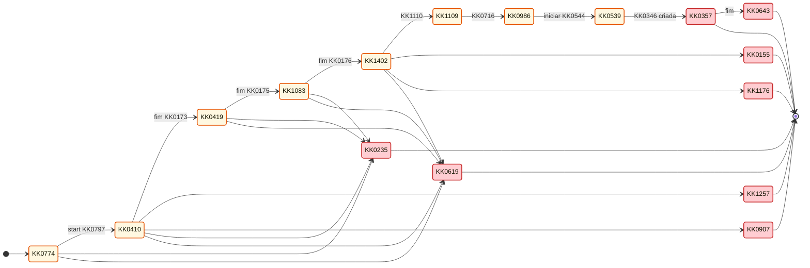

---

## 3. Tabela formal de transições

### KK0650 principal

| De | KK0609 | Para |
| ---- | -------- | ------ |
| KK0774 | start KK0797 | KK0410 |
| KK0410 | fim KK0173 | KK0419 |
| KK0419 | fim KK0175 | KK1083 |
| KK1083 | fim KK0176 | KK1402 |
| KK1402 | KK1110 | KK1109 |
| KK1109 | KK0716 | KK0986 |
| KK0986 | iniciar KK0544 | KK0539 |
| KK0539 | KK0346 criada | KK0357 |
| KK0357 | fim | KK0643 |

### Fluxos de exceção

| De | KK0609 | Para |
| ---- | -------- | ------ |
| KK0410 | KK1255 | KK1257 |
| KK0410 | não elegível | KK0907 |
| KK1402 | KK1179 | KK1176 |
| KK1402 | KK0151 | KK0155 |
| (vários ativos) | cancelamento | KK0235 |
| (vários ativos) | timer / KK0621 | KK0619 |

---

## 4. Uso na retomada e KK1461

KK1085 deve estar **ativa** (não KK0643, KK0235 nem KK0619) para retomar. Se expirada ou encerrada, a retomada deve ser **negada**. Ver [KK0376](KK0376) e KK0040 [JORNADA-DEC-001](../KK0040/KK0465).

---

## 5. Referências

- [KK0376](KK0376)
- [KK0465](../KK0040/KK0465)
- [KK0848](../KK0789%20da%20decomposição/KK0848)

$$$$$

[arquitetura/VOLTAR_MACRO_OPCAO_A_ANALOGIAS_GENERICO.md]
XXXXX
# KK1452 entre etapas — Abordagem adotada (mensagem de fora, lógica na macro)

**Objetivo:** Explicar o mecanismo de KK1456 (KK0968) com analogia e KK0493 KK0865, como apoio didático à especificação KK1377 do KK1451.  
**Quando usar:** Para onboarding e compreensão rápida (KK1031/KK1131/engenharia) antes de ler a especificação completa e KK0378.  
**Fonte:** `KK0953`, [VOLTAR_MACRO_OPCAO_A.md](VOLTAR_MACRO_OPCAO_A.md) (especificação KK1377), KK0040 [KK0462](../KK0040/KK0462), [KK0846](../KK0789%20da%20decomposição/KK0846). Manual (visão por parte): [INDICE_E_PLANEJAMENTO_MANUAL_CO8.md](../../Manual%20OMNICHANNEL/INDICE_E_PLANEJAMENTO_MANUAL_CO8.md).

> **KK0362:** mecanismo de "KK1451" no KK1070 KK0949. **KK0466:** KK0968 — mensagem de fora + KK0168 no KK0995.
>
> **Leitura prévia recomendada:** `KK0462` — contém a decisão (KK0968 vs B) e os KK0493 KK0865 da solução adotada.
>
> **Referência para contexto adicional:** `KK0846` (seção 2.3.1 — KK0712 e KK1423 do KK1451 no N1). Para renderizar os KK0493 KK0865, use GitHub, GitLab ou VS Code com extensão Markdown Preview KK0865 Support.

**KK0816 rápida:** 🔴 KK0165 Event interruptivo = cancela a KK0206 em andamento. 🔵 Mensagem externa = enviada pelo KK0144 (front não fala direto com o engine).

---

## A analogia: excursão de ônibus

O **KK1070** é o **roteiro da excursão** — o guia que decide a ordem das paradas. Cada **KK0208** é uma **parada** do passeio (KK0316, KK0407, KK1078, KK1405). O **KK1392** é o passageiro. **KK1452** significa: “quero ir de novo para aquela parada que já passou”.

- **Sequência normal:** ônibus sai → Parada 1 → Parada 2 → Parada 3 → Parada 4 → fim do passeio.
- **KK1452:** no meio de uma parada (ou ao sair dela), o passageiro pede para **revisitar** uma parada anterior; o roteiro (KK0995) precisa “levar o ônibus” de volta até lá.
- **Importante:** KK1451 **não é obrigatoriamente n−1** (só a parada anterior). O valor de `KK1459` pode ser qualquer etapa já visitada (n−1, n−2, n−3…). Ex.: da Parada 4 (KK1405) o passageiro pode KK1451 para KK1078, KK0407 ou KK0316. A KK1393 pode oferecer “só um botão KK1452 = etapa anterior”, mas o mecanismo do KK0995 suporta KK1451 para qualquer parada anterior.

Na abordagem adotada, o guia fica sabendo do pedido por **rádio**: o app (KK0144) manda um recado (mensagem) e o roteiro interrompe a parada atual e redireciona.

---

## Mensagem de "KK1451" vinda de fora (o rádio)

O passageiro **avisa de fora**: na KK1338 ele clica em KK1452; o app (KK0144) manda um **recado** para o KK1069. O KK0995 tem um **rádio** grudado em cada parada onde faz sentido KK1451. Quando o recado chega, a parada atual é **interrompida** (todo mundo sobe no ônibus de novo) e o guia (KK0995) decide para qual parada ir.

### 1. O rádio na parada (KK0168)

**Ideia em uma linha:** o ônibus está na Parada 3 (KK1078); o passageiro clica KK1452; o KK0144 manda a mensagem; o rádio (KK0165 Event) recebe e o KK0995 interrompe a parada.

```mermaid
%%{init: {
  "theme": "base",
  "themeVariables": {
    "background": "#ffffff",
    "primaryColor": "#3b82f6",
    "primaryTextColor": "#0f172a",
    "primaryBorderColor": "#1d4ed8",
    "lineColor": "#1e3a8a",
    "secondaryColor": "#f8fafc",
    "tertiaryColor": "#eef2ff",
    "clusterBkg": "#ffffff",
    "clusterBorder": "#1e3a8a",
    "fontFamily": "Inter, Segoe UI, Arial"
  }
}}%%
flowchart LR

classDef start fill:#22c55e,stroke:#15803d,stroke-width:2px,color:#ffffff;
classDef KK1332 fill:#3b82f6,stroke:#1d4ed8,stroke-width:1.5px,color:#ffffff;
classDef service fill:#ffffff,stroke:#3b82f6,stroke-width:1.5px,stroke-dasharray:5 5,color:#0f172a;
classDef KK0669 fill:#f59e0b,stroke:#b45309,stroke-width:2px,color:#ffffff;
classDef finish fill:#ef4444,stroke:#991b1b,stroke-width:2px,color:#ffffff;






  A[Onibus na Parada 3 KK1078]
  B[Passageiro clica KK1452]
  C[KK0144 envia mensagem]
  D[Radio recebe KK1459 = dados_pessoais]
  E[KK0995 interrompe KK0206 e decide proxima parada]

  A --> B --> C --> D --> E
```

O **KK0168** é o **rádio do guia naquela parada**: fica ligado enquanto o ônibus está na parada. Quando o recado chega, o guia **interrompe a parada** (a KK0206 é cancelada), sobe todo mundo no ônibus e o **roteiro** (KK0995) decide para qual parada ir em seguida.

### 2. Em quais paradas existe rádio?

Só nas paradas em que o passageiro **pode** pedir para KK1451 — ou seja, nas Calls de KK0407, KK1078 e KK1405. Na Parada 1 (KK0316) não há “KK1451” para antes do início da excursão.

A KK1272 do roteiro é: **Início → P1 → P2 → P3 → P4 → Fim**. Só as paradas 2, 3 e 4 têm "rádio" (KK0168); na P1 não há KK1451 para antes do KK0995.

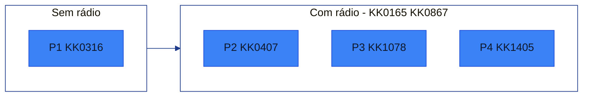

Cada rádio está **na borda** da parada (KK0166). Enquanto o KK1361 está dentro do KK0639, o KK0610 fica **esperando**; quando a mensagem chega, ele **dispara** e a KK0206 é interrompida.

#### Estados do KK0165 Event (rádio)

O mecanismo "rádio ligado enquanto o KK1361 está na KK0206" corresponde a dois estados do KK0165 Event:

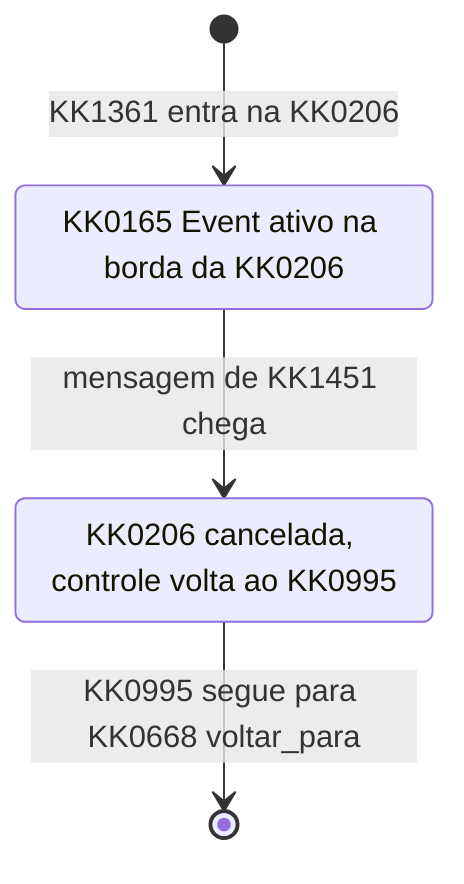

### 3. KK0650 passo a passo

KK0268 completo: estado inicial (ônibus na Parada 3) → KK1392 clica KK1452 → KK0144 envia mensagem → KK0165 Event dispara → KK0995 retoma o controle.

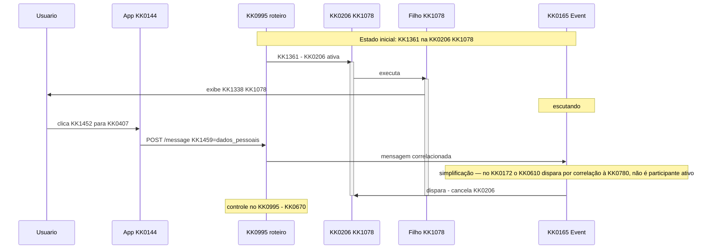

> ⚠️ **Cancelamento da KK0206 ≠ rollback.** O KK0165 Event cancela a execução do KK0639; as KK1423 já gravadas no KK0995 permanecem (não há rollback automático). Detalhes e mitigação na tabela **KK1041 e KK1206**.

#### 3.2 Roteiro (KK0995) decide para qual parada ir

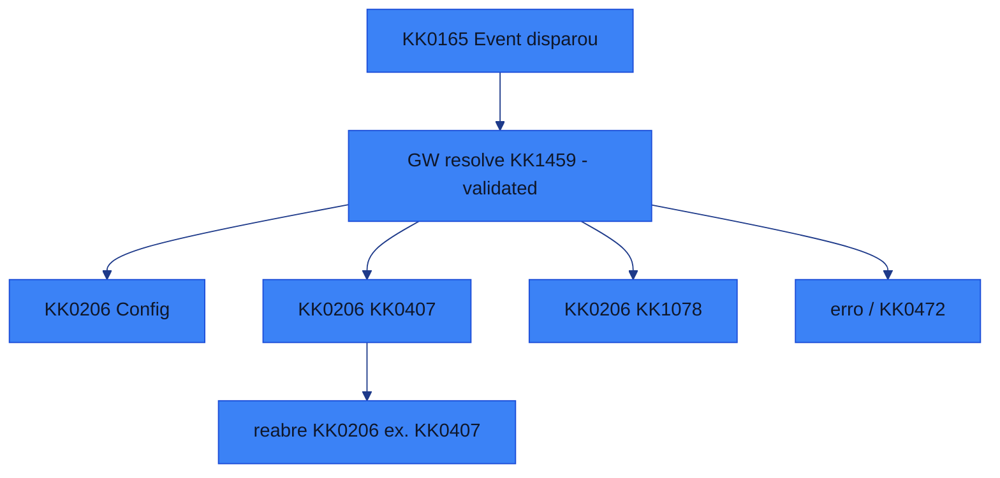

- **KK0731 do KK0669:** o KK0669 “para onde KK1451?” depende de **KK1406** de `KK1459`: (1) enumeração clara dos valores válidos (ex.: KK0755 dos KK0183 ou códigos acordados); (2) KK0472 bem definido quando o valor for inválido ou ausente; (3) telemetria/log quando cair no ramo de erro, para diagnóstico. O nome **GW – resolve KK1459 (validated)** no KK0172 sinaliza que há KK1406, não apenas roteamento cego.
- **KK1452 para P1 (KK0206 Config):** quando o destino é P1, o KK0995 reinvoca a KK0206 de KK0316. Como P1 **não tem rádio próprio**, o comportamento no KK1187 é tipicamente **nova execução do início** (start do KK1069 KK0639). **Do ponto de vista do KK1392:** “KK1451 para KK0316”; **do ponto de vista KK1378:** novo start do KK0639. *KK1452 para P1 é equivalente a reiniciar a KK0797 com contexto preservado (KK1423 do KK0995).* Alinha KK1393, KK1077 e engenharia.
- **Ramo erro / KK0472:** quando `KK1459` está vazio, inválido ou não mapeado, o KK0995 deve tratar de forma explícita. **Comportamento KK0472 recomendado (evita teleporte silencioso em produção):** (1) registrar **log estruturado + métrica**; (2) **não mudar de etapa** (permanecer na etapa atual); (3) **devolver erro funcional ao front** (se aplicável), para o KK1392 receber feedback. Outras políticas (ex.: encerrar KK0780) podem ser adotadas por regra de KK0911, mas o KK0472 acima é recomendado como baseline.

#### 3.3 Quando a parada “revisitada” termina

O KK1392 termina de novo em KK0407; o KK0639 completa e devolve o controle ao KK0995. O roteiro segue a **ordem normal**: depois da Parada 2 vem a Parada 3 (KK1078 de novo). O critério desse KK0669 é a **KK1272 fixa do roteiro** (ou uma KK1424 de KK1069 como `proxima_etapa` / `etapa_atual` preenchida pelo KK0995): após KK1187 de P2, a próxima etapa é sempre P3; após P3, P4; etc.

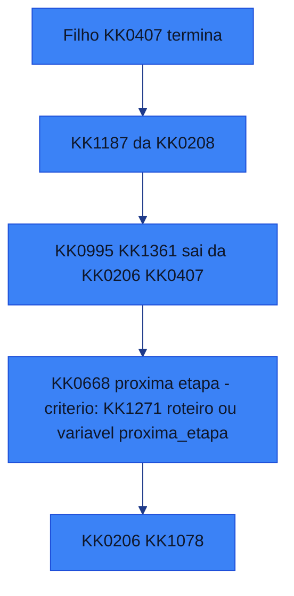

**Preservação de estado:** ao KK1451 da Parada 3 (KK1078) para a Parada 2 (KK0407) e depois retornar à Parada 3, o que acontece com os dados já preenchidos em KK1078? Isso é decisão de KK0759 e KK1393: (1) o KK0639 pode ser reiniciado “do zero” e o front reexibe os dados a partir das KK1423 de KK1069; (2) ou o KK0639 é reaberto em um KK0264 que restaura o estado (ex.: mesma User KK1331 com KK1423 preenchidas). O KK0521 de decisão e o desenho do KK0178 (nível 2) devem deixar explícito se o estado é preservado ou não, pois impacta a experiência do KK1392 e o KK0374 entre KK0995 e KK0639.

**KK0371 KK0087 (decisão explícita):** o KK0995 depende implicitamente de como os KK0640 tratam KK1187. Definir de forma explícita em KK0903/KK0084 uma das opções (ou híbrido por parada):

- **Filhos KK1308:** cada reentrada reconstrói a KK1338 a partir das KK1423 de KK1069 (KK0995/KK0639). Sem “KK1182” de KK1332.
- **Filhos com KK1182/KK0264:** o engine reabre o KK0639 em uma User KK1331 ou estado específico, com estado restaurado.
Mesmo que fique fora do desenho KK0172, vale como KK0372 para KK0759 e testes.

#### 3.4 KK0598 da correlação (KK0144 ↔ engine)

Para KK0759 da integração e observabilidade, deixar explícito:

- **Identificação da KK0780:** o KK0144 utiliza o **KK1067** do **KK1070** para correlacionar a mensagem à KK0780 correta. Documentar no KK0372 da KK0072 como esse identificador é enviado (ex.: header, KK1424 da mensagem).
- **Mensagem:** **KK0877** único (ex.: `KK1457`, alinhado ao KK0172) e KK1424 de KK0911 **`KK1459`** na KK1001 da mensagem, com valor que o KK0669 do KK0995 consome para rotear.
- **Checagem antes de enviar:** recomenda-se que o KK0144 (ou camada que envia a mensagem) **verifique o estado da KK0780** antes de enviar (ex.: KK0780 ainda em execução, KK1361 em etapa que aceita “KK1451”), para evitar envio a KK0780 já finalizada ou em estado inválido — melhora resiliência e reduz ruído em logs/observabilidade.

### 4. Visão geral (KK0187)

**KK0650 principal (KK1272 normal):**

```mermaid
%%{init: {
  "theme": "base",
  "themeVariables": {
    "background": "#ffffff",
    "primaryColor": "#3b82f6",
    "primaryTextColor": "#0f172a",
    "primaryBorderColor": "#1d4ed8",
    "lineColor": "#1e3a8a",
    "secondaryColor": "#f8fafc",
    "tertiaryColor": "#eef2ff",
    "clusterBkg": "#ffffff",
    "clusterBorder": "#1e3a8a",
    "fontFamily": "Inter, Segoe UI, Arial"
  }
}}%%
flowchart LR

classDef start fill:#22c55e,stroke:#15803d,stroke-width:2px,color:#ffffff;
classDef KK1332 fill:#3b82f6,stroke:#1d4ed8,stroke-width:1.5px,color:#ffffff;
classDef service fill:#ffffff,stroke:#3b82f6,stroke-width:1.5px,stroke-dasharray:5 5,color:#0f172a;
classDef KK0669 fill:#f59e0b,stroke:#b45309,stroke-width:2px,color:#ffffff;
classDef finish fill:#ef4444,stroke:#991b1b,stroke-width:2px,color:#ffffff;






  P1[P1 Config] --> P2[P2 KK0399] --> P3[P3 KK1078] --> P4[P4 Validacao] --> Fim([Fim])
```

**KK0650 de exceção (KK1451):** quando, durante P2, P3 ou P4, chega a mensagem de KK1451, o KK0165 Event daquela KK0206 dispara, a KK0206 é cancelada e o KK0995 segue para o KK0668 “para onde KK1451?” e reabre a KK0206 correspondente (ex.: KK1451 para P2).

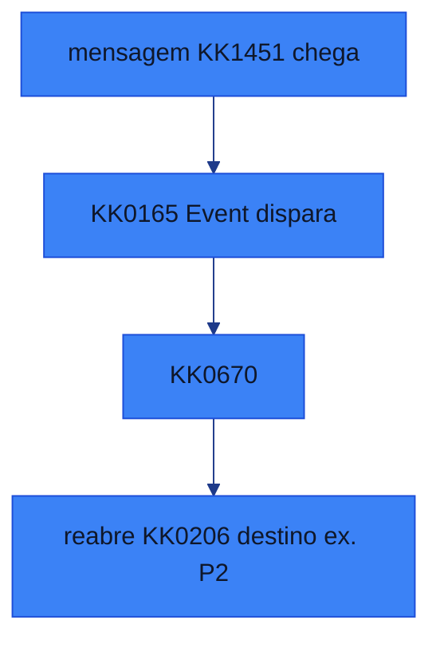

### 5. Paradas com e sem KK0165 Event

| Parada | KK0206 / KK0172 | KK0165 Event (rádio)? | Motivo | Destinos possíveis |
| -------- | ------------- | -------------------------- | -------- | --------------------- |
| P1 | KK0316 | **Não** | Não existe “KK1451” para antes do início da KK0797 (KK0995). | — |
| P2 | KK0407 | **Sim** | Parada pode ser interrompida por pedido de KK1451. | P1 |
| P3 | KK1078 | **Sim** | Parada pode ser interrompida por pedido de KK1451. | P1 ou P2 |
| P4 | KK1405 | **Sim** | Parada pode ser interrompida por pedido de KK1451. | P1, P2 ou P3 |

**Regra de nomeação no KK0172:** padronizar KK0755 no modelador (não é opcional). KK0165 KK0612: `BE_voltar_dados` (KK0206 KK0407), `BE_voltar_produtos` (KK0206 KK1078), `BE_voltar_validacao` (KK0206 KK1405). KK0668: `GW_resolve_voltar_para_bpmn`. Facilita leitura do .bpmn, logs e KK1133.

---

## KK1041 e KK1206

Não são erros do desenho, mas merecem cuidado na KK0759 e na KK0311 com times:

| Ponto | KK1200 | Mitigação |
| ------- | -------- | ----------- |
| **Cancelamento da KK0206 ≠ rollback** | Times acharem que “KK1451” limpa dados automaticamente. | Reforçar: KK0165 Event **cancela a execução** do KK0639 (tokens, timers, KK1335 abortados); **KK1423 já gravadas no KK0995 permanecem**. Não há rollback automático de KK1423. |
| **KK0668 “para onde KK1451?”** | Roteamento cego sem KK1406 gera comportamento indefinido. | KK0731 forte: enum de valores válidos, KK0472 definido, telemetria/log no ramo de erro. Nomear o KK0669 no KK0172 como **GW – resolve KK1459 (validated)**. |
| **KK1452 para P1 = reinício** | Discussão entre KK1393 (“KK1451 para Config”) e engenharia (“novo start”). | Alinhar: *“KK1452 para P1 é equivalente a reiniciar a KK0797 com contexto preservado.”* Novo start do KK0639; KK1423 do KK0995 mantidas. |
| **Preservação de estado** | KK0995 depende da decisão dos KK0640; KK1393 muda radicalmente conforme a opção. | KK0371 KK0087 explícito (KK1308 vs KK1182/KK0264), documentado no KK0903 e na KK0084, mesmo fora do KK0172. |

**Conferência com o KK0172**

- **KK0655 do comportamento (KK0889):** `KK0953` — hoje o “KK1451” é feito por sequence KK0649 com condição em `KK1451` (KK1424), não por mensagem; na KK0471 passa a ser KK0168 no KK0995.
- **Referência do KK0995 decomposto com KK1451:** `omnichannel_pai_nivel1_com_voltar.bpmn`. Nesse arquivo hoje existe **apenas um** KK0165 Event: `BoundaryEvent_voltar_produtos` em `KK0212`, com mensagem `KK0874` (name=`KK1457`). O KK0669 é `Gateway_voltar_para` (“Para onde KK1451?”), com três saídas e condições `KK1459 == "KK0954"` ou `"1"`, idem `KK0956`/`"2"`, `KK0960`/`"3"`.
- **Alinhamento com este KK0521:** a especificação completa exige KK0165 Event em **P2, P3 e P4** (KK0407, KK1078, KK1405). O KK0172 ilustrativo tem só em P3 (exemplo). Na KK0759 completa, replicar o padrão nas três Calls e adotar a regra de nomeação (ex.: `BE_voltar_dados`, `BE_voltar_produtos`, `BE_voltar_validacao`). O KK0172 não possui ramo KK0472/erro no KK0669; o tratamento de valor inválido ou ausente de `KK1459` fica como requisito de KK0759 (ver KK1206 residuais).

**Riscos residuais (KK0759)** — nada aqui é erro de desenho; são KK1039 para a hora de implementar, **alinhados ao que o KK0172 define** (não o contradizem):

1. **Idempotência do KK0610 "KK1451" (regra explícita):** o KK0144 deve **garantir KK0749 do KK0610 "KK1451" por KK0780 + etapa** (ex.: ignorar segundo clique em janela de KK1342, ou correlacionar e checar estado antes de enviar). Mesmo fora do KK0172, é **requisito não funcional** da integração — evita que dois cliques rápidos gerem duas mensagens e a segunda caia em KK0780 já alterada (ex.: KK0206 já cancelada).
2. **Telemetria como requisito não funcional:** toda queda no ramo KK0472/erro do KK0669 “para onde KK1451?” deve gerar **métrica + log estruturado**. Declarar isso como requisito, não como opcional, para diagnóstico e KK0122.
3. **Nomeação de KK0755 no KK0172:** aplicar a **regra de nomeação** (seção 5 — Paradas com e sem KK0165 Event) como padrão obrigatório do KK1084, não apenas sugestão.

---

## KK0995 como máquina de estados (visão resumo)

O KK0995 pode ser visto como uma máquina em que o **estado atual** é a etapa (P1, P2, P3 ou P4), o **KK0610 externo** é a mensagem de KK1451, e a **transição** é decidida pelo KK0669 que resolve `KK1459`.

**KK0650 normal (avançar):**

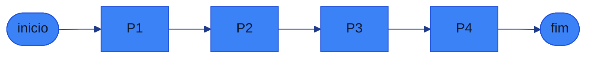

**KK0609 KK1451:** em P2, P3 ou P4, ao chegar a mensagem de KK1451, o estado muda para P1, P2 ou P3 conforme `KK1459` (KK0669 validado). Não há transição “KK1451” a partir de P1.

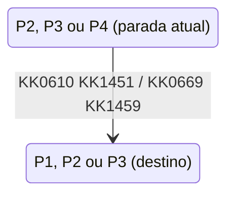

---

*Documento complementar a `KK0846`. KK0466 registrada em `KK0462`. KK0655 do KK0651: `KK0953`.*

$$$$$

[arquitetura/VOLTAR_MACRO_OPCAO_A_ANALOGIA_DIDATICA_GENERICO.md]
XXXXX
# KK1452 macro (KK0968) — Analogia didática

**Objetivo:** Oferecer uma visão do mecanismo “KK1451 entre etapas” (KK0968) pela **analogia da excursão de ônibus**, para facilitar o entendimento. A especificação completa (KK0372, KK1206, KK0172, correlação) está no KK0521 KK1378.

**Quando usar:** Para onboarding, explicação rápida a KK1031/KK1131 ou para ancorar o conceito antes de ler a especificação.

**Fonte:** [VOLTAR_MACRO_OPCAO_A.md](VOLTAR_MACRO_OPCAO_A.md) (especificação KK1377 — fonte da verdade). KK0466: [KK0462](../KK0040/KK0462).

---

**Especificação completa (comportamento, KK0372, KK1206, KK0172):** [VOLTAR_MACRO_OPCAO_A.md](VOLTAR_MACRO_OPCAO_A.md).

---

## Equivalência: KK0172 ↔ analogia

| Conceito KK0172 / KK0084 | Na analogia didática |
|-----------------------------|----------------------|
| **KK1068 KK0995** | Roteiro da excursão — quem decide a ordem das paradas |
| **KK0208** (Config, KK0407, KK1078, KK1405) | Parada do passeio (P1, P2, P3, P4) |
| **Usuário** | Passageiro |
| **KK1452** (pedido de revisitar etapa anterior) | “Quero ir de novo para aquela parada que já passou” |
| **Mensagem enviada pelo KK0144** | Recado por rádio — o app avisa o “roteiro” de fora |
| **KK0168** (na borda da KK0206) | Rádio do guia naquela parada — ligado enquanto o ônibus está na parada; quando o recado chega, a parada é interrompida |
| **KK0668 “para onde KK1451?”** (`KK1459`) | KK0466 do roteiro: para qual parada ir em seguida |

---

## A analogia em poucas linhas

O **KK0995** é o **roteiro da excursão**: define a ordem das paradas (KK0316 → KK0407 → KK1078 → KK1405). Cada **KK0206** é uma **parada**. O **KK1392** é o passageiro. **KK1452** significa pedir para revisitar uma parada anterior — e não só a última: `KK1459` pode ser qualquer etapa já visitada (n−1, n−2, n−3…).

Na KK0968, o pedido de KK1451 chega **de fora**: o KK1392 clica na KK1338, o app (KK0144) manda uma **mensagem** para o KK1069. O KK0995 tem um **KK0168** (“rádio”) em cada KK0206 onde faz sentido KK1451 (KK0407, KK1078, KK1405; em KK0316 não há “KK1451 para antes do início”). Quando a mensagem chega, a KK0206 atual é **interrompida** (a “parada” é cancelada), e o KK0995 decide para qual KK0206 ir em seguida (KK0669 que resolve `KK1459`).

- **Sequência normal:** Início → P1 → P2 → P3 → P4 → Fim.
- **KK1452:** no meio de uma KK0206 (ou ao sair dela), o KK1392 pede KK1451; o KK0144 envia a mensagem; o KK0165 Event dispara; o KK0995 cancela a KK0206 e reabre a KK0206 de destino.

---

## KK0491 da analogia (KK0651 do “recado”)

*Este KK0492 usa os KK1351 da analogia apenas para apoio didático. Na especificação KK1377 os KK0552 estão em KK1351 KK0172.*

```mermaid
%%{init: {
  "theme": "base",
  "themeVariables": {
    "background": "#ffffff",
    "primaryColor": "#3b82f6",
    "primaryTextColor": "#0f172a",
    "primaryBorderColor": "#1d4ed8",
    "lineColor": "#1e3a8a",
    "secondaryColor": "#f8fafc",
    "tertiaryColor": "#eef2ff",
    "clusterBkg": "#ffffff",
    "clusterBorder": "#1e3a8a",
    "fontFamily": "Inter, Segoe UI, Arial"
  }
}}%%
flowchart LR

classDef start fill:#22c55e,stroke:#15803d,stroke-width:2px,color:#ffffff;
classDef KK1332 fill:#3b82f6,stroke:#1d4ed8,stroke-width:1.5px,color:#ffffff;
classDef service fill:#ffffff,stroke:#3b82f6,stroke-width:1.5px,stroke-dasharray:5 5,color:#0f172a;
classDef KK0669 fill:#f59e0b,stroke:#b45309,stroke-width:2px,color:#ffffff;
classDef finish fill:#ef4444,stroke:#991b1b,stroke-width:2px,color:#ffffff;


  A[Ônibus na Parada 3 - KK1078]
  B[Passageiro clica KK1452]
  C[KK0144 envia mensagem]
  D[KK0165 Event recebe KK1459]
  E[KK0995 interrompe KK0206 e decide destino]

  A --> B --> C --> D --> E

  %% Estilos padrão KK1084 (analogia)
  style A fill:#bbdefb,stroke:#1565c0,stroke-width:2px
  style B fill:#eceff1,stroke:#546e7a,stroke-width:2px
  style C fill:#eceff1,stroke:#546e7a,stroke-width:2px
  style D fill:#c8e6c9,stroke:#2e7d32,stroke-width:2px
  style E fill:#ffcdd2,stroke:#c62828,stroke-width:2px
  linkStyle KK0472 stroke:#37474f,stroke-width:2px
```

Equivalência: “Ônibus na Parada 3” = KK1361 na KK0206 KK1078; “Passageiro” = KK1392; “KK0165 Event” = mecanismo que escuta a mensagem na borda da KK0206.

---

## Onde consultar a especificação

- **KK0371 (correlação, KK0877, KK1459, checagem antes de enviar):** [VOLTAR_MACRO_OPCAO_A.md §1.3.3](VOLTAR_MACRO_OPCAO_A.md#1133-escopo-da-correlação-bff--engine)
- **Calls com e sem KK0165 Event; regra de nomeação KK0172:** [VOLTAR_MACRO_OPCAO_A.md §1.5](VOLTAR_MACRO_OPCAO_A.md#15-calls-com-e-sem-KK0166-KK0604)
- **KK1041 e KK1206 (cancelamento ≠ rollback, KK0669 validado, KK1451 para P1, preservação de estado):** [VOLTAR_MACRO_OPCAO_A.md §2](VOLTAR_MACRO_OPCAO_A.md#2-KK1039-de-atenção-e-KK1206)
- **Conferência com o KK0172 e KK1206 residuais:** [VOLTAR_MACRO_OPCAO_A.md §2.1 e §2.2](VOLTAR_MACRO_OPCAO_A.md#21-conferência-com-o-bpmn)
- **KK0995 como máquina de estados:** [VOLTAR_MACRO_OPCAO_A.md §3](VOLTAR_MACRO_OPCAO_A.md#3-pai-como-máquina-de-estados-visão-resumo)

---

*Documento de apoio didático. KK0655 da especificação: [VOLTAR_MACRO_OPCAO_A.md](VOLTAR_MACRO_OPCAO_A.md). KK0466: [KK0462](../KK0040/KK0462).*

$$$$$

[arquitetura/VOLTAR_MACRO_OPCAO_A_GENERICO.md]
XXXXX
# KK1452 entre etapas — Especificação (KK0968: mensagem de fora, lógica na macro)

**Objetivo:** Especificar o mecanismo de KK1451 entre etapas (KK0968): mensagem externa (KK0144), KK0609 de Mensagem na Borda (KK0168) no KK0995, cancelamento da KK0206 ativa e KK0669 "para onde KK1451?"; inclui KK0372 de correlação, governança do KK0669 e mitigação de KK1206.

**Quando usar:** Ao desenhar ou implementar o KK0651 de KK1451 no KK0995; ao integrar KK0144 ↔ engine; ao revisar KK0165 KK0612 e KK1424 `KK1459`.

**Fonte:** KK0953, omnichannel_pai_nivel1_com_voltar.bpmn, KK0846 (seção 2.3.1), KK0462.

---

> **KK0362:** mecanismo de "KK1451" no KK1070 KK0949. **KK0466:** KK0968 — mensagem de fora + KK0609 de Mensagem na Borda (KK0168) no KK0995.
>
> **Leitura prévia recomendada:** [KK0462](../KK0040/KK0462) — contém a decisão (KK0968 vs B) e os KK0493 KK0865 da solução adotada.
>
> **Referência adicional:** [KK0846](../KK0789%20da%20decomposição/KK0846) (seção 2.3.1 — KK0712 e KK1423 do KK1451 no N1).
>
> **KK0362 didático (opcional):** [NARRATIVA_COMUNICACAO_PAI_FILHOS_CO8.md](./NARRATIVA_COMUNICACAO_PAI_FILHOS_CO8.md).

**KK0816 rápida:** KK0165 Event interruptivo = cancela a KK0206 em andamento. Mensagem externa = enviada pelo KK0144 (front não fala direto com o engine).

---

## 1. Mensagem de KK1451 vinda de fora (KK0144 → engine)

O KK1392 solicita KK1451 pela KK1338; o app (KK0144) envia uma **mensagem** para o KK1069. O KK0995 possui um **KK0609 de Mensagem na Borda (KK0168)** em cada KK0206 onde faz sentido KK1451. Quando a mensagem chega, a KK0206 atual é **interrompida** e o KK0995 decide para qual KK0206 ir.

```mermaid
%%{init: {
  "theme": "base",
  "themeVariables": {
    "background": "#ffffff",
    "primaryColor": "#3b82f6",
    "primaryTextColor": "#0f172a",
    "primaryBorderColor": "#1d4ed8",
    "lineColor": "#1e3a8a",
    "secondaryColor": "#f8fafc",
    "tertiaryColor": "#eef2ff",
    "clusterBkg": "#ffffff",
    "clusterBorder": "#1e3a8a",
    "fontFamily": "Inter, Segoe UI, Arial"
  }
}}%%
flowchart LR

classDef etapa fill:#3b82f6,stroke:#1d4ed8,stroke-width:1.5px,color:#ffffff;
classDef KK1451 fill:#f59e0b,stroke:#b45309,stroke-width:2px,color:#ffffff;

  P1[KK0316]:::etapa --> P2[KK0407]:::etapa --> P3[KK1078]:::etapa --> P4[KK1405]:::etapa
  P3 -. mensagem KK1452 .-> GW["KK0668<br/>para onde KK1451?"]:::KK1451
  GW --> P1
  GW --> P2

  linkStyle KK0472 stroke:#1e3a8a,stroke-width:2px
```

*Azul = etapas principais da KK0797; âmbar = decisão do KK0995 ao processar a mensagem de KK1451.*

### 1.1 KK0609 de Mensagem na Borda (KK0168) na KK0206 (conceito)

**Ideia em uma linha:** o KK1361 está na KK0206 KK1078; o KK1392 clica KK1452; o KK0144 envia a mensagem; o KK0609 de Mensagem na Borda (KK0168) recebe e o KK0995 interrompe a KK0206.

*KK1426 = KK1361/KK0610 de KK1069; KK0269 = ações (KK1392, KK0144); KK1430 = decisão do KK0995.*

```mermaid
%%{init: {
  "theme": "base",
  "themeVariables": {
    "background": "#ffffff",
    "primaryColor": "#3b82f6",
    "primaryTextColor": "#0f172a",
    "primaryBorderColor": "#1d4ed8",
    "lineColor": "#1e3a8a",
    "secondaryColor": "#f8fafc",
    "tertiaryColor": "#eef2ff",
    "clusterBkg": "#ffffff",
    "clusterBorder": "#1e3a8a",
    "fontFamily": "Inter, Segoe UI, Arial"
  }
}}%%
flowchart LR

classDef start fill:#22c55e,stroke:#15803d,stroke-width:2px,color:#ffffff;
classDef KK1332 fill:#3b82f6,stroke:#1d4ed8,stroke-width:1.5px,color:#ffffff;
classDef service fill:#ffffff,stroke:#3b82f6,stroke-width:1.5px,stroke-dasharray:5 5,color:#0f172a;
classDef KK0669 fill:#f59e0b,stroke:#b45309,stroke-width:2px,color:#ffffff;
classDef finish fill:#ef4444,stroke:#991b1b,stroke-width:2px,color:#ffffff;


  A([KK1360 na KK0206 KK1078])
  B[Usuário clica KK1452]
  C[KK0144 envia mensagem]
  D[KK0165 Event recebe KK1459]
  E[KK0995 interrompe KK0206 e decide destino]

  A --> B --> C --> D --> E
  style A fill:#c8e6c9,stroke:#2e7d32,stroke-width:2px
  style B fill:#eceff1,stroke:#546e7a,stroke-width:2px
  style C fill:#eceff1,stroke:#546e7a,stroke-width:2px
  style D fill:#c8e6c9,stroke:#2e7d32,stroke-width:2px
  style E fill:#ffcdd2,stroke:#c62828,stroke-width:2px
  linkStyle KK0472 stroke:#37474f,stroke-width:2px
```

O **KK0609 de Mensagem na Borda (KK0168)** fica ativo na borda da KK0206 enquanto o KK1361 está dentro dela. Quando a mensagem chega, o KK0610 **dispara**, a KK0206 é **cancelada** e o KK0995 decide para qual KK0206 ir em seguida.

### 1.2 Em quais Calls existe KK0165 Event?

Apenas nas Calls em que o KK1392 **pode** solicitar KK1451: KK0407, KK1078 e KK1405. Na KK0206 KK0316 (P1) não há “KK1451” para antes do início do KK0995.

Sequência do KK0995: **Início → KK0206 Config → KK0206 KK0407 → KK0206 KK1078 → KK0206 KK1405 → Fim**. Apenas as Calls 2, 3 e 4 têm KK0609 de Mensagem na Borda; na KK0206 Config não há KK1451 para antes do KK0995.

*Azul = KK0206 activity; subgrafos = agrupamento (sem BE vs com BE).*

```mermaid
%%{init: {
  "theme": "base",
  "themeVariables": {
    "background": "#ffffff",
    "primaryColor": "#3b82f6",
    "primaryTextColor": "#0f172a",
    "primaryBorderColor": "#1d4ed8",
    "lineColor": "#1e3a8a",
    "secondaryColor": "#f8fafc",
    "tertiaryColor": "#eef2ff",
    "clusterBkg": "#ffffff",
    "clusterBorder": "#1e3a8a",
    "fontFamily": "Inter, Segoe UI, Arial"
  }
}}%%
flowchart LR

classDef start fill:#22c55e,stroke:#15803d,stroke-width:2px,color:#ffffff;
classDef KK1332 fill:#3b82f6,stroke:#1d4ed8,stroke-width:1.5px,color:#ffffff;
classDef service fill:#ffffff,stroke:#3b82f6,stroke-width:1.5px,stroke-dasharray:5 5,color:#0f172a;
classDef KK0669 fill:#f59e0b,stroke:#b45309,stroke-width:2px,color:#ffffff;
classDef finish fill:#ef4444,stroke:#991b1b,stroke-width:2px,color:#ffffff;


  subgraph Sem["Sem KK0165 Event"]
    P1[KK0206 KK0316]
  end
  subgraph Com["Com KK0165 Event"]
    P2[KK0206 KK0407]
    P3[KK0206 KK1078]
    P4[KK0206 KK1405]
  end
  Sem --> Com
  style P1 fill:#bbdefb,stroke:#1565c0
  style P2 fill:#bbdefb,stroke:#1565c0
  style P3 fill:#bbdefb,stroke:#1565c0
  style P4 fill:#bbdefb,stroke:#1565c0
  linkStyle KK0472 stroke:#37474f,stroke-width:2px
```

Cada KK0165 Event fica **na borda** da KK0206. Enquanto o KK1361 está dentro do KK0639, o KK0610 fica **esperando**; quando a mensagem chega, ele **dispara** e a KK0206 é interrompida.

#### Estados do KK0165 Event

O mecanismo “KK0610 ativo enquanto o KK1361 está na KK0206” corresponde a dois estados:

```mermaid
%%{init: {
  "theme": "base",
  "themeVariables": {
    "background": "#ffffff",
    "primaryColor": "#3b82f6",
    "primaryTextColor": "#0f172a",
    "primaryBorderColor": "#1d4ed8",
    "lineColor": "#1e3a8a",
    "secondaryColor": "#f8fafc",
    "tertiaryColor": "#eef2ff"
  }
}}%%
stateDiagram-v2
  classDef ativo fill:#3b82f6,stroke:#1d4ed8,stroke-width:2px,color:#ffffff;
  classDef disparado fill:#ef4444,stroke:#991b1b,stroke-width:2px,color:#ffffff;

  [*] --> Escutando: KK1361 entra na KK0206
  Escutando: KK0165 Event ativo na borda da KK0206
  Escutando --> KK0507: mensagem de KK1451 chega
  KK0507: KK0206 cancelada, controle volta ao KK0995
  KK0507 --> [*]: KK0995 segue para KK0668 voltar_para
  class Escutando ativo
  class KK0507 disparado
```

*Azul = estado ativo/esperando; KK1430 = disparado; KK1281 = transição.*

### 1.3 KK0650 passo a passo

KK0268 completo em **duas fases**:

| #   | Fase           | O que acontece                                                                 |
| --- | -------------- | ----------------------------------------------------------------------------- |
| 1   | **KK0206 ativa** | KK1360 na KK0206 KK1078; KK1392 vê a KK1338; KK0165 Event escutando.           |
| 2   | **KK1452**     | Usuário clica KK1452 → KK0144 envia mensagem → BE dispara → KK0206 cancelada → KK0995 retoma e decide destino. |

*Participantes: **U** = KK1392 · **App** = KK0144 · **KK0995** = KK1069 KK0974 · **KK0206** = KK0208 KK1078 · **Filho** = KK1069 KK0639 · **BE** = KK0165 Event (na KK0206).*

**KK0491 de KK1272 (ordem temporal das mensagens):**

```mermaid
%%{init: {'theme':'base', 'themeVariables': {'primaryColor':'#bbdefb', 'primaryBorderColor':'#0d4372', 'actorBorderColor':'#0d4372', 'actorTextColor':'#0d4372', 'lineColor':'#37474f', 'activationBkgColor':'#bbdefb', 'activationBorderColor':'#0d4372'}}}%%
sequenceDiagram
  participant U as Usuario
  participant App as KK0144
  participant KK0995 as KK0995
  participant KK0206 as KK0206 KK1078
  participant Filho as Filho
  participant BE as KK0165 Event

  KK0995->>+KK0206: KK1361
  KK0206->>+Filho: executa
  Filho->>U: exibe KK1338 KK1078

  U->>App: KK1452 KK0407
  App->>KK0995: POST message KK1459
  KK0995->>BE: mensagem correlacionada
  BE->>KK0206: cancela KK0206
  deactivate KK0206
  deactivate Filho
```

*KK0491 de KK1272: caixas e barras de ativação na cor KK0127 (KK0206/etapa). As barras indicam quando o participante está processando.*

**Fluxograma do mesmo KK0651 (paleta de 5 cores):**

```mermaid
%%{init: {
  "theme": "base",
  "themeVariables": {
    "background": "#ffffff",
    "primaryColor": "#3b82f6",
    "primaryTextColor": "#0f172a",
    "primaryBorderColor": "#1d4ed8",
    "lineColor": "#1e3a8a",
    "secondaryColor": "#f8fafc",
    "tertiaryColor": "#eef2ff",
    "clusterBkg": "#ffffff",
    "clusterBorder": "#1e3a8a",
    "fontFamily": "Inter, Segoe UI, Arial"
  }
}}%%
flowchart LR

classDef start fill:#22c55e,stroke:#15803d,stroke-width:2px,color:#ffffff;
classDef KK1332 fill:#3b82f6,stroke:#1d4ed8,stroke-width:1.5px,color:#ffffff;
classDef service fill:#ffffff,stroke:#3b82f6,stroke-width:1.5px,stroke-dasharray:5 5,color:#0f172a;
classDef KK0669 fill:#f59e0b,stroke:#b45309,stroke-width:2px,color:#ffffff;
classDef finish fill:#ef4444,stroke:#991b1b,stroke-width:2px,color:#ffffff;


  KK0995[KK0995]
  KK0206[KK0206 KK1078]
  Filho[Filho]
  U[Usuario]
  App[KK0144]
  BE[KK0165 Event]

  KK0995 -->|KK1361| KK0206
  KK0206 -->|executa| Filho
  Filho -->|exibe KK1338 KK1078| U
  U -->|KK1452 KK0407| App
  App -->|POST KK1459| KK0995
  KK0995 -->|mensagem correlacionada| BE
  BE -->|cancela KK0206| KK0206

  style KK0995 fill:#bbdefb,stroke:#1565c0
  style KK0206 fill:#bbdefb,stroke:#1565c0
  style Filho fill:#bbdefb,stroke:#1565c0
  style U fill:#eceff1,stroke:#546e7a,stroke-width:2px
  style App fill:#eceff1,stroke:#546e7a,stroke-width:2px
  style BE fill:#c8e6c9,stroke:#2e7d32,stroke-width:2px
  linkStyle KK0472 stroke:#37474f,stroke-width:2px
```

*Azul = etapa (KK0995, KK0206, Filho); KK0269 = ação (Usuario, KK0144); verde = KK0610 (KK0165 Event). Setas KK0269 escuro.*

**Leitura do KK0492:** (1) *Fase 1 — KK0206 ativa:* KK1361 na KK0206 KK1078, KK0639 exibe KK1338; BE fica escutando. (2) *Fase 2 — KK1452:* KK1392 clica KK1452; KK0144 envia mensagem; BE dispara por correlação à KK0780 e cancela a KK0206; KK1361 volta ao KK0995 e o KK0668 decide o destino.

> **Cancelamento da KK0206 ≠ rollback.** O KK0165 Event cancela a execução do KK0639; as **KK1423 já gravadas no KK0995 permanecem** (não há rollback automático). Detalhes e mitigação na tabela **KK1041 e KK1206** (§2).

#### 1.3.1 KK0668 (KK0995) decide para onde KK1451

Após o KK0165 Event cancelar a KK0206, o KK1361 volta para o KK0995 no **Gateway_voltar_para**. O KK0669 usa a KK1424 `KK1459` (valor vindo da mensagem) para escolher o sequence flow de saída e reentrar na KK0206 de destino (ex.: KK0407). Uma única saída por KK1361; valor inválido ou ausente cai no ramo erro/KK0472.

*Cinza = término/KK1187/KK0995; âmbar = KK0669; KK0127 = próxima KK0206.*

```mermaid
%%{init: {
  "theme": "base",
  "themeVariables": {
    "background": "#ffffff",
    "primaryColor": "#3b82f6",
    "primaryTextColor": "#0f172a",
    "primaryBorderColor": "#1d4ed8",
    "lineColor": "#1e3a8a",
    "secondaryColor": "#f8fafc",
    "tertiaryColor": "#eef2ff",
    "clusterBkg": "#ffffff",
    "clusterBorder": "#1e3a8a",
    "fontFamily": "Inter, Segoe UI, Arial"
  }
}}%%
flowchart TB

classDef start fill:#22c55e,stroke:#15803d,stroke-width:2px,color:#ffffff;
classDef KK1332 fill:#3b82f6,stroke:#1d4ed8,stroke-width:1.5px,color:#ffffff;
classDef service fill:#ffffff,stroke:#3b82f6,stroke-width:1.5px,stroke-dasharray:5 5,color:#0f172a;
classDef KK0669 fill:#f59e0b,stroke:#b45309,stroke-width:2px,color:#ffffff;
classDef finish fill:#ef4444,stroke:#991b1b,stroke-width:2px,color:#ffffff;


  BE[KK0165 Event disparou]
  GW[GW resolve KK1459 - validated]
  BE --> GW
  GW --> P1[KK0206 Config]
  GW --> P2[KK0206 KK0407]
  GW --> P3[KK0206 KK1078]
  GW --> Err[erro / KK0472]
  P2 --> Reabre[reabre KK0206 ex. KK0407]
  class BE,Reabre service
  class GW KK0669
  class P1,P2,P3 KK1332
  class Err finish
  linkStyle KK0472 stroke:#37474f,stroke-width:2px
```

- **KK0731 do KK0669:** o KK0669 “para onde KK1451?” depende de **KK1406** de `KK1459`: (1) enumeração clara dos valores válidos (ex.: KK0755 dos KK0183 ou códigos acordados); (2) KK0472 bem definido quando o valor for inválido ou ausente; (3) telemetria/log quando cair no ramo de erro, para diagnóstico. O nome **GW – resolve KK1459 (validated)** no KK0172 sinaliza que há KK1406, não apenas roteamento cego.
- **KK1452 para P1 (KK0206 Config):** quando o destino é P1, o KK0995 reinvoca a KK0206 de KK0316. Como P1 **não tem KK0165 Event próprio**, o comportamento no KK1187 é tipicamente **nova execução do início** (start do KK1069 KK0639). **Do ponto de vista do KK1392:** “KK1451 para KK0316”; **do ponto de vista KK1378:** novo start do KK0639. *KK1452 para P1 é equivalente a reiniciar a KK0797 com contexto preservado (KK1423 do KK0995).*
- **Ramo erro / KK0472:** quando `KK1459` está vazio, inválido ou não mapeado, o KK0995 deve tratar de forma explícita. **Comportamento KK0472 recomendado (evita teleporte silencioso em produção):** (1) registrar **log estruturado + métrica**; (2) **não mudar de etapa** (permanecer na etapa atual); (3) **devolver erro funcional ao front** (se aplicável), para o KK1392 receber feedback. Outras políticas (ex.: encerrar KK0780) podem ser adotadas por regra de KK0911, mas o KK0472 acima é recomendado como baseline.

#### 1.3.2 Quando a KK0206 de destino termina

| Momento                         | O que acontece                                                                 |
| ------------------------------- | ------------------------------------------------------------------------------ |
| **Usuário na etapa de destino** | Ex.: KK0407. O KK0639 executa normalmente e, ao concluir, devolve o controle ao KK0995. |
| **KK0995 após KK1187**            | Segue a **ordem normal** do KK0651: depois da KK0206 KK0407 vem a KK0206 KK1078; após KK1078, KK1405; etc. |
| **Critério**                    | Sequência fixa do KK0995 (ou KK1424 `proxima_etapa` / `etapa_atual` preenchida pelo KK0995). |

Ou seja: KK1451 não altera a ordem das etapas; o KK1392 apenas “reentra” numa etapa anterior e, a partir daí, o KK0651 segue em frente de novo.

*Cinza = mensagem; verde = KK0165 Event; âmbar = KK0669; KK0127 = KK0206 reaberta.*

```mermaid
%%{init: {
  "theme": "base",
  "themeVariables": {
    "background": "#ffffff",
    "primaryColor": "#3b82f6",
    "primaryTextColor": "#0f172a",
    "primaryBorderColor": "#1d4ed8",
    "lineColor": "#1e3a8a",
    "secondaryColor": "#f8fafc",
    "tertiaryColor": "#eef2ff",
    "clusterBkg": "#ffffff",
    "clusterBorder": "#1e3a8a",
    "fontFamily": "Inter, Segoe UI, Arial"
  }
}}%%
flowchart LR

classDef start fill:#22c55e,stroke:#15803d,stroke-width:2px,color:#ffffff;
classDef KK1332 fill:#3b82f6,stroke:#1d4ed8,stroke-width:1.5px,color:#ffffff;
classDef service fill:#ffffff,stroke:#3b82f6,stroke-width:1.5px,stroke-dasharray:5 5,color:#0f172a;
classDef KK0669 fill:#f59e0b,stroke:#b45309,stroke-width:2px,color:#ffffff;
classDef finish fill:#ef4444,stroke:#991b1b,stroke-width:2px,color:#ffffff;


  Fim[Filho KK0407 termina]
  Ret[KK1187 da KK0208]
  KK0995[KK0995 KK1361 sai da KK0206 KK0407]
  GW[KK0668 próxima etapa]
  CallP[KK0206 KK1078]

  Fim --> Ret --> KK0995 --> GW --> CallP
  style Fim fill:#eceff1,stroke:#546e7a
  style Ret fill:#eceff1,stroke:#546e7a
  style KK0995 fill:#eceff1,stroke:#546e7a
  style GW fill:#fff8e1,stroke:#e65100,stroke-width:2px
  style CallP fill:#bbdefb,stroke:#1565c0
```

**Preservação de estado:** ao KK1451 da KK0206 KK1078 para a KK0206 KK0407 e depois retornar à KK0206 KK1078, o que acontece com os dados já preenchidos em KK1078? Isso é decisão de KK0759 e KK1393: (1) o KK0639 pode ser reiniciado “do zero” e o front reexibe os dados a partir das KK1423 de KK1069; (2) ou o KK0639 é reaberto em um KK0264 que restaura o estado (ex.: mesma User KK1331 com KK1423 preenchidas). O KK0521 de decisão e o desenho do KK0178 (nível 2) devem deixar explícito se o estado é preservado ou não, pois impacta a experiência do KK1392 e o KK0374 entre KK0995 e KK0639.

**KK0371 KK0087 (decisão explícita):** o KK0995 depende implicitamente de como os KK0640 tratam KK1187. Definir de forma explícita em KK0903/KK0084 uma das opções (ou híbrido por KK0206):

- **Filhos KK1308:** cada reentrada reconstrói a KK1338 a partir das KK1423 de KK1069 (KK0995/KK0639). Sem “KK1182” de KK1332.
- **Filhos com KK1182/KK0264:** o engine reabre o KK0639 em uma User KK1331 ou estado específico, com estado restaurado.

Mesmo que fique fora do desenho KK0172, vale como KK0372 para KK0759 e testes.

#### 1.3.3 KK0598 da correlação (KK0144 ↔ engine)

Para KK0759 da integração e observabilidade, deixar explícito:

- **Identificação da KK0780:** o KK0144 utiliza o **KK1067** do **KK1070** para correlacionar a mensagem à KK0780 correta. Documentar no KK0372 da KK0072 como esse identificador é enviado (ex.: header, KK1424 da mensagem).
- **Mensagem:** **KK0877** único (ex.: `KK1457`, alinhado ao KK0172) e KK1424 de KK0911 **`KK1459`** na KK1001 da mensagem, com valor que o KK0669 do KK0995 consome para rotear.
- **Checagem antes de enviar:** recomenda-se que o KK0144 (ou camada que envia a mensagem) **verifique o estado da KK0780** antes de enviar (ex.: KK0780 ainda em execução, KK1361 em etapa que aceita “KK1451”), para evitar envio a KK0780 já finalizada ou em estado inválido — melhora resiliência e reduz ruído em logs/observabilidade.

### 1.4 Visão geral do KK0651 (normal e KK1451)

**KK0650 principal (KK1272 normal):**

*Azul = KK0206; KK1430 = fim.*

```mermaid
%%{init: {
  "theme": "base",
  "themeVariables": {
    "background": "#ffffff",
    "primaryColor": "#3b82f6",
    "primaryTextColor": "#0f172a",
    "primaryBorderColor": "#1d4ed8",
    "lineColor": "#1e3a8a",
    "secondaryColor": "#f8fafc",
    "tertiaryColor": "#eef2ff",
    "clusterBkg": "#ffffff",
    "clusterBorder": "#1e3a8a",
    "fontFamily": "Inter, Segoe UI, Arial"
  }
}}%%
flowchart LR

classDef start fill:#22c55e,stroke:#15803d,stroke-width:2px,color:#ffffff;
classDef KK1332 fill:#3b82f6,stroke:#1d4ed8,stroke-width:1.5px,color:#ffffff;
classDef service fill:#ffffff,stroke:#3b82f6,stroke-width:1.5px,stroke-dasharray:5 5,color:#0f172a;
classDef KK0669 fill:#f59e0b,stroke:#b45309,stroke-width:2px,color:#ffffff;
classDef finish fill:#ef4444,stroke:#991b1b,stroke-width:2px,color:#ffffff;


  P1[KK0206 Config] --> P2[KK0206 KK0399] --> P3[KK0206 KK1078] --> P4[KK0206 KK1405] --> Fim([Fim])
  style P1 fill:#bbdefb,stroke:#1565c0
  style P2 fill:#bbdefb,stroke:#1565c0
  style P3 fill:#bbdefb,stroke:#1565c0
  style P4 fill:#bbdefb,stroke:#1565c0
  style Fim fill:#ffcdd2,stroke:#c62828,stroke-width:2px
  linkStyle KK0472 stroke:#37474f,stroke-width:2px
```

**KK0650 de exceção (KK1451):** quando, durante a execução da KK0206 KK0407, KK1078 ou KK1405, chega a mensagem de KK1451, o KK0165 Event daquela KK0206 dispara, a KK0206 é cancelada e o KK0995 segue para o KK0668 “para onde KK1451?” e reabre a KK0206 correspondente (ex.: KK1451 para KK0407).

*Cinza = mensagem; verde = KK0165 Event; âmbar = KK0669; KK0127 = KK0206 reaberta.*

```mermaid
%%{init: {
  "theme": "base",
  "themeVariables": {
    "background": "#ffffff",
    "primaryColor": "#3b82f6",
    "primaryTextColor": "#0f172a",
    "primaryBorderColor": "#1d4ed8",
    "lineColor": "#1e3a8a",
    "secondaryColor": "#f8fafc",
    "tertiaryColor": "#eef2ff",
    "clusterBkg": "#ffffff",
    "clusterBorder": "#1e3a8a",
    "fontFamily": "Inter, Segoe UI, Arial"
  }
}}%%
flowchart LR

classDef start fill:#22c55e,stroke:#15803d,stroke-width:2px,color:#ffffff;
classDef KK1332 fill:#3b82f6,stroke:#1d4ed8,stroke-width:1.5px,color:#ffffff;
classDef service fill:#ffffff,stroke:#3b82f6,stroke-width:1.5px,stroke-dasharray:5 5,color:#0f172a;
classDef KK0669 fill:#f59e0b,stroke:#b45309,stroke-width:2px,color:#ffffff;
classDef finish fill:#ef4444,stroke:#991b1b,stroke-width:2px,color:#ffffff;


  Msg[mensagem KK1451 chega]
  BE[KK0165 Event dispara]
  GW[KK0670]
  Reabre[reabre KK0206 destino]
  Msg --> BE --> GW --> Reabre
  style Msg fill:#eceff1,stroke:#546e7a,stroke-width:2px
  style BE fill:#c8e6c9,stroke:#2e7d32,stroke-width:2px
  style GW fill:#fff8e1,stroke:#e65100,stroke-width:2px
  style Reabre fill:#bbdefb,stroke:#1565c0
  linkStyle KK0472 stroke:#37474f,stroke-width:2px
```

### 1.5 Calls com e sem KK0165 Event

| KK0206 | KK0172 / etapa | KK0165 Event? | Motivo | Destinos possíveis |
|------|--------------|----------------|--------|---------------------|
| P1 | KK0316 | **Não** | Não existe “KK1451” para antes do início do KK0995. | — |
| P2 | KK0407 | **Sim** | KK0206 pode ser interrompida por pedido de KK1451. | P1 |
| P3 | KK1078 | **Sim** | KK0206 pode ser interrompida por pedido de KK1451. | P1 ou P2 |
| P4 | KK1405 | **Sim** | KK0206 pode ser interrompida por pedido de KK1451. | P1, P2 ou P3 |

**Regra de nomeação no KK0172:** padronizar KK0755 no modelador (não é opcional). KK0165 KK0612: `BE_voltar_dados` (KK0206 KK0407), `BE_voltar_produtos` (KK0206 KK1078), `BE_voltar_validacao` (KK0206 KK1405). KK0668: `GW_resolve_voltar_para_bpmn`. Facilita leitura do .bpmn, logs e KK1133.

**Importante:** KK1451 **não é obrigatoriamente n−1** (só a etapa anterior). O valor de `KK1459` pode ser qualquer etapa já visitada (n−1, n−2, n−3…). Ex.: da KK0206 KK1405 o KK1392 pode KK1451 para KK1078, KK0407 ou KK0316. A KK1393 pode oferecer “só um botão KK1452 = etapa anterior”, mas o mecanismo do KK0995 suporta KK1451 para qualquer etapa anterior.

---

## 2. KK1041 e KK1206

Não são erros do desenho, mas merecem cuidado na KK0759 e na KK0311 com times:

| Ponto | KK1200 | Mitigação |
|-------|-------|-----------|
| **Cancelamento da KK0206 ≠ rollback** | Times acharem que “KK1451” limpa dados automaticamente. | Reforçar: KK0165 Event **cancela a execução** do KK0639 (tokens, timers, KK1335 abortados); **KK1423 já gravadas no KK0995 permanecem**. Não há rollback automático de KK1423. |
| **KK0668 “para onde KK1451?”** | Roteamento cego sem KK1406 gera comportamento indefinido. | KK0731 forte: enum de valores válidos, KK0472 definido, telemetria/log no ramo de erro. Nomear o KK0669 no KK0172 como **GW – resolve KK1459 (validated)**. |
| **KK1452 para P1 = reinício** | Discussão entre KK1393 (“KK1451 para Config”) e engenharia (“novo start”). | Alinhar: *“KK1452 para P1 é equivalente a reiniciar a KK0797 com contexto preservado.”* Novo start do KK0639; KK1423 do KK0995 mantidas. |
| **Preservação de estado** | KK0995 depende da decisão dos KK0640; KK1393 muda radicalmente conforme a opção. | KK0371 KK0087 explícito (KK1308 vs KK1182/KK0264), documentado no KK0903 e na KK0084, mesmo fora do KK0172. |

### 2.1 Conferência com o KK0172

- **KK0655 do comportamento (KK0889):** `KK0953` — hoje o “KK1451” é feito por sequence KK0649 com condição em `KK1451` (KK1424), não por mensagem; na KK0471 passa a ser KK0609 de Mensagem na Borda (KK0168) no KK0995.
- **Referência do KK0995 decomposto com KK1451:** `omnichannel_pai_nivel1_com_voltar.bpmn`. Nesse arquivo hoje existe **apenas um** KK0165 Event: `BoundaryEvent_voltar_produtos` em `KK0212`, com mensagem `KK0874` (name=`KK1457`). O KK0669 é `Gateway_voltar_para` (“Para onde KK1451?”), com três saídas e condições `KK1459 == "KK0954"` ou `"1"`, idem `KK0956`/`"2"`, `KK0960`/`"3"`.
- **Alinhamento com este KK0521:** a especificação completa exige KK0165 Event em **P2, P3 e P4** (KK0407, KK1078, KK1405). O KK0172 ilustrativo tem só em P3 (exemplo). Na KK0759 completa, replicar o padrão nas três Calls e adotar a regra de nomeação (ex.: `BE_voltar_dados`, `BE_voltar_produtos`, `BE_voltar_validacao`). O KK0172 não possui ramo KK0472/erro no KK0669; o tratamento de valor inválido ou ausente de `KK1459` fica como requisito de KK0759 (ver KK1206 residuais).

### 2.2 Riscos residuais (KK0759)

Nada aqui é erro de desenho; são KK1039 para a hora de implementar, **alinhados ao que o KK0172 define** (não o contradizem):

1. **Idempotência do KK0610 "KK1451" (regra explícita):** o KK0144 deve **garantir KK0749 do KK0610 "KK1451" por KK0780 + etapa** (ex.: ignorar segundo clique em janela de KK1342, ou correlacionar e checar estado antes de enviar). Mesmo fora do KK0172, é **requisito não funcional** da integração — evita que dois cliques rápidos gerem duas mensagens e a segunda caia em KK0780 já alterada (ex.: KK0206 já cancelada).
2. **Telemetria como requisito não funcional:** toda queda no ramo KK0472/erro do KK0669 “para onde KK1451?” deve gerar **métrica + log estruturado**. Declarar isso como requisito, não como opcional, para diagnóstico e KK0122.
3. **Nomeação de KK0755 no KK0172:** aplicar a **regra de nomeação** (seção 1.5 — Calls com e sem KK0165 Event) como padrão obrigatório do KK1084, não apenas sugestão.

---

## 3. KK0995 como máquina de estados (visão resumo)

O KK0995 pode ser visto como uma máquina em que o **estado atual** é a etapa (P1, P2, P3 ou P4), o **KK0610 externo** é a mensagem de KK1451, e a **transição** é decidida pelo KK0669 que resolve `KK1459`.

**KK0650 normal (avançar):**

*KK1426 = início; KK1430 = fim; P1–P4 = etapas intermediárias (estilo padrão do KK0865).*

```mermaid
%%{init: {
  "theme": "base",
  "themeVariables": {
    "background": "#ffffff",
    "primaryColor": "#3b82f6",
    "primaryTextColor": "#0f172a",
    "primaryBorderColor": "#1d4ed8",
    "lineColor": "#1e3a8a",
    "secondaryColor": "#f8fafc",
    "tertiaryColor": "#eef2ff",
    "clusterBkg": "#ffffff",
    "clusterBorder": "#1e3a8a",
    "fontFamily": "Inter, Segoe UI, Arial"
  }
}}%%
flowchart LR

classDef start fill:#22c55e,stroke:#15803d,stroke-width:2px,color:#ffffff;
classDef KK1332 fill:#3b82f6,stroke:#1d4ed8,stroke-width:1.5px,color:#ffffff;
classDef service fill:#ffffff,stroke:#3b82f6,stroke-width:1.5px,stroke-dasharray:5 5,color:#0f172a;
classDef KK0669 fill:#f59e0b,stroke:#b45309,stroke-width:2px,color:#ffffff;
classDef finish fill:#ef4444,stroke:#991b1b,stroke-width:2px,color:#ffffff;


  S([início]) --> P1 --> P2 --> P3 --> P4 --> F([fim])
  style S fill:#c8e6c9,stroke:#2e7d32,stroke-width:2px
  style P1 fill:#bbdefb,stroke:#1565c0
  style P2 fill:#bbdefb,stroke:#1565c0
  style P3 fill:#bbdefb,stroke:#1565c0
  style P4 fill:#bbdefb,stroke:#1565c0
  style F fill:#ffcdd2,stroke:#c62828,stroke-width:2px
  linkStyle KK0472 stroke:#37474f,stroke-width:2px
```

**KK0609 KK1451:** em P2, P3 ou P4, ao chegar a mensagem de KK1451, o estado muda para P1, P2 ou P3 conforme `KK1459` (KK0669 validado). Não há transição “KK1451” a partir de P1.

*Âmbar = etapa atual; KK0127 = destino; KK1281 = transição (KK0610 KK1451).*

```mermaid
%%{init: {
  "theme": "base",
  "themeVariables": {
    "background": "#ffffff",
    "primaryColor": "#3b82f6",
    "primaryTextColor": "#0f172a",
    "primaryBorderColor": "#1d4ed8",
    "lineColor": "#1e3a8a",
    "secondaryColor": "#f8fafc",
    "tertiaryColor": "#eef2ff"
  }
}}%%
stateDiagram-v2
  classDef atualClasse fill:#f59e0b,stroke:#b45309,stroke-width:2px,color:#ffffff;
  classDef destinoClasse fill:#3b82f6,stroke:#1d4ed8,stroke-width:2px,color:#ffffff;

  state "P2, P3 ou P4 (etapa atual)" as atual
  state "P1, P2 ou P3 (destino)" as destino
  atual --> destino : KK0610 KK1451 / KK0669 KK1459

  class atual atualClasse
  class destino destinoClasse
``
---

*Documento complementar a KK0846. KK0466 registrada em KK0462. KK0655 do KK0651: KK0953. Especificação KK1377 (fonte da verdade); para uma visão por analogia didática, ver [VOLTAR_MACRO_OPCAO_A_ANALOGIA_DIDATICA.md](VOLTAR_MACRO_OPCAO_A_ANALOGIA_DIDATICA.md).*

$$$$$
